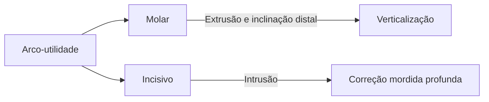
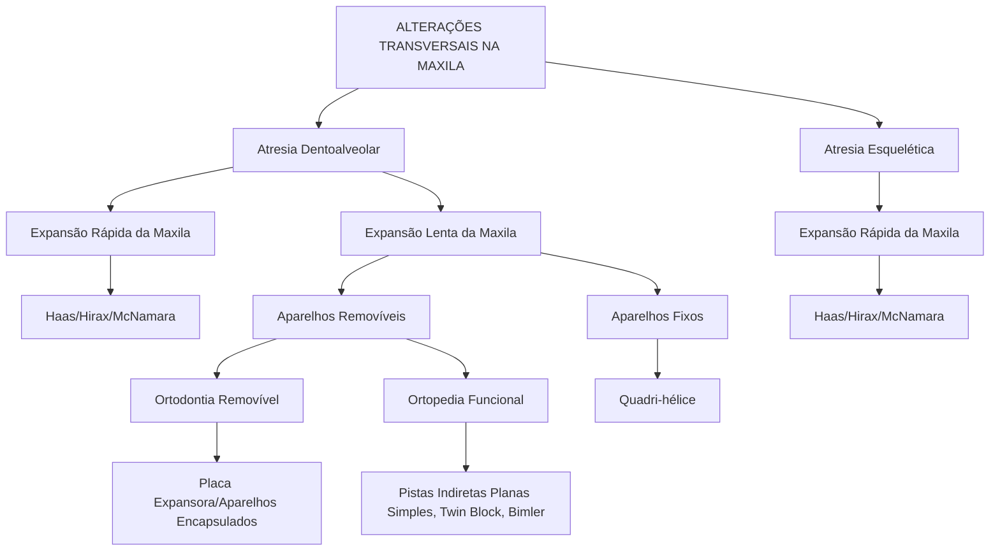
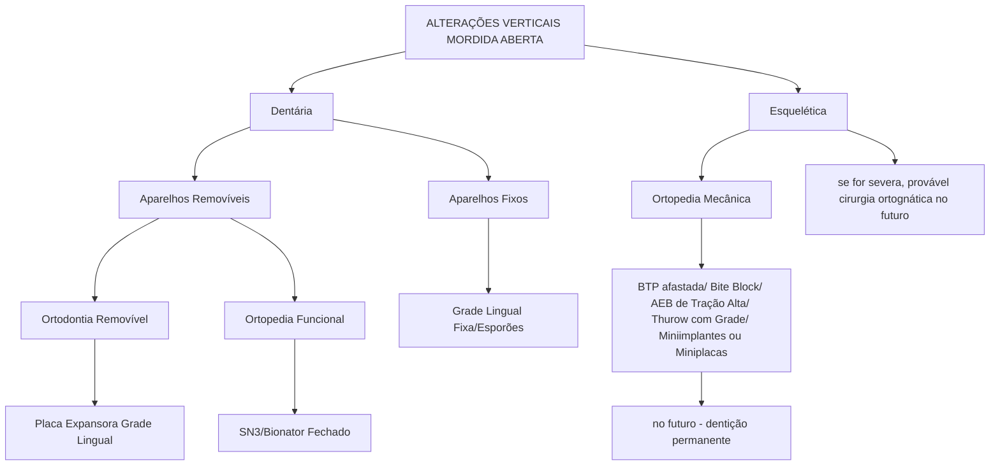
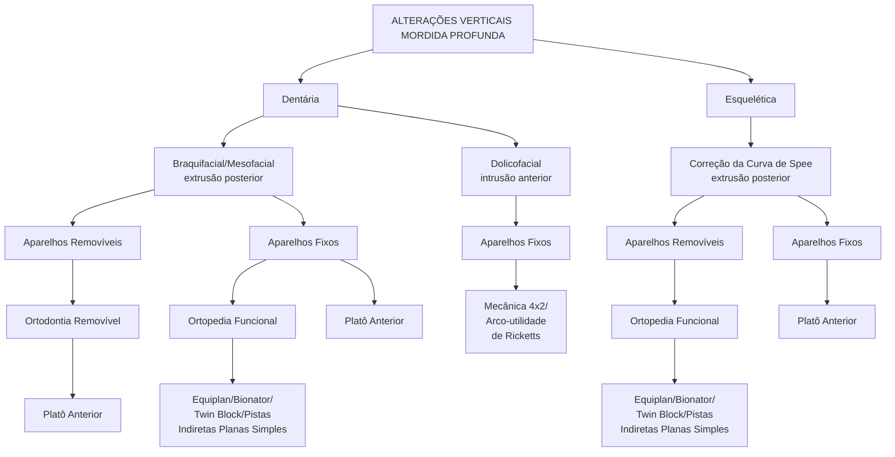
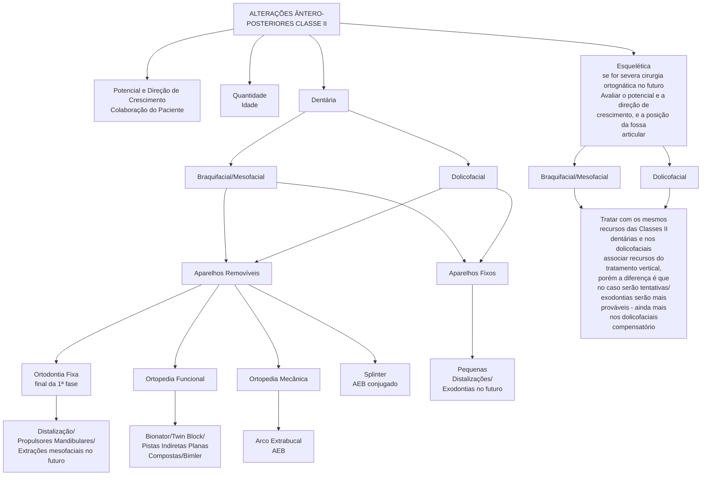
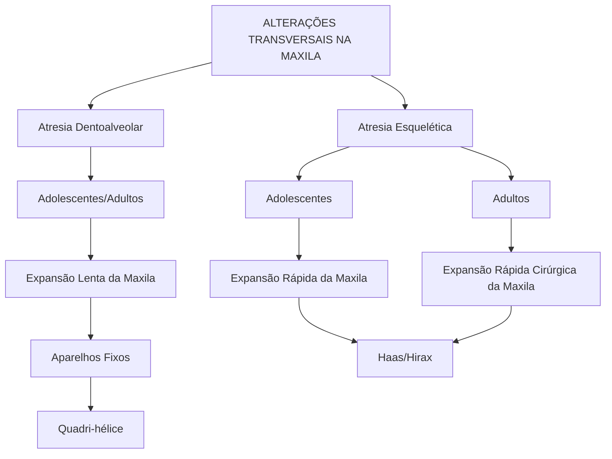
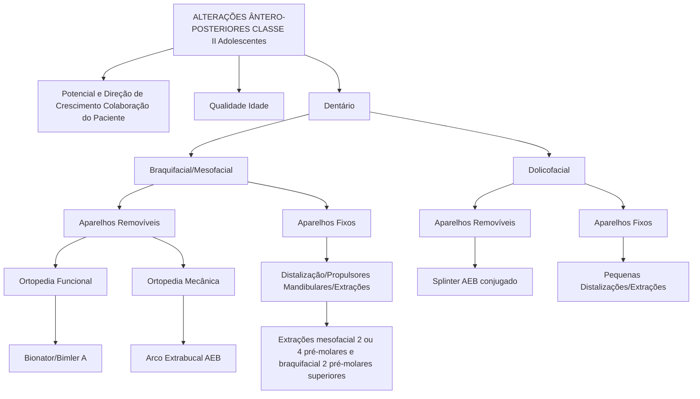
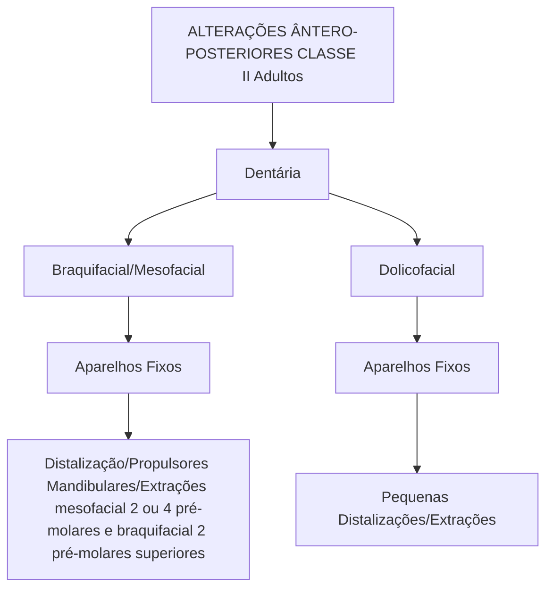
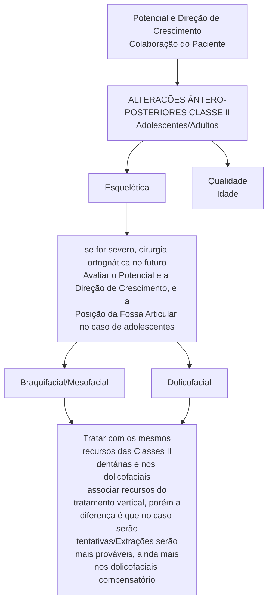
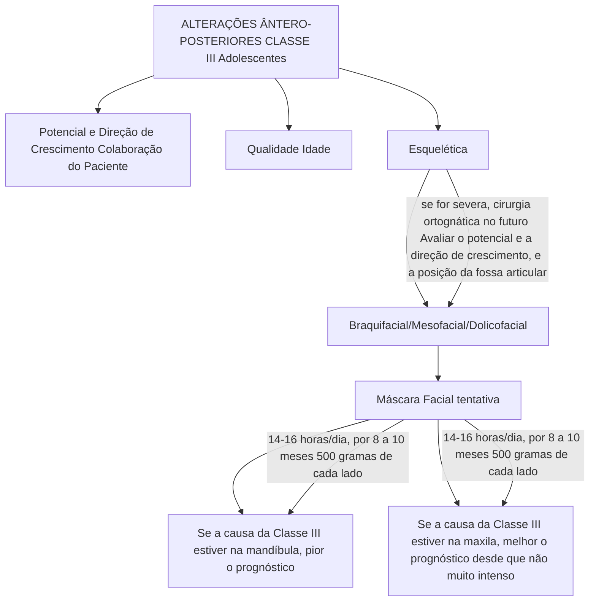

# Protocolos em Ortodontia:
diagnóstico, planejamento e mecânica

NAPOLEÃO
editora

- Straight Wire e suas aplicações
- Ortopedia objetiva e eficiente
- Planejamento para cirurgia ortognática
---
# Sumário

## PARTE 1 - Diagnóstico

### Capítulo 1 - Introdução..............................................................................................................22

### Capítulo 2 - Exame clínico.........................................................................................................30
- Anamnese...................................................................................................................................33
- Exame facial...............................................................................................................................35
- Palpação muscular e articular...................................................................................................35
- Exame intrabucal.......................................................................................................................43

### Capítulo 3 - Exames complementares........................................................................................52
- Radiografias...............................................................................................................................56
- Fotografias.................................................................................................................................58
- Modelos montados em articulador...........................................................................................62
- Tomada do arco facial...............................................................................................................64
- Registro clínico da relação cêntrica..........................................................................................66
- Articulador.................................................................................................................................68
- Principais indicações para montagem em articulador..............................................................72

### Capítulo 4 - Elaboração do diagnóstico facial............................................................................82
- Padrão facial..............................................................................................................................87
- Tipologia facial..........................................................................................................................92
- Alterações verticais...................................................................................................................98
- Alterações no plano frontal......................................................................................................100
- Alterações no plano sagital......................................................................................................102
- Análise da estética do sorriso..................................................................................................106
- Posição horizontal da maxila na análise de Andrews..............................................................114

### Capítulo 5 - Elaboração do diagnóstico esquelético.................................................................118
- Desenho anatômico.................................................................................................................121
- Análise cefalométrica de Björk-Jarabak..................................................................................122
- Análise cefalométrica de Ricketts (norma lateral)..................................................................132
- Medidas complementares........................................................................................................142
- Síntese das análises.................................................................................................................143
- Posição natural da cabeça/vertical verdadeira........................................................................144
- Análise de Jarabak com vertical verdadeira............................................................................148
---
# Capítulo 6 - Elaboração do diagnóstico dentário 150
- Classificação de Angle 153
- Seis chaves para a oclusão normal (ótima) - Andrews 155
- Análise de modelos 159
  - Análise Transversal 159
  - Discrepância dentária 168
  - Análise de Bolton 175

# Capítulo 7 - Elaboração do diagnóstico funcional 182
- Conceitos de oclusão 185
- Respiração, deglutição, fonação e hábitos bucais 191

# PARTE 2 - Planejamento

## Capítulo 8 - Objetivos de tratamento 192
- Objetivos gerais ideais de tratamento 197
- Objetivos individuais relacionados à queixa principal 201

## Capítulo 9 - Planejamento da mecânica 202
- Discrepância total da arcada inferior 207
- Critérios para definir extrações 216
- Mini-VTO dentário com perfil mole 218
- Proposta de movimentação 226
- Caso clínico 231

# PARTE 3 - Tratamento de primeira fase

## Capítulo 10 - Tipos de aparelhos 244
- Ortopedia Funcional dos Maxilares 247
- Ortodontia 266

## Capítulo 11 - Protocolos de tratamento de primeira fase 298
---
# PARTE 4 - Tratamento de segunda fase

## Capítulo 12 - O Straight Wire...............................................312
Introdução...................................................................315
Prescrições..................................................................317

## Capítulo 13 - O porquê da técnica MBT.......................................322
O MBT.......................................................................326
Resumo e conclusão...........................................................336

## Capítulo 14 - Sequência da mecânica.........................................340
Montagem do aparelho.........................................................343
Ancoragem....................................................................352
Alinhamento e nivelamento - correção do overbite.............................365
Fechamento de espaços - correção do overjet..................................374
Renivelamento, finalização, intercuspidação..................................385
Remoção / Contenção..........................................................392
Recidiva.....................................................................395

## Capítulo 15 - Ajuste oclusal................................................398
Técnica de ajuste oclusal....................................................403

## Capítulo 16 - Protocolos de tratamento de segunda fase......................408
Nossos protocolos quanto à decisão das extrações.............................421

## Capítulo 17 - Cirurgia ortognática..........................................436
Objetivos do tratamento conjugado de Ortodontia e Cirurgia Ortognática.......440
Osteotomias e métodos de fixação.............................................449
Ortodontia pré-operatória....................................................450
Casos clínicos...............................................................456

Bibliografia..................................................................464

## Conteúdo do CD

- Introdução
- Mola de verticalização
- Arco segmentado de retração
- Distalizadores
- Placa a vácuo
- Estudo de modelos pré-cirúrgicos
- Conclusão
---
# 1. Introdução
---
# INTRODUÇÃO

Ao recebermos um paciente em nosso consultório, devemos pensar que, naquele momento, este deposita em nós toda sua confiança. E o que devemos oferecer em troca é todo nosso conhecimento passado, de forma clara e objetiva. Ao criarmos protocolos de trabalho, do diagnóstico ao tratamento, estaremos organizando nossas ideias e, com certeza, transmitindo as informações com segurança, o que justamente reforça a relação de confiança, que foi o ponto de partida.

Nós sabemos que ao lidar com seres humanos teremos inúmeras variações possíveis e que para muita gente criar protocolos significa criar "receitas de bolo", deixando de lado a individualização de cada caso. Porém, tão importante quanto encarar o indivíduo como único é tentar enxergar características que o façam ser enquadrado em um grupo, para que possamos oferecer a ele um plano de tratamento com determinada previsibilidade de tempo e resultados.

O uso de protocolos, além de dar segurança ao paciente, facilita o trabalho de equipe, permitindo que se delegue mais. O ortodontista passa mais a gerenciar, usando seu tempo na parte mais importante, que é o estudo dos casos.

Então, para esse paciente que chega, temos que estabelecer o diagnóstico, que nada mais é do que listar os problemas, da maneira mais ampla possível. Traçar nossos objetivos de tratamento, nossas metas, nunca nos esquecendo do item mais importante, que é a queixa principal, o que o trouxe até nós. E, finalmente, criar um plano de tratamento, que ao ser executado, nos permita atingir nossas metas definidas anteriormente.

Nessa sequência de raciocínio, é fundamental salientar que no diagnóstico devemos ser os mais rigorosos possíveis, informando ao paciente tudo o que for relevante. Muitas vezes, os pacientes têm determinadas queixas que não se manifestam inicialmente, e que surgem ao longo do tratamento, o que chamamos "mudança de queixa principal". Na verdade, na maioria das vezes, são problemas preexistentes, que não eram percebidos anteriormente ou eram secundários. A obrigação de enxergar e listar os problemas é do profissional. Arnett cita que "tratamos aquilo que fomos educados a enxergar, então, quanto mais enxergarmos, melhor trataremos nossos pacientes".

Definir o "quanto" tratar, que são as metas, é uma combinação das opiniões do paciente e do profissional. O paciente informando de maneira clara suas queixas. O profissional, com seu conhecimento técnico e experiência, avaliando quais objetivos são fundamentais. Muitas vezes, para atingirmos os objetivos ideais, somos obrigados a lançar mão de planos de tratamento mais invasivos, o que nem sempre é aceito pelo paciente. Porém, devemos tomar cuidado, pois ao sermos demasiadamente minimalistas, muitas vezes, comprometeremos os resultados, o que também não será aceito pelo paciente ao final do tratamento.
---
# Capítulo 1

Esse equilíbrio entre o ideal e o real estabelece como trataremos esse paciente. Por exemplo, num determinado caso podemos tratar executando desde um simples alinhamento de dentes, sem nos preocuparmos com nenhum outro fator, até um tratamento com exodontias e cirurgia ortognática. Uma vez que você trace seus objetivos, seu sucesso de tratamento será atingi-los. O principal item, para isso tudo, chama-se bom senso. Toda vez que propusermos um tratamento considerado mais invasivo ou radical devemos pensar que, se fosse alguém próximo de nossa família, se também iríamos pelo mesmo caminho, assim como, ao escolhermos um tratamento simplista, se o desejaríamos em nossas próprias bocas, mesmo sabendo dos resultados comprometidos. Na verdade, devemos expor com clareza todas as opções ao paciente, com suas vantagens e desvantagens e deixar que ele decida.

Dentro desse raciocínio, criamos o lema:

**"RADICALISMO NO DIAGNÓSTICO, LIBERDADE NO TRATAMENTO".**

Este livro está dividido em 4 partes: Diagnóstico, Objetivos e Plano de Tratamento, Tratamento de Primeira Fase e Tratamento de Segunda Fase, sempre que possível estabelecendo protocolos.

Na primeira parte, Diagnóstico, explanamos que mais importante do que uma grande quantidade de informações será sua qualidade. Em cada item trabalharemos com o que realmente interessa, por exemplo, utilizando a análise facial e cefalométrica de maneira resumida.

Na segunda parte, Objetivos e Plano de Tratamento, demonstramos, através de exemplos clínicos, como unimos as informações de diagnóstico e os objetivos de tratamento, para fazermos a transição para a escolha da mecânica de tratamento, procurando visualizar os resultados finais.

Na terceira parte, Tratamento de Primeira Fase, explicamos, usando protocolos, quando, como e por quanto tempo tratamos nossos pacientes mais jovens, utilizando-se tanto de recursos ortopédicos mecânicos como ortopedia funcional.

E, na quarta parte, Tratamento de Segunda Fase, expomos a mecânica ortodôntica de nosso dia-a-dia, que se baseia principalmente no Straight Wire MBT (técnica preconizada pelos profs. McLaughlin, Bennett e Trevisi) com algumas modificações e no uso associado de recursos de técnicas segmentadas. Abordamos também alguns protocolos de tratamento para os pacientes adolescentes e adultos. O ajuste oclusal também é discutido, apresentando uma técnica essencialmente clínica. Fechamos o livro com um tema atual e importantíssimo, Cirurgia ortognática, brilhantemente explorado pelo Dr. Fernando César Davanzo, que pontua de maneira clara e objetiva os principais itens que o ortodontista deve saber.

O principal objetivo não é criar novos conceitos, mas organizar as ideias.
---
                                   DIAGNÓSTICO                                            Diey. 1.1 Seqiencia partin-
                                  (Lista de problemas)                                    do do diagnóstico ate  pla-
                                                                                         Iu de Lralamenlo escolhida ,
                                                                                          passando pelo ideal  levar-
                                                                                          do eIl cunsideraçdu & queixa

     Dbjetivos gerais idenis de trotomento         Queixo principol                       princiral do paciente.
                (Metas ideois)

                                                    Objetivos individugis de tratomento
                                                            (Metas individuuis)
         Plono de trotomento ideol
           (Muneira de executar)
                                                     Plono de trutamento escolhido
                                                         (Maneira de executar)

DIAGNÓSTICO

DEFINIR A LISTA DE PROBLEMAS

      Para estabelecer uMn diagnústico   orlodôntico currelo, devemos elaborar una lista de problemas bastante
detalhada, contendo as caraclerísticas faciais, esqueléticas e dentárias do paciente, que se distanciam, de algum modo
da normalidade. Inúmeros estudos têm sido realizados, a0 longo dos anos, na tentativa de identificar os padrões dc
normalidade. Quanto mais as características do nosso paciente divergem da normalidadc, mais complexo sc torna
caso. 0 entendimento dessas diferenças, que é 0 diagnóstico, podcrá nos conduzir ao objctivo maior; 0 planejamento do
caso.Entretanto, nem semprc sefaz ncccssaria      correção dc todos os problemas desta lista. Nós veremos no decorrer
deste livro quc algumas características não são possiveis de se corrigirem_ Portanto, entre     diagnóstico (lista de
problemas) C 0planejamento (solução dos problemas) , precisamos estabelecer 0s objetivos do tralamento (mnelas)
que devem incluir apenas as caracteristicas desejáveis € possiveis de serem corrigidas,

              Para realizarmns um bom diagnóstico, devemos ns concentrar em responder a esta pergunta: quem é 0 meu
paciente?" . Em termns gerais, eslamos falando das características físicas e psicológicas que envolvem indivíduo em
questan, Cerlamente, 0 ortadontista dispoe de pouco tempo para coletar um número considerável de informaçoes quc
possa levá-lo a conhecer       paciente detalhadamente Portanto, é fundamcntal quc tenhamos alguns protocolos que nos
auxiliem na difícil tarefa do diagnóstico, facilitando a obtcnção de intormaçães relevantes suticientes, relacionadas às
caracrerísticas daquele pacientc. Nós acreditamos que, seguindo protocolos previamente estabelecidos , garantimos
quc cstas intormaçoes estejam disponiveis no momento do planejamento do caso, sem que haja necessidade de uma
nova consulta para veriticar este ou aquele dado que faltou para fechar 0 planejamenlo. Obter essas informaçues cOm
qualidade e confiabilidade é importantíssimo para a elaboração de urn diagnósticu correto.
---
# COLETA DO MATERIAL PARA ELABORAR O DIAGNÓSTICO

A coleta das informações necessárias ao diagnóstico ocorre em dois momentos distintos:

## No ato do exame clínico

- Anamnese (dados pessoais, saúde geral, saúde bucal)
- Exame facial
- Palpação muscular e articular
- Exame intrabucal (periodontal, dentário, oclusal)

## Através dos exames complementares

- Radiografias
- Fotografias
- Modelos montados em articulador

## Elaboração do diagnóstico

Nós podemos organizar as informações coletadas anteriormente, dividindo-as da seguinte maneira:

- diagnóstico facial - análise facial;
- diagnóstico esquelético - análise cefalométrica;
- diagnóstico dentário - análise de modelos;
- diagnóstico funcional - ATM (Articulação Temporomandibular), RC (Relação Cêntrica), guias funcionais, respiração e deglutição.

Em outros capítulos abordamos cada um destes itens resumidamente, reunindo todo o material necessário para elaborar o diagnóstico.
---
The image contains a detailed anatomical sketch of a human skull in profile, with a red box highlighting a specific area of the jaw. Within this box, a muscle is colored in red. Below the highlighted area is the following text:

## 2. Exame clínico
---
# EXAME CLÍNICO

## ANAMNESE

### QUEIXA PRINCIPAL

Inicia-se pela anamnese, onde são coletados os dados pessoais do paciente, assim como o histórico de doenças, que está relacionado ao estado de saúde geral deste. É recomendado que seja entregue um questionário de saúde ao paciente, juntamente com a ficha de dados pessoais, constando uma lista de possíveis doenças preexistentes, sejam elas sistêmicas, infecto-contagiosas, crônicas ou não, incluindo alergia a medicamentos ou qualquer outra substância, hábitos nocivos à saúde, medicamentos de uso crônico ou recente, além de um espaço para que o paciente possa relatar qualquer possível informação que considere importante de ser mencionada. É fundamental que este questionário seja preenchido de próprio punho pelo paciente, antes de entrar na consulta, datado e assinado. Quando se tratar de indivíduos menores de idade, o questionário deverá ser preenchido e assinado pelo responsável.

O profissional deve ler o formulário antes de iniciar a consulta e questionar mais amplamente sobre os possíveis itens assinalados pelo paciente. Em seguida, inicia-se o histórico odontológico deste, enfatizando a queixa principal, pois veremos que esta será um dos principais objetivos do nosso tratamento, quando lidamos com jovens e adultos. Por outro lado, quando o indivíduo em questão é uma criança, a queixa principal, mesmo vinda dos pais, não é um fator relevante, se entendermos que o tratamento ortodôntico na criança tem como objetivo principal atingir a oclusão ideal, que podemos ver com mais clareza em outros capítulos deste livro.

Em relação à queixa principal, temos que tomar cuidado de, nessa fase do diagnóstico, não se prender somente a ela, pois o paciente na maioria das vezes só observa aquilo que lhe chama mais a atenção. Por exemplo, numa situação em que o paciente apresente dentes desalinhados e plano oclusal alterado, ele normalmente só citará como queixa principal os dentes "tortos". Porém, quando o ortodontista realizar o alinhamento dos dentes estará criando um referencial melhor, que muitas vezes levará o paciente a se queixar de que "agora o sorriso está torto, pois mostro mais gengiva e dentes de um lado do que do outro". A questão é que provavelmente essa situação já existia e não era percebida (Fig. 2.1 a-g). E, se o ortodontista não fez uma montagem em articulador no início e/ou não tem uma boa foto do sorriso, ele terá que tentar convencer o paciente de que o plano oclusal sempre foi alterado. Como diz um ortodontista americano, Amsterdan, "aos ouvidos do paciente tudo o que é falado antes de se iniciar o tratamento é diagnóstico e, tudo que se fala depois é desculpa". Neste ponto, o articulador é um importante instrumento de diagnóstico e marketing, afinal quando comparamos os modelos da documentação ortodôntica com os modelos articulados, que traz muito mais informações, damos mais segurança ao paciente.
---

tulo 2

A - Foto frontal pré-tratamen
to - assimetria: lado esquerdo
mais longo

B - Foto pré-tratamento do sor
riso - plano oclusal mais baixo
lado do esquerdo.

- Foto intrabucal frontal pré-tratamento - queixa prin-    - Foto intrabucal frontal ao final do tratamento - queixa
cipal: dente 13 "para fora".                               principal: "sorriso torto".

C - Foto frontal - assimetria: lado
esquerdo mais longo.

D - Foto frontal com palito - facilita
a visualização da assimetria.

E - Foto de sorriso - plano oclu
sal mais baixo do lado esquerdo.

F - Paciente com as-
simetria facial frontal. Mudan-
ça de queixa principal. Queixa
pré-tratamento: dentes tortos.
Queixa após o alinhamento dos
dentes: sorriso torto (mais baixo
do lado esquerdo). O problema
já existia, mas não era percebido
pela paciente.

---
Durante a anamnese, devemos tentar estabelecer o nível de ansiedade do paciente em relação ao tratamento ortodôntico, assim como o grau de cooperação, pois ambos nos ajudarão a definir o tipo de tratamento proposto, mais adequado ao perfil psicológico deste indivíduo.

## EXAME FACIAL

No decorrer da primeira consulta, devemos aproveitar o contato com o paciente para observar características faciais que possam nos auxiliar no futuro planejamento do caso. Certamente, uma análise facial mais completa será realizada a partir de fotografias frontais e do perfil direito, com os lábios em repouso e sorrindo, permitindo um detalhamento mais preciso das características faciais deste indivíduo. No entanto, algumas sutilezas em relação à expressão dessas características poderão ser mais bem captadas no momento do contato pessoal do que nas fotografias, como exemplo as assimetrias, a dificuldade de selamento labial, a altura da linha do sorriso e outras que, muitas vezes, não são expressas corretamente nas fotografias, levando a falhas no diagnóstico. Essas observações clínicas devem ser anotadas em uma ficha e depois conferidas no momento da análise facial.

## PALPAÇÃO MUSCULAR E ARTICULAR

Antes de iniciarmos um tratamento ortodôntico, é necessária uma avaliação funcional do sistema estomatognático, incluindo a musculatura mastigatória, cervical e as articulações temporomandibulares (ATM). Mesmo os indivíduos assintomáticos podem apresentar determinado grau de disfunção, que poderá ser identificado através de exames de palpação muscular e da ATM, abertura e fechamento de boca e ausculta das articulações (Figs. 2.2 a 2.7).

[A imagem mostra uma ilustração anatômica de um crânio humano em vista lateral, destacando o músculo masseter em vermelho.]

Fig. 2.2 - Músculo masseter - feixes superficial e profundo.
---
otulo 2

> Fig. 2.3 - Músculo temporal - feixes anterior, médio e posterior

[Anatomical illustration of a skull in profile view with the temporal muscle highlighted in red]

> Fig. 2.4 - Músculo pterigóideo medial

[Anatomical illustration of a skull viewed from below and at an angle, with the medial pterygoid muscle highlighted in red]

> Fig. 2.5 - Músculo pterigóideo lateral (não pode ser palpado clinicamente)

[Anatomical illustration of a skull viewed from a front-angled perspective, with the lateral pterygoid muscle highlighted in red]
---
The image contains an anatomical illustration without any accompanying text to transcribe, except for a partial label at the bottom which reads:

culos supra e infra-

The number 31 appears in the bottom right corner of the image.
---
> Fig. 2.7 - Medição da abertura da boca: normal 50 ± 4 mm. Abertura reduzida da boca pode significar disco articular anteriorizado, sem redução, impedindo o côndilo (cabeça da mandíbula) de se deslocar normalmente para a frente. A abertura exagerada normalmente está relacionada à subluxação dos côndilos, onde eles ultrapassam o limite normal. As duas situações podem ocorrer uni ou bilateralmente.

No caso da palpação das ATM, devemos nos lembrar da anatomia da região articular (Fig. 2.8). Basicamente, realizamos a palpação dividindo em 3 zonas: zona 1 - região retrodiscal, zona 2 - região da cápsula articular e zona 3 - região muscular (masseter profundo) (Figs. 2.9 a 2.11). Na parte articular, a zona 1 dói quando há compressão posterior, com o côndilo (cabeça da mandíbula) estando posteriorizado, normalmente causado por contato prematuro que leva a mandíbula a um movimento de fulcro. Dor na zona 2 está relacionada normalmente à inflamação da cápsula articular, em geral causada por algum traumatismo ou por problemas sistêmicos. O tratamento é com antiinflamatório.

Já a zona 3 não é articular, e sim muscular. Durante a palpação, normalmente tocamos o músculo masseter profundo, pois o pterigóideo lateral está mais internamente. Dor nas zonas 1 e 3 reage bem ao tratamento com placa miorrelaxante.

> Fig. 2.8 a-b - Anatomia da ATM.

| Estrutura | Descrição |
|-----------|-----------|
| Cápsula Articular | - |
| Músculo Pterigóideo Lateral - Feixe Superior | - |
| Músculo Pterigóideo Lateral - Feixe Inferior | - |
| Disco Articular | - |
| Região Retrodiscal | - |
---
- Palpação da ATM - 
zona 1 - região retrodiscal
Enervada e vascularizada, levan-
do a dor quando comprimida.
Tratamento: placa estabilizado-
ra ou reposicionadora. O ajuste
oclusal pode ajudar, pois, muitas
vezes, é causado por contato pre-
maturo que leva a um fulcro.

- Palpação da ATM - 
zona 2 - região da cápsula arti-
cular. Dói quando está inflamada.
Percebe-se um inchaço. Pode ser
causado por um traumatismo ou
por problemas sistêmicos.
Tratamento: anti-inflamatório por
3 a 5 dias.

- Palpação da ATM - 
zona 3: região muscular/masseter
profunda. Dói pela tensão muscu-
lar, frequentemente causada pelo
bruxismo cêntrico (apertamento
dos dentes).
Tratamento: placa estabilizadora.
---
As desordens musculares são as mais comuns e podem estar associadas a problemas oclusais, tais como desequilíbrio ou ausência de guias funcionais, diferenças consideráveis entre a posição de relação cêntrica e a máxima intercuspidação habitual, contatos prematuros etc. A correção das maloclusões tende a melhorar estas desordens, já que promovem o equilíbrio funcional, favorecendo o equilíbrio muscular.

Dentre as desordens articulares, as mais comuns são os deslocamentos do disco articular (Fig. 2.14) que, apesar de muitas vezes assintomáticos, precisam ser identificados antes do início do tratamento, pois não tendem a desaparecer com a correção da maloclusão.

Fig. 2.12 - Disco posicionado corretamente. No início da abertura da boca só ocorre rotação do côndilo, sem deslocamento do conjunto côndilo-disco.

[A imagem mostra uma ilustração anatômica detalhada da articulação temporomandibular. O disco articular está posicionado corretamente entre o côndilo mandibular e a fossa articular do osso temporal. A ilustração destaca as estruturas ósseas em tons de cinza, o disco articular em bege, e os músculos adjacentes em vermelho.]
---
>Fig. 2.13 - Durante a abertura da boca (translação da ATM) o disco acompanha a trajetória do côndilo.

[Anatomical illustration of TMJ during initial stage of mouth opening]

▲2.13

eslocamento do dis-
rior; com redução: o
lixe durante a aber
o se desloca no fe-
chamado clicking

>Fig. 2.14 - [Partial caption visible] co para ante
disco se en
tura da boc
chamento.
recíproco.

[Anatomical illustration of TMJ during further stage of mouth opening]

▲2.14
---
Para os pacientes sintomáticos, o mais indicado é procurar eliminar a dor antes do tratamento ortodôntico, através de terapêuticas reversíveis, como por exemplo o uso de aparelhos oclusais (placas miorrelaxantes ou estabilizadoras) ou similares (Figs. 2.15 e 2.16).

![Figs. 2.15 e 2.16 - Placa estabilizadora: deve ser lisa na superfície oclusal e ter guias para os caninos. Pontos devem ser mais fortes na região posterior e mais leves na anterior. A placa é usada no período noturno, num total de 8 a 12 horas, por 3 a 4 meses. Se a dor for de origem muscular e houver relação com a oclusão, deve melhorar em até 60 dias.

Em pacientes sintomáticos que não sejam submetidos a tratamento ortodôntico ou onde seja necessário o uso de placa pós-tratamento, podemos utilizá-la, após os 3 ou 4 meses iniciais, duas vezes por semana, por toda vida.]

De qualquer forma, sendo o indivíduo sintomático ou assintomático, devemos proceder com a palpação muscular e articular, anotando em uma ficha clínica o grau de disfunção relatado.
---
# EXAME INTRABUCAL

## EXAME PERIODONTAL

Antes de iniciarmos o exame da oclusão, não podemos nos esquecer de avaliar as estruturas periodontais de suporte e de proteção, as quais estão diretamente relacionadas ao movimento ortodôntico. Estas estruturas devem apresentar-se saudáveis para que possa ocorrer a remodelagem dos tecidos duros e moles durante a movimentação dos dentes. Quando os tecidos periodontais estão doentes, há a disseminação da infecção ao longo do trajeto do movimento dental. Lembrando-se que saúde periodontal é diferente de nível de inserção, isto é, podemos ter uma recessão gengival com perda de inserção clínica, porém temos tecidos saudáveis (Fig. 2.17). Para entendermos melhor esta afirmação, é necessário conhecermos o periodonto, que podemos dividi-lo em: de sustentação e de proteção.

[A imagem mostra uma fotografia intraoral de dentes superiores com gengiva saudável, mas com alguma recessão gengival visível.]

O periodonto de sustentação é constituído de estruturas que mantêm os dentes na base óssea, ou seja, a cortical óssea do alvéolo e da crista, chamada lâmina dura, o cemento radicular, a própria base óssea e o ligamento periodontal. Este é composto pelos mecanoreceptores, responsáveis pela dissipação das forças exercidas sobre o dente. Os proprioceptores são responsáveis pelo tato e por células mesenquimais indiferenciadas, ou células-tronco, capazes de se diferenciarem em células produtoras de qualquer estrutura que necessitar de reparo, como osso, ligamento ou cemento radicular.

Radiograficamente, podemos observar a presença da lâmina dura, que indica saúde óssea, ou sua descontinuidade, "esfumaçamento", indicando que estamos diante de uma área doente ou em processo de reparo. O espaço pericementário deve medir em torno de 0,25 mm de espessura e quando este se encontra aumentado, significa que alguma sobrecarga de forças está ocorrendo, seja por traumatismo oclusal ou por movimento ortodôntico. Ainda devemos observar trabeculado ósseo normal (Fig. 2.18).

[A imagem mostra uma radiografia dental com as seguintes estruturas identificadas:
1. Lâmina dura
2. Osso alveolar
3. Espaço do ligamento periodontal]
---
# Capítulo 2

No periodonto de proteção, devemos observar a gengiva e a mucosa alveolar. A gengiva possui duas porções, a gengiva marginal livre, que faz a parede externa do sulco gengival e a gengiva inserida, que confere estabilidade da margem gengival de maneira proporcional à sua quantidade e qualidade. Em geral, o tecido gengival possui uma coloração rósea e anatomia festonada, enquanto a mucosa alveolar é mais avermelhada e flácida.

Em exame clínico periodontal, temos como padrão de sondagem um sulco gengival com até 3 milímetros de profundidade, pois esta medida permite uma auto higienização adequada (Fig. 2.19).

Fig. 2.19 - A sondagem periodontal é muito importante para se avaliarem as estruturas de suporte. Não deve ocorrer sangramento, e a profundidade de sulco não deve ultrapassar 3 mm.

A ausência de sangramento à sondagem indica saúde dos tecidos moles juntamente com achados radiográficos, podemos determinar se o paciente está saudável periodontalmente; então, apto ao tratamento ortodôntico. Caso haja indícios de doença periodontal, como: inflamação gengival, sangramento gengival, sondagem profunda, defeitos ósseos, mobilidade dentária acentuada ou recessão dos tecidos marginais, se faz necessária a avaliação deste paciente por um periodontista.

É importante ressaltar que, em alguns casos de doenças periodontais agressivas, o nível de inflamação gengival e acúmulo de placa bacteriana são relativamente baixos, e a perda óssea muito extensa. Isto chama a atenção para uma sondagem correta e não só inspeção visual do periodonto do paciente e para o uso de radiografias periapicais dos molares e incisivos, pois a radiografia panorâmica apresenta distorções consideráveis, podendo mascarar defeitos ósseos (Fig. 2.20 a-d).
---
**Fig 2.20 a-d - Caso de periodontite agressiva, com pouca inflamação clínica.**

a

b c

d
---
O conhecimento das estruturas de vedação do periodonto de proteção, ou espaço biológico, é importante para o ortodontista, pois quando fazemos um movimento vertical, isto é, intrusão ou extrusão dos dentes, estamos atuando ativamente nestas estruturas. No caso de dentes restaurados, podemos mover a margem dentária saudável para uma distância do osso que permita que a restauração não prejudique esta vedação, possibilitando a presença de um tecido saudável. O espaço biológico é constituído de: epitélio juncional, que forma a base do sulco gengival e a inserção de fibras conjuntivas diretamente da gengiva ao cemento radicular, com cerca de 1 mm para cada estrutura, demandando 3 mm de dente saudável acima do nível ósseo para que ocorra uma vedação adequada e a formação de pelo menos 1 mm de sulco gengival (Fig. 2.21 a-b).

Fig. 2.21 a-b - Espaço biológico da unidade dentogengival

A imagem mostra duas ilustrações anatômicas de um dente e suas estruturas circundantes:

a) Uma visão geral de um dente mostrando a coroa, raiz e tecidos gengivais circundantes.

b) Uma visão ampliada e detalhada da junção dentogengival, mostrando:

| Estrutura | Medida |
|-----------|--------|
| Sulco gengival | 1 mm |
| Epitélio juncional | 1 mm |
| Inserção conjuntiva | 1 mm |

Estas ilustrações demonstram visualmente o conceito de espaço biológico descrito no texto.
---
A recessão gengival muitas vezes está relacionada a tratamentos ortodônticos. Para fazermos uma análise do risco de cada paciente, é necessário entender que o padrão periodontal e o tipo de movimento ortodôntico requerido determinam o risco de recessão gengival do tratamento. Isto é, existem os fatores predisponentes e desencadeantes das recessões dos tecidos marginais.

| Fatores predisponentes | Fatores desencadeantes |
|------------------------|------------------------|
| Tábua óssea fina | Inflamação |
| Deiscências e fenestrações | Próteses mal adaptadas |
| Malposicionamento dentário | Lacerações |
| Interferência de bridas e freios | Escovação traumática |
| Ausência de gengiva inserida | Hábitos |
| Mobilidade dentária | Movimento ortodôntico para fora do processo alveolar |

Podemos classificar os fatores de risco de recessão gengival associados à ortodontia quanto à sua gravidade.

| Fatores de baixo risco | Fatores de alto risco |
|------------------------|------------------------|
| Movimento dentário dentro do osso alveolar | Movimento dentário fora do osso alveolar |
| Gengiva grossa e fibrosa | Gengiva fina |
| Tendência a fechamento de espaço | Expansão rápida da maxila |

Fig. 2.22 - Padrão periodontal de baixo risco de recessão
---
Capítulo 2

▶ Fig. 2.23 a,b - Padrão periodontal de alto risco de recessão gengival. Síntese muito fina.

◀2.23 a

◀2.23 b

▶ Fig. 2.24 - Devemos fazer o tracionamento das bridas musculares e observar se ocorrem isquemias na gengiva até próximo do dente, o que indica falta de uma faixa adequada de gengiva inserida.

◀2.24
---
Quanto maior o número de fatores de risco predisponentes e desencadeantes associados, maior o risco de uma recessão gengival surgir no decorrer do tratamento. Estas situações devem ser previstas sempre que possível, evitando "surpresas" desagradáveis e possíveis indisposições entre o paciente e o profissional. Uma correção prévia ou tardia da situação deve ser considerada, dependendo do nível de risco diagnosticado e do entendimento da situação pelo paciente. Quando um dente apresenta recessão gengival e será movimentado ortodonticamente, devemos avaliar como será o seu movimento; a favor do osso ou não. Por exemplo: um dente que apresenta infravestibuloversão poderá ser corrigido previamente com o procedimento ortodôntico para depois receber enxerto gengival, pois o movimento dentário é a favor da base óssea, gerando um baixo risco de piora da recessão gengival (Fig. 2.25 a-c).

**Fig. 2.25 a-c** - Um dente em infravestibuloversão poderá ser corrigido previamente com procedimento ortodôntico para depois receber enxerto gengival. Note que do início do movimento ortodôntico até levar o dente à sua altura correta no plano oclusal não houve aumento da recessão gengival. O movimento deve ser realizado com forças leves.

[A imagem mostra três fotografias clínicas de dentes em diferentes estágios de tratamento ortodôntico]

a. Fotografia mostrando dentes com recessão gengival antes do tratamento ortodôntico.

b. Fotografia mostrando dentes com aparelho ortodôntico azul aplicado, indicando o início do tratamento.

c. Fotografia mostrando dentes com aparelho ortodôntico metálico, representando uma fase mais avançada do tratamento.
---
Capítulo 2

▶ Fig. 2.26 a-b - Caso com recessão gengival. Após a enxertia, notar a melhora de quantidade e qualidade gengivais.


Algumas vezes, tratamos ortodonticamente pacientes periodontais. Mas o que significa isso? Quer dizer que o paciente apresenta algum grau de perda óssea, porém está periodontalmente compensado, sem a doença ativa. Alguns motivos que justificam o tratamento desse tipo de paciente são:

* alinhamento dos dentes, favorecendo a higienização, estética e função;
* melhor posicionamento dos dentes dentro do osso alveolar, que favorece a estabilidade;
* possibilidade de correção de alguns defeitos ósseos;
---
# EXAME DENTÁRIO

Em seguida, a análise completa da dentição identificará problemas como cáries, restaurações mal-adaptadas, dentes ausentes, supra e extranumerários e qualquer outro tipo de alteração significante do ponto de vista ortodôntico.

# EXAME OCLUSAL

Ainda como parte do exame intrabucal, o exame oclusal deve ser dividido em duas etapas: oclusão estática e oclusão funcional (dinâmica). Devemos proceder com o exame oclusal estático, tendo em vista os conceitos de oclusão ideal.

No exame oclusal funcional, devemos observar a dinâmica da oclusão; em outras palavras, como os dentes superiores e inferiores relacionam-se durante os movimentos da mandíbula. O ciclo mastigatório promove contatos dentários fora da posição de máxima intercuspidação habitual (MIH), nos chamados movimentos excursivos da mandíbula. Esses movimentos deveriam ser orientados pelas guias funcionais, garantindo a proteção dos dentes posteriores contra forças incidentes fora do longo eixo dos dentes. A observação clínica desses movimentos excursivos da mandíbula traz informações importantes a respeito das guias funcionais. Considerando-se que os modelos de estudo, mesmo quando montados em articulador semi-ajustável, não serão capazes de reproduzir a realidade da boca com precisão, algumas anotações a respeito das características funcionais atuais do paciente podem favorecer o futuro diagnóstico.

Esses conceitos estão discutidos detalhadamente nos capítulos 6 e 7.
---
# 3.
## Exames complementares
---
# EXAMES COMPLEMENTARES

Com certeza, o diagnóstico é o fator mais importante num tratamento. E, basicamente, desenvolveremos o tema da maneira como fazemos em nosso dia-a-dia de consultório. Normalmente, apresentamos o plano de tratamento na 3ª sessão de consulta. Na 1ª sessão, realizamos a anamnese, onde um dos itens mais importantes é a queixa principal do paciente. Fazemos também o exame clínico inicial e solicitamos radiografias ou a documentação ortodôntica. Na 2ª sessão, coletamos dados como modelos a serem montados em articulador e fotografias. Entre a 2ª e a 3ª sessão, fazemos os estudos dos modelos, a análise cefalométrica e das fotos, para aí podermos apresentar as opções de tratamento com suas vantagens e desvantagens.

É importante salientar que todo esse material complementar (modelos de estudo, radiografias, traçados cefalométricos e fotografias) deve ser da mais alta qualidade, para não comprometer o diagnóstico.

## 1ª SESSÃO

- Anamnese
- Exame clínico
- Solicitação de radiografias ou documentação ortodôntica

## 2ª SESSÃO:

- Moldagem para a obtenção de modelos
- Tomada do arco facial
- Registro da relação cêntrica
- Fotografias

## 3ª SESSÃO

- Apresentação do diagnóstico e do plano de tratamento
---
Capítulo 3

# RADIOGRAFIAS

Os exames radiográficos fazem parte dos chamados exames complementares, sendo solicitados rotineiramente. Incluem radiografias panorâmica, periapicais completas, interproximais e a telerradiografia lateral cefalométrica, utilizada como base para os traçados cefalométricos (Fig. 3.1 a-d).

> Fig. 3.1 a-d - Exame radiográfico pré-tratamento obrigatório:
> a - panorâmica - visualização do posicionamento geral dos dentes, nível ósseo, integridade óssea, anatomia condilar;
> b-c - periapicais - morfologia radicular, integridade das coroas;
> d - telerradiografia lateral cefalométrica - posição dos incisivos nas bases ósseas, divergência das bases ósseas, plano oclusal, espaço aéreo nasofaríngeo, adenoides, etc.

[Four dental X-ray images labeled a, b, c, and d are shown, corresponding to the descriptions in the figure caption]
---
Algumas vezes, podemos lançar mão de radiografias oclusais para avaliar, por exemplo, dentes impacta-
dos (Fig. 3.2).

Fig. 3.2 - radiografia oclusal - visualização de dentes impactados.

[A imagem mostra uma radiografia oclusal dos dentes frontais superiores]

Radiografia de mão e punho também pode ser solicitada para determinar a idade óssea através do índice carpal (Fig. 3.3 a-b).

Fig. 3.3 a-b
a - radiografia de mão e punho
b - curva de crescimento puberal (índice carpal).

[A imagem (a) mostra uma radiografia de mão e punho]

[A imagem (b) mostra um gráfico representando a curva de crescimento puberal]

| Período (anos) | cm/ano |
|----------------|--------|
| INÍCIO S.C.P   | ±5     |
| PVC P           | ±10    |
| FIM S.C.P      | ±5     |
| TERM. CRESC.   | 0      |

Legenda do gráfico:
- FDs: Início da curva
- FP: Ponto intermediário ascendente
- FMp: Ponto intermediário ascendente
- FPcap: Pico da curva
- Rcap: Ponto logo após o pico
- M-FDui: Ponto intermediário descendente
- FDui: Ponto intermediário descendente
- FPui: Ponto intermediário descendente
- FMui: Ponto final da curva
- Rui: Ponto final da curva

O gráfico mostra a evolução do crescimento ao longo do tempo, com um pico (PVC P) e depois um declínio até o término do crescimento (TERM. CRESC.).
---
Capítulo 3

Outros exames de imagem, como tomografia ou ressonância magnética, são interessantes em situações específicas. Tomografias com reconstrução em 3D dão uma boa noção da arquitetura óssea que envolve os dentes. Exames de ressonância magnética permitem a visualização de tecidos moles, tornando-se interessantes como complemento de diagnóstico nas desordens do disco articular (Fig. 3.4).

Fig. 3.4 - Ressonância magnética da ATM direita mostrando remodelagem do côndilo (cabeça da mandíbula) e disco articular um pouco anteriorizado.

[A imagem mostra uma ressonância magnética da articulação temporomandibular (ATM) direita. Há setas amarelas apontando para uma estrutura específica, provavelmente o disco articular. A imagem é em preto e branco, com várias estruturas anatômicas visíveis. No canto superior direito, há uma marcação "H", no canto inferior direito "P", e uma escala de "2 cm" é mostrada. No canto inferior esquerdo, há uma pequena imagem de referência.]

## FOTOGRAFIAS

Para a realização de um exame fotográfico adequado, torna-se necessária a padronização de cada uma das tomadas, tanto da sequência intra como da extrabucal.

Quando o profissional adquire a prática e a habilidade exigidas nas fotografias ortodônticas, torna-se possível monitorar o caso clínico através de sequências fotográficas tomadas ao longo do tratamento.

Não são necessários equipamentos onerosos e sofisticados, ao contrário, câmeras digitais simples têm se mostrado eficazes no que diz respeito à definição da imagem. Acima de 5.0 mega pixels é possível obter imagens digitais com resultados excelentes. Aconselhamos o uso de câmeras que apresentem o modo "manual" como recurso, possibilitando o ajuste de abertura e velocidade do obturador.
---
É evidente que equipamentos profissionais atingem resultados ainda melhores, principalmente em relação à estabilidade da cor de uma foto para outra, além de outros recursos como o flash circular, que garantem imagens sem sombras. As desvantagens das câmeras profissionais são o custo alto e a pouca versatilidade, devido ao tamanho e peso do equipamento.

É importante que os afastadores utilizados evitem que lábios e bochechas interfiram no enquadramento das estruturas que queremos registrar.

A sequência mínima inicial envolve 5 fotos extrabucais (Fig. 3.5 a-e) e 7 intrabucais (Fig. 3.6 a-g), podendo ser realizadas ainda as fotos dos movimentos funcionais (Fig. 3.7 a-g). Além da câmera, utilizamos afastadores frontais (infantil e adulto), laterais (infantil e adulto) e espelho metálico.

| Fotos da face |
|---------------|
| Na foto do perfil e perfil do paciente sorrindo utilizamos um prumo para obter a vertical verdadeira (Caps. 4 e 5). Na foto frontal do sorriso, obtemos um close devido à dificuldade de focar os dentes, sendo uma foto muito importante para definir a estética do sorriso (Cap. 4). |

[A imagem mostra uma série de fotografias de uma pessoa em diferentes ângulos, incluindo frontal, perfil e close-up do sorriso, demonstrando técnicas de fotografia odontológica.]
---

PLANO 3

[Image grid containing 7 dental photographs showing various views of teeth and oral cavity]

* Foto 28/01/11 - Fotos intraorais

---
1. - Lateralidade direita.
2. - Lateralidade esquerda.

3. - Protrusiva.

4. - Lateralidade direita - lado de trabalho.
5. - Lateralidade direita - lado de não-trabalho.

6. - Lateralidade esquerda - lado de não-trabalho.
7. - Lateralidade esquerda - lado de trabalho.

Figs. 5.2 (a-g) - Fotos intrabucais dos movimentos funcionais.
---
Capítulo 3

## MODELOS MONTADOS EM ARTICULADOR

A 2ª sessão é uma consulta rápida, 20 minutos são suficientes para que sejam realizados os procedimentos citados previamente.

* Moldagem para a obtenção de modelos de estudo fiéis das duas arcadas, reproduzindo os dentes, o fundo do vestíbulo, o palato e a porção lingual do rebordo inferior.
* Tomada do arco facial para registrar a posição da maxila em relação à base do crânio.
* Registro da relação cêntrica (RC) que possibilita a montagem do modelo inferior no articulador, reproduzindo com precisão, a posição de RC, quando os côndilos (as cabeças da mandíbula) estão posicionados corretamente na fossa mandibular.

As principais justificativas da importância da montagem em articulador são:

* permite uma análise mais precisa e global do caso;
* fundamental para a visualização da oclusão fora da boca;
* reproduz a posição espacial dos modelos (visão tridimensional);
* documentação do caso;
* análise oclusal em RC (avaliando a discrepância em relação à mordida habitual);
* observação dos movimentos mandibulares;
* vista lingual do engrenamento dentário;
* possibilidade de set-up, enceramento e ajuste oclusal diagnóstico;
* avaliação de plano oclusal em vistas frontal e lateral;
* avaliação de assimetrias ântero-posteriores (plano frontal - vista axial);
* instrumento importante de marketing - o paciente vê como um diferencial.

Segundo Dawson, é impossível desenvolver uma relação oclusal harmoniosa sem primeiro determinar se cada côndilo está posicionado corretamente em sua fossa. Para Okeson, a RC pode ser entendida como uma "posição ortopedicamente estável" do complexo côndilo-disco dentro da cavidade glenóide.

A RC caracteriza-se por ser uma posição mandibular confortável, estável e possível de ser repetida quantas vezes necessárias. Quando transferida para o articulador, permite a avaliação da correta relação esquelética e dentária.

O articulador nos permite uma visão melhor da oclusão, pois na boca ficamos limitados pelos lábios, bochechas e língua.
---
# NOMENCLATURAS

- RC: Relação Cêntrica - posição musculoesquelética; não depende dos contatos dentários; é estável e reprodutível.

- MIH: Máxima Intercuspidação Habitual - posição de mínima dimensão vertical; apresenta o maior número de contatos para a estabilização mandibular.

- OC: Oclusão Cêntrica - o mesmo que MIH (utilizada desta forma nos EUA).

Podemos observar que, a maioria da população, que não foi submetida a um tratamento ortodôntico, reabilitação protética ou ajuste oclusal, no instante em que a mandíbula é fechada, existe um primeiro contato dentário, chamado contato prematuro. Este contato seria considerado danoso ao sistema mastigatório caso acontecesse consecutivamente durante a função mandibular. Porém, o sistema proprioceptivo trabalha eficazmente, guiando a mandíbula para uma "posição adquirida", evitando estes contatos prematuros, que é fácil ser enganado, acreditando que a posição desviada é a correta.

Dessa maneira, a mandíbula estando fora da posição de RC torna o diagnóstico impreciso, resultando, muitas vezes, em tratamento incorreto. Podem ocorrer alterações significativas na relação ântero-posterior, vertical e até transversal.

A diferença da posição mandibular contada a partir do primeiro contato em relação cêntrica (RC) até a posição de máxima intercuspidação habitual (MIH) é denominada discrepância RC/MIH. Devemos lembrar que quanto maior esta discrepância, maiores serão as alterações da relação maxilomandibular, podendo comprometer significativamente o diagnóstico. Em torno de 15 a 20% dos pacientes apresentam uma diferença relevante entre RC e MIH. Porém, como já vimos, avaliar a RC é apenas um dos itens para justificar o uso de articulador. Existem muitos outros. Normalmente, o uso de articulador em Ortodontia é criticado por quem nunca o usou ou o usou pouco, e trabalhos científicos sobre o assunto são muito subjetivos. Na verdade, para falarmos que algo funciona temos que conhecer bem o assunto, mas para falar que não funciona temos que conhecer muito mais.

É importante ressaltar que o diagnóstico deve ser feito em RC, porém nem sempre o tratamento será realizado em RC, pois, algumas vezes, temos que ser muito invasivos, o que pode não ser aceito pelo paciente. É o exemplo do uso do lema "radicalismo no diagnóstico, liberdade no tratamento". Podemos pensar dessa maneira, principalmente em pacientes assintomáticos. Temos que montar em articulador para estarmos preparados e documentados para possíveis mudanças que podem ocorrer. Terminar um tratamento com a mandíbula fora de RC não é o ideal, mas não necessariamente levará a problemas. Isso dependerá da capacidade adaptativa de cada um.
---
[Diagram of jaw and teeth alignment]
a - MIH.                              b - RC

---
▶ Fig. 3.10 - Arco facial no paciente; vista frontal. Uma vez fixados todos os parafusos firmemente, não há problema que quando o paciente tire a mão o conjunto se desloque para baixo, desde que todo junto. Na verdade, a relação entre o plano oclusal da maxila e o plano de Frankfurt já está tomada.

<3.10

▶ Fig. 3.11 - O articulador permite avaliar as arcadas numa vista tridimensional. Isso nos traz informações muito mais completas do que obtemos nos modelos que acompanham as documentações ortodônticas.

<3.11
---
# REGISTRO CLÍNICO DA RELAÇÃO CÊNTRICA

A manipulação correta da mandíbula para a tomada da posição de RC é, com certeza, o passo mais importante em todo o processo de montagem em articulador. Sugerimos o método executado com apenas uma das mãos. Não devemos exercer pressão para trás, pois senão o músculo pterigóideo lateral é ativado como defesa para impedir um deslocamento patológico dos côndilos para posterior. O paciente deve estar bem reclinado (em torno de 30° em relação ao solo). O movimento é suave. Se houver dificuldade, podemos colocar roletes de algodão entre os dentes e pedir para o paciente morder por 5 minutos ou fazer um jig de acrílico liso e plano para que o paciente use por mais tempo ou até por dias. É interessante que com um bom papel articular registre-se o primeiro contato que obtivermos na manipulação clínica, para comparar com o resultado do articulador (Fig. 3.12 a-b). Este é um método seguro para conferência da montagem dos modelos no articulador.

**Fig. 3.12 a-b - Manipulação da mandíbula**: Pode ser realizada com uma mão só ou ser bimanual. O importante é não pressionar a mandíbula para trás, pois senão o músculo pterigóideo lateral entra em atividade como defesa para evitar compressão da zona bilaminar (região posterior da ATM) e com isso o paciente não relaxa a mandíbula.

Dawson cita que o propósito do registro da mordida em RC é capturar em algum material a relação da mandíbula com a maxila quando os côndilos estão em sua posição de eixo terminal. Para isso utilizamos a cera Delar®.

**Fig. 3.13 - Durante a manipulação mandibular em RC, numa abertura até cerca de 15 mm, clinicamente os côndilos executam movimento de rotação em torno de seu eixo, sem sofrer deslocamento.**
---
O método aqui descrito para registro da RC é chamado power centric. Consiste de duas etapas:

1. confecção de um jig para determinar a relação maxilomandibular (em RC);
2. duas lâminas de cera na região posterior para estabilizar os modelos no momento da montagem da parte inferior do articulador.

A cera Delar® deve ser amolecida em água aquecida a uma temperatura próxima de 55°C, por alguns minutos.

| Imagem | Descrição |
|--------|-----------|
| 4-14   | Jig na região anterior para o registro da RC (cera dobrada em 4 partes) - O registro deve ser feito numa abertura vertical de 2 mm na região posterior. |
| 4-15   | A RC já foi registrada. Levamos à boca o Jig anterior, já resfriado, juntamente com a cera posterior (dobrada em duas partes) que está amolecida. O registro posterior não deve exceder o limite da superfície vestibular dos dentes. |

As ceras são resfriadas e testadas novamente na boca, para se ter a certeza de que a fase clínica da montagem do articulador está correta.

| Imagem | Descrição |
|--------|-----------|
| 4-6    | O registro deve se ajustar aos modelos tão perfeitamente como se ajusta aos dentes na boca. Eliminar bolhas positivas dos modelos e possíveis retenções na cera. |
---
Capítulo 3

## ARTICULADOR

Dos ítens mais importantes encontrados nos articuladores semi-ajustáveis importados, os mais úteis são a trava de cêntrica (dispositivo que permite travar o articulador com os côndilos bem assentados, evitando assim possíveis erros de montagem na fase laboratorial) e o garfo que não é soldado no arco facial (facilita a transferência do modelo superior para o articulador, uma vez que não é necessário levar todo arco facial ao articulador). Esses recursos são encontrados em alguns articuladores nacionais, por exemplo, nos articuladores Bioart® profissionais (Fig. 3.17 a b).

Normalmente, utilizamos "bolachas" de plástico para fixar os modelos, uma vez que essas ficarão presas aos modelos para sempre, como documentação. Não faria sentido ter o trabalho para realizar a montagem em articulador e depois destruí-la, soltando a "bolacha". Inclusive, sempre que quisermos fazer uma comparação durante ou até após o tratamento, teremos apenas que rosquear novamente as "bolachas" com os modelos no articulador.

| Figura | Descrição |
|--------|-----------|
| Fig. 3.17 a | Articulador Bioart® 2000 profissional. |
| Fig. 3.17 b | Articulador Bioart® AX7 profissional. |

A imagem mostra dois modelos de articuladores:

1. O primeiro (3.17 a) é o Articulador Bioart® 2000 profissional. Ele possui uma estrutura metálica com partes em azul. Na parte superior, há uma indicação para "Bolachas de plástico", que são usadas para fixar os modelos. À esquerda, há uma indicação para "Trava de cêntrica".

2. O segundo (3.17 b) é o Articulador Bioart® AX7 profissional. Este modelo tem uma estrutura mais compacta e ergonômica. À direita, há uma indicação para "Garfo sem arco facial".

Ambos os modelos apresentam características mencionadas no texto, como a trava de cêntrica e o garfo sem arco facial, que são considerados recursos úteis nos articuladores semi-ajustáveis.
---
Fig. 3.18 a-c - Montagem dos modelos superior e inferior no articulador Panadent:

a) Image a
b) Image b
c) Image c

a) Montagem do modelo superior - apoio por baixo do garfo para evitar distorções - Frankfurt paralelo ao solo.

b) Montagem do modelo inferior usando a cera Delar.

c) Modelos montados no articulador.

Os articuladores semi-ajustáveis mais sofisticados facilitam o manuseio, além de nos permitirem graficamente registrar a diferença existente entre a posição condilar de RC e de MIH (habitual), gráfico este chamado "indicador de posição condilar". Essa informação é utilizada por três razões:

- Avaliar a discrepância condilar ântero-posterior e vertical entre RC e MIH - o ideal é que as posições coincidam, ou seja, não haja discrepância, porém se aceita até no máximo 2 mm de diferença.

- Avaliar a discrepância condilar lateral - aceitam-se no máximo 0,3 mm de diferença.

- Corrigir a cefalometria quando esse gráfico de posição condilar indicar uma diferença maior que 2 mm. Essa correção é feita tirando-se a média entre os côndilos direito e esquerdo (Fig. 3.19 a-j).
---
                RIGHT
    DISTAL
                
CPI             (VERTICAL)

---
Fig. 3.20 a-g - Conversão cefalométrica. A partir da obtenção dos gráficos de posição condilar nos planos vertical e ântero-posterior quando a diferença for maior que 2 mm na média, dos lados direito e esquerdo, realizamos o reposicionamento condilar na cefalometria. Se temos uma diferença significativa entre RC e MIH e pretendemos tratar o paciente em RC, é correto estudarmos sua cefalometria também em RC.


| POSIÇÃO VERTICAL DO CÔNDILO |            |
|:---------------------------:|:----------:|
|           DIREITO           | ESQUERDO   |


| POSIÇÃO TRANSVERSAL DO CÔNDILO |
|:------------------------------:|
|          Panadent CPI          |


a - Mordida em MIH - Classe I.
b - Mordida em RC - Classe II.
c-d - Gráficos de posição condilar com as marcas de RC (preto) e MIH (vermelho) e discrepância condilar transversal.


e - Cefalometria em MIH.
f - Cefalometria em RC.
g - Sobreposição dos traçados em MIH (preto) e RC (vermelho).
---
Quais pacientes são os mais importantes para se realizar a montagem em articulador?

## PRINCIPAIS INDICAÇÕES PARA MONTAGEM EM ARTICULADOR

Na verdade, todos deveriam ser montados em articulador; porém essa pergunta é sempre feita quando estamos ministrando aulas sobre esse assunto e, de tanto perguntarem, refletimos sobre em quais casos o articulador realmente era fundamental. E a conclusão é de que os principais casos onde o articulador ajuda muito no diagnóstico são:

- Classe II dolicofacial;
- Classe III não compensada ou mordida cruzada anterior;
- mordida aberta (a partir de pré-molares);
- mordida cruzada posterior;
- paciente que clinicamente apresentar diferença razoável entre RC/MIH;
- paciente que clinicamente apresentar plano oclusal alterado (um lado mais alto);
- paciente que clinicamente apresentar desvio de linha média maior que 2 mm e chave de oclusão com subdivisão considerável (maior que 4 mm);
- pacientes mutilados (faltando vários dentes);
- sintomáticos.

## CLASSE II DOLICOFACIAL

São pacientes com musculatura mais frágil, mais sujeitos a apresentar alterações na posição mandibular; além de normalmente serem mais sintomáticos.

### Fig. 3.21 a-c - Paciente dolicofacial, com grande discrepância entre MIH e RC - musculatura mais fraca em geral é responsável por isso.

a - Mordida em MIH - Classe I.
b - Mordida em RC - Classe II.
c - Análise cefalométrica de Ricketts.

[A imagem mostra duas fotografias intraorais e um diagrama cefalométrico]

1. Primeira fotografia: Vista lateral da mordida em MIH (Máxima Intercuspidação Habitual)
2. Segunda fotografia: Vista lateral da mordida em RC (Relação Cêntrica)
3. Diagrama cefalométrico: Ilustração de um perfil facial com várias linhas e ângulos marcados, indicando VERT -1.4 dolicofacial
---
CLASSE III NÃO COMPENSADA OU MORDIDA CRUZADA ANTERIOR - pode haver algum contato prematuro que desloque a mandíbula para a frente, piorando a Classe III. Já nos pacientes compensados, a mandíbula encontra-se travada pela maxila e dificilmente há diferença entre RC e MIH.

[Imagem de uma mordida cruzada anterior mostrando os dentes superiores posicionados atrás dos dentes inferiores]

> Fig. 3.28 a-c - Em casos de Classe III com cruzamento anterior ao se montar os modelos em RC, muitas vezes, percebe-se uma diminuição do problema.

[Duas imagens de modelos dentários em gesso mostrando diferentes posições da mordida]

- Mordida em MIH - Classe III.
- Modelo em MIH - Classe III.
- Modelo em RC - diminuição da Classe III.

MORDIDA ABERTA - em casos de mordidas abertas grandes (a partir de pré-molares), não temos muita estabilidade nos modelos, se estes não forem articulados. Com frequência, os modelos de documentação ortodôntica apresentam erros em casos de mordidas abertas e, normalmente, nos mostram uma mordida menos aberta do que a realidade.

[Duas imagens de modelos dentários em gesso mostrando uma mordida aberta severa]

> Fig. 3.29 - Mordida aberta severa - sem contato desde os primeiros molares permanentes. Sem montar no articulador, os modelos ficam muito instáveis.
---
MORDIDA CRUZADA - é fundamental definir se a mordida cruzada é real ou postural, ou até uma combinação de ambas. É frequente nos casos de mordida cruzada haver contatos prematuros que deslocam a mandíbula, piorando o cruzamento. Nos modelos de documentação ortodôntica, torna-se impossível avaliar isso, pois estes são confeccionados em mordida habitual. Outro fator importante é que, muitas vezes, devido à mordida cruzada, o paciente só mastiga de um dos lados (lado cruzado), alterando o desenvolvimento vertical, levando a uma inclinação do plano oclusal (fica mais baixo em relação ao plano de Frankfurt do lado não cruzado). Quanto mais cedo se diagnosticar a mordida cruzada, menos sequelas, como o desvio do plano oclusal, desvio da linha média e a assimetria transversal.

[A imagem contém várias fotografias de dentes e modelos dentários, ilustrando diferentes aspectos da mordida cruzada. Abaixo, há uma descrição detalhada de cada imagem.]

1. Mordida cruzada funcional - quando o paciente está em RC fica topo-a-topo.
2. Mordida em MIH - cruzada.
3. Modelo em MIH - cruzada.
4. Mordida em RC - topo-a-topo.
5. Modelo em RC - topo-a-topo.

6. A mordida cruzada muitas vezes leva à alteração do plano oclusal, ficando mais baixo do lado oposto ao da mastigação. Isso fica mais evidente ainda na dentição permanente. O articulador registra essa situação.

7. Mordida cruzada - alteração do plano oclusal.
8. Modelos no articulador - alteração do plano oclusal.

9. Sorriso - alteração do plano oclusal (mais difícil de observar devido à dentição mista).
10. Sorriso - alteração do plano oclusal (com a dentição permanente fica mais evidente).
---
PACIENTE QUE CLINICAMENTE APRESENTAR DIFERENÇA RAZOÁVEL ENTRE RC E MIH - se durante a manipulação da mandíbula percebermos que há uma diferença maior que 1,5 mm no sentido ântero-posterior ou 0,5 mm no sentido transversal, devemos montar em articulador, pois o diagnóstico pode ser alterado. Também é importante termos um registro dessa situação para que, se ao iniciar o tratamento, com o movimento dentário, a mandíbula sofrer uma desprogramação, não levemos um susto, como por exemplo uma Classe II ou mordida aberta tornando-se pior em relação ao início do tratamento.

[A imagem contém três conjuntos de fotografias dentárias, cada um com três vistas: frontal, lateral e modelo de gesso.]

Primeiro conjunto de imagens:
- Paciente com grande discrepância entre RC e MIH.
- É fundamental a montagem em articulador.

Segundo conjunto de imagens:
- Mordida em MIH
- Mordida em MIH
- Modelos em MIH
- Mordida em RC
- Mordida em RC
- Modelos em RC
---
PACIENTE QUE CLINICAMENTE APRESENTAR UM PLANO OCLUSAL ALTERADO NA VISTA FRONTAL - tem-se tornado cada vez mais comum pacientes que tinham como queixa principal apenas os dentes desalinhados, após o alinhamento desses dentes, se queixarem que estão mostrando mais dentes e gengiva de um dos lados. Normalmente, esse problema já existe antes de iniciarmos o tratamento, porém só com modelos que tenham planos de referência, como por exemplo os montados em articulador, e uma boa foto do sorriso, poderemos identificar e informar ao paciente, para que ele esteja ciente das limitações estéticas ou até possamos lançar mão de alterações na colagem dos braquetes (Cap. 14). Outro recurso que tem ajudado muito na melhora estética desses casos são os miniimplantes, que permitem movimentos de intrusão que até então eram impossíveis de serem realizados.

- Fig. 13.7 a-d - Pacientes que apresentam plano oclusal inclinado devem ser montados no articulador para diagnóstico e documentação.

- Foto pré-tratamento do sorriso - plano oclusal mais baixo do lado esquerdo.

- Foto do sorriso após o alinhamento dos dentes - plano oclusal mais baixo do lado esquerdo.

- Montagem em articulador (à esquerda) e modelo gnatostático (à direita) evidenciando alteração do plano oclusal.
---
Fig. 3.28 a-e - Paciente com grande alteração do plano oclusal em vista frontal. O modelo ortodôntico não registrou isso, podendo levar a um erro de diagnóstico. Tratamento feito com um miniimplante do lado esquerdo, que permitiu o levantamento do plano oclusal desse lado.

a - Modelos pré-tratamento - plano oclusal mais baixo do lado esquerdo.

b - Modelos ao final do tratamento - plano oclusal bem melhor.

c - Modelos ortodônticos pré-tratamento - o plano oclusal inclinado está mascarado, alterando o diagnóstico.

d - Foi utilizado miniimplante do lado esquerdo.

e - Imagem mostrando o tratamento ortodôntico em progresso, com aparelho fixo e miniimplante visível.

| Imagem | Descrição |
|--------|-----------|
| a | Modelo de gesso pré-tratamento mostrando plano oclusal mais baixo do lado esquerdo |
| b | Modelo de gesso pós-tratamento mostrando plano oclusal melhorado |
| c | Modelo ortodôntico pré-tratamento com marcações "IROC" e "RMN" |
| d | Fotografia intraoral mostrando aparelho ortodôntico fixo completo |
| e | Fotografia intraoral em close-up mostrando aparelho ortodôntico e miniimplante |
---
PACIENTE QUE CLINICAMENTE APRESENTE CLASSE II OU III COM SUBDIVISÃO E DESVIO DA LINHA MÉDIA MAIOR QUE 2 mm - necessitamos fazer uma avaliação do plano frontal para que identifiquemos qual a razão de tais alterações, se está localizado na região anterior ou posterior; se está na arcada superior ou na inferior. Nos casos de exodontias, essa informação pode ser decisiva. Por exemplo, no caso de uma Classe II que necessite de exodontias para se tratar; se o problema do desvio do plano frontal e linha média estiverem na maxila, poderemos realizar o tratamento com a extração de um pré-molar superior, enquanto se a alteração for na mandíbula talvez tenhamos que extrair 3 pré-molares (2 na maxila e 1 na mandíbula do lado da Classe I ou menor Classe II e oposto ao desvio da linha média). Se por outro lado houver simetria dos dentes posteriores inferiores em relação ao plano frontal, poderemos considerar a extração de 2 pré-molares superiores e 1 incisivo inferior. Como observamos neste exemplo, o plano de tratamento pode ser totalmente diferente, dependendo da situação. E o detalhe é que o modelo da documentação ortodôntica é feito sem referência em relação ao plano frontal.


Fig. 3.29 a-c - Classe II subdivisão esquerda com desvio da linha média inferior para a esquerda devido à perda do dente 36 - assimetria em relação ao plano frontal está na arcada inferior (dente 33 mais para posterior em relação ao dente 43).


---
PACIENTES MUTILADOS - quando o paciente não apresenta vários dentes, teremos um par de modelos que na mão se torna instável. Normalmente são pacientes adultos, muitas vezes sintomáticos, e que depois do tratamento passarão por uma reabilitação oral. Aliás, esses casos devem ser planejados em equipe, procurando definir como serão manejados os espaços edêntulos. Precisamos decidir quais espaços serão fechados, mantidos e até abertos para futuras próteses ou implantes. Neste sentido, o articulador ajuda muito na visão tridimensional do problema.

| Figura | Descrição |
|--------|-----------|
| a | Imagem intraoral mostrando múltiplas ausências dentárias na arcada inferior |
| b | Modelo de gesso da arcada superior e inferior mostrando ausências dentárias |
| c | Modelo de gesso completo das arcadas superior e inferior em oclusão |
| d | Modelo de gesso das arcadas superior e inferior em vista lateral |

Fig. 1.30 a-d - Pacientes com várias ausências; é importante montar em articulador para se obterem estabilidade dos modelos e planejamento ortodôntico-protético correto do caso.
---
PACIENTES SINTOMÁTICOS - devem ser montados no articulador e normalmente deverão usar placas miorrelaxantes ou estabilizadoras, para se avaliar a melhora dos sintomas, a fim de não se criarem falsas expectativas com o tratamento ortodôntico. Muitas vezes, ouvimos a frase "se está com problemas na ATM, precisa colocar aparelho" ou "usou placa, mas os sintomas não melhoraram, então é melhor usar aparelho". Em nossa opinião, baseada na experiência clínica e, considerando que artigos científicos sobre esse tema são subjetivos e questionáveis, consideramos importante o uso de uma placa muito bem equilibrada nesse tipo de paciente e caso até 120 dias não haja melhora dos sintomas, a Ortodontia provavelmente também não poderá ajudar e, no caso de se realizar o tratamento, enfatizar com o paciente que a melhora será mais no campo estético que no funcional. Quanto aos sintomas, principalmente no caso de dor que não melhora com placa, sugerir ao paciente que procure outros profissionais, como neurologista, otorrinolaringologista, oftalmologista e até fisioterapeuta, para que se pesquisem outras causas possíveis.

> Fig. 3.31 a-c - Mesmo que pareça que o paciente tenha uma oclusão ótima, se ele for sintomático, devemos fazer a desprogramação muscular através de placa estabilizadora, pois podemos descobrir que existe uma discrepância entre RC e MIH.

[A imagem mostra três elementos visuais:]

1. Uma ilustração anatômica de perfil da cabeça e pescoço, destacando os músculos da mastigação e a articulação temporomandibular.

2. Duas fotografias intraorais mostrando a oclusão dentária:
   
   a - Mordida em MIH - normal.
   
   b - Mordida em RC - discrepância significativa.
---
É muito importante que a montagem do articulador e principalmente a manipulação da mandíbula não fique restrita apenas ao início do tratamento. Devemos, em todas as sessões, manipular a mandíbula e, sempre que não tivermos certeza do diagnóstico ou estiver difícil de acertar a coordenação das arcadas (devido a contatos prematuros), montar em articulador e avaliar a partir daí o que fazer.

Fig. 3.32 a-d - Temos que tomar cuidado durante o tratamento ortodôntico fazendo a manipulação mandibular em todas as sessões para não sermos enganados por uma mordida habitual, que muitas vezes está distante da RC. Isso ocorre porque a mandíbula busca a menor dimensão vertical, que ocorre com a máxima intercuspidação. A não ser que este seja o objetivo (tratamento compensatório), isso deve ser evitado, para não se correr o risco de problemas futuros na ATM (é impossível prever se ocorrerão danos), tornando-se uma verdadeira loteria.

a-b - Mordida em MIH.
c-d - Mordida em RC.

[As imagens mostram quatro fotografias intraorais de um paciente com aparelho ortodôntico, ilustrando diferentes posições de mordida.]
---
## 4. Elaboração do diagnóstico facial
---
# ELABORAÇÃO DO DIAGNÓSTICO FACIAL

A análise facial, embora não possa ser vista de maneira isolada, pode ser considerada o item mais importante do diagnóstico, pois nos permite avaliar as características morfológicas responsáveis pela estética do indivíduo.

A fim de realizar uma análise facial adequada e efetiva, devemos ter como objetivo identificar:

- o Padrão Facial do paciente, relacionando-o ao crescimento da face;
- a Tipologia Facial, determinada pela morfologia óssea e muscular;
- as alterações Verticais;
- as alterações no Plano Frontal;
- as alterações no Plano Sagital;
- as alterações Estéticas do Sorriso;
- o Posicionamento Horizontal da Maxila, na análise de Andrews.

Para isso, a face deve ser observada em vistas frontal e de perfil. Preferencialmente, fotografias são realizadas para este estudo, devendo a cabeça estar orientada em sua posição natural, mostrando na foto de perfil o "prumo" paralelo à margem lateral.

Foi proposto por Ayala e Sapunar que o registro da posição natural da cabeça fosse realizado da seguinte maneira:

- fotografar o paciente de perfil com os lábios relaxados, em pé olhando em seus próprios olhos refletidos num espelho a 1,5m de distância (Fig. 4.1);
- ao seu lado e à frente deve haver um prumo que representa a vertical verdadeira (Fig. 4.2).

Fig. 4.1 - Paciente em posição natural da cabeça olhando nos seus olhos refletidos no espelho.

Fig. 4.2 - Fotografia com o prumo à frente da paciente.
---
    1•               1•
      2•               2•
                         3•
    3•                   4•
    4•                   5•
    5•
                         6•
    6•                   7•
    7•                   8•
    8•               9•

     a                b

---
# PADRÃO FACIAL

Entenderemos mais facilmente o conceito de padrão se pensarmos como sendo um conjunto de características faciais que se mantêm ao longo do crescimento. Capelozza Filho, em seu livro publicado em 2004, refere-se a padrão como "a manutenção da configuração da face através do tempo". Ele classifica os indivíduos em cinco diferentes grupos, de acordo com o padrão de crescimento facial:

- PADRÃO I
- PADRÃO II
- PADRÃO III
- PADRÃO FACE LONGA
- PADRÃO FACE CURTA

Padrão I é o indivíduo com crescimento equilibrado, portador de maloclusão. Nesse caso, a etiologia do problema é a maloclusão, já que não ocorre alteração esquelética no plano vertical ou sagital. Apresenta uma face harmoniosa, com perfil reto, selamento labial passivo e terços equilibrados. Podemos verificar, dentro do Padrão I, indivíduos meso, braqui ou dolicofaciais. A criança pode apresentar perfil convexo, mas as características faciais e esqueléticas indicam que haverá potencial de crescimento suficiente para que a mandíbula, no futuro, atinja uma relação de Classe I esquelética com a maxila. O Padrão I é também conhecido como maloclusão dentária (Fig. 4.4 a b).

* Fig. 4.4 a-b - Padrão I
---
Capítulo 4

O Padrão II engloba os indivíduos portadores das freqüentes maloclusões resultantes do degrau sagital aumentado entre a maxila e a mandíbula. Na maioria das vezes, o problema está relacionado à deficiência mandibular; mas pode ocorrer também a protrusão maxilar; ou ainda, uma associação de ambas. Como a protrusão maxilar é menos comum, podemos lembrar do Padrão II como sendo o indivíduo com deficiência mandibular, expressa na face através da linha queixo-pescoço diminuída, perfil muito convexo, altura do terço inferior normal ou diminuída e ângulo da linha do queixo com o pescoço aberto. Na criança, o crescimento mandibular não é suficiente para diminuir a convexidade, terminando em uma relação de Classe II esquelética. Deve-se lembrar que o indivíduo com estas características será Padrão II, independentemente da relação molar (Fig. 4.5 a-b).

• Fig. 4.5 a-b - Padrão II.

Padrão III envolve os indivíduos portadores das maloclusões resultantes de degrau sagital diminuído entre maxila e mandíbula. Nesse padrão, estão incluídos os portadores de retrusão maxilar ou prognatismo, independentemente da relação molar que suas arcadas dentárias apresentarem. A relação dentária tenderá a ser de Classe III, mas haverá situações em que será de Classe I e, mais raramente, de Classe II. A deficiência maxilar é mais comum que o prognatismo (2 em cada 3 casos). Quando o problema se encontra na maxila, verificamos uma depressão característica na região infra-orbitária. O ângulo nasolabial aberto é outro sinal da deficiência maxilar; porém os incisivos superiores devem estar bem posicionados para que esta informação possa ser utilizada. Quando os incisivos se encontram vestibularizados, tendem a fechar o ângulo nasolabial, mesmo na presença de uma deficiência maxilar. No entanto, quando o problema for devido à mandíbula, o aumento da linha queixo-pescoço torna-se evidente, em geral acompanhado de um aumento da altura do terço inferior, com o lábio inferior verticalizado e o sulco mentolabial ausente (Fig. 4.6 a-b).
---

Padrão III

Padrão Face Longa será todo indivíduo que apresentar excesso do terço inferior da face, que torne o selamento labial impossível ou forçado. Existe tendência à mordida aberta esquelética, porém não devemos utilizar essa classificação para os indivíduos Padrão Face Longa. Nós sabemos que a variação que ocorre no trespasse vertical é muito grande, podendo ir de mordida aberta expressiva a uma sobremordida profunda. A etiologia, apesar de multifatorial, tem um forte caráter genético (Fig. 4.7 a-b).

Padrão Face Longa

---
Padrão Face Curta será todo indivíduo que apresentar deficiência vertical do terço inferior da face, que torne o selamento labial compressivo. Apresenta dimensão vertical de repouso aumentada. Isso significa que a face melhora quando observada em repouso, em comparação com a face observada em oclusão. A etiologia determinante tem caráter genético (Fig. 4.8 a-b).

Fig. 4.8 a-b - Padrão Face Curta

Ao estudarmos os padrões, durante o crescimento facial, torna-se evidente a influência genética (Figs. 4.9 e 4.10).

4.9 - aos 11 anos de idade.
4.9 - aos 14 anos de idade.
4.9 - aos 17 anos de idade. O degrau sagital entre a mandíbula e a maxila ainda é observado, mesmo após o término do crescimento.

Fig. 4.9 - Padrão II.
---

- aos 8 anos de idade. - aos 9 anos de idade. - aos 10 anos de idade.

Padrão Face Longa: Aos 8 anos de idade, as características verticais ainda não se manifestavam claramente na face. Com o crescimento, o aumento da altura inferior e a ausência de selamento labial espontâneo passam a evidenciar o Padrão Face Longa.

Sabendo que as características hereditárias atuam sobre os padrões de crescimento, buscaremos nos pais os sinais que possam alertar quanto à intensidade das discrepâncias esqueléticas, o que nos permite traçar um prognóstico mais próximo da realidade.

É muito importante nos atentarmos a esse fato para que, no final do tratamento, não haja decepção da nossa parte ou por parte do paciente, com os resultados que gostaríamos de atingir, mas que não conseguimos. O erro pode estar em tentar o impossível: vencer a genética.

---
pítulo 4

# TIPOLOGIA FACIAL

No tratamento ortodôntico, ortopédico ou ortocirúrgico, é muito importante conhecer o tipo morfológico de cada indivíduo, determinado pelas características esquelética e muscular da face. Os diferentes tipos faciais podem ser classificados em três grupos: meso, braqui ou dolicofaciais (Figs. 4.11 a 4.13). Estes grupos apresentam respostas diferentes quando submetidos a forças ortodônticas similares, tornando clara a importância desta classificação para o diagnóstico e, muitas vezes, direcionando o tratamento a ser realizado.

É importante lembrar que essas diferenças são genéticas e sofrem interferências do meio ambiente.

## MESOFACIAL

- Harmonia facial.
- Proporção dos terços faciais de 1:1.
- Equilíbrio entre as distâncias vertical e horizontal.
- Musculatura facial equilibrada.
- Bom padrão de crescimento.

> Fig. 4.11 - Mesofacial
---
The image contains two anatomical illustrations side by side, without any text or labels. On the left is a profile view of a human skull, and on the right is a profile view of a human head showing the facial muscles beneath the skin. In the bottom right corner, there is a small number:

53
---
Capítulo 4

## BRAQUIFACIAL

- Aspecto médio-facial largo (predomínio da distância horizontal sobre a distância vertical).
- Padrão de crescimento horizontal (predominante).
- Altura facial inferior diminuída.
- Ângulo mandibular (goníaco) fechado.
- Musculatura potente (forte) e, muitas vezes, hipertrofiada, em especial o masseter.

Fig. 4.12 - Braquifacial.
---
The image contains a detailed anatomical illustration without any accompanying text to transcribe. It shows two side-by-side profile views of a human head:

1. A skeletal profile showing the skull structure
2. A muscular profile showing facial muscles

The muscular profile is colored in shades of red and pink to highlight different muscle groups, while the skeletal profile is in grayscale.

At the bottom right corner of the image is the number:

95

This number likely represents a page or figure number in a larger document or textbook.
---
Capítulo 4

## DOLICOFACIAL

- Aspecto médio-facial curto (predomínio da distância vertical).
- Padrão de crescimento vertical.
- A ponte nasal e a raiz do nariz tendem a ser mais altas.
- Altura facial inferior aumentada.
- Ângulo mandibular (goníaco) aberto.
- Musculatura, em geral, estirada e hipotônica.
- Músculo mental hipertônico para auxiliar o vedamento labial.

> Fig. 4.13 - Dolicofacial.
---
The image contains two side-profile illustrations of human heads:

1. A skeletal profile showing the skull structure, with visible teeth and jawbone.

2. A muscular profile revealing facial and neck muscles beneath the skin, colored in shades of red.

Both profiles are detailed anatomical drawings, combining medical accuracy with artistic shading.

97
---
[Sketch of frontal face view]  [Sketch of side face view]
        1/3                            1/3
        1/3                            1/3
        1/3                            1/3
         a                              b

---
# PROPORÇÃO DO TERÇO INFERIOR

O terço inferior subdivide-se em duas partes desiguais, sendo a distância subnasal-estômio (Sn-St) equivalente a 1/3 do terço inferior e a distância estômio mentoniano (St-Me) equivalente a 2/3 do terço inferior (Fig. 4.15).

O terço superior diminuído pode estar relacionado ao encurtamento do lábio (pequeno e/ou hipotônico), sendo necessária uma avaliação clínica, associada à medição do comprimento labial (ver "comprimento do lábio superior"). A desproporção também pode significar aumento do terço inferior, que seria sugestivo de uma sínfise alongada.

[The image shows two sketched portraits of a face, one frontal view and one profile view. The frontal view has lines indicating the proportions of the lower third of the face, with 1/3 marked from the base of the nose to the lips, and 2/3 marked from the lips to the chin. The profile view shows similar proportional markings.]

> Fig. 4.15 a b - Proporção dos terços: vistas frontal e lateral.
---
# ALTERAÇÕES NO PLANO FRONTAL

Na vista frontal, a face deve ser examinada quanto à:

- simetria bilateral;
- relação interlabial (gap).

## SIMETRIA BILATERAL

Na fotografia frontal da face, traçamos uma linha partindo do centro da ponte nasal até o filtro (Arnett). O filtro, por estar mais próximo dos dentes, torna-se uma referência mais perceptível pelo paciente em relação à linha média da face. O lado direito da face deve ser proporcional ao lado esquerdo. Não há face perfeitamente simétrica; contudo, a presença de algumas assimetrias mais significativas prejudica a estética facial (Fig. 4.16).

Ao detectarmos uma assimetria mandibular, onde o mento é a única estrutura desviada, devemos definir se a etiologia do problema é funcional ou esquelética.

Na assimetria funcional, não verificamos um problema estrutural, mas apenas uma posição alterada da mandíbula resultante, em geral, de uma interferência oclusal. Nesses casos, um contato prematuro induz ao deslocamento lateral mandibular, podendo originar uma mordida cruzada unilateral. Desequilíbrios musculares e algumas desordens articulares também são capazes de gerar assimetrias funcionais.

A assimetria mandibular esquelética é caracterizada pelo crescimento desigual de estruturas como corpo, ramo ou côndilo (cabeça da mandíbula).

O diagnóstico diferencial consiste em manipular a mandíbula na tentativa de posicioná-la em RC. Quando a assimetria é funcional, encontramos uma diferença lateral entre RC e MIH, onde em RC a linha média dentária inferior tende a centralizar-se com a linha média facial. Se durante a manipulação não ocorrer diferença no posicionamento mandibular, provavelmente estamos diante de uma assimetria esquelética, podendo ser confirmada através de radiografia frontal PA (póstero-anterior) ou tomografia computadorizada.

Algumas vezes, encontramos dificuldade em checar a RC devido a uma musculatura que oferece resistência à manipulação (pacientes disfuncionados). Sendo assim, torna-se necessária a desprogramação neuromuscular através do uso de placa miorrelaxante para um diagnóstico correto.
---
> Fig. 4.16 - Simetria bilateral.

## RELAÇÃO INTERLABIAL (GAP)

O espaço interlabial (gap) normal tem de 1 a 3 milímetros (quando presente), sendo aceitável no máximo até 5 milímetros, estando os lábios relaxados (Fig. 4.17).

Gap: 0 a 3 mm, segundo Gregoret.
Gap: 1 a 5 mm, segundo Arnett.

> Fig. 4.17 - Gap um pouco aumen-tado, embora aceitável.
---
# ALTERAÇÕES NO PLANO SAGITAL

- Ângulo da convexidade de Burstone e Legan.
- Ângulo nasolabial inferior.
- Linha queixo-pescoço.
- Comprimento do lábio superior.
- Linha estética de Ricketts.
- Análise de Arnett com a vertical verdadeira.

## ÂNGULO DA CONVEXIDADE DE BURSTONE E LEGAN

Podem ser encontrados 3 tipos diferentes de perfis faciais: convexo, reto ou côncavo.
Essa análise determina um ângulo formado pelos pontos na região da glabela, subnasal e pogônio
mole, estando o valor médio entre 165 e 175° (Fig. 4.18).

### PERFIL CONVEXO

Característico de pacientes Classe II, divisão 1ª, onde se observa uma discrepância óssea ântero-
posterior entre a maxila e a mandíbula, refletida no tecido mole. Pode ser devido a uma protrusão maxilar,
retrusão mandibular ou a ambas.

Nesses casos, o ângulo da convexidade é menor que 165° (Fig. 4.19).

### PERFIL RETO

Característico de indivíduos Classe I esquelética, onde não se observa discrepância óssea horizontal.
Valores médios entre 165 e 175° (Fig. 4.20).

### PERFIL CÔNCAVO

Encontrado em pacientes Classe III esquelética. Ângulo da convexidade maior que 175° (Fig. 4.21).

| Fig. 4.18 Ângulo da convexidade | Fig. 4.19 Perfil convexo | Fig. 4.20 Perfil reto | Fig. 4.21 Perfil côncavo |
|----------------------------------|--------------------------|------------------------|---------------------------|
| [Ilustração de perfil facial]    | [Foto de perfil convexo] | [Foto de perfil reto]  | [Foto de perfil côncavo]  |
---
# ÂNGULO NASOLABIAL INFERIOR

Traçamos o ângulo nasolabial total (linha tangente à base do nariz/linha tangente ao lábio superior). Dividimos esse ângulo através da linha horizontal verdadeira (perpendicular à vertical verdadeira), passando pelo ponto subnasal. Medimos o ângulo formado pela horizontal verdadeira e pela tangente do lábio superior, desconsiderando, assim, a inclinação da base do nariz. Esse ângulo define o posicionamento ântero-posterior da maxila e dos incisivos superiores, tendo como norma 75 a 85° (Fig. 4.22 a-b).

## Fig. 4.22 a-b - Ângulo nasolabial inferior

[A imagem mostra dois perfis faciais lado a lado. O perfil da direita tem linhas sobrepostas indicando o ângulo nasolabial inferior, com as marcações HV (horizontal verdadeira) e VV (vertical verdadeira).]

## Fig. 4.23 a-b - Na presença de protrusão maxilar ou protrusão dentoalveolar, o ângulo nasolabial provavelmente estará fechado e, na retrusão da maxila ou retrusão dos incisivos superiores, estará aberto

[A imagem mostra dois perfis faciais lado a lado.]

a - Ângulo nasolabial inferior fechado.
b - Ângulo nasolabial inferior normal.
---
# LINHA QUEIXO-PESCOÇO

É a distância do ponto C ao ponto Gn'. A avaliação pode ser baseada em valores numéricos, onde a linha queixo-pescoço deve medir cerca de 80% da linha Sn-Gn', embora seja mais simples ser realizada por comparação visual (Figs. 4.24 a 4.26).

A diminuição desta linha indica retrognatismo mandibular, sendo comum nos indivíduos Padrão II. Quando aumentada, sugere mandíbula grande. Em indivíduos com retrusão mandibular ou com excesso de tecido adiposo na região do pescoço próximo à mandíbula, é difícil a localização precisa do ponto C.

[Three profile images of faces showing different chin-neck lines]

Fig. 4.24 - normal.
Fig. 4.25 - diminuída.
Fig. 4.26 - aumentada.

# COMPRIMENTO DO LÁBIO SUPERIOR

Definido pela linha Sn-St sup.
Valores normais: 21 mm (mulheres), 24 mm (homens).
Não pode ser medido na fotografia devido à distorção em relação ao tamanho real.
O correto é medir clinicamente ou na telerradiografia em norma lateral (Fig. 4.27).

[Diagram of a profile showing the measurement of the upper lip]

Fig. 4.27 - Comprimento do lábio superior
---
# LINHA ESTÉTICA DE RICKETTS

Ponta do nariz ao pogônio mole. Relaciona nariz, mento e lábios (Fig.4.28).
Lábio superior: 4 mm
Lábio inferior: 2 mm

A linha estética de Ricketts torna-se uma medida confiável quando consideramos a harmonia dos lábios em relação ao nariz e ao mento. Dentro desse raciocínio, se o nariz for grande ou o mento proeminente, para que ocorra a harmonia desejada, podemos aceitar os lábios proporcionalmente mais à frente e vice-versa.

# ANÁLISE DE ARNETT COM A VERTICAL SUBNASAL

## LINHA VERTICAL VERDADEIRA

Na análise de perfil (sagital), podemos utilizar como referência a linha vertical verdadeira (LVV) conforme preconizado por Arnett. A linha deve passar pelo ponto subnasal (Sn) sendo esta perpendicular ao solo (a horizontal) (Fig. 4.29), podendo-se através dela mensurar as alterações faciais ântero-posteriores. As medições principais estão assinaladas em vermelho na tabela 4.1.

| VALORES DE REFERÊNCIA DE ARNETT COM A VERTICAL SUBNASAL |            |
|----------------------------------------------------------|------------|
| Distância da LVV                                         | Valores (mm) |
| Glabela| -13,0      |
| Osso malar                                               | -21,0      |
| Projeção nasal                                           | +16,0      |
| Subnasal                                                 | 0          |
| Ponto A'                                                 | -1,0       |
| Lábio superior                                           | +3,0       |
| Lábio inferior                                           | +1,5       |
| Ponto B'                                                 | -5,0       |
| Pogônio mole                                             | -3,0       |
---
# ANÁLISE DA ESTÉTICA DO SORRISO

- Linha do sorriso.
- Corredor bucal.
- Curvatura das bordas incisais.
- Exposição do incisivo superior.
- Linha média dentária.
- Inclinação do plano oclusal.
- Nivelamento das bordas incisais.
- Alinhamento dos zênites gengivais.
- DRED - diagrama de referências estéticas dentárias.

## LINHA DO SORRISO

É avaliada durante o sorriso amplo, determinando a quantidade de exposição gengival, de acordo com a elevação do lábio superior. O sorriso amplo ocorre espontaneamente, em geral durante uma gargalhada. Muitas vezes, temos dificuldade de registrar esse momento durante a sessão de fotografias. Um recurso bastante utilizado é a tentativa de estimular esse sorriso através de uma brincadeira descontraída com o paciente, por exemplo, uma rápida e boa piada.

A linha do sorriso considerada normal permite a exposição total dos incisivos superiores com, no máximo, 2 mm de gengiva (contar a exposição gengival a partir da cervical dos incisivos centrais até o limite do lábio superior) (Fig. 4.30). Quando ocorre a exposição parcial dos incisivos, considera-se a linha do sorriso baixa (Fig. 4.31). Se existir mais de 2 mm de gengiva exposta, pode-se dizer que a linha do sorriso é alta, sugerindo um sorriso gengival (Fig. 4.32).

| LINHA DO SORRISO (sorriso amplo) | Descrição |
|----------------------------------|-----------|
| NORMAL | exposição total dos incisivos superiores - gengiva até 2 mm. |
| BAIXA | exposição parcial dos incisivos superiores. |
| ALTA | exposição de gengiva acima de 2 mm. |
---
Fig. 4.30 - Exposição normal dos incisivos durante o sorriso.

Fig. 4.31 - Pouca exposição dos incisivos durante o sorriso.

Fig. 4.32 - Exposição exagerada dos incisivos durante o sorriso.

Em casos de sorriso gengival, devemos fazer o diagnóstico diferencial observando três aspectos. O primeiro está relacionado à presença do excesso gengival, que provoca a diminuição da coroa clínica dos dentes. Com uma sonda periodontal, confirmamos a existência deste excesso, que poderá ser removido cirurgicamente, aumentando a coroa clínica e melhorando a proporção altura/largura das coroas dentárias.

Fig. 4.33 a-b - Quando há excesso gengival, a cirurgia para aumento de coroa clínica é uma ótima alternativa para a melhora estética do sorriso.

a - Fotografia pré-cirúrgica.

b - Fotografia pós-cirúrgica.

No segundo, observamos a presença do sorriso gengival apenas na região anterior devido à extrusão dos incisivos superiores. A intrusão ortodôntica permite a normalização da linha do sorriso (Fig. 4.34 a-b).

Fig. 4.34 a-b - A intrusão dos incisivos quando eles estão extruídos permite o nivelamento gengival.

a

b
---
O terceiro aspecto está relacionado ao crescimento vertical excessivo da maxila, onde, clinicamente, observamos um sorriso gengival anterior e posterior, mesmo sem a presença de excesso gengival. Esta situação é comum em pacientes com padrão de crescimento vertical e, nestes casos, a cirurgia ortognática talvez esteja indicada para normalizar a linha do sorriso.

> Fig. 4.35 a-b - Quando há excesso de crescimento vertical da maxila, a melhor solução é a cirurgia ortognática.

[A imagem mostra duas fotografias frontais de uma pessoa sorrindo. Na primeira foto, a pessoa usa aparelho ortodôntico e exibe um sorriso gengival. Na segunda foto, após o tratamento, o sorriso aparece mais harmonioso, sem exposição excessiva da gengiva.]

## CORREDOR BUCAL

É o espaço entre a face vestibular dos dentes posteriores superiores e a bochecha. A normalidade ocorre quando este pode ser observado, ou seja, o corredor bucal deve estar presente durante a expressão do sorriso (Fig. 4.36). Porém, quando em excesso, traz uma sensação clínica de atresia maxilar (Fig. 4.37). A ausência do corredor bucal não é esteticamente agradável por dar a sensação de excesso de dentes durante o sorriso (Fig. 4.38).

[A imagem mostra três fotografias de sorrisos diferentes:]

Fig. 4.36 - Corredor bucal normal.
Fig. 4.37 - Excesso de corredor bucal.
Fig. 4.38 - Ausência de corredor bucal.
---
# CURVATURA DAS BORDAS INCISAIS

Quando nos referimos anteriormente à linha do sorriso, foi utilizado o sorriso amplo, onde o lábio superior sofre elevação máxima. Agora necessitamos de um outro sorriso, o social, onde ocorre apenas a elevação dos cantos da boca, com uma atividade muscular menor, quando comparado com sorriso amplo.

O alinhamento dentário correto deve produzir um efeito estético similar a uma curva, determinada pela borda incisal dos dentes anteriores superiores. Durante o sorriso "social", esta curva acompanha a curvatura do lábio inferior, como se as bordas incisais descansassem sobre este lábio (Figs. 4.39 e 4.40).

Fig. 4.39 - Esquema da curvatura das bordas incisais acompanhando a curvatura do lábio inferior durante um sorriso "social".

Fig. 4.40 - Curvatura das bordas incisais acompanhando a curvatura do lábio inferior durante um sorriso "social".

# EXPOSIÇÃO DO INCISIVO SUPERIOR

Esta avaliação deve ser realizada com a boca semi-aberta e os lábios em repouso. Nesta situação, o ideal é que possamos visualizar uma pequena parte dos incisivos superiores, cerca de 3 mm apenas. Exposições maiores que 3 mm começam, progressivamente, a dar uma sensação de dentes alongados. Exposições menores que 3 mm também são indesejadas, pois escondem exageradamente os incisivos, principalmente durante a fala, deixando um aspecto de dentição envelhecida (Figs. 4.41 e 4.42).

Fig. 4.41 - Exposição normal dos incisivos, com os lábios em repouso.

Fig. 4.42 - Exposição exagerada dos incisivos, com os lábios em repouso.
---
# LINHA MÉDIA DENTÁRIA

Um desvio da linha média (LM) dentária superior em relação à linha média facial de até 2 mm é bastante aceitável, apesar de Kokich ter encontrado em seu trabalho publicado no AJO, em 2006, resultados ainda mais atenuantes para essa discrepância. Ortodontistas, cirurgiões-dentistas e leigos avaliaram alterações da linha média em fotografias trabalhadas em software gráfico, onde os desvios variaram em intervalos de 1 mm, indo de 0 a 4 mm. A conclusão mostrou que apenas os ortodontistas foram capazes de identificar desvios a partir de 4 mm, enquanto cirurgiões-dentistas e leigos não conseguiram assinalar diferença estatisticamente significante em nenhuma das alterações avaliadas. Neste caso, a linha média dentária foi alterada, mantendo o paralelismo com o Plano Sagital Mediano. Curiosamente, quando modificou a linha média através da angulação dos incisivos, as alterações puderam ser identificadas a partir de 2 mm, pelos três grupos de observadores (Figs. 4.43 e 4.44).

[Imagem 1: Fotografia de um sorriso mostrando dentes superiores e inferiores]
Fig. 4.43 - O desvio da linha média superior é menos perceptível quando não há inclinação dos incisivos.

[Imagem 2: Fotografia de outro sorriso mostrando dentes superiores e inferiores]
Fig. 4.44 - O desvio da linha média superior é mais perceptível quando há inclinação dos incisivos.

# INCLINAÇÃO DO PLANO OCLUSAL

Alterações no plano oclusal podem afetar a estética do sorriso, devendo ser identificadas e classificadas como dentárias ou esqueléticas. Ao observarmos uma inclinação do plano estético de origem dentária, possivelmente a correção será verificada através do alinhamento e nivelamento dos dentes. Entretanto, inclinações de origem esquelética normalmente exigem terapêuticas mais complexas para a correção, como cirurgias ortognáticas. Algumas vezes, tratamentos baseados em compensação dentária podem ser realizados, dependendo da intensidade do problema. Com o auxílio das miniplacas e dos miniimplantes, estas compensações tornaram-se um pouco mais viáveis, com melhor prognóstico. Precisamos entender que qualquer tratamento compensatório apresenta limitações, as quais devem ser discutidas e esclarecidas junto ao paciente, antes do início do tratamento (Fig. 4.45 a-b).
---
Fig. 4.45 a-b - A inclinação do plano oclusal deve sempre ser observada, e pode-se checá-la utilizando um palito de madeira, que evidencia possíveis alterações.

[Two images showing dental occlusion. Image a shows a smile, and image b shows a wooden stick placed across the teeth to check occlusal plane inclination.]

## NIVELAMENTO DAS BORDAS INCISAIS

Nos dentes anteriores superiores, as bordas incisais dos caninos e incisivos centrais estão localizadas na mesma altura, enquanto as bordas dos incisivos laterais permanecem 0,5 a 1,0 mm mais para cima em relação a esses dentes. Alguns autores sugerem uma outra disposição, com as bordas dos incisivos centrais e laterais alinhadas e os caninos cerca de 0,5 mm abaixo, reforçando que esse posicionamento favorece as guias funcionais (Fig. 4.46).

Fig. 4.46 a-b - Nivelamento das bordas incisais.

[Two images showing incisal edge leveling. Image a is an illustration of upper teeth, and image b is a photograph of natural teeth demonstrating the concept.]

## ALINHAMENTO DOS ZÊNITES GENGIVAIS

Para a obtenção de um sorriso harmonioso, além do posicionamento dentário correto, precisamos nos preocupar com o alinhamento dos zênites gengivais. Por definição, zênite gengival é a porção mais apical do contorno gengival. Nos incisivos laterais superiores, o zênite encontra-se centralizado com o longo eixo. Nos incisivos centrais e caninos superiores, encontra-se ligeiramente deslocado para distal. Se traçarmos uma linha imaginária passando pela cervical dos dentes anteriores superiores, os zênites dos incisivos centrais e caninos devem estar alinhados, enquanto nos laterais devem estar cerca de 1 mm abaixo desta linha (Figs. 4.47 a 4.50).

Se o paciente apresentar linha do sorriso baixa, podemos priorizar o alinhamento das bordas incisais, mesmo que haja algum prejuízo em relação aos zênites gengivais.
---
Fig. 4.47 - Zênites gengivais alterados.

Fig. 4.48 - Fotografia pré-tratamento - zênites alterados.

Fig. 4.49 - Zênites gengivais corretos.

Fig. 4.50 - Fotografia pós-tratamento - zênites corretos.

# DRED - DIAGRAMA DE REFERÊNCIAS ESTÉTICAS DENTÁRIAS

Uma maneira rápida e eficaz de visualizar os objetivos estéticos é a aplicação do diagrama de referências estéticas dentárias (DRED) sobre a fotografia frontal do sorriso ou frontal intrabucal (Fig. 4.51). O posicionamento e as proporções que os dentes guardam entre si, assim como a relação desses com os lábios e a gengiva, podem ser observados quando o diagrama é aplicado.

Seis caixas envolvem os caninos e incisivos superiores, obedecendo aos limites de cada dente. O contorno labial, a linha média facial e o longo eixo dos dentes posteriores também podem ser desenhados e utilizados como referenciais estéticos. De acordo com Câmara, o DRED permite visualizar:

- a simetria;
- os eixos dos dentes;
- os limites do contorno gengival;
- o nível do contato interdental;
- as bordas incisais;
- a linha do sorriso;
- as proporções dentárias.

Fig. 4.51 - DRED aplicado na foto do sorriso.
---
Dentre esses itens, comentaremos os aspectos relacionados às proporções dentárias. Os demais itens foram discutidos ao longo do capítulo.

## PROPORÇÕES DENTÁRIAS

Ao observarmos os dentes superiores, é necessário que ocorra uma proporção entre as larguras dos incisivos centrais, laterais e caninos, para a obtenção de um resultado estético adequado. O incisivo central ocupa um espaço mesiodistal maior que o incisivo lateral e este, um espaço maior que o ocupado pelo canino. De acordo com os estudos da "proporção áurea", o ideal estético deve obedecer a uma relação de 1,618:1,0:0,618 respectivamente. Embora seja um objetivo interessante a ser alcançado, nem sempre os pacientes apresentam essa proporção. Portanto, o resultado pós-tratamento deve possibilitar uma relação harmoniosa na visibilidade dos dentes anteriores, sendo decrescente a partir dos incisivos centrais, ao mesmo tempo em que ocorre simetria do lado direito com o esquerdo.

A aplicação do diagrama nos ajuda a visualizar os problemas estéticos presentes no momento de planejar o caso, assim como os resultados obtidos ao final do tratamento (Fig. 4.52 a-d).

[A imagem mostra quatro fotografias de dentes com diagramas sobrepostos, ilustrando as proporções dentárias antes e após o tratamento]

a - Foto pré-tratamento
b - Foto pós-tratamento
c - Fotografia pré-tratamento
d - Fotografia pós-tratamento

Fig. 4.52 a-d - A aplicação do diagrama nos ajuda a visualizar os problemas estéticos presentes no momento de planejar o caso, assim como os resultados obtidos ao final do tratamento.
---
7° 0° -7°
   |
   |
   |
   |
   |
GALL|
   |
   |
   |
   |
   |
   |
   v
 4.53

---
Quando ao medir a inclinação da testa em relação à vertical verdadeira, esse ângulo for maior que 7°, devemos modificar a posição dessa linha que será traçada. Para cada grau que a inclinação da testa for maior que 7°, a linha passará por um ponto na testa que é 0,6 mm mais à frente, mas nunca além da glabela, a não ser que o paciente insista e aceite um perfil mais protruído.

Isso quer dizer que quanto mais proeminente for a testa, mais serão aceitos os dentes e a maxila mais à frente (Fig. 4.54).

| Ângulo de inclinação | Distância da linha GALL |
|----------------------|-------------------------|
| 14°                  | 4,2 mm                  |
| 21°                  | 8,4 mm                  |

Fig. 4.54 a b - Elemento II de Andrews - quanto mais inclinada a testa, mais à frente passará a linha GALL, sendo o limite a glabela.

[A imagem mostra dois perfis faciais em desenho, demonstrando a aplicação da linha GALL (Glabella Anterior Limit Line) em diferentes ângulos de inclinação da testa. O perfil da esquerda (4.54 a) mostra uma inclinação de 14° e uma distância de 4,2 mm da linha GALL. O perfil da direita (4.54 b) mostra uma inclinação de 21° e uma distância de 8,4 mm da linha GALL. As ilustrações destacam como a posição da linha GALL se ajusta conforme a inclinação da testa, sempre passando pela glabela.]
---
ítulo 4

Mostraremos um exemplo clínico para facilitar o entendimento.

[Image of a profile view of a person's face]

[Image of a cephalometric diagram overlaid on a facial profile, showing angles and measurements]

▲ Fig. 4.55 - O paciente, segundo as medidas de Arnett, apresenta birretrusão.

▲ Fig. 4.56 - A cefalometria corrigida pela vertical verdadeira confirma a birretrusão.

[Image of the same person's profile, smiling]

▲ Fig. 4.57 - A análise do elemento II de Andrews confirma a birretrusão.
---
Explicaremos agora como foi feita essa avaliação.

[A imagem mostra dois diagramas anatômicos do perfil facial humano, com anotações e linhas de referência. Vou descrever os elementos principais e as anotações em cada figura.]

Fig. 4.58:
- Mostra o perfil facial com linhas de referência
- Indicações:
  - "Inclinação da testa"
  - "Ponto Central da testa"
  - "Vertical verdadeira (VV)"
  - Ângulo de 17° marcado na testa
  - Ângulo de 123° marcado na região do lábio superior

Legenda: Com o traçado em mãos e a vertical verdadeira já transferida, medimos a inclinação da testa. Neste caso 17°. Fazemos a conta 17° - 7° = 10 x 0,6 mm = 6 mm. Então, a linha que será traçada deve ser deslocada 6 mm à frente do ponto central da testa, não ultrapassando a glabela.

Fig. 4.59:
- Mostra o mesmo perfil facial com uma linha adicional
- Indicações:
  - "Linha GALL"
  - Ângulo de 17° marcado na testa
  - Ângulo de 123° marcado na região do lábio superior

Legenda: Neste caso, mesmo com o incisivo superior vestibularizado (1.PP = 123°, norma é 110°), ele não toca a linha vertical de referência. Se colocarmos o incisivo na posição correta, o recuaremos cerca de 5 mm. Com isso ficará mais evidente a retrusão da maxila. Isso precisa ser discutido com o paciente, pois envolverá alterações na estética da face, pois o lábio superior terá que recuar em média metade do quanto os incisivos forem recuados.
---
# 5. Elaboração do diagnóstico esquelético
---
# ELABORAÇÃO DO DIAGNÓSTICO ESQUELÉTICO

A avaliação do esqueleto facial é baseada nas informações provenientes de medidas lineares a angulares obtidas a partir do estudo da telerradiografia lateral em norma cefalométrica. O uso da cefalometria no diagnóstico ortodôntico é tão importante quanto outras ferramentas de diagnóstico. Ela nos dá parâmetros de como está a situação, além de podermos traçar algum prognóstico. Em um acompanhamento ao longo do tempo, a cefalometria nos permite avaliar as influências do crescimento e/ou tratamento.

Utilizaremos, para este objetivo, as cefalometrias de Jarabak, Ricketts e algumas medidas extraídas da análise cefalométrica da USP (Universidade de São Paulo).

## DESENHO ANATÔMICO

Sugerimos que o ortodontista adquira o hábito do estudo cefalométrico, executando o passo a passo, desde o desenho anatômico, passando pelos traçados e medidas, até a análise dos resultados obtidos. Acreditamos que apenas com a prática repetida deste estudo o profissional torna-se capaz de extrair cada vez mais informações, desenvolvendo um raciocínio rápido e eficaz para a interpretação dos resultados cefalométricos.

A partir do desenho anatômico completo, podemos eliminar algumas estruturas de referência e desenhar a média das estruturas que aparecem com imagem dupla (lados esquerdo e direito). Este procedimento facilita a visualização dos futuros traçados cefalométricos (Fig. 5.1 a-b).

[A imagem mostra duas ilustrações lado a lado de um desenho anatômico de um crânio humano em perfil]

Fig. 5.1 a-b
a - Desenho anatômico completo realizado a partir da telerradiografia cefalométrica em norma lateral sobre papel ultrafan.
b - As estruturas de referência são desenhadas para facilitar a localização das 10 estruturas básicas.
---
10 ESTRUTURAS BÁSICAS (Fig. 5.2)

1. Perfil mole
2. Násio
3. Órbita
4. Sela
5. Meato acústico externo
6. Básio
7. Mandíbla
8. Maxila
9. Fissura
10. Dentes

*Fig 5.2 - Desenho anatômico simplificado. Apenas as 10 estruturas básicas são mantidas para a realização dos traçados cefalométricos.*

## ANÁLISE CEFALOMÉTRICA DE BJÖRK-JARABAK

A Cefalometria de Jarabak (1972) está baseada nos trabalhos de Björk (1969) e tem por objetivo predizer como ocorrerá o crescimento facial.

Através de uma análise da direção e do potencial de crescimento mandibular, associado a uma fácil visualização do polígono que compõe o traçado, podemos ter uma boa noção de como a mandíbula irá se comportar durante o crescimento e se estamos diante de um prognóstico favorável ou não.

Em adultos, utilizamos a cefalometria de Björk-Jarabak para entender melhor como a face desenvolveu-se durante o período de crescimento e para avaliar a relação da mandíbula com a base do crânio.

É importante ressaltar que a simplicidade das medições e a visualização do polígono são pontos fortes deste traçado, ajudando-nos a compreender melhor o comportamento mandibular durante o crescimento facial.

Os valores médios desta análise estão baseados em meninos e meninas aos 11 anos de idade.
---
PONTOS CEFALOMÉTRICOS (Fig. 5.3)

Ar (Articular) - Intersecção das imagens da base do osso esfenóide com a superfície posterior do colo do côndilo mandibular (cabeça da mandíbula).

S (Sela Túrcica) - Ponto virtual localizado no centro geométrico da sela túrcica.

N (Násio) - Ponto localizado na sutura frontonasal.

Me (Mentoniano) - Ponto localizado no limite mais inferior da curva da sínfise mentoniana.

Goc (Gônio Construído) - Situado no vértice do ângulo formado pela intersecção da tangente à borda posterior do ramo ascendente da mandíbula com o plano mandibular.

LINHAS E PLANOS CEFALOMÉTRICOS (Fig. 5.4)

1. S-N (Base anterior do crânio)
2. S-Ar (Base posterior do crânio)
3. Ar-Goc (Comprimento do ramo mandibular)
4. Goc-Me (Comprimento do corpo mandibular)
5. S-Goc (Altura facial posterior)
6. N-Me (Altura facial anterior)
7. N-Goc

MEDIDAS ANGULARES

Definem a direção de crescimento mandibular (Fig. 5.5)

- Ângulo sela
- Ângulo articular
- Ângulo goníaco
- Ângulo goníaco superior
- Ângulo goníaco inferior
- Somatória dos ângulos

[The image contains three diagrams of a skull profile, each illustrating different aspects of cephalometric analysis. The first diagram shows the cephalometric points, the second shows lines and planes, and the third shows angular measurements. Each diagram is labeled with the corresponding figure number (5.3, 5.4, and 5.5) and includes relevant anatomical landmarks and measurements as described in the text.]
---
Capítulo 5

## ÂNGULO SELA

Define a flexão entre as bases anterior e posterior do crânio e descreve a posição da fossa mandibular.
Norma Clínica: 123° ± 6°.

Fig. 5.6 - Ângulo Sela aumentado:
Indica o retroposicionamento da fossa articular, levando a mandíbula para trás.
Fator de Classe II.

Fig. 5.7 - Ângulo Sela diminuído:
Indica o posicionamento da fossa articular para anterior, projetando a mandíbula para a frente.
Fator de Classe III.

## ÂNGULO ARTICULAR

É um reflexo da tipologia facial, do crescimento dentoalveolar e do padrão muscular do paciente. É importante na definição da mecânica a ser utilizada no tratamento.
Norma Clínica: 143° ± 5°.

Fig. 5.8 - Ângulo Articular aumentado:
Tendência à mordida aberta esquelética.
Fator de Classe II.

Fig. 5.9 - Ângulo Articular diminuído:
Tendência à mordida profunda esquelética.
Fator de Classe III.

[The images show anatomical diagrams of human skulls in profile, illustrating the different angles discussed in the text. The diagrams depict the Sella angle and Articular angle in various positions, corresponding to the descriptions provided.]
---
# ÂNGULO GONÍACO

Determina a morfologia mandibular.
Norma Clínica: 130° ± 7° (Os autores consideram mais adequado usar como norma 125°).

Fig. 5.10 - Ângulo Goníaco aumentado.
Morfologia mandibular característica de dolicofaciais.
Fator de Classe II.

Fig. 5.11 - Ângulo Goníaco diminuído.
Morfologia mandibular característica de braquifaciais.
Fator de Classe III.

# ÂNGULO GONÍACO SUPERIOR

Descreve a inclinação do ramo ascendente e indica a direção de crescimento sagital remanescente da mandíbula.
Norma Clínica: 52° a 55°.

Fig. 5.12 - Ângulo Goníaco superior diminuído.
A posição do ramo muito vertical indica direção de crescimento horizontal ruim.
Fator de Classe II.

Fig. 5.13 - Ângulo Goníaco superior aumentado.
A inclinação acentuada do ramo indica direção de crescimento horizontal aumentada.
Fator de Classe III.
---
# ÂNGULO GONÍACO INFERIOR

Descreve a inclinação do corpo mandibular e indica a direção de crescimento vertical da mandíbula.
Norma Clínica: 70 a 75°


- Fig. 5.14 - Ângulo Goníaco inferior aumentado.
  O direcionamento mais inclinado do corpo mandibular indica crescimento vertical acentuado.
  Fator de Classe II.

- Fig. 5.15 - Ângulo Goníaco inferior diminuído.
  O direcionamento horizontal do corpo mandibular indica pouco crescimento vertical.
  Fator de Classe III.

# RELAÇÃO ENTRE AS MEDIDAS ANGULARES: SOMATÓRIA DOS ÂNGULOS

Somam-se os ângulos Sela, Articular e Goníaco.
Norma Clínica: 396° ± 6°

Valores diminuídos indicam crescimento em sentido anti-horário (mais para anterior).
Valores aumentados indicam crescimento em sentido horário (mais vertical).


- Fig. 5.16 - Somatória dos ângulos aumentada.
  Crescimento em sentido horário.
  Fator de Classe II.

- Fig. 5.17 - Somatória dos ângulos diminuída.
  Crescimento em sentido anti-horário.
  Fator de Classe III.
---
# MEDIDAS LINEARES

## RELAÇÃO: BASE ANTERIOR DO CRÂNIO X CORPO MANDIBULAR

Norma Clínica: 71 mm ± 3 (Base Anterior) x 71 mm ± 5 (Corpo)
Proporção: 1:1.

Fig. 5.18 Corpo Mandibular diminuído.
- Baixo potencial de crescimento.
- Fator de Classe II.

Fig. 5.19 - Corpo Mandibular aumentado.
- Alto potencial de crescimento.
- Fator de Classe III.

Base Anterior aumentada.
Classe II.

Fig. 5.21 - Base Anterior do Crânio diminuída.
Fator de Classe III.

## RELAÇÃO: BASE POSTERIOR DO CRÂNIO X RAMO MANDIBULAR

Norma Clínica: 32 mm ± 3 (Base Posterior) x 44 mm ± 5 (Ramo)
Proporção: 3:4.

Fig. 5.22 - Ramo Mandibular diminuído.
- Baixo potencial de crescimento.
- Favorece a mordida aberta esquelética e a formação de fulcro na região do último molar.
- Fator de Classe II.

Fig. 5.23 - Ramo Mandibular aumentado.
- Alto potencial de crescimento.
- Fator de Classe III.

## MEDIDAS LINEARES

Definem o potencial de crescimento mandibular.

São as medidas que formam os 5 lados do polígono definido por Björk:

- Base anterior do crânio (S-N).
- Base posterior do crânio (S-Ar).
- Altura do ramo (Ar-Goc).
- Comprimento do corpo mandibular (Goc-Me).
- Altura facial posterior (S-Goc) (acrescentada por Jarabak, et al., 1972).

Nós devemos observar que mais importante do que as medidas de normalidade é considerar a proporção, ou seja, se o paciente, por exemplo, apresenta base do crânio grande, deve ter mandíbula grande para ter uma relação harmoniosa.
---
• A base do crânio cresce, em média, 1 mm por ano no período ativo.

• O corpo da mandíbula cresce, em média, 1,5 mm por ano (mulheres até os 15 anos e homens até os 18 anos de idade). Alguns autores citam que pacientes Classe II esquelética tendem a apresentar crescimento mandibular com incrementos menores que a média, enquanto pacientes Classe III, acima dos valores médios (Figs. 5.24 e 5.25).

• Na fase pós-puberal, o corpo pode ser de 3 a 5 mm maior que a base anterior do crânio.

![Diagrams comparing facial growth at 10 and 17 years old]

Fig. 5.24 - Aos 10 anos de idade, observar o comprimento do corpo mandibular em relação à base anterior do crânio.

Fig. 5.25 - Aos 17 anos de idade, crescimento do corpo mandibular e ramo com incremento acima da média, característico do Padrão III, associado a uma direção horizontal de crescimento acentuada (gônio superior aumentado, 58°).

## PORCENTAGEM DE JARABAK

$$\frac{\text{ALTURA FACIAL POSTERIOR}}{\text{ALTURA FACIAL ANTERIOR}} \times 100 = \text{Porcentagem de Jarabak}$$

![Diagram showing facial measurements for Jarabak analysis]

Fig. 5.26 - A porcentagem de Jarabak é obtida através da divisão da altura facial posterior (AFP) pela altura facial anterior (AFA), multiplicando-se o resultado por 100.
É um indicativo da direção de crescimento facial.
---
                                                                                                      Padrão
      Os valores cm porcentagem expressam           senlido do Padrão            54 a 58%            Muscular
crescimento facial, que pode ser horário, neutrn ou AnLi-horá-  Muscular          horário              Fortc
    segundo  gráfico dos intcrvalos.                            Fraco
      Quandu 0 resultado se enconrra na intcrsccção dos cir                      59 a 61%
  culos , levamos em consideração  ripologia facial do pacien
  te para definir a sua classificaçào Por exemplo, um resultado
  de 60%, em um padrão dolicolacial (padrào muscular fraco)                       neutro
  direciona para 0 círculo acima , classificando paciente como                   59 a 639
  horário 0 mesmo resultado de 609, emn Un padrao muscu-
 lar mais torte, direciona para circulo abaixo, classificando0                   61 a 639
 comc ncutro.

                                                                                 654 a 809
                                                       Diuy; 6.1 >              anti-horário

      Ao dividirmos a altura facial posterior pela anterior estamos eslabelecendo uma relação da proporção quc nos
 crienta em relação ao crcscimento da face. Quando a porcentagen se estabelece entre 61 e 80 concluímos que existe
 uma forte tendência ao crescimento no sentido anti-horário, devido à altura posterior proporcionalmente aumentada
em rclação à altura anterior: No entanto, isso nau é um determinante do posicionamento tinal da mandibula. Preci-
samos olhar para a forma e a direção do polígono  É comum observarmos polígonos com a mesma porcentagem, mas
           relação ao seu divecionamento, 0 que confere diferentcs posicionamentos finais da mandíbula  Os cefalo-
variando em
              exemplificam
gramas a seguir             essaafirmação (Figs. 5.27 c 5.28)

     Porcentagem de Jar abak                Forcenlagem de Jarabak
             6996                                    69%

                       125 mm                               118 mm
                 MM                                 82 mm

                                                                           Fig 526 Porcentagem dc Jarabak udicandu LrESL1
                                                                            mento anti horário, coatradizendo € posicionamento
   Fig.5,27 Forcertagem de Jarabak indicando cresci-                        Dnnal da mandibula. Observzar 0 direcionamenzo co po
   mento antrborura Condzenle Con 0pzsicionemen-                           ligono parapastorio, apcsaF de
   (c final ca mandibula-                                                   mesma 2o caso antorior:
---
# INTERPRETAÇÃO

Para iniciarmos a interpretação, é necessário responder a três perguntas:

* Qual o potencial de crescimento mandibular?
* Qual a direção de crescimento mandibular?
* Qual a localização da fossa articular?

O potencial de crescimento está relacionado às medidas lineares, enquanto a direção está relacionada às medidas angulares.

A localização da fossa articular, determinada pelo ângulo sela, também influencia na posição mandibular.

O resultado final depende da combinação desses 3 fatores: potencial, direção e localização da fossa. Algumas vezes, pode ocorrer compensação entre os fatores, resultando em um bom posicionamento mandibular. Veja os exemplos a seguir (Figs. 5.29 e 5.30).

## Fig. 5.29
14 anos, masc.
57,6°
401°

Potencial: alto (corpo mandibular grande; 80 mm aos 14 anos de idade)
Direção: crescimento acentuado em sentido anterior (goniaco superior aumentado; 57°)
Localização da fossa: retroposicionada (ângulo sela aumentado; 133°)
Resultado: a mandíbula atinge a relação de Classe I com a maxila (a localização da fossa compensa os demais fatores de Classe III).

## Fig. 5.30
25 anos, masc.
60,5°
404°

Potencial:
- Alto (corpo mandibular grande; 35 mm)
- Ramo curto em relação à base posterior

Direção:
- Crescimento ruim em sentido anterior (goniaco superior diminuído; 38°)
- Crescimento vertical acentuado (goniaco inferior aumentado; 80°)

Localização da fossa:
- Retroposicionada (ângulo sela aumentado; 131°)

Resultado:
- A localização da fossa e a direção de crescimento vertical compensam o alto potencial de crescimento mandibular
- Rotação da mandíbula no sentido horário devida ao ramo curto e ao goniaco inferior aumentado, resultando em um padrão dolicofacial.
---
Como prognosticador do crescimento mandibular, o traçado de Jarabak permite uma avaliação do potencial, direção e localização da fossa, na tentativa de determinar a posição mandibular ao final do crescimento.

Quando ocorrer a predominância dos fatores de Classe II, a mandíbula possivelmente não será capaz de atingir uma relação de Classe I com a maxila, mesmo com o crescimento (Fig. 5.31).

Fig. 5.31

**Fig. 5.31**
- Potencial: baixo (corpo mandibular normal e ramo curto)
- Direção: crescimento equilibrado (goniácos superior e inferior dentro da norma clínica)
- Localização da fossa: retroposicionada (ângulo sela aberto: 128°)
- Resultado: a mandíbula provavelmente não atingirá a relação de Classe I com a maxila após o crescimento devido ao baixo potencial mandibular e ao retroposicionamento.

Quando ocorrer a predominância dos fatores de Classe III, a mandíbula provavelmente se posicionará, ao final do crescimento, em relação de Classe III com a maxila (Fig. 5.32).

Fig. 5.32

**Fig. 5.32**
- Potencial: alto (corpo mandibular grande; 80 mm aos 10 anos de idade), apesar do ramo curto em relação à base posterior do crânio.
- Direção:
  - Crescimento horizontal normal (ângulo goniaco superior: 51°)
  - Crescimento vertical insuficiente (ângulo goniaco inferior: 67°)
- Localização da fossa: dentro da norma.
- Resultado: aos 10 anos de idade, a mandíbula encontra-se em Classe I com a maxila. Com o crescimento, é previsto que a relação termine em Classe III devido ao alto potencial de crescimento do corpo mandibular.
- Prognóstico: como a maxila é pequena no sentido ântero-posterior (outras análises) e o único fator de Classe III está no corpo da mandíbula, um tratamento baseado na tração reversa da maxila possivelmente compensará o crescimento.
---
# ANÁLISE CEFALOMÉTRICA DE RICKETTS (NORMA LATERAL)

É considerada uma análise bastante completa, sendo 32 fatores examinados no total. Ricketts correlacionou estruturas importantes como maxila, mandíbula e dentes, sem deixar de lado as variações da base do crânio, as quais exercem influência direta no posicionamento mandibular. Utilizamos a cefalometria da Ricketts para a confecção do mini-VTO e das sobreposições cefalométricas. Nós veremos um resumo dessa análise com os 16 fatores que consideramos fundamentais para o nosso diagnóstico cefalométrico.

## PONTOS CEFALOMÉTRICOS

[Imagem de um perfil facial esquemático mostrando os pontos cefalométricos]

| Ponto | Descrição |
|-------|-----------|
| Ba (Básio) | Ponto mais póstero-inferior da imagem da base occipital |
| N (Násio) | Ponto localizado na sutura frontonasal |
| Or (Orbitário) | Ponto mais inferior do contorno da órbita |
| ENA (Espinha Nasal Anterior) | Ponto localizado na extremidade anterior e superior da maxila |
| Ponto "A" | Localizado no ponto mais posterior sobre a curvatura anterior da maxila |
| Po (Pogônio) | Ponto mais anterior da sínfise mentoniana |
| Pm (Protuberância Mental) | Ponto localizado na curvatura da borda anterior da sínfise, quando a curvatura passa de côncava para convexa. Entre o ponto "A" e o Po. |
| Me (Mentoniano) | Ponto mediano mais inferior situado sobre a curvatura inferior da sínfise mentoniana |
| Pr (Pório) | Ponto mais superior do conduto auditivo externo |
| Pt (Pterigóide) | Ponto localizado na junção da borda inferior do canal do forame redondo com a borda posterior da fissura pterigomaxilar |

## PONTOS CEFALOMÉTRICOS DEFINIDOS POR LINHAS E PLANOS

[Duas imagens de perfis faciais esquemáticos mostrando pontos definidos por linhas e planos]

Fig 5.34 - CF (Centro da Face):
Ponto localizado na intersecção do Plano de Frankfurt (Pr-Or) com a Vertical Pterigóide

Fig 5.35 - CC (Centro do Crânio):
Ponto localizado na intersecção do Eixo Facial (Pt-Gn) com a linha Ba-N.
---
▲ Fig. 5.36 - Dc (Eixo Condilar):
Ponto situado no centro do colo do côndilo sobre o Plano Ba-N.

▲ Fig. 5.37 - Gn (Gnátio Cefalométrico):
Ponto localizado na intersecção do Plano Facial (N-Po) com o Plano Mandibular.

▲ Fig. 5.38 - Go (Gônio Cefalométrico):
Ponto localizado na intersecção do Plano Mandibular com uma tangente à borda posterior do ramo.

▶ Fig. 5.39 a-f - Xi (Centro do Ramo da Mandíbula): Ponto situado no centro do ramo ascendente da mandíbula, localizado no forame mandibular, onde o nervo mandibular penetra na mandíbula. É considerado por Ricketts um ponto biologicamente forte. Nós faremos alguns comentários a respeito do método de construção do ponto Xi:

a - Determinar R1 (ponto mais profundo da concavidade da borda anterior do ramo ascendente).
b - Projetar o ponto R1 paralelo a Frankfurt, determinando o ponto R2 sobre a borda posterior do ramo ascendente.
c - Determinar R3 (Ponto mais profundo da chanfradura sigmóide).
d - Projetar R3 paralelo a Ptv determinando o ponto R4 na borda inferior do ramo ascendente.
e - Construir planos paralelos a Ptv e perpendiculares ao plano de Frankfurt, tangentes aos pontos R1, R2, R3 e R4.
f - As diagonais do retângulo definem o ponto Xi.

▲5.39 a

▲5.39 b

▲5.39 c

▲5.39 d

▲5.39 e

▲5.39 f
---
# LINHAS E PLANOS DE REFERÊNCIA

[A diagram showing various reference lines and planes on a lateral view of a human skull]

Fig. 5.40

- Linha Ba-N: Linha que vai do ponto Basio até o Násio. Representa a base do crânio. É a linha divisória entre a face e o crânio.
- Plano de Frankfurt (Pr-Or): Linha que passa pelos pontos Pório (Pr) e Orbitário (Or).
- Plano Facial (N-Po): Linha que passa pelos pontos Násio (N) e Pogônio (Po).
- Plano Mandibular: Linha que passa pelo ponto Mentoniano (Me) e é tangente ao ponto mais inferior do ramo da mandíbula (Downs).
- Plano Vertical Pterigóide: Linha que passa pela borda posterior da Fossa Pterigomaxilar e é perpendicular ao Plano de Frankfurt.
- Linha Facial Superior: Linha que liga o ponto Násio ao ponto "A".
- Eixo Facial: Linha que une os pontos Pt (Pterigóide) e o Gn (Gnátio cefalométrico).
- Linha Xi-ENA: Linha que liga os pontos Xi e ENA (Espinha Nasal Anterior).
- Eixo do Corpo Mandibular: Linha que vai do ponto Xi ao ponto Pm.
- Eixo Condilar: Linha que vai do ponto Xi ao ponto Dc (condilar).
- Plano Oclusal Funcional: É a linha que passa pelo ponto de contato interoclusal mais distal dos primeiros molares e pelo ponto médio da sobremordida dos caninos, ou dos pré-molares quando os caninos estiverem ausentes.
- Linha "E" (Plano Estético): Linha que passa pelo ponto mais anterior da ponta do nariz ao ponto mais anterior do mento (tecidos moles).
- Longo Eixo do Incisivo Superior: Linha que parte da ponta incisal do incisivo superior, passando pelo ápice deste.
- Longo Eixo do Incisivo Inferior: Linha que parte da ponta incisal do incisivo inferior, passando pelo ápice deste.

# INTERPRETAÇÃO

A Análise Cefalométrica de Ricketts em norma lateral é composta por 32 fatores agrupados em 6 campos:

- Problema Dentário
- Relação Maxilomandibular
- Dentes/Esqueleto
- Problema Estético
- Relação Craniofacial
- Estrutura Interna
---
Em azul estão destacadas apenas as medidas utilizadas em nosso protocolo e que serão comentadas a seguir.

## CAMPO I: PROBLEMA DENTÁRIO

1. Relação Molar
2. Relação Canina
3. Overjet Incisivo
4. Overbite Incisivo
5. Extrusão do Incisivo Inferior
6. Ângulo Interincisivo

> Fig. 5.41 e 5.42 - Extrusão do Incisivo Inferior
> Distância entre a borda incisal do incisivo inferior e o plano oclusal, medida perpendicular a este. Responde à questão: "a sobremordida excessiva é devida a sobre ou infra erupção do incisivo inferior?". Porém, sempre recomendamos observar a posição do incisivo superior, que deve ultrapassar o lábio superior em 3 mm, para aí sim, analisando os dois fatores, decidir como deve ser feita a intrusão.
> Norma clínica: + 1,25 mm.
> Desvio clínico: ± 2,0 mm.

![Diagram showing Normal, Extruído, and Intruído positions of lower incisor]

## CAMPO II. RELAÇÃO MAXILOMANDIBULAR

7. Convexidade do Ponto "A"
8. Altura Facial Anterior Inferior

> Fig. 5.43 a-b - Convexidade do Ponto "A".
> Define a classificação esquelética antero-posterior. Convexidade positiva implica padrão de Classe II esquelética. Convexidade negativa, traço de Classe III esquelética. Pacientes com bom potencial de crescimento horizontal podem ter convexidade maior em idade pré-puberal e ser considerado normal.
> Norma clínica: +2 mm.
> Desvio clínico: ±2 mm.
> Diminui 0,2 mm ao ano.

> Fig. 5.44 - Altura Facial Anterior Inferior (AFAI).
> Define a relação vertical entre maxila e mandíbula, e se o paciente tem mordida aberta, normal ou profunda esquelética. Valores aumentados indicam mordida aberta. Valores diminuídos indicam mordida profunda.
> Norma clínica: 47°.
> Desvio clínico: ± 4°.
> Não se altera com o crescimento.
---
## CAMPO III. DENTES / ESQUELETO

9. Posição do Molar Superior
10. Protrusão do Incisivo Inferior
11. Protrusão do Incisivo Superior
12. Inclinação do Incisivo Inferior
13. Inclinação do Incisivo Superior
14. Plano Oclusal ao Ramo Mandibular
15. Inclinação do Plano Oclusal

[Diagram showing a side view of human skull with teeth and jaw]

> Fig. 5.45 - Posição do molar superior (Posição 6 Pry). 
> Determina se a maloclusão é devida à posição do molar superior e se pode distalizar. 
> Norma clínica: acrescenta 3 mm à idade do paciente.

[Diagram showing two views of lower jaw and teeth]

> Fig. 5.46 a-b - Protrusão do incisivo inferior (1-APo).
> Distância que vai do corpo da borda incisal do incisivo inferior até o plano A-Po, perpendicular a este. Em pacientes braquifaciais, aceitam-se os incisivos um pouco mais vestibularizados.
> Norma clínica: + 1 mm (+2,3 mm para brasileiros).
> Desvio clínico: ± 2 mm.

## CAMPO IV. PROBLEMA ESTÉTICO

16. Protrusão Labial
17. Longitude do Lábio Superior
18. Comissura Labial-Plano Oclusal

[Diagram showing side view of human face profile and lips]

> Fig. 5.47 a-b - Protrusão labial (protrusão do lábio inferior).
> Determina o equilíbrio entre o lábio e o perfil facial. Incisivos e caninos protruídos podem causar protrusão do lábio inferior. Valores positivos indicam que o lábio inferior encontra-se anterior ao plano estético.
> Norma clínica: 2 mm.
> Desvio clínico: ± 2 mm.
> Diminui 0,2 mm ao ano.
---
# CAMPO V. RELAÇÃO CRANIOFACIAL

19. Profundidade Facial
20. Eixo Facial
21. Cone Facial
22. Plano Mandibular
23. Profundidade Maxilar
24. Altura Maxilar
25. Plano Palatino

[Diagram 5.48]

## Fig. 5.48 - Profundidade facial.
Localiza o mento horizontalmente na face. Determina se a mandíbula tem participação na Classe II ou Classe III esquelética. Para o padrão brasileiro, aceita-se uma posição da mandíbula um pouco mais à frente, desde que acompanhada pela maxila.
Norma clínica: 87°
Desvio clínico: ± 3°
Aumenta 1° a cada 3 anos.
Obs: O local para a inserção da medida desse ângulo é atrás da linha N-ponto A, abaixo do plano de Frankfurt.

[Diagram 5.49]

## Fig. 5.49 - Eixo Facial.
Determina a direção de crescimento e exprime a proporção da altura facial em comparação com a profundidade facial.
Norma clínica: 90°
Desvio clínico: ± 3°
Não se altera com o crescimento.

[Diagram 5.50]

## Fig. 5.50 - Plano Mandibular.
Um Plano Mandibular alto, em geral, está ligado à mordida aberta esquelética. Um ângulo baixo, em geral, está ligado à sobremordida profunda. É importante observar como está o crescimento vertical posterior da maxila, a fim de determinar se o problema está mais na maxila ou na mandíbula, ou até em ambos.
Norma clínica: 26°
Desvio clínico: ± 4°
Diminui 1° a cada 3 anos.

[Diagram 5.51]

## Fig. 5.51 - Profundidade maxilar.
Indica a posição horizontal da maxila na face. Padrões de Classe II esqueléticos devidos à maxila podem apresentar valores superiores a 93°. Para o padrão brasileiro, aceita-se a maxila um pouco mais à frente, desde que acompanhada pela mandíbula.
Norma clínica: 90°
Desvio clínico: ± 3°
Não se altera com o crescimento.
Obs: O local para a inserção da medida desse ângulo é à frente da linha N-ponto A, abaixo do plano de Frankfurt.

[Diagram 5.52]

## Fig. 5.52 - Altura maxilar.
Ângulo formado pelos pontos N, CF (intersecção de Frankfurt e PTV) e o ponto "A". Determina se há excesso de crescimento vertical anterior da maxila, podendo causar sorriso gengival. Por outro lado, valores diminuídos podem estar ligados à mordida profunda esquelética. Deve-se tomar cuidado com a altura do ponto N, pois se estiver aumentada, poderá levar a erro de interpretação.
Norma clínica: 53°
Desvio clínico: ± 3°
Aumenta 0,4° ao ano.
---
CAMPO VI. ESTRUTURA INTERNA

26. Deflexão Craniana
27. Longitude Craniana Anterior
28. Altura Facial Posterior
29. Posição do Ramo Mandibular
30. Localização do Pório
31. Arco Mandibular
32. Longitude do Corpo Mandibular

[Diagram showing various cranial and mandibular measurements]

> Fig. 5.53 - Deflexão craniana.
> Ângulo formado pelos planos Ba-Na e Frankfurt. Mostra displasia basal e esquelética. Ângulo alto indica padrão anormal de crescimento, relacionado ao crescimento mandibular excessivo. Importante no prognóstico de Classe III.
> Norma clínica: 27°.
> Desvio clínico: ± 3°.

> Fig. 5.54 - Longitude craniana anterior.
> Distância linear entre o ponto CC e N.
> Avalia se um padrão de Classe II esquelética é devido a uma base craniana anterior longa, ou se um padrão de Classe III esquelética é devido a uma base curta.
> Norma clínica: 55 mm (aos 8,5 anos de idade).
> Desvio clínico: 2,5 mm.
> Aumenta 0,8 mm/ano.

> Fig. 5.55 - Localização do Pório.
> Distância entre o pório e a linha PTV. O pório indica a localização da fossa mandibular. Portanto, esta distância aumentada indica que a fossa pode estar posteriorizada, trazendo a mandíbula para trás. O pório localizado para anterior está associado a crescimento mandibular excessivo, sendo um fator importante na avaliação da Classe III cirúrgica.
> Norma clínica: 39 mm (aos 8 anos de idade).
> Desvio clínico: ± 2 mm.
> Altera 0,8 mm/ano.

> Fig. 5.56 - Arco mandibular.
> Determina a morfologia mandibular. O aumento do valor do ângulo indica uma mandíbula com aspecto braquifacial (mordidas profundas). Algumas vezes, apresentam padrões de prognatismo. Valores diminuídos, tendência a mordidas abertas, morfologia mandibular dolicofacial.
> Norma clínica: 26°.
> Desvio clínico: ± 4.
> Aumenta 0,5° ao ano.

> Fig. 5.57 - Longitude do corpo mandibular.
> É a medida do corpo mandibular (Xi-Pm), prolongado até o plano facial (N-Po). Avalia o prognatismo ou o retrognatismo devido ao comprimento da mandíbula.
> Norma clínica: 65 mm (aos 8,5 anos de idade).
> Desvio clínico: ± 2,7 mm.
> Aumenta 1,6 mm por ano.
---
IMPORTANTE: A inserção padronizada de cada medida em seu devido lugar facilita a visualização dos valores, possibilitando uma rápida interpretação do cefalograma (Fig. 5.58).

## ÍNDICE VERT

O Índice VERT determina a tipologia facial do paciente, através de grandezas que avaliam a mandíbula, ou seja:

- Eixo Facial (EF)
- Profundidade Facial (PF)
- Plano Mandibular (PM)
- Altura Facial Anterior Inferior (AFAI)
- Arco Mandibular (AM)

Em resumo, somamos os resultados de cada grandeza e obtemos a média, dividindo por 5.

$$ \frac{EF + PF + PM + AFAI + AM}{5} = VERT $$

Com o valor do Índice VERT obtido, procuraremos na tabela 5.1 e definiremos a tipologia facial do paciente.

| Dolico Severo | Dolico | Dolico Leve | Meso | Braqui | Braqui Severo |
|---------------|--------|-------------|------|--------|---------------|
| ← -2,0 | -1,9 ↔ -1,0 | -0,9 ↔ -0,5 | -0,4 ↔ +0,4 | +0,5 ↔ +0,9 | +1,0 → |

Tab. 5.1

Contudo, a metodologia correta para a obtenção do Índice Vert envolve outros procedimentos, descritos a seguir:

- Obter os valores referentes às grandezas utilizadas pelo Índice VERT (EF, PF, PM, AFAI e AM).
- Obter os valores de normalidade, de acordo com a idade do paciente, seguindo a tabela 5.2.
- Subtrair os valores de normalidade dos respectivos valores das grandezas obtidos no traçado.
- Definir o sinal (+ ou -) referente a cada diferença, levando em consideração a tendência à rotação mandibular (em sentido anti-horário ou horário) (Tabela 5.3). Por exemplo, se o valor obtido para o EF for 96° e o valor de normalidade 90°, a diferença será de 6°, direcionando a mandíbula para uma rotação em sentido anti-horário, recebendo, assim, um sinal positivo.
- Dividir as diferenças pelos respectivos desvios-padrão. Por exemplo, se a diferença para a grandeza EF for 6°, divide-se pelo desvio-padrão, que é 3° para essa grandeza, chegando a um resultado de 2°. O sinal será mantido.
- Somar os 5 resultados respeitando os sinais e dividir por 5, obtendo-se a média desses valores.
- Procurar na tabela 5.1 o intervalo em que o resultado final será enquadrado.
---
A tabela 5.2 apresentada tem a finalidade de orientar quanto à individualização dos valores normais, de acordo com a idade do paciente. Os valores normais, segundo Ricketts, foram obtidos de pacientes com aproximadamente 9 anos de idade, sendo que as alterações com o crescimento ocorrem para as meninas até os 15 anos e para os meninos até os 18 anos, sempre partindo dos 9 anos de idade.

| INDIVIDUALIZAÇÃO DOS VALORES NORMATIVOS |
|------------------------------------------|
| Variação/idade/anos | 1-EF | 2-PF | 3-PM | 4-AFAI | 5-AM |
|---------------------|------|------|------|--------|------|
| | não | + 1° / 3 anos | - 1° / 3 anos | não | + 0,5 / ano |
| 9 | 90° | 87° | 26° | 47° | 26° |
| 10 | 90° | 87,3° | 25,6° | 47° | 26,5° |
| 11 | 90° | 87,6° | 25,3° | 47° | 27° |
| 12 | 90° | 88° | 25° | 47° | 27,5° |
| 13 | 90° | 88,3° | 24,6° | 47° | 28° |
| 14 | 90° | 88,6° | 24,3° | 47° | 28,5° |
| 15 | 90° | 89° | 24° | 47° | 29° |
| (masc.) 16 | 90° | 89,3° | 23,6° | 47° | 29,5° |
| (masc.) 17 | 90° | 89,6° | 23,3° | 47° | 30° |
| (masc.) 18 | 90° | 90° | 23° | 47° | 30,5° |

| DETERMINAÇÃO DO SINAL |
|------------------------|
| | Aumentado em relação à norma para a idade | Diminuído em relação à norma para a idade |
|---|-------------------------------------------|-------------------------------------------|
| EF | + | - |
| PF | + | - |
| PM | - | + |
| AFAI | - | + |
| AM | + | - |
---
A seguir, mostraremos um exemplo (Fig. 5.59).

[A imagem mostra um diagrama cefalométrico de um perfil facial com várias medidas angulares marcadas, incluindo 92°, 90°, 30°, 44°, e 23°. A legenda indica "12 anos, masculino".]

## TABELA DO ÍNDICE VERT

| Grandeza Cefalométrica | Normal para a idade | Obtido | Diferença | Desvio-padrão | Resultado |
|------------------------|----------------------|--------|-----------|---------------|-----------|
| EF                     | 90°                  | 92°    | +2        | 3             | 2:3 = +0,6|
| PF                     | 88°                  | 90°    | +2        | 3             | 2:3 = +0,6|
| PM                     | 25°                  | 23°    | +2        | 4             | 2:4 = +0,5|
| AFAI                   | 47°                  | 44°    | +3        | 4             | 3:4 = -0,7|
| AM                     | 27,5°                | 30°    | +2,5      | 4             | 2,5:4 = +0,6|
|                        |                      |        | Somatória | +3:5 = +0,6   |           |

No caso, o resultado final de +0,6 indica que estamos diante de um paciente braquifacial e, como está próximo do índice de normalidade (mesofacial), poderíamos até falar em braquifacial leve, embora, originalmente, não exista essa nomenclatura. O que ocorre é que se durante o traçado cefalométrico cometemos pequenas falhas ao traçar ou medir, alteraremos levemente o resultado final. E, principalmente nos casos que estão próximos das linhas divisórias da tabela da tipologia poderíamos interpretar erroneamente. Por exemplo, neste caso, se ao invés de +0,6 tivemos obtido a soma de +0,4, classificaríamos o paciente como mesofacial. Sendo assim, preferimos fazer a seguinte observação: se o resultado é +0,6, falamos em paciente braquifacial, com tendência a mesofacial, ou então braquifacial leve. Se o resultado é +0,4, falamos em paciente mesofacial com tendência a braquifacial.

Outra observação importante é que se estivermos diante de um paciente com corpo mandibular bem alterado, estando aumentado ou diminuído, temos que tomar cuidado com a interpretação do Índice VERT, pois as medidas Eixo Facial e Profundidade Facial estarão alteradas no sentido ântero-posterior. Por exemplo, no caso de um paciente face curta, com corpo mandibular bem diminuído, ao realizar o Índice VERT os dados EF e PF entrarão como negativos na tabela do VERT, levando a um resultado menos braquifacial do que a realidade.
---
# MEDIDAS COMPLEMENTARES

Para fechar o diagnóstico cefalométrico, aplicamos algumas medidas que complementam os traçados anteriores, extraídas de outras análises cefalométricas.

- SNA (USP)
- SNB (USP)
- ANB (USP)
- IMPA (USP)
- 1.PP

[Imagem contendo 5 diagramas de perfis craniofaciais com diferentes medições angulares]

- SNA (Fig. 5.60) - É a medição do ângulo formado pelo plano SN com a linha N-ponto "A". Determina a posição horizontal da maxila na face.
  Norma clínica: 82° ± 2.

- SNB (Fig. 5.61) - É a medição do ângulo formado pelo plano SN com a linha N-ponto "B". Determina a posição horizontal da mandíbula na face.
  Norma clínica: 80° ± 2.

- ANB (Fig. 5.62) - É a medição do ângulo formado pela linha N-ponto "A" com a linha N-ponto "B". Ao invés de realizar a medição no traçado, pode ser feita a diferença matemática entre SNA e SNB, considerando-se o sinal. Define a classificação esquelética ântero-posterior.
  Norma clínica: 2° ± 2.

- 1.PP (Fig. 5.63) - É a medição do ângulo formado pelo plano palatino (ENA-ENP) com o longo eixo do incisivo superior. Avalia a posição dos incisivos superiores na maxila. Em pacientes braquifaciais, aceitam-se incisivos mais vestibularizados e em dolicofaciais, mais verticalizados.
  Norma clínica: 110° ± 2.

- IMPA (Fig. 5.64) - É a medição do ângulo formado pelo plano mandibular (Go-Me) com o longo eixo do incisivo inferior. Avalia a posição dos incisivos inferiores na mandíbula. Em pacientes braquifaciais, aceita-se incisivos mais vestibularizados e em dolicofaciais, mais verticalizados.
  Norma clínica: 94° ± 2 (padrão brasileiro).
---
# SÍNTESE DAS ANÁLISES

Ao avaliarmos um caso cefalometricamente, devemos ser objetivos. Após estudarmos as análises cefalométricas de Björk-Jarabak, Ricketts e Medidas Complementares, temos que ter em mente quais dados nos permitem responder às seguintes perguntas:

| Pergunta | Resposta |
|----------|----------|
| Qual o tipo facial do paciente? | R: Índice VERT (Ricketts). |
| Qual a relação esquelética ântero-posterior? | R: Convexidade do ponto "A" (Ricketts); ANB (USP). |
| Qual a posição ântero-posterior da maxila? | R: Profundidade Maxilar (Ricketts); SNA (USP). |
| Qual a posição ântero-posterior da mandíbula? | R: Profundidade Facial (Ricketts); SNB (USP). |
| Qual a relação vertical entre maxila e mandíbula? | R: AFAI (Ricketts). |
| Qual a morfologia mandibular? | R: Arco Mandibular (Ricketts); Ângulo Goníaco (Björk-Jarabak). |
| Qual a inclinação dos incisivos superiores? | R: 1.PP (Medidas Complementares); relação com o Eixo Facial (Ricketts), deve ficar entre paralelo a 5° mais fechado do que o EF. |
| Qual a protrusão e a inclinação dos incisivos inferiores? | R: 1-APo (Ricketts); IMPA (USP). |
| Qual a posição da fossa articular? | R: Localização do Pório (Ricketts); Ângulo Sela (Björk-Jarabak). |
| Qual o potencial de crescimento? | R: Relação Base Anterior de Crânio x Corpo Mandibular (Björk-Jarabak). Relação Base Posterior de Crânio x Ramo Mandibular (Björk-Jarabak). |
| Qual a direção de crescimento? | R: Ângulo Articular, Ângulo Goníaco Superior e Ângulo Goníaco Inferior (Björk-Jarabak). |

Quanto às medidas relativas a tecidos moles, preferimos usar as informações da Análise Facial.
---
# POSIÇÃO NATURAL DA CABEÇA/VERTICAL VERDADEIRA

No diagnóstico ortodôntico, muitas vezes, encontramos discordância entre os resultados obtidos nas análises cefalométricas e na análise facial, quanto à posição ântero-posterior de maxila e mandíbula.

Por exemplo, os resultados cefalométricos indicando que uma determinada Classe II esquelética é devida à protrusão de maxila e a análise facial mostrando ser devida à retrusão de mandíbula. Também, muitas vezes, observamos discordância de resultados ao se compararem diferentes análises cefalométricas.

E, como ficamos? Usamos aquilo que mais nos agrada (análise facial, p.ex.)? Ou comparamos vários autores para ver o que a maioria diz? O diagnóstico não pode ser feito dessa maneira, inclusive porque, algumas vezes, a maioria pode estar errada por usar os mesmos referenciais.

O paciente não está interessado na posição da sua Sela ou do seu plano de Frankfurt, e sim no seu perfil facial!

[A imagem mostra um perfil facial de um jovem ao lado de um diagrama anatômico do crânio com medições e marcações]

Fig. 5.65 - Na fotografia feita com o prumo à frente do paciente (Cap. 4), medimos o ângulo formado entre o plano estético de Ricketts (linha formada a partir do ponto mais proeminente do mento e do nariz) e o prumo, chamado agora vertical verdadeira (VV).

Fig. 5.66 - Com esse ângulo vamos até o traçado cefalométrico, fazemos o plano estético de Ricketts (Plano E) em qualquer lugar desse plano, marcamos um ponto que será nossa marca zero. Colocamos o centro do transferidor (zero) nessa marca e a linha principal do transferidor no plano E. Medimos aí o mesmo ângulo obtido na fotografia, no caso desse exemplo, 25°, e fazemos a segunda marca (em vermelho).
---
Em 1958, Moorrees e Kean avaliaram a estabilidade da posição natural da cabeça e introduziram a possibilidade de se utilizar, a partir de uma posição natural da cabeça (PNC), uma linha de referência extracraniana, chamada vertical verdadeira (VV), uma perpendicular a esta, a horizontal verdadeira (HV), para o estudo cefalométrico. Eles concluíram que a HV é mais estável que as linhas de referências anatômicas como o Plano de Frankfurt (HF) e a linha Sela-Násio (SN).

Cooke e Wei (1988), num estudo com 217 crianças chinesas, consideraram a PNC bastante reprodutível, devendo ser utilizada como referência nos estudos cefalométricos. Em 1990, voltaram a avaliar 30 crianças num estudo longitudinal e citaram que as análises feitas baseadas na PNC continuam válidas.

Outros autores (Lundstrom e Lundstrom, 1992; Viazis, 1992; Ayala & Sapunar, 1994) chegaram à mesma conclusão. Praticamente, há unanimidade na literatura quanto ao benefício de se utilizar a PNC com o objetivo de se obter a horizontal verdadeira e utilizá-la como plano de referência, ao invés de usar planos anatômicos.

Foi proposto que a transferência da VV fosse realizada da seguinte maneira (Figs. 5.65 a 5.68). A partir da fotografia em PNC (técnica explicada no Cap. 4), com o prumo à frente da face do paciente, traçar a linha estética de Ricketts (mento mole - ponta do nariz), medir o ângulo formado e transferir o mesmo para a cefalometria. Assim, obtemos a VV na cefalometria, e uma perpendicular a esta (Horizontal Verdadeira) que será nosso plano de referência para a avaliação ântero-posterior da maxila e mandíbula, unificando assim os resultados cefalométricos e da análise facial.

[Imagem 1]
Fig. 5.67 - Com as duas marcas obtidas, podemos traçar uma linha unindo as. Essa linha é a linha vertical verdadeira, que corresponde ao prumo. Neste caso, ela está inclinada, pois a radiografia está com o plano de Frankfurt paralelo ao solo (o que, muitas vezes, não é a realidade do paciente em sua posição natural de cabeça). A partir da linha vertical verdadeira, toda linha que traçamos perpendicular a ela será chamada horizontal verdadeira, que será usada como referência nos traçados. Neste exemplo, se avaliarmos a posição da maxila e mandíbula pelo plano de Frankfurt (como é feito nas análises de Ricketts, McNamara e Steiner), consideraremos como normal quando, na verdade, estamos diante de uma birretrusão, mostrada quando fazemos as medidas na horizontal verdadeira e confirmada pela análise facial.

[Imagem 2]
Fig. 5.68 - Ao girarmos a imagem em 5°, a horizontal verdadeira fica paralela ao solo, assim como na fotografia da face em PNC.
---
                                 Maxilas:
                                 HVNA: 90° 40'
                                 
                                 Mandíbula:
                                 HVNB: 88°
                                 HVND: 54°
                                 HVNPG: 87° - 0,33/ano

---
     N
S    82°
  8°   8°
Plano de Frankfurt    90°
Horizontal Verdadeira 90°
                      A

---
# ANÁLISE DE JARABAK COM VERTICAL VERDADEIRA

O prof. Hideo Suzuki propôs o uso da vertical verdadeira para corrigir possíveis erros da análise cefalométrica de Jarabak. As correções são relativas à direção de crescimento do ramo e corpo mandibulares e a posição da fossa articular (Fig. 5.71).

Como medidas de normalidade, Suzuki propôs:

- **Ângulo Sela Modificado** - base posterior do crânio (Sela/Articular) com HV: 115°.
  Avalia a posição da fossa articular.

- **Ângulo Articular Modificado** - linha posterior do ramo (Articular/Goniaco cefalométrico) com HV: 80°.
  Avalia a direção de crescimento do ramo.

- **Ângulo Goniaco Inferior Modificado** - plano mandibular (Goniaco construído / ponto Me) com HV: 23°.
  Avalia a direção de crescimento do corpo mandibular.

Fig. 5.71 - Exemplo da análise de Jarabak com vertical verdadeira. Valores em preto foram os encontrados no paciente, e valores em vermelho são os padrões de normalidade. A interpretação segue o mesmo raciocínio da análise de Jarabak convencional.

[A imagem mostra um diagrama de perfil facial com medidas angulares indicadas:
- Ângulo Sela Modificado: 112° (115°)
- Ângulo Articular Modificado: 79° (80°)
- Ângulo Goniaco Inferior Modificado: 17° (23°)]
---
Fig. 5.72 - Análise de Jarabak -
Neste exemplo, a paciente apre-
senta fossa articular um pouco
retruída (Sela: 130°), ramo dire-
cionado no sentido anti-horário
(Articular: 138° e Goniaco Supe-
rior: 54°) e Goniaco Inferior pró-
ximo da normalidade (75°).

Fig. 5.73 - Análise de Jarabak
corrigida pelo HV - Na verdade,
a paciente apresenta fossa arti-
cular bem retruída (Sela corrigi-
da: 127°), ramo direcionado no
sentido horário (Articular corri-
gido: 84°) e Goniaco Inferior cor-
rigido mostrando crescimento
no sentido horário (34°).

---
## 6. Elaboração do diagnóstico dentário
---
# ELABORAÇÃO DO DIAGNÓSTICO DENTÁRIO

- Classificação de Angle
- Seis chaves para a oclusão normal (ótima) - Andrews
- Análise de Modelos
  - Análise transversal
  - Discrepância dentária
  - Análise de Bolton

## CLASSIFICAÇÃO DE ANGLE

Angle, em 1899, publica um artigo onde classifica as maloclusões, pressupondo que o primeiro molar superior permanente ocupava uma posição estável no esqueleto craniofacial e que as desarmonias decorriam de alterações ântero-posteriores da arcada inferior em relação a ele. Apesar de sabermos que o primeiro molar superior não apresenta uma relação estável com o crânio, ao contrário do que dizia Angle, esta classificação continua sendo utilizada para determinar o problema dentário ântero-posterior. Certamente, um diagnóstico mais preciso exige a observação da relação entre os pré-molares superiores e inferiores, conforme será abordado adiante.

A classificação de Angle não considera a relação dos dentes caninos superiores e inferiores. Nas guias funcionais de lateralidade, eles são os dentes mais importantes. Sendo assim, priorizamos o posicionamento correto dos caninos ao final do tratamento, mesmo que a relação molar fique em Classe II. É fundamental que exista uma boa engrenagem oclusal posterior, com uma relação dente-a-dois dentes, que permite melhor estabilidade.

### Classe I

A cúspide mesiovestibular do primeiro molar superior oclui no sulco mesiovestibular do primeiro molar inferior (Fig. 6.1 a-c).

| 6.1 a | 6.1 b | 6.1 c |
|-------|-------|-------|
| [Imagem mostrando vista lateral esquerda da oclusão] | [Imagem mostrando vista frontal da oclusão] | [Imagem mostrando vista lateral direita da oclusão] |
---
## Classe II, divisão 1

O sulco mesiovestibular do primeiro molar permanente inferior está situado distal à cúspide mesiovestibular do primeiro molar superior. Incisivos superiores vestibularizados (Fig. 6.2 a-c).

[Three dental images showing Class II, division 1 malocclusion from different angles]

## Classe II, divisão 2

Os sulco mesiovestibular do primeiro molar permanente inferior está situado distal à cúspide mesiovestibular do primeiro molar superior. Incisivos superiores lingualizados (Fig. 6.3 a-c).

[Three dental images showing Class II, division 2 malocclusion from different angles]

## Classe III

Os sulco mesiovestibular do primeiro molar permanente inferior está situado mesial à cúspide mesiovestibular do primeiro molar superior (Fig. 6.4 a-c).

[Three dental images showing Class III malocclusion from different angles]

Quando o paciente apresenta Classe I de um dos lados e Classe II ou III do outro, é classificado como Classe II ou III, subdivisão direita ou esquerda, de acordo com o lado do problema. Por exemplo: Classe II, subdivisão direita - Classe II do lado direito e Classe I do lado esquerdo (Fig. 6.5 a-c).

[Three dental images showing a case of Class II subdivision right malocclusion from different angles]
---
# SEIS CHAVES PARA A OCLUSÃO NORMAL (ÓTIMA) - ANDREWS

Andrews, em 1972, publica as "Seis Chaves para uma Oclusão Normal" enfatizando a necessidade de que nossos objetivos de tratamento imitassem a oclusão perfeita natural. A pesquisa baseou-se nos estudos iniciados por ele próprio, em 1964, onde descreveu as características consistentemente presentes numa coleção de 120 pares de modelos de indivíduos com oclusões naturais ótimas e que não tinham sido tratados ortodonticamente. Esse trabalho culminou no desenvolvimento da técnica straight wire, onde um aparelho totalmente programado passou a ser utilizado com o objetivo de reduzir a necessidade de dobras e torques nos arcos.

As seis chaves para a oclusão normal representam o "Elemento VI da Harmonia Orofacial" (trabalho apresentado por Andrews, em 2000), tendo como objetivo e meta atingir uma oclusão estática e funcionalmente ótima, com a mandíbula em posição de relação cêntrica (RC). Descreveremos, resumidamente, cada uma das seis chaves.

## Chave I: Relações Interarcadas

[Imagem mostrando ilustrações de dentes e suas relações]

Fig. 6.5 a-b - A cúspide mesio-vestibular do primeiro molar superior oclui no sulco mesio-vestibular do primeiro molar inferior (Angle).
A crista marginal distal do primeiro molar superior oclui na crista marginal mesial do segundo molar inferior.
A cúspide mesiopalatina do primeiro molar superior oclui na fossa central do primeiro molar inferior.

Fig. 6.7 a-b - As cúspides vestibulares dos pré-molares superiores ocluem nas amelas entre os pré-molares inferiores.
As cúspides palatinas dos pré-molares superiores ocluem nas fossas distais dos homólogos inferiores.
---
Fig. 6.8 - O canino superior oclui na ameia entre canino e primeiro pré-molar inferiores, estando o vértice da cúspide do canino superior ligeiramente deslocado, em sentido mesial, em relação à referida ameia. Isso facilita, durante o movimento de lateralidade, a guia pelo canino.

Fig. 6.9 - Os incisivos superiores sobrepõem-se aos homólogos inferiores, e as linhas médias das arcadas devem coincidir.

## Chave II: Angulação da Coroa

Fig. 6.10 - Todas as coroas possuem uma angulação positiva.

Fig. 6.11 - Angulações incorretas dificultam o estabelecimento de uma relação ideal entre as arcadas dentárias. Dentes muito angulados ocupam mais espaço e dentes pouco angulados podem causar diastemas.

| D | M |
|:-:|:-:|
| A | B |

*Nota: As imagens mostram ilustrações anatômicas de dentes e suas posições na arcada dentária, demonstrando conceitos de oclusão e angulação dental.*
---
## Chave II: Inclinação da Coroa (Torque)

### Fig. 6.12

Os incisivos superiores apresentam inclinação positiva, enquanto os incisivos inferiores, ligeiramente negativa.

Na maxila, as inclinações dos caninos e pré-molares são negativas e similares, enquanto os molares apresentam inclinação um pouco mais negativa em relação a eles.

Na mandíbula, a inclinação é progressivamente mais negativa dos incisivos para os molares.

[Imagem mostrando a inclinação dos dentes superiores e inferiores em vista lateral]

### Fig. 6.13

As inclinações corretas dos dentes posteriores favorecem uma boa intercuspidação, com as cúspides palatinas dos superiores ocluindo nas fossas ou cristas marginais dos inferiores.

No plano frontal, observa-se a formação da curva de Wilson, que passa pela ponta das cúspides dos dentes posteriores inferiores de ambos os lados.

[Imagem mostrando a vista frontal dos dentes superiores e inferiores]

### Fig. 6.14 a e b

a - Inclinações corretas (vestíbulo-lingual).

b - Inclinações incorretas, como o excesso de torque lingual das coroas dos dentes superiores posteriores, podem produzir a falsa sensação de engrenamento dentário. Porém, observando-se os modelos a partir de uma vista lingual, as cúspides palatinas dos superiores não tocam os dentes inferiores.

[Duas imagens lado a lado mostrando:
6.14 a: Vista lateral dos dentes com inclinação correta
6.14 b: Vista lateral dos dentes com inclinação incorreta e um instrumento apontando para o espaço entre os dentes superiores e inferiores]
---
## Chave IV: Rotações

Diagram showing dental rotations

▶ Fig. 6.15 a-c - A Chave IV para uma oclusão ótima é a ausência de rotações dentárias. Na região anterior, dentes rotacionados ocupam menos espaço e na região posterior, mais espaço. Em ambos os casos, a relação interoclusal fica prejudicada.

Diagram showing dental arches

◀ 6.15 b

Diagram showing individual teeth

## Chave V: Contatos Interproximais Justos

Diagram showing dental contacts

▶ Fig. 6.16 a-b - Os pontos de contato interproximais devem ser justos, a menos que haja discrepância no diâmetro mesiodistal das coroas.

Diagram showing tooth contact points

◀ 6.16 b

## Chave VI: Curva de Spee

Image of dental model showing Curve of Spee

◀ Fig. 6.17 - A profundidade da curva de Spee varia de plana a levemente côncava.
---
# ANÁLISE DE MODELOS

Dentro do conceito de diagnóstico, devemos analisar o caso tridimensionalmente, observando os aspectos transversais, verticais e ântero-posteriores, onde procuramos estabelecer se o problema é de ordem dentária ou esquelética. As informações referentes ao problema transversal são provenientes da análise dos modelos e intrabucal. Por outro lado, os problemas verticais e ântero-posteriores são mais bem avaliados através da cefalometria e da face, onde as discrepâncias esqueléticas se tornam mais evidentes.

## ANÁLISE TRANSVERSAL

Os modelos de gesso permitem uma melhor avaliação dos aspectos transversais das arcadas através da análise dos dentes e das bases ósseas. É possível encontrar arcadas com dimensão transversal normal, atrésica ou, em alguns casos, expandida. Devemos observar, primeiramente, se os problemas presentes são de ordem dentária ou esquelética.

## MANDÍBULA

### Inclinação dentoalveolar dos dentes posteriores - Curva de Wilson

O osso mandibular caracteriza-se por não aceitar expansão em sua base; portanto, nossa área de atuação fica restrita ao aumento do perímetro da arcada dentária baseado na verticalização dos dentes posteriores, através de expansão dentoalveolar.

A curva de Wilson é definida pela linha que toca a ponta das cúspides vestibulares e linguais dos dentes posteriores inferiores de cada lado da arcada. O normal é que as cúspides vestibulares estejam um pouco mais altas que as linguais. Quando acentuada, observamos uma inclinação desses dentes em sentido lingual, sugerindo que a correção da dimensão transversal da arcada inferior será necessária.

Muitas vezes, temos uma boa relação oclusal com os dentes posteriores superiores e inferiores bem engrenados, porém os dentes inferiores encontram-se muito lingualizados. Isso indica atresia, tanto de arcada inferior como de superior. Com frequência, nessa situação, temos a presença de mordida profunda na região posterior, dificultando inclusive a montagem do aparelho fixo devido à falta de espaço para a colagem dos braquetes. O ideal é realizarmos a expansão da arcada superior para criarmos espaço para trabalhar a arcada inferior.
---
# Capítulo 6

6.18 a6.18 b

▶ Fig. 6.18 a-b - Avaliação da curva de Wilson:
a - normal
b - acentuada

6.19 a6.19 b

6.19 c6.19 d

▶ Fig. 6.19 a-f - Avaliação transversal da mandíbula:
a-b - dimensão normal/inclinação correta dos dentes.
c-d - dimensão diminuída - atresia dentoalveolar/inclinação exagerada dos dentes.
e-f - dimensão diminuída - atresia esquelética/inclinação dos dentes próxima do normal.

6.19 e6.19 f
---
# Contorno da base óssea - borda "Wala"

A efetividade da expansão dentoalveolar na mandíbula depende tanto do grau de inclinação dos dentes posteriores em sentido lingual como da quantidade de osso alveolar na porção vestibular desses dentes. Andrews denominou borda "Wala" a banda de tecido mole imediatamente acima da linha mucogengival da mandíbula, que se encontra próxima ao centro de rotação dos dentes. Quando a arcada inferior é observada em uma vista oclusal, visualizamos essa banda de gengiva inserida, que indica a quantidade de osso alveolar na região, sinalizando se podemos ou não efetuar a expansão. Segundo Andrews, a borda "Wala" pode ser medida e comparada com o ideal, conforme apresentado na figura 6.20 a-e.

Fig. 6.20 a-e - Avaliação transversal da mandíbula através da borda "Wala"

a - localização da borda "wala".
b - medidas de normalidade - Mede-se do ponto central da face vestibular até a borda "Wala".
c - visualização de um caso onde não há osso suficiente para se realizar a expansão.
d - visualização de um caso com atrosia dentoalveolar; há osso suficiente para se realizar a expansão.

## Descrição das imagens:

a) Ilustração lateral de dentes e gengiva, mostrando a localização da "Borda 'Wala'"

b) Vista transversal de dois dentes mostrando a "Borda 'Wala'"

c) Vista oclusal da mandíbula com medidas:
   - 0,1 mm
   - 0,3 mm
   - 0,6 mm
   - 0,8 mm
   - 1,1 mm
   - 2 mm

d) e e) Vistas oclusais da mandíbula mostrando diferentes condições de osso alveolar.
---
A atresia esquelética da mandíbula é pouco comum e apresenta prognóstico ruim. Alguns autores indicam a distração osteogênica (expansão cirúrgica da mandíbula) para corrigir esse tipo de problema transversal.

Outra situação não muito comum é encontrar a arcada inferior superexpandida, normalmente modelada por uma postura de língua baixa. Nesses casos, muitas vezes, há presença de mordida cruzada e a causa é mandibular, com a arcada superior normal. Se expandirmos a maxila, podem até sobrar espaços. Algumas vezes, a conduta correta é a contração cirúrgica da mandíbula. Em pacientes adultos, que não apresentem outro tipo de problema esquelético, optamos por deixar a mordida cruzada, principalmente por não haver comprovação científica do real benefício dessa correção, uma vez que os côndilos (cabeças da mandíbula) e fossa articular foram modelados nessa situação ao longo dos anos.

> Fig. 6.21 a-c - Mordida cruzada posterior; a dimensão transversal da maxila está normal e da mandíbula, aumentada.

[A imagem mostra três fotografias intraorais: uma frontal mostrando os dentes em oclusão, uma oclusal superior e uma oclusal inferior, ilustrando a condição descrita de mordida cruzada posterior.]

## MAXILA

A atresia maxilar é o problema mais frequente no sentido transversal. Pode ser diagnosticada como dentária (bases ósseas bem desenvolvidas, mas inclinação incorreta dos dentes) ou como esquelética (bases ósseas comprometidas, com inclinação dentária correta ou não).

Não muito frequente, a alteração transversal pode ser por superexpansão, levando, muitas vezes, à mordida cruzada de Brodie (a face palatina das cúspides palatinas dos dentes superiores oclui na face vestibular das cúspides vestibulares dos dentes inferiores). Neste caso, é mais comum o problema ser por inclinação dentária incorreta.

O diagnóstico deve ser feito cuidadosamente, pois os caminhos do tratamento correto são bem distintos. A idade do paciente e seu padrão facial influenciam no sucesso do tratamento.
---
# Dimensão transversal - Medidas de McNamara e Bogue

Segundo McNamara, podemos medir a distância entre os primeiros molares permanentes a partir da cervical, na direção do sulco palatino. Os valores de normalidade encontram-se entre 34 e 35 mm na fase da dentição mista e entre 36 e 38 mm na dentição permanente.

Bogue afirma que, na dentição decídua, os valores de normalidade aproximam-se dos 30 mm, medindo-se a partir dos segundos molares decíduos, na cervical, na direção do sulco palatino.

## Inclinação vestibulolingual dos dentes posteriores - Modelos invertidos

O posicionamento dos dentes posteriores aponta para um prognóstico mais favorável ou menos favorável, de acordo com a inclinação vestibulolingual. Acompanhando a curva de Wilson dos dentes inferiores, o normal é que os dentes posteriores superiores apresentem as cúspides vestibulares um pouco mais altas que as palatinas.

Uma maneira simples que favorece essa avaliação consiste na inversão do modelo superior, deixando-o com a oclusal dos dentes para cima e observando a altura das cúspides palatinas a partir de uma vista póstero-anterior. Quando as cúspides palatinas estiverem mais altas, concluímos que existe uma inclinação vestibular de normal a exagerada (dependendo se estiverem muitos altas) dos dentes posteriores. Isso dificulta a expansão, pois existe uma tendência a acentuar a inclinação dentária, principalmente em pacientes com mais de 14 anos de idade, onde a sutura palatina normalmente já está bem consolidada.

[A imagem mostra quatro modelos dentários em gesso, representando diferentes vistas e condições da arcada dentária superior]

Fig. 6.22 a-d - Avaliação transversal do modelo superior
a-b - normal
c-d - atresia esquelética
---
# Análise do palato e da largura da base óssea

O palato profundo (normalmente causado pela respiração bucal) indica atresia maxilar, influenciando consideravelmente na inclinação dos rebordos dentoalveolares e, consequentemente, dos dentes posteriores. A arcada superior deve incluir por completo a arcada inferior; assim suas dimensões devem ser compativelmente maiores do que as da arcada inferior, e os dentes devem apresentar uma inclinação vestibulolingual correta para permitir que, em máxima intercuspidação habitual (MIH), as cúspides palatinas dos pré-molares e molares superiores assentem-se confortavelmente nas respectivas fossas oclusais inferiores. Em casos de atresia maxilar esquelética tratados com expansão dentoalveolar, será difícil conseguir a intercuspidação correta, pois não se conseguirá colocar os dentes superiores com seus torques ideais, já que a base óssea continua diminuída, além de comprometermos a estabilidade do tratamento.

![Fig. 6.23 - Palato ogival profundo com alteração óssea, e dentes com boa inclinação: mordida cruzada esquelética.]

![Fig. 6.24 - Palato com bom desenvolvimento transversal e vertical, mas com inclinação dentária em sentido palatino: mordida cruzada dentária.]

![Fig. 6.25 a-f - Avaliação transversal da maxila. a,b - dimensão normal; inclinação correta dos dentes. c,d - dimensão diminuída; atresia dentoalveolar, base óssea normal com inclinação exagerada dos dentes. e,f - dimensão diminuída; atresia esquelética, base óssea estreita com inclinação dos dentes próxima do normal.]

(As imagens mostram diagramas anatômicos e fotografias clínicas ilustrando diferentes condições do palato e da dentição, correspondentes às descrições nas legendas.)
---
# Volume ósseo vestibular

Assim como na mandíbula verificamos a borda "Wala", na maxila podemos raciocinar da mesma maneira. Quando o osso vestibular é pouco espesso, ao tocarmos a região com os dedos, perceberemos facilmente o volume das raízes dentárias. Em pacientes sem crescimento, essa situação costuma limitar a correção transversal, pois ao tentarmos a expansão podemos levar as raízes para fora do osso alveolar.

Fig. 6.26 - Volume ósseo insuficiente na região vestibular dos dentes posteriores. Nós podemos notar o contorno vestibular das raízes.

[A imagem mostra uma fotografia intraoral frontal de dentes com volume ósseo insuficiente na região vestibular dos dentes posteriores.]

# DIAGNÓSTICO EM RC

O diagnóstico em RC é fundamental para avaliar a quantidade de expansão e definir se a mordida cruzada unilateral é real ou postural.

Fig. 6.27 a-b
a - Mordida cruzada unilateral falsa; atresia maxilar com desvio mandibular para a esquerda.
b - O desvio da linha média é postural, provocado por um contato prematuro no dente 23, pois em RC não se observa o desvio mandibular.

[A imagem mostra duas fotografias intraorais:
a - MIH: Uma vista frontal mostrando uma mordida cruzada unilateral com desvio mandibular para a esquerda.
b - RC: Uma vista frontal mostrando a posição dos dentes em relação cêntrica, sem o desvio mandibular observado na imagem anterior.]
---
Nos casos em que a maxila se encontra em superexpansão (na maioria das vezes devido a tratamento), devemos avaliar a mandíbula em Relação Cêntrica (RC) para determinar a discrepância transversal real existente entre as arcadas, pois a mandíbula pode estar deslocada para a frente em busca da MIH (máxima intercuspidação habitual).

Se estivermos diante de um paciente com bom potencial e direção de crescimento (em idade favorável), pode-se considerar a hipótese de mantermos essa situação, uma vez que a mandíbula deslocada para a frente não deixa de ser um estímulo positivo. O importante é que chequemos com alguma frequência a discrepância ântero-posterior através da manipulação mandibular. O ideal é que, com o passar do tempo, essa diferença entre RC e MIH esteja diminuindo.

Fig. 6.28 a-c - Descoordenação das arcadas devida à expansão da maxila, observada quando a mandíbula está posicionada em RC.

[As imagens mostram três fotografias intraorais: uma vista frontal dos dentes, uma vista frontal com a boca ligeiramente aberta, e uma vista oclusal da arcada superior.]

## SEQUÊNCIA DO RACIOCÍNIO (RESUMO)

A análise transversal começa pela arcada inferior, onde devemos checar basicamente dois fatores:

- a lingualização dos dentes posteriores através da curva de Wilson;
- a espessura do rebordo alveolar na face vestibular dos dentes, utilizando o conceito da borda "Wala".

Isso nos dá uma boa noção se o problema transversal é de ordem dentária ou esquelética. Em seguida, olhamos para a arcada superior, raciocinando sobre os seguintes aspectos:

- medida transversal de McNamara e Bogue;
- inclinação vestibulolingual dos dentes olhando o modelo superior por trás e com as superfícies oclusais viradas para cima;
- profundidade do palato e largura da base óssea;
- volume ósseo vestibular.
---
# ANÁLISE DINÂMICA DOS MODELOS

Algumas vezes, observamos uma boa relação transversal entre a maxila e a mandíbula. Porém, se estivermos diante de uma Classe II com a arcada inferior atrésica, podemos concluir que a arcada superior também apresenta algum grau de atresia. Nesses casos, o ideal é posicionar os modelos com os caninos em Classe I, na tentativa de visualizar a deficiência transversal real da maxila. Como lidaremos com o problema dependerá do caminho que escolhermos para seguir.

| a | b |
|---|---|
| Dental model a | Dental model b |

| c | d |
|---|---|
| Dental model c | Dental model d |

| e | f |
|---|---|
| Dental model e | Dental model f |

► Fig. 6.23 a-f - Análise dinâmica dos modelos numa paciente Classe II.
a-b - mordida em MIH - boa coordenação entre as arcadas.
c-d - modelos em RC; a Classe II aumenta e a maxila apresenta-se expandida em relação à mandíbula.
e-f - modelo inferior deslocado para a posição de Classe I de canino/mordida topo-a-topo posterior, com a maxila mostrando-se atrésica em relação à mandíbula.
Como lidar com essa situação dependerá do plano de tratamento escolhido. Nessa paciente, optou-se pelo avanço cirúrgico da mandíbula. Sendo assim, foi necessário expandir a maxila.
---
# DISCREPÂNCIA DENTÁRIA

Discrepância dentária (DD) é a relação entre o espaço presente (EP) na arcada dentária e o espaço requerido (ER) para o posicionamento correto dos dentes.

$$ DD = EP - ER $$

Podemos encontrar três situações distintas ao analisarmos a discrepância dentária (Fig. 6.30 a-c).

- Dentes alinhados corretamente, com os pontos de contato justos, discrepância nula.
- Presença de diastemas indicando uma discrepância dentária positiva.
- Presença de apinhamento, onde o espaço presente na arcada é menor que o espaço requerido para o alinhamento dos dentes, indicando uma discrepância negativa.

A quantificação da discrepância dentária é fundamental para o diagnóstico correto e planejamento do caso, podendo ser realizada na fase da dentição permanente ou mista.

a

b

c

► Fig. 6.30 a-c - Discrepância de modelo inferior
a - discrepância nula
b - discrepância positiva
c - discrepância negativa
---
# ARCADA COM DENTIÇÃO PERMANENTE

Existem diversos métodos para calcular a discrepância dentária na fase da dentição permanente. Dentre os mais conhecidos, podemos citar o visual, o uso de fios de latão e do compasso de ponta seca, set-up, métodos computadorizados (que tende a firmar-se como principal método de medição dos modelos num futuro bem próximo), etc.

O método visual é o mais simples e rápido, porém exige determinado grau de treinamento para que se obtenha um resultado preciso. Descreveremos uma técnica que associa o método visual ao uso do paquímetro, onde a análise será realizada por segmentos de dentes.

## Método visual associado ao uso do paquímetro (dentição permanente)

Divide-se a arcada em seis segmentos, sendo dois referentes aos pré-molares direitos e esquerdos (a medição inicia-se a partir da mesial dos primeiros molares permanentes), dois aos caninos direito e esquerdo e dois à região dos incisivos direitos e esquerdos (Fig. 6.31).

[A imagem mostra um modelo dental da arcada inferior, dividido em 6 regiões por linhas vermelhas]

Fig. 6.31 - Divide-se o modelo em 6 regiões e avalia-se cada região. A medição é realizada apenas nas regiões que apresentarem apinhamento ou diastemas.
---
Cada segmento será avaliado individualmente em relação ao espaço presente e ao espaço requerido. Determinam-se, visualmente, quais segmentos apresentam discrepância (apinhamento ou diastemas) e quais estão alinhados. Os segmentos que eventualmente estiverem alinhados serão descartados para minimizar os erros de mensuração, tornando o método mais rápido e preciso.

Apenas os segmentos que apresentarem discrepância durante o exame visual serão analisados. Com o auxílio do paquímetro, as mensurações são feitas isoladamente em cada segmento, conforme descrito a seguir. O compasso de ponta seca também pode ser utilizado para as medições, porém é menos preciso quando comparado com o paquímetro.

- Medir o comprimento mesiodistal do segmento (espaço presente).
- Somar a largura mesiodistal de cada um dos dentes de cada segmento (espaço requerido).
- Aplicar a fórmula "DD = EP - ER", determinando a discrepância dentária de cada segmento.

Reafirmamos que os dois primeiros passos só serão realizados nas regiões onde visualmente observarmos a presença de discrepância positiva ou negativa (Fig. 6.32).

| Figura | Medição (mm) | Descrição |
|--------|--------------|-----------|
| 6.32 a | 40.6 | |
| 6.32 b | 10.67 | |
| 6.32 c | 10.11 | |
| 6.33 a | 6.11 | |
| 6.33 b | 5.82 | |
| 6.33 c | 5.24 | |
| 6.33 d | 4.94 | |
| 6.33 e | 5.94 | |

Fig. 6.32 a-c - A medição do espaço presente deve ser realizada apenas nas regiões que apresentarem discrepância.

Fig. 6.33 a-e - A quantidade de espaço requerido deve ser obtida medindo-se a largura mesiodistal de cada dente das regiões que apresentarem discrepância.
---
Somando-se cada um dos resultados obtidos, definimos numericamente a discrepância dentária da arcada (deve ser realizada nas arcadas superior e inferior). Preenchemos a tabela 6.1 apenas onde houver discrepância. No exemplo anterior, preenchemos a tabela da seguinte maneira:

| TABELA DE DISCREPÂNCIA DENTÁRIA (DENTIÇÃO PERMANENTE) |
|--------------------------------------------------------|
| REGIÕES | ESPAÇO PRESENTE | ESPAÇO REQUERIDO | DISCREPÂNCIA DENTÁRIA |
|----------|-----------------|-------------------|------------------------|
| Pré-molares direitos | - | - | - |
| Canino direito | 4,06 | 6,17 | -2,11 |
| Incisivos direitos | 10,67 | 11,06 | -0,39 |
| Incisivos esquerdos | 10,11 | 10,88 | -0,77 |
| Canino esquerdo | - | - | - |
| Pré-molares esquerdos | - | - | - |
| Total | - | - | -3,27 |

Algumas vezes, temos uma discrepância osseodentária, onde a dimensão da arcada é normal e os dentes muito pequenos ou muito grandes, resultando em diastemas generalizados ou apinhamento. No caso de dentes pequenos, ao fechar os espaços existentes, o principal problema é a estabilidade do tratamento ortodôntico, uma vez que a tendência é que esses espaços voltem a aparecer. No caso de dentes muito grandes, normalmente temos que recorrer a tratamento com exodontias. Se detectarmos o problema precocemente, consideraremos a hipótese de exodontias seriadas. Já nos casos de dentes pequenos, o ideal seria aguardar a dentição permanente completa, antes de dar início ao fechamento dos espaços (Figs. 6.34 e 6.35).

[Imagem 6.34 a e b: Duas imagens de arcadas dentárias mostrando discrepância osseodentária positiva. Dimensão transversal da maxila e da mandíbula normais. Dentes pequenos. Resultado: diastemas generalizados.]

[Imagem 6.35 a e b: Duas imagens de arcadas dentárias mostrando discrepância osseodentária negativa. Dimensão transversal da maxila e da mandíbula normais. Dentes permanentes grandes. Provável necessidade de exodontias seriadas.]
---
DD = EP - ER

---
Na parte superior das tabelas 2 e 3, procura-se o valor correspondente à somatória das larguras dos incisivos inferiores. A coluna logo abaixo deste valor representa a medida esperada para o canino e os pré-molares que ainda não erupcionaram, de acordo com os níveis de probabilidade (de 95% até 5%). Embora o ideal fosse utilizar a faixa de 50%, que estaria na média de acerto, Moyers aconselhou o uso do nível de 75%, que considerou prático do ponto de vista clínico. Isso significa que em 75% das vezes, teremos a somatória de caninos e pré-molares iguais ou menores que a tabela, e que em 25% das vezes eles poderão ser maiores. Se utilizarmos, por exemplo, a faixa de 95%, representa que em 95% das vezes eles serão iguais ou menores que a tabela e apenas em 5% das vezes serão maiores. A ideia de Moyers é que se os dentes forem menores, ocorrerão diastemas e se forem maiores, apinhamento. Em seu raciocínio, é melhor lidar com alguma sobra de espaço do que com falta. Porém, se lidarmos com a faixa de 95%, podemos erroneamente considerar que os dentes serão grandes, enquanto na maioria das vezes os dentes serão menores que o esperado pela tabela. Isso poderá levar a decisões radicais como, por exemplo, a execução de exodontias seriadas desnecessariamente.

Observar que existem duas tabelas distintas (Tabs. 6.2 e 6.3), uma para homens e outra para mulheres, divididas ainda em superior e inferior. Sempre partindo do valor obtido pela somatória da largura dos incisivos inferiores, considerados mais estáveis anatomicamente.

Nós utilizamos a tabela de probabilidade na faixa de 75%, procurando na primeira linha valor correspondente a somatória dos incisivos inferiores. Na segunda linha, encontramos o valor esperado para somatória de canino e pré-molares superiores de cada lado. Na terceira linha, encontramos o valor esperado para somatória de canino e pré-molares inferiores de cada lado.

| TABELA DE PROBABILIDADE |||||||||||||
|---|---|---|---|---|---|---|---|---|---|---|---|---|---|
| Homens | Somatória dos Incisivos Inferiores | 19,5 | 20,0 | 20,5 | 21,0 | 21,5 | 22,0 | 22,5 | 23,0 | 23,5 | 24,0 | 24,5 | 25,0 | 25,5 |
| Superior | 75% | 20,3 | 20,5 | 20,8 | 21,0 | 21,3 | 21,5 | 21,8 | 22,0 | 22,3 | 22,5 | 22,8 | 23,0 | 23,3 |
| Inferior | 75% | 20,4 | 20,6 | 20,8 | 21,0 | 21,2 | 21,4 | 21,6 | 21,9 | 22,1 | 22,3 | 22,5 | 22,8 | 23,0 |

Tab. 6.2

| TABELA DE PROBABILIDADE |||||||||||||
|---|---|---|---|---|---|---|---|---|---|---|---|---|---|
| Mulheres | Somatória dos Incisivos Inferiores | 19,5 | 20,0 | 20,5 | 21,0 | 21,5 | 22,0 | 22,5 | 23,0 | 23,5 | 24,0 | 24,5 | 25,0 | 25,5 |
| Superior | 75% | 20,4 | 20,5 | 20,6 | 20,8 | 20,9 | 21,0 | 21,2 | 21,3 | 21,5 | 21,6 | 21,8 | 21,9 | 22,1 |
| Inferior | 75% | 19,8 | 19,8 | 20,1 | 20,3 | 20,5 | 20,8 | 21,1 | 21,3 | 21,6 | 21,9 | 22,1 | 22,4 | 22,7 |

Tab. 6.3
---
Para calcular a discrepância na arcada inferior, definimos os valores referentes ao espaço presente (que deverá ser feito medindo-se regiões de dois dentes, o que dará 5 regiões) e o requerido (obtido a partir da tabela de probabilidades), e assim preencheremos a tabela 6.4.

| TABELA DE DISCREPÂNCIA DENTÁRIA INFERIOR (DENTIÇÃO MISTA) |
|-----------------------------------------------------------|
| ESPAÇO PRESENTE | VALOR (mm) | ESPAÇO REQUERIDO | VALOR (mm) | DISCREPÂNCIA DENTÁRIA |
|-----------------|------------|-------------------|------------|------------------------|
| Molares decíduos direitos | | Incisivos inferiores alinhados | | |
| Molares decíduos esquerdos | | | | |
| Canino e incisivo lateral direitos | | 3 4 5 direitos (tabela) | | |
| Canino e incisivo lateral esquerdos | | | | |
| Incisivos centrais | | 3 4 5 esquerdos (tabela) | | |
| Total (EP) | | Total (ER) | | Total (DD) |

Para calcular a discrepância dentária na maxila, o mesmo raciocínio é feito. A partir da somatória da largura mesiodistal dos incisivos inferiores, e com os dados obtidos da tabela de probabilidades, preenchemos a tabela 6.5.

| TABELA DE DISCREPÂNCIA DENTÁRIA SUPERIOR (DENTIÇÃO MISTA) |
|-----------------------------------------------------------|
| ESPAÇO PRESENTE | VALOR (mm) | ESPAÇO REQUERIDO | VALOR (mm) | DISCREPÂNCIA DENTÁRIA |
|-----------------|------------|-------------------|------------|------------------------|
| Molares decíduos direitos | | Incisivos superiores alinhados | | |
| Molares decíduos esquerdos | | | | |
| Canino e incisivo lateral direitos | | 3 4 5 direitos (tabela) | | |
| Canino e incisivo lateral esquerdos | | | | |
| Incisivos centrais | | 3 4 5 esquerdos (tabela) | | |
| Total (EP) | | Total (ER) | | Total (DD) |

Certamente, o método guarda alguma imprecisão, pois indivíduos com a mesma largura mesiodistal dos incisivos inferiores podem apresentar diferentes medidas para o canino e pré-molares. Mesmo assim, podemos aplicar a técnica, que nos dá uma boa ideia do que encontraremos na futura dentição permanente.

## ESPAÇO LIVRE DE NANCE

É o espaço remanescente que provém da troca do segundo molar decíduo pelo segundo pré-molar. A diferença na largura mesiodistal entre esses dois dentes pode gerar um espaço de 1,7 mm, em média, de cada lado na arcada inferior.

Em uma arcada com dentição mista, sem apinhamento, o resultado da discrepância de Moyers será positivo, lembrando que o espaço livre de Nance é menor na arcada superior que na inferior. Nos casos sem apinhamento, os espaços remanescentes serão utilizados para o ajuste da relação molar.
---
# ANÁLISE DE BOLTON

Para que ocorra uma relação interoclusal correta, é necessário que os dentes estejam alinhados e apresentem um posicionamento adequado em termos de angulação, torque e rotação. Além disso, deve existir uma proporção harmoniosa entre o tamanho dos dentes da arcada superior e o da arcada inferior.

O desequilíbrio desta proporção poderá resultar em uma oclusão inadequada, onde o problema normalmente é observado na relação ântero-posterior dos caninos, na presença de um trespasse horizontal acentuado, ou na formação de diastemas, dependendo da localização do problema.

Devemos ressaltar a importância da análise de Bolton no início do tratamento ortodôntico, como parte do diagnóstico, pois nos ajuda a antecipar os problemas relacionados a essa discrepância que, em geral, são evidenciados apenas quando estamos próximos de finalizar o caso. Para o nosso paciente, tudo que pudermos antecipar relacionado ao tratamento será traduzido como algo bastante positivo, colaborando para melhorar a relação de confiança entre paciente e profissional.

Tecnicamente falando, a análise de Bolton é um procedimento que determina a proporção existente entre a soma dos diâmetros mesiodistais dos doze dentes anteriores inferiores (de primeiro molar a primeiro molar) e a soma destes mesmos diâmetros de seus homólogos superiores, denominada relação total.

Para que possamos localizar melhor o setor da arcada em que a discrepância está presente (setor anterior, posterior ou distribuída por toda a arcada), aplicamos a relação anterior, que segue o mesmo raciocínio da relação total, porém são considerados apenas os seis dentes anteriores de cada arcada.

## RELAÇÃO TOTAL

Com um paquímetro, mede-se o diâmetro mesiodistal dos 12 dentes inferiores (do 36 ao 46) e dos 12 superiores (do 16 ao 26). A relação total é obtida dividindo-se a soma dos dentes inferiores pela soma dos dentes superiores e multiplicando-se por 100.

$$\frac{\text{Soma dos 12 inferiores}}{\text{Soma dos 12 superiores}} \times 100 = 91,3\% \pm 0,26$$

O resultado 91,3% (ou dentro do desvio-padrão) indica uma boa relação entre os tamanhos dos dentes das arcadas superior e inferior.

Um índice menor que 91,3% (abaixo do desvio-padrão) indica que os dentes superiores são proporcionalmente maiores que os inferiores.
---
Um índice maior que 91,3% (acima do desvio-padrão) indica que os dentes inferiores são proporcionalmente maiores que os superiores.

O índice de Bolton aponta sempre o excesso de material dentário, tanto na maxila quanto na mandíbula, não esclarecendo se a desarmonia é por excesso em uma arcada ou por falta na antagonista. Também não esclarece se o problema é uni ou bilateral. Cabe ao profissional definir, clinicamente, a origem do problema.

Como exemplo, podemos citar o resultado da análise de Bolton em um caso de incisivos laterais superiores conóides, com os dentes da arcada inferior apresentando tamanho normal. Apesar de sabermos que a origem da discrepância encontra-se na maxila (falta de material dentário), o resultado apontará excesso na arcada inferior.

Para quantificar a discrepância, utilizam-se as tabelas de Bolton, que representam a relação ideal da largura mesiodistal dos 12 dentes superiores com seus homólogos inferiores (Tab. 6.6).

| TABELA DE BOLTON (RELAÇÃO TOTAL) |       |       |       |       |       |
|-----------------------------------|-------|-------|-------|-------|-------|
| MAX. 12                           | MAND. 12 | MAX. 12 | MAND. 12 | MAX. 12 | MAND. 12 |
| 85,0                              | 77,6  | 94,0  | 85,8  | 103,0 | 94,0  |
| 86,0                              | 78,5  | 95,0  | 86,7  | 104,0 | 95,0  |
| 87,0                              | 79,4  | 96,0  | 87,6  | 105,0 | 95,9  |
| 88,0                              | 80,3  | 97,0  | 88,6  | 106,0 | 96,8  |
| 89,0                              | 81,3  | 98,0  | 89,5  | 107,0 | 97,8  |
| 90,0                              | 82,1  | 99,0  | 90,4  | 108,0 | 98,6  |
| 91,0                              | 83,1  | 100,0 | 91,3  | 109,0 | 99,5  |
| 92,0                              | 84,0  | 101,0 | 92,2  | 110,0 | 100,4 |
| 93,0                              | 84,9  | 102,0 | 93,1  |       |       |

Tab. 6.6 - Relação ideal da largura mesiodistal dos 12 dentes superiores com seus homólogos inferiores.

Quando a porcentagem for acima de 91,3%, haverá excesso de material dentário inferior em proporção ao superior. Considera-se, nesse momento, que os dentes da arcada superior apresentam tamanho normal. Em seguida, busca-se na tabela o valor referente aos dentes da arcada inferior (ideal), que seriam compatíveis com os dentes da arcada superior (do paciente), apontada como a correta. Estabelecido o valor ideal para os dentes da arcada inferior, subtrai-se deste o valor dos dentes da arcada inferior do paciente. A diferença indica o excesso de material dentário mandibular (Quadro 2). Quando a porcentagem for abaixo de 91,3%, haverá excesso de material dentário superior em proporção ao inferior. O raciocínio será o mesmo descrito anteriormente, lembrando que neste caso se considera a arcada inferior como a correta, procurando na tabela 6.6 o valor ideal para os dentes da arcada superior. A diferença entre o valor ideal e o valor real da arcada superior do paciente é a discrepância de Bolton (Tab. 6.7).
---
TABELA PARA O CÁLCULO DA DISCREPÂNCIA DE BOLTON - RELAÇÃO TOTAL

Medida mesiodistal dos 12 dentes superiores e inferiores

| Relação Total: | Soma dos 12 Inferiores (mm) / Soma dos 12 Superiores (mm) X 100 = % |
|----------------|-------------------------------------------------------------------|

RELAÇÃO TOTAL > 91,3%                   RELAÇÃO TOTAL < 91,3%

| 12 pac.: ___ corresp.: ___ Mand. 12 Ideal: ___ | Marc. 12 pac.: ___ corresp.: ___ Max. 12 Ideal: ___ |
|-----------------------------------------------|-------------------------------------------------------|
| ___ - ___ = ___                               | ___ - ___ = ___                                       |
| Mand. 12 Ideal   Excesso inferior             | Max. 12 pac.   Max. 12 Ideal   Excesso superior       |

RELAÇÃO ANTERIOR

Utilizam-se as medidas dos 6 dentes anteriores superiores (do 13 ao 23) e dos 6 dentes anteriores inferiores (do 33 ao 43). A relação anterior é obtida dividindo-se a soma dos dentes inferiores pela soma dos dentes superiores e multiplicando-se por 100.

$$\frac{\text{Soma dos 6 inferiores}}{\text{Soma dos 6 superiores}} \times 100 = 77,2\% \pm 0,22$$

O objetivo da análise da relação anterior é identificar o segmento no qual a discrepância está localizada (anterior ou posterior). O procedimento é similar ao da relação total. A tabela 6.8 estabelece a relação ideal da largura mesiodistal dos 6 dentes anteriores superiores com seus homólogos inferiores. A proporção ideal entre eles é de 77,2% ± 0,22 (tab. 6.8).
---
| TABELA DE BOLTON (RELAÇÃO ANTERIOR) |
|:---:|:---:|:---:|:---:|:---:|:---:|
| MAX. 6 | MAND. 6 | MAX. 6 | MAND. 6 | MAX. 6 | MAND. 6 |
| 40,0 | 30,9 | 45,5 | 35,1 | 50,5 | 39,0 |
| 40,5 | 31,3 | 46,0 | 35,5 | 51,0 | 39,4 |
| 41,0 | 31,7 | 46,5 | 35,9 | 51,5 | 39,8 |
| 41,5 | 32,0 | 47,0 | 36,3 | 52,0 | 40,1 |
| 42,0 | 32,4 | 47,5 | 36,7 | 52,5 | 40,5 |
| 42,5 | 32,8 | 48,0 | 37,1 | 53,0 | 40,9 |
| 43,0 | 33,2 | 48,5 | 37,4 | 53,5 | 41,3 |
| 43,5 | 33,6 | 49,0 | 37,8 | 54,0 | 41,7 |
| 44,0 | 34,0 | 49,5 | 38,2 | 54,5 | 42,1 |
| 44,5 | 34,4 | 50,0 | 38,6 | 55,0 | 42,5 |
| 45,0 | 34,7 | | | | |

TABELA PARA O CÁLCULO DA DISCREPÂNCIA DE BOLTON - RELAÇÃO ANTERIOR

Medida mesiodistal dos 6 dentes anteriores superiores e inferiores

D | | | | | | E

Relação Anterior: (Soma 6 Mandibular (mm) / Soma 6 Maxilar (mm)) X 100 = %

| RELAÇÃO ANTERIOR > 77,2% | RELAÇÃO ANTERIOR < 77,2% |
|:--------------------------|:--------------------------|
| Max. 6 pac.:___ corresp. ___Mand. 6 Ideal | Mand. 6 pac.:___ corresp. ___Max. 6 Ideal |
| | |
| Mand. 6 pac.: - Mand. 6 Ideal = Excesso inferior | Max. 6 pac.: - Max. 6 Ideal = Excesso superior |

Uma correlação das discrepâncias obtidas através da relação total e da relação anterior nos permite localizar a origem do problema. Se pensarmos na discrepância de Bolton onde o problema total é igual ao anterior mais o posterior, partimos dos valores determinados pela relação total e pela relação anterior e, por exclusão, identificamos uma possível discrepância na região posterior.
---

| | | |
|---|---|---|
| A1 | A2 | A3 |
| B1 | B2 | B3 |
| C1 | C2 | C3 |

Discrepância de Bolton na região anterior.

No início do tratamento, devido à Classe II, não havia diastemas.

Ao corrigirmos a maloclusão, o problema aparece.

Os incisivos laterais superiores conoides foram aumentados com resina fotopolimerizável.

---
| | |
|---|---|
|  |  |
|  |  |

- Discrepância de Bolton causada pelo dente 12 com tamanho mesiodistal aumentado. Se os dentes inferiores tiverem uma dimensão normal, o índice de Bolton indicará excesso superior, porém sem esclarecer que o problema é unilateral.
- Dente 12 desgastado para normalizar a discrepância de Bolton.
- Desgaste efetuado na face mesial do dente 12 - observar o overjet ainda presente.
- Overjet reduzido após a normalização do dente 12.

| | |
|---|---|
|  |  |

- Nesta fase do caso clínico, tinham sido realizados desgastes interproximais nos dentes posteriores inferiores, sendo que isso, muitas vezes, cria uma discrepância de Bolton em relação aos dentes superiores. Clinicamente, desenvolveu-se uma situação onde temos uma Classe I de molar e uma Classe II, que vai aumentando a partir do primeiro pré-molar para anterior.
- Caso finalizado - foi necessário fazer desgaste interproximal também nos dentes posteriores superiores para se obter uma correta engrenagem oclusal.

| | |
|---|---|
|  |  |

- Discrepância de Bolton posterior:
- Foto pré-tratamento - devido à maloclusão, não existem espaços interproximais.
- Foto final do tratamento - com a correção da maloclusão realizada com a extração do dente 24, evidencia-se a incompatibilidade de massa dentária na região dos pré-molares. Nesses casos, o índice de Bolton indica relação anterior normal e relação total com excesso inferior.
- A interpretação clínica desse resultado é que o problema está localizado na região posterior, que pode ser excesso inferior ou falta do superior.
---
7.
Elaboração do
diagnóstico
funcional

---
# ELABORAÇÃO DO DIAGNÓSTICO FUNCIONAL

- Diferença RC/OC
- Guias funcionais
- Exame muscular
- Exame das ATM
- Respiração, deglutição, fonação e hábitos bucais

O diagnóstico funcional é outro item muito importante no estudo do caso, e deve ser cuidadosamente observado.

Ele inclui o exame muscular e das ATM, que foram abordados no capítulo 2. Avaliamos também se existe diferença entre a posição da mandíbula em Relação Cêntrica (RC) e em Máxima Intercuspidação Habitual (MIH), assunto abordado no capítulo 3.

Quanto à oclusão, avaliamos do ponto de vista estático e dinâmico (funcional). Neste capítulo, discorreremos a respeito dos conceitos de oclusão. No capítulo 15, abordaremos mais os aspectos ligados ao ajuste oclusal.

## CONCEITOS DE OCLUSÃO

Dividiremos o assunto didaticamente em Oclusão Estática, que compreende os conceitos de posicionamento dentário e a oclusão em relação cêntrica(RC) e máxima intercuspidação habitual e Oclusão Dinâmica, que compreende os movimentos funcionais.

## OCLUSÃO ESTÁTICA

A estabilidade dentária depende basicamente de 2 fatores:

- Contatos múltiplos bilaterais simultâneos.
- Cargas axiais (número máximo de fibras periodontais principais e oblíquas recebendo as forças oclusais).
---
Alguns conceitos de normalidade são importantes para compreender a oclusão.

Fig. 7.1 - CURVA DE SPEE
Contribui para que se estabeleça a sobremordida anterior e favorece a aproximação dos planos oclusais superior e inferior durante o fechamento mandibular.

[A imagem mostra um desenho detalhado de um crânio humano em vista lateral, ilustrando a curva de Spee.]

Fig. 7.2 - CURVA DE WILSON
Permite a distribuição de forças pelo longo eixo do dente. É dada pelo posicionamento correto vestíbulo-lingual dos dentes, ou seja, pelos torques corretos.

[A imagem mostra uma ilustração dos arcos dentários superior e inferior vistos de frente, com setas indicando a curvatura da curva de Wilson.]
---
Para compreendermos mais facilmente o tema oclusão, fazemos o raciocínio em cima dos dentes da maxila, pois consideramos que, por ser um osso fixo, nos permite raciocinar que ao fechamento da boca, os dentes inferiores entrarão em contato com os superiores e, se houver algum ponto de prematuridade, a mandíbula sofrerá um deslocamento que poderá ser, no plano sagital, para a frente ou para trás (Fig. 7.3) e, no plano frontal, para direita ou para esquerda (Fig. 7.4).

Fig. 7.3 - PLANO SAGITAL
Deslocamento para a frente ou para trás.

| Distal | Mesial | Lingual | Vestibular |
|--------|--------|---------|------------|

Fig. 7.4 - PLANO FRONTAL
Deslocamento para a direita ou para a esquerda.

Em termos didáticos, poderíamos usar a nomenclatura baseada em anatomia (Fig. 7.5 a d).

Fig. 7.5 a
- Vertente mesial
- Vertente distal
- Vertente distal
- Vertente mesial

Fig. 7.5 b
- Vertente vestibular de cúspide vestibular
- Vertente palatina de cúspide vestibular
- Vertente palatina de cúspide palatina
- Vertente vestibular de cúspide palatina

Fig. 7.5 c
- Vertente mesial
- Vertente distal
- Vertente mesial

Fig. 7.5 d
- Vertente lingual de cúspide lingual
- Vertente vestibular de cúspide lingual
- Vertente lingual de cúspide vestibular
- Vertente vestibular de cúspide vestibular
---
PONTOS STOPPER e EQUALIZER (vista sagital) - Fig. 7.6

Numa oclusão totalmente equilibrada, ao fechamento da boca ocorrem pontos de contato, tanto nas vertentes distais dos dentes superiores, chamados pontos Stopper, que travam o movimento para-mesial da mandíbula, como pontos de contato nas vertentes mesiais dos dentes superiores, chamados pontos Equalizer, que levam ao movimento da mandíbula em sentido mesial. Se o contato é simultâneo, a mandíbula não sofre deslocamento nem para a frente nem para trás.

Como podemos perceber, contatos prematuros em vertentes mesiais dos dentes superiores deslocam a mandíbula para mesial. Contatos prematuros em vertentes distais superiores deslocam a mandíbula para distal (situação rara de acontecer clinicamente).

[A imagem mostra uma ilustração sagital de dentes superiores e inferiores em contato, com indicações para Pontos Equalizer e Pontos Stopper]

PONTOS A, B e C (vista frontal) - Fig. 7.7

Numa oclusão totalmente equilibrada, ao fechamento da boca, ocorrem pontos de contato, tanto em vertentes vestibulares como nas palatinas dos dentes superiores. Os contatos em vertentes palatinas deslocam a mandíbula para dentro ou para o lado da língua. Os contatos em vertentes vestibulares deslocam a mandíbula para fora ou para o lado do vestíbulo. Se o contato é simultâneo, a mandíbula não sofre deslocamento nem para lingual nem para vestibular, ou seja, nem para a direita nem para a esquerda.

Numa oclusão ideal, ocorrem os contatos trípodes, ou seja, contatos em vertentes Stopper, Equalizer e em pontos A, B e C, simultaneamente, em vários dentes na região posterior, em RC. Clinicamente, essa situação é muito difícil de acontecer, quase uma situação utópica.

[A imagem mostra uma ilustração frontal de dois dentes em contato, com pontos A, B e C indicados]

O mais importante é que tenhamos contatos bilaterais simultâneos (Fig. 7.8 a-b), se possível, em RC ou em mordida habitual, desde que esta não esteja muito distante da RC. Os contatos devem ser simétricos a partir dos caninos. Os dentes anteriores não chegam a se tocar (isso pode ser checado com um papel muito fino, como o Shimstock®, com 8µ) (Fig. 7.9 a-b).
---
▲7.8a ▲7.8b

> Fig. 7.8 a-b - Com o paciente em oclusão, os dentes posteriores devem apresentar contatos múltiplos simultâneos, enquanto os dentes anteriores não se tocam. Isso pode ser checado com papel Shimstock*. Quando o colocamos na região posterior fica preso pela oclusão, enquanto na região anterior, escapa.

▲7.9a ▲7.9b

> Fig. 7.9 a-b - Os contatos podem ser, tanto de:
> a - cúspide contra fóssula,
> b - vertentes contra vertentes, desde que se toquem simultaneamente os pontos A, B e C. A com B ou B com C, o que estabiliza a mandíbula.

## OCLUSÃO DINÂMICA (Oclusão Funcional)

Diz respeito às guias funcionais, aos movimentos de lateralidade e protrusivo.

Quanto aos movimentos de lateralidade, priorizamos a guia em caninos, com os ângulos funcionais equilibrados.

▲Fig. 7.10 - Guia em canino - no movimento de lateralidade, o contato no canino leva à desoclusão dos outros dentes, diminuindo a atividade dos músculos masseter e temporal.

▲Fig. 7.11 - Guia em grupo - no movimento de lateralidade o contato ocorre em vários dentes, distribuindo forças, mas aumentando a atividade dos músculos masseter e temporal.
---
67

[Three dental images showing frontal view of teeth]

- Ângulo funcional equilibrado - nos
movimentos de lateralidade à direita e à esquerda
ocorre uma desoclusão similar, facilitando uma mas-
tigação bilateral.

[Three dental images showing frontal view of teeth]

- Ângulo funcional desequilibrado - no
movimento de lateralidade à esquerda, ocorre uma
desoclusão maior. Normalmente a mastigação é mais
fácil do lado de menor desoclusão.

No movimento protrusivo o contato anterior leva à desoclusão posterior, denominado fenômeno de Christen-
sen. Normalmente, o contato ocorre entre os incisivos centrais superiores contra os 4 incisivos inferiores.

[Three dental images showing frontal and lateral views of teeth]

- Movimento protrusivo - o contato nos
incisivos leva à desoclusão posterior.
---
# RESPIRAÇÃO, DEGLUTIÇÃO, FONAÇÃO E HÁBITOS BUCAIS

São fatores diretamente relacionados à estabilidade do tratamento. Na presença de uma alteração funcional, a abordagem interdisciplinar pode levar a um melhor diagnóstico e conduta terapêutica. Essa avaliação deve ser realizada antes do tratamento ortodôntico, porém, a conduta algumas vezes só será executada após uma melhora dos aspectos ósseos e dentários obtidos pelo ortodontista, por exemplo, através da disjunção palatina.

A correção dos problemas funcionais é mais difícil em pacientes com alterações esqueléticas severas, onde o fator genético é muito forte, limitando a resposta aos tratamentos propostos. Em pacientes dolicofaciais severos, o excesso vertical impossibilita o selamento labial correto, sendo que, na maioria das vezes, a correção do problema só é possível com a redução vertical da face, através de cirurgia ortognática.

As alterações ligadas à deglutição e fonação levam ao mau posicionamento da língua, resultando em protrusão dentoalveolar anterior.

Os hábitos bucais devem ser eliminados o mais precocemente possível, sendo que, dentre eles, a sucção digital é a que provoca as alterações mais severas, além da dificuldade de eliminação deste. Dentro do contexto interdisciplinar, algumas vezes, é necessária a intervenção de um psicoterapeuta.

A função respiratória normal tem um papel importante no desenvolvimento facial. Quando os lábios se encontram vedados, a passagem do ar pela cavidade nasal provoca pressão negativa entre o palato duro e a língua. Associado a isso, a língua exerce um estímulo positivo para o desenvolvimento transversal da maxila.

Nos respiradores bucais, esse estímulo não ocorre como deveria, pois a língua adquire um posicionamento baixo para permitir a passagem do ar pela boca. Instala-se, portanto, um desequilíbrio das pressões intrabucal com a extrabucal, favorecendo a manifestação de atresia esquelética na maxila.

Alguns fatores que limitam a passagem do ar pelas vias aéreas superiores podem contribuir para a respiração bucal; entre estes, podemos citar desvio de septo nasal, processos alérgicos crônicos, adenóides, tonsilas ou cornetos hipertrofiados.

No entanto, uma avaliação mais detalhada deve ser realizada por uma fonoaudióloga e por um otorrinolaringologista.

Indivíduos dolicofaciais, onde há o predomínio de crescimento vertical, merecem atenção especial quanto à avaliação da função respiratória. A postura de língua baixa nos respiradores bucais tende a acentuar o problema vertical existente, por favorecer a rotação da mandíbula em sentido horário.

A dificuldade de selamento labial interfere diretamente na estabilidade da posição dos incisivos.
---
## 8. Objetivos de tratamento
---
# OBJETIVOS DE TRATAMENTO

Completado o diagnóstico, devemos ter em mente os aspectos faciais, esqueléticos, dentários e funcionais que compõem o conjunto de características individuais do nosso paciente. O próximo passo compreende o entendimento dos objetivos gerais e individuais do tratamento ortodôntico.

Levando sempre em conta a queixa principal relatada anteriormente pelo paciente no decorrer da anamnese, enumeremos, a partir da lista de problemas (diagnóstico), as características que desejamos corrigir com o nosso tratamento. Os objetivos gerais de tratamento, por sua vez, norteiam nossa busca pelo plano de tratamento ideal. Precisamos conhecer o que é considerado ideal através cada um dos seis objetivos para, então, identificar o quão distante estamos desse ideal. Somente assim estabeleceremos, de forma clara, as metas individuais a serem atingidas, conhecidas como objetivos individuais de tratamento.

É óbvio que na hora do planejamento a experiência do profissional conta muito. Entretanto, os protocolos nos ajudam a organizar idéias e pensamentos em uma sequência lógica, uma espécie de fórmula matemática que, se alimentada corretamente, encurta caminhos, acelerando o processamento do problema. Como a Odontologia não é uma ciência exata e a experiência clínica varia de profissional para profissional, os protocolos devem ser aplicados com uma boa dose de bom senso. Esta frase, citada por Capelozza Filho, "o que é possível fazer, o que é razoável tentar, o que é impossível obter", resume bem a importância do bom senso no momento de elaborar os objetivos individuais de tratamento.

Com as metas individuais definidas, analisaremos se o plano de tratamento ideal proposto está de acordo com a expectativa do paciente, ou seja, se atinge a queixa que o trouxe até nós. Esse é o momento em que apresentaremos a ele o diagnóstico e o plano de tratamento, em uma terceira consulta, onde serão discutidos detalhadamente todos os aspectos da nossa proposta. Algumas vezes, perceberemos que o ideal não corresponde exatamente ao que o paciente busca no tratamento ortodôntico. Nesses casos, há necessidade de uma adequação do que foi oferecido a ele, através de outras possíveis opções de tratamento que, de fato, precisam estar coerentes com os objetivos traçados, não total, mas parcialmente. Seguindo este raciocínio, estaremos definindo o plano de tratamento escolhido, resultado de uma aceitação de comum acordo entre profissional e paciente.

Nesse momento, é importante deixar claro ao paciente que ao não optar pelo plano de tratamento ideal, nem todos os objetivos poderão ser atingidos. Devemos explicar a ele os riscos e benefícios de cada opção oferecida.
---
                                                       Diag &1 Dererminaçãa do pla-
                                                       70 de ralemento  pertir dos
                                                       Uliclivus de [alaclo cansi
                                                       derando-se queixa principal ª a
                                                       oriniâo do pacierte
      DIAGNÓSTICO                                      eleborarwodu plauwde tralanen
   (Lista de Problemas )                               toideal sfrá explicada detalhada-
                                                       mente no capfrulo 9

OBJETIVOS GERAIS IDEAIS
     DE TRATAMENTO
      (Metas Ideais)

                 Flahpração do plano de
                 Lralamnentc ideal

 PLANO DE TRATAMENTO                         QUEIXA PRINCIPAL
           IDEAL

 OBJETIVOS INDIVIDUAIS
     DE TRATAMENTO
    (Metas Individuais )

OPÇÕES DE TRATAMENTO                       OPINIÃO DO PACIENTE

 PLANO DE TRATAMENTO
        ESCOLHIDO
---
# OBJETIVOS GERAIS IDEAIS DE TRATAMENTO

Roth estabeleceu 6 objetivos a serem observados e analisados, que nos auxiliam no momento da escolha do tratamento ideal. Os objetivos gerais estão relacionados à correção dos problemas identificados no diagnóstico, onde buscamos, nesse momento, o ideal como referência a ser atingida.

Além desses objetivos, não podemos nos esquecer da queixa principal. Assim, tornamos nossos objetivos compatíveis com os objetivos do paciente, o que favorece a escolha de um plano de tratamento real, possível de ser executado.

## QUADRO DE OPÇÕES DE TRATAMENTO

| OBJETIVOS GERAIS IDEAIS DE TRATAMENTO | PRIMEIRA OPÇÃO | SEGUNDA OPÇÃO |
|---------------------------------------|----------------|---------------|
| Estética Facial                       |                |               |
| Estética Dentária                     |                |               |
| Saúde Periodontal                     |                |               |
| Saúde das ATM                         |                |               |
| Oclusão Funcional                     |                |               |
| Estabilidade                          |                |               |
| Queixa Principal                      |                |               |

Tab. 8.1 - Quadro de opções de tratamento relacionado aos objetivos gerais ideais de tratamento. O quadro pode ser utilizado como o auxílio visual na elaboração do plano de tratamento ideal ou para estabelecer uma comparação entre as opções de tratamento, quando ocorrer mais de uma.
- Marcaremos um "OK" quando considerarmos que o objetivo provavelmente será atingido.
- Marcaremos um "X" quando o objetivo não puder ser alcançado.
- Marcaremos uma "?" quando o objetivo não puder ser alcançado, porém sem contraindicar a opção de tratamento.
- Podemos fazer comentários em cada item quando julgarmos necessário.

## ESTÉTICA FACIAL

Um tratamento ortodôntico que não envolva cirurgia ortognática fica, muitas vezes, limitado a pequenas alterações no terço inferior da face, que ocorrem, principalmente, nos lábios superior e inferior. Os lábios respondem diretamente às mudanças na posição dos incisivos; portanto, devemos prever a posição final dos incisivos e o impacto na posição labial, em função da opção de tratamento proposta. Nesses casos, devemos nos preocupar em não piorar uma face que se apresenta harmoniosa, pois sabemos que tratamentos baseados em retração de incisivos podem prejudicar o perfil, devido ao recuo do lábio superior e consequente achatamento da face.

Alterações faciais mais severas, com envolvimento esquelético, principalmente em adultos, podem exigir correção cirúrgica. Portanto, se a mudança facial for um objetivo, precisamos estabelecer o tratamento ortodôntico-cirúrgico como uma das opções.

Em crianças, a importância do prognóstico facial é grande. O traçado de Jarabak é uma excelente ferramenta para nos ajudar no prognóstico do crescimento mandibular. De acordo com o potencial e a direção de crescimento, associados às informações obtidas da face, podemos visualizar, com alguma precisão, como se dará o desenvolvimento facial dessa criança. Caso o prognóstico se mostre desfavorável, os pais serão comunicados e participarão na decisão de tentar um tratamento que objetive amenizar, e não corrigir o futuro problema estético.
---
Capítulo 8

## ESTÉTICA DENTÁRIA

A correção da estética dentária, na maioria das vezes, exige a obtenção de espaço nas arcadas dentárias para solucionar o apinhamento. Portanto, consideramos a necessidade ou não das extrações terapêuticas para esta finalidade.

Uma previsão do resultado estético final deve ser realizada pelo ortodontista, com o objetivo de classificar a futura estética dentária como satisfatória ou insatisfatória, de acordo com a opção de tratamento sugerida. Por exemplo, um apinhamento severo na arcada superior, sem possibilidade de expansão, distalização ou vestibularização de incisivos, possivelmente obterá uma estética satisfatória apenas se considerarmos o caso "com extrações terapêuticas". No quadro de opções de tratamento, na linha "estética dentária", na opção "com extrações", devemos assinalar com um "OK" para sinalizar que o objetivo será atingido. Esse mesmo caso, se pensarmos no tratamento baseado em desgaste interproximal dos dentes, certamente apresentaria dificuldades importantes na obtenção da estética dentária, uma vez que a falta de espaço severa não poderia ser resolvida sem extrações terapêuticas. Portanto, a opção "sem extrações" resultaria em estética dentária insatisfatória. No quadro de opções de tratamento, poderíamos assinalar com um "X", significando que o objetivo provavelmente não será atingido.

Nesse momento, não estamos considerando o impacto na face em função dessa opção com extrações. As alterações faciais já foram avaliadas no objetivo citado, na estética facial.

Deve-se lembrar que o mais importante é terminar o caso com os dentes bem posicionados em suas bases ósseas, de acordo com as seis chaves para a oclusão ótima (Andrews). Esse é um princípio fundamental para a obtenção da estética dentária.

## SAÚDE PERIODONTAL

Está diretamente relacionada ao posicionamento correto dos dentes em suas bases ósseas. Tratamentos baseados em expansões exageradas terminam com os dentes muito vestibularizados, malposicionados no osso. Recessões gengivais, fenestrações da tábua óssea vestibular, mobilidade e recidivas são frequentemente observadas quando ignoramos este conceito.

O desgaste interproximal severo, que não respeita os limites anatômicos das coroas dentárias, pode levar a uma aproximação demasiada das raízes, provocando estrangulamento das cristas ósseas interproximais, induzindo à perda óssea na região. A perda óssea pode ocorrer quando existe uma dificuldade de nutrição devido ao estrangulamento da crista. Nesses casos, o defeito ósseo surge em função de um tratamento iatrogênico quando, na tentativa de obter espaço para se corrigir o apinhamento, ao invés de extrações, forem realizados desgastes interproximais exagerados.
---
Outra situação clínica que requer atenção especial, do ponto de vista periodontal, está relacionada à mesialização de primeiros molares, quando os segundos pré-molares são extraídos. Se considerarmos a largura vestibulolinqual da porção cervical da raiz de um molar e comparamos com a de um pré-molar, fica evidente que o molar é bem mais largo. Tratamentos baseados em extrações de segundos pré-molares, onde o molar mesializa em direção ao espaço da extração, podem apresentar recessões gengivais, principalmente nas raízes vestibulares, durante a movimentação para mesial. Isso ocorre porque o osso alveolar na região do segundo pré-molar removido já era delgado e piorou com a remodelagem pós-extração. O primeiro molar, com suas raízes volumosas, caminhando em direção ao espaço da extração, encontra um osso bastante delgado e passa a ser movimentado sobre a cortical óssea, o que dificulta a mecânica, podendo resultar em recessão gengival.

## SAÚDE DAS ATM

Esse objetivo refere-se à preservação da saúde das articulações quando estivermos diante de um paciente assintomático. Conforme descrito no capítulo sobre montagem de articulador, quando alteramos a relação oclusal tirando a mandíbula da posição de Máxima Intercuspidação Habitual (MIH), é aconselhável que seja construída uma nova oclusão, cuidando para que os côndilos permaneçam corretamente posicionados em suas fossas, contra seus respectivos discos e eminências articulares. Essa posição, conhecida como Relação Cêntrica (RC) ou Posição Ortopedicamente Estável (POE), favorece a estabilidade articular e pode ser reproduzida através da manipulação da mandíbula. Portanto, dentro desse objetivo de preservar a saúde das articulações, devemos, sempre que possível, conduzir o tratamento no sentido de terminá-lo com a posição mandibular em MIH coincidente com a RC.

Tratamentos baseados em quatro extrações geralmente permitem um ajuste da posição mandibular para que haja coincidência entre RC e MIH. Nesses casos, podemos dizer que o objetivo "saúde das ATM" poderá ser atingido. No quadro de opções de tratamento, a linha "saúde das ATM", podemos assinalar com um "OK".

Algumas vezes, em pacientes meso ou braquifaciais, portadores de Classe II esquelética, para atingirmos uma relação de Classe I dentária, torna-se necessário aceitar um deslize da mandíbula no sentido anterior, terminando o caso com uma pequena diferença entre RC e MIH. O limite aceitável para essa diferença é de 2 mm no sentido ântero-posterior e 0,3 mm no sentido lateral. A maioria dos pacientes provavelmente toleraria bem essa diferença, mas alguns poderiam desenvolver sintomatologia dolorosa, mesmo alguns anos depois de finalizado o tratamento. Portanto, diremos que o objetivo "saúde das ATM" talvez não seja atingido. No quadro de opções de tratamento, colocaríamos um ponto de interrogação "?". Isso não quer dizer que teremos problema com a diferença RC/MIH, apenas um questionamento em relação à estabilidade da posição mandibular que estaria terminando fora da posição "ideal".
---
## OCLUSÃO FUNCIONAL

Diz respeito à obtenção de uma oclusão harmoniosa, dentro dos conceitos de oclusão ideal. Para isso, retornamos aos princípios da estética dentária, onde os dentes devem estar posicionados corretamente em suas bases ósseas. Além disso, a presença das guias funcionais (guia anterior; guia em caninos ou em grupo) deve ser nossa meta, garantindo o bom funcionamento oclusal durante a mastigação.

Ao analisarmos um plano de tratamento em relação ao objetivo "oclusão funcional", consideraremos a possibilidade de se obterem as guias ao final do tratamento. Em pacientes verticais (mordida aberta esquelética), dependendo da intensidade do problema, podemos ter dificuldade na obtenção das guias funcionais. Se consideradas as extrações, o fechamento do eixo facial por meio da mesialização dos molares talvez melhore essa situação, exigindo uma avaliação detalhada através dos modelos montados em articulador.

Casos de Classe III também podem apresentar problemas com a relação entre caninos superiores e inferiores no sentido horizontal.

## ESTABILIDADE

A estabilidade de um tratamento ortodôntico depende de diversos fatores, entre eles podemos citar novamente o posicionamento correto dos dentes nas bases ósseas. Expansões exageradas, que não respeitam os limites biológicos ditados pelo osso alveolar, podem comprometer a estabilidade do tratamento, tornando o caso mais suscetível a recidivas. Ao considerarmos o objetivo "estabilidade", teremos como meta para a região anterior os incisivos inferiores centralizados na sínfise mentoniana, dentro da zona de equilíbrio, onde as forças geradas pelo lábio inferior e pela língua se anulam. Na região posterior, uma intercuspidação adequada também seria necessária para atingirmos esse objetivo, além do posicionamento dentário correto, também em uma zona de equilíbrio, entre língua e bochechas. Artigos científicos abordam, em sua maioria, que grandes alterações na distância intercaninos na arcada inferior tendem a criar instabilidade no pós-tratamento. Isso ocorre principalmente quando os caninos não terminam bem posicionados em relação ao osso.

## QUEIXA PRINCIPAL

É a grande diretriz do planejamento. Se não for atingida, compromete a satisfação de quem nos procurou para o tratamento. Olhando para a "queixa principal", podemos avaliar se seremos capazes de adequar o tratamento às necessidades do paciente. Nem sempre é possível. E temos que tomar cuidado com tratamentos minimalistas, que agradam ao paciente num primeiro momento, mas podem trazer dor de cabeça, já que, com certa frequência, nos deparamos com o problema da mudança da queixa principal ao longo do tempo, como foi abordado no capítulo 1.
---
# OBJETIVOS INDIVIDUAIS RELACIONADOS À QUEIXA PRINCIPAL

São as metas individuais estabelecidas a partir do plano de tratamento ideal, que devem ser atingidas com o nosso tratamento, respeitando-se sempre a queixa principal.

Lembrando-se de que o plano de tratamento ideal foi determinado a partir dos objetivos gerais, tendo o "ideal" como parâmetro, precisamos agora individualizar nossas metas para adequá-las às necessidades do paciente. Algumas podem estar tão distantes desse ideal que não são possíveis de ser alcançadas; portanto, não podem constar como um objetivo individual. Outras metas, para que sejam atingidas, exigem procedimentos mais radicais. Nesses casos, o paciente precisa estar ciente de todos os aspectos que envolvam a correção daquele determinado problema, participando ativamente na decisão de incluí-lo ou não na lista dos objetivos individuais.

A elaboração dos objetivos individuais, em geral, conduz naturalmente à formação de alternativas para o tratamento ideal, ou seja, as opções de tratamento. Selecionaremos, juntamente com o paciente, a melhor opção, que será chamada plano de tratamento escolhido.

É importante salientar que ao optarmos por um tratamento alternativo, compensatório, quando atingirmos nossos objetivos individuais teremos alcançado 100% de êxito, mesmo que ainda um pouco distante dos objetivos ideais.
---
## 9. Planejamento da mecânica
---
# PLANEJAMENTO DA MECÂNICA

Nos capítulos anteriores, detalhamos toda sequência para a elaboração do plano de tratamento escolhido. No entanto, as considerações relativas ao planejamento da mecânica ortodôntica serão abordadas neste momento (Diag. 9.1).

Após a elaboração do diagnóstico e dos objetivos individuais, o próximo passo em direção ao plano de tratamento consiste em analisar a arcada inferior. Devemos fazer uma pergunta a nós mesmos: a arcada inferior será tratada com ou sem extrações?

A resposta virá se determinarmos com precisão a real necessidade de espaço para a correção dos problemas dentários. Para isso, é preciso somar todos os fatores que consomem espaço durante a correção ortodôntica e confrontá-los com a possibilidade total de ganho de espaço na arcada inferior. O resultado indica o tamanho do problema de espaço e se haverá ou não necessidade de extrações terapêuticas para essa correção. A ferramenta que nos auxilia neste cálculo é conhecida como determinação da discrepância total da arcada inferior (Tab. 9.1).

Nos casos "border line", assim chamados por estarem no limite entre um tratamento com ou sem extrações, utilizaremos alguns critérios para definir o melhor caminho a ser seguido. Discutiremos, portanto, os principais aspectos que influenciam a decisão pelas extrações nestes casos:

## CRITÉRIOS PARA DEFINIR EXTRAÇÕES EM CASOS "BORDER LINE":

- Padrão Facial
- Tipologia Facial
- Linha Média
- Guias Funcionais
- Relação Cêntrica
- Borda Wala

Conhecendo a posição final do incisivo inferior e a maneira como o caso será conduzido em relação ao problema de espaço nas arcadas, utilizaremos o mini-VTO dentário com perfil mole para visualizar o planejamento e avaliar qual o impacto no perfil em função da mecânica proposta. Não havendo problemas com o perfil decorrentes da posição final dos incisivos, tomaremos este como o plano de tratamento ideal. Caso ocorram alterações indesejáveis no perfil, com o plano de tratamento proposto não se mostrando capaz de atingir um perfil aceitável, consideraremos outras duas possibilidades de tratamento: ortodontia seguida de cirurgia ortognática ou tratamento compensatório.
---
ilo 9

          Se pensarmos na soluçao do caso através da cirurgia orlognálica, não podemos esquecer que 0S dentes
    devem ser posicionados corretamente dentro das bases ússeas , respeilando  inclinação dos incisivns na sinf -
    sc mentoniana. Tratamentos compensatórios,por sua vez, quando bem indicados, tornam-se uma allernativa
    intcressante para evitar 0 radicalismo da cirurgia ortognática. Como próprio nome diz . compensaçao COr:
    siste em tinalizar 0 caso com os incisivos fora da posição ideal , buscando na correção dentária um ajuste para 0
    problema esquelético. 0 preço que pagamos por csta opção é a cstabilidadc, quc podc ficar comprometida por
    trabalharmos com os incisivos inferiores fora do longo eixo da sintise.

                                                                        COM EXTRAÇAO

                      DIAGNÓSTICO               ANÁLISE DA
                                                 ARCADA
                                                 INFERIOR
                                                                        SEM EXIRAÇAO

                                         DRTRRMINAÇÃO
                                        DA DISCDLPANCIA
                                        TOTAL DA AHCADA
                                            INFERIOR

                                                              DiSCREPANCIA TOTAL NEGAII
                                                         are 5 mm     entre 5 0 8 mm  mais de 8 mm
                                                                       "iorder ine
                                                        desgaste        eplicar 0s
                           SEM EXTRAÇAO                 interproximal  crilérios para
                                                        expansão        extraçeo
                                                      SEM EXTRACAO                COM EXTRAÇÃO

                                                 MINI-VTO
                                         Conferir alteraçãas do perfil facial

                     OBJETIVOS FACIAIS N.O ATINGIDOS      PERFIL AGRADÁVEL OU ACEITÁVEL

                    TRATAMENTO         TILATAMENTO
                   COMPENSATÓRIO       OKTOLONTICO
                                        CIRÚRGICO                                    Diay-9.1 Planejancntoda MClal
                      AJUSTI DA                                                      5a ortodontica
                    PUSIÇAO FINAL        INCISIVO                  PLANO DE
                     DO INCISIVO       INFERIOR NA                TRATAMENTO
                      INTEnIOD        POSIÇÃO IDRAI                  IDEAL
                    FSTABILTDADF?
---
# DISCREPÂNCIA TOTAL DA ARCADA INFERIOR

O estudo da arcada dentária inferior nos permite quantificar o problema de espaço através da determinação da discrepância total. Conceitualmente, discrepância total (DT) é a somatória da discrepância dentária (DD) e da discrepância cefalométrica (DC). Devemos acrescentar a curva de Spee (CS) à discrepância total, pois a correção desta também consome espaço na arcada.

Os valores serão calculados em milímetros de espaço e inseridos em uma tabela apropriada, onde haverá duas colunas, uma positiva e outra negativa. A coluna positiva refere-se aos procedimentos que geram espaço, por exemplo, DD positiva ou quando podemos vestibularizar os incisivos inferiores (DC positiva). A coluna negativa está relacionada aos fatores que consomem espaço para sua normalização. A somatória das colunas, respeitando-se os sinais positivos e negativos, determina a DT, ou seja, o total do problema de espaço na arcada inferior.

Após uma breve análise desse resultado, definiremos a necessidade ou não das extrações para solucionar a arcada inferior. Em seguida, inserimos na coluna positiva da tabela os valores que disponibilizam espaço, nos campos que julgarmos adequados (extração, desgaste interproximal, expansão).

O intuito da tabela 9.1 é proporcionar uma visualização rápida do problema de espaço, ao mesmo tempo em que consideramos as possibilidades de ganho de espaço através de alguns procedimentos como expansão, desgastes interproximais ou extrações. É possível testar várias propostas de tratamento na tentativa de encontrar a melhor solução para a arcada inferior. A interpretação correta dessa tabela nos auxilia na decisão de tratar o caso com ou sem extrações, para que possamos seguir adiante com o planejamento da mecânica ortodôntica.

| TABELA DA DISCREPÂNCIA TOTAL DA ARCADA INFERIOR |                |            |
|--------------------------------------------------|----------------|------------|
| POSIÇÃO DO INCISIVO INFERIOR                     | TIPOLOGIA      | IMPA IDEAL |
| IMPA inicial:                                    | DÓLICO SEVERO  | 86° a 88°  |
| IMPA ideal:                                      | DÓLICO         | 88° a 90°  |
| IMPA proposto:                                   | DÓLICO LEVE    | 90° a 92°  |
| Diferença em graus:                              | MESO           | 92° a 94°  |
| Conversão para mm:                               | BRAQUI         | 94° a 96°  |
| DC proposta:                                     | BRAQUI SEVERO  | 96° a 98°  |
| +                                                | -              |            |
| Discrepância Cefalométrica                       |                |            |
| Discrepância Dentária                            |                |            |
| Curva de Spee                                    |                |            |
| Extração                                         |                |            |
| Desgaste Interproximal                           |                |            |
| Expansão                                         |                |            |
| TOTAL                                            |                |            |
| Diferença                                        |                |            |
| Mesialização do molar                            | DIR            | ESQ        |
| TOTAL FINAL                                      | 0              | 0          |

Tab. 9.1
---
# CONCEITUANDO A DISCREPÂNCIA CEFALOMÉTRICA (DC)

Pode ser entendida como o ganho ou a perda de espaço no perímetro da arcada inferior, em função da variação do incisivo inferior a partir da sua posição inicial até a posição ideal, de acordo com a cefalometria escolhida.

A discrepância cefalométrica é medida em milímetros e pode variar de acordo com a cefalometria escolhida, pois a referência da posição ideal do incisivo inferior depende do referencial adotado por cada autor.

Ricketts propôs a medida 1-APo (Cap. 5) como referência para medir a posição horizontal do incisivo inferior. No entanto, por ser uma linha que liga um ponto na maxila a outro na mandíbula, sofre alguma influência quando ocorre uma discrepância esquelética significativa, tornando-se pouco confiável para indicar a protrusão do incisivo (Fig. 9.1).

Sugerimos utilizar o IMPA de Tweed como referência por ser uma medida que leva em consideração o longo eixo do incisivo em relação ao plano mandibular, avaliando apenas o posicionamento do incisivo na sínfise mentoniana, de acordo com a tipologia facial de cada indivíduo (Fig. 9.2).

[Imagem com quatro diagramas anatômicos do crânio e mandíbula, mostrando diferentes medidas e ângulos]

- Fig. 9.1 - 1-APo de Ricketts.
  A medida indica que o incisivo inferior está retruído quando, na verdade, está bem posicionado em relação à sínfise mentoniana.

- Fig. 9.2 - IMPA de Tweed.
  Ângulo formado pelo longo eixo do incisivo inferior com o plano mandibular.

- Fig. 9.3 - Neste exemplo, a medida 1-APo indica um incisivo ligeiramente retruído para a tipologia braquifacial. A medida do IMPA passa a ser mais indicada, mostrando o incisivo inferior excessivamente vestibularizado.

- Fig. 9.4 - Este caso mostra que, mais importante do que os números, é necessário avaliarmos a centralização do incisivo na sínfise mentoniana. Se baseássemos a posição numérica ideal, o incisivo ficaria excessivamente vestibularizado e protruído.

| Figura | Medida | Valor | Tipo Facial |
|--------|--------|-------|-------------|
| 9.1 A  | 1-APo  | -3 mm | - |
| 9.2 A  | IMPA   | 103°  | - |
| 9.3 A  | VERT   | 0.0   | BRAQUIFACIAL |
| 9.4 A  | VERT   | 1.1   | DOLICOFACIAL |
---
Apesar de o IMPA ser medido em graus, podemos convertê-lo para milímetros, com boa precisão, se aplicarmos uma relação de 1 mm para cada 2,5° na variação do incisivo inferior. Por exemplo, se o IMPA inicial for medido com 90° e o IMPA ideal considerado como 95°, a diferença será 5°, que dividido por 2,5, nos dá o equivalente a 2 mm, no caso positivo, pois poderemos vestibularizar os incisivos inferiores, o que gerará ganho de espaço na arcada.

Para brasileiros, mesofaciais, o IMPA utilizado como ideal varia de 92° a 94°. A tabela 9.2 define valores de referência para as demais tipologias faciais.

| VALORES DE REFERÊNCIA PARA O IMPA IDEAL DE ACORDO COM A TIPOLOGIA FACIAL |           |
|----------------------------------------------------------------------------|-----------|
| TIPOLOGIA                                                                   | IMPA      |
| DOLICOFACIAL SEVERO                                                         | 86° - 88° |
| DOLICOFACIAL                                                                | 88° - 90° |
| DOLICOFACIAL LEVE                                                           | 90° - 92° |
| MESOFACIAL                                                                  | 92° - 94° |
| BRAQUIFACIAL                                                                | 94° - 96° |
| BRAQUIFACIAL SEVERO                                                         | 96° - 98° |

IMPORTANTE: esses números são apenas uma referência média. Devemos sempre olhar para a telerradiografia cefalométrica e avaliar morfologicamente a posição do incisivo na sínfise, onde o ideal é que este se encontre centralizado.

A DC é sempre medida a partir da cefalometria, recebendo um sinal positivo ou negativo para indicar se o incisivo está protruído ou retruído em relação à posição ideal de referência. Quando se encontrar protruído (Fig. 9.5), registra-se um valor negativo, pois para que se efetive a retrusão pretendida, há necessidade de espaço. Para cada milímetro de retrusão anota-se um milímetro negativo em cada quadrante. Quando se encontrar retruído, registra-se um valor positivo, pois para que se efetive a protrusão pretendida, ocorre ganho de espaço no perímetro da arcada. Para cada milímetro de protrusão, anota-se um milímetro positivo em cada quadrante.

[A imagem mostra um diagrama cefalométrico com linhas e ângulos traçados, representando a Fig. 9.5 mencionada no texto.]

| DETERMINAÇÃO DA DC        |                |
|---------------------------|----------------|
| IMPA inicial              | 96°            |
| IMPA ideal                | 91°            |
| Diferença                 | 5°             |
| Conversão para milímetros | 2 mm           |
| DC                        | - 4 mm         |

A diferença de 5° entre o IMPA inicial e o IMPA ideal foi convertida em milímetros, de acordo com a proporção citada anteriormente.

| CONVERSÃO DE GRAUS PARA MILÍMETROS |       |
|-----------------------------------|-------|
| 2,5°                              | 1 mm  |
| 5,0°                              | 2 mm  |
| 7,5°                              | 3 mm  |
---
A DC é calculada multiplicando-se por 2 a diferença em milímetros, visto que 1 milímetro na variação da posição horizontal do incisivo altera em 2 milímetros o espaço na arcada (1 milímetro em cada hemiarcada).

Nesse exemplo, a DC recebe um sinal negativo em função da retrusão dos incisivos, que exigem espaço na arcada para que o movimento seja realizado.

A seguir, veremos como deve ser feito o preenchimento de cada campo da tabela 9.1, assim como a interpretação dos resultados.

## TABELA DA DISCREPÂNCIA TOTAL DA ARCADA INFERIOR (TAB 9.1)

Na parte superior esquerda, temos os campos referentes ao IMPA inicial, IMPA ideal, IMPA proposto, diferença em graus, conversão para milímetros e DC proposta.

- **IMPA inicial:** é a posição do incisivo medida no traçado cefalométrico inicial.

- **IMPA ideal:** considerando a tipologia facial do paciente, definimos o IMPA ideal de acordo com a tabela 9.2. Não se esquecer de observar o incisivo diretamente na telerradiografia e avaliar sua posição morfológica em relação à sínfise.

- **IMPA proposto:** é a posição final desejada para o incisivo dentro do nosso planejamento. Tomaremos como referência o IMPA ideal, porém não precisamos necessariamente levar o incisivo para esta posição. Na maioria das vezes, a posição final fica entre o IMPA inicial e o ideal. Distanciar-se muito do ideal pode ser um erro, pois comprometeria a estabilidade do caso, além de dificultar a finalização na região anterior. Da mesma maneira, movimentos exagerados para levá-lo ao ideal podem não ser bem tolerados pelo osso alveolar, principalmente em sínfises finas. Sugerimos que a variação entre o IMPA inicial e o IMPA proposto não ultrapasse 3 milímetros, mesmo nos casos com extrações.

- **Diferença em graus:** é a diferença entre o IMPA inicial e o IMPA proposto, medida em graus.

- **Conversão para milímetros:** é a diferença entre o IMPA inicial e o IMPA proposto, medida em milímetros. A conversão é feita dividindo-se a diferença em graus por 2,5.

- **DC proposta:** é a diferença entre o IMPA inicial e o IMPA proposto, já convertida para milímetros e multiplicada por 2, pois estamos falando da variação do incisivo que se reflete nas duas hemiarcadas. O sinal positivo ou negativo é determinado pela protrusão ou retrusão do incisivo respectivamente.
---
No centro da tabela, encontram-se os campos que deverão ser preenchidos da seguinte maneira:

* Discrepância cefalométrica (DC): neste campo entraremos com o valor da DC determinado anteriormente, inserindo-o na coluna apropriada (positiva ou negativa).

* Discrepância dentária (DD) inferior: é o espaço presente menos o espaço requerido. Coloca-se na coluna dos valores negativos (-) quando a DD for negativa e, na coluna dos positivos (+) quando a DD for positiva.

Importante: ao realizarmos o cálculo da DD normalmente utilizamos o rebordo ósseo como referência, porém quando aplicado à discrepância total, é fundamental que consideremos o espaço presente sendo uma linha imaginária passando, na região anterior, pela borda incisal do incisivo central inferior desenhado no cefalograma (Fig. 9.6). Caso contrário, se passarmos a linha pelo centro do rebordo, e se essa ficar atrás do incisivo desenhado, estaremos incorrendo em um erro de cálculo, pois o espaço exigido para o posicionamento correto dos incisivos na sínfise já foi considerado na discrepância cefalométrica. Portanto, estaríamos computando duas vezes o espaço para correção dos incisivos, e isso estaria incorreto, resultando em necessidade de espaço maior do que a realidade.

![Fig. 9.6]

| Linha | Descrição |
|-------|-----------|
| Superior | Linha imaginária utilizada para o cálculo do espaço presente na DD, que passa pelo centro do rebordo, porém atrás do incisivo desenhado no cefalograma (não deve ser utilizada na determinação da discrepância total). |
| Inferior | Linha imaginária utilizada para o cálculo do espaço presente, passando pelo incisivo desenhado no cefalograma (ideal para ser utilizada na determinação da discrepância total). |

* Curva de Spee (CS): para cada milímetro de aplainamento da curva de Spee (por intrusão dos incisivos), é necessário cerca de 0,5 mm de espaço para cada hemiarcada. Coloca-se na coluna dos valores negativos (-) a quantidade de espaço necessária para a correção da curva até que se atinja a norma clínica de 1,5 mm. Por exemplo, uma curva de Spee com 3,5 mm será corrigida para o normal (1,5 mm). A diferença a ser planificada é 2 mm, exigindo 1 mm de espaço em cada hemiarcada. Portanto, inseriremos na coluna (-) 2 mm para esta correção (Fig. 9.7).

![Fig. 9.7]

Fig. 9.7 - Curva de Spee: distância entre o plano que passa pelos incisivos centrais e pelos últimos molares em oclusão, até a cúspide mais distante deste plano.

Norma clínica: até 1,5 mm
---
• Extração: os valores referentes às extrações terapêuticas sempre entram na coluna positiva (+). Em média, pré-molares geram de 6 a 8 mm de espaço em cada hemiarcada, enquanto incisivos inferiores geram de 5 a 5,5 mm de espaço (Fig. 9.8).

[A imagem mostra um diagrama esquemático de uma arcada dentária inferior, com dentes representados por formas ovais. Dois dentes em cada lado estão marcados com um X, indicando extração.]

• Desgaste interproximal: assim como as extrações, os desgastes interproximais geram espaço na arcada, devendo ser inseridos na coluna positiva (+). Podem ser realizados através de brocas girando em alta rotação (32.000), discos diamantados em baixa rotação ou lixas apropriadas. Calcula-se 0,25 mm de desgaste em cada face interproximal. Em geral, não devemos considerar um total de desgaste além de 4 mm na arcada inferior. No entanto, o valor total deve considerar alguns fatores.

- Anatomia dentária – Dentes triangulares permitem uma quantidade maior de desgaste devido à distância entre as raízes. Quando as coroas são mais retangulares, a aproximação exagerada das raízes pode comprometer o periodonto por meio da estrangulação da crista óssea interproximal, limitando a quantidade de desgaste (Fig. 9.9).

- Planejamento do caso – Como exemplo, uma pequena Classe II tratada com desgaste interproximal normalmente limita os desgastes aos incisivos e faces mesiais dos caninos inferiores. A princípio devemos evitar desgastes nos dentes posteriores, pois os caninos iriam se deslocar para distal, acentuando a Classe II.

[A imagem mostra dois diagramas esquemáticos de dentes. O primeiro mostra um dente com uma forma mais triangular, e o segundo mostra um dente com uma forma mais retangular. O segundo diagrama tem um X vermelho, indicando que o desgaste interproximal não é recomendado neste caso.]

Fig. 9.9 - Anatomia dentária - evitar desgastes interproximais em incisivos estreitos ou com anatomia retangular.
---
TOTAL:
1,75 mm

---
## APLICANDO A TABELA

- Preencher os campos da parte superior esquerda, estabelecendo o IMPA proposto e a DC.
- Determinar a DT, que é a somatória da DC + DD + CS.
- Definir se o caso será tratado com ou sem extrações.
- Completar a tabela para que o resultado final seja igual a zero.

Inicialmente, preenchemos os campos na parte superior esquerda da tabela (em azul), definindo:

- IMPA inicial.
- IMPA ideal.
- IMPA proposto.
- Diferença em graus.
- Conversão para milímetros.
- DC proposta.

Em seguida, inserimos os valores que definem a discrepância total, ou seja, o problema de espaço na arcada inferior.

- Discrepância cefalométrica.
- Discrepância dentária.
- Curva de Spee.

Realizamos, então, a somatória desses valores, inserindo o resultado no campo "Total", referente a cada uma das colunas (positiva e negativa). O resultado da somatória desses três campos (DC + DD + CS) define, portanto, o problema de espaço na arcada inferior. Faremos uma rápida avaliação desse resultado, considerando três hipóteses:

- Discrepância Total Negativa.
- Discrepância Total Positiva.
- Discrepância Total Nula.

### DISCREPÂNCIA TOTAL NEGATIVA (TAB. 9.5)

Quando o total obtido na coluna negativa for um valor até 5 mm, o problema será solucionado, em geral, através de desgastes interproximais, expansão ou até pequena vestibularização dos incisivos em relação ao IMPA proposto. Em pacientes dolicofaciais severos, podemos considerar as extrações devido aos possíveis benefícios quanto ao fechamento do eixo facial e melhor vedamento labial.

| DISCREPÂNCIA TOTAL NEGATIVA |        |                                |
|------------------------------|------------------------------------------------|--------------------------------|
| até 5 mm                     | entre 5 e 8 mm                                 | mais de 8 mm                   |
| ↓                            | "border line"                                  | ↓                              |
| • desgaste interproximal     | Aplicar os critérios para definir extrações    |                                |
| • expansão                   |        |                                |
| SEM EXTRAÇÃO                 | ←      | → COM EXTRAÇÃO                 |
---
Um total negativo entre 5 e 8 mm é considerado "border line" para extração, onde os critérios para extração devem ser avaliados cuidadosamente, sendo mais provável recorrer às extrações em pacientes dólicofaciais e evitá-las em braquifaciais (ver neste capítulo - Critérios para definir extrações).

Valores negativos acima de 8 mm praticamente definem a necessidade das extrações para solucionar o problema de espaço. Apenas nos braquifaciais severos com mordida profunda dentária grande avaliaremos bem as vantagens e desvantagens das extrações.

## DISCREPÂNCIA TOTAL POSITIVA (TAB. 9.6)

Concluímos que não ocorre falta e, sim, sobra de espaço, onde será necessário estabelecer uma mecânica de fechamento baseada na mesialização dos dentes posteriores. Se a mesialização exigida for muito grande, existe a possibilidade de distribuir parte dos espaços entre os dentes anteriores, que serão fechados através de procedimentos restauradores futuros.

## DISCREPÂNCIA TOTAL NULA (TAB. 9.6)

Indica que não ocorre um problema de espaço na arcada inferior. Em outras palavras, quando os incisivos inferiores estiverem em sua posição ideal, com os dentes alinhados e a curva de Spee nivelada, não haverá sobra nem falta de espaço na arcada em questão.

| DISCREPÂNCIA TOTAL POSITIVA OU NULA |
|-------------------------------------|
| SEM EXTRAÇÃO                        |

Tab. 9.6

Agora que definimos a maneira de tratar a arcada inferior, ou seja, com ou sem extrações, completaremos a tabela 9.1 preenchendo os campos dos fatores que possibilitam ganho de espaço, como: extração ou desgaste interproximal/expansão. Não se esquecer que nosso objetivo será definir uma proposta coerente, onde o resultado final da tabela seja igual a zero. Em outras palavras, o total da coluna positiva deve ser igual ao total da coluna negativa. Em casos de Classe II, tratados com extrações inferiores, é importante que se compute o espaço necessário à mesialização dos molares. Para isso, a "diferença" resultante da somatória das duas colunas deverá ser positiva, na quantidade necessária para a correção da Classe II na região posterior. Essa manobra matemática, apesar de bastante simples, exige determinado grau de atenção por parte do profissional que está iniciando no assunto, pois alguns dos valores aplicados na tabela são subjetivos e dependem da experiência clínica de cada um.

Exemplo: se existe uma Classe II bilateral de molar de 2 mm em cada lado, no campo "diferença", o resultado precisa ser no mínimo igual a 4 mm positivos, indicando que este espaço restante poderá ser utilizado para corrigir a relação molar, sendo 2 mm para o lado esquerdo e 2 mm para o lado direito.
---
# RECOLOCAÇÃO DO INCISIVO

Em casos planejados sem extrações, é comum encontrarmos dificuldade na correção dos problemas de espaço apenas através de expansão e desgastes interproximais. A recolocação do incisivo inferior é um procedimento que permite um ganho a mais de espaço na arcada inferior. Dessa maneira, definimos uma nova posição para os incisivos, mantendo-os um pouco mais vestibularizados, modificando o IMPA proposto. Com esse procedimento, a correção da discrepância cefalométrica não ocorre mais, ou ocorre parcialmente. Por outro lado, isso significa ganho de espaço que pode fazer a diferença na decisão entre extrair ou não.

No entanto, temos que verificar se essa mudança será bem tolerada pela sínfise e se não interferirá na finalização da região anterior, já que incisivos inferiores demasiadamente vestibularizados comprometem o assentamento correto dos incisivos superiores. Lembramos que, dessa maneira, estaríamos propondo não mais um tratamento ideal e, sim, um tratamento compensatório, pois o IMPA final estaria consideravelmente à frente do IMPA ideal. Em linguagem informal, diríamos que o "IMPA estaria estourado".

IMPORTANTE: não existe tabela certa ou errada, é apenas uma ferramenta para o estudo da arcada inferior. Podemos desenvolver mais de uma proposta, de acordo com as opções de tratamento, analisando cada uma delas em relação à solução dos problemas de espaço. Os valores inseridos são subjetivos e aproximados, mas isso não compromete credibilidade da tabela, que consideramos fundamental para o raciocínio durante a elaboração do planejamento da mecânica. O exemplo no final do capítulo ilustrará a aplicabilidade dessa ferramenta.

## CRITÉRIOS PARA DEFINIR EXTRAÇÕES

Deverão ser avaliados principalmente nos casos "border line", quando o total negativo da tabela estiver entre 5 e 8 mm. Acima de 8 mm negativos, se não realizarmos as extrações, ficaremos impossibilitados de realizar mudanças significativas com nosso tratamento.

## PADRÃO FACIAL

As extrações na arcada inferior são mais toleradas em alguns padrões e, às vezes, contra-indicadas em outros.

Quando pensamos no padrão II, onde existe um degrau sagital entre as bases ósseas, e o problema estiver na mandíbula, é necessária uma avaliação da relação dentária. Se estivermos diante de uma Classe II grande (acima de 5 mm), podemos considerar a hipótese da extração de um incisivo inferior evitando assim que o canino caminhe para trás (ver capítulo 16 - extração de incisivo inferior). Nessa situação, se optarmos por extrações de pré-molares inferiores, devemos considerar a cirurgia ortognática associada ao tratamento ortodôntico. Se estivermos diante de uma Classe II menor ou Classe I, podemos considerar a hipótese da extração de pré-molares.
---
No padrão face longa, o problema vertical pode ser mais bem resolvido quando as extrações são consideradas. A possibilidade de mesialização dos dentes posteriores favorece o fechamento do eixo facial, levando a uma diminuição da altura facial inferior, que pode facilitar o selamento labial e até a correção de uma mordida aberta.

No Padrão III, as extrações inferiores poderiam ser realizadas como tratamento compensatório. Precisamos nos certificar de que será possível o fechamento completo dos espaços das extrações, lembrando que a retração dos incisivos muitas vezes fica limitada pela sínfise mandibular.

O padrão face curta normalmente contra-indica extrações de pré-molares, pois existe uma forte tendência ao aprofundamento da mordida nesses casos.

## TIPOLOGIA FACIAL

O braquifacial apresenta uma musculatura forte e bem desenvolvida, refletindo no engrenamento dentário. Este fato pode dificultar a mecânica para o fechamento dos espaços, principalmente quando necessitamos de bastante mesialização dos dentes posteriores. Além disso, existe tendência maior ao aprofundamento da mordida, que pode não ser desejado para o caso.

Na tipologia dolicofacial, as extrações são mais bem aceitas. Nos casos de Classe II, onde o efeito colateral da distalização pode piorar o aspecto vertical, as extrações passam a ser uma boa opção de tratamento.

## LINHA MÉDIA

Grandes desvios da linha média, tanto superior como inferior, acabam por exigir extrações para a devida correção.

## GUIAS FUNCIONAIS

A oclusão funcional é um dos objetivos gerais do tratamento, onde as guias têm um papel importante no equilíbrio do sistema mastigatório, protegendo os dentes posteriores das forças oblíquas que poderiam incidir fora do longo eixo. Em pacientes com componente vertical, mesmo em grau moderado, a obtenção de guias funcionais ao final do tratamento pode ser um problema difícil de ser resolvido sem as extrações.
---
## RELAÇÃO CÊNTRICA

Quando existe uma diferença entre a posição de máxima intercuspidação habitual (MIH) e a posição de relação cêntrica (RC), as extrações nos ajudam a terminar o caso com os côndilos bem assentados em suas respectivas fossas e com a RC coincidente com a MIH, pois geram espaços que permitem a mesialização dos molares inferiores com o intuito de corrigir essa diferença.

## BORDA WALA

Observamos a quantidade de osso existente para avaliarmos a possibilidade de expansão. Quanto maior for a inclinação dos dentes para lingual, maior será o espaço obtido com a expansão (ver capítulo 6).

## MINI-VTO DENTÁRIO COM PERFIL MOLE

O mini-VTO dentário com perfil mole é uma ferramenta que complementa a sequência de planejamento da mecânica ortodôntica, permitindo a visualização do tratamento proposto sobre o traçado cefalométrico de Ricketts. Foi derivado do VTO cujas siglas podem ser traduzidas como Visualização dos Objetivos do Tratamento. Ricketts preconizava o VTO para o planejamento de todos os casos, incluindo pacientes em crescimento, onde uma projeção seria realizada considerando-se o crescimento facial para os dois anos seguintes. Dessa maneira, o VTO associa o estudo da arcada inferior à previsão de crescimento, obtendo como resultados finais um planejamento bastante completo da movimentação dentária e uma projeção do futuro perfil do paciente, ambos sobre o traçado inicial.

Apenas em função da complexidade do VTO de Ricketts, sugerimos o mini-VTO dentário com perfil mole como alternativa, reconhecendo sua limitação em relação à previsão do crescimento, mas adotando-o pela sua simplicidade e objetividade.

Os objetivos do mini-VTO são citados a seguir:

- Planificar, sobre o traçado inicial, o movimento dos dentes, apenas para pacientes sem crescimento ou no final do surto de crescimento puberal.
- Visualizar a posição final dos incisivos e dos primeiros molares, permitindo a escolha de uma mecânica adequada para o movimento dentário proposto.
- Analisar as alterações ocorridas no perfil facial em função da posição final dos incisivos.
- Comparar o resultado final do caso com a proposta inicial, através da sobreposição do mini-VTO como o cefalograma final. Este é um exercício de auto-aprendizado que agrega conhecimento para os futuros planejamentos.
---
# CONSTRUINDO O MINI-VTO

Partindo do cefalograma inicial com o traçado de Ricketts, sobrepomos uma folha em branco de ultrafan, solta sobre este. Utilizaremos a cor vermelha na construção do mini-VTO (págs. 222 a 225).

## MOVIMENTAÇÕES DENTÁRIAS E CORREÇÃO DO PLANO OCLUSAL

1. Copiar a linha Ba-N (Básio-Násio), marcando o ponto CC (centro do crânio).

2. Copiar a maxila e a sínfise mentoniana, sem os dentes.

3. Copiar o plano palatino, o plano facial, o eixo facial, o plano mandibular e Xi-Pm.

4. Copiar o plano oclusal ou corrigi-lo quando este se encontrar demasiadamente inclinado. A referência para o plano oclusal ideal é passando pelo ponto de contato oclusal distal dos primeiros molares, até tocar o lábio inferior, cerca de 3 mm abaixo da comissura. Evitar correções excessivas, acima de 5°. Para a construção do mini-VTO dentário com perfil mole, é importante que o paciente tenha selado os lábios no momento da tomada da telerradiografia, ainda que esta seja uma posição forçada. Isso facilita o reposicionamento do plano oclusal, mesmo que de forma não muito precisa.

5. Projetar a borda incisal do incisivo inferior sobre o novo plano oclusal, perpendicular a este. Chamaremos esse ponto de ponto 1.

6. Verificar na tabela da discrepância total a mudança proposta para o incisivo inferior, ou seja, a diferença em milímetros entre o IMPA inicial e o IMPA proposto, acrescido do devido sinal (positivo ou negativo). A partir do ponto 1, marcar o ponto 2 ainda sobre o novo plano oclusal, referente a essa diferença, de acordo com o sinal: positivo, marcar à frente do incisivo; negativo, marcar atrás.

7. Marcar o ponto 3 aproximadamente 1 mm acima do ponto 2.

8. Traçar o novo longo eixo do incisivo inferior, partindo do ponto 3, passando por um ponto centralizado na sínfise, próximo da altura do ápice do incisivo inferior original, até o plano mandibular. Importante: nem sempre o IMPA obtido no mini-VTO corresponde ao IMPA relacionado à tipologia facial.

9. Deslocar o ultrafan até sobrepor o novo longo eixo ao longo eixo do incisivo inferior original, coincidindo o ponto 3 com a borda incisal deste dente. Copiar o incisivo inferior.
---
10. Sobrepondo novamente a linha Ba-N em CC, projetar a face mesial do primeiro molar inferior sobre o novo plano oclusal, perpendicular a este plano. Verificar na tabela da discrepância total a mudança proposta para o primeiro molar inferior. A partir da projeção da face mesial do molar sobre o novo plano oclusal, marcar sobre esse plano o ponto 4, referente à mudança horizontal proposta para o molar inferior.

11. Sobrepor os planos oclusais, alinhando o ponto 4 com a mesial do primeiro molar inferior original. Desenhar o novo molar.

12. Mantendo os planos oclusais alinhados, deslizar o ultrafan até que o primeiro molar superior encontre-se em Classe I com o novo molar inferior (mesial do molar superior 3 mm atrás da mesial do molar inferior). Copiar o molar superior. Se a relação molar no plano de tratamento proposto for de Classe II, por exemplo, em tratamentos com extração de apenas dois pré-molares superiores, o molar superior será desenhado em relação de Classe II (mesial do molar superior 3 mm à frente do molar inferior).

13. Separar o traçado inicial do ultrafan. No ultrafan, marcar o ponto 5, referente aos trespasses vertical e horizontal dos incisivos. Será localizado 3 mm à frente do ponto 2, sobre o novo plano oclusal. Traçar o novo longo eixo do incisivo superior, tendo como referência de partida o ponto 5, deixando a régua levemente convergente para a borda incisal (cerca de 5°), em relação ao eixo facial.

14. Sobrepor novamente o ultrafan ao traçado. Alinhar o novo longo eixo com o eixo do incisivo superior original, coincidindo o ponto 5 com a incisal deste dente. Desenhar o novo incisivo superior.

## ALTERAÇÕES DO PERFIL FACIAL

Ocorrem, principalmente, devido à variação da posição labial, do eixo facial e às mudanças impostas pelo crescimento mandibular. Como citado no início do capítulo, desconsideraremos as alterações provocadas pela variação do eixo facial e pelo crescimento. Simularemos apenas as modificações labiais, as quais respondem às alterações dos incisivos de forma relativamente previsível.

15. Sobrepor Ba-N em CC.

16. Copiar o perfil mole partindo da glabela até o ponto subnasal. Copiar o mento mole e o plano estético de Ricketts.
---
17. Observar a variação do incisivo original para o novo incisivo. Dividir a distância entre as bordas vestibulares das porções incisais destes dentes em três partes iguais, fazendo duas marcas sobre o novo plano oclusal. Quando o movimento da coroa for para trás (movimento de retração), o lábio superior será deslocado para trás, acompanhando o deslocamento do incisivo. Neste caso, deslocar o ultrafan para frente até que a marca mais próxima ao novo incisivo encontre a borda vestibular do incisivo original, mantendo o alinhamento dos planos palatinos. Ao contrário, quando houver vestibularização do novo incisivo, o ultrafan será deslocado para trás, até que a marca mais próxima ao novo incisivo encontre a borda vestibular do incisivo original. Copiar a borda anterior inferior do lábio superior.

18. Para o lábio inferior, marcar o ponto médio entre os trespasses horizontal e vertical nos dois traçados, sobrepondo-os, mantendo o paralelismo dos planos faciais. Algumas vezes, será necessário um deslocamento vertical do ultrafan para que o lábio inferior original toque o lábio superior do mini-VTO, sempre mantendo o paralelismo entre os planos faciais. Copiar a borda anterior superior do lábio inferior.

19. Separar o ultrafan do cefalograma e unir, artisticamente, o novo lábio superior ao ponto subnasal. Da mesma maneira, unir o novo lábio inferior ao mento mole.

20. Sobrepor Ba N em CC para avaliar as alterações dentárias e faciais.

É importante ressaltar que dentro da proposta de planejamento descrita neste capítulo, o mini-VTO dentário com perfil mole não objetiva prever as alterações esqueléticas produzidas pelo crescimento, nem mesmo pela mecânica. Consideramos este uma ferramenta útil na visualização das mudanças dentárias e o reflexo delas no perfil. Quando o paciente apresentar um crescimento remanescente considerável, cabe ao ortodontista considerá-lo em seu planejamento no momento da escolha da mecânica a ser aplicada. Nada impede que mentalmente façamos uma visualização da influência que o crescimento mandibular poderá produzir no perfil facial, além do que foi determinado pelo mini-VTO.

Para os leitores que se interessarem pelo VTO completo de Ricketts, indicamos o CD do professor Mário Sérgio Duarte, onde a técnica está muito bem descrita e com animações gráficas, passo a passo. As variações do eixo facial decorrentes da mecânica aplicada também são importantes por modificar a posição final da mandíbula. Seguindo o mesmo raciocínio, optamos por não incluí-las no mini-VTO por dois motivos. Primeiramente, por aumentar o grau de complexidade técnica durante a confecção. Em segundo lugar, pela dificuldade em prever essa variação, pois, muitas vezes, observamos ao final do tratamento que o eixo facial não se modificou conforme o esperado.

Algumas vezes, notamos, após a confecção do mini-VTO, que as mudanças dentárias propostas não são coerentes ou possíveis de serem atingidas. Como exemplo, podemos citar casos de mordida aberta, onde o incisivo inferior se encontra muito abaixo do plano oclusal ideal. Levar o incisivo para a posição preconizada (1 mm acima do plano oclusal) pode ser inviável. Isso fica claro quando realizamos a sobreposição do mini-VTO com o traçado inicial. Nestes casos, podemos considerar as extrações com mesialização dos dentes posteriores com o intuito de fechar o eixo facial, diminuindo a quantidade necessária de extrusão do incisivo. Se as extrações já tiverem sido incluídas no planejamento, possivelmente estamos diante de um caso cirúrgico.
---
tulo 9

           Outro exemplo está relacionado    morfologia da sínfise
     mandibular Sínfises extremamente delgadas não accitam qrandes
variaçoes na posição do incisivo inferior, que poderia resultar cm
     instabilidade do caso ou até emcomprometimento periodontal.

           Vermclho: confecção do mini-VTO n0 ultrafan.
           Azul: 0 passo que está sendo realizado .
           Cinza: traçado inicial sobrcpostopeloulcrafan.

                                                            Passos 1, 2 € 3

                                                                           PONTO 1

            Passo 4
                                                                                 Passo 5

                                                                         PONTO 3

                           PONTO 2

                           Cm     Fasso 6                                        Passo
---

Passo 8
Pm

Passo 9

PONTO 4
Passo 10

Passo 11

Passo 12

PONTO 5
PONTO 2
Passo 13 a

---
ulo 9

Passo 13 b

Passo 14

Passos 15 e 16

Passo 17 a

Passo 17 b

Passo 17 c
---
| Passo 17 d | Passo 17 e |
|------------|------------|
| [Sketch of basic mouth outline] | [More defined sketch of mouth and chin] |

| Passo 18 | Passo 19 a |
|----------|------------|
| [Sketch with more detail on lips and face] | [Refined sketch with clearer lip and jaw definition] |

| Passo 19 b | Passo 20 |
|------------|----------|
| [Detailed sketch of mouth area] | [Most detailed sketch of mouth and lower face profile] |
---
LM - RM |-----------|
         0,5 mm

---
# PARTE 2 - DETERMINAÇÃO DA DISCREPÂNCIA TOTAL DA ARCADA INFERIOR

Essa parte do estudo utiliza os valores obtidos anteriormente com a tabela da discrepância total (Tab. 9.1), sendo que agora estarão divididos em duas colunas, referentes às hemiarcadas direita (D) e esquerda (E).

| | D | E |
|---|---|---|
| A3/3 | | | 
| DC | | |
| LM | | |
| S | | |
| TOTAL | | |

▲ Tab. 9.7

→ Apinhamento inferior 3/3
→ Discrepância cefalométrica
→ Desvio da linha média
→ Curva de Spee
→ Total da discrepância

## Apinhamento inferior (A3/3)
É medido a partir da mesial do primeiro pré-molar inferior do lado direito até a mesial do primeiro pré-molar do lado esquerdo. O total de apinhamento encontrado é dividido por dois e registrado com o valor negativo, pois representa o espaço a ser obtido. Por exemplo, quando há apinhamento ântero-inferior de 8 mm, este é representado marcando-se - 4 mm de cada lado.

| | D | E |
|---|---|---|
| A3/3 | -4,5 | -3,5 |
| DC | | |
| LM | | |
| S | | |
| TOTAL | | |

▲ Tab. 9.8

**Nota importante:** quando houver desvio de linha média inferior, a linha divisora dos quadrantes deverá ser a linha média facial. Anotaremos, então, o valor da discrepância dentária observada em cada quadrante.

A razão de se utilizar a discrepância dentária anterior e não a total, é porque nesse momento estaremos avaliando a quantidade de movimento dos caninos inferiores paradistal. No caso de apinhamento posterior, ele será descontado dos espaços que serão obtidos com extrações ou desgastes interproximais.

Exemplificaremos com um caso clínico com apinhamento posterior inferior de 2 mm do lado direito e 3 mm do lado esquerdo onde serão extraídos os dois primeiros pré-molares inferiores. Se os dois primeiros pré-molares extraídos têm na sua distância mesiodistal a medida de 7 mm, os espaços conseguidos com as extrações após a correção do apinhamento posterior serão respectivamente 5 mm do lado direito e 4 mm do lado esquerdo. Essa informação na verdade só será utilizada na próxima etapa durante a Proposta de Movimentação.

## Discrepância Cefalométrica (DC)
O valor da DC é separado por hemiarcada e registrado com o respectivo sinal. Utilizaremos a DC final estabelecida a partir da tabela da discrepância total da arcada inferior. Por exemplo, um caso com DC de -2 utilizamos -1 de cada lado.

| | D | E |
|---|---|---|
| A3/3 | -4,5 | -3,5 |
| DC | -1,0 | -1,0 |
| LM | | |
| S | | |
| TOTAL | | |

▲ Tab. 9.9
---
Desvio de Linha Média (LM) - É o espaço exigido à correção da linha média. Para se corrigir a linha média, obrigatoriamente, é necessária a obtenção de espaço do lado oposto ao desvio. Computaremos, portanto, a quantidade de movimento pretendido como negativo. Com a suposta correção da linha média, devemos imaginar que do lado oposto "sobrará" o espaço correspondente a essa correção. Sendo assim, anotaremos o mesmo valor com sinal positivo do outro lado do quadrante.

| | D | E |
|---|---|---|
| A3/3 | -4,5 | -3,5 |
| DC | -1,0 | -1,0 |
| LM | +0,5 | -0,5 |
| S | | |
| TOTAL | | |

Curva de Spee (S) - É o espaço necessário para nivelar a curva de Spee, quando ela está aumentada. Atribuímos um valor negativo de ambos os lados, já que este procedimento, obrigatoriamente, consome espaço na arcada. Devemos avaliar cada lado individualmente. Por exemplo, um caso que apresenta curva de Spee de 2,5 mm necessita de 0,5 mm de cada lado.

| | D | E |
|---|---|---|
| A3/3 | -4,5 | -3,5 |
| DC | -1,0 | -1,0 |
| LM | +0,5 | -0,5 |
| S | -0,5 | -0,5 |
| TOTAL | | |

Total - É a somatória de cada uma das colunas, onde o valor total da discrepância da arcada inferior está separado por hemiarcadas (D e E), e não mais como positivo e negativo, como visto no capítulo 8 anterior, na tabela da discrepância.

| | D | E |
|---|---|---|
| A3/3 | -4,5 | -3,5 |
| DC | -1,0 | -1,0 |
| LM | +0,5 | -0,5 |
| S | -0,5 | -0,5 |
| TOTAL | -5,5 | -5,5 |

Conclusão: o canino inferior do lado direito necessita um movimento de 5,5 mm para distal e o canino inferior do lado esquerdo necessita também de uma movimentação de 5,5 mm, também para a distal. Estes movimentos dos caninos inferiores para distal propiciarão espaços para corrigir o apinhamento anterior, a discrepância cefalométrica, a linha média e a curva de Spee.

## PARTE 3 - PROPOSTA DE MOVIMENTAÇÃO

### Distalização dos Caninos Inferiores

O primeiro passo consiste em inserir os valores referentes à distalização dos caninos inferiores, determinados anteriormente no campo "TOTAL" da tabela da discrepância total.
---
|-------|-------|-------|-------|-------|
(8-0)     5,5             5,5     (8-1,5)

---
LM - RM
    <----- 1,0 ----->|<----- 1,0 ----->
            |<-- 0,5 -->|

---
# CASO CLÍNICO

Paciente R.D., 16 anos de idade, feminino, queixa principal "dentes tortos".

# DIAGNÓSTICO

## DIAGNÓSTICO FACIAL

Padrão I; tipologia facial (aparente) braquifacial leve; simétrica, terços proporcionais; perfil reto; ângulo nasola-bial normal; comprimento do lábio superior normal; linha queixo-pescoço normal; estética do sorriso dentro da normalidade, com exceção do apinhamento na região anterior superior direita (dente 13 em infravestibuloversão). Medidas ântero-posteriores dos tecidos moles em relação à vertical verdadeira dentro da norma (Arnett).

## DIAGNÓSTICO ESQUELÉTICO

Braquifacial severo (Vert); localização da fossa mandibular anteriorizada (deflexão craniana, pório-Ptv, ângulo sela); altura maxilar ligeiramente aumentada (altura maxilar); maxila e mandíbula bem posicionadas no sentido ântero-posterior (horizontal verdadeira); Classe I esquelética (convexidade do ponto A); morfologia mandibular braquifacial (arco mandibular, ângulo goníaco); mordida profunda esquelética (AFAI); corpo mandibular curto (comparado com a base anterior do crânio no Jarabak); comprimento do ramo normal (comparado com a base posterior do crânio no Jarabak); direção de crescimento mandibular horizontal ruim (ângulo goníaco superior); direção de crescimento mandibular vertical ligeiramente diminuída (plano mandibular, goníaco inferior); primeiro molar superior anteriorizado (3-Ptv); incisivo inferior extruído em relação ao plano oclusal, porém mantendo boa relação com o lábio inferior (o problema é a inclinação excessiva do plano oclusal); incisivo inferior vestibularizado (IMPA). Incisivo superior com inclinação normal (convergência em até 5° com o eixo facial); maxila e mandíbula bem desenvolvidas no sentido transversal (análise de modelos).

## DIAGNÓSTICO DENTÁRIO

Classe II de 1/4 cúspide lados direito e esquerdo; linha média superior alinhada com a linha média facial; linha média inferior desviada 1 mm para o lado esquerdo; curva de Spee normal (1,5 mm); trespasses horizontal e vertical normais; apinhamento superior de ~ 3 mm, e inferior de ~ 2 mm.

## DIAGNÓSTICO FUNCIONAL

Deglutição, fonação e respiração sem alterações significativas. Em relação cêntrica, a mandíbula sofre rotação em sentido horário a partir de um contato prematuro nos segundos molares do lado esquerdo (ponta de cúspide-fundo de fossa), abrindo a mordida e acentuando levemente a Classe II dentária.
---
Capítulo 9

▲ Fig. 9.11 a-d - Fotos pré-tratamento de face e sorriso.

▲ Fig. 9.12 a-g - Fotos pré-trata-
mento intrabucais.

▲ Fig. 9.13 a-b - Fotos dos movimentos funcionais.
a - lateralidade direita
b - lateralidade esquerda.
---
### Fig. 9.14 a-g - Modelos de estudo montados em articulador semi ajustável.

[Seven images of dental casts showing different views of teeth and dental arches]

### Fig. 9.15 a-d - Radiografias pré-tratamento.

[Four radiographic images showing:
a) Lateral cephalometric view
b) Panoramic view of all teeth
c) Periapical view of lower anterior teeth
d) Periapical view of lower posterior teeth]
---

09

R.D. Fem. 16 anos
05/03/2001
Inicial

390°
67%

73

113
77
159

45
48
119  71

74

R.D. Fem. 16 anos
05/03/2001
Inicial

VERT: + 1,3
Braqui Severo

59

36
32
56        92 84

90°
41°  40°
20°
72°

+1.5
3
0

R.D. Fem. 16 anos
05/03/2001
Inicial

81° 84°

90° 91°

115°
3
2
6

103        4

Fig. 9.16 a-c - Cefalogramas pré-tratamento:
a - Jarabak.
b - Ricketts.
c - Complementares.

---
# PLANEJAMENTO DA MECÂNICA

## DISCREPÂNCIA TOTAL DA ARCADA INFERIOR

Uma vez concluído o diagnóstico, inicia-se o preenchimento da tabela. Começaremos pela determinação da discrepância total (DT) da arcada inferior, determinando os valores referentes à discrepância dentária (DD), curva de Spee (CS) e discrepância cefalométrica (DC).

1. Discrepância Dentária (DD): - 2 mm, lembrando que a referência para o alinhamento dos dentes anteriores é o incisivo desenhado na cefalometria, e não o centro do rebordo ósseo.

2. Curva de Spee (CS): 0 mm.

3. Discrepância Cefalométrica (DC): - 6 mm, calculada da seguinte maneira: apesar de o índice VERT indicar braquifacial-severo, a análise facial indica uma tipologia braquifacial leve, com equilíbrio entre altura e largura. A morfologia mandibular é compatível com braquifacial. Por outro lado, o ângulo articular aberto (159°) mostra tendência à rotação da mandíbula em sentido horário, assinalando para uma compensação da tipologia braquifacial. Essa tendência se confirma na análise dos modelos montados em articulador, onde em RC a mandíbula sofre rotação em sentido horário a partir de um contato prematuro. Sendo assim, classificaremos a paciente dentro da tipologia braquifacial. O IMPA ideal, portanto, estaria entre 94° e 96°. Dentro deste intervalo, determinamos um valor que facilite nossa conta matemática, fazendo com que a diferença entre o IMPA inicial e o IMPA proposto seja um número múltiplo de 2,5. Agindo dessa maneira, evitamos trabalhar na tabela da discrepância total da arcada inferior com números decimais, tornando o raciocínio mais rápido e dispensando o uso de calculadora.

**IMPORTANTE**: o IMPA ideal serve apenas como referência para o posicionamento final do incisivo inferior. Quando nos aproximamos do IMPA ideal, estamos buscando mais estabilidade para o caso.

| IMPA inicial | IMPA proposto | Diferença em graus |
|--------------|---------------|---------------------|
| 103°         | 95,5°         | 7,5°                |
| (7,5° é um múltiplo de 2,5) |

Em seguida, dividimos a diferença em graus por 2,5, convertendo-a para milímetros.

| Diferença em graus | / 2,5 | Diferença em milímetros |
|---------------------|-------|--------------------------|
| 7,5°                | / 2,5 | 3 mm                     |
| (3 mm é um número inteiro) |
---
Estabelecemos, assim, que o incisivo inferior caminha 3 mm para trás (Fig. 9.17), em direção à posição ideal. No cálculo da DC, considera-se que para cada milímetro de recuo dos incisivos são necessários 2 mm de espaço na arcada. Portanto, a DC é igual a -6 mm, lembrando que o sinal negativo refere-se ao recuo desses incisivos.

[A imagem mostra dois diagramas de dentes, um visto de frente e outro de lado, com uma seta indicando um movimento de 3 mm para trás.]

> Fig. 9.17 a-b
> DC = 3 mm x 2
> DC = -6 mm

Inserimos estes valores na tabela e verificamos a discrepância total, ou seja, o total do problema de espaço na arcada inferior:

| TABELA DA DISCREPÂNCIA TOTAL DA ARCADA INFERIOR |                |            |
|--------------------------------------------------|----------------|------------|
| POSIÇÃO DO INCISIVO INFERIOR                     | TIPOLOGIA      | IMPA IDEAL |
| IMPA inicial: 103°                               | DÓLICO SEVERO  | 86° a 88°  |
| IMPA ideal: 94° a 98°                            | DÓLICO         | 88° a 90°  |
| IMPA proposto: 95,5°                             | DÓLICO LEVE    | 90° a 92°  |
| Diferença em graus: 7,5°                         | MESO           | 92° a 94°  |
| Conversão para mm: 3 mm                          | BRAQUI         | 94° a 96°  |
| DC proposta: -6 mm                               | BRAQUI SEVERO  | 96° a 98°  |
|                                                  | +              | -          |
| Discrepância Cefalométrica                       |                | -6         |
| Discrepância Dentária                            |                | -2         |
| Curva de Spee                                    |                | 0          |
| Extração                                         |                |            |
| Desgaste Interproximal                           |                |            |
| Expansão                                         |                |            |
| TOTAL                                            |                | -8         |
| Diferença                                        |                |            |
| Mesialização do molar                            | DIR            | ESQ        |
| TOTAL FINAL                                      | 0              | 0          |

DT-DC+DD-CS {
---
A arcada inferior apresenta uma discrepância total de - 8 mm, que é a somatória dos problemas de espaço referente à discrepância cefalométrica, discrepância dentária e curva de Spee. A tabela 9.16 representa a sequência de raciocínio quando a DT obtida é negativa. Neste caso, como a DT é de - 8 mm, estamos diante de um caso "border line". Nessa situação, temos que avaliar os critérios para extração.

| DISCREPÂNCIA TOTAL NEGATIVA |
|------------------------------|
| até 5 mm | entre 5 e 8 mm | mais de 8 mm |
| ↓ | "border line" | ↓ |
| SEM EXTRAÇÃO | Aplicar os | COM EXTRAÇÃO |
| • desgaste | critérios para |  |
| interproximal | extração |  |
| • expansão | ↙ ↘ |  |

Tab. 9.16

## Critérios para extração

- **Padrão Facial**
  O padrão I em que a paciente está classificada não apresenta problema sagital nem vertical entre a maxila e a mandíbula. Esse padrão tolera bem um tratamento, tanto com extrações como sem extrações.

- **Tipologia Facial**
  A paciente em questão apresenta uma tipologia braquifacial severo, obtida através do cálculo do VERT. Porém, se observarmos a ausência de mordida profunda dentária e o ângulo articular aberto, pressupomos que o caso permite extrações.

- **Linha Média**
  A linha média superior encontra-se alinhada com a linha média facial, enquanto a inferior apresenta-se ligeiramente desviada. Se optarmos pelas extrações, estas devem ser preferencialmente bilaterais, evitando desvios inerentes às extrações unilaterais.

- **Guias Funcionais**
  Podemos observar durante os movimentos de lateralidade a ausência de guia em caninos, estando os contatos localizados em região mais posterior. Neste caso, as extrações seriam benéficas para a obtenção das guias.

- **Relação Cêntrica**
  A diferença entre a posição habitual da mandíbula (MIH) e a posição de relação cêntrica (RC) observada no articulador sugere que as extrações seriam necessárias para o assentamento correto dos côndilos na fossa articular. Terminar com a RC coincidente com a MIH favorece a estabilidade do caso.

- **Borda Wala**
  A forma da arcada inferior encontra-se dentro da normalidade, sem a presença de osso suficiente que ajudasse de maneira significativa a diminuir a DT.
---
Capítulo 9

## Conclusão

Após analisar todos os fatores, concluímos que as extrações estariam bem indicadas. Sendo assim, daremos sequência no preenchimento da tabela em uma proposta "com extrações".

Tratando-se de uma arcada relativamente simétrica, com a linha média inferior próxima da linha média facial, verificaremos na tabela os espaços restantes na hipótese de extrações de dois pré-molares inferiores.

Os primeiros pré-molares apresentam, cada um, 7 mm no diâmetro mesiodistal. De acordo com nossa proposta, inseriremos na coluna positiva o valor 14 mm referente às duas extrações.

A coluna positiva passa a apresentar um total de + 14 mm, enquanto a coluna negativa apresenta -8 mm. A diferença entre as duas colunas é + 6 mm, sendo este resultado anotado na linha "total", na coluna "positiva" (Tab. 9.17).

De maneira geral, sem analisarmos mais detalhadamente o caso, a tabela está mostrando que, após a correção do apinhamento, da curva de Spee e da DC, haverá uma sobra de espaço de aproximadamente 3 mm de cada lado. Concluímos, então, que estes espaços deverão ser ocupados pela mesialização dos molares inferiores (Tab. 9.18).

| TABELA DA DISCREPÂNCIA TOTAL DA ARCADA INFERIOR |                |                |
|--------------------------------------------------|----------------|----------------|
| POSIÇÃO DO INCISIVO INFERIOR                     | TIPOLOGIA      | IMPA IDEAL     |
| IMPA inicial: 103°                               | DOLICO SEVERO  | 86° a 88°      |
| IMPA ideal: 94° a 96°                            | DOLICO         | 88° a 90°      |
| IMPA proposto: 95,5°                             | DOLICO LEVE    | 90° a 92°      |
| Diferença em graus: 7,5°                         | MESO           | 92° a 94°      |
| Conversão para mm: 3 mm                          | BRAQUI         | 94° a 96°      |
| DC proposta: - 6 mm                              | BRAQUI SEVERO  | 96° a 98°      |
|                                                  | +              | -              |
| Discrepância Cefalométrica                       |                | - 6            |
| Discrepância Dentária                            |                | - 2            |
| Curva de Spee                                    |                | 0              |
| Extração                                         | + 14           |                |
| Desgaste Interproximal                           |                |                |
| Expansão                                         |                |                |
| TOTAL                                            | + 14           | - 8            |
| Diferença                                        | + 6            |                |
| Mesialização do molar                            | DIR            | ESQ            |
| TOTAL FINAL                                      | 0              | 0              |

Tab. 9.17
---
Nesse momento, precisamos avaliar se a proposta da tabela é viável de ser realizada. O espaço destinado à mesialização dos molares deve ser suficiente para corrigir a relação molar e, ao mesmo tempo, não deve ser grande demais a ponto de dificultar a mecânica por uma excessiva necessidade de mesialização dos dentes posteriores.

Analisando o caso, percebemos que a proposta é bastante viável. A pequena Classe II poderá ser corrigida dentro dos 3 mm que sobram de cada lado. Em relação à mesialização dos dentes posteriores, podemos dizer que é possível ser realizada, pois um espaço de 3 mm pode ser fechado sem grandes esforços mecânicos.

Concluída a tabela, temos em mãos uma proposta de tratamento onde a solução para o problema de espaço foi estabelecida. De acordo com a proposta selecionada, o caso será tratado com 4 extrações de pré-molares (dois superiores e dois inferiores), que permite uma finalização em Classe I de molares e caninos. No entanto, é necessária a visualização do movimento dentário e do impacto que esta provoca na face. Dizer que as extrações prejudicam o perfil facial é algo sem fundamento. Sabemos que a posição labial se altera em função do movimento dos incisivos e que isso depende da quantidade de retração aplicada. Portanto, utilizaremos o mini-VTO com o objetivo de visualizar essas mudanças e definir se a face aceitará ou não um tratamento com 4 extrações. Se o traçado mostrar uma mudança pelo menos aceitável do perfil facial, consideraremos este como sendo o plano de tratamento ideal e iniciaremos o planejamento da ancoragem através da proposta de movimentação. Caso as extrações se mostrem contra-indicadas, retornaremos à tabela para verificar a possibilidade de um tratamento compensatório, com os incisivos fora da posição ideal.

| TABELA DA DISCREPÂNCIA TOTAL DA ARCADA INFERIOR |                |            |
|--------------------------------------------------|----------------|------------|
| POSIÇÃO DO INCISIVO INFERIOR                     | TIPOLOGIA      | IMPA IDEAL |
| IMPA inicial: 103°                               | DOLICO SEVERO  | 86° a 88°  |
| IMPA ideal: 94° a 96°                            | DOLICO         | 88° a 90°  |
| IMPA proposto: 95,5°                             | DOLICO LEVE    | 90° a 92°  |
| Diferença em graus: 7,5°                         | MESO           | 92° a 94°  |
| Conversão para mm: 3 mm                          | BRAQUI         | 94° a 96°  |
| DC proposta: - 6 mm                              | BRAQUI SEVERO  | 96° a 98°  |
| Discrepância Cefalométrica                       | +              | - 6        |
| Discrepância Dentária                            |                | - 2        |
| Curva de Spee                                    |                | 0          |
| Extração | + 14           |            |
| Desgaste Interproximal                           |                |            |
| Expansão |                |            |
| TOTAL    | + 14           | - 8        |
| Diferença| + 6            |            |
| Mesialização do molar                            | DIR 3          | ESQ 3      |
| TOTAL FINAL                                      | 0              | 0          |
---
# MINI-VTO

Fig 9.18 - Cefalograma de Ricketts
Fig 9.19 - Mini-VTO
Fig 9.20 - sobreposição do mini-VTO ao cefalograma inicial

A sobreposição do mini VTO ao cefalograma inicial sugere uma alteração da posição labial que não compromete o perfil, mantendo o bem próximo da normalidade, de acordo com a linha estética de Ricketts.

O movimento de retração do incisivo inferior é de inclinação controlada, onde apenas a coroa desloca-se para trás e o ápice permanece próximo da posição original, sem necessidade de intrusão.

O molar inferior desloca-se para mesial, com pequena verticalização, o que favorece a correção da curva de Spee. O molar superior permanece praticamente na posição original.

O incisivo superior faz um movimento de retração com intrusão, sofrendo pequena verticalização.

Como citado anteriormente, o mini-VTO não considera os possíveis crescimento e alteração do eixo facial. Mesmo assim, podem-se extrair informações importantes quanto à mecânica a ser empregada e à consequente alteração do perfil facial.
---
LM - RM |<--2-->|<--1-->|

---
# Capítulo 9

▲ Fig. 9.22 a-d - Fotos de face pós tratamento

▲ Fig. 9.23 a-c - Fotos do sorriso pós-tratamento

R.D. Fem. 18 anos | R.D. Fem. 20 anos
05/03/2001 | Final
Inicial |
VERT -1,3 |
Braquifacial Severo |

▲ Fig. 9.24 - cefalograma inicial | ▲ Fig. 9.25 - cefalograma final
IMPA inicial 103° | IMPA final 92°
---
Os valores aumentados em 1 mm no cefalograma final, referentes às medidas lineares da base anterior do crânio (CC-N), pório-Ptv e corpo mandibular (Xi-Pm), sinalizam para um pequeno crescimento remanescente no período em que o tratamento foi realizado.

Apesar das quatro extrações e do padrão braquifacial, ocorreu abertura do eixo facial, com aumento da altura facial anterior inferior (AFAI). O fato pode ser explicado pela rotação da mandíbula no sentido horário quando esta foi posicionada em RC, conforme indicado na avaliação dos modelos de estudo montados em articulador. Lembramos que o ângulo articular aumentado é sugestivo dessa tendência à rotação em sentido horário.

A convexidade diminuiu devido à remodelação do ponto A, que acompanhou o movimento da raiz do incisivo superior para trás.

O IMPA final de 92° mostra retração do incisivo inferior um pouco acima do valor proposto na tabela, porém dentro de uma variação aceitável, próxima de 1 mm.

[Two side-by-side anatomical diagrams of a human skull profile are shown. The diagrams depict cephalometric tracings with various lines and points marked.]

Fig. 9.26 - Sobreposição do cefalograma final ao cefalograma inicial (Da-N em CC).

Fig. 9.27 - Sobreposição do mini-VTO ao cefalograma final. Quando ocorre algum remanescente de crescimento, a área de sobreposição indicada é plano oclusal no cruzamento dos planos faciais, permitindo melhor visualização dos resultados obtidos. Notar que os objetivos dentários e faciais foram atingidos.
---
# 10.
## Tipos de aparelhos
---
# TIPOS DE APARELHOS

Ao classificarmos, numa maneira mais clássica, os tratamentos que podem ser realizados num paciente, dependendo da sua idade, podemos dividi-lo em: preventivo, interceptativo e corretivo.

## Tratamento preventivo
Realizado com procedimentos simples, normalmente sem o uso de aparelhos, na dentição decídua.

Na verdade, é difícil usar o termo tratamento preventivo, pois quando atuamos mesmo de maneira simples, sem o uso de aparelhos, estamos na verdade intervindo no início de uma maloclusão. Um exemplo que pode ser citado é o uso de pistas diretas nos dentes decíduos, remodelando a anatomia dos dentes no sentido de dar uma melhor oclusão, por exemplo, descruzando uma mordida. Outro exemplo pode ser um simples ajuste oclusal para normalizar a função mastigatória, equilibrando os ângulos funcionais.

## Tratamento interceptativo
Realizado já com o uso de aparelhos removíveis ou fixos, na dentição mista.

Estaremos interceptando uma maloclusão já instalada, com o objetivo de eliminá-la ou minimizá-la para que no futuro o tratamento corretivo seja mais fácil e mais rápido. Podem ser usados recursos variados de Ortopedia Funcional dos Maxilares, Ortopedia Mecânica ou Ortodontia Parcial (p. ex.: mecânica 4 x 2).

## Tratamento corretivo
Realizado normalmente com aparelhos fixos corretivos, na dentição permanente.

Vai desde o paciente jovem até o adulto. Esses pacientes podem ser tratados com aparelhos removíveis, porém, sem dúvida, os aparelhos fixos nesta fase costumam ser bem mais eficientes.

Existem diversos recursos para se realizar esses tratamentos onde duas especialidades estão envolvidas, a Ortopedia Funcional dos Maxilares, que basicamente utiliza aparelhos removíveis, e a Ortodontia, que associa recursos fixos e removíveis.

O melhor aparelho é aquele que se mostra mais eficiente, no menor tempo de tratamento. Sendo assim, nós acreditamos que mais do que uma divisão de filosofias deveria haver uma soma de conceitos.

Nós apresentaremos um resumo dos principais aparelhos que utilizamos, já citando alguns protocolos clínicos.

# ORTOPEDIA FUNCIONAL DOS MAXILARES

A Ortopedia Funcional dos Maxilares procura através de aparelhos bimaxilares promover mudanças na posição mandibular, estimulando a partir daí um melhor desenvolvimento do sistema estomatognático. Embora existam recursos nessa especialidade para se tratarem diversos tipos de alterações, as principais indicações dos aparelhos de Ortopedia Funcional dos Maxilares são as Classes II por retrusão mandibular e mordida profunda, em pacientes braqui ou mesofaciais.
---
Embora possa ser aplicada em qualquer idade, a melhor época para se usar Ortopedia Funcional é dos 9 aos 12 anos de idade (óssea e não cronológica), ou seja, no surto de crescimento.

Aliás, falando em fase ideal para se iniciar e terminar, pensamos que não adianta iniciar muito cedo, pois o período de motivação do paciente no uso dos aparelhos removíveis dura em média 2 anos (nos pacientes colaboradores) e, se iniciarmos cedo, quando chegar o surto de crescimento, que é a fase mais importante, o paciente já não estará querendo usar. Saber o momento de parar, de mudar de fase também é tão importante quanto saber quando começar. O problema de o profissional ficar restrito a apenas uma especialidade é o fato de que em determinados momentos existem recursos mais efetivos e mais rápidos para se tratar o paciente e, ao se estender demais devido a uma visão muito específica, perdemos a chance de simplificar o tratamento.

Nosso protocolo de início da Ortopedia Funcional é por volta de 6 meses antes do surto do crescimento. A radiografia de mão e punho é uma ferramenta que ajuda muito nesse momento. Clinicamente, observarmos na radiografia panorâmica se o primeiro pré-molar inferior está com 2/3 da raiz formada. Ao iniciar nessa fase, estaremos fazendo a adaptação muscular do paciente à nova posição mandibular, aproveitando que quando ocorrem as trocas dos dentes as mudanças são rápidas. Aliás, falando em mudança de postura mandibular e crescimento, o ideal seria utilizar a Ortopedia Funcional em pacientes bons crescedores, o que pode ser observado na análise cefalométrica de Jarabak, avaliando direção e potencial de crescimento, além da posição da fossa articular.

Ao iniciar o uso dos aparelhos de avanço mandibular em média observaremos a partir de 90 dias, que quando o paciente tira o aparelho na consulta de retorno, se estiver usando bem, a mandíbula já começa a se manter na posição avançada. Ainda não é estável, pois não há o contato posterior (Fig. 10.1 a-c). Quando obtivermos os resultados desejados, ou seja, contatos anteriores e posteriores, devemos ainda manter o uso por 6 meses a 1 ano para estabilizar (Fig. 10.2 a-c).

[Imagens de procedimentos odontológicos mostrando diferentes estágios de avanço mandibular]

Fig. 10.1 a-c - Avanço da mandíbula ainda sem estabilidade por falta de contato posterior.

Fig. 10.2 a-c - Avanço da mandíbula já com contato posterior, o que dá estabilidade na mudança de postura; a partir daí, manter o aparelho por 6 meses a 1 ano para minimizar as recidivas.
---
Quando finalizar essa etapa de Ortopedia Funcional, devemos dar um intervalo de 90 dias antes de iniciar a Ortodontia para que se observe se não ocorrem recidivas. Se iniciarmos o tratamento ortodôntico corretivo logo a seguir, corremos o risco de sermos surpreendidos com a mandíbula sofrendo recuo. Na verdade, temos que estar atentos, pois, muitas vezes, o aparelho ortopédico funcional cria uma nova mordida habitual mais avançada, que nos leva acreditar que a mandíbula realmente cresceu. Durante as sessões de atendimento, podemos manipular a mandíbula, tentando levá-la para a posição de relação cêntrica para observar se os resultados obtidos não são apenas posturais (Fig. 10.3 a-c).

Também se recomenda a cada 1 ano de tratamento solicitar nova telerradiografia para se avaliar o crescimento, tanto através das medidas cefalométricas quanto de sobreposições.

| a - Posição mandibular antes do início do tratamento | b - Posição mandibular durante o tratamento - postural | c - Posição mandibular durante o tratamento - relação cêntrica |
|-----------------------------------------------------|--------------------------------------------------------|----------------------------------------------------------------|
| [Imagem mostrando a posição inicial da mandíbula]   | [Imagem mostrando a posição durante o tratamento]     | [Imagem mostrando a posição em relação cêntrica]              |

Fig. 10.3 a-c - O resultado ainda é apenas postural. A Classe II de canino ainda não melhorou efetivamente.

Quanto à mudança de fase de Ortopedia para Ortodontia, normalmente realizamos quando ocorre a troca final dos dentes decíduos, entrando assim na dentição permanente. Isso corresponde em geral à troca do segundos molares decíduos superiores. Em pacientes braquifaciais com mordida profunda óssea e dentária, recomendamos estender o prazo de uso até o final da erupção dos segundos molares permanentes, quando se terá mais estabilidade na correção da mordida profunda, inclusive podendo incluí-los no aparelho ortodôntico fixo.

Quanto à escolha dos aparelhos ortopédicos, levamos em consideração 3 fatores:

- resistência (quanto menos quebrar, mais resultados poderá trazer);
- o quanto de espaço interno ocupa na boca (quanto menos melhor);
- indicação de acordo com o problema.

A maioria das técnicas ortopédicas apresenta aparelhos que, com alguma modificação em seu desenho, são utilizados para situações diversas. Por exemplo, o aparelho Bionator, dependendo de como for confeccionado, pode ser utilizado para a correção de Classe II ou Classe III, mordida aberta ou mordida profunda. Neste resumo apresentaremos os principais aparelhos utilizados em Ortopedia Funcional dos Maxilares sendo que dentre esses explicaremos a principal indicação de cada um. Não abordaremos todas as indicações e nem um grande número de aparelhos, pois o objetivo deste livro é falar de protocolos, ser um manual prático de consulta.
---
# BIONATOR DE BALTERS

Principal indicação: Classe II com retrusão mandibular e mordida profunda.
Principal ativação: desgaste do acrílico posterior em média a cada 90 dias.
Ponto forte: resistência (bom para braquifaciais severos).
Ponto fraco: se for necessário mais avanço de mandíbula, reembasar todo o aparelho ou confeccionar outro.
Tempo de uso: o máximo possível (mínimo de 15 horas).
Detalhe: aconselhamos fazer mordida construtiva com os caninos em Classe I.

Baseado no conceito do aparelho de Andresen-Haupl, embora possa ser utilizado para diversas situações, tem como sua principal indicação a correção da Classe II, com retrusão mandibular e mordida profunda. O aparelho Bionator tem uma vantagem muito boa sobre outros aparelhos ortopédicos, que é a resistência, por ser um monobloco de acrílico (Fig. 10.4 a-c).

[Imagem mostrando três vistas do aparelho Bionator: lateral, axial e frontal]

Fig. 10.4 a-c - Aparelho Bionator em vistas lateral, axial e frontal.

Para a confecção do aparelho, devemos obter a mordida construtiva, que é um registro de cera (ideal - cera Moyco® extra-hard, alternativa cera n° 9), com o paciente avançando a mandíbula até a Classe I de caninos (Fig. 10.5 a-b), posição essa que será reproduzida no aparelho (Fig. 10.6 a-b).

Na literatura, encontramos uma variedade grande sobre a quantidade de avanço mandibular que podemos realizar. São todos dados subjetivos e opiniões pessoais. Temos como protocolo avançar até obter Classe I de caninos, pois esse é nosso objetivo final.

[Imagens mostrando a progressão do tratamento]

Fig. 10.5 a-b - Cera construtiva (Moyco®) para se obter o registro do avanço mandibular até Classe I de caninos.

Fig. 10.6 a-b - Avanço mandibular com o aparelho Bionator.
---
Quanto ao avanço da mandíbula, ele deve ser medido pela relação dos caninos, e não do overjet (Fig. 10.7), assim como os resultados também (Fig. 10.8 a-b).

Fig. 10.7 - Overjet muito maior que Classe II de canino
Fig. 10.8 a-b - O overjet foi reduzido, porém a Classe II de canino não mudou

Quando avançamos a mandíbula até quase bordo-a-bordo dos incisivos e mesmo assim não atingimos a Classe I de caninos (com eles corretamente posicionados), provavelmente é porque a posição dos incisivos está alterada ou temos uma discrepância de Bolton anterior. O incisivo superior pode estar lingualizado em relação à norma, o incisivo inferior pode estar vestibularizado ou até a combinação de ambos. Neste caso, o ideal seria primeiro corrigir a posição dos incisivos e depois proceder com o avanço da mandíbula. É um fator muito importante na estabilidade da mudança de postura mandibular. Quando realizamos o avanço da mandíbula, quanto mais próximo ficarmos da oclusão que desejamos ao final do tratamento, melhor. A seguir, mostramos um exemplo, que embora seja numa oclusão de paciente adulto, o conceito é o mesmo em relação à posição dos incisivos (Fig. 10.9 a-c).

Fig. 10.9 a-c

| a | b | c |
|---|---|---|
| Posição mandibular em oclusão máxima. | Posição mandibular simulando o avanço máximo e canino ainda em Classe II. | Posição mandibular simulando o avanço já com os incisivos inferiores corrigidos e canino em Classe I. |

Fig. 10.9 a-c - A posição correta dos incisivos inferiores é um fator muito importante para uma mudança de postura mais horizontalizada e que permite levar os caninos até Classe I, ficando a oclusão mais próxima do resultado final.
---
Na mudança de postura além do avanço ântero-posterior, também controlamos a desoclusão vertical, que em geral é realizada até próximo da posição topo-a-topo, num conceito de sobrecorreção (Fig. 10.10 a-h).

![Fig. 10.10 a-h - Vistas frontal e lateral da boca, antes e depois da instalação do Bionator - avanço da mandíbula até Classe I de canino e desoclusão vertical até quase a posição topo-a-topo.]

| Imagem | Descrição |
|--------|-----------|
| a | Vista frontal antes do tratamento, mostrando má oclusão |
| b | Vista frontal após tratamento, mostrando melhora na oclusão |
| c | Vista lateral esquerda antes do tratamento |
| d | Vista lateral direita antes do tratamento |
| e | Vista frontal com Bionator instalado |
| f | Vista frontal com Bionator instalado (ângulo ligeiramente diferente) |
| g | Vista lateral esquerda com Bionator instalado |
| h | Vista lateral direita com Bionator instalado |

As imagens mostram a progressão do tratamento ortodôntico usando o aparelho Bionator, ilustrando as mudanças na posição dos dentes e na oclusão do paciente antes e depois da instalação do aparelho.
---
O controle do aparelho Bionator é feito de maneira que nos 3 primeiros meses de tratamento acompanhamos a adaptação muscular, sem realizar nenhum desgaste. Passado esse período, iniciamos o desgaste do acrílico da região posterior, liberando assim a erupção do molar inferior, o que vai gerar contato posterior nessa nova postura mandibular, importante para a estabilidade. Após liberar o acrílico posterior e obter a extrusão dessa região, procederemos com o desgaste do acrílico das outras regiões. O desgaste do acrílico a partir dos dentes inferiores é justificado para se realizar a correção da curva de Spee (Fig. 10.11 a-d).

| a - Situação pré-tratamento - mordida profunda. | b - Bionator - já sendo realizado o desgaste na região posterior. |
|--------------------------------------------------|-------------------------------------------------------------------|
| Imagem a | Imagem b |

| c - Note que, além da melhora da maloclusão, houve ganho no tamanho da coroa clínica do molar. | d |
|------------------------------------------------------------------------------------------------|---|
| Imagem c | Imagem d |

▲ Fig. 10.11 a-d - Paciente com mordida profunda e curva de Spee acentuada, que com o Bionator ganhou aumento das coroas clínicas e consequente melhora da maloclusão.

O desgaste, em média, é feito a cada 60 ou 90 dias, podendo os retornos ser feito a cada 45 ou 60 dias.

Além dos desgastes o aparelho Bionator não costuma ter nenhum outro ajuste. Como todo aparelho podem ser acrescentados acessórios, como por exemplo, expansor, porém foge das características originais. É importante explicar isso, pois já ouvimos colegas dizendo "prefiro o aparelho Klammt porque me permite expansão, enquanto que o Bionator não". Na verdade é só uma questão de acrescentar ou não acessórios que permitam a expansão. Devemos sempre focar nos objetivos que temos ao escolher um determinado aparelho, pensando nos recursos que ele nos oferece.
---
# TWIN BLOCK

Principal indicação: Classe II com retrusão mandibular e mordida profunda e atresia dentoalveolar superior e inferior.

Principal ativação: ativação do expansor em média 1/4 por semana ou 2/4 a cada 15 dias e desgaste do acrílico posterior a cada 90 dias em média.

Ponto forte: resistência e o fato de serem 2 partes separadas (facilitando o uso).

Ponto fraco: não é indicado o uso na fase de troca do primeiro molar decíduo inferior devido à instabilidade.

Tempo de uso: o máximo possível (mínimo de 15 horas).

Detalhe: aconselhamos fazer mordida construtiva com os caninos em Classe I.

A principal indicação também é a Classe II e mordida profunda. Pode ser utilizado em casos de atresia dentoalveolar de maxila e mandíbula, colocando-se tornos expansores (acessórios que podem ser utilizados em todos os aparelhos). Uma característica do aparelho Twin Block é o fato de ser um aparelho de mudança de postura, que não é monobloco como a maioria dos aparelhos ortopédicos funcionais (Fig. 10.12 a-d). Isso facilita muito o uso por parte do paciente (embora temos que observar que o paciente com aparelho monobloco se vê mais obrigado a fechar a boca para o aparelho ficar estável na boca, e isso ajuda na informação de mudança de postura mandibular). É um aparelho resistente e de fácil manuseio.

| a | b |
|---|---|
|  |  |
| c | d |
|  |  |

Fig. 10.12 a-d - Aparelho Twin Block em vistas lateral, axial e posterior:

- São colocadas pistas nos aparelhos superior e inferior com uma inclinação de 45°.
- Total liberdade de movimentos.
- Interfere pouco no espaço interno.
---
O princípio de atuação do aparelho é que ao fechar a boca o paciente esbarra nas pistas e avança a mandíbula em busca da menor dimensão vertical (Fig. 10.13 a-c).

![Fig. 10.13 a-c - O aparelho Twin Block induz que o paciente ao fechar a boca avance a mandíbula em busca de menor dimensão vertical.]

a - Se tentar fechar em posição habitual, encontra as pistas no caminho.
b - A mandíbula avança em busca da menor dimensão vertical.
c - Desgaste na região posterior para liberar molar inferior.

Também deve ser obtida a mordida construtiva, exatamente como no caso do Bionator citado anteriormente.

![Fig. 10.14 - Uma vantagem sobre o Bionator é que permite mudanças de postura através do acréscimo de acrílico, que pode ser feito clinicamente, evitando assim novas fases laboratoriais. Obtemos uma nova mordida construtiva com o aparelho na boca e acrescentamos resina nas pistas inferiores, por exemplo.]

## EQUIPLAN

| Aspecto | Descrição |
|---------|-----------|
| Principal indicação | Mordida profunda sem atresia, podendo ser usado na correção da Classe II. |
| Principal ativação | Acompanhar o andamento da extrusão posterior. |
| Ponto forte | Ocupa pouco espaço interno; é rápido na correção da mordida profunda. |
| Ponto fraco | Resistência (é mais frágil que o Bionator). |
| Tempo de uso | O máximo possível (mínimo de 15 horas). |
| Detalhe | Não é necessária mordida construtiva. |

A principal indicação do Equiplan (Equilibrador Planas) é para casos de mordida profunda em paciente braqui e mesofaciais, sem atresia de maxila e mandíbula. Se tivermos atresia, devemos primeiro usar outro recurso mais rápido e depois cuidar da mordida profunda. Nós podemos também fazer avanços de mandíbula, ou seja, usar em casos de Classe II (Fig. 10.15 a-b).
---
Uma desvantagem do aparelho é que é um pouco mais frágil. Sendo assim, quando iniciamos o uso do Equiplan e temos o problema de fraturas recorrentes, optamos por trocar o aparelho, normalmente para um Bionator, que é bem mais resistente. Então, poderíamos perguntar por que não utilizar logo um aparelho mais resistente? Porque não podemos prever em quais casos ocorrerão quebras e porque o Equiplan é mais rápido na resolução de mordidas profundas.

Não há necessidade de mordida construtiva. A mudança de postura pode ser feita em nível laboratorial. As consultas de controle são mais para observar os resultados e ver se não ocorreu nenhum dano ao aparelho. O acrílico na parte inferior não deve estar muito justo, para não impedir a extrusão dento alveolar dos dentes posteriores. A chapinha de metal anterior (Equiplan) bloqueia a erupção dos dentes anteriores e a permite a desoclusão posterior que levará à extrusão dentoalveolar posterior.

| Imagem | Descrição |
|--------|-----------|
| a | Aparelho Equiplan visto de frente |
| b | Aparelho Equiplan visto de lado |
| c | Mordida profunda antes do tratamento |
| d | Aparelho Equiplan instalado na boca |
| e | Resultado intermediário do tratamento |
| f | Resultado final do tratamento |

Fig. 10.15 a-f - Caso de mordida profunda sendo tratado com o Equiplan, facilitando o caminho para o tratamento ortodôntico fixo. O aparelho faz a desoclusão, permitindo a extrusão dentoalveolar dos dentes posteriores.
---
# PISTAS INDIRETAS PLANAS SIMPLES

Principal indicação: Classe I ou Classe II leve com atresia dentoalveolar, bruxismo, disfunção temporomandibular (DTM).

Principal ativação: ativação do expansor em média 1/4 por semana ou 2/4 a cada 15 dias.

Ponto forte: resistência e o fato de serem 2 partes separadas (facilitando o uso), liberdade de movimento da mandíbula.

Ponto fraco: ocupa muito espaço interno, atrapalhando a língua.

Tempo de uso: o máximo possível nos casos de Ortopedia (mínimo de 15 horas) e uso noturno nos casos de bruxismo ou DTM.

Detalhe: não é necessária mordida construtiva.

As pistas indiretas Planas foram desenvolvidas pelo prof. Pedro Planas, e tem como principal objetivo destravar a mandíbula, liberando seus movimentos. Podem ser divididas em simples ou compostas. Simples (Fig. 10.16 a-d) quando as partes superior e inferior não são unidas.

[Imagem a: Vista superior de um aparelho ortodôntico com expansor]

[Imagem b: Vista inferior de um aparelho ortodôntico com pistas]

Fig. 10.16 a-d - Pistas Indiretas Planas Simples - as partes superior e inferior têm pistas que se tocam quando o paciente fecha a boca, liberando os movimentos mandibulares.

[Imagem c: Foto intraoral frontal mostrando o aparelho em uso]

[Imagem d: Foto intraoral lateral mostrando o aparelho em uso]

As pistas simples são utilizadas normalmente em casos de atresia dentoalveolar, permitindo alguma correção de mordida profunda, além de fazer um papel igual ao de uma placa estabilizadora, ou seja, o relaxamento muscular. Assim sendo, podem ser utilizadas em casos de DTM e bruxismo.
---
   [Diagram a]        [Diagram b]        [Diagram c]
      ↑                   ↑                   ↑
      |                   |                   |
      |                   |                   |
      |                   ←                   →

---
Quanto ao tamanho das pistas, temos que a largura das pistas superiores corresponde à face oclusal do pré-molar e as inferiores, à metade disso. Quanto ao comprimento, é o tamanho dos pré-molares superiores e as pistas inferiores acompanham. E a altura é a suficiente para causar uma desoclusão de 1 mm no dente mais posterior (Fig. 10.18 a-c). A forma de gota é devida ao ciclo mastigatório.

Fig. 10.18 a-c - As pistas não devem ser muito volumosas, pois roubam espaço da língua.

Fig. 10.18 a-c - As pistas não devem ser muito volumosas, pois roubam espaço da língua.

Fig. 10.19 a-e - As pistas são checadas através do uso de papel articular e pedindo para o paciente realizar movimentos de lateralidade e protrusivo. O desgaste é feito onde as pistas estiverem mais marcadas, até igualarmos os lados.

Fig. 10.19 a-e - As pistas são checadas através do uso de papel articular e pedindo para o paciente realizar movimentos de lateralidade e protrusivo. O desgaste é feito onde as pistas estiverem mais marcadas, até igualarmos os lados.
---
# PISTAS INDIRETAS PLANAS COMPOSTAS

Principal indicação: Classe II com retrusão mandibular e atresia dentoalveolar superior e inferior.
Principal ativação: ativação do expansor; em média 1/4 por semana ou 2/4 a cada 15 dias.
Ponto forte: permite movimento de lateralidade (pode estimular mais a mandíbula).
Ponto fraco: ocupa muito espaço interno, atrapalhando a língua.
Tempo de uso: o máximo possível (mínimo de 15 horas).
Detalhe: não é necessária mordida construtiva.

Compostas (Fig. 10.20 a-f): quando são unidas pela presença de tubos telescópicos e arcos dorsais.

Fig. 10.20 a-f - Pistas Indiretas Planas Compostas - as partes superior e inferior ficam ligadas através dos arcos dorsais. Além de permitir a desoclusão, pode se fazer o avanço mandibular em casos de Classe II mandibular. Uma vantagem em relação a outros aparelhos ortopédicos é que a parte inferior, por ter tubos telescópicos, permite movimentos de lateroprotrussão.

A presença dos tubos telescópicos permite o movimento de lateralidade, o que aumenta a mobilidade da mandíbula, sendo um estímulo positivo no côndilo quanto ao crescimento. Porém, é bom salientar que mesmo com essa liberdade, muitas vezes, o paciente não executa os movimentos no seu dia-a-dia e, quando o faz com uma frequência grande, pode levar à fratura dos arcos dorsais.
---
As pistas compostas podem ser construídas com tubo telescópico inferior (Fig. 10.21) quando se deseja o avanço mandibular e com tubo na parte superior (Fig. 10.22) quando se deseja reposicionar a mandíbula em RC (casos de Classe III postural), travar os movimentos mandibulares e estimular a maxila como em outros aparelhos ortopédicos funcionais.

Fig. 10.21 - Pistas Indiretas Planas Compostas com tubo telescópico inferior indicado para casos de Classe II.

Fig. 10.22 - Pistas Indiretas Planas Compostas com tubo telescópico superior indicado para casos de Classe III postural

## BIMLER A

| Característica | Descrição |
|----------------|-----------|
| Principal indicação | Classe II com retrusão mandibular e atresia dentoalveolar; principalmente, superior. |
| Principal ativação | Ativação da Cofen (mola central) a cada 30 dias ou expansor; em média, 2/4 a cada 15 dias. |
| Ponto forte | Ocupa pouco espaço interno e remodela transversalmente a maxila de maneira rápida. |
| Ponto fraco | É um pouco frágil. |
| Tempo de uso | O máximo possível (mínimo de 15 horas). |
| Detalhe | Não é necessária mordida construtiva. |

O prof. Hans Peter Bimler criou os modeladores elásticos de Bimler. O Bimler A ou standard (Fig. 10.23 a-b) é utilizado para casos de Classe II mandibular com atresia dentoalveolar de maxila (principalmente) e mandíbula.

Fig. 10.23 a-b - O aparelho Bimler A.
---
lo 10


▲ Fig. 10.24 a-c - O aparelho Bimler A é utilizado para correções de Classe II, realizando o avanço mandibular, além de permitir a expansão dental veolar de maxila e mandíbula.


▲ Fig. 10.25 a-h - Expansão dentoalveolar de maxila e mandíbula e remodelagem na região anterior realizadas com aparelho Bimler A.

O aparelho não ocupa muito volume interno, seu maior desconforto vem do volume do escudo que fica situado na face vestibular dos incisivos inferiores. Pode ser confeccionado com a mola Cofen ou com expansor para se realizar a expansão da maxila. A Cofen deixa o aparelho mais elástico (melhor para os casos de Classe II por dar mais mobilidade) e o expansor um pouco mais rígido.
---
# BIMLER C

Principal indicação: Classe III postural (funcional).

Principal ativação: ativação do expansor; em média, 2/4 a cada 15 dias.

Ponto forte: permite reposicionar a mandíbula em RC e mudar a inclinação dos incisivos, vestibularizando os superiores e lingualizando os inferiores; não ocupa muito espaço interno.

Ponto fraco: é um pouco frágil.

Tempo de uso: o máximo possível (mínimo de 15 horas).

Detalhe: é necessária mordida construtiva, no caso como toda Classe III postural colocar mandíbula em RC.

O Bimler C (Fig. 10.26 a-f) é utilizado em casos de Classe III, principalmente as posturais, uma vez que as esqueléticas são mais bem tratadas com tração reversa da maxila.

Enquanto nos casos de Classe II faz-se o avanço da mandíbula até a posição de Classe I de caninos, nos casos de Classe III a posição de registro para a confecção do aparelho corresponde à posição de RC. Pode ser confeccionado com Cofen ou expansor, sendo que nas Classes III é mais importante o uso de aparelhos mais estáveis, portanto, com expansor. Além de ativar o expansor a cada 15 dias, ativamos as molas vestibulares na parte superior e o arco de progênie para lingualizar os incisivos inferiores.

a
b
c
d
e
f

arco de | molas
progênie | vestibulares

Fig. 10.26 a-f - O aparelho Bimler C pode ser confeccionado com Cofen ou expansor. Tem como objetivo segurar os movimentos mandibulares, estimular a maxila e permitir através do uso de molas mudanças de inclinações dentárias na região anterior.
---
ulo 10


Fig. 10.27 a-d - O aparelho Bimler C é confeccionado na posição de RC, permitindo o reposicionamento mandibular:


Fig. 10.28 a-d - Reposicionamento mandibular realizado com Bimler C.

## SN1 (SIMÕES NETWORK 1)

Principal indicação: Classe II por retrusão mandibular (não muito grande); manutenção de avanço mandibular realizado com outros aparelhos.

Principal ativação: ativação do expansor, em média, 2/4 a cada 15 dias.

Ponto forte: permite reposicionar a mandíbula sem muita desoclusão; não ocupa muito espaço interno.

Ponto fraco: é um pouco frágil (não indicado para grandes avanços mandibulares).

Tempo de uso: o máximo possível (mínimo de 15 horas).

Detalhe: não é necessária mordida construtiva.

A profa. Wilma Simões desenvolveu uma série de aparelhos chamados SNs. Dentre eles, um dos mais utilizados é o SN1 (Fig. 10.29 a-c), utilizado para pequenos avanços mandibulares.
---
Fig. 10.29 a-c - Originalmente, o SN1 é confeccionado com arco vestibular de Bimler que se estende até a região posterior; porém pode ser utilizado o arco de Hawley, mantendo-se a principal característica do aparelho que é permitir o avanço mandibular praticamente sem desoclusão.

Não se recomenda o aparelho para grandes mudanças de postura, pois é um aparelho mais frágil. Bom quando não há grandes problemas transversais. O ideal é ser utilizado em casos de Classe II mandibular, que quando solicitamos que o paciente avance a mandíbula, ocorre um encaixe perfeito da oclusão em Classe I, sem ou com pouca desoclusão vertical.

## SN3 (SIMÕES NETWORK 3)

| Característica | Descrição |
|----------------|-----------|
| Principal indicação | mordida aberta dentária |
| Principal ativação | ativação do expansor, em média, 2/4 a cada 15 dias |
| Ponto forte | evita a interposição lingual; melhora o posicionamento da língua |
| Ponto fraco | é um pouco frágil |
| Tempo de uso | o máximo possível (mínimo de 15 horas) |
| Detalhe | não é necessária mordida construtiva |

Fig. 10.30 a-c - O SN3 apresenta duas grades linguais - uma superior e outra inferior - e é indicado para reposicionar a língua, sendo utilizado em mordidas abertas dentárias, pois em mordidas abertas esqueléticas o controle vertical de crescimento é mais importante e mais eficaz.
---
# ORTODONTIA

Nós podemos atuar com aparelhos ortopédicos mecânicos (fixos ou removíveis) ou ortodônticos (fixos ou removíveis).

## SPLINTER OU ARCO EXTRABUCAL (AEB) CONJUGADO

| Aspecto | Descrição |
|---------|-----------|
| Principal indicação | Classe II por retrusão mandibular, protrusão de maxila e em pacientes dolicofaciais. |
| Principal ativação | Uso do aparelho; em dolicofaciais não desgastar o acrílico posterior. |
| Ponto forte | Permite reposicionar a mandíbula e controlar a maxila nos sentidos ântero-posterior e vertical. |
| Ponto fraco | Devido ao volume dificulta a colaboração. |
| Tempo de uso | O aparelho de avanço mandibular: o máximo possível (mínimo de 15 horas); o arco extrabucal (AEB): 12 horas. |
| Detalhe | É necessária mordida construtiva, colocando-se os caninos em Classe I. |

Quando desejamos tanto o avanço mandibular em casos de Classe II quanto o controle (restrição de crescimento) vertical e ântero-posterior da maxila, podemos lançar mão do Splinter ou AEB conjugado, que é a união de um aparelho de avanço mandibular com o AEB, que pode ser fixado ao aparelho ou ser removível, encaixando-o através do uso de tubos fixados no acrílico. Para permitir um melhor uso do aparelho de avanço mandibular, preferimos o AEB removível. O aparelho de avanço mandibular deve ser usado de dia e à noite, o máximo possível e o AEB, mais no período noturno, de 12 a 14 horas.

Fig. 10.31 a-d - O Splinter é a combinação do uso do aparelho Bionator com o AEB, normalmente usado com tração alta para que se faça o controle vertical e ântero-posterior da maxila, além do avanço mandibular. O AEB deve ser utilizado de 12 a 14 horas e o Bionator, o máximo possível. Devido a isso, aconselha-se o uso de tubo para a instalação do AEB, ao invés de fixá-lo diretamente no aparelho. Assim, evita-se que o paciente deixe de utilizar o Bionator de dia, pois facilmente haverá colaboração do uso do AEB no convívio social.

Fig. 10.32 a-d - Caso sendo tratado com Splinter:
Importante: como o paciente é dolicofacial, não é feito desgaste do acrílico posterior (que permitiria extrusão posterior) e com isso não há melhora da mordida profunda, que deverá ser corrigida depois com o uso de arco utilidade de Ricketts.
---
# EXPANSÃO RÁPIDA DA MAXILA (Disjunção Maxilar)

**Principal indicação:** atresia esquelética da maxila, podendo ser usado em atresias dentoalveolares.

**Ativação:** varia de profissional para profissional. Nosso protocolo é:
- Até 10 anos de idade: ativar 1/4 de manhã e 1/4 à noite.
- De 10 a 14 anos: ativar 1/4 de manhã e 2/4 à noite.
- Acima de 14 anos de idade: iniciar com 2/4 de manhã e 2/4 à noite.

Quanto mais idade, mais força acumulada é necessária. Para saber o momento de parar, devemos observar a arcada inferior:
- Se estiver com atresia dentoalveolar (curva de Wilson acentuada), devemos levar os dentes inferiores à mordida de Brodie (cúspides palatinas dos dentes superiores ultrapassam as cúspides vestibulares dos inferiores, já que o inferior também será expandido).
- Se não houver atresia inferior, expandir até as pontas de cúspides palatinas dos dentes superiores coincidirem com as pontas de cúspides vestibulares dos inferiores.

O expansor deve ser aberto pelo menos 8 mm. Amarrar fio dental na chave ativadora para evitar ingestão acidental.

**Ponto forte:** eficiência, principalmente por ser fixo.

**Ponto fraco:** dificulta a higienização.

**Tempo de uso:** Em média, são 15 dias de fase ativa e depois deve ser mantido como contenção por um período de 3 a 6 meses e no caso de pacientes respiradores bucais, de 6 a 9 meses.

**Detalhe:** após a remoção, avaliar a necessidade de instalar um aparelho removível para uso noturno como contenção por mais 1 ano. Se o tratamento com aparelho fixo for iniciado logo a seguir, não é necessário.

**Observação:** quanto mais idade o paciente tiver, mais difícil fica de se realizar a disjunção, principalmente a partir dos 16 anos de idade.

As principais vantagens da Expansão Rápida da Maxila (ERM) são: mais estabilidade pós-tratamento, ganho de espaço no perímetro da arcada, ajudando a diluir apinhamentos, expansão da cavidade nasal, melhorando a respiração nasal e apnéia obstrutiva do sono, rapidez na obtenção do resultado.

[Imagem a: Ilustração de um expansor maxilar]

[Imagem b: Fotografia intraoral mostrando abertura da sutura maxilar]

[Imagem c: Fotografia intraoral mostrando expansor instalado]

[Imagem d: Fotografia intraoral mostrando resultado após expansão]

Fig. 10.33 a-d - A abertura da sutura é observada clinicamente pelo diastema interincisal ou por radiografia oclusal e deve ocorrer até o 10º dia. Esse diastema fecha-se, em média, em até 45 dias.
---
O aumento da dimensão vertical (abertura de mordida) observada durante o uso do disjuntor deve-se, principalmente, aos efeitos colaterais de inclinação vestibular causando contatos prematuros que serão corrigidos após a fase de contenção e retirada do disjuntor. Os efeitos esqueléticos de aumento vertical não são significativos, o que não contra indica a disjunção maxilar para pacientes com padrão de crescimento vertical (dolicofaciais).

[Três imagens mostrando diferentes estágios de tratamento ortodôntico são apresentadas, mas não serão descritas em detalhes.]

A ERM é mais estável e mais eficaz em pacientes com menos maturidade esquelética. Após o término do crescimento, a separação dos ossos maxilares normalmente será com intervenção cirúrgica.

A superfície da sutura, nos indivíduos mais novos, é mais lisa, necessitando de pouca força para separá-las. À medida que a maturação vai ocorrendo, há necessidade de forças maiores, pois os ossos vão formando espículas que se interdigitalizam e substituem o tecido sutural. A radiografia de mão e punho ajuda na avaliação da maturação esquelética. Quanto mais difícil de romper a sutura, maior será o efeito de inclinação dentária e, portanto, menos estabilidade.

Os aparelhos disjuntores são fixos e devem ser rígidos o suficiente para suportarem forças ortopédicas pesadas. Os modelos mais encontrados são: Haas, Hirax e McNamara.

[Duas imagens mostrando diferentes tipos de aparelhos ortodônticos são apresentadas.]

Fig. 10.35 - Haas: apoio nos dentes e na mucosa do palato, melhor distribuição da força, tipo mais usado.

Fig. 10.36 - Hirax: apoio apenas nos dentes, melhor escala quando o palato for ogival, apresentando grande saliência do osso nas paredes laterais; higienização um pouco mais fácil que nos outros disjuntores.
---
Fig. 10.37 - McNamara recobri-mento oclusal com acrílico, pode ter apoio mucodentário ou só dentário, indicado para ajudar no controle vertical ou quando há necessidade de levantar a mordida.

![Image showing a dental appliance with acrylic occlusal coverage]

Fig. 10.38 a-b - Variação Haas modificado: sem bandas nos anteriores, para dentição mista, resina fotopolimerizável fixa à região anterior

a. ![Image of upper dental arch without appliance]
b. ![Image of upper dental arch with modified Haas appliance]

Fig. 10.39 a-b - Variação Hirax modificado: sem bandas nos anteriores, para dentição mista, resina fotopolimerizável fixa à região anterior

a. ![Image of upper dental arch without appliance]
b. ![Image of upper dental arch with modified Hirax appliance]

Fig. 10.40 - Variação Haas ou Hirax em dentição decídua: as bandas são colocadas nos segundos molares decíduos.

![Image showing a dental appliance with bands on second deciduous molars]
---
Fig. 10.41 a-f - Caso clínico com atresia de maxila e mandíbula; o expansor deve ser bem aberto.

| a | b | c |
|---|---|---|
| Imagem da arcada superior mostrando dentes e palato | Imagem frontal da mordida mostrando dentes superiores e inferiores | Imagem frontal da mordida similar à anterior |
| d | e | f |
| Imagem da arcada superior com aparelho expansor instalado | Imagem frontal da mordida com aparelho expansor visível | Imagem frontal da mordida com aparelho expansor visível |

Contenção: a expansão será finalizada entre 15 e 20 dias, em média (dependendo da maturação esquelética), aí o parafuso pode ser travado com fio de amarrio e o aparelho permanece cimentado por pelo menos 3 meses, período em que ocorre a neoformação óssea na sutura. Na verdade, preferimos estender o prazo de contenção por 6 meses, para obter mais estabilidade. Em pacientes respiradores bucais (principalmente os dolicofaciais), recomendamos manter o aparelho por no mínimo 6 meses, podendo ir até 1 ano, pois a recidiva é mais provável. Após a retirada do disjuntor, podemos colocar um aparelho removível como contenção noturna. Pode ser uma placa Hawley ou um aparelho ortopédico funcional. Se o paciente já estiver em final de primeira fase, podendo iniciar a etapa do aparelho fixo, podemos remover o disjuntor com 90 dias e instalar uma barra palatina e o aparelho fixo, que ajudarão na contenção.

Fig. 10.42 - Disjuntor de Hirax travado com fio de amarrio ao final da ativação.

[Imagem mostrando um disjuntor de Hirax instalado no palato, com fios de amarrio visíveis]
---
Desde que bem indicada, a ERM é segura e eficaz, mas intercorrências podem ocorrer e as mais comuns são as feridas na mucosa palatina. Pacientes que já finalizaram a fase de crescimento e a sutura não se rompe, provocando dores nos dentes de apoio e na região da sutura, podem ser controlados com analgesia meia hora antes das ativações. Porém, se a dor é controlada com analgésicos e acontece algum ferimento na mucosa, algumas providências devem ser tomadas: retirada do aparelho para limpeza e alívio no acrílico e recimentação no mesmo momento; diminuição da quantidade de ativação para 1/4 de manhã + 1/4 à noite, ou 1/4 ao dia (lembrando que ao reduzir a força ocorre maior inclinação dentária do que efeito esquelético). Erros de confecção do aparelho, como acrílico mal polido, bordas cortantes, parafuso sem recobrimento total, também podem causar ferimentos, devendo-se confeccionar um aparelho novo. Recomendar bochechos com medicamentos tópicos à base de clorexidina.

A ERM cirurgicamente assistida está indicada:

- para pacientes com crescimento finalizado;
- na tentativa sem sucesso com a ERM;
- quando a atresia esquelética é unilateral real;
- quando há necessidade de muito espaço;
- quando não há boa ancoragem (perda de dentes, reabsorções radiculares ou perda óssea);
- para paciente que não aceita provável desconforto durante a tentativa da disjunção.

[A imagem mostra uma vista intraoral da arcada superior, demonstrando um ferimento na mucosa palatina, possivelmente causado por um disjuntor.]

## EXPANSÃO LENTA DA MAXILA (QUADRI-HÉLICE)

Principal indicação: atresia dentoalveolar da maxila bi ou unilateral (quadri-hélice modificado).

Ativação: é realizada antes da primeira instalação, ativado na boca após 60 dias (difícil de medir a quantidade), reativado fora da boca após mais 60 dias. Normalmente, no máximo, são necessárias 3 ativações.

Ponto forte: ocupa pouco espaço interno, permite o controle de rotação e torque dos molares, permite expansão mais posteriorizada ou anteriorizada.

Ponto fraco: se não houver controle, inclina com facilidade os dentes para vestibular.

Tempo de uso: de 6 a 9 meses

Detalhe: após finalizadas as ativações, deixar por mais 90 dias para estabilização.

O aparelho Quadri-hélice foi introduzido por Ricketts, em 1975, é utilizado para expansão dentoalveolar da maxila (inclinação dentária para vestibular). Pode ser soldado ou encaixado nas bandas dos primeiros molares permanentes e seus braços tangenciam as faces palatinas dos pré-molares e caninos, liberando forças mais leves e contínuas que promovem a movimentação dentária lenta.
---
ATIVAÇÃO:

Cimentar o aparelho com ativação inicial para expansão, ou seja, quando uma banda estiver encaixada em um dos molares, a banda do lado oposto deve ficar com a sua face palatina tocando o sulco central do molar. Aguardar 60 dias para reativar. É recomendável remover o aparelho para melhor controle nas reativações. Em média, realiza a expansão em 6 a 8 meses. Pode ser mais ativado na parte posterior ou mais na parte anterior, e ainda controlar a rotação dos molares utilizando o alicate tridente (Fig 10.44 a-j).

| a | b | c |
|---|---|---|
| Imagem a | Imagem b | Imagem c |

| d | e | f |
|---|---|---|
| Imagem d | Imagem e | Imagem f |

| g | h | i |
|---|---|---|
| Imagem g | Imagem h | Imagem i |

| j |
|---|
| Imagem j |

Fig. 10.44 a-j - Quadri-hélice segundo dados e esquemas de ativação.
---
As ativações devem ser limitadas pela quantidade de osso cortical vestibular que recobre as raízes (cuidado com fenestrações). Não exagerar na inclinação para vestibular, o que acarretará em dificuldades na intercuspidação e finalização, causando interferências das cúspides palatinas durante os movimentos funcionais. Se o osso basal maxilar é bem desenvolvido e o quadri-hélice corrige as inclinações dentárias, haverá boa estabilidade, porém, se o uso for para compensar deficiência esquelética, a estabilidade será comprometida.

Fig. 10.45 a-b - Quadri-hélice de Ricketts: demonstração da quantidade de ativação que se faz normalmente para um período de 60 a 90 dias. Esse sistema facilita a ativação, porém a inserção do aparelho é mais complicada.

| a | b |
|---|---|
| ![Imagem mostrando a arcada superior com um aparelho quadri-hélice instalado] | ![Imagem mostrando a arcada superior com um aparelho quadri-hélice instalado, vista diferente] |

Fig. 10.46 a-f - Em casos de atresia dentoalveolar maior de um lado do que de outro (assimetria), podemos colocar acrílico do lado que desejamos menos expansão. O acrílico aumenta a ancoragem para poder expandir um pouco mais o lado oposto.

| a | b |
|---|---|
| ![Imagem mostrando a vista frontal dos dentes com aparelho ortodôntico] | ![Imagem mostrando a arcada superior com aparelho ortodôntico] |

| c | d |
|---|---|
| ![Imagem mostrando a vista frontal dos dentes com aparelho ortodôntico completo] | ![Imagem mostrando a arcada superior com aparelho ortodôntico completo] |

| e | f |
|---|---|
| ![Imagem mostrando a vista frontal dos dentes após tratamento ortodôntico] | ![Imagem mostrando a arcada superior após tratamento ortodôntico] |
---
# EXPANSÃO LENTA DA MANDÍBULA (BI-HÉLICE)

Principal indicação: atresia dentoalveolar da mandíbula.

Ativação: é realizada antes da primeira instalação, reativado fora da boca após mais 60 e 120 dias. Normalmente, no máximo são necessárias 3 ativações. A quantidade de ativação é igual à realizada no Quadri-hélice.

Ponto forte: ocupa pouco espaço interno, permite o controle de rotação e torque dos molares, expansão mais posteriorizada ou anteriorizada, embora seja mais eficiente no posterior.

Ponto fraco: se não houver controle, inclina com facilidade os molares para vestibular.

Tempo de uso: de 6 a 9 meses.

Detalhe: após finalizada as ativações, deixar por mais 90 dias para estabilização.

Compostas (Fig. 10.17) quando são unidas pela presença de tubos telescópicos e arcos dorsais.

Fig. 10.47 a,b - Aparelho bi-hélice. Note a desinclinação dos molares a partir do uso do aparelho.

Fig. 10.48 a-c - Existem outros modelos que usam o mesmo conceito, como, por exemplo, o arco lingual multiação de Wilson*.
---
# TRAÇÃO REVERSA DA MAXILA COM MÁSCARA FACIAL

Principal indicação: retrusão esquelética da maxila, Classe III esquelética, mordida cruzada anterior.

Ativação: normalmente, é feita a expansão rápida da maxila antes do uso da máscara facial. A força média aplicada é 500 gramas de cada lado, paralela ao plano oclusal. Quando se utiliza o Sky Hook, podemos aplicar 800 gramas de cada lado.

Ponto forte: fácil uso, eficiência (se bem usada).

Ponto fraco: por não ser estético, dificulta o uso (aspectos sociais), utilizando-se mais no período noturno em casa.

Tempo de uso: o máximo possível, com um mínimo de 12 a 14 horas diário, por um período de 8 a 10 meses.

Detalhe: a idade ideal de uso é entre 5 e 8 anos (idade óssea), podendo se estender até os 12 anos. Após essa idade, os resultados são mais limitados.

Consideradas um excelente dispositivo ortodôntico-ortopédico, as máscaras faciais são utilizadas grande maioria dos ortodontistas para realizar tração reversa da maxila, procedimento eleito unanimemente pelos estudos mais recentes da literatura para tratar a maloclusão de Classe III, independentemente da etiologia específica da maloclusão, uma vez que a maloclusão de Classe III é constituída de inúmeras combinações dos aspectos craniodentofaciais.

Segundo Turley (1988); Capelozza et al (2002); Lee et al (1997); Janson et al (1998); McNamara Jr, (1987), a protrusão mandibular verdadeira ou isolada não é o aspecto predominante na maioria dos indivíduos portadores da maloclusão de Classe III. De 60 a 62% das Classes III são devidas à deficiência da maxila ou retrusão da maxila associadas a uma mandíbula normal ou levemente prognata. Isto se torna fator de grande importância, uma vez que a efetividade do tratamento está diretamente relacionada ao comportamento da maxila. Quanto maior o envolvimento da maxila e menor o prognatismo mandibular, melhor será o prognóstico do tratamento ortopédico com a máscara facial.

O principal objetivo da tração reversa com máscara facial é o deslocamento ortopédico da maxila para anterior e deslocamento ortodonticamente dos dentes superiores para a frente. Por consequência, temos como resultado: aumento do trespasse horizontal; diminuição do trespasse vertical; rotação da mandíbula em sentido horário e inclinação dos incisivos inferiores para lingual.

Segundo alguns autores, o uso da máscara facial é mais significativo quando acompanhado previamente pelo procedimento de ERM, pois, desta forma, "desarticula" o sistema sutural frontonasal, intensificando o efeito ortopédico da tração reversa da maxila, promovendo um deslocamento da maxila no mesmo sentido do processo normal de crescimento da face (para a frente e para baixo), além de promover a correção da mordida cruzada que normalmente está presente na maloclusão de Classe III. O uso da máscara facial deve iniciar, se logo após o rompimento da sutura palatina ou imediatamente após o período ativo da ERM.

Outros trabalhos têm discutido a necessidade da ERM alegando que, por não se conseguir soltar as suturas no sentido ântero-posterior, o resultado da tração é o mesmo, com ou sem disjunção.
---
# TIPOS DE MÁSCARAS FACIAIS

Há vários tipos de máscaras faciais disponíveis comercialmente, sendo as mais conhecidas a de Petit e a de Delaire, além do Sky Hook.

[Images showing different types of facial masks on children and adolescents]

Fig. 10.49 a-b - Máscara de Delaire.
Fig. 10.50 a-b - Máscara de Petit.
Fig. 10.51 a-b - Sky Hook.

De acordo com Capelozza et al. (2002), o aparelho eleito para tração reversa da maxila seria o Sky Hook, permitindo forças superiores a 1000 gamas de cada lado e, segundo Haas, (1970), permite forças de tração de até 2400 gamas de cada lado. A máscara facial, com indicação precisa, sendo utilizada em idade correta e por tempo adequado produz ótimos resultados com mudanças faciais importantes.

[Images showing before and after treatment with facial masks]

Fig. 10.52 a-b - Antes da tração com a máscara de Delaire.
Fig. 10.53 a-b - Após a tração.
---
![Fig. 10.54 a-j] - Caso tratado com máscara facial de Petit.

a,e - fotos pré-tratamento de um paciente com 11 anos de idade.
b,f - fotos do início do tratamento. Note o uso de um plano inclinado cimentado com o objetivo de manter a mandíbula em RC e levantar a mordida.
c,g - fotos após a retirada do aparelho aos 13 anos de idade.
d,h - fotos aos 15 anos de idade, nesse período, não se utilizou aparelhos de contenção.

i - traçado pré-tratamento.
j - traçado pós-remoção do aparelho.

Está contra-indicada a ERM associada à tração reversa da maxila em pacientes adultos e portadores de Classe III, face longa, com AFAI muito aumentada e mordida aberta. Estes casos são indicados exclusivamente para o tratamento ortodôntico associado à cirurgia ortognática.

A unanimidade dos autores defendem o uso mais precoce do procedimento de ERM associado ao uso da máscara facial, apoiado em conceitos de crescimento craniofacial bem justificados.
---
Conforme Delaire (1997), a maxila comprometida, de um indivíduo portador de crescimento Classe III, teria poucos problemas nos primeiros 4 ou 5 anos de vida. Nesta fase, o crescimento maxilar em todas as direções seria mais dependente do crescimento das estruturas adjacentes, como massa neural, sincondroses da base do crânio e septo nasal que, crescendo de modo muito significativo nesse período, provocaria movimentos de crescimento fortemente determinantes para a posição maxilar. Terminado esse período, a maxila passaria a depender primariamente de seu crescimento intrínseco, sendo extremamente oportuna a normalização de sua forma, posição e relações funcionais, o que justifica a indicação imediata de tratamento interceptativo precoce.

Portanto, fica claro que, quanto mais cedo for aplicado tratamento com máscara facial, melhor será o resultado, ou seja, a época ideal para se instituir tal procedimento seria durante o período ativo de crescimento da maxila, entre os 5 e 8 anos de idade. Porém, ainda seria possível realizar esse tratamento durante a dentição permanente, por volta dos 12 anos, com ressalva à queda da manutenção dos resultados obtidos. Muitas vezes, aplicamos 2 etapas de máscara facial, uma por volta dos 6-7 anos e outra em torno dos 9-10 anos de idade.

## QUANTIDADE DE FORÇA, DIREÇÃO E PONTOS DE APLICAÇÃO DA FORÇA

Nós preconizamos força pesada variando de 500-800 gramas de cada lado.

A direção de aplicação da força deve ser o mais paralelo ao plano oclusal, almejando o deslocamento da maxila mais para a frente, ou com angulação de 30-45° do plano oclusal para baixo quando se deseja um movimento para a frente e para baixo, ou seja, com rotação da maxila no sentido horário.

A indicação do ponto de aplicação da força é que seja na região mais anterior (caninos), para evitar o deslocamento da maxila para a frente associado à rotação no sentido anti-horário. Pois, quando aplicamos a força na região mais posteriorizada (molares), obteremos um resultado de rotação da maxila no sentido anti-horário.

## PROGNÓSTICO

Os fatores que influenciam diretamente nos resultados obtidos são: idade em que se realiza o tratamento; tempo de uso (cooperação do paciente); etiologia e severidade da maloclusão de Classe III.

Quanto mais precoce for diagnosticado e instituído o tratamento, melhor será o prognóstico. Além disto, se o grau de comprometimento da maloclusão não for muito grave e a etiologia da Classe III for por envolvimento da maxila e não por prognatismo mandibular, melhores serão os resultados obtidos.

Como a principal expectativa do tratamento com máscara é a protração maxilar, foram encontrados na literatura resultados de avanço da maxila com mudanças do ponto "A", que variam até 2,4 mm de deslocamento.
---
mento para a frente (Shanker et al, 1996). Resultados estes bastante significativos mediante a complexidade que é avançar a maxila ortopedicamente.

## CONTENÇÃO

Após a retirada do disjuntor e da máscara facial, avalia-se a necessidade do uso de um aparelho ortopédico funcional, tipo Bimler C, como contenção. Normalmente, não é necessário.

## PROPULSORES MANDIBULARES

**Principal indicação:** Classe II com retrusão mandibular em dentição permanente jovem (12 a 15 anos de idade); manter a ancoragem ântero-inferior para a mesialização de dentes posteriores.

**Principal ativação:** manter a posição da mandíbula em Classe I de caninos. Às vezes, é necessário realizar a mudança da mandíbula em duas etapas.

**Ponto forte:** por ser fixo e não necessitar de colaboração são mais eficientes que aparelhos ortopédicos removíveis.

**Ponto fraco:** os problemas de quebra são frequentes; a adaptação inicial do paciente não é fácil (devido ao volume na bochecha e a mordida aberta posterior no início do tratamento).

**Tempo de uso:** 1 ano em média.

**Detalhe:** é importante que a arcada inferior esteja alinhada e nivelada com fio retangular de aço .019 x .025", os incisivos inferiores não devem estar vestibularizados. O fio é travado atrás nos molares e normalmente utilizamos Alastik corrente, de molar a molar, ou seja, a arcada inferior deve ser uma unidade de ancoragem.

**Observação:** os resultados obtidos da correção da Classe II normalmente incluem: distalização dos molares, vestibularização dos incisivos inferiores, mesialização dos dentes posteriores inferiores, avanço postural da mandíbula e algum estímulo de crescimento mandibular (controverso, segundo a literatura).

[Three images of dental appliances and teeth are shown]

Fig. 10.55 a - aparelho de Herbst.

Fig. 10.56 a,b - Aparelho FLF. Na arcada inferior é utilizado um fio de aço .019 x .025" com helicoides na distal dos braquetes dos caninos. O aparelho é preso na helicoide e no tubo do AEB das bandas dos primeiros molares superiores. A mandíbula é avançada até a Classe I de caninos e recomenda-se o uso de Alastik corrente, de molar a molar, na arcada inferior.
---
      "LOOP"
       ^
HASTE |     | HASTE
      |     |
      <------->
      PRESILHAS

---
## BARRA TRANSPALATINA(BTP)
# SELEÇÃO DO TAMANHO

![Two dental arch images showing measurement scales]

Fig. 10.60 Sem intrusão: 1 a 2 mm afastada do palato. A régua vai do sulco central do dente 16 ao sulco central do dente 26.

Fig. 10.61 Com intrusão: 6 a 8 mm afastada do palato. A régua vai da cúspide palatina do dente 16 à cúspide palatina do dente 26.

## INDICAÇÕES

Ancoragem: a BTP é considerada um dispositivo de ancoragem "leve", podendo ser associada a outros recursos quando houver mais necessidade de ancoragem. Através da união de um dente de uma hemiarcada com um dente do lado oposto, a BTP apenas dificulta o movimento destes para mesial durante a mecânica de retração. Durante a fase de dentição mista, a BTP também pode ser utilizada para preservar os espaços que serão ganhos na troca dos molares decíduos pelos pré-molares (Fig. 10.62 a-b).

![Two images of dental arches with BTP devices]

Fig. 10.62 a-b BTP como ancoragem para preservar o espaço ganho durante a troca do segundo molar decíduo pelo segundo pré-molar, durante a fase da dentição decídua.
---
Intrusão ativa: quando o movimento intrusivo dos molares é desejado, a BTP pode ser confeccionada afasta-
da do palato, cerca de 6 a 8 mm de distância, permitindo que o dorso da língua exerça alguma pressão sobre
ela. A efetividade da intrusão depende de diversos fatores, entre eles devemos considerar o posicionamento da
língua. Nos casos onde a língua assume uma postura baixa, lembramos que a resultante intrusiva pode não ser
satisfatória. A confecção de um botão de resina acrílica sobre o loop aumenta a superfície de contato da língua
com a BTP, tornando a intrusão um pouco mais efetiva (Fig. 10.63 a-d).

| Fig. 10.63 a-d |
|-----------------|
| a - BTP nos primeiros e segundos molares, afastada do palato objetivando a intrusão ativa (dentição permanente). |
| b - botão de resina acrílica sobre o loop para aumentar a superfície de contato da língua com a BTP |
| c - contorno da BTP marcado sobre o dorso da língua, indicando efetividade da língua para produzir força intrusiva |
| d - No caso de intrusão, a BTP deve ser bem afastada do palato |

Intrusão passiva: em pacientes jovens dolicofaciais, na fase da dentição mista, podemos utilizar a BTP com a
finalidade de promover o controle vertical. Durante o período de crescimento, há um crescimento vertical den-
toalveolar de aproximadamente 1 mm ao ano. A BTP afastada do palato tende a inibir parte desse crescimento,
tornando-se um mecanismo de intrusão passiva dos molares.

Fig. 10.64 - BTP afastada do palato para intrusão passiva, durante a fase da dentição mista.
---
Expansão: a BTP está indicada para pequenas expansões, até 2 mm, permitindo o controle sobre o efeito de vestibularização dos molares. A expansão é obtida quando confeccionamos a BTP passiva e, em seguida, promovemos sua pré-ativação, aumentando a largura entre as presilhas. Quando instalamos a BTP, dizemos que ela está ativada, exercendo pressão sobre os molares no sentido transversal. Juntamente com a expansão, existe tendência à vestibularização dos molares. Se a vestibularização for indesejada, a BTP removível permite que seja feita uma dobra próxima à presilha, gerando uma tendência à inclinação da coroa para palatino, contrapondo-se a este efeito colateral indesejado (Fig. 10.65 a+b). 

Importante: a força expansiva aplicada aos molares será exatamente a mesma em cada uma das extremidades da BTP (Lei de Newton - ação e reação). Portanto, expansões unilaterais são mais difíceis, onde o controle do molar que não se deseja expandir exige, muitas vezes, mecânicas complementares, como o uso de elásticos ou incluindo outros dentes para aumentar a ancoragem.

No caso de contração, as considerações são as mesmas.

![Fig. 10.65 a+b - BTP ativada para expansão e com torque palatino para evitar a vestibularização dos molares. A partir da BTP passiva, o loop é aberto até que a presilha de um dos lados fique próxima às pontas das cúspides palatinas do molar. Observação: como resultado da expansão, ocorre inclinação dos molares para vestibular - se o movimento desejado for de corpo, é necessário torque lingual para anular essa inclinação]

Rotação: a rotação dos molares para mesial é bastante comum, principalmente em pacientes Classe II divisão 1. A BTP pode ser utilizada para corrigir previamente esta rotação, antes que o primeiro arco contínuo seja passado. Essa manobra favorece a correção da forma da arcada, permitindo a expansão da região dos pré-molares superiores, quando os tubos dos primeiros molares estiverem paralelos entre si. A BTP é mais efetiva em correções bilaterais simétricas, por exemplo, quando os dois molares estiverem rotacionados com a mesma intensidade. Nestes casos, a biomecânica empregada é capaz de gerar apenas rotações de mesma intensidade, em sentidos opostos, sem a presença de outros vetores de força. Por outro lado, se o caso exigir a correção da rotação de apenas um dos molares, vetores de força horizontais aparecem, devendo ser avaliados no sentido de se determinarem possíveis efeitos colaterais indesejados.

![Fig. 10.66 a-c - BTP ativada para a rotação do dente 16 para distal. Há um vetor de distalização do dente 26, embora clinicamente quase não ocorra. O ângulo entre a presilha e a haste é fechado do lado em que se deseja a rotação, até que a presilha do lado oposto distancie-se cerca de 8 mm da entrada do tubo do molar. Pode ser feita ativação bilateral.]
---
apítulo 10

Two images of dental arches showing orthodontic appliances

Torque: se um movimento vestibulopalatino de raiz (torque) for desejado, devemos fechar ou abrir o ângulo formado entre a haste e a presilha, modificando a inclinação de entrada desta presilha no tubo palatino. Da mesma maneira como ocorre nas correções de rotação, quando o torque exigido é bilateral e de mesma intensidade, o sistema de forças gerado é mais previsível e com menos efeitos colaterais. Ao contrário, quando apenas um molar recebe ativação de torque, são produzidas forças verticais (intrusão/extrusão) que, muitas vezes, não são interessantes e devem ser avaliadas quanto à possibilidade de serem anuladas.

Diagram of orthodontic appliance in mouth

Two diagrams of orthodontic appliances

Instalação

Three images showing installation of orthodontic appliance
---
O loop pode ser voltado para distal ou mesial, sendo que a única influência, que poderá ocorrer, é a inclinação do dente para mesial ou distal devido à pressão da língua.

Embora essa influência seja discreta, costumamos nos preocupar com isso, principalmente quando já iniciamos o uso da barra num dente já inclinado.

Fig. 10.71 - Loop para distal.
Fig. 10.72 - Loop para mesial.

## PLACA LABIOATIVA (PLA)

| Aspecto | Descrição |
|---------|-----------|
| Principal Indicação | Ancoragem inferior ou superior posterior; expansão da arcada inferior; verticalização de molares, permitir a vestibularização dos incisivos inferiores. |
| Principal ativação | Uso do aparelho e afastar de vez em quando dos incisivos. |
| Ponto forte | Pode ser colocada fixa, não necessitando de colaboração. |
| Ponto fraco | Adaptação difícil no início devido ao volume. |
| Tempo de uso | Até se completarem os objetivos do aparelho e aí deixar por mais 60 dias para estabilização. |

Fig. 10.73 a-b - PLA sendo utilizada como ancoragem num caso de distalização.

Fig. 10.74 - PLA sendo utilizada para expansão e para permitir a vestibularização dos incisivos, afastando os lábios.
---
## GRADE LINGUAL E ESPORÕES

Principal indicação: mordidas abertas dentárias.
Principal ativação: uso do aparelho.
Ponto forte: por ser fixa, não necessita de colaboração.
Ponto fraco: difícil aceitação por parte do paciente e dos pais no início.
Tempo de uso: até se completarem os objetivos do aparelho.
Detalhe: embora mais difícil a adaptação no início, os esporões são mais eficientes.

Fig. 10.75 a-b - Grade lingual fixa. Dá-se preferência pelo uso da grade inferior, pois a inserção da língua é na parte inferior.

Fig. 10.76 a-b - Os esporões são mais eficientes, pois se o paciente tentar pressionar, ele machuca a língua. Devem ser bem afiados. Útil em casos de pacientes Classe III que apresentam paços inferiores que podem ser utilizados para retração. No caso de uso da grade lingual, algumas vezes, o paciente pressiona com a língua, levando à mesialização dos molares.

## BITE BLOCK

Principal indicação: mordidas abertas esqueléticas.
Principal ativação: uso do aparelho.
Ponto forte: por ser fixa, não necessita de colaboração.
Ponto fraco: adaptação difícil por desocluir muito, e a mastigação fica complicada.
Tempo de uso: até se completarem os objetivos do aparelho.
Detalhe: para ser efetivo, o Bite Block deve ter uma espessura de 2 a 3 mm na região mais posterior para estimular o paciente ao apertamento (devido à invasão do espaço funcional livre); deve ser cimentado para evitar que o paciente fique removendo.

Fig. 10.77 a-b - Bite Block. Normalmente, é aconselhável colocar grade lingual, pois, devido ao fato de desocluir mais na região anterior, a língua tem tendência a ocupar esse espaço.
---
Fig. 10.78 a,b - Caso da figura 10.77 antes da instalação do Bite Block e após a remoção. No total, foi utilizado por 3 meses.

# PLACA EXPANSORA E APARELHOS ENCAPSULADOS

| Aspecto | Descrição |
|---------|-----------|
| Principal indicação | Atresia dentoalveolar da maxila ou mandíbula, contenção pós disjunção; levantar a mordida (no caso dos encapsulados). |
| Principal ativação | Ativar ¼ por semana. |
| Ponto forte | Ocupa pouco espaço interno na boca. |
| Ponto fraco | Por ser removível, depende totalmente da colaboração. |
| Tempo de uso | Até se completarem os objetivos do aparelho. |
| Detalhe | Após atingir os objetivos, manter por mais 3 meses para estabilização. |

Pode ser usado como contenção e, quando confeccionado com um torno expansor, realiza expansão dentoalveolar. Em casos de atresia maxilar esquelética acompanhada de atresia da arcada inferior, realizamos disjunção maxilar e, durante o período de contenção do disjuntor, utilizamos placa expansora na arcada inferior.

Fig. 10.79 a-c - Placa expansora inferior com almofada de acrílico para afastar a musculatura do lábio.
---
Capítulo 10

► Fig. 10.80 a-b - Placa expansora inferior com arco de Hawley

[Image 1: Intraoral view of lower dental arch with an expansion plate and Hawley arch]
[Image 2: Diagram of the lower expansion plate with Hawley arch]

▲ Fig. 10.81 - Placa expansora superior com arco de Hawley

[Image: Upper dental cast with an expansion plate and Hawley arch]

► Fig. 10.82 a-b - Placa expansora superior encapsulada com arco de Hawley. Permite levantar a mordida.

[Image 1: Intraoral view of upper dental arch with encapsulated expansion plate]
[Image 2: Frontal view of teeth with expansion plate in place, showing bite opening]

## ARCO LINGUAL

Principal indicação: manter ancoragem posterior inferior; estabilizar os molares, evitando a sua mesialização durante a troca dos segundos molares decíduos inferiores para se utilizarem os espaços livres de Nance (em média 1,5 mm de cada lado) para auxiliar na correção de apinhamentos dos dentes anteriores ou retração de incisivos.

Principal ativação: uso do aparelho.

Ponto forte: por ser fixa, não necessita de colaboração.

Ponto fraco: higienização na região lingual dos incisivos.

Tempo de uso: até se completarem os objetivos do aparelho.

Detalhe: deve ser encostada nos incisivos, afastando-o apenas quando for fazer a retração dos incisivos.

◄ Fig. 10.83 - O arco lingual deve ser encostado nos incisivos, afastando-o quando for fazer a retração dos incisivos.

[Image: Intraoral view of lower dental arch with lingual arch in place]
---
# PLATÔ ANTERIOR FIXO

Principal indicação: casos de Classe II com retrusão mandibular e mordida profunda, em pacientes não colaboradores, com aparelhos ortopédicos funcionais.

Principal ativação: uso do aparelho.

Ponto forte: por ser fixo, não necessita de colaboração.

Ponto fraco: higienização na região palatina dos incisivos, muitas vezes, levando à inflamação gengival.

Tempo de uso: até se completarem os objetivos do aparelho.

Detalhe: pode ser confeccionado apenas para levantar a mordida ou com inclinação para estimular o avanço da mandíbula.

Pode ser usado como contenção e quando confeccionado com um torno expansor realiza expansão dentoalveolar. Em casos de atresia maxilar esquelética acompanhada de atresia da arcada inferior realizamos disjunção maxilar e durante o período de contenção do disjuntor utilizamos a placa Hawley para expansão da arcada inferior.

Fig. 10.84 a-b - Platô anterior fixo com inclinação para mesial.

[Image description: Two dental photographs showing a fixed anterior plate. The first image (a) shows an occlusal view of the upper arch with a metal wire spanning across the palate. The second image (b) shows a lateral view of the teeth with the plate in place.]

Fig. 10.85 a-b - Quando o paciente fecha a boca, é induzido a levar a mandíbula para anterior.

[Image description: Two dental photographs showing the effect of the fixed anterior plate. The first image (a) shows the teeth slightly apart with orthodontic brackets visible. The second image (b) shows the teeth in a more closed position, demonstrating how the plate guides the mandible forward.]
---
ipítulo 10

        ARCO-UTILIDADE DE RICKETTS
         Principal indicação: correção de mordida profunda anterior; principalmente em dolicofaciais, através da in-
          trusão dos incisivos; verticalização dc molares.
          Principal ativação: ativação posterior para a intrusão anterior: Deve ser em torno dc 80 gramas para os infe
         riores e 120 gramas para 0s superiores Podem ser feitas ativaçoes anteriores         se controlar 0 torque dos
                                                                                         para
          incisivos.
          Ponto forte: pOr ser fixu, não necessita de colaboração
         'Tempo de uso: até se completarem os objetivos do aparelho e deixar por mnais 60 a 90 dias para estabilização;
          Detalhe: é importante avaliar através da estética do sorriso quais incisivos serão intruídos, superiores , infe-
         riores ou ambos.

            Este arco foi idealizado por Rickells para servir de arco "base" da técnica bioprogressiva. Por fazer parte
        de uma mecânica segmentada que utiliza a canaleta .018" sau necessárias algumas adaplaçoes para podermos
        aplicá-lo à canaleta .022" . Se confeccionado com fio elgiloy 016" x 016" conforme preconizado por Ricketts,
        não permitc 0 controlc dc torquc ao0 ser inserido em braquetes com canaletas .022" funcionando de maneira
        similar a um arco de secção rcdonda. Portanto, 0 tio indicado para   confecção do arco-utilidade, nestes casos,
        é 0 Elgiloy azul, calibre .017" x .025" ou .019" x .019"

               Porém, antes de instalarmos     arco-utilidade, fazemos um alinhamento prévio dos incisivos utilizandc
        fios lisos  014\' , nitinol, .018" nitinol e 018" de aço.

        COMPONENTES DO ARCO-UTILIDADE

                         SETOA MOLAR                SETOK ^NIEKIOH

                                                                                       Mordida prcfunda  arco-utilidade inferioc

                                                             DEGRAU
                                                             ANTERIOR

               VEGAAU           PONTF TATRAT                                            Mardida prolunda  arco utilidade supera:
              POSTERIOF                                                               inlerior
                           Fig- 10 86 Camponentes dz arcoutilidade

                                      Fig, 10,87 a-c Traramentc interceptetivo/Ortodortia
                                      parcial ioccanica x 2 uunn casu de mnordida prolun
                                      da, usD de arco-utilidace de Ricketts para  incruséo
                                      d2s dentes anreriores,                           Mordida profunda corrigida
---
# INDICAÇÕES

Mordida profunda em dolico ou mesofaciais, quando o objetivo principal é a intrusão dos incisivos

Nestes casos, a mecânica de arco-reto baseada em curva reversa produz efeitos colaterais indesejados, como inclinação dos molares para distal, extrusão na região de pré-molares e vestibularização de incisivos (média de 2,5 mm). Sendo assim, podemos lançar mão de uma mecânica segmentada, onde a intrusão dos incisivos não altera o plano oclusal. Para que isso ocorra, precisamos estabilizar o segmento posterior com um fio de aço com calibre igual ou superior a .018". Porém isso, só é possível quando está em dentição permanente (Fig. 10.88). O arco-utilidade será inserido no tubo acessório dos molares.

Fig. 10.88 - Se não for colocado o arco segmentado de estabilização para os molares, tenderá ao tombamento para distal.

## Verticalização de molares associada à intrusão de incisivos

Ao analisarmos o sistema de forças produzido pelo arco-utilidade quando é feita uma ativação de intrusão dos dentes anteriores, percebemos que os molares tendem a extruir e se inclinarem para distal (Fig. 10.89 a-b). Portanto, quando os molares estão inclinados para mesial, o efeito desta ativação favorece a verticalização. Nestes casos, não deve ser feita a estabilização do segmento posterior.

Fig. 10.89 a-b - Sistema de forças produzido pela ativação de intrusão no arco-utilidade - é realizada através de uma dobra de 30° no setor molar.


---
## ATIVAÇÃO

Faz-se um tip back distal de 30°; isto leva o arco até uma região entre o fundo de saco e a faixa divisória da gengiva inserida com a gengiva livre.

a
b

Fig. 10.90 a-d - A força deve ser em torno de 80 gramas no inferior e 120 gramas no superior

c

0,85 | 0,20 0,20
---- | ---------
0,85 | 0,20 0,20

d

### Intrusão anterior com controle de torque

Deve-se avaliar se há necessidade de torque lingual anterior para evitar a vestibularização dos incisivos. Por ser confeccionado com fio de secção quadrada ou retangular, o arco-utilidade permite que os incisivos sejam centralizados na sínfise mentoniana, antes da intrusão, através do torque no setor anterior do arco (Fig 10.91 a-b).

a
b

Fig. 10.91 a-b - O torque anterior é produzido através de uma dobra no ângulo formado pelo degrau anterior e pelo setor anterior - a intrusão deve ocorrer após a centralização das raízes na sínfise.
---
# Efeito sorriso

Há sempre uma força maior nos incisivos laterais, levando-os a uma maior intrusão. Para se aplicar uma força homogênea, devemos aplicar uma curvatura na região anterior do arco, o chamado "efeito sorriso" (Fig. 10.92 a-c).

[Imagem mostrando dois diagramas de dentes com setas indicando forças aplicadas]

10.92 a - Efeito da intrusão - A força maior incide sobre os incisivos laterais.

10.92 b - Efeito sorriso aplicado no setor anterior

10.92 c - Melhor distribuição das forças intrusivas quando o efeito sorriso é aplicado.

## DISTALIZADORES

| Característica | Descrição |
|----------------|-----------|
| Principal indicação | Correção de Classe II de até 3 mm. |
| Principal ativação | Depende de qual distalizador estiver sendo utilizado. |
| Ponto forte | Por ser fixo, não necessita de colaboração. |
| Ponto fraco | Efeitos colaterais (depende de qual aparelho está sendo utilizado). |
| Tempo de uso | Até se completarem os objetivos do aparelho e deixar por mais 60 dias para estabilização. |
| Detalhe | Tende a abrir a mordida, sendo contra-indicado em pacientes dolicofaciais, principalmente nos severos. |

São recursos utilizados para corrigir pequenas Classes II. Dentre os recursos existentes no comércio, utilizamos normalmente três: o aparelho Bimetric de Wilson®, o Distal Jet® e os cursores confeccionados no próprio consultório.

Antes de realizarmos a distalização, devemos observar alguns itens, para termos mais chances de sucesso:

- Relação molar de Classe II, de 1/4 à meia cúspide, com boa relação entre as bases apicais.
- Altura facial normal ou diminuída (paciente meso ou braquifacial).
- Ausência de sinais e sintomas de DTM.
- Observar se os incisivos inferiores não estão vestibularizados (IMPA ruim - maior que 98°), pois após a correção dos molares, pré-molares e caninos, não haverá overjet suficiente para a retração dos incisivos superiores e ficará um diastema entre incisivos laterais e caninos.
- Observar presença de terceiros molares, o que dificultará a distalização.
- Observar os segundos molares ainda não erupcionados, devido à possibilidade de impactação.
---
# BIMETRIC DE WILSON

Desenvolvido pelo Dr. William Wilson, consiste num arco pré-fabricado que se encaixa no tubo do extra bucal e é amarrado nos incisivos superiores, podendo ser acima dos braquetes ou dentro dos slots (quando os dentes já estão nivelados). Apresenta um ômega na região posterior, cuja parte distal desliza pelo fio, comprimindo a mola de nitinol de .045" com 5 mm de comprimento. Na região próxima dos caninos, há um gancho soldado onde se encaixa um elástico, normalmente 3/16" médio, que vai até os molares inferiores e serve para anular o efeito da mola para anterior, evitando assim a vestibularização dos incisivos. A distalização pode ser uni ou bilateral. Quando bilateral, utilizamos molas e elásticos dos dois lados. Quando unilateral, usamos elástico dos dois lados para estabilizar o aparelho, porém a mola só vai do lado que desejamos a distalização.

Fig. 10.9J a-d - Bimetric inseria do amarrado sobre os braquetes dos incisivos.
d - preso nos slots: neste caso, é necessário que os dentes estejam alinhados e nivelados. É importante não cortar o fio posterior, além do tubo do molar, pois o dentista usará essa sobra de fio como guia para poder caminhar, diminuindo a tendência à inclinação.

[As imagens mostram diferentes vistas de aparelhos ortodônticos instalados em dentes, ilustrando o uso do Bimetric de Wilson]

## SELEÇÃO DO TAMANHO

Para escolher o tamanho, deve-se usar uma régua específica da Rocky Mountain Orthodontics, fabricante do aparelho.

A medição é feita colocando-se o ômega com a marca zero na entrada do tubo do primeiro molar superior direito e, como a régua é flexível, curva-se e mede-se até a entrada do tubo do molar esquerdo, checando qual o número indicado. Este será o tamanho escolhido.

OBS: quando serão feitas dobras para adaptar o arco à maloclusão, sugere-se utilizar um arco com um número maior.
---
RMO ─────────────────────────────────────────────────
    └─○                                           ○─┘
                                           │ │ │ │ │ │ │

---
Muitas vezes, as fibras transeptais dos dentes fazem com que os pré-molares e até os caninos caminhem para distal espontaneamente. Quando isso não ocorre, podemos deixar o Bimetric* como ancoragem, com uma ativação de 1 mm na mola, que servirá como força resistente na hora de levar os pré-molares para trás.

Fig. 10.96 a-d
a-b - Início da distalização.
c-d - Após 4 meses de distalização. Os pré-molares e caninos acompanharam o movimento. Note a face oclusal como abriram alguns diastemas entre pré-molares e canino. Isso facilita a mecânica posteriormente.

Fig. 10.97 a-b - Quando os caninos não acompanham, fazemos uma dobra offset no Bimetric* para permitir a colagem de braquetes nos pré-molares. Colocamos um fio-guia de aço .016" e tracionamos o pré-molar com Alastik corrente. O Bimetric* é mantido ativado em 1 mm para atuar como força resistente e ancorar o molar.

Fig. 10.98 - Uma alternativa interessante é o uso do Bimetric* associado ao miniimplante. Dessa maneira, não é necessária a colaboração do paciente com o uso de elásticos, uma vez que o efeito colateral da mola na região anterior é anulado pela amarração feita no miniimplante. Para uma melhor adaptação do aparelho, realizamos um giro de 180° no omega, o que permite que o Bimetric* seja invertido e com isso o gancho anterior fique voltado para cima.
---
# DISTAL JET®

Divulgado em 1996 pelo Drs. Aldo Carano e Mauro Testa. O aparelho consiste em um pistão bilateral encaixado em um tubo que fica embutido no botão de Nance (palato), ancorado, por sua vez, nos primeiros ou segundos pré-molares. O tubo estende-se distal aos primeiros molares, adjacente à mucosa palatina e paralelo ao plano oclusal. Um fio baioneta estende-se dentro do tubo, e insere-se no encaixe lingual das bandas dos primeiros molares, como um pistão. Uma mola em espiral superelástica de níquel-titânio é colocada no sistema tubo-pistão, juntamente com um parafuso de ativação, que é usado para comprimir distalmente a mola.

> Fig. 10.99 a-b
> a - Distal Jet® instalado.
> b - Distalização realizada.

## CONFECÇÃO

São colocadas bandas nos pré-molares superiores, normalmente nos primeiros e bandas com tubo de barra palatina nos primeiros molares superiores. Faz a moldagem de transferência e aí o laboratório monta o aparelho Distal Jet®. Cimentamos todo o conjunto numa só etapa.

## ATIVAÇÃO

É realizada a cada 45 dias para diminuir os efeitos de inclinação dos molares. Nós devemos realizar a distalização até atingirmos uma Classe III de 1,5 mm, dentro de um conceito de sobrecorreção.

> Fig. 10.100

## CURSOR

É um acessório confeccionado com fio de aço .019 x .025". Pode ter vários desenhos diferentes. Podem ser adaptadas molas de nitinol para ajudar na distalização. Como vantagens apresenta custo baixo, facilidade de manuseio e o fato de permitir uma direção mais horizontalizada dos elásticos de Classe II, diminuindo seus efeitos extrusivos. Os elásticos trabalham com uma força média de 100 gramas.

> Fig. 10.101 a-c - Desenhos diferentes de cursores. Podemos usar associado a cantilever na arcada inferior, com o objetivo de aumentar a ancoragem do molar inferior.
---
# 11. Protocolos de tratamento de primeira fase
---
# PROTOCOLOS DE TRATAMENTO DE PRIMEIRA FASE

Após mostrarmos alguns aparelhos em seus respectivos grupos, classificaremos os tratamentos que poderão ser realizados em nossos pacientes em 2 tipos: tratamento de primeira fase, que engloba todos os procedimentos que realizarmos até a dentição permanente, ou seja, até por volta de 12 anos de idade e tratamento de segunda fase, que engloba os procedimentos realizados a partir da dentição permanente.

Dependendo do tipo do problema e da idade de início do tratamento, poderá haver um intervalo entre essas fases, intervalo esse que poderá durar meses ou anos. Por outro lado, muitas vezes, há uma transição direta de fases de tratamento, sem qualquer interrupção.

Quando falamos em tratamento de primeira fase, pensamos em todo tipo de procedimento que pode ser realizado com o objetivo de minimizar ou até eliminar as alterações existentes e que poderá facilitar o tratamento de segunda fase, inclusive, algumas vezes, nem sendo necessária essa segunda etapa.

Quanto aos recursos a serem utilizados, não existem restrições técnicas ou filosóficas. São bem-vindas a Ortopedia Mecânica, a Ortopedia Funcional dos Maxilares e a Ortodontia Parcial. Nós acreditamos que para cada tipo de problema e para cada tipo de paciente existem as melhores opções e as opções alternativas. Algumas vezes, selecionamos um determinado tipo de aparelho julgando ser a melhor opção e, de repente, por falta de colaboração, deixa de sê-lo. Por outro lado, um outro aparelho, que não seria tão eficiente, mas que não depende de colaboração, nos traz mais resultados. Aí temos um exemplo de como não podemos nos restringir a apenas uma filosofia. Quando tratamos nossos pacientes, não devemos defender essa ou aquela técnica como se fosse um time de futebol. A melhor técnica é a que resolve e, normalmente, é a que você domina. Na figura 11.1 exemplificamos essa linha de raciocínio.

| Aparelho | Características | Paciente | Eficiência | Resultado Final |
|----------|-----------------|----------|------------|-----------------|
| X (removível) | Necessita de colaboração | Paciente com pouca colaboração | Eficiência alcançada: 3<br>Eficiência esperada: 8 | Ruim (Nota 3) |
| Y (fixo) | Não necessita de colaboração | Paciente com pouca colaboração | Eficiência alcançada/esperada: 7 | Bom (Nota 7) |

Fig. 11.1 - Comparação mostrando que, muitas vezes, a colaboração é o fator mais importante num tratamento, que um determinado aparelho embora pareça ser menos eficaz que outro pode atingir melhores resultados por não depender tanto de colaboração, apresentando respostas mais previsíveis quanto a resultados e tempo de tratamento, fatores importantes para a relação de confiança do paciente.
---
Dentro dessa idéia de que a colaboração é um fator tão importante no tratamento, pensamos que todas as vezes que for possível conduzir um tratamento onde a colaboração não seja necessária, ou seja, mínima, essa será a melhor opção. Ainda seguindo esse raciocínio, acreditamos que sempre que os recursos fixos sejam mais eficientes, eles deverão ser utilizados. Sendo assim, lançaremos mão de aparelhos removíveis, principalmente aqueles utilizados em Ortopedia Funcional dos Maxilares quando julgarmos que trarão resultados mais amplos para determinados casos. Por exemplo, quando estamos diante de um paciente (em fase de crescimento) braquifacial Classe II, por deficiência mandibular com mordida profunda, selecionaremos um aparelho que promova o avanço mandibular e a desoclusão vertical. Normalmente, encontraremos as melhores opções em aparelhos de Ortopedia Funcional dos Maxilares, já chamando a atenção para o fato de que mais importante do que saber qual aparelho, será o fato de saber o que pretendemos com ele. Porém, se após seguirmos aquela que parece ser a melhor opção, não contarmos com a colaboração do paciente, teremos que ter um plano alternativo, mudando um pouco a linha de trabalho, optando por recursos fixos.

Neste capítulo, faremos uma abordagem sobre os diferentes, porém mais comuns tipos de problemas que aparecem em nosso dia-a-dia de consultório. Dividiremos em 3 grandes grupos: alterações transversais, verticais e ântero-posteriores, sendo que muitas vezes temos problemas associados. Sendo assim, relacionaremos esses grupos com os pacientes braqui, meso e dolicofaciais e também com as Classes I, II e III. O objetivo é estabelecer protocolos de tratamento para cada situação.

Quando um paciente jovem de dentição decídua ou mista chega ao consultório devemos:

- examinar a mordida do paciente e observar a relação de largura, altura e profundidade (ântero-posterior);
- determinar através da cefalometria e análise facial se o problema é ósseo ou dentário.
  - ósseo: o tratamento inicia-se mais cedo.
  - dentário: o tratamento pode iniciar mais tarde.

Obs.: sempre que encontrarmos uma alteração esquelética importante, devemos tentar pesquisar um pouco mais sobre a hereditariedade, pois o fator genético tem um peso fundamental no desenvolvimento do caso.

Quando o problema é ósseo, normalmente iniciaremos o tratamento mais cedo para que possamos aproveitar a fase de crescimento para tentar amenizar a situação. Já, quando o problema é dentário, muitas vezes, aguardamos para que realizemos o tratamento numa fase só, encurtando o tempo de tratamento.

Quanto às alterações esqueléticas, avaliamos qual tipo e tamanho do problema que teremos que tratar. As alterações transversais são as mais importantes para serem tratadas cedo, assim que possível, pois, interferem no desenvolvimento ântero-posterior e até vertical, além de estarem diretamente relacionadas aos problemas respiratórios. É fundamental expandir a maxila para destravar a mandíbula, tanto no sentido transversal quanto no ântero-posterior. Quando citamos "assim que possível", não estamos considerando a idade e sim
---
a época em que o paciente permita a intervenção. Não forçaremos um tratamento, pois nessa época precoce ocorrem poucas alterações, e não são alguns meses ou até poucos anos que trarão uma diferença no resultado final. Porém, justamente nesta fase, em poucos anos, ocorre uma evolução psicológica e um amadurecimento grande por parte da criança, o que permite mais colaboração, fator já citado como muito importante para um bom tratamento.

Em relação aos problemas verticais, a mordida aberta deve ser tratada cedo, também assim que possível, pois interfere na fala, deglutição, mastigação e respiração, consequentemente levando a alterações transversais. Já a mordida profunda, embora também interfira nos aspectos funcionais, levando, muitas vezes, o paciente a uma mastigação tipo "charneira" (ciclo mastigatório vertical), o que é ruim para o desenvolvimento transversal e ântero-posterior, têm como melhor momento de tratamento o início do surto de crescimento. Em termos clínicos, sugerimos iniciar o tratamento quando observarmos na radiografia panorâmica que o primeiro pré-molar inferior apresenta-se com 2/3 da raiz formada, o que normalmente ocorre + 6 meses antes do início do surto de crescimento. A ideia é preparar a boca alguns meses antes do surto para que possamos aproveitar o máximo desta fase, com a boca já numa situação melhor. Nós sabemos que a idade dentária nem sempre é compatível com a idade óssea, porém, nesta fase de troca de dentes decíduos, temos a possibilidade de aproveitar bem a fase ativa de erupção dos dentes permanentes.

Quanto às alterações ântero-posteriores, tratamos a Classe III cedo, pois a maxila cessa seu crescimento ântero-posterior por volta de 9 anos de idade e a mandíbula continua seu crescimento até os 15 anos de idade em média na mulher e até os 18 anos em média, no homem. A literatura cita como a melhor época a idade entre 5 e 8 anos de idade para se realizar o tratamento. Muitas vezes, precisamos fazer o tracionamento da maxila em duas etapas, uma mais cedo, por volta de 7-8 anos e outra aos 9-10 anos. O tratamento com aparelho fixo deve ser atrasado para que possamos avaliar como está ocorrendo o crescimento.

Já nos casos de Classe II, a melhor época para iniciar o tratamento também está relacionada ao surto de crescimento. Observamos da mesma maneira, na radiografia panorâmica, a raiz do primeiro pré-molar inferior com 2/3 da raiz formada. Desta maneira, prepararemos a boca para estar em melhores condições aproveitando esta importante época de crescimento.

## ÉPOCA IDEAL PARA INÍCIO DO TRATAMENTO DE ACORDO COM AS DIFERENTES ALTERAÇÕES

| Tipo de Alteração | Recomendação |
|-------------------|--------------|
| Alterações Transversais | Iniciar cedo, assim que for possível. |
| Alterações Verticais |  |
| - Mordida aberta | Iniciar cedo, assim que for possível. |
| - Mordida Profunda | Iniciar 6 meses antes do início do surto de crescimento. Observar na radiografia panorâmica a raiz do primeiro pré-molar inferior com 2/3 formada. |
| Alterações Ântero-posteriores |  |
| - Classe III | Iniciar cedo, assim que for possível |
| - Classe II | Iniciar 6 meses antes do início do surto de crescimento. Observar na radiografia panorâmica a raiz do primeiro pré-molar inferior com 2/3 formada. |
---
Uma vez que definimos de maneira bem sucinta e protocolada a época que iniciamos os tratamentos de acordo com cada alteração, abordaremos primeiro através de esquemas e depois explicando em texto, cada uma dessas alterações. É importante salientar que essa abordagem está ligada aos casos mais comuns que constituem a maioria do que tratamos em nosso dia-a-dia. É óbvio que cada paciente é avaliado para saber se este se encaixa nesses protocolos. Nunca se esquecer do lema "Radicalismo no diagnóstico, Liberdade no tratamento".

Outro item importante a ser explicado é que existem centenas de aparelhos e técnicas que podem ser utilizados num tratamento. Muitos deles se parecem ou têm função parecida. Cada profissional tem suas preferências e normalmente o melhor aparelho é aquele que você domina. Não podemos ficar presos ao aparelho e sim ao que ele nos oferece. Temos que ter em mente quais nossos objetivos e se o aparelho escolhido nos atenderá para atingir essas metas. Então, nesses esquemas, que serão sugeridos qualquer aparelho pode ser substituído por outro que nos traga os mesmos resultados. A maioria dos aparelhos abordados foi mostrado no capítulo 10.

Seguiremos a sequência de alterações transversais, verticais e ântero-posteriores, que é a ordem que normalmente deve ser seguida nos tratamentos.


---
                                       ALTERAÇÕES TRANSVERSAIS NA MANDÍBULA

                             Atresia Denlonlvolar                       Atresio Esquelético
                              (muioria das vezes)                         (raras vezes)

                                Expansão Lento                              "nsãaRépido
                                do Mandibula                             Expansão
                                                                          du

                            Aparelhos        Aparelhos                 Distração Osteogênico
                           Removíveis          Fixos                        (cirurgia)

                   Ortodontio          Ortopedia     Bi-hélice
                   Removível           Funcionol

               Placa Exponsora /    Pistas Indiretas Planas
                  Encopsulados       Simples / Twin Block

       Nosso protocolo quanto às alteraçães transversais de maxila e mandibula consiste basicamente em realizar a cx
 pansão rápida da maxila (em problemas esqueléticos ou mesmo dentoalveolares) e utilizar aparelho expansor removível
 inferior; que consideramos mais eficay , além de permitir a verticalização dos incisivos inferiores, muitas vezes, necessária.
 Quando não há colaboraçãu, aí utilizamos 0 bi-hélice na arcada inferior; a fimn de tralar alresias denloalveolares.

              Nóslançaremos mao do quadri-hélice quando desejarmos uma expansao mais seletiva (mnais anteriorizada ou
mais posteriorizada). Nós também preferimos em casos de atresia dentoalveolar unilareral , porém nesses casos, 0 apa-
 relho € confeccionado com acrílico no palaro no lado que queremos mais estabilização.

               Quando temos um problema de atresia associado a outro problema como, por exemplo, uma Classc Il ou uma
    mordida aberta, realizamos primeiro a disjunção para depois tratarmos 0 outro problema. Por exemplo, mesmo que na
     Ortopedia Funcional dos Maxilares encontremos recursos para tratar 0s problemas assnciados, não 0 fazemos. Damos
   lotal prioridade à resolução do problema transver sal onde acreditamus que 0 lralamenlo mais eficiente é aexpansão
 rápida da maxila.
---
Nós realizamos a expansão rápida utilizando o aparelho Hirax em pacientes até 10 de idade, por facilitar a higienização, com uma ativação de 1/4 de manhã e 1/4 à noite. A partir dos 10 anos, usamos o Haas, por haver menos risco de inclinação de dentes, ativando 1/4 de manhã e 2/4 à noite. Nós avaliamos a arcada inferior; se houver atresia dentoalveolar, a arcada superior deve ser expandida até criar uma mordida de Brodie (cúspides palatinas dos dentes posteriores superiores ultrapassam as cúspides vestibulares dos dentes inferiores). Se não houver atresia, expandimos até as pontas de cúspides palatinas dos dentes posteriores superiores tocarem as pontas de cúspides vestibulares dos dentes inferiores. O disjuntor é estabilizado por 6 meses e, nesse período, é realizada a expansão inferior, quando necessária. Em respiradores bucais, deixamos por mais tempo (9 meses a 1 ano), devido à maior possibilidade de recidiva. Após a retirada do disjuntor, avaliar a necessidade de uso de uma placa expansora como contenção noturna. Isso pode ser definido observando-se mensalmente o grau de recidiva da expansão. Se for rápida, coloca-se a contenção, mas, se for lenta, podemos acompanhar sem contenção, principalmente nos casos em que estendemos o período de uso do disjuntor. A cada consulta, devemos medir com um compasso ou paquímetro a dimensão transversal que vai do sulco central do molar direito ao esquerdo. Outro detalhe importante é que se estendemos o uso do aparelho inferior, seja removível ou fixo, também ajuda na estabilização da arcada superior.


---
Nas alterações verticais de mordida aberta de origem dentária, o importante é atrapalhar a língua para que ela não se interponha entre os dentes. Para isso, utilizamos aparelhos que tenham grade lingual ou esporões. Além disso, o trabalho da Fonoaudiologia pode ajudar muito. A preferência é por grade lingual inferior (devido à inserção da língua) e fixa, para não depender da colaboração. Em casos onde não possa ocorrer a mesialização dos dentes posteriores, os esporões são bem indicados, pois com a grade lingual o paciente pode pressioná-la empurrando os molares para mesial. Quando iniciamos a etapa de aparelho fixo, a colagem compensatória dos braquetes dos incisivos (deslocados mais para cervical) também ajuda, assim como um controle com barra palatina afastada do palato.

Nos casos esqueléticos, a preferência é pelo controle vertical, principalmente com o uso de barra palatina afastada ou Bite Block (normalmente por um período que varia de 6 meses a 1 ano). A grade lingual também é importante. Algumas vezes, associamos esses recursos, o que inclusive traz desconforto ao paciente devido ao excesso de parafernália. Com esse tipo de aparelho, não dependemos da colaboração. Nos dolicofaciais severos, respiradores bucais, sofremos com a falta do selamento labial e do pressionamento da língua e oclusal, o que diminui muito a eficiência do tratamento. Nesses casos, no futuro, pode-se tentar a intrusão posterior com miniimplante ou miniplaca, ou ainda cirurgia ortognática. Nos casos esqueléticos, o trabalho da Fonoaudiologia não costuma trazer muitos resultados e os tratamentos podem trazer recidivas.


---
Os pacientes com mordida profunda braqui e mesofaciais são bem indicados para tratar com Ortopedia Funcional dos Maxilares, realizando-se a extrusão posterior. Se não houver atresia, a preferência é o uso do aparelho Equiplan, um dos mais rápidos na correção da mordida profunda. Porém, se o paciente for braquifacial severo, com mordida profunda grande, usamos o Bionator, por ser mais resistente. Se houver dificuldade de uso de aparelhos monoblocos, utilizamos o Twin Block, que trabalha com as partes superior e inferior separadas. Se o paciente não colabora, instalamos um platô anterior fixo, que tem como desvantagem a possibilidade de inflamação gengival na região palatina dos incisivos, devido ao pressionamento e ao acúmulo de placa bacteriana.

Os pacientes com mordida profunda esquelética costumam ter os resultados mais lentos e mais recidivantes.

Os dolicofaciais com mordida profunda dentária devem ser tratados com intrusão anterior, e não com extrusão posterior. Nesse caso, o uso do arco-utilidade de Ricketts é o mais indicado. O importante é avaliar a posição estética dos incisivos durante o sorriso para determinar quais dentes deverão ser intruídos. Nós também consideramos a colagem compensatória dos incisivos, nesse caso colando os braquetes mais deslocados para incisal.


---
Nos tratamentos de Classe I, devemos avaliar se há ou não presença de apinhamentos ou protrusão. Se houver, analisamos a partir da discrepância total da arcada inferior se o caso será tratado com extrações ou não, como foi abordado no capítulo 9.

Os tratamentos de Classe II são aqueles que apresentam a maior variação de recursos.

Na maioria das vezes, temos uma Classe II por retrusão mandibular. Se o paciente for meso ou braquifacial, a melhor indicação é o tratamento com Ortopedia Funcional dos Maxilares. Se houver protrusão da maxila (minoria das vezes, pois, muitas vezes, a maxila também está retruída), associamos recursos extrabucais.

A nossa preferência é pelo uso do aparelho Bionator, por ser mais resistente e de fácil manuseio. Normalmente, já cuidamos previamente dos problemas transversais (atresia da maxila) e da vestibularização dos incisivos inferiores, comum nesses casos, pois a natureza tenta fazer uma compensação.

Nos pacientes dolicofaciais com retrusão mandibular, usamos Splinter, que nada mais é do que um aparelho removível para avanço mandibular associado ao AEB de tração alta, para controle vertical da maxila. Nestes casos, não fazemos os desgastes do acrílico na região posterior e, se houver mordida profunda dentária, será corrigida com arco utilidade de Ricketts no futuro. Nós procuramos evitar o avanço mandibular em pacientes dolicofaciais severos, que não respondem bem ao tratamento. Esses casos, muitas vezes, são cirúrgicos e tentar tratá-los pode significar anos de tratamento em vão.

Três itens são muito importantes de serem avaliados para o prognóstico do tratamento: o potencial e a direção de crescimento, além da posição da fossa articular. Para essa definição, utilizamos na análise de Jarabak as medidas de corpo e ramo mandibulares (potencial), ângulos goníacos superior e inferior (direção), e na análise de Ricketts, a localização do pório para ver a posição da fossa articular. Se forem favoráveis, a chance de sucesso é grande, porém se não forem, dificilmente atingiremos um bom resultado. Mesmo assim, realizamos a tentativa, informando aos pais as limitações. A quantidade do problema também é relevante e, em todas as situações, a colaboração do paciente é fundamental. A genética também tem muita relevância; devemos observar os pais.

Se a Classe II não for grande, podemos tratar com distalizações onde, novamente, não são bem indicadas para dolicofaciais severos.

Se a face permitir, as extrações, já numa dentição permanente (segunda fase de tratamento), podem ser uma alternativa de tratamento. Aí avaliamos se serão só superiores ou também inferiores.

Já na dentição permanente, um recurso que pode ser muito útil, principalmente como tratamento compensatório, é o uso de propulsores mandibulares. Eles permitem alguma distalização dos dentes superiores, além de inclinar os incisivos inferiores para vestibular, dando espaço para a mesialização dos dentes posteriores inferiores. Algumas vezes, a mandíbula fica posturada mais à frente e pode haver algum estímulo de crescimento mandibular (o que é controverso na literatura científica).
---
1lo 11

     Potencial eDireção de (rescimento              ALTERAÇÕES ÂNTERO-                     Quantidade
         Colaborução do Paciente                    POSTERIORES (LASSE III                    Idade

                                       Dentária                                Esquelético
                                      (funcionol)                Ise for severa, cirurgia ortognática no futuro)
                                                                       Avaliar 0 Potencial e @ Direção de
                     Braquifocial / Mesofacial / Dolicofacial                        Posição da Fossa

                       Aparelhos         Apgrelhos                 Braquifaciol / Mesofacial / Dollcofucial
                       Removíveis          Fixos

                      Ortopedia         Orlodontia Fixo               Máscura Facial (às vezes 2 etopas)
                                                                            Idode Ideal (5 0 12 unos):
                       Funcionol        ((inal da 1ª fase)             14-16 horas / die, por 8 0 10 meses;
                                                                       500 gromas de força de cada lado

                       Bimler (     Prescrição de MBI /uso de
                                     urço linguol inferior e
                                     elústicos de Clusse III                           Se @ cuusa da
                                 (cuidado com 0s dolicofaciais)   Se @ cuuso do        7Il estiver no
                                                               Classe Ill estiver na   melhor 0prognóstico
                                                                 mandibule, pior 0    (desde que nãp muita
                                                                   prognéstico               intenso)

           Nos casos de Classe IIl postural , a Ortopedia Funcional vai muito bem, possibilitando 0 posicionamento
    da mandíbula em RC, além de permitir mudar as inclinaçoes dos incisivus superiores e inferiores Nossa
                                                                                                        prele
    rência é pelo aparelho Bimlcr €.

           Nos casns esqueléticos, há quase uma unanimidade na literarura científica que 0 ideal é realizar a traçao
                                  prognóstico é melhor quando a ctiologia da Classe IlI está mais ligada à falra de
    reversa da maxila, sendo que 0
    crescimento ânteru-posterior da maxila do que 0 excesso mandibular:

           Empacientes Classe III dolicofaciais severos, 0 grande prnblema é que se usamos a máscara tacial 0 pacicn::
    tendc a ficar mais dolicofacial e se não usamnos, Iais Classe IIL. Normalmente, optamos  uso da máscara tacial
                                                                                     pelo
---
Assim como nos casos de Classe II, avaliar o potencial e a direção de crescimento além da posição da fossa articular é muito importante. Outro item fundamental é avaliar a questão genética, observando os pais.

Após o uso da tração reversa, temos optado por acompanhar o paciente sem o uso de aparelhos.

No caso de dentição permanente, se a Classe III não for grande, pode-se tentar tratamentos compensatórios, onde a prescrição de braquetes preconizadas pelos professores McLaughlin, Bennett e Trevisi (MBT) é bem vinda. Normalmente, são associados elásticos de Classe III durante todo o tratamento.

Extrações de dentes inferiores podem ser utilizadas em casos específicos. A questão das extrações será discutida no capítulo 16.
---
12.
O Straight Wire

---
# O STRAIGHT WIRE

## INTRODUÇÃO

A partir da dentição permanente, normalmente iniciamos o tratamento de segunda fase, realizado com aparatologia fixa. Esse tratamento pode ser uma continuidade do tratamento de primeira fase, realizado anteriormente, e que procura minimizar os problemas, facilitando e reduzindo o tempo de tratamento dessa segunda fase. Pode, também simplesmente, ser um tratamento novo. Pode, ser num paciente jovem ou num adulto. No paciente jovem, temos que considerar dois aspectos importantes: ele ainda pode apresentar crescimento e que terá toda uma vida pela frente. No paciente adulto, principalmente o de mais idade, muitas vezes, temos que respeitar a oclusão que este apresenta em prol da estabilidade futura, evitando assim grandes mudanças. Nessa segunda fase, o bom senso é imperativo, para encontrar o equilíbrio entre o tratamento ideal e o minimalista. Como já discutido, baseado nos objetivos gerais, definiremos os objetivos individuais e decidiremos o rumo de nosso tratamento.

Uma vez que saibamos o caminho que queremos seguir, precisamos escolher as ferramentas que usaremos nessa jornada. E um dos itens a serem discutidos neste capítulo será a escolha da mecânica. Na verdade, não nos prendemos a nenhuma filosofia. A base principal que utilizamos é o Straight Wire MBT (Técnica preconizada pelos profs. McLaughlin, Bennett e Trevisi), com algumas modificações. Porém, algumas vezes, associamos outras filosofias, como o arco segmentado de Burstone ou arco seccional de Ricketts. Nos próximos capítulos discutiremos o porquê da escolha do MBT. Nós descreveremos a sequência básica de tratamento, desde a montagem do aparelho até a finalização e contenção. Nós debateremos alguns protocolos de tratamento para variados casos, que aparecem com mais frequência em nossos consultórios. Não é possível abordarmos todos os tipos de casos, mas os mais comuns. Nós apresentaremos uma técnica simplificada sobre ajuste oclusal, importante item na finalização dos casos. Nós discutiremos também sobre cirurgia ortognática, inclusive sobre o preparo ortodôntico prévio.

Ao estudarmos a mecânica ortodôntica, observamos que existem diversos tipos de técnicas e filosofias, as quais utilizam variados tipos de braquetes. Essas variações estão ligadas à presença ou não de torques, angulações, rotações e in/out inseridos nos braquetes. Essas técnicas derivam do arco de canto (Edgewise) desenvolvido por Angle, no início do século XX. Se usarmos a técnica de Edgewise de forma clássica, sem alteração da posição de colagem dos acessórios (braquetes e tubos), somos obrigados a aplicar dobras de 1ª, 2ª e 3ª ordens nos fios ortodônticos (Fig. 12.1 a-c), de forma a obtermos uma boa finalização do tratamento.

> Fig. 12.1 a-c - Quando utilizamos braquetes da técnica Edgewise, normalmente temos que aplicar dobras nos fios ortodônticos em três planos diferentes. No plano horizontal são chamadas dobras de 1ª ordem, no plano vertical dobras de 2ª ordem e, no sentido vestibulolingual, dobras de 3ª ordem (torque). Segundo Andrews, para confeccionar arcos ideais retangulares superior e inferior, incluindo os segundos molares, são necessárias 76 dobras. Com certeza, isso consome tempo, que poderia estar sendo usado para um melhor estudo do caso.

▲ 12.1 a - Dobras de 1ª ordem (horizontais).

[A imagem mostra uma ilustração de dentes com aparelho ortodôntico, destacando as dobras horizontais nos fios entre os braquetes.]
---
Capítulo 12

[Imagem mostrando ilustrações de dentes com aparelhos ortodônticos]

12.1.b - Dobras de 2ª ordem (Verticais).
12.1.c - Dobras de 3ª ordem (Torque).

Justamente devido ao tempo e à dificuldade de sempre se confeccionarem arcos com dobras idênticas, a Ortodontia evoluiu, com a criação de braquetes que contêm informações predeterminadas. Desde 1927, Angle já sugeriu que se posicionassem os braquetes angulados na tentativa de diminuir a necessidade de dobras de 2ª ordem. Depois, em 1957, Jarabak propôs a incorporação de inclinações nos braquetes para diminuir a necessidade de dobras de 3ª ordem. Foi a primeira modificação no próprio braquete, por isso ele é considerado o precursor dessa nova fase na Ortodontia. Até o início dos anos 60, existiam braquetes com torques com variação de 5°, partindo de 5° até 25°. Como se vê, já há muito tempo havia uma preocupação de criar um sistema que facilitasse a vida dos ortodontistas. Porém, não havia consenso quanto à quantidade de angulação e inclinação a ser dada em cada braquete. É nesse ponto que a pesquisa realizada por Andrews, em 1964, foi tão importante.

A partir da avaliação de 120 pares de modelos, selecionados de uma amostra total de 1988, ele avaliou quais características estavam consistentemente presentes. Esses modelos apresentavam oclusão ótima naturalmente obtida. Nunca foram e nem precisariam ser tratadas ortodonticamente, apresentavam dentes alinhados e de boa aparência anatômica e pareciam ter oclusão excelente.

A partir dessa descoberta é que Andrews criou as "Seis Chaves para uma Oclusão Normal", já citadas no capítulo 6. Para tentar atingir essas seis chaves, ele desenvolveu e apresentou em 1970 o aparelho Straight Wire, que revolucionou a Ortodontia. Os braquetes e tubos passaram a apresentar informações que procuravam diminuir a quantidade de dobras nos três planos. Essas informações foram baseadas nos resultados médios encontrados em sua pesquisa. Porém, Andrews introduziu algumas modificações, já pensando em compensações da mecânica, uma vez que não é possível aplicar as forças diretamente no centro de resistência dos dentes.
---
# IN-OUT

| Edgewise | Straight Wire |
|----------|---------------|
| [Diagram of teeth alignment] | [Diagram of teeth alignment] |

# ANGULAÇÃO

| Edgewise | Straight Wire |
|----------|---------------|
| [Diagram showing tooth angulation] | [Diagram showing tooth angulation] |

# INCLINAÇÃO

| Edgewise | Straight Wire |
|----------|---------------|
| [Diagram showing tooth inclination] | [Diagram showing tooth inclination] |

Fig. 12.2 a-c - Os braquetes de Straight Wire contêm informações que permitem o uso de arcos contínuos, diminuindo muito, mas não eliminando a necessidade de dobras.

A partir daí surgiram e vão continuar surgindo inúmeras técnicas, algumas mais conhecidas e utilizadas e outras, menos. Na verdade, essas variações estão ligadas a opiniões baseadas principalmente em observações clínicas, e temos que considerar que a experiência clínica é de cada um, muito pessoal. A escolha da prescrição vai desde a filosofia de diagnóstico e objetivos de tratamento até a mecânica a ser utilizada.

Nós acreditamos que não existe aparelho ruim, mas sim aparelho mal indicado.

Nós apresentaremos, a seguir, as prescrições mais utilizadas no Brasil, para que possamos discutir um pouco a respeito e mostrar nosso protocolo de tratamento.

# PRESCRIÇÕES

Nós veremos também uma comparação com a pesquisa de Andrews, apresentando o resultado médio encontrado em relação à angulação e inclinação, fazendo o arredondamento de uma casa decimal.

| PESQUISA DE ANDREWS |    |    |    |    |    |    |    |
|---------------------|----|----|----|----|----|----|-----|
| Maxila              | U1 | U2 | U3 | U4 | U5 | U6 | U7  |
| Angulação           | 3,6°| 8° | 8,4°| 2,7°| 2,8°| 5,7°| 0,4°|
| Torque              | 6,1°| 4,4°| -7,2°| -8,5°| -8,8°| -11,5°| -8,1°|
| Mandíbula           | L1 | L2 | L3 | L4 | L5 | L6 | L7  |
| Angulação           | 0,5°| 0,4°| 2,5°| 1,3°| 1,5°| 2° | 2,9°|
| Torque              | -1,7°| -3,2°| -12,7°| -19°| -23,6°| -30,6°| -36°|

Tab. 12.1
---
Capítulo 12

### ANDREWS PADRÃO

| Maxila    | U1  | U2  | U3  | U4  | U5  | U6   | U7   |
|-----------|-----|-----|-----|-----|-----|------|------|
| Angulação | 5°  | 9°  | 11° | 2°  | 2°  | 5°   | 5°   |
| Torque    | 7°  | 3°  | -7° | -7° | -7° | -9°  | -9°  |
| Rotação   | 0°  | 0°  | 0°  | 0°  | 0°  | 10° D| 10° D|

| Mandíbula | L1  | L2  | L3   | L4   | L5   | L6   | L7   |
|-----------|-----|-----|------|------|------|------|------|
| Angulação | 2°  | 2°  | 5°   | 2°   | 2°   | 2°   | 2°   |
| Torque    | -1° | -1° | -11° | -17° | -22° | -30° | -35° |
| Rotação   | 0°  | 0°  | 0°   | 0°   | 0°   | 0°   | 0°   |

▲ Tab. 12.2

### ROTH

| Maxila    | U1   | U2  | U3      | U4   | U5   | U6    | U7    |
|-----------|------|-----|---------|------|------|-------|-------|
| Angulação | 5°   | 9°  | 13° / 9°| 0°   | 0°   | 0°    | 0°    |
| Torque    | 12°  | 8°  | -2°     | -7°  | -7°  | -14°  | -14°  |
| Rotação   | 0°   | 0°  | 4° M    | 2° D | 2° D | 14° D | 14° D |

| Mandíbula | L1  | L2  | L3   | L4   | L5   | L6   | L7   |
|-----------|-----|-----|------|------|------|------|------|
| Angulação | 2°  | 2°  | 7°   | -1°  | -1°  | -1°  | -1°  |
| Torque    | -1° | -1° | -11° | -17° | -22° | -30° | -30° |
| Rotação   | 0°  | 0°  | 2° M | 4° D | 4° D | 4° D | 4° D |

▲ Tab. 12.3

### MBT

| Maxila    | U1   | U2   | U3      | U4  | U5  | U6    | U7    |
|-----------|------|------|---------|-----|-----|-------|-------|
| Angulação | 4°   | 8°   | 8°      | 0°  | 0°  | 0°    | 0°    |
| Torque    | 17°  | 10°  | -7° / 0°| -7° | -7° | -14°  | -14°  |
| Rotação   | 0°   | 0°   | 0°      | 0°  | 0°  | 10° D | 10° D |

| Mandíbula | L1  | L2  | L3      | L4   | L5   | L6   | L7   |
|-----------|-----|-----|---------|------|------|------|------|
| Angulação | 0°  | 0°  | 3°      | 2°   | 2°   | 0°   | 0°   |
| Torque    | -6° | -6° | -6° / 0°| -12° | -17° | -20° | -10° |
| Rotação   | 0°  | 0°  | 0°      | 0°   | 0°   | 0°   | 0°   |

▲ Tab. 12.4
---
## CAPELOZZA PADRÃO I

| Maxila    | U1  | U2  | U3  | U4  | U5  | U6   | U7   |
|-----------|-----|-----|-----|-----|-----|------|------|
| Angulação | 5°  | 9°  | 8°  | 0°  | 0°  | 0°   | 0°   |
| Torque    | 7°  | 3°  | 5°  | -7° | -7° | -10° | -10° |
| Rotação   | 0°  | 0°  | 0°  | 0°  | 0°  | 10°D | 10°D |

| Mandíbula | L1  | L2  | L3   | L4   | L5   | L6   | L7   |
|-----------|-----|-----|------|------|------|------|------|
| Angulação | 2°  | 2°  | 5°   | 2°   | 2°   | 0°   | 0°   |
| Torque    | -1° | -1° | -11° | -17° | -22° | -25° | -25° |
| Rotação   | 0°  | 0°  | 0°   | 0°   | 0°   | 0°   | 0°   |

Na variação de acordo com o padrão, as alterações ficam restritas à região de canino a canino superior e inferior.

## CAPELOZZA PADRÃO II

| Maxila    | U1  | U2  | U3  |
|-----------|-----|-----|-----|
| Angulação | 5°  | 9°  | 5°  |
| Torque    | 7°  | 3°  | -5° |

| Mandíbula | L1  | L2  | L3   |
|-----------|-----|-----|------|
| Angulação | 2°  | 2°  | 5°   |
| Torque    | 4°  | 4°  | -11° |

## CAPELOZZA PADRÃO III

| Maxila    | U1   | U2   | U3  |
|-----------|------|------|-----|
| Angulação | 5°   | 9°   | 11° |
| Torque    | 14°  | 10°  | 2°  |

| Mandíbula | L1  | L2  | L3   |
|-----------|-----|-----|------|
| Angulação | 0°  | 0°  | 0°   |
| Torque    | -6° | -6° | -11° |

Comparação das angulações entre as diferentes prescrições e a pesquisa de Andrews.

## ANGULAÇÃO

| Maxila       | U1    | U2  | U3      | U4   | U5   | U6   | U7   |
|--------------|-------|-----|---------|------|------|------|------|
| Pesquisa     | 3,6°  | 8°  | 8,4°    | 2,7° | 2,8° | 5,7° | 0,4° |
| Andrews      | 5°    | 9°  | 11°     | 2°   | 2°   | 5°   | 5°   |
| Roth         | 5°    | 9°  | 13°/9°  | 0°   | 0°   | 0°   | 0°   |
| MBT          | 4°    | 8°  | 8°      | 0°   | 0°   | 0°   | 0°   |
| Capelozza I  | 5°    | 9°  | 8°      | 0°   | 0°   | 0°   | 0°   |
| Capelozza II | 5°    | 9°  | 5°      | 0°   | 0°   | 0°   | 0°   |
| Capelozza III| 5°    | 9°  | 11°     | 0°   | 0°   | 0°   | 0°   |

| Mandíbula    | L1   | L2   | L3   | L4   | L5   | L6  | L7   |
|--------------|------|------|------|------|------|-----|------|
| Pesquisa     | 0,5° | 0,4° | 2,5° | 1,3° | 1,5° | 2°  | 2,9° |
| Andrews      | 2°   | 2°   | 5°   | 2°   | 2°   | 2°  | 2°   |
| Roth         | 2°   | 2°   | 7°   | -1°  | -1°  | -1° | -1°  |
| MBT          | 0°   | 0°   | 3°   | 2°   | 2°   | 0°  | 0°   |
| Capelozza I  | 2°   | 2°   | 5°   | 2°   | 2°   | 0°  | 0°   |
| Capelozza II | 2°   | 2°   | 5°   | 2°   | 2°   | 0°  | 0°   |
| Capelozza III| 0°   | 0°   | 0°   | 2°   | 2°   | 0°  | 0°   |
---
Comparação das angulações entre as diferentes prescrições e a pesquisa de Andrews.

| INCLINAÇÃO |
|------------|

| Maxila | U1 | U2 | U3 | U4 | U5 | U6 | U7 |
|---------|----|----|----|----|----|----|----| 
| Pesquisa | 6,1° | 4,4° | -7,2° | -8,5° | -8,8° | -11,5° | -8,1° |
| Andrews | 7° | 3° | -7° | -7° | -7° | -9° | -9° |
| Roth | 12° | 8° | -2° | -7° | -7° | -14° | -14° |
| MBT | 17° | 10° | -7° / 0° | -7° | -7° | -14° | -14° |
| Capelozza I | 7° | 3° | -5° | -7° | -7° | -10° | -10° |
| Capelozza II | 7° | 3° | -5° | -7° | -7° | -10° | -10° |
| Capelozza III | 14° | 10° | 2° | -7° | -7° | -10° | -10° |

| Mandíbula | L1 | L2 | L3 | L4 | L5 | L6 | L7 |
|-----------|----|----|----|----|----|----|----| 
| Pesquisa | -1,7° | -3,2° | -12,7° | -19° | -23,6° | -30,6° | -36° |
| Andrews | -1° | -1° | -11° | -17° | -22° | -30° | -35° |
| Roth | -1° | -1° | -11° | -17° | -22° | -30° | -30° |
| MBT | 6° | 6° | -6° / 0° | -12° | -17° | -20° | -10° |
| Capelozza I | -1° | -1° | -11° | -17° | -22° | -25° | -25° |
| Capelozza II | 4° | 4° | -11° | -17° | -22° | -25° | -25° |
| Capelozza III | -6° | -6° | -11° | -17° | -22° | -25° | -25° |

Como pudemos observar, existem grandes variações entre os autores e mesmo em relação à pesquisa. Andrews, após trabalhar com uma prescrição padrão, apresentou uma série de modificações de acordo com variadas situações, por exemplo, com torques diferentes para os incisivos em casos de Classes I, II e III. Isso está ligado diretamente à maneira de tratar o paciente. Roth, por exemplo, tinha uma filosofia baseada em objetivos de tratamento, que incluíam estética facial e dentária, oclusão funcional e saúde das ATMs, estabilidade e saúde periodontal. Para que isso seja possível, é importante que as bases ósseas estejam equilibradas, sendo, muitas vezes, necessária a cirurgia ortognática que, embora seja um ótimo recurso, nem sempre é aceito pelo paciente.

Fundamental é que haja coerência na prescrição. Roth apresenta um canino superior bastante angulado para mesial, além de apresentar rotação de 4° para mesial e aí faz a compensação nos dentes posteriores, aplicando anti-rotação (rotação para distal) e deixando-os mais verticalizados para aumentar a ancoragem. Na arcada inferior ocorre o mesmo. Em relação ao torque, os dentes anteriores superiores apresentam-se mais abertos de canino a canino (mais vestibularizados), em comparação com Andrews, facilitando assim as guias funcionais. Os dentes posteriores têm prescrição parecida, sendo um pouco mais verticalizados, o que facilita
---
o assentamento vestibulolingual. Em 2000, Roth aceitou que fosse criada para o canino superior uma prescrição de 9° de angulação para diminuir o risco de perda de ancoragem (mesialização dos dentes posteriores), o que aumentava os riscos de se terminarem casos em Classe II de caninos.

Capelozza também introduziu algumas mudanças, propondo uma variação nos dentes anteriores, incluindo os caninos. Isso vem da lógica de que os dentes de um paciente Padrão II não podem estar colocados da mesma forma que os de um paciente Padrão III. Isso é compatível com a frase que criou "o que é possível fazer, o que é razoável tentar e o que é impossível obter". Ou seja, sua prescrição abre a possibilidade de trabalhar de maneira compensatória, respeitando assim o padrão do paciente. É muito importante saber se desejamos essas compensações em nosso paciente. Os dentes posteriores apresentam informações muito parecidas com as de Andrews, com os molares inferiores estando um pouco mais verticalizados no sentido vestibulolingual (torque) e mesiodistal (angulação). O ponto forte da prescrição é a variação angular dos caninos, deixando-os mais verticalizados para casos de Padrão II e mais angulados para mesial em casos de Padrão III.

O sistema MBT foi desenvolvido por McLaughlin, Bennett e Trevisi. Trabalha com forças leves, o que é possível devido à redução das angulações dos dentes anteriores, diminuindo a necessidade de ancoragem. Os dentes posteriores inferiores apresentam redução no torque negativo, deixando-os mais verticalizados, o que permite um melhor assentamento oclusal. Foi tirada também a informação de anti-rotação extra dos molares e pré-molares (Roth), o que diminuiu muito o desengrename nto que ocorria nas fases iniciais de alinhamento e nivelamento. Os caninos sofreram boa redução na sua angulação, o que facilita o encaixe em casos sem extração e o movimento de retração nos casos de extração. Os incisivos sofreram grande mudanças em relação ao torque. Os superiores com aumento do torque positivo, e os inferiores com aumento do torque negativo. Isso é devido à mecânica, pois os dentes superiores tendem a se inclinarem para trás durante fases de retração. Isso também ocorre com o uso de elásticos de Classe II, que nos dentes inferiores tendem a causar vestibularização.

Portanto, observa-se, que a escolha da prescrição tem muito a ver com aquilo que pretendemos fazer.

Na verdade, não existe um braquete que seja adequado para todo tipo de paciente. A individualização, executada pelo ortodontista, é sempre necessária. O que poderá existir no futuro, com a tecnologia, é o surgimento de um braquete para cada paciente e, se isso ocorrer, aí sim o diagnóstico e o planejamento serão mais importantes ainda.

Sempre dizemos que se quer falar bem de uma técnica ou filosofia, você deve conhecê-la bem, mas se quer falar mal, deve-se conhecer muito mais.

Muitas vezes, ao vermos colegas criticando algo, perguntamos quantas vezes trabalhou com aquilo e, normalmente, ouvimos: "nunca". Nós temos que tomar cuidado para que nossa ignorância em determinado assunto não nos leve a falar besteira.
---
# 13.
## O porquê da técnica MBT
---
# O PORQUÊ DA TÉCNICA MBT

Após esse breve resumo em relação às prescrições, apresentaremos nosso protocolo em relação à técnica MBT (técnica preconizada pelos profs. McLaughlin, Bennett e Trevisi), uma vez que, após trabalharmos com o sistema original, passamos a aplicar algumas modificações.

A mudança da prescrição que utilizávamos (Roth) para MBT veio devido ao fato de estarmos tendo alguns problemas de ancoragem, principalmente devido ao desengrenamento posterior e determinada dificuldade de encaixarmos os caninos superiores em Classe I quando na época só existia o braquete de 13° de angulação para os caninos superiores. Outros fatores secundários também colaboraram com essa mudança: alguns casos de black space entre os incisivos superiores, perda de torque anterior superior durante a retração, aprofundamento de mordida em fases iniciais de tratamento (Fig. 13.1 a-f).

É importante salientar que podem ser realizadas adaptações em qualquer técnica, como por exemplo, alterar posição de braquetes e tubos para minimizar os efeitos colaterais. Porém, acreditamos que quanto menos isso for necessário melhor.

| Figura | Descrição |
|--------|-----------|
| a | Desengrenamento posterior. |
| b | Aprofundamento de mordida anterior e abertura posterior. |
| c | Recolagem de canino de 13° para tentar verticalizá-lo e corrigir a Classe II. |
| d | Perda de torque anterior durante a retração, ficando sem overjet e ainda com espaço para fechar. |
| e | Angulação excessiva do canino leva ao aprofundamento da mordida anterior e à abertura posterior. |
| f | Black space. |

Fig. 13.1 a-f - Problemas comuns que aparecem nos casos clínicos durante a mecânica de alinhamento e nivelamento, e retração com a técnica de Roth. Depois se revertia, mas o custo biológico e o de tempo não valiam a pena.
---
# O MBT

Nós dividiremos a explicação sobre a prescrição MBT em região anterior, que compreende os incisivos superiores e inferiores e caninos e região posterior, que compreende pré molares e molares. Abordaremos os prós e contras mostrando as modificações que realizamos.

## REGIÃO ANTERIOR - ANGULAÇÃO

Foi diminuída nos incisivos e caninos superiores e inferiores em relação a Roth e Andrews, comprometendo menos a ancoragem.

Nos incisivos superiores e inferiores em casos de coroas anatômicas mais triangulares, a angulação de Roth e Andrews favorece a formação de black space (Fig. 13.2 a c). Na técnica MBT, foi reduzido no incisivo central de 5° para 4° e no incisivo lateral, de 9° para 8°. Porém, tem que se tomar cuidado com dentes mais retangulares para não abrir espaço na região incisal, o que normalmente incomoda mais o paciente (Fig. 13.3 a d).

| Imagem | Descrição |
|--------|-----------|
| a | Black space ao final do nivelamento. |
| b | Recolagem para corrigir a angulação dos incisivos. |
| c | Eliminação do black space. |

Fig. 13.2 a-c - Em dentes triangulares, deve-se tomar cuidado para não criar black space (buraco escuro) entre os dentes anteriores (caso tratado com Roth).

| Imagem | Descrição |
|--------|-----------|
| a | Início - ponto de contato correto. |
| b | Abertura da região incisal durante o nivelamento. |
| c | Dobra de 2ª ordem para correção. |
| d | Ponto de contato corrigido e recolagem. |

Fig. 13.3 a-d - Em dentes retangulares, deve-se tomar cuidado para não criar espaço na região incisal (caso tratado com MBT).
---
Fig. 13.4 a-c - O diagnóstico diferencial deve ser feito através de exames clínico e radiográfico. Três fatores podem causar black space: raízes divergentes, anatomia do dente e falta da crista óssea interproximal. Se for a raiz, recolar o braquete ou fazer dobra no fio, se for anatomia lixar a face proximal, e se for falta de osso fazer tratamento compensatório convergindo as raízes e se necessário colocar resina para preencher um pouco o espaço.

De acordo com Tarnow, a distância ideal entre o ponto de contato das coroas e a crista óssea interproximal é de 5 mm. Desta maneira a papila gengival preencherá todo espaço. Quando diminuímos a inclinação das raízes adjacentes estamos mudando o ponto de contato mais para cervical do dente, aproximando-o da crista óssea, aumentando a previsibilidade da presença da papila na região.

| a - Raízes convergentes | b - Raízes paralelas | c - Raízes divergentes |
|--------------------------|----------------------|------------------------|

Nos incisivos inferiores, a angulação mesial presente em Roth e Andrews (2°) foi eliminada, zerando na técnica MBT. Nós devemos tomar os mesmos cuidados abordados com os incisivos superiores.

Nos caninos superiores, a angulação foi reduzida para 8° (Roth original tem 13° e agora também tem com 9°, Andrews é 11°). Essa redução foi fundamental para evitar o efeito "montanha russa", no início do nivelamento, que aprofunda a mordida anterior e abre a mordida posterior, perdendo um fator muito importante, que é ancoragem morfofuncional (engrenamento da oclusão), principalmente em casos onde o canino se encontra mal posicionado (verticalizado ou em infravestibuloversão, ou seja vestibularizado e aquém do plano oclusal).

Fig. 13.5 a-b - Comparação da deflexão do fio no início do nivelamento e da direção hipotética que o fio seguiria a partir do canino, em dois casos similares em relação à posição do canino. No MBT, devido à menor angulação, a deflexão do fio não é tão acentuada.

| a - Roth original - Angulação do canino 13° | b - MBT - Angulação do canino 8° |
|---------------------------------------------|----------------------------------|

Fig. 13.6 a-c - Quando o braquete do canino apresenta muita angulação, até ele ser nivelado, ele causa danos à oclusão, aprofundando a mordida anterior e abrindo a mordida posterior, o que facilita a perda de ancoragem. Depois, o quadro se reverte, porém o caso biológico e o de tempo são altos (caso tratado com Roth - canino, 13°).

| a - Ancoragem morfofuncional - Início do caso: a oclusão está engrenada | b - Efeito "montanha russa" - perda da ancoragem morfofuncional | c - Quando os caninos se assentam, o quadro se reverte |
|--|------------------------------------------------------------------|----------------------------------------------------------|
---
tulo 13

Fig. 13.7 a-d - Quando o braquete do canino apresenta menos angulação, ele evita que ocorra muito desengrenamento da oclusão (caso tratado com MBT - canino 3°).

| a - Início do caso - a oclusão está engrenada. | b - Início do nivelamento. |
|------------------------------------------------|----------------------------|
| c - Nivelamento superior com fio de aço .020". | d - Fase final da retração. |

Essa redução de angulação também favoreceu o encaixe dos caninos superiores em Classe I, uma vez que eles passaram a estar mais verticalizados. Porém, na técnica MBT, os caninos inferiores também sofreram redução de angulação, passando para 3° (Andrews tem 5° e Roth 7°). Numa comparação entre os caninos superiores e inferiores em relação a Roth, houve mudança de 5° no superior e 4° no inferior e, em relação a Andrews, a mudança foi 3° no superior e 2° no inferior. Se a posição mais verticalizada do canino superior favorece a correção da Classe II, de certa forma a verticalização do canino inferior perpetua o problema. Então, preferimos um canino inferior um pouco mais angulado, com 5°, só que com menos torque negativo do que em Andrews e Capelozza. No final de 2007, a American Orthodontics lançou o braquete de canino inferior com 5° de angulação e 0° de torque.

Nosso protocolo de uso dos caninos originais do MBT em relação à angulação é o seguinte (Fig. 13.8 a-c):

- em casos de Classe I - colamos os caninos de forma padrão, seguindo o longo eixo da coroa;
- em casos de Classe II - canino superior: abaixar a distal + 2° e canino inferior; subir a mesial + 2°, isso verticaliza o superior e inclina o inferior para mesial;
- em casos de Classe III - canino superior: abaixar a mesial ± 2° e canino inferior; subir a distal + 2°, isso inclina o superior para mesial e verticaliza o inferior.

| a - Classe I - colagem seguindo o longo eixo | b - Classe II - colagem para verticalizar o superior e inclinar inferior para mesial. | c - Classe III - colagem para inclinar o superior para mesial e verticalizar o inferior. |
|---------------------------------------------|-----------------------------------------------------------------------------------|------------------------------------------------------------------------------------------|

Fig. 13.8 a-c - De acordo com o problema, posicionamos os braquetes dos caninos em relação à angulação.
---
Essa alteração por ser pequena é fácil de ser realizada, sem atrapalhar a adaptação do braquete à anatomia dos caninos. Quando fazíamos essa modificação nos braquetes de Roth, perdíamos por não haver compatibilidade da nova posição do braquete em relação à forma do canino (Fig. 13.9 a b). Isso alterava o torque e a rotação do dente.

| Fig. 13.9 a-b - Devido à grande angulação 13°, ao modificar a posição do braquete do canino de Roth, temos problemas com a adaptação à anatomia do dente, levando a alterações de torque e rotação. |
|---|
| [Duas imagens intraorais mostrando diferentes configurações de braquetes nos dentes] |

Não optamos por usar braquetes de Andrews ou Capelozza nos caninos por preferirmos o torque diferente destes. Sendo assim, é mais simples fazer pequena alteração na colagem no início do tratamento do que ter de inserir torque posteriormente.

## REGIÃO ANTERIOR - INCLINAÇÃO

Incisivos superiores - o torque positivo foi aumentado, passando a 17° nos incisivos centrais e 10° nos laterais (Roth 12° e 8°, e Andrews 7° e 3°), tendendo a levá-los mais para vestibular.

Incisivos inferiores - o torque negativo foi aumentado, passando a -6° (Roth e Andrews -1°), tendendo a deixá-los mais verticalizados.

Os caninos apresentam 2 tipos de braquetes: um com gancho e torque de 0° e outro sem gancho com torque de -7° no superior, e -6° no inferior; podendo ser usado invertido em 180°, passando a +7° e +6° (Roth utiliza -2° no superior e -11° no inferior; Andrews -7° no superior e -11° no inferior).

A prescrição MBT para os incisivos compensa os efeitos do uso de elásticos de Classe II, que tendem a verticalizar os superiores e vestibularizar os inferiores. Embora seja citado pelos autores que pode ser usado tanto em casos de Classe I como em Classe II ou III, discordamos, até pelo simples fato de que como uma única prescrição possa servir para situações tão contrárias. Nós temos que avaliar cada caso individualmente e, de acordo com a mecânica selecionada, faremos algumas modificações. O mais importante é definirmos que tipo de força os incisivos receberão.
---
Capítulo 13

A seguir, mostraremos um protocolo de escolha dos braquetes de incisivos, de acordo com cada problema em relação aos mais comuns.

- Classe I sem XP - MBT de canino para trás e Roth nos incisivos superiores e inferiores.
- Classe I com XP (apinhamento) - MBT de canino para trás e Roth nos incisivos superiores e inferiores.
- Classe I com XP (protrusão) - MBT de canino para trás e Roth nos incisivos superiores e inferiores.
- Classe II sem XP (distalização ou propulsão mandibular) - MBT superior e inferior.
- Classe II com XP de 4 pré-molares - MBT superior e no inferior, MBT de canino para trás e Roth nos incisivos.
- Classe II com XP de 2 pré-molares superiores - MBT superior e inferior.
- Classe III com ou sem XP - MBT superior e inferior.
- Casos cirúrgicos sem XP - tratar como Classe I,ou seja, MBT de canino para trás e Roth nos incisivos.
- Casos cirúrgicos com XP - MBT superior e Roth nos incisivos inferiores.

Para facilitar, a American Orthodontics montou kits, com braquetes de MBT de caninos para trás e Roth nos incisivos superiores e inferiores, que chamamos de MBT Classe I (na verdade não existe e nem é autorizado pelos autores, é apenas para facilitar). É importante salientar que, dependendo do fabricante, podem haver diferenças no In-out (espessura) dos braquetes quando se misturam prescrições, o que causaria desalinhamento dos dentes.

Olhando para esse protocolo, podemos observar que a indicação mais precisa para a prescrição dos incisivos é para tratamento compensatório de Classe III, vestibularizando os superiores e verticalizando os inferiores.

Nos casos de Classe I, preferimos trocar por braquetes de Roth para não criarmos um overjet indesejado. Outra opção é dar torque compensatório nos fios ou arredondar o fio retangular superior na região dos incisivos.

Já nos casos de Classe II, temos que avaliar a mecânica que será empregada, e principalmente se haverá exodontias inferiores. Nos casos de mecânica de retração na arcada superior, seja devido à extração ou ao uso de elásticos ou propulsores, temos que ter mais controle do torque, onde a técnica MBT nos atende bem. No caso da arcada inferior, temos que avaliar que tipo de força será empregada. Por exemplo, ao usar propulsores mandibulares ou elásticos de Classe II, a resultante será de vestibularização dos incisivos inferiores, então o braquete MBT atuará como uma força resistente, por tender a deixar os incisivos mais verticalizados. Agora, quando são realizadas exodontias na arcada inferior, naturalmente já há tendência à verticalização dos incisivos durante o fechamento dos espaços (Fig. 13.10 a-b). Então, preferimos, baseados em nossos resultados clínicos, usar braquetes de Roth nos incisivos inferiores, para termos mais controle de torque.

[A imagem mostra dois casos clínicos, um modelo de gesso e uma fotografia intraoral, ilustrando o caso descrito no texto. A legenda indica: Fig. 13.10 a-b - Caso de Classe I com extrações tratado com MBT nos incisivos superiores e inferiores. Note, comparando com o modelo inicial, o bom controle de torque superior e a verticalização excessiva dos inferiores. No protocolo atual, quando há extração inferior, usamos braquetes de Roth nos incisivos inferiores.]
---
Nos caso de realizarmos apenas exodontias superiores, queremos normalmente uma retração com bom controle de torque, e na arcada inferior evitar a vestibularização dos incisivos, o que atrapalharia a retração superior (Fig. 13.11 a-b).

Fig. 13.11 a-b - Caso de Classe II com extrações apenas na arcada superior, o controle de torque é fundamental. Usamos MBT superior e inferior.

[Imagens omitidas: Duas fotografias intraorais mostrando aparelhos ortodônticos em dentes superiores e inferiores]

Nos casos cirúrgicos, trabalhamos como casos de Classe I, pois a cirurgia fará a correção das bases ósseas. Apenas em casos de extração e cirurgia, usamos MBT nos incisivos superiores, em vez de Roth, pois não podemos correr o risco de uma possível verticalização dos incisivos superiores atrapalhar o posicionamento da mandíbula no momento da cirurgia (Fig. 13.12 a-b).

Fig. 13.12 a-b - Caso cirúrgico preparado ortodonticamente com 4 extrações. A falta de controle de torque dos incisivos superiores impediu o posicionamento correto da mandíbula no momento da cirurgia. É fundamental a coordenação entre ortodontista e cirurgião.

[Imagens omitidas: Duas fotografias intraorais mostrando dentes antes e após tratamento ortodôntico]

No MBT, os caninos superiores apresentam dois tipos de braquetes. O de 0° de torque, que deixa os caninos mais verticalizados no osso. Esse braquete tem gancho e, normalmente, é utilizado em casos de arcadas triangulares ou ovais (as mais comuns para o padrão brasileiro) ou em casos de extrações onde se deseja um movimento de retração com mais liberdade dos caninos. O outro braquete é sem gancho e tem -7° de torque, como Andrews, usado em casos de arcadas mais largas, com bom osso basal. Ao invertermos o braquete na colagem, rodando-o 180°, ele passa a ter torque de +7°, que poderia ser utilizado em casos de arcadas muito estreitas, com pouco osso basal, ou em situações de agenesia de incisivo lateral, onde o canino será mesializado. Nesse caso, o canino terá a mesma angulação do incisivo lateral, e o torque positivo será parecido. Nós consideramos que o torque de 0° é adequado para muitos casos, uma vez que ele é bem parecido com o torque de -2° do braquete de Roth, e permite uma guia mais suave, com o ângulo funcional mais aberto. Além disso, o fato de usarmos ao final do nivelamento normalmente fios de calibre .019" x .025" que não preenchem totalmente o slot .022", faz com que não se aproveite todo o torque presente no braquete. A folga é de aproximadamente 10°, porém acreditamos que, devido aos movimentos mastigatórios e à gonfose, que leva os dentes a pequenos movimentos, a perda do torque não seja tão grande.
---
Nos caninos inferiores, também existem dois tipos de braquetes: o de 0° de torque com gancho que como o superior deixa os caninos mais verticais, o outro braquete é de - 6° de torque sem gancho, o que permite que ao invertermos ele passe a + 6°. O raciocínio é igual para a arcada superior. Nós consideramos que o torque de 0° é adequado para muitos casos, uma vez que observamos com freqüência que a arcada inferior apresenta atresia dentoalveolar, com os dentes inferiores inclinados para lingual. Quando temos uma arcada mais desenvolvida, aí o torque de - 6° é o mais indicado. Ao compararmos com a prescrição de - 11° presente nos braquetes de Andrews, Roth e Capelozza, percebemos uma diferença grande. Nossas observações clínicas mostram que, muitas vezes, ao usar braquetes com tamanho torque negativo, embora compatíveis com a pesquisa de Andrews (resultado médio dos caninos: - 12,7°), os caninos ficam muito inclinados para lingual, com a raiz ficando muito saliente (Fig. 13.13).

Fig. 13.13 - Com frequência, observamos em casos tratados com torque de -11° nos caninos inferiores uma posição final destes muito lingualizada, criando inclusive algum problema nas guias, uma vez que há um overjet lateral fazendo com que o canino não participe de parte do movimento de lateralidade (caso tratado com prescrição Roth).

Fig. 13.14 - Caso tratado com prescrição MBT de 0° nos caninos inferiores, deixando-os mais verticalizados.

Fig. 13.15 a-c - Caso tratado com prescrição Roth. Observe a posição do canino inferior antes do início e durante o tratamento. O torque de -11°, muitas vezes, lingualiza os caninos inferiores. Aí é necessário aplicar torque positivo no fio para eliminar o overjet criado, que compromete a guia em canino.

Ao usarmos braquetes de caninos com torque de 0°, temos que ficar atentos a dois fatores: o estético, observando se os caninos não ficarão muito aparentes durante o sorriso (Fig. 13.16 a-b) e a oclusão, avaliando com cautela se os caninos inferiores não estarão em traumatismo oclusal com os caninos ou incisivos laterais superiores. Para isso, temos que pedir para o paciente fechar a boca lentamente até o primeiro contato e observar se não há movimento do canino superior para vestibular. Se avaliarmos apenas estaticamente, com o paciente já em oclusão, podemos ser enganados, acreditando que o canino inferior encontra-se bem posicionado em relação ao torque.
---
Fig. 13.15 a-b - Caninos superiores muito verticalizados, muitas vezes, comprometem a estética, por se destacarem demais.

## REGIÃO ANTERIOR - ROTAÇÃO

Na prescrição Roth, o braquete dos caninos apresentam rotação para mesial de 4° para os superiores e 2° para os inferiores. A ideia é compensar uma possível rotação do canino para distal em casos de extração. Porém, o que vemos, muitas vezes, é um desalinhamento dos caninos em relação aos incisivos laterais (Fig. 13.17 a-b). A solução, neste caso, é a colagem do braquete mais para mesial para compensar. Nas outras prescrições, incluindo MBT, essa rotação não existe. Também é importante salientar que, algumas vezes, alguns ortodontistas comentam que, de acordo com a marca de braquetes que trabalham, essa rotação não existe. Isso ocorre por alteração do fabricante que não segue a prescrição original de Roth. Sendo assim, podemos até dizer que esse ortodontista está usando uma prescrição parecida, mas não exatamente Roth.

Fig. 13.17 a-c

> Fig. 13.17 a-c:
> a-b - Caninos inferiores desalinhados em relação aos incisivos laterais. Necessidade de dobra offset mesial (dobra de 1ª ordem) para correção (caso tratado com prescrição Roth).
> c - Braquete de Roth do canino superior direito mostrando a rotação para mesial.

## REGIÃO POSTERIOR - ANGULAÇÃO

Na arcada superior, foi mantida a angulação prescrita por Roth (0° para todos os posteriores), que já apresentava uma modificação na região dos pré-molares e molares em relação a Andrews (pré-molares + 2° e molares + 5°). Essa prescrição favorece o encaixe em Classe I, além de aumentar um pouco a ancoragem.

Na arcada inferior, na técnica MBT, trabalha-se a região dos pré-molares com +2°, o que favorece o encaixe em Classe I e os molares com 0°. Roth já se preocupava mais com o preparo de ancoragem trabalhando todos os posteriores com -1°.

Em relação à angulação dos posteriores superiores e inferiores, Capelozza trabalha de maneira igual ao MBT, porém a diferença importante está no torque posterior inferior, que deixa os dentes no MBT mais verticais no osso, favorecendo um melhor engrenamento oclusal.
---
## REGIÃO POSTERIOR - INCLINAÇÃO

Na arcada superior, foi mantida a inclinação prescrita por Roth, com -7° para os pré-molares e -14° para os molares. Esse torque nos molares favorece o encaixe da oclusão e já é uma modificação em relação aos molares em Andrews (-9°).

Na arcada inferior, há uma mudança importante. Comparando com Roth, o torque negativo dos dentes posteriores na técnica MBT foi reduzido em 5° nos pré-molares, 10° nos primeiros molares e 20° nos segundos molares (em relação a Andrews 25°), deixando-os mais verticalizados no osso, o que favorece muito a manutenção do engrenamento oclusal. Essa variação maior nos molares é devida ao fato de ser mais difícil incorporar torque quanto mais posterior for o dente. Porém, em nossa experiência clínica, o torque de -10° nos segundos molares inferiores, algumas vezes, mostra-se exagerado, vestibularizando-o. É recomendado quando o segundo molar erupciona lingualizado, às vezes, entrando até em mordida de Brodie.

![Comparação entre as diferentes técnicas em relação aos torques dos dentes posteriores inferiores e molares superiores]

| Técnica | Molar Superior | Pré-molar Superior | 2º Molar Inferior | 1º Molar Inferior | Pré-molar Inferior | Canino Inferior |
|---------|----------------|--------------------|--------------------|-------------------|---------------------|------------------|
| Andrews | -9°            | -9°                | -35°               | -30°              | -17°                | -11°             |
| Roth    | -14°           | -14°               | -30°               | -30°              | -17°                | -11°             |
| Capelozza| -16°          | -16°               | -25°               | -25°              | -17°                | -11°             |
| MBT     | -14°           | -14°               | -10°               | -20°              | -12°                | -6°              |

Avaliando o conjunto, vemos que existe um consenso quanto ao torque dos pré-molares superiores (-7°), que o torque de -14° nos molares superiores seja mais adequado e que a prescrição MBT, mais verticalizada desde os caninos inferiores, permite um melhor assentamento oclusal. Só não concordamos muito com o torque dos segundos molares inferiores, recomendando -20° como ideal.

A grande diferença que sentimos quando mudamos nossa prescrição de Roth para MBT foi que o tratamento seguia, na maioria das vezes, mantendo o engrenamento oclusal, tão importante para ancoragem, conforto do paciente e até mesmo para termos um referencial melhor quanto ao que tínhamos que fazer no que diz respeito à relação ântero-posterior.
---
# REGIÃO POSTERIOR - ROTAÇÃO

Na prescrição Roth, os braquetes dos pré-molares apresentam rotação distal de 2° para os superiores e 4° para os inferiores. Nos molares, apresentam uma rotação extra de 4° para distal (14° no superior e 4° no inferior). O objetivo dessas rotações é aumentar a ancoragem e evitar que, em casos de extrações, os dentes posteriores girem para mesial. Porém, o que observamos clinicamente é que, muitas vezes, isso leva a um desengrenamento da oclusão, com os pré-molares sendo jogados para fora, em direção vestibular. Isso só piora a ancoragem morfofuncional (Fig. 13.19 a-c). Nas outras prescrições, incluindo MBT, não há rotação para os pré-molares e nem para os molares inferiores. Nos molares superiores, há rotação distal de 10°, que na verdade apenas compensa a anatomia dos dentes, mantendo-os estáveis no osso.

![Fig. 13.19 a-c - O tubo de Roth para os molares superiores apresentam rotação distal extra para aumentar a ancoragem, porém rodam os molares e projetam os pré-molares para fora (vestibular), desengrenando a oclusão. Somado a isso, há o torque negativo dos dentes posteriores inferiores.]

| Imagem | Descrição |
|--------|-----------|
| a | Visão oclusal de dentes posteriores com aparelho ortodôntico |
| b | Visão lateral de dentes posteriores com aparelho ortodôntico |
| c | Visão frontal de dentes com aparelho ortodôntico completo |

![Fig. 13.20 a-c - Tubo de Roth - a rotação pode ser compensada soldando os tubos mais para distal ou fazendo dobras de 1ª ordem (rotação mesial). O torque negativo dos dentes posteriores inferiores, aplicando torque positivo no fio ortodôntico]

| Imagem | Descrição |
|--------|-----------|
| a | Antes do início do tratamento - bom engrenamento oclusal. |
| b | Efeito negativo das rotações. |
| c | Dobras realizadas para compensar. |
---
Esse talvez tenha sido o principal fator que nos levou a buscar alternativas e, ao iniciar essa nova fase com MBT, pudemos logo perceber que esse problema estava resolvido, na maioria das vezes. Isso nos motivou a ir em frente e, após alguns anos trabalhando com essa prescrição, passamos a adotar algumas mudanças para minimizar outros problemas que passaram a ocorrer (Fig. 13.21 a-f).

[A imagem mostra seis fotografias intraorais de um caso tratado com MBT, mostrando a progressão do tratamento ortodôntico. As imagens estão organizadas em duas fileiras de três, mostrando vistas laterais e frontais dos dentes antes e depois do tratamento com aparelho ortodôntico.]

Fig. 13.21 a-f - Caso tratado com MBT - a oclusão normalmente caminha corrigida no sentido vestibulolingüal, do início ao fim.

## RESUMO E CONCLUSÃO

Resumindo, de toda essa abordagem que fizemos sobre as prescrições, podemos concluir que, no MBT:

- a prescrição posterior é muito boa, com alguma restrição para o torque do segundo molar inferior (muito vertical);
- os caninos apresentam algum problema com a angulação, principalmente em casos de Classes II e III, podendo facilmente ser corrigido alterando-se a posição de colagem. Quanto ao torque, normalmente usamos o de 0°, podendo usar o de -7°/-6° em arcadas largas, com bom osso basal;
- os incisivos são bons para Classe III, porém ruins para Classe I. E, nos casos de Classe II, temos que avaliar a mecânica que será empregada. Quando necessitarmos de mudanças, os braquetes de Roth nos atendem bem. Em casos de Classe II, tratados com compensação sem extração, os braquetes de Capelozza Padrão II são uma alternativa boa, porém podemos compensar com torques nos fios para não aumentar a necessidade de estoque no consultório.
---
# VERSATILIDADE

O sistema MBT é chamado de versátil, pois apresenta algumas versatilidades. As sete principais são descritas a seguir:

1 - Movimentação das raízes dos incisivos laterais superiores para vestibular, quando invertemos a posição de colagem em 180°. Isto também é possível em outras prescrições (Fig. 13.22 a-c).

2 - Três opções de torques para os caninos superiores.

3 - Três opções de torques para os caninos inferiores.

4 - Braquetes intercambiáveis para os incisivos inferiores, devido ao fato de não ter angulação.

5 - Braquetes intercambiáveis para os pré-molares superiores, devido ao fato de não ter rotação, o que não é possível na prescrição Roth.

6 - Utilização de tubos dos segundos molares superiores, em casos sem ancoragem extrabucal, para diminuir o volume. Possível nas outras prescrições.

7 - Uso de tubos dos segundos molares inferiores nos primeiros e segundos molares superiores do lado oposto, em casos finalizados em relação molar de Classe II, pelo fato de ter rotação 0°, angulação 0° e torque de -10°, o que permite deixá-lo mais verticalizado, posição mais adequada para essa situação (Fig. 13.26 a-c).

| Incisivo Lateral | Incisivo Central | Incisivo Lateral | Incisivo Central |
|------------------|-------------------|------------------|-------------------|
| 10°              | 17°               | -10°             | 17°               |

[Imagem mostrando a rotação dos dentes e braquetes]

Fig. 13.22 a-c - A inversão do braquete do incisivo lateral permite trazer sua raiz para vestibular, uma vez que há inversão do torque, passando de positivo para negativo, o que será efetivo apenas quando colocarmos fios retangulares.
---
Capítulo 13

Fig. 13.23 a-f - Quando o incisivo lateral se encontra posicionado por palatino (tanto a coroa quanto a raiz), ao fazermos o alinhamento, a coroa vem para vestibular mas a raiz não acompanha. É necessário torque extra. Então, se colocarmos o braquete invertido, com rotação de 180°, estaremos invertendo o torque, passando de positivo para negativo. Ao inserirmos fios retangulares, a raiz movimenta-se em direção vestibular. Note, nesse caso clínico, a mudança de zênite (nível) gengival e do alinhamento cervical na região palatina, dois itens importantes para serem observados em todos os alinhamentos de região anterior, pois ajuda na estabilidade do caso.

a-b - Início do caso.
c-d - Alinhamento com fios redondos.
e-f - Alinhamento com fios retangulares.

Fig. 13.24 a-d - Após atingirmos nossos objetivos, devemos ancorar o fio retangular na região de incisivos laterais, para não perder do ponto e criar problemas. Note, nesse caso clínico, como ocorreu o movimento da raiz do incisivo lateral para vestibular, inclusive aparecendo um volume na região vestibular. Novamente, houve mudança de zênite gengival e no alinhamento cervical por palatino.

a,c - Após o alinhamento com fios redondos;
b,d - Após o alinhamento com fio retangular.

[The text is accompanied by several clinical photographs showing dental alignments and orthodontic treatments at various stages, illustrating the points made in the text.]
---
       As ver salilidades ? # 3 que divemnrespeilo aos braqueles dos caninos já foram comentadas.

       As versatilidades 4 e 5 dizem respeito à possibilidade de uso de outro braquete que nãO seja exalamenle 0 do
 dente a ser colado, numa eventual falra do braquete deste

       A vcrsatilidadc 6 diz rcspcito a0 volumc, para mais conforto a0 pacicnte, sendo possível em qualquer prescrição
 (Fig. 13.25 a d).

  Fig. 13.25 ad Em todas as prescriçzas, poderos Trocar 0s tubos dos primeircs molares superiores  de segundos molares 5 que diminui 0 volume para dar
                                                                            pelo
   segundos molares; c d tubas de sogundos molares nos dais molares                                        tubos de pimncircs

       A versatilidade 7 pode ser usada quando deixarmos os molarcs cm rclação dc Classc Il ao final do cratamento
quando normalmente ele ficará um pouco girado para mesial e mais verticalizados para quc haja 0 assentamento com
 0 molar €prémolar inferiores. Nesse caso, usa-se noprimeiro           segundo molares superiores 0 tubo do segundo molar
 inferior do lado oposto, que terá rotação 0 mantendo 0 molar girado para mesial e torque de       10 , próximo do torque
 normal para molares superiores ( Fig. 13.26 ac)

                                                                                Fig 13.26 a€ Tubo do sequndo rclar inferior direi-
                                                                                  phjctivn &c mantelo girarlo  verticalizado para
                                                                                melhor assentamento, indicado ros casos em que
---
# 14. Seqüência da mecânica
---
# SEQÜÊNCIA DA MECÂNICA

A prioridade de tratamento segue a seguinte ordem: problemas transversais, verticais e ântero-posteriores.

A partir de termos definido nosso diagnóstico e planejamento do caso, procederemos com a montagem do aparelho e a seqüência de mecânica. Neste capítulo, abordaremos de maneira resumida os principais aspectos de cada fase, da montagem à contenção.

- Montagem do aparelho – bandagem, ancoragem e colagem.
- Alinhamento e nivelamento – correção do overbite.
- Fechamento de espaços – correção do overjet.
- Renivelamento.
- Finalização – intercuspidação.
- Contenção.

## MONTAGEM DO APARELHO

Em nossa opinião, na mecânica, as duas fases mais importantes são a montagem do aparelho e o momento do fechamento de espaços, que determinarão a possibilidade de uma boa finalização. Alguns conceitos são necessários para se discutir a montagem/colagem do aparelho.

Andrews, quando fez sua pesquisa e divulgou o aparelho Straight Wire, propôs o uso do centro da coroa clínica como o local de colagem dos braquetes e tubos. Porém, devido à dificuldade de se definir essa posição em determinadas situações fez com que alguns outros autores passassem a adotar o uso de tabelas para determinar a posição de colagem do aparelho. Nós pensamos que o uso de tabelas realmente facilita a montagem do aparelho, desde que não nos esqueçamos o conceito de Andrews, afinal os resultados que ele encontrou em sua pesquisa em relação a torque, angulação e in-out levou em consideração o centro da coroa clínica.

[A imagem mostra três figuras ilustrativas de dentes com marcações:]

Fig. 14.1 - Eixo vestibular da coroa clínica (EVCC).

Fig. 14.2 - EV - ponto médio do eixo vestibular.

Fig. 14.3 - Plano de Andrews. A superfície ou o plano no qual o plano médio transverso de cada coroa terá uma arcada contínua quando os dentes estiverem otimamente posicionados.
---
Segundo Orban, o comprimento da coroa clínica é 1,8 mm menor que o comprimento da coroa anatômica. Porém, isso nem sempre ocorre, o que impede de nos basearmos apenas no conceito de centro da coroa clínica no momento da colagem.

Fig. 14.4 - Exemplo clínico de como podemos cometer erro na colagem se considerarmos apenas o critério de centro da coroa clínica.

Outros itens a serem observados para uma colagem correta são: anatomia da coroa clínica, presença de fraturas nas bordas incisais e zênites gengivais.

Fig. 14.5 - A anatomia alterada pode dificultar a colagem.

Fig. 14.6 - Fratura de borda incisal. O dente deve ser reconstruído primeiro, porém avaliar nível gengival. Neste caso, permite um pouco de extrusão do dente 11.

Fig. 14.7 a-b - Os zênites gengivais dos incisivos centrais e caninos superiores devem coincidir e o dos incisivos laterais deve estar 1 mm abaixo.

a - Zênites gengivais corretos.
b - Zênites gengivais alterados - invertidos.

Fig. 14.8 - No momento da colagem, devem ser considerados a anatomia dos dentes e o nível gengival, principalmente em pacientes que mostram gengiva durante o sorriso, para se decidir se o nivelamento será pela borda incisal ou gengival, podendo-se desgastar o dente posteriormente.

Fig. 14.9 a-b - Neste caso, optou-se pela extrusão do dente 21 para se buscar o nivelamento gengival, para posterior desgaste da borda incisal. O dente é anatomicamente longo.

a - Início do tratamento
b - Após o nivelamento
---
# POSICIONAMENTO DOS BRAQUETES

## HORIZONTAL: POSIÇÃO MESIODISTAL

Normalmente, fica no eixo vestibular da coroa clínica, ou seja, no centro mesiodistal dos dentes (Fig. 14.10 a-d), sendo que nos caninos aconselhamos deslocar levemente para mesial (Fig. 14.12).

Fig. 14.10 a-d - O braquete deve estar situado no centro da coroa no sentido mesiodistal. Devemos olhar os dentes com espelho para confirmar o posicionamento.

[A imagem mostra 4 fotografias dentárias ilustrando o posicionamento do braquete]

Fig. 14.11 a-b - Sem o espelho fica difícil ter certeza da posição horizontal do braquete, principalmente quando a coroa do dente está parcialmente encoberta por outro dente.

[A imagem mostra 2 fotografias de dentes com braquetes]

Fig. 14.12 - Quando um dente está girado, podemos deslocar levemente o braquete para o lado do problema.

[A imagem mostra um diagrama ilustrativo de dentes com braquetes, com uma seta indicando o deslocamento]

Fig. 14.13 - Os braquetes dos caninos normalmente devem ser colados um pouco deslocados para mesial, a fim de que se mantenham alinhados.

[A imagem mostra uma fotografia de dentes caninos com braquetes]

Fig. 14.14 a-b - Nos molares, os tubos ficam centralizados na face vestibular.

[A imagem mostra 2 fotografias de molares com tubos ortodônticos]
---
VERTICAL: POSIÇÃO CERVICOCLUSAL

Normalmente, deve ficar no centro da coroa clínica, porém como já foi abordado, nem sempre é possível. Por isso, preferimos adotar tabelas de colagem (Tabs. 14.1 e 14.2). Elas são baseadas numa média da altura das coroas clínicas e serve para a maioria dos casos. Nós usamos posicionadores para checar a altura da colagem. Eles devem ser colocados perpendiculares à coroa clínica dos dentes.

Fig. 14.15 a-b - No sentido vertical, o braquete deve ficar no centro da coroa clínica, porém isso nem sempre é possível. O mais importante é usar o bom senso.

Fig. 14.16 a-c - Os posicionadores são usados para checar a altura da colagem. Eles devem ser colocados perpendiculares à coroa clínica dos dentes.

Na arcada superior (Tab. 14.1), avaliamos o tamanho da coroa clínica do primeiro pré-molar e aí e diminuímos a altura para os dentes posteriores, aumentamos nos caninos e incisivos centrais superiores e mantemos nos incisivos laterais.

Na arcada inferior (Tab. 14.2), avaliamos o tamanho da coroa clínica do primeiro pré-molar e aí e diminuímos a altura para os dentes posteriores, aumentamos nos caninos e mantemos nos incisivos centrais e laterais.

| TABELA DE COLAGEM |                |
|-------------------|----------------|
| DENTE             | POSIÇÃO DO SLOT|
| Incisivo Central  | 4,5 mm         |
| Incisivo Lateral  | 4,0 mm         |
| Canino            | 4,5 mm         |
| Primeiro Pré-molar| 4,0 mm         |
| Segundo Pré-molar | 3,75 mm        |
| Primeiro molar    | 3,5 mm         |
| Primeiro molar    | 3,0 mm         |

Tab. 14.1 - Arcada superior. Posição do slot em relação à borda incisal (tamanho médio de dentes).

| TABELA DE COLAGEM |                |
|-------------------|----------------|
| DENTE             | POSIÇÃO DO SLOT|
| Incisivo Central  | 4,0 mm         |
| Incisivo Lateral  | 4,0 mm         |
| Canino            | 4,5 mm         |
| Primeiro Pré-molar| 4,0 mm         |
| Segundo Pré-molar | 3,75 mm        |
| Primeiro molar    | 3,5 mm         |
| Primeiro molar    | 3,0 mm         |

Tab. 14.2 - Arcada inferior. Posição do slot em relação à borda incisal (tamanho médio de dentes).
---
Com essa maneira de colar, teremos a guia em caninos, porém com uma desoclusão não muito vertical. Já a guia protrusiva será de 4 incisivos inferiores contra 2 superiores (incisivos centrais) (Fig. 14.18). Consideramos ser esta a maneira para o equilíbrio entre função e estética. Se colarmos os caninos superiores com uma diferença maior e os incisivos laterais superiores com a mesma altura dos icisivos centrais, estaremos favorecendo as guias funcionais, porém comprometendo a estética, pois os caninos irão se destacar muito e ficará uma sensação de sorriso invertido (Fig. 14.19 a-b).

Fig. 14.17 - Guia em caninos. Como a colagem de caninos e incisivos segue a mesma altura a guia é suave.

[Imagem de dentes mostrando a guia em caninos]

Fig. 14.18 - Guia protrusiva. Como a colagem dos incisivos superiores é diferente a guia fica só nos incisivos centrais.

[Imagem de dentes mostrando a guia protrusiva]

Fig. 14.19 a-b - Os dentes superiores devem acompanhar a curvatura do lábio inferior. Se os caninos são colados com uma medida maior que os incisivos centrais superiores, eles podem se destacar muito durante o sorriso.

[Duas imagens de sorrisos mostrando diferentes alinhamentos dos dentes superiores]

Nos dentes posteriores, após instalarmos os tubos dos primeiros molares, posicionaremos os tubos dos segundos molares e os braquetes dos segundos pré-molares de forma que o fio passe de maneira passiva em relação à altura, desde que as cristas marginais estejam niveladas. Se não estiverem, podemos avaliar quantos milímetros há de diferença e fazer a compensação, para que cheguem ao final do tratamento niveladas.

Fig. 14.20 a-b - Se as cristas marginais estiverem niveladas, colamos o segundo pré-molar de forma que o fio passe de maneira passiva em relação à altura do primeiro molar.

[Imagem esquemática de dentes com aparelho ortodôntico e imagem real de dentes com aparelho ortodôntico]
---
Não seguiremos a tabela quando estivermos diante de uma boca com dentes grandes, devendo aumentar a distância de colagem em relação às bordas incisais, porém devemos manter as mesmas proporções entre os dentes. O mesmo raciocínio deve ser feito no caso de uma boca com dentes pequenos, onde reduziremos a distância.

Em casos de mordidas profundas, colamos os incisivos e caninos superiores e inferiores de 0,5 a 1 mm mais para incisal, para compensar e facilitar a correção. O mesmo raciocínio pode ser feito para mordidas abertas, levando os braquetes dos incisivos e caninos de 0,5 a 1 mm mais para cervical.

Fig. 14.21 - Em casos de mordida profunda, colar os incisivos e caninos de 0,5 a 1 mm mais para incisal.

Fig. 14.22 - Em casos de mordida aberta, colar os incisivos e caninos de 0,5 a 1 mm mais para cervical.

## AXIAL: POSIÇÃO EM RELAÇÃO À ANGULAÇÃO DO DENTE

Normalmente, colamos os braquetes seguindo o longo eixo da coroa clínica dos dentes.

Fig. 14.23 a,b - Nos incisivos, devemos nos preocupar em estabelecer um bom ponto de contato e deixar as raízes quase paralelas ao final do tratamento.

Fig. 14.24 - Colagem compensatória para a correção de black space (braquetes de Roth).

Fig. 14.25 - Deve haver equilíbrio no ponto de contato, sem ocorrer black space ou abrir a região incisal (braquetes de MBT).
---
Outro item importante é deixá-los paralelos ao plano sagital mediano (PSM). Segundo Kokich, se os incisivos superiores apresentam desvio da linha média, porém estão paralelos ao PSM é muito menos perceptível do que se eles estiverem inclinados (Fig. 14.26).

Fig. 14.27 - A colagem do dente 21 favorece o agravamento do quadro. A inclinação é muito mais perceptível do que um desvio da linha média, onde os dentes estejam paralelos ao plano sagital mediano.

Fig. 14.26 - Paciente com plano oclusal inclinado.

Fig. 14.28 a-c - Outro paciente com grande alteração do plano oclusal numa vista frontal. Colagem compensatória para mudar a angulação dos dentes anteriores superiores, e assim disfarçar o problema. Os braquetes são angulados, deslocando-os no mesmo sentido, porém colados um pouco mais alto do lado onde o plano oclusal está inclinado para cima. Conforme vai ocorrendo a movimentação dos dentes devem ser realizados desgastes nas bordas incisais, pois as mesmas vão ficando desniveladas.

a. Plano oclusal mais baixo do lado direito.
b. Colagem compensatória.
c. Compensação estética por mudança da angulação dos incisivos.

Fig. 14.29 a e b
a - Plano oclusal correto - colagem normal.
b - Plano oclusal inclinado - colagem compensatória.

| a | b |
|---|---|
| [Diagrama mostrando 4 dentes com braquetes alinhados uniformemente] | [Diagrama mostrando 4 dentes com braquetes alinhados em ângulo ascendente da esquerda para a direita] |
---
Nos caninos, devemos observar o engrenamento em Classe I, podendo assim fazer pequenas alterações na colagem, deixando-o um pouco mais verticalizado ou angulado, de acordo com cada caso. Isso já foi explicado no capítulo 12.

Nos pré molares, em geral, colamos o braquete paralelo às cristas marginais do dente, só devendo tomar cuidado com alterações anatômicas que poderiam levar a erros.

Nos molares, também colamos paralelo às cristas marginais, deixando a mesma quantidade de cúspide exposta na mesial e distal. Em casos que necessitamos aumentar a ancoragem, podemos colocar os tubos 0,5 mm mais para cervical na mesial; assim, quando o dente for nivelado, ele estará numa posição mais verticalizada, dificultando o seu deslocamento para mesial.

> Fig. 14.30 - Quando desejamos verticalizar os molares, podemos colocar o tubo mais para cervical na mesial.

[A imagem mostra uma fotografia intraoral de dentes com aparelho ortodôntico, ilustrando a colocação dos tubos nos molares.]

## COLAGEM INFERIOR EM MORDIDAS PROFUNDAS

Em alguns casos, necessitamos montar o aparelho fixo inferior, mas não temos espaço devido à mordida profunda. Para resolver essa situação, temos 3 alternativas.

- Montar o aparelho superior e protruir os incisivos - indicado mais em casos onde os incisivos superiores estejam lingualizados (Fig. 14.31 a-c).
- Instalar um levante anterior - pacientes meso ou braquifaciais, pois permite a extrusão posterior (Figs. 14.32 a-c e 14.33 a-c).
- Instalar um levante posterior - pacientes meso ou dolicofaciais, pois faz o controle vertical (Fig. 14.34 a-c).

[A imagem mostra um diagrama ilustrativo e duas fotografias intraorais demonstrando a montagem do aparelho superior e a vestibularização dos incisivos.]

> Fig. 14.31 a-c - Montagem do aparelho superior e vestibularização dos incisivos para permitir a colagem inferior.
---
▲ Fig. 14.32 a-c - Colagem de Bite Turbo para levante anterior de mordida, indicado para meso ou braquifaciais.

| a | b | c |
|---|---|---|
|  |  |  |

▲ Fig. 14.33 a-c - Plano anterior fixo para levante de mordida, indicado para meso ou braquifaciais. Pode ter inclinação para anterior, afim de induzir a mandíbula a deslizar para a frente.

| a | b | c |
|---|---|---|
|  |  |  |

▲ Fig. 14.34 a-c - Levante posterior indicado para dolicofaciais.
a-b - levante removível
c - levante de resina fotopolimerizável na superfície oclusal.

| a | b | c |
|---|---|---|
|  |  |  |
---
# ANCORAGEM

A ancoragem no tratamento ortodôntico é um dos itens mais importantes na Ortodontia; afinal, segundo a 3ª Lei de Newton, "a toda ação existe uma reação de mesma intensidade no sentido oposto". Em todo movimento realizado existe uma tendência a ocorrer uma reação contrária, que chamamos de efeito colateral. Quanto mais pudermos prever esse efeito colateral, melhor caminharemos com a mecânica ortodôntica. Em muitos casos, ele é prejudicial e temos que minimizá-lo ao máximo através de sistemas de ancoragem. Em outros casos, ele é benéfico e pode até ajudar a acelerar os resultados do tratamento.

Para definirmos a ancoragem a ser utilizada em cada caso, devemos determinar o planejamento a ser executado, o que foi amplamente discutido no capítulo 9.

A avaliação é feita antes de iniciarmos o tratamento e deve ser checada a cada sessão, a fim de verificar se a ancoragem está sendo suficiente ou deve ser aumentada.

A quantidade de ancoragem depende de alguns fatores.

## QUANTIDADE DE MOVIMENTO A SER REALIZADO E O ESPAÇO DISPONÍVEL

[A imagem mostra uma ilustração de dentes com aparelho ortodôntico]

Fig. 14.35 - Clinicamente, devemos seguir a seguinte ordem para avaliar o andamento do caso a cada sessão:

- checar a relação posterior (molares e pré-molares);
- checar a relação dos caninos;
- checar o overjet.

## OS DENTES A SEREM MOVIMENTADOS (QUAIS E QUANTOS)

[A imagem mostra duas fotografias intraorais da arcada dentária superior]

Fig. 14.36 - Fechamento de espaço - 5 dentes posteriores contra 4 anteriores.

Fig. 14.37 - Fechamento de espaço - 8 dentes anteriores contra 2 posteriores.
---
A MAGNITUDE DA FORÇA QUE DEVE SER RESISTIDA

Fig. 14.38 - Fechamento de espaço: arcada superior - retração de canino; arcada - inferior retração do bloco.

[Image of teeth with braces showing the closure of space in the upper and lower dental arches]

| Magnitude da força necessária para cada movimento |           |
|---------------------------------------------------|-----------|
| Inclinação                                        | 50-75 g   |
| Movimento de corpo                                | 100-150g  |
| Verticalização                                    | 70-125g   |
| Rotação                                           | 50-75g    |
| Extrusão                                          | 50-75g    |
| Intrusão                                          | 15-25g    |

Tab. 14.3 - PROFFIT, W.R., Ortodontia Contemporânea, Editora Guanabara Koogan, 2ª edição, pág. 282, 1995.

A QUANTIDADE DE MOVIMENTAÇÃO A SER REALIZADA

[Four images of dental arches with braces, showing different stages of tooth movement]

Fig. 14.39 a-d - Caso com muito apinhamento não exige muito da ancoragem, pois os dentes ocuparão rapidamente o local dos dentes que foram extraídos, sem necessidade de retração.

[Two images of dental arches with braces, showing a case with less crowding]

Fig. 14.40 a-b - Caso sem apinhamento e que é de retração exige mais da ancoragem, pois os dentes terão que ser arrastados dentro do osso.
---
# A MORFOLOGIA RADICULAR E QUANTIDADE DE OSSO

  

▲ Fig. 14.41 a-b - Os dentes posteriores apresentam uma área de raiz maior do que a dos dentes anteriores.


▲ Fig. 14.42 - Quanto menos osso, mais crítica fica a ancoragem.

## ANCORAGEM MORFOFUNCIONAL

  

▲a                ▲b

▲ Fig. 14.43 a-b - Pacientes braquifaciais tendem a perder menos ancoragem do que os dolicofaciais.

  

▲a                ▲b

▲ Fig. 14.44 a-b - Pacientes com oclusão mais engrenada e com anatomia mais profunda dos dentes tendem a perder menos ancoragem do que dentes desengrenados e com anatomia mais rasa.
---
Uma vez definido o planejamento e avaliado os critérios citados, selecionaremos a ancoragem.

Na maxila, didaticamente, preferimos dividir em 3 grupos:

- ancoragem leve: por exemplo, barra palatina fixa;
- ancoragem forte: por exemplo, barra palatina fixa + botão de Nance;
- ancoragem absoluta: miniimplantes.

Na mandíbula dividimos em:

- ancoragem leve: por exemplo, arco lingual;
- ancoragem absoluta: miniimplantes.

Logicamente, que se aceitam variações, como, por exemplo, na necessidade de expansão, podemos usar um quadri-hélice que depois servirá de ancoragem (Fig. 14.46). Porém, lembramos que, ao realizarmos a expansão, normalmente levamos a um desengrenamento temporário da oclusão, o que significa perda da ancoragem morfofuncional, tão importante no tratamento.

Fig. 14.45 - Barra palatina fixa.
Fig. 14.46 - Quadri-hélice sendo usado como ancoragem após ter sido usado para expansão.

O arco extrabucal é um excelente recurso de ancoragem, entretanto, dependemos muito da colaboração do paciente.

Em casos de ancoragem forte, temos que avaliar o seguinte: se o caso apresenta discrepância de modelo muito negativa devido a apinhamento severo, podemos lançar mão de uma barra palatina com botão de Nance, pois haverá pouca ou nenhuma retração anterior. Porém, se o caso não apresenta discrepância muito negativa e envolve muita retração anterior o botão de Nance, não deverá ser usado ou se for usado, deverá primeiro se fazer a retração completa de caninos, depois remover o botão de Nance e retrair os incisivos. Nessa situação, hoje, com certeza, a melhor opção é o uso de miniimplantes, que economiza tempo de tratamento e melhora a qualidade dos resultados.
---
tulo 14

Image a Image b Image c

Image d Image e

> Fig. 14.47 a-j: Casos com muito apinhamento permitem o uso do botão de Nance, pois praticamen-te não ocorre movimento de re-tração anterior.
> g-e: Início do tratamento.
> f-j: Após o alinhamento, quase todos os espaços das extrações foram ocupados.

Image f Image g Image h

Image i Image j

Image k

> Fig. 14.48: O botão de Nance po-derá atrapalhar o movimento de retração em casos sem muito api-nhamento. Nessa situação, seria indicado outro tipo de ancoragem ou teríamos que fazer a retração dos caninos para depois realizar a retração dos incisivos.

Image l

> Fig. 14.49: Tentar retrair sem remover o botão de Nance pode machucar o palato.
---
Uma observação importante a se fazer é que, ao escolhermos uma ancoragem fixa, devemos sempre avaliar os molares, pois, muitas vezes encontram-se mal posicionados e ao fazermos o alinhamento levaremos outros dentes para uma posição errada. Nós devemos inicialmente corrigir os molares (Figs. 14.50 a-d e 14.51 a-d).

Fig. 14.50 a-d - Molares girados para mesial. Ao ancorá-los, os pré-molares foram levados para lingual durante o alinhamento. Somente após a retirada da ancoragem fixa e a instalação da barra palatina removível foi possível corrigir o problema.

[A imagem mostra uma série de quatro fotografias da arcada dentária superior, demonstrando o processo de correção dos molares girados.]

Fig. 14.51 a-d - Molares girados para mesial e lingualizados. Primeiro foi corrigido com barra palatina removível para depois ser dada sequência ao tratamento.

[A imagem mostra outra série de quatro fotografias da arcada dentária superior, ilustrando outro caso de correção de molares girados.]

Outros fatores que podem ajudar na ancoragem estão ligados a:

- prescrição da técnica;
- tipos de braquetes;
- montagem do aparelho.

No caso da prescrição, foram abordadas no capítulo 13 algumas variações, que existem principalmente ligadas aos molares e caninos. Na prescrição, Roth original, por exemplo, os caninos superiores apresentam uma angulação de 13° (muito acentuada) e os molares, uma rotação aumentada para compensar (14°). Já no MBT, a angulação do canino é mais suave (8°) e com isso os molares não necessitam de compensação na rotação.
---
Quanto aos tipos de braquetes, as modificações estão ligadas principalmente aos caninos. Nos últimos anos, surgiram braquetes que procuram dar mais liberdade de movimento aos caninos, diminuindo o atrito (Fig. 14.52 a-e).

![Fig. 14.52 a-e - Vários braquetes surgiram com o objetivo de facilitar o movimento de retração dos caninos. O mais atual é o Barbosa Versátil do prof. Jurandir A. Barbosa, que incorpora os conceitos dos braquetes Synergy e Tip-Edge além de outros detalhes, como o projeto que permite o uso combinado com qualquer técnica ou braquete, tornando-se, assim, uma ótima opção, principalmente quando não podemos perder ancoragem posterior.]

a - Braquete Synergy (Rocky Mountain)
b - Braquete Tip-Edge (TP Orthodontics)
c - Braquete Barbosa Versátil (GAC)
d e e - A amarração feita nas aletas centrais diminui o atrito

![Fig. 14.53 - Braquete de canino com muita angulação favorece sua deflexão do fio no momento da retração, dificultando o deslize e aprofundando a mordida.]

![Fig. 14.54 - Usando um braquete sem angulação a corda desliza com facilidade para trás (menos risco de perda de ancoragem). Depois, faz-se a correção da raiz.]

Outros braquetes que surgiram com a proposta de gerar menos atrito, facilitando assim o deslize, são os autoligados (Fig. 14.55). Aparentemente, nos fios redondos, usados no início do tratamento, isso realmente ocorre, porém nos fios mais calibrosos retangulares não há muita diferença em relação aos braquetes convencionais.

![Fig. 14.55 - Braquete autoligado (Time - American Orthodontics)]
---
| a | b | c |
|---|---|---|
| [Left side view of teeth] | [Front view of teeth] | [Right side view of teeth] |
| d | e | f |
| [Left side view with braces] | [Front view with braces] | [Right side view with braces] |
| g | h | i |
| [Left side view with braces and hooks] | [Front view with braces and hooks] | [Right side view with braces and hooks] |

Fig. 14.56 a-i - Paciente apresentando Classe II dentária bilateral tratado com distalização e braquetes autoligados.
a-c - Fotos pré-tratamento.
d-f - Distalização sendo realizada com bimetric de Wilson.
g-i - Fotos pós - distalização, realizando a retração.

## MINIIMPLANTES

A ancoragem absoluta com miniimplantes é o tipo mais eficaz de ancoragem estática. Também denominado dispositivo de ancoragem temporário (DAT), anula totalmente a reação indesejada na ancoragem.

O ligamento periodontal é o responsável pela transmissão dos estímulos de reabsorção e neoformação óssea para o movimento dentário. Desta forma, os dentes de apoio da ancoragem sempre estarão sujeitos à movimentação, enquanto os miniimplantes, por não possuírem ligamento periodontal, são estáticos.
---
Os miniimplantes (Fig. 14.57) derivam dos implantes utilizados para reabilitação protética, que também podem ser utilizados como ancoragem ortodôntica, com a diferença de que estes não são temporários, são osseointegrados. O material de confecção dos miniimplantes (liga de titânio grau V polido) difere dos implantes, justamente, por não buscar a osseointegração, facilitando sua remoção após o uso. A sua estabilidade é dada pelo embricamento mecânico entre o parafuso e o osso. Os parafusos de fixação de enxertos ósseos foram os primeiros miniparafusos utilizados pelos ortodontistas. O avanço tecnológico oferece, hoje, miniparafusos com desenhos específicos para a Ortodontia. Eles são compostos por 3 partes: cabeça, perfil transmucoso e ponta ativa. O seu modelo e tamanho são determinados de acordo com a biomecânica e o sítio de instalação.

A instalação é relativamente simples, desde que seguido um protocolo cirúrgico. Os sítios de colocação são variados, normalmente entre as raízes (Fig. 14.58), no osso alveolar, mas podem também ser instalados na região retromolar, rafe palatina, áreas edêntulas, de preferência em gengiva inserida a fim de facilitar amarrações e higienização. Como os miniimplantes são colocados mais próximo da fase de retração, aconselhamos colar o aparelho de maneira a divergir as raízes da região onde será instalado.

## VANTAGENS PRINCIPAIS

- Oferece ancoragem absoluta
- Menos tempo de atendimento
- Menos tempo de tratamento
- Evita efeitos colaterais em outros dentes
- Mais estético
- Mais previsibilidade
- Não depende da colaboração do paciente
- Cirurgia de instalação e remoção simples e pouco invasiva
- Baixo custo financeiro
- Amplia as possibilidades de tratamento

## INDICAÇÕES

- Retração anterior
- Mesialização de dentes posteriores
- Correção de linha média
- Correção de plano oclusal
- Distalização de molares
- Intrusão / Extrusão
- Verticalização de molares
- Movimentos dentários individuais

[A imagem mostra três tipos de miniimplantes e uma radiografia de um miniimplante instalado.]
---
# SITUAÇÕES DE USO MAIS COMUNS

## Retração anterior

São utilizados dois miniimplantes, um de cada lado, entre as raízes dos primeiros molares e segundos pré-molares, o mais apical possível nos casos de mordida profunda. Conseguem-se o máximo controle de ancoragem, retração com intrusão e controle de torque.

[A series of 10 dental images labeled from a to j showing various stages of orthodontic treatment with braces and miniimplants]

Fig. 14.59 a-k: O uso de miniimplantes permite uma ancoragem absoluta, com excelente controle de torque e retração com intrusão. Isso diminui o tempo de tratamento, além de melhorar a qualidade dos resultados. Caso clínico com grande overjet e mordida profunda. Note a grande remodelação anterior, eliminando a protrusão alveolar. Nas áreas 3 e 4 da sobreposição de Ricketts, observam-se o controle de ancoragem e a retração dos incisivos superiores com intrusão.
---
MESIALIZAÇÃO DE DENTES POSTERIORES
(Figs. 14.60 a 14.64).

O ideal é que o miniimplante seja colocado o mais cervical possível, mais próximo da linha de ação da força. Evita que os dentes anteriores inclinem-se para lingual.

Fig. 14.60
Fig. 14.61

Fig. 14.62
Fig. 14.63
Fig. 14.64

CORREÇÃO DE PLANO OCLUSAL (Fig. 14.65 a-n)

Alguns trabalhos começaram a ser publicados mostrando a possibilidade de miniimplantes permitirem a melhora do plano oclusal. Para isso, deve ser instalado na maxila um miniimplante alto, o mais apical possível do lado em que o plano estiver mais baixo, para que haja um vetor de força intrusiva.

a
b
c

d
e
f
---

▲g ▲h ▲i

▲j ▲k ▲l

▲m ▲n

► Fig. 14.65 a-n - Neste caso, o miniimplante foi utilizado para retração unilateral, correção da linha média superior e intrusão dos dentes posteriores esquerdos corrigindo, assim, o desvio do plano oclusal.

DISTALIZAÇÃO (Figs. 14.66 a 14.68)

Podem ser instalados miniimplantes no palato e, com o auxílio de BTP, realizar distalizações simétricas. Quando instalados entre os pré-molares, por vestibular, cursores ou distalizadores realizam distalizações assimétricas ou unilaterais.

▲ Fig. 14.66 ▲ Fig. 14.67 ▲ Fig. 14.68

---
# BIOMECÂNICA

Muitas vezes, os miniimplantes não podem ser instalados exatamente onde seria o local ideal para promover o movimento apenas na direção desejada, sem produzir efeitos colaterais. Desta forma, o ortodontista deve saber contornar a situação introduzindo uma alça ou um elástico, por exemplo. Para todos os casos, deve-se ter conhecimento de biomecânica básica e visualizar os componentes das forças e o seu vetor resultante.

O caso clínico a seguir exemplifica esta situação.

O paciente, procurou por retratamento, possuía o dente 23 impactado, causando reabsorções nas raízes dos dentes 21 e 22, o que justificou sua extração. Foi optado pelo fechamento do espaço. Observa-se atresia maxilar leve, desvio de linha média superior para a esquerda, dente 13 mesializado em relação ao 43, apinhamento inferior. Esta situação poderia ser agravada se os dentes anteriores fossem usados como ancoragem para a mesialização dos posteriores.

[The text describes three clinical images of a patient's teeth from different angles]

A posição ideal para a instalação do miniimplante seria entre as raízes dos dentes 21 e 22, o mais cervical possível, para que o ponto de aplicação de força se aproximasse da linha de movimentação do dente, o fio ortodôntico. Porém, mesmo com dobras para aumentar a divergência entre as raízes, o sítio possível para a instalação do miniimplante foi mais apical.

[The text describes three additional images: one showing teeth with orthodontic appliances, and two X-ray images of teeth]

Fig. 14.70 a-c - A ativação inicial causou intrusão indesejada e a mecânica teve de ser repensada para minimizar o vetor de força intrusiva.
---
Fig. 14.71 a-b Esta ativação por deslize utiliza um elástico que liga o miniimplante ao dente 24, o que causa um vetor de força resultante para mesial e para cima (intrusão).

Fig. 14.72 a-b - Alças longas foram utilizadas. O fechamento do espaço com alças possibilita a anulação do vetor intrusivo. O elástico intermaxilar ajuda no fechamento da mordida.

## POSSÍVEIS PROBLEMAS

A taxa de insucessos com miniimplantes é baixa, cerca de 10%, e na maioria dos casos são situações perfeitamente reversíveis.

- Perda de estabilidade: causada por pressão exagerada do paciente ou da ativação do aparelho, ou ainda, por falta de estabilidade primária no momento da instalação.
- Mucosite periimplantar: inflamação ao redor do miniimplante devido à má higienização.
- Lesão nas raízes: por falta de planejamento adequado, erro do operador; quando a lesão for menor que 2 mm não deve causar danos graves.
- Fratura do miniimplante: por torque exagerado de instalação.
- Lesão de tecidos moles, nervo ou seio maxilar.

## ALINHAMENTO E NIVELAMENTO - CORREÇÃO DO OVERBITE

Após a montagem do aparelho, iniciaremos a fase de alinhamento e nivelamento. Um ponto importante é avaliar a situação transversal das arcadas para decidir se será necessário utilizar aparelhos acessórios para promover expansão. Algumas vezes, lançamos mão de barra palatina ou quadri-hélice para a arcada superior e bi-hélice para a arcada inferior, a fim de realizar a expansão dentoalveolar, o que pode ocorrer concomitantemente com o aparelho fixo. Em casos de atresia mais severa, devemos tratar previamente, antes da colocação de aparelhos fixos.
---
Em casos de Classe II, onde se decida fazer a distalização no início do tratamento, realizamos os procedimentos necessários e montamos o aparelho fixo na sequência.

O Straight Wire usa o princípio das forças recíprocas onde um dente malposicionado ao tentar alinhar-se desloca outros dentes (Fig. 14.73 a-b). No caso de extrações, teoricamente, ao fazermos a dobra posterior dos fios de nitinol, incisivos malposicionados deslocarão os caninos para trás em busca de sua correção. Porém, na prática clínica, observamos que, além de os caninos sofrerem deslocamento para trás, os incisivos, algumas vezes, também se projetam para a frente, o que na maioria das vezes não é desejado (Fig. 14.74 a-b).

| Fig. 14.73 a-b - Princípio das forças recíprocas no Straight Wire | Fig. 14.74 a-b - Algumas vezes, além do deslocamento posterior dos caninos, ocorre a vestibularização dos incisivos. |
|-------------------------------------------------------------------|--------------------------------------------------------------------------------------------------------------------------------|
| - para ocorrer o alinhamento do dente 33 e dos incisivos, houve o deslocamento dos dentes para a esquerda, ocupando o espaço da extração. | |

O alinhamento pode ser:

- total: prende-se o fio contínuo em todos os braquetes que forem possíveis (princípio das forças recíprocas);
- parcial: prende-se o fio apenas em alguns braquetes, podendo ser usado o fio contínuo ou segmentado (busca-se o alinhamento de alguns dentes sem alterar posição de outros).

No caso do alinhamento total, os dentes malposicionados deslocarão os dentes próximos e, por isso, deve ser avaliado se esse efeito colateral, normalmente temporário, é desejado ou não.
---
Fig. 14.75 a-c - Alinhamento total. Prende-se o fio em todos os braquetes que forem possíveis; usa-se o princípio das forças recíprocas.

Muitas vezes, esse efeito colateral leva a um desengrenamento da oclusão que não é interessante, pois pode comprometer a ancoragem, além do que pode significar aumento do tempo de tratamento e maior custo biológico.

Fig. 14.76 a-c - Após o início do alinhamento ocorreu um desengrenamento, revertido na sequência do tratamento.

Fig. 14.77 a-d - Em outros casos, esse alinhamento contínuo é benéfico, facilitando o desenvolvimento do caso.
---
Quando avaliamos um caso e julgamos que o alinhamento total pode ser prejudicial, aí optamos pelo alinhamento parcial. Isso pode ser feito de diversas maneiras. Podem-se usar fios segmentados ou contínuos (Figs. 14.78 a-d - 14.81 a-c).

### Fig. 14.78 a-d - Alinhamento parcial

Conforme faz-se o stripping, puxa-se dente-a-dente para trás, a fim de criar espaço para alinhar os incisivos sem protruí-los. Usa-se um fio guia segmentado de aço calibre .018" ou .020".

[Imagens a, b, c, d mostram diferentes vistas de dentes com aparelho ortodôntico, ilustrando o processo de alinhamento parcial]

### Fig. 14.79 a-b - Alinhamento parcial

Usa-se um fio guia de aço segmentado na retração parcial, a fim de descomprimir a região anterior e, com isso, evitar a vestibularização dos dentes.

[Imagens a, b mostram vistas de dentes com aparelho ortodôntico e fio segmentado]

### Fig. 14.80 a-b - Alinhamento parcial

Usam-se um fio contínuo e colagem parcial de braquetes. Através de um Lace back (amarrilho conjugado) faz-se a retração parcial do canino, a fim de descomprimir a região anterior.

[Imagens a, b mostram vistas laterais de dentes com aparelho ortodôntico e fio contínuo]

### Fig. 14.81 a-c - Alinhamento parcial com fio segmentado

[Imagens a, b, c mostram diferentes vistas de dentes com aparelho ortodôntico e fio segmentado, ilustrando o alinhamento parcial]
---
Quando segmentamos, podem ser usados conceitos mais complexos de técnicas segmentadas como a de Burstone, por exemplo, ou simplesmente usar segmentos de fios simples apenas aplicando os mesmos conceitos de biomecânica. Nós acreditamos que chegaremos aos mesmos resultados, tendo um desenvolvimento bem parecido do caso. O importante é trabalhar com forças leves. Se usamos mais fio na segmentação podemos fazer uma ativação um pouco maior e, se usamos menos fio, a ativação deve ser mais leve (Figs. 14.82 a1 e 14.83 a1).

[A imagem mostra uma série de 12 fotografias intraorais demonstrando diferentes estágios de um tratamento ortodôntico. As imagens estão organizadas em 4 linhas e 3 colunas, rotuladas de 'a' a 'l'.]

Fig. 14.82 a1 - Alinhamento parcial iniciado com arco segmentado, com conceitos da técnica de Burstone, depois, arco contínuo ainda com alinhamento parcial e, finalmente, inclusão dos incisivos.

| Imagem | Descrição |
|---------|-----------|
| a, b, c | Vistas lateral direita, frontal e lateral esquerda do estágio inicial do tratamento. Mostram brackets e fios ortodônticos em posição, com dentes desalinhados. |
| d, e, f | Vistas similares às anteriores, mostrando um estágio intermediário com alguma melhora no alinhamento. |
| g, h, i | Vistas mostrando progresso adicional no alinhamento dos dentes, com fios ortodônticos mais evidentes. |
| j, k, l | Vistas finais mostrando um alinhamento significativamente melhorado, com fios ortodônticos completos em todos os dentes visíveis. |

As imagens ilustram a progressão do tratamento ortodôntico, desde o estágio inicial com dentes desalinhados até o estágio final com alinhamento significativamente melhorado, demonstrando o uso de diferentes técnicas de segmentação e ativação conforme descrito no texto.
---
ítulo 14

  
  
  
  

▲ Fig. 14.83 a-l - Alinhamento parcial iniciado de maneira simples. Os incisivos alinham-se praticamente sozinhos. Depois, passou-se para fio contínuo.

  

▲ Fig. 14.84 a-c - Alinhamento utilizando-se a técnica de overlay (dois fios), onde se mantém um fio de aço de calibre .018" ou .020" e por baixo coloca-se um fio .012" ou .014" de níquel. Isso minimiza os efeitos colaterais. Se utilizássemos um fio contínuo de maior calibre para fazer o alinhamento do canino, com certeza haveria o deslocamento dos pré-molares e incisivos, o que poderia complicar o andamento do caso.
---
Em relação à sequência dos fios contínuos a serem utilizados, ela é algo muito particular de cada profissional. Nossa sequência mais usada é:

- fio .012" de nitinol para iniciar casos com mais apinhamento;
- fio .014" de nitinol na sequência ou para iniciar casos com menos apinhamento;
- fio .018" de nitinol (pulamos o .016", pois deixamos o .014" atuar por mais tempo);
- fio .018" de aço;
- fio .020" de aço (com isso se completa a correção das angulações);
- fio .019" x .025" de aço (para a correção dos torques e completar a correção da sobremordida);
- fio .019" x .025" de aço trançado/Braided (para a finalização e intercuspidação).

O fio .016" termo/ativado pode ser utilizado para substituir os fios nitinol iniciais.

Quando não for possível entrar com o fio .019" x .025" de aço, então colocamos primeiro o fio .019" x .025" termoativado e se, a forma não for compatível com a arcada, aí colocamos o .017" x .025" de aço para incorporar os torques iniciais.

Quando estamos tratando um caso com extrações, normalmente usamos o fio .019" x .025" dupla chave para realizar o fechamento dos espaços.

Em casos de mordida profunda, ela deve ser corrigida antes da correção do overjet ou em casos de extração antes de executar a retração. Se ao final do alinhamento ainda tivermos mordida profunda, aplicamos curva de Spee reversa no fio inferior (Fig. 14.85 a-d). Nós preferimos aplicar nos fios retangulares, pois aí conseguimos o controle de torque anterior (é colocado torque negativo) para evitar o efeito colateral, que é a vestibularização dos incisivos. Em pacientes dolicofaciais, normalmente, utilizamos o arco-utilidade de Ricketts para corrigir a mordida profunda (abordado no Cap. 10).

![Fig. 14.85 a-d - Curva reversa no fio retangular]

a-b - ao aplicarmos a curva com torque vestibular de coroa (+) nos incisivos.
c-d - deve ser aplicado o torque negativo compensatório para evitar a vestibularização dos incisivos.
---
Um fator importante a ser observado é a forma da arcada, para que possamos selecionar a forma de nitinol mais indicada para cada caso. No comércio encontramos principalmente 3 formas de nitinol:

- Triangular.
- Quadrada ou Tru-Arch (forma mais encontrada em americanos).
- Oval (forma mais comum encontrada em brasileiros).

| OrthoForm™ I - Tapered | OrthoForm™ II - Square | OrthoForm™ III - Ovoid |
|------------------------|------------------------|------------------------|
| Fig. 14.86 - Triangular| Fig. 14.87 - Quadrada  | Fig. 14.88 - Oval      |

Após o alinhamento e nivelamento iniciais realizados com fios de nitinol instalaremos os fios de aço. Para isso, necessitamos selecionar o diagrama que será utilizado. O objetivo é manter os dentes bem colocados dentro do osso, respeitando o que Andrews chama de "borda Wala" (Fig. 14.89 a-c).

Fig. 14.89 a-c - Para que haja estabilidade, estética e saúde periodontal, é importante que os dentes fiquem bem posicionados no osso. Clinicamente a borda wala pode ser observada no limite entre a gengiva inserida e a gengiva livre, numa vista oclusal. Se os dentes inferiores estiverem bem posicionados no plano transversal, então os dentes superiores devem estar com suas cúspides palatinas ocluindo no sulco principal dos inferiores. Isso se obtém fazendo a coordenação interarcadas.

O diagrama que utilizamos em nosso dia-a-dia é o de Trevisi, pela simplicidade e facilidade de uso. Ele é baseado no diagrama de Interlandi, muito utilizado no Brasil, porém, com uma leitura direta, sem necessidade de se realizarem medidas.

Através de transparências numeradas de 1 a 8, quanto a curvatura anterior das arcadas e cada uma delas apresentando uma variação posterior divididas de A a F, selecionamos aquela que melhor nos atende.
---
No kit do diagrama existem blocos com as diversas formas de arco, para que após selecionarmos o diagrama do paciente destaquemos a folha correspondente e deixemos junto à pasta do paciente.

Normalmente, seleciona-se a forma da arcada inferior, e a superior deve seguir o mesmo formato, sendo 2 mm mais larga que a inferior.

| DIAGRAMA | ORTODÔNTICO | INDIVIDUAL |
|----------|-------------|------------|
| TREVISI  |             |            |

DIAGRAMA APROPRIADO P/ O PACIENTE:

N°: ______
ARCOS: [ ] [ ] [ ]
SECRETARIA: ___________________________
DATA: _______________

Diagrama Ortodôntico Individualizado TREVISI

Diagramas Ortodônticos TREVISI N° 04 e N° 05

Diagrama de arco dental numerado

Molde dental inferior

Molde dental superior

Diagrama de arco dental simples

Fig. 14.90 a-f - Diagrama de Trevisi e a transparência sendo utilizada para selecionar a forma da arcada inferior. Neste caso, a forma escolhida foi a 7B. Após a obtenção do fio inferior, o superior deve ser confeccionado de forma que siga o mesmo formato, porém sendo 2 mm mais largo.

Um item muito importante a ser observado ao final dessa fase não é apenas o alinhamento das bordas incisais dos dentes, como também o alinhamento das margens gengivais, que mostra que as raízes estão bem posicionadas, o que ajuda na estabilidade.

Imagem de molde dental superior

Imagem de arcada dentária superior com aparelho ortodôntico
---
# FECHAMENTO DE ESPAÇOS - CORREÇÃO DO OVERJET

Esta é a fase da mecânica ortodôntica onde ocorre a reaproximação controlada dos segmentos anteriores e posteriores quando existem espaços devido às extrações ou distalizações.

Nesta fase três situações podem ocorrer:

- distalização do segmento anterior (retração anterior);
- mesialização dos segmentos posteriores (perda de ancoragem);
- ambos os movimentos (movimento recíproco).

O controle de ancoragem está diretamente relacionado à quantidade de retração anterior desejada e a quantidade de espaços remanescentes.

Quando o objetivo do tratamento é fazer retração anterior de maior intensidade, deve-se fazer um maior controle de ancoragem para evitar a mesialização dos segmentos posteriores e, quando os espaços remanescentes das extrações forem maior que o necessário para a retração anterior, então, perde-se ancoragem.

[A imagem mostra ilustrações de dentes representando:
1. Espaço remanescente das extrações
2. Retração anterior
3. Perda de Ancoragem
4. Retração anterior e perda de ancoragem]

## FATORES PRIMORDIAIS ANTES DO INÍCIO DA RETRAÇÃO

É fundamental que antes do início da retração algumas condições sejam respeitadas.

### ARCOS ALINHADOS E NIVELADOS

Os dentes devem estar muito bem alinhados, nivelados e sem rotações. Clinicamente, o último fio de alinhamento e nivelamento (.019" x .025" de aço) deve estar sem deflexão, sem deformação, totalmente dentro dos slots dos braquetes e ter sido colocado há pelo menos 30 dias.

### AUSÊNCIA DE MORDIDA PROFUNDA

Um controle vertical efetivo antes do início da retração deve ser realizado, pois, durante a retração, naturalmente, já existe tendência a aprofundamento da mordida. Se no início da retração houver mordida profunda, além de aprofundar ainda mais, haverá dificuldade na retração dos superiores e, consequentemente, maior perda de ancoragem. Portanto, o ideal é iniciar a retração com trespasse vertical dos dentes anteriores ligeiramente diminuído.
---
# AVALIAÇÃO DAS ANGULAÇÕES DENTÁRIAS

No final do alinhamento e nivelamento, deve-se pedir uma radiografia panorâmica e observar as angulações das raízes porque um dente com angulação alterada funciona como um "finca pé", dificultando a retração dos dentes anteriores.

▶ Fig. 14.94 a-b - Radiografia panorâmica. As coroas dos caninos estão muito anguladas para mesial, com as raízes para distal, provocando maior perda de ancoragem.

[A imagem mostra uma radiografia panorâmica dental e um diagrama ilustrativo de dentes com aparelho ortodôntico]

# CONTROLES DURANTE A RETRAÇÃO

## CONTROLE VERTICAL E DE TORQUES (EFEITO GABLE)

Durante a retração, os dentes anteriores tendem a lingualizar e extruir, criando assim mordida profunda indesejada. Para evitar este acontecimento, deve-se fazer uma dobra no arco de retração para vestibularizar e intruir os dentes anteriores e com isso evitar o aprofundamento da mordida e lingualização dos dentes anteriores. Essa dobra chama-se efeito gable. Quando se utiliza o arco Dupla Chave, esta ativação é feita unindo-se as duas alças com fio de amarrio (Fig. 14.95).

[A imagem mostra um diagrama ilustrativo de dentes com aparelho ortodôntico, demonstrando o efeito gable]
---
Fig. 14.96 a-c - Falta de controle de torque e o problema criado:

a - [Imagem de dentes sem descrição]

b - Com controle de torque.

c - Sem controle de torque, Classe II de canino.

---
Fig. 14.97 a-c

> Fig. 14.97 a-c - Toda sessão devemos avaliar a relação posterior, relação dos caninos e overjet, para ver se está tudo sob controle.

## PERFIL FACIAL

O perfil facial é uma das referências para saber o quanto de retração superior tem que ser feita, e isso deve ser monitorado, nesta fase, para concluir o caso com um perfil harmonioso e agradável. Na média, para cada 2 mm de retração dos incisivos superiores, o lábio superior retrai 1 mm, podendo variar se o lábio for grosso (varia menos) ou fino (varia mais).

## RETRAÇÃO QUANTO AO NÚMERO DE DENTES

A retração pode ser parcial quando primeiro retraímos os caninos e depois os quatro incisivos ou em massa quando retraímos os seis dentes anteriores juntos.

## RETRAÇÃO PARCIAL DE CANINOS/RETRAÇÃO PARCIAL DE INCISIVOS

Este tipo de retração é feito quando queremos fazer um melhor controle da ancoragem, pois se utilizam molares e pré-molares como apoio para retrair apenas o canino. Após a retração do canino, este é conjugado aos pré-molares e molares, ajudando na ancoragem, e a seguir realiza-se a retração dos quatro incisivos. A desvantagem é o fator estético que, durante o período de retração dos caninos, ocorre abertura de espaços entre caninos e incisivos laterais, além de ser um pouco mais demorada que a retração em massa.

Fig. 14.98 a-c

> Fig. 14.98 a-c - Retração parcial superior. Retração do canino por deslize.
---
# Retração Parcial com Arco Segmentado

Fig. 14.99 - Retração parcial. Retração dos incisivos por deslize.

[Imagem de um diagrama esquemático mostrando dentes com aparelho ortodôntico]

Fig. 14.100 - Retração parcial. Retração dos incisivos com alça. Ativação dobrando atrás.

[Imagem clínica mostrando dentes com aparelho ortodôntico]

Fig. 14.101 - Retração parcial. Retração dos incisivos com alça. Ativação dobrando atrás.

[Imagem clínica mostrando dentes com aparelho ortodôntico]

Fig. 14.102 - Retração parcial. Retração dos incisivos com alça. Ativação com ligadura de aço.

[Imagem clínica mostrando dentes com aparelho ortodôntico]

Outra opção para a retração parcial dos incisivos é o uso de arcos segmentados. Isso permite deixar os dentes posteriores assentados, o que é muito bom do ponto de vista da ancoragem morfofuncional, além de viabilizar uma retração com bom controle vertical e de torque dos incisivos.

Fig. 14.103 a-c - Arco segmentado preconizado pelo prof. Mário Sérgio Duarte para retração anterior com controle vertical.

a - Antes da retração.
[Imagem clínica mostrando dentes com aparelho ortodôntico antes da retração]

b - Após a retração.
[Imagem clínica mostrando dentes com aparelho ortodôntico após a retração]

c - Ativação para controle vertical.
[Imagem clínica mostrando dentes com aparelho ortodôntico com ativação para controle vertical]

## Retração em Massa

A retração dos seis dentes anteriores em grupo, do ponto de vista de superfícies radiculares, exige um pouco mais de ancoragem, porém o tempo de retração é menor e não compromete a estética com abertura de espaços na região anterior.
---
Fig. 14.104 a-c - Retração em massa

Fig. 14.105 - Retração em massa com alça Dupla chave

Fig. 14.106 - Retração em massa por deslize com Alastik

# RETRAÇÃO QUANTO À TÉCNICA

Basicamente, existem dois tipos de retração:

- Retração sem atrito, que utiliza arcos com alças.
- Retração com atrito, que utiliza arcos sem alças (mecânica de deslize).

## RETRAÇÃO SEM ATRITO (ARCOS COM ALÇAS)

A retração sem atrito é realizada utilizando arcos com alças. O princípio é que ao ativarmos as alças elas vão querer voltar à sua forma original e nesse momento os espaços existentes vão sendo fechados, ou seja, não depende do atrito, e sim do retorno das alças à sua forma inicial. Existem diversas formas de alças descritas na literatura e deve se utilizar aquela que, em sua prática clínica, obtém maior controle, com melhores resultados. Descreveremos a seguir o Arco dupla chave, que em nossa experiência clínica tem apresentado bons resultados.

### Arco Dupla Chave (DKL - Double Key Loop)

O arco dupla chave é confeccionado com fio de aço de diversos calibres, sendo que o que mais utilizamos é o .019" x .025". Ele apresenta duas alças de cada lado, sendo uma na mesial e outra na distal dos caninos.

Fig. 14.107 a-b - Arco dupla chave
---
   8 mm
|<----->|
|       |
v       v
-----------------
        22 a 46 mm
<------------------->

---
Em alguns casos, mesmo ativando com ligadura de aço na alça distal, ocorre o aprofundamento da mordida, sendo necessárias ativações adicionais para maior controle vertical e de torques. Essa ativação é feita unindo-se as duas alças com amarrio, o que acentua o levante do setor anterior do arco (Efeito Gable), evitando ainda mais a lingualização e mordida profunda. O único cuidado que se deve ter é que esse controle maior sobre os incisivos exige mais da ancoragem.

![Fig. 14.113 a-b - União das alças para criar o efeito gable, a fim de evitar a mordida profunda e a lingualização dos incisivos.]

![Fig. 14.114 a-b - É interessante checar a ativação do efeito gable fora da boca, para observar a quantidade de ativação e se está simétrica. A ativação corresponde a 10° de torque.]

Quanto à ativação do DKL, em pacientes que apresentam tendência à mordida aberta, pode-se utilizar a ativação com dobra distal; em pacientes com trespasse vertical normal, ativa-se com ligadura de aço na alça distal; em casos tendendo à mordida profunda, unem-se as duas alças com amarrio.

Alguns cuidados são necessários na utilização do DKL para não ocorrerem efeitos colaterais indesejáveis. Um dos principais é não exceder a força de ativação. Como referência, ativa-se o arco até que ocorra a abertura de 1 mm nas alças de cada hemiarcada e aguardam-se cerca de 6 semanas para reativar.

Conforme já descrito, durante a retração, tem-se que ficar atento ao controle vertical e à relação entre as arcadas, procurando ativar as arcadas superior e inferior de maneira sincronizada para finalizar esta fase com boa relação molar, de caninos, sobressaliência e sobremordida.

É importante lembrar que os espaços devem ser fechados primeiro na arcada inferior e depois na superior porque, se for necessário, a arcada superior permite movimentos compensatórios que dificilmente se conseguem na inferior.
---
Outra possibilidade de ativação, sugerida pelos profs. Jurandir A. Barbosa e Hideo Suzuki, é o uso de um cantiléver preso ao tubo acessório do molar, o que vai gerar tendência à verticalização do molar, ajudando na ancoragem (Fig. 14.115).

[A imagem mostra uma fotografia intraoral de dentes com aparelho ortodôntico. Um cantiléver é visível, preso ao tubo acessório do molar.]

Outros tipos de alças podem ser utilizadas para retração em massa (Fig. 14.116).

[A imagem mostra outra fotografia intraoral de dentes com aparelho ortodôntico, demonstrando um tipo diferente de alça para retração em massa.]

## Ativação unilateral

Quando o caso apresenta desvio de linha média e necessita-se fazer ativação assimétrica ou unilateral, deve-se instalar o arco normalmente; do lado oposto ao da ativação, travar na distal para impedir o deslocamento do arco e ativar o lado desejado. Desde o início das ativações, deve-se buscar o mais rápido possível a Classe I de caninos, normalização da linha média e relação dos incisivos. Se ocorrer o fechamento de todos os espaços e o desvio da linha média permanecer, dificilmente será corrigido na fase final de tratamento.

[A imagem mostra uma ilustração esquemática de dentes com aparelho ortodôntico, demonstrando a ativação unilateral para correção de desvio de linha média.]

Fig. 14.117 - Em casos de linha média desviada ativa-se o lado oposto do desvio até centralizar a linha média. Uma vez corrigido o problema, segue-se ativando bilateralmente.
---
# Mesialização de molares (Perda de ancoragem)

O DKL pode ser utilizado para fazer o fechamento dos espaços das extrações retraindo os dentes anteriores, conforme foi visto, ou mesializar os posteriores de acordo com o diagnóstico (Fig. 14.118).

Quando se quer mesializar os dentes posteriores, o arco deve estar passivo com suas alças fechadas e servirá de ancoragem anterior para perda de ancoragem posterior. A ativação deve ser feita com elásticos, Lace back ou mola aberta. Para facilitar o deslizamento dos dentes posteriores para mesial, deve-se desgastar ou anodizar (tratamento químico que afina o fio) o arco na região posterior. Se necessitar maior perda de ancoragem, recomenda-se utilizar arco .021" x .025" para ter melhor controle de torque na região anterior e, com isso, maior ancoragem anterior.

![Fig. 14.118 - DKL para fechamento de espaço com mesialização posterior]

## RETRAÇÃO COM ATRITO (MECÂNICA DE DESLIZE)

Outra opção para se realizar a retração em massa é a mecânica de deslize, onde não se utilizam alças, e a retração ocorre pelo deslizamento do fio para trás, ou seja, ocorre o atrito do fio nos slots e tubos.

As vantagens são a simplicidade e o fato de que, por não se utilizarem alças, o fio fica mais rígido, diminuindo a possibilidade de deflexão, aprofundamento da mordida e perda de torque anterior. O problema é que, se houver necessidade de um maior controle vertical, justamente por não apresentar alças, que permitem o efeito Gable, fica difícil resolver o problema. Se aplicarmos curva reversa, o deslize fica muito prejudicado.

O nivelamento deve estar perfeito, com o fio .019" x .025" entrando com muita facilidade e deslizando facilmente pelos tubos dos molares. Se houver resistência, provavelmente, a mecânica não andará bem. Muitas vezes, antes de chegar no fio retangular, é necessário usar o fio australiano .020", que é mais duro que o aço comum, para se obter melhor nivelamento.

Outro fator a se considerar é o fato de que, algumas vezes, o paciente amassa o fio na região posterior durante a mastigação, atrapalhando o deslize.

A inclusão dos segundos molares aumenta o atrito e, se os incluímos, muitas vezes, ocorre desnivelamento, além de não nos ajudar na ancoragem.

![Fig. 14.119 a-c - Para que a mecânica de deslize ande bem, é necessário um ótimo nivelamento dos dentes.]
---
A retração por deslize pode ser feita utilizando-se molas de nitinol ou alastik. A diferença é que com molas de nitinol trabalha-se com o conceito de forças contínuas e no caso do alastik com forças intermitentes.

A vantagem da força contínua é que o intervalo entre as consultas pode ser maior (45 dias), pois não há perda da memória da ativação. Já o alastik perde sua ativação em bem menos tempo, sendo necessário um retorno com menos intervalo (21 dias), o que a princípio é uma desvantagem. Porém, é bom lembrar que forças intermitentes geram um "descanso" para os dentes, permitindo um restabelecimento das condições biológicas, diminuindo um pouco a chance de reabsorção radicular.

| Fig. 14.120 - Retração em massa por deslize, com mola nitinol de 9 mm. | Fig. 14.121 - Retração em massa por deslize com o alastik. |
|------------------------------------------------------------------------|-------------------------------------------------------------|
| [Imagem mostrando aparelho ortodôntico com mola nitinol]               | [Imagem mostrando aparelho ortodôntico com alastik]        |

## RETRAÇÃO COM MINIIMPLANTE

Como já foi abordado, quando se discutiu sobre ancoragem, o uso de miniimplantes vem revolucionando a Ortodontia, exatamente por eliminar ou, no mínimo, diminuir muito o efeito colateral, que muitas vezes é um grande problema.

A grande vantagem é a possibilidade de se fazer uma retração em massa com total controle de ancoragem e, dependendo da altura de instalação dos miniimplantes, com excelente controle vertical.

| a | b |
|---|---|
| [Imagem mostrando aparelho ortodôntico com miniimplantes, vista lateral direita] | [Imagem mostrando aparelho ortodôntico com miniimplantes, vista lateral esquerda] |

| c | d |
|---|---|
| [Imagem mostrando aparelho ortodôntico com miniimplantes, vista lateral direita com alças] | [Imagem mostrando aparelho ortodôntico com miniimplantes, vista lateral esquerda com alças] |

Normalmente, preferimos utilizar mecânica com alças para não depender do atrito e para ter melhor controle do torque aplicando o efeito gable (Fig.122 a-h).
---
Fig. 14.122 a-h - Rotação com ativação nos miniimplantes. Controle total da ancoragem. Outra vantagem importante é o controle vertical que permite a correção da mordida profunda. Note que o canino encontra-se em Classe I, assim como o pré-molar está bem engrenado. O espaço entre eles é devido à discrepância de Bolton (abordado no capítulo 6).

Fig. 14.123 - Mesialização dos dentes posteriores com ancoragem no miniimplante. A ativação é feita dobrando o fio na região posterior. Isso leva a uma abertura da alça, que devido à mecânica fechada. Como a região anterior está ancorada no miniimplante, apenas a região posterior sofre deslocamento para mesial.

# RENIVELAMENTO / FINALIZAÇÃO / INTERCUSPIDAÇÃO

## RENIVELAMENTO

Após realizarmos o fechamento dos espaços, entraremos na fase final do tratamento, onde refinaremos a posição dos dentes para permitir uma intercuspidação correta, guias funcionais equilibradas e finalização estética adequada. Muitas vezes, nessa fase, faremos a recolagem de braquetes ou dobras nos fios.

Só teremos sucesso na intercuspidação se nas fases prévias o tratamento tenha corrido bem.

Os dentes tem que estar numa posição de Classe I ou bem próxima dela e a arcada coordenados.

O fechamento de espaços normalmente foi realizado com fio .019" x .025" de aço e no renivelamento dependendo, do que for necessário, podemos voltar para fios finos, como por exemplo o .014" de nitinol. Tudo dependerá do
---
quanto alguns dentes estejam desnivelados, por colagem inicial errada ou por necessidade de ajustes finais na oclusão ou estética. O que vai depender na escolha do fio a ser utilizado é o tamanho da deflexão que existirá após a recolagem de braquetes. Mesmo que se tenha que voltar para fios finos, a troca para fios mais calibrosos ocorrerá normalmente de forma rápida, pois o problema estará em regiões localizadas.

Fig. 14.124 a-g

> Fig. 14.124 a-g
> a-c - Caso de Classe II tratado inicialmente com distalização, com aparelho Jones Jig.
> d-g - O molar sofreu inclinação, a banda foi reposicionada para se realizar o nivelamento. Neste caso, utilizamos o fio .019" x .025" termoativado e depois o .019" x .025" de aço para o ajuste de torques.

Additional images
---
## Fig. 14.125 a-r

a-c - Caso de Classe I com bastante apinhamento tratado com a extração dos primeiros pré-molares.

d-f - Início do alinhamento e nivelamento, utilizando-se laceback para levar os caninos um pouco para trás e descomprimir região anterior. Fio .012" de níquel-titânio.

g-i - Após o alinhamento, note-se que os pré-molares sofreram intrusão e consequente vestibularização (força aplicada fora do centro de resistência do dente). Fio .019" x .025" termoativado.

j-l - Recolagem dos pré-molares. Fio .016" termoativado.

m-o - Uso de elástico 3/16" médio para controlar o efeito colateral nos caninos superiores, que poderiam potencialmente sofrer deflexão mesial.

p-r - Correção dos pré-molares.

## Fig. 14.126 a-b - Quando no nivelamento queremos mover apenas um dente, podemos lançar mão do recurso do overlay, colocando um fio fino no dente que será corrigido e um fio mais grosso estabilizando os outros dentes. Neste caso, foram utilizados fio de níquel .019" para verticalizar o canino e fio de aço .018" (com offset na região do canino) para estabilizar os demais dentes.
---
O renivelamento pode ser realizado com reposicionamento de braquetes e tubos, como mostrado anteriormente ou com dobras de 1ª, 2ª ou 3ª ordens.

## DOBRAS EM ORTODONTIA

| Tipo de Dobra | Plano | Ilustração | Exemplo Clínico |
|---------------|-------|------------|-----------------|
| Dobra de 1ª ordem | (Plano horizontal) | Fig. 14.127 a | Fig. 14.127 b |
| Dobra de 2ª ordem | (Plano vertical) | Fig. 14.128 a | Fig. 14.128 b |
| Dobra de 3ª ordem | (Torção vestibulolingual) | Fig. 14.129 a | Fig. 14.129 b |

Para realizarmos dobras, temos que ter em mente o que desejamos. Um bom exercício para o ortodontista iniciante é desenhar a situação clínica existente para visualizar as dobras que serão feitas. É necessário definir o movimento que se deseja.

### CORREÇÃO DE BLACK SPACE COM DOBRA DE 2ª ORDEM

| Fig. 14.130 | Fig. 14.131 |
|-------------|-------------|
| Com intrusão da distal e extrusão do mesial | Apenas com intrusão da distal |

### VERTICALIZAÇÃO DOS INCISIVOS COM DOBRA DE 2ª ORDEM

| Fig. 14.132 | Fig. 14.133 |
|-------------|-------------|
| Com intrusão da distal do 11 e da mesial do 21 | Dente 11: Intrusão da distal e extrusão da mesial. Dente 21: Intrusão da mesial e extrusão da distal |
---
a   b   c
|   ↑↑  ||
-   ⊟⊟  ⊟⊟

---
# INTERCUSPIDAÇÃO

Após realizarmos o renivelamento, não deve faltar muito para a intercuspidação.

Nessa etapa, utilizamos, na maioria das vezes, o fio de aço .019" x .025" de aço trançado, chamado de fio braided. Ele permite uma ótima intercuspidação, uma vez que é macio e ao mesmo tempo controla o torque, evitando assim que, ao se usarem elásticos, apenas a vestibular extrua (Fig. 14.139 a-c).

Fig. 14.138 a,b - Neste exemplo, busca-se a verticalização do canino.
a - Dobra no fio.
b - Recolagem do braquete.

Fig. 14.139 a-c
a - O uso de elásticos com força pode levar à intercuspidação apenas por vestibular.
b,c - O fio braided ajuda a controlar o torque, levando a um melhor assentamento.

Os elásticos podem ser classificados de acordo com sua direção de força, sendo que para ocorrerem os movimentos dependerá de espaço.

Fig. 14.140 a,b - Classe I - visa apenas a extrusão vertical.

[The images in the document show various stages of dental braces and orthodontic procedures, including close-up views of teeth with braces and diagrams illustrating different techniques and movements in orthodontic treatment.]
---
Fig. 14.141 a-b - Classe II - visa a extrusão vertical, mesializando dentes inferiores e distalizando os superiores.

Fig. 14.142 a-b - Classe III - visa a extrusão vertical, distalizando dentes inferiores e mesializando dentes superiores.

Fig. 14.143 a-b - Elástico para a correção de linha média. Dependerá totalmente de haver espaços interproximais, senão será à custa de apenas deslocamento mandibular.

A força aplicada nos elásticos fica entre 75 e 100 gramas. Então, dependendo da distância que serão colocados, é que escolhemos o elástico a ser utilizado.

Ao realizarmos a intercuspidação com fio braided, preferimos fazer dobras para os dentes que desejamos movimentar e usar elásticos nos dentes adjacentes que estejam bem posicionados, a fim de evitar efeitos colaterais. Com isso, aplicamos forças contínuas nos dentes a serem intercuspidados, sendo que se usássemos elásticos, cada vez que o paciente deixasse de colocá-los o dente voltaria à posição inicial do fio (Figs. 14.144 a-b e 14.145 a-b).

Fig. 14.144 - Dobra para a extrusão do segundo pré-molar.

Fig. 14.145 - Dobra para a extrusão do segundo pré-molar, com elástico para evitar efeito colateral nos outros dentes.
---
Algo que também se pode fazer em alguns casos antes da remoção completa do aparelho é a remoção da parte posterior por 30 dias para permitir que a mastigação ajude no assentamento oclusal. (Fig. 14.146 a-b).

[Duas imagens lado a lado mostrando dentes com aparelho ortodôntico, focando na parte posterior]

Fig. 14.146 a-b - Remoção da parte posterior do aparelho para permitir um melhor engrenamento.

## REMOÇÃO / CONTENÇÃO

### REMOÇÃO

Ao chegarmos ao fim do tratamento, ou porque atingimos um resultado ideal ou porque chegamos num limite faremos a remoção do aparelho.

Após a retirada dos braquetes e bandas, removemos a resina e o ionômero de vidro aderido aos dentes, utilizando broca multilaminada e depois taça de borracha Enhance (Fig. 14.147 a-c).

[Imagem mostrando três instrumentos odontológicos lado a lado]

Fig. 14.147 a-c - Brocas multilaminadas para alta e baixa rotações e taça de borracha Enhance.

A escolha da contenção também é um fator importante no tratamento. Normalmente, utilizamos fio twist-flex de .0175" colado de canino a canino inferior (Figs. 14.148 e 14.151) e placa a vácuo prensada de 1 mm de espessura na arcada superior (Fig. 14.150 a-c).

Na arcada inferior, podemos usar a contenção higiênica (Fig. 14.149), que consiste de uma barra ondulada que permite um uso mais fácil do fio dental, porém, por apresentar uma quantidade maior de fio, aumenta a área de retenção de tártaro, comprometendo a saúde periodontal, confirmado por Shirasu et al.
---
Fig. 14.148 - Fio de aço twist-flex .0175".

Fig. 14.149 - Contenção higiênica - Fio de aço .06" ondulado.

Fig. 14.150 a-c - Placa a vácuo de 1 mm. O recorte é feito aquém da gengiva. É feito um desgaste no oclusal da região posterior para não interferir na mordida.

Nós fazemos essa opção pela simplicidade do sistema e pela fácil adaptação dos pacientes.

Outras alternativas podem ser utilizadas. Quando temos receio quanto à colaboração, preferimos fio colado na arcada superior também. Por outro lado, quando estamos diante de um paciente colaborador, podemos usar placas a vácuo nas arcadas superior e inferior (Figs. 14.150 a-c e 14.152 a-b).

Fig. 14.151 - Fio de aço twist-flex .0175" na arcada superior.

Fig. 14.152 a-b - Placa a vácuo inferior.
---
Existem 3 principais vantagens de usar placas a vácuo como contenção: 1) higienização - não há nada que interfira. 2) remoção da contenção aos poucos - após determinado tempo de uso, podemos ir diminuindo o uso aos poucos e testando a estabilidade. 3) permite a correção de pequenos detalhes de alinhamento na região anterior, que eventualmente não tenham sido corrigidos com o aparelho fixo.

Outras vantagens são: contêm dentes anteriores e posteriores; não incomodam a língua por praticamen-te não ocupar espaço interno; proteção dos dentes contra desgastes no período noturno por rangimento; baixo custo, permitindo a confecção semestral ou anual; estética, caso o paciente tenha que usar no período diurno.

As desvantagens da placa a vácuo são: por ser removível, depende da colaboração; se o caso não terminou bem intercuspidado, pode atrapalhar o engrenamento que ocorreria com os dentes posteriores livres; se o caso terminou com os côndilos fora de RC com o uso das placas, pode haver desprogramação mandibular.

Para a confecção das placas, moldamos o paciente já sem os braquetes e bandas, preparamos os modelos desgastando, com bisturi com lâmina nº 10, as faces vestibulares dos incisivos superiores e inferiores. Isso permite que as placas a vácuo entrem mais justas, pois tendem a laçear um pouco por não serem muito rígidas.

Nós devemos sempre avaliar as situações inicial e final do caso para escolher a contenção. Por exemplo, se o caso apresentava apinhamento inicialmente e tratamos sem extrações, quanto mais os incisivos foram ves-tibularizados, maiores as chances de recidiva. Nesse caso, optamos por contenção fixa, provavelmente eterna.

Casos de diastemas também devem ser contidos com fio colado. Na arcada superior, muitas vezes, deixa-mos um fio twist-flex colado nos incisivos (Fig. 14.153 a-d).

Casos de extrações também devem ser considerados para contenção fixa, estendendo-se até a região de pré-molares.

| a | b |
|---|---|
| Imagem mostrando diastema entre os incisivos centrais superiores | Imagem mostrando vista oclusal da arcada superior com diastema |
| c | d |
| Imagem mostrando diastema fechado entre os incisivos centrais superiores | Imagem mostrando vista oclusal da arcada superior com fio twist-flex colado nos incisivos |

Fig. 14.153 a-d - Casos de diastema devem ser contidos com fio colado, muitas vezes, eternamente.
---
# TEMPO DE USO DA CONTENÇÃO

Na verdade, ninguém tem essa resposta ao certo, podendo variar de caso a caso. Na média, nosso protocolo é o seguinte.

## Pacientes jovens

- Quando usamos, contenção fixa, deixamos até o final do crescimento, por volta dos 18 anos de idade, aí removemos e confeccionamos placas a vácuo que serão usadas como teste. O paciente coloca à noite; se estiver tudo bem, ele não precisa usar e vai espaçando o período de teste até parar em definitivo. Se estiver difícil de colocar, ele usa para que os dentes fiquem no lugar e consideramos a hipótese de voltar à contenção fixa.

- Quando usamos contenção removível, usamos dia e noite por 30 dias, depois passamos para uso noturno por 1 ano. Depois, iniciamos um programa de redução de uso, sendo por 3 meses noite sim/noite não, depois mais 3 meses, 1 noite sim/2 não e finalmente, 1 noite sim/3 não. É lógico que essa redução só ocorre se estiver tudo bem. Aí utilizamos até o final do crescimento dessa forma, ou seja, 2 vezes por semana. Se após esse período estiver tudo bem, podemos parar o uso.

## Pacientes adultos

- Quando usamos contenção fixa, deixamos por 2 anos, depois removemos e confeccionamos placas a vácuo para teste, fazendo um programa igual ao já citado.

- Quando usamos contenção removível, seguimos o mesmo protocolo de pacientes jovens.

# RECIDIVA

O problema da recidiva é um fantasma que assombra os ortodontistas. Por isso, necessitamos conversar muito com os pacientes e fazê-los entender as limitações da Ortodontia.

Como ortodontistas, devemos buscar o máximo refinamento possível quanto ao engrenamento oclusal e as guias funcionais, fatores importantes na estabilidade. Evitar grandes modificações também ajuda.

Um conceito importante é o de sobrecorreção, que conta que havendo alguma recidiva ainda teríamos alguma sobra para a estabilização.
---
Alguns fatores influenciam na estabilidade.

- Fechamento incorreto dos espaços.
- Correção insuficiente das rotações.
- Falta de paralelismo radicular.
- Falta de correção dos torques.
- Método incorreto de contenção.
- Influência do crescimento.
- Persistência de hábitos.
- Expansões exageradas, tirando os dentes de sua posição normal.
- Discrepâncias esqueléticas limitantes, que não permitem uma finalização adequada.
- Falta de vedamento labial (Fig. 14.154).

Fig. 14.154 - O vedamento labial é de extrema importância para a estabilidade dos incisivos. O lábio inferior pressiona o incisivo superior, que pressiona o incisivo inferior. A língua pressiona o incisivo inferior, que pressiona o incisivo superior. Isso cria uma zona de equilíbrio, chamada "zona neutra".

[A imagem mostra uma ilustração anatômica da boca em perfil, destacando a posição dos lábios, dentes e língua.]

Fig. 14.155 a-d - É fundamental observar o alinhamento cervical dos dentes, e não apenas o alinhamento dos incisivos. Quando observamos um desalinhamento, devemos checar a posição dos dentes no modelo inicial. Normalmente, ocorre em casos onde não apenas a coroa apresentava-se malposicionada, mas também a raiz.

a,b - modelo inicial
c,d - após o alinhamento inicial

[As imagens mostram quatro fotografias de arcadas dentárias em diferentes estágios de tratamento ortodôntico:
a) Vista superior de uma arcada dentária sem aparelho
b) Vista frontal de uma arcada dentária sem aparelho
c) Vista superior de uma arcada dentária com aparelho ortodôntico
d) Vista frontal de uma arcada dentária com aparelho ortodôntico]
---
Fig. 14.156 a-c - Quando a coroa e raiz se encontram malposicionadas, inicialmente a coroa alinha-se primeiro e depois é necessário torque extra para a correção radicular, fator importante na estabilidade.

Mesmo cuidando de todos esses fatores, não estamos livres de recidivas, inclusive, algumas vezes, ocorrendo vários anos após o término do tratamento.

Citaremos a seguir o que alguns autores importantes disseram sobre as recidivas.

- "O problema envolvido na contenção é tão grande que testa os limites extremos da habilidade do ortodontista mais competente, sendo com frequência maior que as dificuldades encontradas no tratamento do caso até aquele momento" (Angle, 1907).

- Hawley disse que: "daria metade de seus honorários a quem se responsabilizasse pela contenção de seus resultados, quando o dispositivo ativo fosse retirado".

- "Recidiva é uma resposta histogenética e morfogênica a alguma violação anatomofuncional de um estado existente de equilíbrio anatômico e funcional" (Enlow, 1980).

- "O ortodontista não deve supor que a estabilidade provavelmente ocorrerá, mas que a instabilidade provavelmente será o padrão. Assumindo essa postura, poderemos, então, planejar melhor e prevenir mudanças indesejáveis!" (Little, 1995).

- "O apinhamento é a ruga da boca" Capelozza.

Por tudo isso devemos monitorar nossos pacientes, se possível, por toda a vida, esclarecendo as limitações, cuidando das recidivas antes que elas evoluam, sem nos sentirmos culpados, desde que tenhamos feito o melhor possível. E não podemos nos esquecer do lema: "Radicalismo no diagnóstico, Liberdade no tratamento". Muitas vezes, ao escolhermos um plano de tratamento alternativo, comprometemos a estabilidade do tratamento, e o paciente na verdade participou dessa decisão. Devido a isso, pode ser necessária contenção eterna.
---
15.
Ajuste oclusal

---
# AJUSTE OCLUSAL

Ao final do tratamento ortodôntico, devemos checar o equilíbrio oclusal. O ideal é que observemos a oclusão com um pouco mais de atenção, 6 meses antes da remoção do aparelho, pois se necessitarmos de um ajuste oclusal maior, é sinal de que devemos refinar o posicionamento dentário, melhorando a coordenação interarcada ou fazendo mudanças individuais nos dentes através de recolagens ou dobras de 1ª, 2ª ou 3ª ordem. Quando sugerimos, 6 meses antes do final do tratamento, é porque temos que fazer as mudanças e dar algum tempo para a estabilização do ligamento periodontal.

No capítulo 7 abordamos alguns conceitos de oclusão; agora discutiremos o assunto ajuste oclusal.

Acreditamos que o ortodontista, por lidar com movimentação dentária em seu dia-a-dia, deva ter pleno conhecimento de oclusão e ajuste oclusal. Está em suas mãos a possibilidade de diminuir a quantidade de ajuste oclusal que será realizada ao final do tratamento ortodôntico.

Existem diversas técnicas de ajuste oclusal. Pensamos que o ideal seja uma técnica que envolva simplicidade, confiabilidade e aplicabilidade clínica. Nós tentaremos ser sucintos e objetivos e, acima de tudo, muito clínicos na nossa explicação.

Basicamente, o ajuste oclusal envolve duas etapas, com 3 fases: o ajuste em Cêntrica (realizado em duas fases) e o ajuste das Guias Funcionais (uma fase). O ponto de partida é que a mandíbula possa ser facilmente manipulada para que possamos checar a diferença que existe entre a posição de Relação Cêntrica (RC) e a de Máxima Intercuspidação Habitual (MIH). Com isso podemos definir se o ajuste oclusal será feito de maneira mais completa ou só o ajuste das guias.

Se ao manipular a mandíbula, encontrarmos uma diferença entre RC e MIH que necessite uma quantidade maior de ajuste, eliminando muito esmalte, podemos considerar a hipótese de apenas realizar o ajuste das guias.

## OBJETIVOS DO AJUSTE OCLUSAL

- Eliminação de prematuridades (contatos prematuros que ocorrem quando a mandíbula fecha em RC e que a levam à MIH).
- Forças cêntricas dirigidas axialmente (equilibrar a oclusão de maneira que os contatos ocorram em pontos cêntricos, ou seja, em fóssulas, cristas marginais, pontas de cúspides e quando for em vertentes que sejam ao mesmo tempo em vertentes opostas, tipo A e B ou B e C).
- Eliminação de interferências (contatos que ocorrem durante os movimentos funcionais e que interferem na trajetória correta da mandíbula).
- Equilíbrio de ângulos funcionais (sempre que possível, fazer com que os movimentos de lateralidade à direita e à esquerda apresentem o mesmo ângulo de desoclusão).
---
# PRÉ-REQUISITOS PARA A REALIZAÇÃO DO AJUSTE OCLUSAL

- Visualização do resultado final (para se ter idéia de onde poderemos chegar e quanto de esmalte dentário deverá ser removido).
- Manipulação de RC facilmente obtida e repetida (importante para que tenhamos uma referência na hora do ajuste).
- Realizar a regra dos terços (determina se podemos realizar o ajuste e também quanto de esmalte será removido).
- Ausência de maiores sintomas de DTM (muitas vezes, o paciente ainda apresenta algum sintoma e justamente o ajuste oclusal poderá colaborar na melhora).

## REGRA DOS TERÇOS

Ao manipular a mandíbula em RC, e preferencialmente montarmos em articulador, podemos constatar onde estão ocorrendo os contatos prematuros e aí definir se será viável realizar o ajuste oclusal. Dividimos as cúspides dos dentes em terços.

[A imagem mostra quatro ilustrações de dentes divididos em terços, com legendas explicativas:]

1. Cada cúspide pode ser dividida em três terços.
2. PODE SER FEITO - se o contato prematuro ocorrer no 1º terço, ou seja, próximo de um ponto oclusal, não será necessário remover muito esmalte.
3. PODE SER - se o contato prematuro ocorrer no 2º terço, o ideal é fazer endodontia (coordenação de ar) para se evitar um ajuste maior.
4. PROVAVELMENTE NÃO PODE SER FEITO - se o contato prematuro ocorrer no 3º terço, o ideal é ortodontia e, talvez, até cirurgia.

## PRINCÍPIOS DO AJUSTE OCLUSAL

- Primeiro ajustar em relação cêntrica, e depois os movimentos de lateralidade.
- Avaliar inicialmente a quantidade prevista de desgaste a ser feito, para observar se é possível.
- Não desgastar muitas cúspides VIPS (Vestibular do Inferior e Palatina do Superior), se possível, para não alterar a dimensão vertical (trabalhar mais em vertentes).
- Fazer o ajuste em sessões (adaptação muscular).
- Usar informações do paciente, do papel articular, da palpação muscular, dos movimentos de abertura/fechamento, dos desvios a partir do contato inicial, de elementos auxiliares (articulador).
- Usar "bom senso".
---
# TÉCNICA DE AJUSTE OCLUSAL

Existem publicadas na literatura científica diversas técnicas de ajuste oclusal. Nós acreditamos que esse seja um tema controverso, afinal é muito difícil passar para o papel algo que envolva tanta sutileza, como por exemplo um pequeno contato prematuro. Isso torna muitos resultados e conclusões em algo subjetivo. Por isso mesmo acreditamos que nessa hora a clínica seja soberana, logicamente levando em consideração tudo o que já foi abordado.

A técnica que apresentaremos a seguir é fundamentalmente clínica e temos aplicado em nosso dia a dia há mais de 10 anos, com muito sucesso.

O ajuste oclusal é dividido em 3 fases:

- Eliminação dos desvios da mandíbula: ajuste em Cêntrica para eliminar os desvios da mandíbula de RC para MIH.
- Distribuição equilibrada dos pontos de contato: ajuste em Cêntrica quando já não há mais desvio, mas há predominância de contato em alguns dentes. É uma fase de refinamento.
- Ajuste das guias funcionais, procurando levar as guias de lateralidade para os caninos, com ângulos funcionais equilibrados.

A primeira fase é a mais difícil e essa técnica baseia-se numa tríade que procura fechar um raciocínio.

Os elementos dessa tríade são:

- observar para onde a mandíbula se desvia a partir do contato prematuro em RC até chegar em MIH (para a frente ou para trás; para a direita ou para a esquerda);
- informação do paciente (normalmente ele orienta bem onde está sentindo o contato prematuro);
- checar as marcas do papel articular (para observar se condizem com o tipo de desvio que está ocorrendo).

Para realizarmos o ajuste, os 3 elementos devem estar presentes. Se qualquer um deles não ocorrer, evitamos o ajuste. Dessa maneira, usamos um sistema de autochecagem, diminuindo a possibilidade de erros.

Nós exemplificaremos esse método, mostrando em casos clínicos.

[A imagem mostra uma broca odontológica]

Fig. 15.5 - A broca que utilizamos para o ajuste oclusal é a 3168 F diamantada, pois é uma broca de polimento que não deixa o esmalte tão áspero e não tem a ponta muito ativa.
---
Todo o raciocínio é feito na maxila, pois ela é fixa e a mandíbula que se desloca. Nós olhamos para os dentes superiores para determinar onde serão feitos os ajustes e aí, no momento dos desgastes oclusais, eles podem ser feitos tanto na maxila como na mandíbula, nos pontos de contato correspondentes. Por exemplo: se há um contato prematuro numa vertente mesial de um dente superior, com certeza haverá um contato prematuro numa vertente distal de um dente inferior.

VISTA FRONTAL                             VISTA SAGITAL

[Imagem mostrando 4 fotografias de dentes, 2 em vista frontal e 2 em vista sagital]

Fig. 156 a-d
a-b - Boca em RC no momento do primeiro contato dentário;
c - Boca em MIH, a mandíbula desviou-se para a direita em relação à maxila.
d - Boca em MIH, a mandíbula desviou-se para frente em relação à maxila.

Neste exemplo, a tríade ocorre da seguinte forma:

- a mandíbula, a partir de um contato prematuro em RC, desviou-se para a direita e para a frente;
- o paciente deve sentir um contato na região posterior do lado esquerdo;
- a marca do papel articular (no caso no dente 26) deve estar condizente com um desvio para a frente e para a direita.

[Imagem mostrando dentes com marcas de papel articular]
Fig. 15.7

Para o primeiro item, temos que ser cuidadosos para observarmos o desvio. Para o segundo item, temos que repetir a manipulação da mandíbula, algumas vezes, para que o paciente sinta sempre o mesmo ponto, e possa identificar a região em que está ocorrendo. Ele não precisa saber o dente exato, mais o lado e, se possível, se é mais posterior ou anterior. Nós podemos dizer que até então precisamos estar de olhos e ouvidos bem atentos. Já para o último item, que é marca do papel articular, precisamos usar o raciocínio.
---
Didaticamente, usaremos o exemplo citado para explicar como fechamos a tríade. Nós precisamos saber se esse contato prematuro no dente 26 desvia a mandíbula a para frente e para a direita.

### Fig. 15.8 - No sentido antero-posterior, podemos dividir as cúspides em vertentes mesiais e distais. Um contato prematuro numa vertente mesial desloca a mandíbula para mesial, ou seja, nesse caso do dente 26, para a frente.

| Vertentes |
|-----------|
| Vertentes mesiais |
| Vertentes distais |

### Fig. 15.9 - No sentido látero-lateral, podemos dividir as cúspides em vertentes vestibulares e palatinas. Um contato prematuro numa vertente palatina desloca a mandíbula para o lado palatino, ou seja, nesse caso do dente 26, para a direita.

| Vertentes |
|-----------|
| Vertentes vestibulares |
| Vertentes palatinas |

### Fig. 15.10 - Quando observamos junto os vetores antero-posterior e lateral, podemos entender que este tipo de marca presente no dente 26 leva ao deslocamento da mandíbula para a frente e para a direita, fechando o triângulo. Aí é só iniciarmos o ajuste oclusal, eliminando esse contato. É importante entender que estamos observando 1 dente e que outros dentes podem estar participando desse desvio da mandíbula. Porém, o raciocínio é o mesmo.

## VISTA FRONTAL | VISTA SAGITAL

### Fig. 15.11 a-b - Quando avaliamos um contato prematuro em um dente, temos que ver tanto no plano frontal, observando se a mandíbula desvia para a esquerda ou direita, como no plano sagital, observando se ela se desloca para a frente ou para trás. Neste exemplo clínico, o deslocamento é para a direita (do paciente) e para a frente. O raciocínio é o seguinte: a partir do contato prematuro num determinado ponto, a mandíbula desloca-se em busca da dimensão mínima vertical e da máxima intercuspidação habitual.

### Fig. 15.12 - Até então, demos o exemplo de um contato dentário, o que torna a compreensão mais fácil. Agora colocamos mais marcas de carbono para mostrar que podemos fazer o ajuste, seguindo sempre o raciocínio da tríade (mesmo caso clínico do contato prematuro no dente 26). Se sabemos que a mandíbula desloca-se para frente e para direita, e que o paciente sente o contato na região posterior esquerda, temos que observar as marcas nessa região que possam estar causando esse deslocamento. Se tiver mais de uma marca, podemos ajustar as mais intensas inicialmente. Se houver dúvida, não há problema, pois provavelmente todas as marcas na região que levam para a mesma direção terão que ser ajustadas. Iniciamos com um ajuste mais leve e vamos manipulando a mandíbula, e sempre testando a tríade.

### Fig. 15.13 - Close da região posterior esquerda - Se a mandíbula está se deslocando para a direita, não devemos, nesta fase do ajuste, tocar nas vertentes que a deslocam para a esquerda, mesmo que as marcas sejam fortes. Provavelmente essas marcas estão ocorrendo quando a mandíbula se desloca e chega em MIH. Com isso podemos concluir que praticamente 50% das marcas não serão tocadas nesse momento, o que facilita o raciocínio do ajuste.

| Deslocamento da mandíbula |
|---------------------------|
| Desloca a mandíbula para a direita |
| Desloca a mandíbula para a esquerda |
---
Uma vez que o deslocamento da mandíbula tenha sido eliminado, iniciaremos a segunda fase do ajuste, que é o refinamento, onde buscaremos a distribuição dos pontos de contato de maneira equilibrada, nos dentes posteriores. Nessa fase, normalmente, somos obrigados a mexer em pontos cêntricos. Nós usaremos a informação do paciente novamente e, no caso das marcas do papel articular, procuraremos as mais intensas e desgastá-las de forma suave até encontrar a intensidade similar entre os dentes. Quando temos dúvidas, usamos o papel Shimstock, que é muito fino, e nos mostra quais dentes são os que estão mais se tocando.

![Fig. 15.14 a-b - Neste exemplo clínico, já foram eliminados os pontos de contato prematuros que desviavam a mandíbula. Agora o ajuste oclusal entra na segunda fase, onde devem ser desgastados os pontos de contato mais fortes. Basicamente, o paciente diz qual região sente tocar mais forte e aí confirmamos avaliando as marcas do papel articular, que deverão estar mais nítidas nessas regiões.]

![Fig. 15.15 a-b - Close dos dentes posteriores superiores, onde observamos marcas mais fortes em algumas regiões. Com o início da segunda fase do ajuste, outras marcas começam a ficar mais fortes.]

O papel articular que utilizamos para o ajuste oclusal é o Bausch BK 01, de 200 μ de espessura, que tem como característica a marcação progressiva.

![Fig. 15.16 a-b - O papel articular Bausch de 200μ faz com que apareçam diversas marcas nos dentes. Na interpretação, aquelas que aparecem com o centro branco e contorno escuro forte significam pontos de contato mais fortes. As que aparecem como traços homogêneos, muitas vezes, o dente nem está tocando. O desgaste é feito nessas marcas mais fortes.]

![Fig. 15.17 - Se houver dúvida, use o Shimstock para se ter certeza de quais dentes se tocam mais.]

Após concluir o ajuste de Cêntrica, iniciaremos o ajuste das guias funcionais, que é a terceira fase. A ideia é buscar a guia em caninos, nos movimentos de lateralidade e contato dos 4 incisivos inferiores contra os incisivos centrais superiores, em protrusiva.
---
Quando checamos as guias funcionais, devemos pedir para o paciente executar os movimentos de maneira suave, lentamente. Assim, conseguimos observar quais dentes estão participando das guias. Mais uma vez, podemos utilizar a informação do paciente e, logicamente, checar com o papel articular. Se temos um dente que está guiando o movimento, este deverá ter sua vertente toda marcada (Fig 15.18).

Fig. 15.18 - Neste caso, o canino participa da lateralidade direita, guiando o movimento.

Fig. 15.19 a-d - Neste caso clínico, observando a trajetória de guia durante todo o movimento, percebemos que o canino só participa no último momento, ou seja, outro dente guia o movimento. Quando isso ocorre durante o tratamento ortodôntico, temos a chance de mudar os toques e corrigir a situação. É importante salientar que no movimento de mastigação o paciente abre a boca pelo centro e fecha lateralmente, ao contrário do movimento que normalmente checamos quando solicitamos que o paciente faça os movimentos de lateralidade. Na verdade, em termos de trajetória dá na mesma.

Fig. 15.20 a-d
a-b - Neste caso clínico, antes do ajuste o canino não participava do movimento de lateralidade direita.
c-d - O primeiro pré-molar era o responsável pela guia. Note que após o ajuste oclusal o canino passa a participar, e o ângulo funcional diminui.

[As imagens mostram séries de fotografias intraorais demonstrando diferentes estágios de tratamento ortodôntico e ajustes oclusais, incluindo vistas laterais e oclusais dos dentes com aparelhos ortodônticos.]
---
# 16.
## Protocolos de tratamento de segunda fase
---
# PROTOCOLOS DE TRATAMENTO DE SEGUNDA FASE

O tratamento de segunda fase engloba os procedimentos realizados a partir da dentição permanente.

Acredita-se que essa abordagem muda de acordo com a idade e a condição geral do paciente. De forma sucinta, considera-se que nos pacientes jovens busca-se, se possível, atingir os objetivos ideais de tratamento e, nos pacientes adultos, dá-se muita ênfase à queixa principal, sem deixar de lhes mostrar, o ideal.

Divide-se os pacientes de segunda fase em grupos:

- Adolescentes (pacientes em fase crescimento): normalmente buscam-se os objetivos ideais.
- Adultos jovens (pacientes sem crescimento): normalmente buscam-se os objetivos ideais, sem deixar de considerar a queixa principal.
- Adultos: deve-se levar muito em consideração a queixa principal, sem deixar de expor os objetivos ideais.
- Pacientes comprometidos periodontalmente: apresentam limitações quanto ao movimento ortodôntico.
- Pacientes mutilados (muitas perdas dentárias): podem apresentar alterações difíceis de serem corrigidas, requerem planejamento e tratamento interdisciplinar.

Será discutido o plano de tratamento de pacientes adolescentes e adultos jovens, pois os adultos, muitas vezes, requerem tratamento de acordo com suas queixas e os pacientes periodontais e mutilados, tratamentos muito específicos para cada situação.

Quando um paciente com dentição permanente chega ao consultório, deve-se:

- examinar a mordida do paciente e observar a relação de largura, altura e profundidade (ântero-posterior).
- determinar através da cefalometria e análise facial se o problema é ósseo ou dentário.

Não se deve esquecer de manipular a mandíbula e avaliar se há diferença entre a posição de máxima intercuspidação habitual (MIH) e relação cêntrica(RC).

Definir muito bem a queixa principal e, a partir de um bom diagnóstico, explicar todos os detalhes, para se evitar a mudança da queixa principal, tão comum nos tratamentos.

## Ósseo:
- Pacientes em fase crescimento: tentar modificações se for possível.
- Pacientes sem crescimento: mostrar as limitações e decidir pelo tratamento cirúrgico ou compensatório.

## Dentário:
Traçar os objetivos e o plano de tratamento.
---
Um item importante é que existem centenas de aparelhos e técnicas que podem ser utilizados num tratamento. Muitos deles se parecem ou têm função parecida. Cada profissional tem suas preferências, e normalmente o melhor aparelho é aquele que você domina.

Deve-se ter em mente quais os objetivos e se o aparelho selecionado atenderá para atingir essas metas. Então, nesses esquemas, que será sugerido qualquer aparelho, pode ser substituído por outro que traga os mesmos resultados, ou seja, que apresente o mesmo sistema de forças. É bom lembrar que o tratamento de segunda fase, normalmente, é uma continuidade do tratamento de primeira fase. Sendo assim, os tipos de aparelhos não mudam muito. A diferença é que serão usados mais recursos fixos e menos removíveis, devido à colaboração.

Quanto aos recursos a serem utilizados, não existem restrições técnicas ou filosóficas.

Para cada tipo de problema e de paciente, existem as melhores opções e as opções alternativas.

Os esquemas serão divididos em alterações transversais, verticais e ântero-posteriores.

Em casos de atresia dentoalveolar, avalia-se a situação geral. Se for encontrada uma arcada superior onde além da atresia têm-se outros aspectos como, por exemplo, molares girados, dá-se preferência ao uso de quadri-hélice, pois além da expansão, dá mais mobilidade como, rotacionar molares, trabalhar o torque, permitir a montagem do aparelho fixo, etc. Caso contrário, pode-se optar pelo uso de expansão rápida da maxila (ERM). Em casos mais leves, com menos atresia, até os fios ortodônticos poderão ajudar na expansão, se for eleita uma forma de fio mais larga do que a arcada dentária.

Nos casos de atresias esqueléticas, a opção é por ERM. Em pacientes adultos, avaliam-se a quantidade de osso presente, assim como a inclinação dos molares, como foi abordado no capítulo 6 para definir a possibilidade de se tentar a ERM. Normalmente, as chances diminuem muito a partir dos 20 anos de idade. Se realmente for necessária, deverá ser realizada cirurgicamente.

As ativações desses aparelhos foram explicadas no capítulo 10.


---
      Na maioria das vezes, as atresias dentoalveolares inferiores ocorrem em função da alresia da arcada superior En-
tão, uma vez resolvida essa questão, será hem mais lácil expandir a arcada inferior; Pode ser feita através da montagem
do aparelhn fixo e 0 1S0 de fiosexpandidos vu, se necessário , cOII 0 auxílio de um bi-hélice.

      As atresias esqueléticas da mandíbula sao raras e a opção de tratamento é a expansão cirúrgica.

                                                 ALTERAÇNES TRANSVERSAIS
                                                        MANDÍBULA

                                  Atresia Dentoalvolar                  Atresio Esquelética
                                  (maioria dus vezes)                     (rarus vezes)

                                 Adolescentes / Adultos                Adolescentes / Aduhos

                                 Expunsão Lenta
                                  da Mondíbula                          Exponsão Rápida
                                                                          do Mandíbula
                                 Aparelhos
                                   Fixos
                                                                      Distração Osteogênico
                                                                            (cirurgiu)
                             Bi-hélice / Fios
                             Ortodânticos
                             Expondidos

      Nas mordidas abertas dentárias, os recursos mais utilizados são afastar a lingua , através de grades ou esporões
e utilizar acolagem compensatória (abordado noCap. 14). Pode-se tambem lançar mão de barra transpalatina alastada
do palato. 0 trabalho da Fonoaudiologiaᵖᵒᵈᵉauxiliar nus resuhtados e na eslabilidade do caso

       Nos casus de mordidas abertas esqueléticas, os procedimentos em adolescentes e adultos são praticamente iquais, po-
rém os resultados podem ser diferentes,  no caso dos primeiros ainda tem-se 0 crescimenro para centar interferirmos. 0 uso
                                    pois
de miniimplantes vem crescendo muito € torna-sc uma ótima opção de tratamento,poisincomoda mcnos os pacicntes, além
de não depender da colaboração.
---
0 16

          Caso csteja diante de um caso mais severo, provavelmente a opção cirúrgica será a mclhor. Nesses casos
   esqueléticos , 0 trabalho da Fonoaudiologia fica bastante prejudicado , uma vez que dificilmentc havcra bom
   selamento labial , fator importantíssimo na estabilidade do caso.

                                          ALTERAÇÕES VERTICAIS
                                            Mordida AberTa

                             Dentúria                             Esquelética
                                                          (se for svero, provável cirurgia
                                                                  ortognático)
                        Adolescentes / Adultos
                                                     Adolescentes                Adulos
                           Apurelhos
                             Fixos                  BTP ofustudo /            BIP ofustodo/
                                                      Bite Block /              Bite Block /
                                                  Thurow com grude /         Miniimplantes au
                      Grode Lingual                Miniimplantes ou         Miniplucas / Colugem
                        Fixa / BTP                Miniplucas / Colugem       (ompensotório /
                        Afostoda /                 (ompensalórin /        Mecânico Compensotório
                        Cologem                 Mecânica Compensatória
                      (ompensotório

          No caso de mordidas protundas dentárias, basicamente trabalharemos com extrusão posterior em pa
    cienles braqui e mesofaciais, e com intrusão anterior no caso de dolicofaciais. Em pacientes mais jovens, ainda
    utilizamos aparelhos ortopédicos funcionais, € no adulto preferimos recursos fixos.

          Em situaçoes de mordida profunda esquelética, 0 principal fator € realizar a extrusão dentoalveolar dos
   dcntes posteriores. A diferença com 05 casus de problema dentário é 2 velocidadc da rcsposta e estabilidade
    pós tratamcnto, sendo freqüentes as recidivas.
---
```mermaid
graph TD
    A[ALTERAÇÕES VERTICAIS MORDIDA PROFUNDA] --> B[Dentária]
    B --> C[Braquifacial Leve ou Mesofacial<br/>(extrusão posterior)]
    B --> D[Dolicofacial<br/>(intrusão anterior)]
    
    C --> E[Adolescentes]
    C --> F[Adolescentes/Adultos]
    
    E --> G[Aparelhos Removíveis]
    F --> H[Aparelhos Fixos]
    
    G --> I[Ortopedia Funcional]
    H --> J[Platô Anterior ou<br/>Bite Turbo +<br/>Curva Reversa<br/>Inferior]
    
    I --> K[Twiplan/<br/>Bionator]
    
    D --> L[Adolescentes/Adultos]
    L --> M[Aparelhos Fixos]
    M --> N[Arco-utilidade<br/>de Ricketts<br/>(levante<br/>posterior)]
    
    A --> O[Esquelética Braquifacial<br/>Correção da Curva de Spee<br/>(extrusão posterior)]
    
    O --> P[Adolescentes]
    O --> Q[Adolescentes/Adultos<br/>(se for severa em<br/>adulto, provável<br/>cirurgia ortognática)]
    
    P --> R[Aparelhos Removíveis]
    Q --> S[Aparelhos Fixos]
    
    R --> T[Ortopedia Funcional]
    S --> U[Platô Anterior ou<br/>Bite Turbo +<br/>Curva Reversa<br/>Inferior]
    
    T --> V[Equiplan/<br/>Bionator]
```
---
Nos casos de Classe II, na maioria das vezes, há deficiência da mandíbula na face. A maxila geralmente está bem posicionada ou até retruída, muitas vezes, com protrusão dentoalveolar.

Em pacientes adolescentes, braqui ou mesofaciais, podem-se utilizar aparelhos ortopédicos funcionais para tentar melhorar essa situação. Já em pacientes com um pouco mais de idade (mais de 14 anos de idade), usaremos mais recursos fixos, como, por exemplo, propulsores mandibulares, distalizadores. As extrações também podem ajudar a resolver, porém deve-se avaliar se a face permite e no caso de 4 extrações se a discrepância total da arcada inferior requer essas extrações (tentar evitar em braquifaciais). O arco extrabucal será muito bem vindo quando o problema estiver mais na maxila.

Em pacientes dolicofaciais em fase de crescimento, o Splinter (combinação da ortopedia funcional com o arco extrabucal) é uma ótima alternativa, porém depende da colaboração do paciente. Não deve ser feito o desgaste do acrílico na região posterior, pois não queremos extrusão dentoalveolar. Se houver mordida profunda associada, depois ela será tratada com intrusão dos dentes anteriores.


---
Em pacientes adultos, os recursos são os mesmos, excetuando-se o uso de aparelhos ortopédicos funcionais, pois não há mais crescimento.

Quando ainda estamos numa idade com crescimento, devem-se avaliar quatro fatores muito importantes para determinar o prognóstico:

- quantidade da Classe II (se for grande, fica mais difícil);
- potencial de crescimento (medidas lineares da análise de Jarabak);
- direção de crescimento (ângulos goníacos superior e inferior na análise de Jarabak);
- posição da fossa articular (localização do pório na análise de Ricketts e ângulo sela-Jarabak).


---
Nos casos esqueléticos, a idéia de tratamento é a mesma, porém os resultados podem deixar a desejar e, quanto mais severa for a situação, mais cirúrgico vai se tornando o caso.


---
Nos casos de Classe III dentária e/ou funcional, em adolescentes podemos utilizar aparelhos ortopédicos funcionais, no caso nossa preferência é pelo Bimler C, porém dependeremos da colaboração do paciente. Outra possibilidade é o uso de aparelho ortodôntico fixo com prescrição favorável, como por exemplo o MBT (técnica preconizada pelos profs. McLaughlin, Bennett e Trevisi) e o uso de elásticos de Classe III.

```mermaid
graph TD
    A[ALTERAÇÕES ÂNTERO-POSTERIORES CLASSE III] --> B[Dentária<br/>(funcional)]
    B --> C[Braquifacial/Mesofacial/Dolicofacial]
    C --> D[Adolescentes/Adultos]
    D --> E[Aparelhos Removíveis]
    D --> F[Aparelhos Fixos]
    E --> G[Ortopedia Funcional]
    G --> H[Bimler C]
    F --> I[Ortodontia Fixa]
    I --> J[Prescrição MBT/uso<br/>de Arco Lingual<br/>Inferior e Elásticos de<br/>Classe III (cuidado<br/>com os dolicofaciais)]
    A --> |Potencial e Direção de Crescimento<br/>Colaboração do Paciente| K((Esquerda))
    A --> |Qualidade<br/>Idade| L((Direita))
```
---
Nos casos esqueléticos, nos adolescentes tentaremos o uso de máscara facial, embora os resultados já não sejam tão bons. Se o problema estiver na maxila e não for muito intenso, o prognóstico é um pouco melhor, desde que o paciente use muito bem o aparelho. Se o problema for mais mandibular, o prognóstico é bem mais complicado, pois impedir o crescimento é quase impossível. Nos pacientes adultos, a situação é bem mais limitada. Se a Classe III esquelética é leve pode ser realizado o tratamento compensatório. Se for severa, o tratamento provavelmente será o cirúrgico. Neste caso, o aparelho é montado para descompensar os dentes, levando-os para uma posição mais adequada no osso.


---
           Potenciol eDireção de Crescimenio                ALTERAÇÕES ÀNTERO-                   Quolidade
               Colaboração do Puciente                     POSTERIORES (LASSE II/                  Idade
                                                                  Adultos

                                         Esquelética Severa                      Esquelética não Severu

                                 Braquifacial / Mesofacial / Dollcofaciul  Braquifacial / Mesofucial / Dolicofaciol

                                        (irurgia Orlognútica                    Trotamento (ompensatório

                                                                                   Prescrição MBT /uso
                                                                                     de Arco Linguul
                                                                                  Inferior e Elásticos de
                                                                                    Closse IIl (cuidudo
                                                                                  con Dsdolicofaciais) /
                                                                                        Cologem
                                                                                   compensatária nos
                                                                                        cuninos

        A sequir; discutircmos alguns protocolos de extrações que podem ser utilizados para pacientes em final ou scm
 crescimento.

 NOSSOS PROTOCOLOS QUANTO À DECISÃO DAS EXTRAÇÕES
       É importante lembrar que antcs de se realizar determinada extração será observada a saúde dos dentes próxi-
mos & tambémn 0 osso da região da extração. Temns que tomar cuidado de não extrair um dente saudável sendo que ao
seu lado existe um outro quc está comprometido.

       A tábua óssca, principalmenle vestibular; também dcve ser avaliada na regiãu do dente que será extraido,pois
com pouco oss0 ticará dificil muvimentar 05 outros dentcs.
---
Finalmente, avaliaremos a posição dos dentes para decidir qual extrair. Por exemplo, se estamos pensando em extrair o primeiro pré-molar e o segundo encontra-se muito girado, avaliaremos a possibilidade de escolhê-lo como dente a ser extraído.

Algo muito importante a ser dito é que quando falamos em protocolo para extrações, na verdade estamos tentando dar parâmetros para que o ortodontista possa raciocinar se a escolha feita poderá levar a uma boa finalização de tratamento. Não é necessário que os números citados adiante sejam exatos. Porém, os dados encontrados no paciente devem normalmente estar próximo desses propostos.

## EXTRAÇÃO DE UM INCISIVO INFERIOR

- Ponto mais importante: discrepância de Bolton/excesso inferior
- Arcadas inferior e superior atrésicas/forma triangular
- Classe II dentária leve ou Classe I
- Apinhamento inferior/discrepância total entre 5 e 7 mm
- Dentes posteriores inferiores equilibrados no plano frontal
- Região ântero-superior com diastemas ou sem apinhamento

### Observações

- A extração de um incisivo inferior normalmente torna ou mantém a distância intercaninos pequena, o que prejudica a guia por criar um overjet.
- Fazer sempre o set-up para visualizar o resultado final.

Qual incisivo extrair? Devemos levar em consideração alguns critérios para definir qual dente será extraído.

## CRITÉRIOS DE ESCOLHA POR ORDEM DE IMPORTÂNCIA

- Periodontal: se houver um incisivo comprometido periodontalmente ou apresentando recessão gengival considerável, este será escolhido em detrimento aos demais critérios. É comum o incisivo mais vestibularizado apresentar recessão devida à falta de osso na superfície vestibular.
- Distância mesiodistal (largura): em condições periodontais normais, procura-se extrair o incisivo mais estreito, em geral um incisivo central, cujo diâmetro mesiodistal é menor em relação a um incisivo lateral.
- Mecânica: considerar o incisivo candidato à extração aquele que estiver do mesmo lado do canino que necessita de mesialização, favorecendo a mecânica do caso.
---

| | | |
|:---:|:---:|:---:|
| Left side view of teeth | Front view of teeth | Right side view of teeth|
| Left side view of dental cast | Front view of dental cast | Right side view of dental cast|
| Occlusal view of upper dental arch | Occlusal view of lower dental arch |
| Left side view after treatment | Front view after treatment | Right side view after treatment|
| Occlusal view of upper dental arch after treatment | Occlusal view of lower dental arch after treatment |

Caso de extraçao de um incisivo inferior.

---
A exceção a esse protocolo são os casos que apresentam as características para extração de incisivo inferior; porém com Classe II grande de um dos lados com o outro lado em Classe I ou Classe II leve, com assimetria dos dentes posteriores inferiores, desde que haja apinhamento posterior do lado da Classe II grande. Nestes casos, recomenda-se a extração do incisivo lateral ou central do lado do maior problema. Ao se realizar a mecânica de abertura de espaço para a correção do apinhamento estará se mesializando o canino que estava em Classe II.

[The text is followed by a series of dental images showing orthodontic treatment stages]

1. Three images of teeth with braces, showing different angles (left side, front, and right side views).
2. Two images showing the upper and lower dental arches with braces.
3. Three images of dental casts showing the occlusion from different angles (left side, front, and right side views).
4. Two images of dental casts showing the upper and lower arches from an occlusal view.

These images illustrate the orthodontic treatment process and the dental alignment at various stages, corresponding to the text description above about managing Class II malocclusions with asymmetry and the potential need for incisor extraction in certain cases.
---
# EXTRAÇÃO DE DOIS PRÉ-MOLARES SUPERIORES E UM INCISIVO INFERIOR

Essa opção pode ser utilizada para casos que apresentem a arcada inferior com as mesmas características do protocolo para a extração de incisivo inferior somada à presença de Classe II dentária grande (igual ou maior que 5 mm), onde se torna arriscada a extração de dois pré-molares inferiores, pois poderia terminar o caso em Classe II dentária de caninos. Deve haver protrusão alveolar superior ou apinhamento que requeira extração superior.

A não correção da arcada inferior pode impedir a correta retração superior.

* Fig. 8.22 F-I - Caso com assimetria inferior posterior em relação ao plano frontal, tratado com extração de um incisivo inferior.

* Fig. 8.23 A-E - Caso de Classe II grande com incisivos inferiores vestibularizados, onde foi necessária a realização de set up simulando a extração de um incisivo inferior para correção do problema e assim permitir a retração superior.
---
Normalmente, os casos selecionados para essa opção de tratamento são cirúrgicos, e essa se torna a alternativa compensatória. O raciocínio é o seguinte: se temos discrepância total inferior que requer extração, temos que entender que os dentes posteriores estão mesializados, ocupando o espaço dos dentes anteriores, e mesmo assim temos uma Classe II grande. Então, se extrairmos pré-molares inferiores, a Classe II dentária ficará maior ainda, tornando-se muito difícil a sua correção. E, se for possível, com alteração importante no perfil facial.

Se estamos diante de um caso cirúrgico que não se encaixa no protocolo do incisivo inferior e o paciente não aceita a cirurgia, pode-se até optar por esse tratamento alternativo, avisando das limitações, principalmente as funcionais.

[A imagem mostra uma fotografia intraoral da arcada dentária superior]

Pode até haver desvio da linha média inferior, mas a causa está na região anterior. Há simetria posterior em relação ao plano frontal.

## EXTRAÇÃO DE DOIS PRÉ-MOLARES SUPERIORES

Presença de Classe II dentária bilateral grande (igual ou maior que 4 mm), com protrusão alveolar superior ou apinhamento que requeiram extração superior, e arcada inferior com discrepância igual ou menor que 4 mm, que possa ser resolvida com stripping e expansão (com borda Wala suficiente).

[A imagem mostra cinco fotografias de modelos dentários em diferentes ângulos, incluindo vistas laterais e oclusais da arcada superior e inferior]
---
# EXTRAÇÃO DE DOIS PRÉ-MOLARES SUPERIORES E UM PRÉ-MOLAR INFERIOR

Presença de Classe II dentária grande (igual ou maior que 4 mm) de um lado e Classe II leve ou Classe I do outro lado, com discrepância total inferior entre 5 e 8 mm, com linha média inferior desviada para o lado da Classe II, e principalmente assimetria significativa dos dentes posteriores inferiores em relação ao plano frontal.

A extração inferior é no lado da Classe I.

> Fig. 15.5 a-j - Caso de extração de dois pré-molares superiores.

> Fig. 16.6 - Assimetria dos dentes inferiores posteriores em relação ao plano frontal. Se a linha média inferior não for muito desviada para o lado da Classe II grande, deve ser feito stripping inferior nesse lado (lado oposto ao da extração inferior).
---
ulo 16

Dental images

▲ Fig. 16.7 a-j - Caso de extração de dois pré-molares superiores e um inferior.

# EXTRAÇÃO DE UM PRÉ-MOLAR SUPERIOR

Presença de Classe II dentária grande (igual ou maior que 4 mm) de um lado e Classe I ou Classe II leve (até 2,5 mm) do outro lado, com a linha média superior desviada para o lado da Classe I ou Classe II leve, e principalmente assimetria significativa dos dentes posteriores superiores em relação ao plano frontal. Arcada inferior com DT menor que 4 mm.

No caso de Classe II leve do outro lado, deve ser resolvida com distalização ou stripping.

Dental images with braces
---
Fig. 16.8 a-j - Caso de extração de um pré-molar inferior

# EXTRAÇÃO DE UM SEGUNDO MOLAR SUPERIOR

Presença de Classe II dentária grande (igual ou maior que 4 mm) de um lado e Classe I ou Classe II leve (até 2,5 mm) do outro lado, com linha média superior desviada para o lado da Classe I ou Classe II leve, e principalmente assimetria significativa dos dentes posteriores superiores em relação ao plano frontal. A Classe II é corrigida com distalização bilateral.

Essa opção é utilizada em casos que poderiam ser tratados com a extração de um pré-molar superior.

As principais vantagens são:

* terminar com a arcada superior esteticamente mais simétrica, mantendo-se os pré-molares;
* evitar a abertura de espaços da extração em região estética.

Idade: entre 14 e 16 anos.
Terceiro molar do lado da extração - é necessário ver:

* a formação - 1/3 à metade da raiz formada;
* o tamanho - compatível com segundo molar;
* a posição - bem direcionada.

Fig. 18.9 a-b
a - Situação desfavorável para a extração do segundo molar superior devido ao terceiro molar superior pequeno.
b - Anatomia, tamanho e posição favoráveis do terceiro molar superior.
---
# EXTRAÇÃO DE DOIS SEGUNDOS MOLARES SUPERIORES

Presença de Classe II dentária bilateral grande (igual ou maior que 4 mm), com protrusão alveolar superior ou apinhamento que requeiram extração superior, e arcada inferior com discrepância igual ou menor que 4 mm, que possa ser resolvida com stripping e expansão (com borda Wala suficiente).

A Classe II é corrigida com distalização bilateral.

Essa opção é utilizada em casos que poderiam ser tratados com a extração de dois pré-molares superiores.

As principais vantagens são:

- terminar com a arcada superior esteticamente mais adequada, mantendo-se os pré-molares;
- evitar a abertura de espaços da extração em região estética.

Idade: entre 14 e 16 anos.

Terceiro molar do lado da extração - é necessário ver:

- a formação - 1/3 à metade da raiz formada;
- o tamanho - compatível com segundo molar;
- a posição - bem direcionada.

Evitar em dolicofaciais severos devido à necessidade de distalização.

[A imagem mostra uma série de fotografias intraorais demonstrando um caso de extração de dois segundos molares superiores. As fotografias estão organizadas em duas fileiras de quatro imagens cada, mostrando vistas laterais, frontais e oclusais dos dentes antes e depois do tratamento ortodôntico. As imagens mostram a progressão do tratamento, com aparelhos ortodônticos visíveis e a mudança na posição dos dentes.]

Fig. 16.10 a-h - Caso de extração de dois segundos molares superiores.
---
# EXTRAÇÃO DE UM PRÉ-MOLAR INFERIOR

Presença de Classe III dentária média a grande (entre 2,5 e 4 mm) de um lado e Classe II leve ou Classe I do outro lado, com a linha média inferior desviada para o lado da Classe II leve ou Classe I, e principalmente assimetria significativa dos dentes posteriores inferiores em relação ao plano frontal.

# EXTRAÇÃO DE DOIS PRÉ-MOLARES INFERIORES

Presença de Classe III dentária bilateral média a grande (entre 2,5 e 4 mm), arcada inferior com discrepância igual ou maior que 5 mm que requeiram extração inferior.

# EXTRAÇÃO DE DOIS PRÉ-MOLARES INFERIORES E UM PRÉ-MOLAR SUPERIOR

Presença de Classe III dentária de um lado e Classe I do outro, com linha média superior desviada para o lado da Classe III, assimetria dos dentes posteriores superiores em relação ao plano frontal, arcada inferior com discrepância igual ou maior que 5 mm que requeiram extração inferior.

[Six dental photographs labeled a through f, showing various angles of teeth and bite alignments]

▲ Fig. 16 11 a-f - Caso de extração de dois pré-molares inferiores e um pré-molar superior
---
# EXTRAÇÃO DE DOIS PRIMEIROS PRÉ-MOLARES SUPERIORES E DOIS PRIMEIROS PRÉ-MOLARES INFERIORES

Presença de Classe I ou Classe II leve (até 2,5 mm), arcada inferior com discrepância que requer extração.

[Series of dental photographs showing before and after treatment]

[Five photographs showing dental condition before treatment]

[Five photographs showing dental condition after treatment]

Caso de extração de dois primeiros pré-molares superiores e dois primeiros pré-molares inferiores.
---
# EXTRAÇÃO DE DOIS PRIMEIROS PRÉ-MOLARES SUPERIORES E DOIS SEGUNDOS PRÉ-MOLARES INFERIORES

Presença de Classe II de 2,5 a 4 mm, arcada inferior com discrepância que requer extração.

[10 dental photographs arranged in two rows showing before and after dental extraction from different angles]

Fig. 10.13 - Caso de extração de dois primeiros pré-molares superiores e dois segundos pré-molares inferiores.
---
# EXTRAÇÃO DE DOIS SEGUNDOS PRÉ-MOLARES SUPERIORES E DOIS PRIMEIROS PRÉ-MOLARES INFERIORES

Presença de Classe I com tendência a Classe III, arcada inferior com discrepância que requer extração.

## PROTOCOLO PARA DISTALIZAÇÃO

- Relação molar de Classe II de 1/4 à meia cúspide, com boa relação entre as bases apicais.
- Altura facial normal ou diminuída (paciente meso ou braquifacial).
- Ausência de sinais e sintomas de DTM.
- Observar se os incisivos inferiores não estão vestibularizados (IMPA ruim - maior que 100°), pois após a correção dos molares, pré-molares e caninos, não haverá overjet suficiente para a retração dos incisivos superiores e ficará um diastema entre os incisivos laterais e os caninos.
- Observar a presença de terceiros molares, o que dificultará a distalização.
- Observar os segundos molares ainda não erupcionados devido à possibilidade de impactação.

a b c
d e f
g h i

Fig. 16.14 a-i - Caso de Classe II dentária bilateral, com presença de mordida profunda, tratado com aparelho distalizador bimétrico.
---

[Top row: 3 images showing side and front views of misaligned teeth]

[Middle rows: 4 images showing upper and lower dental arches, including 2 with orthodontic appliances]

[Bottom rows: 5 images showing improved alignment of teeth from side and front views, and upper and lower dental arches after treatment]

Caso de Classe II dentária bilateral, com presença de mordida profunda, tratado com aparelho distal jet

---
# 17.
## Cirurgia ortognática

Fernando Cesar Davanzo
---
# CIRURGIA ORTOGNÁTICA

Romper paradigmas é um nobre objetivo que os formadores de profissionais da Ortodontia, como no caso deste livro, devem ter como premissa básica, para preparar e inserir no mercado, ortodontistas munidos desta ferramenta de tratamento que é a correção das deformidades dentofaciais. Inserir no mercado? Sim, inserir no mercado, pois este é o grande objetivo dos profissionais, nossos colegas, que às vezes chamamos de alunos, investir seu tempo e dinheiro, até a ausência de seu convívio familiar, no aprimoramento de sua formação ortodôntica. Portanto, com a atual incidência de casos cirúrgicos, grande expectativa nos tratamentos que envolvem o sorriso e a face, não se pode ignorar este importante nicho de mercado, que pode aumentar sensivelmente os resultados financeiros na clínica ortodôntica diária e ser um fator de diferenciação profissional no mercado.

Não é possível, nos dias de hoje, com a evolução da Odontologia e, principalmente com o alto grau de exigência dos nossos pacientes, principalmente com relação à estética facial, deixar de diagnosticar e tratar as desarmonias da face e da oclusão com o tratamento ortodôntico-cirúrgico. Não importa a filosofia ou técnica utilizada, o fato é que o paciente não está interessado na distância sela-násio, na chave de canino ou relação de molares, e sim em resultados efetivos que melhorem todas as funções que envolvem o tratamento associado de Ortodontia e Cirurgia ortognática.

Cabe ao ortodontista esclarecer e diagnosticar com precisão os casos que necessitam, ou terão melhor resultado com o tratamento conjugado de cirurgia e ortodontia, avaliando não só a oclusão, mas também esclarecendo ao paciente os benefícios estéticos, oclusais, respiratórios, fonoaudiológicos e um bom funcionamento das articulações temporomandibulares (ATM), sendo que com esta conduta estaremos possibilitando ao paciente, que de fato é um cliente que deseja ser claramente orientado, a opção de escolha de tratamento, principalmente nos casos que possuam condições técnicas de finalização com oclusão estável, porém sem nenhum grau de melhora visível na face, ou até piorando esta, como no caso de compensação dentária sem se preocupar com a resposta dos tecidos moles da face, muito comum em pacientes Classes II submetidos à extração de pré-molares superiores, resultando em aumento do ângulo nasolabial, maior exposição gengival, aumento do sulco nasolabial – que na idade madura apresentará o popular "bigode chinês"– alteração da ponta nasal no sentido inferior; pergunte ao seu paciente se é isso que ele gostaria!

Não menos desastroso para a face é o tratamento compensatório dos pacientes Classes III, que com as extrações dos pré-molares inferiores perderão o suporte labial e ao sorrirem terão a sensação que a ponta do queixo vai saltar da face, e terão os tecidos moles da região mentoniana com mais projeção que antes das extrações, será que é isto que o paciente espera do tratamento? Ainda mais tendo este procurado ajuda da Ortodontia para melhorar esteticamente, o que vamos dizer ao final? Que é assim mesmo, que o problema já existia antes do tratamento ortodôntico! Poderemos neste momento oferecer ao nosso cliente um pequeno espelho e mostrar como ficou bonita a oclusão, ou ainda mostrar a sua cefalometria e informá-lo que agora sim ele está dentro dos padrões cefalométricos normais! Acabamos de decepcionar um cliente, que não faz ideia que poderia ter outra abordagem no seu tratamento, lembrando que o paciente é leigo e não faz ideia do que seja cirurgia ortognática.
---
Acredita-se que, nestas situações, ambos saem perdendo, o paciente que ficou à margem de um tratamento com melhor resultado, e o profissional que certamente não será referenciado por ele, lembrando que estamos discorrendo sobre situações que permitam a finalização do caso com estabilidade, porém para os casos que não permitam oclusão estável, onde as diferenças acentuadas de tamanho das bases ósseas não permitam a compensação dentária, e um tratamento ortodôntico foi instalado sem sucesso, trata-se de erro de diagnóstico e de tratamento, onde o paciente tem o direito de queixa e reparação, inclusive com medidas judiciais respaldadas pela lei.

Segundo Andrews, "tratar um caso cirúrgico sem cirurgia pode levar a anos de tratamento ortodôntico e ortopédico heróico, o que normalmente cansa a todos. O tempo de tratamento ultrapassa o previsto e o paciente tem uma vida inteira para passar com um resultado de tratamento comprometido."

## OBJETIVOS DO TRATAMENTO CONJUGADO DE ORTODONTIA E CIRURGIA ORTOGNÁTICA

### SATISFAÇÃO DO PACIENTE

Ouvir a queixa principal do paciente. Se achar conveniente, o uso de um pequeno questionário, preconizado por Arnett em seu livro "Planejamento Facial e Dentário para Ortodontistas e Cirurgiões Bucomaxilofaciais", pode facilitar este a indicar e apontar em seus dentes e também na face o que não o deixa satisfeito e o levou a uma avaliação com o cirurgião dentista especialista em cirurgia e traumatologia bucomaxilofaciais, que realiza a cirurgia ortognática.

Consideramos de grande utilidade (e utilizamos) para obter do paciente a verbalização e o apontamento direto da sua insatisfação, mostrar casos com o mesmo tipo de alteração facial e oclusal, com imagens anteriores e posteriores ao tratamento conjugado de Ortodontia e Cirurgia ortognática, deste modo o paciente poderá se identificar com algum dos casos tratados e manifestar o seu grau de expectativa com o tratamento proposto.

Qual a queixa principal desta paciente? (Fig. 17.1)

[A imagem mostra duas fotografias de perfil do rosto de uma pessoa, antes e depois de um procedimento cirúrgico. A primeira foto é rotulada como "Fig. 17.1 - Foto pré-cirúrgica" e a segunda como "Fig. 17.2 - Foto pós-cirúrgica". As imagens ilustram mudanças no perfil facial, particularmente na região da mandíbula e do queixo.]
---
Mandíbula grande ou maxila com deficiência ântero-posterior? Teremos que ajudá-la a identificar, e com isso estaremos respeitando a sua queixa principal, que é a melhor maneira de satisfazê-la, e por conseqüência estaremos diminuindo as chances de insatisfação com o tratamento cirúrgico.

## CORREÇÃO DE TODOS OS FATORES QUE COMPÕEM A DEFORMIDADE DENTOFACIAL

### RESPIRAÇÃO

Na ordem das prioridades do tratamento, na visão do paciente, o que este busca inicialmente é, com certeza, o resultado estético, porém a respiração deve ser o nosso primeiro foco no momento do planejamento ortodôntico-cirúrgico, pois já é consenso interdisciplinar e interprofissional (Medicina/Odontologia) que os problemas respiratórios severos como apnéia obstrutiva do sono (caracterizadas por pequenos intervalos sem respirar durante o sono, acompanhados ou não de ronco) por redução no espaço da orofaringe e hipoplasia do segmento maxilar possuem indicação de reposicionamento cirúrgico com movimentos antero-posterior dos ossos da face com a cirurgia ortognática, terapêutica que vale para os padrões faciais do tipo I, que pode ter oclusão correta e apresentar deficiência ântero-posteriores do segmento maxilar da mandíbula e da região mentoniana; do tipo II que apresenta a mandíbula e a região mentoniana retruídas associadas à deficiência ântero-posterior da maxila, que somados reduzem significativamente o espaço para língua com retroposicionamento e conseqüente redução do espaço aéreo; e do tipo III, que normalmente possui grande retrusão do segmento maxilar (95% dos casos de prognatismo não possuem mandíbula grande) e que, quando submetidos à cirurgia exclusivamente mandibular, sofrem recidiva, pois a indicação cirúrgica seria o avanço do segmento maxilar no sentido antero-posterior, e não a retrusão da mandíbula, que diminuirá o espaço útil para a língua, levando ao insucesso do tratamento ortodôntico-cirúrgico.

Vale salientar que o paciente candidato à cirurgia ortognática como tratamento da apnéia obstrutiva do sono deverá ser avaliado pelo otorrinolaringologista ou cirurgião de cabeça e pescoço, que utilizam exames apropriados, entre eles a polissonografia, para que sejam descartados outros fatores como apnéia obstrutiva de origem central e obesidade, e com isto estabelecer um bom diagnóstico diferencial entre os tipos e graus de apnéia obstrutiva do sono e se existe ou não a indicação da cirurgia ortognática como terapêutica.
---
# Exemplo de paciente portador de deformidade dentofacial com padrão de face do tipo II, porém com diagnóstico de classificação de oclusão do tipo III de Angle, com queixa principal de Apnéia Obstrutiva do Sono, que teve como tratamento cirurgia ortognática de maxila, mandíbula e mentoplastia, todos com movimentos de avanço e rotação em sentido anti-horário para permitir projeção ântero-posterior de toda face e aumentar significativamente o espaço aéreo útil na orofaringe, indicado pelas setas, tratamento este que solucionou a obstrução respiratória e a queixa principal do paciente (Fig. 17.3 a-d).

a
b
c
d

> Fig. 17.3 a-d - Paciente com apnéia obstrutiva do sono submetido a cirurgia ortognática.
> 
> a - perfil antes da cirurgia ortognática.
> b - perfil no pós-operatório de 20 dias.
> c - telerradiografia lateral inicial com destaque entre setas do espaço aéreo.
> d - telerradiografia lateral após a cirurgia e com destaque entre setas do aumento significativo do espaço aéreo.
---
# POSICIONAMENTO DOS DENTES COM TRATAMENTO ORTODÔNTICO PRÉVIO À CIRURGIA ORTOGNÁTICA

Compartilhamos com o conceito de responsabilidade mútua de cirurgião e ortodontista, sendo que os melhores resultados que podem ser alcançados são frutos da integração entre os profissionais em questão, para tanto sugerimos que os movimentos ortodônticos não sejam iniciados enquanto não houver consenso dos profissionais com relação aos movimentos dentários necessários para realização da cirurgia, e a melhor forma para diminuir os insucessos é individualizar o tratamento, para que exista estabilidade a longo prazo, e tal integração, quer por contatos pessoais ou por carta (sempre documentados), transmite alto grau de confiança por parte do paciente, que se sente assistido e amparado por uma equipe integrada, sendo que estas percepções serão muito úteis no momento da realização da cirurgia, pois o mesmo será submetido a um ato cirúrgico, em ambiente hospitalar, sob anestesia geral, e temos observado que o pós-operatório é proporcional à condição emocional/psicológica do paciente durante a fase de preparo ortodôntico; portanto, pacientes devidamente assistidos têm melhor evolução, pois este inconscientemente entendeu que o tratamento teve início, meio e fim, sendo que tal conduta divide a responsabilidade do caso entre os profissionais em questão, que poderão dividir a sensação de satisfação que este tratamento propicia ao cirurgião e ao ortodontista e, em caso de insucesso, a mesma fórmula divide a responsabilidade e a confiança do paciente caso seja necessário alguma nova intervenção, que infelizmente acontece, mesmo alheio à nossa vontade, contudo, aprenderemos mais com os erros que com os acertos.

Para avaliar melhor o posicionamento dentário, utilizaremos modelos de estudo, onde a manipulação destes será importante para definir se existem compensações fisiológicas e funcionais adaptativas ocorridas pela falta de coordenação das bases ósseas conforme a seguir. Além disso, pode-se avaliar a posição dos dentes morfologicamente e através de traçados cefalométricos (Fig. 17.4 a-d).

[Imagem contendo quatro partes:]

a. Modelo de gesso mostrando a arcada dentária superior e inferior em oclusão.
b. Fotografia clínica mostrando os dentes em oclusão.
c. Radiografia cefalométrica lateral mostrando o perfil ósseo e dentário.
d. Traçado cefalométrico com linhas e ângulos de referência para análise ortodôntica.

Fig. 17.4 a-d - Paciente já submetida a tratamento ortodôntico extenso apresentando Classe II esquelética com os incisivos inferiores vestibularizados.
---
Fig. 17.5 a-d - Caso preparado pelo Dr. Claudio Azenha.

a-b - modelo pré-cirúrgico e foto intrabucal após a retração dos incisivos inferiores. No retratamento, foram extraídos os dentes 34 e 44, o que resultou em um espaço grande permitindo maior aumento da região do corpo da mandíbula pela osteotomia sagital bilateral, para restabelecer a Classe I esquelética e dentária (canino).

c - modelo de estudo pré-cirúrgico com coordenação na mão (simulando os movimentos ósseos), para avaliar o engrenamento dos dentes, que permite avaliar a oclusão final, independentemente do posicionamento espacial da maxila e da mandíbula.

d - foto pós-cirúrgica.

Os incisivos centrais superiores se encontram com inclinações corretas?

Pode-se utilizar como referência o plano palatino, onde os incisivos centrais podem ter uma angulação de 110° com este plano, porém mais importante do que o valor numérico é que os dentes estejam bem posicionados na base óssea.

Fig. 17.6 - 1. PP - é a medição do ângulo formado pelo plano palatino (ENA-ENP) com o longo eixo do incisivo superior.

Avalia a posição dos incisivos superiores na maxila. Em pacientes braquifaciais, aceitam-se incisivos mais vestibularizados e, em dolicofaciais, mais verticalizados.

Norma clínica: 110° ± 2°
---
E os incisivos inferiores?

Pode-se utilizar como referência numérica o IMPA de 92° como média de bom posicionamento. Porém, o mais importante é que esteja centralizado dentro da sua base óssea, e caso exista a necessidade de extrações para corrigir a vestibularização excessiva, ou falta de espaço para o alinhamento e nivelamento, estes casos necessitam de avaliação criteriosa para determinar se existe osso suficiente na região da sínfise para a extração de pré-molares e retração ortodôntica que, em caso negativo deverá ser evitada, cabendo ao cirurgião um planejamento cirúrgico que envolva osteotomias subapicais para a correção cirúrgica destes problemas.

Fig. 17.7 - IMPA - é a medição do ângulo formado pelo plano mandibular (Go Me) com o longo eixo do incisivo inferior. Norma clínica: 92° ± 2° (padrão brasileiro).

Fig. 17.8 a-b - Avaliação do posicionamento dos dentes posteriores: a - região posterior com mordida cruzada, com molares verticalizados e bem posicionados dentro do osso, situação clínica que indica expansão cirúrgica para a correção da deficiência transversal durante a cirurgia ortognática, por meio osteotomia maxilar Le Fort I segmentada entre incisivos laterais e caninos superiores. Portanto, está contra-indicada qualquer mecânica que resulte em inclinação dos dentes para vestibular na tentativa de evitar a segmentação da maxila, pois este é um movimento altamente recidivante após a cirurgia ortognática e se ocorrer resultará em mordida aberta anterior. b - Inclinação dos molares para palatino resultando em mordida cruzada; estes casos permitem mecânica apropriada para correção, sem necessidade de expansão cirúrgica.

Fig. 17.9 a-b - Incisivos inferiores, osso alveolar e sínfise mandibular após tratamento ortodôntico: estudo retrospectivo. WEHRBEIN, H. & DIEDRICH, P. - Am J Orthod, v113, n.3, 1998.

Fig. 17.10 a-d - Exemplo clínico de um caso com sínfise muito fina, levando inclusive a retrações gengivais. Fator que contra-indica extrações de pré-molares.
---
Existe espaço suficiente para acomodar os dentes dentro das bases ósseas?

Existe a necessidade de extrações por falta de espaço? Se positivo, quais serão extraídos? Os primeiros ou os segundos pré-molares? Depende da individualização do caso, e da discussão com o ortodontista, sendo que, na maioria dos casos, para os grandes apinhamentos ou com vestibularização excessiva, a extração dos primeiros pré-molares com ancoragem total é a melhor opção, para problemas menores uma ancoragem relativa com extração dos primeiros pré-molares pode ser a melhor opção, pois permite perder a ancoragem para finalizar o fechamento dos espaços, assim que os caninos estejam coordenados (fora da boca, em modelos de estudo), e para movimentos pequenos, ou mesmo igualar o número de dentes, a opção de extrair os segundos pré-molares é a mais indicada.

Temos que programar o tratamento ortodôntico em função da melhor acomodação dos dentes em suas bases ósseas, sendo que a arcada superior deve ser tratada independentemente do inferior; os movimentos dentários que desejamos são os mais estáveis, ou seja, a favor do osso, e a coordenação da arcada deve ser feita "fora da boca", avaliando-se os modelos de estudo periódicos, pois, na maioria dos casos, os movimentos prévios à cirurgia ortognática são diferentes dos casos não cirúrgicos.

As exodontias devem ter indicação para acomodar os dentes dentro das bases ósseas, e não para criar espaços ou overjet, a fim de diminuir o número de segmentos operados para facilitar ou diminuir a cirurgia, pois, no atual estágio técnico da cirurgia ortognática, com materiais que permitem grandes movimentos dos ossos da face, bem como segmentações na maxila e mandíbula, técnicas anestésicas seguras, possibilidade de um bom preparo geral do paciente no que diz respeito à saúde geral, não se pode adequar o paciente à capacidade técnica do cirurgião, cabendo ao ortodontista aumentar o nível do cirurgião, pois deve-se lembrar que o ortodontista é co-responsável pelo tratamento, e mais ainda, se a cirurgia não foi realizada de maneira satisfatória, o paciente cobrará diretamente do ortodontista, e este terá dificuldade ou até impossibilidade de finalizar o caso.

## Existe discrepância transversal da maxila?

A melhor forma para determinar e diagnosticar tal problema é manipular os modelos de estudo, e não dentro da boca, inclusive para facilitar a decisão da conduta a ser tomada. Lembrando-se que este protocolo é para pacientes onde não existe possibilidade de tratamento clínico e tentativas de expansão que não sejam cirúrgicas em pacientes adultos, resultam, normalmente, em inclinação dos dentes posteriores com possibilidade garantida de recidiva do caso. Cabe ao cirurgião a orientação ao ortodontista para o preparo do caso onde existe a necessidade de corrigir a discrepância transversal entre as arcadas (mordida cruzada), principalmente o melhor momento para intervenção, que deve ser no momento da cirurgia ortognática, onde se pode segmentar a maxila em 3 partes dentárias (de canino a segundo molar bilateral e de incisivo lateral a incisivo lateral), submetendo o paciente a uma única intervenção cirúrgica, sendo que se pode expandir a maxila e, caso não seja suficiente, pode-se contrair a arcada inferior mandibular associando-se a osteotomia sagital da mandíbula (bilateral) com a osteotomia da sínfise mandibular.

O preparo ortodôntico nestes casos é feito com alinhamento segmentado (Fig. 17.13 a-e).
---
Portanto, a indicação para a expansão ortopédica cirurgicamente assistida, com o uso de aparelho disjuntor de Haas ou Hirax antes da cirurgia ortognática, tem rara indicação, apenas para casos extremos, conforme exemplo (Fig. 17.11), que necessita deste procedimento, que deve ser realizado sob anestesia geral, em ambiente hospitalar, pois a expansão ortopédica assistida cirurgicamente realizada em consultório, além de ineficaz por não possibilitar a desinserção completa do septo nasal e da separação da lâmina pterigomaxilar (zona de maior resistência à expansão da maxila) tem forte semelhança a uma sessão de tortura medieval para o paciente, mesmo com o uso de ansiolíticos.

Para o preparo de cirurgia segmentada da maxila, deve-se promover uma divergência entre as raízes dos incisivos laterais e caninos para permitir a osteotomia vertical, sem colocar em risco os dentes em questão (Fig. 17.12 a-b).

Fig. 17.12 a-b - Em casos onde está planejada a segmentação da maxila, colocam-se os braquetes de maneira a divergir as raízes dos caninos e incisivos laterais, onde será feita a segmentação do osso. a - Início do nivelamento. b - Radiografia periapical após uso do fio de aço .019 x .025".

Fig. 17.11 - Caso com necessidade de 7 mm de expansão em cada lado, situação que impossibilita a correção durante a cirurgia ortognática pela falta de elasticidade da mucosa do palato; portanto, um raro caso que necessita de Expansão Ortopédica Cirurgicamente Assistida, antes da cirurgia ortognática (em ambiente hospitalar).

Fig. 17.13 a-e - Paciente com padrão de face e de mordida do tipo II cirúrgico com preparo ortodôntico segmentado realizado pelo Prof. Dr. Jurandir Antonio Barbosa, onde o alinhamento e nivelamento foram realizados de incisivo lateral a incisivo lateral e de canino a segundo molar (bilateral), permitindo o nivelamento da arcada superior "cirurgicamente" pela osteotomia maxilar Le Fort I com segmentação entre incisivo lateral e canino superior durante a cirurgia ortognática.
---
pítulo 17

▲ a ▲ b ▲ c

▲ d

▲ Fig. 17.14 a,b - Vistas frontal e lateral da face com 15 dias após a cirurgia ortognática de maxila com segmentação entre incisivos laterais e caninos superiores, mandíbula e mentoplastia.

▲ Fig. 17.15 c,d - Oclusão após 50 dias de cirurgia, momento em que a paciente foi encaminhada ao Dr. Jurandir Barbosa para realinhamento e finalização do caso, cabendo a ele a remoção das resinas colocadas unindo os incisivos laterais e caninos para estabilização e imobilização da osteotomia vertical entre os dentes (para que ocorra a consolidação óssea), indicando a recolagem imediata e um novo fio para nivelamento, evitando movimentos dentários indesejados.

▲ a ▲ b

▲ c ▲ d ▲ e

▶ Fig. 17.16 a-e
a,b - Vistas frontal e lateral da face com 50 dias após a cirurgia ortognática.
c-e - Oclusão finalizada com os caninos e laterais reposicionados, onde salientamos que a finalização perfeita é muito importante para a estabilidade do caso a longo prazo.
---
# OSTEOTOMIAS E MÉTODOS DE FIXAÇÃO

A reprodução no paciente de um bom planejamento cirúrgico, além de um bom treinamento do cirurgião, depende também de meios de fixação dos ossos da face (placas e parafusos de titânio) que possibilitem a imobilidade dos fragmentos para o processo de ossificação, sem nenhum tipo de bloqueio maxilomandibular ("boca amarrada"), quer seja rígido (com fios de aço) ou com elásticos. Atualmente, utilizamos materiais de fabricação da Osteomed, distribuídas no Brasil pelo grupo Implamed/Imact, não só em cirurgias ortognáticas, mas também em grandes reconstruções e traumatismo da face, conforme exemplos a seguir:

Fig. 17.17 - Osteotomia maxilar Le Fort I com segmentação entre incisivo lateral e canino superior (bilateral).

Fig. 17.18 - Fixação da osteotomia maxilar com colocação de enxertos autógenos entre os segmentos, tendo como região doadora os processos coronóides da mandíbula estabilizados com parafusos.

Fig. 17.19 a b
a - Placa Prebent (pré-dobradas com avanço de 2 a 12 mm), sistema Osteomed, lado direito, colocada no pilar nasal e fixada com parafusos de 1,6 mm de diâmetro autoperfurantes e autorrosqueáveis.
b - Placa Buttress, sistema Osteomed, lado esquerdo.

Fig. 17.20 a b
a - Placa de reconstrução 2,4 mm adaptada em modelo do próprio paciente (prototipagem), permitindo melhor adaptação e redução significativa do tempo cirúrgico.
b - Placa pré-moldada em prototipagem, sendo utilizada para estabilizar o enxerto de costela para reconstrução cirúrgica de hemimandíbula.

Fig. 17.21 - Placa Double Row, sistema Osteomed, utilizada na fixação da osteotomia sagital em região de corpo de mandíbula.
---
# ORTODONTIA PRÉ-OPERATÓRIA

Normalmente, a Ortodontia pré-operatória resume-se em:

- alinhamento e nivelamento dentário;
- coordenação interarcada; e
- descompensação dentária.

O que se pode dizer quanto ao alinhamento e nivelamento é que é fundamental uma montagem criteriosa do aparelho, considerando-se muito o equilíbrio das cristas marginais, evitando, assim, interferências ao final do preparo. Como normalmente na boca não se consegue visualizar essa harmonia, deve-se moldar com frequência após o uso do fio .020" de aço.

A curva de Spee deve ser completamente nivelada. Nos casos de curvas extremamente acentuadas ou em casos onde a oclusão impossibilita o nivelamento total, aceita-se uma correção parcial no pré-operatório e a finalização do nivelamento realizada após a cirurgia. Num caso muito difícil, pode-se considerar a hipótese da correção através de cirurgia subapical, intruindo ou extruindo apenas o segmento desejado.

Os espaços e diastemas devem ser fechados, mantendo-os em casos de espaço protético ou restaurações estéticas.

A coordenação interarcadas e torques também só podem ser checados após o alinhamento com fio .019 x .025" de aço.

A descompensação dentária será checada manipulando-se os modelos, buscando centralizar a linha média e colocando os caninos em Classe I. Nos casos de segmentação, não se considera a linha média, apenas a Classe I de caninos.

Em um tratamento ortodôntico-padrão, o ortodontista procura uma mecanoterapia capaz de corrigir as discrepâncias transversal, vertical e sagital.

No caso de paciente cirúrgico, o objetivo é o oposto. A Ortodontia não almeja a correção, a sua função é eliminar as compensações dentárias de maneira a expor a maloclusão como ela realmente é, deixando a correção exclusivamente para a cirurgia. Não é difícil a Ortodontia pré-operatória agravar o caso, e isto deve ser muito bem explanado ao paciente no início do tratamento (Fig. 17.20 a-b).

Quanto mais se refinar o preparo, menos tempo de Ortodontia pós-cirúrgica. O paciente, normalmente, tem muita ansiedade para remover o aparelho após a cirurgia.
---
Fig. 17.22 a-b - O preparo ortodôntico-cirúrgico, na maioria das vezes, piora o caso para depois a cirurgia corrigir a discrepância

| a | b |
|---|---|
| Image showing teeth without braces | Image showing teeth with braces |

**Observação importante:** no caso de cirurgia na mandíbula, os terceiros molares inferiores devem ser removidos 6 meses antes da cirurgia, para que haja cicatrização do osso na região, pois o corte cirúrgico passa por essa região.

Um dos problemas mais comuns no preparo ortodôntico para cirurgia ortognática é a presença de contatos prematuros, que causam instabilidade no encaixe da oclusão durante a cirurgia, o que pode colaborar para que ocorram recidivas. Se os contatos são discretos, podem ser resolvidos com ajuste oclusal. Porém, se são grandes, devem ser resolvidos ortodonticamente. Se o contato ocorre em pontos cêntricos, como, por exemplo, cristas marginais, pontas de cúspides ou fóssulas, deve ser feita intrusão do dente interferente. Isso pode ser realizado com recolagem de braquetes ou dobras. Se o contato ocorre em vertentes, devem ser melhorados a coordenação e/ou os torques na região interferente. Esse cuidado evita desgastes oclusais maiores nos dentes na hora da cirurgia e facilita a vida do cirurgião, que não vai precisar aplicar a "ortodontia de centro cirúrgico", pois, na hora da cirurgia, não podemos ter contatos prematuros ou macrotraumatismos, que podem comprometer a estabilidade das fixações, promovendo uma "não união óssea" ou "pseudo-artrose", que são graves problemas de falta de consolidação do osso, e que invariavelmente necessitará nova operação para correção, lembrando que os pacientes submetidos ao tratamento ortodôntico-cirúrgico, não terão nenhum tipo de bloqueio no pós-operatório, apenas uma dieta líquida controlada, passando a pastosa na segunda semana, e que deverá permanecer por 50 dias com a devida orientação por nutricionista, bem como 60 dias de afastamento de atividades físicas, podendo, no entanto, retomar o convívio social e suas atividades profissionais por volta de 15 dias da cirurgia.

Fig. 17.23 a-d - Pacientes com birretrusão, fotos de face pré-tratamento.

| a | b | c | d |
|---|---|---|---|
| Front view before treatment | Front view smiling before treatment | Side view before treatment | Side view smiling before treatment |
---
   73°
     82° 82°
    80°  88°
         49°
          0°
        -5,5
         -18

---
Fig. 17.26 a-f - Caso preparado pelo Dr. Claudio Azenha

a-b - Modelos manipulados na mão mostrando que ainda há presença de Classe II do lado direito.

c-d - Modelos mostrando pontos de contato que impedem o posicionamento correto da mandíbula. É necessário corrigir a posição do dente ou, se for possível, fazer desgastes oclusais.

e-f - Após a correção do posicionamento dentário, é possível a colocação da mandíbula em Classe I de caninos, lados direito e esquerdo.

| a | b |
|---|---|
| Dental model side view left | Dental model side view right |

| c | d |
|---|---|
| Dental model top view | Dental model bottom view |

| e | f |
|---|---|
| Dental model side view left after correction | Dental model side view right after correction |

Fig. 17.27 a-d - Fotos da face pré-tratamento, onde foram realizados avanço da maxila e mandíbula, além da correção do plano oclusal.

| a | b | c | d |
|---|---|---|---|
| Front view before | Front view after | Side view before | Side view after |
---
ítulo 17

Four dental images showing different stages of orthodontic treatment

Fig. 17.28 a-d - Fotos intrabucais pós-tratamento. Correção da Classe II e da linha média.

Os modelos devem ser obtidos:

- no início do tratamento;
- após a fase de alinhamento e nivelamento com fio .020" de aço;
- dois meses após a terapêutica com fios retangulares;
- dias antes da cirurgia;
- ao final do tratamento.

De maneira geral, o tempo de Ortodontia pré-cirúrgica varia entre 10 e 14 meses em casos sem exodontia, 18 meses em casos de duas extrações de pré-molares e 24 meses com 4 extrações de pré-molares. Durante esse período, o paciente deve fazer visitas regulares ao cirurgião para que ele possa acompanhar o andamento do tratamento, bem como aumentar o vínculo com o paciente e seus familiares, além de promover contato com pacientes que já foram operados a alguns dias e outros que retornam para visitas anuais, e que também estão aguardando na sala de espera, poderão transmitir "de paciente para paciente" as reais dificuldades do pós-operatório da cirurgia ortognática.

A Ortodontia pós-cirúrgica serve para se realizarem os refinamentos finais e a intercuspidação. Varia em média de 4 a 6 meses, podendo se estender mais, caso não tenha sido possível refinar o preparo devido a interferências da oclusão ou se por ansiedade do paciente a cirurgia tenha sido antecipada.

Alguns meses antes do final do tratamento ortodôntico, o paciente deve iniciar o acompanhamento com psicólogo e nutricionista, fundamentais, principalmente, para o período imediatamente após a cirurgia, pois, tanto a alimentação estará diferente nesta fase, como a face terá passado, muitas vezes, por grandes mudan-
---
ças que, embora para melhor, sempre são mudanças. Na maioria das vezes, constata-se uma melhora muito grande na auto-estima, com os pacientes valorizando se muito mais. Orientamos ainda os cuidados de um fonoaudiólogista para a reintrodução da mastigação e coordenação da mímica facial, bem como de um fisioterapeuta para drenagens e outros recursos que comprovadamente tornam o pós-cirúrgico mais confortável e acelere a recuperação.

Outro item importante a se comentar é que alguns pacientes passam por um período pós-cirúrgico onde ocorre desconforto na ATM, às vezes, até manifestando um quadro de dor. Esse período, normalmente, é transitório e está ligado a uma fase de descoordenação muscular, promovido pelo próprio ato cirúrgico, onde os grupos musculares: masseter, pterigóideo medial, temporal, são totalmente desinseridos, fato que leva a um edema acentuado no pós-operatório imediato, causando retrusão temporária da mandíbula, e que associado ao peso do edema, pressiona as estruturas internas da articulação. Quando estamos diante deste quadro, anularemos esta situação com elásticos leves (5/16" médio), que diminui acentuadamente o desconforto pós operatório. Essa mesma situação é a responsável pelo período em que o paciente fica em Classe II nos primeiros dias após a cirurgia.

Quanto à sensibilidade, ela é muito variável de paciente para paciente, porém o que mais se constata é que ocorre parestesia envolvendo os nervos maxilar e mandibular, bem como suas terminações (perda temporária da sensibilidade e não da motricidade, neste caso estaríamos diante de uma paralisia de nervos motores, não comum à cirurgia ortognática, devido ao acesso cirúrgico totalmente intrabucal), na região de lábios e dentes, que tende a voltar ao normal inicialmente na parte superior (lábio superior e dentes), em média em 3 semanas e depois na região inferior pode variar de 3 meses até 2 anos, dependendo da idade do paciente e do tamanho do movimento, principalmente nos avanços mandibulares. Por outro lado, devido a essa parestesia inicial, os pacientes não costumam ter muita dor na fase pós-operatória imediata.

A mobilidade também sofre alteração. Os lábios ficam sem muito movimento nos primeiros meses (inclusive os pacientes ficam sem muita expressão nesse período). A relação lábio-incisivo nem deve ser muito considerada nesse período inicial, pois tende a melhorar. A abertura da boca fica limitada e os movimentos de lateralidade dificilmente são possíveis de serem realizados. A mastigação começa a normalizar após 60 a 90 dias. O paciente deve estar ciente de que é temporário.

Embora o cirurgião explique tudo isso antes da cirurgia, essas informações são importantes que o ortodontista saiba para poder informar aos seus pacientes e com isso lhes dar também um pouco mais de tranquilidade e realidade.

Com tudo que está envolvido num tratamento ortodôntico cirúrgico, nossa conclusão é que vale a pena e, acima de tudo, a decisão de seguir esse ou outro caminho não cabe a nós. Nossa obrigação é realizar um diagnóstico radical, informando aos pacientes tudo o que observarmos, dando as alternativas de tratamento, com seus prós e contras e fazendo-os participar da decisão.

Os casos a seguir foram tratados com Ortodontia e Cirurgia ortognática, todos com cirurgias combinadas de maxila, mandíbula e mentoplastia (págs. 456 a 463).
---
# CASOS CLÍNICOS

a b c

d e f

g h i

j k l

Fig. 17.29 a-l - Paciente K. G. - Tratamento ortodôntico com 4 extrações de pré-molares realizado pela Prof. Dra. Reinildes Paschoel em sua clínica privada em Campinas-SP.
---
| a | b | c |
|---|---|---|
| [Front view of a woman with long dark hair and red teardrop earrings] | [Side view of the same woman] | [Front view of the same woman smiling] |

| d | e | f |
|---|---|---|
| [Front view of the same woman with hoop earrings] | [Side view of the woman with hoop earrings] | [Front view of the woman smiling with hoop earrings] |

| g | h | i |
|---|---|---|
| [Close-up of teeth with braces, side view] | [Close-up of teeth with braces, front view] | [Close-up of teeth with braces, other side view] |

| j | k | l |
|---|---|---|
| [Close-up of teeth without braces, side view] | [Close-up of teeth without braces, front view] | [Close-up of teeth without braces, other side view] |

Fig. 17.30 a-l - Paciente K. F. - Tratamento ortodôntico com 2 extrações superiores, realizado pelos alunos da turma 8 do mestrado da Faculdade S. L. Mandic. Campinas, sob a responsabilidade dos Profs. Drs. Jurandir A. Barbosa e Helio Scavone, com planejamento e execução da cirurgia sob minha responsabilidade e do Prof. Dr. Renato Vita.
---
ulo 17

| a | b | c |
|---|---|---|
| [Front view photo] | [Side profile photo] | [Smiling front view photo] |
| d | e | f |
| [Front view photo with earrings] | [Side profile photo] | [Smiling front view photo with earrings] |

| g | h | i |
|---|---|---|
| [Close-up of teeth with braces] | [Close-up of teeth with braces] | [Close-up of teeth with braces] |
| j | k | l |
| [Close-up of teeth without braces] | [Close-up of teeth without braces] | [Close-up of teeth without braces] |

Fig. 17.31 a-l - Paciente D. M. - Tratamento ortodôntico com 4 extrações realizado pelo Dr. Carlos Rondelli, em sua clínica privada em Americana-SP
---
| a | b | c |
|---|---|---|
| [Front-facing portrait] | [Side profile portrait] | [X-ray of skull profile] |

| d | e | f |
|---|---|---|
| [Front-facing portrait] | [Side profile portrait] | [X-ray of skull profile] |

| g | h |
|---|---|
| [Panoramic dental X-ray] | [Panoramic dental X-ray with additional structures] |

Fig. 17.3? a-h - Paciente R. B. A. - Retratamento ortodôntico, a paciente já havia sido submetida a uma tentativa de tratamento sem cirurgia, por outro profissional, que resultou em 2 extrações superiores com perda de ancoragem, sendo necessário recorrer à segmentação maxilar para verticalizar os incisivos superiores cirurgicamente, realizado pelo Prof. Dr. João Baptista Soares Filho, em sua clínica privada no Rio de Janeiro/RJ.
---
17

| a | b | c |
|---|---|---|
| [Front view of face] | [Side profile view] | [Front view of face smiling] |

| d | e | f |
|---|---|---|
| [Front view of face] | [Side profile view] | [Front view of face smiling] |

| g | h | i |
|---|---|---|
| [Close-up of teeth, side view] | [Close-up of teeth, front view] | [Close-up of teeth, side view] |

| j | k | l |
|---|---|---|
| [Close-up of teeth, side view] | [Close-up of teeth, front view] | [Close-up of teeth, side view] |

▲ Fig. 17.33 a-l - Paciente F.C. - Tratamento ortodôntico realizado pelo Dr. Fernando Delmar, em sua clínica privada em Campinas, sendo a paciente portadora de assimetria facial, com abertura da mordida unilateral, provocada por hiperplasia condilar do lado direito, doença que provoca crescimento unilateral da cabeça do mandíbula, comprometendo a oclusão e a face.
---
a   b   c

d   e   f

g   h   i

j   k   l

Fig. 17.34 a-l - Paciente J.P. Tratamento ortodôntico realizado pelo Prof. Dr. Jurandir Antonio Barbosa, em sua clínica privada em Jundiaí-SP, com alinhamento e nivelamento por segmentos, de canino a segundo molar bilateral e de incisivo lateral a incisivo lateral, com divergências das raízes de incisivo lateral e canino para permitir a segmentação da maxila e consequente nivelamento cirúrgico da arcada superior, corrigindo a Classe III, e mordida aberta e assimetria da face. Aproveitamos para utilizar como exemplo a contenção pós-tratamento, que não deve ter nenhum ponto de interferência na oclusão, sob o risco de remodelação condilar indesejável e recidiva do tratamento.

---
ulo 17

| a | b | c |
|---|---|---|
| [Front view photo] | [Side profile photo] | [Front smiling photo] |
| d | e | f |
| [Front view photo, hair back] | [Side profile photo, hair back] | [Front smiling photo, hair back] |
| g | h | i |
| [Close-up of teeth with braces, right side] | [Close-up of teeth with braces, front view] | [Close-up of teeth with braces, left side] |
| j | k | l |
| [Close-up of teeth after treatment, right side] | [Close-up of teeth after treatment, front view] | [Close-up of teeth after treatment, left side] |

▲ Fig. 17.35 a-l - Paciente R.S.V - Tratamento ortodôntico realizado pelo Prof. Dr. Mauro Picchioni, sendo a paciente portadora de agenesia do segundo pré molar superior direito, fato que não provocou o desvio da linha média superior em relação à face.
---

a▲ b▲ c▲

d▲ e▲ f▲

g▲ h▲ i▲

j▲ k▲ l▲

▲ Fig. 17.36 a-l - Paciente A.Y. - Tratamento Ortodôntico realizado pela Dra. Reinildes Puschel, sendo que o mesmo apresentava Classe III esquelética e agenesia dos incisivos laterais superiores.

---
# Bibliografia

1. TAKAHASHI I. Surgical orthodontic treatment of a patient with temporomandibular disorder stabilized with a gnathologic splint. Am J Orthod Dentofacial Orthop. 2008 Jun;133(6):904-13.

2. ARAT FE, ARAT ZM, TOMPSON B, TANJU S. Muscular and condylar response to rapid maxillary expansion. Part 1: magnetic resonance assessment of condyle-disc relationship. Am J Orthod Dentofacial Orthop. 2008 Jun;133(6):830-6.

3. ARAT FE, ARAT ZM, TOMPSON B, TANJU S, ERDEN I. Muscular and condylar response to rapid maxillary expansion. Part 2: magnetic resonance imaging study of the temporomandibular joint. Am J Orthod Dentofacial Orthop. 2008 Jun;133(6):823-9.

4. ARICI S, AKAN H, YAKUBOV K, ARICI N. Effects of fixed functional appliance treatment on the temporomandibular joint. Am J Orthod Dentofacial Orthop. 2008 Jun;133(6):809-14.

5. MCGUINNESS NJ. Orthodontic evolution: an update for the general dental practitioner. Part 2: psychosocial aspects of orthodontic treatment, stability of treatment, and the TMJ-orthodontic relationship. Br Dent Assoc. 2008 Jan-Jul;54(3):128-31.

6. TÜRP JC, GREENE CS, STRUB JR. Dental occlusion: a critical reflection on past, present and future concepts. J Oral Rehabil. 2008 Jun;35(6):446-53. Review.

7. POSNICK JC, WALLACE J. Complex orthognathic surgery: assessment of patient satisfaction. J Oral Maxillofac Surg. 2008 May;66(5):934-42.

8. FREY DR, HATCH JP, VAN SICKELS JE, DOLCE C, RUGH JD. Effects of surgical mandibular advancement and rotation on signs and symptoms of temporo-mandibular disorder: a 2-year follow-up study. Am J Orthod Dentofacial Orthop. 2008 Apr;133(4):490.e1-8.

9. COOPER BC, KLEINBERG I. Establishment of a temporomandibular physiological state with neuromuscular orthosis treatment affects reduction of TMD symptoms in 313 patients. Cranio. 2008 Apr;26(2):104-17.

10. REY D, OBERTI G, BACCETTI T. Evaluation of temporomandibular disorders in Class III patients treated with mandibular cervical headgear and fixed appliances. Am J Orthod Dentofacial Orthop. 2008 Mar;133(3):379-81.

11. Huang GJ, Drangsholt MT, Rue TC, Cruikshank DC, Hobson KA. Age and third molar extraction as risk factors for temporomandibular disorder. J Dent Res. 2008 Mar;87(3):283-7.

12. VOUDOURIS JC, CAMERON CG, SANIOVIC S. The anterior biteplane nightguard for neuromuscular deprogramming. J Clin Orthod. 2008 Feb;42(2):84-97.

13. Sugawara Y, Kuroda S, Tamamura N, Takano-Yamamoto T. Adult patient with mandibular protrusion and unstable occlusion treated with titanium screw anchorage. Am J Orthod Dentofacial Orthop. 2008 Jan;133(1):102-11.

14. LINDFORS E, NILSSON H, HELKIMO M, MAGNUSSON T. Treatment of temporomandibular disorders with a combination of hard acrylic stabilization appliance and a soft appliance in the opposing jaw. A retro- and prospective study. Swed Dent J. 2008;32(1):9-16.

15. MARMULLA R, MÜHLING J. Computer-assisted condyle positioning in orthognathic surgery. J Oral Maxillofac Surg. 2007 Oct;65(10):1963-8.

16. VITRAL RW, FRAGA MR, DE OLIVEIRA RS, DE ANDRADE VITRAL JC. Temporomandibular joint alterations after correction of a unilateral posterior cross-bite in a mixed-dentition patient: a computed tomography study. Am J Orthod Dentofacial Orthop. 2007 Sep;132(3):395-9.

17. SERBESIS-TSARUDIS C, PANCHERZ H. "Effective" TMJ and Chin Position Changes in Class II Treatment. Angle Orthod. 2008 Sep;78(5):813-8.

18: CASUTT C, PANCHERZ H, GAWORA M, RUF S. Success rate and efficiency of activator treatment. Eur J Orthod. 2007 Dec;29(6):614-21.

19: ROCH N, PANCHERZ H. Herbst treatment of Class II division 1 malocclusions in retrognathic and prognathic facial types. Angle Orthod. 2006 Nov;76(6):930-41.

20: MATOULA S, PANCHERZ H. Skeletofacial morphology of attractive and nonattractive faces. Angle Orthod. 2006 Mar;76(2):204-10.

21: VON BREMEN J, PANCHERZ H. Association between Björk's structural signs of mandibular growth rotation and skeletofacial morphology. Angle Orthod. 2005 Jul;75(4):506-9.

22: PANCHERZ H, RUF S, ERBE C, HANSEN K. The mechanism of Class II correction in surgical orthodontic treatment of adult Class II, division 1 malocclusions. Angle Orthod. 2004 Dec;74(6):800-9.

23: PANCHERZ H, MICHAILIDOU C. Temporomandibular joint growth changes in hyperdivergent and hypodivergent Herbst subjects. A long-term roentgenographic cephalometric study. Am J Orthod Dentofacial Orthop. 2004 Aug;126(2):153-61.
---
24. RUF S, WUSTEN B, PANCHERZ H. Temporomandibular joint effects of activator treatment: a prospective longitudinal magnetic resonance imaging and clinical study. Angle Orthod. 2002 Dec;72(6):527-40.

25. PANCHERZ H. Treatment timing and outcome. Am J Orthod Dentofacial Orthop. 2002 Jun;121(6):559.

26. VON BREMEN J, PANCHERZ H. Efficiency of early and late Class II Division 1 treatment. Am J Orthod Dentofacial Orthop. 2002 Jan;121(1):31-7.

27. PANCHERZ H, RUF S, THOMALSKE-FAUBERT C. Mandibular articular disk position changes during Herbst treatment: a prospective longitudinal MRI study. Am J Orthod Dentofacial Orthop. 1999 Aug;116(2):207-14.

28. RUF S, PANCHERZ H. Dentoskeletal effects and facial profile changes in young adults treated with the Herbst appliance. Angle Orthod. 1999 Jun;69(3):239-46.

29. RUF S, PANCHERZ H. Long-term TMJ effects of Herbst treatment: a clinical and MRI study. Am J Orthod Dentofacial Orthop. 1998 Nov;114(5):475-83.

30. PANCHERZ H, RUF S, KOHLHAS P. "Effective condylar growth" and chin position changes in Herbst treatment: a cephalometric roentgenographic long-term study. Am J Orthod Dentofacial Orthop. 1998 Oct;114(4):437-46.

31. OBIJOU C, PANCHERZ H. Herbst appliance treatment of Class II, division 2 malocclusions. Am J Orthod Dentofacial Orthop. 1997 Sep;112(3):287-91.

32. ISHII H, MORITA S, TAKEUCHI Y, NAKAMURA S. Treatment effect of combined maxillary protraction and chincap appliance in severe skeletal Class III cases. Am J Orthod Dentofacial Orthop. 1987 Oct;92(4):304-12.

33. LEITAO P, NANDA RS. Relationship of natural head position to craniofacial morphology. Am J Orthod Dentofacial Orthop. 2000 Apr;117(4):406-17.

34. LUNDSTRÖM A, COOKE MS. Proportional analysis of the facial profile in natural head position in Caucasian and Chinese children. Br J Orthod. 1991 Feb;18(1):43-9.

35. NGAN P, FIELDS HW. Open bite: a review of etiology and management. Pediatr Dent. 1997 Mar-Apr;19(2):91-8.

36. ÖZBEK MM, KÖKLÜ A. Extracranial versus intracranial references in individual cephalometric analysis. Br J Orthod. 1994 Aug;21(3):259-63.

37. RAJU NS, PRASAD KG, JAYADE VP. A modified approach for obtaining cephalograms in the natural head position. J Orthod. 2001 Mar;28(1):25-8.

38. SHERWOOD KH, BURCH JG, THOMPSON WJ. Closing anterior open bites by intruding molars with titanium miniplate anchorage. Am J Orthod Dentofacial Orthop. 2002 Dec;122(6):593-600.

39. ALOISE AC, PEREIRA MD, HINO CT, FILHO AG, FERREIRA LM. Stability of the transverse dimension of the maxilla after surgically assisted rapid expansion. J Craniofac Surg. 2007 Jul;18(4):860-5.

40. BRAUN S, KUSNOTO B, EVANS CA. The effect of maxillary first molar derotation on arch length. Am J Orthod Dentofacial Orthop. 1997 Nov;112(5):538-44.

41. CHIBA Y, MOTOYOSHI M, NAMURA S. Tongue pressure on loop of transpalatal arch during deglutition. Am J Orthod Dentofacial Orthop. 2003 Jan;123(1):29-34.

42. DAHLQUIST A, GEBAUER U, INGERVALL B. The effect of a transpalatal arch for the correction of first molar rotation. Eur J Orthod. 1996 Jun;18(3):257-67.

43. GROSSEN J, INGERVALL B. The effect of a lip bumper on lower dental arch dimensions and tooth positions. Eur J Orthod. 1995 Apr;17(2):129-34.

44. INGERVALL R, HÖNIGL KD, BANTLEON HP. Moments and forces delivered by transpalatal arches for symmetrical first molar rotation. Eur J Orthod. 1996 Apr;18(2):131-9.

45. ZABLOCKI HL, MCNAMARA JA JR, FRANCHI L, BACCETTI T. Effect of the transpalatal arch during extraction treatment. Am J Orthod Dentofacial Orthop. 2008 Jun;133(6):852-60.

46. AKKAYA S, HAYDAR S. Post-retention results of spring-loaded posterior bite-block therapy. Aust Orthod J. 1996 Oct;14(3):179-83.

47. BELL RA, LECOMPTE EJ. The effects of maxillary expansion using a quad-helix appliance during the deciduous and mixed dentitions. Am J Orthod. 1981 Feb;79(2):152-61.

48. BJERKLIN K. Follow-up control of patients with unilateral posterior cross-bite treated with expansion plates or the quad-helix appliance. J Orofac Orthop. 2000;61(2):112-24. English, German.

49. COZZA P, BACCETTI T, FRANCHI L, MCNAMARA JA JR. Treatment effects of a modified quad-helix in patients with dentoskeletal open bites. Am J Orthod Dentofacial Orthop. 2006 Jun;129(6):734-9.

50. VARGO J, BUSCHANG PH, BOLEY JC, ENGLISH JD, BEHRENTS RG, OWEN AH 3RD. Treatment effects and short-term relapse of maxillomandibular expansion during the early to mid mixed dentition. Am J Orthod Dentofacial Orthop. 2007 Apr;131(4):456-63.

51. WILSON WL, WILSON RC. Modular 3D lingual appliances. Part 1. Quad helix. J Clin Orthod. 1983 Nov;17(11):761-6.

52. ADKINS MD, NANDA RS, CURRIER GF. Arch perimeter changes on rapid palatal expansion. Am J Orthod Dentofacial Orthop. 1990 Mar;97(3):194-9.
---
53. ALCAN T, KELES A, ERVERDI N. The effects of a modified protraction headgear on maxilla. Am J Orthod Dentofacial Orthop 2000 Jan;117(1):27-38.

54. ARAT FE, ARAT ZM, ACAR M, BEYAZOVA M, TOMPSON B. Muscular and condylar response to rapid maxillary expansion. Part 1: electromyographic study of anterior temporal and superficial masseter muscles. Am J Orthod Dentofacial Orthop. 2008 Jun;133(6):815-22.

55. ARAT FE, ARAT ZM, TOMPSON B, TANJU S, ERDEN I. Muscular and condylar response to rapid maxillary expansion. Part 2: magnetic resonance imaging study of the temporomandibular joint. Am J Orthod Dentofacial Orthop 2008 Jun;133(6):821-9.

56. ARAT FE, ARAT ZM, TOMPSON B, TANJU S. Muscular and condylar response to rapid maxillary expansion. Part 3: magnetic resonance assessment of condyle-disc relationship. Am J Orthod Dentofacial Orthop. 2008 Jun;133(6):830-6.

57. BACCETTI T, REY D, ANGEL D, OBERTI G, MCNAMARA JA JR. Mandibular cervical headgear vs rapid maxillary expander and facemask for orthopedic treatment of Class III malocclusion. Angle Orthod. 2007 Jul;77(4):619-24.

58. BACCETTI T, FRANCHI L, MCNAMARA JA JR. Cephalometric variables predicting the long term success or failure of combined rapid maxillary expansion and facial mask therapy. Am J Orthod Dentofacial Orthop. 2004 Jul;126(1):16-22.

59. BACCETTI T, FRANCHI L, CAMERON CG, MCNAMARA JA JR. Treatment timing for rapid maxillary expansion. Angle Orthod. 2001 Oct;71(5):343-50.

60. BACCETTI T, FRANCHI L, MCNAMARA JA JR. Treatment and posttreatment craniofacial changes after rapid maxillary expansion and facemask therapy. Am J Orthod Dentofacial Orthop. 2000 Oct;118(4):404-13.

61. BAYRAM M, OZER M, ARICI S, ALKAN A. Nonextraction treatment with rapid maxillary expansion and mandibular symphyseal distraction osteogenesis and vertical skeletal dimensions. Angle Orthod. 2007 Mar;77(2):266-72.

62. BICAKCI AA, AGAR U, SOKUCU O, BABACAN H, DORUK C. Nasal airway changes due to rapid maxillary expansion timing. Angle Orthod. 2005 Jan;75(1):1-6.

63. CAPELOZZA FILHO L, CARDOSO NETO J, DA SILVA FILHO OG, URSI WJ. Non-surgically assisted rapid maxillary expansion in adults. Int J Adult Orthodon Orthognath Surg. 1996;11(1):57-66.

64. CHUNG CH, FONT B. Skeletal and dental changes in the sagittal, vertical, and transverse dimensions after rapid palatal expansion. Am J Orthod Dentofacial Orthop. 2004 Nov;126(5):569-75.

65. DA SILVA FILHO OG, LARA TS, DA SILVA HC, BERTOZ FA. Post expansion evaluation of the midpalatal suture in children submitted to rapid palatal expansion: a CT study. J Clin Pediatr Dent. 2006 Winter;31(2):142-8.

66. DA SILVA FILHO OG, MAGRO AC, CAPELOZZA FILHO L. Early treatment of the Class III malocclusion with rapid maxillary expansion and maxillary protraction. Am J Orthod Dentofacial Orthop. 1998 Feb;113(2):196-203.

67. DA SILVA FILHO OG, MONTES LA, TORELLY LF. Rapid maxillary expansion in the deciduous and mixed dentition evaluated through posteroanterior cephalometric analysis. Am J Orthod Dentofacial Orthop. 1995 Mar;107(3):268-75.

68. HAAS AJ. Long-term posttreatment evaluation of rapid palatal expansion. Angle Orthod. 1980 Jul;50(3):189-217.

69. HAAS AJ. Rapid palatal expansion: A recommended prerequisite to Class III treatment. Trans Eur Orthod Soc. 1973:311-5.

70. MAULIK C, NANDA R. Dynamic smile analysis in young adults. Am J Orthod Dentofacial Orthop. 2007 Sep;132(3):307-15.

71. NGAN P, YIU C, HU A, HAGG U, WEI SH, GUNEL E. Cephalometric and occlusal changes following maxillary expansion and protraction. Eur J Orthod. 1998 Jun;20(3):237-54.

72. PALAISA J, NGAN P, MARTIN C, RAZMUS T. Use of conventional tomography to evaluate changes in the nasal cavity with rapid palatal expansion. Am J Orthod Dentofacial Orthop. 2007 Oct;132(4):458-66.

73. PROFFIT WR, TURVEY TA, PHILLIPS C. Orthognathic surgery: a hierarchy of stability. Int J Adult Orthodon Orthognath Surg. 1996;11(3):191-204.

74. VARDIMON AD, BROSH T, SPIEGLER A, LIEBERMAN M, PITARU S. Rapid palatal expansion: Part 1. Mineralization pattern of the midpalatal suture in cats. Am J Orthod Dentofacial Orthop. 1998 Apr;113(4):371-8.

75. BANKS PA. Retaining treatment results with the advanceable twin-block appliance. J Clin Orthod. 2005 Jan;39(1):35-6; quiz 29-30.

76. CLARK WJ. The twin block technique. Part 2. Funct Orthod. 1992 Nov-Dec;9(6):45-9.

77. CLARK WJ. The Twin Block technique. Part 1. Funct Orthod. 1992 Sep-Oct;9(5):32-4, 36-7.

78. ANGELINI V, PALATTELLA F, GURRERA F, MASSI C. Application of the visualization of treatment objective (VTO) in a case of Class II using Ricketts cephalometric analysis. Mondo Ortod. 1984 Nov-Dec;9(6):35-46.

79. CARANO A, LEONE P, CARANO A. Orthodontic finalization strategies in dysfunctional adult patients. Cranio. 2001 Jul;19(3):195-213.
---
80: FREITAS MR, CASTRO RC, JANSON G, FREITAS KM, HENRIQUES JF. Correlation between mandibular incisor crown morphologic index and postretention stability. Am J Orthod Dentofacial Orthop. 2006 Apr;129(4):559-61

81: MUSE DS, FILLMAN MJ, EMMERSON WJ, MITCHELL RD. Molar and incisor changes with Wilson rapid molar distalization. Am J Orthod Dentofacial Orthop. 1993 Dec;104(6):556-65.

82: RICKETTS RM, BENCH RW, HILGERS JJ. Mandibular utility arch. The basic arch in the light progressive technique. Proc Found Orthod Res. 1972:120-5.

83: ARCURI C, MUZZI F, SANTINI F, BARLATTANI A, GIANCOTTI A. Five years of experience using palatal mini-implants for orthodontic anchorage. J Oral Maxillofac Surg. 2007 Dec;65(12):2492-7.

84: ASSCHERICKX K, VANNET BV, WEHRBEIN H, SABZEVAR MM. Root repair after injury from mini-screw. Clin Oral Implants Res. 2005 Oct;16(5):575-8.

85: LEUNG MT, LEE TC, RABIE AB, WONG RW. Use of miniscrews and miniplates in orthodontics. J Oral Maxillofac Surg. 2008 Jul;66(7):1461-6.

86: UPADHYAY M, YADAV S. Mini-implants for retraction, intrusion and protraction in a Class II division 1 patient. J Orthod. 2007 Sep;34(3):158-67.

87: ARMSTRONG D, SHEN G, PETOCZ P, DARENDELILER MA. A comparison of accuracy in bracket positioning between two techniques-localizing the centre of the clinical crown and measuring the distance from the incisal edge. Eur J Orthod. 2007 Oct;29(5):430-6. Epub 2007 Jul 27.

88: TEI YH, JIAN XC, LU YQ. MBT straight wire for Class II division 1 malocclusion cases. Zhong Nan Da Xue Xue Bao Yi Xue Ban. 2006 Jun;31(3):411-3.

89: ARAUJO E, SOUKI M. Bolton anterior tooth size discrepancies among different malocclusion groups. Angle Orthod. 2003 Jun;73(3):307-13.

90: BAYDAS B, OKTAY H, METIN DAGSUYU I. The effect of heritability on Bolton tooth-size discrepancy. Eur J Orthod. 2005 Feb;27(1):98-102.

91: HEUSDENS M, DERMAUT L, VERBEECK R. The effect of tooth size discrepancy on occlusion: An experimental study. Am J Orthod Dentofacial Orthop. 2000 Feb;117(2):184-91.

92: BALTROMEJUS S, RUF S, PANCHERZ H. Effective temporomandibular joint growth and chin position changes: Activator versus Herbst treatment. A cephalometric roentgenographic study. Eur J Orthod. 2002 Dec;24(6):627-37.

93: BASCIFTCI FA, UYSAL T, BUYUKERKMEN A, SARI Z. The effects of activator treatment on the craniofacial structures of Class II division 1 patients. Eur J Orthod. 2003 Feb;25(1):87-93.

94: BOLMGREN GA, MOSHIRI F. Bionator treatment in Class II, division 1. Angle Orthod. 1986 Jul;56(3):255-62.

95: GOLA L, TRAVERSO A. Indications and limits of activators. Odontostomatol Prat. 1974;9(3):213-8.

96: CELENZA FV. An analysis of articulators. Dent Clin North Am. 1979 Apr;23(2):305-26.

97: ALTUG-ATAC AT, ERDEM D. Effects of three-dimensional bimetric maxillary distalizing arches and cervical headgear on dentofacial structures. Eur J Orthod. 2007 Feb;29(1):52-9. Epub 2006 Aug 21.

98: GAVAZZUTI M, LAZZATI M, MACCHI A, NIDOLI G, TAGLIABUE A. Cephalometric clinical evaluation of the efficiency of the bimetric Wilson arch. Mondo Ortod. 1989 Mar-Apr;14(2):157-64.

99: KUCUKKELES N, DOGANAY A. Molar distalization with bimetric molar distalization arches. J Marmara Univ Dent Fac. 1994 Sep;2(1):399-403.

100: UCEM TT, YUKSEL S, OKAY C, GULSEN A. Effects of a three-dimensional bimetric maxillary distalizing arch. Eur J Orthod. 2000 Jun;22(3):293-8.

101: WILLIAMS DM, BENTLEY R, COBOURNE MT, GIBILARO A, GOOD S, HUPPA C, MATTHEWS NS, O'HIGGINS L, PATEL S, NEWTON JT. The impact of idealised facial images on satisfaction with facial appearance: Comparing 'ideal' and 'average' faces. J Dent. 2008 Jul 17.

102: GERMEC D, TANER TU. Effects of extraction and nonextraction therapy with air-rotor stripping on facial esthetics in postadolescent borderline patients. Am J Orthod Dentofacial Orthop. 2008 Apr;133(4):539-49.

103: UEKI K, MARUKAWA K, HASHIBA Y, NAKAGAWA K, DEGERLIYURT K, YAMAMOTO E. Assessment of the relationship between the recovery of maximum mandibular opening and the maxillomandibular fixation period after orthognathic surgery. J Oral Maxillofac Surg. 2008 Mar;66(3):486-91.

104: CHIU PP, MCNAMARA JA JR, FRANCHI L. A comparison of two intraoral molar distalization appliances: distal jet versus pendulum. Am J Orthod Dentofacial Orthop. 2005 Sep;128(3):353-65.

105: BAILEY JO. Occlusal adjustment. Dent Clin North Am. 1995 Apr;39(2):441-58.

106: ARNETT GW, JELIC JS, KIM J, CUMMINGS DR, BERESS A, WORLEY CM JR, CHUNG B, BERGMAN R. Soft tissue cephalometric analysis: diagnosis and treatment planning of dentofacial deformity. Am J Orthod Dentofacial Orthop. 1999 Sep;116(3):239-53.

107: ARNETT GW, KREASHKO RG, JELIC JS. Correcting vertically altered faces: orthodontics and orthognathic surgery. Int J Adult Orthodon Orthognath Surg. 1998;13(4):267-76.
---
108. INTERLANDI, S.; Bases para Iniciação. 3ª edição, 1994. Artes Médicas, São Paulo.

109. MCLAUGHLIN, BENNETT, TREVISI; Mecânica Sistematizada de Tratamento Ortodôntico, 1ª edição, 2002, Artes Médicas, São Paulo.

110. GREGORET, J.; El Tratamiento Ortodoncico con Arco Recto, 1ª edição, NM Ediciones, 2003, Madrid.

111. RUMANN, A., LOTZMANN, U.; Disfunção Temporomandibular - Diagnóstico funcional e princípios terapêuticos, 1ª edição - 2002 - Editora Artmed, Porto Alegre.

112. ARNETT, G.W. E BERGMAN, R.T.; Chaves Faciais para o Diagnóstico Ortodôntico e Plano de Tratamento I, artigo traduzido pela Revista Straight-Wire Brasil, Vol VIII; nº 8, p.23-34, Brasil.

113. ARNETT, G.W. E BERGMAN, R.T.; Chaves Faciais para o Diagnóstico e Plano de Tratamento II, artigo traduzido pela Revista Straight-Wire Brasil, Vol. IX; nº 9, p.20-35, Brasil.

114. CAPELOZZA FILHO, L.; Diagnóstico em Ortodontia - 2004 - Dental Press Editora - Maringá.

115. GREGORET, J.; Ortodontia e Cirurgia Ortognática, Diagnóstico e Planejamento, 1ª edição, 1999, Editora Santos, São Paulo.

116. MCNAMARA, J.A. E BRUDON, W.L.; Tratamiento Ortodóncio y Ortopédico en la Dentición Mixta - 1995 - edición Castellana.

117. MCLAUGHLIN, BENNETT, TREVISI - Mecânica Sistematizada de Tratamento - 2002 - Artes Médicas - São Paulo.

118. ANDREWS, L.F. - Straight-Wire O Conceito e o Aparelho - 1989, Andrews L.A. Wells Co. San Diego.

119. MOORREES, C.F., KEAN, M.R.; Natural head position: a basic consideration in the interpretation of cephalometric radiographs. Am J Phys Anthropol, New York, v. 16, p.213-234, 1958.

120. COOKE, M.S., WEI, S.H.; The reproducibility of natural head posture: a methodological study. AM J Orthod Dentofacial Orthop, Saint Louis, v. 93, n.4, p.280-288, Apr. 1988.

121. LUNDSTROM, F., LUNDSTROM, A.; Natural head position as a basis for cephalometric analysis. Am J Orthod Dentofacial Orthop, Saint Louis, v. 101, n.3, p.244-247, Mar. 1992.

122. AYALA, J. F., SAPUNAR, A.D.; Análise facial em posição natural da cabeça. Roth Williams Center for Functional Occlusion - Curso continuado em ortodontia - Campinas 1993/1994.

123. RAINER, MIETHKE,R.; Possibilities and Limitations of various cephalometric variables and analyses - Orthodontic Cephalometry - Athanasiou, A.E. Cap. 1, 1995 Mosby-Wolfe.

124. ARNETT, G.W., MACLAUGHLIN,R.P. - Planejamento facial e dentário para ortodontistas e cirurgiões bucomaxilofaciais, 1ª edição, 2004. Artes Médicas, São Paulo.

125. CARLSSON, G.E., MAGNUSSON, T., GUIMARÃES, A.S. - Tratamento das disfunções temporomandibulares na clínica odontológica, 1ª edição - 2006 - Quintessence - São Paulo.

126. ANDREWS, L. - Andrews Journal of Orthodontics and Orofacial Harmony - Vol. 1, nº 1 - winter 2000.

127. BARBOSA, J.A. - "Barbosa Braquete Versátil" - Uma alternativa no controle da ancoragem e correta angulação dos caninos na técnica "Straight Wire - Sistema Versátil" - Nova Visão em Ortodontia / Ortopedia Funcional dos Maxilares - cap. 18 págs 207 - 227 - Editora Santos 2007 - São Paulo.

128. SUZUKI, H. et al; Tratamento Ortodôntico com Extrações, Biomecânica de Fechamento de Espaços na Técnica Straight Wire "Sistema Versátil"- Nova Visão em Ortodontia / Ortopedia Funcional dos Maxilares - cap. 19 págs 215 - 223 - Editora Santos 2007 - São Paulo.
---
# Protocolos em Ortodontia: diagnóstico, planejamento e mecânica

- Straight Wire e suas aplicações
- Ortopedia objetiva e eficiente
- Planejamento para cirurgia ortognática

[Three anatomical illustrations of human facial profiles are shown, focusing on different aspects of orthodontic and maxillofacial structures]

## Editora Napoleão

Rua Professor Carlos Liepin, 534 - Bela Vista  
CEP 13460-000 - Nova Odessa - SP - Brasil  
+55 19 3466 2063 - autores@editoranapoleao.com.br  
www.editoranapoleao.com

ISBN 978-85-60842-07-0