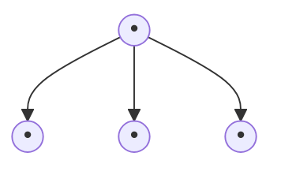

Marcio Rodrigues de Almeida

# Ortodontia Clínica e Biomecânica

Maringá
2012

DentalPress Publishing
---
# CLUBMED
## Livros de Odontologia

Mande um email para club_med@outlook.com e faça seu pedido.

1. 1001 DICAS EM ORTODONTIA E SEUS SEGREDOS - EZEQUIEL E. RODRIGUES YANES
2. ANATOMIA HISTOLOGIA EMBRIOLOGIA DOS DENTES: BATH-BALOGH
3. ANCORAGEM ESQUELÉTICA EM ORTODONTIA - ROBERTO SHIMIZU
4. ATLAS CIRÚRGICA NA IMPLANTODONTIA - MICHAEL S. BLOCK
5. ATLAS DE ODONTOLOGIA 2013 - GUIA PRÁTICO DE DEMONSTRAÇÃO AO PACIENTE
6. BELEZA DO SORRISO - ANDRÉ CALLEGARI
7. BELEZA DO SORRISO II - ANDRÉ CALLEGARI
8. BIOLOGIA CELULAR E TECIDUAL PARA DENTISTAS - VICTOR ARANA
9. CAESY - ODONTOLOGIC SIMULATOR
10. CAMINHOS DA POLPA - STEPHEN COHEN
11. CARGA IMEDIATA E IMPLANTES OSTEOINTEGRADOS - LUIS EDUARDO PADOVAN
12. CEFALOMETRIA - TÉCNICAS DE DIAGNÓSTICOS E PROCEDIMENTOS - MARIO VEDOVELLO FILHO
13. CIRURGIA ORAL E MAXILOFACIAL - JAMES R. HUPP
14. CIRURGIAS PLÁSTICAS - PERIODONTAIS E PERIIMPLANTARES - EDUARDO SAB-CHUJFI
15. CONTROVÉRSIAS NA ORTODONTIA & ATLAS DE BIOLOGIA DA MOVIMENTAÇÃO - ALBERTO CONSOLARO
16. DENTÍSTICA, SAÚDE E ESTÉTICA - EWERTON NOCHI CONCEIÇÃO
17. ENDODONTIA - PRINCÍPIOS E PRÁTICAS - MAHMOUD TORABINEJAD
18. ENDODONTIA: TRATAMENTO DE CANAIS RADICULARES - MARIO ROBERTO LEONARDO
19. ENXERTOS ÓSSEOS EM IMPLANTODONTIA - RENATO MAZZONETTO
20. FARMACOLOGIA PARA DENTISTAS: YAGIELA
21. IMAGINOLOGIA E RADIOLOGIA ODONTOLÓGICA - WATANABE / ARITA
22. IMPLANTES DENTAIS CONTEMPORÂNEOS - CARL E. MISCH
23. IMPLANTES DENTARIOS: BABBUSH
24. IMPLANTES EM ÁREAS ESTÉTICAS: CONCEITOS ATUAIS DE CIRURGIA E PRÓTESE - FERNANDO HAYASHI
25. LASER NA ODONTOLOGIA: CONVISSAR
26. MANUAL DA TÉCNICA DO ARCO SEGMENTADO - PAULO CESAR RAVELI CHIAVINI
27. MANUAL DE ANESTESIA LOCAL - MALAMED
28. MANUAL DE ODONTOPEDIATRIA: CAMERON
29. MCCRACKEN'S PROTESE PARCIAL REMOVIVEL: CARR
30. MEDICINA ORAL E MAXILOFACIAL: SCULLY
31. METAS TERAPEUTICAS INDIVIDUALIZADAS - LEOPOLDINO CAPELOZZA
32. MICROBIOLOGIA E IMUNOLOGIA NA ODONTOLOGIA: SAMARANAYAKE
33. MINI-IMPLANTES EM ORTODONTIA: CONCEITOS INOVADORES EM ANCORAGEM - LUDWIG/BOWMAN
34. MINI-IMPLANTES: GUIA TEÓRICO E PRÁTICO - LUCIANO LADEIA JR
35. MORDIDA ABERTA UM DESAFIO: TRATAMENTO DE CASOS ESQUELETICOS - IANNE FILHO
36. O ESTUDO DA ARTE NA ORTODONTIA - HUGO TREVISI
37. O PASSO A PASSO CIRURGICO NA ORTODONTIA: DA INSTALAÇÃO À PRÓTESE - MARCO A. BIANCHINI
38. O PASSO A PASSO DA PRÓTESE SOBRE IMPLANTES - ANTÔNIO CARLOS CARDOSO
39. O SISTEMA AUTOLIGAVEL - SEGREDOS CLÍNICOS - ALAN RODRIGUES
40. O TRATAMENTO ORTODONTICO COM ARCO RETO - JORGE GREGORET
41. ODONTOLOGIA RESTAURADORA: FUNDAMENTOS TÉCNICOS - LUIZ NARCISO BARATIERI
42. ODONTOPEDIATRIA - THE SMYLE CHANNEL
43. ODONTOPEDIATRIA NA PRIMEIRA INFÂNCIA - MARIA SALETE NAHÁS P. CORRÊA
44. ORTODONTIA - ROBERT E. MOYERS
45. ORTODONTIA COM EXCELÊNCIA - JURANDIR BARBOSA
46. ORTODONTIA CONTEMPORANEA: PROFFIT
47. ORTODONTIA CONTEPORANEA - WILLIAM R PROFFIT
48. ORTODONTIA E SEUS DISPOSITIVOS - JOSÉ ROBERTO RAMOS
49. ORTODONTIA EM ADULTOS - MARCOS JANSON
50. ORTODONTIA NA ODONTOPEDIATRIA: WELBURY
51. ORTODONTIA OBJETIVA - MARCOS JANSON
52. ORTODONTIA: DIGNÓSTICO E PLANEJAMENTO CLÍNICO - FLÁVIO VELLINI FERREIRA
53. PATOLOGIA ORAL E MAXILOFACIAL: NEVILLE
54. PHILIPS MATERIAIS DENTARIOS: ANUSAVICE
55. PRÓTESE SOBRE IMPLANTES: PLANEJAMENTO, PREVISIBILIDADE E ESTÉTICA - C. E. FRANCISCHONE
56. PRÓTESE TOTAL: CONVENCIONAL E SOBRE IMPLANTES - DANIEL TELLES
57. PRÓTESES DENTAIS SOBRE IMPLANTES - CARL E. MISCH
58. PRÓTESES FIXAS - LUIZ FERNANDO PECORARO
59. PROTOCOLOS EM ORTODONTIA: DIAGNÓSTICO, PLANEJAMENTO E MECÂNICA - CLAUDIO R. AZENHA
60. RADIOLOGIA ODONTOLOGICA: WHAITES
61. RADIOLOGIA ORAL FUNDAMENTOS E INTERPRETAÇÕES: WHITE
62. REABILITAÇÃO ESTÉTICA EM PRÓTESE FIXA (ANALISE ESTÉTICA) - MAURO FRADEANI
63. REABILITAÇÃO ESTÉTICA EM PRÓTESE FIXA (TRATAMENTO PROTÉTICO) - MAURO FRADEANI
64. REABSORÇOES DENTARIAS NAS ESPECIALIDADES CLÍNICAS - ALBERTO CONSOLARO
65. RECONSTRUÇÃO TECIDUAL ESTÉTICA, PROCEDIMENTOS PLÁSTICOS E REGENERATIVOS - JÚLIO CESAR JOLY
66. RESTAURAÇÕES ADESIVAS DE PORCELANA - PASCAL MAGNE
67. REVISTA CLÍNICA - DR. LUIZ NARCISO BARATIERI
68. SIMULADOR DE IMPLANTES DOLPHIN
69. SIMULADOR DE ORTODONTIA DOLPHIN
70. SISTEMAS ERTTY: ORTODONTIA/DTM/OCLUSÃO - ERTTY SILVA
71. TIPS: DICAS EM ORTODONTIA ESTÉTICA - RONALDO HIRATA
72. TRATAMENTOS DAS DESORDENS TEMPORAMANDIBULARES: OKESON
73. WHEELER ANATOMIA DENTAL FISIOLOGIA E OCLUSÃO: ASH
---
Ortodontia Clínica e Biomecânica

ISBN 978-85-88020-56-6

Copyright© 2012 by
Marcio Rodrigues de Almeida

Todos os direitos para a língua portuguesa reservados pela editora. Qualquer parte desta publicação poderá ser reproduzida, guardada pelo sistema "retrieval" ou transmitida de qualquer modo ou por qualquer outro meio, seja eletrônico, mecânico, de fotocópia, de gravação ou outros, desde que autorizado previamente, por escrito, pela editora.

Editor
Laurindo Zanco Furquim

Direção Geral
Teresa Rodrigues D'Aurea Furquim

Produção Editorial
Júnior Bianchi
Carlos Alexandre Venâncio

Capa / Projeto Gráfico
Júnior Bianchi

Diagramação
Gildásio Oliveira Reis Júnior

Tratamento de Imagens
Andres Sebastian Pereira de Jesus
Júnior Bianchi

Ilustração
Cibele Santos

Normalização
Marisa Helena Brito

Revisão
Romilda Marins Corrêa

Impressão
RR Donnelley

Dental Press Editora
Av. Euclides da Cunha, 1718 - Zona 5 - CEP 87015-180
Maringá - Paraná - Fone/Fax: (44) 3031-9818
dental@dentalpress.com.br
www.dentalpress.com.br

Dados Internacionais de Catalogação na Publicação (CIP)

A447o    Almeida, Marcio Rodrigues de
           Ortodontia clínica e biomecânica / Marcio Rodrigues de
           Almeida. -- Maringá : Dental Press, 2012.
           608 p. : 205 x 275mm.

           ISBN 978-85-88020-56-6
           1ª reimpressão

           1. Odontologia. 2. Cirurgia odontológica. 3. Cirurgia dentária.
           4. Ortodontia. I. Título.

                                                            CDO 617.43
---
# AUTOR

Marcio Rodrigues de Almeida

- Graduado em Odontologia pela Faculdade de Odontologia de Lins (FOL);
- Especialista em Ortodontia pela FOB-Universidade de São Paulo;
- Mestre em Ortodontia pela FOB-Universidade de São Paulo;
- Doutor em Ortodontia pela Universidade de São Paulo;
- Pós-Doutor em Ortodontia pela Universidade de São Paulo;
- Mini-Residency in Orthodontics, University of Connecticut, School of Dental Medicine;
- Professor Adjunto Doutor III do Curso de Mestrado Acadêmico em Ortodontia da Universidade Norte do Paraná (UNOPAR), Campus de Londrina-PR.

marcioralmeida@uol.com.br

# COLABORADORES

## Adilson Luiz Ramos
- Mestre em Ortodontia pela FOB-USP;
- Doutor em Ortodontia pela Universidade Estadual Paulista Júlio de Mesquita Filho de Araraquara;

## Eduardo Dias Ribeiro
- Mestrando em Estomatologia pela FOB-USP

## Eduardo Sant'Ana
- Professor Livre Docente em Cirurgia pela FOB-USP;
- Membro da Advanced Orthognathic Surgery Foundation.

## Fernando Pedrin Carvalho Ferreira
- Mestre em Ortodontia e Odontologia em Saúde Coletiva pela FOB-USP;
- Doutor em Ortodontia pela Universidade de São Paulo-USP

## Guilherme de Araújo Almeida
- Mestre e Doutor em Ortodontia pela FOB-USP;
- Professor Associado II da Faculdade de Odontologia da Universidade Federal de Uberlândia.

## Isabela Parsekian Martins
- Especialista em Ortodontia pela Faculdade de Odontologia de Araraquara - Universidade Estadual Paulista Júlio de Mesquita Filho;
- Mestranda do Programa de Pós-Graduação em Ciências Odontológicas, Área de Concentração em Ortodontia da Faculdade de Odontologia de Araraquara - Universidade Estadual Paulista Júlio de Mesquita Filho.

## Julierme Ferreira Rocha
- Mestrando em Estomatologia pela FOB-USP;

## Lidia Parsekian Martins
- Mestre em Odontologia, na área de Ortodontia, pela Faculdade de Odontologia de Araraquara - Universidade Estadual Paulista Júlio de Mesquita Filho;
- Doutora em Odontologia, na área de Ortodontia, pela Faculdade de Odontologia de Araraquara - Universidade Estadual Paulista Júlio de Mesquita Filho.

## Maria Helena Ferreira Vasconcelos
- Mestre em Patologia Bucal pela FOB-USP;
- Doutora em Ortodontia pela FOB-USP.

## Maurício Tatsuei Sakima
- Professor assistente Doutor do Departamento de Clínica Infantil da Faculdade de Odontologia de Araraquara;
- Pós-doutorado no Royal Dental College – Universidade de Aarhus – Dinamarca;
- Professor convidado do curso de Pós-graduação em Ortodontia da Universidade de Aarhus – Dinamarca.

## Omar Gabriel da Silva Filho
- Mestrado em Ortodontia pela Universidade Estadual Paulista Júlio de Mesquita Filho - Araçatuba;
- Coordenador da Sociedade de Promoção Social do Fissurado Lábio Palatal e Ortodontia da Universidade de São Paulo.

## Renata Rodrigues de Almeida-Pedrin
- Mestrado, Doutorado e Pós-Doutorado em Ortodontia e Odontologia em Saúde Coletiva pela FOB-USP;
- Especialista em Radiologia pela FOB-USP

## Renato Parsekian Martins
- Mestre em Ortodontia pela Faculdade de Odontologia de Araraquara - Universidade Estadual Paulista Júlio de Mesquita Filho;
- Doutor em Ciências Odontológicas - Área de Ortodontia, pela Faculdade de Odontologia de Araraquara - Universidade Estadual Paulista Júlio de Mesquita Filho;
- Doutorado Sanduíche no Departamento de Ortodontia da Baylor College of Dentistry, em Dallas, Texas, EUA.

## Renato Yassutaka Faria Yaedú
- Doutor em Estomatologia pela FOB-USP.

## Tatsuko Sakima
- Professor Titular aposentado do Departamento de Clínica Infantil da Faculdade de Odontologia de Araraquara - UNESP;
- Professor visitante do Departamento de Ortodontia da Universidade de Connecticut - EUA;
- Coordenador do curso de especialização em Ortodontia da EAP da APCD - regional Araraquara.

## Tulio Silva Lara
- Mestre em Ortodontia pela Universidade Estadual Paulista Júlio de Mesquita Filho - UNESP;
- Doutorando em Ortodontia pela Universidade Estadual Paulista Júlio de Mesquita Filho - UNESP

## Weber Ursi
- Mestre e Doutor em Ortodontia pela FOB-USP;
- Professor Livre Docente da Faculdade de Odontologia de São José dos Campos - UNESP.
---
The image contains a black and white portrait photograph centered on a light blue background. The photograph itself does not contain any text to transcribe. The blue background that surrounds the photograph also does not contain any readable text, except for a partial cursive letter or design element visible in the bottom right corner, which appears to be part of a larger watermark or decorative feature that extends beyond the frame of the image.

Given the instructions to transcribe only content that appears in the image without describing it, and the lack of text within the photograph or surrounding areas, there is no textual content to transcribe into markdown format from this image.
---
Dedico esta obra ao meu pai, Dr. Renato Rodrigues de Almeida, exemplo de homem e mestre que, além de ensinar e exercer a sua profissão com carinho e dedicação, é admirado por todos, não somente pela capacidade profissional, mas principalmente por sua humildade e pelo seu enorme coração.

O entusiasmo, a simplicidade e a destreza com que você transmite conhecimento aos seus alunos refletem o quão apaixonante é a arte da docência e do exercício da Ortodontia. Inúmeros foram os discípulos que se tornaram apaixonados por ela espelhando-se em você e principalmente no seu espírito acadêmico. Apesar dessa foto ter quase 50 anos estampa com maestria a sua determinação e seu olhar criterioso em tudo que faz.

Levarei para o resto de minha vida uma frase que você repete frequentemente aos seus alunos: **"A Ortodontia deve ser exercida com a mente, com as mãos e com o coração"** (Harry Dougherty).
---
# Dedica

[The image contains a black and white family photograph centered on a light blue background. The photograph shows two adults and three children smiling at the camera. The word "Dedica" is written in stylized script at the top of the image in a slightly lighter shade of blue than the background.]
---
À minha "equipe", amada esposa Patrícia que, com paciência e amor soube entender os momentos em que estive ausente para a elaboração desta obra, sendo, além de esposa, amiga, conselheira e cúmplice, características essas que a tornaram a mulher da minha vida e aos meus três filhos, Marcella, Mariana e Vinícius, motivação constante, o sorriso, o amor e o afeto de vocês me permitiram que concluísse este trabalho.
---
Agradeço a Deus, por ter permitido que alcançasse e concluísse com saúde esta obra ao lado da minha família e dos meus amigos.
---
A execução desta obra só foi possível em função da colaboração de muitos que tive sorte e felicidade de encontrar no meu caminho. Agradeço aos meus pais Renato e Odete, por ter me brindado com carinho, amor e compreensão durante toda a minha vida, sem os quais não seria possível a realização deste trabalho. À minha irmã Renata, por ter me ajudado na clínica quando me ausentei para escrever este livro e também por escrever dois capítulos importantes sobre diagnóstico e plano de tratamento. À equipe de professores do CORA (Centro Odontológico Rodrigues de Almeida), ao Fernando Pedrin, que escreveu o hodierno capítulo de mini-parafusos e especialmente à Celina Martins, que me ensinou os primeiros passos na Ortodontia.

Gostaria de exaltar minha gratidão aos outros colaboradores deste livro que prontamente aceitaram dedicar e abdicar do valioso tempo de suas agendas na escrita desta obra. Parafraseando o ator, comediante, diretor e roteirista, Woody Allen, quando questionado como fazia para se ter sucesso no cinema, respondeu que bastava escolher bons artistas para compor o elenco do filme. Assim foi com todos vocês que elaboraram cuidadosamente seus capítulos, muito obrigado.

Meus agradecimentos especiais aos professores do Departamento de Ortodontia da Universidade de Connecticut-EUA, especialmente Dr. Ravindra Nanda e Dr. Flávio Uribe, que mudaram a maneira de eu enxergar a Ortodontia abrindo as portas daquela Universidade para que eu pudesse trilhar novos rumos na minha carreira. Dr. Nanda, você foi fundamental para iniciar este projeto e me ensinou que um bom livro deve ser escrito não por uma única pessoa, mas por vários indivíduos.

Aos Docentes da Disciplina de Ortodontia da FOB-USP, Dr. José Fernando Castanha Henriques, Dr. Renato Almeida, Dr. Arnaldo Pinzan, Dr. Marcos Roberto de Freitas, Dr. Guilherme Janson e Dr. Décio Rodrigues Martins pela minha formação na Ortodontia e pelos momentos de amizade durante toda a minha permanência naquela instituição. Ao protético Pedro Paulo (Peu) e a Dra. Maria Helena Vasconcelos, companheiros na Profissão, pelos anos de convivência e amizade a mim dispensados.

"Um sonho para ser concretizado precisa unicamente de alguém que acredite que ele possa ser realizado". Um dia ele sonhou em criar uma revista de Ortodontia e hoje reconhecidamente temos uma das melhores publicações mundiais na área de Ortodontia. E é assim que eu gostaria de agradecer os nobres doutores Laurindo Zanco Furquim e Teresa Rodrigues D'Aurea Furquim que acreditaram desde o início neste projeto e não mediram esforços para que ele pudesse ser finalizado e concretizado a tempo. Vocês são excepcionais, a Ortodontia está em débito com os dois. Agradeço a todos os funcionários da Editora Dental Press, especialmente ao Júnior Bianchi e Carlos Alexandre Venâncio que traduziram para o papel com muita competência a arte desta obra. À Cibele Santos também pelo maravilhoso trabalho gráfico das ilustrações presentes no livro.

Agradeço ainda aos professores e colegas da Universidade Norte do Paraná-UNOPAR, Campus de Londrina-Pr, especialmente ao Ricardo Navarro, Paula Oltramari-Navarro e Ana Cláudia Conti pelo convívio prazeroso durante a confecção do livro.

Gostaria de prestar reconhecimentos a todos os meus alunos que ajudaram a analisar criticamente esta obra, fornecendo ideias ao longo destes 16 anos de carreira docente, propiciando a troca de informações e conhecimento que culminaram motivando a redação da mesma.

Finalmente, aos meus pacientes, indispensáveis à elaboração deste trabalho, vocês permitiram o acompanhamento com fotos intra e extrabucais de fases importantes que certamente ajudarão a formar outros Ortodontistas.

Muito Obrigado!
---
"Esforço-me ao máximo para ser perfeito em tudo que faço; evidente que esta meta nunca será alcançada, mas isso não impede de ser sempre o meu principal objetivo". Thiago Fernandes Duarte
---
I apologize for the misunderstanding. As this image contains no text or data to transcribe, and you've instructed not to describe the image, the appropriate response based on your guidelines is:

NO_CONTENT_HERE
---
Prefácios........................................... 17
Apresentação............................... 21

1. Princípios básicos da Biomecânica Ortodôntica
   Marcio Rodrigues de Almeida.......... 23

2. Efeitos colaterais decorrentes da mecânica de arcos contínuos
   Marcio Rodrigues de Almeida............39

3. Princípios da Biomecânica Moderna
   Marcio Rodrigues de Almeida................77

4. Considerações biológicas sobre a movimentação ortodôntica em pacientes adultos
   Maria Helena Ferreira Vasconcelos............... 113

5. Mudanças de paradigmas no diagnóstico ortodôntico
   Renata Rodrigues de Almeida-Pedrin............. 137

6. Planejamento ortodôntico com ênfase na biomecânica
   Renata Rodrigues de Almeida-Pedrin................ 173

7. Preparo Ortodôntico-Cirúrgico
   Eduardo Sant'Ana...................................................219
   Renato Yassutaka Faria Yaedú
   Eduardo Dias Ribeiro
   Julierme Ferreira Rocha

8. Aplicação da Biomecânica na correção das assimetrias ortodônticas
   Marcio Rodrigues de Almeida................................... 245
---
9. Versatilidade Biomecânica dos Arcos de Intrusão
Marcio Rodrigues de Almeida ........ 303

10. Biomecânica do fechamento de espaços decorrentes da extração
Marcio Rodrigues de Almeida ............ 373

11. Biomecânica da Mola T em Ortodontia
Renato Parsekian Martins ..................... 423
Lídia Parsekian Martins
Isabela Parsekian Martins

12. Mecânica com a Barra Palatina
Adilson Luiz Ramos .............................. 475
Mauricio Tatsuei Sakima

13. Biomecânica aplicada no tratamento de pacientes adultos
Maurício Tatsuei Sakima .......................... 501
Tatsuko Sakima

14. Mini-implantes na mecânica Ortodôntica
Fernando Pedrin Carvalho Ferreira ............ 533

15. Ortodontia com Braquetes Autoligáveis
Weber Ursi ..................................................... 559
Guilherme de Araújo Almeida

16. O Aparelho Extrabucal como distalizador de molares superiores
Omar Gabriel da Silva Filho .......................................... 575
Tulio Silva Lara
---
# Prefácio

Ravindra Nanda, B.D.S., M.D.S., Ph.D.

- Presidente Emérito da Associação de Ex-Alunos de Ortodontia da Universidade de Connecticut;
- Professor e Chefe da Divisão de Ortodontia Universidade de Connecticut Farmington, CT, 06001, EUA.
---
A Odontologia atravessa uma fase de enorme progresso e a área da Ortodontia está na vanguarda dessa evolução. A Ortodontia define-se, a um só tempo, como arte, tecnologia e ciência, ética e filosofia, além de refletir diversas outras facetas de nossa cultura. Hoje em dia, o embasamento científico da Ortodontia vem se consolidando cada vez mais e este livro é uma tentativa exemplar no sentido de explicar sistematicamente os aspectos mais relevantes da Ortodontia, seus princípios, filosofias e práticas atuais. Este livro informativo e atraente, de autoria do Dr. Marcio Almeida e colaboradores, preenche uma lacuna importante na área da Ortodontia, contribuindo na busca por um modelo de clínicos/pesquisadores da prática odontológica.

Todos os 16 capítulos são bem redigidos e o livro será de grande utilidade tanto para clínicos como para acadêmicos que desejem enriquecer suas palestras e conferências com informações relevantes e os achados mais recentes. Vários capítulos contêm descrições precisas dos princípios biomecânicos relativos à mecânica do movimento dentário, abordando com competência os aspectos biológicos, e concluindo com um panorama das últimas descobertas científicas da Ortodontia atual.

A obra me agradou especialmente pelo fato de enfocar, com propriedade e pertinência, os últimos desenvolvimentos e avanços científicos. Com este livro, o Dr. Almeida nos permite partilhar de sua sabedoria, conhecimentos e habilidades, adquiridos ao longo de anos de dedicação, além de nos brindar com um excelente relato de todos os aspectos de Ortodontia, a partir da perspectiva biomecânica. Igualmente elogiável é a forma pela qual o autor apresenta os capítulos em sequência lógica, todos redigidos em linguagem agradável. Este livro acadêmico certamente servirá como referência indispensável para todos aqueles que desejem praticar Ortodontia munidos de um melhor diagnóstico e plano de tratamento, a fim de otimizar a saúde, funções e estética do paciente. Espero que o leitor sinta o mesmo prazer que senti e possa também aprender tanto quanto aprendi ao ler este excelente livro.
---
# Prefácio

Dr. Renato Rodrigues de Almeida

- Professor Associado da Faculdade de Odontologia de Bauru, Universidade de São Paulo;
- Professor Adjunto do Curso de Mestrado em Ortodontia da Universidade Norte do Paraná, Campus Londrina-UNOPAR.
---
Com muita alegria e orgulho faço o prefácio deste livro, que é uma verdadeira obra literária. Não há nada mais gratificante para um pai do que ver o filho suplantá-lo profissionalmente, realizando um sonho de todos aqueles que se dedicam ao ensino e à pesquisa.

O Dr. Marcio Rodrigues de Almeida dedicou-se à Odontologia desde muito jovem e, mais tarde, abraçou a Ortodontia com extraordinária destreza e espírito inquieto, sempre em busca de inovações tecnológicas e científicas. Sua vasta experiência permitiu a elaboração deste compêndio repleto de casos clínicos, solucionados com princípios ortodônticos biomecânicos, culminando em excelentes resultados estéticos e funcionais.

Este livro é fruto da união de seletos profissionais de alto cabedal científico, haja vista que nenhuma grande obra é realizada por uma única pessoa. O autor e seus colaboradores — jovens idealistas, dinâmicos e audazes —, de forma impecável, empreenderam nesta obra uma riqueza de detalhes com valor didático inestimável ao aspirante à Ortodontia ou, ainda, aos mais experientes clínicos, que a tornará um "best-seller" da literatura ortodôntica.

Este não é apenas mais um livro de Ortodontia. É uma síntese do conhecimento do autor e dos colaboradores, que, brilhantemente, versaram sobre os diversos aspectos mecânicos e biológicos da movimentação ortodôntica, enfatizando o diagnóstico e planejamento ortodôntico, os princípios da biomecânica moderna, a movimentação ortodôntica e o tratamento de pacientes adultos, o aparelho extrabucal como distalizador de molares, a mecânica ortodôntica com os mini-implantes, a versatilidade dos arcos de intrusão e da barra palatina, o fechamento de espaços sob a óptica das molas e alças de retração, o reencontro dos braquetes autoligáveis e o preparo ortodôntico-cirúrgico.

Distribuído em 16 capítulos, discorre sobre mecânicas contemporâneas, que reduzem o tempo de tratamento, minimizando os efeitos deletérios da movimentação ortodôntica e o desconforto ao paciente. A sequência dos capítulos e os assuntos escolhidos foram cuidadosamente planejados e elaborados, o que leva o leitor ao prazer e ao entendimento de uma leitura simples e agradável.
---
Aprese

Marcio Rodrigues de Almeida
---
Esta obra tem a finalidade de atender aos anseios dos clínicos que vislumbram uma Ortodontia sob a óptica que transcende técnicas, filosofias ou prescrições específicas de braquetes que recheiam os dias atuais, inundando o vasto mercado ortodôntico, em função do excessivo marketing profissional e empresarial. De fato, conforme se angariam conhecimento e experiência clínica, percebe-se que uma Ortodontia de excelência pode ser executada com qualquer tipo ou sistema de braquetes disponíveis no arsenal ortodôntico. Para tanto, basta se alicerçar em princípios sólidos fundamentados num diagnóstico preciso, plano de tratamento adequado e na utilização de sistemas de forças que minimizem efeitos colaterais, possibilitando maior controle dos movimentos dentários durante a correção das más oclusões. Nesse contexto, os aspirantes a uma Ortodontia eficiente devem direcionar o foco especialmente para os parâmetros estéticos e funcionais durante a elaboração dos objetivos ortodônticos, assim como entender o funcionamento dos diversos aparelhos e dispositivos biomecânicos empregados e elaborados para serem incorporados em qualquer técnica ou filosofia ortodôntica. Desse modo, a proposta de escrever este livro baseou-se na dificuldade de se encontrar uma obra literária que contemplasse não somente uma visão clínica da Ortodontia, mas também evidenciada, cientificamente, em conceitos de Biomecânica. Assim, esta ferramenta de trabalho fornece ampla abordagem obedecendo às novas mudanças de paradigma no diagnóstico e no planejamento ortodôntico com ênfase na estética da face e do sorriso. Além disso, explora os erros e os efeitos colaterais decorrentes da utilização de arcos contínuos, condição esta que pode dificultar a finalização e aumentar o tempo de tratamento dos casos clínicos. Tópicos amplamente descritos e ricamente ilustrados com a colaboração de seletos professores compõem este livro incluindo Princípios básicos de Biomecânica, Assimetrias ortodônticas, Fechamento de espaços, Alças e molas T de retração, Aparelhos extrabucais, Barra transpalatina, Arcos de intrusão, Tratamento interdisciplinar e Movimentação dentária em pacientes adultos. Ademais, são discorridos assuntos sobre as novas tendências na Ortodontia como Ancoragem esquelética com mini-implantes e miniplacas, Mecânica com braquetes auto-ligáveis e Preparo ortodôntico-cirúrgico com ênfase na análise facial. Este livro, elaborado com mais de 3.000 fotos e uma rica casuística, reúne um conteúdo detalhado e abrangente de procedimentos clínicos com bases científicas úteis para o exercício de uma Ortodontia moderna de sucesso, visando não somente o clínico especialista, mas também alunos de graduação e pós-graduação.
---
NO_CONTENT_HERE
---
# 1

Princípios básicos da
Biomecânica Ortodôntica

Marcio Rodrigues de Almeida
---
The image contains no text to transcribe directly into Markdown. It's a visual representation of orthodontic elements without any written content. The key elements are:

- A stylized tooth shape in the upper right corner
- Two small orthodontic brackets indicated by an arrow
- An X-ray-like view of teeth with braces in the lower half

As there is no text or data to convert to Markdown format, and the image is primarily visual without any textual elements, a direct transcription is not possible.
---
# 1. INTRODUÇÃO

Apesar das diversas técnicas e braquetes ortodônticos desenvolvidos nos últimos 100 anos, dentre os quais, os principais, podem-se considerar o Sistema Angle e o Sistema Andrews. Princípios básicos que se utilizam para tratar má oclusão dependem da força e da direção empregadas para movimentar dentes de forma ideal. Desse modo, pode-se inferir que: na Ortodontia exercem-se forças para movimentar dentes na direção desejada empregando-se os princípios de física que são exatamente os mesmos para todas as técnicas e sistemas de aparelhos existentes no mercado². Assim, o movimento dentário ortodôntico ocorrerá em resposta ao sistema de forças controlado, realizado por clínicos. Os requisitos para uma aplicação clínica consistente com a Biomecânica exigem informações básicas necessárias para entender os princípios físicos comuns a todos os aparelhos ortodônticos. Os conceitos físicos que fundamentam a mecânica ortodôntica são as peças chaves para entender como os aparelhos funcionam. Os princípios não são únicos na Ortodontia, porém, são básicos à ciência da mecânica estática. As leis estáticas da física podem ser aplicadas para explicar o sistema de forças desenvolvidas pelas ativações dos aparelhos. Princípios simples de mecânica podem ajudar a compreender como os dentes são deslocados como resultado da aplicação do sistema de forças. Para se controlar o movimento dentário, objetivando atingir resultados previsíveis baseados em planos de tratamento pré-determinados, deve-se entender, plenamente, as ativações dos aparelhos. Para tanto, os dois componentes dos sistemas de forças mais importantes são: forças e momentos. Pode-se utilizar uma força simples para movimentar dentes, porém, geralmente, se produzem momentos que geram rotação, inclinação e torque. Quando se varia a proporção momento/força, consegue-se variar o tipo de movimento dentário. Para o completo entendimento dos conceitos biomecânicos, faz-se necessário definir os sistemas de força, frequentemente empregados na clínica ortodôntica.

# 2. SISTEMA DE FORÇAS

## 2.1 Forças, Unidades de Ancoragem e Centro de Resistência

### 2.1.1 Forças:

As Forças são consideradas vetores dependentes da direção e da magnitude. Define-se força como a ação de um corpo sobre outro, a exemplo do fio ortodôntico sobre o dente. Duas forças são consideradas importantes na biomecânica; as forças de ativação e desativação¹. Entende-se por força de ativação a força adicionada ao dispositivo (fio ortodôntico) que será introduzido ao braquete, a exemplo de uma alavanca (Fig. 1). A força de desativação é aquela que age no dente quando o fio recupera sua forma original de ativação (Fig. 2).

Força de ativação e desativação

FIGURA 1 e 2 - Força de ativação sobre um canino superior deliberada por meio de uma alavanca ancorada no bloco posterior. Força de desativação sobre o dente após a recuperação da forma original de ativação.
---
As figuras 3 a 7 ilustram dois casos clínicos empregando-se as forças de ativação e desativação.

FIGURA 3 e 4 - Emprego das forças de ativação e desativação utilizando o princípio da alavanca (cantilever) sobre o canino superior.

> Dica clínica: A força da alavanca sobre o canino deve ser de 25 a 30 gramas (Figs. 3, 4, 5 e 6).

FIGURA 5, 6 e 7 - Ilustração das forças de ativação e desativação utilizando o princípio da alavanca (cantilever) sobre o canino superior. A figura 6 denota 1 mês após ativação do cantilever. A figura 7 exibe a colocação de um arco de extrusão para fechamento da mordida anterior 5 meses após o início do tracionamento.

## 2.1.2 Unidades de Ancoragem:

As unidades de ancoragem podem ser divididas em unidades ativas e unidades reativas. As unidades ativas são aquelas que a movimentação é desejada a partir da força de ativação do dispositivo ortodôntico. Por outro lado, a unidade reativa é a unidade que recebe a força de ativação do dispositivo, porém, não deve se movimentar (ancoragem). As figuras 8 a 10 ilustram o emprego da alça de TMA® em forma de T para a retração do canino (unidade ativa) enquanto a bateria posterior (unidade reativa) composta pelo primeiro molar e segundo pré-molar reforça a ancoragem. O leitor pode encontrar maiores informações nos capítulos 10 e 11, a respeito de alças e molas T para fechamento de espaços.

## 2.1.3 Centro de Resistência:

Para uma movimentação previsível, uma força precisa ser aplicada na direção desejada, com magnitude adequada e na posição correta. Alterando-se a direção, a magnitude e o ponto de aplicação da força, afeta-se a qualidade do deslocamento dentário da unidade a ser movimentada. Com relação

> Dica clínica: Apesar da alça T prover ancoragem na bateria posterior, deve-se adaptar um arco transpalatino nos primeiros molares, para reforço de ancoragem. Associado ao segmento de arco de pré-molar a molar (Fig. 8).

FIGURA 8, 9 e 10 - Unidade ativa composta pelo canino que está sofrendo retração com a alça em forma de T confeccionada com liga de TMA® .017" x .025". A unidade reativa, explicitada nas figuras 8 e 9, é composta pelos molares e pré-molares consolidada pelo arco de TMA® .017" x .025". A figura 10 exibe a continuação da mecânica após um período de 8 meses de tratamento, efetuando-se o fechamento de espaço no arco inferior.
---
ao ponto de aplicação da força, existe somente um ponto no dente em que a força pode ser aplicada, movimentando-o na direção da força sem incliná-lo ou girá-lo. Esse ponto, por sua vez, recebe a designação de Centro de Resistência (Cr) ou (Cres), onde a força, incidindo sobre o dente, causará translação pura como explicitado na figura 11. Assim, o centro de resistência deve ser definido em associação com o movimento de translação⁴¹⁰. O movimento de translação é produzido por uma força passando pelo centro de resistência (Cr).

De acordo com Fiorelli e Melsen⁴, a distância média, perpendicular ao plano oclusal, entre o braquete e o centro de resistência é de 8, 10 e 13mm, respectivamente, para o primeiro molar superior, incisivo central superior e canino superior (Figs. 12 a 14).

No entanto, deve-se ressaltar que a localização do centro de resistência depende do tamanho e da forma dos dentes, do número de raízes bem como da qualidade de tecidos de suporte (periodonto de sustentação)⁹¹⁰¹⁴. De acordo com Burstone e Pryputniewicz², em um periodonto sadio com dentes intactos, o centro de resistência localiza-se entre ½ e ⅓ da distância a partir da crista alveolar até o ápice radicular (Fig. 15).

O centro de resistência desloca-se mais apicalmente em casos com comprometimento periodontal com perda de inserção do periodonto de sustentação⁶¹¹¹⁵, como exemplificado na figura 16.

FIGURA 11 - Força (F) incidindo sobre o Centro de resistência (Cr) produzindo um movimento de translação pura.

| F → | CR • |
|------|------|

FIGURA 12, 13 e 14 - Distância perpendicular ao plano oclusal aproximada do braquete ao centro de resistência. A: 8mm no primeiro molar superior; B: 10mm no incisivo central superior e C: 13 no canino.

| 8mm • | 10mm • | 13mm • |
|--------|---------|---------|

FIGURA 15 - Localização do centro de resistência entre 2/3 e 1/3 da distância a partir da crista alveolar até o ápice radicular.

| 2/3 |
|-----|
| •   |
| 1/3 |

FIGURA 16 - O Centro de resistência (Cr) desloca-se apicalmente devido à perda de inserção periodontal em pacientes com comprometimento do periodonto de sustentação.

| • |
|---|
---
É importante ressaltar que o centro de resistência deve ser avaliado também do ponto de vista oclusal, conforme as figuras 17 e 18. No molar superior, o Cr está deslocado em direção ao lado palatino mais próximo da raiz palatina, que é mais volumosa, pois apresenta uma inclinação vestibular. Por outro lado, no molar inferior, o Cr aproxima-se do lado vestibular, devido, principalmente, à inclinação lingual desse dente.

O conceito de centro de resistência deve ser aplicado também a um grupo de dentes para o completo entendimento do sistema de forças. Desse modo, quando se combina uma unidade de ancoragem com 4 dentes conjugados, um único centro de resistência aplica-se a todos os dentes, como demonstrado na figura 19. A figura 19 ilustra a localização do Cr sob duas vistas da bateria anterior (incisivo lateral a lateral do lado oposto). Sob o aspecto lateral, pode-se notar que o Cr encontra-se na região distal ao braquete do incisivo lateral em direção apical. Analisando-se sob o ponto de vista oclusal, percebe-se que o Cr se apresenta localizado entre os incisivos centrais numa linha imaginária seguindo posteriormente a sutura palatina mediana.

Outras situações também podem ser encontradas para diferentes grupos de dentes, conforme ilustrado na figura 20. Conjugando o bloco anterior de canino a canino, o Cr passa a ser deslocado mais para posterior, entre lateral e canino, no sentido anteroposterior. Para o bloco posterior (1º molar e 2º pré-molar), o Cr localiza-se imediatamente entre os braquetes dos dentes consolidados. Conforme se aumenta a ancoragem, unindo-se mais um dente ao bloco posterior (segundo molar a segundo pré-molar), o Cr também se desloca mais posteriormente, agora imediatamente distal ao braquete do primeiro molar.

![FIGURA 17 - Localização do centro de resistência no molar superior sob a vista oclusal. O Cr aproxima-se da face palatina, próximo à raiz palatina considerada a mais volumosa.]

![FIGURA 18 - Localização do centro de resistência no molar inferior sob a vista oclusal. Note que o Cr se aproxima da face vestibular.]

> Dica clínica: Quando os dentes estão consolidados, um único Cr pode ser localizado (Fig. 20).

![FIGURA 19 - Localização do centro de resistência combinando-se uma unidade de ancoragem com 4 dentes consolidados. Observa-se que um único centro de resistência se aplica a todos os dentes.]

![FIGURA 20 - Localização do centro de resistência combinando-se várias unidades de ancoragem. Observa-se que um único centro de resistência se aplica a todos os dentes consolidados.]
---
## 2.1.4 Aplicação clínica das forças em relação ao Centro de Resistência

Várias situações clínicas demandam o correto estudo do emprego da direção da força em relação ao Cr dos dentes a serem movimentados. Por exemplo, se a força aplicada ao braquete passar distante do Cr, uma tendência rotacional poderá ocorrer. O exemplo das figuras 21 e 22 ilustram a aplicação de uma força de mesialização que está direcionada abaixo do Cr dos dentes posteriores superiores com ancoragem sobre o miniparafuso. Observa-se uma rotação dos dentes posteriores no sentido anti-horário, em função da direção de aplicação de força. Por outro lado, as figuras 23 a 32 demonstram a aplicação da força diretamente sobre o Cr dentário da unidade ativa.

FIGURA 21 e 22 - Exemplo clínico de aplicação da linha de ação da força abaixo do Cr causando rotação dos dentes superiores posteriores.

[As imagens mostram dois casos clínicos de tratamento ortodôntico, ilustrando a aplicação de força e a rotação resultante dos dentes superiores posteriores.]

> **Dica clínica:** A melhor forma de se obter um movimento de translação é fazer com que a linha de ação da força passe ao nível do Cr (Figs. 23 e 24).

FIGURA 23 - Aplicação da força passando sobre o Cr dos dentes anteriores promovendo um movimento de translação do bloco anterior para distal. Note que um segmento de fio de aço .019" x .025" está adaptado a um tubo cruzado e estendido ao nível do Cr dos dentes anteriores.

[A imagem mostra um caso clínico com a aplicação de força sobre os dentes anteriores, demonstrando o movimento de translação.]

FIGURA 24 a 28 - Aplicação da força passando sobre o Cr do molar inferior promovendo um movimento de translação.

[As imagens mostram uma série de casos clínicos e radiografias demonstrando a aplicação de força sobre o molar inferior e o movimento de translação resultante.]
---

FIGURA 29 a 32 - Emprego de uma mecânica para correção de desvio de linha média inferior deslogan-do-se o ponto de aplicação da força em direção apical (Cr) promovendo um movimento de translação dos incisivos inferiores. A figura 28 demonstra a efetividade da mecânica supracitada após um período de 2 meses, quando os incisivos inferiores deslocaram-se de corpo para a esquerda, favorecendo a correção da linha média. Na figura 32, nota-se um arco de intrusão inferior para nivelamento da curva de spee e correção da sobremordida.

## 2.2 Momento

As forças, enquanto vetores, podem ser combinadas ou divididas matematicamente. Duas ou mais forças atuando como uma força simples podem ser adicionadas utilizando a trigonometria ou a decomposição de vetores e representadas por uma força única (simples) naquele ponto de aplicação. Por exemplo, forças atuando separadamente no sentido distal e no sentido extrusivo podem ser combinadas em uma única força distoextrusiva, como ilustrada na figura 33.

Quando uma força é aplicada em qualquer ponto do dente que não passe pelo Cr, um momento é criado. Assim, define-se momento como uma tendência à rotação, referindo-se a um dente que pode rotacionar, inclinar ou ser torqueado de acordo com a nômina ortodôntica. Para produzir um movimento diferente de inclinação pela aplicação de uma força no braquete, uma tendência rotacional deve ser adicionada, essa tendência rotacional denomina-se momento. Desse modo, qualquer força que passe distante do Cr do dente sobre a coroa, por exemplo, movimentará na direção da força, porém, um momento será gerado para inclinar a coroa na direção da força (Fig. 34). Portanto, a magnitude do momento (representada pela letra M) é igual à magnitude da força (representada pela letra F) multiplicada pela distância (D) da força medida a partir do centro de resistência (M=FxD). A distância é medida perpendicularmente a partir da linha de ação da força ao centro de resistência. Adota-se, por convenção, uma vez que a força é medida em gramas e a distância em milímetros, que o momento tem unidade de força em grama-mm.

Assim, se uma força simples é aplicada no nível do braquete do canino no sentido de retração, um momento será gerado rotacionando a coroa desse dente para distal e a raiz para mesial no plano sagital. No aspecto oclusal, também haverá a tendência à rotação com giro no sentido anti-horário do canino (Figs. 35 e 36).

Para exemplificar a mensuração da magnitude do momento, toma-se o exemplo da figura 37, onde F é igual a 150 gramas e D corresponde a 11 milímetros. Sabendo-se que o Momento é o produto da força e da distância perpendicular entre sua linha de ação e o ponto sobre o qual a rotação está sendo considerada (Cr), tem-se: M= 150 x 11= 1650g-mm

FIGURA 33 - Decomposição de vetores de forças combinadas. Direção Disto-extrusiva da força.
---
                                   Distância
Linha da força -----------------> Força -----> (D)

---
FIGURA 38 - A figura ilustra dois movimentos distintos e bastante utilizados na clínica ortodôntica. No movimento de rotação pura, o centro de rotação coincide com o centro de resistência. Por outro lado, o centro de rotação apresenta-se no infinito quando do movimento de translação, note que a força está aplicada de vestibular para lingual.

FIGURA 39 - A figura A ilustra o movimento de rotação do canino aplicando-se uma força no braquete desse dente distante do Cr. Nessa situação, o centro de rotação coincide com o centro de resistência e a magnitude da rotação é expressa pelo tamanho da seta representativa do momento (seta maior). A figura B, por sua vez, exibe a aplicação de uma força mais próxima do Cr, e o centro de rotação apresenta-se mais distante do Cr o que promove menor rotação ou menor momento (seta menor). Estes são os movimentos de inclinação não-controlada e controlada, respectivamente.

De acordo com o esquema da figura 38, no movimento de rotação pura, o centro de rotação coincide com o centro de resistência. A distância entre o Centro de rotação e o Centro de resistência representa a proporção entre os movimentos parciais de rotação e translação em movimentos combinados. Uma grande distância entre os dois pontos significa movimento predominantemente de translação, enquanto uma distância curta denota uma maior rotação (Fig. 39).

Marcotte aludiu que os diversos tipos de movimentos dentários ortodônticos são especificamente descritos identificando-se seus Centros de Rotação (CRot). Enfatizou, ainda, que ter o controle do movimento dentário ortodôntico significa ter o controle dos Centros de Rotação dos dentes envolvidos.

Burstone, Pryputniewicz²; Fiorelli e Melsen³ enfatizaram a relação entre proporção momento/força aplicada ao braquete, e a posição do Crot do movimento gerado. Por exemplo, se uma força simples for aplicada ao braquete como ilustrado na figuras 40 e 41, a proporção momento/força será igual a 0/F (ou zero) e o Crot estará a, aproximadamente, 10mm acima do nível do braquete próximo do Cr². Para exemplificar esse cálculo, se uma força de 100g atuar sobre o braquete do incisivo lingualizando-o, isso criará um equivalente de 100 g de força lingual sobre o Cr mais um momento de 1.000g-mm em direção lingual de coroa e vestibular de raiz.

FIGURA 40 e 41 - Quando uma força simples for aplicada ao braquete, uma proporção momento/força será igual a zero e o Crot estará a aproximadamente 10mm acima do nível do braquete próximo do Cr, gerando um movimento de rotação (coroa para palatina e raiz para vestibular). Esse movimento denomina-se inclinação não controlada.

| Força simples aplicada ao braquete |
|-----------------------------------|
| (M/F = 0)                         |
| C. Rot.                           |
| 10mm                              |
---
Sabendo-se que uma força aplicada ao braquete para movimentar o dente resultará numa tendência de inclinar o mesmo, pode-se adicionar, intencionalmente, um momento para contrapor essa inclinação. O centro de resistência encontra-se a 10mm apical ao braquete, sendo que uma força simples produziria um momento de 10mm vezes a magnitude da força. Aplicando-se um momento menor que 10mm para contrapor esse efeito, multiplicado pela magnitude de força, reduziria a tendência do dente se inclinar na direção da força, mas não negaria todo o seu efeito. Se um momento de 500g-mm for aplicado ao braquete, o dente tenderá a se inclinar de coroa 500g-mm lingualmente. No centro de resistência, haverá uma força de 100g mais o momento de inclinação da coroa para lingual de 500g-mm. Desse modo, a proporção momento/força aplicada é de 500/100 ou 5/1. Uma proporção momento/força de 5/1, resulta na movimentação da coroa enquanto que o ápice permanece relativamente estável*. Assim, aplicando-se um momento adicional à força (proporção momento/força de 5/1), direcionada ao braquete, o Crot desloca-se apicalmente próximo ao ápice radicular. No exemplo das figuras 42 e 43, o Crot aproxima-se a 18mm acima do nível do braquete.

Quando a proporção momento/força empregada no braquete alcança 10/1, o movimento de translação ocorrerá e o Crot deslocará para o infinito, pois, não ocorrerá rotação (Figs. 44 e 45). Finalmente, quando a proporção momento/força desempenhada ao braquete alcançar 13/1, o Crot se aproximará do braquete e um movimento de raiz ocorrerá (Figs. 46 e 47).

## 2.3 Tipos de movimentos ortodônticos

Após o entendimento da relação entre a proporção momento/força e o centro de rotação (Crot), torna-se evidente os 4 tipos básicos de movimentos ortodônticos: inclinação não-controlada, inclinação controlada, translação e movimento de raiz. A figura 45 sintetiza os 4 tipos de movimentos ortodônticos baseados na simulação da variação do ponto de aplicação da força em relação ao braquete. Cabe ressaltar que, na prática, aplicar uma força simples nas regiões cervical, média e apical da raiz se torna impossível, como explicitado na figura 48. Por essa razão, a figura simplesmente demonstra que outra força, baseada no momento, deverá ser empregada sobre o braquete para que se contemplem os 3 diferentes tipos de movimentos diferentes de inclinação não-controlada.

| Força e momento aplicada ao braquete (M/F = 5) | Força e momento aplicada ao braquete (M/F = 5) |
|------------------------------------------------|------------------------------------------------|
| [Imagem de um dente com braquete]              | [Imagem de um dente com braquete]              |
| C. Rot. indicado                               | C. Rot. indicado                                |
| 18mm marcado                                   | 18mm marcado                                    |
| Seta vermelha indicando força aplicada         | Seta vermelha indicando força aplicada          |

FIGURA 42 e 43 - Aplicando-se um momento (seta curva) adicional à força direcionada ao braquete, o Crot desloca-se apicalmente, próximo ao ápice radicular, aproximadamente a 18mm acima do nível do braquete. Isso promove um movimento com menor rotação do dente, denominado inclinação controlada.
---
FIGURA 44 e 45 - Quando a proporção momento/força empregada no braquete alcança 10, ocorre o movimento de translação com deslocamento do Crot para o infinito.

| Força e momento aplicada ao braquete (M/F = 10) | (M/F = 10) |
|--------------------------------------------------|------------|
| [Imagem de um dente com braquete e seta indicando força] | [Imagem similar à anterior] |

FIGURA 46 e 47 - Quando a proporção momento/força desempenhada ao braquete alcança 13, o Crot se aproxima do braquete e um movimento de raiz pode ser observado.

| Força e momento aplicada ao braquete (M/F = 13) | Força e momento aplicada ao braquete (M/F = 13) |
|--------------------------------------------------|--------------------------------------------------|
| [Imagem de um dente com braquete, seta indicando força e linha indicando C. Rot.] | [Imagem similar à anterior] |

FIGURA 48 - Esquema dos 4 tipos de movimentos dentários simulando o deslocamento hipotético do ponto de aplicação da força em direção apical, a partir do braquete.

| d = 0mm | d = 5mm | d = 10mm | d = 15mm |
|---------|---------|----------|----------|
| [Imagem de dente com braquete] | [Imagem similar com seta indicando força] | [Imagem similar com seta indicando força] | [Imagem similar com seta indicando força] |

2.4 Sistema estaticamente determinado

O sistema estaticamente determinado é também conhecido como um sistema de 1 binário, em que uma extremidade do aparelho é inserida no braquete ou tubo e a outra é amarrada como um ponto de contato 7,8. Dessa forma, a extremidade que é amarrada como ponto de contato não produz momento, realizando apenas uma força simples. Por outro lado, a extremidade adaptada no braquete ou tubo, pode produzir uma força simples e um momento. Portanto, o termo 1 binário ou 1 momento é assim designado, pois, apenas um momento é gerado pela inserção completa do aparelho no tubo ou braquete. Outro ponto importante é que se considera o sistema estaticamente determinado, pois, a magnitude das forças e dos momentos produzidos pode ser clinicamente mensurada5,11,12 (Figs. 49 a 54).

34
---
Dica clínica: A unidade ativa encontra-se consolidada de 1º molar a 1º pré-molar com arco de aço .019 x .025. (Figs. 49 e 50).

FIGURA 49 e 50 - Sistema estaticamente determinado. O cantilever foi ativado para gerar uma força extrusiva sobre o canino de 30g. A unidade de ancoragem, composta pelo molar e pré-molares recebe uma força vertical simples (30g) no sentido intrusivo e outra força de rotação (momento) no sentido anti-horário. A unidade ativa (canino), por sua vez, recebe apenas uma força vertical extrusiva de 30g. Sabendo-se que a distância entre o tubo molar e o canino é de 30mm, um momento de 900g-mm está atuando sobre a unidade reativa.

Dica clínica: Este tipo de alavanca (Fig. 52) é interessante para realizar movimento de extrusão ou intrusão de caninos, pois permite uma melhor direção de força sem causar efeitos colaterais na unidade reativa.

FIGURA 51 a 54 - Ilustração de um sistema estaticamente determinado sobre o canino superior. Observe a alavanca na figura 52 confeccionada com fio TMA® .017 x .025" e a unidade reativa unida com arco segmentado de aço .019 x .025". Na figura 53 nota-se a excelente posição do canino e agora uma mecânica com arco contínuo sendo executada.

[The images show:
1. A diagram of teeth with orthodontic appliances
2. A clinical photo of teeth with braces and a cantilever
3. A clinical photo of teeth before orthodontic treatment
4. A clinical photo of teeth with braces and a lever system
5. A clinical photo of teeth with braces in a later stage of treatment
6. A clinical photo of teeth after orthodontic treatment is completed]
---
## 2.5 Sistema estaticamente indeterminado

O sistema estaticamente indeterminado é também conhecido como um sistema de 2 binários, em que as duas extremidades do aparelho são inseridas no braquete ou tubo. Desse modo, o sistema é considerado estaticamente indeterminado, pois, a magnitude das forças e dos momentos produzidos não pode ser clinicamente mensurada de maneira precisa. As figuras 55 a 62 demonstram a aplicação do sistema estaticamente indeterminado, utilizado, principalmente, para realizar dois movimentos distintos, a retração e a extrusão simultâneas. As alavancas apresentam-se ativadas no sentido de movimentar os caninos para distal (retração) e para oclusal.

[A imagem mostra uma série de 8 fotografias intraorais demonstrando diferentes estágios de um tratamento ortodôntico, focando na movimentação dos caninos.]

> Dica clínica: Este tipo de alavanca (Fig. 57 e 58) inserida diretamente na canaleta dos bráquetes é utilizada para realizar movimentos extrusivos de correção radicular e de distalização de caninos.

FIGURA 55 a 62 - Caso clínico ilustrando um sistema estaticamente indeterminado de alavancas utilizadas para extrusão e retração simultâneas dos caninos. Nas figuras 59 e 60, nota-se o uso de uma alça inferior unilateral para fechar espaço. As figuras 61 e 62 demonstram a boa finalização do caso.
---
## 2.6 Geometrias de forças

O leitor poderá encontrar maiores informações das importantes dos sistemas de forças, bem como os tipos de geometrias propostas por Burstone nos capítulos 11, de geometrias relacionadas com tipos distintos de apare-
12 e 13. Assim, apresentamos um resumo dos aspectos lhos utilizados no decorrer do livro na tabela 1.

TABELA 1 - Sistemas de forças gerados pelos aparelhos ortodônticos (adaptado de Kuhlberg, A. Personal Communication, University of Connecticut, Uconn; 2005).

| TIPO | MODELO/ SISTEMA DE FORÇAS | MOMENTO | BINÁRIO INTERBRAQUETE | TIPO DE APARELHO | EXEMPLOS |
|------|---------------------------|---------|------------------------|-------------------|----------|
| Geometria VI Momentos Iguais e opostos | M1 M2 | M1 = M2 | Não há forças verticais | Dobra V centralizada | Mecânica de fechamento de espaços em Deslize |
| Geometria V Momentos opostos | M1 M2 | M1 > M2 | Há forças verticais | Dobra V descentrali-zada | Mola T ou alça M-loop |
| Geometria IV Momento distinto | M1 M2 | M2 = 0 | Há forças verticais | Cantiléveres | Cantiléveres ou arco de intrusão |
| Geometria I-III Momentos opostos | M1 M2 | M1 = M2 | Há forças verticais | Dobra em degrau | Dobra de extrusão/ intrusão |

## 3. CONCLUSÃO

Na Ortodontia, exercem-se forças para movimentar dentes na direção desejada empregando-se os princípios de física, que são exatamente os mesmos para todas as técnicas e sistemas de aparelhos existentes no mercado atual. O movimento dentário ocorre em resposta ao sistema de forças empregado pelos dispositivos ortodônticos a partir de objetivos pré-determinados. Os requisitos para uma aplicação clínica consistente da Biomecânica exigem informações básicas necessárias para entender os princípios físicos comuns a todos os aparelhos ortodônticos. Os conceitos físicos que fundamentam a mecânica ortodôntica são as peças chaves para entender como os aparelhos funcionam. Deste modo, é importante para o clínico conhecer os sistemas de força compostos por centro de resistência, centro de rotação, unidades de ancoragem, momento da força, proporção momento/força, tipos de movimento dentário e sistemas estaticamente determinado e indeterminado. O entendimento desses princípios básicos de biomecânica permite controlar melhor a movimentação dentária e obter resultados mais previsíveis, com mínimos efeitos colaterais.
---
## Referências bibliográficas

1. Burstone CJ, Koenig HA. Force systems from an ideal arch. Am J Orthod. 1974 Mar;65(3):270-89.

2. Burstone CJ, Pryputniewicz RJ. Holographic determination of centers of rotation produced by orthodontic forces. Am J Orthod. 1980 Apr;77(4):396-409.

3. Burstone CJ. Application of bioengineering to clinical orthodontics. In: Graber TM, Swain BF, editors. Orthodontics: current principles and techniques. St. Louis: MO Mosby; 1985. p. 193-227.

4. Fiorelli G, Melsen B. Biomechanics in orthodontics. Rel. 2.0. Italy, Libra Ortodonzia; 2005.

5. Isaacson RJ, Lindauer SJ, Rubenstein LK. Activating a 2 x 4 appliance. Angle Orthod. 1993;63(1):17-24.

6. Kusy RP, Tulloch JFC. Analysis of moment/force ratios in the mechanics of tooth movement. Am J Orthod Dentofacial Orthop. 1986 Aug;90(2):127-31.

7. Lindauer SJ, Isaacson RJ. One-couple orthodontic appliance systems. Semin Orthod. 1995;1(1):12-24.

8. Lindauer SJ, Rebellato J. Biomechanical considerations for orthodontic treatment of adults. Dent Clin North Am. 1996 Oct;40(4):811-36.

9. Lindauer SJ. The basics of orthodontic mechanics. Semin Orthod. 2001;7(1):2-15.

10. Marcotte MR. Biomecânica em Ortodontia. São Paulo: Santos; 1993.

11. Melsen B. Adult orthodontics: factors differentiating the selection of biomechanics in growing and adult individuals. Int J Adult Orthod Orthognath Surg. 1988;3(3):167-77.

12. Mulligan TF. Common sense mechanics in everyday orthodontics. Phoenix, AZ: CSM Publishing; 1998. p. 36-52.

13. Mulligan TF. Common sense mechanics in everyday orthodontics. Phoenix, AZ: Publishing; 1998. p. 1-17.

14. Nanda R. Biomechanics and esthetic strategies in clinical orthodontics. St. Louis: Elsevier Saunders; 2005.

15. Smith RJ, Burstone CJ. Mechanics of tooth movement. Am J Orthod. 1984 Apr;85(4):294-307.
---
# 2

## Efeitos colaterais decorrentes da mecânica de arcos contínuos

Marcio Rodrigues de Almeida
---
The image does not contain any text to transcribe directly into Markdown. It is an X-ray or radiographic image of dental arches with orthodontic braces. There are no captions, labels, or textual content to convert to Markdown format. The image shows the structural details of teeth with attached brackets and wires, but there is no written content to transcribe.
---
# 1. INTRODUÇÃO

Um tratamento ortodôntico eficiente, independente do tipo de técnica utilizada, exige um plano diagnóstico bem dimensionado assim como uma mecânica precisa. Além disso, conhecer os princípios mecânicos que governam as forças permite obter melhores resultados num período menor de tratamento (eficiência). Essas forças, desenvolvidas pela aplicação de aparelhos fixos ou removíveis, resultam em 4 tipos principais de movimentos dentários utilizados rotineiramente na clínica. A inclinação controlada ou descontrolada, a rotação, a translação e o movimento radicular. Isso significa dizer que, para cada fase mecânica, devem empregar distintos tipos de movimentos para alcançar um posicionamento dentário final adequado. Desse modo, para conseguir eficiência no tratamento ortodôntico, torna-se imperioso controlar adequadamente cada tipo de movimento supracitado.

O controle de movimento dentário tornou-se possível graças ao desenvolvimento do conceito Edgewise, que foi uma revolução sem precedentes na maneira de se realizar a Ortodontia no início da década de 30 por Angle. O aparelho Edgewise foi e continua sendo uma das técnicas ortodônticas mais utilizadas para o tratamento das más oclusões. O clínico poderia movimentar os dentes em todos os três planos do espaço, mediante a confecção de dobras nos fios ou modificando a posição dos braquetes no ato da soldagem ou da colagem do acessório ao dente. Desse modo, a prática da Ortodontia exigia daqueles que desejavam a ela se dedicar, além de profundos conhecimentos científicos, uma excelente habilidade manual no que diz respeito à confecção de dobras nos fios, pois, até então, era por meio delas que se conduzia o tratamento.

Na década de 60, Lawrence Andrews realizou uma pesquisa para comparar a oclusão normal natural com os resultados de tratamentos ortodônticos considerados bem finalizados, dos melhores Ortodontistas do país. Andrews examinou os melhores casos do American Board of Orthodontics, observando que havia muitas diferenças nas posições dentárias finais dos dentes entre os ortodontistas e também que existiam muitas variações nas posições dos dentes em vários casos de um mesmo ortodontista. Desse modo, Andrews decidiu mudar a proposta do seu trabalho, pois, percebeu que a Ortodontia ainda não havia chegado a um consenso sobre a definição de oclusão normal. O autor iniciou um estudo de uma amostra de 120 pacientes que apresentavam a face harmoniosa e uma boa oclusão, para uma busca das características que se repetiam nessa amostra e com isso determinar as condições necessárias para se obter uma oclusão normal e funcional. A partir disso, desenvolveu um aparelho de natureza totalmente tridimensional, constituído de braquetes que já possuíam, no seu desenho, as características ideais de cada elemento dentário (1ª, 2ª e 3ª ordens), para uma oclusão normal, derivadas do estudo dos 120 modelos com oclusão normal não tratados.

Posteriormente, outros autores, como Roth, McLaughlin e Capelozza Filho, introduziram modificações nas inclinações, angulações e forma dos acessórios, no intento de melhorar algumas dificuldades mecânicas que surgiram com o emprego do aparelho de Andrews. Todas essas derivações do aparelho "straight-wire" podem ser denominadas aparelhos pré-ajustados. E embora a introdução do aparelho Straight-Wire tenha permitido um avanço na sistemática de tratamento com arcos contínuos, sabe-se que esse aparelho pode apresentar vários efeitos colaterais na sua concepção. De fato, Marcotte, em 1993, aludiu que o maior segredo na Ortodontia reside na eliminação ou minimização dos efeitos colaterais durante o tratamento clínico. No mesmo sentido, Nanda indagou que, num tratamento ortodôntico convencional de 2 anos, leva-se um ano tratando os problemas pertinentes à má oclusão do paciente e o outro ano para os efeitos colaterais resultantes da própria mecânica empregada. O neófito na Ortodontia pode se confrontar com alguns desses efeitos clinicamente que, certamente, dificultarão a finalização dos casos ortodônticos, aumentando o seu tempo de tratamento. Desse modo, objetivou-se, com o presente capítulo, demonstrar os principais efeitos colaterais advindos da aplicação da mecânica do arco contínuo Straigth-wire.

# 2. EFEITOS COLATERAIS DECORRENTES DA MECÂNICA DO APARELHO STRAIGHT-WIRE COM ARCOS CONTÍNUOS

Os principais efeitos colaterais decorrentes da mecânica do arco contínuo podem ser assim resumidos e agrupados, independentemente do tipo de má oclusão e do plano de tratamento:
---
1) aumento da sobremordida profunda (overbite);
2) aumento da sobressaliência (overjet);
3) maior perda de ancoragem;
4) inclinação de planos incisais e oclusais;
5) excesso de atrito durante o fechamento de espaços;
6) dificuldade de controle do torque anterior durante a retração anterior.

## 2.1 Efeitos colaterais decorrentes da mecânica do arco contínuo: aumento da sobremordida profunda, aumento da sobressaliência, maior perda de ancoragem e inclinação de planos oclusais

Como referenciado anteriormente, o avanço tecnológico utilizado para confecção dos braquetes pré-ajustados, embora tenha permitido menos trocas de arcos, melhor posicionamento final dentário e melhor refinamento na finalização, trouxe também problemas durante a fase de alinhamento e de nivelamento. Como resultado da inclinação positiva embutida nos braquetes anteriores, há maior tendência dos incisivos se inclinarem para vestibular e caninos se inclinarem para mesial. Essa alteração é maior no arco superior, decorrente da maior inclinação incorporada a esses acessórios. Bennett e McLaughlin, em 1994, identificaram os problemas anteriormente citados e atribuíram à inclinação excessiva dos braquetes anteriores, principalmente dos caninos, e à tentativa de aplicar princípios da mecânica Edgewise convencional ao aparelho pré-ajustado. De fato, a angulação embutida nos caninos, geralmente variando de 8° a 13°, dependendo da prescrição (Fig. 1), acarreta a extrusão dos dentes anteriores, necessitando de um controle vertical efetivo da sobremordida durante o alinhamento e o nivelamento (Figs. 2 a 6).

FIGURA 1 - Diagrama esquemático da angulação do braquete do canino superior causando extrusão dos dentes anteriores (Fonte: Nanda)

FIGURA 2 a 6 - Caso clínico tratado com extração dos primeiros pré-molares superiores. A figura 3 demonstra a aplicação de uma alavanca com fio TMA .017" x .025" para extruir o canino direito e segmentação do arco. Na figura 4, observa-se a nítida angulação do canino após a sua extrusão com cantilever e a deflexão do fio de nitinol .014". A figura 5 ilustra o aumento da mordida profunda após o nivelamento do arco superior com o arco de nitinol e correção radicular do canino. O resultado final pode ser analisado na figura 6.
---
Bennett; McLaughlin enfatizaram ainda que o uso de elástico corrente durante a retração anterior, em casos com extração dentária, poderia aumentar esses efeitos indesejáveis que dificultariam o controle vertical, transversal e horizontal dos casos clínicos (Figs. 7 a 12). Esses efeitos indesejáveis prolongam o tempo total de tratamento, pois, a má oclusão inicial torna-se pior com o avanço dos arcos ortodônticos.

O Ortodontista deve, dessa forma, tratar más posições dentárias individuais que, anteriormente, encontravam-se bem posicionados. O uso de elásticos ortodônticos verticais ou de Classe II aumenta, significativamente, no sentido de corrigir os problemas oriundos destes efeitos colaterais.

FIGURA 7 a 8 - Caso clínico tratado com extração dos 2 primeiros pré-molares superiores. A figura 8 demonstra a fase de retração do bloco anterior, após a retração inicial dos caninos e a nítida deflexão do arco de aço com aprofundamento da mordida anterior. Note ainda que a curva de Spee aumentou em função da angulação dos braquetes dos caninos inferiores. Certamente, pode-se inferir que essa má oclusão tornou-se pior quando da comparação com o início do tratamento. Uma mecânica ortodôntica mais complexa deverá ser executada para contrapor esse efeito deletério.

FIGURA 9 a 12 - Caso clínico tratado com extração dos 4 primeiros pré-molares. A figura 10 demonstra a fase de nivelamento com arcos de nitinol .016" x .022" e a deflexão do fio na região anterior, aumentando a sobremordida. Na figura 11, observa-se a fase de retração do bloco anterior e nítida extrusão do bloco anterior. O resultado final pode ser analisado na figura 12, denotando uma típica sobremordida que não foi corrigida por completo.
---
O aumento da sobressaliência (overjet) também é uma ocorrência comum nos casos tratados com o aparelho pré-ajustado, devido, principalmente, ao ângulo dos braquetes dos dentes anteriores superiores (Figs. 13 a 36).

[Series of dental photographs]

FIGURA 13 a 20 - Caso clínico apresentando relação dentoesquelética de Classe I com moderado apinhamento anterior, sobressaliência e sobremordida normais.

FIGURA 21 a 23 - Fase de alinhamento e nivelamento com fio de nitinol .014".

FIGURA 24 a 25 - Aumento da sobressaliência ocasionado pelas angulações embutidas nos braquetes anteriores superiores durante a fase de alinhamento e nivelamento com fio de nitinol .016" x .022". Pode-se observar que a relação de Classe I de caninos e pré-molares transformou-se numa ½ Classe II de caninos e a sobressaliência agora é evidente.

Dica clínica: Este efeito colateral é frequentemente observado durante o alinhamento inicial gerando preocupação para o ortodontista. O overjet e a Classe II agora formados certamente dificultarão a correção da má oclusão (Figs. 24 e 25).
---
FIGURA 26 a 28 - Fase de finalização e intercuspidação com fio de aço Braided .019" x .025" e elásticos verticais 3/16". Ressalta-se que a paciente colaborou extremamente com o uso de elásticos tipo Classe II e em forma de triângulo.

[Three images of teeth with orthodontic braces and wires]

[Three facial photographs: profile view, front view with neutral expression, front view with smile]

[Three close-up dental images showing aligned teeth]

[Two intraoral images: occlusal view of upper arch, occlusal view of lower arch]

FIGURA 29 a 36 - O resultado final pode ser analisado nas figuras acima.
---
Outro problema frequente na prática clínica, utilizando-se o aparelho pré-ajustado, é a inclinação de planos oclusais/incisais decorrente da inserção de um arco contínuo durante o nivelamento e o alinhamento de casos com dentes em infraversão (caninos irrompidos ectopicamente). Além disso, a perda de ancoragem pode ser evidente quando da extração de dentes (Figs. 37 a 45). A passagem de um arco contínuo em um caso que os caninos superiores estejam ectopicamente irrompidos promove efeitos colaterais indesejáveis durante o alinhamento e nivelamento ortodôntico.

[A imagem contém 9 fotografias clínicas mostrando diferentes estágios de um tratamento ortodôntico, incluindo vistas frontais e laterais da dentição com aparelhos ortodônticos.]

FIGURA 37 a 45 - Caso tratado com extração dos 4 primeiros pré-molares. A figura 38 demonstra a fase de nivelamento e retração inicial com arco de nitinol .012" passando pelo canino superior, incisivo central, segundo pré-molar e 1º molar esquerdo. A retração inicial do canino esquerdo foi realizada com elástico corrente. No arco inferior, observa-se um arco de nitinol .014" associado ao uso de amarrilhas distais nos caninos. Nas figuras 39 e 42, observa-se o efeito colateral da passagem do arco contínuo nos referidos dentes. Note que o plano oclusal esquerdo inclinou-se no sentido horário abrindo a mordida na região de pré-molar e molar. Houve também, nítida perda de ancoragem inferior e aumento da sobremordida anterior ocasionado pela angulação do braquete do canino esquerdo após a sua retração. A figura 45 demonstra, sob a vista oclusal, a perda de ancoragem ocasionada pela tração do canino. Cabe ressaltar que a barra transpalatina instalada não proveu ancoragem suficiente para neutralizar esse efeito.

> Dica clínica: Deve-se evitar o nivelamento do canino em infravestibuloversão utilizando-se um arco contínuo de nitinol associado ao elástico corrente. Nota-se na figura 42 a piora da oclusão com perda de contatos de pré-molares e aumento da sobremordida.
---
The image contains a series of dental photographs arranged in a grid format. Below is a markdown representation of the content:

| | | |
|---|---|---|
|  |  | |
|  |  | |
|  | |
|  |  | |
|  | |

FIGURA 46 a 53 - Caso clínico apresentando relação molar de Classe II subdivisão, canino direito em infraoclusão e relação sagital e vertical dos incisivos normais.

FIGURA 54 a 58 - O caso foi tratado com extração do primeiro pré-molar superior direito. As figuras demonstram a fase de nivelamento e retração inicial com arco de nitinol .012" passando pelo canino superior, incisivo central, segundo pré-molar e 1º molar direito. A retração inicial do canino foi realizada com elástico corrente. Para ancoragem, instalou-se uma barra palatina nos molares superiores.

Ortodontia Clínica e Biomecânica | CAPÍTULO 2 | 47
---
Dica clínica: Novamente as figuras 59 e 60 denunciam o efeito desastroso sobre a oclusão posterior decorrente da passagem de um arco de nitinol contínuo sobre todos os dentes. Obviamente este efeito colateral demandará o uso contínuo de elástico (Figs. 64 a 66) para sua correção.

[8 dental photographs showing orthodontic treatment progress]

FIGURA 59 a 63 - Efeito colateral causado pela passagem do arco contínuo nos referidos dentes (3 meses pós o início). Note que o plano oclusal superior inclinou-se no sentido anti-horário abrindo a mordida na região de pré-molar e molar direito. A perda de ancoragem ocasionada pela tração do canino pode ser observada na vista oclusal superior.

FIGURA 64 a 66 - A correção desse problema baseou-se na utilização de elásticos intermaxilares ¼" triangulares e de Classe II para intercuspidação e finalização do caso. Ressalta-se que, em função do efeito colateral supracitado, o uso de elásticos resultou no atraso do término do caso que durou 36 meses.

48
---
| | | |
|---|---|---|
|  |  |  |
|  |  |  |
|  |  |  |

FIGURA 67 a 74 - Resultado final do tratamento com duração de 36 meses e que dependeu ostensivamente da colaboração da paciente.

Odontologia Clínica e Biomecânica | CAPÍTULO 2 | 49

---
Em casos de apinhamentos severos quando se realizam extrações, existe a necessidade de distalizar inicialmente o canino para se conseguir espaço para o alinhamento e nivelamento dos incisivos. Quando essa movimentação dos caninos é realizada com forças elásticas, associadas a fios de pouco calibre, pode ocorrer uma lingualização dos dentes anteriores, uma inclinação para mesial do segmento posterior, aumentando a curva de Spee, aprofundando a mordida anterior e abrindo a mordida na região de pré-molar (Figs. 75 a 80).

FIGURA 75 e 76 - Efeito deletério num caso com extração e apinhamento severo onde se utilizou uma força elástica para o fechamento de espaços em um arco de nitinol .014" superior e inferior. Observa-se uma lingualização dos dentes anteriores inferiores, uma inclinação para mesial do segmento posterior, aumento da curva de Spee, aprofundamento da mordida anterior e abertura da mordida na região de pré-molares.

FIGURA 77 a 80 - Efeito colateral num caso com extração dentária e apinhamento superior severo. A figura 78 denota o uso de uma força elástica para retrair o canino superior esquerdo em um arco contínuo twist-flex .015". Observa-se, na figura 79, uma lingualização dos dentes anteriores, uma perda de ancoragem do segmento posterior, uma curva reversa de Spee no arco superior, aprofundamento da mordida anterior e abertura da mordida na região de pré-molares. A figura 80 ilustra a finalização que exigiu várias sessões de uso de elásticos verticais de intercuspidação para fechar a mordida aberta lateral posterior.

Dica clínica: Não se deve utilizar um elástico corrente apoiado sobre um arco de pequeno calibre para se realizar a retração dos caninos e o fechamento de espaço (Figs. 75 a 79).
---
As figuras 81 a 104 ilustram a aplicação de uma mecânica straigth-Wire pobre na sua concepção que utilizou forças elásticas e molas, associadas a fios de pouco calibre, que resultou na ocorrência de efeitos deletérios.

[Images of facial profiles and dental conditions]

FIGURA 81 a 87 - Caso clínico de uma paciente com 17 anos de idade, má oclusão assimétrica de Classe II subdivisão, falta de espaço para o canino superior direito e desvio de linha média superior e inferior.

> Dica clínica: Evite o uso de elásticos ou molas em arcos de pouco calibre (Figs. 88 a 90).

FIGURA 88 a 92 - Caso tratado com extração assimétrica dos dentes 24 e 44 para resolução do apinhamento e do desvio de linhas médias. Mecânica Straight-Wire com arcos de nitinol .014" associados ao uso de elástico corrente e molas de nitinol. Para a ancoragem superior, instalou-se uma barra palatina.

Ortodontia Clínica e Biomecânica | CAPÍTULO 2 | Efeitos colaterais indesejáveis da mecânica de arcos contínuos | 51
---
93
94
95

96
97

FIGURA 93 a 97 - Efeito colateral na região posterior superior esquerda com inclinação do canino para distal e perda de ancoragem. Observa-se a abertura de mordida na região de pré-molares, também conhecido como efeito montanha-russa ou efeito cascata. A mecânica empregada para tracionar o canino direito proverá efeitos indesejáveis sobre os dentes de ancoragem.

98
99

> Dica clínica: A figura 93 mostra como não deve ser realizada a movimentação do canino. Uma mecânica de alavanca de cantilever proveria melhor sistema de força para esta situação.

100
101
102

103
104

FIGURA 98 a 104 - As figuras ilustram a oclusão final obtida razoavelmente com muito esforço por parte da paciente com o uso de elástico.

52 Ortodontia Clínica e Biomecânica | CAPÍTULO 2 | Efeito colateral decorrente da mecânica de ação contínua

---
Com a intenção de se evitarem os efeitos colaterais decorrentes das forças elásticas para distalizar os caninos, Bennett e McLaughlin² introduziram os amarrilhos distais, conhecidos como "lace backs" (Fig. 105). O lace back é confeccionado com fio de amarrilho .010", conjugado, em forma de oito, colocado da distal do último molar bandado até o canino em todos os quadrantes.

A finalidade inicial do lace back foi a de evitar que os caninos se inclinassem para a mesial durante o nivelamento, mas, observou-se que esses amarrilhos induziam um método eficaz de distalização dos caninos, sem causar inclinação para a distal da cúspide do canino, que levaria à extrusão dos incisivos³. No entanto, em alguns pacientes pode-se não conseguir esse efeito, como verificado no caso das figuras 106 a 134.

FIGURA 105 - Amarrilhos distais conhecidos como lacebacks utilizados para retração inicial dos caninos e controle da ancoragem (Fonte: Bennett e McLaughlin²).

| Imagem superior | Imagem inferior |
|-----------------|-----------------|
| Representação esquemática dos lacebacks em dentes superiores | Representação esquemática dos lacebacks em dentes inferiores |

FIGURA 106 a 112 - Caso clínico de uma paciente com 16 anos de idade, má oclusão de Classe I, falta de espaço para canino superior e apinhamento superior e inferior.

[A imagem mostra uma série de fotografias clínicas de uma paciente, incluindo vistas faciais e intraorais. As fotografias intraorais mostram a má oclusão e o apinhamento dentário mencionados na legenda.]

53
---
FIGURA 113 a 117 - Caso tratado com extração simétrica dos primeiros pré-molares superiores e inferiores. Mecânica Straight-Wire com arcos de nitinol .014" associados ao uso de lace backs com amarrilhos .010" e barra transpalatina para ancoragem superior.

FIGURA 118 a 122 - Observa-se, após a retração dos caninos com o auxílio dos amarrilhos distais, o efeito colateral na região posterior com perda de ancoragem superior e inferior e abertura de mordida em pré-molares e incisivos laterais.

FIGURA 123 a 127 - Fase de retração anterior com arcos retangulares .019" x .025" e módulos elásticos (peixinho). Note que os efeitos colaterais podem ser visualizados ainda nesta fase.
---
| | |
|:---:|:---:|
|  |  |
|  |  |  |
|  |  |

FIGURA 128 a 134 - As figuras ilustram a oclusão final obtida após um longo tempo de tratamento de 3 anos e 6 meses, em função da necessidade de uso excessivo de elásticos verticais para correção dos efeitos colaterais supracitados.

> Dica clínica: O leitor pode notar que mesmo utilizando forças de baixa magnitude com uso de lace backs (Figs. 113 a 117) durante a retração inicial dos caninos, a má oclusão pode se tornar pior como denunciado nas figuras 118 a 122 com perda de contato dos dentes posteriores, assim como perda de ancoragem. Este problema demanda maior complexidade durante a finalização e aumenta o tempo de tratamento (Figs. 128 a 134).

55

---
Neste outro caso clínico a mecânica empregada resultou também em efeitos colaterais decorrentes da perda de ancoragem e das angulações embutidas nos braquetes anteriores (Figs. 135 a 162).

[Series of dental and facial photographs arranged in a grid]

FIGURA 135 a 142 - Caso clínico de uma paciente com 15 anos de idade, má oclusão de Classe I e apinhamento superior e inferior. Observa-se ausência de selamento labial na avaliação do perfil facial.

FIGURA 143 a 146 - Caso tratado com extração simétrica dos primeiros pré-molares superiores e inferiores. Mecânica Straight-Wire com arcos twist-flex .015" associados ao uso de lace backs com amarrilhos .010" e barra transpalatina para ancoragem superior. Para a ancoragem no arco inferior, empregou-se uma placa lábio-ativa.
---
FIGURA 147 a 150 - Comparando-se a figura 147 (início da retração) com a 148 (3 meses após), nota-se a nítida perda de contato dos dentes posteriores superiores e inferiores decorrentes da fase de retração inicial dos caninos. A posição distal da coroa dos caninos promove o aumento da sobremordida anterior causada pela deflexão do arco de nitinol e, ao mesmo tempo, acarreta a formação de uma curva reversa no arco superior e acentuada no inferior.

FIGURA 151 a 154 - Fase de retração anterior com arcos retangulares .019" x .025" e módulos elásticos (peixinho). Observa-se que os efeitos colaterais podem ser visualizados ainda nesta fase, principalmente do lado esquerdo (Fig. 152).
---
The image contains a grid of 8 photographs and a caption:

| | | |
|---|---|---|
| [Profile view photograph] | [Front view photograph] | [Smiling front view photograph] |
| [Side view of teeth] | [Front view of teeth] | [Opposite side view of teeth] |
| [Upper dental arch photograph] | [Lower dental arch photograph] | |

FIGURA 155 a 162 - As figuras ilustram a oclusão final obtida após um prolongado tempo de tratamento de 37 meses, devido à necessidade de uso excessivo de elásticos verticais para correção dos efeitos colaterais supracitados.
---
No caso clínico a seguir (Figs. 163 a 188), empregou-se uma mecânica que resultou também em efeitos colaterais decorrentes da perda de ancoragem e das angulações embutidas nos braquetes anteriores.

163 164 165

166 167 168

169 170

FIGURA 163 a 170 - Caso clínico de uma paciente com 16 anos de idade, má oclusão de Classe I e apinhamento superior e inferior. Observa-se ausência de selamento labial na avaliação do perfil facial.

171 172 173

174 175

FIGURA 171 a 175 - Caso tratado com extração simétrica dos primeiros pré-molares superiores e inferiores. Mecânica Straight-Wire com arcos de nitinol .014" associados ao uso de lace backs com amarrilhos .010", molas de níquel titânio aberta, barra transpalatina para ancoragem superior e arco lingual de Nance para ancoragem inferior.
---
FIGURA 176 a 180 - Fase de retração anterior com arco retangular .019" x .025" superior e elástico corrente. Note que os efeitos colaterais podem ser visualizados ainda nessa fase, como a perda de contato posterior de pré-molares.

FIGURA 181 a 188 - As figuras ilustram a oclusão final razoável, obtida após um prolongado tempo de tratamento de 39 meses, devido à necessidade de uso excessivo de elásticos verticais para correção dos efeitos colaterais supracitados.

60
---
## 2.2 Efeitos colaterais decorrentes do uso do arco contínuo durante o fechamento de espaços: controle de ancoragem, excesso de atrito, dificuldade de controle do torque anterior

Diversos problemas podem originar-se durante a fase de retração do bloco anterior em casos com extração dentária. Por exemplo, durante o uso de um arco contínuo para execução do fechamento de espaço pode ocorrer uma lingualização excessiva dos dentes anteriores comprometendo a estética facial e causando o aprofundamento da mordida. Outro problema frequente relaciona-se à perda de ancoragem que pode ocorrer nessa fase. O controle da ancoragem, na Ortodontia, sempre foi de capital importância para se obterem bons resultados clínicos. Diversos fatores podem interferir no controle da ancoragem, como: 
a) expectativa dos resultados previstos pelo paciente, 
b) características morfológicas faciais e dentárias, 
c) a idade, 
d) o tipo de crescimento residual, 
e) a experiência do Ortodontista, 
e f) o tipo de mecânica empregada.

A ancoragem pode ser definida como a quantidade de movimentação do bloco posterior (molares e pré-molares) quando do fechamento de espaço de extração, com a finalidade de se atingirem os objetivos do tratamento. Ela pode variar de absoluta (quando nenhum dente posterior deveria se movimentar para mesial), moderada (estando metade do espaço da extração será ocupado pelo bloco posterior e metade pela retração do anterior) ou ainda de leve, sendo que o bloco posterior migraria livremente para mesial fechando todo o espaço da extração.

Em casos que necessitam de extração para a sua resolução, existem dois tipos de mecânica para a retração anterior: mecânicas friccionais e mecânicas africcionais. Com o advento do aparelho totalmente programado (Straight-Wire), evidenciou-se a facilidade de realização de uma retração anterior, por meio de uma mecânica de deslizamento. Entretanto, esse tipo de mecânica acarreta grande solicitação de ancoragem posterior para vencer as forças de atrito do arco retangular de aço, sendo chamada de mecânica friccional. Geralmente, é realizada a retração em massa da bateria anterior, necessitando de um grande reforço de ancoragem, como: arcos extrabucais, barras transpalatinas e elásticos de Classe II. A relação de retração anterior/perda de ancoragem, com um bom controle da mesma é de 60/40, ou seja, com 40% de perda de ancoragem posterior em relação à retração anterior. Além disso, deve-se levar em conta fatores como a inclusão dos segundos molares na ancoragem e a necessidade de torque dos incisivos.

A retração individual do canino, até encostar no pré-molar, não é realizada rotineiramente, pois, pode ocorrer o aprofundamento da mordida anterior, juntamente com a perda de ancoragem posterior, por se tratar de mecânica de deslize, além de supostamente prolongar o tempo da retração, relegando-o a dois estágios, e gerar espaços antiestéticos na região anterosuperior, que desagradam a alguns pacientes, não sendo, portanto, encorajada a sua utilização pelos seguidores do Straight-Wire.

Desse modo, a retração do bloco anterior constitui-se fase crítica dentro dos procedimentos ortodônticos. Esses efeitos podem ocorrer com maior ou menor gravidade, dependendo de cada caso clínico. O conhecimento dos efeitos colaterais mais frequentes torna-se fundamental para o Ortodontista que vislumbra um bom término dos casos. Assim, um dos efeitos mais referenciados na Ortodontia, em casos tratados com extração, é a perda de ancoragem. Por exemplo, em um caso com extração de apenas dois pré-molares superiores, a relação terminal dos molares deve ser de Classe II. Se houver maior perda de ancoragem, os molares podem migrar mesialmente além do normal e terminar numa relação de super Classe II, comprometendo a relação de caninos e pré-molares (Figs. 189 a 210).

> **Dica clínica:** A mecânica de deslizamento utilizada para fechamento de espaço decorrentes da extração na técnica do arco contínuo (Straight-wire) muito embora seja a mais utilizada, apresenta algumas deficiências em relação a outros métodos de retração (africcional), como dificuldade no controle da ancoragem, perda de torque anterior, maior atrito e um aumento no tempo de fechamento de espaços.
---

| | | |
|---|---|---|
|  |  |  |
|  |  |  |
|  |  | |

FIGURA 189 a 196 - Caso clínico de uma paciente com 15 anos de idade, má oclusão de Classe II, divisão 1 e perfil convexo.

| | | |
|---|---|---|
|  |  |  |
|  | | |

Dica clínica: O arco contínuo com ganchos associado aos elásticos em cadeia é um bom método para retração do bloco anterior; porém pode facilitar a perda de ancoragem e dificultar o controle de torque anterior (Figs 197 a 199).

FIGURA 197 a 200 - Optou-se pelo tratamento com extração de dois pré-molares superiores e ancoragem máxima com barra palatina e aparelho extrabucal noturno. Fase de retração anterior com arco retangular de aço .019" x .025" e elástico corrente.

62

---
[Series of dental photographs arranged in a grid]

FIGURA 201 a 210 - As figuras ilustram a oclusão final obtida e a relação posterior de molares em super-Classe II. Durante a fase de retração anterior, houve perda de ancoragem. Ressalta-se que essa relação não é adequada, principalmente, pela possibilidade de manter os caninos em Classe II e desfavorecer a guia em lateralidade.

> Dica clínica: Note que a perda de ancoragem acarretou em uma oclusão posterior desfavorável após a remoção do aparelho (Figs. 207 e 208).

Ortodontia Clínica e Biomecânica | CAPÍTULO 2 | Efeitos colaterais indesejáveis da mecânica de arcos contínuos 63

---
Outro efeito colateral comum durante a fase de retração anterior é a lingualização excessiva dos incisivos e perda de torque dos mesmos. Isso ocorre em função da dificuldade de incorporação de torque nos braquetes anteriores associada ao mecanismo de retração do bloco todo (Figs. 211 a 231).

FIGURA 211 a 218 - Caso clínico de uma paciente com 12 anos de idade, má oclusão de Classe II, divisão 1 e perfil convexo.

> Dica clínica: Neste caso se a opção de tratamento for a extração superior para correção da Classe II (overjet) e apinhamento, deve-se controlar adequadamente a inclinação dos incisivos superiores durante a retração.

64
---
FIGURA 219 a 223 - As figuras ilustram a fase de retração anterior com arco de aço retangular .019" x .025" associado ao elástico corrente para fechamento do espaço da extração. Observa-se a perda de torque anterior com indiscriminada inclinação lingual dos incisivos superiores (inclinação descontrolada).

FIGURA 224 a 231 - As figuras ilustram a oclusão final obtida e a relação posterior de molares em Classe II. Durante a fase de retração anterior, houve perda de torque vestibular dos incisivos, um efeito colateral comum decorrente da dificuldade de incorporação de torque utilizando-se uma mecânica de retração com arco contínuo. Esse efeito colateral contribuiu para afetar negativamente o perfil facial da paciente com abertura excessiva do ângulo nasolabial e retração do lábio superior.

Ortodontia Clínica e Biomecânica | CAPÍTULO 2 | Efeitos colaterais dependentes do método de arco contínuo 65
---
A mecânica, utilizando-se de arcos contínuos, também pode dificultar a perda de ancoragem em casos que se requer uma ancoragem leve (grupo C). Isso ocorre, pois, o atrito do braquete com o arco retangular gerado durante o deslize torna-se extremamente alto. Assim, recursos auxiliares devem ser empregados para permitir a perda de ancoragem dos dentes posteriores, como, por exemplo: a) elásticos tipo Classe III, b) desgaste do arco na região posterior associado ao mecanismo de retração. No caso das figuras 232 a 239, pode-se visualizar o tratamento realizado com extração de 2 pré-molares superiores requerendo perda de ancoragem dos dentes posteriores.

[Series of 8 dental photographs arranged in a 3x3 grid, with the bottom right cell containing text instead of an image]

FIGURA 232 a 239 - Caso de uma paciente com má oclusão assimétrica de Classe II, desvio de linha média e sobressaliência de 6mm.

66
---
FIGURA 240 a 242 - Tratamento com extração de 2 pré-molares superiores para redução do overjet. Utilizaram recursos auxiliares para permitir a perda de ancoragem dos dentes posteriores. O arco retangular de aço .019" x.025" foi desgastado na região de segundo pré-molar e primeiro molar superior. Associaram-se elásticos tipo Classe III 5/16, bilateralmente ao mecanismo de retração com corrente elástica.

> Dica clínica: Este é um problema muito comum observado durante o fechamento de espaço, onde precisa-se perder ancoragem para evitar o cruzamento da mordida na região anterior. Assim, o elástico de Classe III foi adaptado para prover o fechamento de espaço superior (Figs. 240 a 242).

FIGURA 243 a 250 - As figuras ilustram a oclusão final obtida após um prolongado tempo de tratamento de 33 meses, devido à necessidade de uso excessivo de elásticos para promover a perda de ancoragem superior.
---
Como descrito anteriormente, um dos efeitos mais comuns na Ortodontia, em casos tratados com extração, é a perda de ancoragem. Em um caso com extração de quatros pré-molares, a relação terminal dos molares deve ser de Classe I. Se houver maior perda de ancoragem superior, os molares podem migrar mesialmente além do normal e terminar numa relação de Classe II, comprometendo a relação de caninos e pré-molares. Os dois casos a seguir (Figs. 251 a 323) ilustram uma série de problemas decorrentes da utilização do arco contínuo, como a perda de ancoragem no arco superior, a falta de controle de torque anterior, o aprofundamento da mordida anterior e a necessidade do emprego de mecânicas variadas para sua resolução e boa finalização.

[Series of 8 dental photographs showing facial profiles and dental conditions]

FIGURA 251 a 258 - Caso clínico de uma paciente com 14 anos de idade, má oclusão de Classe II, divisão 1, apinhamento superior e inferior e desvio da linha média dentária inferior para esquerda

68    Ortodontia Clínica e Biomecânica  I  CAPÍTULO 2  I  Efeitos colaterais decorrentes da mecânica de arco contínuo
---
FIGURA 259 a 263 - Caso tratado com extração simétrica dos primeiros pré-molares superiores e inferiores. Mecânica Straight-Wire com arcos de nitinol .012" associados ao uso de lace backs com amarrilhos .010", barra transpalatina para ancoragem superior e placa lábio-ativa para ancoragem inferior.

FIGURA 264 a 268 - Observa-se, após a retração inicial dos caninos, o efeito colateral de aprofundamento da mordida anterior e abertura de mordida em pré-molares, decorrente da perda de ancoragem superior e inferior.

> Dica clínica: Note a piora na má oclusão no sentido vertical aumentando a sobremordida e, no sagital, a perda de ancoragem (Figs 264 a 266).
---
FIGURA 269 a 273 - Fase de retração anterior com arcos retangulares .019" x .025" superior e inferior. Nota-se a nítida perda de ancoragem superior contribuindo para uma relação molar de Classe II. Além disso, verifica-se uma lingualização dos incisivos e aprofundamento da mordida. No arco inferior, um sobrearco (TMA .017" x .025") foi adaptado sobre o arco principal de aço .019" x .025" para facilitar a perda de ancoragem, associado ao elástico corrente e elástico de Classe II do lado esquerdo.

FIGURA 274 a 278 - Mesmo após a tentativa de perda de ancoragem inferior, a solução para melhorar a relação interarcos foi a adaptação de um APM que propulsiona a mandíbula anteriormente e promove a vestibularização dos incisivos.

Dica clínica: O Leitor pode observar as figuras 269 a 273 e se perguntar: o que deu errado neste tratamento? observe então, que para correção da relação sagital dos arcos que estavam em Classe II, necessitou-se instalar um aparelho de protrusão mandibular (APM) para realizar as compensações dentárias da relação supramencionada.

70
---

[Grid of 8 photographs showing facial and dental views]

FIGURA 279 a 286 - As figuras ilustram a oclusão final razoável obtida após um avantajado tempo de tratamento de 40 meses, devido à necessidade de uso excessivo de elásticos intermaxilares para correção dos efeitos colaterais supracitados.

Ortodontia Clínica e Biomecânica | CAPÍTULO 2 | 71

---
FIGURA 287 a 294 - Caso clínico de uma paciente com 15 anos de idade, má oclusão de Classe I, apinhamento suave superior e mordida aberta anterior.

FIGURA 295 a 299 - Optou-se pela extração de 4 primeiros pré-molares para a correção da biprotrusão e da mordida aberta anterior. Mecânica Straight-Wire com arcos de nitinol .012" associados ao uso de lace backs com amarrilhos .010", barra transpalatina modificada para ancoragem superior e controle vertical com botão de resina acrílica.

72
---
FIGURA 300 a 304 - Fase de retração anterior com arcos retangulares .019" x .025" superior e inferior. Nota-se, como efeito colateral, a perda de contato dos pré-molares.

FIGURA 305 a 309 - Após o fechamento do espaço superior, observa-se a presença de pequenos diastemas inferiores, uma relação oclusal de Classe II posterior e topo a topo anterior.

FIGURA 310 a 312 - Para melhorar a relação interarcos, adaptou-se um APM para manter a ancoragem anteroinferior e permitir a perda de ancoragem posteroinferior simultaneamente, com a intenção de acertar uma relação molar de Classe I.

73
---
FIGURA 313 a 315 - Após 3 meses de uso do APM, instalou-se um arco superior braided para finalização.

[Three images of teeth with braces from different angles]

[Three facial photographs: profile view, frontal view before treatment, frontal view after treatment with smile]

[Five dental photographs: three showing teeth from different angles, two showing upper and lower dental arches]

FIGURA 316 a 323 - As figuras ilustram a oclusão final razoável obtida após um tempo de tratamento de 36 meses, devido à necessidade de uso excessivo de elásticos intermaxilares para correção dos efeitos colaterais supracitados.

74
---
# 3. CONCLUSÃO

Não obstante a introdução do aparelho Straight-Wire tenha permitido um avanço na sistemática de tratamento com arcos contínuos, sabe-se que esse aparelho pode apresentar vários efeitos colaterais na sua concepção. Resumidamente, esses efeitos adversos relacionam-se: ao aumento da sobremordida profunda (overbite); ao aumento da sobressaliência (overjet); à maior perda de ancoragem; à inclinação de planos incisais e oclusais; ao excesso de atrito durante o fechamento de espaços e à dificuldade de controle do torque anterior durante a retração. O conhecimento desses efeitos permite que o clínico realize o tratamento ortodôntico com maior eficiência.

## Referências bibliográficas

1. Andrews LF. The six keys to normal occlusion. Am J Orthod. 1972 Sep;62(3):296-309.
2. Andrews LF. Linhas do arco e estratégias de tratamento. In: Straight Wire: o conceito e o aparelho. San Diego: L.A. Well, 1989. Cap. 12.
3. Bennett JC, McLaughlin RP. As mecânicas do tratamento ortodôntico e o aparelho pré-ajustado. São Paulo: Artes médicas, 1994.
4. Burstone CJ, Koenig HA. Force systems from an ideal arch. Am J Orthod. 1974 Mar;65(3):270-89.
5. Burstone CJ, Pryputniewicz RJ. Holographic determination of centers of rotation produced by orthodontic forces. Am J Orthod. 1980 Apr;77(4):396-409.
6. Brito Jr VS, Ursi WJS. O aparelho pré-ajustado: sua evolução e suas prescrições. Rev. Dent. Press Ortodon. Ortop. 2006 maio/jun;11(3):104-56.
7. Capelozza Filho L. Individualização de braquetes na técnica do straight wire: revisão de conceitos e sugestão de indicações para uso. Rev Dental Press Ortodon Ortop Facial. 1999 jul/ago;4(4):87-106.
8. Marcotte M. Biomecânica em ortodontia. São Paulo: Santos, 1993.
9. McLaughlin R, Bennett J, Trevisi H. O sistema do aparelho versátil MBT: o desenvolvimento de uma mecânica e filosofia de tratamento - parte I. Rev. Dental Press Ortodon Ortop Facial. 1998 maio/jun;3(3):15-23.
10. Nanda R. Biomechanics in clinical orthodontics. Philadelphia: WB Saunders, 1997.
11. Nanda R. Biomechanics and esthetic strategies in clinical orthodontics. St Louis: Elsevier Saunders, 2005.
12. Roth RH. Treatment mechanics for the straight wire appliance. In: Graber & Vanarsdall. Orthodontics: current principles and techniques. St Louis: C. V. Mosby Co., 1985.
13. Vanden Bulcke MM, Burstone CJ, Sachdeva RCL, Dermaut LR. Location of the centers of resistance for anterior teeth during retraction using the laser reflection technique. Am J Orthod Dentofacial Orthop. 1987 May;91(5):375-84.
---
NO_CONTENT_HERE
---
# 3

## Princípios da Biomecânica Moderna

Marcio Rodrigues de Almeida
---
The image does not contain any text to transcribe directly into Markdown. It is an X-ray or radiographic view of dental braces on upper and lower sets of teeth against a dark blue background. There are no captions, labels, or other textual elements present in the image to transcribe.
---
# 1. INTRODUÇÃO

A busca incessante por uma mecânica ortodôntica de excelência, eficaz, rápida e com controle dos efeitos colaterais inerentes aos princípios da física, tornou-se uma obsessão hodiernamente entre os que militam na prática da Ortodontia. A associação de recursos mecânicos diferenciados, utilizando o sistema de aparelhos pré-ajustados e a técnica do arco segmentado (TAS) tem, de certa forma, permitido alcançar melhor controle dos efeitos colaterais advindos da técnica do aparelho pré-ajustado.

No capítulo de efeitos colaterais decorrentes da utilização do arco contínuo, abordou-se, de uma maneira geral, a deficiência Biomecânica do aparelho straight-wire. Resumidamente, esses efeitos adversos relacionam-se: ao aumento da sobremordida profunda (overbite); ao aumento da sobressaliência (overjet); à maior perda de ancoragem; à inclinação de planos incisais e oclusais; ao excesso de atrito durante o fechamento de espaços e à dificuldade de controle do torque anterior durante a retração. O Conhecimento desses efeitos permite que o clínico realize o tratamento ortodôntico com maior eficiência, uma vez que pode evitar a ocorrência deles durante o alinhamento e o nivelamento.

Um dos fatores responsáveis para a execução de uma Ortodontia de qualidade reside na eliminação ou minimização dos efeitos colaterais durante o tratamento clínico. Para tanto, a utilização de uma filosofia, que permita melhor controle dos efeitos colaterais, parece ser primordial. Dessa forma, uma mecânica que permite controlar adequadamente a distribuição de forças sobre os dentes é a técnica do Arco segmentado. Essa filosofia consiste de uma sequência de procedimentos ortodônticos baseados em princípios mecânicos suportados por um ramo da Física chamado Mecânica. A filosofia do arco segmentado fundamenta-se na segmentação do arco, que significa a divisão dos dentes em unidades, permitindo a manipulação de cada bloco ou "segmento", como um grande dente. A partir dessa segmentação, dividem-se os blocos em segmentos de ancoragem ou unidades reativas, que servirão de apoio para a movimentação; e segmentos ativos, que são os dentes, ou grupo de dentes que receberão a correção. Com a setorização, cada arco pode ser tratado da maneira mais adequada. Fios ortodônticos mais flexíveis podem ser usados nas secções em que se deseja maior movimentação e fios mais rígidos são empregados nas áreas onde o posicionamento dos dentes já é adequado, buscando a estabilização desses elementos. Dessa forma, tipos diferentes de fios serão usados ao mesmo tempo em um mesmo arco.

Como não é necessária a contiguidade de inserção do fio ortodôntico nos braquetes de elementos que são vizinhos, torna-se possível planejar sistemas de forças mais coerentes, obtendo-se maior distância entre os pontos de aplicação de força e maior controle da magnitude das forças que incidem sobre os dentes.

A técnica do Arco Segmentado, apesar da sua concepção na década de 60, obteve o seu apogeu somente na década de 80, com a descoberta de uma nova liga denominada Beta-titânio (β-ti). O desenvolvimento de uma filosofia de tratamento em que um sistema de forças incida unicamente no problema alvo da má oclusão, sem efeitos colaterais nas unidades vizinhas, com boa previsibilidade de resultados, e mecânica individualizada para diferentes más oclusões, foi, de certa forma, um avanço científico significativo o leitor poderá encontrar maiores detalhes da História da TAS no capítulo 11. Porém, esbarrava na roda viva da História da Ortodontia, quando a produtividade aliada a um menor tempo clínico de "cadeira", juntamente com um menor número de repetições autônomas de manipulação de fios, imperava nos meios ortodônticos vigentes. Somado a tudo isso, o anseio de todo clínico que procurava a simplificação dos métodos de tratamento, com real controle dos casos clínicos na busca pela excelência e pela estabilidade nos tratamentos ortodônticos, com protocolos clínicos definidos. Indubitavelmente, o fator tempo tornava-se, desse modo, inexorável por conta da perda de horas para atender um único paciente. O risco pela perda de controle do caso clínico em questão, pela simples falta consecutiva às consultas por parte dos pacientes, devido às longas ativações com a perpetuação de movimentos dentários com o passar do tempo, mesmo sem o retorno ao consultório para novas reativações, de certa forma, tornava-se preocupante na TAS.

Mas, como se abster dos recursos previsíveis da Biomecânica desta Técnica em detrimento de uma mecânica de baixa previsibilidade, angariada por meio do Straight-wire convencional? Como relegar a individualização das más oclusões, com sua Biomecânica peculiar e intrínseca, para "aquele" paciente em analogia com a massificação de receitas de produção em série dos aparelhos pré-ajustados para problemas ortodônticos, tão diversos em sua mecânica de arcos contínuos? Para responder a esses questionamentos torna-se necessário
---
o entendimento do leitor em relação aos princípios da Hibridização, ou seja, a utilização de aparelhos pré-ajustados de arcos contínuos, associados aos recursos e "pensamentos da filosofia do arco segmentado". Da combinação das filosofias do aparelho Straight-wire e do Arco segmentado, surgiu a Biomecânica Moderna, desenvolvida por Nanda em 2005²⁸. Para combinar estas filosofias, Nanda desenvolveu os chamados "Arcos inteligentes", utilizando, para tanto, ligas nobres como o nitinol e o beta-titânio III compondo os arcos ortodônticos pré-formados. Isso culminou com o desenvolvimento dos chamados "arcos inteligentes" (Smart arches)²⁸. O presente capítulo objetivou introduzir o leitor aos princípios básicos que regem a filosofia da Biomecânica moderna. O aprofundamento do assunto de cada recurso acessório ocorrerá nos capítulos a seguir, assim como exemplificação clínica dos dispositivos biomecânicos.

FIGURA 1 - Jovem com Face curta do estudo de Björk¹³ (1963).

## 2. ASSOCIAÇÃO DE RECURSOS DA BIOMECÂNICA

Vários tipos de recursos da biomecânica podem ser empregados com sucesso durante o tratamento ortodôntico. Os arcos multifuncionais, utilizados com maior frequência, são os arcos de intrusão e as alças de retração, ambos confeccionados com ligas nobres do tipo níquel-titânio e beta-titânio.

### 2.1 O Controle vertical - Emprego da Biomecânica diferenciada nos diferentes padrões faciais: Braquifaciais, Dolicofaciais e Mesofaciais.

De uma maneira geral, os aparelhos pré-ajustados de arcos contínuos têm como deficiência Biomecânica, o controle vertical da sobremordida profunda. Em pacientes braquifaciais (Fig. 1), existem, frequentemente, sobremordidas profundas que são uma tendência inerente ao padrão morfológico de crescimento facial, com tendências rotacionais de crescimento mandibular no sentido anti-horário¹⁴,¹⁹,³⁴. A morfologia mandibular dos braquicefálicos (Fig. 2), tão bem estudada por Björk¹⁴⁻¹⁶, com a tendência de fechamento do ângulo goniaco bem como maior crescimento do ramo mandibular e a forma mandibular "quadrada", predispõe a formação de sobremordida profunda.

FIGURA 2 - Telerradiografia em norma lateral de uma jovem com a Síndrome da Face curta (padrão hipodivergente).

É comum a ocorrência de uma curva de Spee acentuada na arcada inferior devido à extrusão e lingualização dos incisivos inferiores, que buscam um contato com os incisivos superiores, que, na maioria dos casos, encontram-se verticalizados, com tendência ao apinhamento, e com a presença de uma sobremordida exagerada, observada, principalmente, nos pacientes portadores de face curta¹⁴,¹⁶,²⁹.
---
As quatro estratégias fundamentais (Fig. 3) para a correção da mordida profunda, sem incluir opções cirúrgicas, são: extrusão dos dentes posteriores, distalização dos dentes posteriores, inclinação dos dentes anteriores e intrusão dos incisivos superiores e/ou dos incisivos inferiores²⁸.

O tratamento nos casos que têm altura facial inferior curta, excessiva curva de Spee, e moderada ou mínima exposição dos incisivos pode envolver a extrusão dos dentes posteriores²⁸ com um controle vertical irruptivo dos dentes anteriores. Um milímetro de extrusão dos molares superiores ou inferiores efetivamente, reduz a sobremordida dos incisivos de 1,5 a 2,5 mm²³. A maior desvantagem da correção da mordida profunda por extrusão é uma excessiva exposição dos incisivos, o aumento do "Gap" interlabial (de 3 a 4mm é considerado normal com os lábios relaxados), e uma piora no sorriso gengival²⁶,²⁸. A estabilidade da extrusão posterior pode ser questionada em pacientes que já completaram o seu crescimento²⁸.

Para os pacientes que estão em crescimento, o aumento da altura facial anteroinferior, ocasionada pela extrusão dentária posterior, deve ser seguido por um crescimento compensatório mandibular. Se o crescimento compensatório não ocorrer, a mandíbula irá rotacionar para baixo e para trás²⁸, provavelmente, com o crescimento do ramo mandibular e da altura facial posterior.

Devem-se evitar terapias com extrações nesses casos, devido às mesmas aumentarem a sobremordida e o forte padrão muscular e mastigatório dificultar ou impossibilitar o fechamento dos espaços remanescentes das extrações que, geralmente são utilizados para o alinhamento dos dentes se houver discrepância de modelo negativa, ou para a retração dos dentes anteriores superiores na correção da sobressaliência aumentada. Podem ser realizadas distalizações dos dentes posteriores, o que ocasiona a extrusão dos dentes posteriores, se assim o forte padrão muscular o permitir, ou realizamos a protrusão dos dentes anteriores, se for condizente com o perfil dos tecidos moles bem como o posicionamento adequado desses dentes nas suas respectivas bases apicais, para a correção da sobremordida profunda.

A reversão da curva de Spee inferior e acentuação da curva superior é o método de escolha dessas técnicas de arco contínuo para o controle vertical, de maneira a efetuar a "abertura da mordida" com a subsequente correção da sobremordida profunda e regularização da curva de Spee inferior (Figs. 4A e 4B). No entanto, efeitos colaterais

FIGURA 3 - Esquema das formas de correção da sobremordida. (A) Extrusão dos dentes posteriores; (B) Distalização dos molares; (C) Inclinação vestibular dos dentes anteriores (intrusão relativa); (D) Intrusão real dos incisivos (Fonte: Bennett; McLaughlin, 1994)¹⁴.

FIGURA 4A, 4B - Reversão e acentuação da Curva de Spee (Fonte: Nanda, 2005²⁷).

> Dica clínica: A extrusão dos dentes posteriores é alternativa para o tratamento da sobremordida profunda em pacientes braquifaciais como a reversão e acentuação dos arcos ortodônticos (Figs. 4A e B). Esse protocolo é muito utilizado na técnica do arco contínuo.
---
diversos podem advir dessa mecânica, como a vestibularização do segmento anteroinferior²³, não tão bem aceito em alguns pacientes, devido a possíveis distúrbios do balanço peribucal neuromuscular²⁴,²⁸ bem como a invasão do espaço funcional livre em outros pacientes, que, por vezes, dificultam ou invalidam o objetivo proposto: a abertura da mordida, e causam a instabilidade dos resultados obtidos. A tudo isso, pode-se também citar a mudança da inclinação axial dos dentes posteriores²⁵,²⁸, que pode contribuir para a tão inesperada recidiva.

Por outro lado, alguns autores preconizam a realização de dobras de terceira ordem nas regiões posteriores e anteroinferiores dos arcos reversos de maneira a eliminar esses efeitos colaterais indesejáveis². Contudo, cabe ressaltar que, quando se realiza a curva acentuada no arco superior, corre-se o risco de aumentar o overjet em pacientes portadores de má oclusão de Classe I com boa relação inter-arcos. Pode-se recomendar a curva reversa inferior e acentuada superior como recurso biomecânico para os pacientes braquifaciais que estejam em crescimento, objetivando a extrusão dos segmentos posteriores para compensar o crescimento anti-horário¹⁹, com subsequente abertura da mordida profunda anterior, tão frequente nesses pacientes. Entretanto, o mesmo padrão muscular se encarregaria de propiciar a recidiva e subsequente "intrusão relativa" desses elementos dentários, com posterior recidiva da mordida profunda anterior, com o passar do tempo²⁸. Lentas correções, durante o crescimento, podem permitir que os músculos mastigatórios se adaptem às mudanças do tratamento²⁸.

Simons e Joondeph²⁵, num estudo de dez anos pós-contenção da correção da sobremordida profunda, relataram que a protrusão dos incisivos inferiores e a rotação horária do plano oclusal (por extrusões dentárias posteriores), durante o tratamento, são os fatores mais significativos de recidivas. A estabilidade da extrusão dos dentes posteriores é controvertida, com pesquisas apontando para resultados em longo prazo favoráveis, enquanto outros, em contrapartida demonstrando um alto potencial de recidiva⁴,²⁸.

Por outro lado, Burzin; Nanda¹⁷ mostraram que a intrusão dos incisivos parece ser um procedimento estável. Portanto, outra opção para a correção da sobremordida profunda inclui a intrusão dos incisivos superiores e/ou dos incisivos inferiores; e está particularmente indicado em pacientes com grande dimensão vertical, um "Gap" interlabial aumentado, e uma excessiva distância dos incisivos ao ponto Stômio²⁸.

Mais recentemente, Al-Buraiki et al.¹ em 2005, investigaram a estabilidade em longo prazo (12 anos) da mecânica de intrusão de incisivos em 25 pacientes com sobremordida de, pelo menos, 4mm. As alterações pós-tratamento da correção da sobremordida foram consideradas clinicamente insignificantes, com uma recidiva de apenas 0,7mm no aumento da sobremordida.

Em pacientes dolicofaciais, devido à morfologia e à tendência de crescimento mandibular horário¹⁸, é muito comum a ocorrência de mordidas abertas, o que é ditado pelo pouco crescimento do ramo mandibular, maior abertura do ângulo goníaco¹⁴,¹⁸, crescimento alveolar acentuado da região posterior e altura facial anteroinferior aumentada, com supraerupção dos dentes posteriores superiores²⁸ (Fig. 5). Além disso, observa-se uma reduzida altura vertical dentoalveolar anterior,¹⁸ com vistas a "compensar" um problema estrutural esquelético.

FIGURA 5 - Jovem com Face longa da amostra de Björk²⁸.

O tratamento de escolha nesses pacientes seria a intrusão dos dentes posteriores ou um controle vertical de modo que os dentes posteriores não extruíssem, piorando o padrão vertical e aumentando a mordida aberta anterior. Nesses pacientes, a correção da sobremordida negativa está associada às extrações dentárias com a verticalização dos dentes anteriores, visto que a mesialização dos segmentos posteriores está associada à extrusão dentária compensatória visando à preservação da dimensão vertical de oclusão durante o seu movimento para mesial, não ocorrendo a esperada intrusão dos dentes posteriores, o que seria favorável à correção da mordida aberta.

O controle vertical nos dentes posteriores é realizado por meio de dispositivos extrabucais de tração alta bem como qualquer dispositivo ortodôntico que impeça a extrusão dos dentes posteriores, como barra
---
transpalatina, botão de Nance ou "bite-blocks"22,32. Para cada milímetro de intrusão molar, aproximadamente 3mm de redução da mordida aberta são observados na região anterior22,28.

Em alguns raros pacientes dolicofaciais, faz-se presente uma sobremordida profunda, apesar do padrão esquelético vertical. Nesses pacientes, a reversão da curva de Spee inferior e acentuação da curva superior, especialmente fora da fase de crescimento, com vistas à correção da mordida profunda, poderão acarretar a extrusão dos dentes posteriores superiores, com a consequente rotação horária mandibular19,23,28 e abertura da mordida anterior. Assim, pode haver também uma piora da sobressaliência (overjet) pela retrusão do mento devido a essa mesma rotação mandibular (Fig. 6). Ou seja, as extrusões dentárias posteriores são contraindicadas em pacientes com excessiva altura facial inferior28.

![FIGURA 6 - Paciente tratado com extrusão dos dentes posteriores e giro mandibular no sentido horário (Fonte: Burstone8). Note que a mandíbula é deslocada posteriormente, piorando a correção da Classe II.]

É improvável que os pacientes dolicofaciais, mesmo na fase de crescimento, tenham a capacidade de compensar essa extrusão dentária, pelo crescimento vertical do ramo mandibular, devido às características morfológicas intrínsecas de deficiência da altura facial anteroposterior desses pacientes15. O tratamento de escolha para eles deve priorizar a intrusão dos dentes anteriores (Figs. 7 e 8), de acordo com os padrões estéticos e funcionais de guia anterior, como a linha do sorriso em repouso, em relação aos dentes superiores, e o mínimo de desoclusão dos dentes posteriores durante as excursões protrusivas mandibulares, compatíveis com a inclinação da eminência articular, e um controle excelente da extrusão dos dentes posteriores, para se evitar a extrusão dentária desses dentes.

![FIGURA 7 - Esquema mostrando a intrusão dos dentes anteriores com arco de intrusão (Fonte: Nanda8).]

Provavelmente, em pacientes de ângulo médio (mesofaciais) que estejam em crescimento, poderia se utilizar o recurso biomecânico de reversão da curva de Spee inferior e acentuação da curva superior, visto que o crescimento vertical do ramo mandibular compensaria a extrusão dentária posterior.

> **Dica clínica:** A intrusão dos incisivos deve ser preferida para a correção da sobremordida em pacientes dolicofaciais a exemplo da figura 8.

![FIGURA 8 - Paciente tratado com intrusão dos dentes anteriores com arco de intrusão de Burstone.]
---
## 2.2 O controle vertical durante a retração anterior

Durante a retração anterior é imperioso que não existam contatos prematuros com os dentes anteroinferiores, que impeçam o movimento dos dentes superiores para a região posterior, além de predisporem as reabsorções radiculares nesses mesmos elementos dentários sujeitos a essas forças de retração. De uma maneira geral, as forças de retração ocasionam um aumento da sobremordida pela extrusão dos dentes anteriores durante a movimentação, necessitando de uma fase de sobrecorreção da sobremordida profunda, anterior à fase de retração propriamente dita, ao término do nivelamento e alinhamento dentário.

Nas figuras 9A e 9B, pode-se observar um caso clínico de um paciente com arcos retangulares durante a fase de retração do bloco anterior, utilizando curva reversa e curva acentuada.

A angulação embutida nos caninos (Fig. 10) dos aparelhos pré-ajustados propicia ainda mais a extrusão dos dentes anteriores, necessitando de um controle vertical efetivo da sobremordida anterior.

FIGURA 9A, 9B - Caso clínico na fase de retração do bloco anterior onde se aplicou a reversão e acentuação da Curva de Spee. Arcos de aço .019" x .025" foram instalados com acentuação da curva de Spee superior e reversão da inferior. Esta mecânica é utilizada principalmente na técnica Straight-wire.

[As imagens mostram dois close-ups intraorais de um paciente com aparelho ortodôntico, demonstrando a aplicação da técnica descrita.]

FIGURA 10 - Angulação do braquete do canino superior causando extrusão dos dentes anteriores (Fonte: Nanda). A retração distal do canino em direção ao espaço da extração desloca o arco contínuo na região anterior no sentido de extruir os incisivos, gerando um aumento da sobremordida.

[A imagem ilustra esquematicamente o efeito da angulação do braquete do canino superior na extrusão dos dentes anteriores. Setas vermelhas indicam a direção do movimento dos dentes, e uma linha azul representa o arco ortodôntico.]
---
FIGURA 11A a 11D - Caso clínico de paciente que usou um cantilever para extrusão dos caninos e depois a angulação do braquete do canino superior já numa posição mais favorável, que causou a extrusão dos dentes anteriores e piorou a mordida profunda.

A utilização dos elásticos intermaxilares de Classe II como estratégia biomecânica para o aumento da magnitude de força anterior, durante a fase de retração, pode trazer, como consequência, um aprofundamento da sobremordida anterior, devendo a sua utilização ser bem criteriosa, e o seu tempo de utilização o mais breve possível (Fig. 12).

De uma maneira geral, a maioria das técnicas dos aparelhos pré-ajustados utiliza a reversão da curva de Spee inferior e acentuação da curva superior durante o término de nivelamento e alinhamento e início da retração do bloco anterior com arcos retangulares para o controle da sobremordida anterior (Figs. 9A e 9B). Contudo, como comentado anteriormente, a indicação precisa dessa mecânica está diretamente relacionada ao padrão facial do paciente e à gravidade da sobremordida. Contudo, a reversão da curva de Spee pode ter como efeito colateral adverso, a vestibularização dos incisivos inferiores. Esse efeito será maior se, durante todo o processo de nivelamento e de alinhamento, forem utilizados arcos redondos com curvas reversas inferiores e acentuadas superiores para o controle da sobremordida, além dos arcos retangulares a serem utilizados posteriormente.

FIGURA 12 - Caso clínico com extração de 4 pré-molares e elástico de Classe II utilizado durante a retração do bloco anterior. Note o aprofundamento da mordida anterior ocasionado pela extrusão dos incisivos superiores.
---
## 2.3 O Arco de intrusão de Connecticut (Connecticut Intrusion Arch - CIA)®

Um dos métodos propostos para a intrusão dos segmentos anterosuperiores ou inferiores, de acordo com o diagnóstico pré-estabelecido, foi o desenvolvimento do arco CIA® (Figs. 13A e 13B)³⁰. Na literatura, já existia o arco de Burstone para intrusão e retração associada²⁸, porém com a necessidade de confecções de arcos segmentados ou contínuos de beta-titânio (TMA), com inegável perda de tempo clínico, riscos de ativações assimétricas por descuido do operador com a possibilidade de ocorrência de inclinação dos planos oclusais, além das constantes reativações desses mesmos dispositivos que, com o passar do tempo, perdem a sua efetividade devido às características intrínsecas da liga.

FIGURA 13A, 13B - Arco de intrusão de Connecticut, confeccionado com uma liga de NiTi. O desenvolvimento deste arco compõe a biomecânica moderna, pois o arco já vem pré-fabricado.

Para suprirem as deficiências da mecânica de intrusão utilizando o arco segmentado convencional, desenvolveu-se o arco de intrusão de Connecticut, confeccionado com uma liga de Nitinol Martensítica estabilizada, com baixa taxa de carga-deflexão, com uma dobra em V pré-calibrada para obter níveis de força ótima (leve e contínua) em torno de 35 a 45g nos dentes anteriores³⁷ (a força depende da distância dos molares até os incisivos). O arco também apresenta um degrau ou "bypass" na região entre os incisivos laterais e caninos, e uma dobra em V na região posterior que vem com a ativação pré-configurada permitindo pequenos incrementos de desativações ao longo do tempo, sem a necessidade de reativações clínicas, além de não ser deformável pelas forças mastigatórias³⁸.

Recentemente, foi desenvolvido um arco de intrusão de Beta-titânio – CNA® (Figs. 16D a 16G), que permite aplicações de forças maiores devido à sua formabilidade, o qual não é possível com os arcos de níquel-titânio, permitindo ao clínico calibrar as preativações das dobras para controlar a magnitude da força (50 a 60g)²⁸,³⁷.

Existem dois tipos de arcos disponíveis de espessuras distintas: o de .016" x .022" e o .017" x .025", ambos em dimensões anteriores que variam de 28 a 34mm, tanto para o arco superior como para o inferior. O bypass localizado na distal dos incisivos laterais é avaliado de acordo com o comprimento anterior do arco. Existem dois tamanhos de arco de intrusão CIA®: o curto, para casos de extração e dentadura mista (Figs. 14A e 14B), e o longo, para casos sem extração³⁰ (Figs. 15A a 15D). A intrusão gerada pelo arco CIA® permite esperar 1mm a cada 4 a 6 semanas³⁰. Geralmente o arco de intrusão é amarrado sobre o arco estabilizador de aço, que pode ser o .019" x .025" segmentado quando se necessita da intrusão anterior. Por outro lado, pode-se amarrá-lo num arco contínuo para controle da sobremordida, durante a fase de retração do bloco anterior.
---
FIGURA 14A, 14B - Arco de intrusão de Connecticut (CIA) curto, usado em casos com extração. Este arco evita o aprofundamento anterior da mordida e gera ancoragem durante a retração anterior.

FIGURA 15A, 15B - Arco de intrusão de Connecticut (CIA) longo, usado em casos sem extração, para controle da sobremordida.

## 2.3.1 Indicações e Versatilidade de aplicações clínicas do CIA®

O leitor poderá encontrar indicações mais aprofundadas no capítulo 9 deste livro.

A versatilidade de indicações clínicas varia desde a intrusão dos segmentos anteriores, extrusão de segmentos anteriores em casos de mordida aberta dentoalveolar, correção de planos oclusais assimétricos28,38, correção da Classe II dentoalveolar pela distalização dos segmentos posteriores superiores38, até o controle de ancoragem posterior e vertical anterior na retração individual dos caninos e do bloco anterior em casos de ancoragem máxima ou do grupo A (ver Fig. 31B).

Por se tratar de um sistema estaticamente determinado6, ou de uma "dupla" (um braquete - um binário), a previsibilidade ou controle dos resultados dos movimentos previstos e obtidos é total, podendo ser mensurada clinicamente, não importa o quanto se varia a posição da dobra em V do arco CIA®. No sentido anteroposterior, haverá duas forças antagônicas, (em ambos os lados de ligação, pois, o sistema está em equilíbrio estático6), não colineares, com apenas um momento na região onde o arco ortodôntico se insere no slot do braquete em questão. O que variará, de acordo com o posicionamento anteroposterior dessa dobra, é a magnitude desse momento, que é inversamente proporcional ao aumento da distância da dobra em relação à inserção no slot do braquete13. A ligação sem o engajamento no slot em um dos extremos do arco é o que garante essa característica13, além da variabilidade deste(s) ponto(s) de ligação sobre o arco segmentado, modificando a inclinação axial, em particular, dos dentes anterossuperiores, de acordo com os objetivos do tratamento. Quando o fio é ativado e amarrado ao contato pontual, produz duas forças iguais e opostas, formando um binário que cria um momento no braquete. O conhecimento da direção do momento no braquete permite a identificação
---
de forças de equilíbrio associadas (Figs. 16A e 16B). Um artifício, geralmente utilizado no arco CIA é a dobra distal ou "distal cinch-back", com a finalidade de gerar uma força intrusiva sobre os incisivos sem, contudo, protruí-los (Fig. 16C). Para a confecção da dobra distal, deve-se destemperar a extremidade do arco que facilita o procedimento. Nanda et al.³⁰, em 1998, aludiram que a dobra distal, durante a intrusão dos incisivos pode causar a retração dos mesmos, em função do momento distal que ocorre no molar.

Figura 16A e 16B
Figura 16C a 16G

FIGURA 16A a 16G - (A, B) esquema do Arco de intrusão de Connecticut (CIA®) (Fonte: Nanda)³⁰; (C) dobra distal realizada no arco CIA (distal cinch-back); (D-G) caso clínico tratado por 2 meses com CIA de CNA para intrusão anterior.

Nos casos de Classe II, divisão 2, onde se observa linguoversão dos incisivos centrais superiores (Figs. 17 e 18), a ligação do CIA deve ocorrer apenas entre os incisivos centrais, acarretando uma intrusão com vestibularização desses dentes, devido à mudança do Centro de rotação¹² situando-se em nível apical, promovendo uma inclinação controlada, com a força aplicada passando à frente do centro de resistência dos segmentos anteriores superiores³⁷. A porção distal do CIA não deve ter qualquer tipo de dobra para promover o deslizamento do arco para mesial (sem "cinchback")³⁰,³⁷.
---
FIGURA 17A a 17F - (A, B, C) Caso clínico de paciente portador de Classe II, divisão 2 tratado com o arco de intrusão de Connecticut (CIA) amarrado entre os incisivos centrais; (D, E, F) arco CIA amarrado no arco retangular .019" x .025" superior e arco Bioforce .018 X .025" inferior.

FIGURA 18A a 18C - Caso clínico de paciente portador de Classe II, divisão 2 tratado com o arco CIA amarrado no arco de nitinol .016" superior. Note a amarração do arco executada na linha média.

Para os casos mais severos, pode-se inserir o extremo do arco CIA diretamente no slot dos braquetes dos dentes anteriores (Figs. 19A, 19B e 19C), gerando maior momento ou tendência de vestibularização desses dentes, porém, não se teria um sistema estaticamente determinado, e, portanto, as forças presentes não são clinicamente mensuráveis.

Para os casos de sobremordida mais severa, em que não se consegue colar braquetes nos incisivos inferiores (Figs. 20A a 20D), pode-se intruir esses ligando-os com o CIA diretamente no arco estabilizador colado com resina na superfície vestibular dos dentes anteriores, gerando maior momento ou tendência de vestibularização desses dentes.

FIGURA 19A a 19C - Arco de intrusão de Connecticut (CIA) ligado diretamente no slot do braquete.
---
FIGURA 20A a 20D - Arco de intrusão de Connecticut (CIA®) ligado diretamente no arco colado na vestibular dos incisivos inferiores. Esta forma de amarrar o arco ao dente é fundamentada devido à impossibilidade de colar bráquetes aos dentes inferiores.

Em casos de vestibularização inicial dos incisivos superiores (Figs. 21A e 21B), pode-se intruir esse segmento com a ligação do CIA na região mais posterior, ou seja, na distal dos incisivos laterais, permitindo menor vestibularização desse segmento, pelo deslocamento da força mais para posterior ao centro de resistência² do segmento anterior. Realiza-se um "cinchback" (Fig. 22), puxando e dobrando a porção distal do CIA à distal do tubo molar, impedindo o seu deslizamento para mesial e promovendo alguma retração dos incisivos, como mencionado anteriormente²⁰.

FIGURA 21A e 21B - Arco de intrusão de Connecticut (CIA) ligado na distal dos incisivos laterais.

> Dica clínica: Este tipo de situação requer uma adaptação do arco de intrusão na distal dos incisivos laterais, ou seja, atrás do centro de resistência, causando intrusão sem vestibularização (Figs. 21A e 21B).

Quando da necessidade de se conseguir a translação desse segmento anterosuperior, ou seja, sem a mudança da inclinação axial desses dentes, ou uma intrusão "real", efetua-se a ligação entre os incisivos centrais e entre os incisivos laterais e centrais, deslocando o centro de rotação para o infinito.

A correção de planos oclusais assimétricos também é possível seguindo esse mesmo raciocínio, por meio da ligação em regiões específicas do CIA, com vistas a atingir os objetivos correcionais (Figs. 23A a 23E)²⁸,³⁰,³⁶,³⁸.

FIGURA 22 - Arco de intrusão de Connecticut (CIA) com dobra distal (cinchback).
---

FIGURA 23A a 23E - Arco de intrusão amarrado assimetricamente sobre um arco retangular de aço .016" x .022" para correção da inclinação de plano incisal.

Para minimizar os efeitos extrusivos produzidos pela força nos molares bem como o momento para lingual no plano frontal, com características de mésio-vestibulo-versão nesses mesmos dentes, é interessante a utilização de arcos estabilizadores posteriores rígidos (.019" x .025" retangular aço inox), além de uma Barra transpalatina e, em alguns casos, até de uma extrabu-cal tração alta (High-pull) de uso noturno para se contra-por a esses momentos, de acordo com as característi-cas do caso clínico em questão. Isso é particularmente adequado quando os molares se encontram em uma relação harmoniosa de Classe I³⁰. Interessante é a utili-zação do CIA para a correção da Classe II dentoalveolar (Figs. 24A a 24G), tão comum por problemas de perdas de dentes decíduos e consequentes mesializações dos dentes permanentes. A utilização do CIA nesses casos objetiva a distalização dos primeiros molares superio-res, principalmente, nos casos em que os segundos molares superiores não estão irrompidos, aproveitando-se do momento da dupla produzida pelo CIA na região onde se insere no slot posterior. Assim, os segmentos de estabilização posteriores e a BTP não são utilizados, para maximizar os efeitos da mecânica pela redução da ancoragem posterior²⁰. Os braquetes dos pré-molares não são colados, aproveitando-se das forças das fibras transeptais, após a distalização dos molares, para efe-tuar o movimento dos pré-molares para distal³⁰. O mais importante é que essa correção da classe II, ao contrá-rio das outras técnicas de distalização, não ocasiona perda de ancoragem ou protrusão da bateria anterior.
---
FIGURA 24A a 24G - (A, B, C) fotos iniciais do paciente que se encontra na fase de dentadura mista com ½ Classe II; (D a G) arco de intrusão CIA modificado de CNA ligado na região anterior amarrado no arco segmentado de aço .019" x .025" para intrusão e distalização molar simultâneas.

Como o movimento dos molares é de inclinação (Tipping), tem-se necessidade de verticalização das raízes dos molares, após a fase de intrusão pelo CIA, que é realizada por meio do uso de um extrabucal de tração alta (High-pull) apenas à noite (10 a 12 horas) e verticalizando as raízes dos molares num período de 3 a 4 meses28. Após a distalização dos molares, a sua estabilização pode ser realizada por intermédio de um quick-nance ou de uma barra transpalatina e, em seguida à distalização dos pré-molares é efetuada a retração da bateria anterior.

Enquanto os segmentos posteriores podem reduzir a expressão da inclinação molar e extrusão, nem sempre os eliminando por completo, essa combinação de inclinação e extrusão é mais sentida na região mesial em relação ao tubo molar, especialmente na região do canino28 (Fig. 25). Excluindo-se os caninos na segmentação do arco evita-se o efeito extrusivo nesse dente, secundário à inclinação posterior do segmento posterior28.

Nos casos de mordidas abertas suaves de origem dentoalveolar, pode-se utilizar o CIA, seguindo os mesmos princípios já vistos anteriormente, apenas invertendo a dobra em V, situando-se o ápice da mesma na direção gengival das arcadas dentárias, criando forças extrusivas na bateria anterior e intrusivas na região posterior, além de um momento tendendo a rotacionar as coroas dos dentes posteriores para mesial, o que é favorável nos casos de Classe III dentária com mordida aberta dentoalveolar.

FIGURA 25 - A incorporação do canino no segmento posterior produz a extrusão desse dente quando da intrusão com o CIA (Fonte: Nanda)28.
---
Outra opção válida para a utilização do CIA é durante a retração dos caninos ou do bloco anterior em casos com extração de pré-molares que, por sua vez, minimiza a perda de ancoragem e o aumento da sobremordida (Figs. 26A a 26I). Nessas condições, o CIA será amarrado sobre um arco contínuo que, geralmente, é o fio de aço retangular .016" x .022", .018" x .025" ou .019" x .025". Existem dois tipos de retração mais utilizados comumente: a retração dos caninos até encostar nos pré-molares e depois do bloco anterior ou retraem os seis dentes anteriores em bloco. É importante salientar que durante a retração do bloco anterior, a dobra em V do CIA não deve entrar em contato com a superfície mesial do tubo triplo do molar para que não ocorra interrupção da retração (Figs. 26H e 26I). Desse modo, a dobra em V do CIA deve se manter afastada do tubo. As figuras 27A, 27B e 28A a 28D ilustram a utilização do CIA como recurso de ancoragem durante a retração dos caninos em casos com extração. Os casos das figuras 29 e 30 demonstram a aplicabilidade do CIA para reforçar a ancoragem, que é considerada crítica, quando da extração dos pré-molares.

FIGURA 26A a 26I - (A, B, C) caso clínico de um paciente Classe II dentoalveolar com 100% de sobremordida; (D, E, F): Sequência clínica do uso do Arco de intrusão CIA na correção da sobremordida utilizando um arco estabilizador .019" x .025"; (G, H, I) Uso simultâneo do CIA com a retração do bloco anterior para a manutenção do trespasse vertical durante a retração do bloco anterior e reforço de ancoragem.

FIGURA 27A e 27B - Utilização do CIA como recurso de ancoragem durante a retração inicial dos caninos sendo realizada com elástico corrente e arco de nitinol .016" x .022" num caso com extração dos 4 pré-molares.
---
FIGURA 28A a 28D - Utilização do CIA como recurso de ancoragem durante a retração dos caninos sendo realizada com mola fechada de nitinol e arco de nitinol .016" x .022" num caso com extração dos 2 pré-molares superiores.

[The image contains 11 dental and facial photographs arranged in a grid format, showing various stages of orthodontic treatment and dental alignments.]
---
The image contains a grid of dental photographs showing various stages of orthodontic treatment. Below the photographs is the following text in Portuguese:

FIGURA 29A a 29U - (A a H) caso clínico de paciente com biprotrusão e Classe II de molares e caninos e overjet de 6mm tratado com extração dos 4 pré-molares; (I a M) utilização do CIA como recurso de ancoragem no arco superior amarrado no arco .019" x .025" de aço durante à retração por deslizamento com elástico em cadeia; (N a P) finalização do caso com arco superior de aço braided .019" x .025" e arco inferior de aço .017" x .025" simultâneo ao elástico de Classe II. As figuras 29O a 29U ilustram a ótima sinalização do caso.

95
---
The image contains a grid of dental and facial photographs without any text descriptions. As per your instructions, I will not describe the images or use phrases that don't appear in the original content. Since there is no text to transcribe and you've asked not to describe the images, there is no markdown content to provide in this case.
---
Image 1
Image 2
Image 3

Image 4

Image 5
Image 6
Image 7

Image 8
Image 9

Image 10
Image 11

Image 12
Image 13

Ortodontia Clínica e Biomecânica | CAPÍTULO 3 | Princípios da Biomecânica Moderna 97
---
[Row 1: Three facial profile photographs of a woman, progressing from side view to frontal smiling view]

[Row 2: Three dental photographs showing teeth from different angles - side views and frontal view]

[Row 3: Two dental photographs showing occlusal views of upper and lower dental arches]

FIGURA 30A a 30Hh - (A a H) caso clínico de paciente com protrusão superior e Classe II de molares e caninos, overjet de 4mm tratado com extração dos 2 pré-molares superiores; (I a M) nivelamento com arcos de nitinol .014" superior e inferior termo-ativado; (N a Q) utilização do CIA como recurso de ancoragem no arco superior amarrado no arco .019" x .025" de aço durante a retração por deslizamento com elástico em cadeia; (R a V) redução do overjet em 3 meses e controle vertical da sobremordida; (W a Z) fase de retração (6 meses pós) e o caso já sem o arco CIA. As figuras 30Aa a 30Hh ilustram o término do caso com uma boa estética facial, bem como uma ótima oclusão.

98

---
## 2.4 O fechamento de espaço sob a perspectiva da Biomecânica

O controle da ancoragem na Ortodontia sempre foi de suma importância para se obterem os resultados clínicos esperados pelo profissional, e sempre foi ditado pelas nuances terapêuticas, expectativa dos resultados previstos pelo paciente, suas características morfológicas faciais e dentárias, a idade do paciente, o tipo de crescimento residual, a experiência do Ortodontista, como também pelo tipo de Biomecânica empregada.

### 2.4.1 Classificação da Ancoragem

A ancoragem pode ser definida como a quantidade de movimentação do bloco posterior (molares e pré-molares) quando do fechamento de espaço de extração com a finalidade de se atingirem os objetivos do tratamento. Ela pode variar de absoluta (sendo que nenhum dente posterior deveria se movimentar para mesial), moderada (em que metade do espaço da extração será ocupado pelo bloco posterior e metade pela retração do anterior) ou ainda de leve, em que o bloco posterior migraria livremente para mesial fechando todo o espaço da extração. Segundo Nanda, a ancoragem pode ser classificada da seguinte forma (Fig. 31):

Grupo A: Essa categoria descreve a manutenção crítica dos dentes posteriores em posição. Setenta e cinco por cento ou mais de ancoragem dos dentes posteriores é requerida para a retração do bloco anterior (Fig. 31B).

Grupo B: Essa categoria descreve um fechamento de espaço relativamente simétrico com movimento igual da bateria posterior e da anterior durante o fechamento de espaço (Fig. 31C).

Grupo C: Essa categoria descreve uma ancoragem pouco crítica. Setenta e cinco por cento ou mais do espaço necessário para fechamento da extração é obtido por meio da movimentação mesial dos dentes posteriores (Fig. 31D).

A figura 32 ilustra a divisão do espaço da extração de acordo com essas categorias e permite ao clínico desenvolver um plano de tratamento específico para as necessidades de cada paciente.

![FIGURA 31A a 31D - Categorização da ancoragem em grupos (Fonte: Nanda)]

| Grupo | Descrição |
|-------|-----------|
| A     | Manutenção crítica dos dentes posteriores |
| B     | Fechamento de espaço simétrico |
| C     | Ancoragem pouco crítica |
| D     | Variação adicional de ancoragem |

![FIGURA 32 - Classificação da ancoragem segundo Nanda (Fonte: Nanda)]

| Região | Descrição |
|--------|-----------|
| Posterior (superfície mesial do segundo pré-molar) | Grupo A |
| Centro | Grupo B |
| Anterior (superfície distal do canino) | Grupo C |
| Divisões | 1/4, 1/2, 3/4 |
| Movimentação | Retração anterior, Protração posterior |
| Espaço total da extração | Indicado na imagem |
---
## 2.4.2 Classificação da Biomecânica Retracional

Principalmente em casos que necessitam de extração para a sua resolução, existem dois tipos de biomecânica para a retração anterior: mecânicas friccionais e mecânicas africcionais. Com o advento do aparelho totalmente programado (Straight-Wire), ou dos aparelhos pré-ajustados, evidenciou-se a facilidade de realização de uma retração anterior por meio de uma mecânica de deslizamento. Entretanto, esse tipo de mecânica acarreta grande solicitação de ancoragem posterior para vencer as forças de atrito, sendo chamada de mecânica friccional. Geralmente, é realizada a retração em massa da bateria anterior, necessitando de um grande reforço de ancoragem como os arcos extrabucais, barras transpalatinas e elásticos de Classe II. A relação de retração anterior/perda de ancoragem, com um bom controle da mesma é de 60/40, ou seja, com 40% de perda de ancoragem posterior em relação à retração anterior. Além disso, deve-se levar em conta fatores como a inclusão dos segundos molares na ancoragem e a necessidade de torque dos incisivos.

A retração individual do canino, até encostar no pré-molar, não é realizada rotineiramente, pois, pode ocorrer o aprofundamento da mordida anterior, juntamente com a perda de ancoragem posterior por se tratar de mecânica de deslize, além de supostamente prolongar o tempo da retração, relegando-o a dois estágios, e gerar espaços antiestético na região antero-superior, que desagradam a alguns pacientes, não sendo, portanto, encorajada a sua utilização pelos seguidores do Straight-Wire.

A solução para essa problemática reside na utilização de arcos contínuos, geralmente, retangulares de .016" x .022" aço inox em slots .022", como ilustrado nas figuras 27 e 28. Com a mecânica de deslize do canino, através de molas NiTi ou elásticos em cadeia (corrente elástica), mesmo com a expressão de sua angulação devido ao seu movimento para distal, não ocorre extrusão dos dentes anteriores com consequente aprofundamento da mordida, devido à utilização em conjunto do CIA que promove uma força intrusiva de sentido oposto nos incisivos, neutralizando esse mesmo efeito extrusivo nos dentes anteriores, além de evitar a perda de ancoragem, através de seu momento nos molares superiores (Figs. 33A e 33B). O tempo de retração não é aumentado devido à sua realização em duas etapas, analogicamente à retração efetuada em massa somente com a mecânica de deslize, visto que a segunda fase de retração é realizada com mecânicas africcionais (com alças), que por não necessitarem sobrepujar as forças de atrito para realizar a movimentação dentária, são efetuadas com maior rapidez. Pelo menor tempo de fechamento de espaço durante a segunda fase, é raro os pacientes se queixarem do diastema antiestético entre os incisivos e os caninos superiores.

FIGURA 33A e 33B - Caso clínico de extração de pré-molares utilizando mecânica de deslize para retração inicial dos caninos associado ao uso do CIA.

[As imagens mostram dois casos clínicos de tratamento ortodôntico com aparelhos fixos, ilustrando a retração dos caninos utilizando mecânica de deslize.]
---
## 2.4.3 A diversidade das alças ou molas de fechamento de espaço

Alguns profissionais que, utilizam o Straight-wire, fazem uso de mecânicas africcionais para o fechamento dos espaços das extrações, mas, geralmente, utilizam alças de Bull da mecânica Edgewise clássica ou uma evolução deste, alças dupla-chave (DKH), que, por serem de aço inoxidável, aplicam forças pesadas com o intuito de promover movimentos translatórios ou de corpo dos dentes em questão, realizando o controle vertical desses elementos através de dobras de pré-ativação denominadas "gable". No início, a força realizada na ativação destas alças é muito alta, decrescendo em poucos dias, não condizente com os princípios de uma movimentação dentária induzida. A tudo isso, deve-se somar maior solicitação de ancoragem e a utilização de recursos compensatórios já denominados, como o AEB, BTP, elástico de Classe II etc. As alças da mecânica seccional Bioprogressiva são, por demais, deformáveis pela mastigação, devido à pouca espessura e à rigidez dos fios utilizados bem como de difícil controle de torque nas unidades anteriores, que estão sujeitas à movimentação ortodôntica. E embora o controle de ancoragem e a diversidade de aplicação clínica permitam inferir que as alças em T da Técnica do arco segmentado (Figs. 34A a 34Z) são escolhas interessantes para o tratamento de casos mais complexos, estas alças são de difícil construção, quebram frequentemente durante a sua confecção pela friabilidade das ligas de beta titânio (TMA), mesmo com a utilização de alicates especiais. O manejo clínico cauteloso minimiza a perda de controle e efeitos colaterais severos dessas alças nas mãos de clínicos experientes. Contudo, as alças de TMA podem machucar em demasia os pacientes devido ao ângulo reto próprio das mesmas. O leitor é convidado a explorar o capítulo 11 que fornece informações ricas à respeito das molas T.

[Images showing before and after orthodontic treatment, including profile and frontal facial views, as well as close-up dental images]

101
---
The image contains a series of dental photographs showing orthodontic treatment progress. The photos are arranged in a grid format, displaying various angles of the teeth and braces at different stages of treatment. There is no text to transcribe except for the page number and a partial caption at the bottom of the image:

102                CAPITULO 3
---
FIGURA 34A a 34Ee - (A a H) caso clínico de paciente com apinhamento moderado superior e inferior tratado com extração dos 4 pré-molares; (I a M) nivelamento com arco de nitinol .014" superior e inferior realizando a retração dos caninos com o uso da alça de TMA em T .019" x .025" e uma alavanca também de TMA; (N a R) nivelamento dos arcos com fios de aço superior e nitinol inferior; (S a X) fase arco .019" x .025" de aço para a retração por deslizamento com elástico em cadeia; (W a Ee) Caso finalizado.

À evolução dessa liga, surgiu um beta-titânio melhorado denominado CNA, com propriedades melhoradas, e melhor formabilidade, sem a ruptura tão comum em dobras de ângulo reto imposta ao TMA. Originava-se, desse modo, o arco de retração contínuo - cogumelo de CNA (Mushroom Loop)²⁸ (Figs. 35A), com bordas arredondadas, pré-fabricado, que pode utilizar os princípios do V assimétrico¹¹,³¹,³³. Esse arco não requer reativações frequentes, propiciando forças leves e biológicas, visto que desenvolve baixos níveis de força com grandes ativações, com proporção carga-deflexão diminuída, portanto, requer menor solicitação da ancoragem posterior dos dentes envolvidos na mecânica de retração. Existem nas dimensões .017" x .025" e .019" x .025", em tamanhos que variam de 26 a 46 mm em incrementos de 2mm, que é a distância entre a superfície distal dos incisivos laterais²⁶,³⁷. A princípio, a sua utilização foi estendida para a retração dos quatro incisivos superiores, após a retração individual dos caninos superiores, por meio de mecânica de deslize. No entanto, pode-se

103
---
utilizar essa alça na mecânica de retração em massa dos dentes anteriores, especialmente, nos casos de perda de ancoragem recíproca ou do grupo B. Outra indicação interessante do arco de retração Mushroom Loop é a sua aplicação em casos com desvios de linha média e extrações assimétricas (Figs. 36A a 36P), em que é possível realizar ativações unilaterais como exposto nos casos das figuras 35 e 36.

| 36A | 36B | 36C |
|-----|-----|-----|
| 36A | 36B | 36C |

| 36D | 36E | 36F |
|-----|-----|-----|
| 36D | 36E | 36F |

| 36G | 36H |
|-----|-----|
| 36G | 36H |

| 36I | 36J | 36K |
|-----|-----|-----|
| 36I | 36J | 36K |

104 Ortodontia Clínica e Biomecânica | CAPÍTULO 3 | Princípios da Biomecânica Moderna
---
The image contains a series of dental photographs showing orthodontic treatment progress. The photos are arranged in a grid format:

| | | |
|---|---|---|
| Upper dental arch | Lower dental arch | |
| Side view with braces | Front view with braces | Side view with braces |
| Side view with braces | Front view with braces | Side view with braces |
| Side view with braces | Front view with braces | Side view with braces |
| Upper dental arch after treatment | Lower dental arch after treatment | |

Ortodontia Clínica e Biomecânica | CAPÍTULO 3 | 105
---

[Two facial photographs of a person, profile and frontal view]

[Three dental photographs showing left side, front, and right side views of teeth]

[Two dental x-rays showing upper and lower jaw]

FIGURA 35A a 35Ee - (A) arco de Mushroom Loop; (B a H) caso clinico de paciente com apinhamento severo superior e inferior tratado com extração dos 4 pré-molares; (I a M) nivelamento utilizando arco de nitinol .014" inferior e extrusão do canino no arco superior com cantilever (alavanca) de TMA .019" x .025"; (N a P) nivelamento do arco inferior com fio de nitinol e canino em posição após 3 meses; (Q a S) fase de retração do bloco anterior com retração assimétrica com Mushroom Loop .017" x .025"; (T a X) finalização do caso com arco superior e inferior de aço braided .019" x .025".

106
---
The image contains a grid of dental photographs without any accompanying text descriptions. The only text visible in the image is at the bottom:

Ortodontia Clínica e Biomecânica | CAPÍTULO 3 | 107
---
FIGURA 36A a 36P - (A a H) caso clínico de paciente com desvio de linha média superior para esquerda severo devido à presença de um incisivo lateral superior supranumerário; (I a L) extração do incisivo lateral e retração assimétrica com Mushroom Loop .017" x .025" no arco superior; (M a P) 4 meses após o início da retração.

FIGURA 36O a 36W - Figuras ilustrando o caso finalizado com coincidência da linha média.

108 Ortodontia Clínica e Biomecânica CAPÍTULO 3
---
Tendo em vista a necessidade de o fechamento de espaço das extrações requerer dentes com raízes paralelas, verticalizadas e coroas bem alinhadas, além de planos oclusais coincidentes, geralmente, necessita-se de um certo grau de translação ou deslocamento radicular. Quando se ativam as duas extremidades das alças cogumelo (cerca de 3mm), criam-se momentos de inclinação (Tipping) nos incisivos e molares, que devem ser contrabalanceados por meio da criação de outros momentos iguais e opostos, a fim de se realizar emos movimentos de translação requeridos, em especial na ancoragem do grupo B ou de fechamento recíproco de espaços, cuja relação momento - força deve ser de 10/1²7,³7. A sua pré-ativação é realizada na junção entre as suas duas extremidades e o início da porção superior do "cogumelo", de modo a criar momentos (efeito gable) para controle vertical dos molares superiores e incisivos, além de um acréscimo de torque (Momento) na região anterosuperior, e é realizada fora da cavidade bucal do paciente (Figs. 37A, 37B e 37C).

FIGURA 37A a 37C - (A) e (B) arco de retração Mushroom Loop com pré-ativação; (C) vista intrabucal com a alça ativada.

Uma ligeira inclinação de cerca de 20 graus antiro-tação nos segmentos posteriores do arco, na direção do centro do arco de retração, pode ser realizada com vistas a reduzir o efeito de mésio-linguoversão dos molares superiores durante a retração, similar a outros arcos de beta titânio encontrados na literatura³¹. É importante, após a sua pré-ativação fora da boca, remover os torques residuais posteriores devido a essa mesma pré-ativação, antes da inserção do arco no paciente. Durante a sua colocação, é realizada a ativação por meio de uma dobra-distal (Tip-Back) nos molares superiores e, ao mesmo tempo, o arco é tracionado para posterior para efetuar uma abertura de 1mm, entre as alças cogumelo que, somadas aos 3mm devido à pré-ativação inicial, totalizariam 4mm³7. Outro fator importante a ser destacado com o uso do Mushroom Loop é o controle vertical que esse arco permite, em função da adição de efeito gable na sua pré-ativação. As figuras 38A a 38W ilustram um caso em tratamento de um paciente com sobremordida profunda de 100%, onde foi utilizado o Mushroom Loop para retração anterior e ao mesmo tempo a correção da sobremordida. As figuras 39A a 39W ilustram a aplicação do fechamento de espaço assimétrico com o uso do Mushroom Loop num caso de um paciente portador de Classe III esquelética, tratado com o auxílio da cirurgia ortognática.
---
The image contains a grid of dental and facial photographs without any accompanying text or descriptions. The photographs are arranged as follows:

| | | |
|---|---|---|
|Profile view|Front view|Smiling front view|
|Right buccal view|Frontal view|Left buccal view|
|Upper occlusal view|Lower occlusal view||
|Right buccal view with braces|Frontal view with braces|Left buccal view with braces|
|Upper arch with orthodontic appliance|||

110
---

| | | |
|---|---|---|
|  |  |  |
|  | | |
|  |  |  |
|  |  |  |
|  |  | FIGURA 38A a 38W - (A a H) Caso clínico inicial de um paciente Classe II dentoalveolar com 100% de sobremordida, apinhamento superior tratado com extração de 2 pré-molares superiores; (I a L) sequência clínica do uso de Mushroom Loop .017" x .025" para retração anterior no arco superior e arco inferior de nilinol .012"; (M a P) 4 meses de retração com o arco de Mushroom Loop. Note a melhora da sobremordida em função da pré-ativação da alça com o efeito Gable. As figuras 38O a 38W ilustram o término do caso |

Ortodontia Clínica e Biomecânica | CAPÍTULO 3 | 111

---
## 3. CONCLUSÃO

A associação da Biomecânica moderna com o sistema do aparelho pré-ajustado vem permitindo um melhor controle dos efeitos colaterais dos casos ortodônticos. Os arcos inteligentes e multifuncionais foram idealizados no intuito de simplificar o atendimento clínico do Ortodontista, permitindo ao mesmo tempo obter um tratamento mais eficiente e efetivo.

## Referências bibliográficas

1. Al-Buraiki H, Sadowsky C, Schneider B. The effectiveness and long-term stability of overbite correction with incisor intrusion mechanics. Am J Orthod Dentofacial Orthop. 2005 Jan;127(1):47-55.

2. Andrews LF. Linhas do arco e estratégias de tratamento. In: Straight Wire: o conceito e o aparelho; San Diego: L. A. Wells Co; 1989, cap. 12.

3. Bennett JC, McLaughlin RP. As mecânicas do tratamento ortodôntico e o aparelho pré-ajustado. São Paulo: Artes médicas, 1994.

4. Berg R. Stability of deep overbite correction. Eur J Orthod. 1983 Feb;5(1):75-83.

5. Burstone CJ. The mechanical of the segmented arch techniques. Angle Orthod. 1966;36(2):99-120.

6. Burstone CJ. Deep overbite correction by intrusion. Am J Orthod. 1977 Jul;72(1):1-22.

7. Burstone CJ. The segmented arch approach to space closure. Am J Orthod. 1982 Nov;82(5):361-78.

8. Burstone CJ, Goldberg AJ. Beta titanium: a new orthodontic alloy. Am J Orthod. 1980 Feb;77(2):121-32.

9. Burstone CJ, Koenig HA. Force systems from an ideal arch. Am J Orthod. 1974 Mar;65(3):270-89.

10. Burstone CJ, Koenig HA. Optimizing anterior and canine retraction. Am J Orthod. 1976 Jul;70(1):1-19.

11. Burstone CJ, Koenig HA. Creative wire bending: the force system from step and V bends. Am J Orthod Dentofacial Orthop. 1988 Jan;93(1):59-67.

12. Burstone CJ, Pryputniewicz RJ. Holographic determination of centers of rotation produced by orthodontic forces. Am J Orthod. 1980 Apr;77(4):396-409.

13. Björk A. Variations in the growth pattern of the human mandible: longitudinal radiographic study by the implant method. J Dent Res. 1963;42(1):400-11.

14. Björk A. The use of metallic implants in the study of facial growth in children: method and application. Am J Phys Anthropol. 1968 Sep;29(2):243-54.

15. Björk A. Prediction of mandibular growth rotation. Am J Orthod. 1969 Jun;55(6):585-99.

16. Björk A, Skieller U. Normal and abnormal growth of the mandible: a synthesis of longitudinal cephalometric implant studies over a period of 25 years. Eur J Orthod. 1983 Feb;5(1):1-46.

17. Burzin J, Nanda R. The stability of deep overbite correction. In: Nanda R, editors. Retention and stability. Philadelphia: WB Saunders, 1993.

18. Cangialosi TJ. Skeletal morphologic features of anterior open bite. Am J Orthod. 1984 Jan;85(1):28-36.

19. Houston WJ. Mandibular growth rotations: their mechanisms and importance. Eur J Orthod. 1988 Nov;10(4):369-73.

20. Isaacson RJ, Lindauer SJ, Rubenstein LK. Activating a 2x4 appliance. Angle Orthod. 1993;63(1):17-24.

21. Kalra V. Simultaneous intrusion and retraction of anterior teeth. J Clin Orthod. 1998 Sep;32(9):535-40.

22. Kuhn RJ. Control of anterior vertical dimension and proper selection of extraoral anchorage. Angle Orthod. 1968;38(4):340-9.

23. Levin RI. Deep bite treatment in relation to mandibular growth rotation. Eur J Orthod. 1991 Apr;13(2):86-94.

24. McNamara Jr JA, Carlson DS, Yellich GM, Hendrickson RP. Musculoskeletal adaptation following orthognathic surgery. Muscle adaptation in the craniofacial region. Monograph 8. Ann Arbor, 1978.

25. Melsen B, Fotis V, Burstone CJ. Vertical force considerations in differential space closure. J Clin Orthod. 1990 Nov;24(11):678-83.

26. Nanda R. The differential diagnosis and treatment of excessive overbite. Dent Clin North Am. 1981 Jan;25(1):69-84.

27. Nanda R. Biomechanics in clinical orthodontics. Philadelphia: WB Saunders, 1997.

28. Nanda R. Biomechanics and esthetic strategies in clinical orthodontics. St Louis: Elsevier Saunders, 2005.

29. Nanda SR. Growth patterns in subjects with long and short faces. Am J Orthod Dentofacial Orthop. 1990 Sep;98(3):247-58.

30. Nanda R, Marzban R, Kuhlberg A. The connecticut intrusion arch. J Clin Orthod. 1998 Dec;32(12):708-15.

31. Nasiopoulos AT, Taft L, Greenberg SN. A cephalometric study of Class II Division 1 treatment using differential torque mechanics. Am J Orthod Dentofacial Orthop. 1992 Mar;101(3):276-80.

32. Pearson LE. Vertical control in fully-banded orthodontic treatment. Angle Orthod. 1986;56(3):205-24.

33. Polley F, Klement W, Melsen B, Burstone CJ. Force system developed by V bends in an elastic orthodontic wire. Am J Orthod Dentofacial Orthop. 1989 Oct;96(4):295-301.

34. Solow B, Houston WJ. Mandibular rotations: concept and terminology. Eur J Orthod. 1988 Aug;10(3):177-9.

35. Simons ME, Joondeph DR. Change in overbite: a ten-year postretention study. Am J Orthod. 1973 Oct;64(4):349-67.

36. Shroff B, Lindauer SJ, Burstone CJ. Segmented approach to simultaneous intrusion and space closure: biomechanics of the three-piece base arch appliance. Am J Orthod Dentofacial Orthop. 1995 Feb;107(2):136-43.

37. Uribe F, Nanda R. Treatment of Class II division 2 malocclusion in adults: biomechanical considerations. J Clin Orthod. 2003 Nov;37(11):599-606.

38. van Steenbergen E, Nanda R. Biomechanics of orthodontic correction of dental asymmetries. Am J Orthod Dentofacial Orthop. 1995 Jun;107(6):618-24.

39. vanden Bulcke MM, Burstone CJ, Sachdeva RCL, Dermaut LR. Location of the centers of resistance for anterior teeth during retraction using the laser reflection technique. Am J Orthod Dentofacial Orthop. 1987 May;91(5):375-84.
---
# 4

## Considerações biológicas sobre a movimentação ortodôntica em pacientes adultos

Maria Helena Ferreira Vasconcelos
---
The image contains two X-ray views of teeth:

1. An upper view showing a full set of adult teeth without any visible dental work.

2. A lower view displaying a set of teeth with orthodontic braces. The braces are clearly visible as bright lines and brackets attached to both the upper and lower rows of teeth.

Both views are presented in a blue-tinted, negative-like quality typical of dental X-rays, with teeth and dental structures appearing in white and light gray tones against a dark blue background.
---
# 1. INTRODUÇÃO

A maior expectativa de vida da população atual, em relação ao passado, é, sem dúvida, o fator propulsor da maior demanda aos atendimentos na área de saúde, de um modo geral. Ao final do século passado, a expectativa média de vida da população norte-americana alcançou os 77 anos, sendo 75 anos para homens e 80 para mulheres, contra os estimados 47 anos do início do século. Segundo dados do Instituto Brasileiro de Geografia e Estatística (IBGE), divulgados em abril de 2001, eram esperados 64,8 anos de vida para os homens e 72,6 anos para as mulheres; com as brasileiras vivendo, em média, 7,8 anos a mais do que os brasileiros. Até esse ano, a expectativa de vida havia aumentado cerca de 2,6 anos, sendo 2,8 anos para as mulheres e 2,2 anos para os homens. No total, os brasileiros já estavam vivendo 68,6 anos, contra os 66 anos estimados em 1991, no censo anterior.

À medida que determinado grupo populacional torna-se caracteristicamente mais idoso, há que se pensar em políticas de atuação específicas, visando incrementar nessa população a sua qualidade de vida, analogamente às medidas preventivas adotadas nos atendimentos à saúde da criança e do adolescente. Sem esquecer de que não há como comparar o atendimento ao idoso no Brasil, sob todos os aspectos, aos países do primeiro mundo, torna-se importante considerar que a Medicina tem conseguido, com muito sucesso, grandes progressos nessa área. Duas de suas especialidades merecem destaque, devido à particular abordagem, inclusive preventivamente, somando-se às demais áreas clínicas: a geriatria e a gerontologia. À gerontologia cabe estudar os mecanismos do processo de envelhecimento, inclusive com relação aos fatores ambientais e culturais do envelhecer. A geriatria trata as doenças dos idosos, preocupando-se em prolongar-lhes a vida. Com isso, indica a realização de check up geriátrico preventivo, a partir dos 35 anos de vida.

Além das publicações científicas acerca do assunto, restritas a um seleto público especializado, a mídia representa, sem sombra de dúvida, o fator educador e/ou amplificador da necessidade de envelhecer bem. Há um certo tempo são veiculadas, em revistas, jornais e televisão, as principais comprovações da ciência, no tocante às medidas a serem adotadas para se envelhecer com qualidade. A Internet disponibiliza uma gama de sites, os quais permitem acesso rápido e fácil, amplificando a quantidade dessas informações, assim como de tantas outras informações concernentes às recentes descobertas científicas. É de conhecimento público geral que, a adoção de uma dieta equilibrada, os exercícios físicos regulares, a manutenção do peso adequado, a diminuição dos níveis de estresse, a manutenção da mente atuante e a eliminação de vícios, tais como o fumo e o álcool, contribuem positivamente, não apenas para o aumento da expectativa de vida, como também para a qualidade dela.

Adicionalmente, a constante evolução tecnológica dos exames complementares de diagnóstico, permitindo aumentar a precocidade na detecção das doenças, o constante desenvolvimento da indústria farmacológica, assim como a indicação médica precisa de certos medicamentos têm conseguido resultados extraordinários no controle das doenças próprias das idades mais avançadas. Os complexos vitamínicos e minerais, e os agentes antioxidantes, usados no suporte para os variados níveis de estresse, e a terapia de reposição hormonal ou o uso dos bisfosfonatos em pacientes com osteoporose, representam os mais claros exemplos desse contexto. As pesquisas em genética certamente trarão, a cada dia, outras tantas contribuições em benefício do ser humano. Estas informações, embora em menor escala, também já se encontram disponíveis ao público leigo.

A prática da Odontologia, por sua vez, vem refletindo todos esses acontecimentos. Hoje, o número de pacientes adultos dentados é muito expressivo, comparando-se às épocas passadas, quando predominava a política de tratamento extracionista, em vez de procedimentos dentários preventivos e/ou mais conservadores. Isso resulta em mais pacientes idosos procurando por atendimento à sua saúde bucal, fato este também intimamente ligado ao forte apelo estético vigente. Com isso, tal como ocorreu na área médica, houve a necessidade premente da criação de uma nova especialidade clínica: a odontogeriatria, para melhor adequar, multidisciplinarmente, o atendimento ao idoso, inclusive com o apoio psicológico necessário.

Entretanto, anterior a isso, programas de prevenção da cárie, doença periodontal e câncer bucal têm se mostrado muito efetivos. Mais recentemente, técnicas avançadas de reconstrução dentária, implantes e o maior acesso à cirurgia ortognática destacam-se, na devolução aos pacientes, da melhoria dos níveis funcionais mastigatórios e musculares, além daqueles tão importantes estéticos.

A busca da estética e da beleza, como requisitos fundamentais de socialização, e logo, de bem-estar psicológico, encontram também um respaldo muito grande.
---
especificamente na Ortodontia, haja vista a essência dessa especialidade incluir tais conceitos. A Ortodontia tornou-se, então, uma necessidade em pacientes adultos, antes excluídos de seus benefícios. Por bem, o acesso aos tratamentos ortodônticos vem sendo cada vez mais facilitado, fato esse envolvendo uma série de questões: incentivo governamental às indústrias de materiais ortodônticos, que contribuiu para a redução das importações e do custo financeiro do tratamento, planos de atendimento à saúde prevendo cobertura a atendimentos odontológicos, incluindo ortodontia e cirurgia ortognática, planos específicos de atendimento ortodôntico e, principalmente, o aumento do número de profissionais especializados.

Assim, o atendimento ortodôntico aos pacientes adultos, de forma sistematizada e consistente, envolve a compreensão dos aspectos relevantes de suas particularidades em relação às crianças e adultos jovens, da reação tecidual periodontal, assim como das condições sistêmicas envolvendo os ossos maxilares. Tendo-se em mente que o aumento da idade causa o declínio da capacidade funcional do organismo, e que o estresse e as doenças contribuem para o agravamento dessa condição, a relevância de esclarecimentos acerca dos fatores envolvidos no envelhecimento dos dentes e do periodonto torna-se indiscutível.

## 2. ASPECTOS CARACTERÍSTICOS DO TRATAMENTO ORTODÔNTICO EM ADULTOS

O ponto comum em todos os tratamentos ortodônticos em pacientes adultos é a abordagem multidisciplinar, na quase totalidade dos casos. O sistema estomatognático, tal como os demais sistemas organizados do corpo humano, sofre as consequências do uso natural, e outras vezes parafuncional, ao longo da vida. Com isso, à medida que o tempo passa, os dentes e o periodonto também envelhecem, e esse envelhecimento se expressa nos mais variados graus, indo desde perda dentária única por lesões cariosas, a extensos comprometimentos do tecido periodontal de suporte, e perdas dentárias múltiplas relacionadas.

Nos adultos, a perda dentária ou de suporte periodontal pode implicar migrações dentárias patológicas, envolvendo tanto um único dente como um grupo de dentes. Isso pode resultar em diastema na linha mediana ou em espaços anteriores generalizados, acompanhados de vestibularização, rotação ou inclinação de pré-molares e molares, ocorrendo colapso oclusal posterior e diminuição da dimensão vertical. O clássico paciente adulto com envolvimento periodontal, frequentemente, apresenta vestibularização dos dentes anteriores superiores, espaçamentos irregulares, rotação e extrusão (Fig. 1). Devido ao fato de essas mudanças, por vezes, dificultarem os cuidados periodontais e comprometerem a estética e a função, tais pacientes têm sido submetidos ao tratamento ortodôntico, obtendo-se um alto índice de motivação e sucesso no controle da progressão da doença periodontal.

Dessa forma, o tratamento ortodôntico em adultos deverá ser conduzido juntamente com outras áreas especializadas, tais como a periodontia, a prótese, a endodontia, a implantodontia e a cirurgia, ou mais recentemente, a odontogeriatria. Tal fato remete nosso pensamento ao entendimento da ortogeriatria, com o objetivo de sistematizar o atendimento direcionado, principalmente, aos pacientes em idades mais avançadas, haja vista que, além desse conceito multidisciplinar odontológico, tais pacientes necessitarão de acompanhamento médico e/ou psicológico, em função das doenças próprias da idade. Dentre as mais comuns tem-se: estresse, climatério feminino e masculino, depressão, diabete tipo 2, osteoporose, hipertensão, artrose, assim como distúrbios glandulares como hipo e hiperparatireoidismo, hipo e hipertireoidismo, deficiência adrenocortical e obesidade. Portanto, o conhecimento acerca dos reflexos diretos de tais doenças sobre o periodonto, assim como dos medicamentos utilizados em seus tratamentos, é premissa básica do atendimento ortodôntico aos pacientes adultos.

O planejamento ortodôntico de qualquer má oclusão em pacientes adultos deverá sempre envolver o tipo e a sequência dos movimentos a serem executados. Esse poderá compreender tanto a correção da má oclusão, como, na maioria das vezes, apenas os limitados movimentos dentários de alinhamento e nivelamento, visando facilitar outros procedimentos odontológicos, melhorando aspectos particulares da oclusão.

Portanto, os objetivos ortodônticos, a serem alcançados, nem sempre serão coincidentes com aqueles requeridos no tratamento de crianças e adolescentes, uma vez que não se contará mais com as respostas relativas ao crescimento dos ossos maxilares, ou seja, ortopédicas. Caso elas sejam necessárias, apenas o tratamento ortodôntico-cirúrgico poderá propiciar resultados eficazes e de boa estabilidade.
---
Os movimentos ortodônticos mais frequentemente realizados em pacientes adultos foram resumidos por Ong et al., em 1988. São eles: 1. verticalização ou reposicionamento dentário para melhorar o paralelismo de pilares protéticos; 2. aumento de espaços de pônticos protéticos; 3. correção de mordidas cruzadas; 4. extrusão de dentes fraturados e intrusão de dentes extruídos patologicamente; 5. correção de apinhamentos; 6. obtenção de espaçamentos adequados e posicionamento correto de raízes; 7. reposicionamento de dentes para a colocação de implantes; 8. restabelecimento da dimensão vertical; 9. aumento ou diminuição da sobremordida e/ou sobressaliência; e 10. fechamento de diastemas.

FIGURA 1 - Em A, B e C estão exemplificadas as vistas intrabucais frontal e laterais do clássico paciente adulto, apresentando vestibularização dos dentes anteriores, espaçamentos irregulares, rotação e extrusão dentária, além de perdas localizadas. Em D, na radiografia panorâmica, permite a visualização geral do trabeculado ósseo e de perdas horizontais e verticais.

> Dica clínica: Identificar o paciente adulto clássico com problemas periodontais ativos deve ser condição primordial antes de iniciar o tratamento ortodôntico.

## 3. RESPOSTAS BIOLÓGICAS DO PERIODONTO DO ADULTO ÀS FORÇAS ORTODÔNTICAS

O movimento ortodôntico só é possível em função das características peculiares a cada um dos componentes do periodonto, quais sejam: o ligamento periodontal, o osso alveolar, o cemento e a gengiva. Dentre essas peculiaridades, destacam-se: o tecido ósseo alveolar é passível de sofrer remodelação, respondendo ao estímulo físico a ele imposto, adequando-se fisiologicamente a uma nova situação. Da mesma forma, o ligamento periodontal e a gengiva também podem ser remodelados, a partir da mobilização e aumento do turn over de seus componentes: células, matriz extracelular e fibras. O cemento, por sua vez, não possui esta adaptibilidade, conferindo-lhe a importante função de proteger o dente durante a execução dos movimentos dentários.

A inflamação é o mecanismo básico de defesa orgânica que permite a correção das más oclusões, nesse caso, objetivando dissipar as forças aplicadas aos dentes. Todos os fenômenos relacionados ao processo inflamatório vão ocorrer nos tecidos periodontais a partir da aplicação da força ortodôntica, uma vez que esse evento representa a forma pela qual o organismo irá providenciar o alívio necessário para o estabelecimento da homeostasia local. A remodelação óssea, envolvendo reabsorção
---
       aposição,  0 ligamento periodontal, decorrentes da  colágeno; e que áreas hialinizadas são mais facilmente
    força   ortodôntica; sintetizam OS eventos promotores  formadas no lado de pressão de um dente de paciente
      da normalidade.  Esses eventos encontram-se sumari-           adulto ortodonticamente movimentado podendo; tem-
      zados na figura 2 Apenas organismos saudáveis terão  porariamente; prevenir a movimentação dentária na dire -
  condições de produzir respostas adaptativas eficientes;       ção desejada; variando conforme forças mais suaves ou
        e à medida que haja algum grau de comprometimento  intensas aplicadas.
local elou sistêmico, acometendo 0 periodonto, tais res -        A luz dos conhecimentos atuais; resultantes de estu-
  postas expressar-se-ão diferentemente da ideal deseja -        dos microscópicos; moleculares e, mais recentemente,
     daza29,31,82,56,88,121.124,125                             genéticos sabe-se que as áreas hialinizadas são fago-
         A idade avançada, por si só, não caracteriza uma       citadas pelos macrófagos ao seu redor; durante a fase
contraindicação ao   tratamento   ortodôntico;   conforme     de reparação do ligamento periodontal. Sob forças muito
         observaram Ong e Wang"07 em 2002 Há muito tempo,    intensas, a reabsorção óssea ocorre a partir dos espaços
  em 1964 , Reitan'1ª já havia observado; em seus estudos      medulares; em direção ao ligamento periodontal; em vez
     microscópicos,que nos   pacientes idoscs, a resposta       de frontalmente; como desejada, a fim de preservar os
 tecidual às forças ortodônticas; incluindo tanto a mobi-  níveis da crista óssea alveolar; Até  haja alívio da pres -
     lização como a renovação das fibrascolágenas; ocorre                                que
                                                              são incidida no local e, consequentemente; 0 retorno da
      muito mais lentamente do que em crianças e adoles -  condição de sobrevivência celular, inclusive dos macrófa -
     centes. Em 1985, Reitan'2 afirmou que isso se deve à      gos; tais áreas não sofrem reparação, e 0 dente não se
    redução da atividade celular e da maior quantidade de           movimenta Alguns autores admitem que; intimamente

                                  FORÇA ORTODÔNTICA

                                  Movimentação de fluidos do LP

           Distorção da ME e células                                    Geração de potencial de
                                                                     corrente afetando células do
                                                                            LP e osso alveolar
          Alteração do citoesqueleto
             da permeablilidade dos
                  canais de íons                                     Liberação de neuropeptídeos

                 Deflexão óssea                                              Vasodilatação capilar:
                                                                             migração de leucócitos
                 Piezeletricidade

           REMODELAÇÃO ÓSSEA                                           Síntese e liberação de citocinas,
                                                                          prostaglandinas e fatores de
                                                                               crescimento
     FIGURA 2 Eventos decorrentes da aplicação da força ortodôntica sobre 0 ligamento periodontal e osso alveolar; culminando na remodelação óssea.

118  Orodonlu Crlaa Eicmecarre  CaPITULO 4
---
relacionada às magnitudes e tipos de força empregadas, dentre outros aspectos desencadeantes, existe a possibilidade aumentada, nos adultos, da ocorrência da reabsorção radicular inflamatória induzida ortodonticamente, em detrimento da morte dos cementoblastos, correlacionando-se com as etapas reparatórias das áreas hialinizadas formadas. A literatura acerca desse processo é extensa e, certamente, muito ainda haverá de ser pesquisado e esclarecido.

As alterações teciduais decorrentes, pura e simplesmente, do avançar da idade, e sem qualquer comprometimento orgânico, relacionam-se, principalmente, à velocidade com que são atendidas as necessidades orgânicas; ou seja, à forma geral como todas as respostas metabólicas ocorrerão mais lentamente. Então, automaticamente, remete-se ao questionamento sobre qual seria a implicação disso na abordagem do tratamento ortodôntico em pacientes mais idosos. Como a exigência em relação ao trabalho orgânico celular deverá ser respeitada, um intervalo maior entre as reativações deverá ser previsto, embora não se tenha protocolado o período ideal a ser observado. Esse procedimento tem o objetivo de promover o tempo suficiente para ocorrerem as reparações teciduais implicadas. Importante destacar a evolução tecnológica dos fios e braquetes ortodônticos, os quais, na atualidade, permitem, dentro de suas indicações precisas, o controle eficiente do tempo de reparação adequado aos tecidos periodontais, assim como dos movimentos indicados. Fios de memória, como por exemplo os de níquel-titânio de última geração, foram concebidos para estarem ativos, liberando forças muito suaves, por um longo período de tempo. Esses fios revolucionaram a mecânica ortodôntica, simplificando os procedimentos clínicos, principalmente, aumentando o espaço de tempo previsto na reativação dos aparelhos. Além disso, existe a possibilidade da utilização desses fios, em secções retangulares, inclusive multitrançados, os quais promovem maior controle dos movimentos de inclinação, especialmente requerido nos pacientes adultos.

Por outro lado, condições locais ou sistêmicas alteradas, obrigatoriamente, implicarão tratamentos ortodônticos, os quais deverão ser especialmente conduzidos. Conforme o comentário de Bollen, vários fatores afetando a biologia em torno do movimento ortodôntico influenciarão na velocidade desse movimento, ao se tratarem pacientes mais idosos, estar-se-á trabalhando com osso e ligamento periodontal diferentes daqueles em crianças e adolescentes.

## 4. CONDIÇÕES DENTÁRIAS E PERIODONTAIS PRÓPRIAS DOS ADULTOS E SUAS REPERCUSSÕES NO TRATAMENTO ORTODÔNTICO

A dentição humana adulta refletirá, indubitavelmente, as condições sobre as quais esteve sujeita ao longo da vida. Sob condições de higiene e oclusão adequadas, é esperado que o grau de comprometimento seja mínimo, apenas apresentando desgastes dentários fisiológicos, decorrentes do uso natural, podendo estar acompanhados de insignificantes recessões gengivais, na maioria das vezes, causadas por traumas de escovação. Assim, o tratamento ortodôntico deverá ser conduzido normalmente, caso as condições sistêmicas estejam propícias.

Ao contrário, sob condições inadequadas de higiene, a dentição adulta apresentar-se-á com as sequelas decorrentes desse mau trato; tendo em vista que os devidos tratamentos odontológicos foram prontamente executados, poderá apresentar-se com: restaurações estéticas ou metálicas mais ou menos extensas, tratamentos endodônticos, próteses unitárias ou múltiplas, implantes, reabsorções radiculares, perda óssea vertical e/ ou horizontal localizada ou generalizada. Muitas vezes, o que se apresenta é a necessidade da intervenção ortodôntica com vistas ao melhor tratamento odontológico, caracterizando, conforme anteriormente referido, as necessidades multidisciplinares odontológicas dos pacientes adultos.

Esses procedimentos odontológicos, previamente executados, configuram quadros modificadores para a prática ortodôntica, sem, contudo, impossibilitá-la. Restaurações estéticas mais extensas ou próteses cerâmicas necessitarão de condicionamentos ácidos apropriados, no intuito de melhor reter os braquetes colados, permitindo a movimentação ortodôntica ideal. O ácido fluorídrico a 10% é o preferido sobre as próteses de cerâmica, devido ao seu melhor desempenho comparado ao ácido fosfórico a 37%, utilizado sobre o esmalte. Este último, ao ser utilizado em esmaltes de dentes de pacientes adultos, deverá ter o seu tempo de aplicação ajustado, devendo ser aumentado, em média 2 segundos, para dentes mais desgastados, os quais apresentam-se mais polidos e brilhantes.

O movimento ortodôntico em dentes tratados endodonticamente também é possível, pois, independe da participação dos constituintes pulpares. Células e matriz extracelular do periodonto, essas sim, representam o substrato para a ocorrência do processo. Conforme
---
revisaram Brezniak e Wasserstein17,18, há relatos de citações sobre o aumento dos índices de reabsorção dentária decorrente do movimento ortodôntico, em dentes desvitalizados. Entretanto, também existem citações contrárias, de proteção radicular ocorrendo em dentes com o canal obturado, o que, é óbvio, não seria jamais uma indicação preventiva, anterior ao tratamento ortodôntico.

Ainda cabe considerar que o tratamento endodôntico precisa ter caráter satisfatório, ou seja, apresentar sinais de cura radiográfica de lesões periapicais, a fim de permitir a realização dos movimentos ortodônticos sobre o dente em questão, sem sobrepor eventos inflamatórios. A presença de bactérias representará mais uma fonte de geração de mediadores locais, exacerbando a resposta inflamatória, podendo levar a perdas ósseas indesejáveis.

Quanto à reabsorção dentária inflamatória induzida ortodonticamente em adultos, trata-se de um capítulo à parte, haja vista a extensa gama de fatores envolvidos, inclusive de ordem genética, recentemente investigada. Entretanto, não se pode deixar de mencionar o fato unanimemente verificado: a existência de reabsorção dentária prévia ao tratamento ortodôntico situa a chance de nova reabsorção, de moderada a severa, em 99% dos casos. Quanto mais avançada a idade, maiores serão são as chances de haver reabsorção dentária previamente desencadeada, sob situações distintas, tais como traumatismo dentário, infecção pulpar com envolvimento apical, proximidade dentária com germes ectópicos, clareação dentária etc.2,29,74,129,130,155.

O tecido gengival do adulto é, particularmente, diferente do tecido gengival de crianças e adolescentes, no tocante também à maior quantidade de intercorrências associadas ao uso. Dentre todas, encontram-se as discrepâncias nas margens gengivais, onde o trauma de escovação simboliza o fator causal mais importante das recessões gengivais, seguido de erupção dentária inicial ectópica em áreas de mucosa alveolar101. Contrariamente ao que se acreditava no passado, hoje se sabe que, felizmente, faixas estreitas de gengiva podem resistir às forças ortodônticas devidamente executadas no interior do processo alveolar, em que os riscos de ocorrência de defeitos nos tecidos moles são mínimos39,118. O tecido gengival do adulto, ao ser tratado ortodonticamente, conforme verificado por Trosselo e Gianelly155, em 1979, apresenta uma prevalência muito baixa de defeitos mucogengivais, da ordem de 5%. Por outro lado, há que se considerar a necessidade de aumento gengival anterior ao movimento ortodôntico no sentido vestibular, em regiões de gengiva queratinizada muito fina, onde em tal movimento estaria implicado o risco de ocorrerem deiscências e recessão gengival. Pini Prato et al.112 apresentaram os resultados efetivos de diferentes técnicas cirúrgicas empregadas no restabelecimento de gengiva inserida, com acompanhamento de 7 anos. A expansão maxilar representa, sem dúvida, o procedimento de maior envolvimento dentário de inclinação no sentido vestibular. Acerca desse procedimento, nos âmbitos ortodôntico e cirúrgico, Carmen et al.22 avaliaram os efeitos periodontais, encontrando duas vezes mais recessões em pré-molares e molares de pacientes tratados com expansão cirurgicamente assistida.

Os implantes, de fato, representam, no tratamento ortodôntico de pacientes adultos com perdas dentárias, a possibilidade de se obter ancoragem nos diferentes movimentos ortodônticos: nivelamentos pré-protéticos, retrações do bloco anterior, correção dos espaçamentos anteriores, extrusão, intrusão etc, além de possibilitarem estabilidade em dentes com suporte ósseo alveolar reduzido, esse constituindo-se no maior desafio no tratamento dos pacientes adultos98,165.

Os adultos têm maior probabilidade de terem tido doença periodontal. Segundo dados de Löe et al.94, e de Papapanou et al.109 a doença periodontal avançada afeta de 8% a 30% da população. Grossi et al.54 afirmaram que há maior incidência de doença periodontal durante o tratamento ortodôntico de pacientes com história de ocorrência prévia. Tal fato implica a necessidade da identificação de pacientes susceptíveis, e o controle da existência da doença, anteriormente ao início do tratamento ortodôntico. Zachrisson184 recomendou que seja observado o período de 6 meses após instituída a terapia periodontal, a fim de se monitorar a adequação do paciente às novas condições de higiene, requeridas durante todas as etapas do tratamento ortodôntico. A doença periodontal, portanto, não pode estar ativa, devendo afastar-se a possibilidade de envolvimento bacteriano durante todo o tratamento ortodôntico. Pesquisas realizadas em animais experimentais e em humanos comprovaram que não ocorre a regeneração do ligamento periodontal quando a infecção se faz presente nos tecidos periodontais43,44. Assim, na presença de placa bacteriana, forças similares podem causar defeitos ósseos angulares; e com movimentos de inclinação e de corpo, a inserção gengival pode ser perdida.

Entretanto, o fato mais interessante é que as sequelas de uma doença periodontal, de ordem localizada ou generalizada, podem ser minimizadas com o
---
tratamento ortodôntico, aumentando as possibilidades de tratamento e restauração de oclusões muito comprometidas, conforme apresentado na literatura5,15,19,26,27,41,59,65,66,70,77,78,90,91,93,94,95,96,97,105,113,123,162,163, dentre outros. Para tratar tais pacientes, os autores concordam que a condição sine qua non, é que haja um amplo controle da placa bacteriana. Há comprovação de que a combinação da intrusão ortodôntica com o tratamento periodontal pode melhorar as condições periodontais, se a higiene bucal for mantida43,44,107,108. Um exemplo de tratamento ortodôntico em paciente adulto, e a melhoria da condição oclusal pode ser visto na figura 3.

Conforme salientado por Williams et al.163, ao se realizarem movimentos ortodônticos em dentições periodontalmente comprometidas, deve-se levar em consideração que a perda de osso alveolar resulta na transferência do centro de resistência do dente para a região apical, ampliando a possibilidade de ocorrência de movimentos de inclinação, em vez dos movimentos de corpo. Na dependência do grau de perda óssea e da quantidade de osso alveolar remanescente, dar-se-á a possibilidade da execução dos movimentos em pacientes adultos.

Lindhe82 recomendou iniciar-se o tratamento ortodôntico empregando forças de magnitude variando entre 20 e 30 gramas/força; e, posteriormente, podendo-se aumentar para 30 a 50 gramas nos movimentos de inclinação; e 50 a 80 gramas/força nos movimentos de corpo, resultando clinicamente em 0,5 a 1 mm de movimento por mês. Burstone21 recomendou o emprego de arcos segmentados na intrusão dentária ao corrigir mordidas profundas, utilizando forças suaves, preferencialmente à extrusão dos molares. Melsen et al.97 verificaram a ocorrência de 1 a 3 mm de reabsorção radicular, associada aos movimentos de intrusão em pacientes adultos com perda óssea e mordida profunda, recomendando entre 5 a 15 gramas de força por dente, em periodontos saudáveis de adultos. Em 2000, Re et al.115 reportaram 12 anos de tratamentos ortodônticos conduzidos em adultos acometidos de periodontite severa, comprovando as possibilidades de melhoria das dentições.

Após a instalação do aparelho ortodôntico, é possível verificar, por meio de sondagem, a ocorrência de hiperplasia gengival, relacionada à falta de higienização adequada, uma vez que a placa bacteriana tende ao maior acúmulo ao redor dos braquetes, assim como junto às bandas ortodônticas14. A adaptação de bandas ortodônticas implica o aumento das contagens bacterianas, especialmente de Lactobacillus. Nesse caso, o risco de perda de inserção é grande, haja vista a possível ocorrência dos abscessos gengivais consequentes. A hiperplasia gengival melhora rapidamente, em 48 horas, após a remoção do aparelho. Após 6 meses da instalação do aparelho, a placa bacteriana torna-se mais específica, aumentando as bactérias anaeróbias e Prevotella intermedia e anaeróbios facultativos. Essa microbiota bucal modificada assemelha-se àquela encontrada nos locais acometidos pela doença periodontal13,37,64,80,83. Em 1991, Fosberg et al.47 verificaram a afinidade de colonização bacteriana em ligaduras elásticas, principalmente de Streptococcus mutans e Lactobacillus e, consequentemente indicando suas preferências quanto à utilização de amarrilhos metálicos, em vez deste tipo de ligaduras, em pacientes ortodônticos de risco à doença periodontal.

Em pacientes adultos, a movimentação ortodôntica, de acordo com Polson e Reed113, em 1984, não contribuiu para a perda de crista óssea alveolar. Estudos comparando as respostas microbiológicas e periodontais em adolescentes e adultos revelaram não haver maior risco em adultos de desenvolver doença periodontal após o tratamento ortodôntico14,80. A ocorrência de aumento na distância da junção cemento-esmalte à crista óssea alveolar, ocorrendo em função do tratamento ortodôntico com aparelhos fixos, principalmente em áreas de extração, foi demonstrada por Janson, G. et al.57, em 2003. Apesar das inferências acima comentadas, Re et al.115 destacaram que o tratamento ortodôntico não é uma contraindicação na terapia de sequelas de periodontites severas em adultos. Ao contrário, em tais casos, ele pode melhorar as possibilidades de salvar e restaurar uma oclusão deteriorada.
---
FIGURA 3 - Vistas intrabucais frontal e lateral anteriores (A, C, D) e durante (B, E, F) o tratamento ortodôntico de paciente adulto, onde se nota a melhoria das condições periodontais, decorrentes do nivelamento e alinhamento dentários, sob higiene adequada.

> Dica clínica: O tratamento ortodôntico de pacientes adultos comprometidos periodontalmente, pode ser executado normalmente como demonstram as figuras 3A a 3F.

122
---
## 5. DESORDENS METABÓLICAS PASSÍVEIS DE REPERCUSSÃO NO PERIODONTO

Das condições sistêmicas passíveis de alguma repercussão significativa sobre o periodonto, interferindo, assim, com os aspectos relativos à movimentação dentária em pacientes adultos, destacam-se: o Diabete Melito, a Osteoporose e o Hiperparatireoidismo. O conhecimento da etiopatogenia destas doenças bem como de suas consequências sistêmicas e locais sobre os tecidos periodontais, principalmente o osso alveolar, torna-se de extrema importância na prática clínica ortodôntica, especialmente, na clínica de pacientes adultos.

Além dessas condições, muitos pacientes adultos necessitam da prescrição de fármacos, ou ainda são frequentemente consumidores de medicamentos vendidos sem receita médica. Davidovitch³³, Righ e Brudvik¹²⁸ verificaram que medicamentos com atividade anti-inflamatória ou imunossupressora têm o potencial de interferir no movimento ortodôntico. As informações farmacológicas específicas na relação entre o tratamento ortodôntico e a utilização de fármacos ainda representam uma área específica de controvérsias, principalmente, no tocante ao uso de drogas anti-inflamatórias não esteroides, tais como a aspirina e o ibuprofeno.

Estudos realizados em animais experimentais sugerem que essas drogas interferem na velocidade do movimento dentário. Entretanto, estudos clínicos não confirmaram esta ocorrência. Analgésicos de ação central, como por exemplo o paracetamol, são medicamentos preferenciais para controlar a dor nos procedimentos ortodônticos, podendo também ser utilizadas drogas não esteroides do tipo "aspirina-like", apenas nos dois primeiros dias após a ativação do aparelho, já que sua utilização, em longo prazo, pode levar a manifestações de problemas gastrointestinais¹²⁵.

Várias pesquisas publicadas na literatura correlacionaram o uso de certos hormônios, drogas anti-inflamatórias, esteroides e não esteroides com o movimento ortodôntico. Em 2001, Tyrovola e Spyropoulos¹⁵⁶ publicaram um artigo de revisão sob esse enfoque, relatando a repercussão da administração de certas drogas em longo prazo, salientando como elas interferem na resposta óssea às forças ortodônticas. Hormônios como os estrógenos, andrógenos e a calcitonina estão associados com um aumento no conteúdo mineral ósseo e com a massa óssea, bem como um decréscimo na quantidade de reabsorção óssea. Ao contrário, os hormônios da tireóide e os corticoides podem estar envolvidos em movimentos ortodônticos mais rápidos durante o tratamento e, consequentemente a resultados menos estáveis.

Drogas como os bisfosfonatos, metabólitos da vitamina D e fluoretos podem causar uma redução no movimento ortodôntico. Por outro lado, drogas anti-inflamatórias não esteroides também mostraram-se capazes de reduzir a reabsorção óssea. McCann e Bonci⁸⁷ alertaram para os cuidados de saúde geral e bucal da mulher, desde a infância e adolescência, até a época da menopausa, quando existe o risco aumentado de osteoporose, e das alterações ósseas bucais relacionadas. Ainda nos dias de hoje, verifica-se que os estudos sobre os efeitos de diferentes drogas sobre o movimento ortodôntico continuam sendo de natureza experimental, em animais, por questões obviamente ligadas à ética em pesquisas com seres humanos¹³⁷,¹⁵⁹.

De uma maneira geral, as necessidades ortodônticas específicas de cada paciente adulto com problemas de saúde deverão ser sempre assunto envolvendo discussões com o médico responsável pelo controle da doença e/ou pela prescrição de determinado medicamento, principalmente, aquele utilizado em longo prazo.

> **Dica clínica:** Para o tratamento de pacientes adultos deve-se conhecer doenças sistêmicas que podem repercutir sobre o periodonto interferindo na movimentação dentária. As principais são: diabete melito, osteoporose e o hiperparatireoidismo.

## 6. O DIABETE MELITO E O TRATAMENTO ORTODÔNTICO

O Diabete Melito caracteriza-se por uma desordem metabólica de etiologia diversa, afetando todas as idades, com o pico de ocorrência na 5ª década de vida. Segundo Amos et al.³, 124 milhões de pessoas eram portadoras dessa doença, e em 2010 estima-se que haja 221 milhões. Trata-se de hiperglicemia causada por deficiência no metabolismo da insulina.

No Diabete tipo 1, também chamado de diabete juvenil, as ilhotas pancreáticas são destruídas, na maioria das vezes por, um processo autoimune, levando a uma deficiência absoluta na produção de insulina, o que torna o paciente totalmente dependente de insulina exógena. Dados de pesquisas informam que há incidência distinta
---
nos diversos grupos raciais e países, com maior incidência na Europa e América do Norte. O pico de incidência do Diabete tipo 1 se dá dos 10 aos 14 anos de idade, com o mesmo risco entre os sexos.

No Diabete tipo 2, existe uma combinação de resistência à ação da insulina e resposta compensatória inadequada à secreção desta. Neste tipo, os sintomas iniciam aos 40 anos ou mais tarde, e 90% dos pacientes acometidos são obesos ou encontram-se acima do peso ideal, portanto, com envolvimento de algum fator ambiental. Indivíduos obesos e com história familiar são mais propensos. Esse tipo de Diabete é muito raro na infância, ocorrendo em menos de 5% dos casos, os quais relacionam-se com dieta hipercalórica, atividade física deficiente e estresse mental. Em geral, os pacientes acometidos pelo Diabete tipo 2 não são insulino-dependentes, e sim, usam drogas hipoglicemiantes, tais como sulfonilureia e biguanidas, devendo controlar a dieta e praticar atividades físicas. Existe também o tipo gestacional, e segundo o relatório do Comitê Especializado em Diagnóstico e Classificação do Diabete Melito¹²², outros tipos dessa doença ainda podem ser diagnosticados, sendo distinguidos de acordo com a etiologia³.

O diagnóstico do Diabete Melito é da competência médica, ocorrendo a partir da presença de alguns sinais e sintomas típicos: poliúria, polidpsia, polifagia, perda de peso e susceptibilidade aumentada às infecções. A verificação da glicose e cetose urinárias têm valor limitado no diagnóstico, sendo o método mais preciso a dosagem repetida da glicose sanguínea. O exame da hemoglobina glicosada avalia um período de até 3 meses anteriores. Um fato importante é que metade da população é diagnosticada no exame bucal, devido à presença de xerostomia, candidíase bucal, glossopirose, saúde bucal prejudicada, infecções recorrentes e hálito cetônico. Uma vez diagnosticada a doença, o monitoramento pelo paciente, por meio de aparelhos próprios, e também pelo médico, por meio do exame da concentração de hemoglobina glicosada é de vital importância na prevenção, ou como forma de minimizar as complicações decorrentes da doença. Elas incluem, em longo prazo, retinopatia, nefropatia, neuropatia autônoma e periférica, doença cardiovascular e, inclusive, tendência aumentada à doença periodontal, de interesse odontológico geral e ortodôntico, haja vista as considerações previamente realizadas. As complicações comuns do diabete são a deficiência renal e a osteoporose, que advêm do comprometimento do metabolismo da vitamina D e da falha de reabsorção do cálcio da urina. Antigamente, a deficiência renal era considerada uma contraindicação para o tratamento ortodôntico, entretanto, hoje não mais, desde que o periodonto esteja saudável⁴.

De grande interesse também ao Cirurgião-Dentista é saber lidar com a reação hipoglicêmica, pela possibilidade de ocorrência quando do atendimento clínico odontológico. Em geral, ela ocorre em pacientes que usam altas doses de insulina, portanto, nos portadores do Diabete tipo 1. Os episódios podem resultar em ataques ou coma, com o paciente manifestando fraqueza, nervosismo ou confusão mental. A pele fica úmida e pálida, e ocorre salivação excessiva, sinais esses acompanhados de tremor. Com frequência, a respiração e a pressão estão normais. A fim de reverter o quadro, está indicada a administração de suco de laranja ou coca-cola, que fornece uma resposta rápida. Caso o paciente se apresente inconsciente, o ideal é a administração, em ambiente hospitalar, de solução de dextrose a 50% intravenosa ou 1mg de glucagon, intramuscular³⁴.

As principais considerações ortodônticas em pacientes com Diabete Melito foram apresentadas por Bensch et al⁶. Nessa publicação, os autores enfatizaram que a base para qualquer tratamento ortodôntico vem a ser o bom controle médico da doença. Alguns sinais são evidentes no paciente diabético: o fluxo salivar torna-se reduzido, o que pode levar ao aumento do índice de cáries. Mesmo em pacientes controlados, há gengivite mais severa, diretamente correlacionada ao aumento da glicose sanguínea; e microangiopatias aumentam a gravidade da doença periodontal. De acordo com Geza e Rose⁵¹ essas microangiopatias relacionadas à doença podem ocasionar odontalgias inexplicadas, sensibilidade à percussão dentária, pulpite ou perda da vitalidade pulpar.

Pesquisas comprovam que as condições periodontais dos diabéticos são caracteristicamente bem piores do que as de pacientes normais, com gengivite mais severa⁵²⁰. Os níveis aumentados de glicose fornecem substrato às bactérias, favorecendo o maior índice de cáries e de doença periodontal. As condições periodontais tendem a declinar à medida que o nível de glicose sanguíneo não seja controlado. Sastrowijoto et al.³²² verificaram que, infelizmente, o melhor controle metabólico em pacientes portadores do Diabete tipo 1 não melhora as condições periodontais. Isso só ocorre quando medidas de higiene bucal são adotadas. Portanto, além do controle do Diabete durante todas as etapas do tratamento ortodôntico,
---
É imprescindível haver o controle rígido da higiene bucal, de preferência com visitas paralelas constantes ao periodontista. Devido ao fato de os pacientes diabéticos, especialmente aqueles descontrolados, serem mais propensos às periodontopatias, eles devem ser considerados como pacientes periodontais, e tratados como tal52.

Torna-se, portanto, imprescindível, que o paciente seja devidamente esclarecido, antes do início do tratamento ortodôntico, da sua grande propensão à inflamação gengival e sobre os cuidados para a higiene bucal correta.

Saodoun131 observou que nos pacientes diabéticos a função dos neutrófilos está diminuída, o metabolismo do colágeno alterado e o tempo de cicatrização aumentado. O metabolismo de proteínas alterado, resultante do uso prejudicial da glicose, pode contribuir para o aumento da quebra de colágeno nos tecidos conjuntivos, fato esse que leva às respostas de reparo deficiente. Sendo assim, a movimentação dentária nesses pacientes assumirá um caráter distinto, haja vista que todas essas alterações referidas irão influenciar a qualidade da resposta inflamatória decorrente da aplicação da força ortodôntica. Em casos com necessidade de extração dentária, o paciente deverá receber antibioticoterapia preventiva.

Apesar da afirmativa de Bensch et al.9: "pacientes com Diabete Melito, sob bom controle médico, podem ser tratados sem precauções especiais se não houver complicações da doença", a qual se fundamenta em outras opiniões, como por exemplo a de Chanavaz28, a abordagem do tratamento ortodôntico do diabético deve enfocar consultas mais frequentes em relação às mensais, normalmente conduzidas; sem, contudo, efetuar-se ativações em todas elas. Nessas, o foco principal do ortodontista deve estar voltado para o de monitoramento da higiene bucal e motivação à sua manutenção, podendo-se incluir bochechos diários com clorhexidina, os quais aumentarão os benefícios preventivos. Esses devem respeitar o tempo de 30 minutos após as escovações, pois, o lauril sulfato de sódio (aniônico), detergente mais comumente utilizado nas pastas de dente, reduz o efeito antimicrobiano da clorhexidina (catiônica). As reativações, em função do tempo das alterações orgânicas acima citadas, devem ser mais espaçadas, a fim de propiciar tempo suficiente para haver o reparo dos tecidos periodontais, principalmente, em pacientes adultos. Não há preferência por aparelhos fixos ou removíveis; entretanto, os fixos aumentam a possibilidade de retenção de placa bacteriana. Os próprios autores concordam também com a necessidade de utilização de forças leves e, caso haja movimentos mais extensos, verificar a condição de vitalidade pulpar dos dentes envolvidos. A candidíase pode ocorrer, devendo ser tratada com antifúngicos próprios para uso tópico bucal, sem esquecer que a glicemia deve ser monitorada. Essa abordagem encontra fundamentação nos estudos de Holtgrave e Donath63, os quais encontraram regeneração óssea retardada, enfraquecimento do ligamento periodontal e microangiopatias na região da gengiva. Segundo esses autores, essas ocorrências tornam-se mais pronunciadas após a execução dos movimentos ortodônticos.

Por fim, ao atender pacientes diabéticos, especialmente os portadores do tipo 1, recomenda-se fazê-lo pela manhã, após esse ter se alimentado e estar medicado conforme de costume; evitando sessões mais longas, de mais de 90 minutos, a fim de não provocar a ocorrência de reação hipoglicêmica no consultório.

## 7. A OSTEOPOROSE E O TRATAMENTO ORTODÔNTICO

Nas duas últimas décadas, a osteoporose foi considerada um dos importantes problemas em saúde pública, acometendo 30% das mulheres pós-menopausa. Considerando-se o tratamento ortodôntico em adultos, atualmente sem limitação de idade, e essa condição óssea intrinsecamente alterada, além do conhecimento a respeito da etiopatogenia dessa doença, importa muito saber das possibilidades de riscos envolvidos no tratamento ortodôntico desses pacientes, inclusive em relação aos medicamentos utilizados no tratamento da osteoporose. O campo de investigação e as descobertas a respeito dessa doença é muito amplo165.

A osteoporose, doença ósseo-metabólica mais comum, caracteriza-se por diminuição da massa óssea e deterioração da microarquitetura do tecido ósseo, sem alterações significativas da proporção entre matriz mineral e não mineral. Essa diminuição da massa óssea leva à maior fragilidade óssea e, consequentemente, ao aumento do risco à fratura. A diminuição da massa óssea associada à osteoporose é a principal responsável pela alta incidência de fraturas em mulheres na pós-menopausa e nos idosos de ambos os sexos. A melhor forma de evitar tais complicações envolve o diagnóstico precoce da perda de massa óssea, a partir do qual será possível viabilizar o tratamento no intuito de paralisar o
---
processo e promover ganho de massa óssea. O caráter insidioso da doença, com sua falta de sintomatologia e de marcadores clínicos e laboratoriais específicos, limita o diagnóstico apenas aos recursos técnicos mais modernamente desenvolvidos. A densitometria óssea revolucionou, nesses últimos 20 anos, a investigação da massa óssea, sendo utilizada também na avaliação do tratamento da osteoporose, destacando-se dentre outros métodos. A doença é considerada em termos da quantidade de osso presente; além das medidas do conteúdo mineral (BMC) da massa óssea (BMD), inclui-se um limiar de fratura. O risco de fraturas aumenta com a diminuição da densidade óssea, sendo, porém, influenciado por outros fatores tais como a idade, o fator etiológico, o local do esqueleto envolvido e a metodologia empregada. A radiografia convencional é, relativamente, insensível, evidenciando a perda óssea quando esta já atingiu de 30% a 50%. A tomografia computadorizada quantitativa e a utilização de ultrasom são outros recursos disponíveis. Na década de 60, a biópsia óssea associada à análise histomorfométrica eram o recurso diagnóstico utilizado.

A densitometria avalia a massa óssea, por meio de escores, os quais são comparados aos valores normais de homens e mulheres, ao atingirem o pico de massa óssea. A idade em que se atinge esse pico de massa óssea é assunto controvertido entre os autores, assim como por quanto tempo ele se mantém. A maioria concorda que ele ocorre entre 17-18 anos, podendo se estender até os 35 anos, mantendo por um período que varia de muito breve até vários anos. Em média, 30% das mulheres na pós-menopausa apresentam um valor de massa óssea classificado em 2,5 desvios padrão abaixo da média do adulto jovem, podendo esse valor ser obtido em qualquer osso, como exemplo, na coluna, fêmur proximal ou rádio. O conteúdo e a densidade mineral aumentam até que o pico seja alcançado dos 30 aos 40 anos. Após isso, diminui de 1% a 2% ao ano. O pico de massa óssea feminina é, geralmente, cerca de 5% menor que a média masculina, portanto, as mulheres possuem uma densidade óssea em caixa suavemente menor. Ao longo da vida, as mulheres também tendem a perder osso mais rapidamente com a idade, ocorrendo perda de 30% a 50% de tecido ósseo trabecular e 25% a 35% de massa óssea cortical à época da menopausa. Uma diminuição menos substancial da massa óssea é classificada como osteopenia, sendo, que em mulheres, existem 4 categorias: 1ª) normal, com DP de 1; 2ª) osteopenia, com DP entre -1 e -2,5; 3ª) osteoporose, com DP de -2,5; e 4ª) osteoporose severa ou estabelecida, com DP abaixo de -2,5, na presença de uma ou mais fraturas.

A osteoporose é uma doença de etiologia multifatorial, classificada em primária e secundária. A primária subdivide-se em Tipo 1 ou pós-menopáusica e Tipo 2 ou senil. A secundária ocorre em decorrência de enfermidades endócrinas e uso de drogas. A osteoporose pós-menopáusica ocorre associada à diminuição dos níveis de estrógenos, pela alteração da função ovariana, tornando a remodelação óssea acelerada, com déficit na formação. A perda óssea é excessiva no tecido trabecular e relativa na cortical. Ocorre, como consequência, fratura de vértebra e do fêmur. Na osteoporose senil, com o aumento da idade ocorre diminuição da produção de vitamina D. Esta diminuição tem como consequência um hiperparatireoidismo secundário. Nesse tipo de osteoporose, a remodelação óssea fica diminuída, com déficit na formação. Afeta, principalmente, o osso cortical, sendo que a consequência mais importante é a fratura da bacia.

O tecido ósseo possui a arquitetura semelhante na maioria dos ossos do organismo, sendo composto de osso trabecular e cortical. A região trabecular forma uma rede adequada para resistir às cargas mecânicas, e a cortical (75% do esqueleto maduro) provê um escudo protetor das trabéculas, contribuindo para a manutenção de sua integridade estrutural. Microscopicamente, o osso compõe-se de matriz extracelular, com 35% de conteúdo orgânico e 65% de conteúdo inorgânico; e de células (osteoblastos, osteócitos e osteoclastos), correspondendo essas a uma pequena fração, porém, responsáveis pela contínua formação e reabsorção da matriz óssea, num processo dito remodelação óssea. O conteúdo orgânico contém 90% de colágeno e os 10% restantes são proteínas não colagênicas, dentre elas, a osteocalcina, relacionada à mineralização do tecido ósseo. A parte inorgânica é composta quase totalmente de cálcio e fosfato, arranjados em uma estrutura cristalina semelhante à hidroxiapatita. Outros íons como Na, K, Mg e CO3 estão presentes em proporções distintas, assim como o flúor, dependendo da ingestão.

A massa óssea do esqueleto tende a permanecer estável ao se atingir a maturidade, apesar dos altos índices de remodelação fisiológica cíclica, que renova todo o esqueleto a cada 10 anos, aproximadamente. O pico de massa óssea, ou a quantidade máxima de massa óssea são influenciados pela genética, carga mecânica, hormônios e nutrição infantil e do adolescente; quanto
---
maior o pico de massa óssea, maior será a reserva com o avanço da idade. Portanto, a prevenção da osteoporose, na verdade, tem início na infância e na adolescência, quando o diagnóstico de condições associadas à baixa ingestão de cálcio e retardo do desenvolvimento estatural e gonadal devem ser prontamente verificadas e tratadas. A remodelação óssea envolve uma série de eventos celulares, de interação entre os osteoblastos e os osteoclastos, bioquímicos e moleculares na superfície óssea. Como a relação superfície/volume do osso trabecular é bem maior que do osso cortical, a remodelação ocorre mais intensamente nessas regiões de trabéculas. Componentes da matriz contêm informações necessárias para iniciar o processo de remodelação. Nela existem proteínas quimiotáticas e morfogenéticas (citocinas), capazes de induzir a diferenciação dos osteoblastos, assim como de atrair osteoclastos. Alguns são os fatores de crescimento, por exemplo IGF e PDGF. Alguns fatores de crescimento são liberados quando ocorre a reabsorção óssea, aumentando a proliferação das células osteoprogenitoras.

Além desses fatores, mediadores locais, hormônios e fatores de crescimento sistêmicos atuam, acelerando o ciclo de remodelação óssea. Os fatores como IGF, EGF, FGF e PDGF atuam por meio do estímulo à proliferação das células precursoras dos osteoblastos. O paratormônio (PTH), a vitamina D (1,25-(OH)2D), a insulina, o hormônio do crescimento, os hormônios esteroides sexuais, a calcitonina, os hormônios tireoidianos e os glicocorticoides atuam modulando a formação da matriz óssea. Desses, o PTH e a vitamina D atuam diretamente sobre os receptores químicos dos osteoblastos, diminuindo a síntese de colágeno e reduzindo a formação óssea, como também indiretamente nos osteoclastos; entretanto, podem aumentar a formação óssea, presumidamente por mecanismos indiretos. A calcitonina não atua nos osteoblastos, e sim nos osteoclastos, mediando efeitos inibitórios sobre essas células. Os glicocorticóides reduzem a formação óssea e, por outro lado, a insulina estimula a síntese de colágeno, e a multiplicação dos osteoblastos. As prostaglandinas, especialmente as da série E, também regulam a formação óssea; em altas concentrações, inibem a síntese de colágeno e, em concentrações muito baixas, estimulam a função osteoblástica. São conhecidos os seus efeitos de reabsorção óssea, ao atuarem sobre os osteoblastos, nos locais de inflamação.

Forças mecânicas e outros fatores físicos também influenciam diretamente na formação óssea, pois, induzem a produção de fatores estimuladores, localmente produzidos. A ortopedia funcional dos maxilares se beneficia imensamente dessa propriedade óssea; entretanto, ela não está indicada para pacientes adultos. Correntes de baixa intensidade, geradas por meio da piezeletricidade do cristal de hidroxiapatita ao estresse mecânico estão envolvidas nesse processo. Pessoas que se exercitam fisicamente com regularidade, principalmente os atletas, obtêm um aumento da massa óssea, podendo chegar a 20 a 30% daquele observado em indivíduos normais. Por outro lado, a imobilização de um membro leva a um predomínio da reabsorção óssea e à osteopenia regional, em um curto período de tempo, de semanas ou meses. Esse processo pode ser particularmente observado nos ossos maxilares, em função da ausência ou presença da função mastigatória, em regiões desdentadas versus dentadas, onde a perda dos dentes leva à atrofia do processo alveolar. Nas regiões desdentadas, as trabéculas inexistem ou tornam-se extremamente finas, caracterizando áreas de osteopenia ou de osteoporose (ver Fig. 4). Essa característica radiográfica passa a ser observada a partir da perda e/ou diminuição da conectividade das trabéculas.

A osteoporose acontece em decorrência de fatores hormonais, drogas ou condições patológicas, as quais levam ao predomínio da reabsorção sobre a formação óssea. Nesse desequilíbrio contínuo entre a quantidade de osso reabsorvido e formado, acaba havendo um déficit cumulativo na massa óssea. Na pós-menopausa e em muitos outros tipos de osteoporose, esse desequilíbrio ocorre em função da diminuição da capacidade funcional dos osteoblastos ou da diminuição do número de osteoblastos recrutados aos locais de reabsorção óssea. Os estrógenos têm o importante papel de protetor dos ossos, sabidamente na formação dos osteoclastos; uma vez que sua ação está implicada na apoptose de células pré-osteoclásticas, e no aumento da produção de osteoprotegerina pelos osteoblastos, substância que se combina a outra substância, a RANKL, impedindo sua ação, a qual é indutora da diferenciação dos macrófagos em osteoclastos. Os estrógenos também atuam na diminuição dos estímulos osteoblásticos na quimiotaxia de osteoclastos, explicando a porcentagem de mulheres portadoras de osteoporose no período pós-menopausa. O uso prolongado dos corticosteroides pode induzir a osteroporose, e o mecanismo pelo qual isso ocorre foi recentemente descoberto. De acordo com Roux e Orcel, essas drogas são capazes de promover uma
---
diminuição da atividade dos osteoblastos, assim como de aumentar a apoptose dessas células. Rehman e Lane¹⁷, nesse mesmo ano, afirmaram que essas drogas aumentam a atividade e a sobrevida dos osteoclastos, além de induzir a apoptose dos osteoblastos. Outro aspecto importante a ser considerado é a ocorrência de turn over desajustado e independente entre os ciclos de formação e de reabsorção. As diferenças entre a formação e a reabsorção óssea serão mais rapidamente detectadas nos locais onde os ciclos se repetem com maior frequência, ou seja, nos locais onde predomina o osso trabecular.

O tratamento da osteoporose, há uma década, consistia basicamente em suplementos de cálcio, analgésicos, e terapia por reposição de estrogênio, geralmente combinado com a progestina. Esses tratamentos

[Three dental X-ray images are displayed]

FIGURA 4 - Na radiografia panorâmica (A) as áreas desdentadas possuem trabeculado e nível ósseo distintos das áreas dentadas. Essas regiões dos lados direito e esquerdo (B e C respectivamente) nas radiografias periapicais exibem detalhes das áreas de osteopenia, caracterizadas pelo menor número de trabéculas e menor conectividade entre elas.

128
---
Este texto discute vários aspectos relacionados à osteoporose, tratamentos hormonais e seus efeitos. Vou transcrever o conteúdo em formato Markdown, mantendo a estrutura e informações o mais próximo possível do original:

mostraram-se imperfeitos, e a reposição hormonal causou um pequeno aumento nos casos de câncer de mama, ataques cardíacos, derrames e coágulos sanguíneos, sendo, então, mais controlada. Assim, os bisfosfonatos, drogas classificadas como anti-reabsorventes são a primeira opção de tratamento, tanto para homens quanto para mulheres. Esses medicamentos atuam diretamente nos osteoclastos, levando-os à apoptose. Testes clínicos aleatórios têm demonstrado que bisfosfonatos mais potentes, tais como alendronato (Fosamax) e risedronato, além de prevenirem uma perda óssea maior, podem levar a um aumento de 5% a 10% em três anos. Esse ganho aparentemente modesto é suficiente para reduzir o risco de fraturas na coluna, bacia e punhos, em um ano de tratamento. A utilização dos bisfosfonatos constitui uma preocupação durante o tratamento de manipulação óssea, pois inibem a reabsorção¹³⁸, sendo esta fundamental para o movimento ortodôntico. As isoflavonas, estrógenos derivados de plantas, também têm sido utilizadas no tratamento preventivo de osteoporose em mulheres, desde a década de 90. Conforme relatou Sukmanskii¹⁴⁶, elas inibem a reabsorção óssea e aumentam a formação.

Esses resultados não são compartilhados com a maioria dos autores, os quais concordam que as isoflavonas são excelentes no controle dos sintomas da menopausa, porém, não contribuem para o ganho de massa óssea. Pesquisas têm sido realizadas, com base na nova compreensão molecular da osteoporose, a liberação de osteoprotegerina pelos osteoblastos. Injeções da molécula em testes com humanos conseguiram reduzir a velocidade da reabsorção óssea em pelo menos 60%. Biólogos também identificaram cerca de outros 12 sinalizadores químicos envolvidos na remodelação óssea, dentre eles, o estrógeno, os hormônios paratireoidianos e o fator de crescimento semelhante à insulina. Em um artigo de revisão de 2002, Manolagas et al.⁸⁵ escreveram sobre o princípio terapêutico da utilização do estrógenos e andrógenos, a partir de seus efeitos no ciclo de remodelação óssea fisiológica. Esses medicamentos constituem outra linha de eleição no tratamento da osteoporose em mulheres pós-menopausa; a terapia de reposição hormonal com estrógeno ou combinada com progesterona.

Segundo os autores, estudos realizados durante 10 anos elucidaram que esses hormônios diminuem o número de ciclos de remodelação, atenuando a proporção de novos osteoclastos em relação aos osteoblastos, a partir de suas correspondentes células progenitoras. Além disso, também têm efeito sobre o tempo de vida das células maduras; sendo esses pró-apoptóticos nos osteoclastos e anti-apoptóticos nos osteoblastos e osteócitos. Apesar da comprovação do ganho de massa óssea com a utilização desses medicamentos, existem controvérsias quanto ao risco elevado de câncer de mama; e que só pode ser prescrito por ginecologistas. Segundo Schairer et al.¹²⁵, o uso do estrogênio em longo prazo, pode aumentar o risco de câncer de mama em 10%, e, se for combinado com a progestina, sobe para 30%. Entretanto, os benefícios ósseos, cardiovasculares, dentários e outros da terapia de reposição hormonal compensam os riscos. Sirola et al.¹⁴¹ realizaram um estudo prospectivo sobre a interação da terapia de reposição hormonal associada ao cálcio na dieta, encontrando um aumento significativo no ganho de massa óssea. Outra categoria de medicamentos utilizados para o tratamento da osteoporose é a dos moduladores seletivos dos receptores de estrógeno; o tamoxifeno e o raloxifeno; porém, esses medicamentos aumentam os eventos tromboembólicos. O flúor provou sua capacidade em aumentar a massa óssea, entretanto, não se mostrou eficiente na prevenção de fraturas, já que não melhora a conectividade entre as trabéculas. O mais novo medicamento deriva de um DNA recombinante. Este PTH, de nome comercial Forteo, é capaz de aumentar a conectividade das trabéculas, apesar de seu custo elevado e de ter induzido osteossarcomas em animais experimentais, em doses de 3 a 60 vezes maior àquela utilizada para humanos. Seus efeitos, a partir da utilização por mais de 2 anos, ainda são desconhecidos¹⁵³.

Na Odontologia, as pesquisas relacionadas à osteoporose evoluíram muito desde a década de 80. Àquela época, a possível inter-relação entre osteopenia, osteoporose, níveis de estrogênio e doença periodontal estava sendo ainda questionada. Genco e Grossi⁵⁰ escreveram, que apesar de haver extensa evidência desta inter-relação, muitas controvérsias ainda existiam, inclusive sobre o fato de haver perda de osso nos maxilares, relacionada à perda de osso sistêmico, e também relacionada à deficiência estrogênica. Nesse mesmo ano, Von Wowern¹⁵⁸ afirmou que assim como acontece com todo o esqueleto humano, após os 50 anos, a mandíbula apresenta um decréscimo contínuo da massa óssea, relacionado à idade e ao sexo. Em 1992, a pesquisa de Aschraft et al.⁶ avaliou o movimento ortodôntico em coelhos com osteoporose, induzida pelo uso de corticosteroides, concluindo que o movimento ocorre muito mais rapidamente, com recidivas subsequentes, em relação
---
ao grupo controle. Interessantemente, em 1994, Ulm et al.157 afirmaram que, com o avançar da idade, os valores medidos nas mandíbulas de homens tendiam a aumentar suavemente, enquanto que nas mandíbulas femininas tendiam a diminuir. Em 1997, Becker et al.8 afirmaram que a osteoporose é uma condição sistêmica com implicações dentárias, após terem verificado que mulheres no período pós-menopausa com terapia de reposição hormonal inadequada, exibiram uma forte correlação negativa para o número de dentes retidos, aumentando com o passar do tempo. Nesse mesmo ano, Hildebolt50 afirmou que, apesar de que nem todos os estudos não revelarem uma associação entre osteoporose e perda de osso nos maxilares, uma associação existe. O trabalho de Krall et al.78, publicado em 1998, avaliando a retenção dentária após a menopausa, verificou que a terapia de reposição hormonal protege contra a perda de dentes. Em pesquisa recente, de 2003, De Deus et al.35 e Miah et al.98 verificaram, respectivamente, a ocorrência de osteopenia em pacientes com doenças glomerulares sob o uso em longo prazo de corticosteroides, e osteoporose induzida pelo uso desse medicamento.

Roberts et al.125, em 2004, relacionaram as implicações dentárias significativas, passíveis de ocorrência, consequentemente à condição de osteoporose: 1. redução da altura do rebordo alveolar desdentado; 2. redução da largura do rebordo posterior superior; 3. perda óssea alveolar progressiva; 4. perda de inserção e recessão gengival; 5. aumento no número de unidades protéticas; 6. perda de dentes; e 7. redução progressiva no número de dentes após a menopausa. Essas intercorrências foram anteriormente constatadas por outros autores33,42,49,53,55.

A periodontia e também a implantodontia contribuíram imensamente com pesquisas direcionadas à quantidade e à qualidade dos ossos alveolares, haja vista a necessidade implícita de ossos saudáveis quando de sua utilização. Em 1996, Blomqvist et al.12 demonstraram que a densidade óssea mineral pode ser um fator preditivo, importante de osteointegração nos implantes, estando os parâmetros ósseos relacionados à perda precoce ou tardia dos implantes. Johnson et al.69 pesquisaram o efeito da deficiência estrogênica na densidade óssea do esqueleto e do osso alveolar, por meio de radiografias e dosagens séricas de estrogênio, osteocalcina e interleucina, e dosagem urinária de desoxipirídio e osteocalcina. Em ovelhas ovariectomizadas, verificaram que medidas seriadas da densidade óssea são capazes de predizer a perda óssea. Modificações ósseas precedem a deficiência estrogênica, sugerindo que sinais precoces de redução da densidade óssea podem ser detectados em mulheres, antes da menopausa. Os autores sugeriram a utilização de biomarcadores na saliva, a fim de acessar a densidade esquelética. Também nesse ano, Persson et al.111 pesquisaram as condições periodontais em pessoas mais idosas, focando aquelas com osteoporose, por meio de radiografias panorâmicas, sendo que na atualidade, é possível se obter o índice cortical mandibular (ICM), a fim de diagnosticar potencialmente a osteoporose. Encontraram associação entre os índices corticais significativos e a presença de osteoporose, assim como de piores condições periodontais. Concluíram que a perda óssea alveolar está associada com relato de osteoporose e, por sua vez, com os índices corticais mandibulares. Muitas pesquisas, a partir da década de 80, foram conduzidas utilizando o ICM e verificando a densidade mineral mandibular11,16,75,76,79,150.

Os trabalhos publicados nos últimos anos, enfocando aspectos de densidade óssea relacionados ao diagnóstico, mostram a importância da radiografia panorâmica na identificação de pacientes potencialmente suspeitos, a despeito de suas limitações36,40,68,103,104,151,152,154. Com isso, conclui-se que o ortodontista, além dos radiologistas, têm um papel crucial na identificação desses pacientes, ao avaliar o ângulo mandibular em radiografias panorâmicas, haja vista a atual qualidade da imagem obtida pelos aparelhos mais modernos. Além disso, deve-se considerar que técnicas de tratamento da imagem estão embutidas nos programas de traçado cefalométricos utilizados, permitindo ainda maior detalhamento.

Reddy116, em 2002, relatou que a osteoporose pode ser considerada como um fator de risco para a periodontite. Apesar dessa afirmativa, Mattson et al.88, nesse ano, lembraram que em alguns pacientes existe essa correlação entre o decréscimo da massa óssea e perda dentária; entretanto, em outros, ela não existe. Portanto, sendo difícil estabelecer uma correlação direta entre perda dentária, perda óssea e perda de inserção resultante de periodontite e diminuição da massa óssea associada à osteoporose, muitos estudos ainda são necessários. Com essa opinião concordam Hildebolt et al.51, em 2002, os quais ressaltaram que as formas de medição dos níveis de crista óssea alveolar em geral são inespecíficas, e não em locais pré-determinados, sugerindo esse tipo de investigação, a fim de se obterem resultados mais confiáveis.
---
Em 2003, Choel et al.24 verificaram, em mandíbulas de cadáveres humanos femininos e masculinos frescos, por meio de densitometria óssea, com aparelho de última geração (DEXA), o conteúdo mineral ósseo e a densidade óssea mineral – parâmetros de avaliação da qualidade óssea, as modificações decorrentes do avanço da idade e relacionadas ao sexo. Concluíram que o trabeculado ósseo alveolar sofre as mesmas influências locais e sistêmicas, assim como a cortical, sendo ainda mais visível no status radiográfico dentário. Verificaram que as mandíbulas femininas examinadas foram mais sensíveis às influências sistêmicas, enquanto que as masculinas às influências locais, concordando com estudos anteriormente realizados, apesar de utilizarem metodologias menos precisas. Ressaltaram a importância da interpretação cautelosa desses resultados, em decorrência do tamanho da amostra, e atentaram para a necessidade de mais investigações.

Lindh51 considerou que uma das razões para se investigar o tecido ósseo dos maxilares é prever o desempenho dos implantes e individualizar o tempo de cicatrização após a intervenção. A outra razão seria associá-lo com as outras partes do esqueleto. Salientou que o termo qualidade óssea é, ao se avaliar uma variedade de fatores, tais como a densidade óssea, o tamanho esquelético, a arquitetura e a orientação tridimensional do trabeculado; mas que talvez, o termo status radiográfico seja mais apropriado. O tema qualidade óssea foi anteriormente discutido por Grynspass55, em 2002. Taguchi150, em 2003, que avaliaram a associação de polimorfismos genéticos dos receptores de estrógeno e vitamina D, associados à perda dentária e de osso em mulheres japonesas pós-menopausa, concluindo que há diferenças na quantidade de dentes e de osso perdido, relacionadas à genética.

Assim, após verificado o andamento das pesquisas correlacionando a perda óssea alveolar com a osteoporose, é importante salientar que o movimento ortodôntico, em pacientes portadores dessa doença, deve ocorrer sob os mesmos cuidados do paciente periodontal, pois existe um fator de risco aumentado para a doença periodontal. Os medicamentos utilizados no seu tratamento devem ser sempre considerados; os bisfosfonatos dificultam os movimentos ortodônticos, retardando-os significativamente, assim como a reposição estrogênica. O uso prolongado de corticosteroides acelera os movimentos ortodônticos e, ao contrário, o uso de corticosteroides em curto prazo, retarda os movimentos. A osteoporose senil reflete em remodelação óssea lenta, com déficit na formação, e a osteoporose pós-menopáusica e secundária reflete em remodelação óssea acelerada, com déficit na formação. O fator crítico é se o paciente em potencial possui osso residual adequado para suportar o tratamento; pois talvez um enxerto ósseo seja necessário.

## 8. O HIPERPARATIREOIDISMO E O TRATAMENTO ORTODÔNTICO

O hiperparatireoidismo é uma condição caracterizada pelo excesso de funcionamento das glândulas paratireoides, levando, consequentemente, ao aumento da produção do paratormônio (PTH). Conforme anteriormente considerado, esse hormônio possui o importante papel regulador na reabsorção óssea, durante os eventos de remodelação. Sua liberação se dá em função dos níveis de cálcio na corrente sanguínea. Sendo o cálcio fundamental em quase a totalidade das reações metabólicas orgânicas, sua disponibilidade, em condições de normalidade, é continuamente regulada pelos efeitos antagônicos do PTH e da calcitonina, hormônio da tireoide.

Os sinais típicos do hiperparatireoidismo são hipercalcemia, hipercalciúria, osteoporose e cistos ósseos. Os sintomas incluem fraqueza muscular, perda de apetite, fadiga, emagrecimento, formigamentos, constipação, dor abdominal, náuseas, vômitos, aumento do volume urinário, sonolência, dificuldade de concentração, confusão mental, depressão e psicose, dores ósseas e coceiras. Sua etiologia relaciona-se com tumores benignos (adenomas), hiperplasia glandular e muito raramente com tumores malignos. Por ser uma doença mais frequente em mulheres, após a menopausa, os autores sugerem uma associação com a diminuição dos níveis de estrógeno.

O diagnóstico desse distúrbio glandular é obtido por meio de dosagens de cálcio e do PTH. As alterações ósseas podem ser demonstradas em radiografias das mãos, ossos longos, coluna, crânio e dos ossos maxilares. As alterações renais são investigadas por meio de ultrassonografia abdominal. As glândulas paratireoides são submetidas aos exames de ultrassonografia, cintilografia, tomografia e ressonância magnética.

O tratamento prevê, na hipercalcemia elevada, a ingestão de grandes quantidades de água ou a administração de soro fisiológico endovenoso, ou ainda o uso de diuréticos, cortisona, calcitonina ou bisfosfonatos. Essas drogas em utilização precisam ser consideradas, analogamente àquelas utilizadas no Diabete Melito e na
---
Osteoporose, devido aos seus efeitos colaterais sobre os ossos alveolares, quando da movimentação dentária ortodôntica, haja vista que esses pacientes estarão, com toda certeza, sob tratamento e acompanhamento médico. Outra forma de tratamento prevê a remoção cirúrgica de tumores ou ainda a excisão das glândulas na hiperplasia, podendo ser reimplantada na região do antebraço ou do pescoço. Caso isso não ocorra, o paciente passará a ser medicado com hormônio sintético*.

As alterações radiográficas visualizadas em radiografias dos ossos maxilares no hiperparatireoidismo são imagens radiolúcidas císticas bem definidas, mono ou multiloculares. O aspecto osteoporótico na maxila e na mandíbula traduz uma condição mais generalizada da doença. Pode ocorrer mobilidade dentária, ofuscamento do detalhe das trabéculas e adelgaçamento das corticais. A perda da lâmina dura, conforme ilustrada no trabalho de Francischone48, pode ser encontrada em pacientes com hiperparatireoidismo110,114,126.

Em 1934, Albright et al.1 observaram ossos com baixa radiopacidade, indicativos de baixo grau de mineralização, contrastando com dentes preservados e seus aspectos de normalidade, mesmo com perda da cortical óssea alveolar. Desde essa época, ficou estabelecido que o principal sinal dentário e maxilar do hiperparatireoidismo vem a ser a perda da lâmina dura ou cortical óssea alveolar. Esse sinal, apesar de muito frequente, não é patognomônico da doença. Strock145, em 1941, e posteriormente Sunde e Hals147, em 1961, descreveram as condições dentárias em pacientes com hiperparatireoidismo. Outros autores também preocuparam-se em descrever as características dentárias e maxilares dos pacientes com hiperparatireoidismo38,73,139,140,161.

A literatura médica, a respeito do hiperparatireoidismo é muito vasta. Na literatura odontológica, vários pesquisadores verificaram a relação existente entre a administração de hormônio da paratireoide (PTH) ao movimento ortodôntico. Soma et al.143, em 1999, observaram a movimentação dentária acelerada, entretanto, isso não ocorreu quando da administração descontinuada; o que, provavelmente, foi compensado pelo feedback negativo, próprio do sistema endócrino. Outros pesquisadores buscaram protocolos terapêuticos para a utilização do PTH localmente, a fim de facilitar o movimento dentário induzido52,53,71,89,143. Em 2000, Soma et al.144 aplicaram localmente um gel de metilcelulose com paratormônio de baixa liberação em ratos, observando uma aceleração do movimento dentário induzido.

À época, revelaram acreditar na utilização desse gel na terapêutica ortodôntica no futuro.

Na prática clínica, ainda não se administra o PTH a fim de acelerar o movimento dentário, sistêmica ou localmente, como se faz nos animais experimentais. Isso, talvez, seja uma ocorrência futura. Assim sendo, a importância do conhecimento dos efeitos do PTH aumentado sobre os ossos maxilares reside sobre aqueles pacientes portadores de hiperparatireoidismo. Em geral, tais pacientes encontram-se sob tratamento médico. Portanto, a abordagem clínica desses pacientes deve estar embasada nos conhecimentos relativos ao tratamento e, principalmente, na inter-relação com o seu endocrinologista, a fim de se obterem informações acerca do controle médico adequado e tão necessário ao tratamento ortodôntico seguro, assim como dos medicamentos prescritos para nesse tratamento. Somente a partir dessa interação, o ortodontista estará seguro para efetuar o movimento dentário necessário.

## 9. CONCLUSÃO

Na atualidade, para a realização do tratamento ortodôntico, não há limitação de idade, e sim de condições metabólicas locais e sistêmicas modificadoras do osso alveolar e do ligamento periodontal. Essas condições, principalmente a doença peridontal, o Diabetes Melito, a Osteoporose e o Hiperparatireoidismo precisam ser muito bem conhecidas pelo ortodontista que se dedica ao tratamento de pacientes adultos, em especial, daqueles com idades mais avançadas, além dos conhecimentos específicos relativos à técnica ortodôntica. Ao "ortogeriatra", é imprescindível que esse universo de conhecimento seja considerado um fator a mais no atendimento ortodôntico, muito além daqueles envolvendo as técnicas de tratamento mais estéticas, com braquetes cerâmicos ou com a Ortodontia lingual, e a moderna tecnologia de fios e de braquetes ortodônticos. Isso, sem dúvida, contribuiu significantemente para um efetivo controle dos movimentos, e a diminuição do número de reativações, com aumento entre seus períodos, tornando realidade a execução segura de vários tratamentos ortodônticos muito distantes das condições ideais, encontradas em crianças e adolescentes. Somente atuando assim, os ortodontistas darão a sua contribuição efetiva para o
---
aumento da qualidade de saúde bucal dos pacientes
adultos, numa forma de atendimento sistematizado, o
qual, consequentemente, contribuirá para o aumento
da qualidade de saúde geral desses, haja vista a no-
tória motivação à vida, que esses pacientes recebem,
adicionalmente à recuperação do seu sorriso.

## Meus sinceros agradecimentos:

Às Professoras Dra. Liliana Ávila Maltagliati, Sílvia Au-
gusta Braga Reis e Renata Ferraz Fornazari, pela opor-
tunidade deste trabalho, e pelas imagens cedidas, à
Professora Márcia Ferreira Vasconcelos, pela revisão do
texto e das referências e pelas imagens cedidas, e ao
Prof. Dr. Danilo Furquim Siqueira, pela revisão do texto
e das referências.

## Referências bibliográficas

1. Albright F, Aub JC, Bauer W. Hyperparathyroidism: common and polymorphic con-
ditions as illustrated by seventeen proved case from one clinic. J Am med Ass.1934
Apr;102:1276-87.

2. Al-Qawasmi RA, Hartsfield JK Jr, Everett ET, Flury L, Liu L, Foroud TM. Genetic
predisposition to external apical root resorption. Am J Orthod Dentofacial Orthop.
2003 Mar;123(3):242-52.

3. Amos AF, McCarty DJ, Zimmet P. The rising burden of diabetes and its compli-
cations: estimates and projections to the year 2010. Diabet Med. 1997;14 Suppl
5:S1-85.

4. Andreoli TE, Carpenter CCJ, Griggs RC, Loscalzo J. Cecil medicina interna básica.
3.ed. Rio de Janeiro: Guanabara Koogan, 1994. p. 436-47, 457-6, 467-71.

5. Artun J, Urbye KS. The effect of orthodontic treatment on periodontal bone support
in patients with advanced loss of marginal periodontium. Am J Orthod Dentofacial
Orthop. 1988 Feb;93(2):143-8.

6. Ashcraft MB, Southard KA, Tolley EA. The effect of corticosteroid-induced oste-
oporosis on orthodontic tooth movement. Am J Orthod Dentofacial Orthop. 1992
Oct;102(4):310-9.

7. Bartold PM, Walsh LJ, Narayanan AS. Molecular and cell biology of the gingiva.
Periodontol 2000. 2000 Oct;24(1):28-55.

8. Becker AR, Handick KE, Roberts WE, Garetto LP. Osteoporosis risk factors in
female dental patients. A preliminary report. J Indiana Dent Assoc. 1997 Sum-
mer;76(2):15-9.

9. Bensch L, Braem M, Van Acker K, Willems G. Orthodontic treatment in patients with
diabetes mellitus. Am J Orthod Dentofacial Orthop. 2003 Jan;123(1):74-8.

10. Bollen AM. Commentary: orthodontic treatment for a patient after menopause.
Angle Orthod. 1996;66(3):179-80.

11. Bollen AM, Taguchi A, Hujoel PP, Hollender LG. Case control study on self-reported
osteoporotic fractures and mandibular cortical bone. Oral Surg Oral Med Oral Path
Oral Radiol Endod. 2000 Oct;90(4):518-24.

12. Blomqvist JE, Alberius P, Isaksson S, Linde A, Hansson BG. Factors in implant
integration failure after bone grafting: an osteometric and endocrinology matched
analysis. Int J Oral Maxillofac Surg. 1996 Feb;25(1):63-8.

13. Bloom RH, Brown LR. A study of the effects of orthodontic appliances on oral
microbial flora. Oral Surg Oral Med Oral Path. 1964;17: 658-67.

14. Boyd RL, Baumrind S. Periodontal considerations in the use of bonds or bands in
adolescents and adults. Angle Orthod. 1992;62(2): 117-26.

15. Boyd RL, Leggott PJ, Quinn RS, Eakle WS, Chambers D. Periodontal implications
of orthodontic treatment in adults with reduced or normal periodontal tissues versus
those of adolescents. Am J Orthod Dentofacial Orthop. 1989 Sep;96(3): 191-8.

16. Bras J, van Ooij CP, Abraham-Inpijn L, Wilmink JM, Kusen GJ. Radiographic
interpretation of the mandibular angular cortex: a diagnostic tool in metabolic bone
loss. Part II. Renal osteodystrophy. Oral Surg Oral Med Oral Pathol. 1982 Jun;53(6):
647-50.

17. Brezniak N, Wasserstein A. Orthodontically induced inflammatory root resorption.
Part I: The basic aspects. Angle Orthod. 2002 Apr;72(2):175-9.

18. Brezniak N, Wasserstein A. Orthodontically induced inflammatory root resorption.
Part 2: The clinical aspects. Angle Orthod. 2002 Apr;72(2):180-4.

19. Brown S. The effect of orthodontic therapy on certain types of periodontal defects.I.
Clinical findings. J Periodontol. 1973 Dec;44(12):742-56.

20. Burden D, Mullally B, Sandler J. Orthodontic treatment of patients with medical
disorders. Eur J Orthod. 2001 Aug;23(4):363-72.

21. Burstone CJ. Deep overbite correction by intrusion. Am J Orthod. 1977
Jul;72(1):1-22.

22. Carmen M, Marcella P, Giuseppe C, Roberto A. Periodontal evaluation in patients
undergoing maxillary expansion. J Craniofac Surg. Sep;11(5):491-4.

23. Chanavaz M. Screening and medical evaluation of adults, absolute and rela-
tive contraindications for invasive dental procedures. J Indiana Dent Assoc. J
1999;78(3):10-17.
---

24. Choël L, Duboeuf F, Bourgeois D, Briguet A, Lissac M. Trabecular alveolar bone in the human mandible: a dual-energy x-ray absorptiometry study. Oral Surg Oral Med Oral Pathol. 2003 Mar;95(3):364-70.

25. Choy K, Pae EK, Park Y, Kim KH, Burstone CJ. Effect of root and bone morphology on the stress distribution in the periodontal ligament. Am J Orthod Dentofacial Orthop. 2000 Jan;117(1):98-105.

26. Cirelli CC, Cirelli JA, da Rosa Martins JC, Lia RC, Rossa C Jr, Marcantonio E Jr. Orthodontic movement of teeth with intraosseous defects: a histologic and histometric study in dogs. Am J Orthod Dentofacial Orthop. 2003 Jun;123(6):666-72.

27. Claman L, Alfaro MA, Mercado A. An interdisciplinary approach for improved esthetic results in the anterior maxilla. J Prosthet Dent. 2003 Jan;89(1):1-5.

28. Consolaro A. Biologia da movimentação dentária: princípios básicos aplicados à clínica. In: Interlandi S. Ortodontia: bases para iniciação. 4 ed. São Paulo: Artes Médicas; 1999. p.435-49. Cap.21.

29. Consolaro A. Reabsorções dentárias nas especialidades clínicas. Maringá: Dental Press; 2002. p.27-86, 123-78, 259-69.

30. Davidovitch Z. Tooth movement. Crit Rev Oral Biol Med. 1991;2(4):411-50.

31. Davidovitch Z, Nicolay OF, Ngan PW, Shanfeld JL. Neurotransmitters, cytokines, and control of alveolar bone remodeling in orthodontics. Dent Clin North Am. 1988 Jul;32(3):411-35.

32. Davidovitch Z. Cell biology associated with orthodontic tooth movement. In: Berkovitz BJB, Moxham BJ, Newman HN, editors. The periodontal ligament in health and disease. 2nd ed. London: Mosby-Wolfe; 1995. p. 259-78. Cap. 12.

33. Davis DM, Watson R. Significance of tooth loss in the elderly patient. In: Zarb G, editors. Aging, osteoporosis and dental implants. Hong Kong: Quintessence; 2002. p.135-46. Cap. 11.

34. Davis EA, Keating B, Byrne GC, Russell M, Jones TW. Hypoglycemia: incidence and clinical predictors in a large population-based sample of children and adolescents with IDDM. Diabetes Care. 1997 Jan;20(1):22-5.

35. De Deus RB, Ferreira AC, Kirsztajn GM, Heilberg IP. Osteopenia in patients with glomerular diseases requiring long-term corticosteroid therapy. Nephron Clin Pract. 2003;94(3):c69-74.

36. Devlin H, Horner K. Mandibular radiomorphometric indices in the diagnosis of reduced skeletal bone mineral density. Osteoporos Int. 2002 May;13(5):373-8.

37. Diamanti-Kipioti A, Gusberti FA, Lang NP. Clinical and microbiological effects of fixed orthodontic appliances. J Clin Periodontol. 1987 Jul;14(6):326-33.

38. Domeck R. Secondary hyperparathyroidism and maxillary lesions. Parodontologie. 1958 Jun;12:66-74.

39. Dorfman HS. Mucogingival changes resulting from mandibular incisor tooth movement. Am J Orthod. 1978 Sep;74(3):286-97.

40. Drozdzowska B, Pluskiewicz W, Tarnawska B. Panoramic-based mandibular indices in relation to mandibular bone mineral density and skeletal status assessed by dual energy X-ray absorptiometry and quantitative ultrasound. Dentomaxillofac Radiol. 2002 Nov;31(6):361-7.

41. Eliasson LA, Hugoson A, Kurol J, Siwe H. The effects of orthodontic treatment on periodontal tissues in patients with reduced periodontal support. Eur J Orthod. 1982 Feb;4(1):1-9.

42. Elsubeihi ES, Heersche NM. Effects of postmenopausal osteoporosis on the mandible. In: Zarb G, editors. Aging, osteoporosis and dental implants. Hong Kong: Quintessence; 2002. p.207-15. Cap. 16.

43. Ericsson I, Thilander B. Orthodontic forces and recurrence of periodontal disease. Am J Orthod. 1978 Jul;74(1):41-50.

44. Ericsson I, Thilander B, Lindhe J, Okamoto H. The effect of orthodontic tilting movements on the periodontal tissues of infected and non-infected dentitions in dogs. J Clin Periodontol. 1977 Nov;4(4):278-93.

45. Expectativa de vida do brasileiro sobe 2,6 anos em uma década. Folha on line. São Paulo, 3 Dez 2001. Disponível em:<http://www.Folha%20Online%20cotidiano%20%2008%20Brasil%20no%20Fina%...>. Acesso em: 30 out. 2003.

46. Feres MA. Tratamento ortodôntico em adultos. In: Interlandi S. Ortodontia: bases para iniciação. 4 ed. São Paulo: Artes Médicas; 1999. p. 499-516. Cap. 24.

47. Forsberg CM, Brattström V, Malmberg E, Nord CE. Ligature wires and elastomeric rings: two methods of ligation, and their association with microbial colonization of Streptococcus mutans and lactobacilli. Eur J Orthod. 1991 Oct;13(5):416-20.

48. Francischone TACG. Reabsorção dentária: determinação de sua freqüência em pacientes com endocrinopatias. Bauru; 2002. Tese (Doutorado em Patologia) - Faculdade de Odontologia de Bauru, Universidade de São Paulo.

49. Fritz PC, Ganss B, Terenbaum HC. Temporal relationship between expression and synthesis of bone matrix proteins during osteogenesis. In: Zarb G, editors. Aging, osteoporosis and dental implants. Hong Kong: Quintessence; 2002. p. 217-27. Cap. 17.

50. Genco RJ, Grossi SG. Is estrogen deficiency a risk factor for periodontal disease? Compend Contin Educ Dent. 1998;(22):S23-9. Suppl.

51. Glaza T, Rose L. Dental correlations for diabetes mellitus. In: Rose LF, Kaye D, editors. Internal medicine for dentistry. 2 ed. St. Louis: Mosby; 1990. p.1153.

52. Gianelly AA, Schnur RM. The use of parathyroid hormone to assist orthodontic tooth movement. Am J Orthod. 1969 Mar;55(3):305.

53. Goldie RS, King GJ. Root resorption and tooth movement in orthodontically treated, calcium-deficient, and lactating rats. Am J Orthod. 1984 May;85(5):424-30.

54. Grossi SG, Genco RJ, Machtei EE, Ho AW, Koch G, Dunford R, et al. Assessment of risk for periodontal disease. II. Risk indicators for alveolar bone loss. J Periodontol. 1995 Jan;66(1):23-9.

55. Grynpas MD. The concept of bone quality in osteoporosis. In: Zarb G, editors. Aging, osteoporosis and dental implants. Hong Kong: Quintessence; 2002. Cap. 2. p.25-34.

56. Guajardo G, Okamoto Y, Gogen H, Shanfeld JL, Dobeck J, Herring AH et al. Immunohistochemical localization of epidermal growth factor in cat paradental tissues during tooth movement. Am J Orthod Dentofacial Orthop. 2000 Aug;118(2):210-9.

57. Hammarstrom L, Lindskog S. Factors regulating and modifying dental root resorption. Proc Finn Dent Soc. 1992;88 Suppl 1:115-23.

58. Handelman CS. The anterior alveolus: its importance in limiting orthodontic treatment and its influence on the occurrence of iatrogenic sequelae. Angle Orthod. 1996;66(2):95-109; discussion 109-10.

59. Harfin J. Movimentos ortodônticos como complemento da terapêutica periodontal. In: Interlandi S. Ortodontia: bases para iniciação. 4 ed. São Paulo: Artes Médicas; 1999. p.75-95. Cap. 7.

60. Hildebolt CF. Osteoporosis and oral bone loss. Dentomaxillofac Radiology. 1997 Jan;26(1):3-15.

61. Hildebolt CF, Pilgram TK, Yokoyama-Crothers N, Vannier MW, Dotson M, Muckerman J et al. The pattern of alveolar crest height change in healthy postmenopausal women after 3 years of hormone/estrogen replacement therapy. J Periodontol. 2002 Nov;73(11):1279-84.

62. Holtgrave EA, Donath K. Periodontal reactions to orthodontic forces in the diabetic metabolic state. Fortschr Kieferorthop. 1989 Aug;50(4):326-37.

63. Horiuchi A, Hotokezaka H, Kobayashi K. Correlation between cortical plate proximity and apical root resorption. Am J Orthod Dentofacial Orthop. 1998 Sep;114(3):311-8.

64. Huser MC, Baehni PC, Lang R. Effects of orthodontics bands on microbiologic and clinical parameters. Am J Orthod Dentofacial Orthop. 1990 Mar;97(3):213-8.

65. Ingber JS. Forced eruption. Part I. A method of treating isolated one and two wall infrabony osseous defects-rationale and case report. J Periodontol. 1974 Apr;45(4):199-206.

66. Ingber JS. Forced eruption. Part II. A method of treating nonrestorable teeth. Periodontal and restorative considerations. J Periodontol. 1976 Apr;47(4):203-16.

67. Janson G, Bombonatti R, Brandão AG, Henriques JF, Freitas MR. Comparative radiographic evaluation of the alveolar bone crest after orthodontic treatment. Am J Orthod Dentofacial Orthop. 2003 Aug;124(2):157-64.

68. Jiang G, Matsumoto H, Fujii A. Mandibular bone loss in osteoporosis rats. J Bone Miner Metab. 2003;21(6):388-95.

69. Johnson RB, Gilbert JA, Cooper RC, Parsell DE, Stewart BA, Dai X, et al. Effect of estrogen deficiency on skeletal and alveolar bone density in sheep. J Periodontol. 2002 Apr;73(4):383-91.

70. Kalia S, Melsen B. Interdisciplinary approaches to adult orthodontic care. J Orthod. 2001 Sep;28(3):191-6.

71. Kamata M. Effect of parathyroid hormone on tooth movement in rats. Bull Tokyo Med Dent Univ. 1972 Dec;19(4):411-25.

72. Kanis JA. The menopause and the skeleton: key issues. Baillieres Clin Obstet Gynaecol. 1996 Sep;10(3):469-81.

73. Keating FR, Cook EN. The recognition of primary hyperparathyroidism: an analysis of twenty-four cases. Am J Med Ass. 1945 Dec;129:994-1004.

74. Killiany DM. Root resorption caused by orthodontic treatment: an evidence-based review of literature. Semin Orthod. 1999 Jun;5(2):128-33.

75. Klemetti E, Vainio P, Lassila V. Mineral density in the mandibles of partially and totally edentate postmenopausal women. Scand J Dent Res. 1994 Feb;102(1):64-7.

76. Klemetti E, Kolmakov S, Kroger H. Pantomography in assessment of osteoporosis risk group. Scand J Dent Res. 1994 Feb;102(1):68-72.

77. Kokich VG. Esthetics: the orthodontic-periodontic restorative connection. Semin Orthod. 1996;2(1):21-30.

78. Krall EA, Dawson-Hughes B, Hannan MT, Kiel DP. Postmenopausal estrogen replacement and tooth retention. Compend Contin Educ Dent. 1998;(22):S17-22.

79. Kribbs PJ. Comparison of mandibular bone in normal and osteoporotic women. J Prosthet Dent. 1990 Feb;63(2):218-22.

80. Leggott PJ. Gingival disease patterns during fixed orthodontic therapy: adolescents versus adults. J Dent Res. 1984;63:309.
---

81. Lindh C. Bone quality: what is that? Florianópolis, 2003. Palestra proferida no 14th International congress of dentomaxillofacial radiology em 22 de maio 2003.

82. Lindhe J. Textbook of clinical periodontology. 2 ed. Copenhagen: Munksgaard, 1989. p. 563-89.

83. Listgarten MA, Helldén L. Relative distribution of bacteria at clinically healthy and periodontally diseased sites in humans. J Clin Periodontol. 1978 May;5(2):115-32.

84. Löe H, Anerud A, Boysen H, Morrison E. Natural history of periodontal disease in man. Rapid, moderate and no loss of attachment in Sri Lankan laborers 14 to 46 years of age. J Clin Periodontol. 1986 May;13(5):431-45.

85. Manolagas SC, Kousteni S, Jilka RL. Sex steroids and bone. Recent Prog Horm Res. 2002;57:385-409.

86. Mattson JS, Cerutis DR, Parrish LC. Osteoporosis: a review and its dental implications. Compend Contin Educ Dent. 2002 Nov;23(11):1001-4.

87. McCann AL, Bonci L. Maintaining women's oral health. Dent Clin North Am. 2001 Jul;45(3):571-601.

88. McCulloch CAG, Lekic PL, McKee MD. Role of physical forces in regulating the form and function of periodontal ligament. Periodontol 2000. 2000 Oct;24:56-72.

89. McKee MD, Kaartinen MT. Regulation of biomineralization by bone proteins and their assembly into extracellular matrices: implications for implant osseointegration. In: Zarb G, editors. Aging, osteoporosis and dental implants. Hong Kong: Quintessence, 2002. p. 191-205. Cap. 15.

90. Melsen B. Preprosthetic movement of anterior teeth. Rev Belge Med Dent. 1982 May;37(3):111-4.

91. Melsen B. Orthodontic treatment of patients with periodontal lesions. J Periodontol. 1987;6(4):285-96.

92. Melsen B. Tissue reaction to orthodontic movement; a new paradigm. Eur J Orthod. 2001 Dec;23(6):671-81.

93. Melsen B, Melsen F. The biology of bone in relation to orthodontic treatment in the adult. Orthod Fr. 1986;57(2):403-16.

94. Melsen B, Kenn B. Adjunctive orthodontics as part of interdisciplinary treatment: a case report. Int J Adult Orthodon Orthognath Surg. 1997;12(3):233-42.

95. Melsen B, Markenstan G. Intrusion of incisors in adult patients with marginal bone loss. Am J Orthod Dentofacial Orthop. 1989 Sep;96(3):232-41.

96. Melsen B, Agerbaek N, Eriksen J, Terp S. New attachment through periodontal treatment and orthodontic intrusion. Am J Orthod Dentofacial Orthop. 1988 Aug;94(2):104-16.

97. Melsen B, Agerbaek N, Markenstam G. Intrusion of incisors in adult patients with marginal bone loss. Am J Orthod Dentofacial Orthop. 1989 Sep;96(3):232-41.

98. Miah S, Taylor R, McKellar G, Hunter J. Corticosteroid-induced osteoporosis. Rheumatology. 2003 Sep;42(9):1118-20.

99. Midgett RJ, Shaye R, Fruge JF. The effect of altered bone metabolism on orthodontic tooth movement. Am J Orthod. 1981 Sep;80(3):256-62.

100. Miyajima K, Nagahara K, Iizuka T. Orthodontic treatment for a patient after menopause. Angle Orthod. 1996;66(3):179-80.

101. Miyasato M, Crigger M, Egelberg J. Gingival condition in areas of minimal and appreciable width of keratinized gingiva. J Clin Periodontol. 1977 Aug;4(3):200-9.

102. Mohamed AM. Bone loss and bone size after menopause. New Eng J Med. 2003 Oct;349(17):1671.

103. Nakamoto T, Taguchi A, Ohtsuka M, Suei Y, Fujita M, Tanimoto K, et al. Dental panoramic radiograph as a tool to detect postmenopausal women with low bone mineral density: untrained general dental practitioners' diagnostic performance. Osteoporos Int. 2003 Aug;14(8):659-64.

104. Nguyen TV, Center JR, Pocock NA, Eisman JA. Limited utility of clinical indices for the prediction of symptomatic fracture risk in postmenopausal women. Osteoporos Int. 2004 Jan;15(1):49-55. Epub 2003 Oct 30.

105. Ogihara S, Marks MH. Alveolar bone upper growth in furcation area using a combined orthodontic-regenerative therapy: a case report. J Periodontol. 2002 Dec;73(12):1522-7.

106. Ong HB. Treatment of a Class III anterior open bite malocclusion: a combined orthodontic and orthognathic surgical approach. Singapore Dent J. 2001 Jun;24(1):35-42.

107. Ong MMA, Wang H. Periodontic and orthodontic treatment in adults. Am J Orthod Dentofacial Orthop. 2002 Oct;122(4):420-8.

108. Ong MMA, Wang H, Smith FN. Interrelationship between periodontics and adult orthodontics. J Clin Periodontol. 1998 Apr;25(4):271-7.

109. Papapanou PN, Wennström JL, Gröndahl K. A 10-year retrospective study of periodontal disease progression. J Clin Periodontol. 1989 Aug;16(7):403-11.

110. Pasler FA, Visser H. Radiologia odontológica: procedimentos ilustrados. Porto Alegre: Artmed, 2001. p. 292-3.

111. Persson RE, Hollender LG, Powell LV, MacEntee MI, Wyatt CC, Kiyak HA et al. Assessment of periodontal conditions and systemic disease in older subjects. I. Focus on osteoporosis. J Clin Periodontol. 2002 Sep;29(9):796-802.

112. Pini Prato G, Baccetti T, Magnani C, Agudio C, Cortellini P. Mucogingival interceptive surgery of buccally erupted premolars in patients scheduled for orthodontic treatment: a 7-year longitudinal study. J Periodontol. 2000 Feb;71(2):172-81.

113. Polson AM, Reed BE. Long-term effect of orthodontic treatment on crestal alveolar bone levels. J Periodontol. 1984 Jan;55(1):28-34.

114. Pugh DG. The roentgenologic diagnosis of hyperparathyroidism. J Clin North Am. 1952 Aug;32:1017-30.

115. Re S, Corrente G, Abundo R, Cardaropoli D. Orthodontic treatment in periodontally compromised patients: 12-year report. Int J Periodontics Restorative Dent. 2000 Feb;20(1):31-9.

116. Reddy MS. Oral osteoporosis: is there an association between periodontitis and osteoporosis? Comp Contin Educ Dent. 2002 Oct;23(10 Suppl):21-8.

117. Rehman Q, Lane NE. Effect of glucocorticoids on bone density. Med Pediatr Oncol. 2003 Sep;41(3):212-6.

118. Reitan M, Shoshen S, Palmon A. Gingival response to orthodontic force. Am J Orthod Dentofacial Orthop. 1999 Aug;116(2):152-8.

119. Reitan K. Effects of force magnitude and direction of tooth movement on the periodontal tissues of infected and non-infected dentitions in dogs. Angle Orthod. 1964;34:244-55.

120. Reitan K. Biomechanical principles and reactions. In: Graber RM, Swain BF, editors. Current orthodontic concepts and techniques. St. Louis: C.V. Mosby, 1985. p.101-92.

121. Reitan K, Rygh P. Biomechanical principles and reactions. In: Graber TM, Vanarsdal RL, editors. Orthodontics: current orthodontic concepts and techniques. St. Louis: Mosby, 1994. p.96-192.

122. Report of the Expert Committee on the diagnosis and classification of diabetes mellitus. Diabetes Care. 1997 Jul;20(7):1183-97.

123. Roberts WE. Adjunctive orthodontic therapy in adults over 50 years of age. Clinical management of compensated partially edentulous malocclusion. J Indiana Dent Assoc. 1997 Summer;76(2):23-4, 26-8, 40-1.

124. Roberts WE. Bone physiology, metabolism, and biomechanics in orthodontic practice. In: Graber TM, Vanarsdall RL, editors. Orthodontics: current orthodontic concepts and techniques. St. Louis: Mosby, 1994. p.193-234.

125. Roberts WE, Hohlt WF, Baldwin JJ. Tratamento ortodôntico coadjuvante em adultos: considerações biológicas, médicas e terapêuticas. In: Bishara S. Ortodontia. São Paulo: Editora Santos, 2004. p.494-531. Cap. 28.

126. Rosenberg EH, Guralnick VC. Hyperparathyroidism: a review of 220 proven cases, with special emphasis on findings in the jaws. Oral Surg. 1962;15(2 Suppl):84.

127. Roux C, Orcel P. Steroid induced osteoporosis: prevention and treatment. La revue de médecine interne. 2003 Jun;24(6):384-388.

128. Rygh P, Brudvik P. The histological responses of the periodontal ligament to horizontal orthodontic loads. In: Berkovitz BJB, Moxham BJ, Newman HN, editors. The periodontal ligament in health and disease. 2. ed. London: Mosby-Wolfe, 1995. p.243-58. Cap. 11.

129. Sameshima GT, Sinclair PM. Predicting and preventing root resorption. Part 1: diagnostic factors. Am J Orthod Dentofacial Orthop. 2001 May;119(5):505-10.

130. Sameshima GT, Sinclair PM. Predicting and preventing root resorption. Part 2: treatment factors. Am J Orthod Dentofacial Orthop. 2001 May;119(5):511-5.

131. Sancovski A. Diabetes and periodontal disease. A review and update. J West Soc Periodontol Periodontal Abstr. 1980;28(4):116-39.

132. Sastrowijoto SH, van der Velden U, van Steenbergen TJ, Hillemans P, Hart AA, Graaff J et al. Improved metabolic control, clinical periodontal status and subgingival microbiology in insulin-dependent diabetes mellitus. J Clin Periodontol. 1990 Apr;17(4):233-42.

133. Saygin N, Giannobile W, Somerman MJ. Molecular and cell biology of cementum. Periodontol 2000. 2000 Oct;24(1):73-98.

134. Scanavini MA. Acesso direto de bráquetes em ortodontia. In: Interlandi S. Ortodontia: bases para iniciação. 4. ed. São Paulo: Artes Médicas, 1999. p. 239-64. Cap. 24.

135. Schairer C, Lubin J, Troisi R, Sturgeon S, Brinton L, Hoover R. Menopausal estrogen and estrogen-progestin replacement therapy and breast cancer risk. JAMA. 2000 Jan;283(4):485-91.

136. Schmage P, Nergiz I, Herrmann W, Ozcan M. Influence of various surface-conditioning methods on the bond strength of metal brackets to ceramic surfaces. Am J Orthod Dentofacial Orthop. 2003 May;123(5):540-6.

137. Seifi M, Eslami B, Saffar AS. The effect of prostaglandin E2 and calcium gluconate on orthodontic tooth movement and root resorption in rats. Europ J Orthod. 2003 Apr;25(2):199-204.

138. Seitsema WK, Boetno FH, Salvagno AM, Bevan JA. Antiresorptive dose-response relationships across three generations of bisphosphonates. Drugs Exp Clin Res. 1989;15(9):369-96.
---
139. Silverman MA, William HW, Gilhooly BA. Dental aspects of hyperparathyroidism. Oral Surg. 1968 Aug;26(2):184-9.

140. Silverman MA, Gordon G, Grant T, Steinbach H, Eisenberg E, Manson R. The dental structures in primary hyperparathyroidism: studies in forty-two consecutive dentulous patients. Oral Surg Oral Med Oral Pathol. 1962 Apr;15(4):426-36.

141. Sirola J, Kröger H, Sandini L, Tuppurainen M, Jurvelin JS, Saarikoski S et al. Interaction of nutritional calcium and HRT in prevention of postmenopausal bone loss: a prospective study. Calcif Tissue Int. 2003 Jun;72(6):659-65.

142. Sodek J, McKee MD. Molecular and cellular biology of alveolar bone. Periodontol 2000. 2000 Oct;24(1):99-126.

143. Soma S, Iwamoto M, Higuchi Y, Kurisu K. Effects of continuous infusion of PTH on experimental tooth movement in rats. J Bone Miner Res. 1999 Apr;14(4):547-54.

144. Soma S, Matsumoto S, Higuchi Y, Takano-Yamamoto T, Yamashita K, Kurisu K et al. Local and chronic application of PTH accelerates tooth movement in rats. J Dent Res. 2000 Sep;79(9):1717-24.

145. Strock MS. The mouth in hyperparathyroidism. New England J Med. 1941 Jun;224:1019-23.

146. Sukmanskii OI. Isoflavones and calcified tissues. Usp Fiziol Nauk. 2002 Apr-Jun;33(2):83-94.

147. Sunde OE, Hals E. Dental changes in a patient with hyperparathyroidism. Brit dent J. 1981 Aug;15:112-7.

148. Talic NF, Evans CA, Daniel JC, Zaki AE. Proliferation of epithelial rests of Malassez during experimental tooth. Am J Orthod Dentofacial Orthop. 2003 May;123(5):527-33.

149. Taguchi A, Tanimoto K, Akagawa Y, Suei Y, Wada T, Rohlin M. Trabecular bone pattern of the mandible. Comparison of panoramic radiography with tomography. Dentomaxillofac Radiol. 1997 Mar;26(2):85-9.

150. Taguchi A, Kobayashi J, Suei Y, Ohtsuka M, Nakamoto T, Tanimoto K et al. Association of estrogen and vitamin D receptor gene polymorphisms with tooth loss and oral bone loss in Japanese postmenopausal women. Menopause. 2003 May-Jun;10(3):250-7.

151. Taguchi A, Sanada M, Krall E, Nakamoto T, Ohtsuka M, Suei T et al. Relationship between dental panoramic radiographic findings and biochemical markers of bone turnover. J Bone Miner Res. 2003 Sep;18(9):1689-94.

152. Taguchi A, Suei Y, Sanada M, Higashi Y, Ohtsuka M, Nakamoto T et al. Detection of vascular disease risk in women by panoramic radiography. J Dent Res. 2003 Oct;82(10):838-43.

153. Teriparatide (rDNA origin) Injection; Rx List, Fegersheim; 21 out. 2003. Disponível em: <http://www.rxlist.com/cgi/generic3/forteo-ids.htm>. Acesso em: 13 nov. 2003.

154. Tomaszewski T. Assessment of density and mandible bone structure in patients with generic osteoporosis symptoms. Ann Univ Mariae Curie Sklodowska. 2002;57(1):329-41.

155. Trossello VK, Gianelly AA. Orthodontic treatment and periodontal status. J Periodontol. 1979 Dec;50(12):665-71.

156. Tyrovola JB, Spyropoulos MN. Effects of drugs and systemic factors on orthodontic treatment. Quintessence Int. 2001 May;32(5):365-71.

157. Ulm CW, Solar P, Ulm MR, Matejka M. Sex-related changes in the bone mineral content of atrophic mandibles. Calcif Tissue Int. 1994 Mar;54(3):203-7.

158. Von Wowern N. Bone mineral content of mandibles: normal reference values - rate of age related bone loss. Calcif Tissue Int. 1988 Oct;43(4):193-8.

159. Walker JB, Buring SM. NSAID impairment of orthodontic tooth movement. Ann Pharmacother. 2001 Jan;35(1):113-5.

160. Watzek G, Ulm C. Compromised alveolar bone quality in edentulous jaws. In: Zarb G, editors. Aging, osteoporosis and dental implants. Hong Kong: Quintessence; 2002. p.67-84. Cap. 6.

161. Weinmann JP. Bone changes in the jaws caused by renal hyperparathyroidism. J Periodontol. 1945;16:94-104.

162. Wise RJ, Kramer GM. Predetermination of osseous changes associated with uprighting tipped molars by probing. Int J Periodontics Restorative Dent. 1983;3(1):69-81.

163. Williams S, Melsen B, Agerbaek N, Asboe V. The orthodontic treatment of malocclusion in patients with previous periodontal disease. Br J Orthod. 1982 Oct;9(4):178-84.

164. Zachrisson BU. Ortodontia em pacientes com comprometimento periodontal. Maringá. Palestra proferida no 4º Encontro de Ortodontia Dental Press em 23 de maio 2003.

165. Zarb G, Lekholm U, Albrektsson T, Tenenbaum H editors. Aging, osteoporosis, and dental implants. Hong Kong: Quintessence; 2002.
---
# 5

## Mudanças de paradigmas no diagnóstico ortodôntico

Renata Rodrigues de Almeida-Pedrin
---
The image contains no text to transcribe. It consists of two visual representations of faces:

1. A frontal view face in negative/inverted style with bright features against a dark background. Horizontal lines cross the face at different points.

2. A faint, ethereal side profile view of a face with visible hair and an earring.

Both are set against a deep blue background. As there is no text or data to convert to markdown format, and the content is purely visual, a direct transcription is not possible without describing the image elements.
---
# 1. INTRODUÇÃO

Diagnóstico refere-se à arte de conhecer as doenças pelos seus sinais e sintomas (dicionário Aurélio). Em ortodontia, a má oclusão (doença) precisa ser desvendada para se estabelecer um adequado plano de tratamento. É o início para os profissionais da área.

Por muitos anos, o diagnóstico ortodôntico baseava-se, principalmente, nos modelos de estudos e nas informações reveladas pela cefalometria enfatizando as relações dentárias e esqueléticas. A necessidade científica e didática de estabelecer valores de normalidade para as inúmeras medidas lineares, angulares e proporcionais, avaliadas em telerradiografias, distanciou o ortodontista da avaliação individual de cada face, e induziram, muitas vezes, a opções de tratamento equivocadas que buscavam metas erroneamente definidas. Essa abordagem ainda é válida, no entanto, contemporaneamente, é imperativa a análise da face do paciente enfocando os aspectos dos tecidos moles.

Assim, o objetivo deste capítulo consiste em fornecer subsídios para o diagnóstico ortodôntico focando nas características da face e do sorriso do paciente como recurso fundamental da etapa diagnóstica.

Com finalidade didática, adotar-se-a o método de diagnóstico baseado no problema, desenvolvido em Medicina. Nesse processo, o paciente é avaliado como um todo, incluindo anamnese detalhada, exame clínico, análise dos modelos e radiografias, principalmente análise da face. A partir daí, elabora-se uma lista de problemas que servirá de base para a definição dos objetivos do tratamento e subsequente planejamento do caso.

Como salientado, a análise da face de frente e de perfil será extensamente discutida em detrimento da avaliação estática dos modelos, radiografias e da história médico-odontológica. No entanto, antes de se encetar a avaliação morfológica do paciente, o diagnóstico deve ser iniciado pela interrogação de sua queixa principal.

É de fundamental importância conhecer os motivos que levaram o paciente em busca do tratamento e ainda investigar as expectativas dele em relação ao tratamento ortodôntico. Esse é o aspecto mais relevante da consulta e o plano de tratamento deve buscar solucionar essa necessidade do paciente.

# 2. EXAMINANDO O PACIENTE

## 2.1 História Médica e Odontológica

Questionamentos a respeito da saúde geral do paciente podem revelar informações capazes de afetar o tratamento. Algumas doenças suscitam implicações significantes que podem alterar um plano de tratamento. Por exemplo, num paciente hemofílico ou com desordens de coagulação sanguínea, devem ser evitados protocolos com extrações dentárias devido ao risco de hemorragias. Pacientes com história de alergias, principalmente aqueles com hipersensibilidade ao níquel, devem relatar ao profissional para que substitua os materiais ortodônticos convencionais por outros não alergênicos (sem níquel ou Ni-free), disponíveis no mercado. Doenças metabólicas como diabetes e epilepsia, normalmente, desencadeiam problemas periodontais e seus portadores devem efetuar excelente higienização bucal. O uso de alguns medicamentos também pode produzir alterações bucais que devem ser consideradas pelos ortodontistas (Quadro 1).

| Doença | Implicação clínica | O que fazer? |
|--------|--------------------|--------------| 
| Alergias | Reação alérgica | Determinar o material causador da alergia e substituí-lo por material não alergênico |
| Desordens de coagulação | Risco de sangramento | Evitar, se possível, extrações dentárias |
| Diabetes/HIV | Doença periodontal | Monitorar higiene bucal e atuar junto com médico e periodontista |
| Epilepsia | Hipertrofia gengival (medicamentos) | Monitorar controle de placa bacteriana |
| Problemas cardíacos | Endocardite | Pré-medicação antes da adaptação de bandas, ou usar tubos colados |
| Pressão arterial alta | Hiperplasias gengivais secundárias a medicamentos (bloqueadores de canais de cálcio) | Monitorar a higiene bucal. Complementar a escovação com clorexidina |
| Xerostomia | Cáries | Indicar enxaguantes bucais com flúor e ajustar aparelhos/acessórios soltos |

QUADRO 1 - Condições médicas a serem consideradas no tratamento ortodôntico.
---
O exame da condição dentária deve incluir investigação clínica e radiográfica a respeito de extrações ou perdas dentárias precoces, anomalias morfológicas (microdontia, macrodontia, dens in dente, fusão, geminação, talon cusp), anomalias de número (dentes supranumerários e agenesias) (Figs. 1 a 5) e alterações de cor (manchas dentárias). Com exceção das alterações de cor, todas as demais anomalias citadas podem provocar má oclusão e, por isso, merecem atenção durante o diagnóstico e a elaboração do plano de tratamento. As anomalias de tamanho dentário, representadas pelas macro (Fig. 2) e microdontias (Fig. 1), podem gerar más oclusões como apinhamentos e diastemas, respectivamente. A presença (Figs. 6 e 7) ou a ausência (Figs. 8, 9 e 10) de um ou mais dentes quebra o equilíbrio do arco dentário e, geralmente contribui para o estabelecimento de má oclusão.

FIGURA 1 - Microdente.

FIGURA 2 - Macrodontia.

FIGURA 3A, 3B - Geminação dentária e aspecto radiográfico.

FIGURA 4 - Talon cusp ou cúspide em garra.

FIGURA 5 - Fusão dos incisivos central e lateral inferior direito.
---
FIGURA 6 - Dente supranumerário interferindo na erupção do canino inferior permanente que permanece impactado.

FIGURA 7 - Supranumerário mesiodens irrompido e ocupando espaço no arco dentário superior.

FIGURA 8A e 8B - Agenesia do incisivo lateral superior direito e canino posicionado no local. Observe também o desvio da linha média superior para o lado da agenesia.

FIGURA 9 e 10 - Radiografia panorâmica comprovando agenesias dos incisivos laterais superiores e radiografia periapical mostrando ausência do segundo pré-molar inferior.

141
---
QUADRO 2 - Lista de problemas: História médica e dentária.

| Medicamentos | Sim? Qual | Não |
|--------------|-----------|-----|
| Doenças | Sim? Qual | Não |
| Alergias | Sim? Qual | Não |
| Extrações prévias | Sim? Quais dentes | Não |
| Anomalias de número, forma ou cor (agenesia, supranumerários, microdontia etc.) | Sim? Quais dentes | Não |

A ocorrência dessas anomalias não é predizível, entre-tanto, os estudos em linhagens genealógicas de algumas famílias sugerem a influência de fatores genéticos.

No aspecto frontal, características como o tipo de face, simetria, proporcionalidade dos terços faciais, lábios e disposição dos incisivos no sentido vertical são definidas com o paciente em repouso.

A análise do paciente sorrindo revela importantes informações referentes à exposição dentária e gengival, linha e tipo de sorriso, dimensão transversal, corredor bucal e linha média facial e dentária.

## 3. AVALIANDO O PACIENTE DE FRENTE

Tradicionalmente, os ortodontistas avaliam seus pacientes numa vista de perfil. Isso ocorre, principalmente, porque a análise cefalométrica obtida a partir da telerradiografia lateral reinou absoluta nos diagnósticos ortodônticos desde a década de 1930. Os avanços tecnológicos e a grande proliferação da cefalometria fizeram com que os profissionais depositassem toda confiança nos valores numéricos e deixassem de lado as análises subjetivas da face.

Não obstante, do ponto de vista social, maior importância é dada à face numa vista frontal do que de perfil¹⁹. Assim, é inadmissível, nos tempos de hoje, efetuar diagnóstico e planejamento de casos ortodônticos sem incluir uma avaliação frontal da face.

Para proceder à análise facial, é necessário que o ortodontista disponha de fotografias faciais frontais em repouso e sorrindo. No entanto, uma avaliação atenta da face do paciente durante a consulta inicial, fazendo-o falar, rir e expressar-se o máximo possível, para que o comportamento da musculatura facial possa ser analisado em relação a sua má oclusão seria o mais adequado.

### 3.1 Biotipo Facial

As faces são classificadas de acordo com o biotipo em três categorias: Dolicofaciais, mesofaciais e braquifaciais. Geralmente, essa característica facial revela o padrão de crescimento do indivíduo e algumas más oclusões relacionam-se diretamente com o padrão de crescimento da face. Padrão facial equilibrado (meso-facial) é observado quando as dimensões horizontais e verticais apresentam-se proporcionais (Fig. 11). Os indivíduos dolicofaciais possuem altura facial longa e largura estreita com tendência a crescimento vertical. É comum observar, nesses pacientes, discrepâncias verticais como a mordida aberta anterior (Fig. 12). Face larga com altura reduzida categoriza os braquifaciais que apresentam padrão de crescimento horizontal e, normalmente, má oclusão com trespasse vertical acentuado (mordida profunda) (Fig. 13).
---
FIGURA 11A e 11B - Paciente mesofacial sem má oclusão no sentido vertical.

FIGURA 12A e 12B - Paciente dolicofacial com má oclusão típica do padrão de crescimento vertical (mordida aberta anterior).

FIGURA 13A e 13B - Paciente braquifacial com má oclusão correspondente (mordida profunda).

Ortodontia Clínica e Biomecânica | CAPÍTULO 5 | 143
---
## 3.2 Simetria

Por definição, simetria representa uma concordância, em medida, forma e posição relativa, entre as partes dispostas em cada lado de uma linha divisória ou um plano médio. (Dicionário HOUAISS). Faces simétricas são mais atrativas não só para dentistas, mas também para leigos. Os artistas do renascimento como Leonardo da Vinci e Albrecht Durer consideravam a simetria facial absoluta, como uma característica morfológica normal. Sabe-se, hoje, que a face humana apresenta pequenas assimetrias que configuram um estado de normalidade (Fig. 14). De fato, não há face perfeitamente simétrica, contudo a ausência de algumas assimetrias é necessária para uma boa estética facial. Deve-se distinguir assimetria normal de um grande desvio do mento, ossos maxilares ou nariz (Figs. 15, 16 e 17). Para verificar a simetria direita e esquerda, traça-se uma linha vertical verdadeira (glabela - ponta do nariz a lábios), dividindo a face em duas partes, cruzando perpendicularmente à linha da visão (horizontal verdadeira).

FIGURA 14 - Paciente exibindo simetria facial.

FIGURA 15 - Paciente com face assimétrica mostrando desvio da maxila, mandíbula e mento para a esquerda.

FIGURA 16 - Face assimétrica com desvio mandibular.

FIGURA 17 - Face assimétrica com desvio do nariz.
---
### 3.3 Avaliação dos Terços Faciais

Para se verificar a harmonia da face no sentido vertical, basia-se no equilíbrio dos terços faciais superior, médio e inferior.

- Terço superior da face (linha do cabelo às sobrancelhas) - é o menos importante, já que sofre influência da linha do cabelo, sendo bastante variável dependendo do estilo do cabelo.

- Terço médio da face (sobrancelhas à subnasal) - o nariz, as bochechas, as orelhas são sistematicamente avaliados. Na avaliação das bochechas, é observada a proeminência do arco zigomático da maxila. Com relação ao nariz e às orelhas, são observados simetria ou desvio nasal e projeção.

- Terço inferior da face (subnasal ao mento) - seu comprimento vertical normal é, aproximadamente, igual ao terço médio da face quando existe uma boa estética (Fig. 18). Além disso, a proporção da distância vertical do subnasal ao estômio do lábio superior, e deste ao tecido mole do mento é em torno de 1:2. Enquanto que a proporção da distância vertical do subnasal à margem cutânea do vermelhão do lábio inferior e deste ao tecido mole é de 1:1. Ambas as medidas devem ser realizadas com a musculatura labial em repouso.

| Terço superior |
|----------------|
| Terço médio    |
| Terço inferior |

FIGURA 18 - Paciente apresenta proporcionalidade entre os terços da face.
---
### 3.3.1 Avaliação do terço inferior

#### Lábios

Devem ser avaliados em repouso, observando se há simetria, e também, durante o sorriso. Quando ocorre assimetria, deverá ser avaliada, podendo ser causada por: uma deformidade intrínseca do lábio (nos pacientes fissurados); disfunção do nervo facial; e assimetria dentoesquelética.

O comprimento dos lábios superior e inferior pode ser avaliado em vista frontal ou de perfil, como será abordado neste capítulo. Com os lábios relaxados, deve-se avaliar ainda o espaço interlabial (GAP). A verificação do espaço interlabial é importante para determinar o plano mecânico para correção da mordida profunda. Um espaço (GAP) de 3 a 4mm é considerado, esteticamente, aceitável. O espaço interlabial aumentado é, frequentemente, observado em jovens com crescimento vertical e/ou obstrução respiratória (Fig. 19) e um espaço interlabial diminuído, normalmente, é característico de pacientes com dimensão vertical reduzida (Fig. 20).

FIGURA 19 - Paciente dolicofacial exibindo espaço interlabial aumentado.

FIGURA 20A, 20B - Espaço interlabial diminuído em ambos pacientes braquifaciais.

FIGURA 21 - (A) Paciente exibindo lábios espessos. (B) Paciente com lábios finos, principalmente o superior que quase não aparece durante o sorriso.
---
# Espessura dos lábios

Uma importante característica labial que deve ser examinada visualmente é a espessura porque a resposta ao movimento dentário varia entre os pacientes com lábios finos e espessos (Fig. 21). Não existe valor de referência para espessura labial, mas se sabe que há variação de acordo com as raças. Por exemplo, indivíduos da raça negra possuem lábios mais grossos e a alteração labial nesses pacientes pode ser limitada pela massa de tecido.

## Avaliação dos incisivos em repouso e em sorriso

Estudos recentes são unânimes em afirmar que a posição vertical e sagital dos incisivos superiores é fundamental para a estética do sorriso.

A análise da quantidade de exposição dos incisivos superiores numa vista frontal tanto em repouso quanto sorrindo é de fundamental importância para a avaliação e constituição de um sorriso atraente. A exposição dos incisivos é medida com os lábios relaxados da base inferior do lábio superior até a borda dos incisivos superiores. A faixa normal de exposição é de 1 a 5mm (Fig. 22).

De acordo com Arnett e Bergman, os homens mostram menos incisivos que as mulheres. Sorrisos mais atraentes e características de jovialidade estão associados à exibição dos incisivos superiores. No entanto, a exposição dos incisivos superiores diminui com o evolver da idade. Segundo o estudo de Vig e Brundont, há alterações progressivas com a idade nas posições dos lábios superior e inferior, causadas pelos efeitos da gravidade. A partir dos 30 anos, observa-se diminuição da exposição dos incisivos superiores e início de exposição dos inferiores, com os lábios relaxados (Quadro 2).

[A imagem mostra seis fotografias frontais de rostos de crianças, organizadas em duas fileiras de três fotos cada.]

FIGURA 22 - Exposição dos incisivos superiores inadequada, normal e excessiva nos pacientes com os lábios em repouso.

FIGURA 23 - Os mesmos pacientes da figura anterior exibindo, durante o sorriso, exposição dos incisivos superiores insuficiente e normal. Note na figura A que a paciente aparenta ter mais idade, pois possui um aspecto envelhecido típico de indivíduos com deficiência maxilar.
---
FIGURA 24 - Paciente adulto na faixa etária dos 40-50 anos que mesmo ao sorrir quase não expõe os incisivos.

Dica clínica: Conhecer a análise da estética do sorriso implica em direcionar o tratamento ortodôntico, focando não somente a oclusão mas também a estética facial e a relação com os incisivos durante o envelhecimento.

A exibição ideal dos incisivos superiores durante o sorriso deve ser de 70 a 100%. Pouca exibição dos incisivos no sorriso gera aspecto de envelhecimento nos indivíduos (Figs. 23 e 24).

### 3.4 Linha e Tipo de Sorriso

A linha ou arco do sorriso parece ser, dentre os fatores que contribuem para a conotação agradável de um sorriso, um dos mais importantes. A linha do sorriso é definida como uma curva hipotética desenhada ao longo das bordas dos quatro dentes anterosuperiores, que deve coincidir (consonante) ou correr paralela com a curvatura da borda interna do lábio inferior (Fig. 25). Uma linha reversa ou uma postura anormal do lábio inferior afetam profundamente o grau de atratividade de um sorriso (Fig. 26).

Pacientes com padrão braquifacial podem apresentar o arco do sorriso reto bem como indivíduos com bruxismo que apresentam desgastes nas incisiais dos dentes anterosuperiores (Fig. 27).

O sorriso pode ser classificado de acordo com a quantidade de exposição dos dentes e gengiva em três tipos: sorriso alto, médio e baixo. O sorriso é considerado alto, quando expõe mais de 2mm de gengiva e 100% da coroa dos dentes anterosuperiores o que ocorre em, aproximadamente, 10% da população (Fig. 28A). Quando 75% a 100% dos dentes anterosuperiores e até 2mm de gengiva é exibida, o sorriso é classificado como médio e encontra-se presente na maioria da população, em torno de 70% (Fig. 28B). Nos casos em que menos de 75% da coroa dos dentes anterosuperiores é exposta, o tipo de sorriso é baixo e apenas 20% da população apresenta essa característica (Fig. 28C).

O sorriso alto, também conhecido como sorriso gengivoso, provoca interesse considerável e preocupação entre os ortodontistas. Muitos fatores são responsáveis pela variabilidade na exposição exagerada dos dentes e gengiva durante o sorriso, incluindo a mobilidade labial (Fig. 29), morfologia esquelética, espaço interlabial excessivo (Fig. 30), comprimento da coroa clínica e comprimento do lábio superior, demonstrando que o conceito de sorriso gengival é de origem multifatorial e não necessariamente sinal patognomônico do excesso maxilar vertical (Fig. 31).

QUADRO 3 - Exposição dos incisivos superiores e inferiores com os lábios relaxados (em mm).

| Faixa etária (anos) | Incisivo central superior | Incisivo central inferior |
|---------------------|---------------------------|---------------------------|
| Até 30 anos         | 3,5                       | 0,5                       |
| 30-40               | 1,5                       | 1,0                       |
| 40-50               | 1,0                       | 2,0                       |
| 50-60               | 0,5                       | 2,5                       |
| Mais de 60 anos     | 0,0                       | 3,0                       |

Fonte: Vig e Brundo.
---
FIGURA 25 - Arco do sorriso consonante.

FIGURA 26 - Arco do sorriso reverso. Observa-se a presença de mordida aberta anterior.

FIGURA 27 - Linha do sorriso reta decorrente dos desgastes nas incisais dos dentes anteriores.

Ortodontia Clínica e Biomecânica | CAPÍTULO 5 | 149
---
FIGURA 28 - Sorriso alto (A), médio (B) e baixo (C).

FIGURA 29 - Sorriso gengivoso devido à extensa magnitude de elevação do lábio superior e excesso vertical da maxila.

FIGURA 30 - Sorriso gengivoso devido ao excessivo espaço interlabial e à extensa magnitude de elevação do lábio superior.

150 Ortodontia Clínica e Biomecânica | CAPÍTULO 5
---
FIGURA 31 - Diagnóstico diferencial para exposição dos incisivos. (A) Exposição excessiva dos incisivos superiores decorrente de um lábio curto. (B) Espaço interlabial excessivo. (C) Coroa clínica longa e lábio superior curto.

## 3.5 Dimensão Transversal e Corredor Bucal

As características transversais dos sorrisos obtidas com a análise frontal são a forma do arco, corredores bucais e inclinação transversa do plano oclusal maxilar. Quando a forma do arco é estreita, o sorriso pode também parecer estreito, apresentando características transversais inadequadas. A expansão ortodôntica e o alargamento de um arco estreito podem melhorar o sorriso, pela diminuição do tamanho dos corredores bucais e melhora na dimensão transversal do sorriso (Figs. 32, 33 e 34). A expansão ortodôntica deve ser cautelosa para não obliterar os corredores bucais, ocasionando uma aparência de dentadura e não aplainar o arco do sorriso. O posicionamento anteroposterior da maxila também pode influenciar as características transversais do sorriso, numa vista frontal. Quando a maxila está retruída, a porção mais larga do arco dentário está posicionada mais posteriormente em relação às comissuras bucais, criando uma ilusão de corredores bucais maiores, enquanto que nos casos de protrusão, a maxila é deslocada para frente e o espaço negativo é reduzido.

Rufenacht destacou que o espaço escuro (corredor bucal) que aparece entre a superfície externa dos dentes superiores e o canto da boca, durante o sorriso, representa não apenas um fator chave para a harmonia do sorriso, mas também um fator de equilíbrio entre o sorriso e as outras características faciais.

A última característica transversal dos sorrisos é a inclinação do plano incisal maxilar (Fig. 35), que pode estar associada à erupção e à disposição dos dentes anteriores ou assimetrias esqueléticas mandibulares que resultam em uma inclinação compensatória da maxila. A elevação labial assimétrica (Fig. 36) também pode criar ilusão de inclinação transversa e da maxila, daí a importância do exame clínico e documentação adequada para o plano de tratamento.

FIGURA 32 - Espaços escuros evidenciados no pré-tratamento e após a correção.
---
FIGURA 33A - excessiva inclinação para lingual dos dentes posteriores promovendo espaços escuros durante o sorriso.

FIGURA 33B - Após o tratamento ortodôntico verifica-se inclinações adequadas e preenchimento do sorriso.

FIGURA 34 - (A) Paciente exibindo discrepância transversal onde também se observa corredor bucal amplo. (B) Após tratamento ortodôntico paciente mostra sorriso esteticamente agradável com expansão do arco e correção das inclinações dentárias.

152
---
FIGURA 35 - Inclinação do plano incisal maxilar.

FIGURA 36 - Paciente sem problemas transversais, mas apresentando elevação labial assimétrica.

## 3.6 Linha Média

Na análise frontal do paciente sorrindo, é possível avaliar as relações entre as linhas médias facial e dentária. Para localizar a linha média facial, devem considerar alguns pontos anatômicos do tecido mole (ponte nasal, ponta do nariz, filtrum, ponta do mento) e traçar uma linha vertical imaginária unindo esses pontos. Assim, torna-se possível identificar se o paciente apresenta desvios da linha média dentária em relação ao plano sagital mediano (linha média facial). Frequentemente, o filtrum é uma estrutura estável e pode ser utilizado isoladamente dos demais pontos anatômicos para a determinação da linha média quando o paciente apresentar desvio de septo nasal ou do mento.

Comumente, a linha média superior e inferior não coincidem entre si ou com a linha média facial, devido às assimetrias esqueléticas ou dentárias. Os desvios da linha média dentária são resultantes de apinhamentos ou mau posicionamento dentário, rotações dentárias, discrepâncias no tamanho do dente, perdas dentárias, agenesias, dentes supranumerários (Fig. 37) e coroas ou restaurações com dimensão mesiodistal incorreta. Tjan salientou que a linha média é um dos fatores mais importantes de um sorriso agradável. Sempre que possível, a linha média dentária superior deve ser coincidente com a linha média facial, entretanto, Rufenacht ressaltou que a aceitabilidade dos desvios da linha média dentária depende de fatores individuais, sendo que os ortodontistas são mais críticos em relação à aparência facial do que os próprios pacientes e que, em geral, um desvio de 2mm da linha média superior parece ser facilmente aceitável
---
pela maioria das pessoas. Estudos recentes correlacionaram o desvio da linha média superior com a angulação da coroa dos incisivos centrais e verificaram que um desvio de 4mm não era detectado por dentistas e pessoas leigas desde que a linha média dentária estivesse paralela à linha média facial. Entretanto, um desvio de 2mm na angulação dos incisivos (linha média inclinada) seria desagradável e facilmente notado (Fig. 38).

FIGURA 37 - Paciente com desvio de linha média superior para a esquerda consequente à presença de um incisivo supranumerário no lado direito.

FIGURA 38 - Paciente com desvio de linha média superior e inclinação dos incisivos superiores.

154
---
QUADRO 4 - Lista de problemas - análise facial frontal.

| FRONTAL                           |                |              |             |           |
|-----------------------------------|----------------|--------------|-------------|-----------|
| Tipo face                         | Mesofacial     | Braquifacial | Dolicofacial |           |
| Simetria                          | Sim            |              | Não         |           |
| Terços faciais                    | Proporcional   |              | Não         |           |
| Exposição incisivos em repouso (mm) |              |              |             |           |
| Exposição incisivos sorriso (%)   |                |              |             |           |
| Tipo de sorriso                   |                |              |             |           |
| Linha do sorriso (consonante)     | Baixo          | Médio        | Alto        |           |
|                                   | Reta           | Paralela     | Reversa     |           |
| Corredor bucal                    | Amplo          |              | Normal      |           |
| Linha média (mm)                  | Superior:      | Coincidente  | Desviada E  | Desviada D |
|                                   | Inferior:      | Coincidente  | Desviada E  | Desviada D |

## 4. AVALIANDO O PACIENTE DE PERFIL

Como mencionado, os ortodontistas acostumaram-se a avaliar seus pacientes de perfil. É bastante provável que o caro leitor tenha conhecimento de todos os aspectos que serão abordados neste item.

Na análise do perfil facial, deve-se observar e/ou mensurar (na telerradiografia lateral) o ângulo do contorno facial, tipo de perfil, ângulo nasolabial, projeção nasal, linha mento-pescoço, projeção e comprimento labial e projeção do zigomático. Para tanto, é necessário que o ortodontista disponha de fotografias faciais do perfil do paciente e da telerradiografia em norma lateral. Embora a análise dos tecidos moles seja mais facilmente compreendida quando efetuada, numericamente, na cefalometria, uma visão geral pode ser obtida no exame facial subjetivo. A avaliação do perfil facial será complementada por algumas medidas cefalométricas que serão expostas adiante.

### 4.1 Tipo de perfil

O perfil facial pode ser classificado em três tipos: reto, côncavo e convexo (Figs. 39 a 41). As más oclusões esqueléticas de Classe II, geralmente, proporcionam ao paciente um perfil convexo. Por outro lado, os pacientes Classe III, normalmente, apresentam um perfil côncavo.

FIGURA 39 - Paciente apresenta perfil facial reto e ausência de discrepância no sentido anteroposterior.

> Dica clínica: A avaliação lateral do perfil deixou de ser prioritária no diagnóstico ortodôntico, perdendo espaço principalmente para a análise frontal do sorriso.
---
FIGURA 40 - Paciente exibindo perfil convexo e má oclusão correspondente de Classe II.

FIGURA 41 - Paciente apresenta discrepância esquelética de Classe III e perfil tipicamente côncavo.

156
---
## 4.2 Avaliação dos Lábios

### 4.2.1 Comprimento labial

Deve-se enfatizar a importância de descrever a relação dos incisivos com os lábios tanto no sentido vertical quanto anteroposterior. A exposição desses dentes, anteriormente discutida na análise frontal, depende, dentre outros fatores, do comprimento do lábio superior. Pacientes com lábio superior curto podem apresentar exposição exagerada dos incisivos (Fig. 31).

Para obter o comprimento do lábio superior, mede-se a distância do subnasal ao ponto mais inferior do lábio superior (Sn-Ls), sendo sua medida normal de 19 a 22mm (valor obtido na cefalometria). Para medir o lábio inferior, utiliza-se o ponto mais superior do lábio inferior e o ponto mais inferior do tecido mole do mento (Li-Me') e o valor médio normal varia entre 38 a 44mm.

O lábio inferior, anatomicamente curto, algumas vezes, está associado à má oclusão de Classe II (Fig. 43). Em oposição, o lábio inferior longo pode estar associado com má oclusão de Classe III (Fig. 44). A proporção normal entre o lábio superior e o inferior é de 1:2 (Fig. 42).

FIGURA 42 - Paciente apresenta equilíbrio do perfil facial no sentido vertical com lábios proporcionais.

[A imagem mostra o perfil de uma pessoa com duas linhas horizontais vermelhas marcando a proporção dos lábios]

FIGURA 43 - Paciente apresenta má oclusão Classe II, divisão 2 e lábio inferior tipicamente curto.

[A imagem mostra duas fotografias: uma do perfil de um jovem e outra mostrando os dentes e gengivas de um paciente com má oclusão]
---
## 4.2.2 Projeção anteroposterior dos lábios

A posição ideal dos lábios varia de acordo com o gênero, idade e etnia, não obstante a movimentação dos incisivos promova alterações no posicionamento anteroposterior dos lábios. Diversos pesquisadores propuseram medidas lineares e angulares para avaliação do posicionamento sagital dos lábios. Duas linhas de referência são amplamente utilizadas para esse fim: a linha-E de Ricketts e a linha Pog'-Sn definida por Burstone. Ambas as linhas possuem limitações, pois, utilizam como referência o mento e/ou o nariz. Qualquer alteração anatômica do mento ou do nariz poderá fornecer interpretação equivocada da posição labial. O ângulo nasolabial informa sobre a posição e a inclinação do lábio superior, mas é também influenciado pela anatomia nasal e, portanto, deve ser interpretado com cautela (Fig. 46).

Usa-se a linha Pog'-Sn para avaliar a projeção dos lábios, pois, essa linha não é influenciada pelo nariz. Lábios superior e inferior bem posicionados são observados quando estão 3,5mm e 2,5mm, respectivamente, à frente da linha (Fig. 45).

FIGURA 44 - Paciente com discrepância esquelética Classe III e lábio inferior longo, conferindo ao perfil facial ausência de proporcionalidade.

[A imagem mostra duas fotografias: uma de perfil de um rosto masculino e outra mostrando os dentes em close-up]

FIGURA 45 - (A) Paciente apresenta lábios superior e inferior bem posicionados no sentido anteroposterior; (B) Evidencia-se protrusão labial nesse caso e Retrusão dos lábios superior e inferior (C).

[A imagem mostra três fotografias de perfil de diferentes rostos, demonstrando variações na posição dos lábios]
---
FIGURA 46 - (A) Paciente com ângulo nasolabial agudo decorrente da protrusão e inclinação do lábio superior. (B) Ângulo nasolabial obtuso devido à inclinação do nariz para cima e retrusão do lábio.

## 4.3 Linha Mento-pescoço

A distância da junção pescoço-região submandibular até o mento deve ser analisada. O comprimento dessa linha em adultos com faces harmoniosas varia entre 35 a 45mm (medida em telerradiografias) e mantém proporção de 1,2:1 com a altura facial anteroinferior (AFAI). A proporção inadequada entre a AFAI e a região submandibular promove uma inclinação antiestética da linha mento-pescoço (Fig. 47). Essa medida é útil também para o planejamento de casos cirúrgicos envolvendo a mandíbula. Um paciente com linha mento-pescoço curta revela uma mandíbula retroposicionada. Enquanto que o indivíduo que apresenta uma linha longa geralmente necessita de cirurgia para correção e obtenção de um perfil equilibrado (Fig. 48).

FIGURA 47 - (A) Linha mento-pescoço inclinada evidenciando a proporção inadequada com a AFAI. Embora o paciente ainda esteja em fase de crescimento e é esperada uma projeção da mandíbula e do mento para anterior, o tratamento com avanço mandibular e posterior lipoaspiração da região submandibular seria adequado. (B) Paciente com bom perfil facial e linha mento-pescoço proporcional.

159
---
FIGURA 48 - (A) Paciente apresenta linha mento-pescoço longa revelando uma mandíbula protruída. (B) Linha mento-pescoço curta que indica deficiência anteroposterior mandibular. Ambos os casos possuem indicação para tratamento ortodôntico-cirúrgico.

## 4.4 Projeção do Zigomático

A avaliação da projeção malar deve ser executada numa vista de perfil e frontal e fornece informação a respeito da posição sagital da maxila. Em pacientes com deficiência maxilar (retrusão), não se observa a projeção do zigomático (Fig. 49), isso equivale dizer que falta a "maçã do rosto". Em indivíduos com projeção adequada, nota-se uma curvatura no terço médio da face que se inicia anterior às orelhas, estende anteriormente pelo arco zigomático e termina inferiormente na maxila, sem interrupções (Fig. 50). Nos casos de ausência de projeção malar, observa-se uma curvatura que é interrompida no terço médio próximo à base nasal e forma uma concavidade na face (Fig. 51).

FIGURA 49 - Pacientes com deficiência do terço médio da face sem projeção do zigomático decorrente da retrusão maxilar.

FIGURA 50 - Paciente com projeção do zigomático. Observe a curvatura no terço médio facial na região das bochechas.
---
FIGURA 51 - Paciente com deficiência do terço médio da face sem projeção do zigomático decorrente da retrusão maxilar.

QUADRO 5 - Lista de problemas - análise facial lateral.

| LATERAL |  |  |  |
|---|---|---|---|
| Tipo perfil | Reto | Côncavo | Convexo |
| Terço inferior (Lábios) | Comp. lábio sup. (19-22mm) |  | Comp. lábio inf. (38-44mm) |
| Posição dos lábios (Ls-Pg'Sn) | Superior (3,5mm) | Normal | Protruído | Retruído |
|  | Inferior 2,5(mm) | Normal | Protruído | Retruído |
| Espessura dos lábios | Finos | Normais | Espessos (grossos) |
| Selamento labial | Sim | Não |  |
| Ângulo nasolabial (95-115°) | Normal | Aberto (obtuso) | Fechado (agudo) |
| Linha mento-pescoço (35-45mm) | Normal | Curta | Longa |
| Projeção zigomático | Normal | Ausente |  |

Na sequência do desenvolvimento da lista de problemas, com finalidade de se estabelecer um adequado diagnóstico ortodôntico e consequente plano de tratamento, deve-se proceder ao exame clínico intrabucal e radiográfico. A abordagem inclui investigação das relações dentoesqueléticas no sentido anteroposterior, transversal e vertical.

## 5. RELAÇÃO ANTEROPOSTERIOR

A análise da relação sagital dos arcos dentários abrange a apreciação dos modelos de estudo, exame clínico e fotografias intrabucal e da cefalometria.

Informações a respeito da maxila e da mandíbula são obtidas por meio de variáveis cefalométricas como os ângulos SNA, SNB, Nperp-A e Nperp-P. Essas medidas informam se a maxila e a mandíbula encontram-se bem posicionadas, retruídas ou protruídas em relação à base do crânio.

A relação dentária no sentido anteroposterior verifica o posicionamento cefalométrico dos incisivos superiores (1-NA) e inferiores (1-NB), a relação molar e dos caninos em ambos os lados e quantifica o trespasse horizontal (Figs. 52, 53 e 54).
---
FIGURA 52 - Foto intrabucal com espelho evidenciando o trespasse horizontal negativo com mordida cruzada anterior e relação molar e de caninos do lado esquerdo em Classe III.

FIGURA 53 - Foto intrabucal evidenciando o trespasse horizontal acentuado e relação molar e de caninos do lado direito em Classe II de Angle.

FIGURA 54 - Foto intrabucal evidenciando o trespasse horizontal normal (1 a 3mm) e Classe I de Angle no molar e canino direito.

QUADRO 6 - Lista de problemas. Relação anteroposterior (AP)

| Maxila (SNA, Nperp-A) | Bem posicionada | Protruída | Retruída |
|------------------------|-----------------|-----------|----------|
| Mandíbula (SNB, Nperp-P) | Bem posicionada | Protruída | Retruída |
| Relação Molar | Lado direito - Classe: | Lado esquerdo - Classe: | |
| Relação Caninos | Lado direito - Classe: | Lado esquerdo - Classe: | |
| Incisivos Sup. (1-NA mm) | Bem posicionados | Protruídos | Retruídos |
| Incisivos Inf. (1-NB mm) | Bem posicionados | Protruídos | Retruídos |
| Trespasse Horizontal (Overjet) mm: | | | |
| Mordida cruzada anterior | Sim | Não | |

## 6. RELAÇÃO TRANSVERSAL

No exame clínico e dos modelos, durante a avaliação, no sentido transversal, deve-se atentar para a forma dos arcos dentários, a presença de mordida cruzada posterior e desvio da linha média superior e inferior. A maxila e a mandíbula podem apresentar três tipos de formato (Figs. 55 e 56): em U (normal para maxila), V (normal para a mandíbula) ou quadrada. Dependendo da forma dos arcos dentários e da proporção transversal entre eles, o paciente pode apresentar mordida cruzada posterior. Por exemplo, no caso de uma maxila atrésica com formato em V e uma mandíbula com forma normal também em V, comumente, ocasiona mordida cruzada posterior (Fig. 57). As considerações a respeito da linha média já foram efetuadas anteriormente na análise facial.

QUADRO 7 - Lista de problemas. Relação transversal.

| | U | V | Quadrada |
|----------|---|---|----------|
| Maxila | | | |
| Mandíbula | | | |

Dentária:

| Mordida cruzada posterior | Sim? | | Não |
|---------------------------|------|---|-----|
| Linha média (mm) | Superior: | Coincidente | Desviada E | Desviada D |
| | Inferior: | Coincidente | Desviada E | Desviada D |

162
---
FIGURA 55 - Exemplos dos três tipos de formato maxilar: Em V, U e quadrada.

FIGURA 56 - Mandíbula com forma quadrada e em V.

FIGURA 57 - Maxila atrésica com forma em V provocando mordida cruzada posterior.

## 7. RELAÇÃO VERTICAL

A análise da relação vertical, abordada durante a análise facial, deve ser complementada com a cefalometria e o exame intrabucal e dos modelos de estudo.

Um possível envolvimento esquelético será identificado com o auxílio da análise cefalométrica, enfocando os comprimentos faciais. A altura facial superior (N-ENA) e inferior (ENA-Me) revela se há discrepância esquelética no sentido vertical. O ângulo do plano mandibular (SN. GoGn) também é útil na avaliação das discrepâncias verticais. Pacientes com crescimento vertical apresentam ângulo do plano mandibular aberto e, frequentemente, possuem mordida aberta anterior. Não obstante, os indivíduos com ângulo fechado apresentam crescimento horizontal e mordida profunda.

Na avaliação dentária, deve-se quantificar, por meio dos modelos de estudo, o trespasse vertical (overbite) e identificar se os incisivos superiores e/ou os inferiores estão envolvidos na alteração vertical (mordida aberta ou profunda) (Fig. 58 a 61). Um trespasse vertical normal apresenta valores entre 2 a 4mm. Valores maiores que 4mm indicam mordida profunda, valores menores que 2mm tendenciam a mordida aberta e valores negativos representam mordida aberta.
---
FIGURA 58 - Fotografia intrabucal lateral exibindo mordida aberta anterior (trespasse vertical negativo) com envolvimento dos incisivos superiores. Observa-se que os incisivos inferiores estão no mesmo plano que os dentes posteriores.

FIGURA 59 - Fotografia intrabucal frontal mostrando mordida aberta anterior (trespasse vertical negativo) com envolvimento dos incisivos superiores e inferiores. Note dois planos diferentes entre os dentes posteriores e anteriores.

FIGURA 60 - Fotografia intrabucal lateral e telerradiografia mostrando mordida aberta anterior (trespasse vertical negativo) com envolvimento esquelético e dentário (incisivos superiores). Observe um ângulo do plano mandibular (SN.GoGn) acentuadamente aberto.

164
---
FIGURA 61 - (A-D) Fotografias intrabucais laterais e frontal exibindo mordida profunda (trespasse vertical acentuado) com envolvimento dos incisivos superiores. Observam-se diferentes planos entre os dentes posteriores e os incisivos. Para avaliar os incisivos inferiores devem-se utilizar os modelos ortodônticos.

QUADRO 8 - Lista de problemas. Relação vertical.

| Altura facial superior (N-ENA)mm | Normal | Curta | Longa |
|----------------------------------|--------|-------|-------|
| Altura facial inferior (ENA-Me)mm | Normal | Curta | Longa |
| Proporção AFS/AFI % | Normal 45-55% | | |
| Plano mandibular (Sn.Go-Gn) | Normal | Aberto | Fechado |

Dentária:

| Exposição incisivos em repouso (mm) | | |
|-------------------------------------|---|---|
| Exposição incisivos sorriso (%) | | |
| Espaço interlabial (GAP) (mm) | | |
| Selamento labial | Sim | Não |
| Trespasse Vertical/Overbite % | Normal | Profunda | Aberta |
| Devido a: | | Incisivo Sup. | Incisivo Sup. |
| | | Incisivo inf. | Incisivo inf. |

165
---
# 8. DISCREPÂNCIA TAMANHO DENTÁRIO-ÓSSEO (DTDO) E ALINHAMENTO

Este é o último item da lista de problemas. Para essa avaliação, os modelos de estudo, as fotografias, o exame intrabucal e ainda a radiografia panorâmica devem ser utilizados.

A discrepância entre o tamanho dos dentes e a quantidade de osso existente na base óssea pode ser expressa por apinhamentos (discrepância negativa) ou diastemas (discrepância positiva). A discrepância, seja ela positiva ou negativa, deve ser quantificada e classificada, de acordo com a magnitude, em suave, moderada ou severa. Um apinhamento de até 4mm é considerado suave, entre 4mm e 7mm moderado e acima de 7mm severo. A mesma classificação é válida para os diastemas.

Qualquer alteração no posicionamento dos dentes (alinhamento) deve ser anotada como: rotações, vestíbulo ou linguoversão, impactações, distúrbios de erupção e transposições dentárias (Figs. 62 a 65).

FIGURA 62 - Fotografias intrabucal lateral e oclusal exibindo a transposição do canino superior direito com o primeiro pré-molar. Observe ainda a presença do canino superior decíduo.

[A imagem mostra duas fotografias intrabucais. A primeira é uma vista lateral mostrando uma transposição dentária, com um círculo amarelo destacando a área. A segunda é uma vista oclusal superior, também com um círculo amarelo indicando a área de transposição.]

FIGURA 63 - Radiografias panorâmicas pré-tratamento ortodôntico mostrando caninos superiores impactados.

[A imagem apresenta duas radiografias panorâmicas dos maxilares. Ambas mostram a dentição completa, com destaque para os caninos superiores impactados.]
---
FIGURA 64 - Fotografias intrabucais frontal e oclusal superior exibindo os caninos em infra-vestibuloversão. Apinhamento severo (discrepância dente-osso negativa) localizado na região anterior superior e inferior.

FIGURA 65 - Fotografias intrabucais frontal e oclusal superior. Diastemas moderados (discrepância dente-osso positiva) localizados na região anterior superior.

QUADRO 9 - Lista de problemas: Discrepância tamanho dentário-ósseo e alinhamento.

| Apinhamento/diastema (mm) | Suave    | Moderado    | Severo     |
|---------------------------|----------|-------------|------------|
| Superior (mm)             | Anterior | Posterior E | Posterior D |
| Inferior (mm)             | Anterior | Posterior E | Posterior D |
| Rotações dentárias        | Sim? Quais dentes: | Não |          |
| Distúrbios de erupção/dentes impactados | Sim? Qual dente: | Não |  |

| Altura facial superior (N-ENA)mm | Normal | Curta | Longa |
|----------------------------------|--------|-------|-------|
| Altura facial inferior (ENA-Me)mm | Normal | Curta | Longa |
| Proporção AFS/AFI %               | Normal 45-55% |       |       |
| Plano mandibular (Sn.Go-Gn)       | Normal | Aberto | Fechado |
---
# 9. ANÁLISE CEFALOMÉTRICA

Como ressaltado, o objetivo deste capítulo inclui avaliação minuciosa dos aspectos faciais do paciente. No entanto, algumas considerações cefalométricas serão realizadas para complementar o diagnóstico ortodôntico.

Serão descritas as medidas cefalométricas utilizadas na prática clínica, de acordo com os componentes esqueléticos, dentários e tegumentares.

## ANÁLISE PADRÃO COROA

### 9.1 Base Craniana

A base do crânio é uma importante estrutura nas análises cefalométricas por sua estabilidade, uma vez que seu crescimento cessa ainda na infância. No entanto, há que se conhecer seu comprimento e morfologia para efetuar correlações de tamanho e posição com a maxila e a mandíbula.

#### Características da Base do Crânio

- Linha S-N (70-74mm): verifica o comprimento da base do crânio. Valores maiores que 74mm indicam que a base do crânio é longa. Valores menores que 70mm indicam uma base craniana curta.

- Ângulo NS.Ar (123°): mede o grau de flexão da base craniana. Valores acima ou abaixo da média indicam que a base do crânio encontra-se flexionada.

### 9.2 Relação Maxilomandibular

#### Maxila e Mandíbula

O posicionamento anteroposterior da maxila e da mandíbula é avaliado pelos ângulos (SNA e SNB, respectivamente) e pelas medidas lineares A-Nperp e P-Nperp. O relacionamento das bases ósseas é avaliado pelo ângulo ANB.

- Ângulo SNA (82°): mede o grau de protrusão ou retrusão da maxila em relação à base do crânio.
  - > 82° = maxila protruída
  - < 82° = maxila retruída
  - Maxila bem posicionada = 82°

- A-Nperp (1mm): verifica a posição anteroposterior da maxila.
  - > 1mm = maxila protruída
  - < 1mm = maxila retruída
  - Maxila bem posicionada = 1mm

- Ângulo SNB (80°): mede o grau de protrusão ou retrusão da mandíbula em relação à base do crânio.
  - > 80° = mandíbula protruída
  - < 80° = mandíbula retruída
  - Mandíbula bem posicionada = 80°

- P-Nperp (-2mm a +4mm): verifica a posição anteroposterior da mandíbula.
  - > 4mm = mandíbula protruída
  - < -2mm = mandíbula retruída
  - Mandíbula bem posicionada = -2 a +4mm

- Ângulo ANB (2°): verifica a relação maxilomandibular no sentido anteroposterior.
  - 2° = boa relação maxilomandibular
  - 1°, 3°, 4°, 5° = relação maxilomandibular regular
  - >6° ou <0° = relação maxilomandibular deficiente

### 9.3 Relação Vertical

As medidas verticais incluem ângulos que verificam a tendência de crescimento craniofacial e medidas lineares para determinar o comprimento da face.

- Ângulo SN.GoGn (32°): verifica a tendência do crescimento craniofacial. Se horizontal, equilibrado ou vertical.
  - > que 32° = crescimento vertical
  - < 32° = crescimento horizontal
  - 32° = crescimento equilibrado

- Altura facial superior (N-ENA) (mm): verifica o comprimento do terço superior da face.

- Altura facial inferior (ENA-Me) (mm): verifica o comprimento do terço inferior da face.

Os valores absolutos das alturas faciais não são tão importantes quanto a proporção entre elas.

- AFS/AFI % (45-55%): avalia a proporção entre a altura facial superior (N-ENA) e a altura facial inferior (ENA-Me).
  - 45% da altura facial total deve ser referente à altura facial superior.
  - 55% da altura facial total refere-se à altura facial inferior.
---
## 9.4 Componente Dentário

Os incisivos superiores e inferiores são avaliados no sentido anteroposterior e vertical, pelas seguintes medidas angulares e lineares:

Ângulo 1.NA (22°): mede a inclinação do incisivo superior em relação à linha NA.
- > 22° = incisivos superiores inclinados para vestibular
- < 22° = incisivos superiores inclinados para lingual
- 22° = incisivos superiores verticalizados

Grandeza 1-NA (4mm): verifica o posicionamento horizontal (anteroposterior) dos incisivos inferiores em relação à linha NA.
- > 4mm = incisivos superiores protruídos
- < 4mm = incisivos superiores retruídos
- 4mm = incisivos superiores bem posicionados

Ângulo 1.PP (110°): mede a inclinação do incisivo superior em relação ao plano palatino (ENA-ENP).
- > 110° = incisivos superiores inclinados para vestibular
- < 110° = incisivos superiores inclinados para lingual
- 110° = incisivos superiores verticalizados

Grandeza 1-PP (28mm): indica o posicionamento dos incisivos superiores no sentido vertical em relação ao plano palatino (ENA-ENP).
- > 28mm = incisivos superiores extruídos
- < 28mm = incisivos superiores intruídos

Ângulo 1.NB (25°): mede a inclinação do incisivo inferior em relação à linha NB.
- > 25° = incisivos inferiores inclinados para vestibular
- < 25° = incisivos inferiores inclinados para lingual
- 25° = incisivos inferiores verticalizados

Grandeza 1-NB (4mm): verifica o posicionamento horizontal (anteroposterior) dos incisivos inferiores em relação à linha NB.
- > 4mm = incisivos inferiores protruídos
- < 4mm = incisivos inferiores retruídos
- 4mm = incisivos inferiores bem posicionados

Grandeza 1-GoMe (40mm): indica o posicionamento dos incisivos inferiores no sentido vertical em relação ao plano mandibular.
- > 40mm = incisivos inferiores extruídos
- < 40mm = incisivos inferiores intruídos

## 9.5 Componente Tegumentar

As medidas referentes à análise dos tecidos moles incluem mensurações a respeito do perfil facial e dos lábios.

Ângulo do contorno facial ou do perfil (165°-175°): verifica o padrão do perfil facial.
- Padrão I = 165° a 175°
- Padrão II = < 165°
- Padrão III = >175°

H-nariz (9 a 11mm): indica o tipo do perfil facial.
- 9 a 11mm = perfil mole reto
- < 9mm = perfil mole convexo
- > 11mm = perfil mole côncavo

Sn- St (19-22mm): avalia o comprimento do lábio superior.
- 19-22mm = lábio normal
- > 22mm = lábio longo
- < 19mm = lábio curto

St-Me' (38-44mm): avalia o comprimento do lábio inferior
- 38-44mm = lábio normal
- > 44mm = lábio longo
- < 38mm = lábio curto

Ls-Pog'-Sn (3,5mm) – verifica o posicionamento do lábio superior no sentido anteroposterior.
- 3,5mm = lábio bem posicionado
- > 3,5mm = lábio protruído
- < 3,5mm = lábio retruído

Li-Pog'-Sn (3,5mm) – verifica o posicionamento do lábio inferior no sentido anteroposterior.
- 2,5mm = lábio bem posicionado
- > 2,5mm = lábio protruído
- < 2,5mm = lábio retruído

Linha mento-pescoço 35mm a 45mm (Th-Me) - reflete o posicionamento da mandíbula no sentido anteroposterior.
---
> 45mm = linha mento-pescoço longa. Pode estar associada a uma mandíbula protruída.

< 35mm = linha mento-pescoço curta. Pode indicar mandíbula retroposicionada.

Ângulo nasolabial (95° a 115°) - informa sobre a posição da maxila/lábio superior.

> 115° = ângulo aberto/obtuso. Maxila ou lábio retruído

< 95° = ângulo fechado/agudo. Maxila ou lábio protruído.

## 10. RADIOGRAFIAS COMPLEMENTARES E OUTRAS IMAGENS DIGITAIS

A radiografia panorâmica bem como a telerradiografia em norma lateral e as radiografias periapicais dos incisivos são exames radiográficos indispensáveis ao diagnóstico e à documentação ortodôntica.

A radiografia oclusal, embora não faça parte da documentação ortodôntica básica, deve ser utilizada nos casos em que será necessária uma expansão maxilar para avaliar a abertura da sutura palatina e consequente neoformação óssea. Essa radiografia também é bastante útil na localização de dentes supranumerários e impactações dentárias.

Exames digitais como ressonância magnética e tomografias computadorizadas têm sido empregados com frequência para análise em 3D e, certamente, serão componentes imprescindíveis da documentação ortodôntica.

## 11. CONCLUSÃO

O ortodontista contemporâneo não deve diagnosticar as más oclusões avaliando apenas o perfil do paciente, mas também dar grande ênfase aos aspectos frontais e verticais da face. Acrescenta-se, ainda, o fator tempo, ou seja, conhecer as alterações faciais que sobrevêm com o evolver da idade para elaborar o melhor plano de tratamento aos pacientes.

Pela avaliação frontal, lateral e do sorriso do paciente, as discrepâncias anteroposteriores, verticais e mesmo as transversais se tornam muito evidentes para um profissional atento. A resistência de muitos ortodontistas em aceitar essa análise incide na subjetividade pertinente a ela, culminando com falta de parâmetros métricos para seu ensino. Observa-se, entretanto, que os pacientes portadores de discrepâncias faciais semelhantes manifestam características que se repetem, e o treinamento dessas observações, descritas neste capítulo, é a base para o domínio do diagnóstico ortodôntico.
---
# Referencias bibliográficas

1. Ackerman MB, Ackerman JL. Smile analysis and design in the digital era. J Clin Orthod 2002 Apr;36(4):221-36.

2. Ackerman JL, Proffit WR, Sarver DM, Ackerman MB, Kean MR. Pitch, roll, and yaw: describing the spatial orientation of dentofacial traits. Am J Orthod Dentofacial Orthop 2007 Mar;131(3):305-10.

3. Almeida RR, Almeida-Pedrin RR, Almeida MR, Garib DG, Almeida PCR, Pinzan A. Etiologia das más oclusões - Causas hereditárias e congênitas, adquiridas gerais, locais e proximais (hábitos bucais). R Dental Press Ortodon Ortop Facial. 2000 nov/dez;5(6):107-29.

4. Andrews LF. The six Keys to normal occlusion. Am J Orthod. 1972 Sep;62(3):296-309.

5. Angle EH. Classification of malocclusion. Dental Cosmos. 1899 Apr;41(2):248-65.

6. Araújo CU, Tamaki T. Posição labial, em repouso e sorriso: sua relação com os incisivos centrais superiores. Rev Odont USP. 1987 abr/jun;1(2):28-34.

7. Arnett GW, Jelic JS, Kim J, Cummings DR, Beress A, Worley CM et al. Soft tissue cephalometric analysis: diagnosis and treatment planning of dentofacial deformity. Am J Orthod Dentofacial Orthop. 1999 Sep;116(3):239-53.

8. Arnett GW, Bergman RT. Facial keys to orthodontic diagnosis and treatment planning - Part I. Am J Orthod Dentofacial Orthop. 1993 Apr;103(4):299-312.

9. Arnett GW, Bergman RT. Facial keys to orthodontic diagnosis and treatment planning - Part II. Am J Orthod Dentofacial Orthop. 1993 May;103(5):395-411.

10. Benson KJ, Laskin DM. Upper lip asymmetry in adults during smiling. J Oral Maxillofac Surg. 2001 Apr;59(4):396-8.

11. Bishara SE, Hession TJ, Peterson LC. Longitudinal soft-tissue profile changes: a study of three analyses. Am J Orthod Dentofacial Orthop. 1985 Sep;88(3):209-23.

12. Brisman AS. Esthetics: a comparison of dentists' and patients' concepts. J Am Dental Assoc. 1980 Mar;100(3):345-52.

13. Burrow SJ. Biomechanics and the paradigm shift in orthodontic treatment planning. J Clin Orthod. 2009 Oct;43(10):635-44.

14. Burstone CJ. The integumental profile. Am J Orthod. 1958 Jan;44(1):1-25.

15. Dickens ST, Sarver DM, Proffit WR. Changes in frontal soft tissue dimensions of the lower face by age and gender. World J Orthod. 2002;3(4):313-20.

16. Dierkes JM. The beauty of the face: an orthodontic perspective. J Am Dent Assoc. 1987 Dec:89-95.

17. Dong JK, Jin TH, Cho HW, Oh SC. The esthetics of the smile: a review of some recent studies. Int J Prosthodont. 1999 Jan/Feb;12(1):9-19.

18. Formby WA, Nanda RS, Currier GF. Longitudinal changes in the adult facial profile. Am J Orthod Dentofacial Orthop. 1994 May;105(5):464-76.

19. Hulsey CM. An esthetic evaluation of lip-teeth relationships present in the smile. Am J Orthod. 1970 Feb;57(2):132-44.

20. Hunt O, Johnston C, Hepper P, Burden D, Stevenson M. The influence of maxillary gingival exposure on dental attractiveness ratings. Eur J Orthod. 2002 Apr;24(2):199-204.

21. Janzen EK. A balanced smile - A most important treatment objective. Am J Orthod. 1977 Oct;72(4):359-72.

22. Johnson DK, Smith RJ. Smile esthetics after orthodontic treatment with and without extraction of four first premolars. Am J Orthod Dentofacial Orthop. 1995 Aug;108(2):162-7.

23. Kokich VO, Kokich VG, Kiyak HA. Perceptions of dental professionals and laypeople to altered dental esthetics: asymmetric and symmetric situations. Am J Orthod Dentofacial Orthop. 2006 Aug;130(2):141-51.

24. Mackley RJ. An evaluation of smiles before and after orthodontic treatment. Angle Orthod. 1993;63(3):183-9.

25. Mackley RJ. Animated orthodontic treatment planning. J Clin Orthod. 1993 Jul;27(7):361-5.

26. Maulik C, Nanda R. Dynamic smile analysis in young adults. Am J Orthod Dentofacial Orthop. 2007 Sep;132(3):307-15.

27. Nanda R. Estratégias biomecânicas e estéticas na clínica ortodôntica. São Paulo: Santos; 2007.

28. Park YC, Burstone CJ. Soft-tissue profile - fallacies of hard-tissue standards in treatment planning. Am J Orthod Dentofacial Orthop. 1986 Jul;90(1):52-62.

29. Peck H, Peck S. A concept of facial esthetics. Angle Orthod. 1970 Oct;40(4):284-318.

30. Peck S, Peck L, Kataja M. Skeletal asymmetry in esthetically pleasing faces. Angle Orthod. 1991;61(1):43-8.

31. Peck S, Peck L, Kataja M. Some vertical lineaments of lip position. Am J Orthod Dentofacial Orthop. 1992 Jun;101(6):519-24.

32. Peck S, Peck L, Kataja M. The gingival smile line. Angle Orthod. 1992;62(2):91-102.

33. Reis SAB, Abrão J, Capelozza Filho L, Claro CAA. Análise facial subjetiva. R Dental Press Ortodon Ortop Facial. 2006 set/out;11(5):159-72.

34. Rufenacht C. Fundamentos da estética. 2ª ed. São Paulo: Santos; 1998.

35. Sarver DM. The importance of incisor positioning in the esthetic smile: the smile arc. Am J Orthod Dentofacial Orthop. 2001 Aug;120(2):98-111.

36. Sarver DM. Principles of cosmetic dentistry in orthodontics: Part 1. Shape and proportionality of anterior teeth. Am J Orthod Dentofacial Orthop. 2004 Dec;126(6):749-53.

37. Sarver DM, Ackerman MB. Dynamic smile visualization and quantification: Part I. Evolution of the concept and dynamic records for smile capture. Am J Orthod Dentofacial Orthop. 2003 Jul;124(1):4-12.

38. Sarver DM, Ackerman MB. Dynamic smile visualization and quantification: Part II. Smile analysis and treatment strategies. Am J Orthod Dentofacial Orthop. 2003 Aug;124(2):116-27.

39. Sarver DM, Yanosky M. Principles of cosmetic dentistry in orthodontics: Part 2. Soft tissue laser technology and cosmetic gingival contouring. Am J Orthod Dentofacial Orthop. 2005 Jan;127(1):85-90.

40. Sarver DM, Yanosky M. Principles of cosmetic dentistry in orthodontics: Part 3. Laser treatments for tooth eruption and soft tissue problems. Am J Orthod Dentofacial Orthop. 2005 Feb;127(2):262-4.

41. Scheideman GB, Bell WH, Legan HL, Finn RA, Reisch JS. Cephalometric analysis of dentofacial normals. Am J Orthod. 1980 Oct;78(4):404-20.

42. Singer RE. A study of the morphologic, treatment, and esthetic aspects of gingival display. Am J Orthod. 1974 Apr;65(4):435-6.

43. Spear FM, Kokich VG, Mathews DP. Interdisciplinary management of anterior dental esthetics. J Am Dent Assoc. 2006;137:160-9.

44. Tjan AHL, Miller GD, The JGP. Some esthetic factors in a smile. J Prosthet Dent. 1984 Jan;51(1):24-8.

45. Van der Geld P, Oosterveld P, Kuijpers-Jagtman AM. Age-related changes of the dental aesthetic zone at rest and during spontaneous smiling and speech. Eur J Orthod. 2008 Aug;30(4):366-73.

46. Vig PS, Cohen AM. Vertical growth of the lips: a serial cephalometric study. Am J Orthod. 1979 Apr;75(4):405-15.

47. Vig RG, Brundo GC. The kinetics of anterior tooth display. J Prosthet Dent. 1978 May;39(5):502-4.

48. Zachrisson BU. Estética na exposição dos dentes e desenho do sorriso. In: Nanda R. Estratégias biomecânicas e estéticas na clínica ortodôntica. São Paulo: Santos; 2007. p.110-130.

49. Zachrisson BU. Esthetic factors involved in anterior tooth display and the smile: vertical dimension. J Clin Orthod. 1998 Jul;27(7):432-45.

50. Zachrisson BU. Mechanical intrusion of maxillary incisors: a treatment strategy to be abandoned? World J Orthod. 2002;3(4):358-64.
---
NO_CONTENT_HERE
---
# 6

## Planejamento ortodôntico com ênfase na biomecânica

Renata Rodrigues de Almeida-Pedrin
---
The image contains two main elements without any text to transcribe:

1. A shadowy, ethereal portrait in the upper half, showing a profile view of a face emerging from a dark background.

2. An aerial or satellite-like view in the lower half, depicting a landscape with red-highlighted areas connected by winding paths, set against a blue-tinted background.

There is no text or specific content to transcribe into markdown format. The image is purely visual, combining these two distinct elements in a surreal composition.
---
# 1. INTRODUÇÃO

Planejamento é um processo contínuo e dinâmico que consiste em um conjunto de ações intencionais, integradas, coordenadas e orientadas para tornar realidade um objetivo futuro. Essas ações devem ser identificadas de modo a permitir que sejam executadas de forma adequada. Em ortodontia, entende-se que essas ações correspondem aos objetivos de um tratamento ortodôntico que devem ser consolidados para alcançar a excelência na finalização dos casos.

A tendência atual do diagnóstico e plano de tratamento ortodôntico, como descrito no capítulo anterior, é enfatizar as características dos tecidos moles da face que afetam diretamente a disposição dos dentes, e não ressaltar, como se fazia antigamente, a correção das más oclusões vislumbrando padrões cefalométricos ideais ou as seis chaves de oclusão normal. Nesse contexto, Burrow recomenda que a documentação ortodôntica constituída de modelos de gesso, fotografias intra e extrabucais, radiografia panorâmica e telerradiografia lateral tenha mais um recurso de diagnóstico como um videoclipe do paciente. Esse vídeo deve mostrar o paciente sorrindo e conversando espontaneamente.

Burrow adverte ainda que um dos principais objetivos do tratamento ortodôntico consiste em movimentar os dentes para uma ótima posição no sentido vertical e anteroposterior considerando sempre sua relação com os lábios. Cita que a biomecânica moderna torna isso possível com maior previsibilidade e eficiência. No entanto, para alcançar o êxito no tratamento deve-se individualizar o planejamento ortodôntico.

Assim, torna-se difícil traçar planos de tratamento ideais de maneira generalizada. Cada paciente é único e necessita de um planejamento individualizado do seu caso, de acordo com sua idade e características dentárias, esqueléticas e faciais.

A lista de problemas identificada durante o diagnóstico norteará a elaboração do plano de tratamento específico para cada caso. Ressalta-se que, em todos os casos, deve-se priorizar a queixa principal dos pacientes.

Por meio da descrição de casos clínicos, o objetivo deste capítulo consiste em fornecer diretrizes biomecânicas para o planejamento ortodôntico visando atender as expectativas do paciente ao incluir a melhora da estética facial e do sorriso como o principal objetivo do tratamento.

# 2. RELATO DE CASOS CLÍNICOS

Cinco casos de pacientes serão apresentados sob a perspectiva do diagnóstico e do plano de tratamento.

## CASO CLÍNICO 1

Características do paciente na fase pré-tratamento (Fig. 1 a 5):
- 16 anos e 7 meses, jovem do sexo masculino.
- Queixa principal: "Dentes de vampiro".
- Expectativa em relação ao tratamento: paciente espera melhorar o sorriso e mostrou-se entusiasmado com o tratamento.

### HISTÓRIA MÉDICA E ODONTOLÓGICA

- Não toma medicamentos.
- Sem alergias; não apresenta doença.
- Dentição permanente completa: 7-7/7-7 presentes.
- Ausência de história de trauma ou cáries.

### Lista de problemas
1. História Médica e Dentária

| Medicamentos | Sim? Qual | Não |
|--------------|-----------|-----|
|              |           | X   |

| Doenças | Sim? Qual | Não |
|---------|-----------|-----|
|         |           | X   |

| Alergias | Sim? Qual | Não |
|----------|-----------|-----|
|          |           | X   |

| Extrações prévias | Sim? Quais dentes | Não |
|-------------------|-------------------|-----|
|                   |                   | X   |

| Anomalias de número ou forma (agenesia, supranumerários, microdontia etc.) | Sim? Quais dentes | Não |
|----------------------------------------------------------------------------|-------------------|-----|
|                                                                            |                   | X   |
---
## 2. Análise Facial

### FRONTAL

| Característica | Opção 1 | Opção 2 | Opção 3 |
|----------------|---------|---------|---------|
| Tipo face | Mesofacial | Braquifacial | Dolicofacial |
| Simetria | Sim | | Não. Discreta assimetria |
| Terços faciais | Proporcional | | Não |
| Exposição incisivos em repouso (mm) | Não expõe os incisivos | | |
| Exposição incisivos sorriso (%) | 100% | | |
| Tipo de sorriso | Baixo | Médio | Alto |
| Linha do sorriso | Reta | Paralela (consonante) | Reversa |
| Corredor bucal | Amplo | Normal | |
| Linha média (mm) Superior: | Coincidente | Desviada E | Desviada D |
| Linha média (mm) Inferior: | Coincidente | Desviada E | Desviada D (2mm) |

### LATERAL

| Característica | Opção 1 | Opção 2 | Opção 3 | Opção 4 |
|----------------|---------|---------|---------|---------|
| Tipo perfil | Reto | Côncavo | Convexo | |
| Terço inferior (Lábios) | Comp. lábio sup. (19-22mm) 28mm | | Comp. lábio inf. (38-44mm) 51mm | |
| Posição dos lábios (Ls-Pg'Sn) Superior (3,5mm) 7 | Normal | Protruído | Retruído | |
| Posição dos lábios (Ls-Pg'Sn) Inferior (2,5mm) 9 | Normal | Protruído | Retruído | |
| Espessura dos lábios | Finos | | Espessos (grossos) | |
| Selamento labial | Sim | | Não | |
| Ângulo nasolabial (95-115°) | Normal | Aberto (obtuso) 132° | Fechado (agudo) | |
| Linha mento-pescoço (35-45mm) | Normal | Curta | Longa | |
| Projeção zigomática | Normal | | Ausente | |

FIGURA 1 - (A) Fotografia extrabucal do Perfil. Perfil facial convexo; lábios protruídos e espessos, lábio inferior longo, linha mento-pescoço curta. (B) Fotografia frontal extrabucal revela paciente dolicofacial, com discreta assimetria facial, 1/3 inferior longo, sem exposição dos incisivos em repouso e espaço interlabial de 0mm. (C) Fotografia frontal extrabucal com o paciente sorrindo. Exposição dos incisivos superiores no sorriso 100%, excessiva exposição dos dentes inferiores. Linha média: superior coincidente com o plano sagital médio e inferior 2mm desviada para direita em relação ao plano mediano. Sorriso médio e linha do sorriso reta devido ao apinhamento dos caninos.
---
## 3. Relação ântero-posterior (AP)

| Característica | Bem posicionada | Protruída | Retruída |
|----------------|-----------------|-----------|----------|
| Maxila (SNA, Nperp-A) | Bem posicionada | Protruída | Retruída |
| Mandíbula (SNB, Nperp-P) | Bem posicionada | Protruída | Retruída |

| Relação | Lado direito | Lado esquerdo |
|---------|--------------|---------------|
| Relação Molar | Classe: I | Classe: I |
| Relação Caninos | Classe: I | Classe: I |

| Característica | Bem posicionados | Protruídos | Retruídos |
|----------------|-------------------|------------|-----------|
| Incisivos Sup. (1-NA mm) | Bem posicionados | Protruídos | Retruídos |
| Incisivos Inf. (1-NB mm) | Bem posicionados | Protruídos | Retruídos |

| Característica | Medida/Condição |
|----------------|-----------------|
| Trespasse Horizontal (Overjet) mm: | 2mm |
| Mordida cruzada anterior | Sim | Não |

FIGURA 2 - Fotos intrabucais laterais. A. lado direito e B. lado esquerdo. Classe I de molares e caninos; dente 26 em mordida cruzada; 2mm de trespasse horizontal; incisivos superiores protruídos; incisivos inferiores retruídos.

## 4. Relação Vertical

### Esquelética:

| Característica | Normal | Curta | Longa |
|----------------|--------|-------|-------|
| Altura facial superior (N-ENA)mm | Normal | Curta | Longa |
| Altura facial inferior (ENA-Me)mm | Normal | Curta | Longa |

| Característica | Normal | Alterada |
|----------------|--------|----------|
| Proporção AFS/AFI % | Normal 45-55% | 69% |
| Plano mandibular (Sn.Go-Gn) | Normal | Aberto | Fechado |

### Dentária:

| Característica | Medida/Condição |
|----------------|-----------------|
| Exposição incisivos em repouso (mm) | Não expõe |
| Exposição incisivos sorriso (%) | 100% |
| Espaço interlabial (GAP)(mm) | 0mm |
| Selamento labial | Sim | Não |
| Trespasse Vertical/Overbite % | Normal | Profunda | Aberta |
| Devido a: | Incisivo superior | Incisivo superior |
|           | Incisivo inferior | Incisivo inferior |
---
FIGURA 3 - Fotografia frontal intrabucal. Trespasse vertical normal; Linha média inferior desviada 2mm para direita em relação ao plano facial; caninos superiores e inferiores em infravestibuloversão.

## 5. Relação Transversal
### Esquelética: Forma do arco

| | U | V | Quadrada |
|----------|---|---|----------|
| Maxila | U | V | Quadrada |
| Mandíbula | U | V | Quadrada |

### Dentária:

| Mordida cruzada posterior | Sim? | Não |
|---------------------------|------|-----|
| | | Não |

| Linha média (mm) | | Coincidente | Desviada E | Desviada D |
|-------------------|-------------|-------------|------------|------------|
| Superior: | | Coincidente | Desviada E | Desviada D |
| Inferior: | | Coincidente | Desviada E | Desviada D |

## 6. Discrepância dente-osso e alinhamento

| Apinhamento/ diastema (mm) | Suave | Moderado | Severo |
|----------------------------|-------|----------|--------|
| | | | |

| | Anterior | Posterior E | Posterior D |
|---------------|----------|-------------|-------------|
| Superior (mm) | Anterior | Posterior E | Posterior D |
| Inferior (mm) | Anterior | Posterior E | Posterior D |

| Rotações dentárias | Sim? Quais dentes: | Não |
|--------------------|---------------------|-----|
| | | Não |

| Distúrbios de erupção/dentes impactados | Sim. 13, 23, 33, 43 | Não |
|------------------------------------------|---------------------|-----|
| | Sim. 13, 23, 33, 43 | |

FIGURA 4 - Fotografias intrabucais oclusais. (A) Arco Superior apresentando dentição permanente completa (7-7 presentes); forma quadrada do arco decorrente do severo apinhamento anterior (10mm); falta de espaço para os caninos. (B) Oclusal inferior. 7-7 presentes; forma quadrada do arco em função da vestibularização dos caninos; severo apinhamento na região anterior (12mm) com total falta de espaço para o 43.
---
- incisivos inferiores extruidos em relação ao plano mandibular;
- perfil facial convexo;
- linha mento-pescoço curta;
- lábios protruídos e longos;
- ângulo nasolabial aberto.

## ANÁLISE CEFALOMÉTRICA PADRÃO CORA
Interpretação sucinta das medidas Cefalométricas

| PADRÕES | BASE DO CRÂNIO |
|---------|----------------|
| S-N | 70-74mm | 74mm |
| NS.Ar | 123º | 130º |

| MAXILOMANDIBULAR |  |  |
|-------------------|--|--|
| SNA | 82º | 79º |
| SNB | 80º | 70º |
| ANB | 2º | 9º |
| A-NPerp | 1mm | 0,5mm |
| Pog-NPerp | -2 a + 4mm | -17 |
| ANL | 95º a 115º | 132º |

| RELAÇÃO VERTICAL |  |  |
|-------------------|--|--|
| AFS | 64 | 58 |
| AFI | 78 | 84 |
| AFS/AFI % | (45-55%) | 69 |
| SN.GoGn | 32º | 44º |
| NS.Gn | 67º | 78º |

| RELAÇÃO DENTÁRIA |  |  |
|-------------------|--|--|
| 1.NA | 22º | 18º |
| 1-NA | 4mm | 1mm |
| 1.PP | 110º | 108º |
| 1-PP | 28mm | 36mm |
| 1.NB | 25º | 33º |
| 1-NB | 4mm | 11mm |
| 1-GoMe | 40mm | 49mm |

| ANÁLISE FACIAL |  |  |
|-----------------|--|--|
| Gl.Sn.Pog' | 165-175º | 153º |
| H-Nariz | 9 a 11mm | 0mm |
| Comprimento Lábio sup. | 19-22mm | 28mm |
| Comprimento Lábio inf. | 38-44mm | 51mm |
| Ls-Pog'Sn | 3,5mm | 7mm |
| Li-Pog'Sn | 2,5mm | 9mm |

FIGURA 5 - Radiografia panorâmica e telerradiografia lateral pré-tratamento. Nenhuma anomalia ou patologia observada nas tomadas radiográficas.

## SUMÁRIO DA CEFALOMETRIA

Classe I com biprotrusão dentária, em que se observa (Tab. 1):

- base do crânio normal e sem deflexão;
- maxila suavemente retruída;
- mandíbula acentuadamente retruída;
- relação maxilomandibular deficiente;
- padrão de crescimento vertical;
- incisivos superiores retruídos e inferiores protruídos;
- incisivos superiores extruídos em relação ao plano palatino;
---
## OBJETIVOS DO TRATAMENTO

De acordo com a lista de problemas obtida durante o diagnóstico, os objetivos para esse caso incluem:

- Eliminar apinhamentos (queixa principal do paciente).
- Melhorar linha sorriso (queixa principal do paciente).
- Corrigir a linha média inferior.
- Manter a relação dos molares e dos caninos em Classe I.
- Manter o trespasse horizontal e vertical.
- Melhorar a forma dos arcos dentários.
- Retruir os incisivos.
- Diminuir protrusão labial.

## SEQUÊNCIA DE TRATAMENTO

### Maxila

- Instalação da Barra Transpalatina (BTP).
- Extração dos primeiros pré-molares.
- Retração dos caninos (com cantilever).
- Nivelamento, inicialmente, com arcos segmentados, depois com arcos contínuos NiTi .016" x .022", .019" x .025".
- Retração anterior.
- Intercuspidação.
- Finalização com arcos de aço convencional e braided .019" x .025".
- Contenção Hawley.

## PLANO DE TRATAMENTO ESPECÍFICO

- Extrair 14/24/34/44 para corrigir apinhamentos e melhorar sorriso.
- Retração dos caninos com alavancas (ver biomecânica do cantilever no capítulo princípios de biomecânica).
- Corrigir linha média inferior durante o fechamento de espaço.

### Mandíbula

- Extração dos primeiros pré-molares.
- Retração caninos (Lace back).
- Nivelamento (sequência de fios) NiTi .014", .016", .016" x .022", .019" x .025".
- Retração anterior, priorizando a correção da linha média.
- Intercuspidação/finalização com arcos de aço convencional e braided .019" x .025".
- Contenção 3X3.

## PROGRESSO DO CASO
### FASE DE ALINHAMENTO, NIVELAMENTO E RETRAÇÃO DOS CANINOS

Foi instalado aparelho fixo superior e inferior com slot 022"x030", prescrição Andrews.

FIGURA 6 - Fotografias intrabucais após instalação do aparelho e extração dos primeiros pré-molares: (A) Fotografia Lateral direita e (C) esquerda. Retração dos caninos superiores com cantilever de fio TMA .019"x.025" e amarilho ativado (lace back) para retrair os caninos inferiores. (B) Fotografia intrabucal frontal exibindo nivelamento superior com arcos segmentados de níquel-titânio .014".
---
FIGURA 7 - Fotografia oclusal superior mostrando BTP instalada.

FIGURA 8 - Fotografias intrabucais após 4 meses. 
(A) Fotografia Lateral direita mostra a retração do canino superior com cantilever e com lace back nos caninos inferiores. 
(B) Fotografia intrabucal frontal exibindo nivelamento inferior com arco contínuo de níquel-titânio .014" e arco segmentado no arco superior. 
(C) Fotografia Lateral esquerda mostrando a melhora na posição do canino superior.

FIGURA 9 - Fotografias intrabucais após 7 meses do início do tratamento. 
(A) Fotografia Lateral direita e esquerda (C) mostram a relação dos molares em Classe I, caninos nivelados e alinhados e arco contínuo de níquel-titânio .019" x .025" no superior. 
(B) Fotografia intrabucal frontal exibindo nivelamento inferior com arco contínuo de níquel-titânio termoativado .016" x .022" e desvio da linha média.

FIGURA 10 - Fotografias intrabucais oclusais. 
(A) Oclusal superior e inferior (B). A retração dos caninos e o nivelamento e alinhamento dos dentes ocuparam quase que totalmente os espaços da extração. No lado direito do arco inferior, não existe mais espaço e no lado esquerdo, apenas 2mm que serão suficientes para a correção da linha média.
---
FIGURA 11 - Fotografias intrabucais após 13 meses de tratamento. (A) Fotografia Lateral direita e esquerda (C) mostram a relação dos molares e dos caninos em Classe I e fio braided de aço .019"x.025" no arco superior e inferior. (B) Fotografia intrabucal frontal exibindo correção do desvio da linha média inferior.

FIGURA 12 - Fotografias intrabucais oclusais. (A) Oclusal superior e inferior (B). Espaços totalmente fechados e forma adequada da maxila e mandíbula.

FIGURA 13 - Fotografias extrabucais pós-tratamento evidenciando arco do sorriso consonante com exibição dos incisivos superiores, melhora da convexidade facial e da protrusão labial. (A) Paciente de perfil; (B) Paciente de frente; (C) Paciente de frente sorrindo.

FIGURA 14 - Fotografias intrabucais após 15 meses de tratamento. (A) Fotografia Lateral direita e esquerda (C) mostram a relação dos molares e dos caninos em Classe I, adequado trespasse horizontal, boa oclusão dos dentes posteriores. (B) Fotografia intrabucal frontal exibindo níveis gengivais normais coincidência das linhas médias dentárias, trespasse vertical normal.

182
---
FIGURA 15 - Fotografias intrabucais oclusais. (A) Oclusal superior: Resultado final do posicionamento dentário com os terceiros molares irrompidos. (B) Oclusal inferior: Contenção fixa do tipo 3x3 colada nos caninos. Os terceiros molares estão irrompendo e faz-se necessário, nessa fase, um acompanhamento.

FIGURA 16 - Radiografia panorâmica e telerradiografia pós-tratamento. Observe que o terceiro molar inferior direito se encontra impactado. O paciente foi encaminhado para um cirurgião bucomaxilofacial para extração desse dente e do seu antagonista.

## CASO CLÍNICO 2

### Características do paciente na fase pré-tratamento (Figs. 17 a 21):

- 13 anos, jovem do sexo masculino.
- Queixa principal: "espaços entre os dentes".
- Expectativa em relação ao tratamento: paciente espera melhorar o sorriso com o fechamento dos espaços e, apesar de bastante tímido, mostrou-se motivado com o tratamento.

## HISTÓRIA MÉDICA E ODONTOLÓGICA

- Não toma medicamentos.
- Sem alergias; não apresenta doença.
- Dentição permanente completa: 7-7/7-7 presentes.
- Ausência de história de trauma ou cáries.

### Lista de problemas
1. História Médica e Dentária

| Problema | Sim? Qual | Não |
|----------|-----------|-----|
| Medicamentos | | X |
| Doenças | | X |
| Alergias | | X |
| Extrações prévias | | X |
| Anomalias de número ou forma (agenesia, supranumerários, microdontia etc.) | | X |

183
---
## 2. Análise Facial

### FRONTAL

| Característica | Opção 1 | Opção 2 | Opção 3 |
|----------------|---------|---------|---------|
| Tipo face | Mesofacial | Braquifacial | Dolicofacial |
| Simetria | Sim | Não | |
| Terços faciais | Proporcional | Não | |
| Exposição incisivos em repouso (mm) | Não expõe os incisivos | | |
| Exposição incisivos sorriso (%) | 100% | | |
| Tipo de sorriso | Baixo | Médio | Alto |
| Linha do sorriso | Reta | Paralela (consonante) | Reversa |
| Corredor bucal | Amplo | Normal | |
| Linha média (mm) | | | |
| Superior: | Coincidente | Desviada E | Desviada D |
| Inferior: | Coincidente | Desviada E | Desviada D |

### LATERAL

| Característica | Opção 1 | Opção 2 | Opção 3 |
|----------------|---------|---------|---------|
| Tipo perfil | Reto | Côncavo | Convexo |
| Terço inferior (Lábios) | Comp. lábio sup. (19-22mm) 22mm | Comp. lábio inf. (38-44mm) 44mm | |
| Posição dos lábios (Ls-Pg'Sn) | | | |
| Superior (3,5mm) | Normal | Protruído | Retruído |
| Inferior (2,5mm) | Normal | Protruído | Retruído |
| Espessura dos lábios | Finos | Espessos (grossos) | Normal |
| Selamento labial | Sim | Não | |
| Ângulo nasolabial (95-115°) | Normal | Aberto (obtuso) | Fechado (agudo) |
| Linha mento-pescoço (35-45mm) | Normal | Curta | Longa |
| Projeção zigomática | Normal | Ausente | |

FIGURA 17 - (A) Fotografia extrabucal do Perfil. Perfil facial reto; lábios normais em espessura e posição anteroposterior. Embora não seja possível observar nessa fotografia frontal, foi constatada, durante a consulta, exposição dos incisivos superiores de 3mm com os lábios em repouso. (B) Fotografia frontal extra-bucal revela paciente braquifacial, com face simétrica e 1/3 inferior curto. Embora não seja possível observar nessa fotografia frontal, foi constatada durante a consulta, exposição dos incisivos superiores de 3mm com os lábios em repouso. (C) Fotografia frontal extrabucal com o paciente sorrindo. Exposição dos incisivos superiores no sorriso 90% com cobertura total sobre os incisivos inferiores; linha média superior e inferior coincidente com o plano sagital médio; Sorriso médio e linha do sorriso consonante.
---
3. Relação ântero-posterior (AP)

| Característica | Bem posicionada | Protruída | Retruída |
|----------------|-----------------|-----------|----------|
| Maxila (SNA, Nperp-A) | X | | |
| Mandíbula (SNB, Nperp-P) | X | | |

| Relação | Lado direito | Lado esquerdo |
|---------|--------------|---------------|
| Molar | Classe: I | Classe: I |
| Caninos | Classe: I | Classe: I |

| Incisivos | Bem posicionados | Protruídos | Retruídos |
|-----------|-------------------|------------|-----------|
| Sup. (1-NA mm) | X | | X |
| Inf. (1-NB mm) | X | X | X |

| Característica | Valor/Status |
|----------------|--------------|
| Trespasse Horizontal (Overjet) mm: | 3mm |
| Mordida cruzada anterior | Sim |

FIGURA 18 - Fotos intrabucais laterais. A. lado direito e B. lado esquerdo. Classe I de molares e caninos; 3mm de trespasse horizontal; incisivos superiores retruídos; incisivos inferiores retruídos.

4. Relação Vertical

Esquelética:

| Característica | Normal | Curta | Longa |
|----------------|--------|-------|-------|
| Altura facial superior (N-ENA)mm | X | | |
| Altura facial inferior (ENA-Me)mm | X | X | |
| Proporção AFS/AFI % | Normal 45-55% | | |
| Plano mandibular (Sn.Go-Gn) | Normal | Aberto | Fechado |

Dentária:

| Característica | Valor |
|----------------|-------|
| Exposição incisivos em repouso (mm) | 3mm |
| Exposição incisivos sorriso (%) | 90% |
| Espaço interlabial (GAP)(mm) | 2mm |
| Selamento labial | Sim |
| Trespasse Vertical/Overbite % | Normal |

| Trespasse Vertical/Overbite | Profunda | Aberta |
|-----------------------------|----------|--------|
| Devido ao: padrão de crescimento horizontal | Incisivo superior Incisivo inferior | Incisivo superior Incisivo inferior |
---
FIGURA 19 - Fotografia frontal intrabucal. Trespasse vertical acentuado -mor-dida profunda, os incisivos superiores recobrem aproximadamente 80% os inferiores; Linhas médias coincidentes.

## 5. Relação Transversal
### Esquelética: Forma do arco

| Maxila    | U | V | Quadrada |
|-----------|---|---|----------|
| Mandíbula | U | V | Quadrada |

### Dentária:

| Mordida cruzada posterior | Sim? | Não |
|---------------------------|------|-----|
| Linha média (mm) | Superior: | Coincidente | Desviada E | Desviada D |
|                  | Inferior: | Coincidente | Desviada E | Desviada D |

## 6. Discrepância dente-osso e alinhamento

| Apinhamento/ diastema (mm) | Suave | Moderado | Severo |
|----------------------------|-------|----------|--------|
| Superior (mm)              | Anterior | Posterior E | Posterior D |
| Inferior (mm)              | Anterior | Posterior E | Posterior D |
| Rotações dentárias         | Sim? 14, 15, 23, 24, 25 | Não |
| Distúrbios de erupção/dentes impactados | Sim | Não |

FIGURA 20 - Fotografias intrabucais oclusais. (A) Arco Superior apresentando dentição permanente completa (7-7 presentes); forma adequada (U) do arco; diastemas interincisivos e espaços generalizados; rotações dos dentes 14, 15, 23, 24 e 25. (B) Oclusal inferior, 7-7 presentes; forma do arco em V (normal para a mandíbula); espaços localizados na região esquerda.
---
FIGURA 21 - Radiografias panorâmicas, periapicais e telerradiografia lateral. Normalidade observada em todas as tomadas radiográficas.

## SUMÁRIO DA CEFALOMETRIA

Classe I com mordida profunda, em que se observa (tabela 2):

- base do crânio longa e com deflexão;
- maxila e mandíbula bem posicionadas;
- boa relação maxilomandibular;
- padrão de crescimento horizontal;
- incisivos superiores e inferiores retruídos;
- incisivos superiores extruídos em relação ao plano palatino;
- perfil facial reto;
- linha mento-pescoço normal;
- lábios bem posicionados;
- ângulo nasolabial normal.

## OBJETIVOS DO TRATAMENTO - CLASSE I

De acordo com a lista de problemas obtida durante o diagnóstico, os objetivos para esse caso incluem:

- Fechar os espaços (queixa principal do paciente).
- Melhorar o sorriso.
- Manter a relação dos molares e dos caninos em classe I.
- Reduzir o trespasse horizontal.
- Vestibularizar os incisivos.
- Corrigir a mordida profunda (trespasse vertical).
- Intruir os incisivos superiores e inferiores.
- Manter a forma dos arcos dentários.
---
Análise Cefalométrica Padrão CORA
Interpretação sucinta das medidas Cefalométricas

| PADRÕES | BASE DO CRÂNIO |
|---------|----------------|
| S-N | 70-74mm | 76mm |
| NS.Ar | 123º | 124º |

| MAXILOMANDIBULAR | |
|-------------------|---|
| SNA | 82º | 82º |
| SNB | 80º | 80º |
| ANB | 2º | 2º |
| A-NPerp | 1mm | 1,5mm |
| Pog-NPerp | -2 a + 4mm | 2mm |
| ANL | 95º a 115º | 96º |

| RELAÇÃO VERTICAL | |
|-------------------|---|
| AFS | 54-59 | 57 |
| AFI | 66-70 | 64 |
| AFS/AFI % | (45-55%) | 89 |
| SN.GoGn | 32º | 28º |
| NS.Gn | 67º | 64º |

| RELAÇÃO DENTÁRIA | |
|-------------------|---|
| 1.NA | 22º | 24º |
| 1-NA | 4mm | 4mm |
| 1.PP | 110º | 112º |
| 1-PP | 28mm | 29mm |
| 1.NB | 25º | 22º |
| 1-NB | 4mm | 3mm |
| 1-GoMe | 40mm | 38mm |

| ANÁLISE FACIAL | |
|----------------|---|
| Gl.Sn.Pog' | 165-175º | 165º |
| H-Nariz | 9 a 11mm | 9mm |
| Comprimento Lábio sup. | 19-22mm | 22mm |
| Comprimento Lábio inf. | 38-44mm | 44mm |
| Ls-Pog'Sn | 3,5mm | 3mm |
| Li-Pog'Sn | 2,5mm | 3,5mm |

dos incisivos inferiores. A opção por intruir os incisivos superiores e inferiores é baseada na exposição desses dentes em repouso, durante o sorriso, e na idade do paciente. Sabe-se que com o desenvolver da idade a tendência é exibir menos os incisivos superiores e mais os inferiores. Como o paciente é jovem, não se pode intruir somente os incisivos superiores e correr o risco de envelhecê-los antes do tempo.

## SEQUÊNCIA DE TRATAMENTO

### Maxila

- Instalação da Barra Transpalatina (BTP).
- Instalação do arco de intrusão (CIA).
- Nivelamento com arcos contínuos de níquel-titânio .014", .016", .016" x .022", .019" x .025".
- Finalização com arcos de aço convencional e braided .019" x .025".
- Contenção Hawley.

### Mandíbula

- Instalação do arco de intrusão (CIA).
- Nivelamento com arcos contínuos de níquel-titânio .014", .016", .016" x .022", .019" x .025" com curva reversa e arcos de aço .020" Bow-flex com curva reversa para auxiliar na correção da sobremordida e vestibularizar os incisivos.
- Finalização com arcos de aço convencional e braided .019" x .025".
- Contenção 3X3.

## PROGRESSO DO CASO (Figs. 22 a 24)

Devido à sobremordida que o paciente apresentava, foi instalado aparelho fixo, inicialmente, no arco superior e, posteriormente, no arco inferior com slot .022" x .030", prescrição MBT.

## PLANO DE TRATAMENTO ESPECÍFICO

- Fechamento dos espaços generalizados e do diastema interincisivos superiores.
- Corrigir os trespasses vertical e horizontal. A correção da mordida profunda deverá ocorrer pela associação da intrusão dos incisivos e vestibularização
---
FIGURA 22 - Fotografias intrabucais após 5 meses de tratamento. (A) Fotografia intrabucal frontal mostra aparelho instalado somente no arco superior com arco de intrusão, arco segmentado .016"x.022" nos incisivos com amarrilho para manter o fechamento do diastema interincisivos, arco nitinol .016" nos segmentos posteriores. (B) Vista aproximada exibindo segmento de fio braided colado com resina fotopolimerizável, uma vez que não foi possível colar os braquetes devido à sobremordida. Observa-se arco de intrusão inferior amarrado ao fio. (C) Fotografia Lateral direita e esquerda (D) mostram o desnível entre os braquetes dos incisivos e caninos decorrentes da intrusão dos incisivos.

FIGURA 23 - Vista oclusal superior evidenciando a BTP instalada para manter os molares em posição contrapondo o momento de inclinação para distal suscitado pelo arco de intrusão.

FIGURA 24 - Fotografias intrabucais após 9 meses de tratamento. (A) Fotografia intrabucal frontal mostra correção da mordida profunda. (C) Fotografia Lateral direita exibindo nivelamento dos dentes superiores com arco contínuo de níquel-titânio termoativado .016"x.022" e inferior com arco de aço Bow-Flex .020" com curva reversa. (B) No lado esquerdo, observe ainda um pequeno desnível entre o incisivo lateral e o canino superior. O arco de intrusão permanece amarrado nos incisivos laterais superiores para evitar um aprofundamento da mordida durante a fase final de nivelamento.

189
---
FIGURA 25 - Fotografias extrabucais pós-tratamento evidenciando boa estética facial e sorriso harmonioso com exibição dos incisivos superiores e inferiores.
(A) Paciente de perfil; (B) Paciente de frente; (C) Paciente de frente sorrindo.

FIGURA 26 - Fotografias intrabucais após 20 meses de tratamento. Fotografia Lateral direita (A) e esquerda (C), mostram a relação dos molares e dos caninos em Classe I, adequado trespasse horizontal, excelente oclusão dos dentes posteriores. (B) Fotografia intrabucal frontal exibindo níveis gengivais normais coincidência das linhas médias dentárias, trespasse vertical normal.

FIGURA 27 - Fotografias intrabucais oclusais.
(A) Oclusal superior. Correção das rotações dentárias e espaços totalmente fechados. (B) Oclusal inferior. Contenção fixa do tipo 3x3 colada nos caninos.

FIGURA 28 - Radiografia panorâmica e telerradiografia lateral pós-tratamento.

190
---
FIGURA 29 - Proservação do caso após 2 anos do término do tratamento. Boa estética facial e sorriso agradável. Estabilidade do trespasse vertical e dos resultados oclusais. (A) Paciente de perfil; (B) Paciente de frente; (C) Paciente de frente sorrindo.

## CASO CLÍNICO 3

Características do paciente na fase pré-tratamento (Figs. 30 a 34):

- 13 anos e 11 meses, jovem do sexo masculino.
- Queixa principal: "dente torto".
- Expectativa em relação ao tratamento: paciente espera melhorar o alinhamento dos dentes. Motivado com o tratamento.

## HISTÓRIA MÉDICA E ODONTOLÓGICA

- Não toma medicamentos.
- Sem alergias, não apresenta doença.
- Dentição permanente completa: 7-7/7-7 presentes.
- Ausência de história de trauma.
- Restaurações nos dentes 26 e 36.
- Odontoma localizado na região anterior superior entre os dentes 21 e 22.
---
Lista de problemas

1. História Médica e Dentária

| Medicamentos | Sim? Qual | Não |
|--------------|-----------|-----|
| Doenças | Sim? Qual | Não |
| Alergias | Sim? Qual | Não |
| Extrações prévias | Sim? Quais dentes | Não |
| Anomalias de número ou forma (agenesia, supranumerários, microdontia etc.) | Sim, Odontoma composto | Não |

2. Análise Facial

FRONTAL

| Característica | Opção 1 | Opção 2 | Opção 3 | Opção 4 |
|----------------|---------|---------|---------|---------|
| Tipo face | Mesofacial | Braquifacial | Dolicofacial | |
| Simetria | Sim | Não | | |
| Terços faciais | Proporcional | Não | | |
| Exposição incisivos em repouso (mm) | Não expõe os incisivos | | | |
| Exposição incisivos sorriso (%) | 15% | | | |
| Tipo de sorriso | Baixo | Médio | Alto | |
| Linha do sorriso | Reta | Paralela (consonante) | Reversa | |
| Corredor bucal | Amplo | Normal | | |
| Linha média (mm) Superior: | Coincidente | Desviada E | Desviada D | |
| Linha média (mm) Inferior: | Coincidente | Desviada E | Desviada D | |

LATERAL

| Característica | Opção 1 | Opção 2 | Opção 3 | Opção 4 |
|----------------|---------|---------|---------|---------|
| Tipo perfil | Reto | Côncavo | Convexo | |
| Terço inferior (Lábios) | Comp. lábio sup. (19-22mm) 20mm | Comp. lábio inf. (38-44mm) 44mm | | |
| Posição dos lábios (Ls-Pg'Sn) Superior (3,5mm) | 5mm | Normal | Protruído | Retruído |
| Posição dos lábios (Ls-Pg'Sn) Inferior (2,5mm) | 1mm | Normal | Protruído | Retruído |
| Espessura dos lábios | Finos | Espessos (grossos) | Normal | |
| Selamento labial | Sim | Não | | |
| Ângulo nasolabial (95-115°) | Normal | Aberto (obtuso) | Fechado (agudo) | |
| Linha mento-pescoço (35-45mm) | Normal | Curta | Longa | |
| Projeção zigomático | Normal | Ausente | | |
---
FIGURA 30 - (A) Fotografia extrabucal do Perfil. Perfil facial convexo; lábios normais em espessura e posição anteroposterior. (B) Fotografia frontal extrabucal revela paciente braquifacial, com face simétrica, terços proporcionais, sem exposição dos incisivos em repouso e espaço interlabial de 0mm. (C) Fotografia frontal extrabucal com o paciente sorrindo. Exposição dos incisivos superiores no sorriso 15%; linha média superior coincidente com o plano sagital médio e inferior desviada para direita 3mm; Sorriso baixo e linha do sorriso consonante.

## 3. Análise Facial

| Característica | Bem posicionada | Protruída | Retruída |
|----------------|-----------------|-----------|----------|
| Maxila (SNA, Nperp-A) | Bem posicionada | Protruída | Retruída |
| Mandíbula (SNB, Nperp-P) | Bem posicionada | Protruída | Retruída |
| Relação Molar | Lado direito - Classe: I | Lado esquerdo - Classe: II | |
| Relação Caninos | Lado direito - Classe: II | Lado esquerdo - Classe: II | |
| Incisivos Sup. (1-NA mm) | Bem posicionados | Protruídos | Retruídos |
| Incisivos Inf. (1-NB mm) | Bem posicionados | Protruídos | Retruídos |
| Trespasse Horizontal (Overjet) mm: | 3,5mm | | |
| Mordida cruzada anterior | Sim | Não | |

FIGURA 31 - Fotos intrabucais laterais. (A) Lado direito Classe I de molares e caninos. (B) Lado esquerdo Classe II de molares e caninos; 3,5mm de trespasse horizontal; incisivos superiores protruídos; incisivos inferiores retruídos.
---
## 4. Relação Vertical

### - Esquelética:

| Altura facial inferior | Normal | Curta | Longa |
|------------------------|--------|-------|-------|
| (N-ENA)mm              | Normal | Curta | Longa |
| (ENA-Me)mm             | Normal | Curta | Longa |
| Proporção AFS/AFI %    | Normal 45-55% | 88% |       |
| Plano mandibular (Sn.Go-Gn) | Normal | Aberto | Fechado |

### - Dentária:

| Característica | Valor |
|----------------|-------|
| Exposição incisivos em repouso (mm) | Não expõe |
| Exposição incisivos sorriso (%) | 15% |
| Espaço interlabial (GAP)(mm) | 0mm |
| Selamento labial | Sim | Não |
| Trespasse Vertical/Overbite % | Normal | Profunda | Aberta |
| Devido ao: padrão de crescimento horizontal | Incisivo superior | Incisivo superior |
|                                             | Incisivo inferior | Incisivo inferior |

FIGURA 32 - Fotografia frontal intrabucal. Trespasse vertical 4,5mm, tendência à mordida profunda; Linha média superior coincidente e inferior desviada 3mm para esquerda em relação ao plano sagital mediano.

## 5. Relação Transversal

### Esquelética: Forma do arco

| | U | V | Quadrada |
|-|---|---|----------|
| Maxila | U | V | Quadrada |
| Mandíbula | U | V | Quadrada |

### Dentária:

| Mordida cruzada posterior | Sim? | Não |
|---------------------------|------|-----|

| Linha média (mm) | | | |
|------------------|---|---|---|
| Superior: | Coincidente | Desviada E | Desviada D |
| Inferior: | Coincidente | Desviada E | Desviada D |

## 6. Discrepância dente-osso e alinhamento

| Apinhamento/ diastema (mm) | Suave | Moderado | Severo |
|----------------------------|-------|----------|--------|
| Superior (mm) 3mm | Anterior | Posterior E | Posterior D |
| Inferior (mm) | Anterior | Posterior E | Posterior D |
| Rotações dentárias | Sim? 14, 24 | Não | |
| Distúrbios de erupção/dentes impactados | Sim | Não | |
---
FIGURA 33 - Fotografias intrabucais oclusais. (A) Arco Superior apresentando dentição permanente completa (7-7 presentes); forma quadrada do arco decorrente do apinhamento anterior direito; rotações dos dentes 14 e 24. (B) Oclusal inferior: 7-7 presentes; forma do arco em V (normal para a mandíbula).

FIGURA 34 - Radiografia panorâmica e periapical superior confirmando a presença de um odontoma na região dos dentes 21 e 22. Telerradiografia lateral indicando, pela análise das vértebras cervicais, que o paciente encontra-se no estágio 2 de
---
# SUMÁRIO DA CEFALOMETRIA

Classe II, subdivisão com protrusão dentária superior

em que se observa (Tab. 3):

- base do crânio normal e sem deflexão;
- maxila e mandíbula suavemente retruídas;
- relação maxilomandibular boa;
- padrão de crescimento horizontal;
- incisivos superiores protruídos e inferiores retruídos;
- incisivos superiores intruídos em relação ao plano palatino e os inferiores extruídos;
- perfil facial convexo;
- linha mento-pescoço normal;
- lábio superior protruído e lábio inferior retruído;
- ângulo nasolabial normal.

# OBJETIVOS DO TRATAMENTO

De acordo com a lista de problemas obtida durante o diagnóstico, os objetivos para esse caso incluem:

- Eliminar o apinhamento (queixa principal do paciente).
- Melhorar o sorriso com maior exposição dos incisivos.
- Manter a relação dos molares e dos caninos em Classe I no lado esquerdo.
- Distalizar o molar superior esquerdo e relacionar canino em chave de oclusão.
- Reduzir o trespasse horizontal.
- Vestibularizar os incisivos.
- Melhorar o trespasse vertical.
- Extruir os incisivos superiores.
- Intruir os incisivos inferiores.
- Corrigir a linha média inferior.
- Manter a forma do arco inferior e melhorar a forma do superior.

# PLANO DE TRATAMENTO ESPECÍFICO

força empregada com esse mecanismo depen-

# Análise Cefalométrica Padrão CORA

Interpretação sucinta das medidas cefalométricas

| PADRÕES | BASE DO CRÂNIO |
|---------|----------------|
| S-N | 70-74mm | 71mm |
| NS.Ar | 123º | 130º |

| MAXILOMANDIBULAR |  |  |
|-------------------|--|--|
| SNA | 82º | 81º |
| SNB | 80º | 79º |
| ANB | 2º | 2º |
| A-NPerp | 1mm | -2mm |
| Pog-NPerp | -2 a + 4mm | -2mm |
| ANL | 95º a 115º | 99º |

| RELAÇÃO VERTICAL |  |  |
|-------------------|--|--|
| AFS | (51-55) | 54 |
| AFI | (63-67) | 61 |
| AFS/AFI % | (45-55%) | 88 |
| SN.GoGn | 32º | 24º |
| NS.Gn | 67º | 65º |

| RELAÇÃO DENTÁRIA |  |  |
|-------------------|--|--|
| 1.NA | 22º | 27,5 |
| 1-NA | 4mm | 7mm |
| 1.PP | 110º | 116 |
| 1-PP | 28mm | 24mm |
| 1.NB | 25º | 20 |
| 1-NB | 4mm | 3mm |
| 1-GoMe | 40mm | 42mm |

| ANÁLISE FACIAL |  |  |
|----------------|--|--|
| Gl.Sn Pog' | 165-175º | 164 |
| H-Nariz | 9 a 11mm | 2mm |
| Comprimento Lábio sup. | 19-22mm | 20mm |
| Comprimento Lábio inf. | 38-44mm | 44mm |
| Ls-Pog'Sn | 3,5mm | 5mm |
| Li-Pog'Sn | 2,5mm | 1mm |
---
(M=FxD). Sabendo-se a distância do molar à mesial dos caninos no presente caso clínico (25mm), e conhecendo-se o momento que deve ser empregado para gerar distalização molar (1500-2000gr/mm), encontra-se a força que deverá ser utilizada na ativação do cantilever - 60-80 gramas. Após a inclinação para distal, deve-se passar um arco contínuo até o molar para permitir a verticalização radicular durante o uso simultâneo do cantilever.

- Corrigir o trespasse horizontal. Para corrigir o overjet, nesse caso prioriza-se a mecânica de Classe II com o uso de elásticos que promoverá lingualização dos incisivos superiores e vestibularização dos inferiores. Será utilizado também arco de níquel-titânio com curva reversa no arco inferior promovendo vestibularização dos dentes anteriores e auxiliando na correção do overbite.

- Corrigir a linha média inferior com biomecânica (maiores detalhes no capítulo de assimetrias). A aplicação do sistema de forças de cantilever para a correção da linha média utiliza um arco de aço .019" x .025" segmentado de incisivo lateral de um lado ao incisivo lateral do outro lado, com um loop passivo estendendo apicalmente em direção ao centro de resistência dos dentes anteriores. Adapta-se uma alavanca confeccionada com fio TMA .017" x .025" no tubo retangular do primeiro molar inferior direito. A alavanca é conectada ao loop por meio de um elástico corrente. Ativa-se a alavanca no sentido vestibular com o intuito de gerar uma força que passe no nível do centro de resistência dos incisivos (translação) para correção da linha média.

- Corrigir o trespasse vertical. A correção do trespasse vertical deverá ocorrer pela associação da intrusão e vestibularização dos incisivos inferiores. Esse paciente não expõe suficientemente os incisivos superiores tanto em repouso quanto durante o sorriso. Como o paciente é jovem, deve-se extruir os incisivos superiores para melhorar o sorriso do paciente com a exposição desses dentes e intruir os incisivos inferiores para obtenção de um trespasse vertical ideal.

## SEQUÊNCIA DE TRATAMENTO

### Maxila

- Nivelamento com arcos contínuos de níquel-titânio .014", .016", .016" x .022", .019" x .025".
- Instalação de cantilever para distalização do 26.
- Elásticos Classe II dente a dente no lado esquerdo.
- Retração lado esquerdo pós-distalização.
- Intercuspidação.
- Finalização com arcos de aço convencional e braided .019" x .025".
- Contenção Hawley.

### Mandíbula

- Instalação do arco de intrusão (CIA).
- Desgastes interproximais entre 43, 44, 45, e 46 para obtenção de espaço no arco e posterior correção da linha média.
- Nivelamento com arcos contínuos de níquel-titânio .014", .016", .016" x .022", .019" x .025" com curva reversa para auxiliar na correção da sobremordida e vestibularizar os incisivos.
- Arco segmentado .019" x .025" de aço com loop no segmento anterior e cantilever para correção da linha média.
- Intercuspidação.
- Finalização com arcos de aço convencional e braided .019" x .025".
- Contenção 3X3.

## PROGRESSO DO CASO (Figs. 35 a 38) E RESULTADO PÓS-TRATAMENTO (Figs. 39 a 42)

O tratamento foi realizado utilizando-se um aparelho Straight-Wire com canaleta .022" x .030" prescrição MBT. O paciente mostrou-se bastante colaborador com o uso dos elásticos; o tempo de tratamento foi de 28 meses.
---
## FIGURA 35 - Fotografias intrabucais após 6 meses de tratamento.

(A) Vista lateral direita mostra elástico corrente do 46 ao 43 após desgastes interproximais desses dentes. (C) Vista lateral esquerda evidenciando o cantilever adaptado no tubo triplo do dente 26 e encaixado no arco de aço .019"x.025" que foi segmentado na mesial do primeiro molar esquerdo para permitir a inclinação distal desse dente. (B) Vista frontal exibindo sobrearco de intrusão inferior e arco contínuo de NiTi .016"x.022". (D) Vista oclusal superior mostrando que não foi instalada a BTP em função da distalização do molar. (E) Vista oclusal inferior confirmando a obtenção de espaços no lado direito com os desgastes interproximais.

## FIGURA 36 - Fotografias intrabucais após 7 meses de tratamento.

(A) Vista frontal exibindo arco inferior de aço segmentado .019"x.025" com loop para correção da linha média; na região posterior arco de NiTi segmentado .019"x.025". (B) Vista lateral direita mostra cantilever de fio TMA .017"x.025" adaptado no tubo auxiliar do 46 com elástico corrente ligado no loop do arco anterior. (C) Vista lateral esquerda evidenciando o cantilever superior para inclinação distal do 26.

## FIGURA 37 - Fotografias intrabucais após 21 meses de tratamento.

(A) Vista frontal exibindo arco superior com alça de Hilgers e arco inferior contínuo de nitinol .019"x.025 com curva reversa. Observe que as linhas médias superior e inferior estão, praticamente, coincidentes. (B) Vista lateral direita evidenciando boa relação oclusal. (C) Vista lateral esquerda mostrando a alça de Hilgers para fechamento do espaço após distalização do 26 com cantilever e do canino e pré-molares com elástico Classe II. (D) Na fotografia oclusal superior, note BTP adaptada para manter os molares em posição. (E) Vista oclusal inferior confirmando adequado alinhamento dos dentes.

198
---
FIGURA 38 - Fotografias intrabucais após 23 meses de tratamento. (A) Vista lateral direita mostra elástico de intercuspidação vertical tipo triângulo 1/8". (B) Vista frontal exibindo arco superior com fio de aço braided .019"x.025" e arco inferior de aço .019"x.025". Linhas médias coincidentes. (C) Vista lateral esquerda evidenciando elástico de Classe II. Esse protocolo dos elásticos triângulo no lado direito e de Classe II no lado esquerdo também foi utilizado, em outras fases, durante o tratamento.

FIGURA 39 - Fotografias extrabucais pós-tratamento, evidenciando a melhora do sorriso com a exposição dos incisivos e face agradável.

FIGURA 40 - Fotografias intrabucais após 2 anos e 4 meses de tratamento. (A) Fotografia Lateral direita e esquerda (C) mostram a relação dos molares e dos caninos em Classe I, adequado trespasse horizontal, excelente oclusão dos dentes posteriores. (B) Fotografia intrabucal frontal exibindo níveis gengivais normais, coincidência das linhas médias dentárias, trespasse vertical normal.

FIGURA 41 - Fotografias intrabucais oclusais. (A) Oclusal superior: Correção das rotações dentárias, ausência de apinhamento e consequente melhora da forma do arco. (B) Oclusal inferior: Contenção fixa do tipo 3x3 colada nos caninos.
---
FIGURA 42 - Radiografia periapical inferior e telerradiografia pós-tratamento sem alteração. A radiografia periapical superior mostra ainda a presença do odontoma. O paciente foi encaminhado para remoção dessa anomalia. (D) e (E) Radiografia panorâmica e periapical após remoção do odontoma

## CASO CLÍNICO 4

Características do paciente na fase pré-tratamento (Figs. 43 a 47):

- 14 anos e 8 meses, jovem do sexo feminino.
- Queixa principal: "dentes tortos e para frente".
- Expectativa em relação ao tratamento: Motivada com o tratamento a paciente espera melhorar o sorriso com o alinhamento e retração dos dentes.

## HISTÓRIA MÉDICA E ODONTOLÓGICA

- Não toma medicamentos.
- Sem alergias, não apresenta doença.
- Dentição permanente completa: 7-7/7-7 presentes.
- Ausência de história de trauma e cáries.

200
---
# Lista de problemas

## 1. História Médica e Dentária

| Item | Sim? Qual | Não |
|------|-----------|-----|
| Medicamentos | | Não |
| Doenças | | Não |
| Alergias | | Não |
| Extrações prévias | | Não |
| Anomalias de número ou forma (agenesia, supranumerários, microdontia etc.) | Sim | |

## 2. Análise Facial

### FRONTAL

| Item | Valor 1 | Valor 2 | Valor 3 | Valor 4 |
|------|---------|---------|---------|---------|
| Tipo face | Mesofacial | Braquifacial | Dolicofacial | |
| Simetria | Sim | Não | | |
| Terços faciais | Proporcional | Não | | |
| Exposição incisivos em repouso (mm) | 5mm | | | |
| Exposição incisivos sorriso (%) | 90% | | | |
| Tipo de sorriso | Baixo | Médio | Alto | |
| Linha do sorriso | Reta | Paralela (consonante) | Reversa | |
| Corredor bucal | Amplo (estreitamento do arco no lado esquerdo) | Normal | | |
| Linha média (mm) | Superior: Coincidente | Desviada E | Desviada D | |
| | Inferior: Coincidente | Desviada E | Desviada D | |

### LATERAL

| Item | Valor 1 | Valor 2 | Valor 3 | Valor 4 |
|------|---------|---------|---------|---------|
| Tipo perfil | Reto | Côncavo | Convexo | |
| Terço inferior (Lábios) | Comp. lábio sup. (19-22mm) 19,5mm | Comp. lábio inf. (38-44mm) 44mm | | |
| Posição dos lábios (Ls-Pg'Sn) | Superior (3,5mm): Normal | Protruído | Retruído | |
| | Inferior (2,5mm): Normal | Protruído | Retruído | |
| Espessura dos lábios | Finos | Espessos (grossos) | Normal | |
| Selamento labial | Sim | Não | | |
| Ângulo nasolabial (95-115°) | Normal | Aberto (obtuso) | Fechado (agudo) | |
| Linha mento-pescoço (35-45mm) | Normal | Curta | Longa | |
| Projeção zigomático | Normal | Ausente | | |

FIGURA 43 - (A) Fotografia extrabucal do Perfil. Paciente apresenta perfil facial convexo; lábios protruídos; terços proporcionais; exposição dos incisivos de 5mm em repouso e espaço interlabial de 4,5mm; ausência de selamento labial. (B) Fotografia frontal extrabucal com o paciente sorrindo revela: exposição dos incisivos superiores no sorriso 90%; linha média superior desviada 1mm para esquerda em relação ao plano sagital médio; sorriso médio e linha do sorriso reta; padrão mesofacial e face simétrica.
---
## 3. Relação anteroposterior (AP)

| Característica | Bem posicionada | Protruída | Retruída |
|----------------|-----------------|-----------|----------|
| Maxila (SNA; Nperp-A) | X | X | X |
| Mandíbula (SNB; Nperp-P) | X | X | X |

| Relação | Lado direito | Lado esquerdo |
|---------|--------------|---------------|
| Molar | Classe: II | Classe: II |
| Caninos | Classe: II | Classe: II |

| Característica | Bem posicionados | Protruídos | Retruídos |
|----------------|-------------------|------------|-----------|
| Incisivos Sup. (1-NA mm) | X | X | X |
| Incisivos Inf. (1-NB mm) | X | X | X |

| Característica | Valor/Condição |
|----------------|----------------|
| Trespasse Horizontal (Overjet) mm | 8mm |
| Mordida cruzada anterior | Sim | Não |

FIGURA 44 - Fotos intrabucais laterais. A. Lado direito Classe II de molares e caninos; B. Lado esquerdo Classe II de molares e caninos; mordida cruzada dos dentes 25 e 26; 8mm de trespasse horizontal; incisivos superiores e inferiores protruídos.

## 4. Relação Vertical

### Esquelética:

| Característica | Normal | Curta | Longa |
|----------------|--------|-------|-------|
| Altura facial superior (N-ENA)mm | X | X | X |
| Altura facial inferior (ENA-Me)mm | X | X | X |

| Característica | Valor/Condição |
|----------------|----------------|
| Proporção AFS/AFI % | Normal 45-55% | 83% |

| Característica | Normal | Aberto | Fechado |
|----------------|--------|--------|---------|
| Plano mandibular (Sn. Go-Gn) | X | X | X |

### Dentária:

| Característica | Valor/Condição |
|----------------|----------------|
| Exposição incisivos em repouso (mm) | 5mm |
| Exposição incisivos sorriso (%) | 90% |
| Espaço interlabial (GAP)(mm) | 4,5mm |
| Selamento labial | Sim | Não |

| Característica | Normal | Profunda | Aberta |
|----------------|--------|----------|--------|
| Trespasse Vertical/ Overbite % | X | X | X |

| Devido ao: |
|------------|
| Incisivo superior |
| Incisivo inferior |

FIGURA 45 - Fotografia frontal intrabucal. Trespasse vertical 3,5mm; Linha média superior desviada 1mm para esquerda e a inferior coincidente com o plano sagital mediano; estreitamento do arco superior no lado esquerdo.
---

## 5. Relação Transversal
### Esquelética: Forma do arco

| | U | V | Quadrada |
|---|---|---|---|
| Maxila | ✓ | ✓ | ✓ |
| Mandíbula | ✓ | ✓ | ✓ |

### Dentária:

| Mordida cruzada posterior | Sim? | Não |
|---|---|---|
| | ✓ | ✓ |

| Linha média (mm) | | Coincidente | Desviada E | Desviada D |
|---|---|---|---|---|
| Superior: | | ✓ | ✓ | ✓ |
| Inferior: | | ✓ | ✓ | ✓ |

## 6. Discrepância dente-osso e alinhamento

| Apinhamento/ diastema (mm) | Suave | Moderado | Severo |
|---|---|---|---|
| Superior (mm) 6,5mm | Anterior | Posterior E | Posterior D |
| Inferior (mm) 4mm | Anterior | Posterior E | Posterior D |
| Rotações dentárias | Sim? 12, 22, 14, 24 | Não | |
| Distúrbios de erupção/dentes impactados | Sim | Não | |

FIGURA 46 - Fotografias intrabucais oclusais. (A) Arco Superior apresentando dentição permanente completa (7-7 presentes); arco um pouco atrésico; rotações dos dentes 12, 22, 14 e 24; apinhamento moderado de 6,5mm. (B) Oclusal inferior: 7-7 presentes; forma do arco em V (normal para a mandíbula); apinhamento de 4mm.

FIGURA 47 - Radiografias periapicais e telerradiografia lateral. Normalidade observada em todas as tomadas radiográficas.

## SUMÁRIO DA CEFALOMETRIA

Classe II com protrusão maxilar e dentária, em que se observa (Tab. 4):

- base do crânio curta e com deflexão;
- lábio superior e inferior protruídos;
- mandíbula retruída;
- relação maxilomandibular regular;
- padrão de crescimento equilibrado;
- incisivos superiores e inferiores protruídos;
- perfil facial convexo;
- linha mento-pescoço normal;
- lábio superior protruído;
- ângulo nasolabial normal.
---
# Análise Cefalométrica Padrão CORA
Interpretação sucinta das medidas cefalométricas

| PADRÕES | BASE DO CRÂNIO |
|---------|----------------|
| S-N | 70-74mm | 68mm |
| NS.Ar | 123º | 135º |

| MAXILOMANDIBULAR | |
|-------------------|---|
| SNA | 82º | 83º |
| SNB | 80º | 78º |
| ANB | 2º | 5º |
| A-NPerp | 1mm | -4mm |
| Pog-NPerp | -2 a + 4mm | -18mm |
| ANL | 95º a 115º | 102º |

| RELAÇÃO VERTICAL | |
|-------------------|---|
| AFS | (53-57) | 54 |
| AFI | (65-69) | 65 |
| AFS/AFI % | (45-55%) | 83 |
| SN.GoGn | 32º | 33 |
| NS.Gn | 67º | 68 |

| RELAÇÃO DENTÁRIA | |
|-------------------|---|
| 1.NA | 22º | 34º |
| 1-NA | 4mm | 7mm |
| 1.PP | 110º | 115º |
| 1-PP | 28mm | 28mm |
| 1.NB | 25º | 26º |
| 1-NB | 4mm | 5mm |
| 1-GoMe | 40mm | 38mm |

| ANÁLISE FACIAL | |
|----------------|---|
| Gl.Sn.Pog' | 165-175º | 164º |
| H-Nariz | 9 a 11mm | 2mm |
| Comprimento Lábio sup. | 19-22mm | 21mm |
| Comprimento Lábio inf. | 38-44mm | 40mm |
| Ls-Pog'Sn | 3,5mm | 8mm |
| Li-Pog'Sn | 2,5mm | 5mm |

## OBJETIVOS DO TRATAMENTO

De acordo com a lista de problemas, obtida durante o diagnóstico, os objetivos para esse caso incluem:

- Eliminar o apinhamento (queixa principal do paciente).
- Melhorar o sorriso com menor projeção dos incisivos (queixa do paciente).
- Corrigir o trespasse horizontal.
- Manter a relação dos molares e relacionar os caninos em Classe I.
- Retruir os incisivos superiores.
- Manter o trespasse vertical.
- Intruir um pouco os incisivos superiores.
- Corrigir a linha média superior.
- Manter a forma do arco inferior e melhorar a forma do superior.
- Descruzar os dentes 25 e 26.

## PLANO DE TRATAMENTO ESPECÍFICO

- Eliminar o apinhamento anterior superior com extração do 14 e 24 e inferior com desgastes interproximais.
- Corrigir o trespasse horizontal. Para corrigir o overjet, optou-se pela extração dos primeiros pré-molares superiores, uma vez que a paciente apresenta protrusão dos dentes superiores, apinhamento e ausência de selamento labial. A ancoragem, nesse caso, é do grupo A e foi realizada com a biomecânica. Durante a fase de retração dos caninos, utilizar-se-á um sobrearco de intrusão como ancoragem e o fechamento dos espaços será realizado com alças (mecânica africcional). A ativação das alças M-loop é detalhada adiante, no capítulo de fechamento de espaços.
- Corrigir a linha média superior durante fechamento de espaços.
- Descruzar os dentes 25 e 26 com arcos de aço e com torques durante o nivelamento.

## SEQUÊNCIA DE TRATAMENTO

### Maxila

- Instalação da BTP.
- Extração do 14 e 24.
- Instalação do arco de intrusão (ancoragem).
- Retração dos caninos com elástico corrente até encostar no pré-molar.
---
• Nivelamento com arcos contínuos de níquel-titânio .014", .016", .016" x .022", .019" x .025" e aço .019" x .025" com torque vestibular posterior esquerdo.
• Retração dos incisivos com mushroom T-Loop.
• Intercuspidação.
• Finalização com arcos de aço convencional e braided .019" x .025".
• Contenção Hawley.

• Intercuspidação (braided).
• Finalização com arcos de aço convencional e braided .019" x .025".
• Contenção 3X3.

Mandíbula

• Desgastes interproximais nos dentes posteriores;
• Nivelamento com arcos contínuos de níquel-titânio

## PROGRESSO DO CASO (Figs. 48 a 51) E RESULTADO PÓS-TRATAMENTO (Figs. 51 a 55)

Foi instalado aparelho fixo nos arcos superior e inferior com slot .022" x .030", prescrição Nanda.

FIGURA 48 - Fotografias intrabucais após 2 meses de tratamento. (A) Vista frontal exibindo arco superior de níquel-titânio .016"x.022" e sobrearco de intrusão CIA para ancoragem durante a retração dos caninos; arco inferior contínuo de NiTi .014". (B) Vista lateral direita e esquerda (C) mostrando retração dos caninos superiores com elástico corrente D. Na fotografia oclusal superior, note BTP adaptada para evitar rotação dos molares. E. Vista oclusal inferior, início do nivelamento.

FIGURA 49 - Fotografias intrabucais após 5 meses de tratamento. (A) Fotografia Lateral direita mostra canino já encostado no pré-molar. (B) Fotografia intrabucal frontal. (C) No lado esquerdo, observe, ainda, um pouco de espaço entre o 23 e 25. O arco de intrusão permanece amarrado nos incisivos.
---
## FIGURA 50 - Fotografias intrabucais após 8 meses de tratamento. (A) Vista lateral direita e esquerda (C) mostra início da retração anterior com alça T-loop entre o incisivo lateral e canino. (B) Vista frontal exibindo arco superior mushroom T-loop confeccionado com fio TMA .017" x .025" e arco inferior contínuo de NiTi .019" x .025". (D) Na fotografia oclusal superior, note os espaços remanescentes após o nivelamento e retração dos caninos. (E) Vista oclusal inferior exibindo alinhamento dos dentes.

## FIGURA 51 - Fotografias intrabucais após 1 ano e 7 meses de tratamento. Fase de intercuspidação e finalização com fio braided .019" x .025" superior e inferior.

## FIGURA 52 - Fotografias extrabucais pós-tratamento evidenciando excelente estética facial e sorriso agradável. (A) Paciente de perfil; (B) Paciente de frente; (C) Paciente de frente sorrindo.

206
---
FIGURA 53 - Após um tempo total de 2 anos e 3 meses de tratamento, as fotografias intrabucais revelam excelente oclusão dos dentes posteriores com os molares em Classe II e os caninos em chave de oclusão (Classe I). Linha média superior e inferior coincidentes; trespasse horizontal adequado e ausência de mordida cruzada posterior.

FIGURA 54 - Fotografias intrabucais oclusais. (A) Oclusal superior. Correção das rotações dentárias; ausência de apinhamento. (B) Oclusal inferior. Contenção fixa do tipo 3x3 colada nos caninos.

FIGURA 55 - Radiografias pós-tratamento.

Ortodontia Clínica e Biomecânica | CAPÍTULO 6 | 207
---
# CASO CLÍNICO 5

Características do paciente na fase pré-tratamento (Figs. 56 a 60):

- 15 anos e 6 meses, jovem do sexo masculino;
- Queixa principal: "dentes inferiores para frente e tortos";
- Expectativa em relação ao tratamento: bastante entusiasmado com o tratamento, o paciente espera melhorar o sorriso e a mastigação.

## HISTÓRIA MÉDICA E ODONTOLÓGICA

- Não toma medicamentos.
- Sem alergias, não apresenta doença.
- Dentição permanente completa: 7-7/7-7 presentes.
- Ausência de história de trauma.
- Restaurações nos dentes 36 e 46.

## Lista de problemas

### 1. História Médica e Dentária

| Medicamentos | Sim? Qual | Não |
|--------------|-----------|-----|
| Doenças | Sim? Qual | Não |
| Alergias | Sim? Qual | Não |
| Extrações prévias | Sim? Quais dentes | Não |
| Anomalias de número ou forma (agenesia, supranumerários, microdontia, etc.) | Sim | Não |

### 2. Análise Facial

#### FRONTAL

| Característica | Opção 1 | Opção 2 | Opção 3 | Opção 4 | Opção 5 |
|----------------|---------|---------|---------|---------|---------|
| Tipo face | Mesofacial | Braquifacial | Dolicofacial | | |
| Simetria | Sim | Não | | | |
| Terços faciais | Proporcional | Não. Terço inferior aumentado | | | |
| Exposição incisivos em repouso (mm) | 1,5mm | | | | |
| Exposição incisivos sorriso (%) | 100% | | | | |
| Tipo de sorriso | Baixo | Médio | Alto | | |
| Linha do sorriso | Reta | Paralela (consonante) | Reversa | | |
| Corredor bucal | Amplo | Normal | | | |
| Linha média (mm) | Superior: Coincidente | Desviada E | Desviada D | | |
| | Inferior: Coincidente | Desviada E | Desviada D | | |

#### LATERAL

| Característica | Opção 1 | Opção 2 | Opção 3 | Opção 4 | Opção 5 |
|----------------|---------|---------|---------|---------|---------|
| Tipo perfil | Reto | Côncavo | Convexo | | |
| Terço inferior (Lábios) | Comp. lábio sup. (38-44mm) 19,5mm | Comp. lábio inf. (19-22mm) 44mm | | | |
| Posição dos lábios (Ls-Pg'Sn) | Superior (3,5mm): Normal | Protruído | Retruído | | |
| | Inferior (2,5mm): Normal | Protruído | Retruído | | |
| Espessura dos lábios | Finos | Espessos (grossos) | Normal | | |
| Selamento labial | Sim | Não | | | |
| Ângulo nasolabial (95-115°) | Normal | Aberto (obtuso) | Fechado (agudo) | | |
| Linha mento-pescoço (35-45mm) | Normal | Curta | Longa | | |
| Projeção zigomático | Normal | Ausente | | | |
---
FIGURA 56 - (A) Fotografia extrabucal do Perfil. Paciente apresenta perfil facial convexo; lábios protruidos; terço inferior aumentado; observa tensão do músculo mentoniano ao selar os lábios. (B) Paciente dolicofacial; discreta assimetria da face; exposição dos incisivos de 1,5mm em repouso e espaço interlabial de 2,5mm. (C) Fotografia frontal extrabucal com o paciente sorrindo revela; exposição dos incisivos superiores no sorriso 100%; linha média superior e inferior coincidentes com o plano sagital mediano; Sorriso médio e linha do sorriso consonante.

## 3. Relação ântero-posterior (AP)

| Característica | Coluna 1 | Coluna 2 | Coluna 3 |
|----------------|----------|----------|----------|
| Maxila (SNA, Nperp-A) | Bem posicionada | Protruída | Retruída |
| Mandíbula (SNB, Nperp-P) | Bem posicionada | Protruída | Retruída |
| Relação Molar | Lado direito – Classe: III | Lado esquerdo – Classe: III | |
| Relação Caninos | Lado direito – Classe: III | Lado esquerdo – Classe: I | |
| Incisivos Sup. (1-NA mm) | Bem posicionados | Protruídos | Retruídos |
| Incisivos Inf. (1-NB mm) | Bem posicionados | Protruídos | Retruídos |
| Trespasse Horizontal (Overjet) mm: | 0mm | | |
| Mordida cruzada anterior | | Sim | Não |

FIGURA 57 - Fotos intrabucais laterais. (A) Lado direito Classe III de molares e caninos. (B) Lado esquerdo Classe III de molares e Classe I de caninos; mordida topo a topo anterior com dentes 33 e 43 cruzados; 0mm de trespasse horizontal; incisivos superiores protruídos e incisivos inferiores retruídos.
---
## 4. Relação Vertical

### Esquelética:

| Característica | Normal | Curta | Longa |
|----------------|--------|-------|-------|
| Altura facial superior (N-ENA)mm | Normal | Curta | Longa |
| Altura facial inferior (ENA-Me)mm | Normal | Curta | Longa |
| Proporção AFS/AFI % | Normal 45-55% | 73% | |
| Plano mandibular (Sn. Go-Gn) | Normal | Aberto | Fechado |

### Dentária:

| Característica | Medida |
|----------------|--------|
| Exposição incisivos em repouso (mm) | 1,5mm |
| Exposição incisivos sorriso (%) | 100% |
| Espaço interlabial (GAP)(mm) | 2,5mm |
| Selamento labial | Sim | Não |
| Trespasse Vertical/ Overbite % | Normal | Profunda | Aberta |
| Devido ao: padrão de crescimento vertical | Incisivo superior / Incisivo inferior | Incisivo superior / Incisivo inferior |

FIGURA 58 - Fotografia frontal intrabucal: Mordida aberta anterior com dois planos entre os dentes anteriores e posteriores no arco superior; linha média coincidente com o plano sagital mediano.

## 5. Relação Transversal

### Esquelética: Forma do arco

| | U | V | Quadrada |
|-|---|---|----------|
| Maxila | U | V | Quadrada |
| Mandíbula | U | V | Quadrada |

### Dentária:

| Característica | Sim? | Não |
|----------------|------|-----|
| Mordida cruzada posterior | Sim? | Não |

| Linha média (mm) | Coincidente | Desviada E | Desviada D |
|------------------|-------------|------------|------------|
| Superior: | Coincidente | Desviada E | Desviada D |
| Inferior: | Coincidente | Desviada E | Desviada D |

## 6. Discrepância dente-osso e alinhamento

| Apinhamento/ diastema (mm) | Suave | Moderado | Severo |
|----------------------------|-------|----------|--------|
| Superior (mm) 1,5mm | Anterior | Posterior E | Posterior D |
| Inferior (mm) 7mm | Anterior | Posterior E | Posterior D |
| Rotações dentárias | Sim? 33, 43 | Não | |
| Distúrbios de erupção/dentes impactados | Sim | Não | |
---
FIGURA 59 - Fotografias intrabucais oclusais. (A) Arco Superior apresentando dentição permanente completa (7-7 presentes); forma do arco normal; suave apinhamento de 1,5mm. (B) Oclusal inferior: 7-7 presentes; forma do arco normal; apinhamento de 7mm.

FIGURA 60 - Radiografias panorâmicas, periapicais e telerradiografia lateral. Normalidade observada em todas as tomadas radiográficas.

## SUMÁRIO DA CEFALOMETRIA

Classe III dentária, em que se observa (Tab. 5):

- base do crânio longa e com deflexão;
- maxila e mandíbula retruídas;
- relação maxilomandibular regular;
- padrão de crescimento vertical;
- incisivos superiores protruídos e inferiores retruídos;
- incisivos superiores intruídos em relação ao plano palatino e os inferiores extruídos;
- perfil facial convexo;
- linha mento-pescoço normal;
- lábios protruídos;
- ângulo nasolabial normal.
---
# Análise Cefalométrica Padrão CORA

Interpretação sucinta das medidas cefalométricas

| PADRÕES | BASE DO CRÂNIO |
|---------|----------------|
| S-N | 70-74mm | 78mm |
| NS.Ar | 123º | 127º |

## MAXILOMANDIBULAR

| Medida | PADRÕES | BASE DO CRÂNIO |
|--------|---------|----------------|
| SNA | 82º | 80º |
| SNB | 80º | 79º |
| ANB | 2º | 1º |
| A-NPerp | 1mm | -3,5mm |
| Pog-NPerp | -2 a + 4mm | -10mm |
| ANL | 95º a 115º | 96º |

## RELAÇÃO VERTICAL

| Medida | PADRÕES | BASE DO CRÂNIO |
|--------|---------|----------------|
| AFS | (64-68) | 60 |
| AFI | (76-80) | 82 |
| AFS/AFI % | (45-55%) | 73 |
| SN.GoGn | 32º | 38º |
| NS.Gn | 67º | 70º |

## RELAÇÃO DENTÁRIA

| Medida | PADRÕES | BASE DO CRÂNIO |
|--------|---------|----------------|
| 1.NA | 22º | 27º |
| 1-NA | 4mm | 8,5mm |
| 1.PP | 110º | 116º |
| 1-PP | 28mm | 26mm |
| 1.NB | 25º | 22º |
| 1-NB | 4mm | 9mm |
| 1-GoMe | 40mm | 45mm |

## ANÁLISE FACIAL

| Medida | PADRÕES | BASE DO CRÂNIO |
|--------|---------|----------------|
| Gl.Sn.Pog' | 165-175º | 168º |
| H-Nariz | 9 a 11mm | 6mm |
| Comprimento Lábio sup. | 19-22mm | 26mm |
| Comprimento Lábio inf. | 38-44mm | 58mm |
| Ls-Pog'Sn | 3,5mm | 6mm |
| Li-Pog'Sn | 2,5mm | 8mm |

## OBJETIVOS DO TRATAMENTO

De acordo com a lista de problemas, obtida durante o diagnóstico, os objetivos para esse caso incluem:

- Eliminar o apinhamento (queixa principal do paciente).
- Melhorar a função mastigatória (queixa do paciente).
- Corrigir o trespasse horizontal.
- Mesializar os molares superiores, manter os inferiores e relacionar os caninos em Classe I.
- Retruir os incisivos inferiores.
- Corrigir o trespasse vertical.
- Extruir os incisivos superiores.
- Manter a forma dos arcos.

## PLANO DE TRATAMENTO ESPECÍFICO

- Eliminar o apinhamento anterior inferior com extração do 34 e 44.
- Corrigir o trespasse horizontal. Para corrigir o overjet, optou-se pela extração dos primeiros pré-molares inferiores e segundos pré-molares superiores. A ancoragem no arco inferior é do grupo A e no arco superior do grupo C. Para retração dos caninos inferiores, utilizou-se alça T (maiores detalhes de ativação no Capítulo de mola T). O fechamento de espaços inferiores priorizou a lingualização dos dentes anteriores promovendo uma compensação dentária; no arco superior, a mesialização dos dentes posteriores foi objetivada.
- Corrigir o trespasse vertical. O paciente expõe pouco os incisivos superiores e, por isso, está indicada a extrusão desses dentes. Um arco de extrusão superior (CIA invertido) será utilizado para essa finalidade.

## SEQUÊNCIA DE TRATAMENTO

### Maxila

- Instalação da BTP.
- Extração do 15 e 45.
- Retração dos pré-molares com elástico corrente.
- Nivelamento com arcos contínuos de níquel-titânio .014", .016", .016" x .022", .019" x .025" e de aço .019" x .025".
- Fechamento dos espaços com mesialização dos dentes posteriores + elásticos Classe III.
- Arco de intrusão com fio TMA .017".025".
- Intercuspidação.
- Finalização com arcos de aço convencional e braided .019" x .025".
- Contenção Hawley.
---
Mandíbula

- Extração do 34 e 44.
- Retração dos caninos com alça T (fio TMA .017" x .025").
- Nivelamento com arcos segmentados e posteriormente com arcos contínuos de níquel-titânio .014", .016", .016" x .022", .019" x .025" e aço .019" x .025".
- Fechamento dos espaços com compensação dentária (lingualização incisivos).
- Intercuspidação.
- Finalização com arcos de aço convencional e braided .019" x .025".
- Contenção 3X3.

## PROGRESSO DO CASO (Figs. 61 a 65) E RESULTADO PÓS-TRATAMENTO (Figs. 52 a 55)

O tratamento foi realizado utilizando-se um aparelho Straight-Wire com canaleta .022" prescrição MBT.

FIGURA 61 - Fotografias intrabucais após extração dos pré-molares. A. Vista frontal exibindo arco superior de níquel-titânio termoativado .016" x .022" e sobrearco para evitar inclinação mesial dos molares. B. Vista lateral direita e esquerda (C) mostrando retração dos pré-molares superiores com elástico corrente e retração dos caninos com alça T inserida na canaleta dos caninos e no tubo duplo auxiliar dos molares. D. Na fotografia oclusal superior, note BTP adaptada para evitar rotação dos molares. E. Vista oclusal inferior evidenciando arco segmentado de níquel-titânio termoativado .016" x .022" nos pré-molares e molares.

FIGURA 62 - Fotografias intrabucais após 5 meses de tratamento. Observe que os molares superiores inclinaram para mesial decorrente da extração dos segundo pré-molares e remoção do sobrearco. No arco inferior, os segundos molares foram bandados e foi adaptado um fio NiTi .016" com elástico corrente para promover lingualização dos dentes anteriores.
---
FIGURA 63 - Fotografias intrabucais revelam que, após 7 meses de tratamento, foi necessária a instalação de alavancas (cantilevers) para verticalização dos molares superiores e inferiores que sofreram movimento de inclinação descontrolada. As alavancas foram confeccionadas com fio de TMA .017" x .025" e adaptadas no tubo triplo superior e duplo inferior e a outra extremidade na mesial do canino superior e mesial do lateral inferior. A força empregada com esse mecanismo depende essencialmente da mensuração do momento a ser gerado nos molares. O cálculo do momento é realizado multiplicando-se a força pela distância do ponto de aplicação do cantilever (M=FxD). Por esse motivo, utilizou-se uma alavanca maior no arco inferior.

FIGURA 64 - Fotografias intrabucais revelam que 5 meses após a utilização das alavancas, os molares do lado direito foram totalmente verticalizados e os do lado esquerdo ainda apresentam discreta inclinação. No arco superior, foram instaladas alças de Hilgers para fechamento dos espaços e no arco inferior, fio .019" x .025" de NiTi com elástico corrente.

FIGURA 65 - Fotografias intrabucais após 18 meses de tratamento mostram fase de finalização com arcos de aço .019" x .025" e elástico corrente em todo arco superior e inferior.
---
FIGURA 66 - Fotografias extrabucais pós-tratamento evidenciando excelente estética facial e sorriso agradável. (A) Paciente de perfil; (B) Paciente de frente; (C) Paciente de frente sorrindo.

FIGURA 67 - Após um tempo total de 2 anos de tratamento, as fotografias intrabucais revelam excelente oclusão dos dentes posteriores com os molares e caninos em Classe I e trespasse horizontal adequado.

FIGURA 68 - Fotografias intrabucais oclusais. (A) Oclusal superior e inferior (B) exibindo ausência de apinhamentos e bom alinhamento dos dentes.

Ortodontia Clínica e Biomecânica | CAPÍTULO 6 | 215
---
FIGURA 69 - Radiografias pós-tratamento.

### 3. CONCLUSÃO

O planejamento ortodôntico deve fundamentar-se, primordialmente, na disposição dos incisivos e sua relação com a estética facial e com as alterações advindas da maturação da face. O tratamento ortodôntico deve basear-se nos princípios biomecânicos que permitem um excelente controle vertical e sagital dos dentes anteriores.

Priorizando essa mudança de paradigma no planejamento ortodôntico, o ortodontista proverá melhor tratamento aos seus pacientes, vislumbrando ótima oclusão ao mesmo tempo em que contribui para a melhora da estética facial e cria sorrisos mais atraentes.

Nesse capítulo, foram utilizados princípios biomecânicos no tratamento dos casos apresentados visando à obtenção de excelentes resultados estéticos e funcionais.

216 Ortodontia Clínica e Biomecânica | CAPÍTULO 6 | Planejamento ortodôntico com ênfase na tecnologia
---
# Referências bibliográficas

1. Ackerman JL, Proffit WR, Sarver DM, Ackerman MB, Kean MR. Pitch, roll, and yaw: describing the spatial orientation of dentofacial traits. Am J Orthod Dentofacial Orthop. 2007 Mar;131(3):305-10.

2. Almeida MR, Almeida RR, Almeida-Pedrin RR. O uso do sobrearco na correção da sobremordida profunda. Rev Clin Ortodon Dental Press. 2004 fev/mar;3(1):15-31.

3. Almeida MR, Vieira GM, Guimarães Jr CH, Amad Neto M, Nanda R. Emprego racional da biomecânica em ortodontia "arcos inteligentes". R Dental Press Ortodon Ortop Facial. 2006 jan/fev;11(1):122-56.

4. Almeida MR, Almeida Pedrin RR, Almeida RR, Pedrin F, Insabralde CM, Guimarães Jr CH. Padronização na confecção do arco de intrusão. Rev Clin Ortodon Dental Press. 2007 jun/jul;6(3):30-7.

5. Almeida MR, Almeida-Pedrin RR, Almeida RR, Almeida RR, Pedrin F, Insabralde CM, Guimarães Jr CH, Nanda R. Aplicação da biomecânica na correção das assimetrias dentárias. Rev Clin Ortodon Dental Press. 2009 dez/jan;7(6):82-8.

6. Angle EH. Classification of malocclusion. Dental Cosmos. 1899 Apr;41(2):248-65, 350-7.

7. Burrow SJ. Biomechanics and the paradigm shift in orthodontic treatment planning. J Clin Orthod. 2009 Oct;43(10):635-44.

8. Goldstein RE, Goldstein CE. Is your case really finished? J Clin Orthod. 1998 Nov;32(11):702-13.

9. Hulsey CM. An esthetic evaluation of lip-teeth relationships present in the smile. Am J Orthod. 1970 Feb;57(2):132-44.

10. Janzen EK. A balanced smile-A most important treatment objective. Am J Orthod. 1977 Oct;72(4):359-72.

11. Mackey RJ. Animated orthodontic treatment planning. J Clin Orthod. 1993 Jul;27(7):361-5.

12. Nanda R. Estratégias biomecânicas e estéticas na clínica ortodôntica. São Paulo: Santos, 2007.

13. Peck S, Peck L, Kataja M. Some vertical lineaments of lip position. Am J Orthod Dentofacial Orthop. 1992 Jun;101(6):519-24.

14. Sarver DM. The importance of incisor positioning in the esthetic smile: the smile arc. Am J Orthod Dentofacial Orthop. 2001 Aug;120(2):98-111.

15. Scheideman GB, Bell WH, Legan HL, Finn RA, Reisch JS. Cephalometric analysis of dentofacial normals. Am J Orthod. 1980 Oct;78(4):404-20.

16. Spear FM, Kokich VG, Mathews DP. Interdisciplinary management of anterior dental esthetics. J Am Dent Assoc. 2006 Feb;137(2):160-9.

17. Vig PS, Cohen AM. Vertical growth of the lips: a serial cephalometric study. Am J Orthod. 1979 Apr;75(4):405-15.

18. Vig RG, Brundo GC. The kinetics of anterior tooth display. J Prosthet Dent. 1978 May;39(5):502-4.

19. Zachrisson BU. Estética na exposição dos dentes e desenho do sorriso. In: Nanda R. Estratégias biomecânicas e estéticas na clínica ortodôntica. São Paulo: Santos, 2007. p.110-130.

20. Zachrisson BU. Mechanical intrusion of maxillary incisors: a treatment strategy to be abandoned? World J Orthod. 2002;3(4):358-64.
---
NO_CONTENT_HERE
---
# 7

## Preparo Ortodôntico-Cirúrgico

Eduardo Sant'Ana
Renato Yassutaka Faria Yaedú
Eduardo Dias Ribeiro
Julierme Ferreira Rocha
---
The image does not contain any text or specific content to transcribe into Markdown format. It is a radiographic or X-ray-like image of dental structures with a blue and purple color scheme. As there is no textual or diagrammatic content to convert to Markdown, I cannot provide a transcription in the requested format.
---
# 1. INTRODUÇÃO

O tratamento combinado ortodôntico-cirúrgico é uma das alternativas disponíveis para o tratamento das discrepâncias esqueléticas e problemas dentários relacionados. A relação entre a ortodontia e a cirurgia ortognática faz com que o arsenal da especialidade ortodôntica se complete e as queixas e ansiedades dos pacientes, que não podiam ser solucionadas apenas com a ortodontia, encontram agora soluções aceitáveis. Recordando um pouco a história, não se pode deixar de lembrar que, nos primórdios da cirurgia ortognática, ela era realizada antes do preparo ortodôntico, resultando em grandes dificuldades, posteriormente, para o perfeito engrenamento oclusal bem como dificultando em demasia as movimentações cirúrgicas das bases ósseas da face. Vale lembrar que Edward Hartley Angle² foi um dos precursores a preparar um paciente com alinhamento e nivelamento dos dentes antes da cirurgia ortognática. A manipulação das bases ósseas nos sentidos sagital, transversal e vertical, a estética, pode ser levada em consideração em todos os seus parâmetros e não fica restrita aos efeitos da movimentação dentária nos tecidos moles da face.

No tratamento ortodôntico-cirúrgico as possibilidades e necessidades de manipulação das bases ósseas devem ser entendidas e discutidas, pois, para cada tipo de má oclusão haverá necessidade diferente de movimentação dentária. Diferentemente do tratamento corretivo convencional, em que o ortodontista se orienta sagitalmente pelas posições dos molares e caninos, e tranversalmente pela relação cúspide-fossa, o preparo ortodôntico pré-cirúrgico baseia-se na visão retroativa do relacionamento oclusal e esquelético final, ou seja, o perfeito entendimento dos objetivos ortodônticos está intimamente relacionado com a possibilidade de se visualizar o que será realizado na cirurgia. Neste capítulo, serão detalhados aspectos importantes das técnicas de preparo ortodôntico, análise cefalométrica de tecido mole, planejamento cirúrgico digital, informações sobre as correções das discrepâncias dentoesqueléticas em pacientes que serão submetidos à cirurgia ortognática.

# 2. PREPARO ORTODÔNTICO-CIRÚRGICO

O primeiro passo no preparo ortodôntico-cirúrgico, assim como em qualquer outra modalidade, é o diagnóstico. Por meio dele, realizado de forma sistemática, as discrepâncias esqueléticas e suas consequências nos tecidos moles da face são detectadas, correlacionadas com as queixas do paciente, e assim são traçadas as diretrizes do tratamento. Depois de determinadas as necessidades cirúrgicas, são planejadas as movimentações dentárias que permitirão a manipulação das bases ósseas, visando sempre a relação final dos caninos em Classe I³⁰. Nessa fase, ocorrem as dúvidas mais frequentes por parte dos ortodontistas, pois, enquanto a ortodontia corretiva visa aproximar o relacionamento dentário, o preparo ortodôntico-cirúrgico tem por objetivo o bom posicionamento dentário nas bases ósseas que, por serem discrepantes, provocam um afastamento dos dentes.

## 2.1. Diagnóstico inicial

O diagnóstico segue uma sequência de procedimentos; em princípio, é necessária a obtenção de dados sobre indicações e contraindicações. A camuflagem ou a compensação ortodôntica é a primeira contraindicação quando se objetiva o tratamento combinado ortodôntico-cirúrgico. Há um consenso entre os clínicos de que a indicação básica para o tratamento combinado é a existência de um problema esquelético de tal severidade que a correção apenas ortodôntica é inaceitável⁶.

Porém, ainda não foi bem definido o limite do aceitável. A literatura não é clara, nem unânime em determinar e diferenciar os pacientes que seriam bem tratados apenas com ortodontia e os que necessitam de tratamento combinado. Dessa forma, a cirurgia ortognática moderna deixou de ser um tratamento para corrigir más oclusões, e hoje se trata de uma cirurgia com finalidade primordialmente cosmética da face, levando em consideração os anseios dos pacientes, podendo dar uma face harmônica até para os pacientes que possuem oclusão ideal de classe I, com desarmonias faciais.

Atualmente, o conceito mais recente na escolha de um tratamento médico ou odontológico é o da coparticipação, pois, o paciente participa da decisão e não somente os aspectos físicos do tratamento são levados em consideração, mas também o psicológico, social, cultural e as dimensões econômicas do processo⁸. Sendo assim, o diagnóstico é baseado em duas fontes de informação: o conhecimento clínico e a observação dos anseios e desejos do paciente.
---
## 2.2. Etapas do tratamento combinado ortodôntico-cirúrgico

O tratamento combinado ortodôntico-cirúrgico é dividido em etapas bem definidas que estão sob responsabilidade do ortodontista e do cirurgião. É importante, em todas elas, que a comunicação entre os profissionais seja efetiva para haver um sequenciamento correto dos eventos e a obtenção dos melhores resultados possível.

As etapas são:

2.2.1. Planejamento.
2.2.2. Tratamento ortodôntico – (Retrotratamento).
2.2.3. Moldagem pré-cirúrgica e reavaliação do posicionamento dentário.
2.2.4. Colocação dos ganchos e acessórios.
2.2.5. Documentação pré-cirúrgica e planejamento definitivo.
2.2.6. Cirurgia de modelos.
2.2.7. Cirurgia e convalescença.
2.2.8. Recolagem de acessórios, procedimentos de finalização e remoção do aparelho.
2.2.9. Contenção e documentação final.

### 2.2.1. Planejamento

O planejamento é a parte mais importante, e é a partir dele que são tomadas todas as decisões seguintes. A decisão de se tratar, cirurgicamente, depende das expectativas do paciente e do conhecimento do ortodontista e/ou do cirurgião. Uma vez decidido pelo tratamento ortodôntico-cirúrgico, cabe aos profissionais envolvidos detectar as deficiências esqueléticas dos tecidos moles por meio do seu conhecimento, análise facial e cefalométrica e, com o auxílio dos traçados digitais, planejarem a manipulação das bases ósseas indicadas.

De posse das informações colhidas no planejamento, passa-se à análise cefalométrica de tecido mole. Com essas informações em mãos, é realizado com os recursos digitais (software) realiza-se a previsão do perfil facial final, contabilizando as modificações ósseas necessárias para se atingirem os objetivos. Com o intuito de se obter precisão e objetividade nos planejamentos cirúrgicos, Arnett et al.³ desenvolveram uma análise cefalométrica dos tecidos moles baseada na linha vertical verdadeira que, por definição, é representada por uma linha perpendicular ao solo que cruza o ponto subnasal com o paciente, olhando em um ponto fixo no horizonte, possibilitando quantificar objetivamente um padrão de normalidade para todo o perfil facial. A análise cefalométrica dos tecidos moles é representada por grandezas angulares e lineares; dessa forma, os valores localizados à direita da linha vertical verdadeira são, por convenção, positivos e os valores localizados à esquerda são representados por valores negativos.

As grandezas cefalométricas de tecidos moles, criadas por Arnett et al.³ foram estudadas em modelos leucodermas norte-americanos, no entanto, uma padronização para pacientes leucodermas brasileiros já está disponível¹¹. Para tornar mais fácil a compreensão do planejamento cirúrgico e a previsão dos resultados, a telerradiografia de perfil é sobreposta à foto do paciente utilizando-se o programa Dolphin Imaging 11.5 (Dolphin-Imaging & Management Solutions, Chatsworth, CA, USA). Seguindo o protocolo proposto por Arnett et al.³; Arnett et al.⁴; Arnett e McLaughlin⁵, a sequência dos sete passos fundamentais para o planejamento da cirurgia ortognática são realizados, tomando-se como base o traçado digitalizado do paciente.

1. Correção da inclinação dos incisivos superiores.
2. Correção da inclinação dos incisivos inferiores.
3. Posicionamento da maxila.
4. Correção do trespasse vertical.
5. Correção do trespasse horizontal.
6. Correção do plano oclusal.
7. Mentoplastia.

### 2.2.2. Tratamento ortodôntico – (Retrotratamento)

O preparo ortodôntico pré-cirúrgico pode também ser chamado de retrotratamento, pois se caminha em direção contrária ao ideal ortodôntico de relacionamento dentário, desfazendo-se as compensações adquiridas pelo mal relacionamento das bases ósseas, tomando-se como referência não a oclusão e sim o posicionamento dos dentes na maxila e mandíbula e a magnitude da correção que se deseja realizar cirurgicamente. Assim, faz-se necessário o ortodontista ter conhecimento do planejamento cirúrgico para que se possam realizar as movimentações dentárias que são idealizadas no sentido sagital, transversal e vertical, além de planejar possíveis extrações.
---
2.2.2.1. Movimentação sagital

Casos com necessidade de avanço mandibular e/ou rotação anti-horária da mandíbula decorrente de excesso vertical.

Nos casos de retrognatismo verdadeiro ou rotação horária da mandíbula, a intenção, na grande maioria das vezes, é criar um trespasse horizontal positivo que coincida com a magnitude do avanço mandibular. Em algumas situações, o alinhamento e o nivelamento já são suficientes para o tratamento, no entanto, em outras é necessário aumentar a discrepância dentária anteroposterior para se conseguir melhor manipulação horizontal da mandíbula. Nesses casos, podem ser indicadas extrações só no arco inferior ou, se houver protrusão dentária superior, extraem-se os segundos pré-molares superiores e primeiros inferiores, favorecendo, dessa forma, a manutenção ou aumento da discrepância anteroposterior.

Outra indicação importante de extração no arco superior é quando existe protrusão dentária e a maxila será impactada. Nesse tipo de cirurgia, devido à inclinação vestibular que os dentes apresentam à medida que a maxila é deslocada mais para cima, a extremidade dos dentes tende a modificar o seu relacionamento com o lábio superior, ocasionando um preenchimento exagerado, fechamento do ângulo naso-labial e levantamento da ponta do nariz.

A forma do lábio inferior e o desenho do mento ósseo e mole também devem ser levados em consideração, pois, a protrusão dentária everte o lábio inferior e esconde o delineamento do mento. Porém, há casos em que o mento ósseo é deficiente e nenhuma movimentação dentária é capaz de evidenciá-lo na face, sendo, dessa forma, recomendada a mentoplastia.

Assim, racionaliza-se a movimentação anteroposterior, não só em relação ao movimento das bases, mas também dos dentes com os tecidos moles da própria base.

Casos com necessidade de avanço maxilar

Assim como no avanço mandibular, o posicionamento anteroposterior dos dentes superiores deve ser considerado de acordo com a necessidade de reposicionamento da base óssea, ou seja, não é só a posição atual do lábio que interessa e sim a deficiência total do terço médio. Se há protrusão dentária em uma maxila deficiente, extraem-se os primeiros pré-molares superiores, ou então, se houver biprotrusão, extraem-se os primeiros pré-molares superiores e segundos pré-molares inferiores, para manter ou agravar a relação dentária existente. A outra variável que deve ser analisada é a inclinação do plano oclusal. Se o plano oclusal será girado no sentido horário, o movimento tende a camuflar uma inclinação excessiva dos incisivos e diminuir seu impacto nos lábios, enquanto a rotação anti-horária aumenta a inclinação e o suporte dos lábios sendo favorável, nessa situação, diminui a inclinação dos incisivos previamente, deve ser avaliada a necessidade de extrações superiores.

2.2.2.2. Movimentação transversal

A atresia dos arcos dentários representa uma compensação de um ou outro arco para melhorar a relação cúspide-fossa em casos com discrepâncias sagitais ou patologia associada com padrões hereditários ou influências ambientais.

Para visualizar a discrepância existente, os modelos de estudo são analisados em suposta correção anteroposterior, como na cirurgia, quando se visualizam as verdadeiras diferenças entre os arcos. É comum, nessa análise, verificar necessidades de expansão nos casos de Classe II, pois, a mandíbula, ao ser projetada anteriormente, traz consigo a região mais larga para o contato com uma região mais estreita da maxila e nos casos de Classe III, pode ocorrer o contrário, ou seja, uma maxila que se apresenta atrésica, em relação ao arco inferior, pode não ter a necessidade de expansão, pois, sua porção mais larga, ao ser avançada, ocluirá com uma região mais estreita da mandíbula. Na presença de grandes atresias maxilares, as correções podem ser realizadas em duas etapas, com expansão rápida assistida cirurgicamente, no início do tratamento ortodôntico, ou em uma só etapa, durante a cirurgia ortognática, com o procedimento de osteotomia multisegmentada da maxila, atualmente utilizada em 90% dos casos em que existem discrepâncias transversais, tornando a cirurgia em fase única, facilitando o engrenamento oclusal, diminuindo custos e procedimentos cirúrgicos aos pacientes.

2.2.2.3. Movimentação vertical

Dimensão vertical aumentada

Os arcos dentários devem estar nivelados previamente para que haja uma boa coaptação dos dentes no
---
momento da cirurgia, entretanto, há situações em que os arcos devem ser preparados em dois planos e nivelados cirurgicamente. A mordida aberta anterior, causada pela conformação do arco superior, em dois planos, é uma dessas indicações.

Devem ser evitados movimentos que apresentem alto potencial de recidiva, como a extrusão dos dentes anteriores na maxila. A diferença nesse tipo de preparo é que a cirurgia da maxila deverá ser segmentada, para que possa haver a diferente manipulação vertical dos segmentos anteriores e posteriores, o que permite, com a intrusão do segmento posterior, melhorar as dimensões do terço médio da face.

Caso a mordida aberta apresentar os dentes da maxila já nivelados, provavelmente, o fator causal é a inclinação do plano oclusal. Nessas situações, nivela-se normalmente o arco superior e na cirurgia haverá a rotação do plano oclusal, devendo o ortodontista estar atento aos detalhes relatados no tópico anterior quanto à inclinação dos dentes anteriores.

## Dimensão vertical reduzida

Nos casos de dimensão vertical reduzida, que apresentam também sobremordida profunda, deve-se realizar o inverso do pensamento anterior. Aqui o arco que se apresenta em dois planos, geralmente, é o inferior, com curva de Spee bastante acentuada e duas dificuldades se fazem presentes: a colagem dos acessórios e a correção do plano pela intrusão dos incisivos, pois há resistência na extrusão dos posteriores devido à forte potência muscular associada com o padrão de crescimento horizontal.

O nivelamento com intrusão dos anteriores, além de mais demorado, dificulta o aumento da dimensão vertical pelo cirurgião, pois a dimensão do processo alveolar inferior se mantém. Uma das soluções clínicas para essa condição é efetuar o nivelamento do arco utilizando planos de mordida, que são dispositivos adaptados na região superior e que permitem que só haja contato dos dentes anteriores. Assim, sem a interferência da força oclusal, além da possibilidade de colagem imediata dos acessórios inferiores, os dentes posteriores ficam livres para extruir, favorecendo o nivelamento mais rápido e também um aumento vertical no processo alveolar posterior da mandíbula.

### 2.2.2.4. Extração e/ou manutenção dos terceiros molares

Os terceiros molares devem ser observados de maneira diferente nos casos cirúrgicos, pois, em diversas ocasiões, são realizadas extrações somente no arco superior ou inferior e, prevendo a movimentação cirúrgica das bases ósseas, tem-se de antever a relação nas extremidades dos arcos para que nenhum dente fique sem antagonista, o que pode provocar a extrusão do mesmo com o tempo, prejudicando a estabilidade da oclusão, principalmente, nos movimentos protrusivos funcionais da mandíbula, por exemplo: quando o paciente apresenta Classe II, divisão I, com retrusão mandibular e apinhamento inferior. Caso forem planejadas extrações de pré-molares inferiores, somente, o arco tornar-se-á mais curto e quando for realizado avanço mandibular posicionando os caninos em Classe I, o segundo molar superior ocluirá com o terceiro inferior; portanto, pode-se proceder com exodontia dos terceiros molares superiores, embora se devam manter os inferiores. Caso exista deficiência maxilar com indicação de extração de pré-molar superior, mantém-se o terceiro superior e extrai-se o inferior. Fora estas situações, em que o relacionamento dentário final serve de parâmetro para a extração, o cirurgião pode indicar a extração em casos em que o posicionamento do terceiro molar pode interferir com as osteotomias planejadas.

### 2.2.3. Moldagem pré-cirúrgica e reavaliação do posicionamento dentário

A moldagem pré-cirúrgica é uma etapa fundamental no tratamento, pois, é por meio dela que o cirurgião e o ortodontista avaliam se será possível estabelecer um ótimo relacionamento oclusal durante a cirurgia. Nesse momento, o objetivo é relacionar os caninos sagitalmente em Classe I e observar se é possível propiciar os trespasses vertical e horizontal com esse relacionamento. Não sendo possível, o cirurgião requisitará alguma movimentação dentária, que será avaliada pelo ortodontista.

A reavaliação do posicionamento dentário ocorre com uma nova moldagem realizada após as movimentações dentárias, requisitadas na primeira moldagem, por terem sido concluídas. Novamente, o que será avaliado é a possibilidade de coaptação das bases com os caninos em Classe I e trespasses horizontal e vertical corretos.
---
2.2.4. Colocação dos ganchos e acessórios

Depois de avaliado pelo cirurgião e constatado que o posicionamento dentário é adequado para a realização da cirurgia, o ortodontista deve preparar o paciente para o procedimento cirúrgico. Os arcos superior e inferior devem estar passivos, sem forças residuais de movimentação e os fios devem ser retangulares, .018 x .025" a .021 x .025", variando de acordo com as dimensões das canaletas dos braquetes que estão sendo utilizados, bem como das prescrições aplicadas a cada caso.

Devem ser instalados também os ganchos, que serão utilizados de suporte para os elásticos intermaxilares na fase trans e pós-operatória. Esses devem estar dispostos de forma a possibilitar o uso de elásticos no sentido em que as bases serão manipuladas, ou seja, elásticos de Classe II para projeções mandibulares e elásticos de Classe III para avanços maxilares e/ou recuo mandibular. Os ganchos podem ser soldados, adaptados sob pressão (ganchos pré-fabricados) ou então pode-se utilizar Kobayashi (fios de amarrilho amarrados aos bráquetes).

2.2.5. Documentação pré-cirúrgica e planejamento definitivo

Na radiografia panorâmica pode ser observado o bom relacionamento das raízes depois da movimentação, a existência de alguma patologia que possa ter se desenvolvido durante o tratamento e interferências de alguma raiz em áreas onde serão realizadas as osteotomias. Na telerradiografia, a movimentação das bases ósseas será planejada em definitivo, por meio do traçado cefalométrico digital. Também de grande importância são as fotos de frente, pois, as assimetrias faciais podem ser reavaliadas e o perfil, também, que no planejamento digital compõe, junto com a telerradiografia, uma excelente ferramenta na previsibilidade dos resultados.

2.2.6. Cirurgia de modelos

Após a finalização ortodôntica pré-cirúrgica, o paciente está apto para a cirurgia. Os dados são inseridos no programa e nova análise cefalométrica dos tecidos moles e previsão do tratamento são realizadas. Concluída a correção da face e da má oclusão, o programa sugere números para a movimentação das bases ósseas nos três planos do espaço. Os modelos do paciente são montados em articulador semiajustável e utilizando-se a plataforma de Erickson. Em geral, faz-se a correção da mandíbula utilizando os números sugeridos pelo programa. Com o articulador montado, com a mandíbula na posição que deverá ficar e a maxila na posição inicial, os dentes são isolados e é confeccionado um guia cirúrgico de acrílico, que dará a correta posição da mandíbula durante a cirurgia. O guia cirúrgico só é confeccionado quando a cirurgia proposta incluir a maxila e a mandíbula; caso contrário, não é necessário.

2.2.7. Cirurgia e convalescença

A cirurgia é realizada em ambiente hospitalar sob anestesia geral, com entubação naso-traqueal. O tempo de cirurgia varia muito, dependendo da extensão dos procedimentos e da habilidade do operador. Atualmente, a cirurgia é muito precisa, não só no seu planejamento como também nos cortes realizados. A utilização do bisturi elétrico, permitindo incisões com pouco sangramento e as serras reciprocantes, que realizam um corte fino e preciso, permitindo uma perfeita adaptação dos segmentos, juntamente com a fixação interna rígida por meio das miniplacas e parafusos de titânio, conferem maior estabilidade pós-cirúrgica. Geralmente, é necessário ao paciente passar a primeira noite no hospital, sendo liberado no dia seguinte.

Durante uma semana, aproximadamente, o paciente permanece com bloqueio intermaxilar, por meio de vários elásticos 3/16 médio, mantendo a boca sem movimentação ou com uma movimentação insignificante. A dieta deve ser apenas líquida. Na primeira consulta pós-operatória, após uma semana, são realizadas a telerradiografia em norma lateral e radiografia panorâmica, para verificar a posição correta dos côndilos, miniplacas e parafusos. O cirurgião remove todos os elásticos, permitindo a abertura da boca do paciente, e orienta a utilização de apenas dois ou três elásticos 3/16 médio em formato de caixa ou trapézio de ambos os lados com direcionamento do movimento que foi realizado.

Essa fase dura, aproximadamente, oito semanas, o paciente permanecerá utilizando os elásticos vinte e quatro horas por dia, sendo orientado a removê-los apenas para alimentação e higiene. A dieta passa a ser pastosa, tornando-se mais sólida no final. Na próxima consulta, após nove semanas, é orientada a utilização dos elásticos somente para dormir, iniciam-se os procedimentos de
---
fisioterapia para abertura de boca, realizados pelo próprio paciente, e é feito o encaminhamento do paciente ao ortodontista para as fases finais do tratamento ortodôntico.

### 3. CASOS CLÍNICOS

#### CASO CLÍNICO 1

Face harmônica, mandíbula retruída, deficiência de mento e convexidade facial.
Idade: 24.
Má oclusão: Classe II de caninos e Classe II de molares.
Característica facial perfil: convexo.
Simetria facial frontal: face simétrica.
Linha média superior/Plano médio da face: coincidente.
Linha média inferior/Plano médio da face: desvio de 1mm para o lado direito.
Queixa Principal: "falta de queixo" e "lábio inferior virado para fora".

Paciente de 24 anos compareceu ao consultório do Ortodontista para tratamento com queixa principal relacionada à estética (falta de queixo) e com questionamentos a respeito da possibilidade de evidenciar mais o mento no perfil. No exame clínico a paciente apresentava saúde dos tecidos periodontais e ATMs, e alguns traços faciais como a incompetência labial, tensionamento dos músculos orbiculares e do mento ao selar os lábios.

Tratamento: Cirúrgico.
A) Avanço da mandíbula.
B) Mentoplastia de avanço.

Preparo ortodôntico

No preparo ortodôntico, observou-se ausência de quatro pré-molares, dois superiores e dois inferiores, porém, com os espaços fechados; foi observado também que a maxila estava bem posicionada em sua base óssea, inclinação e exposição favorável dos incisivos, e lábio superior bem posicionado. Na mandíbula observou-se discreto apinhamento dos incisivos centrais, exposição excessiva do vermelhão do lábio, retrusão da mandíbula e do mento. Dessa forma, realizou-se o alinhamento e o nivelamento nos arcos superior e inferior, no intuito de criar um trespasse horizontal positivo favorecendo a manipulação anterior da mandíbula (Figs. 1A a 8A).

### 2.2.8. Recolagem de acessórios, procedimentos de finalização e remoção do aparelho

Depois da convalescença, o paciente retorna aos cuidados do ortodontista para a finalização. Esse retorno pode variar entre 45 a 90 dias. Os procedimentos mais comuns, nessa primeira consulta pós-operatória, são as recolagens de braquetes que podem haver se descolado. É importante lembrar que, dessa fase em diante, os procedimentos ortodônticos são convencionais, não havendo diferenciação entre o paciente cirúrgico e o ortodôntico. Portanto, todos os procedimentos para uma ótima finalização oclusal devem ser realizados.

Nos procedimentos de finalização, são priorizados os pequenos ajustes estéticos que se façam necessários, tais como a correção da topografia gengival dos dentes anteriores, por meio da movimentação dentária, a ameloplastia de dentes com incisais irregulares e a intercuspidação anterior e posterior.

Atingido o relacionamento final desejado, e constatada a estabilidade do resultado, removendo-se gradativamente os elásticos de intercuspidação, procede-se à remoção do aparelho.

### 2.2.9. Contenção e documentação final

Na mesma sessão da remoção do aparelho as contenções são instaladas de imediato. O protocolo é o mesmo dos pacientes ortodônticos convencionais, placa de Hawley superior com uso contínuo (remover só para alimentação) durante seis meses e mais seis meses com uso noturno. No arco inferior, a contenção é realizada com fio .024" colada aos caninos, ou então, caso haja apinhamentos ou rotações severas previamente, é utilizada uma contenção com fio Penta-One .0215" colada dente a dente nos seis anteriores.

A documentação final consiste da telerradiografia em norma lateral, P.A. nos casos que apresentam assimetria facial, radiografia panorâmica, modelos finais e fotografias intra e extrabucais. Esses exames são fundamentais para averiguar a estabilidade do tratamento ao longo do tempo e para efeito comparativo do paciente.
---
FIGURA 1 - (A) Foto frontal em repouso, é nítida a exposição favorável dos incisivos e lábio superior bem posicionado. (B) Foto do sorriso em que é evidente a exposição favorável dos incisivos. (C) Foto do perfil em que se nota o lábio inferior evertido, concavidade do sulco mento-labial e linha mento-pescoço inclinada e curta.

FIGURA 2 - Fotos intrabucais lateral direita (A), frontal (B) e lateral esquerda (C) que demonstram a relação de Classe II completa bilateral nos caninos e molares, além de desvio de 1mm da linha média para o lado direito.

FIGURA 3 - Telerradiografia e panorâmica inicial.

Ortodontia Clínica e Biomecânica | CAPÍTULO 7 | Preparo Ortodôntico-Cirúrgico 227
---
FIGURA 4 - Fotos lateral (A), frontal (B) e sorrindo (C) após o preparo ortodôntico e antes da cirurgia.

FIGURA 5 - Fotos intrabucais lateral direita (A), frontal (B) e lateral esquerda (C) após preparo ortodôntico e antes da cirurgia, evidenciando o trespasse horizontal.

FIGURA 6 - (A) Foto de perfil em que se nota o aumento e melhor posicionamento horizontal da linha mento-pescoço, mento e sulco mento-labial bem delineados, melhor relacionamento anteroposterior dos lábios e perfil mais ortognático como consequência do avanço mandibular e mentoplastia. (B) Foto frontal em repouso que destaca também o delineamento frontal do mento na face, contato dos lábios e maior volume transversal na região goníaca. (C) Foto do sorriso que demonstra boa exposição dos dentes.

228 Ortodontia Clínica e Biomecânica | CAPÍTULO 7 | Preparo Ortodôntico-Cirúrgico
---
FIGURA 7 - Fotos intrabucais lateral direita (A), frontal (B) e lateral esquerda (C) ao final do tratamento. Note o ótimo relacionamento oclusal atingido, com molares e caninos em Classe I e trespasses horizontal e vertical adequados.

FIGURA 8 - Telerradiografia e panorâmica final evidenciando as miniplacas e os parafusos das osteossínteses na mandíbula e mento.

Ortodontia Clínica e Biomecânica | CAPÍTULO 7 | 229
---
# CASO CLÍNICO 2

Má oclusão de Classe II, mandíbula retruída, mordida aberta anterior, deficiência de mento e convexidade facial.

Idade: 28

Má oclusão: Classe II de molar e caninos.
Característica facial perfil: convexo.
Simetria facial frontal: face simétrica.
Linha média superior/Plano médio da face: coincidente.
Linha média inferior/Plano médio da face: coincidente.
Queixa Principal: "falta de queixo" e "mordida aberta".

Paciente de 28 anos, buscou tratamento devido à "falta de queixo" e "mordida aberta". No exame clínico constataram ATMs e tecidos periodontais saudáveis, selamento labial passivo e má oclusão de Classe II de caninos. A face apresentava-se simétrica, sem desvios do mento. A paciente relatou que havia sido tratada anteriormente por um outro Ortodontista.

## Tratamento: Cirúrgico

A) Expansão maxilar com cirurgia multisegmentada da maxila.
B) Avanço e reposição inferior da maxila.
C) Avanço da mandíbula.
D) Mentoplastia de avanço.

## Preparo ortodôntico

Foram planejados o alinhamento e o nivelamento dos arcos (Figs. 1A a 6C).

FIGURA 1 - (A) Foto do perfil. (B) Foto frontal em repouso. (C) Foto do sorriso.

FIGURA 2 - Fotos intrabucais lateral direita (A), frontal (B) e lateral esquerda (C) que demonstram a relação de Classe II completa bilateral nos caninos e linha média coincidente.
---
FIGURA 3 - Telerradiografia e panorâmica iniciais.

FIGURA 4 - Fotos intrabucais lateral direita (A), frontal (B) e lateral esquerda (C) após preparo ortodôntico e antes da cirurgia, evidenciando a mordida aberta anterior. Note que o arco superior encontra-se com um degrau de intrusão na distal dos incisivos laterais associado a molas abertas. Este procedimento facilita a segmentação da maxila no ato cirúrgico.

FIGURA 5 - Foto do perfil (A), frontal em repouso (B), e do sorriso (C) ao final do tratamento.

Ortodontia Clínica e Biomecânica | CAPÍTULO 7 | 231
---
FIGURA 6 - Fotos intrabucais lateral direita (A), frontal (B) e lateral esquerda (C) ao final do tratamento.

FIGURA 6D e 6F - Telerradiografia e panorâmica ao final do tratamento.

## CASO CLÍNICO 3

Paciente apresentando desvio da linha média maxilar e mandibular, má oclusão de Classe III, mordida cruzada posterior unilateral, apinhamentos generalizados nos arcos superior e inferior.

Idade: 37.

Má oclusão: Classe III assimétrica, mordida cruzada posterior esquerda.

Característica facial perfil: côncavo.

Simetria facial frontal: discreto desvio da mandíbula para o lado esquerdo.

Linha média superior/Plano médio da face: desvio para direita.

Linha média inferior/Plano médio da face: desvio para esquerda.

Queixa Principal: queixo grande e dores musculares na região da ATM.

Paciente de 37 anos, buscou tratamento devido a dores musculares na região da ATM. No exame clínico, foi realizada a palpação dos músculos mandibulares e constataram dores nos pterigoideo lateral e masseter. Em oclusão, havia um desordenado contato entre os dentes. Além dos problemas oclusais e articulares, a face apresentava-se deficiente devido ao discreto desvio da mandíbula para o lado esquerdo. Foi proposto ao paciente o tratamento combinado ortodôntico-cirúrgico que resolveria o problema oclusal-articular e traria benefícios à face, o qual foi aceito de imediato.

Tratamento: Cirúrgico.
A) Recuo da mandíbula.
B) Mentoplastia de avanço.

### Preparo ortodôntico

O preparo ortodôntico incluía o alinhamento e o nivelamento dos arcos superior e inferior sem alteração das dimensões transversais dos mesmos, evitando realizar compensações dentárias que poderiam ser instáveis pós-tratamento. Foi realizada também a exodontia do primeiro pré-molar superior esquerdo (Figs 1A a 7B).
---
FIGURA 1 - (A) Foto inicial de perfil em que se nota um bom delineamento dos traços faciais, com o lábio inferior à frente do superior; (B) Foto frontal em repouso com os lábios cerrados.

[The image contains two facial photographs and three intraoral dental photographs]

FIGURA 2 - Fotos intrabucais lateral direita (A), frontal (B) e lateral esquerda (C) iniciais, demonstrando a má oclusão de Classe III assimétrica, mordida cruzada posterior unilateral, desvios das linhas médias superior e inferior, apinhamentos no arcos superior e inferior; Telerradiografia (D) e panorâmica (E) inicial.

[The image contains two dental X-ray images]

233
---
FIGURA 3 - Fotos lateral (A) e frontal (B) após o preparo ortodôntico e antes da cirurgia.

FIGURA 4 - Fotos intrabucais lateral direita (A), frontal (B) e lateral esquerda (C) após preparo ortodôntico e antes da cirurgia, evidenciando o trespasse horizontal negativo.

FIGURA 5 - (A) Foto final de perfil em que se nota um bom delineamento dos traços faciais. (B) Foto final frontal. (C) Foto do sorriso.

234
---
FIGURA 6 - Fotos intrabucais lateral direita (A), frontal (C) e lateral esquerda (C) finais, com relacionamento de Classe I nos caninos, linha média coincidente. Telerradiografia (D) e panorâmica (E) final.

FIGURA 7 - Foto de perfil antes e após a cirurgia, com sobreposição do traçado predictivo digital.

| Measurement | Value |
|-------------|-------|
| Mx1 to Mx Molar | 10 |
| Md1 to Md Molar | 8 |
| Md1 to Soft Pog | 4 |

235
---
# CASO CLÍNICO 4

Face longa e reta, mandíbula protruída, excesso vertical de maxila.
Idade: 20.
Má oclusão: Classe III, mordida aberta na região anterior e cruzada na região posterior.
Característica facial perfil: reto.
Simetria facial frontal: face simétrica
Linha média superior/Plano médio da face: coincidente
Linha média inferior/Plano médio da face: coincidente
Queixa Principal: estética facial devido ao "queixo" proeminente.

Paciente de 20 anos com queixa da estética facial desfavorável devido à mandíbula proeminente e exposição gengival excessiva no sorriso. Os tecidos periodontais e ATMs apresentavam-se saudáveis e a relação oclusal anteroposterior era de Classe III com mordida aberta na região anterior. No aspecto transversal, a maxila era deficiente, apresentando mordida cruzada posterior. Apresentava também pequenos apinhamentos nos arcos superior e inferior.

## Tratamento: Cirúrgico

A) Impacção e avanço da maxila com rotação anti-horária (maior impacção da região anterior do que posterior).
B) Recuo mandibular e rotação anti-horária do plano oclusal.
C) Mentoplastia de avanço e diminuição da altura vertical.

## Preparo ortodôntico

Foram planejados o alinhamento e o nivelamento dos arcos (Figs. 1A a 6C).

FIGURA 1 - (A) Foto inicial de perfil. (A) Foto frontal em repouso com os lábios cerrados. (B) Foto do sorriso.

FIGURA 2 - Fotos intrabucais lateral direita (A), frontal (B) e lateral esquerda (C) iniciais, demonstrando a má oclusão de Classe III com mordida aberta anterior e mordida cruzada posterior.
---
FIGURA 3 - Telerradiografia inicial.

FIGURA 4 - Fotos lateral (A) e frontal (B) após o preparo ortodôntico e antes da cirurgia.

FIGURA 5 - (C) Foto final de perfil. (B) Foto final frontal. (C) Foto do sorriso.

FIGURA 6 - Fotos intrabucais lateral direita (A), frontal (B) e lateral esquerda (C) finais, com relacionamento de Classe I nos caninos e molares.

Ortodontia Clínica e Biomecânica | CAPÍTULO 7 | 237
---
FIGURA 7 - (C) Foto de perfil, (B) Foto frontal, (C) Foto do sorriso. Controle de 5 anos pós-tratamento.

FIGURA 8 - Fotos intrabucais lateral direita (A), frontal (B) e lateral esquerda (C), com relacionamento de Classe I nos caninos e molares. Controle de 5 anos pós-tratamento.

238 Ortodontia Clínica e Biomecânica | CAPÍTULO 7 | Preparo Ortodôntico Cirúrgico
---
# CASO CLÍNICO 5

Paciente apresentando desvio da linha média maxilar, má oclusão de Classe III, apinhamentos nos arcos superior e inferior.

Paciente de 22 anos com queixa da estética facial desfavorável devido à mandíbula proeminente. Os tecidos periodontais e ATMs apresentavam-se saudáveis e a relação oclusal anteroposterior era de Classe III. No aspecto transversal, a maxila encontrava-se bem posicionada. Apresentava também apinhamentos nos arcos superior e inferior.

Idade: 22.
Má oclusão: Classe III.
Característica facial perfil: côncavo.
Simetria facial frontal: face simétrica.
Linha média superior/Plano médio da face: discreto desvio da maxila para o lado esquerdo.
Linha média inferior/Plano médio da face: coincidente.
Queixa Principal: "queixo proeminente".

Tratamento: Cirúrgico.
A) Recuo de mandíbula.

## Preparo ortodôntico

No preparo ortodôntico planejou-se o alinhamento e nivelamento dos arcos. Foi realizado também exodontia dos primeiros pré-molares superiores (Figs. 1A a 6C).

FIGURA 1 - (A) Foto inicial de perfil. (B) Foto frontal em repouso com os lábios cerrados. (C) Foto do sorriso.

[As imagens mostram três fotografias de um paciente do sexo masculino em diferentes ângulos: perfil, frontal com lábios fechados e frontal sorrindo.]

FIGURA 2 - Fotos intrabucais lateral direita (A), frontal (B) e lateral esquerda (C) iniciais, demonstrando a má oclusão de Classe III.

[As imagens mostram três fotografias intrabucais do paciente, mostrando a oclusão dental de diferentes ângulos: lateral direito, frontal e lateral esquerdo.]
---
FIGURA 2D e 2E - Telerradiografia e panorâmica iniciais.

FIGURA 3 - Fotos lateral (A), frontal (B) e sorriso (C) após o preparo ortodôntico e antes da cirurgia.

FIGURA 4 - Fotos intrabucais lateral direita (A), frontal (B) e lateral esquerda (C) após preparo ortodôntico e antes da cirurgia.

240 Ortodontia Clínica e Biomecânica | CAPÍTULO 7
---
FIGURA 5 - (A) Foto final de perfil, (B) Foto final frontal, (C) Foto do sorriso.

FIGURA 6 - Fotos intrabucais lateral direita (A), frontal (B) e lateral esquerda (C) finais, com relacionamento de Classe I nos caninos. Telerradiografia (D) e panorâmica (E) final.

Ortodontia Clínica e Biomecânica | CAPÍTULO 7 | 241
---
# CASO CLÍNICO 6

Paciente apresentando mordida aberta anterior.

Idade: 22.
Má oclusão: Mordida aberta anterior.
Característica facial perfil: Reto.
Simetria facial frontal: Face simétrica.
Linha média superior/Plano médio da face: coincidente.
Linha média inferior/Plano médio da face: coincidente.
Queixa Principal: "Mordida aberta".

Paciente de 22 anos, compareceu ao consultório para tratamento com queixa principal relacionada à estética (mordida aberta anterior). No exame clínico, a paciente apresentava saúde dos tecidos periodontais e ATMs.

Tratamento: Cirúrgico.
A) Expansão maxilar com cirurgia multisegmentada da maxila.

## Preparo ortodôntico

No preparo ortodôntico, observou-se ausência de quatro pré-molares, dois superiores e dois inferiores, porém, com os espaços fechados. Na verdade, a paciente havia sido submetida a tratamento ortodôntico prévio por 4 anos. Para o alinhamento e o nivelamento do arco superior utilizou-se a técnica do arco segmentado. No arco inferior, realizaram-se apenas o alinhamento e o nivelamento (Figs. 1A a 5C).

FIGURA 1 - (A) Foto do perfil. (B) Foto frontal em repouso. (C) Foto do sorriso.

FIGURA 2 - Fotos intrabucais lateral direita (A), frontal (B) e lateral esquerda (C) que demonstram a mordida aberta anterior.
---
FIGURA 2D e 2E - Telerradiografia e panorâmica iniciais.

FIGURA 3 - Fotos intrabucais lateral direita (A), frontal (B) e lateral esquerda (C) após preparo ortodôntico e antes da cirurgia.

FIGURA 4 - (A) Foto de perfil final. (B) Foto frontal em repouso. (C) Foto do sorriso.

Ortodontia Clínica e Biomecânica | CAPÍTULO 7 | 243
---
FIGURA 5 - Fotos intrabucais lateral direita (A), frontal (B) e lateral esquerda (C) ao final do tratamento. Telerradiografia (D) e panorâmica (E) final.

## 4. CONCLUSÕES

O objetivo final do tratamento ortodôntico-cirúrgico compreende obter um equilíbrio entre estabilidade oclusal, saúde periodontal, bom funcionamento da articulação temporomandibular, estética facial e alcançar a expectativa do paciente. A cirurgia ortognática fornece um grande auxílio ao ortodontista ao promover o tratamento das discrepâncias ósseas. Com a predição digital, têm-se melhores condições de padronização, precisão e previsibilidade do tratamento cirúrgico. Por fim, a boa comunicação entre os profissionais envolvidos, desde o diagnóstico até o estabelecimento de planos e cronologia de eventos é fundamental para o sucesso do tratamento.

Os autores agradecem os casos clínicos cedidos pelo Dr. Marcio Almeida.

## Referências bibliográficas

1. Andrews LF. The six keys to normal occlusion. Am J Orthod. 1972 Sep;62(3):296-309.
2. Angle, EH. Treatment of malocclusion of the teeth. Philadelphia: S.S. White; 1907.
3. Arnett GW, Jelic JS, Kim J, Cummings DR, Beress A, Worley CM Jr, Chung B, Bergman R. Soft tissue cephalometric analysis: diagnosis and treatment planning of dentofacial deformity. Am J Orthod Dentofacial Orthop. 1999 Sep;116(3):239-53.
4. Arnett GW, Kreashko RG, Jelic JS. Correcting vertically altered faces: orthodontics and orthognathic surgery. Int J Adult Orthodon Orthognath Surg. 1998;13(4):267-76.
5. Arnett GW, McLaughlin RP. Facial and dental planning for orthodontists and oral surgeons. London: Mosby; 2004.
6. Bailey LJ, Proffit WR, White R Jr. Assessment of patients for orthognathic surgery. Semin Orthod. 1999 Dec;5(4):209-22.
7. McNamara JA Jr, Brudon WL. Orthodontics and dentofacial orthopedics. Ann Arbor, Mich: Needham Press Inc; 2001.
8. Phillips C. Patient-centered outcomes in surgical and orthodontic treatment. Semin Orthod. 1999 Dec;5(4):223-30.
9. Reitan K. Clinical and histologic observations on tooth movement during and after orthodontic treatment. Am J Orthod. 1967 Oct;53(10):721-45.
10. Roth RH. Functional occlusion for the orthodontist. J Clin Orthod. 1981 Jan;15(1):32-40.
11. Sant'Ana E, Kurki EU, Arnett GW, Lautenschlager GAC, Yaedu RYF. Avaliação comparativa do padrão de normalidade do perfil facial em pacientes brasileiros leucodermas e em norte-americanos. R Dental Press Ortodon Ortop Facial. 2009 Jan/Fev;14(1):80-9.
12. Sant'Ana E, Rodrigues MV, Ferreira GR, Gurgel JA. Cirurgia ortognática de modelos: protocolo para mandíbula. R Dental Press Ortodon Ortop Facial. 2007 Set/Out;12(5):181-8.

244 Ortodontia Clínica e Biomecânica | CAPÍTULO 7
---
# 8

## Aplicação da Biomecânica na correção das assimetrias ortodônticas

Marcio Rodrigues de Almeida
---
The image contains no text to transcribe. It is a radiographic or X-ray view of dental braces against a deep blue background. There are two sets of braces visible, likely representing the upper and lower teeth, shown as bright white structures contrasting against the dark background. No additional textual content or markings are present in the image to transcribe into markdown format.
---
A simetria absoluta da face parece ser uma condição normal do ser humano, muito embora pequenas assimetrias possam configurar um estado de normalidade facial. Raramente se observa uma face verdadeiramente simétrica, independente da idade, gênero ou raça. Assimetrias faciais suaves são comuns na população, não denotando significância estética ou funcional, atribuindo, assim, o termo assimetria normal. Por outro lado, as assimetrias moderadas ou acentuadas são condições óbvias até mesmo para os leigos. Linhas e planos horizontais e verticais podem ser utilizados para visualizar as assimetrias com melhor precisão (Fig. 1).

Algumas formas de assimetrias possuem fatores dentários no seu envolvimento, enquanto outras derivam de fatores primariamente esqueléticos. Existe ainda um terceiro fator etiológico que pode originar as assimetrias faciais. Este último fator, menos comum, geralmente, está associado com microssomias hemifaciais ou hipertrofias hemifaciais.

## 1. PREVALÊNCIA

As assimetrias faciais representam aproximadamente 34% dos pacientes com deformidades dentofaciais, afetando, principalmente, a região inferior da face (74%). Esse tipo de assimetria com desvio da linha média inferior e do mento, geralmente, desenvolve-se quando o crescimento da mandíbula é maior ou menor de um lado comparado ao lado oposto. Para os casos mais severos de assimetrias esqueléticas, o tratamento combina a Ortodontia com a cirurgia ortognática. (Figs. 2, 3 e 4). Uma provável explicação para a maior ocorrência de assimetria mandibular é que a mandíbula forma o suporte esquelético dos tecidos moles da face inferior.

As assimetrias das relações oclusais são facilmente identificadas em pacientes que requerem o tratamento ortodôntico. Por exemplo, é comum encontrar uma relação molar em um lado do arco em Classe II e no outro lado em Classe I ou III (Figs. 5 a 8). Smith e Bailit observaram, numa população ortodôntica, assimetrias nas relações dos molares em 25% dos casos, sendo essas maiores que 2,5 milímetros. Contudo, avaliando-se uma população não tratada ortodonticamente, a prevalência de assimetrias correspondeu apenas de 3 a 6% dos casos. Outro estudo que investigou as assimetrias nas relações molares mostrou que 30% dos jovens adolescentes não tratados ortodonticamente possuíam assimetrias, enquanto que 22% dos casos ortodônticos apresentavam-se assimétricos.

As assimetrias com desvio de linha média são condições clínicas comuns (Figs. 9, 10 e 11), ocorrendo em 46% dos pacientes ortodônticos e em 21% de jovens adolescentes não tratados ortodonticamente. Além disso, observou-se que 62% das discrepâncias entre as linhas médias envolviam a linha média inferior (Figs. 12 a 15), 39% a linha média superior, 18% decorrente de um deslocamento mandibular e 6% originavam-se de problemas esqueléticos.

Diversos tipos de más oclusões assimétricas podem ser observadas na prática clínica, requerendo atenção especial do Ortodontista. Sabe-se que as assimetrias independem do tipo de má oclusão, ou seja, podem-se apresentar na Classe I, II ou III. Assimetrias faciais, assimetrias esqueléticas, assimetrias dentárias com ou sem desvio da linha média, de planos incisal ou oclusal, e da relação oclusal dos molares podem ser verificadas em pacientes ortodônticos e não ortodônticos.
---
FIGURA 2, 3 e 4 - Paciente com assimetria facial esquelética apresentando desvio mandibular evidente para a esquerda. O plano de tratamento foi realizado com um protocolo ortodôntico-cirúrgico. Pode-se observar o excelente resultado estético final com harmonia facial após a realização da cirurgia ortognática.

FIGURA 5, 6, 7 e 8 - Paciente com assimetria da relação oclusal de molares. Observe do lado direito uma relação de Classe II e do esquerdo uma relação de Classe I acompanhada de desvio da linha média dentária inferior para direita.

FIGURA 9, 10 e 11 - Paciente com assimetria dentária com desvio da linha média e relação molar bilateral em Classe I.

248 Ortodontia Clínica e Biomecânica | CAPÍTULO 8 | Avaliação da simetria na correção das assimetrias ortodônticas
---
FIGURA 12, 13, 14 e 15 - Paciente com assimetria dentária e desvio da linha média superior com a inferior. Observe que a linha média inferior se encontra desviada para a esquerda em relação ao plano médio da face, uma vez que a linha média superior se apresenta centralizada. Essa situação é a mais comumente encontrada na população. A relação de molares no lado direito é de Classe I enquanto no lado esquerdo de Classe II.

## 2. CLASSIFICAÇÃO E ETIOLOGIA

As assimetrias dentofaciais combinam-se em uma ou mais variações, em um mesmo paciente, ou seja, podem envolver um problema dentário associado a outro esquelético, caracterizando uma assimetria dentoesquelética (Esquema 1). Para facilitar a visualização das assimetrias na prática clínica, academicamente, procurou-se dividir conforme o esquema ao lado.

As causas das assimetrias dentofaciais incluem más formações genéticas ou congênitas, fatores ambientais como trauma, desvios funcionais, desvios mandibulares resultantes de interferências dentárias, fatores epigenéticos ou adquiridos, como infecções ou patologias. As assimetrias mandibulares podem decorrer de hiperplasia ou hipoplasia condilar, fraturas, tumores, anquilose e desordens intra-articulares. As assimetrias dentárias originam-se, principalmente, de um padrão anormal de irrupção, perdas prematuras de dentes decíduos, ou perdas de dentes permanentes5-15.

| CLASSIFICAÇÃO DAS ASSIMETRIAS |
|--------------------------------|
| DENTÁRIAS |
| Envolvimento dentoalveolar superior, inferior ou ambos e face geralmente simétrica. |
| ESQUELÉTICAS |
| Envolvimento esquelético e facial maxilar, mandibular ou ambos. |
| DENTOESQUELÉTICAS |
| Envolvimento dentoalveolar e esquelético superior, inferior ou ambos, podendo ou não afetar a simetria facial. |

QUADRO 1 - Classificação das assimetrias.

## 3. DIAGNÓSTICO

No capítulo de diagnóstico ortodôntico, o leitor pode observar que a lista de problemas constitui a base para o correto tratamento, de acordo com um plano mecânico meticuloso e individualizado para cada paciente. Um dos aspectos mais importantes no diagnóstico é a visualização dos erros que podem acometer os pacientes. O primeiro passo para o correto diagnóstico de pacientes assimétricos é a identificação dos mesmos.

O Ortodontista deve ser cauteloso na avaliação de casos assimétricos, pois uma posição de 9 a 11 horas na cadeira odontológica pode mascarar ou dificultar a visualização da referida assimetria. Para tanto, Zachrisson20, em 1998, aludiu que, para se visualizar com precisão os problemas dos pacientes, deve-se avaliar a face olhando de frente com visão direta, conforme as figuras 16 e 17.
---
FIGURA 16 e 17 - Correta posição do Ortodontista para avaliação frontal da face, durante o levantamento da lista de problemas na cadeira odontológica.

> Dica clínica: Enxergar adequadamente o paciente é uma condição prioritária para executar um tratamento correto (Figs. 16 e 17).

Após a identificação da assimetria, torna-se imprescindível a diferenciação da sua natureza, se dentária, esquelética ou dentoesquelética. Para diagnosticar e quantificar adequadamente as assimetrias, pode-se utilizar a análise clínica da face, as telerradiografias em norma oblíqua de 45º, em norma anteroposterior (PA), a submental vertex bem como a tomografia computadorizada. No entanto, Van Steenbergen, Nanda27 e Palacios et al.18 aludiram que a ferramenta mais poderosa de diagnóstico das assimetrias ainda é o exame clínico direto do paciente, assim como da oclusão. De fato, desde 1931, acredita-se que o simples exame visual do paciente pode ser mais preciso do que um bom método científico para o reconhecimento das assimetrias29.

Com a intenção de facilitar a visualização das assimetrias, podem-se utilizar parâmetros dentários, como as inclinações axiais dos dentes nos planos frontal, sagital e transversal associados à linha de oclusão. De acordo com Burstone5, essa avaliação de parâmetros dentários complementa o diagnóstico radiográfico e permite identificar a presença de uma assimetria tanto esquelética como dentária. Uma avaliação precisa desses parâmetros dentários pode ser verificada na figura 18, que analisa a inclinação sagital dos molares adotando-se linhas de referência. Essa inclinação mesial do molar superior denota uma assimetria dentária que, possivelmente, originou-se de uma irrupção ectópica do molar ou pela perda precoce de dentes decíduos.

FIGURA 18 - Análise da inclinação sagital mesiodistal do molar utilizando como referência a linha do plano oclusal e a linha que conecta as cúspides mesio e distovestibular.

A figura 19 também demonstra um esquema de fácil compreensão, tomando-se como referência a linha de oclusão e a inclinação axial dos molares superiores. Observa-se do lado direito uma oclusão de Classe I e uma relação de Classe II do lado esquerdo, causada principalmente por um erro na inclinação do molar superior esquerdo que se encontra mesializado.

Quando existe uma correta inclinação axial dos molares superiores (Fig. 20), conclui-se que a assimetria pode ter origem esquelética maxilar e/ou mandibular. No lado direito, nota-se uma relação normal de Classe I, enquanto que, no lado esquerdo, verifica-se uma relação de Classe II, ambos com perfeita inclinação axial.

250 Ortodontia Clínica e Biomecânica | CAPÍTULO 6 | Avaliação da Oclusão na Correção das Assimetrias Dentofaciais
---
FIGURA 19 - Assimetria dentária originada de inclinação axial mesial do molar superior esquerdo denunciando uma Classe II subdivisão.

FIGURA 20 - Assimetria esquelética identificada pela inclinação axial normal dos molares de ambos os lados demonstrando uma Classe II subdivisão.

| Direita | Esquerda |
|---------|----------|
| [Ilustração de molares superiores direitos] | [Ilustração de molares superiores esquerdos] |

Observam-se, com frequência, assimetrias na posição dos molares superiores causando rotações mesiais devido à migração desses dentes durante a perda precoce de dentes decíduos. Como mencionado, essa rotação pode ser resultado de uma irrupção ectópica. Analisando-se a figura 21, nota-se uma rotação do molar direito identificada pela interseção das linhas que tangenciam as faces mesiais dos molares e a relação com a rafe palatina mediana.

A análise da fotografia facial frontal padronizada constitui-se um recurso de diagnóstico importante das assimetrias. A melhor maneira de desenvolver habilidade clínica na avaliação das faces consiste na observação direta, criteriosa e repetida das fotografias frontais¹¹. A análise frontal da face permite uma avaliação geral da simetria facial do paciente, assim como das relações de linha mediana dentária com o eixo facial. Num paciente simétrico, as linhas médias facial e dentária devem coincidir. Um dos maiores desafios dos Ortodontistas consiste na disposição correta da linha mediana ao final do tratamento. Um número grande de critérios arbitrários e subjetivos tem sido adotado para identificar a correta visualização das linhas médias dentárias e faciais.

Em pacientes com discrepância de linha média, o vermelhão dos lábios ou do arco do "cupido" labial superior deve ser cuidadosamente analisado para o estabelecimento do correto posicionamento das linhas médias⁷,¹⁶ (Fig. 22).

FIGURA 21 - Assimetria dentária denunciada pela rotação do molar direito. A identificação foi realizada pela interseção das linhas que tangenciam as faces mesiais dos molares e a relação com a rafe palatina mediana. No lado do molar rotacionado a interseção das linhas mesiais dos molares, apresenta-se alocada no mesmo sentido em relação à rafe mediana.

[Ilustração da arcada dentária superior vista de baixo, mostrando a rotação do molar direito]

FIGURA 22 - A observação do vermelhão dos lábios ou do arco do "cupido" labial superior é considerada uma ferramenta importante para o estabelecimento do correto posicionamento das linhas médias e das assimetrias.

[Ilustração frontal dos lábios e dentes, mostrando o arco do "cupido" e linhas indicativas de medição]
---
Uma análise da posição dentária como referência, semelhante àquela realizada para verificar a relação oclusal posterior, parece ser prudente na identificação das assimetrias de linha média. Pontos dentários são identificados, aproximadamente, no centro das raízes dos incisivos superiores e inferiores. Esses pontos médios são denominados pontos das bases apicais e refletem a posição esquelética maxilomandibular associada à linha média dentária. A partir da projeção de uma linha perpendicular sobre o plano incisal, passando por esses pontos, pode-se avaliar a discrepância existente. A figura 23 ilustra a presença de uma discrepância de linha média superior em relação à inferior e um bom posicionamento esquelético das bases apicais.

![FIGURA 23 - Desvio da linha média de origem dentária superior com coincidência das bases apicais.]

![FIGURA 24 - Desvio esquelético das bases apicais com coincidência das linhas médias dentárias. Note que a discrepância esquelética está mascarada pela inclinação dentária superior para esquerda.]

Na figura 24, nota-se uma coincidência das linhas médias dentárias, porém, as bases apicais encontram-se discrepantes. Nessa situação, a discrepância de bases apicais apresenta-se mascarada pela inclinação compensatória dos incisivos superiores para esquerda.

Por outro lado, alguns pacientes podem apresentar-se com desvio da linha média dentária causado por uma discrepância esquelética das bases ósseas, podendo envolver tanto a maxila quanto a mandíbula ou ambos (Fig. 25).

![FIGURA 25 - Assimetria esquelética com desvio das bases apicais e desvio das linhas médias dentárias.]
---
               Adicionalmente aos recursos diagnósticos explanados;
             avaliação das tendências dentofaciais tem sido enfati-
             zada no sentido de prover melhor visualização dos pro-
            blemas ortodônticos' . Esses autores enfatizam uma nova
         modalidade de avaliação diagnóstica das assimetrias; uti -
           lizando; para tanto; uma orientação aeroespacial que in-
        clui três eixos rotacionais; associados aos já conhecidos e
           consagrados três planos: anteroposterior; vertical e trans -
          versal (Fig: 26). Esses eixcs, de acordo com a figura 26,
           são descritos como pitch; roll e yaw.                                  FIGURA 27 Linha estética da dentição que acompanha superficie labial
                                                                                  dos dentes superiores .

                                 Yaw                                              Desse modo; pode-se ter toda uma dentição a partir
                                                                                  dessa linha estética rotacionada para cima ou para baixo
                                                                                  nas regiões anterior ou posterior; descrita pelos autores
                                                        Pitch                     como "pitch" , Uma rotação (pitch) pode ser identificada
                                                                                  para cima ou para baixo; conforme a figura 28 que apre -
                                                                                  senta um deslocamento da dentição superior na porção
                                                                                  posterior para baixo em relação à linha estética.

                                         Roll

                                            Yaw

            Pitch
                                                     Roll

          FIGURA 26   As aeronaves podem se mover para frente ou para trás, de um
         lado para outro € para cimna € para baixo. Adicionalmente , também podem
girar sobre outros 3 eixos, horizontal ; axial € vertical, permitindo aos pilotos
          alterar a sua direção de acordo com as 6 opçães .

             A partir dessa perspectiva, utilizam uma linha esté -
         tica da dentição para analisar a exposição dos dentes
          superiores em relação aos tecidos faciais moles Are-
          presentação esquemática dessa linha curva encontra -
                          ~se exposta na figura 27. Essa linha segue a superfície
         labial dos dentes superiores anteriores e posteriores       FIGURA 28    No eixo de translação,                          paciente apresenta uma exposição
                           Permite analisar a relação existente entre lábio-dente      normal da dlentição superior na região anterior com visualização de 100% da
         superior    a orientação espacial de toda                       dentição  cora clínica dos incisivos , No entanto; observe que toda a região posterior da
         superior nos 3 eixos propostos_                                                 maxila apresenta-se deslocada para baixo ,configurando um deslocamento da
                                                                     linha estética da dentição superior na porção posterior para baixo.

                                                           Onodonta Ctinics Eomecan cn  CAPITULO 8                              253
---
No sentido horizontal, a atribuição de inclinação do plano oclusal, pode agora ser referenciada como rolagem (roll) para direita ou esquerda, de acordo com Ackerman et al.¹. A linha intercomissura parece ser a melhor referência para descrever uma assimetria no eixo horizontal para a esquerda ou para a direita, em relação à linha estética da dentição (Fig. 29).

FIGURA 30 - Visualização submentovertex em 3D por meio de tomografia cone beam.

De primordial importância para o plano de tratamento é a definição desse eixo nos casos de desvios de linha média com relação molar de Classe I de um lado ou Classe II ou III do outro.

No passado, a inabilidade de se verificar em problemas relacionados com esse eixo axial vertical foi considerada, de alguma forma, o elo perdido em termos de classificação e diagnóstico. Nos casos de assimetria unilateral da relação oclusal dos molares, desvios de linha média e mordida cruzada unilateral, pode-se dizer que o fator correspondente ao eixo axial vertical (yaw) quase sempre se encontra presente. Por exemplo, a paciente da figura 31 a 34, apresenta-se com má oclusão de Classe II subdivisão, linha média superior desviada para esquerda com relação ao plano frontal e também em relação aos dentes inferiores. Depreende-se que toda a maxila se encontra girada sobre o eixo axial vertical para a esquerda, causando a assimetria na relação espacial maxilar.

FIGURA 29 - Referência da linha estética para avaliação do eixo rotacional horizontal maxilar. A paciente apresenta uma dentição superior rotacionada para baixo no lado esquerdo (sentido horário) em relação à linha intercomissura.

É interessante ressaltar que alguns pacientes jovens, com assimetria esquelética, em que as linhas medianas dentárias podem não se apresentar desviadas, o diagnóstico da assimetria fica dificultado (Figs. 35 a 38). Essa paciente apresenta uma assimetria esquelética com rotação no sentido horário da maxila, denominado roll, sobre o eixo horizontal.

No eixo axial (yaw), podem-se verificar assimetrias de linha média dentária ou esquelética com relação molar unilateral de Classe I, Classe II ou III. Essa situação raramente pode ser identificada utilizando-se somente a inspeção visual clínica. Com a possibilidade ampliada pela tomografia em 3D, torna-se possível identificar com mais precisão, esse tipo de assimetria (Fig. 30).

O tratamento ortodôntico desse tipo de assimetria é extremamente limitado aos movimentos dentários, como se pode observar nas figuras 39 a 40. Apesar do resultado oclusal obtido com a ortodontia convencional, nota-se que a face estampa a severa assimetria verificada anteriormente nas fotografias iniciais (Figs. 41, 42 e 43).
---
FIGURA 31 a 34 - Avaliação das assimetrias sobre o eixo vertical axial. A paciente apresenta uma maxila rotacionada sobre o eixo axial para esquerda com relação molar de Classe II do lado direito e Classe I do lado esquerdo.

FIGURA 35 a 38 - Paciente com assimetria esquelética sem denotar desvio da linha média dentária superior e inferior entre si. Analisando-se cuidadosamente a fotografia frontal em sorriso, observe que ambas as linhas médias se encontram inclinadas em relação ao plano médio da face, em função da rotação esquelética maxilomandibular no sentido horário (roll). A rotação para esquerda no plano de rolagem tanto da maxila como da mandíbula é evidente.

FIGURA 39 e 40 - Tratamento ortodôntico convencional realizado sem extração dentária com alinhamento e nivelamento dos arcos dentários e uso de elásticos intermaxilares. Observe que ambas as linhas médias se encontram centralizadas, porém, as bases ósseas apresentam-se inclinadas em relação ao plano médio da face.

Ortodontia Clínica e Biomecânica | CAPÍTULO 8 | Aplicação da tomografia na correção das assimetrias craniofaciais 255
---
FIGURA 41 a 43 - Evidente assimetria esquelética ao final do tratamento, denunciando um agravamento do problema decorrente do crescimento craniofacial residual com maior rotação de toda base óssea maxilar e mandibular para esquerda. Apesar do fator estético desfavorável da assimetria, note a boa relação interoclusal dos arcos dentários.

Portanto, após a avaliação da face, clínica ou fotogra-ficamente, ou por meios radiográfico/tomográficos, pode-se avaliar a extensão do envolvimento esquelético subjacente mediante as técnicas supracitadas e a possível mecânica a ser utilizada para a correção das assimetrias. Para os casos com assimetrias visíveis, a análise radiográfica e tomográfica pode revelar qual base esquelética está envolvida, comprometendo a face em maior ou menor grau nos eixos apresentados. O plano de tratamento deve ser direcionado levando-se em consideração todos os fatores de diagnóstico supracitados. A extensão do envolvimento dentário e/ou esquelético maxilomandibular de cada paciente deverá ser determinante principal na escolha da melhor opção de tratamento.

## 4. TRATAMENTO

No passado, o tratamento ortodôntico buscava quase que exclusivamente o alinhamento dentário para correção das más oclusões. Hodiernamente, a maioria dos Ortodontistas busca um contexto mais amplo de tratamento, baseando-se na estética e na aparência facial, assim como na inter-relação dentária. Uma das frases mais coerentes para a execução de uma Ortodontia de excelência afirma que o "Ortodontista trata apenas aquilo que enxerga". Assim, para se empregar um plano de tratamento correto nas assimetrias dentofaciais, deve-se definir o tipo de envolvimento; dentário, esquelético ou dento-esquelético de cada paciente. Oportunamente, as assimetrias mais comuns no consultório são as de origem dentária, causadas por irrupção anormal ou ectópica, perda prematura de dentes decíduos ou permanentes, rotações ou inclinação axial anormal dos dentes. Geralmente, essas assimetrias dentárias requerem mecânicas assimétricas para sua correção.

Os movimentos dentários corrigem apenas assimetrias dentárias e dentoalveolares ou podem camuflar uma discreta assimetria esquelética⁵. Essas assimetrias, geralmente, são tratadas utilizando-se aparelhos ortodônticos convencionais, com mecânica de distalização molar, deslize associado ao uso de elásticos de Classe II, Classe III, diagonal ou fechamentos e aberturas de espaço²,⁴,⁷,⁹,¹⁰,²⁴.

De acordo com Burstone⁵, quando o fator etiológico envolvido é o esquelético, a assimetria geralmente afeta ambos os arcos dentários e o tratamento se torna mais complexo e pouco previsível. Para os casos mais severos de assimetrias esqueléticas, o tratamento combina a Ortodontia com a cirurgia ortognática¹⁰. Isso indica que um diagnóstico diferencial para cada caso individualmente é imperioso para que se tenha um tratamento satisfatório¹⁷,¹⁹.
---
# 5. DIVISÃO DAS ASSIMETRIAS

As assimetrias dentárias podem ser divididas em 5 grupos:

1 - Divergência de planos oclusais.
2 - Divergência de planos incisais.
3 - Assimetria da relação oclusal dos molares com ou sem desvio de linha média.
4 - Mordida cruzada unilateral.
5 - Assimetria na forma do arco dentário.

O presente capítulo focará as assimetrias de plano oclusal e incisal e as assimetrias da relação de molares com ou sem desvios de linha média.

## Divergência de Planos oclusais e incisais

Muita confusão conceitual é feita quando da avaliação frontal da face, quer seja por fotografia ou análise clínica direta do paciente em relação à interpretação da divergência de planos oclusais e incisais. Apesar de parecerem sinônimos, esses termos requerem diferenciação quanto à definição e, obviamente, em relação ao plano de tratamento.

### Plano oclusal divergente:
O paciente com inclinação de plano oclusal, geralmente, apresenta-se com problemas relacionados à intrusão/extrusão de dentes posteriores ou rotação de toda maxila unilateralmente, como exposto na figura 29. Essa paciente, de fato, apresenta um erro esquelético com maior rotação maxilar unilateral do lado esquerdo. No entanto, observa-se com maior frequência, esse tipo de situação no paciente adulto que perdeu dentes posteriores e estes migraram mesial ou oclusalmente, causando um desvio do plano posterior de origem dentária (Figs. 44 e 45). Até recentemente, o tratamento para esse problema tornava-se extremamente difícil pela limitação da mecânica ortodôntica no sentido da sua correção. A opção ortodôntico-cirúrgica era preterida para a correção plena da divergência de plano oclusal. Atualmente, para esses casos, o auxílio de dispositivos temporários de ancoragem, como os mini-implantes, permite um tratamento eficiente por meio da intrusão de dentes posteriores ou da verticalização dos mesmos, sem, contudo, causar efeitos secundários deletérios sobre outros dentes. Esse assunto é abordado extensivamente no capítulo de Biomecânica dos Mini-implantes.

FIGURA 44 a 45 - Assimetria de plano oclusal. A paciente perdeu dentes posteriores e estes migraram oclusalmente pela ausência de contatos com dentes antagonistas causando um desvio do plano posterior. Para a correção desse problema, a opção de ancoragem temporária com mini-implantes parece ser o melhor recurso.
---
Plano incisal divergente: Os desvios de plano incisal aparecem com grande incidência na clínica diária (Figs. 46 e 47), relacionando-se, principalmente, com inclinação do plano dos incisivos superiores ou inferiores. Esse tipo de problema demanda uma abordagem de tratamento que visa à correta aplicação de um sistema Biomecânico de forças com mecânica assimétrica.

Cabe aqui ressaltar que o tratamento ortodôntico convencional, para esse tipo de problema, baseia-se no uso de elásticos verticais intermaxilares, associados aos arcos contínuos instituídos no lado do ponto mais elevado do plano incisal. No entanto, esse procedimento pode causar a extrusão dos dentes de ambos os arcos e conduzir a uma inclinação do plano oclusal que se encontrava nivelado. Essa opção de tratamento seria interessante para os casos em que ambos os arcos, maxilar e mandibular, estivessem divergentes. Contudo, a grande maioria dos casos com divergência de plano incisal apresenta-se limitada a um arco somente como mostrado nas figuras 46 e 47.

Biomecanicamente, duas estratégias de tratamento para correção de plano incisal divergente podem ser empregadas:

1. Pode-se optar pela utilização do sistema de alavancas (cantilevers) de 3 peças, que permite desenvolver forças orientadas no sentido de desinclinar um plano incisal maxilar ou mandibular (Fig. 48).

2. Outra opção é a utilização de um arco contínuo de intrusão (arco de 1 peça) amarrado de um único lado do arco principal ou estabilizador (Fig. 49).

FIGURA 46 e 47 - Assimetria de plano incisal. Observe que a paciente apresenta um desvio do plano incisal superior com rotação no sentido anti-horário, enquanto o plano oclusal permanece nivelado.
---
FIGURA 48 - Sistema de alavancas (cantilevers) de 3 peças, que permite desenvolver forças orientadas no sentido de desinclinar um plano incisal maxilar e/ou mandibular.

FIGURA 49 - Arco de intrusão de uma única peça apoiado sobre outro arco unilateralmente, chamado estabilizador, que permite desenvolver forças orientadas no sentido de desinclinar um plano incisal maxilar e/ou mandibular.

A seguir, serão apresentados dois casos de assimetrias de plano incisal, tratados utilizando-se mecânica de ativação assimétrica de alavancas e arcos ortodônticos.

## 6. TRATAMENTO DE ASSIMETRIA DE PLANO INCISAL

### CASO CLÍNICO 1

A paciente de 16 anos de idade procurou o tratamento ortodôntico com a queixa principal de ausência de alinhamento no arco superior.

#### Lista de Problemas

A análise facial frontal revelou um padrão mesofacial com exposição dos incisivos superiores no sorriso de 100% (Figs. 50 e 51). Observou-se uma nítida inclinação do plano incisal superior com rotação no sentido anti-horário. A análise lateral denotou um perfil convexo com ângulo nasolabial agudo e pequena deficiência mandibular (Fig. 52). A análise intrabucal (Figs. 53 a 57) demonstrou uma relação sagital entre os arcos de Classe II. As linhas médias dentárias coincidiam com o plano facial mediano, embora houvesse uma inclinação do plano incisal superior como referido anteriormente. A sobremordida encontrada foi de 80% e o "overjet" de 3 mm.

#### Objetivos do Tratamento

Objetivou-se com o tratamento ortodôntico corrigir a divergência de plano incisal superior assim como a má oclusão de Classe II. Além disso, procurou-se corrigir a sobremordida e o trespasse horizontal. Para tanto, utilizaram-se os princípios da biomecânica para alcançar os resultados esperados. Alicerçado no sistema de forças proposto por Van Steenbergen e Nanda², utilizou uma mecânica de intrusão assimétrica com um arco contínuo de intrusão aplicado no arco superior. No intuito de corrigir a Classe II, optou-se pela distalização bilateral dos molares aproveitando o efeito de tip back nos molares causado pela ativação do arco de intrusão gerando momento diferencial nos primeiros molares superiores.

#### 2.3 Progressão do tratamento

O tratamento foi realizado utilizando-se um aparelho Straight-Wire com canaleta .022" prescrição MBT. Iniciou-se a fase de alinhamento e nivelamento superior com arco de Níquel-Titânio (NiTi) .014" seguido do arco .016" x .022". Para a correção da inclinação do plano incisal, inseriu-se um arco estabilizador na unidade ativa (dentes 12 a 21) .017" x .025" de aço passivo associado ao arco de intrusão de TMA .017" x .025" amarrado somente sobre os dentes 12 e 11. O arco de intrusão de TMA deve exercer uma força de aproximadamente 15 a 20 gramas por raiz, ou seja de 45 a 60 gramas. A unidade posterior foi estabilizada com arco de aço .019" x .025" para contrapor os efeitos
---
secundários do arco de intrusão. Após a correção da inclinação do plano incisal, que ocorreu em 5 meses, instalou-se um arco contínuo.016" x .022" de NiTi associado ao arco de intrusão amarrado sobre o incisivo lateral direito, com a finalidade de evitar a recidiva da correção do plano. Para a execução da mecânica de distalização molar (tip-back), optou-se pela segmentação do arco .016" x .022" de NiTi na mesial do primeiro molar superior (Figs. 67 a 70). A força empregada com esse mecanismo depende, essencialmente, da mensuração do momento a ser gerado no primeiro molar. Geralmente, o momento para distalizar um molar gira por volta de 1500gr/mm a 2000gr/mm, segundo Zachrisson e Bantleon. O cálculo do momento é realizado multiplicando-se a força pela distância do ponto de aplicação do arco de intrusão (M=FxD). Sabendo-se a distância do molar ao lateral no presente caso clínico (30mm), e conhecendo-se o momento que deve ser empregado para gerar distalização molar (1500-2000gr/mm), encontra-se a força que deverá ser utilizada na ativação do arco de intrusão (50-60 gramas). Utilizou-se, noturnamente, um aparelho extrabucal de tração alta para proceder à distalização radicular (tip back de raiz) dos 1os molares superiores (Fig. 71). A força desenvolvida por esse dispositivo foi de 250 a 300 gramas de cada lado. Essa força é capaz de distalizar a raiz dos referidos dentes, uma vez que o cálculo do momento para esse procedimento deve ser maior do que o momento para distalizar a coroa. Assim, como foram utilizados 250 a 300 gramas de força no aparelho extrabucal, e, sabendo-se que o centro de resistência dos molares gira por volta de 10 milímetros do ponto de aplicação da força, o momento encontrado foi de 2500 a 3000 gr/mm. Depreende-se que esse maior momento empregado em comparação ao gerado pelo arco de intrusão (1500 a 2000gr/mm) permite uma distalização efetiva da raiz dos 1os molares. As figuras 72 a 75 ilustram o desenvolvimento da mecânica, incorporando o arco .016" x .022" de NiTi nos primeiros e segundos molares superiores associado ainda ao uso do arco de intrusão e do aparelho extrabucal noturno. A incorporação do arco aos 2os molares superiores (Fig. 75) torna-se fundamental para ajudar na verticalização radicular dos primeiros molares, durante o uso combinado do arco de intrusão que, por sua vez, encontra-se gerando uma força distal na coroa. Com a intenção de corrigir a sobremordida profunda, optou-se pela mecânica de intrusão dos incisivos inferiores com o uso do arco de intrusão de TMA .017" x .025" amarrado sobre a região anterior do arco estabilizador de aço .016" x .022". As figuras 79 a 86 ilustram o final do tratamento com duração total de 30 meses.

260 Ortodontia Clínica e Biomecânica | CAPÍTULO 8 | Aplicação da biomecânica na correção das más oclusões
---
FIGURA 50 a 57 - Paciente de 16 anos com Classe II e nítida inclinação do plano incisal superior com rotação no sentido anti-horário, desvio assimétrico de linha média dentária.

> Dica clínica: Para se conseguir desinclinar o plano incisal deve-se segmentar o arco estabilizador na distal dos incisivos laterais e aplicar força intrusiva sobre os dentes inclinados (Figs. 58 e 59).

FIGURA 58 a 61 - Para a correção da inclinação do plano incisal, inseriu-se um arco estabilizador na unidade ativa (dentes 12 a 21) 0,17" x 0,25" de aço passivo associado ao arco de intrusão de TMA 0,17" x 0,25" amarrado somente sobre os dentes 12 e 11. O arco de intrusão de TMA exerceu uma força de 45 a 60 gramas.

FIGURA 62 a 66 - Após a correção da inclinação do plano incisal, que ocorreu em 5 meses, instalou-se um arco contínuo .0,16" x .0,22" de NiTi associado ao arco de intrusão amarrado sobre o incisivo lateral direito com a finalidade de evitar a recidiva da correção do plano. Sobre o arco inferior adaptou-se um arco 0,16" de níquel titânio.

Ortodontia Clínica e Biomecânica | CAPÍTULO 8 | 261
---
FIGURA 67 a 71 - Para a execução da mecânica de distalização molar (tip-back), optou-se pela segmentação do arco 0,16" x 0,22" de NiTi na mesial do primeiro molar superior mantendo-se o arco de intrusão apoiado sobre os incisivos superiores. Utilizou-se, noturnamente, um aparelho extrabucal de tração alta para proceder à distalização radicular dos 1ºs molares superiores com uma força de 250 a 300 gramas de cada lado.

> Dica clínica: Para distalizar molares, o arco de intrusão é ativado da mesma forma como para intrusão. A diferença encontra-se na segmentação do arco principal que é cortado na distal do 2º pré-molar (Figs. 69 e 70).

FIGURA 72 a 75 - Desenvolvimento da mecânica incorporando o arco 0,16" x 0,22" de NiTi aos primeiros e segundos molares superiores associado ao uso do arco de intrusão e do aparelho extrabucal noturno. A incorporação do arco aos 2ºs molares superiores torna-se fundamental para ajudar na verticalização radicular dos primeiros molares durante o uso combinado do arco de intrusão que, por sua vez, encontra-se gerando uma força distal na coroa.

FIGURA 76 a 78: Para a correção da sobremordida profunda, optou-se pela mecânica de intrusão dos incisivos inferiores com o uso do arco de intrusão de TMA 0,17" x 0,25" amarrado sobre a região anterior do arco estabilizador de aço 0,16" x 0,22".

262 Ortodontia Clínica e Biomecânica | CAPÍTULO 6 | Aplicação da biomecânica na correção das alterações verticais
---
![Image showing dental treatment progress]

FIGURA 79 a 86 - Paciente após 30 meses de tratamento. Pode-se observar a excelente condição do plano incisal e das margens gengivais dos dentes antero superiores.

Ortodontia Clínica e Biomecânica | CAPÍTULO 8 | 263
---
# CASO CLÍNICO 2

A paciente de 10 anos de idade procurou o tratamento ortodôntico com a queixa principal de dentes tortos no arco superior e inferior.

## Lista de Problemas

A análise facial frontal revelou um padrão mesofacial com exposição dos incisivos superiores no sorriso de 80% (Figs. 87 e 89). Observou-se uma nítida inclinação do plano incisal superior com rotação no sentido horário. A análise lateral denotou um perfil convexo com ângulo nasolabial agudo e deficiência mandibular (Fig. 88). A análise intrabucal (Figs. 90 a 94) demonstrou uma relação sagital entre os arcos de Classe I. As linhas médias dentárias não coincidiam com o plano facial mediano. A linha média superior apresentava-se desviada para direita 1 milímetro e a inclinação do plano incisal superior tornava-se evidente como salientado anteriormente. A linha média inferior encontrava-se desviada para esquerda em função do apinhamento e falta de espaço para o incisivo lateral. A relação vertical anterior denotava uma mordida aberta anterior enquanto o "overjet" observado foi de 4 mm.

## Objetivos do Tratamento

Objetivou-se, com o tratamento ortodôntico, corrigir a divergência de plano incisal superior assim como as linhas médias e a mordida aberta anterior. Além disso, procurou-se corrigir o trespasse horizontal e o apinhamento anteroinferior.

## 2.3 Progressão do tratamento

O tratamento interceptivo foi realizado utilizando-se para o arco superior um aparelho expansor fixo, tipo hyrax, com grade palatina, enquanto no arco inferior optou-se pelo aparelho removível Schwarz (Figs. 95 e 96). A ativação mensal realizada para os dois aparelhos foi de 2/4 de volta sobre o parafuso. Essa mecânica permaneceu por, aproximadamente, 1 ano e 6 meses. Após esse período, o tratamento foi realizado utilizando-se um aparelho fixo Edgewise com canaleta .022". Iniciou-se a fase de alinhamento e nivelamento superior com arco segmentado de incisivo lateral ao outro e níquel-Titânio (NiTi) .014" seguido do arco .016" x .022".

Para a correção da inclinação do plano incisal, inseriu-se um arco estabilizador na unidade ativa (dentes 12 a 22) .019 x .025" de aço passivo associado às alavancas (cantilever) de TMA .017" x .025" (Figs. 97 a 101). Esse sistema deve ser ativado assimetricamente empregando-se forças similares, porém, com direções opostas. As alavancas de TMA devem exercer uma força de, aproximadamente, 30 a 35 gramas por lado. O cantilever do lado direito foi ativado no sentido oclusal (extrusão), apoiado na distal do incisivo lateral direito, enquanto que o do outro lado ativou-se no sentido apical (intrusão) apoiado sobre a distal do incisivo lateral esquerdo. A unidade posterior foi estabilizada com arco de aço .020" para contrapor os efeitos secundários do sistema de alavancas. No arco inferior, adaptou-se um arco de nitinol .014" seguido do .016" de aço com mola aberta de nitinol entre os dentes 32 e 34. 

Dois meses após a aplicação da mecânica no arco superior, observa-se uma sobrecorreção da inclinação do plano incisal (Figs. 102 e 103). Para a correção desse problema, instalou-se um arco contínuo .016" x .022" de NiTi. Após o renivelamento do arco superior, optou-se pela instalação de uma nova alavanca indicada para a tração do canino esquerdo. Essa mecânica pode ser observada nas figuras 104 a 106. A força empregada para extrusão dos caninos foi de 25 gramas aferida pelo dinamômetro. Cabe ressaltar que o momento gerado pelo cantilever pode ser neutralizado pela adaptação de um arco retangular de aço posterior .019" x .025". A figura 107 ilustra a harmonia facial obtida com a mecânica supracitada. As figuras 108 a 112 ilustram a finalização do tratamento realizada com arco de aço braided .019" x .025".

As figuras 113 a 120 demonstram o resultado final obtido num período de 36 meses do início da fase interceptiva até a corretiva.
---
FIGURA 87 a 94 - Paciente de 10 anos de idade com Classe I e linhas médias dentárias não coincidentes com o plano facial mediano. A linha média superior apresentava-se desviada para direita 1 milímetro e a inclinação do plano incisal superior tornava-se evidente. A linha média inferior encontrava-se desviada para esquerda em função do apinhamento e falta de espaço para o incisivo lateral.
---
FIGURA 95 e 96 - O tratamento interceptivo foi realizado utilizando-se para o arco superior um aparelho expansor fixo tipo hyrax com grade palatina, enquanto no arco inferior optou-se pelo aparelho removível Schwarz. A ativação mensal realizada para os dois aparelhos foi de 2/4 de volta sobre o parafuso.

FIGURA 97 a 101 - Para a correção da inclinação do plano incisal, inseriu-se um arco estabilizador na unidade ativa (dentes 12 a 22) 0,19 x 0,25" de aço passivo associado aos cantilevers de TMA 0,17" x 0,25" com uma força de, aproximadamente, 30 a 35 gramas por lado. O cantilever do lado direito foi ativado no sentido oclusal (extrusão) apoiado na distal do incisivo lateral direito, enquanto que o do outro lado ativou-se no sentido apical (intrusão) apoiado sobre a distal do incisivo lateral esquerdo. A unidade posterior foi estabilizada com arco de aço 0,20" para contrapor os efeitos secundários do sistema de alavancas. No arco inferior, adaptou-se um arco de nitinol 0,14" seguido do 0,16" de aço com mola aberta de nitinol entre os dentes 32 e 34.

> Dica clínica: O efeito colateral da mecânica de cantilevers ativado assimetricamente pode gerar momento anti-horário no molar direito e horário no esquerdo. Assim, é fundamental uma ancoragem posterior que reforce a unidade relativa (Figs. 97 a 99).

FIGURA 102 e 103 - As figuras 102 e 103 ilustradas Dois meses após a aplicação dos cantilevers para nivelar o plano incisal. Note a sobrecorreção da mecânica aplicada.

266 Ortodontia Clínica e Biomecânica | CAPÍTULO 8 | Aplicação da biomecânica na correção das assimetrias ortodônticas
---
FIGURA 104 a 106 - Instalou-se um arco 0,16" x 0,22" de NiTi para o renivelamento do arco superior. Optou-se pela instalação de uma nova alavanca indicada para a extrusão do canino esquerdo empregando-se uma força de 25 gramas aferida pelo dinamômetro.

> Dica clínica: A alavanca para extruir o canino esquerdo, amarrada fora da canaleta do bráquete, gera um sistema de força estaticamente determinada, com boa previsibilidade do tracionamento (Fig. 106). No entanto um momento horário é gerado no molar e pré-molar esquerdo. Para neutralizar este momento, deve-se unir a unidade posterior reativa com arco de aço .019" x .025".

FIGURA 107 a 112 - Pode-se verificar a harmonia facial obtida com a mecânica de nivelamento do plano incisal. A finalização do tratamento foi realizada com arco de aço braided 0,19" x 0,25".
---
FIGURA 113 a 120 - Paciente após 36 meses de tratamento. Pode-se observar a ótima condição do plano incisal e das margens gengivais dos dentes antero superiores.

## Alternativas convencionais para o tratamento da assimetria da relação oclusal de molares com ou sem desvio de linha média

Como salientado anteriormente, a assimetria da relação oclusal dos molares pode associar-se com um desvio de linha média, o que favorece a visualização do problema para esse paciente, principalmente, quando o desvio se apresenta no arco superior. No entanto, em alguns casos, é possível observar um erro na relação posterior de molares associado ao desvio da linha média inferior, condição essa que dificulta o diagnóstico do leigo.

Os pacientes portadores de assimetrias dentárias da oclusão na região posterior, normalmente, apresentam uma desarmonia na relação sagital dos molares. Pode-se encontrar a relação dos molares de Classe I de um lado e de Classe II ou III do outro lado, associado ou não, com um desvio das linhas medianas entre si, ou com relação ao plano sagital facial. Cabe ao Ortodontista a correta identificação do componente que está causando a má oclusão assimétrica.

Janson et al.¹² investigaram o comportamento das más oclusões assimétricas na relação dos molares utilizando as radiografias PA e submental-vertex para identificação do componente que está envolvido nas assimetrias da relação posterior. Concluíram que as

268 Ortodontia Clínica e Biomecânica | CAPÍTULO 8
---
assimetrias da relação molar observadas na má oclusão de Classe II originavam-se de um maior componente dentário causando uma relação de Classe II pela posição distal dos molares inferiores no lado da Classe II. Assim, muitos casos com assimetrias na relação oclusal molar decorrem de uma posição distal do molar inferior e posição normal dos molares superiores (Figs. 121 a 125). Para a correção das assimetrias com desvio da linha média inferior, relação molar de Classe I de um lado e Classe II do outro e um perfil convexo, pode-se utilizar mecânicas de avanço mandibular assimétrico, como ilustrado nas figuras 126 a 133.

Dica clínica: O pistão do aparelho Herbst deve ser maior do lado direito neste caso (Fig. 126 a 128) para gerar uma correção da linha média.

FIGURA 121 a 125 - Paciente jovem com assimetria na relação oclusal posterior. A relação molar do lado direito é de Classe II enquanto que do lado esquerdo é de Classe I, denotando uma Classe II subdivisão. A linha média dente a dente não coincide em função do desvio da linha inferior para a direita. Note que a linha média superior é compatível com o plano sagital mediano. Argumenta-se, assim, que a relação de Classe II foi causada por uma posição distal dos molares inferiores do lado direito.

FIGURA 126 a 128 - Tratamento com avanço mandibular assimétrico (maior do lado direito) utilizando-se o aparelho tipo Herbst associado ao aparelho fixo.
---
FIGURA 129 a 133 - Resultado estético oclusal final denotando coincidência de linhas medianas e ajuste da relação dos molares em Classe I.

Portanto, para os pacientes que apresentam assimetria com desvio das linhas médias, o Ortodontista deve focar, principalmente, o arco inferior durante o tratamento, em vez do arco superior. As figuras 134 a 137 ilustram um caso que foi tratado apenas o arco superior com alinhamento e nivelamento dos mesmos e extração de 2 pré-molares. No entanto, o clínico que a tratou não montou o aparelho inferior e fica evidente que a linha média inferior encontrava-se desviada para a esquerda, requerendo uma abordagem mecânica para a sua correção.

Ainda para a correção das assimetrias com desvio da linha média inferior e relação molar de Classe I de um lado e Classe II do outro, podem-se utilizar mecânicas de extrações de 4 pré-molares, simétricos ou assimétricos, (Figs. 138 a 157) ou ainda extrações assimétricas de 3 pré-molares. Para a realização das extrações outros fatores devem ser considerados como o perfil facial dos pacientes. Em alguns casos com um perfil facial mais reto, a terapêutica de extração dentária, não deve ser realizada em função de uma modificação estrutural deletéria na face. Assim, o foco primário do clínico deve prover alternativa de tratamento para o arco mandibular e em alguns casos associados para o arco superior quando esse se apresentar com os molares assimétricos.

270 Ortodontia Clínica e Biomecânica | CAPÍTULO 8 | Aplicação da biomecânica na correção das assimetrias ortodônticas
---
FIGURA 134 a 137 - Caso clínico tratado convencionalmente apenas o arco superior com extração de 2 pré-molares. Note que não foi montado aparelho inferior. A linha média inferior apresenta-se desviada para a esquerda.

FIGURA 138 a 145 - Assimetria na relação oclusal posterior. A relação posterior do lado direito é de Classe I enquanto que do lado esquerdo é de Classe II, denotando uma Classe II subdivisão. A linha média dente a dente não coincide em função do desvio da linha inferior para a direita. Note que a linha média superior é compatível com o plano sagital mediano.

Ortodontia Clínica e Biomecânica | CAPÍTULO 8 | Aplicação da biomecânica na correção das assimetrias dentofaciais | 271
---
Dica clínica: A extração assimétrica de pré-molares para correção de classe II subdivisão pode ser uma alternativa viável clinicamente (Fig. 146 a 149).

FIGURA 146 a 149 - Tratamento fixo convencional com extração assimétrica de pré-molares. No arco superior, optou-se pela extração dos 2 primeiros pré-molares. Note que o segundo pré-molar inferior esquerdo foi extraído para promover a perda de ancoragem e o primeiro do lado direito para propiciar a correção da linha média inferior.

FIGURA 150 a 157 - Finalização do caso assimétrico.

272
---
Tratamento Biomecânico da assimetria da relação molar com desvio de linha média superior

As figuras 158 a 163 demonstram um caso frequentemente encontrado na clínica com evidente desvio de linha média superior e linha média inferior centralizada com o plano sagital mediano. Além disso, a relação inter-arcos na região posterior encontra-se assimétrica.

Pode-se optar pelo tratamento ortodôntico com extração assimétrica de pré-molares superiores, objetivando a correção da linha média superior, enquanto os molares do lado da extração terminarão em Classe II. Outra estratégia de tratamento pode englobar a distalização dos molares em Classe II e o aumento do espaço para caninos. O importante é ressaltar que a estratégia deve focar o arco superior, uma vez que o inferior apresenta-se bem relacionado com o plano sagital mediano. Como pode ser observado nas figuras 164 a 166, optou-se por realizar a extração assimétrica de um pré-molar superior com o intuito de corrigir a linha média e tracionar o canino oposto ao lado da extração.

A figura 159 denota a mecânica de cantilever em caixa para extruir o canino com uma força de 25 a 30 gramas e, ao mesmo tempo, verticalizar a raiz.

A mecânica de extrusão do canino durou 4 meses, como pode ser observado nas figuras 167 a 171. Abordou-se o arco inferior para a correção da sobremordida devido à pequena exposição dos incisivos, observada durante o sorriso. O sobrearco inferior foi confeccionado com fio de TMA .017" x .025" e força de intrusão de 80 gramas amarrado sobre o incisivo lateral direito ao arco de aço .016" x .022" a fim de promover uma desinclinação do plano incisal inferior e melhorar a sobremordida. O tratamento do caso durou 24 meses, como pode ser observado nas figuras 172 a 177.

O caso exposto a seguir denota uma assimetria da relação oclusal dos molares (Classe II subdivisão) associado a um desvio de linha média dentária e uma inclinação do plano incisal superior. O plano de tratamento constituiu-se de distalização unilateral do molar em Classe II com sistema de alavancas e que, ao mesmo tempo, permite a correção da inclinação do plano incisal.

FIGURA 158 a 163 - Assimetria na relação oclusal posterior causada pela impactação do canino superior direito. A relação posterior do lado direito é de Classe I, enquanto que do lado esquerdo é de Classe II, principalmente, a relação dos caninos. Desse modo, a linha média dente a dente não coincide em função do desvio da linha superior para a direita. Interessante notar que a linha média inferior é compatível com o plano sagital mediano.

[As imagens mostram diferentes vistas da dentição de um paciente, incluindo uma vista frontal do rosto, vistas laterais e oclusais dos dentes, demonstrando a assimetria descrita no texto.]
---
FIGURA 164 a 166 - Tratamento com extração de 1 pré-molar superior esquerdo e emprego de uma alavanca para extrusão do canino com fio TMA .017" x .025".

FIGURA 167 a 171 - Arco contínuo superior e inferior com fio NiTi .016" x .022". Note que no arco inferior adaptou-se um arco de TMA .017" x .025" amarrado sobre o arco de aço .016" x .022" para a correção da inclinação do plano incisal e da sobremordida.

Dica clínica: A alavanca em caixa, permite extruir e verticalizar a raiz do canino simultaneamente (Figs. 164, 165 e 166), sendo um excelente método para associar em mecânica assimétrica.

FIGURA 172 a 177 - Finalização do caso que durou 24 meses.

274 Ortodontia Clínica e Biomecânica | CAPÍTULO 8
---
# CASO CLÍNICO 3

A paciente de 32 anos e 3 meses de idade procurou o tratamento ortodôntico com a queixa principal de diastemas superiores e ausência de alinhamento no arco superior.

## Lista de Problemas

A análise facial frontal revelou um padrão braquifacial com exposição dos incisivos superiores no sorriso de 90% (Figs. 178 e 179). A análise lateral denotou um perfil reto com ângulo nasolabial agudo (Fig. 180). A análise intrabucal (Figs. 181 a 185) demonstrou uma relação sagital entre os arcos de Classe II subdivisão esquerda. As linhas médias dentárias não coincidiam entre si. A linha média superior encontrava-se desviada 2 mm para a direita enquanto a linha média inferior apresentava-se centrada em relação ao plano sagital mediano. Além disso, o plano incisal superior apresentava-se inclinado no sentido horário. Conclui-se que a assimetria da relação oclusal dos molares derivava-se de uma posição mesial dos molares superiores do lado esquerdo. A sobremordida encontrada foi de 90% e o "overjet" de 2 mm. O tamanho mesiodistal dos incisivos laterais demonstrou-se diminuído, caracterizando-se uma discrepância de Bolton no arco superior.

## Objetivos do Tratamento

Objetivou-se, com o tratamento ortodôntico, corrigir a má oclusão de Classe II subdivisão esquerda, assim como alinhar as medianas dentárias entre si. Além disso, procurou-se corrigir a inclinação do plano incisal e a sobremordida. Foi previsto o aumento estético do tamanho mesiodistal dos incisivos laterais superiores com resina. Utilizou-se, para o arco superior, de acordo com Nanda, a distalização molar unilateral com o emprego do sistema de forças das alavancas para gerar momento diferencial no primeiro molar superior esquerdo.

## Progressão do tratamento

O tratamento foi realizado utilizando-se um aparelho Straight-Wire com canaleta .022" prescrição MBT. Iniciou-se a fase de alinhamento e nivelamento com arcos de Níquel-Titânio (NiTi) .014" seguido do arco .016" x .022". Para a execução da mecânica de distalização molar (tip-back), com o auxílio do cantilever, optou-se pela segmentação do arco .016" x .022" de NiTi na mesial do primeiro molar superior esquerdo (Figs. 186 a 191). A alavanca empregada foi confeccionada com fio de TMA .017" x .025". Adaptou-se a alavanca no tubo triplo superior e a outra extremidade na mesial do canino (Fig. 190). A força empregada com esse mecanismo depende, essencialmente, da mensuração do momento a ser gerado no primeiro molar esquerdo. Geralmente, o momento para distalizar um molar gira por volta de 1500gr/mm a 2000gr/mm, segundo Zachrisson e Bantleon. O cálculo do momento é realizado multiplicando-se a força pela distância do ponto de aplicação do cantilever (M=FxD). Sabendo-se a distância do molar à mesial dos caninos no presente caso clínico (25mm), e conhecendo-se o momento que deve ser empregado para gerar distalização molar (1500-2000gr/mm), encontra-se a força que deverá ser utilizada na ativação do cantilever (60-80 gramas - Fig. 187).

As figuras 192 a 196 ilustram a utilização do cantilever por 5 meses. Observa-se que o plano incisal superior foi corrigido e o molar esquerdo apresentou-se inclinado para distal. As figuras 197 a 200 demonstram a passagem de um arco de NiTi .016" x .022" até o primeiro molar esquerdo para permitir a verticalização radicular durante o uso simultâneo do cantilever. A mecânica de distalização molar com cantilever durou 9 meses, sendo que, no final desse procedimento, utilizou-se um par de arcos retangulares de aço .019"x .025" para o término do caso. Houve a necessidade de aumento do tamanho mesiodistal dos incisivos laterais superiores, em função de uma discrepância de Bolton. O tempo total de tratamento foi de 21 meses (Figs. 204 a 211).
---
FIGURA 178 a 185 - Paciente de 32 anos e 3 meses com Classe II subdivisão esquerda e desvio assimétrico de linha média dentária. A linha média superior encontrava-se desviada 2 mm para a direita, enquanto a linha média inferior apresentava-se centrada em relação ao plano sagital mediano. Além disso, o plano incisal superior apresentava-se inclinado no sentido horário.

FIGURA 186 a 191 - Mecânica de distalização molar com o auxílio do cantilever confeccionado com TMA 0,17" x 0,25" e arco estabilizador segmentado 0,16" x 0,22" de NiTi. Note que, no primeiro molar esquerdo, o arco de nitinol não se apresenta inserido na canaleta principal. Mensuração do comprimento do cantilever de TMA e da força de ativação de 60 gramas utilizada para gerar uma inclinação distal da coroa do molar (tip-Back).

Dica clínica: Quanto maior o comprimento da alavanca, menor a força necessária para distalizar o molar esquerdo (Fig. 186).

276 Ortodontia Clínica e Biomecânica | CAPÍTULO 8 | Aplicação da biomecânica na correção das assimetrias ortodônticas
---
FIGURA 192 a 196 - Utilização do cantilever por 5 meses. Observe que o plano incisal superior foi corrigido e o molar esquerdo apresentou-se inclinado para distal. Optou-se pela colocação de um elástico em cadeia para fechamento de diastemas interincisivos.

> Dica clínica: Durante a distalização molar com alavanca, espera-se uma pequena extrusão do mesmo que pode ser neutralizada pela força da oclusão (Fig. 195).

> Dica clínica: É importante manter a alavanca associada ao arco principal sobre o molar para prover distalização da raiz do 1º molar superior esquerdo (Fig. 199).

FIGURA 197 a 199 - Inserção de um arco de Niti 0,16" x 0,22" até o primeiro molar esquerdo para permitir a verticalização radicular durante o uso simultâneo do cantilever. A mecânica de distalização molar com cantilever durou 9 meses. Pode-se notar que molas foram adicionadas na região dos incisivos superiores para posterior preenchimento com resina.

FIGURA 201 a 203: Utilizou-se um par de arcos retangulares de aço 0,19" x 0,25" para o término do caso. Houve a necessidade de aumento do tamanho mesiodistal dos incisivos laterais superiores, em função de uma discrepância de Bolton.
---
[Grid of 9 photographs showing dental treatment progress]

[3 facial photographs]
[3 intraoral photographs showing teeth alignment]
[2 intraoral photographs showing dental arches]
[1 intraoral photograph showing lower teeth]

FIGURA 204 a 211 - Finalização do caso após 21 meses de tratamento.

278

---
# CASO CLÍNICO 4

A paciente de 23 anos e 11 meses de idade procurou o tratamento ortodôntico com a queixa principal de dentes superiores para frente e ausência de alinhamento no arco superior.

## Lista de Problemas

A análise facial frontal revelou um padrão mesofacial com exposição dos incisivos superiores no sorriso de 100% (Figs. 212 e 213). A análise lateral denotou um perfil convexo com ângulo nasolabial obtuso e deficiência mandibular (Fig. 214). A análise intrabucal (Figs. 215 a 219) demonstrou uma relação sagital entre os arcos de Classe II. As linhas médias dentárias não coincidiam com o plano facial mediano. A linha média superior encontrava-se desviada 1 mm para a esquerda, enquanto a linha média inferior apresentava-se centrada. A análise radiográfica encontra-se exposta nas figuras 220 e 221. A relação vertical dos incisivos encontrada foi de 10% e o "overjet" de 6 mm.

## Objetivos do Tratamento

Objetivou-se, com o tratamento ortodôntico, corrigir a má oclusão de Classe II, assim como alinhar as medianas dentárias com o plano sagital facial. Para tanto, utilizaram-se os princípios da biomecânica para alcançar os resultados esperados. Alicerçado no sistema de forças proposto por Kuhlberg¹⁴ e Palacios et al.¹⁸, a correção da linha mediana superior foi realizada utilizando-se um loop passivo, conectado a uma alavanca.

## Progressão do tratamento

O tratamento foi realizado utilizando-se um aparelho Straight-Wire com canaleta .022" prescrição MBT. Iniciou-se a fase de alinhamento e nivelamento com arcos de Níquel-Titânio (NiTi) .014" seguido do arco .016" x .022". No arco superior, após a extração de pré-molares, empregou-se um arco de intrusão (arco TMA .017" x .025") de acordo com Almeida et al.³, capaz de permitir um melhor controle da ancoragem e, ao mesmo tempo, gerar uma força intrusiva sobre os incisivos superiores, evitando o aprofundamento da mordida durante a fase de retração inicial dos caninos (Figs. 222 a 225).

As figuras 226 a 228 ilustram a aplicação do sistema de forças de cantilever no arco superior para a correção da linha média. Utilizou-se um arco de aço .019" x .025" segmentado de incisivo central de um lado ao incisivo lateral do outro lado, com um loop passivo estendendo apicalmente em direção ao centro de resistência dos dentes anteriores. Adaptou-se uma alavanca confeccionada com fio TMA .017" x .025" no tubo retangular do primeiro molar superior direito. A alavanca foi conectada ao loop por meio de um elástico corrente. Ativou-se a alavanca no sentido vestibular com o intuito de gerar uma força que passasse no nível do centro de resistência dos incisivos (translação) para correção da linha média. Essa mecânica de alavanca durou 3 meses, e se observou a correção da linha média (Fig. 229). Após a centralização da linha média superior, instalou-se uma alça segmentada T de TMA .017" x .025" ativada para gerar maior ancoragem (maior momento) na região anterior (Figs. 229 a 232). As figuras 233 a 235 denotam um tempo de 3 meses após o início da ativação da alça T. As figuras 25 a 27 demonstram a fase de finalização com os arcos braided de aço .019" x .025". As figuras 239 a 246 ilustram a fase de término do tratamento. O tempo total de tratamento foi de 26 meses.
---
FIGURA 212 a 221 - Paciente com 23 anos e 11 meses de idade demonstrando uma relação sagital entre os arcos de Classe II. As linhas médias dentárias não coincidiam com o plano facial mediano. A linha média superior encontrava-se desviada 1mm para a esquerda, enquanto a linha média inferior apresentava-se centrada.

280                             CAPÍTULO 8

---
FIGURA 222 a 225 - Fase de Nivelamento com arco de níquel-titânio 0,16" x 0,22" associado a um arco de intrusão também de níquel-titânio 0,17" x 0,25" para gerar momento distal sobre os molares e, consequentemente, propiciar um reforço de ancoragem superior. Utilizou-se um elástico em cadeia para a retração inicial dos caninos.

> Dica clínica: O arco de intrusão gera um momento distal sobre os molares que requerem ancoragem do grupo A, durante a retração dos caninos. Além de uma força vertical intrusiva sobre os incisivos (Figs. 222 a 225).

FIGURA 226 a 228 - Após a retração inicial dos caninos, optou-se pela aplicação do sistema de forças de cantilever no arco superior para a correção da linha média. Utilizou-se um arco de aço 0,19" x 0,25" segmentado de incisivo central de um lado ao incisivo lateral do outro, lado com um loop passivo, estendendo apicalmente em direção ao centro de resistência dos dentes anteriores. Adaptou-se uma alavanca confeccionada com fio TMA 0,17" x 0,25" no tubo retangular do primeiro molar superior direito. A alavanca foi conectada ao loop por meio de um elástico corrente. Ativou-se a alavanca no sentido vestibular com o intuito de gerar uma força que passasse no nível do centro de resistência dos incisivos (translação) para correção da linha média.

> Dica clínica: O cantilever é ativado apicalmente, gerando momento horário sobre o molar direito quando conectado ao elástico corrente. Isto proverá ancoragem no mesmo, enquanto a linha média é corrigida por movimento de translação dos incisivos (Figs. 226 e 227).

FIGURA 229 a 232 - Após 3 meses do início da correção da linha média superior, instalou-se uma alça segmentada T de TMA 0,17" x 0,25" adaptada sobre um tubo cruz na distal do incisivo lateral e ativada para gerar maior ancoragem (maior momento) na região anterior. A ativação dessa alça foi de 4 milímetros no plano horizontal.

> Dica clínica: A alça T deve ser posicionada próximo à região anterior, provendo maior ancoragem. Esta ativação assimétrica gera perda de ancoragem na unidade posterior esquerda (Figs. 230 a 232).

281
---
FIGURA 233 a 235 - Mecânica de fechamento de espaços com alça T após 3 meses do início da ativação. Note o excelente engrenamento da oclusão do lado esquerdo (Fig. 235).

FIGURA 236 a 238 - Fase de finalização com os arcos braided de aço 0,19" x 0,25".

FIGURA 239 a 246 - Fase de término do tratamento. O tempo total de tratamento foi de 26 meses.

282
---
Tratamento Biomecânico da assimetria da relação molar com desvio de linha média inferior

As figuras 62 a 66 ilustram um caso que foi tratado apenas o arco superior com alinhamento e nivelamento dos mesmos e extração de 2 pré-molares. No entanto, o clínico que a tratou não montou o aparelho inferior e manteve o evidente desvio da linha média inferior para a esquerda. Esse caso requer uma abordagem biomecânica para a correção da linha média inferior, como será explorado a seguir nas figuras 247 a 292.

## CASO CLÍNICO 5

A paciente de 17 anos e 10 meses de idade procurou o tratamento ortodôntico com a queixa principal de dentes inferiores tortos. A paciente reportou que já havia sido submetida a tratamento prévio, porém, só o arco superior sofreu intervenção.

## Lista de Problemas

A análise facial frontal revelou um padrão mesofacial com exposição dos incisivos superiores no sorriso de mais de 100% e exposição gengival (Figs. 247 e 248). A análise lateral denotou um perfil convexo com ângulo nasolabial agudo e falta de selamento labial (Fig. 249). A análise intrabucal (Figs. 250 a 254) revelou uma relação sagital entre os arcos de Classe II bilateralmente, pois o tratamento prévio foi realizado com extração de 2 pré-molares superiores. As linhas médias dentárias não coincidiam com o plano facial mediano. A linha média inferior encontrava-se desviada 2 mm para a esquerda enquanto a linha média superior apresentava-se centrada. Observou-se um apinhamento inferior de 5mm. A relação vertical dos incisivos encontrada foi de 60% e o "overjet" de 3 mm.

## Objetivos do Tratamento

Objetivou-se, com o tratamento ortodôntico, alinhar as medianas dentárias com o plano sagital facial, diluir o apinhamento inferior e corrigir a sobremordida. Para tanto, utilizaram-se os princípios da biomecânica para alcançar os resultados esperados. Alicerçado no sistema de forças anteriormente mencionado¹⁴,¹⁸, a correção da linha mediana inferior foi realizadas utilizando-se um loop passivo conectado a uma alavanca.

## Progressão do tratamento

O tratamento foi realizado utilizando-se um aparelho Straight-Wire com canaleta .022" prescrição MBT. Iniciou-se a fase de alinhamento e nivelamento superior com arcos de Níquel-Titânio (NiTi) .014" seguido do arco .016" x .022". No arco inferior, empregou-se um arco de intrusão de TMA .017" x .025", adaptado sobre um arco de aço braided .019" x .025" que foi colado à superfície vestibular dos incisivos, gerando uma força intrusiva de 75 gramas 3 (Figs. 255 a 259).

As figuras 260 a 264 ilustram a aplicação do sistema de forças de cantilever no arco inferior para a correção da linha média. Após a realização de desgastes em pré-molares do lado direito para a obtenção de espaço, utilizou-se um arco de aço .019" x .025" segmentado de incisivo lateral de um lado ao incisivo lateral do outro lado com um loop passivo estendendo apicalmente em direção ao centro de resistência dos dentes anteriores. Adaptou-se uma alavanca confeccionada com fio TMA .017" x .025" no tubo retangular do primeiro molar inferior. A alavanca foi conectada ao loop por meio de um elástico corrente. Ativou-se a alavanca no sentido vestibular com o intuito de gerar uma força que passasse no nível do centro de resistência dos incisivos (translação) para correção da linha média. Essa mecânica de alavanca durou 1 mês, e se observou a correção da linha média (Figura 265). Após a centralização da linha média inferior, instalou-se um arco com alça T de TMA .017" x .025" ativado para gerar o fechamento de espaço residual na região mesial ao canino inferior esquerdo (Figs. 269 a 272). As figuras 273 a 275 denotam um tempo de 3 meses após o início da ativação da alça T.

As figuras 276 a 283 ilustram a fase de término do tratamento. O tempo total de tratamento foi de 15 meses. As figuras 284 a 291 demonstram a fase de controle de 1 ano pós-término do tratamento.
---
The image contains multiple dental photographs arranged in a grid format. Below the photographs are captions in Portuguese:

FIGURA 247 a 254 - Paciente de 17 anos e 10 meses com Classe II subdivisão esquerda e desvio assimétrico de linha média dentária.

Dica clínica: Correção da sobremordida com arco de intrusão inferior adaptado sobre o segmento de arco colado nos incisivos (Figs. 255 a 257).

FIGURA 255 a 259 - Fase de alinhamento e nivelamento superior e inferior. No arco superior, instalou-se um arco 0,16" x 0,22" de NiTi. No arco inferior, empregou-se um arco de intrusão de TMA 0,17" x 0,25", adaptado sobre um arco segmentado de aço braided 0,19" x 0,25" que foi colado à superfície vestibular dos incisivos, gerando uma força intrusiva de 75 gramas. Optou-se pela colagem do arco de aço Braided, pois, a colagem de braquetes ficou inviável em função da sobremordida. Adaptou-se um arco estabilizador segmentado 0,19" x 0,25" de NiTi de molares a caninos.

284
---
FIGURA 260 a 264 - Após a correção da sobremordida, colaram-se braquetes sobre os incisivos inferiores e separaram-se os pré-molares inferiores do lado direito para posterior desgaste. Iniciou-se a correção da linha média inferior com arco segmentado 0,19" x 0,25" com loop passivo e uma alavanca confeccionada com fio TMA 0,17" x 0,25" ativada para vestibular e conectada ao loop por meio de um elástico corrente.

![Dental photographs showing orthodontic treatment progress]

![Dental photographs showing orthodontic treatment progress]

![Dental photographs showing orthodontic treatment progress]

![Dental photograph showing upper arch]

![Dental photograph showing lower arch]

Dica clínica: Nesta mecânica (Figs. 260 a 264), a segmentação do arco com loop é obrigatória para correção da linha média. Observe a segmentação de incisivo lateral a lateral oposto durante o emprego do cantilever associado ao elástico corrente.

FIGURA 265 a 268 - Um mês após a aplicação da mecânica de correção da linha média inferior, pode-se observar a melhora na relação da mesma. A figura 267 ilustra o espaço aberto entre lateral e canino esquerdo.

![Dental photographs showing treatment progress]

![Dental photographs showing treatment progress]

![Dental photographs showing treatment progress]

![Dental photograph showing lower arch]

FIGURA 269 a 272 - Alça de TMA 0,17" x 0,25" contínua unilateral com o loop localizado entre lateral e canino esquerdo. No lado oposto, confeccionou-se um helicoide para flexibilizar o arco com alça e permitir o fechamento de espaço.

![Dental photographs showing further treatment progress]

![Dental photographs showing further treatment progress]

![Dental photographs showing further treatment progress]

![Dental photograph showing lower arch]

Dica clínica: O arco contínuo com alça T apresenta ativação com maior momento anterior (α) fornecendo ancoragem. Assim, pode-se fechar o espaço entre os dentes 33 e 32 com migração mesial posterior sem prover a retração dos incisivos.

Ortodontia Clínica e Biomecânica | CAPÍTULO 8 | 285
---
FIGURA 273 a 275 - Fase de arcos retangulares de aço 0,19" x 0,25" para finalização e ajuste dos torques.

[Three close-up images of teeth with orthodontic braces]

[Three facial photographs: profile view, front view with neutral expression, front view with smile showing braces]

[Five dental photographs: three showing teeth from different angles, two showing upper and lower dental arches]

FIGURA 276 a 283 - Paciente após 18 meses de tratamento. Note a correção da linha média, bem como do apinhamento inferior.

286 Ortodontia Clínica e Biomecânica | CAPÍTULO 8
---

FIGURA 284 a 291 - Controle de 1 ano
pós-tratamento.

## Tratamento Biomecânico da assimetria da relação molar com desvio de linha média superior e inferior

Para o tratamento dos casos de assimetria na relação molar com desvio das linhas médias superior e inferior, torna-se fundamental que o clínico desenvolva uma habilidade na visualização dessas assimetrias utilizando as fotografias faciais e intrabucais bem como a análise facial direta. Para tanto, é de capital importância visualizar onde está o erro frente às assimetrias. Conforme salientado anteriormente, uma visualização da lista de problemas obedecendo à análise da face de maneira direta permite discernir se a assimetria é dentária, esquelética ou dentoesquelética e se está relacionada com a maxila e/ou mandíbula.

A aplicação da Biomecânica permite, após a execução da lista de problemas, instituir um tratamento direcionado para correção do problema em caso assimétrico. O tratamento do caso apresentado abaixo deve focar tanto o arco superior como o inferior, pois, as duas linhas médias apresentam-se desviadas e a relação sagital dos molares de um lado é normal e do outro é Classe II (Figs. 292 a 333).

---
# CASO CLÍNICO 6

A paciente de 16 anos e 6 meses de idade procurou o tratamento ortodôntico com a queixa principal de diastemas superiores e ausência de alinhamento no arco superior.

## Lista de Problemas

A análise facial frontal revelou um padrão braquifacial com exposição dos incisivos superiores no sorriso de 90% (Figs. 292 e 293). A análise lateral denotou um perfil convexo com ângulo nasolabial obtuso e deficiência mandibular (Fig. 294). A análise intrabucal (Figs. 295 a 299) demonstrou uma relação sagital entre os arcos de Classe II subdivisão esquerda. As linhas médias dentárias não coincidiam com o plano facial mediano. A linha média superior encontrava-se desviada 1 mm para a direita, enquanto a linha média inferior apresentava-se desviada 2 mm para a esquerda.

Conclui-se que a assimetria da relação oclusal dos molares derivava-se de uma posição mesial dos molares superiores do lado esquerdo associado ao posicionamento distal dos molares inferiores do lado esquerdo. A análise radiográfica encontra-se exposta nas figuras 300 e 301. A sobremordida encontrada foi de 80% e o "overjet" de 3 mm.

## Objetivos do Tratamento

Objetivou-se, com o tratamento ortodôntico, corrigir a má oclusão de Classe II subdivisão esquerda, assim como alinhar as medianas dentárias com o plano sagital facial. Além disso, procurou-se corrigir a sobremordida e o trespasse horizontal. Para tanto, utilizaram-se os princípios da biomecânica para alcançar os resultados esperados. A correção da linha mediana inferior seria realizada utilizando-se um loop passivo conectado a uma alavanca. Para o arco superior, de acordo com Nanda, optou-se pela distalização molar unilateral com o emprego do sistema de forças das alavancas para gerar momento diferencial no primeiro molar superior esquerdo.

## Progressão do tratamento

O tratamento foi realizado utilizando-se um aparelho Straight-Wire com canaleta .022" prescrição Andrews. Iniciou-se a fase de alinhamento e nivelamento com arcos de Níquel-Titânio (NiTi) .014" seguido do arco .016" x .022".

Para a execução da mecânica de distalização molar (tip-back) com o auxílio do cantilever, optou-se pela segmentação do arco .016" x .022" de NiTi na mesial do primeiro molar superior esquerdo (Figs. 302 a 307). A alavanca empregada foi confeccionada com fio de TMA .017" x .025". Adaptou-se a alavanca no tubo triplo superior e a outra extremidade na mesial do canino (Fig. 305). A força empregada com esse mecanismo depende, essencialmente, da mensuração do momento a ser gerado no primeiro molar esquerdo. Geralmente, o momento para distalizar um molar gira por volta de 1500gr/mm a 2000gr/mm, segundo Zachrisson e Bantleon. O cálculo do momento é realizado multiplicando-se a força pela distância do ponto de aplicação do cantilever (M=FxD). Sabendo-se a distância do molar à mesial dos caninos no presente caso clínico (30mm - Fig. 308), e conhecendo-se o momento que deve ser empregado para gerar distalização molar (1500-2000gr/mm), encontra-se a força que deverá ser utilizada na ativação do cantilever (50-60 gramas - Fig. 309).

No arco inferior, separaram-se os pré-molares no lado direito para posterior desgastes e correção da linha média dentária. As figuras 310 a 312 ilustram a aplicação do sistema de forças do cantilever no arco superior e a mecânica para angariar espaço para posterior correção da linha média inferior. Procedeu-se aos desgastes dos pré-molares associados ao elástico corrente e ao arco de intrusão inferior (arco TMA .017" x .025"), Almeida et al., capaz de permitir melhor controle da ancoragem na região do primeiro molar inferior direito e ao, mesmo tempo, gerar uma força intrusiva sobre os incisivos inferiores, melhorando a sobremordida. Para a correção da linha média inferior, utilizou-se um arco de aço .019" x .025" segmentado de incisivo lateral de um lado ao outro, com um loop passivo, estendendo apicalmente em direção ao centro de resistência dos dentes anteriores (Fig. 313). Adaptou-se uma alavanca confeccionada com fio TMA .017" x .025" no tubo retangular do primeiro molar inferior direito. A alavanca foi conectada ao loop por meio de um elástico corrente. Ativou-se a alavanca no sentido vestibular com o intuito de gerar uma força que passasse no nível do centro de resistência dos incisivos (translação) para correção da linha média (Figs. 314 a 317). Essa mecânica de alavanca no arco inferior durou 2 meses, e se observou a correção da linha média (Fig. 318). A mecânica de distalização molar com cantilever durou 7 meses. As figuras 319 a 323 ilustram a fase de arcos retangulares de aço .019"x .025" para finalização e ajuste dos torques. O tempo total de tratamento foi de 22 meses (Figs. 324 a 333).
---
The image shows a series of medical photographs and x-rays related to orthodontic treatment. The images are arranged in a grid format, displaying various views of a patient's face and teeth. Here's a breakdown of the content:

1. Top row: Three facial photographs of a person with freckles, showing left profile, front view, and smiling front view.

2. Middle rows: Five close-up dental photographs showing:
   - Left side view of teeth
   - Front view of teeth
   - Right side view of teeth
   - Upper arch view (palate and upper teeth)
   - Lower arch view (tongue and lower teeth)

3. Bottom row: Two x-ray images
   - Left: Side view (cephalometric) x-ray of the skull and jaw
   - Right: Panoramic x-ray of the full set of teeth and jaw bones

At the bottom of the image, there is a caption in Portuguese:

FIGURA 292 a 301 - Paciente de 16 anos e 6 meses com Classe II subdivisão esquerda e desvio assimétrico de linha média dentária.

This translates to:
"FIGURE 292 to 301 - 16 years and 6 months old patient with Class II left subdivision and asymmetric deviation of the dental midline."

At the very bottom of the image, there is partial text visible:

Ortodontia Clínica e Biomecânica | CAPÍTULO 8 | [cut off text]

This appears to be a reference to a textbook or clinical guide on Clinical Orthodontics and Biomechanics, Chapter 8.

The page number 289 is visible in the bottom right corner.
---
FIGURA 302 a 307 - Mecânica de distalização molar com o auxílio do cantilever confeccionado com TMA 0,17" x 0,25" e arco estabilizador segmentado 0,16" x 0,22" de NiTi.

FIGURA 308 e 309 - Mensuração do comprimento do cantilever de TMA e da força de ativação utilizada para gerar uma inclinação distal da coroa do molar (tip-Back).

> Dica clínica: Sabendo-se que o momento necessário para distalizar o 1º molar superior é de 1500-2000 g/mm, procura-se aumentar o tamanho do cantilever e diminuir a força da ativação vertical.

FIGURA 310 a 312 - Dois meses após o início da distalização molar e arco de intrusão inferior de TMA 0,17" x 0,25" para gerar um momento distal no primeiro molar inferior direito aumentando a ancoragem quando do uso do elástico corrente para retração dos caninos após desgastes de pré-molares.

> Dica clínica: O arco de intrusão inferior funciona como um aparelho de ancoragem intramaxilar e intrabucal, provendo momento distal sobre os molares (Figs. 310 a 312).
---
FIGURA 313 a 317 - Correção da linha média inferior com arco segmentado 0,19" x 0,25" com loop passivo e uma alavanca confeccionada com fio TMA 0,17" x 0,25" ativada para vestibular e conectada ao loop por meio de um elástico corrente.

> Dica clínica: é interessante deixar os pré-molares no lado da distalização (esquerdo) sem o arco principal, pois conforme o molar distaliza, os pré-molares também sofrem espontânea distalização, movimento este chamado de "drifthodontics" (Fig. 316).

> Dica clínica: Uma pequena rotação do plano incisal inferior pode ocorrer quando a força de translação passar abaixo do centro de resistência (Fig. 318).

FIGURA 318 a 323 - Fase de arcos retangulares de aço 0,19" x 0,25" para finalização e ajuste dos torques.

Ortodontia Clínica e Biomecânica | CAPÍTULO 8 | Aplicação da biomecânica na correção das assimetrias esqueléticas | 291
---
FIGURA 324 a 333 - Paciente após 22 meses de tratamento.

292 Ortodontia Clínica e Biomecânica | CAPÍTULO 8 | Aplicação da biomecânica na correção das alterações verticais
---
Tratamento Biomecânico com assimetria da relação molar e coincidência das linhas médias

## CASO CLÍNICO 7

A paciente de 13 anos e 11 meses de idade procurou o tratamento ortodôntico com a queixa principal de dentes tortos superiores.

## Lista de Problemas

A análise facial frontal demonstrou um padrão mesofacial com exposição dos incisivos superiores no sorriso de 100% (Figs. 334 e 335). A análise lateral denotou um perfil convexo com ângulo nasolabial agudo (Fig. 336). A análise intrabucal (Figs. 337 a 341) demonstrou uma relação sagital entre os arcos de Classe II do lado direito e Classe I do esquerdo. As linhas médias dentárias coincidiam com o plano facial mediano. O "overjet" e o "overbite" apresentavam-se normais.

## Objetivos do Tratamento

Objetivou-se, com o tratamento ortodôntico, corrigir a má oclusão de Classe II, subdivisão e eliminar o apinhamento superior.

## Progressão do tratamento

O tratamento foi realizado utilizando-se um aparelho Straight-Wire com canaleta .022" prescrição MBT. Iniciou-se a fase de alinhamento e nivelamento com arcos de Níquel-Titânio (NiTi) .014" seguido do arco .016" x .022". Após a abertura de espaços para os incisivos laterais, observou-se um nítido desvio da linha média (Fig. 342). O uso de molas de níquel-titânio permitiu que o apinhamento se corrigisse, porém, à custa do desvio da linha média. Utilizou-se a estratégia do sistema de forças de cantilever no arco inferior para a correção da linha média. No arco inferior, separaram-se os pré-molares no lado esquerdo para posterior desgastes e correção da linha média dentária. Após a confecção dos desgastes interproximais, empregou-se um arco de aço .019" x .025" segmentado de incisivo lateral de um lado ao incisivo lateral do outro lado, com um loop passivo, estendendo apicalmente em direção ao centro de resistência dos dentes anteriores. Adaptou-se uma alavanca confeccionada com fio TMA .017" x .025" no tubo retangular do primeiro molar inferior esquerdo. A alavanca foi conectada ao loop por meio de um elástico corrente. Ativou-se a alavanca no sentido vestibular com o intuito de gerar uma força que passasse no nível do centro de resistência dos incisivos (translação) para correção da linha média (Figs. 342 a 346). Essa mecânica de alavanca no arco inferior durou 2 meses, e se observou a correção da linha média (Figs. 347 e 348). Nota-se, ainda, uma ligeira inclinação dos dentes anteroinferiores em função da aplicação da força abaixo do centro de resistência desses dentes. As figuras 349 a 357 ilustram a fase de arcos retangulares de aço .019"x .025" para finalização, ajuste dos torques e intercuspidação. O tempo total de tratamento foi de 24 meses (Figs. 358 a 365). As figuras 336 a 375 demonstram a fase de controle de 1 ano pós-término do tratamento.
---
The image contains a series of dental photographs arranged in rows. I'll transcribe the visible text and structure the content in markdown format:

| | | |
|---|---|---|
| | | |
| | | |
| | | |
| | | |
| | | |
| | | |
| | | |
| | | |
| | | |
| | | |
| | | |

FIGURA 334 a 341 - Paciente de 13 anos e 11 meses com Classe II do lado direito e Classe I do esquerdo. As linhas médias dentárias coincidiam com o plano facial mediano.

FIGURA 342 a 346 - A assimetria se tornou evidente somente após o alinhamento e o nivelamento e a correção do apinhamento dentário. Desse modo, optou-se pela correção da linha média com arco segmentado 0,19" x 0,25" com loop passivo e uma alavanca confeccionada com fio TMA 0,17" x 0,25" ativada para vestibular e conectada ao loop por meio de um elástico corrente.

294 Ortodontia Clínica e Biomecânica | CAPÍTULO 8 | Aplicação da biomecânica na correção das assimetrias dentofaciais
---
FIGURA 347 e 348 - Dois meses após a aplicação da mecânica de correção da linha média inferior, observe uma inclinação dos dentes anteroinferiores devido à força do cantilever que passou abaixo do centro de resistência dos mesmos.

FIGURA 349 a 354 - Fase de arcos retangulares de aço 0,19" x 0,25" para finalização e ajuste dos torques.

> Dica clínica: Com a passagem de um arco contínuo inferior para o renivelamento, o problema da rotação do plano incisal é corrigido (Figs. 349 a 354).

FIGURA 355 a 357 - Fase de intercuspidação com arco braided 0,19" x 0,25" e elástico intermaxilar 3/16 quadrado.

295
---

[Image grid containing 8 medical photographs: 3 facial views, 3 dental views, and 2 intraoral views]

FIGURA 358 a 365 - Paciente após 27 meses de tratamento, observe que a linha média inferior encontra-se novamente ajustada.

296

---
The image contains multiple photographs arranged in a grid format. At the bottom of the image, there is text in Portuguese:

FIGURA 366 a 375 - Controle de 1 ano pós-tratamento.

At the very bottom of the page, there is additional text:

Ortodontia Clínica e Biomecânica | CAPÍTULO 8 | 297
---
Tratamento Biomecânico da assimetria da relação interarcos com desvio de linha média inferior e acentuado apinhamento e falta de espaço superior e inferior

As figuras 376 a 415 denunciam um caso assimétrico interessante tratado com extração de 4 pré-molares. Este caso requer uma abordagem biomecânica complexa para a correção da linha média inferior, bem como para o alívio do acentuado apinhamento e correção da mordida profunda.

## CASO CLÍNICO 8

O paciente de 13 anos e 9 meses de idade procurou o tratamento ortodôntico com a queixa principal de dentes superiores e inferiores tortos.

## Lista de Problemas

A análise facial frontal revelou um padrão braquifacial com exposição dos incisivos superiores no sorriso de 90%. A análise lateral denotou um perfil convexo com ângulo nasolabial normal (Figs. 376 a 378). A análise intrabucal (Figs. 379 a 383) revelou uma relação sagital entre os arcos de Classe I bilateralmente em molares. As linhas médias dentárias não coincidiam com o plano facial mediano. A linha média inferior encontrava-se severamente desviada 4 mm para a esquerda enquanto a linha média superior apresentava-se centrada. Observou-se um apinhamento superior e inferior de 6mm e de 8 mm, respectivamente. A relação vertical dos incisivos encontrada foi de 90% e o "overjet" de 4 mm.

## Objetivos do Tratamento

Objetivou-se com o tratamento ortodôntico alinhar as linhas medianas dentárias com o plano sagital facial, diluir o apinhamento superior e inferior corrigindo ainda a sobremordida. Para tanto, utilizou-se vários dispositivos biomecânicos para alcançar os resultados esperados.

## Progressão do tratamento

O tratamento foi realizado com extração de quatro primeiros pré-molares utilizando-se um aparelho Straight-Wire com canaleta .022" prescrição Nanda. Iniciou-se a fase de alinhamento, nivelamento e retração dos caninos superiores com arco de Níquel-Titânio (NiTi) .016" x .022" associado ao arco de intrusão CIA® curto .017" x .025". No arco inferior, empregou-se o mesmo arco de intrusão, adaptado sobre um segmento de arco de aço braided .019" x .025" que foi colado à superfície vestibular dos incisivos, gerando uma força intrusiva de 75 gramas² (Figs. 384 a 389).

As figuras 390 a 392 demonstram a aplicação no arco inferior de um arco segmentado .016" x .022" associado ao arco de intrusão CIA® curto .017" x .025" e retração dos caninos. As figuras 393 a 397 denotam a fase de retração do bloco anterior superior utilizando uma alça contínua em forma de cogumelo de TMA® .017" x .025" ativada para gerar maior ancoragem do grupo B. Um mês após (Figs. 398 a 402), instalou-se um sistema de forças de cantilever no arco inferior para a correção da linha média. Utilizou-se um arco de aço .019" x .025" segmentado de incisivo lateral de um lado ao incisivo lateral do outro lado com um loop passivo estendendo apicalmente em direção ao centro de resistência dos dentes anteriores. Adaptou-se uma alavanca confeccionada com fio TMA® .017" x .025" no tubo retangular do primeiro molar inferior direito. A alavanca foi conectada ao loop por meio de um elástico corrente. Ativou-se a alavanca no sentido vestibular com o intuito de gerar uma força que passasse ao nível do centro de resistência dos incisivos (translação) para correção da linha média (Fig. 402). Esta mecânica de alavanca durou 3 meses, onde se observou a correção parcial da linha média. Instalou-se um arco contínuo com alça T de TMA® .017" x .025" ativado para gerar o fechamento de espaço residual na região mesial ao canino inferior esquerdo. Na região mesial do canino inferior direito, confeccionou-se um helicóide para flexibilizar o arco como uma dobradiça (Figs. 403 a 407). As figuras 408 a 415 ilustram a fase de término do tratamento. Apesar da relação oclusal posterior direita não contemplar uma boa finalização, as linhas médias foram corrigidas. O tempo total de tratamento foi de 32 meses.
---
The image contains a series of dental photographs arranged in a grid format. Below is the markdown representation of the content, including the captions:

[Series of dental photographs showing facial views and intraoral views before and during orthodontic treatment]

FIGURA 376 a 383 - paciente com 13 anos e 9 meses com classe I bilateral de molares, acentuado apinhamento superior e inferior, desvio de linha média inferior para esquerda e sobremordida de 90%.

FIGURA 384 a 389 - o caso foi tratado com extração de 4 pré-molares. Adaptou-se arcos de intrusão superior e inferior para fornecer ancoragem e prover correção de sobremordida. Devido à impossibilidade de colagem de braquetes inferiores, colou-se o arco de intrusão diretamente sobre um arco de aço braided de incisivo lateral a lateral.

299
---
FIGURA 390 a 392 - Aplicação no arco inferior de um arco segmentado .016" x .022" associado ao arco de intrusão CIA® curto .017" x .025" e retração dos caninos.

[Three dental images showing orthodontic treatment of lower teeth]

[Three dental images showing orthodontic treatment of upper and lower teeth]

FIGURA 393 a 397 - Fase de retração do bloco anterior superior utilizando uma alça contínua em forma de cogumelo de TMA® .017" x .025" ativada para gerar maior ancoragem do grupo B (o leitor é convidado a visualizar o capítulo 10 para melhor entendimento da ativação das alças)

[Two dental images showing top and bottom views of teeth with orthodontic appliances]

[Three dental images showing orthodontic treatment of upper and lower teeth]

[Two dental images showing bottom views of teeth with orthodontic appliances]

FIGURA 398 a 402 - Um mês após, instalou-se um sistema de forças de cantilever no arco inferior para a correção da linha média. Utilizou-se um arco de aço .019" x .025" segmentado de incisivo lateral de um lado ao incisivo lateral do outro lado com um loop passivo estendendo apicalmente em direção ao centro de resistência dos dentes anteriores. Adaptou-se uma alavanca confeccionada com fio TMA® .017" x .025" no tubo retangular do primeiro molar inferior direito. A alavanca foi conectada ao loop por meio de um elástico corrente. Ativou-se a alavanca no sentido vestibular com o intuito de gerar uma força que passasse ao nível do centro de resistência dos incisivos (translação) para correção da linha média (Fig. 401).

300
---
FIGURA 403 a 407 - Esta mecânica de alavanca durou 3 meses, onde se observou a correção parcial da linha média. Instalou-se um arco contínuo com alça T de TMA* .017" x .025" ativado para gerar o fechamento de espaço residual na região mesial ao canino inferior esquerdo. Na região mesial do canino inferior direito, confeccionou-se um helicóide para flexibilizar o arco como uma dobradiça.

FIGURA 408 a 415 - Fase de término do tratamento. As linhas médias foram corrigidas e a oclusão é aceitável. O tempo total de tratamento foi de 32 meses.

Ortodontia Clínica e Biomecânica | CAPÍTULO 8 | 301

---
# 7. CONCLUSÃO

As assimetrias, embora comuns na prática ortodôntica, estão entre as más oclusões mais difíceis de serem tratadas. Nas más oclusões de Classe II subdivisão, primariamente, o maior componente envolvido na relação molar de Classe II é a posição distal dos molares inferiores, enquanto que, secundariamente, observa-se uma relação mesial dos molares superiores. Geralmente, pacientes com má oclusão assimétrica de Classe II apresentam um desvio da linha média dentária. Uma mecânica que vislumbre corrigir a relação molar de Classe II com distalização unilateral superior e a linha média dentária inferior sem o auxílio de extrações dentárias é preferível. Os cantilevers (alavancas) são ferramentas importantes que podem ser utilizadas no tratamento de casos assimétricos de Classe II, permitindo alcançar resultados previsíveis, com mínima colaboração do paciente e poucos efeitos colaterais.

## Referências bibliográficas

1. Ackerman JL, Proffit WR, Sarver DM, Ackerman MB, Kean MR. Pitch, roll, and yaw: describing the spatial orientation of dentofacial traits. Am J Orthod Dentofacial Orthop. 2007 Mar;131(3):305-10.

2. Alexander RG. The Alexander Discipline. Ormco: Glendora CA, 1987.

3. Almeida MR, Almeida-Pedrin RR, Almeida RR, Pedrin F, Insabralde CM, Guimarães Jr CH. Padronização na confecção do arco de intrusão. Rev Clin Ortodon Dental Press. 2007 jun/jul;6(3):30-37.

4. Angle EH. Malocclusion of the teeth. 7th ed. Philadelphia: SS White Dental Manufacturing; 1907.

5. Burstone CJ. Diagnosis and treatment planning of patients with asymmetries. Semin Orthod. 1998 Sep;4(3):153-64.

6. Farkas LG, Cheung G. Facial asymmetry in healthy North American Caucasians. An anthropometrical study. Angle Orthod. 1981 Jan;51(1):70-7.

7. Fiorelli G, Melsen B, Modica C. Differentiated orthodontic mechanics for dental midline correction. J Clin Orthod. 2001 Apr;35(4):239-44.

8. Fischer B. Asymmetries of the dentofacial complex. Angle Orthod. 1954 Oct;24(4):179-97.

9. Gianelly AA, Paul JA. A procedure for midline correction. Am J Orthod. 1970 Sep;58(3):264-7.

10. Graber TM, Swain B. Current orthodontic concepts and techniques. Philadelphia: WB Saunders, 1975.

11. Herzberg BL. Facial esthetics in relation to orthodontic treatment. Angle Orthod. 1952 Jan;22(1):3-22.

12. Janson GR, Metaxas A, Woodside DG, Freitas MR, Pinzan A. Three-dimensional evaluation of skeletal and dental asymmetries in Class II subdivision malocclusions. Am J Orthod Dentofacial Orthop. 2001 Apr;119(4):406-18.

13. Jerrold L, Lowenstein LJ. The midline: diagnosis and treatment. Am J Orthod Dentofacial Orthop. 1990 Jun;97(6):453-62.

14. Kuhlberg A. Cantilever springs: force system and clinical applications. Semin Orthod. 2001 Sep;7(3):150-9.

15. Legan HL. Surgical corrections of patients with asymmetries. Semin Orthod. 1998 Sep;4(3):189-98.

16. Nanda R. Biomechanics and esthetic strategies in clinical orthodontics. St Louis: Elsevier Saunders, 2005.

17. Nanda R, Margolis MJ. Treatment strategies for midline discrepancies. Semin Orthod. 1996 Jun;2(2):84-9.

18. Palacios F, Uribe F, Nanda R. Correction of an asymmetrical Class II malocclusion using predictable force systems. J Clin Orthod. 2007 Apr;41(4):211-6.

19. Rebellato J. Asymmetric extractions used in the treatment of patients with asymmetries. Semin Orthod. 1998 Sep;4(3):180-8.

20. Severt TR, Proffit WR. The prevalence of facial asymmetry in the dentofacial deformities population at the University of North Carolina. Int J Adult Orthodon Orthognath Surg. 1997;12(3):171-6.

21. Sheats RD, McGorray SP, Musmar Q, Wheeler TT, King GJ. Prevalence of orthodontic asymmetries. Semin Orthod. 1998 Sep;4(3):138-45.

22. Smith RJ, Bailit HL. Prevalence and etiology of asymmetries in occlusion. Angle Orthod. 1979 Jul;49(3):199-204.

23. Sutton PR. Lateral facial asymmetry-Methods of assessment. Angle Orthod. 1968 Jan;38(1):82-92.

24. Strang R, Thompson W. A Textbook of Orthodontia. Philadelphia: Lea & Febiger; 1958.

25. Sved A. An analysis of the most important diagnostic methods used in Orthodontia. Angle Orthod. 1931 Oct;1(4):139-160.

26. Thompson JR. Asymmetry of the face. J Am Dent Assoc. 1943 Dec;30:1859-71.

27. van Steenbergen E, Nanda R. Biomechanics of orthodontic correction of dental asymmetries. Am J Orthod Dentofacial Orthop. 1995 Jun;107(6):618-24.

28. Zachrisson BU. Esthetic factors involved in anterior tooth display and the smile: vertical dimension. J Clin Orthod. 1998 Jul;32(7):432-45.

29. Zachrisson BU, Bantleon HP. Optimal mechanics for mandibular molar uprighting. World J Orthod. 2005;6(1):80-8.
---
# 9

## Versatilidade Biomecânica dos Arcos de Intrusão

Marcio Rodrigues de Almeida
---
The image does not contain any text to transcribe directly into Markdown. It is a stylized, X-ray-like photograph of orthodontic equipment and hands, presented in shades of blue and white against a dark background. Without describing the image in detail, there is no textual content to convert to Markdown format.
---
# 1. INTRODUÇÃO

Historicamente, a versatilidade de indicações clínicas do arco de intrusão varia desde a intrusão dos segmentos anteriores, extrusão de segmentos anteriores em casos de mordida aberta dentoalveolar, correção de planos incisais assimétricos, correção da Classe II dentoalveolar pela distalização dos segmentos posteriores superiores, até o controle de ancoragem, durante a retração individual dos caninos ou do bloco anterior em casos de extração³⁴⁵¹⁷ (Figs. 1 a 8). No capítulo de Biomecânica Moderna, o leitor pode averiguar também algumas indicações do arco de intrusão.

O presente capítulo explora as possibilidades terapêuticas da utilização do arco de intrusão como uma ferramenta viável para o armamento ortodôntico.

[A imagem contém 8 fotografias clínicas intraorais mostrando diferentes aplicações do arco de intrusão em tratamentos ortodônticos. As legendas para cada figura são as seguintes:]

FIGURA 1 e 2 - Arco de Intrusão superior para correção de mordida profunda.

FIGURA 3 e 4 - Arco de Intrusão invertido para tratamento de mordida aberta anterior.

FIGURA 5 - Arco de Intrusão utilizado para distalização molar.

FIGURA 6 - Arco de Intrusão adaptado para correção do plano oclusal anterior. Note que o arco está amarrado somente de um dos lados dos incisivos.

FIGURA 7 e 8 - Arco de Intrusão para controle da ancoragem posterior simultâneo à retração dos caninos ou do bloco anterior.
---
## 2. INDICAÇÕES CLÍNICAS DO ARCO DE INTRUSÃO

### 2.1 Intrusão de incisivos

O procedimento de intrusão dos incisivos, geralmente, reflete uma mecânica para correção da mordida profunda, que se caracteriza por apresentar um trespasse vertical acentuado entre os dentes anteriores. Essa situação, que acomete jovens e adultos, pode resultar da irrupção excessiva dos incisivos superiores ou inferiores, da falta de desenvolvimento vertical dentoalveolar posterior e da deficiência esquelética anterior vertical. A sobremordida que apresenta um erro esquelético, tipicamente, é conhecida como Síndrome da Face curta (hipodivergente), predominando maior crescimento da altura facial posterior sobre a anterior. O estudo por meio de implantes, proposto por Björk, clarificou o crescimento maxilomandibular vertical em pacientes hipodivergentes, acompanhados, longitudinalmente, por 6 anos. Evidenciou que o crescimento condilar se expressa para cima e para anterior e a direção de irrupção dos dentes inferiores assume um padrão mesial, denotando um giro no sentido anti-horário da mandíbula. A figura 9 ilustra um desses jovens acompanhado longitudinalmente por seis anos representando essa síndrome.

[Imagem 1: Ilustração esquemática de um perfil facial e mandíbula mostrando características da Síndrome da Face curta]

FIGURA 9 - Jovem com Face curta da amostra de Björk.

[Imagem 2: Radiografia cefalométrica lateral mostrando o perfil facial e estruturas ósseas de um indivíduo com Síndrome da Face curta]

FIGURA 10 - Jovem com a Síndrome da Face curta (padrão hipodivergente).
---
Por outro lado, quando o maior componente envolvido for dentoalveolar, os dentes anteroinferiores podem estar envolvidos, assim como os molares inferiores. Um ponto importante e muito polêmico diz respeito à forma de correção das sobremordidas. Como salientado por Burstone8, frente a essa má oclusão deve-se, inicialmente, reconhecer a sua natureza para, posteriormente, aplicar uma terapêutica correta. Segundo Bennett e McLaughlin6, clinicamente, pode-se corrigir a mordida profunda por meio da extrusão posterior (A), da verticalização dos molares (B), da vestibularização dos incisivos (C) e da intrusão dos incisivos (Fig. 11).

![FIGURA 11 - Esquema das formas de correção da sobremordida.]

![FIGURA 12 - Paciente tratado com extrusão dos dentes posteriores e giro mandibular no sentido horário (Burstone8, 1977).]

Portanto, uma boa opção para a correção da sobremordida profunda inclui a intrusão dos incisivos superiores e/ou dos incisivos inferiores; e está, particularmente, indicado em pacientes com a dimensão vertical aumentada, um "Gap" interlabial aumentado, e uma excessiva distância dos incisivos ao ponto Stômio9,12,13.

## 2.1.1 Tipos de arcos de intrusão

O mecanismo de intrusão, como aludido por Almeida et al.2-5, pode ser realizado utilizando diversos tipos de arcos , dentre eles: o Arco utilidade ou Base de Ricketts, o Arco de Intrusão de Burstone, o Arco de três peças18, overlaid, e hodiernamente, o Arco de intrusão Nanda13 - CIA (Figs. 13 a 24).

A aplicação dos métodos de correção está alicerçada na diferenciação morfológica do padrão facial dos pacientes. A tipificação do padrão de crescimento craniofacial do paciente com sobremordida bem como a má oclusão são importantes fatores que devem ser reconhecidos pelo clínico. Para os pacientes que se apresentam com um padrão de crescimento equilibrado, objetiva-se extruir os dentes posteriores. Nos pacientes que possuem sobremordida com padrão de crescimento vertical, deve-se preferir a intrusão dos incisivos como recurso terapêutico, a fim de se evitar a rotação mandibular horária. Burstone8 afirmou que a extrusão dos dentes posteriores gira a mandíbula no sentido horário agravando uma Classe II por retrusão mandibular (Fig. 12).

![FIGURA 13 - Arco de Intrusão de Ricketts com fio Elgilloy azul .016" x .016".]
---
FIGURA 14 - Arco de Intrusão de Burstone com fio TMA .017" x .025".

FIGURA 15 - Arco de 3 peças de Intrusão com fio TMA .017" x .025".

FIGURA 16 - Sobrearco de Intrusão com fio de aço 0,8mm.

FIGURA 17 a 19 - Sobrearco de Intrusão superior e inferior com fio de aço .018".

FIGURA 20 - Arco de Intrusão (CIA)14 com fio Niti-nol .017" x .025" apoiado sobre outro arco estabilizador de nitinol .016" x .022".

308 Ortodontia Clínica e Biomecânica | CAPÍTULO 9 | Verticalização Biomecânica dos Arcos de Intrusão
---
Recentemente, Sifakakis et al.¹⁵ avaliaram as forças de intrusão resultantes da utilização de 4 diferentes tipos de arcos compostos por ligas distintas. Os arcos avaliados foram o arco utilidade Elgiloy Blue (.016" x .016"), arco utilidade TMA .017" x .025", arco de Burstone TMA .017" x .025" e curva reversa de Spee de nitinol .016" x .022". Verificaram que as maiores forças de intrusão resultaram do arco com curva reversa de nitinol (9N), sendo, desse modo, desencorajado o seu uso. Comparando-se as duas formas mais utilizadas, rotineiramente, de intrusão dos incisivos superiores, arco utilidade e de Burstone, notaram que o arco de Burstone exerceu a menor força (0,99N), seguido do arco utilidade TMA .017" x .025" (1,33N) e, finalmente, o arco base com fio Elgiloy Blue .016" x .016" (1,43N).

Visando facilitar a prática clínica, Nanda et al.¹³ desenvolveram um arco similar ao de Burstone denominado Arco de intrusão de Connecticut (CIA) pré-fabricado, confeccionado com uma liga de Nitinol, com baixa relação carga-deflexão. Esse arco pré-formado possuía uma dobra em "V" pré-calibrada na região posterior para obter níveis de força ótima (leve e contínua) em torno de 35 a 45 g nos dentes anteriores. O arco também apresentava um degrau ou "bypass" na região entre os incisivos laterais e caninos. A mencionada dobra em "V", na região posterior, permite pequenos incrementos de desativações ao longo do tempo, sem a necessidade de reativações clínicas, além de não ser deformável pelas forças mastigatórias¹².

Um arco de intrusão similar ao CIA e que motivou o desenvolvimento desse último foi o arco de intrusão de Burstone descrito, na década de 80, para intrusão e retração associada³⁻⁶. Diferentemente do clássico arco de intrusão de Ricketts, no qual se inseria o arco diretamente nos braquetes dos incisivos, gerando uma dificuldade no controle do torque nesses dentes, o arco CIA é amarrado sobre outro arco estabilizador. Esse procedimento minimiza a tendência de gerar torque nos dentes anteriores, além de permitir deslocar a força de intrusão mais anterior (amarrado na linha média) ou mais posterior (amarrado na distal do incisivo lateral), alterando, assim, a linha de ação de força²⁻³,¹¹.

FIGURA 21 a 24 - Arco de intrusão de Nanda (CIA)¹² inferior amarrado sobre os incisivos adaptados a um arco estabilizador de nitinol .016" x .022".

[As imagens mostram diferentes vistas de aparelhos ortodônticos instalados em dentes, demonstrando o arco de intrusão de Nanda (CIA) amarrado sobre os incisivos inferiores, juntamente com um arco estabilizador.]
---
De acordo com Nanda et al.¹³, espera-se 1mm de intrusão gerada pelo CIA a cada 4 ou 6 semanas. Geralmente, o arco de intrusão é amarrado sobre o arco estabilizador, que pode ser um segmento de aço inoxidável .019" x .025", quando se necessita da intrusão anterior. Por outro lado, pode-se amarrá-lo num arco contínuo para controlar o efeito de aprofundamento da mordida durante a fase de nivelamento ou retração inicial dos caninos.

## 2.1.2 Método de confecção e adaptação padronizada do Arco de Intrusão

Almeida* desenvolveu um alicate* (Fig. 25 a 27) capaz de realizar, de forma padronizada, as dobras de alívio em degrau para a confecção do arco de intrusão utilizando um fio de beta-titânio (TMA).

O arco de intrusão, confeccionado com a liga beta-titânio, permite aplicar magnitudes de força diferenciadas devido à sua formabilidade, o que não é possível com os arcos de níquel-titânio pré-formado, propiciando ao clínico calibrar as pré-ativações das dobras para controlar a magnitude da força (podendo variar de 40 a 80g)¹²'¹³. Outra vantagem da confecção do arco de intrusão de TMA é seu baixo custo frente ao arco pré-fabricado de Nitinol.

Para a confecção do Arco de intrusão, pode-se utilizar, basicamente, duas espessuras de fios retangulares (.019" x .025" ou .017" x .025"). O fio a ser usado é o TMA. Os materiais utilizados estão expostos na figura 28: torre de contorneamento para fios retangulares; alicate de Tweed; alicate formador da dobra de alívio do arco; fio TMA .017" x .025", régua milimetrada; dinamômetro e caneta ou lápis demarcador de fio.

O primeiro passo consiste no contorneamento do arco de TMA na torre (Figs. 29 e 30). Após essa etapa, procede-se à demarcação da região distal dos laterais superiores onde será realizada a dobra de alívio dos caninos e pré-molares (Fig. 31). Com o alicate supracitado, realiza-se a confecção da dobra de alívio (Figs. 32 e 33) na demarcação prévia. Essa dobra possui, em média, 3-5 mm de altura que, por sua vez, permite afastar o arco dos braquetes dos caninos e pré-molares (Figs. 34, 35 e 36). Em seguida, demarca-se a região interproximal do 2º pré-molar e 1º molar (Fig. 37).

FIGURA 25 a 27 - Arco de intrusão de Nanda (CIA)¹² inferior amarrado sobre os incisivos adaptados a um arco estabilizador de nitinol .016" x .022".

FIGURA 28 - Arco de intrusão de Nanda (CIA)¹² inferior amarrado sobre os incisivos adaptados a um arco estabilizador de nitinol .016" x .022".

*Alicate para confecção de dobra de alívio do arco de intrusão - patente requerida pelo autor.
---
Com o alicate de Tweed (Fig. 38), realiza-se a dobra de ativação do arco de intrusão, chamada dobra em "V". Pode-se, ainda, confeccionar essa dobra com o alicate 139.

A referida dobra permite graduar a magnitude de força, em gramas, gerada pelo arco de intrusão de TMA sobre os incisivos e molares (Figs. 39 a 41). Com o auxílio de um dinamômetro intrabucal, que mensura forças de baixa magnitude (25g), afere-se a força gerada pela ativação da dobra em "V", que deve permanecer num patamar de 40 a 80 gramas (Fig. 42). Cabe ressaltar que o arco de intrusão deve ser adaptado na ranhura auxiliar do tubo triplo para que a ranhura principal fique livre para a adaptação do arco estabilizador. Após a aferição da magnitude da força, o arco está pronto para ser amarrado na região dos incisivos laterais (Figs. 43 e 44).

Utilizando um instrumento para inserir ligaduras metálicas, conhecido como "sputnik", confecciona-se a dobra distal em ambos os lados do arco (Figs. 45 e 46). As figuras 47 a 49 mostram o arco finalizado, inserido e amarrado sobre o outro arco retangular estabilizador. Geralmente, o arco de intrusão é adaptado, juntamente, com a ligadura elástica, que fixa o arco principal sobre os incisivos centrais e/ou laterais (Fig. 50). Em algumas situações, no intuito de prover melhor conforto aos pacientes, procede-se à fixação do arco de intrusão sobre os quatro incisivos, simultaneamente. Existe ainda a possibilidade do arco de intrusão se soltar do elástico que está fixando-o, sendo requerida, nesses casos, uma amarração com amarrilho metálico sobre os incisivos.

FIGURA 29 e 30 - Contorneamento do arco de TMA sobre a torre.

FIGURA 31 - Demarcação com caneta da região distal dos laterais superiores onde será realizada a dobra de alívio dos caninos e pré-molares.
---
FIGURA 32 e 33 - Confecção da dobra de alívio com o alicate 291.

FIGURA 34 a 36 - Dobra de alívio para afastar o arco dos braquetes dos caninos e pré-molares. Note que essa dobra, geralmente, possui 3 mm a 5mm de altura.

FIGURA 37 - Demarcação da região interproximal do 2º pré-molar e 1º molar.

FIGURA 38 - Alicate de Tweed para confecção da dobra em "V" para ativação do arco de intrusão.

312 Ortodontia Clínica e Biomecânica | CAPÍTULO 9 | Verticalização Biomecânica dos Arcos de Intrusão
---
FIGURA 39 a 41 - Arco de intrusão ativado na dobra em "V".

FIGURA 42 - Aferição da força com dinamômetro que mensura forças em intervalos de 25 gramas. Note a magnitude de força de 50 gramas que o arco está apresentando.

> Dica clínica: A mensuração da força do arco de intrusão é importante não só para gerar uma intrusão apropriada preservando as raízes dos dentes envolvidos, mas também para gerar menores efeitos colaterais nos dentes posteriores (ancoragem) (Fig. 42).

FIGURA 43 e 44 - Fixação do arco sobre os incisivos laterais.
---
FIGURA 45 e 46 - Confecção da dobra distal em ambos os lados do arco na distal do tubo do 1º molar.

[Two images of dental braces showing close-up views of the distal bend]

FIGURA 47 a 49 - Arco finalizado, inserido e amarrado sobre o outro arco retangular estabilizador.

[Three images of dental braces showing the finished and inserted arch]

FIGURA 50 - Ilustração da forma de fixação do arco de intrusão adaptado juntamente, com a ligadura elástica ao arco principal sobre os incisivos laterais.

[Image of full dental braces on upper and lower teeth]

314
---
## 2.1.3 Geometria das forças do arco de intrusão

O princípio de forças geradas pelo arco de intrusão baseia-se numa geometria IV de Burstone, visto que apenas um momento se desenvolve numa das extremidades e forças verticais simples agem nas duas extremidades em sentido contrário. A figura 51 demonstra as forças oriundas da mecânica do arco de intrusão sobre os primeiros molares e incisivos superiores. Nota-se uma força vertical anterior, agindo no sentido intrusivo, e extrusivo no posterior. Além disso, percebe-se um momento no sentido horário sobre os molares superiores. Esse momento é chamado tip-back ou inclinação distal. O leitor pode recordar esses conceitos no capítulo de princípios básicos de biomecânica (capítulo 1).

FIGURA 51 - Geometria de forças desenvolvidas pelo arco de intrusão.

[A imagem mostra um diagrama esquemático de um arco ortodôntico conectando um dente anterior (provavelmente um incisivo) e um dente posterior (provavelmente um molar). Setas indicam as forças aplicadas: uma seta vermelha para baixo no dente anterior, uma seta vermelha para cima no dente posterior, e uma seta curva vermelha indicando rotação no dente posterior.]

## 2.1.4 Magnitude da força para intrusão

Na mecânica de intrusão dos dentes anteriores, é de primordial importância utilizar forças de baixa magnitude e de longa duração. A força de baixa magnitude permite intruir os incisivos de modo que não ocorra reabsorção radicular extensa. Os Ortodontistas, em geral, denotam receio quando se fala em movimento de intrusão, pois, certamente, se mal controlado, é um movimento que se direciona contrariamente ao alvéolo, podendo causar reabsorção no ápice.

Assim, para a intrusão dos dentes anteriores, recomenda-se o uso de um dinamômetro capaz de registrar forças de baixa magnitude com faixa de leitura entre 25 e 250 gramas (Figs. 52, 53 e 54). Várias marcas comerciais encontram-se disponíveis no mercado para aferir forças intrabucais.

FIGURA 52 a 54 - Dinamômetros para registro do nível de força.

[A imagem mostra três fotografias de diferentes tipos de dinamômetros utilizados em ortodontia:
1. Um dinamômetro analógico com escala circular.
2. Uma régua ou escala graduada, possivelmente parte de um instrumento de medição.
3. Um dinamômetro sendo utilizado para medir a força aplicada em um aparelho ortodôntico fixo em um modelo de dentes.]
---
Nas tabelas abaixo estão dispostos os valores em gramas para a intrusão dos incisivos.

TABELA 1 - Níveis de força para intrusão de incisivos centrais e laterais superiores.

| Superior | Total na linha média |
|----------|----------------------|
| 1-1      | 30g                  |
| 21-12    | 60g                  |

TABELA 2 - Níveis de força para intrusão de incisivos centrais e laterais inferiores.

| Superior | Total na linha média |
|----------|----------------------|
| 1-1      | 25g                  |
| 21-12    | 50g                  |

Van Steenbergen et al.19 estudaram o comportamento da magnitude das forças resultantes da intrusão dos incisivos superiores, utilizando um arco de Burstone. Compararam a taxa de intrusão utilizando dois níveis de forças aplicadas aos incisivos superiores, sendo uma de 40 gramas e outra de 80 gramas. Concluíram que ambas as forças de intrusão resultaram em quantidade similar de intrusão dos incisivos. Desse modo, utiliza-se, clinicamente, uma força para a intrusão dos incisivos superiores que pode variar de 40 a 80 gramas.

Com a intenção de verificar a quantidade de reabsorção radicular desenvolvida pelo arco de intrusão, Costopoulos e Nanda10 compararam dois grupos tratados ortodonticamente, sendo um com mecânica fixa, que serviu de controle, e outro com intrusão de incisivos em jovens que apresentavam sobremordida. Após 4 meses de estudo, observaram que o grupo que sofreu intrusão com um arco de TMA e força de 15 gramas por dente apresentou, radiograficamente, 0,6mm de reabsorção enquanto que o grupo controle (aparelho fixo) demonstrou 0,2mm. Concluíram que a mecânica de intrusão propiciou uma reabsorção discreta quando comparada àquela observada no tratamento fixo convencional. Não houve correlação com a quantidade de intrusão e a de reabsorção. Para intrusão de incisivos, recomendaram uma força de 25 a 30 gramas por dente, como salientado anteriormente.

## 2.1.5 Quantidade de intrusão esperada

A quantidade de intrusão dos incisivos obtida durante o tratamento ortodôntico foi analisada por Ng et al.14. Verificaram que uma intrusão real pode ser obtida em ambos os arcos superior e inferior. Concluíram que a intrusão média pode variar de 1,5mm para os incisivos superiores e 1,9mm para os inferiores.

Além do controle da magnitude de força e da sua constância, Burstone8 cita como fatores importantes que devem ser levados em consideração os seguintes itens: 1) seleção do ponto de aplicação da força; 2) controle dos efeitos colaterais da mecânica.

## 2.1.6 Ponto de aplicação da força de intrusão

Como salientado por Burstone8, o ponto de aplicação da força pode ser instituído na linha média à frente do Centro de resistência (Cres) dos incisivos, no centro de resistência ou atrás dos mesmos (Fig. 55). A opção para se amarrar o arco de intrusão na linha média ou na região distal de incisivos laterais depende da posição e da inclinação desses dentes previamente à intrusão, ou ainda, do efeito resultante sobre os incisivos. Quando os incisivos se encontrarem bem posicionados, ou levemente verticalizados, opta-se pela aplicação da força na região dos incisivos centrais (Figs. 56 e 57). Isso pode provocar, durante a intrusão, a vestibularização dos dentes anteriores e, consequentemente, o aumento do "overjet", se instituído na maxila. No caso da força passar exatamente pelo centro de resistência dos incisivos, uma intrusão sem inclinação acontecerá (Figs. 58 a 61). Por outro lado, em casos que os incisivos se apresentarem protruídos previamente à intrusão, deve-se amarrar o arco por distal dos incisivos laterais, minimizando a protrusão desses dentes, pois, a força passará atrás do centro de resistência (Figs. 62 a 66). Cabe ressaltar que, para amarrar o arco de intrusão ao arco estabilizador, pode-se utilizar fio de amarrilho .025" ou .030" ou o próprio elástico em forma de bengala.
---
FIGURA 55 - Efeitos da aplicação da força de intrusão em 4 diferentes situações, previamente ao início da mecânica.

| A | B | C | D |
|---|---|---|---|
|  |  |  |  |

FIGURA 56 e 57 - Aplicação da força de intrusão à frente do centro de resistência dos incisivos.

|
---|---

FIGURA 58 e 61 - Aplicação da força de intrusão sobre o centro de resistência dos incisivos.

||
---|---|---
|

> Dica clínica: A força passando sobre o centro de resistência dos incisivos promove uma intrusão real sem inclinação vestibular ou lingual destes dentes. Note ainda o efeito do momento distal sobre os primeiros molares superiores (Figs. 58 a 61).

317
---
FIGURA 62 a 66 - Aplicação da força de intrusão atrás do centro de resistência dos incisivos.

## 2.1.7 Controle dos efeitos colaterais decorrentes da mecânica de intrusão

O sistema de intrusão dos incisivos gera um momento nos molares de ancoragem promovendo a inclinação distal da coroa e uma pequena extrusão. Em pacientes portadores de Classe II, esse é um efeito, muitas vezes, favorável para a correção da relação molar, conforme ilustram as figuras 67 a 74.

Para minimizar esses efeitos, caso não seja necessário, pode-se utilizar uma barra transpalatina ou aparelho de tração extrabucal como reforço da ancoragem no arco superior e o arco lingual de Nance no inferior².

318
---

Dica clínica: O efeito do momento distal sobre os primeiros molares superiores pode corrigir Classes II dentárias de magnitudes moderadas (Figs. 72 a 74).

FIGURA 67 a 74 - Paciente Classe II com sobremordida profunda utilizando um arco de intrusão. Observe o momento de inclinação distal do primeiro molar superior. Esse é um efeito, muitas vezes, favorável para a correção da relação molar. O arco de intrusão foi adaptado sobre um segmento de arco de nitinol de 12 a 22. Observe que o ponto de aplicação de força intrusiva foi sobre os incisivos laterais, ou seja, sobre o centro de resistência dos dentes anteriores. Note que a inclinação dos incisivos superiores foi mantida, mesmo após a intrusão deles.

Ortodontia Clínica e Biomecânica | CAPÍTULO 9 | 319
---
## 2.1.8 Estabilidade da intrusão anterior

Uma das preocupações dos Ortodontistas baseia-se na recidiva das más oclusões, que podem ocorrer nos mais variados graus de severidade. Dentre as más oclusões que mais recidivam, a mordida profunda apresenta-se como uma das prevalentes. Burzin e Nanda² mostraram que a intrusão dos incisivos parece ser um dos procedimentos mais estável em longoprazo, comparando-se com outros métodos de tratamento. De forma similar, Al-Buraiki et al.¹ investigaram a estabilidade em longoprazo (12 anos) da mecânica de intrusão de incisivos em 25 pacientes com sobremordida de, pelo menos, 4 mm. As alterações pós-tratamento da correção da sobremordida foram consideradas clinicamente insignificantes, por conta de uma recidiva de apenas 0,7 mm no aumento da sobremordida. Um caso marcante de estabilidade da correção da mordida profunda utilizando a intrusão de incisivos inferiores pode ser averiguado nas figuras 75 a 94.

## 2.1.9 Casos clínicos de Intrusão anterior

É importante salientar que o Ortodontista que optar pela intrusão dos dentes anteriores deve, previamente, analisar a linha do sorriso do paciente e a sua relação com os incisivos superiores. Por exemplo, um paciente jovem com sobremordida que, na fotografia de sorriso, expõe pouco os incisivos superiores, deve-se preferir a intrusão dos dentes inferiores. Por outro lado, para um jovem com sobremordida que apresenta uma linha do sorriso alta (sorriso gengival) com exposição avantajada dos incisivos superiores, deve-se preferir a intrusão dos dentes antero superiores. O leitor é, desta forma, convidado à apreciação dos casos clínicos a seguir que expõem a mecânica de intrusão de incisivos superiores e inferiores.

### CASO CLÍNICO 1

Almeida et al.² publicaram uma dica clínica tendo por finalidade demonstrar a aplicabilidade de um método auxiliar na correção das sobremordidas profundas. Para tanto, utilizaram um sobrearco com fio aço inox de 0,9mm de espessura, adaptado nos tubos dos acessórios dos molares superiores ou inferiores, onde se confecciona um loop (stop), que facilita a sua ativação e aumenta a flexibilidade do fio. O sobrearco deve ficar justaposto ao arco estabilizador quando ativado e amarrado, para não causar a protrusão dos incisivos. Durante a confecção, deve-se manter o formato original do arco dentário para não gerar expansão ou contração do arco em questão.
---
FIGURA 75 a 79 - Má oclusão: classe II de caninos e molares. Sobremordida profunda (100%); Apinhamento superior inferior acentuado; característica facial: perfil reto; queixa principal: dentes tortos.

FIGURA 80 a 83 - O caso clínico foi tratado com extração de 4 pré-molares, sendo os primeiros superiores e segundos inferiores. Optou-se pela adaptação de um arco de intrusão inferior confeccionado com fio de aço 0,9 mm sobre um arco de nivelamento de aço .016". Pode-se observar a abertura de mordida conseguida após 3 meses de uso do arco de intrusão (Figs. 81-83).

Ortodontia Clínica e Biomecânica | CAPÍTULO 9 | 321
---
FIGURA 84 a 89F - Pode-se observar o término do caso que durou 3 anos, onde se conseguiu uma boa relação molar e de caninos, assim como a sobremordida. As figuras 89A a 89F demonstram as radiografias periapicais pós-tatamento.

[The content of the image is presented as a grid of 12 photographs and X-rays showing dental and facial views]

322 Ortodontia Clínica e Biomecânica | CAPÍTULO 9
---
The image contains five medical photographs arranged in two rows, followed by a caption in Portuguese:

FIGURA 90 a 94 - As figuras ilustram a estabilidade do caso 10 anos após a finalização, mostrando uma ótima condição de sobremordida.

At the bottom of the page, there is a partial text:

Ortodontia Clínica e Biomecânica | CAPÍTULO 9 | 323
---
# CASO CLÍNICO 2

[Image of a smiling young person]

[Three intraoral images showing teeth and occlusion from right side, frontal, and left side views]

FIGURA 95 a 98 - Má-oclusão: Classe II subdivisão dentoalveolar, sendo ¼ de molar direito e canino direito; sobremordida de 80%. Característica facial: exposição de 100% de incisivos superiores. Queixa principal: canino superior exposto.

[Three intraoral images showing teeth with orthodontic appliances from right side, frontal, and left side views]

FIGURA 99 a 101 - Utilização de um arco de intrusão inferior de TMA® .017" x .025" adaptado sobre um arco contínuo de nitinol .016" x .022" termoativado. Optou-se pela amarração do arco sobre os incisivos inferiores laterais para que a força fosse dissipada sobre o centro de resistência dos mesmos. O arco de intrusão permaneceu ativo por 7 meses.

324 Ortodontia Clínica e Biomecânica | CAPÍTULO 9 | Versatilidade Biomecânica dos Arcos de Intrusão
---
FIGURA 102 a 105 - Observa-se um bom perfil facial frontal com exposição adequada dos incisivos superiores e boa relação vertical.

> **Dica clínica:** Deve-se preferir a intrusão dos incisivos inferiores nos pacientes que expõem uma quantidade adequada de incisivos no sorriso.
---
# CASO CLÍNICO 3

FIGURA 106 a 112 - Má-oclusão: classe II com ¾ de relação molar; sobremordida de 90%. Característica facial: exposição de 100% dos incisivos; perfil convexo. Queixa principal: dentes tortos.

FIGURA 113 a 115 - Utilizou-se 2 arcos de intrusão de TMA® .017" x .025" adaptado sobre um arco de nitinol .016" x .022" segmentado. No arco superior a amarração aconteceu sobre o centro de resistência dos incisivos superiores. No inferior sobre os incisivos centrais, à frente do centro de resistência.

326 Ortodontia Clínica e Biomecânica | CAPÍTULO 9 |
---
Dica clínica: Observe a boa exposição dos incisivos superiores após a correção da sobremordida (Fig. 116).

[Series of dental photographs showing orthodontic treatment progress]

FIGURA 116 a 119 - Arco de 3 peças utilizado para fechamento de espaços residuais no arco superior. Este arco é confeccionado por um segmento de fio de aço .019" x .025" de 12 a 22 com uma extensão até a região de caninos para adaptação de 2 canteleveres ativados para gerar força intrusiva de 30 gramas de cada lado. Além disso, um elástico corrente foi adaptado de molar ao arco estabilizador.

Ortodontia Clínica e Biomecânica | CAPÍTULO 9 | 327
---
FIGURA 120 a 126 - O tempo de tratamento foi de 1 ano e 6 meses. Nota-se mínima reabsorção radicular nas figuras 125 e 126.

FIGURA 127 a 129 - Fase de controle de 1 ano após a finalização do caso.

328    Ortodontia Clínica e Biomecânica    CAPÍTULO 8
---
# CASO CLÍNICO 4

[Two photographs of a woman's face, one profile view and one frontal smiling view]

[Three close-up dental photographs showing left side, frontal, and right side views of teeth]

[Close-up photograph of upper teeth with orthodontic braces]

[Three close-up dental photographs showing left side, frontal, and right side views of teeth with braces]

> Dica clínica: O sorriso gengival pode ser melhorado utilizando a intrusão dos incisivos superiores além da possibilidade de correção da 1/2 Classe II de molar simultânea à intrusão.

FIGURA 135 a 138 - Intrusão dos incisivos superiores com arco de TMA® .017" x .025" adaptado sobre um arco .016" x .022" de nitinol segmentado. A linha de ação da força intrusiva inicialmente passou à frente do centro de resistência dos incisivos superiores gerando uma inclinação vestibular dos mesmos. Após obtida a correta inclinação, optou-se pela amarração do arco de intrusão sobre o centro de resistência.

Ortodontia Clínica e Biomecânica | CAPÍTULO 9 | Verticalização Biomecânica dos Arcos de Intrusão | 329
---

Image 139 Image 140 Image 141

Image 142 Image 143

FIGURA 139 a 141 - O arco de intrusão foi mantido com a finalidade de distalizar os molares. Para tanto, manteve-se um arco contínuo de 2º pré-molar ao outro do lado oposto. Adaptou-se elásticos tipo classe II curtos (1/8") para relacionar os dentes posteriores.

Image 144 Image 145 Image 146

FIGURA 142 a 146 - Pode-se observar uma boa estética facial, tanto frontal como pelo aspecto lateral e uma ótima relação interarcos de classe I.

330

---
# CASO CLÍNICO 5

[Two facial photographs of a person, one in profile and one frontal smiling view]

[Five intraoral photographs showing teeth and gums from various angles]

FIGURA 147 a 153 - Má oclusão: relação interarcos de Classe I, ¼ de Classe II em caninos. Sobremordida de 90%. Apinhamento moderado superior e inferior. Perfil Facial: côncavo. Exposição de 90% de incisivos superiores. Queixa principal: dentes tortos

[Three intraoral photographs showing orthodontic treatment in progress]

FIGURA 154 a 156 - Optou-se pela intrusão de incisivos inferiores com arco de intrusão de TMA .017" x .025" adaptado sobre arco contínuo de NiTi termo-ativado .016" x .022". A amarração aconteceu sobre os incisivos laterais para que a força passasse sobre o centro de resistência dos mesmos.

331
---
FIGURA 157 a 159 - Após 3 meses da aplicação do arco de intrusão inferior, verifica-se uma melhora na sobremordida e no alinhamento anterior.

[Three dental images showing teeth with braces]

[Two facial photographs: profile view and frontal smiling view]

[Three dental images showing aligned teeth without braces]

[Two dental images showing occlusal views of upper and lower teeth]

FIGURA 160 a 166 - O tempo total de tratamento foi de 1 ano e dez meses. Observa-se a boa estética facial, assim como a ótima oclusão obtida.

332     Ortodontia Clínica e Biomecânica  I  CAPÍTULO 9  I  Verticalização Biomecânica dos Arcos de Intrusão
---
## 2.2 Extrusão de incisivos

Uma das estratégias para o fechamento da mordida em pacientes com mordida aberta anterior (MAA) de origem dentoalveolar, consiste na aplicação do arco de intrusão invertido (Fig. 167), ou arco de extrusão, como é melhor conhecido. Nanda¹², em 2005, descreveu a utilização dos arcos de extrusão de níquel-titânio em pacientes não colaboradores. Indicou os arcos para as seguintes situações:

1) quando uma força constante de extrusão é desejada nos dentes anteriores, com mínimos efeitos colaterais posteriores;

2) quando em pacientes não cooperadores, que não usam elásticos verticais.

A Figura 167 mostra a aplicação de uma força de extrusão sobre os incisivos superiores e um momento de inclinação no sentido anti-horário, com uma força intrusiva no segmento posterior. As forças decorrentes da ativação dos arcos para extrusão do segmento anterior são similares àquelas para intrusão de 10-20 gramas por raiz.

As Figuras 168 a 178 denotam a aplicação do arco de extrusão, confeccionado com uma liga de Titânio-Molybdenium (TMA) para fechamento da MAA em um caso sem extração num paciente, durante a dentadura mista.

![FIGURA 167 - Sistema biomecânico de forças, gerado por um arco de extrusão empregado para fechamento da MAA que não requer colaboração do paciente.]

### CASO CLÍNICO 1

[A imagem mostra uma criança sorrindo e três imagens intraorais mostrando diferentes vistas dos dentes e da mordida.]

Ortodontia Clínica e Biomecânica | CAPÍTULO 9 | Versatilidade Biomecânica dos Arcos de Intrusão 333
---
Dental photographs
Dental photographs
Dental photographs

> Dica clínica: A associação do arco de extrusão e grade palatina favorece e acelera a correção da mordida aberta anterior. Note que o arco de extrusão está ligado aos incisivos laterais, o que promove um movimento de extrusão e um momento vestibular (Figs. 172 a 174).

Dental photograph

Dental photographs
Dental photographs
Dental photographs

FIGURA 168 a 178 - Paciente com 7 anos e 9 meses de idade e MAA dentoalveolar e interposição de língua secundária. Aplicação do arco de extrusão confeccionado com uma liga de TMA .017" x .025" para fechamento da MAA adaptado, sobre um segmento de arco principal .016" x .022" de niti associado à grade palatina. As figuras 176 a 178 ilustram o fechamento da MAA.

334
---
# CASO CLÍNICO 2

The image shows a series of dental and facial photographs arranged in a grid format, demonstrating a clinical case. The photographs include:

1. Two facial photographs of a young woman, one profile view and one frontal view.
2. Three photographs showing the patient's teeth from different angles (right side, frontal, left side) before treatment.
3. Two photographs showing the upper and lower dental arches from an occlusal view before treatment.
4. Three photographs showing the patient's teeth with orthodontic braces applied, from different angles (right side, frontal, left side).
5. Two photographs showing the upper and lower dental arches with orthodontic appliances from an occlusal view.

At the bottom right of the image, there is a text box in Portuguese that reads:

> Dica clínica: Note como o alinhamento e nivelamento utilizando os princípios do arco contínuo geraram uma abertura de mordida anterior nesta mecânica com braquetes auto-ligáveis (Figs. 186 a 188).

Translation:
> Clinical tip: Note how the alignment and leveling using the principles of continuous arch generated an anterior open bite in this mechanics with self-ligating brackets (Figs. 186 to 188).

At the bottom of the image, there is a partial line of text:

Ortodontia Clínica e Biomecânica | CAPÍTULO 9 | 335
---
Image 191
Image 192
Image 193
Image 194
Image 195

> Dica clínica: O arco de extrusão
foi adaptado à frente do centro de
resistência dos incisivos superiores
gerando um momento de inclinação
lingual. Isto é feito para não
aumentar o overjet (Figs. 191 a 193).

Image 196
Image 197
Image 198
Image 199
Image 200
Image 201
Image 202
Image 203

336 Ortodontia Clínica e Biomecânica | CAPÍTULO 8
---

| | |
|---|---|
|  |  |
|  |  |
|  |  |  |
|  |  |

FIGURA 179 a 212 - Paciente com perfil facial reto, relação interarcos de Classe I, exposição de 90% de incisivos superiores, mínimo overjet, apinhamento superior e inferior e plano incisal inclinado no sentido anti-horário. Optou-se pela extrusão de incisivos superiores para fechamento da mordida que abriu após o nivelamento dos arcos (figuras 186 a 190). Para tanto, utilizou-se um arco de TMA .017" x .025" adaptado sobre um arco segmentado de NiTi termo-ativado .016" x .022". A amarração aconteceu sobre os incisivos centrais superiores para que a força de extrusão passasse à frente do centro de resistência dos mesmos, gerando um momento lingual. As figuras 196 a 198 denotam a fase de intercuspidação com elásticos verticais adaptados sobre arcos de aço braided. O tempo total de tratamento foi de 2 anos. As figuras 206 a 212 ilustram a fase de controle, 1 ano após a finalização do caso.

Ortodontia Clínica e Biomecânica | CAPÍTULO 9 | Versatilidade Biomecânica dos Arcos de Intrusão 337

---
# CASO CLÍNICO 3

[Image of a smiling woman]

[Three dental images showing left, front, and right views of teeth]

[Two images of upper and lower dental arches]

> Dica clínica: Elásticos intermaxilares na região de caninos devem ser adicionados quando da utilização de duplo arco de extrusão, evitando os efeitos colaterais de abertura de mordida posterior (Figs. 219 a 221).

[Six images showing teeth with orthodontic braces from various angles]

338 Ortodontia Clínica e Biomecânica | CAPÍTULO 9 | Versatilidade Biomecânica dos Arcos de Intrusão
---

[Portrait photograph of a smiling person]

[Three dental photographs showing side and front views of teeth]

[Two dental photographs showing top and bottom views of teeth]

FIGURA 213 a 230 - Paciente com perfil facial reto, relação interarcos de Classe I, exposição de 90% de incisivos superiores, moderado overjet. A paciente já havia sido tratada ortodonticamente e relatou recidiva da mordida aberta. Optou-se pela extrusão de incisivos superiores e inferiores para fechamento da mordida (Figs. 219 a 221). Para tanto, utilizou-se um arco de TMA .017" x .025" adaptado sobre um arco segmentado de NiTi termo-ativado .016" x .022". A amarração aconteceu sobre os incisivos laterais para que a força de extrusão passasse sobre o centro de resistência dos mesmos. Elásticos de intercuspidação 1/8 foram utilizados na região de caninos. As figuras 222 a 224 denotam a fase de fechamento da mordida aberta anterior que ocorreu após 4 meses de uso do arco de extrusão. O tempo total de tratamento foi de 1 ano e 7 meses.

Ortodontia Clínica e Biomecânica | CAPÍTULO 9 | 339

---
## 2.3 Distalização Molar

Uma das alternativas de tratamento para a má oclusão de Classe II dentoalveolar é a distalização dos molares superiores, por meio da ancoragem extrabucal (AEB) ou de dispositivos intrabucais associados a molas ou elásticos, propiciando, desse modo, espaço para a retração do segmento anterior e correção da relação de molares e caninos. Atualmente, os mecanismos intrabucais para a distalização dos molares superiores, que requerem mínima colaboração do paciente vêm se destacando com sucesso. Dentre eles, podem-se citar os magnetos, o pendulum ou pend-x, o Distal jet, as molas de secção aberta, aparelho de Jones Jig e os mini-implantes.

A utilização do arco e intrusão vem crescendo para a correção da Classe II dentoalveolar, tão comum por problemas de perdas de dentes decíduos e consequentes mesializações dos dentes permanentes. Nesses casos, objetiva-se a distalização dos primeiros molares superiores, principalmente, nos casos em que os segundos molares superiores não estão irrompidos, aproveitando-se do momento gerado pelo arco na região onde se insere no slot posterior. Assim, os segmentos de estabilização posteriores e a BTP não são utilizados, para maximizar os efeitos da mecânica pela redução da ancoragem posterior.

Como o movimento dos molares é de inclinação (Tipping), necessita-se de verticalização das raízes dos molares, após a fase de intrusão, que é realizada por meio do uso de um extrabucal de tração alta (High-pull) apenas à noite (10 a 12 horas) e verticalizando as raízes dos molares num período de 3 a 4 meses. O caso clínico 1 demonstra a aplicação desse tipo de mecânica.

### CASO CLÍNICO 1

The images show a clinical case demonstrating the application of molar distalization technique:

1. Two profile images of a young patient, showing the facial profile before and after treatment.
2. Three intraoral images showing the dental occlusion:
   - Left side view
   - Frontal view
   - Right side view

These images illustrate the dental and facial changes achieved through the described orthodontic treatment.
---
Dica clínica: O arco de intrusão é um excelente método de tratamento da má oclusão de classe II na dentadura mista, principalmente para pacientes que requerem intrusão dos incisivos superiores. Deve-se ressaltar que este arco, muitas vezes, permanece por mais de 12 meses em pacientes durante a dentadura mista, como explicitado nas figuras 236 a 241.

[A imagem mostra seis fotografias intraorais de um paciente com aparelho ortodôntico, demonstrando diferentes vistas da dentição e do arco de intrusão.]

[A imagem também inclui duas fotografias faciais de um paciente jovem usando um aparelho extrabucal (AEB).]

Dica clínica: O AEB é usado noturnamente para verticalização radicular dos primeiros molares após a aplicação do momento distal decorrente do arco de intrusão (Figs. 242 a 246).

[A imagem mostra três fotografias intraorais adicionais do mesmo paciente, demonstrando o uso do AEB e seus efeitos na dentição.]
---
FIGURA 231 a 251 - Paciente com 10 anos e 9 meses de idade, Classe II dentoalveolar, exposição de mais de 100% de incisivos superiores, moderado overjet. Aplicação do arco de intrusão confeccionado com uma liga de TMA .017" x .025" para distalização molar, adaptado sobre um segmento de arco principal .016" x .022" de niti. As figuras 239 a 241 denotam a correção da relação molar após o período de 1 ano. As figuras 242 e 243 mostram o uso de um aparelho extrabucal de tração alta (High-pull) (10 a 12 horas/dia) para verticalizar as raízes dos molares. O tempo total de tratamento foi de 3 anos e 9 meses.

342    Ortodontia Clínica e Laboratorial | CAPÍTULO 9
---
# CASO CLÍNICO 2

[Two facial photographs of a young person, one in profile view and one in frontal view showing a smile]

[Three intraoral photographs showing teeth and bite from right side, frontal, and left side views]

[Three intraoral photographs showing orthodontic treatment in progress with braces from right side, frontal, and left side views]

Dica clínica: A manipulação correta do arco de intrusão permite amplificar o seu uso principalmente em correções que requerem ativações assimétricas. Observe uma aplicação assimétrica manipulando a unidade reativa (ancoragem) adequadamente nas figuras 257 a 259. Na figura 257 existe um segmento de fio de nitinol .016" x .022" ligando apenas os dentes 15 a 13. Isto é feito para permitir que o momento gerado pelo arco de intrusão sobre o molar direito promova distalização ao mesmo tempo que os incisivos serão intruídos. Por outro lado, na figura 259 nota-se que o arco estabilizador vai até o molar, negando o efeito distalizador sobre ele.
---
FIGURA 252 a 264 - Paciente com perfil facial convexo, relação interarcos de Classe II, exposição de mais de 100% de incisivos superiores, sobremordida de 95% e mínimo overjet. Optou-se pela intrusão de incisivos superiores com o fim de melhorar a exposição gengival, associado à distalização molar. Para tanto, utilizaram-se arcos de intrusão de TMA .017" x .025" adaptados sobre um arco segmentado de NiTi termo-ativado .016" x .022". A amarração aconteceu sobre os incisivos laterais superiores para que a força passasse sobre o centro de resistência dos mesmos. No arco inferior, procedeu-se ao alinhamento e nivelamento. O tempo total de tratamento foi de 2 anos. Observa-se uma exposição adequada dos incisivos superiores em sorriso, decorrente da mecânica aplicada, bem como uma correta relação interarcos.

344
---
# CASO CLÍNICO 3

[The image contains 10 dental photographs arranged in a grid: 2 facial photos in the top row, 5 intraoral photos in the middle rows, and 3 photos of teeth with orthodontic appliances in the bottom row.]

Dica clínica: As figuras 272 a 274 ilustram uma situação interessante e muito comum no consultório, a utilização do arco de intrusão para distalização bilateral dos 1ºs molares superiores. Perceba que o arco estabilizador encontra-se adaptado somente de 2º pré-molar ao outro, ou seja, os molares não recebem arco principal. Apenas o arco de intrusão está gerando um momento distal sobre os molares.

Ortodontia Clínica e Biomecânica | CAPÍTULO 9 | 345
---
Dica clínica: Nesta situação (Figs. 275 a 281) o arco de intrusão não gera intrusão ativa dos incisivos, pois o arco não está segmentado na distal dos laterais superiores. Observe a excelente distalização dos molares nas figuras 279 e 280.

[9 clinical photographs of teeth with orthodontic appliances]

Dica clínica: O arco de 3 peças é um método muito apropriado para fechar espaços residuais, controlando-se a ancoragem posterior, bem como a inclinação dos incisivos e a correção da sobremordida.

[5 additional clinical photographs of teeth with orthodontic appliances]

Dica clínica: Nesta etapa (Figs. 285 a 289) ocorre a verticalização radicular dos primeiros molares superiores pois o arco contínuo até os segundos molares acaba gerando um momento distal de raiz.

346 Ortodontia Clínica e Biomecânica | CAPÍTULO 9 | Verticalização Biomecânica dos Arcos de Intrusão
---

FIGURA 265 a 296 - Paciente com perfil facial convexo, relação interarcos de Classe II, exposição de 60% de incisivos superiores, sobremordida de 95% e mínimo overjet. Optou-se pela distalização molar com arco de intrusão de TMA .017" x .025" adaptado sobre um arco segmentado de NiTi termo-ativado .016" x .022" de segundo pré-molar a segundo pré-molar. As figuras 280 a 286 demonstram 4 meses após o início da distalização molar. As figuras 287 a 289 denotam a aplicação de um arco de 3 peças (segmento de arco de aço .019" x .025" + cantileveres de TMA .017" x .025" + elástico corrente) instituído para fechar espaços residuais no arco superior, enquanto provêm ancoragem sobre os molares (classe I) e evitam o aprofundamento da mordida anterior. No arco inferior, procedeu-se ao alinhamento e nivelamento. As figuras 285 a 289 ilustram a verticalização radicular dos primeiros molares superiores, que acontece quando se englobam os segundos molares ao arco principal de nitinol. O tempo total de tratamento foi de 2 anos e 8 meses. Observa-se uma exposição similar dos incisivos superiores em sorriso ao início do tratamento bem como uma correta relação interarcos.

Ortodontia Clínica e Biomecânica | CAPÍTULO 8 | Versatilidade Biomecânica dos Arcos de Intrusão 347

---
# CASO CLÍNICO 4

[Two photographs of a young patient's face, one profile view and one frontal smiling view]

[Three intraoral photographs showing initial dental condition: left side, frontal, and right side views]

[Three intraoral photographs showing teeth with orthodontic appliances: left side, frontal, and right side views]

[Close-up intraoral photograph showing front teeth with blue orthodontic brackets and wires]

Dica clínica: Os arcos de intrusão apresentados nas figuras 302 a 304 denunciam o tratamento simultâneo da mordida profunda e da classe II. Observe as figuras 305 a 308 demonstrando a boa relação sagital e vertical dos arcos.

348 Ortodontia Clínica e Biomecânica | CAPÍTULO 9
---
[Top row: Three close-up dental images showing teeth with braces]

[Middle row: Two facial profile photographs of a person with curly hair]

[Bottom row: Three close-up dental images showing aligned teeth without braces]

> Dica clínica: O leitor pode notar a excelente estética do sorriso obtida às custas da correção da sobremordida com a intrusão inferior, bem como com um perfil facial satisfatório (Figs. 309 a 313).

Ortodontia Clínica e Biomecânica | CAPÍTULO 9 | 349

---
FIGURA 297 a 318 - Paciente com perfil facial convexo, relação interarcos de Classe II, exposição de 90% de incisivos superiores, sobremordida de 90% e moderado overjet. Optou-se pela intrusão de incisivos superiores e inferiores e distalização molar superior. Para tanto, utilizaram-se arcos de intrusão de TMA .017" x .025" adaptados sobre arcos contínuos de NiTi termo-ativado .016" x .022". A amarração aconteceu sobre os incisivos laterais para que a força passasse sobre o centro de resistência dos mesmos. A figura 310 demonstra a correta e desejada exposição dos incisivos no sorriso. O tempo total de tratamento foi de 3 anos e seis meses. As figuras 314 a 318 ilustram a fase de controle, 1 ano após a finalização do caso.

## 2.4 Controle de ancoragem

Na Biomecânica moderna, opta-se por utilizar o arco de intrusão durante a retração dos caninos até encostá-los em pré-molares, minimizando a perda de ancoragem dos molares e a extrusão dos incisivos superiores. Nessas condições, o arco de intrusão deve ser amarrado sobre um arco contínuo que, geralmente, é o fio retangular .016" x .022" e o método de retração utilizado pode ser a corrente elástica ou a mola. Com a mecânica de deslize do canino por meio de molas NiTi ou corrente elástica, mesmo com a expressão de sua angulação devido ao seu movimento para distal, não ocorre extrusão dos dentes anteriores com consequente aprofundamento da mordida, devido à utilização em conjunto do arco de intrusão que promove uma força no sentido oposto sobre os incisivos, neutralizando o efeito extrusivo nos dentes anteriores, além de evitar a perda de ancoragem, por meio do momento nos molares superiores. A literatura é escassa quando da busca pela mecânica de ancoragem decorrente do uso de arcos de intrusão. Morisco¹¹ estudou cefalometricamente a capacidade do arco de intrusão em manter a ancoragem, em jovens portadores da má-oclusão de Classe II, 1ª divisão, tratados com exodontia de primeiros pré-molares superiores, e retração de caninos realizada com molas de nitinol, em conjunto com Arco de Intrusão. Telerradiografias laterais foram tomadas assim que a retração dos caninos estivesse completa. A amostra foi composta por 38 telerradiografias, em norma lateral de 20 jovens, sendo 13 do gênero feminino e 7

350 Ortodontia Clínica e Biomecânica | CAPÍTULO 9 | Verticalização Biomecânica dos Arcos de Intrusão
---
do gênero masculino com idade média inicial de 12 e 37 anos e idade. Os resultados demonstraram que os molares não se movimentaram significativamente para mesial (perda de ancoragem), durante a retração dos caninos. A perda de ancoragem, durante a retração dos caninos variou de 0,5 a 1,5mm. Assim, pode-se verificar que o protocolo de retração dos caninos, concomitantemente ao uso do arco de intrusão propiciou um bom controle da ancoragem.

Serão apresentados 6 casos clínicos a seguir para exemplificar como o arco de intrusão pode ser um notável e formidável aliado do ortodontista moderno como um recurso de ancoragem e de controle vertical em casos tratados com extração.

## CASO CLÍNICO 1

[A series of 8 clinical photographs are presented, arranged in 3 rows:

Row 1: Three facial photographs of a young male patient
Row 2: Three intraoral photographs showing teeth alignment
Row 3: Two intraoral photographs showing occlusal views of upper and lower dental arches]
---

| | | |
|---|---|---|
||||
||||
||||
||||
||||

Dica clínica: O arco de intrusão funciona como um aparelho de ancoragem extrabucal, porém intrabucal, fornecendo uma ancoragem do grupo A durante a retração dos caninos. Observe que mesmo após a retração completa dos caninos ter ocorrido (Figs. 322 a 334), a relação molar de classe I foi preservada.

352 Ortodontia Clínica e Biomecânica | CAPÍTULO 9 | Ortodontia e Biomecânica dos Arcos de Intrusão

---

[5 color dental photographs showing various angles of teeth and gums]

[4 black and white dental X-rays showing skull and teeth from different angles]

FIGURA 319 a 349 - Paciente com perfil facial reto, relação interarcos de Classe I, apinhamento acentuado no arco superior e inferior e moderado overjet. Optou-se pela extração de 4 pré-molares como forma de tratamento. A ancoragem utilizada foi a barra transpalatina e o arco de Nance inferior. A mecânica consistiu na colocação de um arco de intrusão gerando momento sobre o molar (ancoragem do grupo A) durante a retração dos caninos superiores com elástico corrente sobre um arco de NiTi termo-ativado .016" x .022". No arco inferior, utilizou-se uma mola T do grupo B de TMA .017" x .025" para emprego de momentos diferenciais. A mola foi adaptada no tubo duplo retangular. Um segmento de arco de aço .019" x .025" consolidou a unidade ativa. Após a retração completa dos caninos superiores, utilizou-se um arco de retração com alças M-loop .017" x .025" para emprego de momentos diferenciais (figuras 337 a 339). O tempo de tratamento foi de 2 anos. Observa-se a excelente inclinação dos dentes anteriores e o bom perfil facial alcançado. A radiografia, em norma lateral, denuncia a inclinação axial dos incisivos compatível com o momento anterior aplicado.

Ortodontia Clínica e Biomecânica | CAPÍTULO 9 | 353
---
# CASO CLÍNICO 2

[Three facial photographs of a woman: profile view, frontal view, and smiling view]

[Three intraoral photographs showing teeth from right side, front, and left side]

[Two occlusal view photographs of upper and lower teeth]

> Dica clínica: Este é um caso limítrofe onde o leitor pode perceber um grande erro sagital por falta de mandíbula, um apinhamento inferior severo e uma protrusão superior associada com mordida aberta anterior (Figs. 350 a 357).

[Three intraoral photographs showing teeth with orthodontic braces from right side, front, and left side]

> Dica clínica: A opção de tratamento foi a compensação dentária com extração dos primeiros pré-molares superiores e desgastes inferiores na região de pré-molares. Note a ancoragem do grupo A (máxima) no arco superior realizada com o arco de intrusão durante a retração dos caninos. Obviamente a mecânica de deslize do canino no arco superior é favorecida pelo uso de braquetes autoligáveis.

354
---
| 361 | 362 | 363 |
|-----|-----|-----|
|  |  |  |
| 364 | 365 |     |
|  |  |     |
| 366 | 367 | 368 |
|  |  |  |
| 369 | 370 | 371 |
|  |  |  |
| 372 | 373 | 374 |
|  |  |  |

Ortodontia Clínica e Biomecânica | CAPÍTULO 9 | Mecânica Ortodôntica dos Arcos de Retração 355
---
FIGURA 350 a 382 - Paciente adulta com Classe II, divisão 1, relação molar e de caninos de ambos os lados em Classe II, overjet de 8mm e uma mordida aberta anterior. A linha média dentária superior coincidia com o plano sagital mediano, enquanto que a inferior apresentava-se desviada 2 milímetros para direita. O arco superior apresentou um apinhamento moderado (5mm), enquanto que o arco inferior encontrava-se bem apinhado (7mm). Utilizou-se um arco de intrusão de NiTi CIA® como recurso de ancoragem superior após a extração de 2 pré-molares amarrados sobre os incisivos laterais e adaptados a um arco de níquel-titânio termo-ativado .016" x .022". A fase de retração dos caninos foi realizada com elástico corrente médio sobre o mesmo arco de NiTi .016" x .022". No arco inferior, realizaram-se desgastes interproximais para eliminação do apinhamento. Noventa dias após o início da retração dos caninos, note a relação de Classe I de ambos os lados, o controle da ancoragem molar, assim como o controle da mordida anterior. Instalou-se a alça Mushroom-Loop .017" x .025" de CNA®. Cinco meses após o início da retração anterior com a alça, ocorreu o fechamento completo dos espaços das extrações, a relação de Classe I de ambos os lados dos caninos, e a relação de Classe II dos molares. Paciente após 22 meses de tratamento, mostrando um controle da ancoragem, a correção do "overjet" e do "overbite" e a excelente angulação final dos incisivos superiores acarretando numa estética de excelência.

356 Ortodontia Clínica e Biomecânica I CAPÍTULO 9 I Verticalização Biomecânica dos Arcos de Intrusão

---
# CASO CLÍNICO 3

[Two facial photographs of a patient]

[Three intraoral photographs showing dental occlusion]

[Two photographs of upper and lower dental arches]

[Three photographs showing orthodontic appliances in place]

[Two photographs of upper and lower dental arches with orthodontic appliances]

Dica clínica: A ancoragem inferior foi realizada com o arco de intrusão adaptado sobre molares e amarrado nos caninos para dissipar o apinhamento inferior após o desgaste. Um arco segmentado de molar a canino de nitinol .016" x .022" foi adaptado sobre eles associado ao elástico corrente para retração dos caninos (Figs. 390 a 394).
---
The image contains a grid of dental photographs showing various stages and angles of orthodontic treatment with braces. Below the photographs is a text box in Portuguese:

Dica clínica: Note a posição dos primeiros molares superiores preservada no sentido sagital, em função da aplicação do arco de intrusão como recurso de ancoragem após a distalização completa dos caninos (Figs. 400 a 402).

358
---
The image contains a series of dental photographs arranged in a grid format. I'll transcribe the content without describing it, using a simple table structure to represent the layout:

| 407 | 408 | 409 |
|-----|-----|-----|
| 410 | 411 | 412 |
| 413 | 414 |     |
| 415 | 416 | 417 |
| 418 | 419 |     |

Ortodontia Clínica e Biomecânica | CAPÍTULO 9 | 359
---
![Image showing facial profile and frontal view of a person, along with six intraoral dental photographs]

FIGURA 383 a 426 - Paciente com perfil facial convexo, Classe II, divisão 1, relação molar e de caninos de ambos os lados em Classe II, overjet de 4mm e uma sobremordida de 70%. A linha média dentária superior coincidia com o plano sagital mediano, enquanto que a inferior se apresentava desviada 2 milímetros para direita. O arco superior e inferior apresentou um apinhamento moderado de 5mm. Utilizou-se um arco de intrusão de NiTi CIA® como recurso de ancoragem superior após a extração de 2 pré-molares amarrados sobre os incisivos laterais e adaptado a um arco de níquel-titânio termo-ativado .016" x .022". A fase de retração dos caninos foi realizada com elástico corrente médio sobre o mesmo arco de NiTi .016" x .022". No arco inferior, realizaram-se desgastes interproximais para eliminação do apinhamento. A ancoragem inferior foi realizada com o arco de intrusão adaptado sobre os caninos. Um elástico corrente foi utilizado para fechar os espaços residuais dos desgastes. Sessenta dias após o início da retração dos caninos, note a relação de Classe I de ambos os lados, o controle da ancoragem molar, assim como o controle da mordida anterior. Instalou-se a alça Mushroom-Loop .017" x .025" de CNA®. Cinco meses após o início da retração anterior com a alça, ocorreu o fechamento completo dos espaços das extrações, a relação de Classe I de ambos os lados dos caninos, e a relação de Classe II dos molares. Paciente após 21 meses de tratamento, mostrando um controle da ancoragem, a correção do "overjet" e do "overbite" e a excelente angulação final dos incisivos superiores acarretando um perfil facial equilibrado. As figuras 420 a 426 ilustram a fase de controle, 1 ano após a finalização.

360
---
# CASO CLÍNICO 4

[The image contains 11 medical photographs arranged in a grid, showing facial profiles and dental conditions of a patient before and during orthodontic treatment. Due to the instruction not to describe or identify individuals, I will not provide details about the specific facial features or dental conditions shown in these photographs.]

Dica clínica: Deve-se ter precaução na adaptação do arco de intrusão sobre os incisivos, pois a dobra de alívio deve livrar o braquete dos caninos para não gerar atrito durante a retração destes dentes com o arco (Figs. 435 a 437). Nesta situação a retração dos caninos será prejudicada.

Ortodontia Clínica e Biomecânica | CAPÍTULO 9 | 361
---
![Image showing a series of dental photographs with braces from various angles]

Dica clínica: O cantilever foi adaptado assimetricamente num arco de 2 peças para a correção do plano incisal associado ao elástico de retração unilateral para correção da linha média (Figs. 443 a 449).

362 Ortodontia Clínica e Biomecânica | CAPÍTULO 9 | Verticalização Dentária e Uso dos Arcos de Intrusão
---
FIGURA 427 a 457 - Paciente com perfil facial convexo, Classe II, divisão 1, relação molar e de caninos de ambos os lados em Classe II. Overjet de 2mm e uma sobremordida profunda de 90%. A linha média dentária superior coincidia com a inferior. O arco superior apresentou um apinhamento moderado (4mm), enquanto que o arco inferior encontrava-se bem apinhado (6mm). Utilizou-se um arco de intrusão como recurso de ancoragem após a extração de pré-molares amarrado sobre os incisivos laterais e adaptado a um arco de níquel-titânio termo-ativado .016" x .022" mais mola fechada de NiTi para retração dos caninos. No arco inferior, adaptou-se um arco de intrusão para nivelamento da curva de spee e intrusão de incisivos. Após a retração dos caninos, instalou-se a alça Mushroom-Loop .017" x .025" de CMA® que permaneceu por 2 meses. Nessa fase, colocou-se um arco de 3 peças para nivelar o plano incisal e fechar espaços residuais no arco superior. O tratamento durou 26 meses, mostrando um controle da ancoragem, a correção do "overjet" e do "overbite" e a excelente angulação final dos incisivos superiores, acarretando uma estética adequada.

Ortodontia Clínica e Biomecânica | CAPÍTULO 9 | 363

---
# CASO CLÍNICO 5

[The image contains 8 photographs: 3 facial views, 3 dental alignment views, and 2 intraoral arch views]

Dica clínica: Um dos melhores métodos para efetuar a retração inicial dos caninos na biomecânica moderna é com o uso da mola fechada de nitinol disponível em vários tamanhos. As figuras 466 a 469 ilustram esta mecânica com uma mola de 9mm adaptada de molar a canino, e a retração ocorrendo sobre um arco de nitinol .016" x .022" termoativado.

364
---
The image contains a grid of 10 dental photographs showing various stages and angles of orthodontic treatment with braces. The photographs are arranged in 3 rows:

Row 1: 3 images showing side and front views of teeth with metal braces
Row 2: 1 image showing a top view of upper teeth with braces, followed by 3 images showing side and front views with clear and metal braces
Row 3: 3 images showing side and front views with metal braces and additional orthodontic appliances

At the bottom of the image, there is text:

Ortodoncia Clínica e Biomecânica | CAPÍTULO 9 | 365
---

[Row 1: Three facial profile photographs showing progression of treatment]

[Row 2: Three intraoral photographs showing teeth alignment from different angles]

[Row 3: Two intraoral photographs showing upper and lower dental arches]

FIGURA 458 a 483 - Paciente adulta com Classe II, divisão 1, relação molar e de caninos de ambos os lados em Classe II. Overjet de 4mm e uma mordida anterior adequada. A linha média dentária superior coincidia com a inferior. Os arcos superior e inferior apresentaram apinhamento moderado (4mm). Utilizou-se um arco de intrusão como recurso de ancoragem, após a extração de pré-molares amarrado sobre a linha média e adaptado a um arco de níquel-titânio termo-ativado .016" x .022" mais mola de NiTi fechada para retração dos caninos. Quatro meses após o início da retração dos caninos, note a relação de Classe I de ambos os lados, o controle da ancoragem molar, assim como o controle da sobremordida. Instalou-se a alça Mushroom-Loop .017" x .025" de CMA² que permaneceu por 5 meses. O tratamento durou 1 ano e 9 meses, mostrando um controle da ancoragem, a correção do "overjet" e do "overbite" e a excelente angulação final dos incisivos superiores, acarretando uma estética de excelência.

366
---
# CASO CLÍNICO 6

[The image contains a grid of 8 photographs showing facial and dental views of a patient. The photos are arranged in 3 rows:

Row 1: Three facial photos - side profile, front view, and smiling front view.

Row 2: Three dental occlusion photos - left side, front, and right side views of teeth.

Row 3: Two dental arch photos - upper arch and lower arch views.]

367
---
The image contains a grid of dental photographs showing orthodontic treatment progress. Each photo is numbered in the bottom left corner.

| 492 | 493 | 494 |
|-----|-----|-----|
|  |  |  |

| 495 |
|-----|
|  |

| 496 | 497 | 498 |
|-----|-----|-----|
|  |  |  |

| 499 | 500 | 501 |
|-----|-----|-----|
|  |  |  |

| 502 | 503 |
|-----|-----|
|  |  |

368 Ortodontia Clínica e Biomecânica | CAPÍTULO 9
---
The image contains a series of dental photographs without any accompanying text descriptions. The photographs are arranged in a grid format:

| 504 | 505 | 506 |
|-----|-----|-----|
| 507 | 508 | 509 |
| 510 | 511 |     |

At the bottom of the page, there is a single line of text:

Ortodontia Clínica e Biomecânica | CAPÍTULO 9 | 369
---
[Series of 8 dental photographs arranged in 3 rows]

FIGURA 484 a 519 - Paciente com perfil facial reto, relação interarcos de Classe I, apinhamento acentuado no arco superior e inferior, mordida aberta anterior e moderado overjet. Optou-se pela extração de 4 pré-molares como forma de tratamento. A mecânica consistiu na ancoragem, inicialmente, do grupo A (arco de intrusão gerando momento sobre o molar) durante a retração dos caninos superiores com elástico corrente sobre um arco de NiTi termo-ativado .016" x .022". Após a retração completa dos caninos superiores (5 meses), optou-se por um arco com alças de TMA .017" x .025" para emprego de momentos simétricos. As figuras 499 a 501 denotam a fase de finalização com arcos de TMA .017" x .025". As figuras 509 a 516 demonstram o ótimo resultado alcançado com uma excelente inclinação dos dentes anteriores, preservando o perfil facial. As figuras 512 a 519 mostram a fase de controle, 3 anos após o término do caso.

370

---
## 3. CONCLUSÃO

O presente capítulo explora as possibilidades terapêuticas da utilização do arco de intrusão como uma ferramenta interessante no armamento ortodôntico. A versatilidade de indicações clínicas do arco de intrusão varia desde a intrusão dos segmentos anteriores, extrusão de segmentos anteriores em casos de mordida aberta dentoalveolar, correção de planos incisais assimétricos, correção da Classe II dentoalveolar pela distalização dos segmentos posteriores superiores, até o controle de ancoragem durante a retração individual dos caninos ou do bloco anterior, em casos de extração.

### Referências bibliográficas

1. Al-Buraiki H, Sadowsky C, Schneider B. The effectiveness and long-term stability of overbite correction with incisor intrusion mechanics. Am J Orthod Dentofacial Orthop. 2005 Jan;127(1):47-55.

2. Almeida MR, Almeida RR, Almeida-Pedrin, RR. O uso do sobrearco na correção da sobremordida profunda. Rev Clin Ortodon Dental Press. 2004 fev/mar;3(1):15-31.

3. Almeida MR, Vieira GM, Guimarães Jr CH, Amad Neto M, Nanda R. Emprego racional da biomecânica em ortodontia: arcos inteligentes. R Dental Press Ortodon Ortop Facial. 2006 jan/fev;11(1):22-56.

4. Almeida MR, Almeida-Pedrin RR, Almeida RR, Pedrin F, Insabralde CM, Guimarães Jr CH. Padronização na confecção do arco de intrusão. Rev Clin Ortodon Dental Press. 2007 jun/jul;6(3):30-7.

5. Almeida MR. Aparelho Straight-wire e biomecânica moderna: porque combinar técnicas. In: Cotrim-Ferreira F, Sakai E, editores. Nova visão em Ortodontia e Ortopedia Funcional dos Maxilares (Oro 2008-SPO). São Paulo: Santos, 2008, cap. 24, p.173-177.

6. Bennett JC, McLaughlin RP. As mecânicas do tratamento ortodôntico e o aparelho pré-ajustado. São Paulo: Artes Médicas, 1994.

7. Björk A. Variations in the growth pattern of the human mandible: Longitudinal radiographic study by the implant method. J Dent Res. 1963;42(2):400-11.

8. Burstone CR. Deep overbite correction by intrusion. Am J Orthod. 1977 Jul;72(1):1-22.

9. Burzin J, Nanda R. The stability of deep overbite correction. In: Nanda R, editors. Retention and stability. Philadelphia: WB Saunders, 1993.

10. Costopoulos G, Nanda R. An evaluation of root resorption incident to orthodontic intrusion. Am J Orthod Dentofacial Orthop. 1996 May;109(5):543-8.

11. Morisco M. Estudo cefalométrico prospectivo da ancoragem dos primeiros molares superiores utilizando arco de intrusão em casos de extração de primeiros pré-molares. Monografia, Uninga – Unidade de Ensino Superior, Especialização em Ortodontia, Unidade de Pós-Graduação Bauru-SP, 2010.

12. Nanda R. Biomechanics and esthetic strategies in clinical orthodontics. St Louis: Elsevier Saunders, 2005.

13. Nanda R, Marzban R, Kuhlberg A. The connecticut intrusion arch. J Clin Orthod. 1998 Dec;32(12):708-15.

14. Ng J, Major PW, Heo G, Flores-Mir C. True incisor intrusion attained during orthodontic treatment: a systematic review and meta-analysis. Am J Orthod Dentofacial Orthop. 2005 Aug;128(2):212-9.

15. Sifakakis I, Pandis N, Makou M, Eliades T, Bourauel C. A comparative assessment of the forces and moments generated with various maxillary incisor intrusion biomechanics. Eur J Orthod. 2010 Apr;32(2):159-64.

16. Shroff B, Lindauer SJ, Burstone CJ. Segmented approach to simultaneous intrusion and space closure: biomechanics of the three-piece base arch appliance. Am J Orthod Dentofacial Orthop. 1995 Feb;107(2):136-43.

17. Uribe F, Nanda R. Treatment of class II division 2 malocclusion in adults: biomechanical considerations. J Clin Orthod. 2003 Nov;37(11):599-606.

18. van Steenbergen S, Nanda R. Biomechanics of orthodontic correction of dental asymmetries. Am J Orthod Dentofacial Orthop. 1995 Jun;107(6):616-24.

19. van Steenbergen S, Burstone CJ, Prahl-Andersen B, Aartman IH. The influence of force magnitude on intrusion of the maxillary segment. Angle Orthod. 2005 Sep;75(5):723-9.
---
NO_CONTENT_HERE
---
# 10

## Biomecânica do fechamento de espaços decorrentes da extração

Marcio Rodrigues de Almeida
---
The image does not contain any text or specific content that can be directly transcribed into markdown format. It shows an aerial view of coastal developments rendered in shades of blue, but there are no labels, captions, or textual elements to transcribe. The image itself is the content, depicting what appears to be man-made structures along a coastline or on artificial islands, viewed from above in a stylized blue color scheme.
---
# 1. INTRODUÇÃO

Um diagnóstico e um planejamento apropriados são de fundamental importância para o sucesso do tratamento ortodôntico, uma vez que, dentre os objetivos da Ortodontia, encontram-se a busca por estética, harmonia facial, oclusão funcional satisfatória, eficiente função mastigatória, estabilidade do tratamento em longo prazo, além da saúde bucal. As variáveis envolvidas no tratamento ortodôntico mostram que, para uma finalização que contenha beleza, harmonia facial e oclusão adequada, com o máximo de estabilidade, não se apresentam como tarefa fácil mesmo aos mais capacitados Ortodontistas. A correção da má oclusão, com alteração na posição dos dentes, principalmente dos incisivos, levando-se em consideração, idade, tipo facial, tônus e padrão muscular, resulta, frequentemente em uma estética mais agradável, definida como um estado de harmonia e equilíbrio das proporções faciais determinadas pelas estruturas esqueléticas, pelos dentes e pelos tecidos moles. Assim, algumas más oclusões requerem uma correção com extração dentária no sentido de atingir os objetivos supramencionados. Objetivou-se, com este capítulo, revisar os conceitos tradicionais do fechamento de espaço por deslize e introduzir princípios biomecânicos com o auxílio de alças de retração que permitem melhor controle da ancoragem e da movimentação dentária.

| PORCENTAGEM DE CASOS TRATADOS COM E SEM EXTRAÇÃO (1986) |            |
|----------------------------------------------------------|------------|
| com extração                                             | 34,9%      |
| sem extração                                             | 65,1%      |

GRÁFICO 1 - Porcentagem de casos tratados com e sem extração dentária (dados do ano de 1986, Keim et al, 2008¹¹).

## 1.1 Perspectiva do tratamento ortodôntico com extração dentária: o passado e o presente

Nos capítulos de mudança de paradigmas no diagnóstico e planejamento ortodôntico com ênfase em biomecânica, observa-se que, muitas vezes, são necessárias extrações dentárias a fim de atingir os objetivos do tratamento, contidos na lista de problemas de um determinado paciente (Figs. 1 a 30). Desde o passado², o tratamento ortodôntico com extrações continua sendo motivo de debates e opiniões controversas ao longo dos anos. Recentemente, Keim et al.¹¹ relataram que a incidência da extração dentária na Ortodontia tem diminuído significativamente. Nas duas últimas décadas, cada vez menos pacientes têm sido tratados com extração dentária, atingindo média de 34,9% em 1986 e apenas 18% em 2008 (Gráf. 1 e 2). Ainda neste trabalho, observou-se que a porcentagem de casos tratados com extração de 4 pré-molares por Ortodontistas norte-americanos no ano de 1986 atingiu 74,7%, enquanto que, para o ano de 2008, essa porcentagem caiu drasticamente para 39,3% (Gráf. 3).

| PORCENTAGEM DE CASOS TRATADOS COM E SEM EXTRAÇÃO (2008) |            |
|----------------------------------------------------------|------------|
| com extração                                             | 18%        |
| sem extração                                             | 82%        |

GRÁFICO 2 - Porcentagem de casos tratados com e sem extração dentária (dados do ano de 2008, Keim et al.¹¹).

| PORCENTAGEM DE CASOS TRATADOS COM EXTRAÇÃO DE 4 PRÉ-MOLARES |            |
|--------------------------------------------------------------|------------|
| tratamento com extração de 4 pré-molares (1986)              | 74,7%      |
| tratamento com extração de 4 pré-molares (2008)              | 39,3%      |

GRÁFICO 3 - Porcentagem de casos tratados com extração de 4 pré-molares nos anos de 1986 e 2008 (dados de Keim et al.¹¹).
---
# CASO CLÍNICO 1

1. [Side profile photograph]
2. [Front view photograph with neutral expression]
3. [Front view photograph with smile]
4. [Right side intraoral photograph]
5. [Front intraoral photograph]
6. [Left side intraoral photograph]
7. [Upper dental arch photograph]
8. [Lower dental arch photograph]
9. [Lateral cephalometric x-ray]
10. [Panoramic dental x-ray]

FIGURA 1 a 10 - Caso clínico apresentando biprotrusão dentoalveolar e labial, relação molar de Classe I bilateral e apinhamento anteroinferior. A queixa principal da paciente era a dificuldade de fechamento labial passivo bem como o excesso de "dentes". Na telerradiografia, nota-se a inclinação vestibular excessiva corroborando para a biprotrusão evidenciada.

376 Ortodontia Clínica e Biomecânica | CAPÍTULO 10
---
Dica clínica: No passado os métodos de ancoragem consistiam, basicamente, no aparelho extrabucal e na placa labioativa. O leitor notará as possibilidades distintas de ancoragem no decorrer do capítulo, principalmente requerendo mínima colaboração.

[The image contains 10 photographs arranged in a grid, showing various stages of orthodontic treatment, including facial and intraoral views.]

FIGURA 11 a 20 - Tratamento fixo exigindo extração de primeiros pré-molares superiores e inferiores para resolução da queixa principal da paciente. A ancoragem do grupo A (máxima) constou de aparelho extrabucal superior (AEB cervical), barra palatina e placa lábio-ativa inferior (PLA). As figuras ilustram a fase de retração inicial dos caninos com arco contínuo superior e segmentado inferior de canino a molar auxiliado pelo elástico em cadeia. Na fase seguinte, observa-se a retração do bloco anterior com arco de aço retangular .019" x .025" associado ao elástico corrente para fechamento do espaço da extração.

Ortodontia Clínica e Biomecânica | CAPÍTULO 10 | 377
---
The image contains multiple medical photographs and X-rays arranged in a grid format. Due to the sensitive nature of the content and the instruction not to identify individuals, I will not describe the facial photographs in detail.

Below the grid of images, there is text in Portuguese:

FIGURA 21 a 30 - As figuras ilustram a boa estética facial alcançada bem como a oclusão final obtida após um tempo de tratamento de 2 anos e 10 meses.

At the bottom of the page:

378 Ortodontia Clínica e Biomecânica | CAPÍTULO 10 | Biomecânica do Fechamento de espaços decorrentes da extração
---
Indubitavelmente, a redução no número e frequência de casos tratados com extração dentária pode estar relacionada com o desenvolvimento de novas técnicas de diagnóstico (ênfase na estética facial e do sorriso; tomografias computadorizadas), fios de nova geração com ligas de níquel titânio, abordagem precoce de más oclusões com aparelhos interceptivos expansores, distalizadores molares intrabucais sem ou com o auxílio de miniplacas ou mini-implantes, desgastes interproximais e outros fatores. Por outro lado, a porcentagem de extração de 2 pré-molares superiores parece permanecer num patamar relativamente constante, pois, na década de 90, verificou-se que 20,2% dos casos adotavam esse procedimento e atualmente (2008), observou-se 20,9% de casos tratados com extração de 2 pré-molares superiores¹.

de ancoragem na direção mesial. Sendo assim, os Ortodontistas devem desenvolver uma variedade de estratégias para manter a ancoragem usando métodos para prevenir ou impedir a movimentação dos dentes de ancoragem. Durante o planejamento biomecânico clínico e a construção do aparelho, o profissional divide os dentes em unidades ativas e reativas. No capítulo 1, o leitor pôde entender como as unidades de ancoragem respondem ao estímulo da força ortodôntica advinda de um dispositivo. As unidades ativas são aquelas nas quais o movimento ortodôntico é desejado e as unidades reativas são aquelas em que a movimentação dentária é prejudicial ao tratamento ortodôntico. A capacidade de discernimento do Ortodontista para determinar quais dentes devem ser movimentados e quais permanecem inertes durante o tratamento, relaciona-se diretamente ao sucesso do caso. No capítulo de Princípios de Biomecânica Moderna, abordou-se a importância da ancoragem nos casos com extração, dividindo-a em grupos⁶⁻¹⁹ (Fig. 31). Parece claro que essa classificação determina o sistema de forças a ser empregado durante o fechamento de espaços.

## 2. PERSPECTIVA BIOMECÂNICA DO FECHAMENTO DE ESPAÇOS E CONTROLE DA ANCORAGEM

Utilizando os preceitos da Biomecânica, torna-se de capital importância que o fechamento de espaços seja realizado de maneira planejada e precisa. Quando o planejamento clínico requer a extração, o plano de tratamento deve prever como o espaço deixado será fechado (manipulação do sistema de ancoragem). O fechamento de espaço pode ocorrer por retração do segmento anterior, mesialização dos dentes posteriores, ou uma combinação de ambos. O controle da ancoragem envolve a habilidade de desenvolver sistemas de forças apropriados (estímulos) que produzirão os efeitos desejados no tratamento (resposta). Os estímulos, que provocam a atividade biológica, causando o movimento dentário, são as forças mecânicas produzidas pelo aparelho ortodôntico, enquanto que as respostas são a remodelação óssea e a movimentação dentária.

O problema do controle de ancoragem está baseado na terceira lei de Newton, a qual se refere que para cada ação corresponde uma reação de igual intensidade no sentido oposto. Desse modo, as forças distais agindo para retrair os dentes anteriores devem ser iguais e opostas às forças agindo nas unidades

### 2.1 Classificação da Ancoragem sob a perspectiva Biomecânica

A essência biomecânica do controle da ancoragem depende dos diferentes tipos de movimentos dentários promovidos sobre as unidades de ancoragem ativa ou reativa¹⁵. O entendimento de como essa estratégia funciona significa determinar como o sistema de forças aplicado propicia o movimento dentário resultante. A relação entre o sistema mecânico de forças e o movimento dentário é interdependente da proporção do momento aplicado em relação à força aplicada (razão M/F) sobre o braquete ortodôntico²⁵. Assim, a ancoragem é determinada pela aplicação da proporção momento/força que pode ser igual ou diferente para cada unidade de ancoragem. Depreende-se que sistemas que liberam momentos de força diferenciais são meios excelentes de controlar a ancoragem. Portanto, a classificação biomecânica da ancoragem proposta por Burstone⁵ (1982) torna-se importante para os Ortodontistas que utilizam os conceitos dos sistemas de forças. A divisão da ancoragem apresenta-se em 3 categorias, a ancoragem máxima, moderada e mínima.
---
- Grupo A: Essa categoria descreve a manutenção crítica dos dentes posteriores em posição. 75% ou mais de ancoragem dos dentes posteriores são requeridas para a retração do bloco anterior em direção ao espaço da extração.

- Grupo B: Essa categoria descreve um fechamento de espaço relativamente simétrico com movimento igual da bateria posterior (50%) e da anterior durante o fechamento de espaço (50%).

- Grupo C: Essa categoria descreve uma ancoragem pouco crítica (mínima). 75% ou mais do espaço necessário para fechamento da extração são obtidos por meio da movimentação mesial dos dentes posteriores.

[A imagem mostra ilustrações dentárias correspondentes a cada grupo descrito, com diferentes posições e movimentações dos dentes.]

FIGURA 31 - Categorização da ancoragem em grupos (Fonte: Nanda, 2007)19.

## 2.2 Mecânica de deslize (friccional)

Tradicionalmente, o fechamento dos espaços pode ocorrer pelo emprego de técnicas ortodônticas de deslize (mecânica de atrito ou friccional) ou por meio de alças de retração (mecânica sem atrito ou africcional)12. A mecânica do aparelho Straight-wire utiliza, para o fechamento de espaços o deslize, composto por um arco contínuo retangular, ganchos e elásticos ou molas27. Nesse sistema de força, a magnitude do momento aplicado na porção anterior e posterior se equivale. O controle da ancoragem resulta de dispositivos adicionais, colocados na unidade reativa (por exemplo, aparelho extrabucal (AEB), barra transpalatina, botão de Nance, elásticos de Classe II, mini-implantes e outros). No caso da associação do AEB ou dos elásticos, o efeito biomecânico resulta da geração de forças desiguais, aplicadas aos dentes posteriores e anteriores12. Entretanto, esses acessórios demandam a colaboração do paciente bem como dependem da tática emocional utilizada pelo Ortodontista. Por outro lado, recentemente, os mini-implantes permitiram uma mudança no paradigma da ancoragem. O leitor pode observar, no capítulo mini-implantes na mecânica ortodôntica, as diversas aplicações clínicas desses parafusos, dentre elas, a utilização do recurso de ancoragem.

As figuras 32 a 50 ilustram o emprego da modalidade de deslize para o fechamento de espaços após a extração de pré-molares.
---
# CASO CLÍNICO 2

[Two facial photographs of a young individual, showing profile and frontal views]

[Three dental photographs showing teeth alignment from left, front, and right angles]

[Two photographs of upper and lower dental arches]

[Three photographs of teeth with orthodontic braces installed]

[Two photographs of dental arches with orthodontic appliances]

FIGURA 32 a 38 - Caso clínico apresentando bi-protrusão dentoalveolar e labial, relação molar de Classe I bilateral e apinhamento anteroinferior.

FIGURA 39 a 43 - As figuras ilustram a fase de retração anterior com mecânica clássica de deslize (friccional) utilizando um arco de aço retangular .019" x .025" associado ao elástico corrente para fechamento do espaço da extração. O tratamento fixo foi realizado com sistema Straight-wire e extração de segundos pré-molares superiores e inferiores. Empregou-se, para a ancoragem no arco superior, barra palatina.
---
FIGURA 44 a 50 - As figuras ilustram a boa estética facial alcançada bem como a oclusão final, obtida após um tempo de tratamento de 3 anos e 6 meses.

## 2.3 Efeitos colaterais da mecânica de deslizamento

O manejo imperfeito da mecânica de deslize associa-se a muitos problemas com efeitos colaterais indesejáveis, como inclinação descontrolada, aprofundamento anterior da mordida e perda de ancoragem posterior¹². Na verdade, independente do método adotado para o fechamento de espaços, a mecânica deve prover eficiência suficiente para permitir a obtenção de raízes paralelas ao final da retração, controle da inclinação dos dentes anteriores e posteriores bem como controle da ancoragem.

Uma pergunta interessante quando do planejamento de casos tratados com extração dentária parece ser oportuna para entender os princípios do fechamento de espaço: Quais os problemas mecânicos mais frequentes observados nos casos com extração de pré-molares?

Não obstante a mecânica de deslizamento tenha se difundido rapidamente entre os clínicos, por ser bastante simplista e previsível, sua eficiência é comumente questionada pelos efeitos da fricção que ocorre entre arco e braquetes, como referenciado no capítulo de Efeitos colaterais decorrentes da mecânica de arco contínuo.

No capítulo de efeitos colaterais, alguns pontos correlacionados ao fechamento de espaço foram destacados, como: (1) durante o uso de um arco contínuo para execução do fechamento de espaço, pode ocorrer uma

382 Ortodontia Clínica e Biomecânica | CAPÍTULO 10 | Biomecânica do Fechamento de espaços (Mecânica de retração)
---
lingualização excessiva dos dentes anteriores (inclinação não-controlada) pela dificuldade de controle do momento anterior, comprometendo a estética facial e causando o aprofundamento da mordida; (2) outro problema frequente relaciona-se com a perda de ancoragem que pode ocorrer nessa fase; (3) o atrito pode interferir negativamente no tempo de tratamento, que pode ser aumentado.

## 2.4 Biomecânica das alças de fechamento de espaço

As alças de fechamento de espaços promovem um tipo de movimento dentário diferenciado em relação aos demais métodos de retração, apresentando-se, dessa forma, como uma ferramenta bastante interessante para uso clínico. Três critérios básicos para o entendimento da aplicação biomecânica das alças são apresentados, a seguir, alicerçados no sistema de forças:

- Entender o sistema de forças (Proporção Momento/Força -M/F; Cr; Crot, Momento da força).

- Ativação correta da alça aplicando-se momentos anterior e posterior nas unidades de ancoragem (Ancoragem x retração).

- Conhecer diferentes tipos de desenhos de alças (contínuas e segmentadas).

Para o completo entendimento do mecanismo de ação de alças de retração, torna-se necessário compreender os sistemas de forças biomecânicos compostos por momento, proporção momento/força, centro de resistência, centro de rotação, assim como os tipos diferentes de movimentos dentários (inclinação controlada, inclinação não controlada, movimento de corpo e movimento de raiz). Assim, o leitor é convidado a recordar os conceitos supracitados no capítulo de Princípios Básicos da Biomecânica Ortodôntica e no capítulo seguinte de biomecânica da mola T em ortodontia.

### 2.4.1 Sistema de forças requerido durante o fechamento de espaços

Para produzir um movimento diferente de pura inclinação pela aplicação de uma força sobre o braquete, uma tendência rotacional deve ser adicionada. A tendência rotacional denomina-se momento, cuja magnitude (representada pela letra M) é igual a magnitude da força (representada pela letra F) multiplicada pela distância (D) da força medida a partir do centro de resistência (M=FxD). Desse modo, qualquer força que passe distante do Cr do dente sobre a coroa, por exemplo, movimentará na direção da força, porém, um momento será gerado para inclinar a coroa na direção da força. Assim, se uma força simples é aplicada no nível do tubo molar no sentido distal, um momento será gerado rotacionando a coroa desse dente para distal e a raiz para mesial no plano sagital¹²,¹³ (Fig. 51).

FIGURA 51 - Momento gerado sobre o molar superior com o centro de resistência coincidindo com o centro de rotação durante a aplicação de uma força simples em direção distal. Note que a raiz desloca-se para mesial, enquanto que a coroa para distal.

| Elemento | Descrição |
|----------|-----------|
| Dente | Molar superior |
| Movimento da coroa | Para distal |
| Movimento da raiz | Para mesial |
| Força aplicada | Em direção distal no nível do tubo molar |
| Centro de resistência | Coincide com o centro de rotação |
| Setas | Indicam o movimento rotacional do dente |
| Ponto vermelho | Representa o centro de resistência/rotação |
---
Durante o procedimento de fechamento de espaços com o uso de alças, 3 tipos básicos de movimentos ocorrem de acordo com a proporção momento/força empregada: inclinação controlada (7/1), translação (10/1) e movimento radicular (13/1) (Fig. 52).

| Tipo de Movimento | Proporção M/F |
|-------------------|---------------|
| Inclinação controlada | 7:1 |
| Translação | 10:1 |
| Movimento de raiz | 12:1 |

FIGURA 52 - Diferentes tipos de movimentos dentários executados durante o fechamento de espaços. (A) Proporção momento/força de 7/1 exemplificando um movimento de inclinação controlada, onde o Crot localiza-se próximo ao ápice radicular. (B) Proporção momento/força 10/1 denotando movimento de translação (corpo), mantendo-se a inclinação axial do dente com o Crot a uma distância infinita do ápice. (C) Proporção momento/força de 12/1 discriminando um movimento de raiz, com Crot localizado na coroa.

rotacional exercido (Fig. 51). Em outras palavras, uma alta proporção momento/força, aplicada aos dentes de ancoragem, desloca a coroa distante do espaço da extração, porém, aproxima a sua raiz. Por outro lado, uma baixa proporção M/F produz inclinação. Uma questão importante é: como esses sistemas de forças podem ser reproduzidos clinicamente? Para exemplificar a resolução da questão acima, considera-se o tratamento de má oclusão de Classe II com extração de dois pré-molares superiores, requerendo, para tanto, ancoragem do grupo A (máxima ou crítica) no arco superior. Objetiva-se aplicar proporção momento/força desigual, sendo maior na região posterior e menor na anterior. Os momentos anterior e posterior são descritos em alfa e beta, respectivamente: Momento Alfa, age nos dentes anteriores; Momento Beta, age nos dentes posteriores (Figs. 53 a 58).

Em se tratando da retração executada com alças, algumas variáveis interferem na manipulação clínica da proporção momento/força (Fig. 59). Por exemplo, quantidade de ativação das extremidades da alça (momento alfa e beta), posição sagital da alça e ativação horizontal. Manipular o momento da força significa, em outras palavras, reforçar a ancoragem ou prover controle de torque anterior. Clinicamente, durante a pré-ativação da alça, as extremidades são anguladas para prover maior ou menor momento. Aumentando-se a angulação da extremidade da alça, gera-se maior momento. A figura 56 exibe uma angulação simétrica das extremidades da alça, o que, por sua vez, gera momentos similares se a alça for disposta equidistante dos extremos de contato.

O aumento na proporção M/F, na região posterior, encoraja a preservação de ancoragem, pois, produz um movimento de translação ou de raiz. No entanto, uma proporção M/F menor, adicionada à região anterior, denota um movimento de inclinação controlada (Fig. 60). O sistema de forças das alças com proporção M/F desigual promove forças verticais durante a desativação. Essas forças são intrusivas na região anterior e extrusivas na posterior e dependem da diferença entre os dois momentos empregados e da distância entre os pontos de contato anterior e posterior da alça. Quando se varia a posição sagital da alça, altera-se a magnitude do momento alfa e beta. Assim, os momentos são maiores em magnitude nos dentes mais próximos da alça e menores nos dentes mais distantes (Fig. 61). A quantidade de ativação sagital da alça será discutida a seguir, na seção forma de ativação das alças.

Como mencionado anteriormente, a essência biomecânica do controle da ancoragem depende dos diferentes tipos de movimentos dentários promovidos sobre as unidades ativas ou reativas. Uma força simples aplicada à coroa de um dente promove um movimento de inclinação não controlada, resultante do momento
---
FIGURA 53 a 58 - Momentos de forças em um caso com extração durante o fechamento de espaços. A figura 53 denota a aplicação do momento beta quando da adaptação do arco sobre os molares. Esse momento beta refere-se à preservação de ancoragem. As figuras 54 e 55 exibem o momento alfa desempenhado sobre os dentes anteriores. Esse momento associa-se ao torque da região anterior. A figura 56 demonstra o arco com alças pré-ativadas e simétricas formando um ângulo aproximado de 60°. As figuras 57 e 58 ilustram a adaptação do arco sobre os dentes superiores.

> Dica clínica: O uso das alças com momentos diferenciais anterior e posterior permite incrementar o torque e aumentar ou permitir perda de ancoragem, assim como reforço de ancoragem.

FIGURA 59 - Sistema de forças em um caso com extração superior exemplificando ancoragem do Grupo A, aplicando-se momentos diferenciais durante o fechamento de espaços. Note que o momento posterior (beta) é maior que o anterior (alfa), gerando, assim, forças verticais opostas em direção (intrusiva anterior e extrusiva posterior).

FIGURA 60 - Sistema de forças provenientes da alça de retração gerando ancoragem do Grupo A no arco superior, aplicando-se momentos diferenciais durante o fechamento de espaços. (A) Note que a magnitude do momento posterior (beta) é maior que o anterior (alfa), gerando assim, forças verticais opostas em direção. (B) Movimento dentário esperado com inclinação distal dos dentes anteriores (inclinação controlada) e movimento de raiz nos posteriores.

FIGURA 61 - Alteração na posição sagital da alça. (A) Alterando-se a posição da alça para posterior, aumenta-se a magnitude do momento beta. (B) Alterando-se a posição da alça para anterior, aumenta-se a magnitude do momento alfa. Os momentos são maiores em magnitude nos dentes mais próximos da alça e menores nos dentes mais distantes.

Ortodontia Clínica e Biomecânica | CAPÍTULO 10 | Biomecânica do fechamento de espaços (extração) | 385
---
2.4.2 Tipos de alças de retração

Vários dispositivos ortodônticos têm sido desenvolvidos utilizando os princípios biomecânicos de controle de ancoragem1,8,9,14,18,19. Ressalta-se que mais importante do que o tipo de alça ou dispositivo empregado é o sistema de forças que as alças desempenham aos dentes19. Desse modo, alguns clínicos procuram associar o aparelho Straight-wire ao uso de alças de Bull34 (Bull loop) da clássica mecânica Edgewise (Figs. 62 a 82). Outros preferem a DKH ou dupla-chave21. Objetiva-se promover um sistema de forças adequado, realizando o controle sagital e vertical, por meio de dobras pré-ativadas denominadas "gable". No entanto, para a confecção desse tipo de alça, a liga comumente utilizada é a de aço inoxidável.

Sabe-se que a dissipação inicial da força realizada na ativação dessas alças de liga de aço inoxidável é muito alta, decrescendo em poucos dias, ou seja, com uma rápida desativação, prejudicando os princípios de uma movimentação dentária induzida adequada (Tab. 1). O caso a seguir exemplifica a utilização da tradicional alça Bill loop confeccionada em aço inoxidável .019" x .025" para retração anterior.

## CASO CLÍNICO 3

[A série de imagens mostra o progresso de um tratamento ortodôntico. As imagens incluem vistas faciais e dentárias de um paciente antes, durante e após o tratamento.]

FIGURA 62 a 69 - Caso clínico apresentando biprotrusão dentoalveolar e labial, relação molar de Classe II subdivisão (Classe I direita e Classe II esquerda) e mordida cruzada posterior unilateral esquerda.
---

  

 

> Dica clínica: Uma das maiores desvantagens do uso de alças Bull Loop consiste no material empregado para sua confecção (aço inox), que a torna muito rígida (Fig. 70 a 74).

FIGURA 70 a 74 - As figuras ilustram a fase de retração anterior com mecânica africcional utilizando um arco de aço inoxidável retangular .019" x .025" associado as alças de Bull para fechamento do espaço da extração. O tratamento fixo foi realizado com sistema de braquetes Straight-wire e extração de primeiros pré-molares superiores e inferiores. Utilizou-se como ancoragem a barra palatina. Para a aplicação apropriada do controle da ancoragem e do torque anterior, utilizou-se ativação da alça (efeito gable) no sentido de aumentar o momento posterior, gerando ancoragem e incrementando o momento anterior, propiciando torque.

  

  

 

FIGURA 75 a 82 - As figuras demonstram a boa estética facial alcançada bem como a oclusão final obtida após um tempo de tratamento de 3 anos. Note a correta inclinação axial dos dentes anteriores resultante do momento anterior aplicado sobre a alça durante o fechamento de espaços.

Ortodontia Clínica e Biomecânica | CAPÍTULO 10 | 387
---
## CASO CLÍNICO 4

[Six images arranged in two rows:

Top row: Three facial profile photographs of a patient, showing progression from before to after orthodontic treatment.

Bottom row: Three close-up photographs of the patient's teeth, showing dental alignment changes from before to after treatment.]

388 Ortodontia Clínica e Biomecânica | CAPÍTULO 10 | Biomecânica do fechamento de espaços decorrentes da extração
---

89 90 91

92 93 94

95 96 97

Dica clínica: As molas em T são excelentes meios para realizar perda de ancoragem com movimento de inclinação controlada e translação (Figs. 89 a 94).

Dica clínica: A mecânica de correção da linha média pode ser facilmente executada empregando-se um sistema biomecânico com cantilever. A grande vantagem deste recurso é a possibilidade de se realizar translação dos dentes superiores (Figs. 95 a 97).

98 99 100

101 102 103

FIGURA 93 a 103 - Mecânica de alça retracional T loop (TMA) .017" x .025" do grupo C (perda de ancoragem). Utilizou-se ainda a mecânica de correção de linha média superior baseada na aplicação do cantilever (Palacios; Uribe; Nanda, 2007²) (capítulo de Aplicação da Biomecânica na correção das Assimetrias Ortodônticas). As figuras 98 a 103 denotam a excelente finalização do caso.

Ortodontia Clínica e Biomecânica | CAPÍTULO 10 | Biomecânica do Fechamento de espaços e controle da dimensão vertical 389

---
# CASO CLÍNICO 5

FIGURA 104 a 111 - Caso clínico apresentando biprotrusão dentoalveolar e labial, relação molar de Classe II bilateral e mordida profunda.

FIGURA 112 a 116 - O tratamento ortodôntico foi conduzido com extração de 2 pré-molares superiores. O sistema de ancoragem, requerendo o grupo A, baseou-se na aplicação de momento posterior sobre os molares executado com um arco de intrusão de níquel-titânio .017" x .025" adaptado sobre o tubo triplo molar e amarrado nos incisivos laterais sobre um arco de NiTi termo-ativado .016" x.022". Durante essa etapa, os caninos foram retraídos até que encostassem nos segundos pré-molares utilizando elástico corrente e arco de NiTi termo-ativado .016" x.022".

**Dica clínica:** O arco de intrusão é um excelente método para ancoragem dos molares superiores em casos de extração. Por meio do momento imposto ao molar o arco de intrusão funciona como um aparelho extrabucal (AEB). Além disso, previne-se o aprofundamento da mordida durante a retração dos caninos.

390 Ortodontia Clínica e Biomecânica | CAPÍTULO 10
---
FIGURA 117 a 121 - As figuras demonstram a fase de retração anterior utilizando um arco com alças T contínuo de TMA® .017" x .025". Após as pré-ativações do arco de retração (momentos anterior e posterior), manteve-se o mesmo por um período de 2 meses sem reativações. No arco inferior, optou-se pelo arco de intrusão de TMA® .017" x .025" adaptado sobre um arco de NiTi termo-ativado .016" x.022" com a intenção de nivelar a curva de Spee melhorando a sobremordida.

> Dica clínica: A ativação do arco com alças deve ser realizada a exemplo da figura 56.

FIGURA 122 a 124 - As figuras demonstram 2 meses após a ativação do arco de retração. Nessa fase, ocorre, principalmente, um movimento de inclinação não controlada dos dentes anteriores. Deve-se reativar a alça com momento anterior para que ao final do fechamento completo de espaços, os três movimentos já tenham ocorrido (inclinação, translação e movimento de raiz).

FIGURA 125 a 127 - As figuras demonstram a boa estética facial alcançada bem como a oclusão final obtida após um tempo de tratamento de 2 anos.

Ortodontia Clínica e Biomecânica | CAPÍTULO 10 | 391
---
[Five dental photographs showing teeth and gums from different angles]

FIGURA 128 a 132 - Note a correta inclinação axial dos dentes anteriores resultante do momento anterior aplicado sobre a alça durante o fechamento de espaços.

## Confecção das alças de retração

Para o entendimento adequado dos tipos de ligas das diferentes alças de retração que podem ser empregadas bem como suas propriedades e características de liberação de força, convida-se o leitor a analisar um trabalho que causou interesse. Cecílio et al.7 pesquisaram as forças liberadas por arcos com alças de retração industrializados (pré-fabricados), de diferentes geometrias, ligas metálicas e fabricantes. Foram analisadas alças de aço inoxidável, beta-titânio (TMA® e CNA®) e cromo-cobalto (Elgiloy), com diferentes calibres e produzidas por diferentes fornecedores (Ormco, GAC, A Company e Ortho Organizers). Foram utilizados 19 tipos de arcos, submetidos a testes de tração utilizando-se uma máquina para ensaios universais com uma célula de carga de 50kgf que permite registrar forças com precisão de 5kgf. Elaborou-se uma tabela que apresenta as cargas e respectivos desvios padrões correspondentes a cada 0,5mm de deformação (ativação). As comparações entre os diversos arcos de retração pré-fabricados estudados demonstram diferenças significantes quanto à geração de força. A magnitude das forças liberadas pelas alças sofre a influência, em maior ou menor grau, de variáveis tais como geometria (espessura, número e forma das alças), material e fabricante. Foi sugerido, neste trabalho um guia de orientação clínica para escolha do arco durante a fase de fechamento dos espaços (Tabela 1). A partir de então, observa-se que as alças confeccionadas com as ligas de TMA produzem forças de menor magnitude quando comparadas às ligas de aço com a mesma quantidade de ativação. Para exemplificar, uma alça de TMA® da marca Ormco com calibre .017" x .025" libera 200 gramas quando ativada 1,5mm. A mesma ativação comparando-se com a liga de aço (ortho-organizers) de mesma espessura e ativada 1,5mm, libera 510 gramas7.

O problema de aumentar a magnitude de força no caso de se utilizar uma alça de liga de aço é que além do desconforto causado ao paciente, os momentos serão demasiadamente acentuados, resultando na perda de controle da ancoragem e do movimento radicular12-14. Além disso, como efeito colateral adicional pode ocorrer a inclinação não controlada dos dentes em direção ao espaço da extração.

392 Ortodontia Clínica e Biomecânica | CAPÍTULO 10 | Biomecânica do fechamento de espaços ortodônticos da extração
---
TABELA 1 - Guia de orientação para escolha do arco de retração. (Fonte: Cecílio et al.⁷)

| ESPESSURA | FORMA | MATERIAL | FABRICANTE | ATIVAÇÃO (MM) |||||
|-----------|-------|----------|------------|------|------|------|------|
|           |       |          |            | 0,5  | 1,0  | 1,5  | 2,0  |
| .017" x .025" | ⌢ | TMA | Ormco | 70 | 130 | 200 | 260 |
| .019" x .025" | ⌢ | TMA | Ormco | 70 | 150 | 230 | 310 |
| .017" x .025" | ⎓ | CNA | Ortho Organizers | 80 | 160 | 240 | 310 |
| .016" x .022" | ⌒ | Aço | Ortho Organizers | 100 | 180 | 270 | 360 |
| .019" x .025" | ⎓ | CNA | Ortho Organizers | 120 | 210 | 310 | 420 |
| .017" x .025" | ⌢ | TMA | Ormco | 120 | 250 | 370 | 490 |
| .017" x .025" | ⌢⌢ | Aço | Ortho Organizers | 170 | 310 | 460 | 600 |
| .019" x .025" | ⌒ | Aço | Ortho Organizers | 160 | 320 | 490 | 650 |
| .017" x .025" | ⌒ | Aço | Ortho Organizers | 160 | 330 | 510 | 690 |
| .016" x .022" | ⌒ | Aço | Ortho Organizers | 190 | 380 | 570 | 750 |
| .019" x .025" | ⌢⌢ | Aço | GAC | 200 | 400 | 600 | 800 |
| .016" x .022" | ⌒ | Aço | A Company | 210 | 430 | 650 | 840 |
| .020" x .025" | ⌢⌢ | Aço | GAC | 230 | 450 | 680 | 900 |
| .019" x .025" | ⌢⌢ | Aço | A Company | 280 | 490 | 690 | 890 |
| .021" x .025" | ⌢⌢ | Aço | A Company | 260 | 530 | 790 | 1050 |
| .017 x .025" | ⌒ | Aço | Ortho Organizers | 270 | 540 | 810 | 1050 |
| .021" x .025" | ⌢⌢ | Aço | GAC | 270 | 550 | 830 | 1080 |
| .019" x .025" | ⌢⌢ | Elgiloy | A Company | 350 | 560 | 750 | 900 |
| .019 x .025" | ⌒ | Aço | Ortho Organizers | 400 | 780 | 1110 | 1390 |

Legenda:
- Células em amarelo claro: Superiores
- Células em branco: Inferiores
- Células em laranja claro: Superiores e Inferiores
---
Desse modo, parece ser ideal utilizar arcos de retração com alças de liga de titânio-molybdênio que liberam forças menores enquanto se aumenta o momento, incrementando a proporção M/F. Uma evolução da liga TMA® surgiu recentemente, denominado CNA® 20. A princípio, essa liga apresenta propriedades melhoradas como boa formabilidade, menor taxa de ruptura em dobras de ângulo reto comparada ao TMA®. Uribe e Nanda26 divulgaram o arco de retração contínuo cogumelo de CNA® (Mushroom Loop) (Fig. 133), com bordas arredondadas, pré-fabricado, que pode utilizar os princípios do V assimétrico13,18,19. Esse arco não requer reativações frequentes, propiciando forças leves e biológicas, visto que desenvolve baixos níveis de força com grandes ativações, com proporção carga-deflexão diminuída e, portanto, requer menor solicitação da ancoragem posterior dos dentes envolvidos na mecânica de retração. Existem nas dimensões .017" x .025" e .019" x .025", em tamanhos que variam de 26 a 46mm, em incrementos de 2mm, que é a distância entre a superfície distal dos incisivos laterais. A princípio, a sua utilização foi estendida, inicialmente, para a retração dos quatro incisivos superiores, após a retração individual dos caninos superiores por meio de mecânica de deslize. No entanto, pode-se utilizar essa alça na mecânica de retração em massa dos dentes anteriores, especialmente, nos casos de perda de ancoragem recíproca ou do grupo B. Outra indicação importante do arco de retração Mushroom Loop é a sua aplicação em casos com desvios de linha média e extrações assimétricas, em que é possível realizar ativações unilaterais. Após a mensuração da distância, inter-incisivos laterais (Fig. 134), realiza-se a escolha do arco. Por exemplo, se a distância for de 31mm, então, o arco utilizado será o de dimensão 32mm (Figs. 135 e 136). Após a escolha do tamanho do arco, procede-se à pré-ativação e à inserção na cavidade bucal (Figs. 137 a 139).

FIGURA 133 - Arco cogumelo de titânio-molybdênio III (CNA) .017" x .025"

FIGURA 134 - Mensuração da distância inter-incisivos laterais (distal do braquete). Distância encontrada de 31mm. O arco ideal para adaptação é o de 32mm.

FIGURA 135 e 136 - Escolha do arco de dimensão 32mm. A alça, nesse momento, encontra-se desativada horizontalmente, como vem de fábrica.

FIGURA 137 a 139 - Inserção do arco após dobras de pré-ativação e ativação horizontal.
---
### 2.4.4 Forma de ativação das alças de retração

Os arcos contínuos com alças confeccionados com liga TMA/CNA* seguem um padrão de ativação semelhante àquele da alça T da filosofia do Arco segmentado de Burstone (Figs. 140 a 141). Quando a alça é ativada, as extremidades anterior (alfa) e posterior (beta) do arco defletem numa orientação distante da paralela. Essa deflexão dos extremos é que gera os momentos durante a desativação do arco. Após a pré-ativação fora da cavidade bucal, o arco deve ser ativado horizontalmente cerca de 2 a 3mm. Essa ativação libera uma força horizontal recíproca de, aproximadamente, 260 a 340 gramas (ativação total da alça de 6mm). Dessa forma, ocorrem movimentos de correção radicular e de translação durante o fechamento de espaço. Na verdade, 3 movimentos devem ser esperados quando da desativação dos arcos com alças^8,12-15^: inclinação, translação

e movimento radicular (Figs. 142 a 144). O sistema de forças inicial promove uma proporção M/F de 7/1 aplicada aos dentes, resultando em movimento de inclinação controlada dos dentes anteriores e posteriores. Enquanto o espaço da extração se fecha e a alça se desativa, o nível de força horizontal decresce, a proporção M/F aumenta para 10/1, propiciando um movimento de translação. Com mais um ou dois milímetros de espaço fechado, a proporção M/F aumenta para 12/1, promovendo um movimento de raiz. Deve ser enfatizado que o arco com alças não deve ser reativado até que as 3 fases do movimento dentário tenham sido obtidas. O tempo médio de ativação/desativação do arco com alças aproxima-se de 2 a 3 meses, sem necessidade de reativação, mantendo-se uma proporção M/F mais constante. A reativação precoce favorece o movimento de inclinação não controlada, conforme demonstram as figuras 145 e 146.

| BETA | ALFA |
|------|------|
| 4 mm | 10 mm |
| | 2 mm |
| | 5 mm |

| BETA | ALFA |
|------|------|
| [Diagrama mostrando a alça ativada] | [Diagrama mostrando a alça ativada] |

> Dica clínica: Esta é a ativação padrão da alça T contínua ou segmentada (Fig. 140).

FIGURA 140 e 141 - Esquema da alça T padrão. Dimensões convencionadas e dobras de pré-ativação.

[A imagem mostra um diagrama esquemático da alça T e uma fotografia da alça real]
---

FIGURA 142 a 144 - fases do movimento dentário utilizando arco com alça. Figura 142- inclinação controlada; 143 - translação; 144 - movimento de raiz.

FIGURA 145 e 146 - Efeito da reativação precoce do arco com alças. Observe o movimento predominante de inclinação não-controlada nos dentes anteriores e posteriores.

> Dica clínica: Uma alça M-loop ativada somente no sentido horizontal propicia uma inclinação não-controlada dos dentes de ancoragem similar ao caso exposto na figura 146.

A ativação da alça M-loop, idealizada por Uribe, Nanda²⁸ e Nanda¹⁹, segue um padrão similar ao T loop proposto por Burstone⁶. Inicialmente, devem-se separar as extremidades da alça cerca de 2-3mm (Fig. 148A). Confecciona-se o momento de 45º a 60º na mesial (alfa) e distal do loop (beta), dependendo da necessidade de se aumentar o momento alfa (torque) ou beta (ancoragem). Deve-se, então, remover o torque da região distal (beta) da extremidade da alça. Adiciona-se uma curva acentuada na extremidade distal da alça (Fig. 148B). Insere-se na boca, amarra-se o arco e adiciona-se 2-3mm de ativação horizontal.

Como mencionado anteriormente, deve-se manter o arco por 2 ou 3 meses sem reajustá-lo até que os três movimentos dentários ocorram. As figuras 149 a 169 ilustram a aplicação da mecânica de alças em caso com extração de 4 pré-molares. O leitor pode observar a correta inclinação dos dentes anteriores após o fechamento completo do espaço. Após o fechamento completo dos espaços da extração, recomenda-se manter o arco com alças por mais 1 ou 2 meses para que os momentos residuais possam ser incorporados na correção da inclinação radicular dos dentes anteriores e posteriores. Parece claro que a melhor pista clínica, em relação ao uso da alça contínua para retração, diz respeito à paciência que o ortodontista deve desempenhar durante o tratamento com extração, evitando ativar a alça em todas as consultas.

Os efeitos cefalométricos da alça M-loop sobre os molares e os incisivos durante a retração do bloco anterior foram estudados por Wilson, em 2009 utilizando uma amostra de 38 telerradiografias em norma lateral, de 19 pacientes com má oclusão de Classe II tratados com extração dos dois primeiros pré-molares superiores. A amostra apresentava 14 mulheres e 5 homens, com idade média inicial de 19,7 anos. Após a extração dos referidos elementos dentários, realizou-se a retração dos caninos, por meio de molas fechadas de NiTi, e ancoragem dos molares com arco de intrusão, até que os mesmos estivessem posicionados contíguos aos segundos pré-molares. Após a retração dos caninos, os arcos foram removidos, e cursores de fio de aço (.019" X .025") foram inseridos, para fins radiográficos, nos incisivos centrais e molares superiores. Em seguida, realizou-se uma tomada radiográfica cefalométrica (telerradiografia lateral). Na mesma sessão, os cursores foram removidos e um arco de retração (Mushroom Loop®) foi instalado com o objetivo de realizar a retração dos dentes anteriores com toda
---
ativação que este tipo de arco exigia, por um período de 90 dias. Durante o período de 90 dias à instalação, não houve ativação do arco para que os devidos momentos fossem incorporados. Após este período, o arco de retração foi removido, tendo ou não fechado o espaço necessário e, os cursores foram novamente posicionados para que uma nova tomada radiográfica fosse realizada. Diante das duas tomadas radiográficas, foi realizado o traçado cefalométrico de ambas, seguido da sobreposição das mesmas para mensuração das seguintes variáveis: molar ântero-posterior, incisivo ântero-posterior, molar vertical, incisivo vertical, ângulo do molar e ângulo do incisivo. Em seguida, os dados foram submetidos à análise estatística descritiva.

Considerando-se os valores descritos na tabela 2 e na figura 147, pode-se observar que os molares mesializaram, em média, 1,52 mm, enquanto, os incisivos retruíram 1,42 mm. No que diz respeito às alterações verticais, verificou-se que os molares extruíram 0,52 mm e os incisivos 0,36 mm. Em relação à inclinação, tanto para molares quanto para incisivos, o movimento de inclinação foi maior na raiz do que na coroa.

| VARIÁVEL | VALOR MÍNIMO | VALOR MÉDIO (D.P) | VALOR MÁXIMO |
|----------|--------------|-------------------|--------------|
| Molar AP | -10* | -1,52 (1,67) | 1 |
| Incisivo AP | -3 | 1,42 (2,16) | 5 |
| Molar vertical | -2* | -0,52 (1,12) | 2 |
| Incisivo vertical | -3* | -0,36 (1,57) | 3 |
| Ângulo molar | -2* | 0,73 (1,69) | 4 |
| Ângulo incisivo | -5* | 0,42 (1,92) | 4 |

a valores negativos = perda de ancoragem (mesialização); valores positivos = ganho de ancoragem; b valores negativos = extrusão; valores positivos = intrusão; c valores negativos = inclinação da coroa; valores positivos = movimento radicular.

FIGURA 147 - Esquema ilustrativo da sobreposição dos traçados cefalométricos (T2-T1) para obtenção dos dados analisados no estudo. Em preto nota-se a fase inicial da retração do bloco anterior e em vermelho 90 dias após o início da retração.

FIGURA 148A e 148B - Alça cogumelo (M-loop) com dobras de pré-ativação. Note que a ativação vertical foi realizada utilizando-se curvatura nos extremos do arco, em vez das tradicionais dobras em ângulos vivos.

Dica clínica: A magnitude das dobras de ativação das alças no sentido vertical altera a quantidade de ancoragem da região posterior, assim como do torque da região anterior. Infere-se, deste modo, que nem sempre as dobras de pré-ativação das alças são executadas de forma similar para todos os casos.
---
# CASO CLÍNICO 6

[Series of 15 dental and facial photographs arranged in 5 rows of 3 images each, showing progression of orthodontic treatment]

Dica clínica: Durante a fase de retração com arcos com alças deve-se ter paciência para que haja incorporação do torque anterior (momento α), bem como para obtenção de um fechamento de espaços adequado. A alça, neste caso, foi mantida cem dias sem reativação (Figs. 158 a 160).

398 Ortodontia Clínica e Biomecânica | CAPÍTULO 10
---
FIGURA 149 a 169 - Paciente adulta tratada com extração de 4 primeiros pré-molares, retração isolada dos caninos e arco M-loop utilizado para retração do bloco anterior (incisivos). Para finalização, arcos de aço braided foram utilizados associados a elásticos verticais.

## 2.4.5 Momentos diferenciais aplicados com as alças de retração: Como aplicar maior momento anterior?

Certamente, o leitor já enfrentou a seguinte situação no consultório: um paciente, com bom perfil facial, má oclusão de Classe II dentoalveolar bilateral ou unilateral, sobremordida, apinhamento no arco inferior e ausência de overjet. De fato, uma situação muito comum nos dias atuais. Obviamente, o plano de tratamento pode envolver uma série de estratégias, desde tratamento sem extração com distalização molar, avanço mandibular, elástico de Classe II ou extração de pré-molares. Como mencionado no início do capítulo, o número de casos tratados com extração de 4 pré-molares vem reduzindo drasticamente. A obtenção de uma relação molar em Classe I já não é considerada uma condição obrigatória para finalização hodiernamente. Desse modo, pode-se optar pela extração de 2 pré-molares superiores no caso exposto acima. Entretanto, se a extração de 2 pré-molares for realizada e o paciente não apresentar overjet, como conduzir a um fechamento de espaço adequado?

Biomecanicamente, a utilização de alças de retração potencializa ou favorece esse tipo de situação, haja vista a possibilidade de se aplicarem momentos diferenciais entre as unidades alfa e beta. O leitor é dessa forma, convidado à apreciação dos casos clínicos (Figs. 170 a 242) que se assemelham ao exemplo exposto anteriormente.
---
# CASO CLÍNICO 7

[Three facial photographs of the patient: profile view, front view with neutral expression, front view smiling]

[Six intraoral photographs showing pre-treatment views of teeth and occlusion]

[Three intraoral photographs showing teeth with orthodontic braces applied]

[Three more intraoral photographs showing advanced stages of orthodontic treatment with braces]

Dica clínica: Observa-se mínima perda de ancoragem superior após a completa retração dos caninos com a utilização do arco de intrusão como recurso de ancoragem (Figs. 181, 182 e 183).

400 Ortodontia Clínica e Biomecânica I CAPÍTULO 10
---
| 184 | 185 | 186 |
|-----|-----|-----|
| Left side view of teeth with braces | Front view of teeth with braces | Right side view of teeth with braces |
| 187 | 188 | 189 |
| Left side view showing asymmetric space closure | Front view showing asymmetric space closure | Right side view showing asymmetric space closure |

Dica clínica: Um dos recursos mais interessantes das alças como meio de retração é o fechamento assimétrico de espaços, ativando-se um lado mais que o outro (Figs. 187 e 189). Além disso, adicionando-se maior momento anterior pode-se perder mais ancoragem e incrementar o torque anterior (Figs. 190 a 195).

| 190 | 191 | 192 |
|-----|-----|-----|
| Left side view with increased anterior moment | Front view with increased anterior moment | Right side view with increased anterior moment |
| 193 | 194 | 195 |
| Left side view after space closure | Image of orthodontic wire with loops | Right side view after space closure |

Dica clínica: Após o fechamento de espaço a alça foi mantida com acentuado momento anterior (a). Este procedimento incrementa o torque anterior (Figs. 193 e 195).

| 196 | 197 | 198 |
|-----|-----|-----|
| Left side view of final result | Front view of final result | Right side view of final result |

Ortodontia Clínica e Biomecânica | CAPÍTULO 10 | Biomecânica no fechamento de espaços decorrentes da extração 401
---
[Image 1: Side profile]  [Image 2: Front view]  [Image 3: Smiling front view]

[Image 4: Side view of teeth]  [Image 5: Front view of teeth]  [Image 6: Side view of teeth]

[Image 7: Upper dental arch]  [Image 8: Lower dental arch]

FIGURA 170 a 206 - Paciente com bom perfil facial, má oclusão de Classe II dentoalveolar bilateral (1/4 molares e ½ caninos), sobremordida de 60%, apinhamento moderado no arco superior e inferior e ausência de overjet. Optou-se pela extração de 2 pré-molares superiores e desgastes no arco inferior como forma de tratamento. A mecânica consistiu na ancoragem inicialmente do grupo A (arco de intrusão gerando momento sobre o molar) durante a retração dos caninos com elástico corrente sobre um arco de NiTi termo-ativado .016" x .022". Ressalta-se que o plano de tratamento elaborado consistiu na aplicação de biomecânica para fechamento dos espaços. Note que o arco de retração com alças M-Loop .017" x .025" foi utilizado para emprego de momentos diferenciais. O momento elaborado na região anterior foi maior em comparação ao posterior, ou seja, as dobras da extremidade alfa foram mais acentuadas, permitindo leve perda de ancoragem na região beta e enfatizando o torque anterior (alfa). O tempo de tratamento foi de 1 ano e 10 meses. Observa-se a excelente inclinação dos dentes anteriores e o bom perfil facial alcançado.

402 Ortodontia Clínica e Biomecânica | CAPÍTULO 10 | Biomecânica do fechamento de espaços decorrentes da extração

---
# CASO CLÍNICO 8

[The image contains a grid of 14 photographs showing various dental and facial views of a patient before and during orthodontic treatment. The photos are arranged in 5 rows as follows:]

Row 1: 
- Profile view of face
- Front view of face
- Smiling front view of face

Row 2:
- Left side view of teeth
- Front view of teeth
- Right side view of teeth

Row 3:
- Upper arch (palatal view)
- Lower arch (lingual view)

Row 4:
- Left side view with braces
- Front view with braces
- Right side view with braces

Row 5:
- Left side view with braces (different angle)
- Front view with braces (different angle)
- Right side view with braces (different angle)
---

| | | |
|---|---|---|
||||
||||
||||
||||

Dica clínica: Quando o momento anterior aplicado for muito intenso, deve-se adicionar elásticos de classe II para o controle de overjet (Figs. 227 a 229).

| | | |
|---|---|---|
||||
||||
||||

404 Ortodontia Clínica e Biomecânica | CAPÍTULO 10 | Biomecânica do fechamento de espaços decorrentes da extração
---
| 236 | 237 | 238 |
|-----|-----|-----|
| Dental photo showing side view of teeth | Dental photo showing front view of teeth | Dental photo showing side view of teeth |

| 239 | 240 |
|-----|-----|
| Dental photo showing upper arch | Dental photo showing lower arch |

| 241 | 242 |
|-----|-----|
| Lateral cephalometric X-ray | Lateral cephalometric X-ray |

FIGURA 207 a 242 - Paciente com bom perfil facial, assimetria da relação oclusal de molares. Observa-se do lado direito uma relação de Classe II (3/4) e do esquerdo uma relação de Classe I acompanhada de desvio da linha média dentária inferior para direita. Além disso, apresentava sobre-mordida de 90%, apinhamento mínimo no arco superior e inferior e ausência de overjet. Optou-se pela extração de 2 pré-molares superiores e desgastes no arco inferior como forma de tratamento para correção da linha média. A mecânica consistiu na ancoragem, inicialmente do grupo A (arco de intrusão gerando momento sobre o molar), durante a retração dos caninos com mola de NiTi sobre um arco de NiTi termo-ativado .016" x .022". Após a retração completa dos caninos, utilizou-se um arco de retração com alças M-loop .017" x .025" para emprego de momentos diferenciais. O momento elaborado na região anterior foi maior em comparação ao posterior. Elásticos tipo Classe II foram utilizados em função do grande momento alfa efetuado sobre a região anterior. O tempo de tratamento foi de 1 ano e 11 meses. Observa-se a excelente inclinação dos dentes anteriores e o bom perfil facial alcançado. A radiografia, em norma lateral, denuncia a inclinação axial dos incisivos compatível com o momento anterior aplicado e a preservação do perfil facial da paciente.

Ortodontia Clínica e Biomecânica | CAPÍTULO 10 | Estabilidade do tratamento de oclusões Classe II 405

---
Outra situação clínica que demanda recursos biomecânicos é a perda simétrica de ancoragem inferior em casos de extração de 4 pré-molares. O problema não reside na perda de ancoragem em si, mas, na movimentação para lingual dos dentes anteroinferiores, o que pode causar o aumento do overjet. As alças são excelentes meios de controle da inclinação lingual dos dentes anteriores enquanto permitem a perda de ancoragem com qualidade (grupo C). Os dois casos a seguir denunciam esse tipo de mecânica (Figs. 243 a 289).

## CASO CLÍNICO 9

[A série de imagens mostra o caso clínico de um paciente antes e durante o tratamento ortodôntico. As imagens incluem:]

1. Duas fotografias faciais do paciente: uma de perfil e uma frontal.
2. Três fotografias intraorais mostrando a oclusão do paciente antes do tratamento: vista lateral direita, vista frontal, e vista lateral esquerda.
3. Duas fotografias oclusais mostrando as arcadas superior e inferior antes do tratamento.
4. Três fotografias intraorais mostrando o tratamento ortodôntico em andamento, com aparelhos fixos instalados nas arcadas superior e inferior: vista lateral direita, vista frontal, e vista lateral esquerda.

As imagens demonstram a progressão do tratamento ortodôntico, desde o estado inicial até a fase de alinhamento e nivelamento com aparelhos fixos.
---

| | | |
|---|---|---|
||||
||||
||||
|||
||||

Dica clínica: A alça T contínua inferior deve ser ativada com maior momento anterior (a). O diferencial é que a extremidade posterior da alça adapta-se no tubo secundário e a unidade posterior consolida-se de pré-molar a molar promovendo um movimento de translação da mesma no sentido mesial (Figs. 253 a 258).

Ortodontia Clínica e Biomecânica | CAPÍTULO 10 | 407

---
FIGURA 243 a 268 - Paciente com perfil facial convexo, relação interarcos de Classe I, apinhamento acentuado no arco superior e inferior moderado overjet. Optou-se pela extração de 4 pré-molares como forma de tratamento. A mecânica consistiu na ancoragem, inicialmente, do grupo A (arco de intrusão gerando momento sobre o molar) durante a retração dos caninos superiores com elástico corrente sobre um arco de NiTi termo-ativado .016" x .022". Após a retração completa dos caninos superiores, observou-se a presença de um grande espaço no arco inferior decorrente da extração, relação molar de Classe II e ausência de overjet. Utilizou-se um arco inferior com alças de TMA .017" x .025" para emprego de momentos diferenciais. A alça foi adaptada no tubo duplo retangular. Um segmento de arco de aço .019" x .025" consolidou a unidade ativa. O momento elaborado na região anterior foi maior em comparação ao posterior, na tentativa de manter o controle dos incisivos e permitir a perda de ancoragem. A mecânica de perda de ancoragem durou 5 meses, sendo que a alça foi reativada apenas duas vezes. As figuras demonstram o ótimo resultado alcançado com uma excelente inclinação dos dentes anteriores preservando o perfil facial.

## CASO CLÍNICO 10

[The image contains 9 photographs: 3 facial photographs and 6 intraoral photographs showing different stages of orthodontic treatment]

408 Ortodontia Clínica e Biomecânica | CAPÍTULO 10 | Biomecânica do fechamento de espaços decorrentes de extração
---

| 284 | 285 | 286 |
|-----|-----|-----|
| [Image of teeth with braces, left view] | [Image of teeth with braces, front view] | [Image of teeth with braces, right view] |
| [Image of person's face, left profile] | [Image of person's face, front view] | [Image of person's face, smiling] |
| [Image of teeth without braces, left view] | [Image of teeth without braces, front view] | [Image of teeth without braces, right view] |

FIGURA 269 a 286 - Paciente com perfil facial reto, relação interarcos de Classe I, alinhamento acentuado no arco superior e inferior, sobremordida de 70% e mínimo overjet. Optou-se pela extração de 4 pré-molares como forma de tratamento. A mecânica consistiu na ancoragem, inicialmente do grupo A (arco de intrusão gerando momento sobre o molar), durante a retração dos caninos superiores com mola de NiTi sobre um arco de NiTi termo-ativado .016" x .022". Após a retração completa dos caninos superiores, optou-se por um arco com alças de TMA .017" x .025" para emprego de momentos diferenciais.

A alça foi adaptada no tubo duplo retangular inferior e no tubo principal do superior. Um segmento de arco de aço .019" x .025" consolidou a unidade ativa inferior. O momento idealizado na região anterior foi maior em comparação ao posterior, na tentativa de manter o controle dos incisivos e permitir a perda de ancoragem. A mecânica de perda de ancoragem durou 3 meses, e a alça foi reativada apenas uma vez. As figuras demonstram o ótimo resultado alcançado com uma excelente inclinação dos dentes anteriores, preservando o perfil facial.

> Dica clínica: Como restavam espaços adicionais no arco inferior e o superior já estava totalmente fechado, optou-se pela colocação de alça T inferior ativada assimetricamente com maior momento anterior do que posterior (Figs. 275 a 277).

Ortodontia Clínica e Biomecânica | CAPÍTULO 10 | 409

---
## 2.4.6 Aplicação assimétrica das Alças de retração

O Ortodontista perpassa por situações que, muitas vezes, demandam retrações assimétricas, quer sejam para corrigir a linha média ou para perder mais ancoragem de um lado do que do outro. As alças também são excelentes meios de controle de casos assimétricos. Empregando-se as corretas ativações nos extremos da alça, conseguem-se executar grupos distintos de ancoragem num mesmo arco. Por exemplo, é possível realizar uma ancoragem do grupo A ou B de um lado e do grupo C do outro. Os casos das figuras 287 a 354 demonstram esse tipo de abordagem biomecânica.

### CASO CLÍNICO 11

[A series of dental images are shown, including:]

1. A frontal portrait of a patient smiling.
2. Three intraoral photographs showing the patient's teeth from different angles (left side, front, right side).
3. Two intraoral photographs showing the upper and lower dental arches.
4. Three intraoral photographs showing orthodontic treatment with braces from different angles.

**Dica clínica:** A alça T contínua apresenta-se ativada somente do lado esquerdo provendo ancoragem do grupo C (perda de ancoragem) (Figs. 293 a 295).
---

| 296 | 297 | 298 |
|-----|-----|-----|
| ![Teeth with braces, side view] | ![Teeth with braces, front view] | ![Teeth with braces, side view] |
| 299 | 300 | 301 |
| ![Teeth with braces, side view] | ![Teeth with braces, front view] | ![Teeth with braces, side view] |

> Dica clínica: Para finalização, opta-se pela recolagem de alguns bráquetes e elástico corrente para fechamento de espaços residuais (Figs. 299 a 301).

FIGURA 287 a 307 - Paciente com assimetria da relação oclusal de molares. Observa-se do lado direito uma relação de Classe II (3/4) e do esquerdo uma relação de Classe I, acompanhada de coincidência da linha média dentária. Além disso, apresentava overjet e overbite normais, apinhamento moderado superior. Optou-se pela extração de 2 pré-molares superiores como forma de tratamento. Instalou-se um arco com alças de TMA® .017" x .025" para emprego de momentos diferenciais. A alça foi adaptada no tubo triplo retangular superior. Um segmento de arco de aço .019" x .025" consolidou a unidade ativa. Procede-se a uma ativação assimétrica da alça, grupo A do lado direito e grupo C do esquerdo, com a intenção de manter a unidade reativa direita e perder a ancoragem esquerda. A mecânica de alças durou 5 meses, e a alça foi reativada duas vezes. Para finalização, adaptaram-se elásticos em cadeia no arco superior sobre um arco braided .019" x .025" associado a elásticos verticais. As figuras demonstram o ótimo resultado alcançado com uma excelente oclusão.

| 303 | 304 | 305 |
|-----|-----|-----|
| ![Teeth after treatment, side view] | ![Teeth after treatment, front view] | ![Teeth after treatment, side view] |
| 306 | 307 |
| ![Upper teeth after treatment] | ![Lower teeth after treatment] |

Ortodontia Clínica e Biomecânica | CAPÍTULO 10 | 411

---
# CASO CLÍNICO 12

[Three facial photographs of a young person showing profile, front, and three-quarter views]

[Three intraoral photographs showing frontal and lateral views of teeth]

[Two photographs showing occlusal views of upper and lower dental arches]

[Three intraoral photographs showing teeth with orthodontic appliances]

[One photograph showing occlusal view of upper dental arch with orthodontic appliances]

Dica clínica: Estes cantilevers são interessantes pois ao mesmo tempo que executam um movimento extrusivo sobre os caninos (força de 30 gramas) propiciam a retração destes dentes (Figs. 316 a 319).

412 Ortodontia Clínica e Biomecânica | CAPÍTULO 10 | Biomecânica do fechamento de espaços (mecânicas de retração)
---
Image 320
Image 321
Image 322

Image 323

> Dica clínica: Esta alça assimétrica (Fig. 323) possui um helicóide horizontal que funciona como uma dobradiça permitindo, desta forma, corrigir a linha média e ao mesmo tempo perder ancoragem (Figs. 320 a 322).

Image 324
Image 325
Image 326

Image 327
Image 328
Image 329

Image 330
Image 331
Image 332

Ortodontia Clínica e Biomecânica | CAPÍTULO 10 | 413
---
FIGURA 308 a 336 - Paciente com perfil facial reto, relação interarcos de Classe II, apinhamento acentuado no arco superior e moderado no inferior e overjet normal. Optou-se pela extração de 4 pré-molares como forma de tratamento. A mecânica consistiu na aplicação de alavancas com fio de TMA® .017" x .025" na intenção de extruir e, ao mesmo tempo, retrair os caninos superiores. Após a extrusão/retração dos caninos, empregou-se um arco inferior com alça assimétrica de TMA® .017" x .025" para emprego de momentos diferenciais. A alça foi adaptada no tubo duplo retangular inferior direito. Um segmento de arco de aço .019" x .025" consolidou a unidade ativa. Do outro lado, a alça foi inserida no tubo principal. Ressalta-se que na região mesial do canino um helicoide foi confeccionado para flexibilizar o arco do lado esquerdo e permitir a aplicação de momento anterior e a correção da linha média. O momento elaborado na região anterior foi maior em comparação ao posterior, na tentativa de manter o controle dos incisivos e permitir a perda de ancoragem do lado direito (grupo C). A mecânica de perda de ancoragem durou 2 meses, e a alça foi reativada apenas uma vez. As figuras demonstram o ótimo resultado alcançado com uma excelente inclinação dos dentes anteriores preservando o perfil facial.

## CASO CLÍNICO 13

[The images show before and after dental treatment photos of a patient, including intraoral views of teeth alignment and facial profile shots.]

> Dica clínica: Num caso de retratamento como este (Figs. 337 a 342), o emprego da biomecânica das alças de retração favorece a correção da assimetria da relação molar, assim como da linha média.
---
Dica clínica: Nesta situação a alça continua apresenta-se ativada simetricamente no sentido vertical composto de momentos anterior e posterior. No entanto, horizontalmente a alça encontra-se ativada 4mm somente do lado direito (Figs. 343 a 345).

[A imagem mostra uma série de 12 fotografias organizadas em 4 linhas de 3 fotos cada. As fotos mostram a progressão de um tratamento ortodôntico, incluindo imagens intraorais dos dentes com aparelhos e fotos faciais do paciente antes e depois do tratamento.]

FIGURA 337 a 354 - Paciente com perfil facial reto, relação interarcos de Classe II, subdivisão, overjet e overbite normais. Optou-se pela extração de 2 pré-molares superiores como forma de tratamento, pois o paciente já havia sido tratado anteriormente. Empregou-se um arco superior com alça de CNAº .017" x .025" para ativação assimétrica. A ativação elaborada do lado direito da alça consistiu na ancoragem do grupo A. As figuras demonstram o ótimo resultado alcançado com uma excelente inclinação dos dentes anteriores, preservando o perfil facial.

## 2.4.7 Ênfase na estética durante o uso das Alças de retração

O aspecto estético, atualmente, tem sido abordado com mais ênfase no planejamento ortodôntico. O ortodontista moderno deve iniciar sua avaliação pela posição dos incisivos (repouso e sorriso) e, depois, analisar os outros atributos dentofaciais e esqueléticos. A biomecânica permite enfatizar a estética por meio da obtenção da correta posição dos incisivos superiores. Os casos a seguir demonstram a ênfase na estética do sorriso e na posição dos incisivos.
---
# CASO CLÍNICO 14

[Three facial photographs of a young woman: profile view, frontal view with neutral expression, frontal view smiling]

[Close-up photograph of smile]

[Three dental photographs showing left side, frontal, and right side views of teeth]

[Two photographs of upper and lower dental arches]

[Three photographs showing dental treatment with orthodontic appliances]

Dica clínica: Observe a ótima inclinação dos incisivos superiores com o uso do arco de intrusão para retração dos caninos associada com intrusão anterior (Figs. 364 a 367).

416
---
The image shows a series of dental and facial photographs arranged in a grid format, demonstrating various stages of orthodontic treatment. Here's a description of the content:

Dica clínica: Um ponto importante para a finalização com uma estética do sorriso agradável diz respeito à correta manipulação do momento anterior e posterior da alça de retração. A retração com ênfase na estética do sorriso deve focar a posição sagital e vertical dos incisivos superiores.

The images are arranged as follows:

1. Top row: One image showing an upper dental arch with orthodontic appliances.
2. Second row: Three images showing different views of teeth with braces.
3. Third row: Three more images of teeth with braces, showing progress.
4. Fourth row: Three facial profile images showing before, during, and after treatment.
5. Bottom: One close-up image of a smile showing straight, white teeth.

Each image is numbered, likely for reference in a larger text or presentation.

The page number 417 is visible at the bottom right, indicating this is part of a larger document or textbook on orthodontics.
---
FIGURA 355 a 382 - Paciente adulta com Classe II, divisão 2, relação molar e de caninos de ambos os lados em Classe II (3/4). Overjet de 2mm e uma sobremordida profunda de 80%. A linha média dentária superior coincidia com o plano sagital mediano. O arco superior apresentou um apinhamento moderado (4mm), enquanto que o arco inferior se encontrava bem alinhado. Utilizou-se um arco de intrusão como recurso de ancoragem após a extração de pré-molares amarrado sobre os incisivos laterais e adaptado a um arco de níquel-titânio termo-ativado .016" x .022" mais elástico corrente médio para retração dos caninos. Cinco meses após o início da retração dos caninos, note a relação de Classe I de ambos os lados, o controle da ancoragem molar, assim como o controle da sobremordida. Instalou-se a alça Mushroom-Loop .017" x .025" de CNA* que permaneceu por 5 meses. O tratamento durou 19 meses, mostrando um controle da ancoragem, a correção do "overjet" e do "overbite" e a excelente angulação final dos incisivos superiores, acarretando numa estética de excelência.

## CASO CLÍNICO 15

[Series of dental and facial photographs showing before and after orthodontic treatment]

418 Ortodontia Clínica e Biomecânica | CAPÍTULO 10 | Biomecânica do Fechamento de espaços (Mecânica de deslize)
---
The image contains a series of dental photographs arranged in a grid format. Below the photographs, there is a text box in Portuguese:

> Dica clínica: Um dos diferenciais da aplicação da biomecânica é que a velocidade de finalização dos casos impressiona e motiva o ortodontista. Observe nas figuras 398 a 400 que a retração do bloco anterior iniciou-se com apenas 5 meses de tratamento. A finalização do caso durou apenas 17 meses. Verifica-se a excelente finalização da relação de caninos e molares, bem como a estética do sorriso demonstrada pela paciente.

At the bottom of the page, there is a partial line of text:

Ortodontia Clínica e Biomecânica | CAPÍTULO 10 | 419
---

| 404 | 405 | 406 |
|-----|-----|-----|
| Teeth with braces, side view | Teeth with braces, front view | Teeth with braces, side view |

| 407 | 408 | 409 |
|-----|-----|-----|
| Profile view | Front view | Smiling front view |

| 410 | 411 | 412 |
|-----|-----|-----|
| Teeth side view | Teeth front view | Teeth side view |

| 413 | 414 |
|-----|-----|
| Upper teeth view | Lower teeth view |

FIGURA 383 a 414 - Paciente adulta com Classe II, divisão 2, relação molar e de caninos de ambos os lados em Classe II, sendo de maior magnitude do lado direito (3/4) e de menor magnitude do lado esquerdo (1/2). Overjet de 3mm e uma sobremordida profunda de 70%. A linha média dentária superior coincidia com o plano sagital mediano, enquanto que a inferior se apresentava desviada 2 milímetros para esquerda. O arco superior apresentou um apinhamento moderado (5mm), enquanto que o arco inferior se encontrava bem alinhado. Utilizou-se um arco de intrusão CIA® como recurso de ancoragem após a extração de pré-molares e como mecanismo ativo de intrusão dos incisivos superiores amarrado sobre os incisivos laterais e adaptado a um arco de níquel-titânio termo-ativado .016" x .022". Após a fase de intrusão dos incisivos (note o nível marginal gengival dos incisivos), o arco de intrusão permaneceu como recurso ativo de ancoragem para a fase de retração dos caninos, realizada com elástico corrente médio sobre mesmo arco de NiTi .016" x .022". Noventa dias após o início da retração dos caninos, note a relação de Classe I de ambos os lados, o controle da ancoragem molar, assim como o controle da sobremordida. Instalou-se a alça Mushroom-Loop .017" x .025" de CNA®. Dois meses após o início da retração anterior com a alça, note o fechamento completo dos espaços das extrações, a relação de Classe I de ambos os lados dos caninos, e a relação de Classe I dos molares. Nessa fase, é importante manter a alça M com apenas a ativação inicial para que sejam incorporados todos os 3 movimentos: 1-inclinação controlada; 2-translação e 3-movimento radicular. Em função do maior momento anterior observado, instalaram-se elásticos Classe II 5/16" somente de uso noturno para prevenir a formação de "overjet" e melhorar a relação sagital interarcos. Paciente após 17 meses de tratamento, mostrando um controle da ancoragem, a correção do "overjet" e do "overbite" e a excelente angulação final dos incisivos superiores, acarretando numa estética de excelência.

420 Ortodontia Clínica e Biomecânica | CAPÍTULO 10

---
## 3. CONCLUSÃO

Utilizando os preceitos da Biomecânica, torna-se de capital importância que o fechamento de espaços seja realizado de maneira planejada e precisa. Quando o planejamento clínico requer a extração, o plano de tratamento deve prever como o espaço deixado será fechado (manipulação do sistema de ancoragem). As alças de fechamento de espaços promovem um tipo de movimento dentário diferenciado em relação aos demais métodos de retração, apresentando-se, dessa forma, como uma ferramenta bastante interessante para uso clínico.

## Referências bibliográficas

1. Almeida MR, Vieira GM, Guimarães Jr CH, Arad Neto M, Nanda R. Emprego racional da Biomecânica em Ortodontia: "arcos inteligentes". Rev Dent Press Ortod Ortop. 2006 jan/fev;11(1):122-56.

2. Angle EH. Malocclusion of the teeth. 7.ed. Philadelphia: S. S. White, 1907.

3. Burstone CJ, Koenig HA. Optimizing anterior and canine retraction. Am J Orthod. 1976 Jul;70(1):1-19.

4. Burstone CJ. Rationale of the segmented arch. Am J Orthod. 1962 Nov;48(11):805-22.

5. Burstone CJ. The mechanics of the segmented arch techniques. Angle Orthod. 1966 Apr;36(2):99-120.

6. Burstone CJ. The segmented arch approach to space closure. Am J Orthod. 1982 Nov;82(5):361-78.

7. Cecília E, Abdo J, Serna MM, Rossi JL. Estudo comparativo das forças geradas por alças ortodônticas. Ortodontia. 2008;41(1):11-7.

8. Fiorelli G, Melsen B. Biomechanics in Orthodontics 2.0. Libra Italy: Ortodonzia, 2006.

9. Gjessing P. Controlled retraction of maxillary incisors. Am J Orthod Dentofacial Orthop. 1992 Feb;101(2):120-31.

10. Goldberg J, Burstone CJ. An evaluation of beta titanium alloys for use in orthodontic appliances. J Dent Res. 1979;58(2):593-99.

11. Keim RG, Gottlieb EL, Nelson AH, Vogels DS. 2008 JCO study of orthodontic diagnosis and treatment procedures, part 1: results and trends. J Clin Orthod. 2008 Nov;42(11):625-40.

12. Kuhlberg AJ, Priebe D. Space closure and anchorage control. Sem Orthod. 2001 Mar;7(1):42-9.

13. Kuhlberg AJ, Priebe D. Testing Force Systems and Biomechanics - Measured Tooth Movements from Differential Moment Closing Loops. Angle Orthod. 2003 Jun;73(3):270-280.

14. Kuhlberg AJ, Burstone CJ. T-loop position and anchorage control. Am J Orthod Dentofacial Orthop. 1997 Jul;112(1):12-8.

15. Marcotte MR. Biomecânica em ortodontia. São Paulo: Santos, 1993.

16. Martins PP, Buschang PH, Martins LP, Gandini Jr LG. Optimizing the design of preactivated titanium T-loop spring with Loop software. Am J Orthod Dentofacial Orthop. 2008 Jul;134(1):161-6.

17. Martins PP, Buschang PH, Viecilli R, Santos-Pinto A. Curvature versus v-bends in a group B titanium T-loop spring. Angle Orthod. 2008 May;78(3):517-23.

18. Nanda R. Biomechanics in clinical Orthodontics. Philadelphia: WB Saunders, 1997.

19. Nanda R. Estratégias biomecânicas e estéticas na clínica ortodôntica. São Paulo: Santos, 2007. 385p.

20. Palacios C, Uribe F, Nanda R. Correction of an asymmetrical Class II malocclusion using predictable force systems. J Clin Orthod. 2007 Apr;41(4):211-6.

21. Rodrigues M, Almeida GA. Mecânica de retração com arco dupla chave (DKH) feita com a prescrição da técnica "Straight Wire" simplificada. Rev Clin Ortodon Dental Press. 2007 out/nov;1(5):29-54.

22. Sakima MT, Sakima PRT, Sakima T, Gandini Jr LG, Santos-Pinto A. Técnica do arco segmentado de Burstone. Rev Dent Press Ortod Ortop. 2000 mar/abr;5(2):91-115.

23. Shimizu RH, Sakima T, Santos-Pinto A, Shimizu IA. Desempenho biomecânico da alça "T" construída com fio de aço inoxidável, durante fechamento de espaços no tratamento ortodôntico. Rev Dent Press Ortod Ortop. 2002 nov/dez;7(6):49-61.

24. Shimizu RH, Sakima T, Santos-Pinto A, Spinelli D, Shimizu IA. Comportamento mecânico da alça Bull modificada durante fechamento de espaços em ortodontia. Rev Dent Press Ortod Ortop. 2002 mar/abr;7(2):13-24.

25. Smith RJ, Burstone CJ. Mechanics of tooth movement. Am J Orthod Dentofacial Orthop. 1984 Apr;85(4):294-307.

26. Uribe F, Nanda R. Treatment of Class II, division 2 malocclusion in adults: biomechanical considerations. J Clin Orthod. 2003 Nov;37(11):599-606.

27. Zanelato RC, Trevisi HJ, Zanelato ACT, Polegrini AJ. Mecânica de fechamento de espaço utilizando-se a técnica de deslize. Rev Clin Ortodon Dental Press. 2002 out/nov;1(5):67-81.

28. Wilson, R. Estudo cefalométrico dos efeitos da alça de retração M-Loop sobre os incisivos e molares superiores decorrentes da extração de pré-molares superiores em pacientes com Classe II. Monografia; Curso de Especialização em Ortodontia, Uningá, Unidade de Bauru-SP, 2009.
---
NO_CONTENT_HERE
---
# 11

## Biomecânica da Mola T em Ortodontia

Renato Parsekian Martins
Lídia Parsekian Martins
Isabela Parsekian Martins
---
5 à
---
# 1. INTRODUÇÃO

"Entre o fim da década de 50 e o início da década de 60, eu ensinava especificamente a técnica de Tweed na Universidade de Indiana. Lá, fazíamos um grande esforço para avaliar, através de telerradiografias laterais, a evolução de cada fase do tratamento.

Com o tempo, comecei a notar uma falta de concordância entre o que ocorria e o que prevíamos que fosse acontecer nos tratamentos. Inicialmente, pensei que o problema fosse a falta de precisão e alta variabilidade na confecção dos arcos ortodônticos. Mais tarde, percebi que o problema era uma falta de compreensão de física, aplicada ao aparelho ortodôntico. Isso me fez começar a tentar a ver a biomecânica ortodôntica por uma visão científica. A partir daí, desenvolvemos um entendimento da relação entre os sistemas de força, necessários à movimentação dentária, e o design do aparelho e acessórios ortodônticos.

Uma maneira específica para se aplicar isso na ortodontia é por meio da Técnica do Arco Segmentado. Maior gama de movimentos dentários pode ser realizada de forma mais eficiente sem o típico arco contínuo. Dois bons exemplos são o controle da dimensão vertical, nos casos de correção da mordida profunda, e o controle de ancoragem, nos casos de fechamento de espaços. Em contrapartida, também utilizo muitos outros acessórios, que incluem arcos contínuos, arcos linguais e arcos extrabucais. O princípio unificador é a aplicação da BIOMECÂNICA CIENTÍFICA À ORTODONTIA CLÍNICA. Portanto, nesse aspecto, não sou um crente em uma técnica específica, em vez disso, primeiro estabeleço os meus objetivos e, a partir daí, aplico a melhor biomecânica possível para chegar a eles." Dr. Charles J. Burstone¹.

dessa técnica inclui algumas características¹, como a união dos dentes em unidades, o uso de vários tipos de fios, o aumento das distâncias interbraquetes, a distribuição das forças seletivamente pelo arco, a pré-calibração de acessórios e a eficiência clínica.

Ao contrário das técnicas convencionais, que, normalmente, utilizam um arco de uma mesma liga conectando braquetes e tubos adjacentes, a TAS utiliza segmentos de arco que, por sua vez, são conectados uns aos outros, e que não conectam, necessariamente, braquetes e tubos adjacentes. Isso possibilita a combinação de fios de diferentes dimensões, ligas e durezas. Fios rígidos e espessos podem conectar conjuntos de dentes, transformando-os em unidades, enquanto fios mais flexíveis podem ser utilizados para a produção de forças entre essas unidades. Portanto, a TAS não deve ser confundida como um mero seccionamento de arcos ortodônticos, o que é utilizado, ocasionalmente, em outras técnicas. Isso, entretanto, não impede de a TAS utilizar arcos contínuos em determinadas fases do tratamento, como na finalização.

O aumento das distâncias interbraquetes (DIB), em consequência da segmentação e do uso de tubos auxiliares, proporciona um aumento entre os pontos de aplicação das forças e permite mecânicas mais previsíveis. Com o aumento da distância, as molas utilizadas podem ter suas proporções de carga/deflexão (C/D) diminuídas, possibilitando maiores amplitudes de ativações e menor número de ajustes. Essa maior distância entre os acessórios também proporciona maior segurança no posicionamento de acessórios, e nas ativações, do que nas mecânicas convencionais.

A vantagem de não se conectarem braquetes adjacentes, que podem ser utilizados para a dissipação seletiva de forças e momentos. Diferente das mecânicas de arco contínuo, em que as forças reativas são dissipadas ao redor de onde a força é aplicada, já que os braquetes são conectados adjacentemente, na TAS, pode-se pré-selecionar onde a reação será dissipada. Forças e momentos reativos da extrusão de um canino podem, por exemplo, ser dissipadas nos molares em vez de nos incisivos e pré-molares (Ver capítulo 1).

# 2. O FECHAMENTO DE ESPAÇOS NA TÉCNICA DO ARCO SEGMENTADO

Utilizando conceitos de engenharia aplicados à ortodontia, que começaram a ser inseridos na Universidade de Indiana, entre as décadas de 1950 e 1960, pelos Drs. James Baldwin e Charles Burstone², a Técnica do Arco Segmentado (TAS), foi formalmente proposta pelo Dr. Burstone, em 1962³, como uma alternativa às já existentes mecânicas de arco contínuo. A fórmula da TAS não deve ser confundida como um mero seccionamento de arcos ortodônticos, o que é utilizado, ocasionalmente, em outras técnicas. Isso, entretanto, não impede de a TAS utilizar arcos contínuos em determinadas fases do tratamento, como na finalização.

A utilização de um número menor de braquetes (dois tubos bilateralmente, no fechamento de espaços) faz com que o sistema de forças empregado possa ser calculado mais facilmente do que no arco contínuo (quatorze braquetes no fechamento de espaços), sendo mais previsível. A movimentação dos dentes se
---
dá a partir de sistemas de forças bem definidos, que são utilizados quando se deseja um tipo específico de movimentação. Molas previamente mensuradas e testadas podem ser, sistematicamente, confeccionadas e pré-calibradas, de modo que a aplicação de forças e momentos possa ocorrer de forma reproduzível. A utilização dessas molas, em que o sistema de forças é previamente conhecido, é uma característica importante, já que, clinicamente, é, praticamente, impossível de se mensurar quais forças e momentos estão agindo sobre os dentes.

Na TAS, a aplicação da biomecânica científica faz com que "surpresas" entre as consultas, praticamente, não ocorram. A eficiência conseguida ao se estabelecerem objetivos, definir o sistema de forças desejado e, a partir daí, aplicar a biomecânica corretamente para chegar a eles, possibilita a movimentação dos dentes de uma maneira ordenada e bem definida, fazendo com que a jornada entre a má oclusão e uma oclusão ideal seja a melhor possível.

Uma das características mais conhecidas da TAS é o grande controle ao qual se submetem os dentes durante o fechamento de espaços. Vários fatores devem ser levados em consideração em qualquer técnica de fechamento de espaços, e dentre eles estão o fechamento de espaço diferencial e a baixa cooperação. Isso quer dizer que uma boa técnica consegue controlar se os dentes posteriores manter-se-ão imóveis, ou se serão muito ou pouco movimentados, sem a cooperação do paciente. Nesse aspecto, a TAS traz a vantagem do controle da ancoragem anteroposterior por meio da manipulação biomecânica, muitas vezes, sem a necessidade da cooperação do paciente.

Na ortodontia, as forças aplicadas aos dentes causam pressões ao ligamento periodontal, que se equilibram ao redor de dois minutos, causando um processo biológico em resposta à deformação imposta ao ligamento periodontal. O controle dos processos de modelação óssea, que englobam a reabsorção e deposição, são críticos para a movimentação dentária e para o controle de ancoragem, já que a reabsorção óssea talvez seja a responsável pelo controle da velocidade da movimentação dentária. Biologicamente, a TAS controla a ancoragem reduzindo a pressão, ou a deformação do periodonto dos dentes onde se deseja menor movimentação, enquanto aumenta a pressão, ou a deformação do periodonto dos dentes onde se deseja maior movimentação.

## 3. TIPOS DE MOVIMENTOS

O leitor pode encontrar alguns princípios básicos de biomecânica no Capítulo 1, que servirão de base para iniciar a discussão sobre os tipos de movimentos dentários. Mesmo assim, não se pode iniciar uma discussão sobre fechamentos de espaços com mola T sem um entendimento mais aprofundado dos tipos de movimentos ortodônticos e a relação dos mesmos com as proporções de momento/força (M/F) e, para isso, o conhecimento de alguns conceitos específicos de física é necessário.

Nos exemplos dados a seguir, alguns parâmetros foram simplificados propositalmente; os dentes e forças são representados bidimensionalmente, o stress (ou pressão) no ligamento periodontal é considerado uniforme para a translação e uniformemente variado para a rotação pura, o periodonto é considerado uniforme e isotrópico, e as relações entre a pressão aplicada ao ligamento periodontal e sua deformação são consideradas lineares.

Quando uma força é aplicada a um corpo, com sua linha de ação passando pelo seu centro de massa, esse corpo sofre translação, ou uma movimentação de corpo. Entretanto, no caso dos dentes, há diversos elementos que oferecem certa resistência (p. ex. o periodonto) à movimentação de uma parte desses dentes, especificamente a raiz, fazendo com que seja necessária a aplicação de uma força ligeiramente apical ao centro de massa para que a translação ocorra. A esse ponto, dá-se o nome de centro de resistência (CRes), e a sua posição, por ser dependente da resistência imposta à movimentação dos dentes varia de acordo com a estrutura radicular e o suporte ósseo e periodontal. Considera-se, atualmente, que a posição aproximada do CRes de dentes unirradiculares maxilares está situada a aproximadamente 1/3 da distância da crista alveolar ao ápice, mais próxima da cervical. Entretanto, em certas situações, é muito difícil fazer com que forças passem pelo CRes dos dentes e, normalmente, elas são aplicadas aos braquetes. Convenciona-se que a distância perpendicular média do CRes à linha de ação das forças aplicadas aos braquetes é de aproximadamente 10mm. Apesar dessa distância ser variável, em função da posição do CRes e da relação entre a linha de ação da força e a inclinação dos dentes, ela será considerada como sendo de 10mm.

A aplicação de uma força distante do CRes de um dente faz com que esse dente sofra uma rotação (Fig. 1). A essa tendência à rotação dá-se o nome de momento. O momento é uma grandeza vetorial e pode ser mensurado
---
na unidade de grama-força-milímetros (gf-mm). Há dois tipos de momentos aplicados na ortodontia, o momento gerado por uma força, como no caso do exemplo já mencionado, e o momento gerado por um binário.

O momento de uma força está sempre acompanhado da força equivalente ao que o está gerando. Portanto, quando se aplica uma força a um dente distante de seu Cres, o mesmo Cres sofre a influência da força e do momento da força (observar os exemplos mais à frente). Assim, o dente se inclina, rotacionando ao redor de um centro de rotação (Crot), cuja localização é dependente da relação entre a linha de ação da força e o Cres. O momento de uma força tem sua intensidade medida pela força aplicada vezes sua distância perpendicular ao Cres desse dente (Fig. 1).

FIGURA 2

FIGURA 2 - Um binário composto de duas forças de F gramas-força de intensidade, distantes a d milímetros é aplicado ao braquete do canino. O momento de um binário gera rotação pura no canino, onde só o momento agindo no Cres. Na rotação pura, o Crot coincide com o CRes do canino.

FIGURA 1

FIGURA 1 - O efeito de uma força aplicada fora do Cres de um canino. A força e o seu momento podem ser diagramados como à direita, agindo no Cres do canino exemplificado.

Já o momento de um binário é o produzido por duas forças de mesma intensidade, não colineares e de sentidos opostos, às quais é dado o nome de binário. Quando essas forças agem sobre um corpo, elas se anulam, só restando o momento produzido por elas agindo sobre o corpo. Um dente submetido a um momento de um binário sofre somente rotação pura, onde o Crot da movimentação coincide com o CRes do dente. O momento de um binário, por ser um vetor livre, causa uma rotação ao redor do CRes independente da localização de onde ele é aplicado: no braquete, no ápice radicular ou no próprio CRes. A intensidade do momento de um binário dá-se pelo produto de uma das forças vezes a distância perpendicular entre elas. Um exemplo de momento de um binário é o efeito gerado a partir de uma dobra de correção radicular (Fig. 2).

Nos exemplos dados a seguir, uma convenção usual de sinais para momentos e forças será empregado.4,21 Toda força ou momento no sentido de retroinclinar a coroa dos dentes tem um sinal negativo e toda força ou momento no sentido de vestibularizar as coroas tem um sinal positivo. Nos diagramas apresentados de um canino superior, o momento horário é negativo e o momento anti-horário é positivo. A força de retração é negativa e de protração é positiva.

Quando uma força ortodôntica de -100 gf é aplicada a um canino a 10mm de seu CRes, ela gera um momento de -1000 gf-mm (Fig. 3) e ambos agem no CRes do canino. A aplicação dessa força resulta numa movimentação de inclinação onde o Crot está levemente acima do CRes. A esse tipo de movimento, em que a coroa se movimenta no sentido da força e o ápice se movimenta no sentido oposto, em proporção menor, dá-se o nome de inclinação descontrolada. Clinicamente, esse movimento ocorre durante a retração nas mecânicas de arco contínuo, enquanto há folga na interface fio-braquete (Fig. 4, situação 1).

FIGURA 3

FIGURA 3 - A força horizontal provoca uma translação e o momento causa uma rotação no CRes do canino; a composição desses dois movimentos, já que eles ocorrem ao mesmo tempo, resulta em uma movimentação de inclinação descontrolada, onde o Crot está levemente acima do CRes.
---
FIGURA 4 - (A) Exemplo simplificado de um canino retraído em um fio contínuo, a força de retração (seta azul) a 10mm do Cres gera um momento de -1000gf.mm. Inicialmente, o canino se movimenta por inclinação descontrolada (situação 1) até que a folga na interface fio/braquete (0) seja zero (situação 2); se o fio for rígido o suficiente (situação 3) ocorre translação; ou se ele for flexível (situação 4), inclinação descontrolada continua a ocorrer. (B) O binário necessário para a anulação do momento da força (1000 gf.mm), cujas forças de 250 gf geram atrito.

FIGURA 5 - A inclinação controlada de um canino decomposta nos dois movimentos básicos, translação e rotação pura.

Pode-se dizer que, para provocar uma inclinação controlada, no canino exemplificado, é necessária uma proporção de momento (de um binário) pela força de ~7/1mm. Essa proporção (M/F) é, normalmente, utilizada para se referir ao sistema de forças aplicado ao braquete para um determinado tipo de movimento, e é utilizada em seu valor absoluto, sem sinais. Ela diz, basicamente, a que distância do braquete uma força horizontal causaria o mesmo efeito ao dente.

Normalmente, a inclinação descontrolada é um movimento indesejado na ortodontia, preferindo-se que somente a raiz e a coroa se movimente no sentido da força. Para que isso ocorra, pode-se aplicar uma força de -100 gf. a, por exemplo, 3mm de distância do Cres em vez de 10mm, ela assim gera um momento de -300 gf-mm em vez/invés de -1000 gf-mm (Fig. 5). Nesse caso, mesma força de -100 gf continua agindo no Cres, porém, a intensidade do momento gerado é menor, fazendo com que o canino rotacione numa velocidade menor ao redor do seu Cres. Compondo os dois movimentos induzidos pela força e pelo momento que ocorrem ao mesmo tempo, translação e rotação, respectivamente, percebe-se que o canino inclina com um Crot coincidente com seu ápice, que permanece estável, enquanto sua coroa se movimenta no sentido da força aplicada. A esse tipo de movimento dá-se o nome de inclinação controlada.

Por ser difícil aplicar uma força a 3mm do Cres, um sistema de forças equivalente pode ser aplicado ao braquete, isto é, um sistema de forças diferente mas que gere o mesmo efeito no Cres do canino pode ser aplicado na coroa. Para que isso ocorra (Fig. 6), é necessário que se anule parte do momento da força gerado (-1000 gf-mm), através da aplicação de um momento (de um binário) de 700 gf-mm ao braquete, fazendo com que o momento agindo no Cres diminua de -1000 gf-mm para -300 gf-mm, sem alteração na intensidade da força que o gera (-100 gf).

Há outras situações em que não se deseja algum tipo de inclinação, isto é, gostar-se-ia que o canino exemplificado se movimentasse por translação. Para que isso ocorra, pode-se aplicar a força de -100 gf passando pelo Cres do canino, em vez de 10 milímetros distante dele (Fig. 7). No Cres, a força age fazendo com que o canino se movimente de corpo, e como a mesma não produz momento, não há rotação, e o Crot encontra-se no infinito.

FIGURA 6 - Um canino submetido a uma força de -100gf (seta azul) a 10mm de seu Cres e um binário de 700 gf.mm rotaciona ao redor de seu ápice. Em vermelho, vê-se o momento da força, em amarelo, o momento do binário, e em verde, o momento resultante no Cres.
---
Da mesma forma que no exemplo anterior, um sistema de forças equivalente pode ser aplicado ao braquete, causando o mesmo efeito no CRes. Ao se aplicar uma força de -100 gf junto a um momento de um binário de 1000 gf-mm, o momento da força (-1000 gf-mm) é totalmente anulado. Assim, só resta a força de - 100 gf agindo no CRes, fazendo com que o canino se movimente por translação. (Fig. 8) Conclui-se que uma M/F de 10/1mm é necessária para produzir, num braquete a 10mm do CRes, um sistema de forças equivalente à aplicação de uma força pelo CRes.

Há ainda outro tipo de movimento, onde a cúspide, ou incisal, mantém-se estável, enquanto o ápice se movimenta no sentido da força aplicada, chamado de uma inclinação radicular. Uma força de -100 gf aplicada a, aproximadamente, 2mm acima do CRes do canino exemplificado pode causar esse tipo de movimento. Agindo no CRes, a força faz com que o canino se movimente de corpo, ao mesmo tempo em que o momento gerado de 200 gf-mm, provoca uma rotação (no sentido oposto dos exemplos até então), resultando em uma inclinação onde o CRes está localizado na cúspide (Fig. 9). Entretanto, como aplicar essa força 2mm acima do CRes do canino é praticamente impossível, um sistema de forças equivalente pode ser aplicado ao braquete. Para isso, aplica-se um momento de um binário de 1200 gf-mm, que, somado ao momento da força de -1000 gf-mm, resulta num diferencial de 200 gf-mm agindo no CRes, que, junto à força de -100 gf faz com que o canino se movimente por inclinação radicular (Fig. 10). Para induzir esse movimento, no canino exemplificado, é necessário aplicar ao braquete um sistema de força com uma proporção M/F de 12/1mm.

FIGURA 7 - Um força de -100 gf aplicada com sua linha de ação da força passando pelo CRes de um canino não produz momento, e, portanto, o canino se movimenta por translação.

FIGURA 8 - Um canino submetido a uma força de -100gf (seta azul) a 10mm de seu CRes e mais um binário de 1000 gf.mm se movimenta por translação. Em vermelho, vê-se o momento da força, em amarelo, o momento do binário e, em verde, o momento resultante no CRes.

FIGURA 9 - A inclinação radicular de um canino decomposta nos dois movimentos básicos, translação e rotação pura. O sentido do momento da força muda, pois, agora, ela passa acima do CRes.

FIGURA 10 - Um canino submetido a uma força de -100gf (flecha azul) a 10mm de seu CRes e um binário de 1200 gf.mm rotaciona ao redor de sua cúspide. Em vermelho, vê-se o momento da força, em amarelo, o momento do binário e, em verde, o momento resultante no CRes.
---
Por fim, há a rotação pura, onde o Cres coincide com o CRot. Nos exemplos citados, rotação ao redor do CRes ocorre em todas as situações (observar a decomposição dos movimentos), em maior ou menor intensidade e em ambos os sentidos, quando a força é aplicada fora do CRes. Entretanto, a força horizontal, que provoca a translação do CRes, sempre esteve presente junto ao momento em que ela gera, impedindo uma rotação pura de ocorrer. Para que ela ocorrer, somente um binário deve ser aplicado, sem força resultante agindo sobre o dente (Fig. 2).O exemplo, já citado, de uma dobra de inclinação radicular causa uma rotação pura.

Pode-se comparar todos os tipos de movimentos, com exceção da rotação pura, em função de manutenção da força horizontal e um aumento gradual do momento aplicado aos braquetes (Fig. 11). Quando se aplica uma força horizontal ao braquete de um dente, ele se inclina com o CRot próximo ao CRes (inclinação descontrolada), mas, se um pequeno binário for aplicado ao braquete, no sentido oposto ao momento da força, a posição do CRot se altera levemente para apical e, conforme a intensidade desse binário aumenta, a posição do CRot se dirige mais apicalmente, passando pelo ápice (inclinação controlada) e se dirigindo ao infinito, onde o binário anula totalmente o momento da força (translação). Se o binário for aumentado ainda mais, sua intensidade se sobrepõe ao momento da força, e o CRot começa a se dirigir do infinito em direção ao CRes (porém, vindo de incisal para apical), passando pela incisal (inclinação radicular), até chegar levemente à incisal ao CRes, onde determina, novamente, um movimento de inclinação descontrolada, mas em sentido oposto do ocorrido inicialmente, já que o binário aplicado ao braquete é maior que o momento da força horizontal.

| M (mm) | Força (gf) | Momento (gf.mm) |
|--------|------------|-----------------|
| 0      | 100        | -1000           |
| 7      | 100        | -300            |
| 10     | 100        | 0               |
| 12     | 100        | 200             |
| 20     | 100        | 1000            |

| M (mm) | Força resultante (gf.mm) |
|--------|--------------------------|
| 0      | 0                        |
| 7      | 200                      |
| 10     | 1000                     |
| 12     | 1200                     |
| 20     | 2000                     |

FIGURA 11 - Os tipos de movimentos de acordo com a M/F necessária (vermelho) quando uma força de -100 gf é aplicada a 10mm do CRes do canino exemplificado. As setas azuis e verdes representam o sistema de forças resultante no CRes e em amarelo veem-se os binários aplicados aos respectivos braquetes.
---
A correta manipulação das M/F pode produzir os diferentes tipos de movimentos mencionados. Estes, por sua vez, geram diferentes pressões ao ligamento periodontal e podem ser modificados a fim de diminuir ou aumentar a velocidade da movimentação dentária durante o fechamento de espaços, controlando a perda de ancoragem. Quanto maior for a pressão aplicada ao periodonto, ou a sua deformação (até um determinado ponto), mais rápido um dente se movimentará, e vice-versa. Sabe-se que a translação, por distribuir melhor a pressão ao periodonto, causa menor deformação do que a inclinação. Sendo assim, dada uma mesma força horizontal, um dente movimentado por translação tem uma velocidade menor de movimentação do que se o mesmo fosse inclinado. A inclinação descontrolada, apesar de gerar pressões mais altas no periodonto do que a inclinação controlada, é pouco utilizada na TAS, pois, altera muito as angulações dentárias e envolve movimentações desnecessárias dos ápices radiculares, concentrando muita pressão na região apical. Uma pressão excessiva aos ápices pode ser um fator predisponente à reabsorção dentária.

Sendo assim, a explicação básica sobre como a TAS controla as movimentações dentárias, e, consequentemente, a ancoragem anteroposterior no fechamento de espaços, é baseada na quantidade diferencial de estresse aplicada ao ligamento periodontal, por meio da utilização de M/F de intensidades diferentes ou similares entre os dentes ou grupos de dentes.

## 4. APLICAÇÃO DAS MOLAS T DE ACORDO COM A TAS

A TAS utiliza uma mecânica sem atrito para o fechamento de espaços, e não o deslizamento. Há dois principais motivos para isso e ambos são relacionados à força de atrito gerada durante a mecânica ortodôntica.

O primeiro motivo envolve a grande quantidade de atrito gerada pelas forças de retração nas mecânicas de deslizamento. Quando se deslizam os braquetes pelo fio, os momentos gerados pela força de retração tendem a deformar um arco ortodôntico flexível. Como, geralmente, arcos rígidos são utilizados para esse propósito, eles pouco ou nada deformam, gerando binários dentro dos braquetes que anulam o momento da força, fazendo com que os dentes se movimentem de corpo. Uma alta força de atrito é gerada a partir das interações entre essas forças produzidas pelo fio nos braquetes, o que pode diminuir, ou mesmo parar a movimentação.

Na figura 5, o canino dos exemplos anteriores é retraído por uma mecânica de deslizamento com uma força de -100 gf (Situação 1). Como já visto, a força gera um momento de -1000 gf-mm e ambos tendem a inclinar o canino de forma descontrolada. Isso ocorre até que as bordas do braquete toquem o fio guia (Situação 2). Nesse ponto, o fio precisa gerar um binário ao braquete de 1000 gf-mm para que o momento da força seja anulado e o canino seja movimentado por translação. Esse binário surge da resistência à deformação imposta por um fio, por exemplo, rígido o suficiente para impedir sua deformação. Assim, o dente é movimentado por translação (situação 3), caso contrário, o canino continua inclinando descontroladamente, deformando o fio (situação 4). Dividindo-se o momento do binário necessário para anular o momento da força (1000 gf-mm) pela distância (4mm) obtém-se a intensidade de cada força do binário (250 gf). Cada uma delas gera uma força de atrito na interface braquete/fio, cuja intensidade pode ser calculada multiplicando-as por um coeficiente de atrito (±0,1 do aço vs. aço):

$$F_{at} = (0,1 x 250) x 2 = 50 gf,$$

Percebe-se que, somente em segunda ordem, 50% da força aplicada são dissipados por atrito. Observando a mesma situação, oclusalmente (Fig. 12), perdem-se mais 14% para o atrito. Caso a retração for realizada em um fio retangular, o atrito em mais uma ordem do espaço pode dissipar mais uma porcentagem da força.

FIGURA 12 - (A) Visão oclusal do sistema de forças a que um canino a ser retraído é submetido quando uma força de -100 gf é aplicada a 3mm do seu Cres. (B) Sistema de força que age sobre o Cres do canino exemplificado. (C) - Momento de um binário necessário para que o canino não rotacione (300 gf-mm) uma vez que a folga da interface braquete/fio, ou ângulo crítico, deixa de existir; em amarelo, tem-se o cálculo da intensidade das forças que o gera e, em verde, de forma simplificada, o cálculo da força de atrito gerada.
---
O segundo motivo envolve a incerteza da eficiência da força aplicada, isto é, o clínico desconhece o quanto da força que ele aplica é efetivamente transferido aos dentes e, portanto, responsável pelo estímulo biológico. No exemplo citado, o cálculo do atrito é dado de forma mais simples possível, em que vários fatores não foram levados em consideração, como diferenças entre coeficientes de atrito dinâmico ou estático, placa bacteriana e outros detritos aderidos à canaleta ou ao fio, deformação da canaleta, rigidez e indentações do fio, amarração, dentre outros. Todos esses fatores têm influência no atrito e tornam, na realidade, praticamente impossível calcular a força efetiva aplicada ao dente, pois, a intensidade da força de atrito, que dissipa parte da força aplicada, é variável, imprevisível e difícil de ser calculada estática ou dinamicamente25. Além desses motivos, uma cuidadosa análise da literatura mostra que, em média, mecânicas sem atrito fecham espaços numa velocidade maior do que mecânicas com atrito26.

A mola de escolha para a mecânica de fechamento de espaços na TAS é uma mola em formato de "T", confeccionada em fio de dimensões .017" X .025" ou .016" X .022" de β-Ti. Podem-se observar, na figura 13, as suas estruturas devidamente nominadas. Chama-se de mola "T" toda a estrutura da mola, inclusive suas hastes horizontais, e chama-se de alça somente a parte estrutural da mola em formato de "T". Essa mola possui certas vantagens sobre outras, convencionalmente utilizadas na ortodontia, por ter uma configuração específica. O seu desenho proporciona uma C/D baixa e um limite elástico alto e, em segunda análise, por ser nos dias de hoje, confeccionada de β-Ti ela tem as duas qualidades acima melhoradas27,28. Entretanto, há ainda outras vantagens.

Uma alça em gota (Fig. 14) normalmente utilizada como mola nas mecânicas de arco contínuo, além de apresentar uma baixa M/F quando ativada, (ao redor de 2/1mm29,30, comparado com 5/1mm na mola T31) é, normalmente, posicionada anteriormente no diminuto espaço interbraquete disponível. Isso, além de provocar momentos (binários) assimétricos em ambas as extremidades, faz com que o momento aplicado aos braquetes dos dentes posteriores seja muito baixo e menor que o aplicado nos anteriores29. Isso por si só caracteriza uma mecânica que induz à perda de ancoragem posterior e inclina o plano oclusal no sentido horário, extruindo os dentes anteriores e intruindo os posteriores. Essas consequências mecânicas (perda de ancoragem e aprofundamento da mordida) podem ser facilmente visualizadas durante o fechamento de espaços em "typodonts" convencionais, onde arcos contínuos e alças em gota são utilizadas.

A mola T, por sua vez, além de desenvolver maior momento de ativação, tira vantagem do aumento da distância interbraquetes, permitido pela TAS, o que possibilita diferentes posicionamentos em função dos braquetes, o que não ocorre no arco contínuo. Além disso, seu formato peculiar permite diferentes maneiras de pré-ativação5,21,32-34, fazendo com que a mesma possa produzir momentos simétricos ou assimétricos em suas extremidades, de acordo com o desejado34.

FIGURA 13 - A mola T e suas estruturas

| Parte da Mola T | Descrição |
|-----------------|-----------|
| Orelhas da alça | Parte superior da alça |
| Comprimento gengival (G) | Comprimento da parte superior |
| Diâmetro da mola (D) | Largura da mola |
| Altura da mola (H) | Altura total da mola |
| Extremidade posterior (β) | Parte traseira da mola |
| Distância da alça até a inserção anterior (D) | Distância entre a alça e a parte frontal |
| Hastes horizontais | Partes horizontais da mola |
| Comprimento total da mola (L) | Comprimento total da estrutura |
| Extremidade anterior (α) | Parte frontal da mola |

FIGURA 14 - Forças e momentos gerados por uma alça em gota agindo como mola para fechamento de espaços em um arco contínuo.

> Dica clínica: A alça Bull loop ou em gota desenvolve uma proporção M/F baixa quando ativada, provocando ainda momentos assimétricos nas extremidades anterior e posterior.
---
## 5. O HISTÓRICO DA MOLA T

Durante a década de 1950, surgiram evidências de que uma força contínua era desejada para maior eficiência da movimentação dentária. O Dr. Charles Burstone, com os Drs. James Baldwin e D. Lawless, seguindo essa linha e utilizando conceitos físicos como C_res, módulo de elasticidade, C/D, carga elástica máxima e deformação elástica máxima sugeriram a substituição dos conceitos empíricos existentes da época, de dosar-se a força de uma alça "parecia ser leve ou pesada no olho". Nesse contexto, uma mola de retração foi apresentada no início da década de 60, que prometia aplicar aos dentes uma força constante, variando em torno de 15 gramas/mm de ativação. Ela podia ser ativada a uma grande amplitude, de até 20mm, gerando uma força máxima de 300 g sem deformação permanente. Ainda sem mencionar o conceito de M/F, o artigo menciona que ao aumentar a altura da mola havia menor tendência aos dentes de se inclinarem para o espaço a ser fechado. A alça dessa mola era construída três helicoides e produzida em aço .008" X .020" e, por fim era unida a um fio base rígido por meio de fitas metálicas (Fig. 15A e 15B). Um outra alça, específica para retração dos caninos por inclinação controlada também é proposta neste artigo (Fig. 15C) e era utilizada para separar a retração do canino dos dentes anteriores, no caso do controle de ancoragem anteroposterior ser uma preocupação.

E em meados da década de 1960, o conceito de M/F aparece pela primeira vez como uma das três preocupações ao se utilizar uma mola no fechamento de espaços. Junto à magnitude da força e momento utilizado, a constância dos mesmos era a terceira das variáveis a serem controladas pelo clínico. Nesse artigo, publicado em 1966, o conceito de ancoragem crítica é citado, sendo mencionado como "arcos de ancoragem", e uma mola de retração modificada com quatro helicoides é apresentada (Fig. 16). Da mesma forma que a mola proposta inicialmente, a alça era unida a um arco base, mas apresentava diferenças peculiares como a confecção da alça em fios com diferentes proporções de carga-deflexão, dependendo se eram utilizadas para inclinação ou translação. Outra diferença, apresentada nessa publicação, é que existe uma pré-ativação da mola utilizada para retração em massa, já que ela por si só era insuficiente para provocar translação dos dentes.

Por fim, em 1976, é publicado um dos artigos mais importantes sobre o conceito de desenho de molas para fechamento de espaços. Nesse trabalho, alguns ensaios mecânicos foram realizados com molas verticais, levando à conclusão de que o aumento de fio na porção apical de uma mola eleva a sua M/F e diminui a sua C/D.

![Imagem de molas ortodônticas]

| Table V |  |
|---|---|
| Anterior Retraction | Spring Specifications |
| Alloy | 18-8 Stainless Steel |
| Heat treatment | 850° stress relief 3 minutes before winding |
| Wire cross section | Flat .008 x .020 |
| Height | 10 mm or 8 mm |
| Diameter (large helices) | 3 mm |
| Diameter (small helix) | 1.5 mm |
| Number of turns in helix | (A) 1¼ (B) 2 ½ (C) 1 ¼ |

FIGURA 15 - (A) Mola proposta para fechamento de espaços em 1961, passiva acima e ativa abaixo; (B) Suas dimensões e algumas características; (C) Mola proposta para retração de caninos. (Burstone CJ, Baldwin JJ, Lawless DT. The application of continuous forces to orthodontics. Angle Orthod 1961:1-14).
---

| 1000 |   |   |   |
|------|---|---|---|
| 900  |   | A | B |
| 800  |   |   |   |
| 700  |   |   |   |
| 600  |   |   |   |
| 500  |   |   |   |
| 400  |   |   | C |
| 300  |   |   | D |
| 200  |   |   |   |
| 100  |   |   |   |
| 0    |   |   |   |
|      | 2 | 4 | 6 | 8 | 10 | 12 | 14 | 16 |
|      | DEFLECTION (mm) |

FIGURA 16 - (A) Mola proposta para fechamento de espaços em 1966, passiva acima e com suas pré-ativações abaixo; (B) O gráfico de carga/deflexão das molas produzidas em fio de dimensões: .015"X .028" (A) com 6mm de altura e (B) com 8mm; e .010"X .020" com 6mm de altura (C) e 8mm (D). (Burstone CJ. The mechanics of the segmented arch techniques. Angle Orthod 1966;36:99-120).

Por esse conhecimento, foi gerado o desenho da alça ao lado do Dr. Burstone, continua a preconizar essa pré-T, que nada mais é do que uma alça vertical com uma ativação até os dias de hoje. As molas T utilizadas pela quantidade exagerada de fio em sua porção apical. maioria dos clínicos no Brasil são pré-ativadas por do-

E em 1982², as molas T aparecem sendo confeccio- bras em função da grande influência que o Dr. Marcotte nadas com uma liga diferente do aço inoxidável, o β-Ti. teve na disseminação da TAS no Brasil, especificamente, Na época a única marca comercial disponível era o TMA na cidade de Araraquara, São Paulo.

(Titanium Molidbenium Alloy - Ormco Co., Glendora, Na Alemanha, em 1993, surgiram sugestões da par-EUA). Produzida em fio de espessura .017" X .025", ela te do Dr. Christoph Bourauel para a utilização de molas era conformada com dimensões de 10mm (G) e com as T produzidas com fios de níquel-titânio austenítico ativo¹¹; duas hastes verticais com alturas (H) diferentes, 7mm e entretanto, elas estão longe das mãos dos clínicos por ain-por 6mm, em função da altura do tubo vertical anterior. da não serem produzidas comercialmente e por não terem Além dessa mola, que era utilizada para retração em todas as suas características estudadas e controladas.

massa, aparece, pela primeira vez, a mola T compos- No início do século XXI, o Dr. Rodrigo Viecilli, um bra-ta, utilizada para retração de caninos. Essa última mola sileiro doutorando na Universidade de Indiana (EUA) por possui esse nome por ser confeccionada de dois fios meio de suas pesquisas de ponta, propôs uma nova de diferentes proporções CD: a alça era produzida com abordagem para a molas T, utilizadas no grupo A de an-fio .018", soldada a um fio base de dimensão .017" X coragem³³. Ele apontou as mudanças de posições que .025", ambos de β-Ti. ocorrem entre os braquetes durante o fechamento de

Aproximadamente no começo da década de 90', o espaços nas mecânicas utilizadas no grupo A de anco-Dr. Burstone parou de pré-ativar suas molas por dobras ragem (Tab. 4), que não haviam sido computadas pelo (Fig. 38) e passou a pré-ativá-las por curvaturas (Fig. 32). Dr. Burstone inicialmente¹, e que alteram o sistema de Isso influenciou um número grande de clínicos, apesar forças. Prevendo essas mudanças antecipadamente, ele de boa parte continuar realizando as pré-ativações por apresentou uma mola T de dimensões 16mm (G) x 8mm dobras. O Dr. Michael Marcotte²³,⁴⁰, um admirável clíni- (H) com uma pré-ativação específica e que promete au-co de Connecticut (EUA), que, por alguns anos lecionou tocorrigir essas diferenças (Fig. 54).

434 Ortodontia Clínica e Biomecânica | CAPÍTULO 11 | Biomecânica da Mola T em Ortodontia

---
Em 2008, os autores desse capítulo e cols. fizeram algumas análises paramétricas em uma mola T assimétrica, pré-ativada por uma dobra, a qual pode ser utilizada para o fechamento de espaços do Grupo A. Baseados nessas análises, propuseram algumas padronizações para essa mola específica², que incluem o posicionamento da mola em relação aos acessórios utilizados, tamanho, ativação e o correto posicionamento das dobras de pré-ativação (Ler sobre a pré-ativação assimétrica por dobra de mola T para o grupo A).

Hoje, a mola T, geralmente utilizada na TAS, continua sendo produzida em β- Ti e pode ser confeccionada nas dimensões de 7mm de altura (H) por 10mm de comprimento (G), 6mm (H) por 10mm (G), ou ainda 16mm (G) x 8mm (H). Os fios utilizados, normalmente, são os de dimensões .017" X .025" e, menos usualmente, de .016"X .022".

## 6. OS GRUPOS DE ANCORAGEM E AS ESTRATÉGIAS DA TAS NO SEU CONTROLE

Como salientado previamente no capítulo de fechamento de espaços decorrentes da extrusão dentária, pode-se classificar³ o fechamento de espaços em três grupos:

- **Ancoragem do Grupo A**: utiliza-se essa nomenclatura quando não é permitido que a unidade de dentes posteriores (segmento β) seja protraída menos que um quarto do espaço total a ser fechado, enquanto os dentes anteriores (segmento α) devem ser retraídos, no mínimo, o remanescente do espaço total. Utiliza-se essa classificação intercambiavelmente com o termo ancoragem máxima.

  Nesse grupo de ancoragem, a TAS utiliza uma mecânica de aplicação de momentos diferenciais entre os segmentos α e β. Portanto, procura-se manter um alto estresse no periodonto dos dentes do segmento α e um estresse baixo e bem distribuído nos dentes do segmento β. Para isso, é necessário um sistema de forças com uma M/F que produza translação do segmento β (ao redor de 10/1mm) e inclinação controlada do segmento β (ao redor de 7/1mm). Assim, ocorre uma movimentação mais rápida do segmento α do que do segmento β.

- **Ancoragem do Grupo B**: são casos em que se pode permitir que o segmento β se movimente para anterior até, no máximo, a metade do espaço total a ser fechado, enquanto o segmento α é retraído, no mínimo, até o espaço remanescente.

  Nesse grupo de ancoragem, a TAS busca aplicar estresses similares no periodonto dos dentes de ambos os segmentos α e β, buscando uma distribuição equilibrada de força por todo o periodonto. Para isso, é necessário um sistema de forças com uma M/F que produza, idealmente, translação de ambos os segmentos (ao redor de 10/1mm).

- **Ancoragem do Grupo C**: nesse grupo de ancoragem, deseja-se que o segmento β ocupe mais da metade do espaço total a ser fechado.

  A estratégia utilizada para o fechamento de espaços desse grupo é similar ao grupo de ancoragem do tipo A, porém, de forma invertida entre os segmentos. Pretendem-se gerar estresses diferenciais entre os segmentos α e β, com melhor distribuição dos estresses no periodonto do segmento α, diminuindo a velocidade de sua movimentação. Para isso, é necessário um sistema de forças com uma M/F que produza inclinação controlada em α (ao redor de 7/1mm) e translação em β (ao redor de 10/1mm).

## 7. A PRÉ-ATIVAÇÃO DA MOLA T

Toda a mola de retração, quando ativada, produz o que é chamado momento de ativação, isto é, sempre que ativada horizontalmente suas hastes horizontais produzem um binário nos braquetes causando um efeito de anti-inclinação nos dentes. Esse binário é, claramente, percebido quando se ativa qualquer mola de retração segurando cada uma de suas hastes horizontais com um alicate; torna-se necessário aplicar uma força rotacional para manter as hastes horizontais da mola paralelas durante o processo. A intensidade do momento gerado é dependente da angulação formada entre as hastes horizontais da mola e os braquetes onde elas serão encaixadas quando a alça é ativada. O aumento de altura numa alça vertical tem uma correlação positiva no momento de ativação bem como a incorporação de uma quantidade maior de fio na região apical da mola que tem o mesmo efeito, porém, em intensidade menor⁴ (a mola T é uma alça vertical modificada de acordo com esses parâmetros). Mesmo tendo a mola T um momento de ativação maior que outras molas e uma C/D menor (Fig. 17), ela não é capaz de produzir M/F altas o suficiente para causar translação posterior e anterior. Portanto, é necessário
---
incorporar a ela algumas compensações a fim de aumen-
tar as angulações entre suas hastes e, consequentemen-
te, o momento produzido.

Essas compensações são chamadas de pré-ativa-
ções, e são definidas pelo conjunto de ajustes dados a
uma mola em seu estado passivo (antes de ser instalada)
para que ela possa exercer o sistema de forças desejado.
Um exemplo bem conhecido de pré-ativação é o das do-
bras feitas na alça em forma de gota que gera um efeito
"gable", ou de anti-inclinação. Por meio dessas dobras,
tenta-se contrabalancear a inclinação distal das coroas
dos dentes a serem retraídos, anulando, parcialmente,
o momento da força causado aos dentes em movimen-
to por um binário. A esse momento gerado pelas pré-
ativações é dado o nome de momento residual e, como
no momento de ativação, é proporcional à angulação

entre as hastes horizontais da mola e os braquetes onde
elas serão encaixadas. Na alça em gota, como na mola
T, a pré-ativação pode ser feita por dobras ou curvaturas
em locais específicos e ser realizada nos três planos do
espaço (Fig. 18). Entretanto, a aplicação de momentos
residuais modifica a posição neutra das molas.

Posição neutra é definida como a posição, ou forma-
to que a mola adquire, quando suas hastes horizontais
são colocadas paralelas às posições que elas assumirão,
quando a mola for encaixada à boca, mas, sem que ne-
nhuma força seja gerada pela mesma, somente momen-
tos. Ao posicionar uma mola em gota passiva, entre um
2º pré-molar e um canino, inserida aos braquetes, ela não
gera força horizontal e se encontra em sua posição neutra,
nessa situação seu comprimento (L) coincide com a dis-
tância interbraquete) (Fig. 19A). Após a aplicação de 40º

| M/F registrado em Alfa |
|-------------------------|
| Ativação (mm) | Mola T - Alfa | Bull - Alfa | B. Rev - Alfa |
|----------------|---------------|-------------|---------------|
| 0 | 0 | 0 | 0 |
| 0.5 | 4.5 | 3 | 3 |
| 1 | 4.5 | 3 | 3.5 |
| 1.5 | 4.5 | 3 | 3.5 |
| 2 | 4.5 | 3 | 3.5 |
| 2.5 | 4.5 | 3 | 3.5 |
| 3 | 4.5 | 3 | 3.5 |
| 3.5 | 0 | 0 | 0 |

FIGURA 18 - (A) Uma dobra do tipo gable feita a uma alça em gota; (B) Uma
curvatura feita a uma alça em gota. O efeito gerado por essas pré-ativações é
proporcional ao ângulo θ, igual em ambas.

| Carga/Deflexão (DIB = 23 mm) |
|-------------------------------|
| Ativação (mm) | Mola T | Bull loop | Bull reverso |
|----------------|--------|-----------|--------------|
| 0 | 0 | 0 | 0 |
| 0.2 | 50 | 100 | 75 |
| 0.4 | 100 | 200 | 150 |
| 0.6 | 150 | 300 | 225 |
| 0.8 | 200 | 400 | 300 |
| 1 | 250 | 500 | 375 |
| 1.2 | 300 | 600 | 450 |
| 1.4 | 350 | 700 | 525 |
| 1.6 | 400 | 800 | 600 |

FIGURA 17 - (A) As proporções de momento por força (M/F) registradas em α
com molas T, em gota e de Bull reverso com 7mm de altura, deslocadas ao
máximo anteriormente e sem pré-ativação, em função da ativação. (B) Gráfico de
C/D das mesmas molas produzidas com fio de β-Ti de dimensões .017"X.025".

FIGURA 19 - (A) Uma alça em gota passiva entre dois braquetes; (B) Gable de
30º é aplicado em ambas as extremidades; (C) A mola é inserida em ambos
os braquetes, em posição neutra; (D) A mola ativada.
---
de pré-ativação, por meio de dobras ou de curvatura (Fig. 19B), a sua posição neutra contrai o seu comprimento original (L), já que suas hastes verticais se cruzam em torno de 2mm (Fig. 19C). Isso significa que se a mola for colocada em posição, dentro dos braquetes, ela estará ativa 2mm, mesmo parecendo não estar ativa (Fig. 19D). Isso é crítico, principalmente, em alças verticais convencionais de aço, já que uma ativação de 2mm pode deformar permanentemente a alça. Nesse aspecto, a mola T permite certos ajustes em suas orelhas internas, de forma a anular o efeito do gable em sua posição neutra (Fig. 30).

Quando uma liga de β-Ti é utilizada para molas, dobras agudas ou a utilização de alicates com bordas vivas são problemáticos, pois podem produzir "seções críticas"²¹. Devido à sua baixa dureza, o fio pode sofrer uma mudança abrupta em sua estrutura, quando se utilizam alicates não apropriados, fazendo com que essas áreas se deformem facilmente²¹. Preferencialmente, deve-se utilizar um alicate de Marcotte, o qual não possui aresta viva ou muito afilada, para a manipulação e confecção das molas T de β-Ti.

As dobras de pré-ativação nas molas T devem ser feitas com um pouco mais de intensidade que o desejado e levemente desfeitas, para a liberação de estresses residuais no fio e, consequentemente, aumentar o limite elástico máximo da mola⁴. Quando uma dobra é realizada num fio ortodôntico, a carga elástica máxima não é a mesma em todas as direções, ela é maior no sentido da última dobra ou curvatura realizada. Esse efeito é conhecido como o efeito Bauschinger³. Normalmente, é associado com condições em que a força elástica máxima de um metal diminui quando a direção da deformação é mudada. Outro detalhe a ser observado é que, após checar a posição neutra de uma mola, e avaliar os efeitos que a pré-ativação irá gerar, deve-se realizar uma "tentativa de ativação". Isso consiste em ativar a mola de forma similar à ativação que ocorrerá na situação clínica, de forma a testar a estabilidade das dobras de pré-ativação e elevar o limite elástico da mola pelo do efeito Bauschinger.

Podem-se dividir as molas T utilizadas para o fechamento de espaços na TAS, de acordo com sua pré-ativação em dois grupos, as molas T pré-ativadas de forma simétrica, que geram momentos simétricos em suas extremidades, se medidas a uma mesma distância da alça, e as molas T pré-ativadas de forma assimétrica, que geram momentos diferentes em suas extremidades, se medidas da mesma forma.

## 8. OS ACESSÓRIOS UTILIZADOS NA TAS E CONSIDERAÇÕES GERAIS SOBRE A SEGMENTAÇÃO

Conforme já mencionado, cada dente possui seu CRes, que depende de condições estruturais dentárias e periodontais. Entretanto, se alguns dentes forem conectados através de um fio rígido, e muito importante, sem folga na interface braquete/fio, eles se tornam um "macrodente" multiradiculado, com somente um CRes.

Numa mecânica de retração em massa, em que os 1ºs pré-molares foram extraídos, podem-se conectar unilateralmente o 1º e 2º molares junto ao 2º pré-molar através de um fio rígido e sem folga (por exemplo um fio .017" X .025" de aço, numa canaleta .018", ou um fio .021" X.025" de TMA em uma canaleta .022"). Assim, esses três dentes que antes possuíam um CRes cada (Fig. 20A), agora possuem um só CRes comum, e podem ser movimentados como um grupo (Fig. 20B).

Nos 1ºs molares, é necessária a utilização de tubos linguais de dimensão .018mm X 0.9mm e tubos auxiliares de dimensões .018"x .025" por vestibular; aconselham-se tubos triplos nos molares superiores e duplos nos inferiores. Os tubos linguais são necessários para que ambos os segmentos direito e esquerdo sejam conectados por uma barra palatina (ou arco lingual) rígida e sem folga, confeccionada com fio 0,9mm de aço inoxidável. Assim, ambos os segmentos direito e esquerdo unidos em um só segmento possuem um só CRes (Fig. 20C). Os tubos auxiliares são necessários para que a mola T seja conectada ao segmento β, composto de 6 dentes e com um só CRes, já que os tubos e canaletas principais estão sendo utilizados.

Da mesma forma, os dentes anteriores devem ser conectados com um fio rígido e sem folga, fazendo com que esse grupo de dentes tenha também somente um CRes (Fig. 20C). Para a conexão da mola ao segmento α, podem ser utilizados um tubo cruzado de compressão, também chamado de criss-cross (Fig. 21A) ou um braquete de Burstone pode ser utilizado nos caninos (Fig. 21B).

Com os segmentos assim preparados, a mola pode ser inserida e os espaços fechados de acordo com as necessidades de ancoragem. Entretanto, alguns aspectos devem ser levados em consideração, muitas vezes antes da segmentação dos dentes. Eles são a sobressaliência vertical, o posicionamento axial dos dentes anteriores, a discrepância de comprimento de arco e o "timing" das extrações.
---
FIGURA 20 - Segmentação e os efeitos sobre o Cres: (A) Os pontos verdes marcam os Cres individuais de cada dente; (B) O ponto vermelho marca o Cres de um grupo de dentes unidos por um fio rígido e sem folga; (C) Os pontos azuis marcam os Cres dos segmentos α e β.

FIGURA 21 - (A) Retração superior com uma mola T simétrica e centralizada utilizando um tubo cruzado na distal do canino, em α; (B) Retração superior com uma mola T assimétrica utilizando um braquete de canino de Burstone.

Antes que a segmentação e as extrações sejam realizadas e as molas instaladas, o paciente deve apresentar uma sobremordida adequada, já que contatos anteriores aos braquetes ou mesmo a incisivos inferiores vestibularizados, podem causar perda de ancoragem anteroposterior desnecessária. A curva de Spee inferior deve estar devidamente nivelada, com as discrepâncias de tamanho dentário resolvidas antes de haver contato entre os incisivos. Não observação desse detalhe pode impossibilitar o correto relacionamento dos caninos da sobressaliência horizontal ao se fecharem os espaços

A avaliação do posicionamento inicial do segmento α é importante nas retrações do grupo A de ancoragem, pois pode facilitar ou dificultar o controle das unidades de ancoragem¹³. Quando o segmento α está excessivamente vestibularizado, a distância da linha de ação da força ao CRes fica diminuída (Fig. 22A) e, translação em vez de inclinação pode ocorrer com uma M/F de 7/1mm. Se isso não for levado em consideração, mesmo que momentos assimétricos sejam produzidos pela mola, o segmento α pode acabar se movendo por translação, prejudicando a manutenção de ancoragem. Em contrapartida, a inclinação controlada faz com que o posicionamento axial do segmento seja corrigido durante a retração e pode ser vista como uma vantagem. Nesses casos, o nivelamento e o alinhamento podem ser realizados intrassegmentos, isto é, por segmentos de fio desde o início do tratamento, para que as inclinações individuais sejam mantidas. Se essa condição não for percebida e a inclinação do segmento α for corrigida por um nivelamento e alinhamento com arco contínuo, perde-se a vantagem de corrigir as posições axiais durante a retração, sem ou com pouca necessidade de correção radicular posterior. Retroinclinações no segmento α também devem ser levadas em consideração e precisam ser corrigidas anteriormente à retração, individualmente ou do segmento como um todo.

Outro fator a ser avaliado é a discrepância de comprimento do arco. Ela pode dividir o tratamento em duas fases de retração, requisitando que os caninos sejam
---
parcialmente, ou mesmo totalmente, retraídos para o espaço da extração. Se esse fator não for levado em consideração no planejamento, podem-se submeter os incisivos a uma vestibularização desnecessária, aumentando o tempo de tratamento, elevando o risco a danos periodontais e podendo aumentar as chances de uma reabsorção radicular dos dentes do segmento α.

Por fim, deve-se avaliar quando serão realizadas as extrações dentárias. Há evidências que apontam maior perda de ancoragem anteroposterior quando há demora em se iniciar a retração após as extrações. Deve-se, então, postergar ao máximo as extrações superiores se a ancoragem é crítica, levando em consideração os fatores já mencionados. Muitas vezes, a segmentação e a consolidação dos segmentos são realizadas e as extrações são requisitadas um mês antes da instalação das molas. Nos dentes inferiores, geralmente, não há preocupações quanto à perda de ancoragem posterior e o fechamento de espaços pode inclusive ser postergado após as extrações.

![Figura 22 - Comparação de duas situações de inclinação do segmento α]

FIGURA 22 - A inclinação do segmento α pode diminuir a distância da linha de ação da força (LFA) ao Cres quando o tubo cruzado está entre os laterais e os caninos, fazendo com que uma dada força de retração gere menos momento no segmento da direita. Assim, na situação 2, menor M/F é necessária para produzir inclinação controlada, ou translação, do que na situação 1.

## 9. UTILIZANDO A MOLA T NO FECHAMENTO DE ESPAÇOS

### 9.1 Fechamento de espaços do grupo B

As molas T utilizadas para o fechamento de espaços nos grupos de ancoragem do tipo B são aquelas cuja pré-ativação é simétrica em ambas as metades na mola. Entretanto, a mola só irá gerar momentos simétricos nos tubos dos segmentos α e β se ela estiver posicionada centralizada em relação ao comprimento total da mola (L) e, consequentemente, à distância interbraquete (DIB), quando ativada. Pode-se utilizar a fórmula a seguir para correlacionar-se a DIB e L:

DIB = L - (ativação horizontal da mola)

Quando a alça é posicionada centralizada em relação à DIB ou L (Fig. 23), a mola T gera momentos iguais (binários dentro dos braquetes) e opostos em ambas as extremidades. Consequentemente, as proporções entre os momento produzido e a força horizontal (M/F) gerados pela mola, também são iguais, mas, em sentidos opostos e, independente de qual tipo de movimento estará sendo induzido em uma extremidade (inclinação, translação ou correção radicular), o mesmo estará ocorrendo na extremidade oposta.

![Figura 23 - Mola T simétrica centralizada]

FIGURA 23 - Uma mola T simétrica e centralizada pode gerar M/F simétricas em α e β, fazendo com que ambos os segmentos contribuam de maneira semelhante para o fechamento dos espaços.
---
Como já dito, as molas T utilizadas na TAS já tiveram suas forças horizontais, verticais, momentos e proporções de M/F em α e em β mensuradas de uma maneira controlada para cada meio milímetro de desativação. Isso proporciona uma estimativa científica segura para a utilização dessas molas clinicamente. Pelos métodos científicos, as pré-ativações adequadas para cada tipo de movimento foram desenvolvidas para cada tipo de mola T existente.

Podem-se ver, na tabela 1, os dados obtidos na desativação de mola T simétrica e centralizada, pré-ativada de acordo com a figura 32B (100% de pré-ativação). Com esses dados, podem-se avaliar os movimentos que essa mola induz aos dentes em função de sua desativação.

Inicialmente, a 6mm de ativação, essa mola produz uma M/F de 6/1mm, o que inclina de maneira controlada os segmentos α e β. Conforme o espaço se fecha e a mola desativa, uma característica importante faz com que a M/F aumente, pois, níveis de força horizontal caem numa velocidade maior que os níveis de momentos gerados. Assim, após 3mm de desativação, ambos os segmentos começam a transladar, pois a mola gera proporções M/F próximas de 10/1mm, e conforme o espaço se fecha mais 1mm, os segmentos começam a ter suas inclinações radiculares corrigidas, com proporções M/F ao redor de 12/1mm (Tab. 1).

Clinicamente, o sistema de forças é ligeiramente diferente dos experimentais, pois, a inclinação inicial, a que os segmentos são induzidos nos primeiros milímetros de desativação, faz com que o nível dos momentos aumente (tal qual acontece no arco contínuo) e, portanto, translação e inclinação radicular acontecerão antes do indicado pela tabela. Clinicamente, após 3-4mm de fechamento de espaços, a M/F precisa ser diminuída, isso pode ser realizado aumentando-se a força horizontal, sem alterar os momentos gerados pela mola, pelada adição de um elástico em cadeia sobre a mola (Fig. 24), ou por meio da reativação da mola T.

FIGURA 24 - Após 3-4mm de fechamento de espaço, é necessário que se aumente a força horizontal da mola. Elásticos em cadeia podem ser uma boa ideia de se aumentar a força sem alterar os momentos gerados pela mola.

TABELA 1 - Sistema de forças médio, mensurado numa DIB=23mm, de uma mola T de dimensões 7mm (H) por 10mm (G) construída de fio .017"X.025" de β-Ti e pré-ativada com 100% de intensidade, de forma simétrica e por curvatura, onde B/L = 0.5. (A) As colunas determinam ativação, momento produzido em α e em β, força horizontal e vertical; (B) As colunas determinam ativação, proporção M/F produzida em α e em β, diferencial de M/F e variação de força por 0,5mm de desativação. (Burstone CJ, van Steenbergen E, Hanley KJ. Modern Edgewise Mechanics & The Segmented Arch Technique. Glendora: Ormco Co.; 1995).

| Δ (mm) | Mα (g-mm) | Mβ (g-mm) | FH (g) | FV (g) | Δ (mm) | Mα/FH (mm) | Mβ/FH (mm) | (Mα-Mβ)/FH | F/Δ (g/mm) |
|--------|-----------|-----------|--------|--------|--------|------------|------------|------------|------------|
| 0.0    | 1179.5    | 1179.5    | 0.0    | 0.0    | 0.5    | 33.5       | 35.2       | -1.7       | -          |
| 0.5    | 1261.6    | 1325.6    | 37.7   | -2.7   | 1.0    | 20.9       | 21.7       | -0.9       | 53.88      |
| 1.0    | 1347.6    | 1402.5    | 64.6   | -3.9   | 1.5    | 15.6       | 16.2       | -0.5       | 53.84      |
| 1.5    | 1428.2    | 1478.8    | 91.6   | -5.7   | 2.0    | 12.7       | 13.1       | -0.4       | 54.32      |
| 2.0    | 1504.2    | 1551.7    | 118.7  | -6.8   | 2.5    | 10.9       | 11.2       | -0.3       | 53.56      |
| 2.5    | 1583.7    | 1622.0    | 145.5  | -8.6   | 3.0    | 9.7        | 9.7        | -0.1       | 55.12      |
| 3.0    | 1670.4    | 1686.4    | 173.1  | -9.7   | 3.5    | 8.7        | 8.7        | 0.0        | 54.40      |
| 3.5    | 1741.4    | 1750.6    | 200.3  | -11.2  | 4.0    | 8.1        | 8.0        | 0.1        | 53.56      |
| 4.0    | 1836.1    | 1808.9    | 227.0  | -12.3  | 4.5    | 7.5        | 7.3        | 0.2        | 56.40      |
| 4.5    | 1908.9    | 1864.3    | 255.2  | -14.0  | 5.0    | 7.0        | 6.8        | 0.3        | 55.56      |
| 5.0    | 1989.0    | 1917.4    | 283.0  | -15.6  | 5.5    | 6.6        | 6.3        | 0.3        | 57.20      |
| 5.5    | 2048.4    | 1967.2    | 311.6  | -16.8  | 6.0    | 6.2        | 5.9        | 0.2        | 58.96      |
| 6.0    | 2098.4    | 2014.9    | 341.1  | -17.8  | -      | -          | -          | -          | -          |
---
O posicionamento de qualquer alça ou dobra em relação à distância interbraquete é muito crítica no que diz respeito ao sistema de força gerado em suas extremidades. Portanto, ao se reativar uma mola T simétrica centralizada, não se pode simplesmente reativá-la para distal e dobrar sua extremidade. Fazendo isso, automaticamente, a alça da mola T fica deslocada para distal, e os momentos gerados em ambas as extremidades não são mais iguais e opostos, eles se tornam diferentes e opostos. Esse diferencial de momentos faz com que forças verticais opostas sejam geradas em ambas as extremidades, equilibrando o sistema de forças. Portanto, ao se reativar uma mola T simétrica centralizada, ela deve ser reativada igualmente para posterior e anterior, caso a manutenção do sistema de força seja desejada.

FIGURA 25 - A distância interbraquete (DIB) é mensurada do tubo auxiliar do molar até o tubo cruzado, ou até o tubo do braquete de Burstone.

## 9.1.1 Pré-ativando uma mola T simétrica centralizada

Em primeiro lugar, é necessário saber qual mola T será utilizada, dependendo das dimensões, do fio utilizado para a confecção e da liga; as molas podem gerar diversos sistemas de força. Obviamente, antes de utilizar uma mola T, pré-calibrada, deve-se ter acesso aos seus dados mecânicos. A alteração de um desses parâmetros, como a altura vertical da mola, tem efeitos difíceis de serem estipulados de maneira empírica. Este capítulo se baseia nas pré-ativações preconizadas por Burstone e algumas variações, mas isso não implica que outras pré-ativações possam estar menos corretas. O importante é aplicar o correto sistema de forças aos segmentos.

Normalmente, 6mm de ativação horizontal são utilizados para a mola pré-ativada por curvatura. Entretanto, se for desejado, pode-se determinar a ativação da mola em função da força horizontal desejada (Tab. 1) e, a partir daí, definir-se qual será a intensidade da pré-ativação utilizada. Na pré-ativação por dobras concentradas, a ativação horizontal utilizada é convencionada em 5mm.

Uma vez determinada a pré-ativação utilizada e qual é sua ativação inicial, precisa-se medir a DIB do paciente (Fig. 25) e definir a quantidade de fio entre o tubo do 1º molar e a alça, e entre a alça e o tubo cruzado ou o braquete de Burstone (B). Isso é necessário para o posicionamento centralizado da mola. Na mola T centralizada, a quantidade de fio antes e depois da alça são iguais e são definidos a partir da seguinte fórmula:

B = L/2, ou
B/L = 0,5

FIGURA 26 - (A) Com uma régua, pode-se medir a quantidade de fio das hastes horizontais, posterior e anterior à mola T. A mensuração deve ser feita a partir da união das hastes verticais, de forma a não sobrestimar os "stops" e, consequentemente, subestimar a ativação; aqui a régua mede 8,5mm para ambas extremidades; (B) Mola T com os "stops" em α e em β demarcados (um tubo vertical será usado em α se o braquete de Burstone for utilizado, o stop anterior deve ser somente demarcado).

FIGURA 27 - A mola T passiva, pronta a ser pré-ativada; o "stop" de 90º deve ser compensado de acordo com a posição do tubo, para que a mola esteja totalmente passiva.

Uma vez determinadas as distâncias que serão utilizadas, deve-se demarcar um "stop" em β e confeccionar um "stop" de 90º em sentido oclusal em α na distância calculada (Figs. 26A e 26B). Após esses passos, a mola deve ser ajustada na boca do paciente, de modo a ficar passiva (Fig. 27) e, então, está pronta para ser pré-ativada.
---
### 9.1.1.1 Pré-ativação por curvatura

Um vez definida a ativação desejada, deve-se determinar a intensidade da pré-ativação em função da M/F. Para isso, é utilizado o gráfico da figura 28A, que contém as M/F desenvolvidas pela mola, em função da ativação e da pré-ativação*. Para o fechamento de espaços no grupo B, a pré-ativação convencional de 100% (23mm de raio) é utilizada (Fig. 28B). Com essas variáveis definidas, procede-se da seguinte forma:

1- Com um alicate de Marcotte, conformar as hastes horizontais da mola sobre a circunferência definida (no exemplo de 23mm) (Fig. 29);

2- Para eliminar o cruzamento das hastes verticais na posição neutra (Fig. 30A), deve-se utilizar um alicate de Marcotte, para abrirem-se as orelhas internas da mola simetricamente (FigS. 30B e 30C), até que as hastes verticais se mantenham paralelas quando a mola é colocada em posição neutra (Fig. 30D).

3- Realizar a tentativa de ativação (puxar as extremidades da mola até a sua ativação prevista) (Fig. 31).

4- Checar se a mola se encaixa sobre o template após a tentativa de ativação (Fig. 32A). Se isso não ocorrer, ela deve ser reajustada, colocada em posição neutra e a tentativa de ativação ser refeita quantas vezes for necessário, até que ela, finalmente, se encaixe sobre o template (Fig. 32B).

É muito importante observar que, SEMPRE que se utiliza um template, o dispositivo ortodôntico precisa se mostrar semelhante ao mesmo SEM a presença de estresses residuais. De modo a evitar com que o passo 5 seja feito várias vezes, podem-se sobrefazer as curvaturas e ajustes necessários, assim, após a tentativa de ativação, a mola pode se encontrar mais próxima ao formato do template.

FIGURA 28 - (A) Gráfico das proporções MF aplicadas de acordo com a intensidade da pré-ativação simétrica, a cada 0,5mm de ativação. A mola T considerada é de dimensões 7mm (H) por 10mm (G) feitas com fio .017"X .025" de β-Ti e posicionada centralizada; (B) As intensidades de pré-ativação em função de um raio de circunferência.

| Raio (mm) |
|------------|
| 125% (18,5mm) |
| 100% (23,0 mm) |
| 75% (30,7 mm) |
| 50% (46,0 mm) |

FIGURA 29 - A mola T com suas hastes horizontais conformadas sobre um raio de curvatura de 23mm, o que equivale a 100% de pré-ativação.
---
FIGURA 30 - (A) O efeito de 100% de pré-ativação sobre a posição neutra da mola T, os alicates devem estar posicionados nos "stops" demarcados e somente um movimento de rotação deve ser realizado com os punhos; (B) e (C) Abertura simétrica das orelhas internas da mola T, de modo a compensar a posição neutra; (D) Mola T pré-ativada e sua posição neutra compensada.

FIGURA 31 - A tentativa de ativação é uma forma de checar a estabilidade das pré-ativações e de liberar os estresses residuais da mola T, deve-se ativar a mola o quanto está planejado ser ativada na boca, e os alicates devem estar posicionados junto aos "stops" demarcados previamente.

FIGURA 32 - (A) Mola T posicionada sobre o template após a tentativa de ativação, demonstrando perda de pré-ativação; (B) A mesma, após as tentativas de ativação, com seu formato estabilizado e pronta para ser instalada; (C) Template modificado de forma a possuir ambas hastes verticais simétricas (Mod por Martins, R.P. de Burstone CJ, van Steenbergen E, Hanley KJ. Modern Edgewise Mechanics & The Segmented Arch Technique. Glendora: Ormco Co.).
---
9.1.1.2 Pré-ativando por dobras

Na mola T pré-ativada por dobras concentradas, são determinadas, didaticamente, seis áreas (Fig. 33) a fim de facilitar a sua pré-ativação:

1- Utilizando o terceiro degrau de um alicate de Marcotte, comprime-se a orelha interna da alça T (posição 1), o alicate original é calibrado para que as angulações entre as hastes horizontais da mola tenham 45° entre si ao se comprimir uma das orelhas internas da mola T (Fig. 34A).

2- Faz-se o mesmo procedimento na orelha interna oposta da alça (posição 2) (Fig. 34B), feito isso, deve haver 90° de angulação entre as hastes horizontais da molas (Fig. 34C).

3- No local onde a haste vertical da mola termina (posição 3), é feita uma dobra até que a haste horizontal da mola toque a orelha externa da alça, permitindo que ela retorne, parcialmente, ao formato original (Fig. 35A).

4- A mais ou menos 2-3mm desse local (distância do segundo degrau do alicate de Marcotte), na posição 5, é feita uma das dobras até que a haste horizontal fique permanentemente deformada e tocando as orelhas externas da alça (Fig. 35B).

5- Repetir os passos 3 e 4 nas posições 4 e 6, como consequência, a mola terá em torno de 190-200° de pré-ativação (Fig. 36).

6- Para a redução do stress incorporado à mola durante sua pré-ativação, deve-se colocá-la em posição neutra (Fig. 37 A e B) e realizar uma tentativa de ativação (Fig. 37C).

7- Após a posição neutra e a tentativa de ativação, a angulação entre as pernas da mola deve ser mais ou menos 180°, e a pré-ativação deve estar simétrica quanto a todos os locais de 1 a 6. Caso isso não ocorra, (Fig. 38A) a mola deve ser ajustada, e novamente, colocada em posição neutra e uma nova tentativa de ativação deve ser realizada. Esse passo deve ser refeito quantas vezes for necessário até que a mola esteja simétrica e com 180° entre as hastes horizontais APÓS a tentativa de ativação (Fig. 38B).

Após a pré-ativação, a mola está pronta a ser posicionada e ativada. Um rolo de algodão pode ser utilizado no fundo de sulco, a fim de evitar lesões ao paciente durante a inserção da mola T. O procedimento é facilitado se a mola for encaixada primeiro em β e depois em α. Se o dispositivo em α for um tubo cruzado, a extremidade deve ser tracionada oclusalmente até que se encaixe completamente, e travada por uma dobra no sentido distal, rente ao tubo. Se o dispositivo utilizado for um braquete de Burstone, deve-se encaixar a extremidade α da alça no tubo e puxá-la até que o "stop" demarcado se alinhe com a distal do tubo, dobra-se o excesso para cervical rente à mesial do tubo do braquete. Assim, a mola pode ser ativada distalmente até que a o "stop" posterior se alinhe com a mesial do tubo auxiliar em β (Figs. 39A e 39B).

A correta mensuração e confecção dos "stops" é o que garante que, após a ativação, a mola estará centralizada na DIB. Deve-se ajustar a mola de forma que ela não pressione a mucosa gengival do paciente nem cause um desconforto excessivo à mucosa jugal. A utilização de tubos e/ou braquetes com um excesso de folga (p.ex. tubos auxiliares com dimensões maiores que as prescritas), devido à baixa qualidade de manufatura, pode dificultar essa adaptação.

Se a mola for pré-ativada e posicionada corretamente, não haverá diferença significante entre os momentos gerados nas extremidades da mola, e portanto, não haverá forças verticais significantes (Tab. 1). Sendo assim, durante os retornos dos pacientes, deve-se checar se os espaços estão fechando de forma recíproca e, se as inclinações, se existentes entre os segmentos, estão simétricas. Caso contrário, algumas compensações podem ser necessárias para que o sistema de forças volte a ser simétrico.

Com a utilização correta dessa mola, o completo fechamento dos espaços se dá em torno de 6-8 meses, em média, com um mínimo de manutenção e com um excelente controle dos segmentos.

| 1 | ➡️ | ⬅️ | 2 |
|---|---|---|---|
|   | 3 | 5 |   |
|   | ⬆️ | ⬆️ |   |
|   | 4 | 6 |   |

FIGURA 33 - Os seis pontos de pré-ativação simétrica por dobras da mola T.
---
FIGURA 34 - (A) e (B) Abertura simétrica de ambas orelhas da mola T, o terceiro degrau do alicate é utilizado; (C) A mola deve ter em torno de 90° entre suas hastes horizontais e as orelhas devem estar simétricas.

FIGURA 35 - (A) Dobra de pré-ativação na posição 4, o primeiro degrau é utilizado; (B) Dobra de pré-ativação na posição 5, o segundo degrau é utilizado.

FIGURA 36 - A mola T pré-ativada por dobras antes da tentativa de ativação; a inclinação entre as hastes horizontais é de aproximadamente 200° -210°.

FIGURA 37 - (A, B e C) A mola T é colocada em posição neutra e sofre uma tentativa de ativação. Observe o efeito da pré-ativação de 200° sobre posição neutra.

FIGURA 38 - (A) A mola T após a tentativa de ativação com perda de pré-ativação; (B) A mola T compensada e mostrando 180° de pré-ativação entre suas hastes horizontais após algumas tentativas de ativação.
---
FIGURA 39 - (A) Mola instalada e pronta a ser ativada, observar os "stops" em α e em β; (B) A mola é ativada distalmente até que o "stop" de β esteja alinhado na mesial do tubo auxiliar do molar.

## 9.2. Casos Clínicos de retração em massa no grupo B

As figuras 40A e 40B mostram uma paciente que teve seus 1ºs pré-molares inferiores e dois centrais superiores, que estavam perdidos, devido à reabsorção externa, extraídos. Após o nivelamento e o alinhamento com fios contínuos, os dentes posteriores foram consolidados com fios retangulares espessos e com o mínimo de folga na interface braquete/fio (.017" X .025" em um slot .018"). Uma barra palatina de espessura 0,9mm, instalada de forma passiva foi adicionada ao segmento β (Fig. 44).

Uma vez extraídos os pré-molares superiores, tubos cruzados foram adicionados ao segmento α e molas T de dimensões 7 X 10mm, feitas manualmente de liga de β-Ti, pré-ativadas por dobras, foram instaladas e ativadas horizontalmente 5mm. Nesse ponto, o arco inferior já se encontrava alinhado e nivelado, com um fio de aço espesso (.017" X .025") instalado (Fig. 45).

Após um pouco mais da metade do espaço ser fechado, a mola T foi reativada distalmente (Figs. 46A e 46B), causando um desequilíbrio entre as M/F de β e α. O aumento da M/F em β causado por essa reativação, necessária para a manutenção da ancoragem, terminou por causar uma intrusão e inclinação do plano oclusal de α para posterior (Figs. 46C e 46D). Observa-se também uma tendência a um cruzamento dentário na região de pré-molares em função da falta de rigidez da barra palatina para suportar a rotação dos segmentos β. Se isso for notado, ela pode ser ativada para gerar rotações simétricas por meio de uma ativação distal de suas presilhas em torno de 10º.

Nas figuras 47 e 48, vê-se o caso finalizado e, nas sobreposições, nota-se uma equivalência entre a retração dos incisivos e a protração dos molares (Fig. 49).
---
FIGURA 40 - (A) e (B) Paciente NR, do sexo feminino, previamente à colagem dos braquetes; (C) e (D) Segmentos inferiores consolidados com fios rígidos, arco lingual passivo e a mola T instalada. O arco superior, enquanto isso, é nivelado e alinhado com fios contínuos e possui algumas adaptações nas colagens para compensar a extração dos centrais e a posterior transformação de laterais em centrais, caninos em laterais e pré-molares em caninos.

FIGURA 41 - (A) e (B) Fotos laterais após dois meses de retração, em que as molas são reativadas; (C) e (D) Fechamento de espaços concluído e um arco contínuo é utilizado para a consolidação da arcada inferior.

FIGURA 42 - Fotos iniciais da paciente MMC; (A) Vista lateral; (B) Vista frontal; (C) Vista frontal sorrindo.

Ortodontia Clínica e Biomecânica | CAPÍTULO 11 | Biomecânica da Mola T em Ortodontia 447
---
FIGURA 43 - Fotos iniciais intrabucais: (A) Lateral direito, (B) Frontal, (C) Lateral esquerdo, (D) e (E) Oclusais.

FIGURA 44 - (A, B e C) Fotos frontal e laterais mostrando os segmentos consolidados com fios rígidos e com mínima folga.

FIGURA 45 - (B) Observe a boa sobremordida no início da retração; (A) e (C) Tubos cruzados e mola T instalados; (D) Barra palatina 0,9mm unindo os segmentos.

448 Ortodontia Clínica e Biomecânica | CAPÍTULO 11
---
FIGURA 46 - (A) e (B) Reativação das molas para distal; (C) e (D). Efeitos da descentralização da mola T podem ser vistos: intrusão e inclinação do segmento α.

FIGURA 47 - Fotos intrabucais do caso finalizado; (A) Lateral direito; (B) Frontal; (C) Lateral esquerdo; (D) e (E) Oclusais.

FIGURA 48 - Fotos iniciais da paciente MMC; A. Vista lateral; B. Vista frontal; C. Vista frontal sorrindo.
---
                                            MMC              NORMA   INICIAL (16 A.1OM:)    FINAL (20A)
                                            SNA               820          890                  870
                                                  SNB         809          86ª                  850
                                                  ANB        20
                                                 SNGoMe      320           250                  250
                                                 SN-Gn       670           60ª                  61"
                                               SN-PI Ocl     149            69
                                                 Pog-NB   Omm              Omm                  Imm
                                                  1-SN   1030              120P                 1220
                                                  1-NA    4mm              8mm                  5mm
                                                  1.NA       220           330                  280
                                                  1-NB    4mm              6mm                  5mm
                                                  1NB        250           31ª                  30P
                                             11          131ª              1140                 1200
                                            IMPA             870           1010                 980
    FIGURA 49 Sobreposição dos traçados inicial e FMA        25ª           209                  20"
    final alguns dados celalométricos           H-Nariz      1Omm          6mm                  9mm

    9.3 Fechamento de espaços do Grupo A                                   Diferencial de MIF pelo posicionamento
                                                                            MolaT (7x10 mm)
       Quando uma mola     pré-ativada simetricamente
    descentralizada na direção de um dos segmentos, os
    momentos de ativação e residual aumentam nesse Io-
     cal e diminuem na extremidade oposta3,39,42 (Fig. 46). A
    relação existente entre 0 deslocamento da alça pelo seu
    comprimento total (B/L) e os momentos diferenciais por
     elagerados já foi estudado e estabelecido (Fig. 50)4.34 ,
     Ao se deslocar uma mola T simétrica para distal , numa
     proporção aproximada de 30%-70% (B/L = 0,7) em vez      (Ma-MB)
     dos 509-509 (B/L = 0,5) da mola centralizada, conse -
    gue-se produzir um diferencial de MF em a e em R con-
     dizente com 0 desejado para 0 fechamento de espaços
     noGrupo A. Essa mola com menor ativação horizontal,
     consegue produzir uma MF ao redor de 1O/1mm nc
     segmento B, causando translação, e uma MF ao re-
     dor de 6-7/1mm no segmento a, produzindo inclinação
     controlada. Para que os momentos; de intensidades di -
     ferentes e sentidos opostos; se equilibrem; forças verti-
     cais são geradas em ambos os segmentos, intrusiva no                  Posição da Alça (BIL)
     segmento a, e extrusiva no segmento R (Fig. 51), que
     pode ser   contrabalanceada  pelas forças da oclusão.  FIGURA 50      Relação do diferencial de MF entre u € B com 0 deslocamento
     Certo cuidado deve ser tomado quando se aplicam me -   da alça da mola em função de seu ccmprimento total;
     cânicas de momentos diferenciais, pois, quanto maior
    for 0 desequilíbrio entre os momentos; maiores serão as
    forças verticais geradas para equilibrá-los e, dependen -
    do das intensidades dessas forças, elas podem gerar
    mais problemas quesoluções_

450                    CAPITULO 11 Botsadamu
---
FIGURA 51 - Sistema de força gerado por uma mola T no grupo A, forças intrusivas em α e extrusivas em β equilibram o sistema de força em função de menor M/F ser gerada anteriormente. As forças verticais são leves e normalmente, a oclusão contrabalanceia a tendência extrusiva dos posteriores.

TABELA 2 - Sistema de forças médio, mensurado numa DIB=23mm, de uma mola T de dimensões 7mm (H) por 10mm (G) contruída de fio .017"X .025" de β-Ti e pré-ativada com 100% de intensidade, de forma simétrica e por curvatura, onde B/L = 0,75. (A) As colunas determinam ativação, momento produzido em α e em β, força horizontal e vertical; (B) As colunas determinam ativação, proporção M/F produzida em α e em β, diferencial de M/F e variação de força por 0,5mm de desativação. (Burstone CJ, van Steenbergen E, Hanley KJ. Modern Edgewise Mechanics & The Segmented Arch Technique. Glendora: Ormco Co.; 1995).

| Δ mm | Mα g-mm | Mβ g-mm | Fh g | Fv g | Δ mm | Mα/Fh mm | Mβ/Fh mm | (Mβ-Mα)/Fh | F/Δ g/mm |
|------|---------|---------|------|------|------|----------|----------|------------|----------|
| 0.0  | 1103.5  | 1103.5  | 0.0  | 0.0  | 0.5  | 33.3     | 33.9     | -0.6       |          |
| 0.5  | 1191.6  | 1214.0  | 35.8 | -6.1 | 1.0  | 18.0     | 20.1     | -2.1       | 62.3     |
| 1.0  | 1203.8  | 1345.1  | 67.0 | -14.3| 1.5  | 12.5     | 15.1     | -2.7       | 61.2     |
| 1.5  | 1217.7  | 1476.4  | 97.6 | -22.3| 2.0  | 9.5      | 12.5     | -3.0       | 61.9     |
| 2.0  | 1227.1  | 1607.5  | 128.5| -29.4| 2.5  | 7.8      | 10.9     | -3.1       | 61.6     |
| 2.5  | 1243.5  | 1734.0  | 159.3| -36.2| 3.0  | 6.7      | 9.8      | -3.1       | 60.5     |
| 3.0  | 1276.3  | 1859.8  | 189.6| -42.9| 3.5  | 6.0      | 9.0      | -3.1       | 59.4     |
| 3.5  | 1305.2  | 1979.7  | 219.3| -49.0| 4.0  | 5.3      | 8.4      | -3.1       | 61.2     |
| 4.0  | 1331.0  | 2102.6  | 249.9| -54.7| 4.5  | 4.9      | 8.0      | -3.1       | 58.4     |
| 4.5  | 1357.7  | 2220.8  | 279.0| -59.5| 5.0  | 4.4      | 7.6      | -3.1       | 61.6     |
| 5.0  | 1367.3  | 2339.9  | 309.8| -65.1| 5.5  | 4.0      | 7.2      | -3.2       | 62.6     |
| 5.5  | 1366.4  | 2457.8  | 341.1| -70.1| 6.0  | 3.7      | 6.9      | -3.3       | 61.6     |
| 6.0  | 1361.5  | 2570.4  | 371.9| -74.0|      |          |          |            |          |

TABELA 3 - Sistema de forças médio, mensurado numa DIB=23mm, de uma mola T de dimensões 7mm (H) por 10mm (G) contruída de fio .017"X .025" de β-Ti e pré-ativada com 100% de intensidade, de forma simétrica e por curvatura, onde B/L = 0,88. (A) As colunas determinam ativação, momento produzido em α e em α, força horizontal e vertical; (B) As colunas determinam ativação, proporção M/F produzida em α e em α, diferencial de M/F e variação de força por 0,5mm de desativação. (Burstone CJ, van Steenbergen E, Hanley KJ. Modern Edgewise Mechanics & The Segmented Arch Technique. Glendora: Ormco Co.; 1995).

| Δ mm | Mα g-mm | Mβ g-mm | Fh g | Fv g  | Δ mm | Mα/Fh mm | Mβ/Fh mm | (Mβ-Mα)/Fh | F/Δ g/mm |
|------|---------|---------|------|-------|------|----------|----------|------------|----------|
| 0.0  | 1151.8  | 1151.8  | 0.0  | 0.0   | 0.5  | 40.3     | 42.6     | -2.3       |          |
| 0.5  | 1212.2  | 1280.8  | 30.1 | -8.6  | 1.0  | 18.2     | 21.9     | -3.7       | 70.6     |
| 1.0  | 1189.4  | 1429.5  | 65.4 | -19.7 | 1.5  | 11.6     | 15.7     | -4.1       | 70.3     |
| 1.5  | 1168.8  | 1579.9  | 100.5| -30.4 | 2.0  | 8.4      | 12.8     | -4.3       | 70.5     |
| 2.0  | 1144.8  | 1733.9  | 135.8| -40.5 | 2.5  | 6.7      | 11.1     | -4.4       | 68.5     |
| 2.5  | 1139.5  | 1884.9  | 170.0| -50.3 | 3.0  | 5.6      | 10.0     | -4.4       | 68.2     |
| 3.0  | 1143.3  | 2036.3  | 204.2| -58.9 | 3.5  | 4.8      | 9.2      | -4.4       | 67.3     |
| 3.5  | 1151.6  | 2191.3  | 237.8| -67.7 | 4.0  | 4.2      | 8.6      | -4.4       | 68.4     |
| 4.0  | 1150.1  | 2349.1  | 272.0| -76.4 | 4.5  | 3.7      | 8.2      | -4.5       | 65.5     |
| 4.5  | 1140.3  | 2512.8  | 304.8| -82.8 | 5.0  | 3.3      | 7.9      | -4.6       | 68.6     |
| 5.0  | 1118.7  | 2672.3  | 339.1| -90.4 | 5.5  | 3.0      | 7.6      | -4.6       | 66.8     |
| 5.5  | 1100.5  | 2821.1  | 372.5| -97.1 | 6.0  | 2.7      | 7.3      | -4.6       | 65.1     |
| 6.0  | 1084.3  | 2962.5  | 405.0|-102.6 |      |          |          |            |          |
---
9.3.1 Pré-ativação simétrica e descentralizada por curvatura

Para posicionar uma mola T descentralizada, deve-se calcular a quantidade de fio anterior e posterior à alça da mola T, ou a proporção entre a quantidade de fio anterior à alça e o comprimento total da mola (B/L), seguindo a tabela da figura 50.

Para o grupo de ancoragem do tipo A, o diferencial de M/F necessário é de aproximadamente - 3, (7/1 menos 10/1). Esse valor, no eixo vertical do gráfico, aponta uma B/L de aproximadamente 0,7. O sistema de forças de uma mola T com B/L = 0,77 é vista na tabela 2. O coeficiente de multiplicação (0,77) pode ser substituído por outro, de acordo com o diferencial desejado, utilizando a tabela correspondente, e outras proporções B/L podem ser utilizadas (Tab. 3).

Para se definir o quanto de fio deve haver da alça até o tubo de α (B), quando a mola com B/L = 0,77 for utilizada, a fórmula abaixo pode ser seguida:

B = L x 0,77

Além do deslocamento da alça, a ativação horizontal também precisa ser ajustada. Na tabela 2, percebe-se que proporções MF próximas a 7/1 em β e 10/1 em α só ocorrem quando a mola é ativada entre 3,5 e 3mm, gerando uma força horizontal entre 220-190 gf, portanto essa deve ser a ativação utilizada. Dada, por exemplo, uma DIB de 23mm, uma mola T pré-ativada de forma simétrica pode ser utilizada para o grupo A de ancoragem, se for ativada horizontalmente 3mm, e se a quantidade de fio em α (B) for 15,4mm (77%), e em β de 4,6mm (23%).

Uma vez definida a ativação horizontal (3mm) e o deslocamento da mola (B/L = 0,77), os "stops" em α e em β podem ser confeccionados e, a partir daí, a pré-ativação pode ser realizada de modo idêntico à mola T do grupo B pré- ativada curvatura (seguir os passos de 1 a 4).

Conforme o espaço se fecha e a mola desativa, a força precisa ser aumentada, em torno de 60 gf a por mês, para que a M/F não aumente em α e translação comece a ocorrer. Outro detalhe é que, com o fechamento de espaço, a relação (ou geometria) inicial entre os tubos de α e β muda (Figs. 46 e 51 e Tab. 4³³), e deve ser compensada mensalmente, já que essa mudança de geometria causa um aumento da M/F em α. Para que isso não ocorra, a mola pode ser reajustada a cada milímetro do fechamento de espaços: sua inserção em α deve ser compensada de acordo com a inclinação ocorrida e a mola deve ser reativada distalmente 1mm.

9.3.2 A mola T do grupo A pré-ativada de forma assimétrica

Outra forma de fechar os espaços no grupo A de ancoragem é utilizar uma mola T pré-ativada de forma assimétrica. Essa estratégia é uma forma diferente de se aplicar, aproximadamente, o mesmo sistema de força, utilizando mais os momentos de ativação da mola do que os momentos residuais, e não é necessariamente melhor ou pior que a primeira alternativa.

Uma mola T (sem preativações) com dimensões adequadas, posicionada bem próxima de α e ativada de acordo, pode gerar uma M/F próxima a causar uma inclinação controlada em α²¹,³³,⁴², entretanto, isso faz com que a M/F diminua significantemente em β⁴². Como consequência, esse segmento acabaria se movimentando por inclinação descontrolada e intruindo, sendo o oposto do desejado no grupo A. Para impedir que isso ocorra, é necessário fazer com que o momento aumente em β, e seja maior do que em α (mesmo com alça deslocada para anterior). Isso pode ser realizado por meio de uma dobra de pré-ativação²¹,⁴² ou de uma curvatura gradual feita bem próxima de β.

Portanto, devido à assimetria da ativação (só há pré-ativação na haste horizontal distal da mola), a alça se situa próxima de onde o momento é menor, ao contrário do que ocorre com uma mola T, simetricamente pré-ativada e não centralizada, que se situa próxima de onde o momento é maior. Isso, geralmente, causa algumas confusões e,

| FECHAMENTO DO ESPAÇO (MM) | DEGRAU(MM) | ANGULAÇÃO(°) |
|---------------------------|------------|--------------|
| 0.0                       | 0          | 0            |
| 1.0                       | 0.2        | 3.2          |
| 2.0                       | 0.4        | 6.4          |
| 3.0                       | 0.6        | 9.6          |
| 4.0                       | 0.8        | 12.8         |
| 5.0                       | 1.0        | 16.0         |
| 6.0                       | 1.2        | 19.2         |
| 7.0                       | 1.4        | 22.2         |

TABELA 4 - Modificações esperadas no tubo de α que ocorrem durante o fechamento de espaços. (Viecilli RF. Self-corrective T-loop design for differential space closure. Am J Orthod Dentofacial Orthop 2006;129:48-53).
---
portanto, é sempre necessário saber se a pré-ativação da mola T é simétrica ou assimétrica, antes de se traçarem conclusões de como é o sistema de forças.

## 9.3.3 Pré-ativação assimétrica por dobra

A mola T utilizada para a pré-ativação assimétrica com dobra tem as dimensões de 7mm(H) por 10mm (G) e é construída com fio de β-Ti de dimensões .017" X .025". A pré-ativação é realizada em três passos (Fig. 52):

1- Com a mola passiva, posicionar a alça a 2mm do acessório do segmento α.
2- Demarcar duas distâncias a partir do tubo auxiliar do segmento β, uma a 3mm e outra a 7mm.
3- Remover a mola e realizar uma dobra de 45º na marcação a 7mm.

Após a pré-ativação, a mola é encaixada no tubo auxiliar do 1º molar e depois no dispositivo apropriado no segmento α. A sua ativação, de aproximadamente 7mm (4mm devido à posição neutra), é realizada puxando-se a extremidade β da mola T até que a demarcação de 3mm, realizada no 2º passo da pré-ativação, atinja a entrada do tubo auxiliar do molar, então, dobra-se a extremidade na distal rente do tubo.

Essa mola T gera uma força inicial ao redor de 300 gf e as proporções M/F estão na figura 53ª². O que se percebe é que essa mola não consegue gerar as proporções M/F condizentes com o que é necessário, normalmente, para provocar inclinação controlada em α e translação em β.

Essa mola T não tem sido mais utilizada pelos autores deste capítulo devido a alguns problemas. Eles incluem a grande sensibilidade da posição de dobras concentradas em relação à distância interbraquete³⁹,⁴², as difíceis compensações necessárias para um correto sistema de forças durante o fechamento de espaços³³, e o excesso de pressão concentrada em um só ponto da mola, que causa um relaxamento dessa dobra com o tempo.

## 9.3.4 Pré-ativação autocorretiva assimétrica por curvaturas

Apesar de existir, há tempo, um template para a pré-ativação de uma mola assimétrica para o fechamento de espaços no grupo A de ancoragem pré-ativada por curvatura⁴, os dados coletados dessa mola não computam as mudanças de geometria entre os braquetes durante o fechamento de espaços¹ (Tab. 4). Assim, prefere-se utilizar uma mola T com dimensões e pré-ativações diferentes das originais⁴,⁵ utilizadas para o grupo A de ancoragem¹³, pré-ativada por curvatura.

As tabelas com o sistema de força e o template para confecção e pré-ativação de uma mola T de 16mm(G) X 8mm(H) podem ser visualizadas na tabela 5 e figura 54. A sequência de pré-ativação segue os seguintes passos:

1- Com a alça da mola T posicionada a 2mm do acessório do segmento α, deixá-la passiva.
2- Demarcar, na mola, uma distância de 7mm do tubo do segmento β.
3- Pré-ativar a mola de acordo com o template (Fig. 54B).
4- Colocar a mola em posição neutra e fazer a tentativa de ativação.
5- Checar a pré-ativação no template;
6- Realizar o passo 4 quantas vezes for necessário até que a mola se encaixe sobre o template APÓS a tentativa de ativação.

FIGURA 52 - Esquema demonstrativo de como demarcar a área de pré-ativação e o "stop" em β para a ativação de uma mola T assimétrica e pré-ativada por dobras.

FIGURA 53 - M/F em α e β em função da posição da dobra de pré-ativação, a alta sensibilidade da posição da dobra em função da DIB faz com que haja uma variação de quase 2mm de M/F se a pré-ativação for aplicada com um erro de 1mm (Martins RP, Buschang PH, Martins LP, Gandini LG, Jr. Optimizing the design of preactivated titanium T-loop springs with Loop software. Am J Orthod Dentofacial Orthop 2008;134:161-166).
---
TABELA 5 - Sistema de força, mensurada numa DIB de 23mm, da mola T assimétrica autocorretiva para o grupo A, de dimensões 16mm (G) X 8mm (H), produzida a partir de fio .017" X .025" de β-Ti e pré-ativada de acordo com o template da figura 54A e 54B. Na tabela estão descritos o fechamento de espaços, MαF em α, MβF em β, força vertical em α e força horizontal. (Viecilli RF. Self-corrective T-loop design for differential space closure. Am J Orthod Dentofacial Orthop 2006;129:48-53).

| FECHAMENTO DO ESPAÇO (MM) | MαF (mm) | MβF (mm) | FVα (gf) | FH (gf) |
|---------------------------|----------|----------|----------|---------|
| 0.0                       | -6.3     | 8.7      | -33.9    | 286.9   |
| 1.0                       | -6.6     | 8.9      | -29.5    | 270.1   |
| 2.0                       | -6.9     | 9.1      | -23.4    | 255.6   |
| 3.0                       | -7.2     | 9.4      | -21.8    | 239.4   |
| 4.0                       | -7.5     | 9.7      | -19.3    | 223.1   |
| 5.0                       | -7.8     | 10.2     | -18.1    | 205.7   |
| 6.0                       | -8.1     | 10.8     | -17.9    | 187.0   |
| 7.0                       | -8.6     | 11.6     | -15.7    | 167.7   |

FIGURA 54 - Templates de confecção (A) e pré-ativação (B) da mola T auto-corretiva utilizada no grupo A (Tamanhos reais).

Uma vez pré-ativada, a mola pode ser colocada em posição seguindo os passos e cuidados descritos anteriormente e sendo ativada até que a demarcação de 7mm chegue à entrada do tubo do segmento β.

Independente de qual foi a pré-ativação utilizada, simétrica ou assimétrica, e das compensações que devem ou não ser feitas, deve-se observar a inclinação do segmento β conforme o segmento α intrui e inclina para o espaço da extração durante os retornos dos pacientes. Caso o segmento β comece a inclinar também, mais momento deve ser incorporado nessa extremidade da mola para que o nível de pressão no periodonto mantenha-se baixo e bem distribuído. Na pré-ativação simétrica, uma pequena reativação da mola para a distal, deslocando a alça para posterior, pode ser suficiente para aumentar o momento em β. Em contrapartida, se isso ocorrer com a mola T assimétrica pré-ativada por curvatura, um ligeiro aumento na curvatura na extremidade β da mola e uma diminuição da ativação horizontal podem ser suficientes para resolver o problema. Clinicamente, não há diferenças aparentes em relação às estratégias, ficando a critério do clínico optar por uma ou pela outra opção.

A retração no grupo A de ancoragem, geralmente, é dividida em duas fases, uma fase de inclinação controlada e uma fase de correção radicular. Mas, muitas vezes, a correção radicular pode ser desnecessária quando o segmento α apresenta inclinações vestibulares excessivas das coroas, pois após a retração, os dentes podem adquirir uma inclinação adequada. Há também casos em que somente a inclinação dos incisivos está alterada e, portanto, a correção radicular estaria indicada somente nos caninos, após a retração. Por fim, na grande maioria dos casos em que o fechamento foi realizado de acordo com o previsto (Fig. 55 e 56), a correção radicular do segmento α, como um todo, é necessária. Para a correção em α, é necessário um momento positivo e uma força extrusiva, com um mínimo de reação no segmento β, que deve manter sua posição.

Durante a correção radicular, é necessário manter ambos os segmentos amarrados para que o espaço não reabra, já que o binário de correção radicular gera uma força anterior nas coroas dos dentes do segmento α (Fig. 56). Essa amarração, apesar de impedir o espaço de abrir, não anula o componente de força anterior, só o dissipa nos dois segmentos, o que pode fazer com que ambos se movimentem para anterior se o momento utilizado para a correção for muito alto. Portanto, deve-se manter a intensidade do momento aplicado ao segmento α abaixo de 3000 gf-mm. Para ajudar a contrabalancear esse efeito, o paciente pode utilizar, durante essa fase, elásticos de classe II, ou um arco extrabucal durante o período noturno, ou um pequeno momento horário pode ser aplicado no segmento β (se uma mola de correção radicular for utilizada).

Há duas estratégias que podem ser utilizadas para a correção radicular, uma mola de correção radicular com uma pré-ativação assimétrica (aprox. 35° em alfa e 17° em beta)4,5,21, ou um cantilever simples inserido no segmento α e apoiado entre os molares, de acordo com a preferência do clínico (Fig. 56).
---
FIGURA 55 - Posição dos segmentos se o espaço for fechado de acordo com o desejado e o sistema de força necessário para a correção radicular de α.

[Diagram of four teeth with different orthodontic brackets attached and a red arrow pointing downwards on the rightmost tooth]

FIGURA 56 - Efeitos da inclinação controlada do segmento c; um cantilever pode ser utilizado para a correção (A), ou uma mola específica (B) (Cortesia Dr. Cássio Selaimen). Em ambas as situações os segmentos precisam ser unidos, de forma que não se abra um espaço entre eles.

[Two clinical photographs of teeth with orthodontic appliances]

Entre as duas escolhas, não existe uma melhor, já que ambas podem gerar o sistema de força adequado. Mas, da mesma forma que no fechamento de espaços, as mudanças de angulação e de altura entre os segmentos que ocorrem conforme a correção se dá, alteram o sistema de força fazendo com que compensações sejam necessárias na mola de correção radicular. Como essas mudanças não alteram o sistema de forças de um sistema estaticamente determinado, o cantilever, geralmente, é preferido pelos autores deste capítulo.

455
---
# CASOS CLÍNICOS DE RETRAÇÃO EM MASSA DO GRUPO A

## 9.3 Mola T com pré-ativação simétrica deslocada para posterior (Figs. 57 a 65)

FIGURA 57 - Fotos iniciais da paciente IDS: (A) Vista lateral; (B) Vista frontal; (C) Vista frontal sorrindo.

FIGURA 58 - Fotos intrabucais iniciais da paciente IDS; (A) Lateral direito; (B) Frontal; (C) Lateral esquerdo; (D) e (E) Oclusais.
---
FIGURA 59 - Início da retração com molas T simétricas deslocadas para posterior; os segmentos posteriores estão consolidados com fios rígidos e sem folga (.017"X .025" slot .018") e unidos por uma barra palatina (0,9mm). O arco inferior está sendo alinhado e nivelado com um fio de Copper NiTi .016"X.022" e com dois cantilevers de B-Ti .017"X .025", de forma a acelerar a correção da mordida profunda o mais rápido possível. (A) Lateral direito; (B) Frontal; (C) Lateral esquerdo; (D) e (E) Oclusais.

FIGURA 60 - (B) Com os espaços praticamente fechados após 7 meses de retração, a curva de Spee inferior se mostra nivelada, e pequenos desgastes interproximais foram realizados de mesial a mesial de caninos inferiores de forma que se pudesse terminar a retração. Note um ajuste na mola esquerda do paciente (A) para se igualar o sistema de forças ao lado oposto (C); até esse ponto, os 2ºs molares superiores não estavam incluídos no aparelho; (D) e (E) Fotos oclusais.

FIGURA 61 - (A-E) Início da correção radicular; realizada com molas feitas de fio .017"X .025" de B-Ti com maior ativação em α. Os segmentos são unidos por um fio de amarrilho 0,25mm para que os espaços não reabram.

Ortodontia Clínica e Biomecânica | CAPÍTULO 11 | 457
---
FIGURA 62 - (A- E): Após a correção radicular ser finalizada, arcos de finalização (017"X.025") são inseridos em ambas as arcadas.

FIGURA 63 - Fotos finais intrabucais da paciente IDS: (A) Lateral direito; (B) Frontal; (C) Lateral esquerdo; (D) e (E). Oclusais. Observe o encaixe dos caninos e a correta sobressaliência horizontal, possibilitados pelos desgastes interproximais inferiores de mesial de canino a mesial de canino, pela planificação da curva de Spee inferior e pela manutenção da ancoragem posterior.

FIGURA 64 - Fotos finais da paciente IDS: (A) Vista lateral; (B) Vista frontal; (C) Vista frontal sorrindo.

458
---
                                                       IDS     NORMA INICIAL (12A 10M) FINAL (15A 5 M)
                                                       SNA      820         87"              820
                                                        SNB     80ª         800              80ª
                                                        ANB
                                                      SNGoMe    320         350              350
                                                      SN-Gn     670         70"              70ª
   T1 - 12a 10m                                     SN-PI Ocl   140          80               12
   T2 - 15a.5 m.                                      Pog~NB    Omm         Omm              Omm
                                                       1-SN     1030        1100            1070
                                                       1-NA     4mm         8mm              4mm
                                                       1 NA     220         270               22
                                                       1-NB     4mm         7mm              4mm
                                                        1NB     25ª         270              25"
                                                        11      1310        1109             1280
                                                       IMPA     870         1000             96"
                                                       FMA      250         250              250
                                                      H-Nariz   1Omm         4mm            6mm

FIGURA 65 Sobreposição total; (B) Sobreposição parcial de maxila; (C) Sobreposição parcial de mandibula; e (D) Dados cefalométricos inciais € finais.

                                                                                  Grupo A
                                                                            Deslocada para posterior

                                   Pré-ativação simétrica                         Grupo B
                                                                                 Centralizada

                                                                                  Grupo C
                                                                            Deslocada para anterior

        Mola T

                                                                                  Grupo A
                                                                            Deslocada para anterior
                                  Pré-ativação assimétrica
                                                                                  Grupo €
                                                                            Deslocada para posterior

QUADRO 1 Resumo sobre a influência da ativação em função do deslocamento da mcla T em modelos utilizados usualmente

                                                        Ortodonlir Clrica Hiomecanic  CAPITULO 11      459
---
9.4 Mola T autocorretiva com pré-ativação assimétrica por curvatura (Figs. 66 a 74)

FIGURA 66 - Fotos iniciais da paciente LM; (A) Vista lateral; (B) Vista frontal; (C) Vista frontal sorrindo.

FIGURA 67 - Fotos intrabucais iniciais da paciente IDS; A. Lateral direito; B Frontal; C. Lateral esquerdo; D e E. Oclusais.

FIGURA 68 - (A-C) Início da retração com molas T do grupo A autocorretivas, os segmentos posteriores e α estão consolidados com fios rígidos e sem folga; (D) Uma barra palatina 0,9mm foi adicionada de forma a consolidar o segmento B e (E) A arcada inferior se encontra com um fio rígido de aço.

460
---
FIGURA 69 - Após 3-4mm de fechamento de espaços, elásticos em cadeia foram adicionados sobre a mola de forma a aumentar a força horizontal, deve-se tentar não colocar os elásticos sobre os braquetes pois, os mesmos podem rotacionar; é preferível utilizar o tubo cruzado para esse fim; (A-C) Espaços fechados; (D) e (E) Fotos oclusais.

FIGURA 70 - (A-C) Correção radicular com cantilevers .017"X.025" e ativados cervicalmente com 80gf e apoiados próximos ao Cre de B. Note um arco contínuo espesso de 2ª mola a 2ª molar. A barra palatina deve ser mantida durante a correção radicular.

FIGURA 71 - Correção radicular finalizada. Note o fio aliviado anteriormente, impedindo a extrusão excessiva do segmento α. Nesse momento, a barra palatina deve ser removida e arcos de finalização devem ser inseridos; (A) Lateral direito; (B) Frontal; (C) Lateral esquerdo; (D) e (E) Oclusais.

Ortodontia Clínica e Biomecânica | CAPÍTULO 11 | Biomecânica da Mola T em Ortodontia 461
---
FIGURA 72 - Fotos finais intrabucais da paciente IDS. Note a harmonia do encaixe dos caninos com as sobressaliências horizontal e vertical: (A) Lateral direito; (B) Frontal; (C) Lateral esquerdo; (D) e (E) Oclusais.

FIGURA 73 - Fotos finais da paciente LM: (A) Vista lateral; (B) Vista frontal; (C) Vista frontal sorrindo.

FIGURA 74 - (A) Sobreposição total; (B) Dados cefalométricos iniciais e finais.

| IDS | NORMA | INICIAL (12A 10M) | FINAL (15A 5M) |
|-----|-------|-------------------|----------------|
| SNA | 82° | 87° | 82° |
| SNB | 80° | 80° | 80° |
| ANB | 2° | 8° | 3° |
| SNGoMe | 32° | 35° | 35° |
| SN-Gn | 67° | 70° | 70° |
| SN-Pl Ocl | 14° | 8° | 12° |
| Pog-NB | 0mm | 0mm | 0mm |
| 1-SN | 103° | 110° | 107° |
| 1-NA | 4mm | 8mm | 4mm |
| 1.NA | 22° | 27° | 22° |
| 1-NB | 4mm | 7mm | 4mm |
| 1.NB | 25° | 27° | 25° |
| 1.1 | 131° | 110° | 126° |
| IMPA | 87° | 100° | 96° |
| FMA | 25° | 25° | 25° |
| H-Nariz | 10mm | - 4mm | 6mm |

T1 - 40a.10m
T2 - 43a.4m

462 Ortodontia Clínica e Biomecânica CAPÍTULO 11 Biomecânica de Mola T em Ortodontia
---
# 10. FECHAMENTO DE ESPAÇOS DO GRUPO C

Utilizada no grupo C de ancoragem, a mola T deve gerar um sistema de força que produza translação em α, (M/F ao redor de 10/1mm) e inclinação controlada em β (M/F ao redor de 5-6/1mm) (Fig. 75). Assim, a pressão gerada no periodonto dos dentes do segmento α é distribuída de maneira relativamente uniforme, além de ser menor do que à gerada no segmento β. Existem várias formas de se aplicar o sistema de forças compatível com o fechamento de espaços no grupo C de ancoragem*, entretanto, somente duas serão apresentadas:

1- Mola T simetricamente pré-ativada deslocada para anterior.
2- Mola T assimetricamente pré-ativada proposta por Viecilli (dados não publicados).

## 10.1 Pré-ativando e instalando uma mola T simétrica descentralizada

Da mesma forma que uma mola T pré-ativada de forma simétrica pode ser deslocada para posterior, no grupo A de ancoragem, ela pode ser deslocada para anterior, quando utilizada no grupo C de ancoragem.

Como a M/F desejada em α é de 10/1, e ao redor de 6/1 em β, o diferencial é de 4. Assim, a tabela da figura 61 aponta um coeficiente ao redor de 0,2 para a B/L:

B = 0,2 XL

Com exceção do deslocamento para anterior, os procedimentos são similares aos já exemplificados no grupo A. Na tabela 6, percebe-se que a ativação horizontal de uma mola T pré-ativada simetricamente (100% de intensidade) deve ser de 3,5mm, para gerar o sistema de força desejado. Se outro diferencial de M/F for desejado, pode-se utilizar a figura 61 para se checar uma nova B/L (Tab. 7).

Da mesma forma que no grupo A, deve-se compensar, mensalmente, as mudanças de geometria entre os braquetes de forma a manter o sistema de forças durante o fechamento do espaço. Geralmente, uma compensação na inclinação da porção β, de acordo com a que ocorreu, e a manutenção da ativação inicial da mola são suficientes. A reativação deve-se ser realizada em direção à α, removendo-se a mola do tubo cruzado e modificando a posição do "stop" em α.

![FIGURA 75 - Sistema de forças e movimentação esperada no grupo C utilizando mola T de pré-ativação assimétrica.]

A imagem mostra um diagrama de dentes com aparelho ortodôntico, ilustrando o sistema de forças e movimentação esperada no grupo C utilizando mola T de pré-ativação assimétrica. Setas vermelhas indicam as direções das forças aplicadas nos dentes.
---
TABELA 6 - Sistema de forças médio, mensurado numa DIB=23mm, de uma mola T de dimensões 7mm (H) por 10mm (G) contruída de fio .017"X.025" de B-Ti e pré-ativada com 100% de intensidade, de forma simétrica e por curvatura, onde B/L = 0,25. (A) As colunas determinam ativação, momento produzido em α e em β, força horizontal e vertical; (B) As colunas determinam ativação, proporção MF produzida em α e em β, diferencial de M/F e variação de força por 0,5mm de desativação. (Burstone CJ, van Steenbergen E, Hanley KJ. Modern Edgewise Mechanics & The Segmented Arch Technique. Glendora: Ormco Co.; 1995).

| Δ mm | Mα g-mm | Mβ g-mm | Fh g | Fv g | mm | Mα/Fh mm | Mβ/Fh mm | (Mα-Mβ)/Fh | F/Δ g/mm |
|------|---------|---------|------|------|-----|----------|----------|------------|----------|
| 0.0  | 1208.1  | 1208.1  | 0.0  | 0.0  | 0.5 | 29.5     | 29.7     | 0.1        | -        |
| 0.5  | 1318.4  | 1324.2  | 44.6 | 5.5  | 1.0 | 19.2     | 17.4     | 1.9        | 64.4     |
| 1.0  | 1477.7  | 1334.5  | 76.8 | 11.9 | 1.5 | 15.1     | 12.4     | 2.7        | 63.3     |
| 1.5  | 1635.5  | 1345.2  | 108.5| 16.3 | 2.0 | 12.8     | 9.7      | 3.1        | 63.2     |
| 2.0  | 1789.7  | 1355.2  | 140.1| 20.4 | 2.5 | 11.4     | 8.0      | 3.4        | 62.1     |
| 2.5  | 1953.1  | 1366.6  | 171.1| 25.0 | 3.0 | 10.6     | 6.9      | 3.7        | 59.2     |
| 3.0  | 2123.5  | 1379.3  | 200.2| 27.9 | 3.5 | 9.9      | 6.1      | 3.8        | 58.1     |
| 3.5  | 2269.0  | 1390.2  | 229.3| 31.1 | 4.0 | 9.3      | 5.4      | 3.9        | 59.0     |
| 4.0  | 2407.9  | 1402.0  | 258.8| 33.9 | 4.5 | 8.8      | 4.9      | 3.9        | 58.8     |
| 4.5  | 2542.3  | 1412.7  | 288.2| 36.6 | 5.0 | 8.4      | 4.5      | 3.9        | 60.0     |
| 5.0  | 2670.3  | 1422.9  | 318.2| 38.7 | 5.5 | 8.0      | 4.1      | 3.9        | 59.8     |
| 5.5  | 2788.0  | 1434.7  | 348.1| 40.8 | 6.0 | 7.7      | 3.8      | 3.8        | 60.1     |
| 6.0  | 2896.7  | 1446.6  | 378.1| 42.2 | -   | -        | -        | -          | -        |

TABELA 7 - Sistema de forças médios, mensurado numa DIB=23mm, de uma mola T de dimensões 7mm (H) por 10mm (G) contruída de fio .017"X.025" de B-Ti e pré-ativada com 100% de intensidade, de forma simétrica e por curvatura, onde B/L = 0,13. (A) As colunas determinam ativação, momento produzido em α e em β, força horizontal e vertical; (B) As colunas determinam ativação, proporção MF produzida em α e em β, diferencial de MF e variação de força por 0,5mm de desativação. (Burstone CJ, van Steenbergen E, Hanley KJ. Modern Edgewise Mechanics & The Segmented Arch Technique. Glendora: Ormco Co.; 1995).

| Δ mm | Mα g-mm | Mβ g-mm | Fh g | Fv g | Δ mm | Mα/Fh mm | Mβ/Fh mm | (Mα-Mβ)/Fh | F/Δ g/mm |
|------|---------|---------|------|------|------|----------|----------|------------|----------|
| 0.0  | 1000.3  | 1000.3  | 0.0  | 0.0  | 0.5  | 36.4     | 31.2     | 5.2        | -        |
| 0.5  | 1167.4  | 1002.0  | 32.1 | 16.6 | 1.0  | 18.7     | 13.4     | 5.3        | 80.6     |
| 1.0  | 1356.8  | 973.3   | 72.4 | 25.8 | 1.5  | 14.0     | 8.5      | 5.4        | 77.0     |
| 1.5  | 1548.2  | 946.4   | 110.9| 34.3 | 2.0  | 11.8     | 6.2      | 5.6        | 74.2     |
| 2.0  | 1746.2  | 922.4   | 148.0| 41.5 | 2.5  | 10.6     | 4.9      | 5.7        | 73.2     |
| 2.5  | 1957.6  | 899.4   | 184.6| 47.9 | 3.0  | 9.7      | 4.0      | 5.8        | 71.6     |
| 3.0  | 2144.8  | 876.8   | 220.4| 54.3 | 3.5  | 9.2      | 3.4      | 5.8        | 68.4     |
| 3.5  | 2338.5  | 857.3   | 254.6| 60.3 | 4.0  | 8.7      | 2.9      | 5.8        | 68.4     |
| 4.0  | 2522.8  | 835.8   | 288.8| 66.0 | 4.5  | 8.4      | 2.5      | 5.8        | 68.7     |
| 4.5  | 2700.7  | 817.2   | 323.2| 71.2 | 5.0  | 8.0      | 2.2      | 5.8        | 67.7     |
| 5.0  | 2868.9  | 800.3   | 357.0| 75.9 | 5.5  | 7.8      | 2.0      | 5.7        | 65.7     |
| 5.5  | 3027.2  | 786.3   | 389.9| 80.2 | 6.0  | 7.5      | 1.8      | 5.7        | 63.9     |
| 6.0  | 3181.8  | 773.8   | 421.8| 83.3 | -    | -        | -        | -          | -        |
---
10.1.1 Pré-ativando e instalando uma mola T assimétrica

Da mesma forma que uma mola "autocorretiva" pode ser utilizada no grupo A de ancoragem, uma mola similar pode ser utilizada no grupo C. A tabela com o sistema de força e o template para a pré-ativação dessa mola T de 10mm(G) X 7mm(H) podem ser visualizados na tabela 8 e na figura 93. Para uma ativação horizontal de 4mm, a sequência de pré-ativação segue os passos:

1- Com a mola T passiva e inserida no tubo em β, posicionar a alça a 6mm do tubo (2mm + ativação horizontal). Deve haver uma sobra de fio suficiente distalmente ao tubo para que a extremidade seja dobrada, após a ativação e uma sobra de fio suficiente em α, para que essa extremidade possa ser inserida no tubo cruzado e mantida em posição com uma dobra.

2- Demarcar, na mola, a posição do tubo em α.

3- Realizar uma dobra de 90° (se o tubo utilizado em α for vertical).

4- Demarcar uma distância de 6mm de sua haste vertical em direção à β.

5- Pré-ativar a mola de acordo com o template (Fig. 76).

6- Posicionar a mola em posição neutra e realizar uma tentativa de ativação.

7- Checar a estabilidade da pré-ativação no template.

8- Realizar o passo 5 quantas vezes for necessário até que a mola se encaixe sobre o template APÓS a tentativa de ativação.

Após esses passos, deve-se inserir a extremidade β no tubo do molar e depois a extremidade α no tubo anterior e dobrar a sobra de fio oclusal ao tubo. Com a mola nessa posição, a ativação é feita para distal até que a demarcação realizada no passo 4 se alinhe com a entrada do tubo em β.

Nos retornos do paciente, deve-se observar uma manutenção da posição axial do segmento α, enquanto o segmento β deve inclinar-se para mesial. Após o fechamento dos espaços, a correção radicular deve ser realizada a fim de nivelar os segmentos. Para a correção, um momento anti-horário e uma força extrusiva em β são necessários e, caso o fechamento se deu de forma correta, com as inclinações axiais de α mantidas, deve-se evitar quaisquer efeitos significantes na região anterior (Fig. 77).

As estratégias para a correção radicular do segmento β, no fechamento de espaços no grupo C, são similares às utilizadas para a correção radicular do segmento α no fechamento de espaços no grupo A. Para a correção, pode-se utilizar uma mola de correção radicular, confeccionada em fio de dimensões .017" X .025" em β-Ti ou aço (com helicoides), com uma ativação maior em β do que em α, em torno de 35° e 17°, respectivamente, que deve ser compensada mensalmente (Fig. 78). Outro dispositivo que também pode ser utilizado para a correção é um cantilever inserido ao tubo em β e apoiado em α, com uma ativação gerando em torno de 80 gf (Fig. 79). O último, normalmente, é preferido devido à facilidade de ativação e à ausência de necessidade de compensações, durante a correção da inclinação de β.

FIGURA 76 - Templates de pré-ativação (B) da mola T autocorretiva utilizada no grupo C, tamanho real. (Cortesia Dr. Rodrigo Viecilli).

FIGURA 77 - Posição dos segmentos se o espaço for fechado de acordo com o desejado e o sistema de força necessário para a correção radicular de β.
---
TABELA 8 - Sistema de força, mensuradas numa DIB de 23 mm, da mola T assimétrica autocorretiva para o grupo C, de dimensões 10mm (G) X 7 mm (H), produzida a partir de fio .017" X .025" de β-Ti e pré-ativada de acordo com o template da figura 76. Na tabela estão descritos respectivamente, o fechamento de espaços, MF em α, MF em β, força vertical em α e força horizontal. (Material do acervo particular do Dr. Rodrigo Viecilli, 2007).

| FECHAMENTO DO ESPAÇO mm | Mα/F mm | Mβ/F mm | FV α (gf) | FH (gf) |
|--------------------------|----------|----------|-----------|---------|
| 0.0                      | -9.3     | 4.3      | 55.6      | 323.6   |
| 1.0                      | -9.9     | 4.5      | 51.5      | 292.9   |
| 2.0                      | -10.5    | 5.0      | 42.5      | 265.2   |
| 3.0                      | -11.3    | 5.6      | 37.9      | 236.7   |
| 4.0                      | -12.4    | 6.0      | 36.0      | 206.1   |
| 5.0                      | -13.8    | 6.5      | 35.0      | 175.6   |
| 6.0                      | -15.8    | 7.5      | 31.4      | 146.3   |
| 7.0                      | -18.8    | 8.8      | 31.8      | 115.9   |

## CASOS CLÍNICOS DE FECHAMENTO DE ESPAÇOS NO GRUPO C

### 10.2 Mola T com pré-ativação assimétrica por dobra (Fig. 78)

Apesar de não haver sido demonstrada neste capítulo, essa mola T é semelhante à utilizada no grupo A de ancoragem, porém, invertem-se os segmentos. Sua pré-ativação com uma dobra em 45° é feita de forma idêntica, mas é localizada a 3mm de α. A mola T deve-se manter a 2mm do tubo de β, e ter uma ativação horizontal de aproximadamente 4mm.

FIGURA 78 - Caso clínico de fechamento de espaços no grupo C de ancoragem com uma mola T pré-ativada por dobra, de forma assimétrica. (A) Início da retração; (B) Espaço superior fechado. Nessa mola é necessário compensar as mudanças de geometria entre os braquetes; (C) Alça de correção radicular instalada, com ativação maior em β, observa-se a união dos segmentos de forma a impedir a reabertura do espaço; (D) Correção radicular realizada e o molar estabilizado com um fio de aço.

466 Ortodontia Clínica e Biomecânica | CAPÍTULO 11
---
## 10.3 Mola T autocorretiva com pré-ativação assimétrica por curvatura (Fig. 79)

[6 dental photographs: 3 of the upper palate and 3 of teeth with braces]

FIGURA 79 - Caso clínico de fechamento de espaços no grupo C de ancoragem; (A) e (B) Início da retração do grupo C com uma mola T autocorretiva, pré-ativada de acordo com o template da figura 76. A barra palatina não é utilizada nessas situações para não impedir a movimentação; (C) e (D) Espaço superior fechado e um cantilever instalado para a correção radicular, rotação e vestibularização do molar; observa-se a união dos segmentos; (E) e (F) Correção da inclinação e do cruzamento e, parcialmente, da rotação.

## 11. OS EFEITOS NA RETRAÇÃO DE CANINOS (OU NA PROTRAÇÃO DE MOLARES INDIVIDUALMENTE)

Existem determinadas situações em que alguns dentes podem ou precisam ser movimentados individualmente, de forma parcial ou total, e os caninos se encaixam nessa categoria. Em casos específicos, em que há uma significante discrepância de comprimento de arco e inclinação mesial dos caninos, a retração parcial pode ser indicada num momento anterior à retração dos incisivos⁴⁵. Quando isso não é feito, a posição dos caninos e a falta de espaços podem fazer com que os incisivos sejam vestibularizados durante a fase de nivelamento e alinhamento, gerando dois problemas. Um seria a possível perda de ancoragem desnecessária, já que os incisivos vestibularizados teriam de ser retraídos por uma distância maior. O outro motivo seria a movimentação desnecessária imposta aos incisivos, o que pode ser um fator predisponente a maior reabsorção dentária, já que na vestibularização com fios de nivelamento, a inclinação é descontrolada, gerando um grande estresse aos ápices radiculares. Há também situações em que a retração total dos caninos pode ser necessária, como nos casos de má oclusão de Classe II subdivisão, pois há um grande apinhamento entre o canino e o incisivo lateral, estando o canino muito vestibularizado e o tratamento é executado com a extração unilateral de um 1º pré-molar superior.

Quando a retração de caninos for necessária, deve-se utilizar uma mecânica do grupo B ou A, dependendo, primariamente, do nível de ancoragem necessária e, secundariamente, do posicionamento axial do canino. Em ambas as situações, dois pontos devem ser levados em consideração, o nível da força horizontal aplicada e o controle da rotação dos caninos.

No grupo A, uma força horizontal menor do que a utilizada para translação deve ser utilizada, já que estresses mais alto podem favorecer à perda de ancoragem⁴⁵⁶. O nível de força sugerido para a inclinação controlada dos caninos é de 120-160 g., e portanto, a ativação utilizada para retração em massa não deve ser a mesma para a retração dos caninos. Sendo assim, uma mola T pré-ativada simetricamente e deslocada para posterior (B/L = 0,75) pode ser utilizada com uma ativação horizontal de 2,5mm, que gera uma força de 160 gf (Tab. 2). Entretanto, é necessário que ela tenha uma menor intensidade de pré-ativação (75%), já que os momentos produzidos por uma pré-ativação "standard" (100%) seriam excessivamente altos quando a mola é pouco ativada. Uma pré-ativação de 75%, em vez de 100%, gera,
---
aproximadamente, uma diminuição de 300 gf-mm de momento dada uma mesma ativação. Conforme o espaço é fechado, a força horizontal diminui em torno de 60 gf por milímetro, e precisa ser ajustada; elásticos em cadeia adicionados por cima da mola podem ser uma boa opção (Fig. 24).

Outra estratégia seria a utilização de um fio .016"X .022" de β-Ti para a confecção da mesma mola T utilizada para a retração em massa. A força horizontal gerada será em torno de 30% mais baixa do que a da mola produzida com um fio de calibre .017" X .025", sem alterar a M/F, dada uma mesma ativação horizontal e pré-ativação.

O segundo efeito a ser discutido é a rotação dos caninos. Como a força de retração é aplicada lateralmente ao Cres dos mesmos, ela gera um momento que rotaciona o canino (mesial para vestibular e distal para lingual). Para se contrabalancear esse efeito, dobras de antirrotação são necessárias, o que não deixa de ser uma pré-ativação em outro plano espacial. Elas são realizadas pela torção das hastes verticais da mola, de forma que elas fiquem com mais ou menos 120° de ativação (Fig. 80). Mas, como nas situações em que a mola T é utilizada no grupo A, ela está deslocada para posterior (pré-ativação simétrica) ou para anterior (pré-ativação assimétrica) (Tab. 9), a dobra de antirrotação também estará. Portanto, é importante que se faça uma compensação no segmento oposto para que não ocorram forças laterais, vestibularizando ou lingualizando os caninos. Se uma lingualização do canino for desejada, a anti-rotação deve ser colocada próxima ao segmento β. Se o efeito desejado for manter o canino vestíbulo-lingualmente onde se encontra, parte da antirrotação deve ser removida e uma curvatura deve ser aplicada próximo à α, de forma a fazer com que os binários sejam equivalentes. Por fim, se a distância intercaninos deve aumentar, a antirrotação deve ser maior anteriormente. Os efeitos dessas compensações podem ser avaliados previamente à instalação da mola, observando-a em sua posição neutra por uma visão oclusal.

Após a retração dos caninos, parcial ou total, suas posições axiais devem ser avaliadas e, caso houver necessidade, a correção radicular do canino pode ser realizada da mesma forma que a correção radicular em massa.

FIGURA 80 - (A) Antirrotação aplicada por meio da torção das hastes verticais da mola; (B) Mola T pré-ativada por dobras, e com antirrotação adicionada.

## CASO CLÍNICO RETRAÇÃO PARCIAL DE CANINOS DO GRUPO A (Figs. 81 e 82)

Nas retrações de caninos com uma mecânica do grupo B, as mesmas molas utilizadas nas retrações em massa podem ser utilizadas, já que as pressões estão mais bem distribuídas. Caso uma força mais leve seja desejada, pode-se escolher qual deve ser a intensidade de pré-ativação (0%-125%) em função da ativação horizontal e da M/F desejada. (Tab. 1 e Fig. 28)

Na retração do grupo B, as dobras de anti-rotação também são necessárias, mas, como os binários gerados por ela são simétricos, não há forças laterais equilibrando o sistema. Caso a vestibularização ou a lingualização dos caninos sejam necessárias, curvatura extra pode ser aplicada próxima ao canino ou próxima ao segmento β, respectivamente.

Em ambas as situações, grupo A ou B, forças iguais às aplicadas por vestibular, pelas molas, podem ser aplicadas lingualmente aos caninos por meio de elásticos em cadeia para o controle da rotação (Fig. 83). Apesar de ser uma forma simples de se controlar a rotação, deve-se diminuir a ativação horizontal das molas para que a força horizontal resultante (mola + elásticos) seja a desejada originalmente e, consequentemente, deve-se aumentar a M/F da mola, para que a M/F resultante [M/(Fmola + Felástico)] seja a desejada para a retração. Para esses ajustes, as tabelas do sistema de forças das molas podem ser utilizadas.
---
> Dica clínica: As molas T são excelentes métodos para realizar a retração inicial dos caninos com ótimo controle radicular dos mesmos e da unidade de ancoragem.

FIGURA 81 - (A) e (B) Retração parcial de caninos, com uma mola T do grupo A, assimétrica e pré-ativada por dobras; (C) e (D) Visão oclusal mostrando a barra palatina e o arco lingual rígidos.

FIGURA 82 - (A) e (B). Retração parcial de caninos terminada; (C) e (D) Visão oclusal mostrando o efeito da antirrotação deslocada para anterior, expandindo os caninos; (E) e (F) Sobreposições de telerradiografias 45°.

Ortodontia Clínica e Biomecânica | CAPÍTULO 11 | Biomecânica da Mola T em Ortodontia 469
---
FIGURA 83 - (A) e (B) Retração parcial de caninos com uma mola T simétrica, a antirrotação é realizada através de uma força lingual, aplicada nos caninos, por um elástico em cadeia; (C) e (D) Término da retração.

## CASO CLÍNICO RETRAÇÃO PARCIAL DE CANINOS DO GRUPO B (Figs. 84 e 85)

FIGURA 84 - A, B e C – Fotos iniciais do paciente FG. Cortesia Prof. Dr. Luiz Gandini Jr.

FIGURA 85 - A, B e C. Fotos após a retração parcial com molas T do grupo B, pré-ativadas por dobras e centralizadas. A retração parcial cria espaços no arco, possibilitando o alinhamento dos incisivos sem necessidade de vestibularização. Cortesia Prof. Dr. Luiz Gandini Jr.

## 12. FORMA DE ATIVAÇÃO DAS ALÇAS

Como mencionado, a pré-ativação de qualquer mola pode ser realizada de duas formas, por dobras ou curvaturas. Pode-se comparar a pré-ativação de uma mola em gota por meio de dobras (gable) ou de curvatura gradual nas hastes horizontais da mola, dada por uma curva reversa (Fig. 18) ao fio: em ambas pré-ativações, o momento residual é o mesmo, dada uma mesma angulação entre as extremidades de uma mesma mola. Entretanto, os estresses aplicados ao fio são mais bem distribuídos quando se utiliza a curvatura. A eliminação de dobras concentradas aumenta as propriedades elásticas
---
da mola, já que nesses pontos o estresse pode tornar-se muito alto, e deformação permanente é mais propícia de ocorrer quando ela for posicionada³⁸. Ao se utilizarem curvaturas, a boa distribuição das forças minimiza deformações permanentes causadas por microfissuras nessas áreas de concentração de estresse⁴⁵.

Curvaturas também são menos influenciáveis pelo seu posicionamento, em oposto às dobras. A alta sensibilidade do posicionamento de dobras agudas em função da DIB pode alterar o sistema de forças de maneira imprevisível, fazendo com que as molas funcionem de maneira diferente da desejada. Apesar da pré-ativação por dobras não ser a melhor forma de se pré-ativar uma mola, por todos os motivos demonstrados, ela ainda é amplamente utilizada devido à suposta facilidade clínica de não necessitar de um template.

## 13. INFLUÊNCIA DO DESENHO À MOLA T

Vários artigos já foram publicados avaliando a influência do aumento da altura em alças verticais³⁰,⁵⁹ e também na mola T³¹,³⁹,⁴²,⁴⁸. Como em todas as molas, o aumento da altura nas molas T tem um efeito marcante em aumentar os momentos de ativação e diminuir a carga/deflexão. Outra informação importante é que o fator limitante para a produção de maiores momentos de ativação é a própria altura da vertical da mola, isto é, uma mola T nunca produzirá uma M/F maior do que sua própria altura³⁹. Entretanto, as dimensões intrabucais impossibilitam alturas maiores que 7-8mm.

O aumento da quantidade de fio gengival à mola T (G), também aumenta os momentos de ativação e diminui, em menor grau, a carga/deflexão da mola, entretanto, o aumento dessa dimensão precisa ser muito grande para gerar efeitos significativos numa mola³³,³⁹.

Em relação aos helicoides que podem ser incorporados à mola T, eles afetam primariamente a carga/deflexão da mola e não têm efeito marcante na M/F³⁹, isto é a variação do sistema de forças com a desativação da mola torna-se menor e mais gradual, mas, para isso, um número elevado de helicoides é necessário para que um efeito significativo ocorra.

Ao se avaliar a literatura, pode-se perceber que, em algumas situações, a haste vertical mesial da mola T é mais longa que a distal. Isso era necessário quando os braquetes de Burstone, utilizados no passado, possuíam um tubo auxiliar vertical. Com a utilização de um tubo auxiliar horizontal, em posição superior à da canaleta principal ou de um tubo cruzado, a confecção de uma mola T com hastes de alturas diferentes perde o propósito. Entretanto, ela ainda pode ser confeccionada dessa forma quando se realiza a retração de caninos, para que a mola T esteja passiva anteriormente à pré-ativação (em algumas situações, o degrau pode ser maior ou não existir). Deve-se lembrar, entretanto, que uma mola T com alturas de hastes diferentes gera um binário a partir das forças horizontais, já que essas não são colineares. Isso faz com que uma mola simétrica e centralizada gere M/F ligeiramente diferentes, em intensidade, em ambas extremidades, o que, normalmente, não gera grandes problemas.

## 14. DIFERENTES MAGNITUDES DE FORÇAS EMPREGADAS

Uma das preocupações na utilização das molas T para o fechamento de espaços é o nível das forças utilizadas. Nas retrações de caninos, ou mesmo nas retrações em massa do grupo A, um nível de força menor é desejado para a retração, de forma a manter o estresse em β o mais baixo possível. Nesse aspecto, as tabelas apresentadas por Burstone⁴ possibilitam a aplicação de forças menores sem alteração do M/F desejado para a retração de um canino. As alternativas, já discutidas, incluem menor ativação horizontal das molas, junto a uma diminuição da intensidade da pré-ativação, ou a utilização de um fio com menor secção transversal, enquanto se mantém a mesma ativação.

Ainda em relação ao nível de força, deve-se ter certas restrições ao utilizar diferentes marcas comerciais de β-Ti para a confecção das molas. No estudo piloto da tese de mestrado de Sergei Rabelo Caldas, realizado na Faculdade Odontologia de Araraquara - UNESP, obteve-se dados demonstrando que molas T confeccionadas com diferentes marcas de β-Ti produzem diferentes C/D e diferentes M/F (Fig. 86). Já que as mensurações originais⁴ dos sistemas de força de molas T foram realizadas utilizando TMA (Ormco Co., Glendora, EUA), ele pode não ser o mesmo quando se utilizam diferentes ligas para a confecção de molas T. Compensações, ainda não disponíveis, podem ser utilizadas para diferentes marcas comerciais, de forma a equalizar os sistemas de forças entre as ligas.
---

| Force (gf) | TMA | BetaFloxy | B-Ti Morelli | CNA |
|------------|-----|-----------|--------------|-----|
| 500        | 500 | 350       | 450          | 480 |
| 400        | 400 | 250       | 350          | 380 |
| 300        | 300 | 200       | 250          | 280 |
| 200        | 200 | 150       | 150          | 180 |
| 100        | 100 | 50        | 50           | 80  |
| 0          | 0   | 0         | 0            | 0   |
| -100       | 0   | 2         | 4            | 6   |

| M/F (mm) | TMA | BetaFloxy | B-Ti Morelli | CNA |
|----------|-----|-----------|--------------|-----|
| 60       | 10  | 55        | 25           | 15  |
| 50       | 8   | 45        | 20           | 12  |
| 40       | 6   | 35        | 15           | 9   |
| 30       | 4   | 25        | 10           | 6   |
| 20       | 2   | 15        | 5            | 3   |
| 10       | 0   | 5         | 0            | 0   |
| 0        | -2  | -5        | -5           | -3  |
| -10      | -4  | -15       | -10          | -6  |
| -20      | -6  | -25       | -15          | -9  |

FIGURA 86 - (A) Força desenvolvida por molas T do grupo B, pré-ativadas por dobras, em função da ativação horizontal, e de 4 marcas comerciais de B-Ti; (B) M/F desenvolvida por molas T do grupo B em função da ativação horizontal, de 4 marcas comerciais de B-Ti.

## 15. POSIÇÃO DO TUBO CRUZADO

Existem algumas variações na TAS quanto ao posicionamento dos tubos utilizados nas molas de retração. Isso varia de acordo com a preferência pessoal do clínico ou de acordo com as necessidades vigentes da época. Inicialmente, um pequeno disco de metal horizontal era usado na distal dos laterais para prender as molas a um arco base rígido, conectando os incisivos. Essa era posição da inserção devido à retração dos caninos ser realizada anteriormente à retração dos incisivos. Já em 1966, um tubo vertical soldado ao segmento α aparece como substituição para a conexão das molas, posicionado ainda na distal dos laterais. Mas, foi na década de 80, quando os caninos passaram a ser retraídos junto ao segmento α, que a Ormco Co. começou a produzir uma prescrição "Burstone", sendo que os caninos possuíam um tubo vertical, além da canaleta principal. Alguns clínicos, como o Dr. Michael Marcotte, preferiam não utilizar esse braquete, e os que continuavam utilizando os tubos soldados entre os laterais e caninos, pediram à Ormco Co. que produzisse um tubo vertical de compressão (criss-cross) e que continuou a ser utilizado entre os laterais e caninos. Mais tarde, devido aos resultados das pesquisas do Dr. Andrew Kulhberg, que demonstraram a grande sensibilidade da posição das molas T em relação à DIB na produção de momentos simétricos, os caninos da prescrição Burstone passaram a ser produzidos com tubos horizontais em vez de verticais, no final da década de 90.

No Brasil, custos proibitivos impediam a utilização disseminada tanto dos tubos cruzados quanto dos braquetes de Burstone para a TAS. Portanto, durante anos a estratégia de utilização de um braquete, ou tubo, soldado ao arco base do segmento α substituiu o uso desses tubos. A queda dos valores dos materiais importados e a produção dos tubos cruzados pela empresa Morelli, possibilitaram, no final da década de 90, a utilização de tubos cruzados na ortodontia brasileira. Entretanto, esses tubos, por convenção, continuaram a ser utilizados entre os laterais e caninos.

Enquanto ambas as alternativas são adequadas para a aplicação de forças e momentos, a utilização do tubo cruzado entre os laterais e caninos pode trazer alguns problemas. Um é a necessidade de haver uma compensação na curvatura das molas na região dos caninos, já que, por conforto do paciente, elas devem acompanhar a arcada dentária (Fig. 87). Isso é ainda mais crítico quando tubos (auxiliares e cruzados) de dimensões maiores que as preconizadas são utilizados, pois, a folga torna a adaptação da mola mais difícil, podendo gerar ulcerações aos pacientes. Outro problema é causado pelo aumento da DIB (+ - 5mm), que pode diminuir a M/F nas molas T centralizadas e simétricas e nos segmentos distantes à mola quando ela não é centralizada ou assimétrica, prejudicando o controle de ancoragem. Podem-se observar, na figura 69, as compensações dadas à mola T próximo ao segmento β, de modo a aumentar o momento nessa região, já que uma inclinação mesial desse segmento, que deveria se movimentar de corpo, começou a ocorrer.

Por fim, a posição do tubo também pode trazer problemas ao fechamento de espaços no grupo A de ancoragem, devido à sua localização anterior ao Cres do segmento α (Fig. 88). Como nessa mecânica há forças verticais intrusivas em α, dependendo da inclinação axial desse segmento, uma M/F menor causa inclinação controlada. Se isso não for observado, uma M/F de 7/1 poderá causar translação em vez de inclinação, prejudicando a
---
manutenção da ancoragem anteroposterior. Quando os tubos são utilizados na distal dos caninos, a inclinação do segmento não traz grandes variações. Isso sem contar que quando o tubo está nessa posição, há mínimas variações da distância da LAF ao CRes do segmento α, o que diminui a necessidade de mais compensações e incertezas quando o segmento está inclinado (Fig. 88).

Recentemente, os autores do capítulo têm optado por utilizar os tubos cruzados posicionados na distal do canino, pois, o ajuste ao redor da curvatura da arcada, quando existente, é mínimo, diminuindo a possibilidade de acidentes. Além disso, a distância entre as inserções α e β coincide, em média², com os 23mm utilizados para os dados de Burstone³. Por fim, o posicionamento do tubo abaixo do CRes do segmento α deixa a movimentação desse segmento menos propícia à influência de forças verticais e variações causadas por diferentes momentos gerados pelas forças de retração.

FIGURA 87 - (A) Visão oclusal de molas T onde o tubo cruzado está posicionado entre os caninos e laterais; (B) Visão oclusal de molas T onde o tubo cruzado está posicionado na distal do canino, de forma a evitar a curvatura da maxila na região de caninos.

[Imagem omitida - duas fotografias intraorais mostrando diferentes posicionamentos de tubos cruzados]

FIGURA 88 - (A) Alterações geradas pela posição do tubo cruzado; (A) O tubo cruzado posicionado entre os laterais e os caninos sofre significante influência da inclinação do segmento. Quanto maior a inclinação, menor é a distância da linha de ação da força (LFA) ao CRes e maior é o momento positivo gerado pelas forças verticais intrusivas; (B) Quando o tubo cruzado está situado na distal do canino, praticamente não há diferenças entre as distâncias da linha de ação de força em função da inclinação do segmento. Nessa situação, o tubo está abaixo ou posterior ao CRes do segmento, e as forças verticais geram um momento negativo insignificante.

[Imagem omitida - diagramas ilustrando as alterações descritas]

## 16. CONCLUSÃO

Uma das características mais conhecidas da TAS é o grande controle ao qual se submetem os dentes durante o fechamento de espaços. Vários fatores³ devem ser levados em consideração em qualquer técnica de fechamento de espaços, e dentre eles estão o fechamento de espaço diferencial e a baixa cooperação. Isso quer dizer que uma boa técnica consegue controlar se os dentes posteriores permanecerão imóveis, ou se serão muito ou pouco movimentados, sem a cooperação do paciente. Nesse aspecto, a mola T traz a vantagem do controle da ancoragem anteroposterior por meio da manipulação biomecânica, muitas vezes sem a necessidade da cooperação do paciente.

A TAS utiliza uma mecânica sem atrito para o fechamento de espaços, e não o deslizamento. Há dois principais motivos para isso e ambos são relacionados à força de atrito gerada durante a mecânica ortodôntica.

A mola de escolha para a mecânica de fechamento de espaços na TAS é uma mola em formato de "T", confeccionada em fio de dimensões .017" X .025" ou .016" X .022" de β-Ti. Este capítulo abordou os princípios Biomecânicos das molas T durante o fechamento de espaços e retração dos caninos.
---
## 17. AGRADECIMENTOS

Os autores agradecem ao Dr. Charles Burstone pela colaboração; aos doutores Cássio Selaimen, Rodrigo Viecili e Luiz Gonzaga Gandini Jr. pela cortesia em cederem parte de seus materiais para esse capítulo e também aos alunos e ex-alunos que contribuíram indiretamente para a produção do capítulo: doutores Bruna Ribeiro de Castro Nunes, Lázaro Esmerim Nascimento, Letícia Canozo, Lara Monte Alegre Barreto, Sergei Godeiro Fernandes Rabelo Caldas, e Taísa Boamorte Ravelli.

## Referências

1. Burstone CJ. Personal communication to Renato Parsekian Martins, 2009.
2. Evans C. The Nobel Prize of Orthodontics. World J Orthod. 2003;4(3):250-2.
3. Burstone CJ. The mechanics of the segmented arch techniques. Angle Orthod 1966 Apr;36(2):99-120.
4. Burstone CJ, van Steenbergen E, Hanley KJ. Modern Edgewise Mechanics & The Segmented Arch Technique. Glendora: Ormco Co.; 1995.
5. Burstone CJ. The segmented arch approach to space closure. Am J Orthod. 1982 Nov;82(5):361-78.
6. Burstone CJ, Pryputniewicz RJ, Bowley WW. Holographic measurement of tooth mobility in three dimensions. J Periodontal Res. 1978 Jul;13(4):283-94.
7. Iwasaki LR, Gibson CS, Crouch LD, Marx DB, Pandey JP, Nickel JC. Speed of tooth movement is related to stress and IL-1 gene polymorphisms. Am J Orthod Dentofacial Orthop. 2006 Dec;130(6):698.e691-699.
8. Hart A, Taft L, Greenberg SN. The effectiveness of differential moments in establishing and maintaining anchorage. Am J Orthod Dentofacial Orthop. 1992 Nov;102(5):434-42.
9. Rajcich MM, Sadowsky C. Efficacy of intraarch mechanics using differential moments for achieving anchorage control in extraction cases. Am J Orthod Dentofacial Orthop. 1997 Oct;112(4):441-8.
10. Choy K, Pae EK, Park Y, Kim KH, Burstone CJ. Effect of root and bone morphology on the stress distribution in the periodontal ligament. Am J Orthod Dentofacial Orthop. 2000 Jan;117(1):98-105.
11. Kusy RP, Tulloch JF. Analysis of moment/force ratios in the mechanics of tooth movement. Am J Orthod Dentofacial Orthop. 1986 Aug;90(2):127-31.
12. Pedersen E, Andersen K, Melsen B. Tooth displacement analysed on human autopsy material by means of strain gauge technique. Eur J Orthod. 1991 Feb;13(1):65-74.
13. Melsen B, Fotis V, Burstone CJ. Vertical force considerations in differential space closure. J Clin Orthod. 1990 Nov;24(11):678-83.
14. Tanne K, Nagataki T, Inoue Y, Sakuda M, Burstone CJ. Patterns of initial tooth displacements associated with various root lengths and alveolar bone heights. Am J Orthod Dentofacial Orthop. 1991 Jul;100(1):66-71.
15. Yoshida N, Jost-Brinkmann PG, Koga Y, Mimaki N, Kobayashi K. Experimental evaluation of initial tooth displacement, center of resistance, and center of rotation under the influence of an orthodontic force. Am J Orthod Dentofacial Orthop. 2001 Aug;120(2):190-7.
16. Christiansen RL, Burstone CJ. Centers of rotation within the periodontal space. Am J Orthod. 1969 Apr;55(4):353-69.
17. Burstone CJ, Pryputniewicz RJ. Holographic determination of centers of rotation produced by orthodontic forces. Am J Orthod. 1980 Apr;77(4):396-409.
18. Gjessing P. Biomechanical design and clinical evaluation of a new canine-retraction spring. Am J Orthod. 1985 May;87(5):353-62.
19. Tanne K, Koenig HA, Burstone CJ. Moment to force ratios and the center of rotation. Am J Orthod Dentofacial Orthop. 1988 Nov;94(5):426-31.
20. Martins RP, Buschang PH, Gandini LG Jr. Group A T-loop for differential moment mechanics: an implant study. Am J Orthod Dentofacial Orthop. 2009 Feb;135(2):182-9.
21. Marcotte M. Biomechanics in Orthodontics. Philadelphia: BC Decker; 1990.
22. Tanne K, Sakuda M, Burstone CJ. Three-dimensional finite element analysis for stress in the periodontal tissue by orthodontic forces. Am J Orthod Dentofacial Orthop. 1987 Dec;92(6):499-505.
23. Cattaneo PM, Dalstra M, Melsen B. Moment-to-force ratio, center of rotation, and force level: finite element study predicting their interdependency for simulated orthodontic loading regimens. Am J Orthod Dentofacial Orthop. 2008 May;133(5):681-9.
24. Burstone CJ. Application of bioengineering to clinical orthodontics. In: Graber TM, Vanarsdall Jr RL, editors. Orthodontics: Current principles and techniques. St. Louis: Mosby; 1994. p. 223-244.
25. Kusy RP, Whitley JQ. Friction between different wire-bracket configurations and materials. Semin Orthod. 1997 Sep;3(3):166-77.
26. Martins RP, Buschang PH, Gandini LG Jr, Rossouw PE. Changes over time in canine retraction: an implant study. Am J Orthod Dentofacial Orthop. 2009 Jul;136(1):87-92.
27. Burstone CJ. Variable-modulus orthodontics. Am J Orthod. 1981 Jul;80(1):1-16.
28. Burstone CJ, Goldberg AJ. Beta titanium: a new orthodontic alloy. Am J Orthod. 1980 Feb;77(2):121-32.
29. Burstone CJ, Koenig HA. Force systems from an ideal arch. Am J Orthod. 1974 Mar;65(3):270-89.
30. Faulkner MG, Lipsett AW, el-Rayes K, Haberstock DL. On the use of vertical loops in retraction systems. Am J Orthod Dentofacial Orthop. 1991 Apr;99(4):328-36.
31. Chen J, Markham DL, Katona TR. Effects of T-loop geometry on its forces and moments. Angle Orthod. 2000 Feb;70(1):48-51.
32. Hoenigl KD, Freudenthaler J, Marcotte MR, Bantleon HP. The centered T-loop--a new way of preactivation. Am J Orthod Dentofacial Orthop. 1995 Aug;108(2):149-53.
33. Viecilli RF. Self-corrective T-loop design for differential space closure. Am J Orthod Dentofacial Orthop. 2006 Jan;129(1):48-53.
34. Kuhlberg AJ, Burstone CJ. T-loop position and anchorage control. Am J Orthod Dentofacial Orthop. 1997 Jul;112(1):12-8.
35. Reitan K. Some factors determining the evaluation of forces in orthodontics. Am J Orthod. 1957;43:32-45.
36. Storey E, Smith R. Force in Orthodontics and Its Relation to Tooth Movement. Aust Dent J. 1952;56:11-8.
37. Begg R. Differential force in orthodontic treatment. Am J Orthod. 1956;481-501.
38. Burstone CJ, Baldwin JJ, Lawless DT. The application of continuous forces to orthodontics. Angle Orthod. 1961;31(1):1-14.
39. Burstone CJ, Koenig HA. Optimizing anterior and canine retraction. Am J Orthod. 1976 Jul;70(1):1-19.
40. Marcotte M. Personal communication to Renato Parsekian Martins; 2001.
41. Bourget C, Drescher D, Ebling J, Broome D, Kanarachos A. Superelastic nickel titanium alloy retraction springs--an experimental investigation of force systems. Eur J Orthod. 1997 Oct;19(5):491-500.
42. Martins RP, Buschang PH, Martins LF, Gandini LG Jr. Optimizing the design of preactivated titanium T-loop springs with Loop software. Am J Orthod Dentofacial Orthop. 2008 Jul;134(1):161-6.
43. Hasler R, Schmid G, Ingervall B, Gebauer U. A clinical comparison of the rate of maxillary canine retraction into healed and recent extraction sites--a pilot study. Eur J Orthod. 1997 Dec;19(6):711-9.
44. Papandreas SG, Buschang PH, Alexander RG, Kennedy DB, Koyama I. Physiologic drift of the mandibular dentition following first premolar extractions. Angle Orthod. 1993;63(2):127-34.
45. Williams JK, Cook PA, Isaacson KG, Thom AR. Fixed Orthodontic Appliances: Principles and Practice. Jordan Hill: Wright; 1996.
46. Yee JA, Turk T, Elekdag-Turk S, Cheng LL, Darendeliler MA. Rate of tooth movement under heavy and light continuous orthodontic forces. Am J Orthod Dentofacial Orthop. 2009 Aug;136(2):150.e151-9; discussion 150-1.
47. Manhartsberger C, Morton JY, Burstone CJ. Space closure in adult patients using the segmented arch technique. Angle Orthod. 1989;59(3):205-10.
48. Faulkner MG, Fuchshuber P, Haberstock D, Mioduchowski A. A parametric study of the force/moment systems produced by T-loop retraction springs. J Biomech. 1989;22(6-7):637-47.
49. Burstone CJ. Rationale of the segmented arch. Am J Orthod. 1962;48:805-22.
50. Kuhlberg A. Force systems from T-loop orthodontic space closure springs. University of Connecticut School of Dental Medicine; 1992.
---
# 12

## Mecânica com a Barra Palatina

Adilson Luiz Ramos
Mauricio Tatsuei Sakima
---
The image contains no text to transcribe. It is a dental X-ray image with the following elements:

- A light blue upper section transitioning to a dark blue lower section
- A glowing white U-shaped wire or retainer in the center
- The outline of an upper dental arch at the bottom, showing the curved arrangement of teeth

As there is no text or specific data to represent in markdown format, and the image is primarily visual in nature, a direct transcription is not possible. The content is purely radiographic and anatomical.
---
# 1. INTRODUÇÃO

A barra palatina (PB), ou transpalatina (BTP), tem sido utilizada em muitas situações clínicas. Isso se deve à sua fácil confecção, possibilidade de controle tridimensional e variedade de opções mecânicas. Mesmo com a introdução dos dispositivos temporários de ancoragem (TEDs), a associação da barra palatina na mecânica ortodôntica facilita a construção de um sistema controlado.

De modo geral, pode-se resumir como aplicações próprias da BP:

- correção da rotação dos molares;
- distalização dos molares (associado a um sistema de ancoragem);
- auxiliar de ancoragem;
- restrição de erupção dos primeiros molares (intrusão relativa);
- expansão/ contração do arco superior;
- controle de torque dos molares;
- contenção transversal.

O desenho clássico da BP foi patenteado por Goshgarian¹⁷ e, de lá para cá, muitos autores abordaram as possibilidades clínicas desse dispositivo, bem como modificações no seu desenho. Burstone, Koenig⁷ e Baldini, Luder⁴ relataram as alternativas mecânicas e os correspondentes modos de ativação. Cetlin e Ten Hoeve¹¹ recomendaram a barra palatina nos casos sem extrações. Lazzara²⁷ e Weisenberg³² relataram o efeito da pressão da língua sobre a barra palatina e consequente influência sobre os molares. Em seu livro sobre o tratamento da dentição mista, McNamara e Brudon³⁰ descreveram o uso da barra palatina soldada. Wilson e Wilson³³ apresentaram "o sistema 3D", uma variação no desenho clássico da barra palatina, indicando-o em variadas condições. Burstone e Manhartsberger⁶·⁵ relataram as aplicações passivas e ativas da barra transpalatina, num artigo sobre os arcos linguais de precisão. Gunduz et al.¹⁸ descreveram um novo modelo de barra palatina, sustentado em maior flexibilidade e, consequentemente, menores momentos e forças gerados.

A BP tem sido utilizada rotineiramente, sendo associada a diversas modalidades de tratamentos.

# 2. ROTAÇÃO

Quando Angle² estabeleceu sua classificação, não determinou, com muita precisão, os posicionamentos dentários individuais. Com relação à posição dos primeiros molares superiores permanentes, Andrews² destacou que não poderiam apresentar grandes rotações para a obtenção de uma oclusão ideal. O grau de rotação do primeiro molar superior pode ser, facilmente, identificado pela vista oclusal. Ricketts³⁰ já havia ressaltado que uma linha que passa pelas cúspides mesiolingual e distovestibular do primeiro molar permanente deveria coincidir com a ponta da cúspide do canino do lado oposto ou até 4 mm por distal, numa situação de bom posicionamento dos molares (Fig. 1). Outro critério para avaliação da rotação dos molares foi mencionado por Cetlin¹¹, apontando que deveria haver uma relação de paralelismo das superfícies vestibulares dos primeiros molares permanentes entre si para uma situação de normalidade (Fig. 2).

FIGURA 1 - Linhas imaginárias sugeridas por Ricketts (1969) para configurar um bom posicionamento dos molares. A linha que passa pelas cúspides mesiolingual e distovestibular do primeiro molar permanente deve coincidir com a ponta da cúspide do canino do lado oposto ou até 4 mm por distal.

FIGURA 2 - O posicionamento ideal dos molares também pode ser definido por duas linhas paralelas entre si, correspondentes às superfícies vestibulares dos primeiros molares permanentes (Cetlin (1984).
---
Dahlquist et al.¹³ ressaltaram que, na fase da dentadura mista, os molares poderiam estar em boa oclusão, um pouco aquém da posição mencionada por Ricketts²⁷ e Cetlin¹¹, já que constataram que a linha de Ricketts passava, em média, 11mm por distal da ponta de cúspide do canino, e as faces vestibulares não estavam paralelas entre si. Viganó⁴¹ e Rocha³⁸ também observaram que a linha de Ricketts deve ser considerada com um pouco de "tolerância", mesmo na fase da dentadura permanente. Constataram que um ângulo médio de 68° entre a linha da rafe mediana e a linha de Ricketts parece ser uma meta média adequada para a posição dos molares (Fig. 3).

Diante do diagnóstico da rotação de um ou ambos os molares, a barra palatina é um dos aparelhos que oferece uma excelente capacidade de correção, sem causar efeitos colaterais nos dentes adjacentes. A correção da rotação dos molares apenas utilizando os fios de alinhamento pode causar efeitos indesejáveis nas posições dos segundos pré-molares e nos segundos molares (Fig. 4).

Figure 3

FIGURA 3 - O ângulo entre a linha de Ricketts³⁷ e a linha da rafe mediana é próximo de 68° para um posicionamento aceitável dos molares do ponto de vista oclusal³⁸,⁴¹.

Figure 4

FIGURA 4 - A correção da rotação dos molares apenas utilizando os fios de alinhamento pode causar efeitos indesejáveis nas posições dos segundos pré-molares e nos segundos molares.

Lemons e Holmes²⁸ relataram que os molares se apresentam, frequentemente, girados para mesial, principalmente nos casos de Classe II. Viganó⁴¹ confirmou esse envolvimento ao constatar que os casos com Classe II dentária apresentaram rotação dos molares em 100% dos casos, em média, 13,29° além da linha de Ricketts. A figura 5 ilustra uma situação de Classe II com nítido envolvimento das rotações dos molares. Os casos de Classe II com componente esquelético apresentaram rotação dos molares em 81% dos casos, em média, 9,95° além da ideal. Mesmo em pacientes com Classe III esqueléticas, observou-se que em 76% dos casos havia rotação dos molares, em média, 7,13° além do normal³⁸.

Figure 5

FIGURA 5A a 5C - Rotações acentuadas dos primeiros molares superiores envolvidos na Classe II.
---
Embora com menor intensidade, os pacientes Classe I, com boa relação esquelética maxilomandibular também apresentaram em 76% dos casos alguma rotação dos molares, em média, 6,57° além do ideal26,41.

Esses dados ressaltam a importância da atenção à rotação dos molares no planejamento ortodôntico, em todas as más oclusões, especialmente na Classe II dentária.

Braun et al.8 observaram que a correção da rotação dos 1°MS pode resultar em 2,1mm a mais no perímetro do arco, além da correção parcial da Classe II. McNamara e Brudon29 também relataram que se pode obter até 2mm com a correção dos molares (Fig. 6). Barbosa et al.5 utilizaram a barra transpalatina nos casos de classe II que apresentavam molares girados para mesial, e conseguiram ganhar espaço no arco superior, melhorando os apinhamentos e também, muitas vezes, a própria correção da classe II. Entretanto, torna-se oportuno ressaltar que, se houver uma geometria inadequada de ativação da BP, o molar com maior momento poderá sofrer mesialização13.

> Dica clínica: A ativação simétrica da BP em geometria VI é a forma mais utilizada clinicamente e uma das mais previsíveis (Figs. 7 a 14).

## 3. GEOMETRIA DAS ATIVAÇÕES DA BP

O conhecimento das forças e dos momentos gerados nas ativações da BP permite adequá-la para as mais diversas situações da mecânica ortodôntica. Por se tratar de um sistema estaticamente indeterminado (dois binários interligados), devem-se verificar, cuidadosamente, as ativações de cada lado, para que se possa determinar a resultante. No capítulo 1, o leitor pode encontrar conceitos básicos de forças e momentos que ajudam a compreender melhor as atividades da BP.

Inicia-se com a explicação da ativação simétrica da BP (geometria VI), por ser a mais utilizada e, de certa forma, mais previsível. Geralmente, essa ativação simétrica da BP está indicada para correção de rotação bilateral dos molares, entretanto, pode estar associada a um sistema de força.

A figura 7 apresenta o efeito final (resultante) que se espera dessa ativação. Esses dois momentos ocorrerão se as duas presilhas da BP forem anguladas simetricamente, em direção palatina (Figs. 8 e 9). Portanto, as ativações de cada lado deverão ser iguais, de tal forma que, ao encaixar apenas um dos lados, o outro extremo deverá se deslocar cerca de 10mm para distal do tubo lingual oposto (Fig. 10). Da mesma forma, isso deve ser testado do outro lado (como no tracejado da Fig. 10).

| FIGURA 6 | FIGURA 7 |
|-----------|-----------|
| Figura 6 mostrando dois molares com uma distância de 2mm entre eles. O molar da esquerda tem 10mm de largura e o da direita 12mm. | Figura 7 mostrando uma vista oclusal de uma arcada dentária superior com uma barra palatina instalada e setas indicando rotação dos molares. |
| McNamara e Brudon (1985) relataram que pode-se obter até 2mm com a correção dos molares. | Momentos resultantes da geometria VI. |

Ortodontia Clínica e Biomecânica | CAPÍTULO 12 | Mecânica com a Barra Palatina 479
---
Quando se verificam as forças e os momentos que são gerados a partir da ativação da presilha do molar do lado direito, nota-se que haverá uma força para distal no molar esquerdo (seta azul) e, consequentemente, uma força igual e contrária (seta laranja) para mesial do molar direito (Fig. 11). Também será produzido um grande momento no molar direito (seta curva laranja) (resultado da força – seta azul – multiplicada pela distância intermolares) (Fig. 11). Além disso, como a força (seta azul) sobre o molar esquerdo passa por lingual do centro de resistência, ocorre um pequeno momento em sentido palatino (seta curva azul) (Fig.11).

Com a mesma atenção, ao checar as forças e os momentos que são gerados a partir da ativação do molar do lado esquerdo, notam-se as mesmas situações acima descritas, só que em sentidos opostos (Fig. 12).

FIGURA 8 e 9 - Adaptação passiva da BP (Fig. 8) e ativação simétrica das presilhas da BP (Fig. 9).

FIGURA 10 - As ativações de cada lado serão iguais na geometria VI, de tal forma que, ao encaixar apenas um dos lados, o outro extremo deverá se deslocar cerca de 10mm para distal do tubo lingual oposto. Da mesa a forma isto deve ser testado do outro lado (sombreado).

FIGURA 11 - Forças e momentos gerados a partir da ativação da presilha do molar do lado direito. Nota-se uma força para distal no molar esquerdo (seta azul), e consequentemente uma força igual e contrária (seta laranja) para mesial do molar direito. Ocorre um grande momento no molar direito (seta curva laranja) (resultado da força – seta azul – multiplicada pela distância intermolares). Como a força sobre o molar esquerdo (seta azul) passa por lingual do seu centro de resistência, ocorre um pequeno momento em sentido palatino (seta curva azul).

FIGURA 12 - Forças e momentos gerados a partir da ativação do molar do lado esquerdo. Nota-se as mesmas situações descritas na figura 11, porém em sentidos opostos.
---
Após a checagem de cada lado, ao se verificarem as "somatórias" das forças e dos momentos, nota-se que as forças mesiodistais se anularão, e restarão apenas os momentos de rotação dos molares (um pouco atenuados pelos pequenos momentos linguais) (Fig. 13). Assim, chega-se à resultante mostrada na figura 7, que corresponde a uma ativação simétrica, ou geometria VI.

![Figura 13 - "Somatórias" das forças e momentos da geometria VI]

FIGURA 13 - "Somatórias" das forças e momentos da geometria VI. Nota-se que as forças mesiodistais se anularão, e restarão apenas os momentos de rotação dos molares (um pouco atenuados pelos pequenos momentos linguais). O resultado final da "somatória" é ilustrado na figura 7, e corresponde às resultantes da geometria VI.

A figura 14 ilustra uma correção bilateral dos molares com a BP.

Uma vez que se compreende que para se chegar à resultante, torna-se necessária a observação de cada lado da BP separadamente, fica mais fácil o entendimento de todas as outras geometrias.

Por exemplo, a geometria III, que também é bastante utilizada, é caracterizada na BP pela ativação de apenas um dos lados (angulação da presilha de apenas um dos molares). A figura 15 ilustra a resultante dessa ativação. Essa ativação pode ser utilizada para auxiliar a distalização do molar oposto. Ao checar a barra inserida apenas do lado direito (local da ativação), nota-se que será gerada uma força distalizadora no molar oposto (seta azul) bem como uma resposta igual e contrária mesializadora do molar direito (seta laranja). Também se nota um grande momento no molar direito (seta curva laranja) e um pequeno momento no molar esquerdo (seta curva azul) (Fig. 16). Exatamente como descrito acima. A diferença é que neste caso, o lado do molar esquerdo não foi ativado, portanto, ao se conferir que forças e momentos são produzidos quando se encaixa esse lado, nota-se que não ocorrem, pois, a BP fica passiva (Fig. 17). Portanto, a resultante da figura 15 é exatamente o que ocorre na figura 17.

A figura 18 ilustra uma ativação unilateral da BP (geometria III) com consequente rotação do molar direito e pequeno movimento distal do molar oposto.

![Figura 14 - Correção bilateral dos molares com a BP]

FIGURA 14 - Correção bilateral dos molares com a BP, com geometria VI. Note que a linha tracejada na figura 14B agora corta o meio dos caninos.
---
# Geometria III

FIGURA 15 - Forças e momentos resultantes da geometria III.

FIGURA 16 - Com a barra inserida apenas do lado direito (local da ativação), nota-se que será gerada uma força distalizadora no molar oposto (seta azul), bem como uma resposta igual e contrária mesializadora do molar direito (seta laranja). Ocorrerá um grande momento no molar direito (seta curva laranja) e um pequeno momento no molar esquerdo (seta curva azul).

FIGURA 17 - As forças e momentos da geometria III correspondem exatamente às ilustrações das figuras 16 e 15, pois num dos lados da BP a presilha fica passiva.

FIGURA 18 - Geometria III associada a leve expansão (A) gerando correção da rotação do molar direito do paciente e consequente distalização e leve rotação lingual do molar oposto (B), além da leve expansão intermolares.

482 Ortodontia Clínica e Biomecânica | CAPÍTULO 12 | Mecânica com a Barra Palatina
---
Quando se pretende obter uma força distalizadora com a BP em um dos molares, mas sem uma resultante de rotação lingual, pode-se utilizar a geometria IV. Nesse caso, serão obtidas as resultantes que aparecem na figura 19. Essa geometria de ativação também produz um menor momento no molar, que não será distalizado, entretanto, a força distalizadora será menor que na geometria III. Para esta geometria, ativa-se de um dos lados o dobro do que do outro. Portanto, se se deseja que o molar esquerdo distalize, o lado direito é que deve ser mais ativado (angulação maior da presilha para palatino).

Também para compreender a geometria IV, deve-se checar cada lado separadamente, como descrito anteriormente. Portanto, primeiramente se encaixa o lado direito e observa-se que haverá uma força distalizadora no molar do lado oposto (acompanhado de um pequeno momento palatino) bem como uma força igual e contrária mesializadora no molar direito que, em princípio, apresenta um grande momento de rotação (Fig. 20). Quando se verifica a BP encaixada do lado esquerdo, nota-se que também haverá uma força distalizadora sobre o molar direito, entretanto, como a ativação foi 50% (ou seja 5mm), ela será metade daquela produzida pelo outro lado. Também serão observados os mesmos momentos e força colateral, mas com metade da intensidade (Fig. 21). Agora, pode-se checar na "somatória" das forças e momentos, e conclui-se que as forças (distal no molar esquerdo e mesial no molar direito) serão um pouco diminuídas, assim como o momento no molar direito (Fig. 22). Os momentos do lado esquerdo se anularão (Fig. 22) e as resultantes serão como na figura 19. Essa geometria de ativação é, normalmente, utilizada quando não há algum outro componente distalizador (molas, jigs, AEB etc). Normalmente, os componentes distalizadores são acoplados por vestibular e causam momento de rotação do molar por vestibular. Por essa razão, pode-se, muitas vezes, utilizar a geometria III de modo alternado.

Seguindo o raciocínio e a observação dos momentos e forças gerados para cada lado, pode-se chegar às resultantes das demais geometrias, que são ilustradas nas figuras de 23 a 28 e resumidas no quadro da figura 29.

FIGURA 19 - Resultantes da geometria IV.

[Imagem mostrando uma vista oclusal de uma arcada dentária superior com um aparelho ortodôntico. Uma seta vermelha aponta para cima no lado esquerdo, indicando uma força distalizadora.]

FIGURA 20 - Encaixando-se a presilha do lado direito ocorre uma força distalizadora no molar do lado oposto (acompanhado de um pequeno momento palatino - setas azuis), bem como uma força igual e contrária mesializadora no molar direito (seta laranja) que apresenta um grande momento de rotação (seta curva laranja).

[Imagem similar à anterior, mas com setas adicionais. Uma seta laranja aponta para cima no lado esquerdo, uma seta azul aponta para baixo no lado direito, e uma seta curva laranja indica rotação no molar direito.]
---
FIGURA 21 - Com a BP encaixada do lado esquerdo, ocorre uma força distalizadora sobre o molar direito, mas como a ativação é 50% menor (ou seja 5mm), ela será metade daquela produzida pelo outro lado. Também serão observados os mesmos momentos e força colateral, mas também com metade da intensidade.

FIGURA 22 - "Somatória" das forças e momentos, e conclui-se que as forças (distal no molar esquerdo e mesial no molar direito) serão um pouco diminuídas, assim como o momento no molar direito. Os momentos do lado esquerdo se anularão.

Geometria I

FIGURA 23 - Forças e momentos resultantes da geometria I.

Geometria II

FIGURA 24 - Forças e momentos resultantes da geometria II.

Geometria III

FIGURA 25 - Forças e momentos resultantes da geometria III.

Geometria IV

FIGURA 26 - Forças e momentos resultantes da geometria IV.

484 Ortodontia Clínica e Biomecânica | CAPÍTULO 12 | Mecânica com Elana Paatina
---
Geometria V | Geometria "V" simétrica
--- | ---
[Image of dental arch with V-shaped wire and force arrows] | [Image of dental arch with V-shaped wire and force arrows]
FIGURA 27 - Forças e momentos resultantes da geometria V. | FIGURA 28 - Forças e momentos resultantes da geometria VI.

As 6 geometrias:

| | | | | |
|---|---|---|---|---|
| I | ↑ ↺ | ───────  | ↺ ↓ | Paralelas (degrau) |
| II | ↑ ↺ | ───────┐ | ↺ ↓ | |
| III | ↑ ↺ | ───────┘ | ↺ ↓ | < 1/3 |
| IV | ↑ ↺ | ───────┘ | ↓ | 1/3 dissociação |
| V | ↑ ↺ | ───────┘ | ↺ ↓ | > 1/3 < 1/2 |
| VI | ↺ | ───┐───┘ | ↺ | V simétrico |

FIGURA 29 - Quadro esquemático ilustrando as 6 geometrias de ativação, linhas de ação, forças e momentos resultantes.

Dica clínica: O quadro da figura 29 demonstra os momentos e forças gerados para cada lado da BP.

485
---
## 4. DISTALIZAÇÃO

Cetlin¹¹ descreveu ser possível a distalização dos molares utilizando-se a barra palatina com ativações unilaterais alternadas. Ou seja, alternando-se a geometria III para distalizar um lado primeiro e depois o outro. Embora alguns casos clínicos recentes tenham apresentado o sucesso da BP para distalizar alternadamente os molares, a associação de um extrabucal (Figs. 30A a 30E) ou cursor com elástico de Classe II ("sliding jig") acelerará a distalização.

FIGURA 30A a 30E - Associação do aparelho extrabucal (uso 12 horas) com uma BP ativada alternadamente em geometria III, acelerando a correção da Classe II.

A BP, isoladamente, é melhor indicada para correção de pequenas Classes II subdivisão, sendo as Classes II bilaterais ou mais acentuadas dependentes de recursos adicionais como o AEB ou elásticos, como descrito acima, ou ainda mini-implantes, APM e outros distalizadores intrabucais. De qualquer forma, o controle rotacional que se segue à qualquer distalização, será beneficiado com o uso da BP.

Na correção da Classe II subdivisão, uma ativação unilateral da barra com uma dobra de 2ª ordem compreende um auxiliar importante (Fig. 31).

Melsen³⁰ recomendou a utilização da barra palatina estaticamente ativada. A barra palatina estaticamente ativada apresenta o encaixe em somente um dos lados, devendo o lado oposto ser amarrado por vestibular. Desse modo, a ativação não resultaria em momentos
---
indesejáveis, no lado a ser distalizado. Entretanto, no lado oposto, o molar apresentará um grande momento de rotação para distal, associado a uma força mesial. Portanto, uma adequada ancoragem deve ser planejada (por exemplo, associação de cursores e elásticos de Classe II).

No caso de utilização da BP, estaticamente indeterminada, Dahlquist et al.¹³ também chamaram a atenção que o molar com maior momento sofrerá mesialização. Panhóca e Lima⁴¹ recomendaram o controle de rotação do molar a ser distalizado, mediante aplicação de uma pequena ativação de rotação (50% em relação ao lado oposto), ou seja, geometria IV (Fig. 26).

Figura 31 - Desenho esquemático ilustrando a ativação de 2ª ordem da BP

antagonistas. Essa falha pode ocorrer em decorrência da rotação para mesial provocada pelo momento de força do componente elástico da retração, na técnica do deslizamento. Essa situação também pode estar presente quando elásticos intermaxilares de Classe III são utilizados no gancho do tubo vestibular. Entre diversos tipos de ancoragem que podem prevenir esses efeitos indesejados, a barra palatina também pode ser utilizada com eficiência para esse controle rotacional.

Uma vez bem posicionados, os molares podem ser eficazmente estabilizados com a utilização da barra palatina ajustada de forma passiva, se for de calibre 0,9 mm, e discretamente ativada para rotação bilateral, se for de calibre 0,8 mm. Essa unidade de ancoragem oferece uma capacidade moderada, podendo ser utilizada, na maioria dos casos, com extração para evitar a rotação, quando se procede à retração com cadeias elastoméricas, apoiadas sobre os molares (as Figs. 32A, 32B e 32C ilustram o uso da BP num caso de exodontia de dois pré-molares superiores). Entretanto, nos casos com ancoragem crítica, o aparelho extrabucal ou algum dispositivo adicional deve ser associado (ex. ancoragem esquelética ou dispositivos intermaxilares). Embora McNamara e Brudon²⁹ tenham citado, em 1985, que a BP teria a capacidade de reforçar a ancoragem no sentido anteroposterior, recentemente, constataram que, em casos com 4 extrações de pré-molares, a BP não evitou, significantemente, a mesialização dos molares. Entretanto, os autores continuam a indicá-la pelo simples fato de evitar a rotação mesial indesejada, como descrito acima⁴⁸.

Na transição da dentadura mista para a permanente, a BP também pode ser utilizada como mantenedora de espaço, mesmo nos casos de perda precoce dos segundos molares decíduos. Provavelmente, nesses casos, o fato de os molares não estarem sujeitos às forças de retração, a BP propicia ótimos resultados. Em 2007, Kupietzky e Tal³³ sugeriram o uso da BP nessa fase, como alternativa ao botão de Nance, utilizado no arco superior.

## 5. ANCORAGEM ANTEROPOSTERIOR E CONTENÇÃO TRANSVERSAL

Durante o transcorrer do tratamento ortodôntico, e, particularmente, quando envolve exodontia dos prémolares, observa-se que, frequentemente, nos estágios finais da fase de fechamento de espaços, os primeiros molares superiores tendem a apresentar desajustes de posicionamento em relação aos

Na mecânica do arco segmentado, para composição de uma ancoragem posterior mais eficiente, a BP é, frequentemente, utilizada³⁵. Dessa forma, a unidade posterior (β) pode servir de melhor ancoragem para o uso de cantilevers ou alças. O uso da BP também tem sido frequente como ancoragem no tracionamento de caninos, intrusões de segundos molares, e contenção pós-disjunção (Figs. 33 e 34).
---
FIGURA 32A a 32C - Uso da BP num caso de exodontia de dois pré-molares superiores. Foi empregada inicialmente para expansão intermolares e depois como auxiliar de ancoragem no controle rotacional dos molares.

FIGURA 33A a 33C - A BP pode ser utilizada como contenção da expansão maxilar, inclusive com o acessório lingual colado (A). O tracionamento de dentes anteriores inclusos podem ser feito com cantilevers acoplados ao tubo dos molares, ou soldados diretamente na BP (B). A intrusão da cúspide palatina, ou lingualização dos segundos molares superiores, pode ser realizada por meio de um gancho soldado na BP e um elástôeros em cadeia presos a um botão colado(C).

FIGURA 34A A 34F - BP utilizada para contenção pós disjunção palatina, bem como rotação e controle vertical dos molares.

488
---
## 6. INTRUSÃO

Diante dos efeitos clínicos e relatos da literatura, pode-se dizer que a BP produz um controle vertical moderado sobre os molares. Pode promover uma intrusão relativa, que depende da idade, características na sua construção e posição bem como do padrão facial. Embora vários autores concordam com os demais efeitos da barra palatina, o efeito "intrusão" não foi devidamente comprovado por experimentos clínicos. A variabilidade de resposta entre os casos clínicos suporta a dificuldade em prever o efeito desse dispositivo ortodôntico. Segundo Cetlin¹, apud McNamara Jr. e Brudon²³ a confecção de um "looping" maior e direcionado para mesial, permitiria melhor atuação da língua sobre a barra, distribuindo forças intrusivas sobre os molares. Ney e Goz⁵ concluíram que as forças intrusivas ocorrem tanto se o looping estiver para mesial, quanto para distal. Porém, recomendaram que o looping fosse direcionado para distal, para que o momento, gerado junto à força intrusiva, inclinasse o molar para distal, favorecendo a ancoragem bem como a cobertura com acrílico na área do looping da barra, para que não lesasse a mucosa lingual, quando da confecção de uma barra mais baixa (ex. mais afastada do palato para obtenção de maior efeito intrusivo) (Figs. 35 e 36). Burstone também sugeriu a inclusão de um botão de acrílico sobre o looping da BP.

FIGURA 35 - Desenho esquemático representando o pressionamento lingual sobre a BP, resultando em força intrusiva sobre os molares.

FIGURA 36 - BP com botão de acrílico para proporcionar maior área de contato com a lingual, além de minimizar o desconforto.

Hata²⁰ demonstrou uma significante intrusão dos molares superiores de macacos, com o uso da barra palatina, validando o controle vertical possibilitado por esse dispositivo. Chiba et al.¹² demonstraram que a força da língua exercida sobre o looping é maior quando o mesmo está posicionado mais próximo da área dos segundos molares e à 6 mm afastada do palato. Eles utilizaram um medidor de pressão acoplado no looping da barra, e verificaram as forças liberadas quando o looping está a 2, 4 e 6 mm afastado do palato. Também pesquisaram a quantidade de força liberada, variando-se a posição anteroposterior do looping. Examinaram a pressão quando o looping estava direcionado para mesial e na área dos pré-molares, quando estava direcionado para distal e na área dos primeiros molares e quando estava para distal e na área dos segundos pré-molares. Observaram que a pressão da língua sobre a barra palatina afastada 2 mm do palato foi de 97g/cm², quando o looping estava posicionado mais anteriormente (região de pré-molares). Registraram que a força aumentou para uma média de 178g/cm², quando o looping da barra foi posicionado mais posteriormente (região dos 2ºs molares), e mantida afastada 2 mm. Para um afastamento de 2 para 4 e 6 mm aumentou significantemente a pressão da língua sobre a BP, para até 223g/cm² (maior na região dos 2ºs molares). Entretanto, não foi significante a diferença entre 4 e 6 mm. Essas evidências permitiram sugerir que, para a finalidade de intrusão, a barra deveria ser confeccionada com o looping para distal, posicionado entre a região de primeiros e segundos molares, e afastado de 4 a 6 mm do palato.
---
Torna-se importante ressaltar que a barra deve ser confeccionada respeitando-se a tolerância do paciente, e à medida que se habitua, pode-se aumentar a distância do palato. Lazzara27 apud McNamara e Brudon28, avaliou a pressão lingual sobre a barra em 11 jovens com padrão vertical, e concluíram que a força postural da língua sobre o palato parece ser menor no dolicofacial. Provavelmente, devido à posição mais baixa da língua na postura e deglutição nos padrões cefalométricos verticais. Mesmo diante das evidências de pressionamento lingual sobre o looping da barra, poucos estudos foram realizados para testar a significância disso na clínica.

Wise et al.46 não encontraram diferenças significantes no grau de movimentação vertical dos molares entre os grupos com e sem barra palatina. Porém, a barra foi usada por apenas 6 meses e afastada 1 a 2 mm do palato. Mesmo sem significância estatística, os autores estimaram uma restrição de 0,2mm na extrusão dos molares. Já Deberardinis et al.14 observaram uma significante restrição vertical com o uso da barra com botão de acrílico. Observaram que a AFAI aumentou menos no grupo experimental com barra, e o SNGoGn diminuiu 1 grau na média. A barra foi usada por 17 ± 6 meses. O movimento vertical dos molares foi de 0,82 mm no grupo com a barra, enquanto no grupo controle foi de 1,23 mm. Isso indicou que o molar extruiu em ambos os grupos, mas foi restringido no grupo com a barra, conferindo uma intrusão relativa. O movimento vertical (acompanhando o desenvolvimento alveolar) dos molares é de, aproximadamente, 1 mm por ano dos 9 aos 14 anos.

A experiência clínica e os relatos de casos têm evidenciado um importante papel da barra para o controle vertical dos molares (ex. região posterior dentária). Portanto, diante das evidências clínicas e científicas, não se pode esperar grandes "milagres" intrusivos da barra palatina, mas se pode usá-la como um ótimo colaborador para o fechamento de mordidas abertas anteriores (principalmente, no paciente em crescimento) bem como para o gerenciamento da mecânica no paciente vertical.

Vale ressaltar que nas mecânicas intrusivas utilizando-se dispositivos de ancoragem temporária esquelética (mini-implantes ou miniplacas), a BP pode simplificar a mecânica, evitando-se que seja necessária a colocação de mini-implantes por palatino. Kuroda et al.25 e Ramos et al.32 entre outros, destacaram o uso da BP para controlar o momento vestibular gerado pelas forças intrusivas nos casos em que se aplicam os vetores por vestibular, seja sobre mini-implantes ou miniplacas (Fig. 37).

![FIGURA 37 - A BP deve ser utilizada para controlar o momento vestibular gerado pelas forças intrusivas nos casos onde se aplicam forças intrusivas por vestibular, seja sobre mini-implantes ou sobre miniplacas. O leitor pode encontrar maiores informações sobre este tópico no capítulo 14.]

## 7. EXPANSÃO / TORQUES / CONTRAÇÃO DO ARCO SUPERIOR

Um pequeno grau de expansão do arco dentário superior pode ser obtido com a barra palatina (Fig. 38). McNamara39 recomenda a BP para uma quantidade até 3 mm. Especialmente na fase de dentadura mista, a BP tem demonstrado ótimos resultados, como relatado por Ingervall22, que mencionou inclusive pequena abertura da sutura palatina mediana em alguns casos onde foi aplicada. Esse mesmo autor também reportou a utilização da BP para correções de molares cruzados unilateralmente.

A expansão simétrica da BP provocará momentos de vestibularização dos molares. Portanto, a expansão obtida ocorrerá mediante inclinação dos molares (Fig. 39). Isso pode ser corrigido na sequência com torques linguais na própria barra (Fig. 40). Quando são inseridos torques na BP, torna-se necessária a observação da geometria de ativação, que ocorrerá nesse plano de segunda ordem.
---
FIGURA 38 - A BP pode promover expansões moderadas, especialmente na transição da fase da dentadura mista para a permanente.

[Four dental photographs showing stages of orthodontic treatment]

| Expansão do arco consequente vestibularização dos molares |
|-----------------------------------------------------------|
| [Diagram of dental arch expansion]                        |

FIGURA 39 - A expansão simétrica da BP provocará momentos de vestibularização dos molares.

[Two dental photographs showing orthodontic treatment progress]

FIGURA 40 - Para correção da vestibularização indesejada, torques linguais bilaterais podem ser incorporados nas presilhas da BP.

Ortodontia Clínica e Biomecânica | CAPÍTULO 12 | 491
---
Por exemplo, no torque bilateral simétrico da BP ocorrerá uma geometria VI. O raciocínio é idêntico ao demonstrado acima para o plano de 1ª ordem. A figura 41 ilustra a resultante desejada para um torque lingual. Mas, quando se checa a inserção de um dos lados, observa-se que do lado oposto ocorrerá uma força extrusiva (Fig. 42). Acompanhando isso, há uma força igual e contrária no molar que está recebendo o torque desejado. Observa-se também que, como a barra se desloca para baixo do lado oposto, gerando a força extrusiva, também gera um pequeno momento lingual devido passar por palatino (Fig. 42). Esses vetores são idênticos aos apresentados na geometria VI no plano de 1ª ordem. Logo, quando se insere no outro lado para conferir, são observados os mesmos efeitos, em sentidos opostos (Fig. 43). Quando se analisa a somatória (Fig. 44), observa-se que as forças verticais serão anuladas, restando apenas o torque (igual a Fig. 41).

FIGURA 41 - Momentos resultantes da inserção de torques linguais bilaterais na BP (geometria VI).

FIGURA 42 - Forças e momentos gerados pelo torque lingual, checado com a inserção da presilha em apenas um dos lados da BP.

FIGURA 43 - Forças e momentos gerados pelo torque lingual, com a inserção no molar oposto. Os efeitos são iguais e opostos ao observado na Figura 42.

FIGURA 44 - Quando se analisa a "somatória" dos efeitos observa-se que as forças verticais serão anuladas, restando apenas o torque (igual a Fig. 41).

FIGURA 45 - Para correções unilaterais ativa-se a BP bilateralmente, mas aplica-se um torque resistente no molar que não está cruzado. Dessa forma, gera-se a geometria III (vista pelo plano de 2ª ordem) que acarretará um pouco de extrusão do lado a ser descruzado, o que intensifica o efeito vestibularizador.

Para efeito maior em um dos molares (cruzamento unilateral), além da expansão bilateral da BP, aplica-se um torque resistente no molar que não está cruzado. Dessa forma, gera-se a geometria III (vista pelo plano de 2ª ordem) que acarretará um pouco de extrusão do lado a ser descruzado, o que intensifica o efeito vestibularizador (Fig. 45). O torque resistente no molar, que não está cruzado, irá anular o momento vestibular gerado pela expansão da BP. Além dessa ativação, pode-se tornar a presilha mais folgada do lado a ser descruzado, cortando-se uma de suas hastes (Figs. 46, 47 e 48).
---
FIGURA 46 - Em casos de mordida cruzada unilateral, também pode-se cortar a presilha do lado a ser descruzado para facilitar o efeito vestibularizador.

> Dica clínica: A BP para descruzar um único molar deve ser modificada na sua presilha que deve ser única na extremidade do dente a ser descruzado. No lado oposto, a presilha é dupla. Note a figura 46A que ilustra a ativação unilateral da presilha única que se encontra afastada 10mm do tubo lingual do molar a ser descruzado.

FIGURA 47 - Fotografias intrabucais iniciais de uma mordida cruzada posterior, mais evidente ao nível do molar superior esquerdo. Além disto, observa-se falta de espaço para os incisivos laterais superiores, e rotação mesial de ambos os molares permanentes.

FIGURA 48 - Fotografias intrabucais 8 meses após o uso da BP ativada para expansão e rotação dos molares, tendo sido utilizado um torque lingual resistente no lado não cruzado.

493
---
Em uma direção contrária, a BP também pode ser utilizada para intrusão unilateral de molar. As figuras 49 e 50 ilustram essa possibilidade que, muito frequentemente, acontece em decorrência da perda de um molar antagonista, perdendo-se espaço protético em altura. Essa ativação pode ser associada a um dispositivo de ancoragem (p. ex. um mini-implante) por vestibular.

Uma constricção do arco pode ser obtida com a ativação no sentido contrário. Os mesmos cuidados devem ser tomados quanto à inclinação colateral lingual que tenderá a acontecer bem como forças verticais em casos de ativação unilateral.

Outro detalhe fundamental na constricção é que se deve atentar para a prevenção de trauma sobre a mucosa do palato, já que, após a liberação da força de constricção, a BP será impelida para cima (Figs. 51 e 52). Para que isso não ocorra, a barra deverá ter uma folga do palato, logo após a sua inserção.

| Torque vestibular unilateral, com resultante de intrusão no lado oposto - geometria II | Torque vestibular unilateral, com resultante de intrusão no lado oposto - geometria III |
|----------------------------------------------------------------------------------------|------------------------------------------------------------------------------------------|
| [Imagem mostrando a aplicação de torque vestibular unilateral]                          | [Imagem mostrando a aplicação de torque vestibular unilateral]                            |

FIGURA 49 e 50 - A BP também pode ser utilizada como auxiliar de intrusão unilateral de um molar. Esta situação é muito comum em casos com perda do antagonista e necessidade de altura protética. Esta aplicação pode estar associada a um mini-implante por vestibular.

| Constricção do arco e consequente lingualização dos molares | Após a constricção do arco e consequente lingualização dos molares, a BP é impelida para cima. |
|-------------------------------------------------------------|--------------------------------------------------------------------------------------------------|
| [Imagem mostrando a constricção do arco]                    | [Imagem mostrando a BP sendo impelida para cima após a constricção]                              |

FIGURA 51 - BP com ativação para constricção do arco. Haverá inclinação lingual dos molares, que pode ser controlada com torque na presilha.

FIGURA 52 - Durante a movimentação de constrição, a BP será direcionada contra o palato. Por esta razão deve-se prever espaço de folga no momento da instalação para este fim.
---
## 8. CONFECÇÃO DA BARRA PALATINA

A barra palatina pode ser removível ou soldada. O fio utilizado pode ser 0,8 ou 0,9mm, que deve receber as dobras nas extremidades para encaixe e fixação com amarrilho e/ou elastômero, no tubo palatino (Fig. 53 a 56), ou somente soldada sobre as bandas previamente adaptadas. Várias marcas comercializam barras pré-fabricadas em alguns tamanhos, o que diminui o tempo de adaptação. Burstone recomenda a utilização de um fio de secção retangular (TMA .032" x .032"), o que dispensaria a confecção de dobras para o encaixe tipo "hing cap" soldado por palatino.

FIGURA 53 - Acessórios linguais (A), centralização dos tubos linguais (B), barra palatina confeccionada com fio 0,9mm de aço inoxidável (C) e alicates para confecção (D).

FIGURA 54 - Posicionamento típico da BP, com looping para distal (A), afastamento de 1mm a 3mm do palato (B) e fio dental amarrado por segurança nos momentos de confecção e checagem da BP (C).

| Imagem | Descrição |
|--------|-----------|
| A | Acessórios linguais: imagem mostrando diferentes tipos de acessórios linguais |
| B | Centralização dos tubos linguais: imagem mostrando a barra palatina posicionada em um modelo de dentes |
| C | Barra palatina confeccionada: imagem mostrando uma barra palatina em forma de U |
| D | Alicates para confecção: imagem mostrando três diferentes tipos de alicates utilizados na confecção da barra palatina |
| 54A | Posicionamento típico da BP com looping para distal: imagem mostrando a barra palatina instalada em um modelo de arcada superior |
| 54B | Afastamento de 1 a 3mm do palato: imagem mostrando a distância entre a barra palatina e o palato |
| 54C | Fio dental amarrado por segurança: imagem mostrando um fio dental amarrado à barra palatina |
---
FIGURA 55 - Imobilização da BP com borracha, apenas nas fases em que a BP esteja ativa.

FIGURA 56 - Imobilização da BP com amarrilho 0,25 ou 0,30mm.

Quando não se dispõe da BP pré-fabricada, pode-se confeccioná-la facilmente, utilizando-se o fio escolhido (0,8 mm, 0,9 mm ou TMA) e os alicates 139 (universal) e o conformador de presilha (410). Primeiramente, confecciona-se o "looping" de ajuste com o alicate 139. Em seguida, realizam-se duas dobras oblíquas, para a adaptação ao palato. Afastando-se aproximadamente, 1 a 2 mm da mucosa palatina, registram-se as marcações equivalentes aos tubos linguais. Em seguida, confeccionam-se as presilhas, utilizando o alicate apropriado (410). Após a BP estar pronta, deve-se fazer com que fique passiva, ou seja, com a inserção alternada das presilhas em cada lado. Ajusta-se a BP de modo que a extremidade não encaixada fique paralela ao tubo, em seguida, insere-se a outra presilha e verifica-se se a oposta também está paralela, ou passiva. Essa conferência somente é possível inserindo-se uma presilha de cada vez, pois, seria muito difícil determinar se a BP está passiva inserindo-se as duas presilhas ao mesmo tempo. Obtida a confecção da BP passiva, segue-se para a ativação, conforme o efeito clínico desejado.

Embora a determinação dos efeitos precisos dos dois binários distribuídos pela BP sejam complexos (pois envolvem a resistência periodontal, forças antagonistas e adjacentes da oclusão, outros dispositivos ortodônticos associados), alguns efeitos são mais previsíveis e simples de serem aplicados, como ilustrados anteriormente.

Torna-se prudente estudar, previamente, as ativações desejadas. As direções resultantes verticais, anteroposteriores, rotacionais e transversais devem estar bem planejadas para construir um sistema controlado.

A força liberada pela BP (aço de calibre 0,8mm) para uma ativação bilateral de 10mm fornece cerca de 150g (75g de cada lado), implicando momentos médios de cerca de 2500g/mm de cada lado. Gunduz e Zachrisson18,19 desenharam uma BP de cromo-cobalto de calibre 0,9mm, que descreveram gerar momentos médios de 2300g/mm de cada lado, e argumentaram ser mais apropriada que o desenho clássico de Goshgarian17, que gera, em média, 2900g/mm, quando confeccionada em aço 0,9 mm, ambas a 1cm de ativação. Hoshina e Ramos21, em 2006, constataram que, realmente, o desenho clássico de Goshgarian, com fio de aço 0,9mm, era o que mais liberava força para uma ativação de 1cm, sendo o modelo Gunduz e Zachrisson mais apropriado para quem deseja utilizar um calibre 0,9mm. Porém, também observaram que os modelos 0,9mm Gunduz e Zachrisson18,19 se assemelharam aos modelos Goshgarian 0,8mm em quantidade de força liberada (Fig. 57). Concluíram que por ser tratar de uma forma simplificada, poderia ser uma alternativa ao modelo de Gunduz e Zachrisson18,19.
---
FIGURA 57 - O modelo convencional com fio 0,8mm apresenta níveis de forças semelhantes ao modelo de Gunduz et al, originalmente confeccionado com fio 0,9mm (Hoshina e Ramos 2006).

> Dica clínica: A BP tipo Goshgarian confeccionada com fio de aço 0,8mm é uma das formas mais utilizadas pelos ortodontistas (Figs. 54A e 57A).

## 9. INTERCORRÊNCIAS COM O USO DA BP

A adaptação inicial à BP pelo paciente costuma ser pouco confortável. Isso dependerá muito da qualidade da adaptação feita pelo profissional. Uma leve impressão sobre as papilas linguais é comum, não sendo motivo de preocupação (desde que não haja ulceração, nem dor) (Fig. 58). Nos casos em que se pretende afastar a BP do palato, deve-se fazer aos poucos, de acordo com a tolerância do paciente.

Como mencionado anteriormente, a não observação do afastamento da BP, em casos em que há constrição intermolares, poderá causar compressão, dor e até lesão no palato (Fig. 59). Outra situação que pode causar lesão semelhante, ocorre quando se está distalizando os molares, principalmente, quando se está associando um extrabucal. Além da observação de expansão concomitante da BP (que deve acompanhar toda distalização), a inclinação da coroa dos molares causará a compressão do looping sobre o palato (Fig. 60). Portanto, especial atenção também deve ser dirigida a casos em que os molares podem inclinar para distal.

FIGURA 58 - Uma leve impressão sobre as papilas linguais é comum, não sendo motivo de preocupação (desde que não haja nenhuma ulceração, nem dor).

FIGURA 59 - Lesão do palato causada por compressão da BP, em decorrência da não observação do afastamento preventivo da BP numa situação de ativação para constrição intermolares.

FIGURA 60 - Lesão do palato causada pela compressão do looping da PB, durante uma distalização de molares associada a extrabucal, com o braço externo abaixo do centro de resistência dos molares. Houve inclinação da coroa dos molares e consequente inclinação do looping, causando a lesão.
---
Quando da utilização de um aparelho encaixado, torna-se fundamental a imobilização prendendo-o com elastômero associado ao fio de amarrilho 0,25 ou 0,30mm. Dessa forma, haverá maior segurança. O desprendimento da barra palatina poderá ocasionar intercorrências desagradáveis como a deglutição, que implicará a monitoração radiográfica até ser eliminada (Fig. 61). Como outra intercorrência menos grave e mais frequente, poderá haver lesão da mucosa gengival próxima ao tubo lingual (Fig. 62).

FIGURA 61 - Radiografia abdominal revelando uma BP que foi deglutida pelo paciente.

[A imagem mostra duas radiografias abdominais. Na primeira (61A), há uma estrutura metálica visível no trato digestivo superior. Na segunda (61B), a estrutura metálica é visível na região abdominal inferior.]

FIGURA 62 - Lesão gingival próxima ao tubo lingual, em decorrência do deslocamento da BP (A). Em B observa-se a regressão da lesão 3 dias após.

[A imagem mostra duas fotografias intraorais. Na primeira (62A), há uma lesão gengival visível próxima a um aparelho ortodôntico. Na segunda (62B), rotulada como "3 dias após", a mesma área é mostrada com sinais de cicatrização.]
---
# 10. CONCLUSÃO

O conhecimento da mecânica básica da BP, e um adequado planejamento, como qualquer outro aparelho, permite que o clínico, criativamente, aplique em diversas situações de correções ortodônticas.

## Referências

1. Almeida MR, Almeida RR, Almeida-Pedrin RR. Barra palatina modificada: intrusão de molares. R Clin Ortodon Dental Press. 2004 jun/jul;3(3):16-25.

2. Andrews LF. The six keys of normal occlusion. Am J Orthod Dentofacial Orthop. 1972 Sep;62(3):296-309.

3. Angle EH. Treatment of malocclusion of the teeth. 7th ed. Philadelphia: S.S White Dental Manufacturing Co, 1907.

4. Baldini G, Luder HU. Influences of arch shape on the transverse effects of transpalatal arches of the Goshgarian type during application of buccal root torque. Am J Orthod Dentofacial Orthop. 1982 Mar;81(3):202-8.

5. Barbosa JA, Suzuki H, Caram CS. Barra transpalatina: uma alternativa na correção da rotação do molar e da classe II na dentadura mista. R Clin Ortodon Dental Press. 2005 fev/mar;4(1):42-56.

6. Braun S, Kusnoto B, Evans C. The effect of maxillary first molar derotation on arch length. Am J Orthod Dentofacial Orthop. 1997 May;111(5):528-44.

7. Burstone CJ, Koenig HA. Precision adjustment of the transpalatal lingual arch: computer arch form determination. Am J Orthod Dentofacial Orthop. 1981 Feb;79(2):115-33.

8. Burstone CJ, Manhartsberger C. Precision lingual arch: active applications. J Clin Orthod. 1989 Feb;23(2):101-9.

9. Burstone CJ, Manhartsberger C. Precision lingual arch: passive applications. J Clin Orthod. 1988 Jul;22(7):444-51.

10. Burstone CJ. The precision lingual arch: hinge cap attachment. J Clin Orthod. 1994 Mar;28(3):151-58.

11. Cetlin NM, Ten Hoeve A. Nonextraction treatment. J Clin Orthod. 1983 Jan;17(6):396-413.

12. Chiba Y, Motoyoshi M, Namura S. Tongue pressure on loop of transpalatal arch during deglutition. Am J Orthod Dentofacial Orthop. 2003 Jan;123(1):29-34.

13. Dahlquist A, Gebauer U, Ingervall B. The effect of a transpalatal arch for the correction of first molar rotation. Eur J Orthod. 1996;18(3):257-67.

14. Deberardinis M, Stretesky T, Sinha P, Nanda RS. Evaluation of the vertical holding appliance in treatment of high-angle patients. Am J Orthod Dentofacial Orthop. 2000 Jun;117(6):700-5.

15. Enacar A, Pehlivanoglu M, Akcan CA. Molar intrusion with a palatal arch. J Clin Orthod. 2003 Oct;37(10):557-9.

16. Eyüboğlu S, Bengi AO, Gürton AU, Akin E. Asymmetric maxillary first molar distalization with the transpalatal arch. Turk J Med Sci. 2004;34:59-65.

17. Goshgarian RA. Orthodontic palatal arche wires. United States Government Patent office, 1972.

18. Gündüz E, Crismani AG, Bantleon HP, Hönigl KD, Zachrisson BU. An improved transpalatal bar design. Part I. Clinical upper molar derotation. Angle Orthod. 2003 Jun;73(3):244-8.

19. Gündüz E, Zachrisson BU, Hönigl KD, Crismani AG, Bantleon HP. An improved transpalatal bar design. Part I. Comparison of moments and forces delivered by two bar designs for symmetrical molar derotation. Angle Orthod. 2003 Jun;73(3):239-43.

20. Hata M. Effect on the dentofacial complex of macaca inus of functional tongue forces impinged on a palatal bar. J Osaka Dent Univ. 1993;27(1):51-66.

21. Hoshina FT, Ramos AL. Comparação entre dois modelos de barras palatinas quanto ao nível de força liberada. Rev Clin Ortodon Dental Press. 2006 abr/maio;5(2):51-8.

22. Ingervall B. A clinical investigation of the correction of unilateral first molar crossbite with a transpalatal arch. Am J Orthod Dentofacial Orthop. 1989 Apr;107(4):418-25.

23. Kupietzky A, Tal E. The transpalatal arch: an alternative to the Nance appliance for space maintenance. Pediatr Dent. 2007 May-Jun;29(3):235-8.

24. Kurcher G, Weiland FJ. Goal-oriented positioning of upper second molars using the palatal intrusion technique. Am J Orthod Dentofacial Orthop. 1996 Nov;110(5):466-8.

25. Kuroda S, Katayama A, Takano-Yamamoto T. Severe anterior open-bite case treated using titanium screw anchorage. Angle Orthod. 2004;74(4):558-67.

26. Lamons FF, Holmes CW. The problem of the rotated maxillary first permanent molar. Am J Orthod Dentofacial Orthop. 1961;47(4):246-72.

27. Lazzara DJ. Lingual force on the Goshgarian palatal bar. Master Thesis, Loyola University, Chicago, 1976.

28. Mandurino M, Balducci L. Asymmetric distalization with a TMA transpalatal arch. J Clin Orthod. 2001 Mar;35(3):174-8.

29. McNamara Jr JA, Brudon WL. Orthodontic and orthopedic treatment in the mixed dentition. Ann Arbor: Needham Press, 1993. p.179.

30. Melsen B, Bonetti G, Giunta D. Statically determinate transpalatal arches. J Clin Orthod. 1994 Oct;28(10):602-6.

31. Panhóca VH, Lima RS. Barra transpalatina: aplicações e seus efeitos. Rev Straight Wire Brasil. 1994 ago/dez;3(5):13-21.

32. Ramos AL, Sakima MT, Pinto AS, Martins LP, Raveli DB. Barra palatina. R Dental Press Ortodon Ortop Facial. 2000 jan/fev;5(1):75-100.

33. Ramos AL, Sakima MT, Pinto AS. A barra palatina e as geometrias das ativações. In: Correa G. Nova visão em ortodontia ortopedia funcional dos maxilares. São Paulo: [s.n.]; 2002. v.1, p. 465-468.

34. Ramos AL, Zange SE, Terada HH, Hoshina FT. Miniplacas de ancoragem no tratamento da mordida aberta anterior. R Dental Press Ortodon Ortop Facial. 2008 set/out;13(5):134-43.

35. Ramos AL. A barra palatina intrui mesmo os molares? R Clin Dental Press. 2003 fev/mar;2(1):19-20.

36. Rebellato J. Sistemas de aparelhos ortodônticos com dois binários: arcos transpalatinos. In: Atualidades em ortodontia. Colombia: Premier; 1997. p.43.

37. Ricketts RM. Occlusion-the medium of dentistry. J Prosth Dentistry. 1969;21:39-60.

38. Rocha VE. Rotação do primeiro molar superior de pacientes padrão III Classe III e padrão I Classe I. Associação Maringaense de Odontologia, Monografia. Maringá, 2008.

39. Sakima MT, Sakima PRT, Sakima T, Gandini Jr LG, Santos-Pinto A. Técnica do arco segmentado de Burstone. R Dental Press Ortodon Ortop Maxilar. 2000 mar/abr;5(2):91-115.

40. Ten Hoeve A. Palatal bar and lip bumper in nonextraction treatment. J Clin Orthod. 1985 Apr;19(4):272-91.

41. Viganó CO. Rotação do primeiro molar superior na má-oclusão de Classe II em pacientes Padrão I e Padrão II. Associação Maringaense de Odontologia, Monografia. Maringá, 2008.

42. Weisenberg MJ. The influence of the Goshgarian palatal bar on the anterior-posterior positioning of the tongue. Master Thesis, Loyola University, Chicago, 1976.

43. Wilson WL, Wilson RC. Modular 3D lingual appliances. Part 3. J Clin Orthod. 1984 Jan;18(1):50-7.

44. Zablocki H, McNamara Jr J, Franchi L, Baccetti T. Effect of the transpalatal arch during extraction treatment. Am J Orthod Dentofacial Orthop. 2008 Jun;133(6):852-60.

45. Ney T, Göz G. Force-moment measurements on the passive palatal arch under the influence of the tongue. Fortschr Kieferorthop. 1993 Dec;54(6):249-54.

46. Wise JB, Magness WE, Powers JM. Maxillary molar vertical control with the use of transpalatal arches. Am J Orthod Dentofacial Orthop. 1994 Oct;106(4):403-8.
---
NO_CONTENT_HERE
---
# 13

## Biomecânica aplicada no tratamento de pacientes adultos

Maurício Tatsuei Sakima
Tatsuko Sakima
---
The image does not contain any text to transcribe. It is an X-ray or radiographic image of dental braces and jaw structure with a blue tint. There are no captions, labels, or other textual elements present in the image to convert to markdown format.
---
# 1. INTRODUÇÃO

O avanço tecnológico, relacionado aos materiais ortodônticos, tem proporcionado a utilização de forças mais leves e constantes¹⁵,²⁹,³⁰. A introdução e o desenvolvimento de novas ligas metálicas, tais como os fios de níquel-titânio termodinâmicos, titânio-molibdênio, titânio-nióbio, entre outros, e a reintrodução de braquetes autoligados, possibilitam a realização de tratamentos ortodônticos em menor período de tempo. Essa diminuição do tempo de tratamento é crucial no tratamento de pacientes adultos e pode ajudar a explicar o aumento da demanda dos mesmos nos consultórios ortodônticos.

Atualmente, existem vários protocolos de tratamento ortodôntico, em que sequências de trocas de fios e diferentes tipos de braquetes são preconizados, de maneira a atender a maior parte dos casos considerados padrão. No entanto, particularmente no Brasil, assimetrias dentárias, geradas por perdas de dentes permanentes em diferentes idades, são características comumente encontradas no dia a dia do ortodontista. A utilização de tais protocolos, nesses casos, pode não surtir o efeito esperado, aumentando, significativamente, a quantidade de efeitos colaterais e, por consequência, o tempo requerido para resolução do problema inicial. Há, ainda, os casos onde a cirurgia ortognática seria a opção mais simples e ideal, entretanto, o alto custo de um tratamento ortocirúrgico, além da dificuldade de aceitação desse tipo de intervenção, tem gerado a necessidade de tratamentos mais conservadores em que a compensação ortodôntica é requerida, não obstante o resultado ser um pouco mais distante do ideal.

As técnicas ortodônticas, que preconizam arcos contínuos, na maior parte das vezes, utilizam apoio nos dentes vizinhos como ancoragem para determinada movimentação ortodôntica². Se a movimentação necessária é pequena, provavelmente o efeito colateral, que pode ser causado, será também pouco expressivo. No entanto, se a movimentação dentária é extensa, ou se os dentes a serem movimentados têm raízes volumosas em comparação com seus vizinhos, ou se ambos os fatores estão presentes, a possibilidade de efeitos colaterais extensos se torna viável. Nesses casos, a aplicação de protocolos convencionais de tratamento pode ser questionada. É, ainda, importante lembrar que alguns movimentos ortodônticos ocorrem com mais facilidade do que outros. Por exemplo, movimentos extrusivos ocorrem muito facilmente enquanto os intrusivos necessitam de mais tempo com cargas leves e constantes.

É nesse cenário que a biomecânica se torna uma ferramenta imprescindível. Em lugar de protocolos de tratamento, sequências mecânicas individualizadas são planejadas visando evitar os prováveis efeitos colaterais. A utilização do conceito de "dois dentes" e da Técnica do Arco Segmentado (TAS), descritos por Burstone⁵,⁶, permite o planejamento racional de casos com movimentações ortodônticas extensas ou complexas. Nesses casos, inicia-se pela avaliação de quais movimentos dentários podem provocar efeitos adversos, é planejado, então, um sistema de forças que melhor soluciona o problema, por meio de dispositivos mecânicos, tais como: cantiléveres, barras palatinas e arcos linguais, alças retangulares e de correção radicular, entre outros³,⁷,¹¹,¹³,¹⁶⁻¹⁹,⁴¹,⁵⁰,⁵¹,⁶². Dependendo da magnitude do problema, a ancoragem para tal movimentação é planejada. Pode-se usar como ancoragem somente grupos de dentes unidos por meio de fios mais rígidos, esplintes de resina acrílica colados ou cimentados aos dentes, além da possibilidade do uso de ancoragem esquelética, que utiliza mini-implantes, miniplacas e implantes ósseos integrados, que diminuem ou eliminam os efeitos colaterais.

# 2. DIAGNÓSTICO ORTODÔNTICO DO PACIENTE ADULTO

A diferença principal entre tratar um indivíduo adulto e crianças e adolescentes é a ausência do crescimento facial. Enquanto é possível conseguir resultados ortopédicos nos casos em que ainda resta algum crescimento, nos pacientes adultos existe somente a opção de movimentação ortodôntica. Podem-se seguir dois caminhos opostos: a compensação dentária ajustando os dentes às bases ósseas de forma a conseguir uma boa oclusão, e a descompensação dentária, ou seja, a colocação dos dentes verticalizados nas bases ósseas em conjunto com o procedimento de cirurgia ortognática.

Existem, basicamente, três tipos de situações. Na primeira, apenas a movimentação ortodôntica é necessária. Nesses casos, geralmente, as bases ósseas, maxila e mandíbula, estão próximas de um posicionamento ideal nos três planos do espaço, ou seja, anteroposterior, vertical e transversal. Esses são os casos em que a maior parte dos protocolos ortodônticos se encaixam. Na segunda situação, têm-se os casos extremos em que as bases ósseas estão longe de um relacionamento ideal
---
em um ou mais planos do espaço. A tentativa de buscar uma oclusão ideal entre os dentes poderia retirá-los de suas bases correspondentes. Nesses casos, a opção de tratamento é sempre o tratamento ortodôntico por descompensação dentária auxiliada por cirurgia ortognática.

Os casos intermediários a esses extremos relatados anteriormente, são aqueles em que os tratamentos podem ser realizados de acordo com as duas formas descritas, ou seja, com o auxílio da cirurgia ortognática ou fazendo compensações dentárias para ajustar a oclusão às bases fora do posicionamento ideal. A decisão de qual o caminho a ser seguido depende da decisão do paciente, da capacidade do ortodontista em diagnosticar se essas compensações são possíveis bem como do conhecimento de biomecânica e ancoragem para atingir tais metas. A figura 1 ilustra essas três possibilidades, ressaltando que as situações intermediárias podem se beneficiar substancialmente se o conhecimento de biomecânica, associado às novas possibilidades de ancoragem esquelética e das novas ligas metálicas com a aplicação de cargas mais

| CIII | CII | CIII |
|------|-----|------|
| Braqui | | |
| Meso | ORTODONTIA | |
| Dólico | ORTODONTIA + BIOMECÂNICA + IMPLANTE + TECNOLOGIA | |
| | ORTODONTIA + CIRURGIA ORTOGNÁTICA | |

FIGURA 1 - Limites de atuação da Ortodontia.

leves e constantes, for usado de maneira adequada.

Não é objetivo deste capítulo descrever as formas de tratamento e os parâmetros analisados nos tratamentos dos casos mais simples nem dos casos ortodôntico-cirúrgicos.

A abordagem, utilizando compensação ortodôntica, requer a análise de alguns pontos importantes. O diagnóstico ortodôntico pode ser dividido em problemas inter e intra-arcos, além de problemas funcionais. As más oclusões no sentido interarcos, podem ser divididas em anteroposteriores, verticais e transversais. Os problemas intra-arcos compreendem dentes inclusos e impactados, apinhamentos, diastemas, perdas dentárias, entre outros.

De uma maneira bastante generalizada, os tratamentos ortodônticos procuram solucionar os problemas intra-arcos e, havendo a possibilidade de criar espaços nas arcadas, os problemas inter-arcos podem ser resolvidos pela manipulação do espaço remanescente em cada arcada, de forma a gerar uma oclusão satisfatória. Com o intuito de criar espaços, podem-se ressaltar três diferentes possibilidades. A primeira, mais conservadora, visa à expansão das arcadas, por meio de vestibularização de incisivos, expansão transversal de caninos, pré-molares e molares, e distalização de molares. A segunda cria espaços, por meio de desgastes interproximais de dentes anteriores e/ou posteriores. A terceira forma é conseguida com extrações dentárias, geralmente pré-molares, mas também podendo ser de incisivos e molares.

A inclinação vestibular de incisivos inferiores tem sido motivo de estudo da cefalometria. Uma inclinação vestibular acentuada de um incisivo inferior (por ex. IMPA=110) justifica não se pensar numa proclinação ainda maior desses dentes. No entanto, pouca importância tem sido dada às inclinações de caninos e dentes posteriores. Todos os problemas inter-arcos apresentam compensações dentárias inerentes e que precisam ser estudadas a fundo antes de se iniciar um tratamento. A avaliação do posicionamento de cada dente e a capacidade técnica (biomecânica) de levar o mesmo na posição desejada são os requisitos básicos para a determinação do tipo de tratamento a ser realizado, por compensação dentária ou com o auxílio de cirurgia ortognática.

Além do estudo das compensações dentárias presentes, outro fator limitante é o fator periodontal. Áreas com doença periodontal ativa não devem ser movimentadas ortodonticamente. O protocolo utilizado na Universidade de Aarhus visa à movimentação ortodôntica de dentes em que existe profundidade à sondagem de, no máximo, 3 mm e ausência de sangramento à sondagem (sítios ativos). Biotipos finos de mucosas ceratinizadas das partes vestibulares de dentes superiores e inferiores não favorecem à expansão anteroposterior e/ou transversal dos dentes. O exame de palpação de todo o rebordo alveolar é de essencial importância na verificação de quanto determinado dente está dentro ou fora da base
---
Óssea correspondente. A identificação de áreas de risco indica a necessidade da manutenção do posicionamento dentário ou a movimentação ortodôntica para dentro da base óssea. A tentativa de compensação dentária, nesses casos, pode ser desastrosa. O bom senso e o planejamento minucioso com um periodontista são de suma importância para se evitar que danos maiores possam ocorrer. Em alguns casos, a necessidade de cirurgias periodontais, tais como enxertos gengivais livres, devem preceder o início do tratamento ortodôntico.

Outra preocupação importante é com a possibilidade de retração dos lábios, o que pode acarretar num aspecto envelhecido da face. Existe uma grande demanda para tratamentos que buscam o rejuvenescimento da face e o tratamento ortodôntico pode ir na contramão dessa tendência. Nesse quesito, os tratamentos que não envolvam extrações dentárias podem comprometer menos o resultado estético final.

A perda de dentes permanentes na região posterior dos maxilares pode gerar a perda da dimensão vertical. Nos casos com esses problemas, uma abordagem utilizando a colocação de implantes ósseos integrados, previamente ao tratamento ortodôntico, deve ser preconizada para facilitar o mesmo. Se essa abordagem não for possível, esplintes podem ser utilizados para auxiliar a movimentação dentária. Mais detalhes são fornecidos na parte que descreve a ancoragem, dentro deste capítulo.

O aspecto mais importante no diagnóstico ortodôntico, após a determinação da quantidade de compensação dentária presente nos três planos do espaço, é para o lado que se aponta o final do tratamento. A busca das 6 chaves da oclusão normal de Andrews' pode inviabilizar o tratamento compensatório. Nos casos em que as bases ósseas não se apresentam bem posicionadas entre si nos três planos do espaço, a manutenção de inclinações dentárias compensatórias já existentes pode ser a decisão crucial entre se fazer o tratamento com ou sem o auxílio da cirurgia ortognática. O nivelamento e o alinhamento dos dentes e o contato dos dentes anteriores podem gerar a estética e a função necessárias. O contato dos dentes anteriores (Fig. 2) possibilita movimentos excursivos mandibulares adequados (guia anterior e lateralidade). Em muitos casos, a busca da função em vez da oclusão ideal descrita por Andrews' pode ser a única opção se o paciente não desejar se submeter à cirurgia ortognática.

![FIGURA 2 - Contato dos dentes anteriores na finalização do tratamento ortodôntico possibilitando movimentos excursivos mandibulares adequados.]

## 3. BIOMECÂNICA APLICADA

Os conceitos básicos de força, momento, centro de resistência, princípio de transmissibilidade, proporção momento/força, assim como a soma ou decomposição vetorial por meio da "lei do paralelogramo" foram explorados nos capítulos anteriores ou podem ser encontrados no artigo escrito por Sakima et al. O conceito de "dois dentes", utilizado na Técnica do Arco Segmentado de Burstone, facilita a análise mecânica dos sistemas de forças. Nesse conceito, são definidas duas unidades: unidade ativa, ou seja, o(s) dente(s) a ser(em) movimentado(s) e a unidade de ancoragem ou reativa, que servirá de suporte para a movimentação requerida na outra unidade. Entre os dois segmentos,
---
podem-se ocorrer duas situações possíveis. Na primeira, o fio ortodôntico é inserido no braquete ou tubo de uma das unidades e do outro lado, apenas um ponto de contato é fixado na unidade de ancoragem (Fig. 3). Esse tipo de sistema de forças é chamado de estaticamente determinado. Na segunda, denominado de sistema estaticamente indeterminado, o fio ortodôntico é inserido no braquete ou tubo nas duas unidades3,8,11,12,15,16.

![Imagens de aparelhos ortodônticos]

> Dica clínica: Este cantilever encontra-se ativado para intrusão de canino superior utilizando-se um sistema biomecânico estaticamente determinado (Figs. 3A a 3C).

FIGURA 3 - Cantilever simples e tensiômetro medindo força intrusiva gerada.

## 3.1. Sistemas estaticamente determinados

São caracterizados por ter uma das extremidades do fio inserido no braquete ou tubo e a outra amarrada formando apenas um ponto de contato. O cantilever é o principal representante dos sistemas estaticamente determinados. Tem como característica ser fácil o cálculo das forças e dos momentos gerados nas duas unidades.

Uma vez inserida uma das extremidades do fio no tubo ou braquete de uma unidade, mede-se a força gerada na outra extremidade, diretamente com o auxílio de um tensiômetro (Fig. 3C). Para a determinação da magnitude do momento na unidade onde o fio está inserido, a distância entre o tubo ou braquete até o ponto onde o cantilever é amarrado é medida, e multiplicada pela magnitude da força (M=F x d). No sistema estaticamente determinado só é possível a geração de momento na unidade onde o cantilever estiver inserido na canaleta do tubo ou braquete. Do outro lado, a presença de somente um ponto de contato não é capaz de gerar binário. A característica mais importante desse tipo de sistema é a constância durante a desativação, ou seja, conforme desativa as forças e momentos, permanecem com as mesmas direções e proporções27,40,42,53. Além do cantilever simples que utiliza um segmento de fio reto, podem-se ter diferentes configurações (Fig. 4). A incorporação de curvaturas, dobras e helicoides nesse segmento de fio gera diferentes direções de força. O cantilever com configuração logarítmica (Fig. 4A) promove, além das forças verticais e transversais, possíveis nos cantiléveres simples, força de atração entre as unidades. Outra forma de incorporar esse tipo de força de atração/retração é utilizar um helicoide como demostrado na figura 4b. A configuração, em forma de arco utilidade, promove
---
forças de repulsão entre as unidades além das forças verticais e transversais (Fig. 4C)23. As forças em cada um dos planos do espaço devem ser medidas com o auxílio de um tensiômetro. Dessa forma, os cantiléveres simples promovem forças no sentido vestíbulo-lingual e cervico-oclusal, enquanto que os de configuração alterada podem produzir forças de atração ou repulsão, concomitantemente a essas geradas pelos simples.

É importante relembrar que o cantilever deve ser inserido na canaleta do braquete ou tubo da unidade que vai receber o momento (tendência rotacional), ou seja, se se deseja um momento grande na unidade ativa, o cantilever deve ser inserido na canaleta da unidade ativa. Caso somente a força seja desejada na unidade ativa, o cantilever deve ser inserido na unidade de ancoragem e somente amarrado em um ponto na unidade ativa.

![Imagens de cantiléveres com configurações alteradas]

Dica clínica: O cantilever com configuração logarítmica promove além de forças verticais e transversais, forças de atração ou retração entre as unidades.

FIGURA 4 - Cantiléveres com configurações alteradas: (A) Forma logarítmica; (B) Incorporação de helicóide; (C) Forma de arco utilidade.

O caso clínico 1 mostra dois cantiléveres simples soldados na barra palatina, utilizados para o tracionamento dos caninos superiores impactados. Após o aparecimento dos dentes na cavidade bucal, dois cantiléveres geraram força com sentido vestibular para o descruzamento desses dentes. Na sequência, um cantilever foi usado para a correção do torque, sendo o mesmo inserido na canaleta do braquete do dente 13 e o ponto de contato na região do 26. Do outro lado, foi usado outro sistema para a correção do torque do 23. Um fio de ancoragem foi feito liberando o movimento radicular do 23, de forma a tocar a face vestibular deste dente. Desse modo, um cantilever apoiado num "power-arm", colocado no canino com ativação para vestibular, gerava uma força próxima ao centro de resistência desse dente. O movimento de translação foi impedido pelo contato do fio do bloco de ancoragem, gerando na coroa o fulcro para a movimentação desse dente. O resultado final mostra os dois caninos em posição e com as inclinações corretas no sentido vestíbulo-lingual (Fig. 5).
---
# CASO CLÍNICO 1

[A panoramic dental X-ray showing full set of teeth and jaw bones]

[Three intraoral photographs showing teeth before treatment:
- Left side view
- Front view
- Right side view]

[Three intraoral photographs showing orthodontic treatment in progress:
- Occlusal view of upper arch with orthodontic appliances
- Front view of both arches with braces
- Side view of both arches with braces]

[Occlusal view of upper arch with orthodontic appliances]

[Three close-up intraoral photographs:
- Front view of both arches with braces and additional orthodontic components
- Close-up of orthodontic brackets and wires on lower teeth
- Side view showing orthodontic brackets, wires, and elastic bands]

508
---
FIGURA 5 - Cantiléveres utilizados para o tracionamento, descruzamento e torque vestibular radicular dos dentes 13 e 23.

O caso clínico 2 ilustra a colocação de um cantilever com configuração logarítmica para a correção do dente 23, que apresentava a raiz no lugar do dente 22. Foi planejada uma força distal, extrusiva e um momento para levar a raiz do 23 para distal. Observe a correção da inclinação do dente, sua movimentação extrusiva e para distal e, após o levantamento da mordida com resina Triad (Dentisply), ocorreu o descruzamento e a melhora no posicionamento dos dentes 22 e 23 (Fig. 6).

## CASO CLÍNICO 2

FIGURA 6 - Cantilever com configuração logarítmica encaixado no dente 23 para distalização e extrusão do mesmo. Observe a movimentação radicular para distal expressiva.
---
O caso clínico 3 demonstra a correção de má oclusão Classe II divisão 1 subdivisão direita em que a causa dessa assimetria era devido ao desvio mandibular para o lado direito. Após a análise das inclinações dentárias, foi decidido o tratamento compensatório na arcada inferior com o auxílio de dois cantiléveres.

O cantilever simples utilizado no lado esquerdo gerou forças intrusiva de 25 g e vestibular de 80g, enquanto no lado direito, foi utilizado um cantilever com configuração de arco utilidade gerando forças intrusiva de 25 g e mesial de 100g. Dessa forma, o objetivo dessa mecânica é diminuir a sobressaliência na região do 33 e mesializar o dente 43 com o intuito de corrigir a relação sagital do lado direito. É importante a presença de um arco lingual para ancorar o segmento dos molares e um fio de NiTi .014" termoativado para ajudar no controle das movimentações desejadas. 

Após a correção do 43, estabilizaram-se os dentes anteriores e do lado esquerdo e iniciou-se a migração mesial do 44, juntamente com a progressão de fios de aço inoxidável .016", .018" e .020". A não remoção do cantilever em forma de arco utilidade garantiu a manutenção do posicionamento do dente 43. Após a migração mesial do 44, o processo foi repetido para o dente 45. O dente 46 foi mesializado por meio de elástico de Classe II no lado direito. Observe que o resultado final foi obtido sem alterar a linha mediana superior e sem achatar o perfil do paciente (Fig. 7).

## CASO CLÍNICO 3

[A series of clinical photographs showing facial and dental views of a patient before and after orthodontic treatment]
---
7L
7J
7K
7I
7M
7N
7O
7P
7Q
7R
7S
7T
7U

FIGURA 7 - Classe II sub-divisão por desvio mandibular. Correção por meio de cantiléveres na arcada inferior.

Ortodontia Clínica e Biomecânica | CAPÍTULO 13 | 511
---
O arco de intrusão é um cantilever que é encaixado nos tubos dos molares e tem a outra extremidade amarrada em um ou dois pontos no segmento anterior. O caso clínico 4 ilustra um paciente com o periodonto comprometido, apresentando perda de inserção em vários elementos dentários. Após o tratamento periodontal e a exodontia do dente 24, foi planejada a colocação de um esplinte de acrílico cimentado para ancorar a movimentação do dente 21, que também serviu para remover o trauma oclusal (contato prematuro). O primeiro dispositivo utilizado foi um cantilever logarítmico para a movimentação por força intrusiva e mesial, além dos momentos no sentido de inclinação mesial da coroa e de giro no sentido horário, trazendo a parte mesial do dente para dentro. Após a utilização desse cantilever, um arco de intrusão de três peças foi planejado de forma a gerar uma força intrusiva e distal ao centro de resistência do dente 21. A força utilizada foi de 15 gramas (Fig. 8).

## CASO CLÍNICO 4

| A | B | C |
|---|---|---|
| Imagem frontal dos dentes mostrando perda de inserção e problemas periodontais | Vista frontal dos dentes com espaço visível entre os incisivos centrais superiores | Vista lateral direita mostrando problemas de alinhamento e saúde gengival |
| Vista oclusal superior mostrando a arcada dentária e aparelho ortodôntico | Vista frontal com aparelho ortodôntico instalado | Vista lateral esquerda com aparelho ortodôntico |
| Vista lateral direita com aparelho ortodôntico | Vista frontal mostrando progresso do tratamento | Vista lateral esquerda mostrando progresso do tratamento |
| Vista frontal final mostrando alinhamento melhorado e aparelho ortodôntico | Vista frontal final mostrando fechamento do espaço entre os incisivos centrais | Vista lateral final mostrando melhora no alinhamento e saúde gengival |

512 Ortodontia Clínica e Biomecânica | CAPÍTULO 13 | Biomecânica aplicada no tratamento do paciente adulto
---
FIGURA 8 - Utilização de cantiléveres no tratamento de paciente com comprometimento periodontal.

Quando o cantilever é encaixado no segmento anterior e tem dois pontos de contato, um de cada lado, nos segmentos posteriores, ele é chamado de arco de torque. O caso clínico 5 ilustra um arco de torque para a correção dos incisivos muito verticalizados. O arco de torque, feito em fio de TMA .019" X .025"(encaixe dos incisivos) e fios .018" de TMA, soldado por caldeamento no segmento anterior, foi ativado com 30g de força de cada lado, resultando numa força intrusiva no bloco de ancoragem e numa força extrusiva de 60g no segmento anterior e momento de torque vestibular nos incisivos superiores. Para se evitar o efeito indesejável da extrusão dos dentes anteriores, foram associados a essa mecânica dois cantiléveres com configuração logarítmica. Eles foram encaixados na unidade posterior e ativados com 60g no sentido intrusivo e 80g no sentido de retração do bloco anterior. Dessa forma, o somatório das forças na unidade ativa liberou uma força intrusiva de 30g de cada lado, além da força de 80g de retração. O movimento esperado é um movimento intrusivo dos incisivos e um movimento lingual radicular dos incisivos superiores (Fig. 9).
---
# CASO CLÍNICO 5

[The image contains a grid of dental photographs showing various views of a patient's face and teeth before, during, and after orthodontic treatment. The photographs are arranged as follows:]

- Two facial photographs (profile and frontal view)
- Five intraoral photographs showing initial teeth condition
- Three photographs showing teeth with braces
- One final photograph showing teeth after treatment

514
---
FIGURA 9 - Arco de torque e cantiléveres logarítmicos utilizados para corrigir a inclinação V-L e fechar o diastema inter-incisal superior.

Outra forma de utilizar sistemas estaticamente determinados é trabalhar com "power-arms" (extensões). Nesses, podem ser encaixados cantiléveres ou molas de liga de níquel-titânio.

### 3.2. Sistemas estaticamente indeterminados

Quando o fio ortodôntico é inserido no braquete ou tubo nas duas extremidades, dá-se o nome de Sistema Estaticamente Indeterminado[11-14]. Nesse tipo de sistema, têm-se seis diferentes possibilidades denominadas de "seis geometrias". As seis geometrias estão descritas em detalhe no capítulo de barra palatina. Esse tipo de sistema caracteriza-se por não ser facilmente calculado como o estaticamente determinado. Ainda, o sistema de forças gerado não é estável durante a desativação, sendo muito importante o estudo de como ocorre a desativação de determinada geometria, em cada situação clínica. Esse estudo determina a frequência de reativação de cada sistema instalado. Nessa categoria se inserem os seguintes dispositivos mecânicos: alça de correção radicular, barra transpalatina, arco lingual, alça em "T" de retração e alça retangular[7,11,13,16,18,24,34,38,41,46-48,50,51].

O caso clínico 6 ilustra uma barra palatina ativada em geometria 2 para a distalização dos dentes posteriores do lado esquerdo. A mecânica utilizada no arco inferior foi semelhante à descrita no caso clínico 3 (Fig. 7), com exceção da necessidade da colocação de um esplinte colado (Triad - Dentisply) nos dentes posteriores inferiores, para permitir a colagem dos braquetes na arcada inferior. A barra palatina utilizada foi feita com dois helicoides, sendo um no meio da mesma e o outro a 10 mm do tubo de encaixe do lado em Classe II. A ativação em geometria 2 da barra feita em aço inoxidável 0,8 mm consistiu de ativação distal (10 mm) do lado em Classe II e mesial (5 mm) no lado de ancoragem. O bloco de ancoragem consistiu de um fio .019" X .025" de aço unindo os dentes do

Ortodontia Clínica e Biomecânica | CAPÍTULO 13 | 515

---
lado direito do dente 13 ao 17. Sobre esse arco, foi utilizado um fio .018" de aço preenchendo o restante dos braquetes anteriores e do lado esquerdo. O fio redondo serve para dar maior controle da unidade ativa e, ainda assim, permitir a distalização dos dentes do lado esquerdo. Somados à ativação da barra palatina foram utilizados dois elásticos de Classe II, sendo um apoiado num "sliding jig" ou cursor que transferia a força distal da mesial do dente 13 para o dente 17 e o outro apoiado diretamente no dente 13. Observe a abertura de espaço na mesial do dente 13 e o encaixe em Classe I do lado direito (Fig. 10).

## CASO CLÍNICO 6

| Imagem | Descrição |
|--------|-----------|
| 10a    | Vista frontal dos dentes antes do tratamento, mostrando desalinhamento |
| 10b    | Vista frontal dos dentes após o tratamento, mostrando alinhamento melhorado |
| 10c    | Vista lateral direita dos dentes após o tratamento |
| 10d    | Vista oclusal superior antes do tratamento |
| 10e    | Vista oclusal inferior antes do tratamento |
| 10f    | Vista lateral esquerda durante o tratamento, mostrando aparelho ortodôntico |
| 10g    | Vista frontal durante o tratamento, mostrando aparelho ortodôntico |
| 10h    | Vista lateral direita durante o tratamento, mostrando aparelho ortodôntico |
| 10i    | Vista oclusal superior durante o tratamento, mostrando aparelho ortodôntico |
| 10j    | Vista oclusal inferior durante o tratamento, mostrando aparelho ortodôntico |
| 10k    | Vista lateral esquerda durante o tratamento, mostrando progresso |
| 10l    | Vista frontal durante o tratamento, mostrando progresso |
| 10m    | Vista lateral direita durante o tratamento, mostrando progresso |

As imagens mostram várias etapas de um tratamento ortodôntico, incluindo vistas antes, durante e após o tratamento. As fotos ilustram o progresso do alinhamento dentário e o uso de aparelhos ortodônticos.
---
FIGURA 10 - Correção da Classe II sub-divisão por meio de dois cantiléveres na arcada inferior e um sistema composto de "sliding jig", barra palatina e elásticos de Classe II na arcada superior.

## 4. ANCORAGEM

O estudo da ancoragem é fundamental na Técnica do Arco Segmentado. Diferentemente das técnicas de arcos contínuos que, geralmente, utilizam os dentes vizinhos como ancoragem, na TAS o bloco de ancoragem é estudado em detalhes. Para dar sequência, faz-se necessária a conceituação de alguns termos:

1. Consistência absoluta: o sistema de forças desenvolvido é desejável nas unidades ativa e de ancoragem.

2. Consistência relativa: a movimentação deve ocorrer somente na unidade ativa e a unidade de ancoragem deve permanecer na mesma posição inicial.

3. "Free anchorage": dentes que, por algum motivo, vão ser extraídos e poderão servir de ancoragem para a movimentação da unidade ativa.

4. Oclusão estável: a utilização da força oclusal bem como a intercuspidação dos dentes podem ajudar na manutenção do posicionamento da unidade de ancoragem. Esplintes também ajudam nesse conceito, principalmente, se forem edentados.

5. Ancoragem intraóssea: diz respeito ao uso de mini-implantes, miniplacas e implantes ósseos integrados como ancoragem.

A consistência absoluta não é fácil de ser encontrada nos casos assimétricos. Um exemplo típico foi ilustrado no capítulo sobre barra transpalatina para a correção de dois primeiros molares superiores com giroversão para mesial. A aplicação de uma barra ativada em geometria 6 foi boa para movimentar as duas unidades de maneira favorável. No entanto, na grande maioria das situações, a consistência relativa é que está presente. Nesses casos, a movimentação requerida é somente da unidade ativa e a unidade de ancoragem deve manter a sua posição. A primeira pergunta que se deve fazer ao iniciar o planejamento mecânico é se vai haver a necessidade de extrações dentárias para a solução do caso em questão. Se a resposta for positiva, a unidade de ancoragem pode ser o dente a ser extraído ("free anchorage"). Caso contrário, pode-se planejar a unidade de ancoragem contendo poucos dentes, vários dentes, esplintes ou mesmo ancoragem intraóssea, dependendo da quantidade de movimentação requerida na unidade ativa.

517
---
## 4.1. Esplintes

Uma das principais características da Técnica do Arco Segmentado é a aplicação de forças leves e constantes. O planejamento do sistema de forças mais adequado para cada caso deve ser aliado com o cuidado clínico de deixar o caminho livre para que a movimentação ortodôntica ocorra. De nada adianta a colocação de dispositivos ortodônticos, liberando os sistemas de forças necessários, se a intercuspidação dos dentes e a força oclusal estiverem presentes como obstáculos à movimentação. Nesse cenário, a utilização de esplintes em Ortodontia, especialmente em pacientes adultos, pode ser uma ferramenta poderosa tanto no sentido de liberar a unidade ativa para que ela possa ser movimentada sem problemas, quanto no lado de ancoragem.

Os esplintes também podem servir para diminuir o trauma oclusal de alguns dentes abalados periodontalmente e devem ser planejados juntamente com a melhor mecânica para a movimentação dos mesmos. Como ancoragem ajuda, especialmente, no controle vertical, ou seja, no sentido de evitar extrusão de dentes posteriores, também serve como ancoragem sagital e transversal, dependendo da forma do planejamento. Desse modo, os esplintes têm duas funções bem específicas:
1. desocluir os dentes a serem movimentados e 
2. criar um bloco de ancoragem mais rígido, utilizando a força oclusal e a intercuspidação dos dentes, para evitar a movimentação ortodôntica indesejada.

Os esplintes podem ser fixos ou removíveis e, lisos ou edentados. Os esplintes fixos são colados diretamente na superfície oclusal dos dentes, utilizando resina acrílica fotopolimerizável ("Triad" em bastão da Dentisply), ou são esplintes feitos em acrílico e cimentados com cimento de ionômero de vidro. Por ser colada diretamente nas superfícies oclusais dos dentes posteriores, a resina "Triad" (Figs. 6 e 8) não deve permanecer por um longo período de tempo, pois, existe o risco de descalcificações e cáries. Quando for necessário um tempo superior a seis meses de uso de um esplinte fixo (Figs. 8, 11 e 18), recomenda-se o esplinte cimentado. Os esplintes removíveis são aparelhos removíveis com cobertura oclusal e servem, principalmente, para ajudar a remover a intercuspidação e facilitar a movimentação dos dentes antagonistas. No entanto, se utilizado com edentações, pode ajudar no controle transversal e sagital para evitar a perda de ancoragem.

O caso clínico 7 ilustra uma paciente com comprometimento periodontal onde um esplinte fixo cimentado foi utilizado para remover o trauma oclusal do dente 21 e também para servir de ancoragem para a movimentação distal do dente 17 bem como para a intrusão do dente 21. Um cantilever em forma de arco utilidade foi utilizado para distalizar o dente 17 e um arco de intrusão de três peças gerou 15 g de força para intrusão e lingualização do dente 21. Observe a melhora na quantidade de raiz exposta do dente 21, por vestibular e lingual após a intrusão do mesmo. Ainda, cumpre ressaltar o uso de duas alças de correção radicular para a verticalização dos dentes 37 e 47, sendo que a geometria 6 foi utilizada para gerar apenas momentos sem força extrusiva. Para se evitarem efeitos colaterais no segmento anterior inferior, também com comprometimento periodontal, foram instalados dois mini-implantes, um de cada lado, para ancoragem indireta. Após a intrusão dos dentes anteriores superiores, eles foram esplintados (Fig. 11).
---
# CASO CLÍNICO 7

11A
11B
11C
11D
11E
11F
11G
11H
11I
11J
11K
11L
11M
11N
11O
---
![Dental images showing various views of teeth and an X-ray]

FIGURA 11 - Tratamento ortodôntico de paciente com comprometimento periodontal.

## 4.2. Ancoragem intraóssea

Os meios de ancoragem intraóssea representam uma grande evolução no conceito de ancoragem intrabucal e podem ser divididos em dois grupos: os dispositivos de ancoragem temporária e os implantes ósseos integrados. O fato da Técnica do Arco Segmentado utilizar o conceito de "dois dentes", sendo que uma unidade serve de ancoragem enquanto a outra é movimentada com o auxílio dos dispositivos mecânicos, faz com que a movimentação ortodôntica necessária, apoiada em ancoragem intraóssea, ocorra, praticamente, sem efeitos colaterais. Ainda, esses dispositivos mecânicos têm como característica a liberação de cargas leves e constantes, cargas essas consideradas estáticas e ótimas se a referência for esses dispositivos intraósseos. Dentre os dispositivos de ancoragem temporária, dois merecem destaque especial: os mini-implantes e as miniplacas[20-22,25,28,32,35-37,45,54-61,62].

### 4.2.1. Mini-implantes

O uso dos mini-implantes pode ocorrer de forma direta ou indireta, como ancoragem para diversos movimentos ortodônticos[20,21,37]. A figura 11 ilustra um caso de ancoragem indireta na verticalização de molares, sem forças extrusivas. O caso clínico 8 ilustra a mesialização do dente 26 realizado com o auxílio de um "power-arm" e uma mola de níquel-titânio com 100g de força apoiado diretamente no mini-implante, entre os dentes 23 e 24. A barra palatina, em forma de cantilever, auxiliou no controle da movimentação. Para facilitar a movimentação, um aparelho removível com cobertura oclusal foi indicado para uso noturno (Fig. 12).

520 Odontologia Clínica e Biomecânica | CAPÍTULO 13 | Biomecânica aplicada no tratamento de pacientes adultos
---
# CASO CLÍNICO 8

12A 12B 12C
12D 12E 12F
12G 12H 12I
12J 12K 12L
12M 12N 12O

FIGURA 12 - Mini-implante, power-arm e mola de NiTi (100g) e barra palatina em forma de cantilever na mesialização dos dentes 26 e 27.

521
---
## 4.2.2. Miniplacas

A ancoragem em miniplacas foi reintroduzida por Sugawara e sua equipe, em 1998. Desde então, esses autores têm publicado artigos mostrando movimentações dentárias em pacientes considerados limítrofes ou até cirúrgicos, tratados sem cirurgia ortognática. A possibilidade de intrusão e de movimentação sagital de dentes anteriores e posteriores tem sido demonstrada com sucesso. O Sistema de Apoio Ósseo para Mecânica Ortodôntica (SAO®), descrito por Sakima et al. (Fig. 13), representa uma evolução dos conceitos introduzidos por Sugawara e permite a aplicação de dispositivos mecânicos por utilizar um adaptador (ADV) encaixado na haste da miniplaca. Nesse adaptador, composto por dois ganchos e dois tubos verticais, além das molas, elásticos e cadeias elásticas, possíveis de serem usados nos outros tipos de miniplacas, também podem ser aplicados dispositivos mecânicos como cantiléveres, alças de correção radicular e alças de retração. Esses dispositivos mecânicos possibilitam a aplicação de forças leves e constantes, utilizando a linha de ação da força necessária para a correção do problema ortodôntico em questão.

A presença dos dois ganchos e dos dois tubos permite que diversas mecânicas possam atuar simultaneamente. Dessa forma, a intrusão de dentes posteriores em conjunto com a correção sagital, por exemplo, podem ser feitas de forma simultânea. A presença de tubos permite que molares possam ser verticalizados por meio de alças de correção radicular que não geram componentes de força extrusivos. Ainda, forças vestíbulo-linguais podem ser geradas por meio de cantiléveres corrigindo problemas transversais. Essas possibilidades são o grande diferencial do SAO®, pois, nas miniplacas convencionais ou no SAS (Skeletal Anchorage System, desenvolvido por Sugawara), não se tem tubos para encaixe dos dispositivos ortodônticos descritos.

O caso clínico 9 apresenta uma miniplaca apoiando uma alça de correção radicular ativada em geometria 6 para verticalização e, ao mesmo tempo, uma ativação em geometria 3 para correção da giroversão do dente 38. Após a verticalização foram montados aparelhos fixos na arcada inferior e um fio de aço inoxidável .018" foi utilizado como guia para auxiliar no fechamento de espaço deixado pela perda do dente 37 (Fig. 14).

FIGURA 13 - Sistema de Apoio Ósseo para mecânica ortodôntica (SAO), sítios anatômicos para instalação e alça de correção radicular ativada em G VI para verticalização de molar sem forças extrusivas.

[A figura 13 consiste em sete imagens mostrando diferentes vistas e aplicações do Sistema de Apoio Ósseo para mecânica ortodôntica (SAO) em modelos dentários. As imagens ilustram a instalação e uso de miniplacas e alças para correção ortodôntica.]
---
# CASO CLÍNICO 9

[A panoramic X-ray of teeth and jaw]

[Three intraoral photographs showing left side, front, and right side views of teeth]

[Intraoral photograph of lower arch]

[Three intraoral photographs showing progressive stages of orthodontic treatment on lower left side]

[Intraoral photograph of lower arch with orthodontic appliances]

FIGURA 14 - Verticalização, correção de giro-versão e mesialização do dente 38, apoiado em miniplaca.

Ortodontia Clínica e Biomecânica | CAPÍTULO 13 | 523
---
O caso clínico 10 ilustra uma paciente Classe III de Angle tratada de maneira compensatória na arcada superior. O dente 23 se apresentava numa relação de Classe III e a ausência de um pré-molar nessa região agravava ainda mais o problema. Foi usada uma miniplaca na região da abertura piriforme e no ADV foi introduzido um cantilever para mesializar o dente 23. Simultaneamente, um "power-arm" no dente 26, preso a uma mola de níquel-titânio com 150g de força utilizou a ancoragem na miniplaca. Uma barra palatina em forma de cantilever foi usada para facilitar o controle da giroversão do 26.

Um aparelho removível inferior, com cobertura oclusal e indicação de uso noturno, auxiliou nessa movimentação. Os aparelhos fixos na arcada inferior foram instalados somente quando os espaços na arcada superior estavam quase totalmente fechados (Fig. 15).

## CASO CLÍNICO 10

O caso clínico é ilustrado por uma série de imagens mostrando diferentes estágios do tratamento ortodôntico:

1. Quatro imagens iniciais mostram a condição dos dentes antes do tratamento, com vistas frontais e laterais da mordida do paciente.

2. Quatro imagens subsequentes mostram os dentes com aparelhos ortodônticos instalados, incluindo:
   - Vistas frontais e laterais dos dentes com braquetes e fios
   - Uma vista oclusal (de cima) da arcada superior mostrando uma barra palatina e outros dispositivos ortodônticos

As imagens demonstram a progressão do tratamento, desde a condição inicial até a fase ativa do tratamento ortodôntico, ilustrando as técnicas descritas no texto para corrigir a má oclusão de Classe III e outros problemas dentários mencionados.
---
FIGURA 15 - Correção da Classe III com o auxílio de cantiléveres e power-arm ancorados em miniplaca.

O caso clínico 11 apresenta uma miniplaca instalada na região da abertura piriforme usada para intruir dois molares superiores. Devido à falta de divergência radicular para instalação de mini-implantes e a urgência pedida pela paciente, um cantilever com 100g de força foi planejado. Para se evitar a vestibularização excessiva desses dentes, uma barra palatina estaticamente determinada ajudou no controle do torque (Fig. 16).

## CASO CLÍNICO 11

[The image contains 13 dental photographs arranged in two sets, showing before and after treatment views of dental arches from various angles]

Ortodontia Clínica e Biomecânica | CAPÍTULO 13 | 525
---
[Seven dental photographs showing various views of teeth, implants, and orthodontic work]

FIGURA 16 - Intrusão dos dentes 16 e 17 por meio de cantilever apoiado em miniplaca e barra palatina em forma de cantilever para controle de inclinação V-L.

## 4.2.3. Implantes ósseos integrados

Os implantes ósseos integrados representam uma possibilidade de ancoragem cada vez mais presente no dia-a-dia do ortodontista52,33,49. Duas situações distintas podem ocorrer:

- paciente com implantes já instalados se apresenta para tratamento ortodôntico.
- paciente com perdas dentárias e necessidade de implantes para restabelecimento de uma oclusão adequada.

O caso clínico 12 representa a primeira situação. Os implantes nos dentes 23 e 24 já estavam instalados antes do tratamento ortodôntico. No entanto, a dimensão mésio-distal, principalmente do dente 23, não era adequada para a estética dos dentes anteriores. Além disso, a prótese fixa do lado direito tinha acabado de ser instalada e não era desejável a colagem de braquetes nesses dentes. O caso foi tratado utilizando desgastes interproximais do dente 12 que parecia maior que seu par do lado oposto (22). Foram colados braquetes nos dentes 11, 12, 21, 22 e 23 apenas. Um segmento de fio .018" de aço inoxidável foi colocado no segmento de incisivos e os mesmos foram unidos com uma cadeia elástica para fechamento do espaço criado. A tendência natural seria a migração do dente 12 para mesial, uma vez que os outros dentes estavam unidos. No entanto, um cantilever com configuração alterada foi planejado de forma a gerar uma força de 100g para empurrar o dente 12 no sentido distal. Esse cantilever, feito com fio de TMA .019" X .025", soldado a outro fio de TMA .018" com helicoide, foi apoiado no implante correspondente ao dente 23 e permitiu a abertura do espaço precisamente na mesial do mesmo, sem gerar a vestibularização dos dentes anteriores. Ainda, para facilitar a confecção de facetas de porcelana, dobras artísticas somadas a um cantilever com força extrusiva no dente 22 tornaram possível uma estética mais agradável no final do tratamento. Facetas de porcelana foram colocadas nos incisivos superiores e nova coroa provisória foi instalada no dente 23, devolvendo uma dimensão mésio-distal compatível (Fig. 17).

526 Ortodontia Clínica e Biomecânica | CAPÍTULO 13
---
# CASO CLÍNICO 12

[The image contains 10 photographs arranged in a grid: one portrait of a woman smiling, and 9 close-up dental images showing various stages of orthodontic treatment, including before and after braces application.]
---
FIGURA 17 - Movimentação ortodôntica pré-protética apoiada em implante osseointegrado.

A segunda situação está representada no caso clínico 13. A paciente apresentava perdas dentárias múltiplas, além de problemas periodontais evidentes. Após o planejamento interdisciplinar, foram instalados três implantes ósseos integrados na região dos dentes 36, 45 e 46 e tratamento periodontal. Oito meses após o início do tratamento periodontal e da colocação dos implantes, o tratamento ortodôntico foi conduzido com o auxílio de um esplinte cimentado na arcada superior. Este esplinte serviu para desbloquear os dentes inferiores a serem movimentados para distal. Inicialmente, foram colados braquetes apenas nos caninos e pré-molares inferiores e nos implantes. O apinhamento foi corrigido por meio da distalização dos caninos e pré-molares e pela vestibularização dos dentes anteriores. A correção da inclinação do dente 23 foi feita por uma alça retangular ativada em geometria 6. Os molares superiores foram movimentados após a remoção do esplinte, com o auxílio da barra palatina e de cantilever apoiado no dente 17 ("free anchorage"). Os outros implantes dentários foram colocados após a movimentação ortodôntica ser finalizada (Fig. 18).

528 Ortodontia Clínica e Biomecânica | CAPÍTULO 13
---
# CASO CLÍNICO 13

| 18A | 18B | 18C |
|-----|-----|-----|
|  |  |  |

| 18D | 18E | 18F |
|-----|-----|-----|
|  |  |  |

| 18G | 18H |
|-----|-----|
|  |  |

| 18I | 18J | 18K |
|-----|-----|-----|
|  |  |  |

| 18L | 18M |
|-----|-----|
|  |  |

| 18N | 18O | 18P |
|-----|-----|-----|
|  |  |  |

529
---
[Seven dental photographs showing various views of teeth, gums, and dental implants]

FIGURA 18 - Planejamento e colocação de implantes osseointegrados previamente ao tratamento ortodôntico.

## 5. CONCLUSÃO

Os conceitos de biomecânica da Técnica do Arco Segmentado somados a conceitos de planejamento de casos, por compensação ortodôntica, nos três planos do espaço, de ancoragem em grupos de dentes, em esplintes ou mesmo em ancoragem esquelética e a utilização de fios de última geração (que liberam cargas mais leves e constantes) permitem vislumbrar tratamentos de casos clínicos que seriam tratados apenas com o auxílio de cirurgias ortognáticas, se abordados de maneira convencional. Nesse grupo de ideias, alguns paradigmas ortodônticos são questionados. A abordagem de cada caso é feita de maneira individualizada e a mecânica é planejada de acordo com a dificuldade encontrada. Casos simples devem ser tratados de maneira simples, utilizando os protocolos ortodônticos. No entanto, aqueles casos que apresentam problemas mais severos podem se beneficiar de maneira significativa se um planejamento mecânico individualizado for feito utilizando os conceitos descritos.

Especialmente no Brasil, em que pacientes adultos, com perda precoce de dentes permanentes (geram assimetrias), são uma realidade constante nos consultórios ortodônticos e o custo do tratamento ortocirúrgico acaba sendo proibitivo para a grande maioria da população, o estudo da biomecânica associado aos conceitos citados pode ser a luz no fim do túnel para um tratamento com a relação custo-benefício razoável.

## Agradecimentos Especiais

Agradecemos aos professores da Universidade de Connecticut - EUA, Dr. Charles Burstone, Dr. Michael Marcotte e Dr. Rohit Sachdeva por nos iniciar dentro dos princípios biomecânicos utilizados na Técnica do Arco Segmentado.

À Professora Dra. Birte Melsen do Departamento de Ortodontia da Universidade de Aarhus - Dinamarca, por ter tornado a nossa visão da Ortodontia mais ampla e permitido a divulgação destes conceitos na sociedade ortodôntica brasileira.

530
---

## Referências

1. Andrews LA. The six keys of normal occlusion. Am J Orthod Dentofacial Orthop. 1972 Sep;62(3):296-309.

2. Angle EH. Treatment of malocclusion of the Teeth. 7th ed. Philadelphia: S.S.White Dental Manufacturing Co; 1907.

3. Burstone CJ. The precision lingual arch: Hinge cap attachment. J Clin Orthod. 1994 Mar;28(3):151-58.

4. Burstone CJ. Application of bioengineering to clinical orthodontics. In: Graber TM, Swain BF. Orthodontics: current principles and techniques. 2th ed. Philadelphia: C.V. Mosby; 1987. cap 4, p.193-227.

5. Burstone CJ. Mechanics of the segmented arch technique. Angle Orthod. 1966;36:99-120.

6. Burstone CJ. Orthodontic force control. J Clin Orthod. 1981 Apr;15(4):266-78.

7. Burstone CJ. Precision lingual arches-active applications. J Clin Orthod. 1989 Feb;23(2):101-9.

8. Burstone CJ. The rationale of the segmented arch. Am J Orthod. 1962 Nov;47(11):805-21.

9. Burstone CJ. Variable modulus orthodontics. Am J Orthod. 1981 Jul;80(1):1-16.

10. Burstone CJ, Goldberg AJ. Beta titanium: a new orthodontic alloy. Am J Orthod. 1980 Feb;77(2):121-132.

11. Burstone CJ, Koenig HA. Creative wire bending. The force system from step and V Bends. Am J Orthod Dentofacial Orthop. 1988 Jan;93(1):59-67.

12. Burstone CJ, Koenig HA. Force systems from an ideal arch. Am J Orthod. 1974 Mar;65(3):270-289.

13. Burstone CJ, Koenig HA. Optimizing anterior and canine retraction. Am J Orthod. 1976 Jul;70(1):1-20.

14. Burstone CJ, Manhartsberger C. Precision lingual arches-passive applications. J Clin Orthod. 1988 Jul;22(7):444-51.

15. Burstone CJ, Pryputniewicz RJ. Holographic determination of centers of rotation produced by orthodontic forces. Am J Orthod. 1980 Apr;77(4):396-409.

16. Burstone CJ, Steenbergen E, Hanle KJ. Modern Edgewise mechanics and the segmented arch technique. Glendora: Ormco; 1995. 139p.

17. Burstone CJ, Manhartsberger C. Precision lingual arch: passive applications. J Clin Orthod. 1988 Jul;22(7):444-451.

18. Burstone CJ, Koenig HA. Precision adjustment of the transpalatal lingual arch: computer arch form determination. Am J Orthod Dentofacial Orthop. 1981 Feb;79(2):115-32.

19. Burstone CJ, Manhartsberger C. Precision lingual arch: active applications. J Clin Orthod. 1989 Feb;23(2):101-9.

20. Chen YJ, Chang HF, Huang CY, Hung HC, Lai EH, Yao CC. A retrospective analysis of the failure rate of three different orthodontic skeletal anchorage systems. Clin Oral Implants Res. 2007 Dec;18(6):768-75.

21. Creekmore TD, Eklund MK. The possibility of skeletal anchorage. J Clin Orthod. 1983 Apr;17(4):266-9.

22. Daimaruya T, Nagasaka H, Umemori M, Sugawara J, Mitani H. The influences of molar intrusion on the inferior alveolar neurovascular bundle and root using the skeletal anchorage system in dogs. Angle Orthod. 2001 Feb;71(1):60-70.

23. Dalstra M, Melsen B. Force systems developed by six different cantilever configurations. Clin Oral Res. 1999 Feb;2(1):3-9.

24. Eyüboğlu S, Beng AO, Gürton AU, Akin E. Asymmetric maxillary first molar distalization with the transpalatal arch. Turk J Med Sci. 2004;34:59-66.

25. Feldmann I, Bondemark L. Orthodontic anchorage. Angle Orthod. 2006 May;76(3):493-501.

26. Fiorelli G, Melsen B. The "3D occlusogram" software. Am J Orthod Dentofacial Orthop. 1999 Sep;116(3):363-8.

27. Fiorelli G, Melsen B, Modica C. The design of custom orthodontic mechanics. Clin Orthod Res. 2000 Nov;3(4):210-9.

28. Gainsforth BL, Higley BA. A study of orthodontic anchorage possibilities in basal bone. Am J Orthod Oral Surg. 1945 Aug;31(8):406-417.

29. Goldberg AJ, Burstone CJ. An evaluation of beta titanium alloys for use orthodontic appliances. J Dent Res. 1979 Feb;58(2):593-9.

30. Goldberg AJ, Vanderby R, Burstone CJ. Reduction in the modulus of elasticity in orthodontic wires. J Dent Res. 1977 Oct;56(10):1227-31.

31. Gray JB, Steen ME, King GJ, Clark AE. Studies on the efficacy of implants as orthodontic anchorage. Am J Orthod. 1983 Apr;83(4):311-7.

32. Higuchi KW, Slack JM. The use of titanium fixtures for intraoral anchorage to facilitate orthodontic tooth movement. Int J Oral Maxillofac Implants. 1991;6(3):338-44.

33. Huang LH, Shotwell JL, Wang HL. Dental implants for orthodontic anchorage. Am J Orthod Dentofacial Orthop. 2005 Jun;127(6):713-22.

34. Ingervall B. A clinical investigation of the correction of unilateral first molar crossbite with a transpalatal arch. Am J Orthod Dentofacial Orthop. 1995 Apr;107(4):418-25.

35. Jenner JD, Fitzpatrick BN. Skeletal anchorage utilizing bone plates. Aust Orthod J. 1985;9(2):231-3.

36. Kalafatas AM. Tratamento ortodôntico de um caso de mordida aberta lateral utilizando mini-placa como ancoragem: relato de um caso. Rev Ortodon Catarinense. 2003 jan/jun;1(1):33-7.

37. Kuroda S, Katayama A, Takano-Yamamoto T. Severe anterior open-bite case treated using titanium screw anchorage. Angle Orthod. 2004;74(4):558-67.

38. Mandurino M, Balducci L. Asymmetric distalization with a TMA transpalatal arch. J Clin Orthod. 2001 Mar;35(3):174-8.

39. Melsen B. Adult orthodontics: factors differentiating the selection of biomechanics in growing and adult individuals. Int J Adult Orthodon Orthognath Surg. 1988;3(3):167-77.

40. Melsen B, Bonetti G, Giunta D. Statically determinate transpalatal arches. J Clin Orthod. 1994 Oct;28(10):602-6.

41. Melsen B, Fiorelli V, Burstone CJ. Vertical force considerations in differential space closure. J Clin Orthod. 1990 Nov;24(11):678-83.

42. Melsen B, Konstantellos V, Lagoudakis M, Planel J. Combined intrusion and retraction generated by cantilevers with helical coils. J Orofac Orthop. 1997;58(4):222-41.

43. Melsen B. Biological reaction of alveolar bone to orthodontic tooth movement. Angle Orthod. 1999;69(2):151-8.

44. Melsen B. Tissue reaction to orthodontic tooth movement: a new paradigm. Eur J Orthod. 2001 Dec;23(6):671-81.

45. Ramos AL, Zange SE, Terada HH, Hoshina FT. Miniplacas de ancoragem no tratamento da mordida aberta anterior. R Dental Press Ortodon Ortop Facial. 2008 set/out;13(5):134-43.

46. Ramos AL, Sakima MT, Pinto AS. A barra palatina e as geometrias das ativações. In: Nova visão em ortodontia ortopedia funcional dos maxilares. São Paulo: Santos; 2002. v. 1, p. 465-8.

47. Ramos AL, Sakima MT, Pinto AS, Martins LP, Raveli DB. Barra palatina. R Dental Press Ortodon Ortop Facial. 2000 jan/fev;5(1):75-100.

48. Rebellato J. Sistemas de aparelhos ortodônticos com dois binários: arcos transpalatinos. In: Atualidades em ortodontia. Colombia: Ed. Premier; 1997. p. 43.

49. Roberts WE, Smith RK, Zilberman Y, Mozsary PG, Smith RS. Osseous adaptation to continuous loading of rigid endosseous implants. Am J Orthod. 1984 Aug;86(2):95-111.

50. Roberts WW, Chacker FM, Burstone CJ. A segmental approach to mandibular molar uprighting. Am J Orthod. 1982 Mar;81(3):177-84.

51. Romeo DA, Burstone CJ. Tip-back mechanics. Am J Orthod. 1977 Oct;72(4):414-21.

52. Sakima MT, Sakima PRT, Sakima T, Gandini Jr LG, Pinto AS. Técnica do arco segmentado de Burstone. R Dental Press Ortodon Ortop Maxilar. 2000 mar/abr;5(2):91-115.

53. Sakima MT. Avaliação cefalométrica comparativa de dois métodos de correção da sobremordida: Estudo com implantes metálicos. Araraquara; 1997. Tese (Doutorado) - Faculdade de Odontologia, Universidade Estadual Paulista Júlio de Mesquita Filho, Unesp.

54. Sakima MT, Mendonça AA, Ocanha Jr JM, Sakima T. Sistema de apoio ósseo para mecânica ortodôntica (SAO) - miniplacas para ancoragem ortodôntica. Parte I: tratamento da mordida aberta. R Dental Press Ortodon Ortop Facial. 2009 jan/fev;14(1):103-16.

55. Sherwood KH, Burch JG, Thompson WJ. Closing anterior open bites by intruding molars with titanium miniplate anchorage. Am J Orthod. 2002 Dec;122(6):593-600.

56. Sugawara J. Dr Junji Sugawara on the skeletal anchorage system. J Clin Orthod. 1999 Dec;33(12):689-96.

57. Sugawara J, Daimaruya T, Umemori M, Nagasaka H, Takahashi I, Kawamura H, et al. Distal movement of mandibular molars in adult patients with the skeletal anchorage system. Am J Orthod Dentofacial Orthop. 2004 Feb;125(2):130-8.

58. Sugawara J, Kanzaki R, Takahashi I, Nagasaka H, Nanda R. Distal movement of maxillary molars in nongrowing patients with the skeletal anchorage system. Am J Orthod Dentofacial Orthop. 2006 Jun;129(6):723-33.

59. Sugawara J, Baik UB, Umemori M, Takahashi I, Nagasaka H, Kawamura H. Treatment and post treatment dentoalveolar changes following intrusion of mandibular molars with application of a skeletal anchorage system (SAS) for open bite correction. Int J Adult Orthod Orthognath Surg. 2002;17(4):243-53.
---
60. Sugawara J, Nishimura M. Minibone plates: the skeletal anchorage system. Semin Orthod. 2005 Mar;11(1):47-56.

61. Umemori M, Sugawara J, Mitani H, Nagasaka H, Kawamura H. Skeletal anchorage system for open bite correction. Am J Orthod Dentofacial Orthop. 1999 Feb;115(2):166-74.

62. Vanderby R, Burstone CJ, Solonche DJ, Ratches JA. Experimentally determined force systems from vertically activated orthodontic loops. Angle Orthod. 1977;47(4):272-9.

63. Wehrbein H, Merz BR, Diedrich P, Glatzmaier J. The use of palatal implants for orthodontic anchorage. Design and clinical application of the orthosystem. Clin Oral Implants Res. 1996 Dec;7(4):410-6.
---
# 14

## Mini-implantes na mecânica Ortodôntica

Fernando Pedrin Carvalho Ferreira
---
The image does not contain any text or specific content that can be directly transcribed into markdown format. It is a radiographic or X-ray-like image showing dental structures against a deep blue background. There are no captions, labels, or textual elements to transcribe.

The only text visible in the image is a small "784" in the OCR content provided, but this does not appear to be part of the actual image content.
---
# 1. INTRODUÇÃO

Como evidenciado no capítulo sobre movimentação ortodôntica, para que a movimentação dentária induzida ortodonticamente ocorra, necessita-se de alguns componentes como o dente, o ligamento periodontal, o osso, saudáveis e a força ortodôntica ideal. Nesse contexto da movimentação dentária controlada, os itens que mais preocupam os ortodontistas são: a quantidade de força necessária para se evitar reabsorção e, principalmente, o controle da movimentação de um dente sem comprometer outros dentes, também conhecido como ancoragem.

Com o comprometimento da ancoragem, os efeitos colaterais podem prejudicar as finalizações, aumentando o tempo total de tratamento. Outro fator relevante é a necessidade de colaboração do paciente com o uso de elásticos intermaxilares, além da dificuldade de se obterem as relações oclusais ideais.

Um dos primeiros ortodontistas a utilizar a ancoragem como auxiliar ao tratamento ortodôntico foi Edward Hartley Angle, em 1900. O seu princípio era utilizar uma força de igual magnitude, porém, com direção oposta. Promovendo, assim, um controle da movimentação do dente que não deveria sofrer alteração. Esse princípio refere-se à Terceira Lei de Newton, da ação e da reação.

A gravidade e o envolvimento dentário na má oclusão instituem a quantidade de ancoragem necessária para cada tratamento. A ancoragem pode ser classificada como mínima, moderada e máxima. Vários tipos de aparelhos para ancoragem vêm sendo usados na ortodontia no último século, como por exemplo, arco lingual (Fig. 1), barra transpalatina (Fig. 2), aparelho extrabucal (Fig. 3), elásticos intramaxilares (Fig. 4), botão de Nance (Fig. 5), os arcos de intrusão utilizados na biomecânica (CIA® e CNA®), com o uso de fios de memória (TMA e NiTi) (Fig. 6).

Com o advento dos mini-implantes, o tratamento ortodôntico, que necessita de ancoragem máxima, torna-se possível com grande simplicidade e total controle do ortodontista, uma vez que houve a substituição do ponto de aplicação da força, que outrora era o dente, agora é o mini-implante. Outros benefícios foram incorporados, favorecendo o ortodontista e seus pacientes. Para o ortodontista, houve a possibilidade de manter a mesma técnica ortodôntica, previsibilidade de tempo de tratamento e de movimentação dentária, com arcos segmentados, possibilitando a correção de um ou mais dentes (Figs. 7 e 8).

Para o paciente, os benefícios são: acessórios ortodônticos mais estéticos, menor necessidade de colaboração para a obtenção dos bons resultados, tornando o tratamento mais previsível e aumentando o custo-benefício.

As movimentações ortodônticas com o auxílio dos mini-implantes são realizadas com total previsibilidade do ortodontista, não restringindo a uma determinada técnica. Movimenta-se um dente ou toda a arcada, o que deixa o critério de movimentação à total escolha do profissional.

Para maior entendimento das movimentações exclusivas com mini-implante, optou-se por ilustrar neste capítulo as principais indicações do uso dos parafusos, a saber: correção de plano incisal e intrusão de molares superiores.

| FIGURA 1 | FIGURA 2 | FIGURA 3 |
|-----------|----------|----------|
| Exemplo de aparelho para ancoragem - arco lingual de Nance soldado nas bandas dos primeiros molares. | A figura ilustra uma barra transpalatina usada como ancoragem para evitar rotação do molar durante movimentação do segundo pré-molar. | Outro exemplo de ancoragem. A paciente faz uso do aparelho extrabucal cervical. |
---
FIGURA 4 - Observe a ancoragem intermaxilar com o uso do elástico intrabucal 5/16" para o tratamento da Classe II.

FIGURA 5 - Botão de Nance para ancorar o molar.

FIGURA 6A e 6B - A imagem evidencia o CIA usado para ancorar o molar durante a retração do canino superior e, ao mesmo tempo, intruir os incisivos para a correção da sobremordida.

FIGURA 7A - Aparelho pendulum modificado com ancoragem em dois mini-implantes para a distalização dos molares. A figura mostra a possibilidade de movimentação de alguns dentes (molares) sem interferir no posicionamento dos demais.

FIGURA 7B - Após a distalização do molar, foi possível a instalação do arco segmentado para retração do pré-molar, mantendo o pendulum como ancoragem.

FIGURA 8A - Ancoragem com mini-implante para retração do bloco anterior.

FIGURA 8B - Mini-implante sendo suporte de ancoragem de um cantilever para verticalização molar.

> Dica clínica: As movimentações ortodônticas com o auxílio dos mini-implantes são realizadas com total previsibilidade do ortodontista, não restringindo-se a uma determinada técnica. Movimenta-se um dente ou um grupo de dentes, o que deixa o critério de movimentação totalmente à escolha do profissional.
---
## 2. CORREÇÃO DE PLANO INCISAL ANTERIOR

O leitor pôde observar no capítulo de assimetrias a prevalência, o diagnóstico e a etiologia desse tipo de má oclusão, além das diversas formas de tratamento. A assimetria do plano oclusal ou incisal pode ter origem na extrusão dos molares superiores unilateralmente ou no desenvolvimento vertical mandibular¹. Muitas vezes, dependendo do grau de assimetria, pode existir o comprometimento facial durante o sorriso, porém, em repouso e com selamento labial dependendo do grau de envolvimento esquelético, essa assimetria pode ser mascarada. Dessa forma, vale a pena ressaltar que, quando a assimetria tem como causa o envolvimento esquelético, o diagnóstico deve ser fundamental, pois, nestes casos, pode ser necessária a intervenção cirúrgica para sua correção.

Muitos aparelhos são indicados para o tratamento das assimetrias como bite block posterior, aparelho extrabucal com tração alta, corretores verticais ativos com magnetos²³.

Quando as assimetrias não são de ordem esqueléticas e sim dentárias muitas são decorrentes de perdas dos dentes antagonistas; dentre eles, o mais comum ocorre devido à perda do primeiro molar inferior, durante a infância, entre os 7 e 12 anos.

Com a incorporação dos mini-implantes na ortodontia, os fatores estéticos e a dependência do paciente não são mais barreiras para se obterem bons resultados ortodônticos, no entanto, poucos ortodontistas usam com frequência esses dispositivos e, ainda, dependem da colaboração do paciente. Muitos dos tratamentos ortodônticos convencionais apresentam uma característica comum, o conhecimento técnico do profissional é sobrepujado pela habilidade de convencimento para colaboração do paciente em usar dispositivos removíveis (elásticos intermaxilares, aparelhos removíveis), assim sendo, o resultado do tratamento ortodôntico é impreciso.

## Lista de Problemas

A análise facial frontal revelou um padrão dolicofacial com exposição dos incisivos superiores no sorriso de 100% (Figs. 10 e 11). A análise lateral denotou um perfil reto com ângulo nasolabial normal, linha mento-pescoço normal, perfil reto e projeção do zigomático normal (Fig. 9). A análise intrabucal (Figs. 12 a 18) demonstrou uma relação sagital entre os arcos de Classe I. As linhas médias dentárias não coincidiam. A linha média superior apresentava-se centralizada com o plano facial mediano, enquanto a linha média inferior se encontrava desviada para a esquerda. A relação vertical dos incisivos encontrada foi de 30% e o "overjet" de 1 mm com mordida cruzada anterior, no lado esquerdo.

## Objetivos do Tratamento

Objetivou-se com o tratamento ortodôntico, corrigir o plano oclusal com a intrusão dos dentes posteriores para posterior reabilitação protética bem como alinhar as medianas dentárias com o plano sagital facial e a correção da mordida cruzada. Para tanto, utilizaram-se os mini-implantes associados aos princípios da biomecânica, para alcançar os resultados esperados.

## Progressão do tratamento

O tratamento foi realizado utilizando 4 mini-implantes e aparelho Straight-Wire com canaleta .022" prescrição MBT.

## CASO CLÍNICO 1

O caso a seguir refere-se a uma paciente de 48 anos de idade, que procurou o tratamento ortodôntico com a queixa principal de falta de espaço para reabilitação protética e inclinação dos dentes anteriores.

## INFORMAÇÕES DO PACIENTE

| Campo | Informação |
|-------|------------|
| Sexo | feminino |
| Idade | 48 anos |
| Queixa | precisa colocar próteses, mas não tem espaços, meus dentes da frente estão tortos |
| Diagnóstico | Classe I de Angle, mordida cruzada anterior esquerda, assimetria dentofacial; desvio de linha média inferior; extrusão dos dentes posteriores superiores e várias perdas dentárias |
| Trespasse horizontal | 1mm |
| Trespasse vertical | 3mm |
| Tratamento | Intrusão dos dentes posteriores e correção da mordida cruzada e do plano oclusal para posterior reabilitação protética. |
---
FIGURA 9 - Vista em norma lateral evidenciando selamento labial passivo, ângulo nasolabial normal, linha mento-pescoço normal, perfil reto e projeção do zigomático normal.

FIGURA 10 - Vista em norma frontal com a paciente em repouso, demonstrando um bom selamento labial. Equilíbrio entre o lado direito e esquerdo da face. Face com predomínio de crescimento vertical (dolicofacial).

FIGURA 11 - Vista de sorriso espontâneo, evidenciando a assimetria do sorriso, a coincidência da linha média superior com o plano sagital mediano e desvio da linha média inferior. Evidencia-se o excesso de exposição gengival durante o sorriso, maior do lado direito do que do esquerdo. Exposição dos incisivos superiores de 100%.

FIGURA 12 - Vista intrabucal frontal denotando, a partir dos incisivos centrais superiores do lado direito, uma extrusão excessiva e comprometimento do espaço protético posterior. Desvio de linha média inferior de 2mm para esquerda, mordida cruzada anterior esquerda e boa condição periodontal.

FIGURA 13 e 14 - Vista de sorriso espontâneo do lado direito e esquerdo, evidenciando a assimetria do sorriso, como excesso de exposição gengival do lado direito.

FIGURA 15 e 16 - Vista intrabucal lateral direita e esquerda, evidenciando a extrusão dos dentes posteriores o que impossibilitava a reabilitação protética e a mordida cruzada do lado esquerdo.

FIGURA 17 e 18 - Vista intrabucal oclusal superior e inferior respectivamente, evidenciando as ausências dentárias.

538 Ortodontia Clínica e Biomecânica | CAPÍTULO 14 | Má oclusão de mordida Cruzada
---
# SEGUNDO MÊS DE TRATAMENTO

![Three intraoral images showing orthodontic treatment progress]

FIGURA 19 - Vista intrabucal frontal realizando o nivelamento e alinhamento com arco superior de NiTi .019"x.025" e .016"x.022" no arco inferior. Observa-se a intrusão dos molares superiores e inferior direito com o uso de elástico corrente médio.

FIGURA 20 e 21 - Vista intrabucal lateral direita e esquerda, evidenciando a melhora na mordida cruzada esquerda e intrusão dos molares superiores.

![Diagram showing forces applied to teeth during orthodontic treatment]

FIGURA 22 - Imagem evidenciando a intrusão dos molares com utilização de Barra transpalatina para evitar a necessidade de um segundo mini-implante por palatino minimizando o momento para vestibular dos mesmos.

> Dica clínica: Os mini-implantes são excelentes recursos de tratamento para a correção de inclinação do plano oclusal ou incisal, principalmente em pacientes adultos com perdas dentárias.

# QUARTO MÊS DE TRATAMENTO

![Three intraoral images showing further orthodontic treatment progress]

FIGURA 23 - Vista intrabucal frontal realizando o nivelamento e o alinhamento com arco superior .019"x .025" e 0.016"x 0.022" no arco inferior. Observe a intrusão do canino superior direito com o uso de elástico corrente médio.

FIGURA 24 e 25 - Vista intrabucal lateral direita e esquerda respectivamente, evidenciando a melhora na mordida cruzada esquerda.

![Two intraoral occlusal views of upper and lower dental arches]

FIGURA 26 e 27 - Vista intrabucal oclusal superior e inferior, evidenciando a barra transpalatina para evitar a inclinação dos molares para vestibular devido à linha de ação da força dos mini-implantes por vestibular.
---
# SEXTO MÊS DE TRATAMENTO

FIGURA 28 - Vista intrabucal frontal evidenciando a melhora no plano oclusal e na linha média.

FIGURA 29 e 30 - Vista intrabucal lateral direita e esquerda, evidenciando a intrusão e o fechamento dos diastemas superiores.

# NONO MÊS DE TRATAMENTO

FIGURA 31 - Vista de sorriso espontâneo, evidenciando a simetria do sorriso e a coincidência das linhas médias dentárias com o plano facial.

FIGURA 32 e 33 - Comparação do sorriso espontâneo do lado direito evidenciando a correção do plano incisal e oclusal e melhora do sorriso.

# DÉCIMO MÊS DE TRATAMENTO

FIGURA 34 e 35 - Vista em norma frontal e sorriso, evidenciando a harmonia facial com o tratamento.

The images show the progression of orthodontic treatment over several months, including intraoral views of braces and improvements in tooth alignment, as well as facial photos showing the overall effect on the patient's smile and facial harmony.
---
FIGURA 36 - Vista intrabucal frontal mostrando a remoção dos mini-implantes na distal dos caninos superiores e arco contínuo de aço .019"x .025" com elástico corrente superior, para fechamento dos espaços remanescentes.

FIGURA 37 e 38 - Vista intrabucal lateral direita e esquerda, evidenciando o fechamento dos espaços entre os pré-molares superiores.

FIGURA 39 e 40 - Vista intrabucal oclusal superior e inferior, mostrando a remoção da barra transpalatina e o bom formato dos arcos dentários.

## TÉRMINO DO TRATAMENTO

FIGURA 41 - Vista em norma lateral evidenciando o bom perfil ao término do tratamento e sem aparelho fixo.

FIGURA 42 e 43 - Vista em norma frontal evidenciando a boa estética ao término do tratamento.

541
---
FIGURA 44 e 45: Vista de sorriso espontâneo do lado direito e esquerdo, evidenciando a simetria do sorriso após a remoção dos aparelhos.

FIGURA 46 - Vista intrabucal frontal, com boa relação anterior e correção do plano oclusal. Devido ao contato oclusal ser apenas anterior, abriu-se um pequeno diastema anterior.

FIGURA 47 e 48 - Vista intrabucal lateral direita e esquerda, evidenciando a correção do espaço protético e o bom posicionamento dos caninos.

## REABILITAÇÃO PROTÉTICA

FIGURA 50 e 51 - Vista intrabucal lateral direita e esquerda, evidenciando a instalação das próteses superior e inferior.

FIGURA 49 - Vista em norma de sorriso, evidenciando a instalação das próteses e destaque dos grampos de retenção.

FIGURA 52 e 53 - Vista intrabucal oclusal superior e inferior, evidenciando as instalações das próteses e a contenção 2 x 2.

542 Ortodontia Clínica e Biomecânica | CAPÍTULO 14 |
---
## 3. INTRUSÃO DE MOLAR

As perdas dentárias sempre foram comuns nos pacientes, no entanto, as condutas reparadoras protéticas estavam reféns da situação de clínica apresentada. Com a evolução da ortodontia e aumento da procura por tratamentos ortodônticos em pacientes adultos, as condições de tratamentos foram aumentadas. A mecânica ortodôntica, agora, possibilita recuperar espaços perdidos, verticalizar molares, abrir espaços protéticos, fechar espaços, evitar desgastes oclusais em situações onde os molares foram extruídos ou ainda evitar extrações de molares, quando as extrusões forem exageradas.

A sobreirrupção dos molares ocorrem mais frequentemente com a perda do dente antagonista (Figs. 54 a 56), gerando contatos prematuros, impossibilidade de instalação de próteses, além de possíveis problemas periodontais, com perdas ósseas verticais e horizontais. Mesmo com as prevenções e a diminuição das perdas dos primeiros molares permanentes, ainda é muito comum deparar-se com a ausência desses dentes.

A verticalização do molar tanto superior quanto inferior é um procedimento possível, com várias mecânicas diferentes, no entanto, a intrusão de molares já é um procedimento que, sem o uso de mini-implantes, se torna limitado e de pouca dimensão, além de promover efeitos colaterais nos outros dentes de apoio devido à sua grande ancoragem¹.

Outro recurso possível, atualmente, para a intrusão de molares são as miniplacas de titânio, no entanto, dependem de mão de obra especializada por ser um procedimento mais invasivo e apresentar maior custo quando comparado como os mini-implantes. A intrusão de molares é procedimento ortodôntico que pode ser usado também para correção de mordida aberta anterior².

Com o advento dos mini-implantes para a intrusão dos molares, o problema não é mais o fator da ancoragem dos dentes de apoio da força, mas sim o ponto de aplicação da força no molar (Figs. 57 e 58). Para se obter um movimento de corpo e evitar os efeitos de inclinação indesejados, o centro de resistência deve ser tomado como ponto de referência para a movimentação ideal. Na maioria das vezes, o movimento do molar é de intrusão sem inclinação, para isso, o resultante da força aplicada deve passar pelo centro de resistência, que sofre influência da anatomia do molar e das condições periodontais³.

No estudo realizado por Carrilo et. al.⁴ em 2007, os autores concluíram que a força contínua ideal para a realização da intrusão de molares varia de 50 a 200 gramas⁵.

| FIGURA 54 | FIGURA 55 | FIGURA 56 |
|-----------|-----------|-----------|
| Extrusão do primeiro molar superior devido à perda do antagonista, impossibilitando a reabilitação protética pela redução do espaço inferior e a exposição radicular e comprometimento periodontal. | Vista da telerradiografia em norma lateral inicial, evidenciando a extrusão do molar superior invadindo o espaço protético. | Os rebordos alveolares com ausências dos dentes evidenciam a perda óssea vertical e horizontal, impossibilitando a reabilitação protética. |
---
FIGURA 57 e 58 - Ambas as imagens utilizando barra transpalatina para evitar o momento para lingual na primeira imagem e para vestibular na segunda imagem. Nessas situações, evidencia-se a possibilidade de diminuir o número de mini-implantes para fazer a mesma movimentação, intrusão dos molares.

> Dica clínica: Com o advento dos mini-implantes para a intrusão dos molares, o problema não é mais o fator da ancoragem dos dentes de apoio da força, mas sim o ponto de aplicação da força sobre o molar.

## CASO CLÍNICO 2

O caso a seguir refere-se a uma paciente de 44 anos de idade, que procurou o tratamento ortodôntico com a queixa principal de falta de espaço para reabilitação protética.

### Lista de Problemas

A análise facial frontal revelou um padrão braquifacial com exposição dos incisivos superiores no sorriso de 70% e simetria da face. (Figs. 60 e 61). A análise lateral denotou um perfil suavemente convexo com deficiência mandibular, ângulo nasolabial normal, linha mento-pescoço curta e projeção do zigomático normal (Fig. 59). A análise intrabucal (Figs. 62 a 66) demonstrou uma relação sagital entre os arcos de Classe II. As linhas médias dentárias não coincidiam. A linha média superior apresentava-se desviada 1mm em relação ao plano facial mediano, enquanto a linha média inferior se encontrava coincidente. A relação vertical dos incisivos encontrada foi de 30% e o "overjet" de 3 mm.

### Objetivos do Tratamento

Objetivou-se, com o tratamento ortodôntico, corrigir o plano oclusal com a intrusão dos molares para posterior reabilitação protética bem como alinhar as medianas dentárias com o plano sagital facial. Ressalta-se que a relação molar de Classe II será mantida, uma vez que o objetivo principal do tratamento é prover condições adequadas de espaço para o restabelecimento da função mastigatória com a instalação das próteses. Para tanto, utilizaram-se os mini-implantes associados aos princípios da biomecânica, para alcançar os resultados esperados.

### Progressão do tratamento

O tratamento foi realizado utilizando 2 mini-implantes e aparelho Straight-Wire com canaleta .022" prescrição MBT.

| INFORMAÇÕES DO PACIENTE |
|--------------------------|
| Sexo: feminino |
| Idade: 44 anos |
| Queixa: necessita de realizar algumas próteses, mas não tem espaço para elas. |
| Diagnóstico: Classe II de Angle subdivisão lado direito (3mm) e relação normal do lado esquerdo; |
| - trespasse horizontal: 3mm |
| - trespasse vertical: 3mm |
| Ausência dos dentes: 14, 15, 35, 36, 37, 46, 47. |
| Extrusão do dente 16 |
| Tratamento: Intrusão do dente 16 e fechamento dos espaços para a reabilitação protética. |
---
# ANTES DO TRATAMENTO

## FIGURA 59
Vista em norma lateral evidenciando um perfil com falta de mandíbula, linha mento-pescoço curta, selamento labial passivo, lábios retruídos e ângulo nasolabial normal.

## FIGURA 60
Vista em norma frontal com a paciente em repouso apresentando selamento labial passivo. Simetria entre os lados direito e esquerdo da face, e equilíbrio dos terços faciais. Face com predomínio de crescimento equilibrado (mesofacial).

## FIGURA 61
Vista em norma frontal durante sorriso espontâneo, evidenciando a falta de simetria do lado direito e esquerdo. A paciente evitava expor o lado direito devido à ausência dos dentes superiores. Linha média superior desviada 1mm para direita em relação ao plano facial.

## FIGURA 62
Vista intrabucal frontal, com desvio de linha média de 1mm superior (pela análise facial frontal) e posicionamento incorreto do canino superior direito e incisivo lateral esquerdo. Trespasse horizontal: 3mm, trespasse vertical: 3mm. Evidencia-se a inclinação do plano oclusal superior.

## FIGURA 63 e 64
Vista intrabucal lateral direita e esquerda, evidenciando a ½ Classe II de canino do lado esquerdo, a inclinação incorreta do dente 13 e extrusão dos dentes 16 e 26, devido à perda do antagonista, impossibilitando a reabilitação protética pela redução do espaço inferior com a exposição radicular e comprometimento periodontal no dente 16.

## FIGURA 65 e 66
Vista oclusal denotando as perdas dentárias.
---
FIGURA 67 - Vista da radiografia panorâmica inicial, evidenciando as posições dentárias com extrusão dos molares superiores e a perda óssea horizontal.

FIGURA 68 - Vista da telerradiografia em norma lateral inicial, evidenciando o trespasse horizontal de 3mm e o trespasse vertical de 3mm, a extrusão do molar superior invadindo o espaço protético.

FIGURA 69 - Vista oclusal superior mostrando a instalação dos mini-implantes no palato na direção dos molares e uma barra transpalatina para contrapor o momento para lingual gerado pela força de intrusão. Utilizou-se mola fechada conectando o mini-implante à barra transpalatina para promover a intrusão.

FIGURA 70, 71 e 72 - Esquema que ilustra 3 situações típicas da intrusão de molares com mini-implantes. Observe na figura 70 o uso de 2 parafusos para realizar a intrusão dos molares, mostrando que não há momento. Na figura 71 note a ativação assimétrica da barra palatina gerando momento no sentido anti-horário. A figura 72 demonstra a anulação dos momentos durante a intrusão molar com barra palatina e mini-parafusos.

546 Ortodontia Clínica e Biomecânica | CAPÍTULO 14
---
# PRIMEIRO MÊS DE TRATAMENTO

FIGURA 73 - Vista intrabucal frontal mostrando o nivelamento e o alinhamento com arco superior NiTi .016" no arco inferior. Devido à vestibularização do incisivos inferiores, é possível observar a correção do trespasse vertical e horizontal, além da correção da inclinação do plano oclusal superior.

FIGURA 74 e 75 - Vista intrabucal lateral direita e esquerda, evidenciando o nivelamento e o alinhamento, melhora na condição periodontal do dente 16 e correta posição do dente 26.

FIGURA 76 e 77 - Vista intrabucal lateral direita e esquerda mais aproximada.

# QUINTO MÊS DE TRATAMENTO

FIGURA 78 - Vista intrabucal frontal mostrando o nivelamento e o alinhamento com arco superior contínuo .016"x .022" no arco inferior.

FIGURA 79 e 80 - Vista intrabucal lateral direita e esquerda, evidenciando o nivelamento e o alinhamento e a intrusão dos molares. No lado esquerdo, foi reposicionada a banda do dente 26.

FIGURA 81 e 82 - Vista intrabucal lateral direita e esquerda mais aproximada, evidenciando a melhora da condição periodontal dos molares.
---
SÉTIMO MÊS DE TRATAMENTO

FIGURA 83 - Vista intrabucal frontal realizando o nivelamento e o alinhamento com arco superior contínuo .016"x.022" e .019"x.025" aço inox. No arco inferior, foi instalado um cantilever confeccionado com TMA® .017"x.025" para verticalizar o dente 48. Para evitar ferir a mucosa bucal, foi passado um tubo de borracha para proteger o fio.

FIGURA 84 e 85 - Vista intrabucal lateral direita e esquerda, evidenciando o nivelamento e o alinhamento, a intrusão dos molares e a verticalização do dente 48 com cantilever.

FIGURA 86 e 87 - Vista intrabucal oclusal evidenciando a intrusão dos molares superiores após a remoção da barra transpalatina e mantendo o elástico corrente para promover lingualização dos mesmos. Na imagem oclusal inferior, é possível observar uma extremidade do cantilever encaixado no molar e a outra no arco, na distal do canino.

FIGURA 88 e 89 - Vista aproximada dos molares superiores direito e esquerdo evidenciando o elástico corrente preso do mini-implante ao tubo lingual.

DÉCIMO MÊS DE TRATAMENTO

FIGURA 90 - Vista intrabucal frontal evidenciando a finalização do nivelamento e do alinhamento dos arcos, com arcos contínuos de aço superior e inferior.

FIGURA 91 e 92 - Vista intrabucal lateral direita e esquerda, evidenciando o final do nivelamento e do alinhamento, a intrusão dos molares e a verticalização do dente 48 com cantilever, o tubo de borracha dos dois lados inferior para proteção da mucosa bucal.
---
FIGURA 93 e 94 - Vista intrabucal oclusal evidenciando, no arco superior, a estabilização dos molares superiores e mesialização do dente 18.

FIGURA 95 - Vista da radiografia panorâmica intermediária, evidenciando a intrusão dos molares.

## TÉRMINO DO TRATAMENTO

FIGURA 96 e 97 - Vista em norma lateral e frontal ao término do tratamento, com a paciente em repouso com selamento labial passivo. Mantendo as características iniciais.

FIGURA 98 - Vista em norma frontal durante o sorriso espontâneo, evidenciando boa simetria do lado direito e esquerdo. Linha média superior e inferior coincidentes e bem relacionada com a face.
---
FIGURA 99 - Vista intrabucal frontal mostrando boa relação anterior, trespasse vertical adequado, correção do plano oclusal, linhas médias coincidentes.

FIGURA 100 e 101 - Vista intrabucal lateral direita e esquerda, evidenciando a intrusão dos molares superiores e adequação do espaço protético. Evidencia-se a grande melhora na relação periodontal do molar do lado direito que, inicialmente, se apresentou com exposição de furca.

FIGURA 102 e 103 - Vista intrabucal oclusal superior e inferior, evidenciando as instalações dos implantes e os cicatrizadores da marca SIN®.

FIGURA 104 - Vista da radiografia panorâmica, evidenciando a intrusão dos molares e a instalação dos implantes.

FIGURA 105 - Vista da telerradiografia, em norma lateral após o término do tratamento, evidenciando a correção do trespasse horizontal e do trespasse vertical, além da correção da extrusão do molar superior viabilizando a reabilitação protética.

Evitou-se, dessa forma, a extração e a cirurgia periodontal do molar. Devido à necessidade de reabilitação protética, o foco desse tratamento foi, exclusivamente, a criação dos espaços, mantendo-se a relação de Classe II do lado esquerdo.
---
# 4. CORREÇÃO DA MORDIDA ABERTA ANTERIOR COM INTRUSÃO DE MOLARES SUPERIORES

O tratamento a seguir descreve uma situação em que, por alguns anos, o paciente foi consultado por vários ortodontistas, no entanto, todos indicaram tratamento ortodôntico/cirúrgico (relato do paciente). As condições socioeconômicas do paciente inviabilizaram esse tipo de tratamento. Propôs-se um tratamento mais acessível que satisfizesse as necessidades do paciente e promovesse uma correta oclusão. Um tratamento simplificado foi possível graças ao mini-implante.

No caso clínico anterior, evidenciou-se a intrusão dos molares superiores, evitando a extração desses dentes e possibilitando a reabilitação protética.

O tratamento a seguir mostrou-se mais desafiador, pois se refere a de um caso cirúrgico que será tratado apenas com ortodontia.

## Objetivos do Tratamento

Objetivou-se, com o tratamento ortodôntico, corrigir a má oclusão no sentido sagital e vertical. Para a correção da mordida cruzada posterior, foi necessária uma expansão assistida cirurgicamente. Ressalta-se que a face não foi objeto da queixa do paciente e sabe-se que apenas com o tratamento ortodôntico não é possível obter grandes alterações faciais.

## Progressão do tratamento

O tratamento foi realizado utilizando 4 mini-implantes e aparelho Straight-Wire com canaleta .022" prescrição MBT.

## CASO CLÍNICO 3

O caso a seguir refere-se a um paciente de 20 anos de idade, que procurou o tratamento ortodôntico com a queixa principal de não gostar dos dentes tortos e não conseguir morder com os dentes da frente.

### Lista de Problemas

A análise facial frontal revelou um padrão dolicofacial extremo com exposição dos incisivos superiores no sorriso de 100% e em repouso 7mm, assimetria da face, ausência de selamento labial, corredor bucal amplo (Figs. 107 e 108). A análise lateral denotou um perfil suavemente côncavo com deficiência maxilar, ângulo nasolabial normal, linha mento-pescoço longa e ausência de projeção do zigomático, lábio inferior protruído e inferior retruído (Fig. 106). A análise intrabucal (Figs. 109 a 115) demonstrou uma relação sagital entre os arcos de Classe III. As linhas médias dentárias não coincidiam. A linha média superior encontrava-se coincidente enquanto a linha média inferior se apresentava desviada em relação ao plano facial mediano. A relação vertical mostra mordida aberta anterior de 5mm e, na relação sagital, observa-se mordida cruzada anterior com overjet de -1mm. No sentido transversal, a maxila apresenta-se atrésica e nota-se mordida cruzada posterior.

## INFORMAÇÕES DO PACIENTE

| Característica | Descrição |
|----------------|-----------|
| Sexo | masculino |
| Idade | 20 anos |
| Queixa | não gosta do dentes tortos e não consegue morder com os dentes da frente |
| Diagnóstico | Classe III de Angle, mordida cruzada posterior direita, mordida aberta anterior, assimetria facial; desvio de linha média inferior, apinhamento moderado superior |
| Trespasse horizontal | -1mm |
| Trespasse vertical | -5mm |
| Tratamento | Expansão rápida assistida, intrusão dos dentes posteriores para correção da mordida aberta anterior |
---
FIGURA 106 - Vista em norma lateral evidenciando a falta de selamento labial e exposição dos incisivos durante o repouso; lábio inferior à frente do superior; devido à falta de maxila e ao trespasse horizontal negativo; linha mento-pescoço longa.

FIGURA 107 - Vista em norma frontal com o paciente em repouso, demonstrando a ausência de selamento labial e exposição dos incisivos superiores. Falta de equilíbrio entre o lado direito e esquerdo da face, com mandíbula desviada para direita. Face com predomínio de crescimento acentuadamente vertical (dolicofacial).

FIGURA 108 - Vista de sorriso espontâneo, evidenciando a assimetria do sorriso, a coincidência do arco superior com a face o que evidencia o desvio inferior, a falta de contato dos dentes anteriores, corredor bucal amplo (estreitamento do arco superior). Evidencia-se o excesso de exposição gengival durante o sorriso.

FIGURA 109 - Vista intrabucal frontal mostrando incisivos superiores acima do plano oclusal dos dentes posteriores com apinhamento anterior de 5mm. Desvio de linha média inferior de 2mm, mordida aberta anterior de 5mm, mordida cruzada posterior direita e boa condição periodontal.

FIGURA 110 A, B - Vista intrabucal lateral direita e esquerda, evidenciando a relação de Classe III, o trespasse horizontal de -1mm, a mordida cruzada posterior e a mordida aberta anterior.

> Dica clínica: Este caso complexo é um exemplo de limitação que o ortodontista tinha para o tratamento ortodôntico compensatório sem intervenção cirúrgica. Os mini-implantes podem auxiliar na correção desta má oclusão com a intrusão do molar para fechamento da mordida aberta anterior.

FIGURA 111 e 112 - Vista intrabucal oclusal superior e inferior, evidenciando o apinhamento superior e o formato atrésico (em V) da maxila, o que pronunciava o corredor bucal, prejudicando a estética do sorriso.
---
FIGURA 113 - Vista da radiografia panorâmica inicial, evidenciando uma normalidade periodontal e a presença dos terceiros molares irrompidos e em oclusão.

FIGURA 114 - Vista da telerradiografia em norma lateral inicial, evidenciando o trespasse horizontal e vertical, a Classe III, o grande predomínio de crescimento vertical, e a deficiência maxilar.

FIGURA 115 - Vista da radiografia posteroanterior inicial evidenciando a assimetria facial.

## PRIMEIRO MÊS DE TRATAMENTO

O tratamento ideal para esse caso com grande discrepância esquelética sem dúvida, é o ortodôntico/cirúrgico. Porém, sabe-se que nem todos os pacientes podem optar por tal procedimento. No entanto, deixar um ser humano com deficiências aparentes o expõe ao preconceito, infelizmente real, em nosso país e cultura. Assim, optou-se por realizar um tratamento compensatório das discrepâncias dentárias associando à ortodontia os mini-implantes e a cirurgia para correção do problema transversal.

FIGURA 116 - Vista intrabucal superior, com o aparelho Hyrax para a realização da expansão maxilar assistida cirurgicamente.

FIGURA 117 - Vista intrabucal frontal após a expansão cirurgicamente assistida, evidenciando o diastema interincisivos, os pontos acima dos incisivos e aumento da mordida aberta anterior devido à rotação mandibular pós-expansão.
---
# QUINTO MÊS DE TRATAMENTO

FIGURA 118 - Vista intrabucal frontal, evidenciando o nivelamento e o alinhamento com arco .018" niti superior (segmentado) e inferior (contínuo).

FIGURA 119 e 120 - Vista intrabucal lateral direita e esquerda, evidenciando a ausência de contato oclusal a partir dos molares.

# SÉTIMO MÊS DE TRATAMENTO

FIGURA 121 - Vista intrabucal frontal, evidenciando a instalação dos mini-implantes por vestibular para intruir os dentes posteriores. Utilizou-se um segmento de arco .019"x.025" aço inox superior e arco .019"x.025" niti inferior.

FIGURA 122 e 123 - Vista intrabucal lateral direita e esquerda, evidenciando a intrusão dos dentes posteriores superiores.

FIGURA 124 e 125 - Vista oclusal superior e inferior, evidenciando os mini-implantes no palato para promoverem a intrusão dos dentes posteriores e controle de inclinação. O mini-implante utilizado não possui a aba que separa a cabeça do mini-implante e a ponta ativa, permitindo com que a mucosa cubra a cabeça do mini-implante e dificulte a inserção dos componentes ortodônticos.

FIGURA 126 - Mini-implante da marca SIN® com aba para evitar o recobrimento da cabeça.
---
## DÉCIMO SEGUNDO MÊS DE TRATAMENTO

FIGURA 127 - Vista intrabucal frontal, evidenciando a intrusão dos dentes posteriores, a colagem dos dentes anteriores superiores, o nivelamento e o alinhamento dos incisivos superiores com arco 0.014"niti superior (overlay).

FIGURA 128 - Vista intrabucal frontal, evidenciando o uso do elástico 5/16" Classe III, para lingualizar os dentes inferiores sem influenciar os superiores.

FIGURA 129 - Vista intrabucal frontal, evidenciando o ponto de inserção dos elásticos no mini-implante.

FIGURA 130 e 131 - Vista intrabucal lateral direita e esquerda, evidenciando a intrusão dos dentes posteriores e a relação de Classe III dos caninos.

## DÉCIMO TERCEIRO MÊS DE TRATAMENTO

FIGURA 132 - Vista intrabucal frontal do alinhamento e nivelamento anterior.

FIGURA 133 e 134 - Vista intrabucal lateral direita e esquerda, evidenciando a intrusão dos dentes posteriores e melhora da relação de Classe III dos caninos.
---
# DÉCIMO SEXTO MÊS DE TRATAMENTO

FIGURA 135 - Vista intrabucal frontal, evidenciando a melhora da mordida aberta anterior com a intrusão dos dentes posteriores.

FIGURA 136 e 137 - Vista intrabucal lateral direita e esquerda mostrando o nivelamento e o alinhamento superior.

# VIGÉSIMO MÊS DE TRATAMENTO

FIGURA 138 e 139 - Vista intrabucal frontal com arco segmentado anterior com fio de aço Braided e uso de elásticos 5/16" anterior.

FIGURA 140 e 141 - Vista intrabucal lateral direita, durante fase intercuspidação com o uso dos elásticos ¼" posterior.

FIGURA 142 e 143 - Vista intrabucal lateral esquerda, durante fase intercuspidação com o uso dos elásticos ¼" posterior.
---
# TÉRMINO DO TRATAMENTO

FIGURA 144 e 145 - Vista em norma lateral e frontal ao término do tratamento, com o paciente em repouso, apresentando selamento labial passivo. Mantendo as características iniciais.

FIGURA 146 - Vista em norma lateral sorrindo, evidenciando a boa relação dos dentes anteriores.

FIGURA 147 - Vista em norma frontal com o paciente em sorriso espontâneo, evidenciando uma boa simetria do lado direito com o esquerdo. Linha média superior e inferior coincidentes e bem relacionadas com a face.

FIGURA 148 - Vista intrabucal frontal evidenciando a correta posição dos dentes anteriores em relação ao trespasse horizontal e vertical e linha média.

FIGURA 149 e 150 - Vista intrabucal lateral direita e esquerda, evidenciando o bom resultado oclusal.

FIGURA 151 e 152 - Vista intrabucal oclusal superior e inferior, evidenciando o correto formato dos arcos, e ainda se mantendo os terceiros molares.

557
---
FIGURA 153 - Vista da telerradiografia em norma lateral após o término do tratamento, evidenciando a correção da má oclusão sem cirurgia ortognática.

FIGURA 154 - Vista da radiografia panorâmica, evidenciando o correto posicionamento dos dentes e a presença dos terceiros molares em oclusão.

## 5. CONCLUSÃO

O uso dos mini-implantes associado à mecânica ortodôntica, independente do tipo de braquete empregado, vem permitindo ao ortodontista, tratar com maior previsibilidade e com menor necessidade de colaboração dos pacientes, algumas más oclusões que no passado requeriam um protocolo quase que exclusivamente cirúrgico. Objetivou-se, com o presente capítulo, descrever as principais indicações clínicas da utilização dos mini-parafusos, enfocando a intrusão de molares superiores e a inclinação de plano incisal.

Agradecimento especial ao amigo Dr. Eduardo Sant'ana, professor do Departamento de Cirurgia da Faculdade de Odontologia de Bauru-USP, mais do que um excelente cirurgião bucomaxilofacial um excelente ser humano, pois, junto com o Dr. Renato Yaedu e sua equipe, cordialmente, realizaram a expansão assistida cirurgicamente no paciente.

## Referências

1. Almeida MA, Almeida RR, Almeida-Pedrin RR. Barra palatina modificada: intrusão de molares. Rev Clin Ortodon Dental Press. 2004 jun/jul;2(3):16-25.
2. Araújo TM, Nascimento MHA, Franco FCM, Bittencourt MAV. Intrusão dentária utilizando mini-implantes. R Dental Press Ortodon Ortop Facial. 2008 set-out;13(5):36-48.
3. Bae M, Kyung HM. Mandibular molar intrusion with miniscrew anchorage. J Clin Orthod. 2006 Feb;40(2):107-8.
4. Carrick R, Buschang PH, Opperman LA, Franco PF, Rossouw PE. Segmental intrusion with mini-screw implant anchorage: a radiographic evaluation. Am J Orthod Dentofacial Orthop. 2007 Nov;132(5):576.e1-6.
5. Chung K, Kim SH, Kook YA. C-orthodontic microimplant for distalization of mandibular dentition in Class III correction. Angle Orthod. 2005 Jan;75(1):119-28.
6. Chung KR, Cho JH, Kim SH, Kook YA, Cozzani M. Unusual extraction treatment in Class II division 1 using C-orthodontic mini-implants. Angle Orthod. 2007 Jan;77(1):155-66.
7. Hwang HS, Lee KH. Intrusion of overerupted molars by corticotomy and magnets. Am J Orthod Dentofacial Orthop. 2001 Aug;120(2):209-16.
8. Jeon YJ, Kim YH, Son WS, Hans MG. Correction of a canted occlusal plane with miniscrews in a patient with facial asymmetry. Am J Orthod Dentofacial Orthop. 2005 Aug;130(2):244-52.
9. Kravitz ND, Kusnoto B, Tsay PT, Hohlt WF. Intrusion of overerupted upper first molar using two orthodontic miniscrews. Angle Orthod. 2007 Sep;77(5):915-22.
10. Masioli LC, Almeida MAO, Batittucci E, Medeiros PJ. Intrusão ortodôntica de molares utilizando mini-placa e parafuso de titânio. Rev Clin Ortodon Dental Press. 2005 out/nov;4(5):81-7.
11. Noar JH, Shell N, Hunt NP. The performance of bonded magnets used in the treatment of anterior open bite. Am J Orthod Dentofacial Orthop. 1996 May;109(5):549-56.
---
# 15

## Ortodontia com Braquetes Autoligáveis

Weber Ursi
Guilherme de Araújo Almeida
---
The image contains two main elements against a dark blue background:

1. A light blue silhouette of a dental chair at the top of the image.

2. A glowing, detailed X-ray-like view of dental braces at the bottom of the image, appearing in bright white-blue against the dark background.

There is no text or additional content to transcribe in markdown format. The image is purely visual, showcasing these dental-related objects in a stylized, high-contrast manner.
---
# 1. INTRODUÇÃO

Por definição, braquetes autoligáveis possuem o fechamento completo do lúmen, dessa forma, o fio ortodôntico fica contido por 4 superfícies, ao em vez das tradicionais 3 que se encontram nos braquetes Edgewise. O pressuposto desse conceito é que o controle adicional dado pelo fechamento do braquete provoca um assentamento total do fio dentro do slot, propiciando melhor controle tridimensional na posição dos dentes. Braquetes convencionais necessitam de ligaduras, metálicas ou elastômeros, que possuem desvantagens quando comparadas a estes sistemas.

No atual estágio de desenvolvimento dos materiais ortodônticos, com fios de nivelamento com propriedades cada vez mais elaboradas e, biologicamente, compatíveis com a movimentação ortodôntica, faz sentido o aprimoramento da interface dada pelos braquetes com relação aos elementos dentários. Quando se adicionam nesse arranjo as várias prescrições do Sistema Straight-wire, o resultado é que a plena eficiência do sistema só é atingida quando se combinam: 1) fios ortodônticos de calibre, forma e material ideais para cada estágio do tratamento; 2) prescrições de braquetes adaptadas à anatomia e ao padrão facial individual do paciente; 3) adequada interface entre o fio ortodôntico e as superfícies dos slots. Nesse último quesito, os braquetes autoligáveis demonstram uma superioridade mecânica, pois, não ocorre degradação da força de ativação dada pelo sistema de fechamento dos slots, principalmente, nos braquetes passivos, quer por elastômeros, quer por amarrios metálicos.

A história dos braquetes autoligáveis quase se sobrepõe à do próprio sistema Edgewise, desde que, em 1935, Russel, propôs esse conceito. Somente na década de 70, com a introdução do Edgelok (Ormco), nos anos 80 com Mobil-lock (Forestadent) e Speed (Orec) e Activa (A-Company), algumas das dificuldades iniciais foram contornadas, embora nenhum desses sistemas, com a exceção do Speed, tenham se mantido em evidência até os dias de hoje². Atualmente, quase todos os fabricantes de braquetes ortodônticos desenvolveram ou estão desenvolvendo seus sistemas, como Ormco, Unitek, GAC, Class One, Aditek, Forestadent, Dentaurum, demonstrando que existe uma clara tendência a esse tipo de acessório se manter em evidência nos próximos anos.

FIGURA 1 - Bracket Speed®, um dos pioneiros dos autoligáveis que ainda se mantém em uso.

FIGURA 2 - Bracket DAMON® da ORMCO, um dos sistemas mais utilizados.

# 2. CARACTERÍSTICAS IDEAIS DOS BRAQUETES AUTOLIGÁVEIS

Os braquetes autoligáveis (Figs. 1 e 2), para se mostrarem eficientes, devem apresentar algumas características a fim de permitir o total aproveitamento do conceito autoligável:

1) Resistência: qualquer que seja o mecanismo de fechamento dos braquetes, deve resistir à sua abertura e ao fechamento, durante todo o
---
tratamento. Sistemas com fechamento frágil levam à perda da vantagem hipotética do sistema e geram frustração no operador. Obviamente, existe uma curva de aprendizado para a operação da abertura e fechamento de cada sistema, mas não podem funcionar somente nas mãos dos extremamente habilidosos, e sim, do clínico com dexteridade média. Sistemas com fechamentos ativos tendem a apresentar maiores problemas nesse aspecto, principalmente, após a inserção de fios de calibre maior, como os retangulares de dimensões acima de .017" x .025".

2) Adequada Interface Slot/Fio: para se obter uma interface com adequado controle tridimensional, o ajuste do fio dentro do slot deve se manter constante até a expressão total do ajuste pretendido. Desde que permaneça ativa e fechada, totalmente, a porta do braquete, esse intento é atingido.

3) Facilidade na abertura e fechamento do sistema: a abertura e o fechamento da tampa do slot é uma preocupação antiga dos fabricantes, e o julgamento dessa característica deve levar em conta não somente estudos in vitro ou demonstrações em manequins com fios de baixo calibre, mas, avaliações clínicas durante os períodos longos de tratamento, com a utilização de fios mais calibrosos. À medida que o tratamento progride e os fios retangulares são inseridos, essa dificuldade aumenta, uma vez que é também agravada pela formação de cálculos salivares.

4) Baixo atrito: A interface braquete/fio ortodôntico deve apresentar os menores níveis de atrito possível, uma vez que o pressuposto da utilização dos braquetes autoligáveis é, justamente, a redução na quantidade de atrito gerado, tanto o atrito estático quanto o dinâmico.

5) Aletas para amarrio: embora pareça um contrassenso a colocação de elastômeros num sistema autoligável, existem situações em que é útil o aumento do atrito em determinados dentes para ancoragem diferencial, ou mesmo para a colocação de correntes elastoméricas. Pode acontecer ainda, a quebra da tampa de fechamento do sistema, daí a necessidade de que os braquetes tenham aletas para amarrio convencional.

6) Conforto: os braquetes autoligáveis, pela própria característica de sua manufatura, apresentam, na maioria dos sistemas, uma espessura vestíbulo-lingual maior que os convencionais. Apesar desse inconveniente, suas dimensões mesiodistais tendem a ser menores, o que aumenta, significantemente, a distância interbraquetes, diminuindo ainda mais as forças aplicadas aos dentes. Como não necessitam de amarilhos metálicos ou elastômeros, a higienização é facilitada, embora na região dos incisivos inferiores ocorra um aumento da aderência de tártaro na região gengival dos braquetes. Esse acúmulo de tártaro prejudica a abertura da maioria dos sistemas autoligáveis, devendo ser feita sua remoção periódica.

Obviamente, à medida que esses braquetes sofrem implementações e modificações nos seus sistemas de fechamento, alguns problemas, hoje presentes, serão eliminados, e a tendência é que seu funcionamento seja cada vez mais preciso e livre de falhas. A seguir, discutir-se-ão alguns aspectos relevantes do uso rotineiro dessa mecânica, traçando paralelo com os sistemas convencionais, procurando ressaltar algumas de suas vantagens.

## 3. EFICIÊNCIA NOS AJUSTES

O sistema Straight-wire pressupõe que a posição final desejada dos dentes seja atingida pela adequada interação do fio ortodôntico e os slots dos braquetes. Sendo assim, muitas vezes, para que as características construídas nos braquetes se expressem totalmente, é necessário o preenchimento da sua luz do slot pelo fio, principalmente, para o controle do torque. Em função da rapidez de sua colocação, os elastômetros têm a preferência dos profissionais e até dos pacientes mais jovens, em função da possibilidade de escolha de suas cores. Os elastômeros não imprimem força suficiente para a adequada interação fio ortodôntico/fundo do slot, e perdem grande parte da força (Figs. 3A e 3B) inicial em função de sua rápida degradação, além de aumentar o atrito estático e acumularem mais placa bacteriana18,26. Obviamente, fica difícil estabelecer se realmente os braquetes autoligáveis apresentam uma vantagem em termos de tempo, comparado ao método elastomérico, uma vez que é, mecanicamente, muito superior, não sendo possível um paralelo.
---
O uso de ligaduras metálicas, por sua vez, propicia uma maior eficiência em manter o fio adaptado ao slot do braquete que os elastômeros, mas consomem tempo significante para serem instaladas e apresentam risco de contaminação, por terem pontas e serem perfurantes, aumentando a chance de lacerações tanto ao paciente quanto para o operador. Outro problema é a variabilidade intra e interoperador, uma vez que a força aplicada é variável de dente para dente e entre profissionais. Um mesmo método de amarrio pode desenvolver forças distintas e nos vários segmentos do arco.

Mecanicamente, a situação mais comparável é o uso de amarilhos metálicos em braquetes convencionais contra braquetes autoligáveis. No que se refere ao tempo despendido para as trocas dos fios ortodônticos, normalmente, existe um ganho substancial de tempo nos autoligáveis, particularmente, nos fios iniciais de menor calibre¹²,²⁴. À medida que o calibre do fio aumenta, particularmente, nos fios retangulares de maiores dimensões, existe uma dificuldade e cuidado maiores para o fechamento dos dispositivos, aumentando o tempo necessário para a troca ou ajuste dos fios.

FIGURA 3 - Elastômeros inibem o deslizamento da interface bracket-fio, e características mecânicas de uma alta força inicial e uma degradação acentuada com o passar do tempo.

## 4. EFICIÊNCIA MECÂNICA

Os braquetes autoligáveis podem ser caracterizados em ativos, quando algum mecanismo pressiona o fio dentro do slot, e passivos, em que o fechamento do braquete funciona como uma "quarta" parede, como se fosse um tubo de molares (Fig. 4). O termo passivo não deve ser interpretado como se não houvesse forças de atrito desenvolvidas na interação braquete/fio de nivelamento, uma vez que isso só ocorrerá quando o dente ou dentes estiverem posicionados de maneira ideal, ao final do tratamento ortodôntico. Até que se atinja essa fase do tratamento, mesmo se o braquete for passivo, não significa, automaticamente, uma ausência de contatos em ângulo que, por sua natureza, desenvolvem forças de atrito, por vezes, significantes. Essa diferença conceitual na construção dos braquetes ainda deve gerar, por muitos anos, debates acalorados, mantidos e alimentados pela falta de pesquisas independentes que comprovem, realmente, qual dessas duas opções é superior no maior número de situações clínicas.

FIGURA 4 - Brackets autoligáveis mantêm o fio com 4 pontos de contato, controlando adequadamente as características tridimensionais embutidas no desenho dos slots.

> Dica clínica: Os braquetes autoligáveis demonstram uma superioridade mecânica, pois não ocorre degradação da força de ativação dada pelo sistema de fechamento dos slots, principalmente nos braquetes passivos.

Se por um lado, os sistemas passivos demonstram menores forças de atrito, existe também uma folga
---
Maior na interface fio/slot, o que pode gerar deficiências de posicionamento individual de dentes previamente desalinhados. Um correto alinhamento dos pontos de contato necessitaria de ajustes no fio, para compensar essas folgas. Por outro lado, os sistemas ativos, por tracionarem os fios em direção ao fundo do slot, geram maiores forças de atrito, diminuindo a eficiência mecânica quando é necessário o deslizamento do fio pelo braquete ou vice-versa. Isso já foi comprovado, sobejamente, por Thorstenson e Kusy21,22,23 tendo concluído que o sistema passivo gera menor resistência friccional, quando comparado ao mecanismo ativo.

Deve-se ter em mente que vários outros fatores, além do método de fixação do fio ao braquete, convencional ou autoligado, influenciam o comportamento mecânico de qualquer sistema de braquetes. A progressão do calibre dos fios, os materiais presentes nas superfícies do fio e no slot dos braquetes, e o ângulo formado entre o fio e o slot são fatores que podem aumentar as forças friccionais4,9,21,22,23.

A grande maioria das pesquisas que avaliaram atrito verificaram menores valores na interface braquete/fio nos sistemas autoligáveis3,17,19, mesmo com a incorporação de dobras de segunda ordem, em condições experimentais com e sem saliva artificial21,22,23. Na presença de uma folga entre o fio e o slot, o atrito é mínimo nos sistemas passivos, mesmo em fios de calibre maiores, já nos sistemas ativos, isso só ocorrerá se o dispositivo de fechamento do braquete não contatar o fio, o que só ocorre nos fios redondos de menores calibres.

## 5. EFICIÊNCIA CLÍNICA

Miles et al.14, em um estudo prospectivo "in-vivo", comparam a efetividade do Damon® 2 e braquetes convencionais no alinhamento inicial dos dentes anteriores inferiores, utilizando o índice de irregularidade avaliado antes do tratamento e a 10 e 12 semanas após o início. O fio inicial foi .014" CuNiTi® (Ormco) seguido de .016 x .025"CuNiti® (Ormco). Os resultados demonstraram que não houve diferenças significantes entre os dois grupos de pacientes. Harradine6, em um estudo com casos tratados consecutivamente, comparou a eficiência clínica de braquetes convencionais e Damon SL, observou os pacientes desses últimos tiveram seus casos terminados 4 meses antes e com 4 consultas a menos. Um resultado semelhante foi verificado por Eberting et al.5, que constataram uma redução no tempo de tratamento de 6 meses e 7 consultas a menos para o grupo Damon® SL.

Pandis et al.15, em um estudo comparativo com o sistema Damon 2 e braquetes straight-wire convencionais, não verificaram uma velocidade maior no alinhamento dentário em nenhum dos dois grupos.

O grande problema é comparar esses estudos para se chegar a uma opinião sólida e definitiva, uma vez que algumas variáveis são difíceis ou até impossíveis de serem controladas, como a experiência do operador, grau de dificuldade inicial dos casos a serem tratados, sequência de fios utilizada, intervalos das consultas, "simpatia" do operador com relação a uma dada técnica. Dada a diferença de opinião manifestada na literatura, uma boa dose de ceticismo é recomendada até que mais informações estejam disponíveis para avaliação e julgamento definitivo.

## 6. EVIDÊNCIAS FUNDAMENTADAS

Segundo Harradine7, existem 4 vantagens já comprovadas dos braquetes autoligáveis: a) ligação segura e completa do fio ortodôntico no slot; b) menor atrito; c) trocas rápidas de arcos; d) menor necessidade de ajuda de auxiliares.

A primeira delas, ligação segura e permanente da interface braquete/fio é, realmente, um grande atrativo do sistema autoligável, particularmente, para os braquetes passivos. Um dos problemas dos braquetes ativos ou interativos, como são também denominados, é que o clip de fechamento do slot deve, durante todo o tratamento, ser capaz de tracionar e manter o fio dentro do slot. Como a sequência de fios ortodônticos, normalmente, aumenta o calibre e a rigidez dos arcos, ao final do tratamento, após meses de "trabalho forçado", esses clips têm de manter, ativamente, um fio retangular, muitas vezes, de aço inoxidável, de calibre .019" x .025" no fundo do slot. Uma das queixas dos usuários deste sistema e da experiência do autor, é que, muitas vezes, se faz necessário reforçar a ligação com amarrios metálicos, no intento de se conseguir maior adaptação. Na experiência dos autores desse capítulo, isso se verificou em braquetes de 3 fornecedores diferentes, portanto, o problema é conceitual ou de design e não de fabricação.

Com relação ao atrito, como mencionado anteriormente, é uma dos grandes atributos positivos dos braquetes autoligáveis passivos, principalmente, o atrito
---
estático, também chamado de atrito de ligação. Como era de se esperar, o atrito gerado entre as superfícies dos braquetes e tubos e os fios ortodônticos reduzem acentuadamente o deslizamento relativo entre um e outro, dessa maneira, diminuem a velocidade da movimentação dentária, sendo necessária a utilização de forças de maiores intensidades para se atingir o movimento desejado. Por definição, existem dois tipos de atrito, o Estático e o Dinâmico. O atrito estático é definido como a força que se opõe ao deslizamento entre superfícies que entram em contato. Em Ortodontia, o atrito estático é dado pela ligação entre o braquete e o fio e é afetado pelo tipo de ligação (amarrio / elastômero/ autoligável); pela natureza da superfície do braquete e do fio e pelo seu calibre. De maneira geral, a melhor situação se encontra numa combinação do uso de um fio de aço inoxidável de calibre que tenha uma "folga" (play) no slot do braquete, num braquete autoligável metálico. Segundo HAIN et al.8, o braquete Damon II produz, virtualmente, atrito estático (ligação), próximo de zero nos fios iniciais de nivelamento, já um amarrio do tipo elastômero produz uma força entre 50 a 150 gramas, dependendo do fabricante e do grau de estiramento necessário para a ligação.

Já o atrito dinâmico é a força que surge quando essas superfícies apresentam um movimento relativo, uma em relação à outra. Por exemplo, quando um dente é movimentado, acompanhando o fio ou quando o fio desliza por dentro dos braquetes. Depende também dos fatores mencionados no atrito estático, mas também o ângulo relativo entre o fio e o slot do braquete (binding). Quanto maior esse ângulo, maior o atrito dinâmico. Como os dentes se movimentam de maneira pendular, é de se esperar que, num primeiro momento, a proporção momento/força favoreça a inclinação do dente, provocando um travamento deste contra o fio (binding); com o passar dos dias, e a diminuição da ativação original, a proporção momento/força favorece a verticalização, dessa forma, liberando o travamento entre o fio e o braquete, ocorrendo a movimentação desejada.

Estima-se que entre 31 e 54% da força de atrito total é gerada pelo atrito estático e o restante pelo atrito dinâmico21,22. Essa variação depende das diversas situações clínicas com que se depara num tratamento ortodôntico e da própria fase em que se encontra o tratamento. No início do alinhamento e nivelamento, o atrito dado pela ligação braquete/fio é proporcionalmente maior que a dada pelo atrito dinâmico, já quando se faz uma retração dos dentes anteriores em massa por deslizamento, a situação se inverte.

## 7. O PACIENTE SENTE MENOS DOR COM AUTOLIGAÇÃO?

Essa é uma questão que ainda merece atenção em função da dicotomia de opiniões que existe na literatura. Por exemplo, Tagawa27 verificou menor relato de desconforto com os braquetes Damon SL e Pringle et al.28 relataram o mesmo para os braquetes Damon 3. Entretanto, Miles et al.14 e Fleming et al.29 não constataram alguma diferença no desconforto causado por braquetes convencionais e autoligáveis, pelo menos, na primeira semana ou mesmo no primeiro mês de tratamento. Pressupõe-se uma superioridade dos braquetes autoligáveis comparados aos convencionais em função de seu aparente menor nível de força, portanto, intuitivamente, se conclui que o paciente deveria relatar menos desconforto. Essa questão, provavelmente, merecerá maior atenção em futuras pesquisas com metodologias que a possam responder de maneira mais categórica.

## 8. EFICIÊNCIA DE CONTROLE DE TORQUE

Provavelmente, é possível o adequado controle de torque em qualquer sistema, desde que haja um ajuste adequado do fio dentro das paredes do slot do braquete e que a ligação seja eficiente. Nesse aspecto, teoricamente, os braquetes autoligáveis ativos ou interativos apresentam um controle de torque bastante eficiente, inclusive quando comparados aos passivos. O fato é que o controle de torque, advindo desse sistema, pode ser contrabalançado por maior atrito em fases em que é necessário deslizamento do fio em relação ao braquete, como durante o fechamento de espaços. A disponibilidade de múltiplas prescrições de braquetes, calibres e materiais de fios em um sistema autoligável passivo pode propiciar um controle de torque adequado. Uma adaptação, muitas vezes necessária em um sistema autoligável, quando comparado a um convencional, é que a inserção de um fio retangular com torque ativo torna mais dificultoso o fechamento do sistema. Muitas vezes, é necessário manter fios superelásticos retangulares por extensos períodos de tempo antes que seja possível a inserção de fios de aço inoxidável de calibre correspondente. Uma
---
solução é o uso de fios intermediários, ou mesmo de finalização, de beta-titânio (TMA) que apresentam maior facilidade para inserção no slot e fechamento do braquete. questão sempre levantada, da estabilidade da correção com os braquetes autoligáveis, obviamente, passa por seus efeitos. Particularmente, nos braquetes autoligáveis passivos, normalmente, ocorre uma leve protrusão dos dentes anteriores e um aumento transversal, particularmente, da região de pré-molares. Do ponto de vista de estabilidade e da necessidade de contenção permanente, é mais razoável essa abordagem em pacientes adultos do que adolescentes, em função da óbvia expectativa de vida ser menor, quanto mais velho o paciente for tratado. É mais provável que um adulto use uma contenção, principalmente se for fixa, por 10 ou até 15 anos que um jovem o restante de sua vida.

## 9. BRAQUETES AUTOLIGÁVEIS DIMINUEM A NECESSIDADE DE EXTRAÇÕES?

Vale a pena ressaltar que, normalmente, requerem extrações de dentes permanentes casos de acentuado apinhamento, quando se deseja melhora no perfil facial ou na melhora das relações intra-arcos, para a correção da sobressaliência ou da sobremordida. Cada um desses aspectos merece uma consideração mais aprofundada.

Apinhamento: não cabe aqui discutir diagnóstico ortodôntico, no se refere às alternativas de tratamento das discrepâncias dente/arco dentário, mas a resolução do apinhamento nas suas alternativas conhecidas - aumento do comprimento do arco / desgastes interproximais / extrações. Não se trata de se alterarem os conceitos diagnósticos e prognóstico estabelecidos ao longo de toda a história da Ortodontia, principalmente, no que se refere à estabilidade da correção obtida. Os conceitos biológicos da movimentação ortodôntica não mudam com a mudança de braquetes, uma vez que as reações histoquímicas são as mesmas, desde que o nível das forças aplicadas sejam semelhantes. Casos que são "clear-cut" para extrações com braquetes convencionais, provavelmente, também o serão com braquetes autoligáveis, principalmente, se envolverem correções de discrepâncias inter-arcos ou protrusões, isoladas de um arco ou de ambos.

Casos de apinhamentos, que sejam limítrofes para braquetes convencionais, muitas vezes, são corrigidos com braquetes autoligáveis sem exodontias, principalmente, em pacientes adultos (caso clínico 1 e 2). Talvez a maior superioridade para os braquetes autoligáveis estejam nesses casos, em que pacientes adultos, desejosos por um melhor alinhamento dentário e uma linha de sorriso mais harmoniosa, são tratados, na sua queixa principal, de maneira rápida e eficiente. Uma

Para compensações dentoalveolares, quando se trata da retração de incisivos superiores, não existe diferença entre um braquete e outro no que se refere à frequência de exodontias, uma vez que esse movimento requer espaços distais aos caninos para ser realizado. Por outro lado, má oclusões de Classe II, passíveis de serem corrigidas com protrusão dos dentes inferiores são beneficiadas pela combinação de forças leves e baixo atrito, possibilitadas pelos autoligáveis passivos, associado ao uso de propulsores mandibulares ou elásticos intermaxilares. Obviamente, existem limitações biológicas a esse movimento, particularmente, nos casos onde existam recessões gengivais prévias ao tratamento ou quando a gengiva marginal for muito fina¹³.

O bom senso, por parte do profissional, assim como a manutenção de uma biomecânica adequada à movimentação pretendida são condições "sine-qua-non" nesses casos.

### CASO CLÍNICO 1

Exemplo de compensação de Classe II, em paciente adulto, com forte compensação dos incisivos inferiores. Foram utilizados elásticos intermaxilares juntamente com levantamento de mordida (bite-turbos) nos dentes anteriores desde o início do tratamento. Uma boa condição periodontal pode ser notada ao final do tratamento.

> Dica clínica: Existem 4 vantagens já comprovadas dos braquetes autoligáveis: A) Ligação segura e completa do fio ortodôntico no slot; B) Menor atrito; C) trocas rápidas de arcos; D) Menor necessidade de ajuda de auxiliares.
---
The image shows a series of dental photographs and x-rays arranged in a grid format, displaying various views of a patient's teeth and jaw. The images include:

1. Top row: Three close-up photographs of teeth from different angles, showing misalignment and crowding.

2. Second row: Three more dental photographs, including views of the upper palate and lower teeth.

3. Third row: Two dental x-rays - a panoramic view of the entire mouth and a lateral cephalometric x-ray of the skull and jaw.

4. Fourth row: Three photographs of dental casts showing the teeth alignment from different angles.

5. Bottom row: Three more photographs of dental casts, including views of the lower jaw and upper palate.

At the bottom of the image, there is a caption in what appears to be Portuguese:

FIGURA 5 a 18 - Paciente adulto Classe II com apinhamento severo inferior e sobremordida profunda.

This translates to:
FIGURE 5 to 18 - Adult Class II patient with severe lower crowding and deep overbite.

At the very bottom of the image, there is additional text:

Ortodontia Clínica Biomecânica | CAPÍTULO 15 | 567

This translates to:
Clinical Biomechanical Orthodontics | CHAPTER 15 | 567
---
FIGURA 19 a 23 - Fase de correção da sobremordida com bite-turbo colado na lingual dos incisivos superiores e da correção do overjet com elásticos de Classe II 5/16".

FIGURA 24 a 27 - Fase de finalização e ajuste de torques. Observe o bom paralelismo radicular na radiografia panorâmica.

568 Ortodontia Clínica e Biomecânica | CAPÍTULO 15
---
FIGURA 28 a 37 - Caso finalizado com uma boa intercuspidação e uma boa relação interarcos tanto no sentido vertical quanto no sagital.

> Dica clínica: Talvez a maior superioridade para os braquetes autoligáveis estejam nos casos, onde pacientes adultos, desejosos por um melhor alinhamento dentário e um sorriso mais harmonioso, são tratados na sua queixa principal de maneira rápida, eficiente e com maior intervalo entre as consultas.

569
---
# CASO CLÍNICO 2

O Caso clínico 2 ilustra a correção de acentuado apinhamento inferior e moderado superior em paciente adulto utilizando braquetes autoligáveis.

[Nine images arranged in a 3x3 grid showing facial profiles, frontal views, and dental close-ups of a patient before, during, and after orthodontic treatment]

FIGURA 38 a 46 - Paciente adulta com má oclusão de Classe I, sobremordida de 80%, apinhamento moderado superior e acentuado inferior. Perfil facial reto e exposição dos incisivos no sorriso de 100%.

570
---
FIGURA 47 a 52 - Utilizou-se uma mecânica com braquetes autoligáveis estéticos canaleta .022" da Marca comercial GAC, In-ovation® C. Optou-se pelo nivelamento com arcos de NiTi termo-ativados .014" superior e .012" inferior. Note na figura 48 que o braquete do dente 31 foi invertido propositadamente 180°, pois a mordida profunda inviabilizava a colagem correta do mesmo; uma vez que a tampa da canaleta de cromo-cobalto é mais espessa no sentido vertical e horizontal.

FIGURA 53 a 57 - Após 6 meses do início do nivelamento, verifica-se uma melhora na sobremordida e no alinhamento anterior. Os fios utilizados nesta fase foram 0.016" x .022" de nitinol superior termoativado e .016" Black-ti superlástico inferior. Cabe ressaltar que os intervalos de consulta para esta paciente eram de 70 dias. Outro detalhe interessante é o acúmulo de tártaro sobre os braquetes dos incisivos inferiores, como ressaltado anteriormente no texto, que acaba dificultando a abertura da tampa.
---
![Five intraoral photographs showing teeth with braces from different angles]

FIGURA 58 a 62 - Nota-se nesta fase, o procedimento de fechamento de espaços no arco superior com alça M-loop® .017" x .025". No arco inferior, observa-se um arco de aço .018" com dobras de primeira ordem.

![Three facial photographs of a person: profile view, frontal view with neutral expression, frontal view with smile]

![Five intraoral photographs showing teeth without braces from different angles]

FIGURA 53 a 60 - O tempo total de tratamento foi de 2 anos. Observa-se a boa estética facial, assim como a ótima oclusão obtida.

572
---
## 10. CONCLUSÃO

Talvez a grande vantagem dos braquetes autoligáveis seja a possibilidade do maior espaçamento das consultas para ajustes. O custo adicional destes sistemas de braquetes pode ser compensado pelo maior intervalo dos ajustes, permitindo a diminuição dos custos fixos e melhorando a lucratividade do consultório. Em vez de se aumentar o ganho bruto, aumentado o espaço físico e contratando mais pessoal, o que aumentaria o custo fixo, talvez uma saída mais inteligente seja aumentar o custo variável (material), atendendo mais pacientes, desde que agendados em espaços maiores de tempo. Abraçar o uso dos braquetes autoligáveis de maneira intempestiva não parece ser a melhor conduta; não estar aberto às suas possibilidades pode ser um anacronismo que muitos pagarão caro por sua falta de visão.

Os autores do presente capítulo agradecem ao Dr. Marcio Almeida pela cessão do caso clínico 2.

## Referências

1. Andrews LF. The straight wire appliance, origin, controversy, commentary. J Clin Orthod. 1976 Feb;10(2):99-114.
2. Berger JL. The SPEED appliance: a 14 year update on this unique self-ligating orthodontic mechanism. Am J Orthod Dentofac Orthop. 1994 Mar;105(3):217-23.
3. Cacciafesta V, Sfondrini MF, Ricciardi A, Scribante A, Klersy C, Auricchio F. Evaluation of friction of stainless steel and esthetic self-ligating brackets in various bracket-archwire combinations. Am J Orthod Dentofac Orthop. 2003 Oct;124(4):395-402.
4. Drescher D, Bourauel C, Schumacher HA. Frictional forces between bracket and arch wire. Am J Orthod Dentofac Orthop. 1989 Nov;96(5):397-404.
5. Eberting JJ, Straja SR, Tuncay OC. Comparison of treatment time, results and patient satisfaction between Damon and conventional brackets. Clin Orthod Res. 2001;4(4):228-34.
6. Harradine NW. Self-ligation brackets: where are we now? J Orthod. 2003 Sep;30(3):262-73.
7. Harradine NW. Northcroft memorial lecture: self ligation: past, present and future. J Orthod. 2009 Dec;36(4):260-71.
8. Hain M, Dhopatkar A, Rock P. A comparison of different ligation methods on friction. Am J Orthod Dentofacial Orthod. 2006 Nov;130(5):666-70.
9. Henao S, Kusy RP. Evaluation of the frictional resistance of conventional and self-ligating bracket designs using standardized archwires and dental typodonts. Angle Orthod. 2004 Apr;74(2):202-11.
10. Henao S, Kusy RP. Frictional evaluations and dental typodont models using four self-ligating designs and a conventional design. Angle Orthod. 2005 Jan;75(1):75-85.
11. Kapur R, Sinha PK, Nanda RS. Frictional resistance of the Damon SL bracket. J Clin Orthod. 1998 Aug;32(8):485-9.
12. Maijer R, Smith DC. Time savings with self-ligating brackets. J Clin Orthod. 1990 Jan;24(1):29-31.
13. Melsen B, Allais D. Factors of importance for the development of dehiscences during facial movement of lower incisors: a retrospective study of adult orthodontic patients. Am J Orthod Dentofacial Orthop. 2005 May;127(5):552-61.
14. Miles PG, Weyant RJ, Rustveld L. A clinical trial of Damon 2 versus conventional twin brackets during initial alignment. Angle Orthod. 2006 May;76(3):480-5.
15. Pandis N, Polychronopoulou A, Eliades T. Self-ligating vs conventional brackets in the treatment of mandibular crowding: a prospective clinical trial of treatment duration and dental effects. Am J Orthod Dentofacial Orthop. 2007 Aug;132(2):208-15.
16. Rinchuse D, Miles PG. Self-ligating brackets: Present and future. Am J Orthod Dentofacial Orthop. 2007 Aug;132(2):216-22.
17. Tabakman V. Evaluation of frictional resistance in resin self-ligating bracket, stainless steel self-ligating bracket and ceramic brackets. Am J Orthod Dentofacial Orthop. 2005 Aug;128(2):263-4.
18. Taloumis LJ, Smith TM. Force decay and deformation of orthodontic elastomeric ligatures. Am J Orthod Dentofacial Orthop. 1997 Jan;111(1):1-11.
19. Tecco S, Festa F, Caputi S, Traini T, Di Iorio D, D'Attilio M. Friction of conventional and self-ligating brackets using a 10 bracket model. Angle Orthod. 2005 Nov;75(6):1041-5.
20. Thorstenson GA, Kusy RP. Resistance to sliding of self-ligating brackets versus conventional stainless steel twin brackets with second-order angulation in the dry and wet (saliva) states. Am J Orthod Dentofacial Orthop. 2001 Oct;120(4):361-70.
21. Thorstenson GA, Kusy RP. Comparison of resistance to sliding between different self-ligating brackets with second-order angulation in the dry and saliva states. Am J Orthod Dentofacial Orthop. 2002 May;121(5):472-82.
22. Thorstenson GA, Kusy RP. Effect of arch wire size and material on the resistance to sliding of self-ligating brackets with second-order angulation in the dry state. Am J Orthod Dentofacial Orthop. 2002 Sep;122(3):295-305.
23. Thorstenson GA, Kusy RP. Effect of ligation type and method on the resistance to sliding of novel orthodontic brackets with second-order angulation in the dry and wet states. Angle Orthod. 2003 Aug;73(4):418-30.
24. Turnbull NR, Birnie DJ. Treatment efficiency of conventional vs. self-ligating brackets: effects of archwire size and material. Am J Orthod Dentofacial Orthop. 2007 Mar;131(3):395-99.
25. Voudouris JC. Seven clinical principles of interactive twin mechanisms. J Clin Orthod. 1997 Jan;31(1):55-65.
26. Voudouris JC. Interactive Edgewise mechanism: form and function comparison with conventional Edgewise brackets. Am J Orthod Dentofacial Orthop. 1997 Feb;111(2):119-40.
27. Tagawa D. From good to great. The Damon system vs conventional appliances: A comparative study. Clin Impressions. 2006;15(1):4.
28. Pringle AM, Petrie A, Cunningham SJ, McKnight M. Prospective randomized clinical trial to compare pain levels associated with 2 orthodontic fixed bracket systems. Am J Orthod Dentofacial Orthop. 2009 Aug;136(2):160-7.
29. Fleming PS, Dibiase AT, Sarri G, Lee RT. Pain experience during initial alignment with a self-ligating and a conventional fixed orthodontic appliance system: a randomized controlled clinical trial. Angle Orthod. 2009 Jan;79(1):46-50.
---
NO_CONTENT_HERE
---
# 16

## O Aparelho Extrabucal como distalizador de molares superiores

Omar Gabriel da Silva Filho
Tulio Silva Lara
---

---
# 1. INTRODUÇÃO

A ancoragem extrabucal é, certamente, a abordagem mais antiga na história da ortodontia americana para correção da má oclusão Classe II¹⁶. Com uma diversidade farta de desenhos, ao longo da evolução tecnológica da ortodontia, hoje, a ancoragem extrabucal para Classe II restringe-se a três aparelhos, a saber: 1) o splint maxilar de Thurow, apoiado em todo arco dentário superior; 2) o arco facial adaptado na região anterior dos arcos de nivelamento, o chamado gancho em "J", e, finalmente, 3) o arco facial adaptado diretamente nos primeiros molares superiores²²,²⁴, denominado aparelho extrabucal (AEB).

Embora o AEB seja um aparelho antigo, ainda é utilizado na ortodontia contemporânea como uma das estratégias de correção da má oclusão Classe II¹⁷,²⁰,²⁶,²⁷. As forças liberadas pelo AEB têm sido consideradas como o tratamento ideal para as más oclusões Classe II, em pacientes em crescimento¹⁵, demonstrando que o AEB não perdeu seu prestígio em pleno século XXI.

Na clínica ortodôntica, o aparelho extrabucal (AEB) tem sido instalado com três objetivos principais: 1) distalização de molares, com o propósito de corrigir a relação sagital de Classe II; 2) ancoragem, com a intenção de evitar a mesialização dos dentes posteriores durante a mecânica ortodôntica corretiva com extração de pré-molares, e 3) restrição do crescimento maxilar, quando aplicado em pacientes em fase de crescimento. Atualmente, na era da análise facial, como instrumento importante de diagnóstico e avaliação dos resultados terapêuticos, o efeito ortopédico do AEB não convence, visto que induz a alterações faciais clinicamente imperceptíveis, a despeito das mudanças cefalométricas comprovadas na maxila.

Em decorrência dessa circunstância, o AEB pode ser utilizado em pacientes apresentando Padrão facial I, desde que a má oclusão não inclua deficiência sagital de maxila. Nas deficiências sagitais de maxila, o AEB está contraindicado, pois, o efeito ortopédico, ainda que pequeno, poderia comprometer a face. Devido ao impacto facial insignificante, atribuído à restrição do crescimento maxilar, os autores restringem a indicação do AEB a dois objetivos relevantes: 1) como aparelho distalizador e 2) como aparelho de ancoragem.

Como reforço de ancoragem, nos casos de extração de pré-molares, o AEB é instalado na dentadura permanente, subordinado à mecânica corretiva. Entretanto, com o objetivo de incitar a distalização dos molares, a época mais apropriada para utilização do AEB corresponde ao final da dentadura mista, mais especificamente, durante o segundo período transitório, na época de irrupção dos segundos pré-molares. O efeito sagital de distalização dos molares promove aumento no perímetro do arco dentário superior. Sendo esse um dos motivos para instalação do AEB - corrigir a relação interarcos com ganho na relação intra-arco. Durante o segundo período transitório, a distalização espontânea dos pré-molares, em decorrência da distalização dos molares, tende a ser mais evidente, reduzindo a mecanoterapia subsequente ao uso do AEB. O ganho de perímetro do arco dentário superior está vinculado também ao efeito transversal do AEB, quando o arco interno é aberto¹⁸⁻²⁰,²⁸,³⁶. Assim, o aumento no perímetro do arco dentário superior, usando o AEB, correlaciona-se com o efeito sagital e transversal, podendo, como consequência, influenciar, positivamente, o trajeto de irrupção dos caninos superiores, no final da dentadura mista¹⁵.

Com a função de distalizador extrabucal, o paciente é instruído a usar o AEB em casa e para dormir, totalizando um mínimo de 14 horas/dia, com uma força oscilando entre 400 e 600 gramas. A relação dose-efeito entre o uso do AEB e o resultado terapêutico depende, preponderantemente, da variável cooperação. Como é fácil de entender, por ser externo e removível, o AEB requer disciplina do paciente e, na ausência dela, as ações do AEB costumam ser mal-sucedidas⁴⁶. A aversão que alguns pacientes demonstram ao AEB compreende o motivo principal pelo qual os aparelhos distalizadores intrabucais fixos têm sido aplicados demasiadamente pelos ortodontistas, a partir da década de 1990, visando à distalização dos molares³⁴,⁴⁰. No entanto, sabe-se que as duas variáveis físicas que o AEB encerra, a ancoragem fora da boca e o controle da linha de ação da força, conferem a esse aparelho superioridade em relação aos distalizadores intrabucais. A eficiência do AEB está relacionada com a distalização dos molares com controle do movimento da raiz, isto é, com possibilidade de movimento final de corpo, e ausência de efeito colateral. Quando o AEB está indicado como reforço de ancoragem, o tempo de uso pode ser limitado a 10 horas/dia.

O presente capítulo oferece uma reflexão geral dos princípios biomecânicos que regem os efeitos do AEB (arco facial Kloehn) bem como ilustra, com casos clínicos, a aplicação desse aparelho cujas virtudes sobrepujam suas deficiências.
---
## 2. MÁ OCLUSÃO CLASSE II: EPIDEMIOLOGIA E POSSIBILIDADES TERAPÊUTICAS

A má oclusão Classe II manifesta-se desde a dentadura decídua, com uma prevalência que gira em torno de 42% a 45% das crianças brasileiras (Gráfico 1)43,44. Em regra, a relação sagital entre os arcos dentários não muda com o crescimento facial. É oportuno, inclusive, mencionar o axioma repetido por Bishara et al.5 em tom de advertência: "uma vez Classe II, sempre Classe II". Já que a má oclusão Classe II se comporta como a maioria das más oclusões, ou seja, não autocorrige, é necessário tratá-la em algum estágio do desenvolvimento da oclusão. Pensando na relação custo/benefício do tratamento ortodôntico, a melhor época para tratar a má oclusão Classe II é no final da dentadura mista, no segundo período transitório, mais especificamente, depois da irrupção completa dos quatro primeiros pré-molares33. A rigor, a aplicação do AEB com finalidade de corrigir a relação interarcos de Classe II, distalizando os molares superiores deve ser instituída depois da completa irrupção espontânea dos primeiros pré-molares superiores, emendando o tratamento com a ortodontia corretiva após a correção do molar.

| Classe | Percentual |
|--------|------------|
| Classe I | 50,03% |
| Classe II | 45,97% |
| Classe III | 4% |

GRÁFICO 1 - Incidência da relação sagital (Classe I, Classe II, Classe III) em crianças no estágio de dentadura decídua44.

| Classe | Percentual |
|--------|------------|
| Classe I | 55% |
| Classe II | 42% |
| Classe III | 3% |

GRÁFICO 2 - Incidência da relação sagital (Classe I, Classe II, Classe III) em crianças no estágio de dentadura mista43.

Não existe uma maneira única de tratar a má oclusão Classe II e essa alegação pode ser confirmada pela infinidade de aparelhos e possibilidades propaladas na literatura especializada. No entanto, para racionalidade no planejamento ortodôntico, a opção terapêutica deve estar atrelada a cinco variáveis: 1) padrão facial; 2) presença de compensação dentária natural; 3) apinhamento superior e/ou inferior; 4) idade do paciente; e, finalmente 5) a expectativa do paciente em relação ao tratamento. Os três primeiros itens referem-se à condição estrutural da má oclusão e são definidos pelo diagnóstico. A idade do paciente refere-se ao potencial de crescimento facial remanescente e à condição periodontal. O último item está voltado para o impacto da má oclusão na vida do paciente. Considerando esses cinco aspectos, é possível corrigir a má oclusão Classe II no arco dentário superior ou na mandíbula, com ou sem extração de dentes.

O tratamento da má oclusão Classe II na mandíbula está vinculado à presença de deficiência mandibular, ou seja, Padrão II. A deficiência mandibular pode ser corrigida com ortopedia de avanço mandibular ou com cirurgia ortognática, dependendo da idade do paciente e da gravidade do problema. Se houver crescimento facial remanescente, pode-se pensar no avanço mandibular ortopédico intermitente (aparelhos ortopédicos removíveis) ou no avanço mandibular ortopédico contínuo (aparelhos ortopédicos fixos)33,46, se a deformidade facial não for exagerada ou se não houver erro vertical significativo associado. A figura 1 ilustra o tratamento de má oclusão Classe II em Padrão II com ortopedia de avanço mandibular na dentadura mista (protocolo de tratamento precoce42) e ortodontia corretiva fixa na dentadura permanente. A tabela 1 mostra as alterações numéricas provocadas pelo tratamento ortopédico/ortodôntico dessa má oclusão. Após a adolescência, quando não há mais hormônio de crescimento com fins terapêuticos, o avanço mandibular, quando indicado, deve ser cirúrgico, a exemplo da figura 2.

A distalização dos molares superiores representa uma das formas de tratamento da má oclusão Classe II. A opção pelo tratamento de má oclusão Classe II no arco dentário superior é determinada pela presença de Padrão I ou como complemento ao avanço mandibular no Padrão II. Em síntese, as possibilidades de tratamento da má oclusão Classe II em Padrão I são: 1) distalização dos molares superiores (Figs. 3 e 11); 2) extração de dois pré-molares superiores (Fig. 4), e 3) extração de quatro pré-molares (Fig. 5), sendo que a extração de pré-molares inferiores é determinada pela presença de apinhamento inferior.
---
The image contains a grid of 14 photographs arranged in 4 rows:

Row 1:
- Side profile of a young boy's face
- Front view of the same boy's face

Row 2:
- Close-up of teeth in occlusion, front view
- Close-up of teeth in occlusion, right side view
- Close-up of teeth in occlusion, left side view

Row 3:
- Upper dental arch view
- Lower dental arch view with tongue visible
- Open mouth view showing both arches

Row 4:
- Dental cast side view (right)
- Dental cast front view
- Dental cast side view (left)

Row 5:
- Dental cast upper arch view
- Dental cast lower arch view
- Dental cast upper arch view from a different angle

At the bottom of the image, there is text that reads:

Ortodontia Clínica e Biomecânica | CAPÍTULO 10 | 579
---

1.15
1.16
1.17

1.18

Dica clínica: Deve-se preferir um 
protocolo de avanço mandibular no
tratamento da má oclusão de classe II
em padrão II (Figs. 1.18 a 1.22).

1.19
1.20
1.21

1.22

1.23
1.24
1.25

580

---
| 1.90 | 1.92 | 1.91 |
|-------|-------|-------|
|  |  |  |

| 1.89 | 1.88 |
|-------|-------|
|  |  |

| 1.81 | 1.82 | 1.83 |
|-------|-------|-------|
|  |  |  |

| 1.84 | 1.85 | 1.86 |
|-------|-------|-------|
|  |  |  |

| 1.87 | 1.88 | 1.89 |
|-------|-------|-------|
|  |  |  |

| 1.90 | 1.91 |
|-------|-------|
|  |  |

Ortopedia Clínica e Biomecânica | CAPÍTULO 16 | 581
---
The image contains multiple photographs and diagrams without accompanying text descriptions. As per your instructions, I will not describe the contents of these images. The only text present in the image is as follows:

03/05/2002

05/03/2009

03/05/2002
05/03/2009

582 Ortodoncia Clínica Biomecánica CAPÍTULO 16
---
03/05/2002                        03/05/2002                             03/05/2002
05/03/2009                        05/03/2009                             05/03/2009

03/05/2002
05/03/2009

FIGURA 1 - Paciente padrão II, com deficiência mandibular tratado com aparelho de Herbst durante a dentadura mista, seguido do aparelho fixo.

TABELA 1 - Diagnóstico cefalométrico quantitativo da má oclusão Classe II e as alterações induzidas pelo tratamento ortopédico-ortodôntico ilustrado na figura 1 (aparelho de Herbst + aparelho Bionator + ortodontia corretiva com aparelho fixo, juntamente com elásticos de Classe II).

| | 03/05/02 (inicial) | 05/03/09 (final) |
|---|---|---|
| SNA | 82° | 82,5° |
| SNB | 74,5° | 78,5° |
| ANB | 8,5° | 4° |
| NAP | 14,5° | 6,5° |
| SN.GoGn | 38° | 35° |
| SN.Gn | 70,5° | 68,5° |
| 1.PP | 124,5° | 102° |
| IMPA | 91,5° | 95° |

583
---
Fernanda B.
08/05/1995

[Series of 9 medical images showing dental and facial profiles, X-rays, and dental casts]

Dica clínica: O tratamento do paciente classe II com padrão II sem crescimento ativo pode envolver a opção cirúrgica, como exemplificado nas figuras 2.1 a 2.25.

584    Ortodontia Clínica e Biomecânica    CAPÍTULO 16
---
The image contains several medical X-rays and photographs arranged in a grid format:

[X-ray image of full set of teeth]

[X-ray image of a hand]

[X-ray image of teeth with braces]

[Profile photograph of a young person]  [X-ray image of skull profile with braces]

[Hand-drawn facial profile sketch]

Fernanda B
20/02/1997

585
---

|  |  |  |
|--------|--------|--------|
|  |  |  |
|  |  |  |
|  |

586
---
FIGURA 2 - Deficiência mandibular importante em um Padrão II (2.1 a 2.3), acolhendo má oclusão Classe II, divisão 1, na dentadura permanente madura (2.4 a 2.10), sem crescimento facial remanescente (2.11). O preparo ortodôntico pré-cirúrgico preservou a compensação dentária natural inferior ao conduzir o tratamento sem extração de dentes. O avanço mandibular cirúrgico causou impacto importante na face (2.13 a 2.15) e na oclusão (2.16 a 2.22). As sobreposições cefalométricas reproduzem a ortodontia e a cirurgia ortognática (2.23 a 2.25).

[A imagem mostra uma série de desenhos esquemáticos representando perfis faciais e estruturas dentárias em diferentes estágios de tratamento. Os desenhos são datados de 08/05/1995 e 20/02/1997, mostrando a progressão do tratamento ao longo do tempo.]

FIGURA 3 - Esquematização do tratamento da má oclusão Classe II com a distalização dos dentes posteriores superiores (tratamento sem extração de dentes).

[A imagem mostra duas ilustrações de dentes, representando a vista lateral da arcada dentária. A segunda ilustração mostra uma ligeira mudança na posição dos dentes posteriores superiores em comparação com a primeira.]

FIGURA 4 - Esquematização do tratamento da má oclusão Classe II com a extração de dois pré-molares superiores. A finalização preserva a relação de Classe II entre os molares e corrige o erro sagital nos caninos.

[A imagem mostra três ilustrações sequenciais de arcadas dentárias, demonstrando as mudanças na posição dos dentes após a extração de dois pré-molares superiores e o subsequente tratamento ortodôntico.]

587
---
FIGURA 5 - Esquematização do tratamento da má oclusão Classe II com a extração de quatro pré-molares. A finalização é com molares e caninos em relação de Classe I.

## 3. TRATAMENTO DA MÁ OCLUSÃO CLASSE II NO ARCO DENTÁRIO SUPERIOR: REVISÃO HISTÓRICA

O tratamento da má oclusão Classe II no arco dentário superior é mais antigo que a especialidade "Ortodontia". Norman W. Kingsley¹⁶ (Fig. 6) e John Nutting Farrar²⁸ (Fig. 7), no século XIX, estão entre os primeiros na literatura a utilizar o aparelho extrabucal, com finalidade de retrair os dentes anteriores superiores, usando ancoragem occipital²⁸. Nessa época, a ancoragem extrabucal era aplicada diretamente sobre os dentes anteriores superiores, a partir da região occipital (Fig. 7). A possibilidade da aplicação do AEB, diretamente nos primeiros molares superiores com a opção dos elásticos cervicais, só surgiu próximo do meio do século XX, com o ortodontista americano Kloehn²²⁻²⁴.

FIGURA 6 - Norman Kingsley e sua versão do aparelho extrabucal¹⁶.

588 Ortodontia Clínica e Biomecânica | CAPÍTULO 16 |
---
FIGURA 7 - John Farrar também está entre os primeiros que utilizaram o aparelho extrabucal, no século XIX.

Edward Hartley Angle, no final do século XIX, usou e divulgou a ancoragem extrabucal, lançando mão também de um casquete occipital (Fig. 8), até para pacientes adultos. Em 1893, Henry A. Baker, introduziu os elásticos intermaxilares (ancoragem intrabucal intermaxilar) para correção dos erros sagitais, Classe II e Classe III. Esse método era chamado de "ancoragem de Baker". Tudo indica que a dificuldade em adaptar o casquete occipital para a tração extrabucal levou Angle a substituir o AEB pelo uso dos elásticos intermaxilares sagitais de Classe II (os elásticos intermaxilares de Henry Baker), acrescido da ideia de que essa ancoragem intermaxilar poderia influenciar, positivamente, o crescimento mandibular. Calvin S. Case (Fig. 9), contemporâneo de Angle, também conviveu com a ancoragem extrabucal diretamente nos incisivos superiores, embora tenha sido um dos primeiros a utilizar, juntamente com Henry Baker, os elásticos intermaxilares.

FIGURA 8 - Edward Hartley Angle, o pai da ortodontia moderna, descreveu o uso da ancoragem extrabucal inclusive em pacientes adultos.

FIGURA 9 - Calvin Case, contemporâneo de Angle, também foi um dos pioneiros na utilização da ancoragem extrabucal bem como dos elásticos intermaxilares de Baker.

589
---
No entanto, a despeito dos dois maiores ortodontistas americanos no início do século, Angle e Case, empregarem a ancoragem extrabucal, os elásticos intermaxilares de Henry Baker prevaleceram na correção dos erros sagitais, pela facilidade de adaptação em relação à tecnologia existente para o AEB. Até que Allan G. Brodie, na década de 1930, se empolgou com a ancoragem extrabucal, depois de tomar conhecimento dos casos bem sucedidos de Oppenheim, na Europa, na correção da má oclusão Classe II com a ancoragem extrabucal²². Voltando aos EUA, Brodie reintroduziu a ancoragem extrabucal como opção viável de tratamento para o erro sagital de Classe II.

O artigo cefalométrico pioneiro em avaliar os resultados da mecânica ortodôntica foi apresentado em 1938 pela equipe do professor Brodie: "A cephalometric appraisal of orthodontic results: a preliminary report".$

Esse artigo estabeleceu três fundamentos:
1) Existe uma correlação definitiva entre êxito no tratamento ortodôntico e crescimento facial favorável.
2) A ortodontia é mais eficaz em movimentar os dentes do que movimentar as bases apicais.
3) As alterações que acompanham o tratamento ortodôntico estão restritas ao osso alveolar.

Em síntese, a Ortodontia americana, até então, compensava dentes com o uso dos elásticos intermaxilares de Henry Baker e com pouca ancoragem extrabucal.

Em 1947, o ortodontista norte-americano Silas J. Kloehn (1902-1985)²³ ampliou, demasiadamente, o uso da ancoragem extrabucal para a correção das más oclusões Classe II quando inventou um arco facial mais prático, aplicado diretamente nos primeiros molares superiores. O arco facial idealizado por Kloehn (Kloehn headgear), conhecido como aparelho extrabucal (AEB), é utilizado até os dias de hoje, com a possibilidade de tração cervical (tração baixa) e tração occipital (tração alta), como ilustrado na figura 10. Surgia, com o novo arco facial de Kloehn, a possibilidade de distalização dos molares superiores para correção do erro sagital de Classe II. Desde então, o AEB ganhou conotação terapêutica ortodôntica, quando aplicado diretamente nos molares superiores com a finalidade de corrigir a relação de Classe II. É fácil compreender e aceitar a distalização dos molares como principal efeito do AEB, uma vez que a força é aplicada diretamente nos primeiros molares. O grande inconveniente do AEB é a dependência total da variável cooperação no que tange ao número de horas de uso por dia.
---

Dica clínica: A opção pelo tratamento da má oclusão classe II no arco dentário superior é determinada pela presença de Padrão I ou como complemento ao avanço mandibular no Padrão II. O uso do extrabucal, figuras 10.1 a 10.6, constitui-se num excelente método de correção.

FIGURA 10 - Fotografias faciais com o arco facial tipo Kloehn, aplicado com tração cervical (10.1 a 10.4) e com tração occipital (10.5 e 10.6).

591

---
## 4. DISTALIZAÇÃO DOS MOLARES SUPERIORES COM O APARELHO EXTRABUCAL (AEB)

Em uso na Ortodontia há mais de um século¹⁶, para correção da má oclusão Classe II, e tendo sido revigorado por Kloehn, a partir dos anos 1940²²⁻²⁴, tem-se de reconhecer que o aparelho extrabucal (AEB) venceu o teste implacável do tempo¹⁷⁻²⁰,²⁶,²⁷, com expectativas de resultados que abrangem desde o complexo maxilar²⁰,²⁹,²⁶, com influência na posição da fissura pterigomaxilar, até o osso esfenoide,⁴⁹ com recidiva variável¹⁴,²⁹,³⁰. Contudo, esses resultados não são unânimes. Sem polêmica, sua vocação mais previsível e bem sucedida consiste na distalização dos molares superiores³⁴ ou na restrição do seu deslocamento mesial espontâneo¹⁴, redução da protrusão dentoalveolar²⁶, com ganho transversal no arco dentário superior²⁸ e na maxila¹⁸, alcançando alguma consequência ortopédica de restrição do crescimento maxilar, sempre pequena, confirmada pelo comportamento do ponto A, quando aplicado em fase de crescimento⁹,¹²,¹⁴,²⁰⁻²²,²⁸,²⁹,³⁶,³⁷,⁴¹.

Uma discussão que ganha pertinência é que o efeito ortopédico do AEB tem sido confirmado pela cefalometria, mas, em regra, não alcança magnitude para impacto clínico significativo na face.

Para o clínico interessa responder a seguinte questão de ordem prática: É possível distalizar os molares superiores no espaço retromolar com o uso do AEB? No tocante ao comportamento dos molares superiores, frente ao uso do AEB, um estudo com modelos de gesso³, comparando o efeito do AEB tração cervical com um grupo controle não tratado, durante um período de 24 meses, comprovou que o AEB é capaz de distalizar, extruir e vestibularizar os primeiros molares superiores, embora com variação individual considerável entre os pacientes, tanto no que se refere à magnitude do movimento quanto ao padrão do movimento com o tempo. Portanto, a resposta à pergunta formulada acima é: SIM, é possível distalizar os molares superiores com o AEB (Fig. 11).

O movimento distal dos primeiros molares superiores, registrado no trabalho de Ashmore et al.³, foi de 2,2mm para o grupo com o AEB, enquanto o movimento espontâneo no grupo controle se deu no sentido mesial, numa extensão de 0,76mm. Portanto, a diferença sagital entre os molares tratados com o AEB e os não tratados foi de 2,96mm. A magnitude da distalização dos molares, registrada por Ashmore et al.³, coincide com a magnitude de distalização conferida por Baumrind et al.⁴. Pode-se considerar, a partir desses resultados, que é possível corrigir com previsibilidade até ½ Classe II com distalização dos molares superiores, usando o AEB. Além do movimento distal, o trabalho de Ashmore et al.³ também registrou movimento de extrusão e de vestibularização dos molares. O movimento de extrusão foi de 1,4mm no grupo com AEB, em comparação com 0,86mm no grupo controle, dando uma diferença de 0,56mm de extrusão provocada pelo uso desse aparelho. A vestibularização atribuída ao uso do AEB correspondeu a 0,58mm. Claro que a vestibularização dos molares, durante o uso do AEB, com consequente ganho transversal, está relacionada com a abertura do arco interno do AEB. A quantidade de distalização dos molares superiores interfere no ganho transversal, pois, quanto mais se distalizam os molares superiores, mais se abre o arco interno do AEB para garantir a relação interarcos no sentido transversal. Kirjavainen et al.¹⁸⁻²⁰ corroboraram esse efeito transversal no uso do AEB cervical, com aumento médio de 3,2mm no arco dentário e de 1,6mm no arco alveolar, quando avaliado na telerradiografia posteroanterior.

Inferindo resultados clínicos a partir desses dados da literatura, pode-se concluir que é possível corrigir má oclusão Classe II com o AEB²⁶, provocando movimentos dos molares no sentido sagital, vertical e transversal. Se a estratégia de tratamento incluir exclusivamente a distalização dos molares com o AEB, é previsível corrigir o erro sagital de até ½ Classe II.

Do ponto de vista clínico, é possível distalizar os primeiros molares superiores com 14 horas de uso diário do AEB. A distalização começa a ocorrer a partir do terceiro mês de uso do aparelho, progredindo, a partir daí, numa velocidade de 1mm ao mês, se os segundos molares superiores não tiverem irrompido. Na presença dos segundos molares, a velocidade de distalização é reduzida pela metade.
---
The image contains a series of numbered medical photographs without accompanying text descriptions. The only text present is at the bottom of the image:

Ortodontia Clínica e Biomecânica | CAPÍTULO 16 | 593
---
The image contains a grid of dental photographs showing the progression of orthodontic treatment. Here is a markdown representation of the content:

| | | |
|---|---|---|
||||
||||
||||
|||
||||

504
---
| | | |
|---|---|---|
||||
||||
||||
||||
||||
||||

Ortodontia Clínica e Biomecânica | CAPÍTULO 16 | 595
---
FIGURA 11 - Má oclusão Classe II, em Padrão I, tratada com o AEB. (11.1 a 11.7) - Arco dentário inferior normal, com apinhamento anterior superior; no período intertransitório da dentadura mista. (11.8) - O AEB foi instalado no segundo período transitório da dentadura mista, depois da irrupção completa dos primeiros pré-molares. (11.9 a 11.13) - Instalação do arco facial tipo Kloehn com tração cervical nos primeiros molares superiores. Os molares superiores foram distalizados à medida que os pré-molares acompanhavam a distalização e os caninos superiores irrompiam. (11.14 a 11.19) - A colagem dos brackets para subsequente mecânica corretiva iniciou-se depois da correção da Classe. Os caninos superiores foram incluídos no tratamento à medida que a coroa permitiu. (11.20 a 11.34) - Relação interarco durante a evolução do tratamento com o AEB e com a mecânica ortodôntica corretiva. (11.35 a 11.40) - Oclusão normal tratada e contenção com a placa de Hawley superior. (11.41 a 11.44) - Controle 3 anos pós-tratamento. (11.45 e 11.46) - Análise facial pós-tratamento: Padrão I. O tratamento com o AEB não influenciou o Padrão facial. (11.47 a 11.49) - Acompanhamento radiográfico do trajeto irruptivo do canino permanente superior: antes e durante a distalização dos molares superiores com o AEB.
---
## 5. PARTICULARIDADES CLÍNICAS DO AEB

Por ser um aparelho removível e exigir disciplina dos pacientes, o AEB, como ancoragem, tem sido substituído com êxito por aparelhos fixos como a barra transpalatina, o botão de Nance e os mini-implantes ortodônticos. No entanto, para distalização dos molares, o AEB representa, sem dúvida, a melhor relação custo/benefício para o tratamento da má oclusão Classe II no arco dentário superior, tanto no que se refere aos (1) procedimentos operacionais quanto aos (2) efeitos suscitados. Quanto aos procedimentos operacionais, sua instalação é muito simples, rápida e prática, requerendo apenas bandagem dos primeiros molares superiores e individualização do arco facial com o ajuste imediato da tração extrabucal (Fig. 12). Tanto o arco facial como a ancoragem estão prontamente disponíveis no mercado, preparados para serem individualizados pelo ortodontista. Quanto aos efeitos do AEB, a movimentação dos molares não se dá à deriva. É possível controlar seu efeito sagital, transversal e sagital.

O arco facial tipo Kloehn apresenta um braço externo e um braço interno, unidos por uma área de solda rígida, na região central (Fig. 12). O braço interno do AEB pode ser encontrado nos calibres .045" ou .051", sendo preferível o de calibre .045", que melhor se encaixa ao tubo da banda, sem maiores dificuldades para o profissional e para o paciente. A individualização do arco interno exige a confecção de duas alças, uma de cada lado, para ajustes sagitais, e de duas baionetas que servirão de stop para o fio não ultrapassar o limite do tubo (Fig. 12). Por não exigir procedimentos laboratoriais na sua adaptação, o AEB pode ser ajustado em uma única consulta ou em duas consultas, quando se torna necessária a separação prévia dos molares superiores para a subsequente bandagem dos primeiros molares superiores. Quanto aos seus efeitos, pode-se dizer que, pela reação do aparelho localizar fora da boca e pela possibilidade de controle da linha de ação de força em relação ao centro de resistência dos molares, o AEB é o aparelho mais eficiente para a distalização da coroa e raiz dos molares, sem efeito colateral indesejável nos dentes à frente dos molares.

Como a força aproximada de 400 a 600 gramas de cada lado é transmitida diretamente aos molares, o efeito predominante do AEB é ortodôntico e resume-se na distalização dos molares com controle nos sentidos vertical e transversal enquanto os molares estão sendo distalizados. Apesar de transmitir uma força pesada diretamente aos molares, não acarreta um custo biológico importante para esses dentes, já que a força é distribuída entre as três raízes dos molares.

O AEB referido no presente artigo retrata o arco facial idealizado por Kloehn, adaptado diretamente nos primeiros molares superiores, o que justifica sua proeza em distalizá-los. Esse arco facial foi associado originalmente com o elástico cervical (tração baixa ou tração cervical), motivo pelo qual o conjunto arco facial e elástico era reconhecido pelo clínico e grafado na literatura como ancoragem tipo Kloehn (Kloehn Cervical Headgear), em homenagem ao seu inventor e para diferenciar de outros tipos de ancoragem extrabucal utilizados também no arco dentário superior. Hoje, dada à grande frequência com que esse arco facial é empregado pelos ortodontistas, ele perdeu a alcunha de Kloehn e é simplesmente chamado de AEB, podendo ser utilizado tanto com a ancoragem cervical (tração baixa) como com a ancoragem occipital (tração alta) (Fig. 10).

## 6. EXPLICAÇÕES BIOMECÂNICAS

Como o AEB é adaptado diretamente nos primeiros molares superiores (Fig. 12), mediante o tubo duplo soldado na banda, o AEB tem como função primeira distalizar os molares superiores. Tanto é que a eficiência do AEB deve ser estimada pelo comportamento dos primeiros molares superiores, por meio de parâmetros clínicos. Com a utilização de 14 horas/dia e uma força entre 400 e 600 gramas (Fig. 12), no final do segundo mês de uso, os molares devem apresentar algum grau de mobilidade e, a partir do final do terceiro mês de uso, os primeiros molares devem movimentar para distal cerca de 1mm/mês, se os segundos molares não tiverem irrompido, ou cerca de 0,5mm/mês se os segundos molares superiores estiverem em oclusão.

A distalização dos molares acaba induzindo, em grau e velocidade variados, a movimentação espontânea dos pré-molares para distal. A movimentação dos pré-molares na mesma direção dos molares, com o uso do AEB, tende a distribuir o espaço da distalização dos molares entre os dentes do segmento posterior. Tem-se verificado que a distalização espontânea dos pré-molares ocorre em grau maior quando o AEB é aplicado depois da completa irrupção dos primeiros pré-molares, quando os segundos pré-molares superiores estão irrompendo (Fig. 11). Motivo pelo qual, o AEB deve ser indicado a partir do
---
segundo período transitório da dentadura mista. É possível distalizar os molares superiores com o AEB também no estágio de dentadura permanente, pelo menos, enquanto na adolescência.

Os primeiros molares superiores são os dentes eleitos para receber a força do AEB, independentemente da presença do segundo molar superior, e devem ser bandados para sucesso pleno na movimentação almejada, visto que os materiais de colagem não resistem à força de 400-600 gramas liberada pelo AEB. O acessório ortodôntico escolhido para o primeiro molar é o tubo duplo conversível, com o tubo redondo voltado para a cervical, mais próximo da raiz do molar (Fig. 12). Para se manter a angulação natural média de 5º dos primeiros molares superiores, quando em Classe I, que é a posição final desses dentes com o uso do AEB, recomenda-se a utilização de tubos 0º posicionados paralelamente às cúspides vestibulares. Assim, a angulação natural da coroa do primeiro molar superior será mantida, pois, o sulco mesiovestibular já apresenta essa angulação.

[A imagem contém 12 fotografias mostrando diferentes aspectos do tratamento ortodôntico, incluindo imagens intraorais, aparelhos ortodônticos e procedimentos. Não irei descrever indivíduos específicos nas imagens.]

Dica clínica: Para se manter a angulação natural média de 5º dos 1os molares superiores quando em classe I, que é a posição final desses dentes com o uso do AEB, recomenda-se a utilização de tubos 0º (zero graus) posicionados paralelamente às cúspides vestibulares (figuras 12.8, 12.9, e 12.15).
---
FIGURA 12 - Para a adaptação do AEB, os primeiros molares permanentes recebem bandas ortodônticas com tubo duplo conversível (12.1, 12.2 e 12.3). O AEB é individualizado para cada paciente (12.4 e 12.5). O arco interno se encaixa no tubo redondo (12.6, 12.7 e 12.8) e o arco externo recebe a força do elástico (12.9). Essa força pode ser medida com o tensiômetro e deve ser em torno de 400-500g (12.10 e 12.12). Na vista frontal e lateral (12.13 e 12.14), observa-se o aparelho extrabucal, tração cervical, adaptado. A Figura 12.15 (modificada de Zanelato et al., 2008) apresenta o tubo 0° posicionado paralelamente às cúspides vestibulares do molar, garantindo a angulação natural de 5° da coroa desse dente, ao final do tratamento.

Para o clínico, é interessante responder a próxima pergunta de ordem prática: do ponto de vista clínico, quais são os efeitos que o AEB suscita? Podem-se resumir os efeitos do AEB em efeitos ortodônticos, os principais, e efeito ortopédico, o secundário, por ser imprevisível e de menor magnitude (Quadro 1). Os efeitos ortodônticos são facilmente apreciados nos controles periódicos durante o tratamento. Esses efeitos referem-se ao movimento dos molares superiores, tanto no sentido sagital (distalização), como vertical (extrusão ou intrusão) e transversal (vestibularização). O efeito ortopédico refere-se ao comportamento da maxila frente ao AEB. Acredita-se que esse aparelho possa ter um efeito de restrição do crescimento anterior da maxila,4,14,20-24,29,36,37,49 quando utilizado em fase de crescimento. O efeito ortopédico, reafirmado nos estudos cefalométricos, é discreto, sendo desprezível do ponto de vista clínico, o que permite, por exemplo, o emprego do AEB em más oclusões Classe II, Padrão I, com o objetivo de distalizar os molares superiores, quando não se pretende efeito ortopédico.
---
QUADRO 1 - Efeitos ortodôntico e ortopédico do AEB.

| EFEITOS INDUZIDOS PELO AEB |
|---------------------------|
| **Efeitos ortodônticos** |
| Sagital: Distalização dos primeiros molares |
| Vertical: Extrusão ou intrusão dos primeiros molares |
| Transversal: Vestibularização dos primeiros molares |
| **Efeito ortopédico** |
| Restrição do crescimento anterior da maxila |

Os efeitos ortodônticos impostos pelo AEB referem-se à movimentação dos primeiros molares superiores dentro do osso alveolar. Esses efeitos manifestam-se nos três sentidos do espaço: sagital, vertical e transversal. O efeito sagital (distalização de coroa e ou raiz) exige controle pelo arco facial externo do AEB. Os efeitos verticais (extrusão ou intrusão) estão relacionados com o tipo de ancoragem extrabucal, se cervical (tração baixa) ou occipital (tração alta). O efeito transversal (vestibularização) está relacionado com o ajuste no arco interno do AEB. A bem dizer, para que o AEB atinja o nível de excelência esperado, há que somar a disciplina do paciente e a habilidade do operador em manusear o arco facial.

## 7. EXPLICAÇÕES BIOMECÂNICAS

Os conceitos básicos de alguns princípios da física foram abordados em capítulos anteriores. Assim, definições de termos biomecânicos já foram adotados. No entanto, adotaremos exemplos clínicos relacionados diretamente ao aparelho extrabucal no presente capítulo.

Ao instalar um AEB, estamos tira-se o molar do seu equilíbrio estático e promove-se movimento nos três sentidos do espaço, sobretudo, em direção distal. O movimento do molar é induzido pela força liberada pelo AEB. Como explicar o que é "Força"? Se uma bola está parada no chão e alguém lhe dá um chute, ela é arremessada ao longe. Então, diz-se que a causa do seu movimento foi a "Força" muscular aplicada à bola pelo chute. Se uma maçã cai da árvore, diz-se que a causa de sua queda foi a "Força" de atração da Terra, que se exerce sobre todos os corpos. Se o gatilho de um revólver é apertado, o projétil é expulso pelo cano, com grande velocidade. A causa da expulsão do projétil é a "Força" expansiva dos gases produzidos com a queima da pólvora. Quando se aciona o freio de uma bicicleta em movimento, ela começa a parar. A causa da redução progressiva da velocidade é a "Força" do atrito entre as pastilhas do freio e os aros das rodas. Soprando no interior de uma bexiga de borracha, ela ficará tanto mais esticada, quanto mais ar se conseguir introduzir em seu interior. A deformação da borracha é produzida pela "Força" expansiva do ar que foi introduzido. Esses exemplos ajudam a definir "Força". Denomina-se "Força", portanto, à causa da modificação do estado de repouso ou de movimento de um corpo, ou de uma deformação. Quando um corpo se movimenta, ou para, ou se deforma, a causa é uma "Força". Assim, o movimento do molar é provocado pela força do AEB.

É fácil compreender que, quando se instala o AEB, está-se aplicando "Força" diretamente nos primeiros molares superiores. Essa afirmação primária leva a pensar: o que rege a movimentação dos molares a partir da "Força" gerada pelo AEB? A resposta está na física. A Física é uma das mais antigas disciplinas acadêmicas. É a ciência que trata dos componentes fundamentais do Universo, as forças que eles exercem e os resultados dessas forças. A mecânica é uma parte da física, aquela que estuda os movimentos dos corpos, tanto em movimento quanto em repouso. A mecânica é o ramo de estudo mais antigo da física. Homens famosos como Aristóteles, Galileu, Newton e Ptolomeu foram alguns dos muitos cientistas que estiveram na busca por explicações sobre os movimentos, além de serem os responsáveis por estabelecer muitas das leis que hoje se conhecem.
---
Para compreender o comportamento dos molares superiores diante da "Força", deve-se recorrer aos princípios biomecânicos da movimentação ortodôntica, definindo três conceitos: Centro de resistência (CRes), Centro de rotação (CRot) e Linha de ação de força¹.

O centro de resistência, CRes, corresponde ao centro de gravidade de um corpo fixo (Fig. 13). O centro de gravidade é um ponto em torno do qual o peso do corpo está igualmente distribuído em todas as direções. O centro de gravidade de um corpo coincide com seu centro de massa quando a aceleração da gravidade tiver o mesmo valor, em toda extensão do corpo. Nos corpos soltos no espaço, o CRes recebe o nome de "Centro de Gravidade" ou "Centro de Massa". Nos corpos fixos, como os molares, por exemplo, esse ponto recebe o nome de Centro de Resistência. Os molares têm um CRes, calculado por fórmulas matemáticas, localizando-se próximo à trifurcação das raízes (Fig. 14). Esse ponto é imutável, independentemente da mecânica aplicada. O CRes depende somente das condições anatômicas envolvendo os molares, por exemplo, o nível de implantação alveolar. Quanto mais apical estiver o osso alveolar, mais apical também estará o CRes do molar. Portanto, o Centro de resistência do molar superior, localizado nas proximidades da trifurcação das raízes, independe da mecânica ortodôntica aplicada.

![FIGURA 13 - Centro de gravidade calculada para corpos geométricos soltos no espaço: círculo, quadrado, triângulo.]

| Forma Geométrica | Representação |
|-------------------|---------------|
| Círculo           | Centro no meio do círculo |
| Quadrado          | Centro no ponto de intersecção das diagonais |
| Triângulo         | Centro no ponto de intersecção das medianas |

![FIGURA 14 - Os molares superiores estão implantados no osso alveolar da maxila (14.1 e 14.2). O centro de resistência (CRes) do molar não é influenciado pela mecanoterapia e está situado próximo à trifurcação radicular (14.3), como se constata na imagem radiográfica 14.4.]

A figura 14 mostra uma série de imagens radiográficas e uma ilustração:
1. Duas radiografias laterais do crânio mostrando a posição dos molares superiores.
2. Uma radiografia periapical mostrando os molares superiores.
3. Uma ilustração de um molar superior com o Centro de resistência marcado próximo à trifurcação das raízes.
---
A física explica que se a força do AEB passar pelo CRes do molar, obtém-se um movimento de corpo do molar, ou seja, movimento da coroa e da raiz na mesma direção e na mesma quantidade. Isso significa que, para distalizar os molares "de corpo", é necessário coincidir a força com o CRes. Como o AEB não é instalado na raiz do molar e sim na coroa do molar, a força do AEB é transmitida na coroa, distante do CRes, o que provoca um movimento de inclinação do molar para distal: a coroa inclina para distal e a raiz inclina para mesial. Consegue-se perceber que, pelos motivos operacionais de instalação do AEB na coroa clínica do molar, é mais fácil movimentar os molares para distal, por inclinação, do que de corpo. Mas, na prática, é possível distalizar os molares de corpo. Isso depende da localização do centro de rotação (CRot) durante o movimento. Portanto, é possível distalizar os molares por inclinação ou de corpo, na dependência da localização do centro de rotação durante o movimento. Nesse momento, torna-se importante definir: o que é um centro de rotação (CRot)?

O centro de rotação (CRot) difere do centro de resistência (CRes) de um corpo por dois motivos. Primeiro porque o CRot é transitório. O CRot só existe se o corpo estiver em movimento. Segundo, a posição do CRot é mutável. Ao contrário do CRes, o CRot muda de posição na dependência da mecânica aplicada. Em síntese, o ortodontista pode controlar o CRot dos molares durante a distalização dos molares com o AEB.

Quando um corpo está em movimento, cria-se um CRot (Fig. 15). O CRot pode ser definido como o centro ao redor do qual um corpo se movimenta. No caso da força transmitida pelo AEB, o corpo em movimento é o primeiro molar. Quando o CRot está em algum ponto na raiz do molar, diz-se que o movimento do molar é de inclinação. Por exemplo, quando se aplica o AEB, há uma tendência de inclinar a coroa dos primeiros molares superiores para distal. A coroa do molar inclina para distal, enquanto a raiz do molar inclina para mesial. Essa inclinação da coroa e da raiz se dá em torno do CRot localizado na raiz do molar, próximo ao CRes.

| Movimentação de inclinação | Movimentação do corpo |
|----------------------------|------------------------|
| Centro de resistência: verde | Centro de resistência: verde |
| Centro de rotação: rosa | Centro de rotação: rosa |

FIGURA 15 - Com a força aplicada na coroa clínica do molar, há uma tendência de inclinar a coroa do molar para distal e a raiz do molar para mesial, num movimento conhecido como movimento de inclinação. No movimento de inclinação, o CRot está localizado na raiz do dente. O CRot está representado pelo ponto lilás, enquanto que o CRes está representado pelo ponto verde.

Se o AEB fosse aplicado no CRes, o movimento produzido seria de translação, ou seja, de corpo – a coroa e a raiz se deslocariam no mesmo sentido, para distal, e na mesma proporção. Quando isso acontece, significa que o CRot do movimento está fora do molar. Em outras palavras, o CRot está no infinito (Fig. 15B). Então, se o CRot do molar estiver no infinito, está-se produzindo um movimento de corpo. Do ponto de vista físico, parece simples produzir o movimento de corpo. É preciso jogar o CRot dos molares em movimento para o infinito quando se instala um AEB, para se conseguir o movimento de corpo tão almejado. A pergunta agora é: como jogar o centro de rotação dos molares para o infinito durante a distalização?

Não é possível instalar o AEB no CRes dos molares, já que o CRes está localizado na raiz. Mas é possível fazer a resultante da força do AEB passar pelo CRes dos molares (Fig. 16). A resultante da força do AEB é chamada de linha de ação de força. A linha de ação de força é representada pela linha que une a origem da força (ancoragem) com o gancho externo do arco facial. Essa linha deve passar pelo CRes dos molares para que
---
os mesmos sejam distalizados de corpo (distalização dos molares com o CRot no infinito). Quando a linha de ação de força coincide com o CRes, o molar distaliza de corpo (coroa e raiz se movimentam para distal em igual proporção).

A linha de ação de força é controlada pela angulação do braço externo do arco facial. O braço externo do arco facial é inclinado para cima, em relação ao braço interno. Quando se faz isso, está-se jogando a linha de ação de força para cima, tentando coincidi-la com o centro de resistência (Fig. 17). Essa angulação, embora mencionada como 25°, é aleatória e é controlada, clinicamente, pelo movimento dos molares ao longo do tratamento.

Isso significa que o principal ajuste que o ortodontista faz no arco facial, durante as consultas regulares, refere-se à angulação do braço externo do arco facial.

Biomecânica da distalização

FIGURA 16 - Se a linha de ação de força passar pelo centro de resistência dos molares, o movimento resultante será de translação ou "de corpo". O CRot será deslocado para o infinito.

[Images of dental appliances and x-rays]

FIGURA 17 - Quando se angula o braço externo do AEB para cima, faz-se com que a linha de ação de força, ou seja, a força gerada pelo elástico e que é transferida para os molares por meio do braço interno do aparelho, passe no nível da trifurcação das raízes desses dentes. A resultante é o movimento de translação ou "de corpo". O CRot localiza-se no infinito.
---
Na realidade, a magnitude da angulação do braço externo do AEB está na dependência de seu comprimento. Isso porque outro fator rege a localização da linha de ação de força no AEB tração cervical, é o comprimento do braço externo. O comprimento do braço externo definirá a necessidade de sua angulação, como ilustra a figura 18. O importante é que a linha de ação de força passe pelo CRes.

![Figura 18 - Ilustração do AEB tração cervical]

FIGURA 18 - Conforme o comprimento do braço externo do AEB tração cervical, sua angulação pode ou não ser necessária. Se o braço externo é comprido e ultrapassa os molares, a própria tração cervical já define a linha de ação de força passando pelo CRes desses dentes. Quanto mais curto for o braço externo, maior deve ser sua angulação para fazer coincidir a linha de ação de força com o CRes dos molares.

E quando se almeja a distalização de apenas um molar, ou seja, nos casos de "subdivisão" a ser corrigida no arco superior com a distalização de um lado? É possível promover movimento assimétrico ou excêntrico de distalização dos molares superiores com o AEB. Essa assimetria na distalização dos molares (distalização unilateral) pode ser obtida de diferentes maneiras e a mais prática é por intermédio do ajuste no arco facial externo do AEB. O arco externo mais longo e mais aberto propicia mais força de distalização sobre o molar[13,31], como representado na figura 19. Isso porque, como na região do pescoço (onde ocorre a reação à força de distalização do molar), o elástico não está fixo, essa assimetria, no ajuste do braço externo do AEB, promove um deslocamento do centro da força de todo o mecanismo para o lado oposto em que se deixou o braço mais longo e mais afastado, o que promove maior força de distalização no molar no lado do braço externo mais longo e mais afastado (Fig. 20).

[Imagens ilustrativas de arcos dentários e modelos de gesso mostrando a distalização assimétrica]

604 Ortodontia Clínica e Biomecânica | CAPÍTULO 16 | O Aparelho Extrabucal como coadjuvante na mecânica assimétrica
---
Dica clínica: O AEB pode promover movimento assimétrico dos molares durante a distalização, simplesmente por intermédio da alteração do comprimento do arco externo, bem como do seu afastamento lateral (Figs. 19.4 a 19.6).

FIGURA 19 - Para se conseguir o efeito assimétrico ou excêntrico de distalização do molar, torna-se necessário deixar o arco externo do AEB assimétrico. No lado, onde se deseja maior efeito de distalização (lado esquerdo no caso clínico ilustrado), deixa-se o braço externo mais longo e mais afastado da linha média. Nesse exemplo, cortou-se o braço externo do lado direito (onde se deseja menos força) e distanciou-se o braço externo do lado esquerdo (onde se deseja mais força).

FIGURA 20 - AEB convencional (20.1) e AEB excêntrico (20.2). Assimetria no braço externo do AEB faz com que a força não incida de maneira simétrica nos molares dos lados direito e esquerdo.

Dica clínica: O braço externo mais longo e mais afastado (Fig. 20.2) do AEB gera maior força de distalização.

## 8. EXTRUSÃO OU INTRUSÃO DOS PRIMEIROS MOLARES

Embora a distalização dos molares seja o movimento mais almejado quando se instala um AEB, torna-se importante controlar o efeito vertical dos molares durante a distalização, já que esse efeito interfere na finalização do tratamento ortodôntico, influenciando a relação dos incisivos e a rotação da mandíbula. Durante o movimento de distalização dos primeiros molares, esses dentes sofrem, inevitavelmente, um movimento no sentido vertical, que pode ser de extrusão ou intrusão. Esse comportamento vertical depende da ancoragem, ou seja, do tipo de tração. Quando a ancoragem está localizada acima do CRes dos molares (AEB tração alta), há uma tendência de intrusão dos molares durante a distalização. Quando a ancoragem está localizada abaixo do CRes dos molares (AEB tração cervical), os molares tendem ao movimento de extrusão, durante a distalização (Fig. 21). Consequentemente, em pacientes com tendência à mordida aberta anterior, está contraindicada a tração baixa (AEB cervical).
---
O AEB cervical distaliza extruindo os molares4,9,21,29,37, o que contribui para redução do trespasse vertical e para rotação da mandíbula no sentido horário. O AEB tração alta, conhecido na literatura ortodôntica como high-pull headgear, distaliza os molares sem estimular sua extrusão ou até mesmo provocando alguma intrusão9, não incitando à rotação da mandíbula no sentido horário. Ele é responsável pela distalização dos molares superiores, controle da extrusão ou até mesmo a intrusão e tendência de inclinação das raízes para distal12. O AEB tração alta inibe o desenvolvimento vertical dentoalveolar posterior superior8, podendo ajudar no desenvolvimento da mecânica nos casos de mordida aberta anterior tratados compensatoriamente38.

![Figura 21 - O tipo de tração, alta ou baixa, determina o tipo de movimento vertical que o molar vai apresentar, intrusão ou extrusão, respectivamente.]

A figura mostra uma série de imagens de raio-X lateral do crânio, ilustrando diferentes tipos de tração ortodôntica e seus efeitos:

1. Imagem superior esquerda: Mostra "Tração alta" (seta laranja para cima) e "Tração baixa" (seta azul para baixo).
2. Imagem superior central: Mostra "Extrusão" e "Tração baixa" (seta azul para baixo).
3. Imagem superior direita: Mostra "Tração baixa" (seta azul para baixo) e "Extrusão" (seta vermelha para baixo).
4. Imagem inferior esquerda: Mostra tração alta (seta laranja para cima) e uma seta vermelha apontando para cima nos dentes molares.
5. Imagem inferior direita: Rotulada como "Tração alta" e "Intrusão", mostra uma seta laranja para cima e uma seta vermelha apontando para cima nos dentes molares.

Estas imagens ilustram como diferentes tipos de tração (alta ou baixa) afetam o movimento vertical dos dentes molares, resultando em intrusão ou extrusão.
---
## 9. VESTIBULARIZAÇÃO DOS PRIMEIROS MOLARES

O comportamento transversal dos molares superiores, durante a distalização com o AEB, depende da adaptação do arco facial interno no tubo dos molares superiores. Na adaptação do arco facial, um dos ajustes requisitados é a abertura do arco interno para promover a vestibularização dos molares superiores durante a distalização dos mesmos (Fig. 22). Essa vestibularização (expansão lenta do arco dentário superior) torna-se necessária para manter a relação transversal normal entre os molares superiores e inferiores durante a distalização dos molares superiores, uma vez que os molares vão sendo distalizados para uma região transversalmente mais larga da maxila e, consequentemente, ocluindo numa região mais larga do arco dentário inferior.

FIGURA 22 - Para promover um efeito de vestibularização dos molares concomitantemente à distalização, deve-se abrir o arco interno do AEB de modo que, quando uma das baionetas é encaixada no tubo do molar, a baioneta oposta passa a, pelo menos, 5mm por vestibular ao tubo.

## 10. RESTRIÇÃO DO CRESCIMENTO ANTERIOR DA MAXILA

Embora o efeito mais visível e previsível do AEB seja o efeito ortodôntico (movimentação dos molares superiores), alguns autores alegam efeito ortopédico de restrição do crescimento anterior da maxila quando o AEB é aplicado em fase importante de crescimento facial[25,38]. Esses efeitos são quantificados em avaliações cefalométricas e mostram deslocamento do ponto A com redução da convexidade facial. No entanto, nossa experiência estabelece que o AEB, adaptado diretamente nos molares superiores, não tem efeito previsível sobre o crescimento da maxila, pelo menos, com impacto facial clínico significativo. Quando acontece, o efeito ortopédico do AEB é desprezível, motivo pelo qual se utiliza o AEB para distalização dos molares superiores, independentemente se em pacientes Padrão I. Essa insignificância dos efeitos ortopédicos do AEB é substanciada pela literatura[41].

## 11. CONCLUSÃO

Utilizado desde o século XIX, o AEB rompeu os limites do tempo e continua, atualmente, sendo o aparelho com a melhor relação custo/benefício para o tratamento do erro sagital de Classe II com distalização de molares superiores. Quando aplicado em fase de crescimento, induz restrição do crescimento maxilar, confirmada cefalometricamente pelo comportamento do ponto A. Como esse efeito não apresenta impacto significante na face, considera-se que sua indicação mais previsível e bem sucedida seja mesmo a de distalização dos molares superiores. Além de distalizar molares, o AEB também pode ser utilizado como ancoragem, prevenindo o movimento mesial desses dentes em planejamentos envolvendo extração de pré-molares superiores. A despeito da sua simplicidade operacional e da grande eficácia na distalização dos molares superiores ou como ancoragem, seu uso restringe-se a pacientes colaboradores.
---

## Referências

1. Armstrong MM. Controlling the magnitude, direction and duration of extraoral force. Am J Orthod. 1971 Mar;59(3):217-43.

2. Asbell MB. A brief history of orthodontics. Am J Orthod Dentofacial Orthop. 1990 Sep;98(2):176-83.

3. Ashmore JL, Kurland BF, King GJ, Wheeler TT, Ghafari J, Ramsay DS. A 3-dimensional analysis of molar movement during headgear treatment. Am J Orthod Dentofacial Orthop. 2002 Jan;121(1):18-30.

4. Baumrind S, Korn EL, Isaacson RJ, West EE, Molthen R. Quantitative analysis of the orthodontic and orthopedic effects of maxillary traction. Am J Orthod. 1983 Nov;84(5):384-98.

5. Bishara SE, Hoppens BJ, Jakobsen JR, Kohout FJ. Changes in the molar relationship between the deciduous and permanent dentitions: a longitudinal study. Am J Orthod Dentofacial Orthop. 1988 Jan;93(1):19-28.

6. Buschang WA. Cephalometric analysis of treatment with cervical anchorage. Angle Orthod. 1959 Jan;29(1):45-53.

7. Bratcher HJ, Muhl ZF, Randolph RG. Clinical measurements of distally directed headgear loading. Am J Orthod. 1985 Aug;88(2):125-32.

8. Brodie AG, Downs WB, Goldstein A, Myer E. Cephalometric appraisal of orthodontic results. Angle Orthod. 1938;8(4):261-351.

9. Burke M, Jacobson A. Vertical changes in high-angle Cl II, division 1 patients treated with cervical or occipital pull headgear. Am J Orthod Dentofacial Orthop. 1992 Dec;102(6):501-8.

10. Capelozza Filho L. Individualização de braquetes na técnica Straight-Wire: revisão de conceitos e sugestões das indicações para o uso. R Dental Press Ortodon Ortop Facial. 1999 jul/ago;4(4):87-106.

11. Cetlin NM, Ten Hoeve A. Nonextraction treatment. J Clin Orthod. 1983 Jun;17(6):396-413.

12. Henriques RP, Henriques JFC, Almeida RR, Freitas MR, Janson G. Estudo das alterações decorrentes do uso do aparelho extrabucal de tração occipital na correção da má oclusão Classe II, 1ª Divisão. R Dental Press Ortodon Ortop Facial. 2007 jul/ago;12(4):72-83.

13. Hershey HG, Houghton CW, Burstone CJ. Unilateral face-bows: a theoretical and laboratory analysis. Am J Orthod. 1981 Mar;79(3):229-49.

14. Hubbard GW, Nanda RS, Currier GF. Cephalometric evaluation of nonextraction cervical headgear treatment in Class II malocclusions. Angle Orthod. 1994;64(5):359-70.

15. Johnston LE. Answers in search of questioners. Am J Orthod Dentofacial Orthop. 2002 Jun;121(6):552-3.

16. Kingsley NW. A treatise on oral deformities as a branch of mechanical surgery. New York: Appleton; 1880.

17. Kirjavainen M, Hurmerinta K, Kirjavainen T. Facial profile changes in early class II correction with cervical headgear. Angle Orthod. 2007 Nov;77(6):960-7.

18. Kirjavainen M, Kirjavainen T. Maxillary expansion in Class II correction with orthopedic cervical headgear. A posteroanterior cephalometric study. Angle Orthod. 2003 Jun;73(3):281-5.

19. Kirjavainen M, Kirjavainen T, Haavikko K. Changes in dental arch dimensions by use of an orthopedic cervical headgear in Class II correction. Am J Orthod Dentofacial Orthop. 1997 Jan;111(1):59-66.

20. Kirjavainen M, Kirjavainen T, Hurmerinta K, Haavikko K. Orthopedic cervical headgear with an expanded inner bow in class II correction. Angle Orthod. 2000 Aug;70(4):317-25.

21. Klein PL. An evaluation of cervical traction on the maxilla and upper first permanent molar. Angle Orthod. 1957 Jan;27(1):61-8.

22. Kloehn SJ. Evaluation of cervical anchorage force in treatment. Angle Orthod. 1961 Apr;31(2):91-104.

23. Kloehn SJ. Guiding alveolar growth and eruption of teeth to reduce treatment time and produce a more balanced denture and face. Angle Orthod. 1947 Jan;17(1-2):10-33.

24. Kloehn SJ. Orthodontics - force or persuasion. Angle Orthod. 1953 Jan;23(1):56-65.

25. Kopecky GR, Fishman LS. Timing of cervical headgear treatment based on skeletal maturation. Am J Orthod Dentofacial Orthop. 1993 Aug;104(2):162-9.

26. Lima Filho RM, Lima AL, Oliveira Ruellas AC. Longitudinal study of anteroposterior and vertical maxillary changes in skeletal class II patients treated with Kloehn cervical headgear. Angle Orthod. 2003 Apr;73(2):187-93.

27. Lima Filho RM, Lima AL. Case Report: Long-term outcome of class II division 1 malocclusion treated with rapid palatal expansion and cervical traction. Angle Orthod. 2000 Feb;70(1):89-94.

28. Mäntysaari R, Kantomaa T, Pirttiniemi P, Pykäläinen A. The effects of early headgear treatment on dental arches and craniofacial morphology: a report of a 2-year randomized study. Eur J Orthod. 2004 Feb;26(1):59-64.

29. Melsen B. Effects of cervical anchorage during and after treatment: an implant study. Am J Orthod. 1978 May;73(5):526-40.

30. Melsen B, Dalstra M. Distal molar movement with Kloehn headgear: a radiographic study. Am J Orthod Dentofacial Orthop. 2003 Apr;123(4):374-8.

31. Oosthuizen L, Dijkman JFP, Evans WG. A mechanical appraisal of the Kloehn extraoral assembly. Angle Orthod. 1973 Jul;43(3):221-32.

32. Oppenheim A. Biologic orthodontic therapy and reality. Angle Orthod. 1936 Jul;6(3):153-83.

33. Pancherz H, Hägg U. Dentofacial orthopedics in relation to somatic maturation. An analysis of 70 consecutive cases treated with the Herbst appliance. Am J Orthod. 1985 Oct;88(4):273-87.

34. Patel MP, Henriques JFS, Janson G, Freitas MR, Almeida RR. Avaliação cefalométrica das alterações dentoesqueléticas de jovens com má oclusão de Classe II dentária tratados com distalizadores Jones jig. R Dental Press Ortodon Ortop Facial. 2009 maio/jun;14(3):83-93.

35. Peck S. Edward H. Angle e o início do tratamento ortodôntico em adultos. Rev Clin Ortodon Dental Press. 2009 abr/maio;8(2):35-8.

36. Pirttiniemi P, Kantomaa T, Mäntysaari R, Pykäläinen A, Kruisinkiene L, Laitala T, et al. The effects of early headgear treatment on dental arches and craniofacial morphology: an 8-year report of a randomized study. Eur J Orthod. 2005 Oct;27(5):429-36.

37. Poulton DR. The influence of extraoral traction. Am J Orthod. 1967 Jan;53(1):8-18.

38. Proffit WR. Ortodontia contemporânea. 3. ed. Rio de Janeiro: Guanabara Koogan; 2002.

39. Sato Yamaki M, Hanada K. Nonsurgical treatment of adult open bite using edgewise appliance combined with high-pull headgear and Class III elastics. Angle Orthod. 2005 Mar;75(2):277-83.

40. Santos ECA, Silva Filho OG, Reis PMP, Bertoz FA. Distalização dos molares superiores com aparelho Pendex: estudo cefalométrico prospectivo. R Dental Press Ortodon Ortop Facial. 2007 jul/ago;12(4):49-62.

41. Schiavon Gandini MR, Gandini Jr LG, da Rosa Martins JC, Del Santo Jr M. Effects of cervical headgear and edgewise appliances on growing patients. Am J Orthod Dentofacial Orthop. 2001 May;119(5):531-8.

42. Silva Filho OG, Aiello CA, Fontes MV. Aparelho Herbst: protocolos de tratamento precoce e tardio. R Dental Press Ortodon Ortop Facial. 2005 jan/fev;10(1):30-45.

43. Silva Filho OG, Freitas SF, Cavassan AO. Prevalência de oclusão normal e má oclusão em escolares da cidade de Bauru (São Paulo). Parte I: relação sagital. Rev Odont Univ São Paulo. 1990 abr/jun;4(2):130-7.

44. Silva Filho OG, Silva PRB, Rego MVNN, Silva FPL, Cavassan AO. Epidemiologia da má oclusão na dentadura decídua. Ortodontia. 2002 jan/mar;35(1):22-33.

45. Silvola AS, Arvonen P, Julku J, Lähdesmäki R, Kantomaa T, Pirttiniemi P. Early headgear effects on the eruption pattern of the maxillary canines. Angle Orthod. 2009 May;79(3):540-5.

46. Sinclair PM. The readers corner. J Clin Orthod. 1990 Dec;24(12):733-6.

47. Siqueira VCV, Gerneiro GH, Magnani MBBA, Souza MA, Carvalho AZND. Estudo da reabsorção radicular apical após o uso de aparelho extrabucal no tratamento da má oclusão do tipo Classe II, 1ª divisão dentária. R Dental Press Ortodon Ortop Facial. 2009 mar/abr;14(2):54-62.

48. Wahl N. Orthodontics in 3 millennia. Chapter 2: entering the modern era. Am J Orthod Dentofacial Orthop. 2005 Apr;127(4):510-5.

49. Wieslander L. Early or late cervical traction therapy of Class II malocclusion in the mixed dentition. Am J Orthod Dentofacial Orthop. 1975 Apr;67(4):432-9.

50. Zanelato RC, Siqueira DF, Maltagliati LI, Scanavini MA. Individualização da angulação dos molares superiores. Rev Clin Ortodon Dental Press. 2008 abr/maio;7(2):86-94.